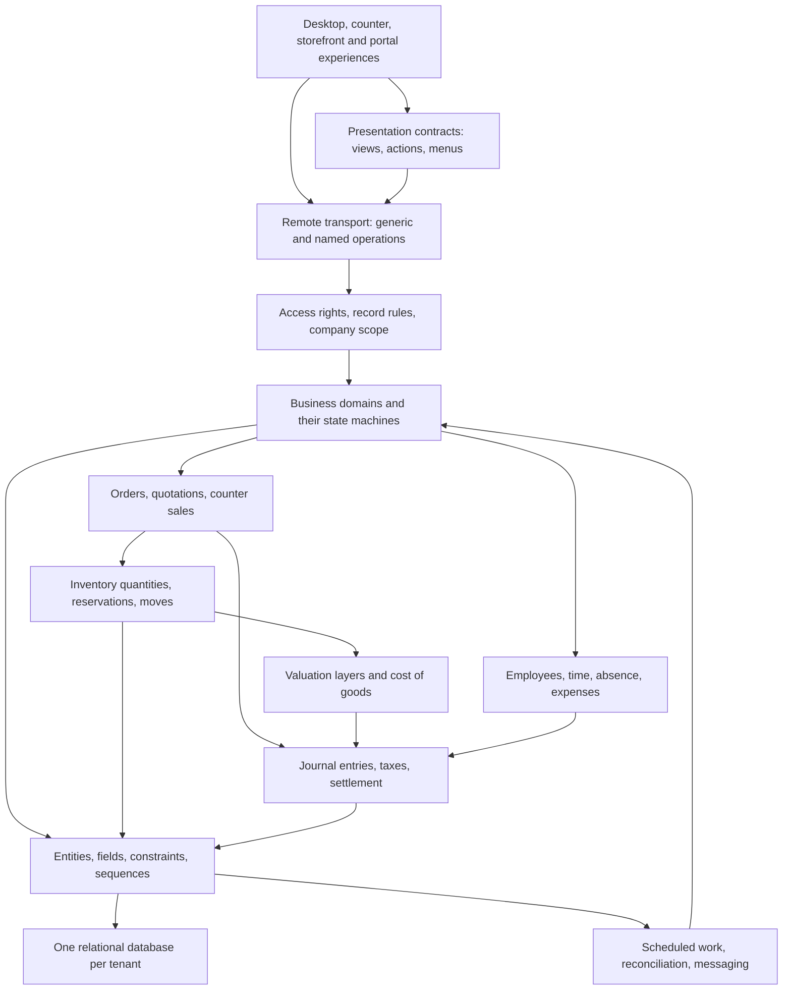

# Enterprise Resource Planning System: Language-Neutral Rebuild Specification

This repository specifies a mature, integrated enterprise resource planning system through its observable decisions, records, calculations, permissions, transactions and business consequences. It is written for an independent rebuild, and it assumes no implementation language, no framework, no database product, no hosting arrangement and no prior knowledge of the system it describes.

The intended outcome is **behavioural equivalence**. A replacement written in Go, Rust, PHP, C++, Java or any other language must make the same business decisions, persist the same records, produce the same financial consequences, enforce the same state transitions and validations, and offer the same operational capabilities.

The repository is licensed under the [Apache License, Version 2.0](LICENSE).

## Architecture at a glance

One business event usually changes several of these layers at once. A confirmed sale reserves stock, plans a delivery, later consumes a valuation layer, recognises revenue and a cost, moves a receivable, and can settle a payment against it. Reproducing screens and tables without those combined effects does not produce an equivalent system. The combined effects are traced end to end in [cross-domain transactions](docs/domains/cross-domain-transactions.md).

## Start here

| Purpose | Reading path |
|---|---|
| Understand what is specified and how to read it | This file, then the [documentation index](docs/README.md) and the [documentation rules](docs/references/documentation-rules.md) |
| Understand the platform | [Architecture](docs/overview/architecture.md), [entity and field system](docs/overview/entity-and-field-system.md), [inheritance and extension](docs/overview/inheritance-and-extension.md), [security model](docs/overview/security-model.md) |
| Understand the data | [Domain model](docs/data/domain-model.md), [identity and values](docs/data/persistence-identity-and-values.md), [physical data catalogue](docs/data/physical-data-catalog.md) |
| Rebuild the calculations | [Mathematics catalogues](schemas/mathematics/README.md), then the `calculations.md` file of each domain |
| Rebuild the money | [General ledger](docs/domains/general-ledger/), [taxes](docs/domains/taxes/), [receivables](docs/domains/accounts-receivable/), [payables](docs/domains/accounts-payable/), [payments and reconciliation](docs/domains/payments-and-bank-reconciliation/), [multi-currency](docs/domains/multi-currency/), [financial reporting](docs/domains/financial-reporting/) |
| Rebuild the goods | [Products](docs/domains/products-and-catalog/), [units and packaging](docs/domains/units-of-measure-and-packaging/), [inventory operations](docs/domains/inventory-operations/), [valuation and costing](docs/domains/inventory-valuation-and-costing/), [replenishment](docs/domains/replenishment-and-procurement/), [manufacturing](docs/domains/manufacturing/) |
| Rebuild the user and service behaviour | [Interfaces](docs/interfaces/README.md) and [runtime semantics](docs/runtime/README.md) |
| Plan and verify an implementation | [Build sequence](docs/reimplementation/build-sequence.md), [milestones](docs/reimplementation/milestones.md), [conformance profiles](docs/reimplementation/conformance-profiles.md), [equivalence test plan](docs/reimplementation/equivalence-test-plan.md) |
| Judge the evidence and what is still uncertain | [Coverage and evidence](docs/reimplementation/coverage-and-evidence.md) |
| Look up one entity, route, report or rule | [References](docs/references/README.md) |
| Generate code or tests from structured facts | [Machine-readable catalogues](schemas/README.md) |

## Definition of compatibility

A rebuild is compatible when the same supported operation, given the same inputs, the same configuration, the same prior records, the same acting identity and the same effective date, produces the same accept-or-reject decision, the same persisted facts, the same state transitions, the same amounts and quantity consequences, and the same externally visible completion or failure.

Compatibility is semantic, not textual. Screen layouts, wording of labels and the internal arrangement of code are not part of it. Stored identifiers are: storage names, transport names, route paths, stored selection values, external identifiers and sequence codes are reproduced exactly in code font throughout this specification, because a replacement that must exchange data, honour existing integrations or import an existing database depends on them. Every reproduced identifier is given its full name in words where it first appears.

Where the described behaviour is genuinely ambiguous, the specification states the industry-standard resolution explicitly and marks it as an **industry-standard default** so that a reader can tell a derived decision from an observed one. An observed behaviour is never silently replaced by a convention.

## Business capability map

| Group | Domain | Capabilities |
|---|---|---|
| Platform | [Identity and access](docs/domains/identity-and-access/) | Users, groups, privileges, access rights, record rules, multi-company scope, passwords, two-factor sign-in, passkeys, delegated sign-in, directory sign-in, sign-up, portal access, application keys, privacy and data recycling |
| Platform | [Contacts and organisations](docs/domains/contacts-and-organizations/) | Parties, companies, addresses, bank accounts, banks, currencies, countries, languages, industries, tags, enrichment, postal mail |
| Platform | [Messaging and activities](docs/domains/messaging-and-activities/) | Threads, messages, followers, notifications, field tracking, activities and plans, templates, mail gateway, channels, live chat, text messages, digests |
| Platform | [Automation and integration](docs/domains/automation-and-integration/) | Automation rules, server actions, webhooks, metered services, import and export, cloud storage, connected devices |
| Platform | [Spreadsheets and dashboards](docs/domains/spreadsheets-and-dashboards/) | Collaborative spreadsheet documents, data-bound tables and charts, business formulas, dashboards |
| Accounting | [General ledger](docs/domains/general-ledger/) | Chart of accounts, journals, entries and items, posting, numbering, reversal, lock dates, inalterability, reconciliation core |
| Accounting | [Accounts receivable](docs/domains/accounts-receivable/) | Customer invoices, credit notes, receipts, payment terms, early discounts, cash rounding, sending, portal payment |
| Accounting | [Accounts payable](docs/domains/accounts-payable/) | Vendor bills, refunds, debit notes, bill capture, automatic posting, cheque printing |
| Accounting | [Taxes](docs/domains/taxes/) | Tax engine, distribution, groups, grids, deferred exigibility, fiscal positions, withholding, number validation |
| Accounting | [Payments and bank reconciliation](docs/domains/payments-and-bank-reconciliation/) | Payments, methods, statements, reconciliation models, partial and full matching, structured references |
| Accounting | [Multi-currency](docs/domains/multi-currency/) | Currencies, rates, conversion, foreign-currency items, exchange differences |
| Accounting | [Analytic accounting](docs/domains/analytic-accounting/) | Plans, accounts, distributions, distribution models, analytic lines |
| Accounting | [Financial reporting](docs/domains/financial-reporting/) | Report engine, expression engines, statements, tax closing, audit trail |
| Accounting | [Electronic invoicing and document exchange](docs/domains/electronic-invoicing-and-document-exchange/) | Structured document formats, sending and receiving, the exchange network, certificates |
| Accounting | [Fiscal localisations](docs/domains/fiscal-localizations/) | Country charts, taxes, fiscal positions, statutory reports, identification formats, filing obligations |
| Supply chain | [Products and catalogue](docs/domains/products-and-catalog/) | Products, variants, attributes, categories, barcodes, expiry, matrices, combinations, documents |
| Supply chain | [Units of measure and packaging](docs/domains/units-of-measure-and-packaging/) | Units, conversion, packagings, package types, the quantity matrix |
| Supply chain | [Inventory operations](docs/domains/inventory-operations/) | Warehouses, locations, operation types, transfers, moves, quantities, batches, packages, waves, counts |
| Supply chain | [Inventory valuation and costing](docs/domains/inventory-valuation-and-costing/) | Valuation layers, costing methods, automatic entries, landed costs, cost of goods sold |
| Supply chain | [Replenishment and procurement](docs/domains/replenishment-and-procurement/) | Routes, rules, reordering rules, the scheduler, lead times, drop shipping |
| Supply chain | [Purchasing](docs/domains/purchasing/) | Requests for quotation, orders, receipts, bill control, agreements |
| Supply chain | [Manufacturing](docs/domains/manufacturing/) | Bills of materials, orders, work orders, work centres, subcontracting, costing |
| Supply chain | [Repair and maintenance](docs/domains/repair-and-maintenance/) | Repair orders, equipment, corrective and preventive requests |
| Supply chain | [Delivery and shipping](docs/domains/delivery-and-shipping/) | Delivery methods, carriers, rate rules, labels, tracking, pickup points |
| Sales | [Pricing and price lists](docs/domains/pricing-and-pricelists/) | Price lists, rules, discount policy, vendor prices, margins |
| Sales | [Sales](docs/domains/sales/) | Quotations, orders, invoicing policies, advance payments, templates, teams, configurator |
| Sales | [Loyalty and promotions](docs/domains/loyalty-and-promotions/) | Programmes, rules, rewards, coupons, gift cards, stored value |
| Sales | [Point of sale](docs/domains/point-of-sale/) | Configurations, sessions, orders, payments, restaurant service, self-ordering, terminals |
| Sales | [Customer relationship management](docs/domains/customer-relationship-management/) | Leads, opportunities, stages, scoring, assignment, campaign tracking |
| Sales | [Payment providers](docs/domains/payment-providers/) | Providers, methods, saved instruments, transactions, capture and refund |
| Sales | [Website and storefront](docs/domains/website-and-storefront/) | Sites, pages, catalogue, cart, checkout, wish lists, comparison, forum, blog, portal |
| People | [Human resources core](docs/domains/human-resources-core/) | Employees, employment versions, departments, positions, skills, organisation chart, presence |
| People | [Time off](docs/domains/time-off/) | Absence types, requests, allocations, accrual plans, public holidays |
| People | [Attendances and working time](docs/domains/attendances-and-working-time/) | Working schedules, resources, attendances, overtime |
| People | [Work entries](docs/domains/work-entries/) | Entry types, generation from schedules and absences, conflicts |
| People | [Recruitment](docs/domains/recruitment/) | Positions, candidates, applications, stages, public job pages |
| People | [Expenses](docs/domains/expenses/) | Expenses, reports, approval, posting, reimbursement, rebilling |
| People | [Fleet](docs/domains/fleet/) | Vehicles, models, contracts, services, odometers, costs |
| People | [Meal ordering](docs/domains/lunch-ordering/) | Suppliers, products, orders, balances, alerts |
| Services | [Projects and tasks](docs/domains/projects-and-tasks/) | Projects, tasks, stages, dependencies, recurrence, milestones, sharing, profitability |
| Services | [Timesheets](docs/domains/timesheets/) | Time records, validation, billing from time, cost and progress |
| Marketing | [Events](docs/domains/events/) | Events, tickets, registrations, stands, sessions, attendance |
| Marketing | [Marketing and mass mailing](docs/domains/marketing-and-mass-mailing/) | Lists, mailings, sending, statistics, split tests, suppression, link tracking |
| Marketing | [Learning, questionnaires and recognition](docs/domains/learning-surveys-and-gamification/) | Questionnaires, scoring, certification, courses, achievements, reputation |
| Communication | [Calendar and scheduling](docs/domains/calendar-and-scheduling/) | Events, attendees, recurrence, reminders, external synchronisation |

## Documentation index

| Folder | Content |
|---|---|
| [`docs/overview/`](docs/overview/README.md) | Architecture, package system, entity and field system, inheritance and extension, security model, views and actions, messaging model, design principles |
| [`docs/data/`](docs/data/README.md) | Domain model, identity and value rules, physical data catalogue, data loading and exchange, reference data |
| [`docs/domains/`](docs/domains/README.md) | One folder per business domain, each with the same eleven documents, plus the cross-domain transaction traces |
| [`docs/interfaces/`](docs/interfaces/README.md) | Desktop workflows, endpoint catalogue, external integrations, remote transport contracts, printable documents and exports, service layer |
| [`docs/runtime/`](docs/runtime/README.md) | Request lifecycle, transactions and concurrency, caching, scheduled jobs, notification bus, mail gateway, attachments, report rendering, translation, background work |
| [`docs/references/`](docs/references/README.md) | Generated reference pages for every entity, and index pages for routes, views, actions, menus, reports, jobs, sequences, groups, access, validation messages, reference data and capability packages |
| [`docs/reimplementation/`](docs/reimplementation/README.md) | Build sequence, milestones, conformance profiles, equivalence test plan, traceability rules, coverage and evidence |
| [`schemas/`](schemas/README.md) | Machine-readable catalogues |

Every domain folder holds the same eleven documents, so a reader always knows where to look: `README.md` for scope and capabilities, `entities.md` for every field of every entity, `state-machines.md` for states and transitions, `workflows.md` for end-to-end procedures, `business-rules.md` for validations and invariants, `calculations.md` for formulas with worked examples, `accounting-effects.md` for the journal items produced, `configuration.md` for settings, sequences, groups and jobs, `interfaces.md` for menus, views, operations, routes and documents, `acceptance-criteria.md` for numbered scenarios, and `glossary.md` for the vocabulary.

## Machine-readable catalogues

Structured facts for tooling, code generation and test generation. Every catalogue is a document with a `catalog` header carrying its name, description and record count, and a `records` array.

| Folder | Content |
|---|---|
| [`schemas/data/`](schemas/data/README.md) | One document per entity; the entity index; relations; selection values; computed fields; declared constraints; the physical tables, indexes, foreign keys, table constraints, association tables and database sequences of a live installation; the fully resolved runtime registry; and the shipped reference data |
| [`schemas/interfaces/`](schemas/interfaces/README.md) | Routes, window actions, server actions, client actions, address actions, report actions, menus, per-entity view declarations, message templates and rendering templates |
| [`schemas/operational/`](schemas/operational/README.md) | Scheduled jobs, sequences, groups, privileges, package categories, access rights, record rules, system parameters, decimal precisions, message subtypes and activity types |
| [`schemas/mathematics/`](schemas/mathematics/README.md) | Every calculation that carries money, quantity, time or a rate, with named operands, preconditions, ordered procedure, formula, rounding rule, edge cases and worked examples |
| [`schemas/source-artifacts/`](schemas/source-artifacts/README.md) | Capability packages, their dependency graph and their contents; country chart templates |
| [`schemas/source-file-distribution/`](schemas/source-file-distribution/README.md) | Inventory of every file in this repository with its purpose, domain, size and line count |
| [`schemas/traceability/`](schemas/traceability/README.md) | The entity name dictionary, the capability-to-entity map, the entity-to-document map, the acceptance-to-workflow map and the coverage record |

## Reimplementation sequence

The order below respects the dependencies between layers. Each step has an acceptance gate in [milestones](docs/reimplementation/milestones.md).

1. Platform foundation: the entity registry, field types, inheritance, record sets, the filter grammar, the unit of work, transactions, caching, sequences, external identifiers, data loading and translation.
2. Identity and access: users, groups, privileges, access rights, record rules, company scope, sessions and authentication.
3. Presentation contracts and transport: views, actions, menus, the generic operations, routes, attachments and report rendering.
4. Messaging and activities: threads, messages, followers, notifications, tracking, activities, the mail gateway and scheduled work.
5. Master data: parties and companies, currencies, countries and languages, units of measure and packaging, products and the catalogue, price lists.
6. Money: the general ledger, taxes, multi-currency, analytic accounting, receivables, payables, payments and reconciliation, financial reporting, then localisations and electronic exchange.
7. Goods: inventory operations, valuation and costing, replenishment, purchasing, delivery, manufacturing, repair and maintenance.
8. Commerce: sales, loyalty, point of sale, customer relationship management, payment providers, website and storefront.
9. People and services: human resources core, attendances, absence, work entries, recruitment, expenses, fleet, meal ordering, projects and timesheets.
10. Remaining capabilities: calendar, events, marketing, learning and questionnaires, spreadsheets and dashboards, automation and integration.

## Coverage and evidence

The structural baseline of this specification is measured, not estimated. The counts below come from parsing the complete definition of the system and from introspecting a live installation with every capability package present.

| Measure | Count |
|---|---|
| Capability packages catalogued | 620 |
| Entities catalogued | 983 |
| Fields declared across entities | 14,028 |
| Fields resolved at run time, after every extension | 23,235 |
| Persistent tables in a full installation | 1,240 |
| Columns across those tables | 13,518 |
| Indexes | 2,933 |
| Foreign keys | 4,575 |
| Unique and check constraints | 296 |
| Association tables for many-to-many relations | 422 |
| Relational fields mapped | 3,985 |
| Computed fields with declared dependencies | 3,979 |
| Selection fields with enumerated values | 853 |
| Operations catalogued on entities | 18,344 |
| Validation and error messages captured verbatim | 2,539 |
| Routes exposed over the transport | 1,023 |
| View declarations | 3,671 |
| Window actions | 978 |
| Menus | 893 |
| Printable report definitions | 94 |
| Scheduled jobs | 93 |
| Security groups | 140 |
| Access rights | 1,933 |
| Record rules | 576 |
| Shipped reference data sets | 155 |
| Country chart template data sets | 1,078 |

Cataloguing an entity or an operation is not the same as having specified every decision it makes, and specifying a decision is not the same as having checked its arithmetic against a running system. [Coverage and evidence](docs/reimplementation/coverage-and-evidence.md) separates those three measures and records what remains uncertain. Consult it before making an equivalence claim.

## Documentation rules

These rules are binding on every file in this repository and are stated in full, with their rationale, in [documentation rules](docs/references/documentation-rules.md).

1. No product names, vendor names, source file paths, programming languages, framework names or code of any kind.
2. No acronyms or abbreviations in prose, headings or labels. Reproduced identifiers are the sole exception and always carry their full name in words.
3. Only current behaviour. No deprecated paths, no upgrade procedures, no historical notes, no deployment or hosting guidance.
4. Every formula states its rounding rule, its precision and its evaluation order, and carries a worked numeric example.
5. Every state machine lists all states, all transitions, their guards and their side effects.
6. Every validation states its condition and its exact message.
7. Every event that produces journal items lists each item with its account selection rule, its side, its amount formula, its currency handling and its reconciliation behaviour.
8. Every domain carries numbered acceptance criteria in Given, When and Then form with concrete numbers.
9. Behaviour that the system leaves implicit is stated explicitly and marked as an industry-standard default.
10. Cross-references are relative links inside this repository. Nothing refers to material outside it.
