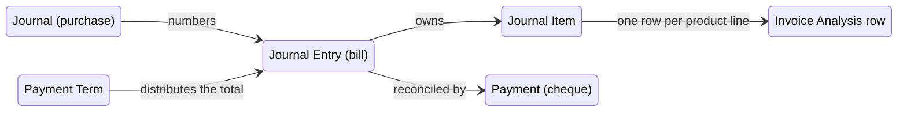

# Accounts Payable — Entities

This file describes every entity that participates in the payable side of the accounting system. For entities that are shared with other domains (the journal entry, the journal item, the journal, the payment, the partner, the company) only the fields that are payable-specific or that behave differently on a payable document are described in full; the rest is specified in `../general-ledger/entities.md`, `../accounts-receivable/entities.md` and `../payments-and-bank-reconciliation/entities.md`.

Throughout this folder, *bill* means a Journal Entry whose type is `in_invoice` (vendor bill), *vendor credit note* or *refund* means type `in_refund`, and *purchase receipt* means type `in_receipt`. The three together are the **purchase document types**. Where a statement holds for all three, the text says "purchase document".

---

## 1. Journal Entry (`account.move`, table `account_move`) — the purchase document

### 1.1 Purpose

A Journal Entry is the single entity that represents both an accounting entry and a commercial document. When its type is one of the purchase types it additionally carries the commercial layer of a vendor bill: the supplier, the supplier's own document reference, the bill date, the payment terms, the due date, the supplier bank account to pay to, and a set of product lines. Posting it turns the commercial layer into balanced journal items.

### 1.2 Lifecycle

1. **Created** in `draft`, either manually, by copying, by uploading a file, by electronic mail, by a decoder, or by an upstream purchasing document.
2. **Enriched**: partner, reference, dates, lines. Dynamic lines (tax lines, payable term lines, rounding lines, non-deductible lines) are recomputed at every save.
3. **Posted**: the document receives a number from the journal sequence, the lines become immutable in the accounting sense, and the balance invariant is enforced.
4. **Paid** in whole or in part by reconciling the payable term lines against outgoing payments or against a vendor credit note.
5. Optionally **reset to draft**, **cancelled**, or **reversed** by a vendor credit note.

### 1.3 Document type field

| Value | Label | Direction | Reversal partner | Sign of `direction_sign` |
|---|---|---|---|---|
| `in_invoice` | Vendor Bill | outbound (the company owes) | `in_refund` | +1 |
| `in_refund` | Vendor Credit Note | inbound (the supplier owes) | `in_invoice` | −1 |
| `in_receipt` | Purchase Receipt | outbound | `in_refund` | +1 |

The direction predicates are defined exhaustively as:

- **inbound types**: `out_invoice`, `in_refund`, and, when receipts are included, `out_receipt`.
- **outbound types**: `in_invoice`, `out_refund`, and, when receipts are included, `in_receipt`.
- **purchase types**: `in_invoice`, `in_refund`, and, when receipts are included, `in_receipt`.

`direction_sign` is +1 for a miscellaneous entry and for every outbound document, and −1 otherwise. It is the multiplier that converts a positive commercial price into a signed accounting balance.

### 1.4 Field table — fields that matter on a purchase document

| Field (storage name) | Type | Meaning and rules |
|---|---|---|
| `name` | text | The document number. Computed from the journal sequence, writable, stored, not copied, tracked, trigram-indexed. Placeholder `/` while the document is a draft that has never been posted. Unique per journal among posted entries whose name is not `/` — violation message: *Another entry with the same name already exists.* On a purchase journal whose separate refund sequence flag is set, vendor credit notes are numbered from a distinct prefix (see `configuration.md`). |
| `ref` | text | **Vendor reference** — the number the supplier printed on their own document. Free text, not copied, tracked, trigram-indexed. A partial index exists over this column restricted to rows whose type is `in_invoice` or `in_refund`, because duplicate detection searches it constantly. It is the primary key of duplicate detection (see `calculations.md` §4) and, on a purchase document with no payment reference, it becomes the label of the payable term line. |
| `date` | date | The **accounting date**: the date at which the entry hits the ledger. Required, indexed, computed with a writable override, not copied, tracked. Default: derived from the bill date, shifted forward past any violated lock date (see `calculations.md` §2.3). |
| `invoice_date` | date | The **bill date**: the date the supplier issued the document. Indexed, not copied. It is the reference date from which payment term due dates are computed. **Required to post a purchase document** — see `business-rules.md` §3.4. On a sale document the system fills it with today's date at posting; on a purchase document it refuses to guess. |
| `invoice_date_due` | date | The **due date** shown on the document. Computed from the generated term lines as the *latest* maturity date among them, stored, writable, indexed, not copied. If there are no term data it falls back to its previous value and then to today. |
| `delivery_date` | date | Stored, writable, pre-computed; the base package computes nothing and shows it only on sale documents. Localisation packages populate it. |
| `taxable_supply_date` | date | Stored, writable, pre-computed; the base package computes nothing and never shows it. Localisation packages populate it. |
| `state` | selection | `draft` / `posted` / `cancel`. Required, read-only, not copied, tracked, default `draft`. See `state-machines.md` §1. |
| `move_type` | selection | See §1.3. Required, read-only, tracked, indexed, default `entry`. Changing it after a number has ever been assigned is refused. |
| `journal_id` | many-to-one → Journal | Required, company-checked, computed with a writable override, stored, pre-computed. Restricted by a domain to the journals suitable for the document type; for a purchase document that means journals of type *purchase*. |
| `company_id` | many-to-one → Company | Computed from the journal, writable, stored, indexed. |
| `partner_id` | many-to-one → Partner | The **vendor**. Writable, tracked, company-checked, indexed, restrict on delete. Required to post (see `business-rules.md` §3.3). |
| `commercial_partner_id` | many-to-one → Partner | The commercial entity of the vendor (the top of the contact hierarchy). Computed, stored, read-only, restrict on delete. Used by duplicate detection and copied onto every accountable journal item at posting. |
| `partner_bank_id` | many-to-one → Partner Bank Account | The **supplier bank account the bill will be paid to**. Computed with a writable override, stored, company-checked, tracked, indexed when not null, restrict on delete. Selection algorithm in `calculations.md` §3. |
| `bank_partner_id` | many-to-one → Partner | Technical: the partner whose bank accounts are offered. For an outbound document it is the vendor; for an inbound document it is the company partner. |
| `fiscal_position_id` | many-to-one → Fiscal Position | Computed with a writable override, stored, pre-computed, company-checked, restrict on delete. For a purchase receipt the company's *default purchase receipt fiscal position* wins outright; otherwise the position is detected from the vendor and the delivery address. |
| `invoice_payment_term_id` | many-to-one → Payment Term | Computed with a writable override and an inverse, stored, pre-computed, company-checked. On a purchase document the default is the vendor's **vendor payment term** property; if the vendor has none, the current value is kept. |
| `invoice_line_ids` | one-to-many → Journal Item | The subset of `line_ids` whose display type is `product`, `line_section`, `line_subsection` or `line_note`. Not copied (the full `line_ids` collection is copied instead). |
| `line_ids` | one-to-many → Journal Item | Every journal item, dynamic ones included. Copied. |
| `needed_terms` | binary (transient map) | Computed, not exportable. The map from *(document, maturity date, discount date)* to *(company amount, foreign amount, discount data)* that the payable term lines must match. See `calculations.md` §5. |
| `needed_terms_dirty` | boolean | Computed alongside the above; signals the synchronizer that term lines must be rebuilt. |
| `currency_id` | many-to-one → Currency | Required, computed with a writable override and an inverse, stored, pre-computed, tracked. |
| `invoice_currency_rate` | float, no fixed precision | The rate from company currency to document currency actually used by the document. Computed, stored, pre-computed, writable, not copied. |
| `expected_currency_rate` | float, no fixed precision | Computed, not stored: the rate the system would pick for the document date. Used to detect that the user overrode the rate. |
| `amount_untaxed` | monetary | Sum of the document-currency amounts of product, rounding and non-deductible-product lines, multiplied by `direction_sign`. Computed, stored, read-only, tracked. |
| `amount_tax` | monetary | Same but over tax, non-deductible-tax and tax-bearing rounding lines. Computed, stored, read-only. |
| `amount_total` | monetary | `amount_untaxed + amount_tax` in effect: the signed sum of all non-term lines times `direction_sign`. Computed, stored, read-only, with an inverse that lets the quick-encoding flow set it. |
| `amount_residual` | monetary | Minus `direction_sign` times the sum of the residual amounts of the term lines, in document currency. Computed, stored. Positive while the bill is unpaid. |
| `amount_untaxed_signed`, `amount_tax_signed`, `amount_total_signed`, `amount_residual_signed` | monetary in company currency | The same quantities in company currency with the ledger sign (negative of the summed balances; for a bill the total signed amount is therefore **negative**). |
| `amount_untaxed_in_currency_signed`, `amount_total_in_currency_signed` | monetary in document currency | The document-currency counterparts with the ledger sign. |
| `amount_total_words` | text | Computed, not stored: `amount_total` rendered in words in the user's language, with every comma removed. See `calculations.md` §7. |
| `payment_state` | selection | `not_paid` / `in_payment` / `paid` / `partial` / `reversed` / `blocked` / `invoicing_legacy`. Computed, stored, read-only, not copied, tracked. See `state-machines.md` §2. |
| `status_in_payment` | selection | The payment status widened with `draft`, `posted`, `sent` and `cancel` for display. Computed, not copied. |
| `checked` | boolean | **Reviewed.** Computed with a writable override, stored, read-only in the sense that only authorised users may change it, tracked, not copied. Default computation: true when the entry is posted **and** (the journal is a miscellaneous journal **or** the current user is able to review). A partial index over the journal exists for rows where this flag is not true, so that the "to check" counters are cheap. See `state-machines.md` §3. |
| `auto_post` | selection | `no` / `at_date` / `monthly` / `quarterly` / `yearly`. Required, default `no`, not copied. |
| `auto_post_until` | date | Inclusive end of the recurrence. Computed with a writable override, stored, not copied. |
| `auto_post_origin_id` | many-to-one → Journal Entry | The first entry of a recurrence. Read-only, not copied, indexed when not null. |
| `duplicated_ref_ids` | many-to-many → Journal Entry | Computed, never stored: the documents that may be duplicates of this one. Depends on the vendor reference, the type, the partner, the bill date, the tax totals and the currency. Only records the reader is allowed to read are returned. |
| `is_draft_duplicated_ref_ids` | boolean | Computed: at least one of the detected duplicates is still a draft (so it can be deleted). |
| `is_exact_move_duplicate` | boolean | Computed: this is a purchase document and at least one detected duplicate matches it on reference **and** compatible type **and** partner **and** bill date **and** total. Drives the red rather than the amber warning. |
| `invoice_vendor_bill_id` | many-to-one → Journal Entry | Not stored, company-checked: a picker used to auto-complete the current draft from an earlier bill or refund. |
| `invoice_source_email` | text | The electronic mail address the document arrived from. Tracked. |
| `invoice_origin` | text | Free text naming the document(s) that generated this one. Read-only, tracked, not copied. Parsed on comma and whitespace boundaries by the purchase order matching hook. |
| `invoice_partner_display_name` | text | Computed, stored: the vendor's display name, used for grouping. |
| `is_manually_modified` | boolean | Set when a user edits a document that a decoder had filled. Consulted by the automatic-posting learning rule. |
| `quick_edit_mode` | boolean | Computed: true when the company's *quick encoding* setting covers this journal's type. For a purchase journal that means the setting is `in_invoices` or `out_and_in_invoices`. |
| `quick_edit_total_amount` | monetary | The tax-inclusive total the user types in quick encoding mode; the system then proposes one line that matches it. |
| `quick_encoding_vals` | structured value | Computed, not exportable: the proposed line. |
| `abnormal_amount_warning` | text | Computed: the warning text when the total is outside the historical bell curve for this vendor. Purchase documents only. |
| `abnormal_date_warning` | text | Computed: the warning text when the bill arrives earlier than the historical billing rhythm predicts. Purchase documents only. |
| `alerts` | structured value | Computed: the dictionary of banner alerts shown above the document. Keys, levels and texts in `interfaces.md` §5. |
| `narration` | rich text | Terms and conditions. Computed with a writable override, stored. |
| `invoice_cash_rounding_id` | many-to-one → Cash Rounding | The smallest coin rule to apply. |
| `invoice_incoterm_id`, `incoterm_location` | many-to-one → Incoterm, text | Computed with writable overrides, stored. The incoterm default from the company applies to outgoing documents only, so a bill starts empty. |
| `invoice_user_id` | many-to-one → User | Forced to empty on a purchase document (the salesperson concept does not apply). |
| `payment_reference` | text | The structured reference to quote when paying. Computed with a writable override and an inverse, stored, trigram-indexed, tracked, not copied. On a purchase document it is what the supplier asked to be quoted. |
| `preferred_payment_method_line_id` | many-to-one → Payment Method Line | Computed with a writable override, stored. On a bill it steers which outgoing method the payment register proposes. |
| `to_check` filter | — | There is no separate field: the "to check" state is the negation of `checked`. |
| `restrict_mode_hash_table` | boolean | Related to the journal: the journal secures posted entries with a hash chain. |
| `secured`, `inalterable_hash`, `secure_sequence_number` | boolean, text, integer | The hash chain markers. A secured entry can never be reset to draft. |
| `need_cancel_request` | boolean | Computed: the document was declared to an authority and must be cancelled through a request rather than reset to draft. The base package always computes false; localisations override. |
| `show_reset_to_draft_button` | boolean | Computed: whether the reset-to-draft button is offered. |
| `posted_before` | boolean | Not copied. True once the entry has ever been posted; drives the audit-trail protection and forbids switching the type. |
| `made_sequence_gap` | boolean | Stored housekeeping flag: this entry is the first one that broke the natural numbering. |
| `debit_origin_id` | many-to-one → Journal Entry | *(Debit Notes package.)* The document this debit note was raised against. Read-only, not copied, indexed when not null. |
| `debit_note_ids` | one-to-many → Journal Entry | *(Debit Notes package.)* The debit notes raised against this document. |
| `debit_note_count` | integer | *(Debit Notes package.)* Computed count of the above. |
| `reversed_entry_id` | many-to-one → Journal Entry | The document this one reverses. Read-only, not copied, indexed when not null, company-checked. |
| `reversal_move_ids` | one-to-many → Journal Entry | The reversals of this document. |
| `matched_payment_ids` | many-to-many → Payment | Payments explicitly linked to this document. Not copied. |
| `reconciled_payment_ids` | many-to-many → Payment | Computed and searchable: the payments actually reconciled with this document through partial reconciliations on its payable lines. |
| `payment_count` | integer | Computed with elevated privileges. |
| `attachment_ids` | one-to-many → Attachment | The files attached to this document. |
| `audit_trail_message_ids` | one-to-many → Message | The notification messages recording every tracked change. |
| `invoice_pdf_report_file`, `invoice_pdf_report_id` | binary, many-to-one → Attachment | The rendered printable document. Not copied. Detached on reset to draft **only for sale documents** — a bill keeps the supplier's own file. |
| `no_followup` | boolean | Computed with an inverse: excludes the document from follow-up reports by writing the same flag on its payable lines. |

### 1.5 Indexes declared on the document

| Index | Definition | Why |
|---|---|---|
| reviewed index | over the journal, restricted to rows where the reviewed flag is not true | the "to check" counters on the dashboard |
| payment index | over journal, state, payment status, type and date | payable and receivable ageing |
| unique number | over number and journal, restricted to posted rows whose number is not `/` | number uniqueness |
| journal and date | over journal and date; and over journal, company and date | ledger listings |
| gap index | over journal, state, payment status, type and date, restricted to rows that made a gap | gap detection |
| duplicate bills index | over the vendor reference, restricted to rows of type `in_invoice` or `in_refund` | duplicate detection |
| sanitized payment reference index | over the payment reference with every non-alphanumeric character removed | matching a bank narration to a bill |

### 1.6 Ordering, display name, copying, archival, multi-company

- **Ordering**: accounting date descending, then number descending, then bill date descending, then identifier descending.
- **Name search** additionally matches the number, the partner name and the vendor reference.
- **Display name**: the number; while the document is an unnumbered draft the placeholder is the draft label of its type — *Draft Bill*, *Draft Vendor Credit Note*, *Draft Purchase Receipt*.
- **Copying**: the number, the vendor reference, the payment reference, the bill date, the due date, the reviewed flag, the payment status, the posted-before flag, the sending data, the printable file, the reversal link and the debit-note link are **not** copied. The journal items are copied. A chatter note records the origin: *This entry has been duplicated from …*, or *This entry has been reversed from …* when the copy is a reversal, or *This debit note was created from: …* when the copy is a debit note.
- **Archival**: journal entries are not archivable; the lifecycle end state is `cancel`.
- **Multi-company**: the company is derived from the journal; accounts, journals, partners' bank accounts, fiscal positions and payment terms are all company-checked against it. Posting refuses accounts that belong to neither the company nor any of its parents.

---

## 2. Journal Item (`account.move.line`, table `account_move_line`) — on a purchase document

### 2.1 Purpose

A Journal Item is one line of the document. On a purchase document five kinds coexist, distinguished by the **display type**:

| Display type | Role on a purchase document |
|---|---|
| `product` | An expense line: what was bought, how much, at what price, with which taxes and to which expense account |
| `tax` | A tax line generated by the tax engine from the expense lines |
| `payment_term` | A payable term line: one instalment of the amount owed, on the payable account, with a maturity date |
| `rounding` | The cash rounding adjustment |
| `non_deductible_product`, `non_deductible_product_total`, `non_deductible_tax` | The private-share lines produced when an expense line is only partly deductible |
| `line_section`, `line_subsection`, `line_note` | Presentation-only lines carrying no amounts and no account |
| `epd`, `discount`, `cogs` | Early payment discount, discount allocation and cost-of-goods lines; produced by other domains |

### 2.2 Field table — fields that matter on a purchase document

| Field (storage name) | Type | Meaning and rules |
|---|---|---|
| `move_id` | many-to-one → Journal Entry | Required, read-only, indexed, cascade on delete, company-checked. |
| `display_type` | selection | Required, computed with a writable override, stored, pre-computed. On an invoice-like document the default computation yields `tax` when a source tax is set, `payment_term` when the account is receivable or payable, and `product` otherwise. |
| `account_id` | many-to-one → Account | Required for accountable lines (database check). Computed with a writable override and an inverse, stored, pre-computed, restrict on delete, company-checked, tracked. Domain excludes off-balance accounts. Selection algorithm in `calculations.md` §6. |
| `name` | text | The label. Computed with a writable override, stored, pre-computed, tracked. On a product line it is the product display name followed, for a purchase journal, by the product's **purchase description**. On a payable term line the label is derived from the payment reference and the vendor reference (see `calculations.md` §5.4). Never recomputed once the entry is hashed. |
| `partner_id` | many-to-one → Partner | Computed with a writable override and an inverse, stored, pre-computed, restrict on delete. Set to the document's commercial partner. Forced to the commercial partner on every accountable line at posting time. |
| `product_id` | many-to-one → Product | With an inverse, restrict on delete, company-checked, indexed. |
| `product_uom_id` | many-to-one → Unit of Measure | Computed with a writable override, stored, pre-computed, restrict on delete, restricted to the product's own unit and its allowed units. **On a purchase document the default is the unit of the first matching supplier record for the product and company, falling back to the product's reference unit.** |
| `quantity` | float, product-unit precision | Computed with a writable override, stored, pre-computed. Defaults to 1 on a product line; forced empty on other kinds. |
| `price_unit` | float, product-price precision | Computed with a writable override, stored, pre-computed. On a purchase document it is taken from the product's purchase price for the company, currency, date, fiscal position and unit. **Never recomputed when the line was captured by an importer** (see `is_imported`). |
| `discount` | float, discount precision | Default 0. A percentage. |
| `price_subtotal` | monetary in document currency | Computed, stored: the tax-excluded total of the line as returned by the tax engine. |
| `price_total` | monetary in document currency | Computed, stored: the tax-included total of the line. |
| `tax_ids` | many-to-many → Tax | Computed with a writable override, stored, pre-computed, company-checked, tracked. **On a purchase document the default is the product's supplier taxes filtered to the company; if the product has none, the purchase-typed taxes attached to the account.** Never recomputed on an imported line. Then remapped through the fiscal position. |
| `deductible_amount` | float | **Deductibility percentage**, default 100. Only meaningful on a product line of a purchase document. Constrained to the range 0 … 100 and constrained to be exactly 100 on any non-purchase document. Values below 100 generate the private-share lines. |
| `balance` | monetary in company currency | Computed with a writable override, stored, pre-computed, tracked. |
| `debit`, `credit` | monetary in company currency | Computed from the balance with inverses, stored, pre-computed. Exactly one of them is non-zero (database check: their product is zero except on presentation lines). |
| `amount_currency` | monetary in document currency | Computed with a writable override and an inverse, stored, pre-computed. Database check: it must carry the same sign as the balance. |
| `currency_id` | many-to-one → Currency | Required, computed with a writable override, stored, pre-computed. On an invoice-like document it is the document currency. |
| `currency_rate` | float | Computed, not stored: company currency to line currency. |
| `date_maturity` | date | The **due date of this instalment**. Indexed, tracked. Set only on payable term lines. |
| `discount_date` | date | Read-only, stored: last date at which the early payment discount may still be taken. |
| `discount_amount_currency`, `discount_balance` | monetary | Stored: the discounted amount to pay, in document and in company currency. |
| `payment_date` | date | Computed and searchable: the earlier of the discount date and the maturity date. |
| `amount_residual`, `amount_residual_currency` | monetary | Computed, stored: what is left unreconciled, in company and in document currency. |
| `reconciled` | boolean | Computed, stored. |
| `full_reconcile_id` | many-to-one → Full Reconciliation | Read-only, not copied, indexed when not null. |
| `matched_debit_ids`, `matched_credit_ids` | one-to-many → Partial Reconciliation | Read-only. |
| `matching_number` | text | Not copied, indexed. The full reconciliation name, or `P` while only partially reconciled, or a value beginning with `I` for imported matches. |
| `is_imported` | boolean | Technical: the line was captured automatically by an import or a decoder. Suppresses the recomputation of the unit price and of the taxes, and lets a line keep an archived account. |
| `analytic_distribution` | structured value | The percentage map; has an inverse that creates, updates and deletes analytic lines. |
| `tax_tag_ids` | many-to-many → Account Tag | The reporting grids the tax engine stamped on the line. Tracked. |
| `tax_repartition_line_id`, `tax_line_id`, `tax_group_id`, `tax_base_amount`, `group_tax_id` | — | The provenance of a tax line. |
| `no_followup` | boolean | Computed with an inverse, stored, writable. |
| `sequence` | integer | Computed with a writable override, stored, pre-computed. Dynamic lines get fixed sequence bands: tax lines 10000, rounding lines 11000, payable term lines 12000; everything else 100. This guarantees the printed and stored ordering of the document. |
| `term_key`, `epd_key`, `discount_allocation_key` and their *needed* and *dirty* companions | binary | The synchronization keys used to match existing dynamic lines against the recomputed requirement. |

### 2.3 Database-level constraints on a journal item

| Constraint | Condition | Message |
|---|---|---|
| credit and debit exclusivity | presentation line, or the product of debit and credit is zero | *Wrong credit or debit value in accounting entry!* |
| sign coherence | presentation line, or balance and amount in currency are both non-positive or both non-negative | *The amount expressed in the secondary currency must be positive when account is debited and negative when account is credited. If the currency is the same as the one from the company, this amount must strictly be equal to the balance.* |
| account required | presentation line, or the account is set | *Missing required account on accountable line.* |
| presentation lines carry nothing | not a presentation line, or amount in currency, debit and credit are all zero and no account is set | *Forbidden balance or account on non-accountable line* |

### 2.4 Indexes declared on the journal item

Over *(partner, vendor reference)*; over *(date descending, document number descending, identifier)*; over *(account, partner)* restricted to unreconciled rows; over the journal restricted to rows with a negative residual; over *(account, date)*.

---

## 3. Invoice Analysis Report (`account.invoice.report`, database view `account_invoice_report`)

### 3.1 Purpose

A read-only reporting entity presenting **one row per product line** of every customer invoice, vendor bill, credit note and receipt, with quantities converted to the product's reference unit, amounts signed so that sales are positive and purchases negative, and company-currency amounts converted into the currency of the active company. It is the single source of the *Invoices Analysis* and *Bills Analysis* pivot, graph and list views.

### 3.2 Row definition

The view is built from journal items joined to their journal entry, keeping exactly the rows that satisfy **all** of:

1. the entry type is one of `out_invoice`, `out_refund`, `in_invoice`, `in_refund`, `out_receipt`, `in_receipt`;
2. the line has an account;
3. the line's display type is `product`.

Tax lines, payable and receivable term lines, rounding lines, section, subsection and note lines are therefore excluded. The row identifier is the journal item identifier.

The join set is: the line; its partner; its product; its account; the product's template; the unit of the line; the unit of the template; the entry (inner join); the entry's commercial partner; and the **currency conversion table** keyed by the line's company.

### 3.3 The currency conversion table

The conversion table supplies one rate per company. It is built as follows.

- If all companies in the active company set share a single currency, a trivial table is produced with **rate 1** for each company. No temporary table is created.
- Otherwise a temporary conversion table is created for a single period ending **today**, holding one *current* rate per company. For every company whose currency equals the active company's currency the rate is **1**. For every other company the rate is

```formula
rate(company) = unit_factor(active_company_currency, today) ÷ rate_record(company_currency, latest record on or before today)
```

where `unit_factor` is the rate of the active company's own currency at that date and `rate_record` is the most recent stored rate for the other company's currency belonging to the root company or to no company. When no such record exists the rate is 1.

The effect is: *multiply a company-currency amount by this rate to express it in the active company's currency.*

### 3.4 Sign conventions

Two sign expressions are used. Let

```formula
purchase_sign = −1 when the entry type is in_invoice, out_refund or in_receipt, otherwise +1
```

```formula
inventory_sign = −1 when the entry type is out_invoice, in_refund or out_receipt, otherwise +1
```

`purchase_sign` makes ordinary sales positive and purchases and sales returns negative. `inventory_sign` is its complement and is used only for the inventory value column, where the stock leaves on a sale and enters on a purchase.

### 3.5 Unit conversion factor

Quantities are restated in the **reference unit of the product template** rather than in the unit typed on the line:

```formula
unit_factor = factor(line_unit) ÷ factor(template_unit)
```

If the line has no unit the numerator is 1. If the template has no unit, or its factor is zero, the whole expression is undefined and the resulting column is empty rather than zero.

### 3.6 Column by column

| Column (storage name) | Type | Computation |
|---|---|---|
| `move_id` | many-to-one → Journal Entry | The line's entry. Read-only. |
| `journal_id` | many-to-one → Journal | The line's journal. Read-only. |
| `company_id` | many-to-one → Company | The line's company. Read-only. |
| `company_currency_id` | many-to-one → Currency | The line's company currency. Read-only. |
| `partner_id` | many-to-one → Partner | Taken from the **entry**, not from the line: the vendor or customer as chosen on the document. Read-only. |
| `commercial_partner_id` | many-to-one → Partner | Taken from the **line's** partner, which posting forces to the commercial entity. Labelled *Main Partner*. |
| `country_id` | many-to-one → Country | The line partner's country; if that is empty, the entry's commercial partner's country. |
| `invoice_user_id` | many-to-one → User | The salesperson recorded on the entry. Empty on purchase documents. |
| `move_type` | selection | Restricted for display to the four values `out_invoice`, `in_invoice`, `out_refund`, `in_refund` (receipts still produce rows; they simply have no label in this selection). |
| `state` | selection | The entry state, relabelled for reporting: `draft` → *Draft*, `posted` → **Open**, `cancel` → *Cancelled*. |
| `payment_state` | selection | The entry payment status, with the same seven values as on the document. |
| `fiscal_position_id` | many-to-one → Fiscal Position | From the entry. |
| `invoice_date` | date | From the entry. This column is the record name and the default ordering key (descending). |
| `invoice_date_due` | date | From the entry. Labelled *Due Date*. |
| `product_id` | many-to-one → Product | From the line. |
| `product_uom_id` | many-to-one → Unit of Measure | **The reference unit of the product template**, not the unit of the line — because quantities have been converted into it. |
| `product_categ_id` | many-to-one → Product Category | The category of the product template. |
| `account_id` | many-to-one → Account | The line's account. Labelled *Revenue/Expense Account*. |
| `currency_id` | many-to-one → Currency | The line's currency, that is the document currency. |
| `quantity` | float | `line_quantity × unit_factor × purchase_sign`. Labelled *Product Quantity*. |
| `price_subtotal_currency` | float | `line_price_subtotal × purchase_sign`, in the **document** currency. Labelled *Untaxed Amount in Currency*. |
| `price_subtotal` | float | `−line_balance × conversion_rate`, in the **reporting** currency. Labelled *Untaxed Amount*. Note it is derived from the accounting balance, not from the commercial subtotal, so it is already signed by the ledger and only needs negating; and note it therefore silently includes any manual balance adjustment. |
| `price_total` | float | `line_price_total × purchase_sign ÷ document_currency_rate`. Labelled *Total*. Dividing by the document's own currency rate brings the tax-inclusive amount back into company currency. |
| `price_total_currency` | float | `line_price_total × purchase_sign`, in the document currency. Labelled *Total in Currency*. |
| `price_average` | float | See §3.7. Labelled *Average Price*; its default aggregation is an average, but that aggregation is overridden (see §3.8). |
| `price_margin` | float | See §3.9. Labelled *Margin*. |
| `inventory_value` | float | See §3.10. Labelled *Inventory Value*. |

### 3.7 The average price column

```formula
price_average = − ( ( line_balance ÷ line_quantity ) × purchase_sign ÷ factor(line_unit) × factor(template_unit) ) × conversion_rate
```

evaluated as: divide the ledger balance by the quantity to get a per-unit balance; apply the purchase sign; restate it per **template** unit by dividing by the line unit factor and multiplying by the template unit factor; negate; then convert to the reporting currency. When the quantity is zero the inner expression is undefined and the whole column is taken as **0** before negation (an explicit coalesce), so the row contributes nothing rather than an error.

### 3.8 Aggregating the average price

Averaging an average per row is wrong. When the reporting engine is asked to aggregate the average price column it does **not** average the column; it evaluates instead

```formula
aggregated_average = sum( price_subtotal ) ÷ sum( quantity )
```

over the group, yielding zero when the summed quantity is zero. Both operands are the columns defined above, so the result is a genuine weighted average price per template unit in the reporting currency.

### 3.9 The margin column

The margin is meaningful only on sales. Let `cost` be the product's standard price **for the line's company** (the standard price is stored per company; a missing entry reads as 0).

```formula
converted_quantity = line_quantity × factor(line_unit) ÷ factor(template_unit)
```

| Entry type | `price_margin` |
|---|---|
| any purchase type (`in_invoice`, `in_refund`, `in_receipt`) | 0 |
| `out_refund` | `conversion_rate × ( −line_balance + converted_quantity × cost )` |
| `out_invoice`, `out_receipt` | `conversion_rate × ( −line_balance − converted_quantity × cost )` |

So on a sale the margin is revenue minus cost; on a sales return the cost comes back in, so it is added.

### 3.10 The inventory value column

```formula
inventory_value = conversion_rate × line_quantity × factor(line_unit) ÷ factor(template_unit) × inventory_sign × cost
```

It is the value of the goods that moved, at standard cost, signed so that a purchase increases it and a sale decreases it.

### 3.11 Dependencies that force the view to be re-read

The report declares that it depends on: the entry's number, state, type, partner, salesperson, fiscal position, bill date, due date, payment term, recipient bank and currency rate; the line's quantity, subtotal, total, residual, balance, amount in currency, entry, product, unit, account, journal, company, currency and partner; the product's template and standard price; the template's category; the unit's factor and name; the currency rate's currency and date; and the partner's country.

### 3.12 Ordering and naming

Ordered by bill date descending. The record name is the bill date. No records can be created, written or deleted: the entity is a database view.

---

## 4. Payment (`account.payment`, table `account_payment`) — the cheque fields

Only the fields added by the Check Printing Base package are specified here; the payment entity itself belongs to `../payments-and-bank-reconciliation/entities.md`.

| Field (storage name) | Type | Meaning and rules |
|---|---|---|
| `check_amount_in_words` | text | **Amount in Words.** Stored, computed from the payment method line, the currency and the amount. Empty when there is no currency. Algorithm in `calculations.md` §7. |
| `check_manual_sequencing` | boolean | Related to the journal's *Manual Numbering* flag: the cheque stationery is **not** pre-printed with numbers, so the system assigns them. |
| `check_number` | text | **Cheque Number.** Stored, not copied, computed with an inverse. Presented to the user as read-only in every view (the field description is forced read-only). Constrained to digits only, and to be unique per bank journal among posted payments. |
| `show_check_number` | boolean | Computed: the payment method code is `check_printing` **and** a cheque number exists. Controls visibility. |
| `check_layout_available` | boolean | Not stored; default computed once: true when the company's cheque layout selection offers more than the single value `disabled`. When false the *Print Check* button is hidden. |
| `payment_method_line_id` | many-to-one → Payment Method Line | Re-declared with an index, because the cheque queues filter on it constantly. |
| `is_sent` | boolean | *(Defined by the core payment entity.)* Used here as "the cheque has been printed". |

Computation of `check_number`:

- If the journal uses **manual numbering** and the payment method code is `check_printing`, the field shows the *next* value the journal's cheque sequence would produce, formatted with that sequence's padding. This is a preview; the number is only consumed at posting.
- Otherwise the field is empty (pre-printed stationery carries its own numbers, which the printing wizard records afterwards).

The inverse of `check_number` sets the journal cheque sequence's padding to the length of the number written, so that subsequent numbers keep the same width.

`check_amount_in_words` depends on the payment method line, the currency and the amount, and is recomputed whenever any of them changes.

The payment also contributes its cheque number to the **default label of the journal items it produces**: when a cheque number exists, the label is built as *Checks* followed by ` - ` followed by the cheque number, and then, if the payment carries a memo, `: ` followed by the memo. Without a cheque number the generic payment label applies.

Finally, `check_number` is declared a **synchronization trigger field**: changing it on a posted payment re-derives the labels of the payment's journal items.

---

## 5. Payment Method (`account.payment.method`, table `account_payment_method`) — the cheque method

The Check Printing Base package registers one method:

| Attribute | Value |
|---|---|
| Name | Checks |
| Code | `check_printing` |
| Payment type | outbound |
| Mode | `multi` — the method may be instantiated on several journals at once |
| Allowed journal types | bank only |

The method is added to the **default outbound methods of every newly created journal** for which it is available. On installation, a post-installation step creates a cheque sequence on every existing bank journal.

---

## 6. Journal (`account.journal`, table `account_journal`) — payable-relevant fields

| Field (storage name) | Type | Meaning and rules |
|---|---|---|
| `type` | selection | For payables the relevant values are `purchase` (numbers bills, refunds and receipts) and `bank` (issues cheques). |
| `is_self_billing` | boolean | **Self Billing**: the journal issues documents on the supplier's behalf. Invoices are then numbered with a separate sequence per partner, and the self-billing mail templates are used. |
| `default_account_id` | many-to-one → Account | For a purchase journal the default expense account. Seeded from the company's expense account, or from the product category's default expense account fallback. Used as the last-resort account for a line. |
| `non_deductible_account_id` | many-to-one → Account | **Private Share Account**: where the non-deductible part of mixed expenses is booked. Company-checked. |
| `refund_sequence` | boolean | Computed with a writable override: true by default for sale and purchase journals. When true, credit notes are numbered from their own sequence. |
| `debit_sequence` | boolean | *(Debit Notes package.)* Computed with a writable override: true by default for sale and purchase journals. When true, debit notes are numbered from their own sequence, prefixed with the letter `D`. |
| `alias_name` | text | The local part of the electronic mail address at which the journal receives documents. Only sale and purchase journals may have one; it is forced empty for other types. |
| `check_manual_sequencing` | boolean | *(Check Printing.)* **Manual Numbering**, default false. True means the stationery is blank and the system numbers the cheques. |
| `check_sequence_id` | many-to-one → Sequence | *(Check Printing.)* Read-only, not copied. The cheque numbering sequence. Created automatically for every journal that has none. |
| `check_next_number` | text | *(Check Printing.)* Computed with an inverse: the next number the cheque sequence would produce, formatted with its padding. Writing it moves the sequence forward. |
| `bank_check_printing_layout` | selection | *(Check Printing.)* A per-journal override of the company cheque layout. The selection is the company's layout selection **minus** the value `disabled`. |
| `restrict_mode_hash_table` | boolean | Secures posted entries with a hash chain; blocks resetting to draft. |
| `sequence_override_regex` | text | Overrides the numbering grammar; see `../general-ledger/`. |

The cheque sequence created for a journal has: name *«journal name»: Check Number Sequence*, **no-gap** implementation, padding 5, increment 1, and the journal's company.

---

## 7. Payment Term (`account.payment.term`, table `account_payment_term`)

### 7.1 Purpose

A payment term turns one document total into a list of *(due date, amount)* pairs, optionally with a single early payment discount. It is shared by receivables and payables; on a purchase document the vendor's own term applies.

### 7.2 Field table

| Field (storage name) | Type | Meaning and rules |
|---|---|---|
| `name` | text | Required, translatable. |
| `active` | boolean | Default true. Archiving hides the term without deleting it. |
| `note` | rich text | Translatable; printed on the document. |
| `line_ids` | one-to-many → Payment Term Line | Copied. Default: a single line of type *percent*, amount 100, zero days. |
| `company_id` | many-to-one → Company | Optional; when empty the term is shared. The company domain accepts the company and its parents. |
| `sequence` | integer | Required, default 10. Ordering key. |
| `currency_id` | many-to-one → Currency | Computed: the term's company currency, or the active company's currency. Used only by the preview. |
| `display_on_invoice` | boolean | Default true: show the instalment dates on the printed document. |
| `example_amount`, `example_date`, `example_invalid`, `example_preview`, `example_preview_discount` | — | Not stored. A live preview of the term. `example_amount` defaults to 1000; `example_date` defaults to the context date or today; `example_invalid` is true when the term has no lines. |
| `early_discount` | boolean | Enables the early payment discount. |
| `discount_percentage` | float | Default 2.0. Must be strictly positive when the discount is enabled. |
| `discount_days` | integer | Default 10. Must be strictly positive when the discount is enabled. Counted from the bill date. |
| `early_pay_discount_computation` | selection | Computed with a writable override, stored. Values: `included` — *On early payment* (the discount reduces the tax base only if the discount is taken); `excluded` — *Never* (the tax is never reduced); `mixed` — *Always (upon invoice)* (the tax is reduced immediately). The computed default depends on the company's country: Belgium → `mixed`, the Netherlands → `excluded`, anywhere else → `included`. |
| `fiscal_country_codes` | text | Computed: the comma-joined fiscal country codes of the relevant companies; used only to show or hide country-specific fields. |

### 7.3 Constraints

| Condition | Message |
|---|---|
| The sum of the amounts of the *percent* lines, rounded to the *Payment Terms* decimal precision, is not exactly 100 | *The Payment Term must have at least one percent line and the sum of the percent must be 100%.* |
| The discount is enabled and the term has more than one line | *The Early Payment Discount functionality can only be used with payment terms using a single 100% line. * |
| The discount is enabled and the percentage is not strictly positive | *The Early Payment Discount must be strictly positive.* |
| The discount is enabled and the day count is not strictly positive | *The Early Payment Discount days must be strictly positive.* |
| Deleting a term that at least one document still references | *Uh-oh! Those payment terms are quite popular and can't be deleted since there are still some records referencing them. How about archiving them instead?* |

### 7.4 Copying

Copying a payment term appends ` (copy)` to its name and copies its lines.

---

## 8. Payment Term Line (`account.payment.term.line`, table `account_payment_term_line`)

| Field (storage name) | Type | Meaning and rules |
|---|---|---|
| `payment_id` | many-to-one → Payment Term | Required, indexed, cascade on delete. |
| `value` | selection | Required, default `percent`. `percent` — *Percent*; `fixed` — *Fixed*. |
| `value_amount` | float, *Payment Terms* precision | Computed with a writable override, stored. For a percent line a ratio between 0 and 100; for a fixed line an amount in the document currency. Default computation: a fixed line gets 0; a percent line gets 100 minus the sum of the other percent lines already present. |
| `delay_type` | selection | Required, default `days_after`. The four values are listed in §8.1. |
| `nb_days` | integer | Computed with a writable override, stored. Default computation: when the line has no day count yet and the term already has more than one line, take the day count of the **line before last** and add 30; otherwise keep the current value. |
| `days_next_month` | text, at most two characters | Default `'10'`. Only used by the fourth delay type. |
| `display_days_next_month` | boolean | Computed: true exactly for the fourth delay type. |

Ordering: by identifier, that is, creation order. **The last line in that order is always the balance line**, whatever its declared type — see `calculations.md` §5.2.

### 8.1 The four delay types

| Value | Label | Due date formula, given the reference date and the day count |
|---|---|---|
| `days_after` | Days after invoice date | `reference_date + day_count` |
| `days_after_end_of_month` | Days after end of month | `last_day_of_month(reference_date) + day_count` |
| `days_after_end_of_next_month` | Days after end of next month | `last_day_of_month(reference_date + 1 month) + day_count` |
| `days_end_of_month_on_the` | Days end of month on the | see below |

For the fourth type, let *d* be `days_next_month` read as an integer (unreadable text is read as 1):

- if *d* ≤ 0: `last_day_of_month( reference_date + day_count )`;
- otherwise: `reference_date + day_count`, then advanced by one month, then forced to day-of-month *d*.

### 8.2 Constraints

| Condition | Message |
|---|---|
| A percent line whose amount is below 0 or above 100 | *Percentages on the Payment Terms lines must be between 0 and 100.* |
| `days_next_month` is not numeric (an optional leading minus aside) | *The days added must be a number and has to be between 0 and 31.* |
| `days_next_month` is numeric but outside 0 … 31 | *The days added must be between 0 and 31.* |

---

## 9. Business Document Import Mixin (`account.document.import.mixin`, abstract)

### 9.1 Purpose

The contract by which attachments become documents and are decoded into them. It is mixed into the journal entry, so every method described here is available on a bill.

### 9.2 The file-data record

The mixin never works on attachments directly; it converts them into **file-data records**, plain structures with these members:

| Member | Meaning |
|---|---|
| `name` | The file name |
| `raw` | The bytes |
| `mimetype` | The declared media type |
| `origin_attachment` | The stored attachment this file came from; for a top-level file it is the file itself |
| `attachment` | The stored attachment, or empty for a file extracted from inside another one and never stored |
| `xml_tree` | The parsed extensible-markup-language tree, when the file parses as one |
| `import_file_type` | A short format label; the base implementation recognises only `pdf` |
| `origin_import_file_type` | The format label of the origin attachment |
| `decoder_info` | Filled lazily: the decoder and its priority |

A file is parsed as an extensible-markup-language tree when its media type ends in `/xml`, or when it is declared as plain text and either its content sniffs as extensible markup language or its name ends in `.xml` — this second case exists because files received by electronic mail frequently arrive as plain text. Parse failures are logged and yield no tree rather than an error.

A file is recognised as a Portable Document Format file when `pdf` occurs in its media type or its name ends in `.pdf`.

### 9.3 Which attachments stay visible on the document

An attachment is attached to the document (and therefore listed in its chatter) only when it has no owning field and its media type is one of: comma-separated-values text, Portable Document Format, the two spreadsheet types of the office formats plus the open document spreadsheet, the two word-processing types plus the open document text, and the two presentation types plus the open document presentation. Everything else is detached — its owning model and identifier are cleared — so that the attachment list stays readable. Files that parse as an extensible-markup-language tree are also kept.

### 9.4 The decoder contract

A decoder is declared by answering, for a given file-data record, with a structure holding:

- **decoder** — the operation to run. It receives the document, the file-data record and a flag saying whether the document was just created. It answers **nothing** when decoding succeeded, or a **reason string** when it could not decode.
- **priority** — a number. A priority of zero means "not really able to decode".

The base implementation declares no decoder; concrete formats are added by the electronic-invoicing packages.

### 9.5 Methods

| Operation | Behaviour |
|---|---|
| Create records from attachments | Converts the attachments to file-data records, extracts embedded files, groups them (see §9.6), creates one empty document per group, moves the group's stored attachments onto it, posts *This document was created from the following attachment(s).* with those attachments, then decodes each group. A group that fails to extend its document gets the message *There was an error while importing the bill, you can find attached the incoming XML* |
| Extend with attachments | Resolves the decoder of every file, sorts them by *(has a decoder, priority)* descending and keeps only the first. If it has no decoder, or a priority of zero, nothing happens and a technical note is logged. Otherwise the decoder runs inside a roll-back-able transaction (see §9.7) |
| Unwrap attachments | For a Portable Document Format file, extracts every embedded file, converts it to a file-data record without a stored attachment, and repeats on the extracted files when recursion is asked for. Unreadable or encrypted containers are logged and yield nothing |
| Split an extensible-markup-language file on a tag | When the parsed tree holds more than one node with the given tag, produces one tree per node — each tree being the original with only that node kept — and stores every tree beyond the first as a new attachment named `«original name»_«index».«extension»` with the index starting at 2 |
| Similarity score | The size of the longest common substring of two file names |

### 9.6 The two grouping methods

**Group by origin attachment** (the default). Every file that was extracted from another file joins the group of that other file; every other file forms its own group. One document per group.

**Group into groups of mixed types** (used by the mail alias). The intent is: five Portable Document Format files are five bills, but one Portable Document Format file plus one image plus one extensible-markup-language file is a single bill delivered in three representations.

1. Resolve each file's decoder if it is not resolved yet.
2. Split the files into those that *are* their own origin (top-level files) and those that are not (embedded files).
3. Sort the top-level files by decoder priority, highest first.
4. For each in that order, place it in the first group that does **not** already hold a file of the same format label — where files with no format label never clash with each other. When several such groups exist, choose the one whose members have the **highest filename similarity** to the incoming file. When no such group exists, start a new group.
5. Then place each embedded file in the group that already holds a file with the same origin attachment; if there is none, start a new group.

### 9.7 The roll-back-able transaction

Because a decoder writes many fields at once and may break validations in unpredictable ways, it runs inside a guard that:

1. commits whatever was done before it, so that nothing already achieved is lost;
2. runs the decoder;
3. commits again immediately, so that any deferred database error surfaces while it is still possible to roll back;
4. on any error, rolls back and re-raises.

Outside of test execution this guard is active; during tests it is a no-operation so that the test transaction survives.

When the decoder answers with a reason, the document receives *Attachment «file name» not imported: «reason»*. When the decoder raises, the document receives, with elevated privileges, a three-part message: *Error importing attachment «descriptor»:*, then *This specific error occurred during the import:*, then the error text. The descriptor is `'«file name»' (type=«format»)` for a stored file and `'«file name»' (extracted from '«origin file name»', type=«format»)` for an embedded one. A redirecting warning is re-raised unchanged so that the user still gets the offered navigation.

---

## 10. Confirm Entries Wizard (`validate.account.move`, table `validate_account_move`)

Transient. Mass posting with acknowledgements.

| Field (storage name) | Type | Meaning and rules |
|---|---|---|
| `move_ids` | many-to-many → Journal Entry | The entries to post. Defaulted from the context: when the calling model is the journal entry, every selected entry in `draft` state; when it is the journal, every draft entry of that journal. |
| `force_post` | boolean | **Force**. Post entries dated in the future now instead of scheduling them. |
| `display_force_post` | boolean | Computed: at least one entry's accounting date — or, failing that, its bill date, or today — is later than today. |
| `force_hash` | boolean | **Force Hash**. Also post the entries whose journal secures entries with a hash. |
| `display_force_hash` | boolean | Computed: at least one entry belongs to a hash-securing journal. |
| `is_entries` | boolean | Computed: at least one selected document is a miscellaneous entry; switches the wording between *entries* and *invoices*. |
| `abnormal_date_partner_ids` | one-to-many → Partner | Computed: the partners of the entries carrying an abnormal-date warning. |
| `ignore_abnormal_date` | boolean | When set, those partners are marked as never warning about dates again. |
| `abnormal_amount_partner_ids` | one-to-many → Partner | Computed: the partners of the entries carrying an abnormal-amount warning. |
| `ignore_abnormal_amount` | boolean | When set, those partners are marked as never warning about amounts again. |

Failure at default time: when the calling model is neither the journal entry nor the journal, *Missing 'active_model' in context.*; when no draft entry with lines is found, *There are no journal items in the draft state to post.*

---

## 11. Autopost Bills Wizard (`account.autopost.bills.wizard`, table `account_autopost_bills_wizard`)

Transient. Offered after posting a bill whose vendor is eligible.

| Field (storage name) | Type | Meaning |
|---|---|---|
| `partner_id` | many-to-one → Partner | The vendor. |
| `partner_name` | text | Related to the vendor's name. |
| `nb_unmodified_bills` | integer | How many consecutive bills of that vendor were validated without any manual edit. |

Its three operations set the vendor's automatic posting policy to `always`, to `ask`, or to `never`.

---

## 12. Add Debit Note Wizard (`account.debit.note`, table `account_debit_note`)

Transient. Raises an additional charge linked to an existing document.

| Field (storage name) | Type | Meaning and rules |
|---|---|---|
| `move_ids` | many-to-many → Journal Entry | The source documents; the relation table is `account_move_debit_move`. Domain: posted documents only. |
| `date` | date | **Debit Note Date**. Required, default today. |
| `reason` | text | Free text appended to the reference. |
| `journal_id` | many-to-one → Journal | *Use Specific Journal*. When empty, the source document's journal is reused. |
| `copy_lines` | boolean | **Copy Lines**: reproduce the source lines on the debit note. Never honoured when the source is a credit note. |
| `move_type` | text | Computed: the common type of the sources, or empty when they differ. |
| `journal_type` | text | Computed: `purchase` when the common type is `in_refund` or `in_invoice`, otherwise `sale`. |
| `country_code` | text | Related to the source company's country code; used only to show country-specific fields. |

Default-time refusals: *You can only debit posted moves.*; *You can't make a debit note for an invoice that is already linked to a debit note.*; *You can make a debit note only for a Customer Invoice, a Customer Credit Note, a Vendor Bill or a Vendor Credit Note.*

---

## 13. Print Pre-numbered Cheques Wizard (`print.prenumbered.checks`, table `print_prenumbered_checks`)

Transient. Asked for when the stationery is pre-printed.

| Field (storage name) | Type | Meaning and rules |
|---|---|---|
| `next_check_number` | text | **Next Check Number**. Required. Must match digits only, otherwise *Next Check Number should only contains numbers.* |

The list of payments to renumber travels in the context rather than on the wizard.

---

## 14. Company (`res.company`, table `res_company`) — payable-relevant fields

| Field (storage name) | Type | Meaning and rules |
|---|---|---|
| `expense_account_id` | many-to-one → Account | The account used when validating a vendor bill; seeds a purchase journal's default account and the product category default. |
| `account_purchase_receipt_fiscal_position_id` | many-to-one → Fiscal Position | *Default Purchase Receipt Fiscal Position*. Wins outright over partner-based detection on a purchase receipt. |
| `autopost_bills` | boolean | *Auto-validate bills*, default **true**. The master switch for automatic posting of vendor bills. |
| `quick_edit_mode` | selection | *Quick encoding*: `out_invoices`, `in_invoices`, `out_and_in_invoices`. |
| `account_discount_expense_allocation_id` | many-to-one → Account | Separate account for expense discounts. |
| `restrictive_audit_trail` | boolean | Tracked. Prevents deletion of the change log, and therefore prevents deleting documents that were ever posted. |
| `price_difference_account_id` | many-to-one → Account | Holds the difference between standard and billed price in perpetual valuation. |
| `account_check_printing_layout` | selection | **Check Layout**, default `disabled` (*None*). Extended by country packages; each added value is the identifier of a printable-document definition. `disabled` switches cheque printing off. |
| `account_check_printing_date_label` | boolean | **Print Date Label**, default true. Print the date caption on the cheque; disable when the stationery already carries it. |
| `account_check_printing_multi_stub` | boolean | **Multi-Pages Check Stub**, default false. Continue the stub on further pages instead of cropping it. |
| `account_check_printing_margin_top` | float | **Check Top Margin**, default 0.25. |
| `account_check_printing_margin_left` | float | **Check Left Margin**, default 0.25. |
| `account_check_printing_margin_right` | float | **Right Margin**, default 0.25. |
| `account_interco_clearing_journal_id` | many-to-one → Journal | *(Intercompany package.)* **Intercompany Clearing Journal**; restricted to miscellaneous journals; company-checked. |
| `account_interco_payable_id` | many-to-one → Account | *(Intercompany package.)* **Intercompany Clearing Payable Account**; restricted to reconcilable payable accounts. |
| `account_interco_receivable_id` | many-to-one → Account | *(Intercompany package.)* **Intercompany Clearing Receivable Account**; restricted to reconcilable receivable accounts. |

---

## 15. Partner (`res.partner`, table `res_partner`) — payable-relevant fields

| Field (storage name) | Type | Meaning and rules |
|---|---|---|
| `property_account_payable_id` | many-to-one → Account | **Account Payable**. Company-dependent, company-checked, restricted to payable accounts, restrict on delete. The first candidate for the payable term line's account. |
| `property_supplier_payment_term_id` | many-to-one → Payment Term | **Vendor Payment Terms**. Company-dependent, company-checked. The default payment term of a purchase document. |
| `property_account_position_id` | many-to-one → Fiscal Position | Company-dependent. Steers tax and account substitution. |
| `property_outbound_payment_method_line_id` | many-to-one → Payment Method Line | Company-dependent; restricted to active journals and outbound methods of the company or its parents. |
| `debit` | monetary | Computed and searchable: **Total Payable** — what is owed to this vendor. Visible only to the invoicing and read-only accounting groups. |
| `supplier_rank` | integer | Not copied, default 0. Incremented by the number of purchase documents posted for the partner; also incremented for the commercial partner. Used to order vendors. |
| `supplier_invoice_count` | integer | Computed: *# Vendor Bills*. |
| `autopost_bills` | selection | **Auto-post bills**. Required, default `ask`. `always` — *Always*; `ask` — *Ask after 3 validations without edits*; `never` — *Never*. |
| `ignore_abnormal_invoice_date` | boolean | Company-dependent. Suppresses the abnormal-date warning for this vendor. |
| `ignore_abnormal_invoice_amount` | boolean | Company-dependent. Suppresses the abnormal-amount warning for this vendor. |
| `bank_ids` | one-to-many → Partner Bank Account | The candidate accounts to pay a bill to. |

When a partner is merged into another, the payable account, the receivable account, the fiscal position, both payment terms and the credit limit are among the fields carried over.

Creating a partner from a purchase document context sets its supplier rank to 1 when no rank was given.

---

## 16. Partner Bank Account (`res.partner.bank`) — payable-relevant behaviour

Only three aspects matter here.

- **Active flag**: an archived account may not be used on a document being posted.
- **Allow outgoing payment** (*trusted*): a company account that is not trusted blocks the posting of an **inbound** document. On a purchase document the account belongs to the supplier, so this rule does not fire; it is stated here because the same posting routine serves both directions.
- **Currency**: participates in the ranking of candidate accounts (see `calculations.md` §3).

---

## 17. Mail Alias (`mail.alias`) — as configured by a purchase journal

Only the aspects the payable domain determines are stated here; the alias entity belongs to `../messaging-and-activities/`.

| Aspect | Value set by a purchase journal |
|---|---|
| Target model | the Journal Entry |
| Local part (`alias_name`) | derived by the rule of `configuration.md` §3.2; forced empty for journals that are neither sale nor purchase |
| Defaults | company = the journal's company; document type = `in_invoice`; journal = the journal itself |
| Routing behaviour | a message with **no attachment** does not create a document; a bounce is sent instead (see `workflows.md` §3 step 3) |
| Uniqueness | at creation the local part is suffixed with `-«journal code»` when another alias in the same domain already uses it |
| Type change | changing the journal's type rewrites the alias defaults and the local part, unless the synchronisation is explicitly skipped |

The journal exposes a boolean saying whether the alias fields should be shown at all: they are shown only when at least one alias domain exists in the database.

---

## 18. Account (`account.account`) — payable-relevant aspects

| Aspect | Relevance to this domain |
|---|---|
| `account_type` = `liability_payable` | Exactly the payable term lines of a purchase document may sit on such an account, and exactly they carry a maturity date |
| `account_type` = `expense`, `expense_direct_cost`, `asset_fixed` | The account types offered when the system looks for the most frequently used account of a vendor |
| `internal_group` = `expense` | The group used by the quick-encoding account-and-taxes lookup for an outbound document |
| `reconcile` | A payable account must be reconcilable for a bill to be settled by reconciliation |
| `tax_ids` | The taxes an account suggests to a line that has no product; only the **purchase**-typed ones are used on a purchase document |
| `active` | An archived account blocks posting, except on a line marked imported |
| `currency_id` | An account that forces a secondary currency refuses a line whose currency is neither that one nor the company currency |
| `company_ids` | Posting refuses an account belonging to none of the document company's own or parent companies |
| `account_type` = `off_balance` | Such an account may not be mixed with others, may not carry taxes and may not be reconciled |

---

## 19. Fiscal Position (`account.fiscal.position`) — payable-relevant aspects

| Aspect | Relevance |
|---|---|
| detection | On a bill or a vendor credit note the position is detected from the vendor and the delivery address. On a **purchase receipt** the company's default purchase receipt position wins outright |
| tax mapping | Applied to the taxes proposed on every product line, and to the taxes used when adapting a product's purchase price |
| account mapping | Applied to the **payable** account chosen for the term line, and to the expense accounts read from a product |
| country | Together with the company's fiscal country it determines the document's tax country, which constrains which taxes the lines may carry |
| foreign tax registration | When the position declares one, its country becomes the document's tax country |

---

## 20. Attachment (`ir.attachment`) — payable-relevant aspects

| Aspect | Relevance |
|---|---|
| owning model and identifier | Written to the document for a file that qualifies to stay visible; cleared for one that does not |
| owning field | An attachment bound to a field (such as the printable document) is never treated as a free attachment |
| media type | Determines whether the file stays visible (see §9.3) and whether it is a Portable Document Format container to unwrap |
| raw bytes | The input of the decoder and of the tree parser |
| restrictive audit trail | An attachment of a document that has been posted before, in a company with the restrictive audit trail, is protected from deletion |

---

## 21. Relations between the entities of this domain

| From | Relation | To | Cardinality | On delete |
|---|---|---|---|---|
| Journal Entry | journal | Journal | many to one | restrict (a journal with entries cannot be deleted) |
| Journal Entry | partner | Partner | many to one | restrict |
| Journal Entry | commercial partner | Partner | many to one | restrict |
| Journal Entry | recipient bank account | Partner Bank Account | many to one | restrict |
| Journal Entry | payment term | Payment Term | many to one | blocked by an explicit refusal when documents reference it |
| Journal Entry | fiscal position | Fiscal Position | many to one | restrict |
| Journal Entry | lines | Journal Item | one to many | cascade |
| Journal Entry | reversed entry | Journal Entry | many to one | — |
| Journal Entry | debit origin | Journal Entry | many to one | — |
| Journal Entry | recurrence origin | Journal Entry | many to one | — |
| Journal Entry | matched payments | Payment | many to many, through `account_move__account_payment` with columns `invoice_id` and `payment_id` | — |
| Journal Item | document | Journal Entry | many to one | cascade |
| Journal Item | account | Account | many to one | restrict |
| Journal Item | product | Product | many to one | restrict |
| Journal Item | unit | Unit of Measure | many to one | restrict |
| Journal Item | taxes | Tax | many to many, through `account_move_line_account_tax_rel` with columns `account_move_line_id` and `account_tax_id` | — |
| Journal Item | originator tax distribution line | Tax Distribution Line | many to one | restrict |
| Journal Item | reporting grids | Account Tag | many to many | restrict |
| Journal Item | matched debits / credits | Partial Reconciliation | one to many | — |
| Journal Item | full reconciliation | Full Reconciliation | many to one | — |
| Payment Term | lines | Payment Term Line | one to many | cascade |
| Journal | cheque sequence | Sequence | many to one | — |
| Payment | payment method line | Payment Method Line | many to one | — |
| Invoice Analysis Report row | document, journal, company, partner, product, account, currency | the respective entities | many to one, read-only | — |

### 21.1 Diagram



---

## 22. Ordering summary

| Entity | Order |
|---|---|
| Journal Entry | accounting date descending, number descending, bill date descending, identifier descending |
| Journal Item | the document's order, then the line sequence; dynamic lines sort at fixed sequences 10000 (tax), 11000 (rounding) and 12000 (payable term) |
| Payment Term | sequence, then identifier |
| Payment Term Line | identifier — that is, **creation order**, which is what makes "the last line is the balance" well defined |
| Invoice Analysis Report | bill date descending |
| Stub lines on a cheque | grouped into Bills then Refunds, each group ordered by due date falling back to accounting date |
