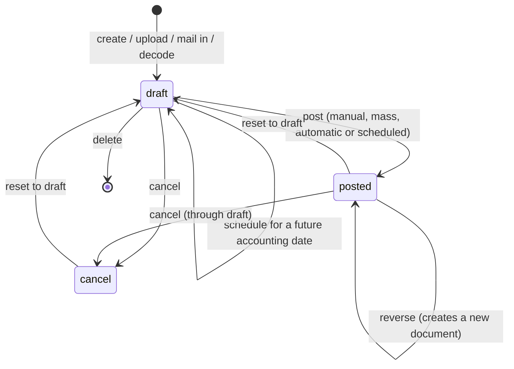
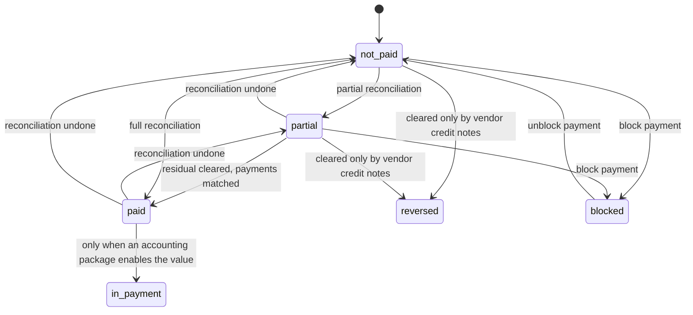
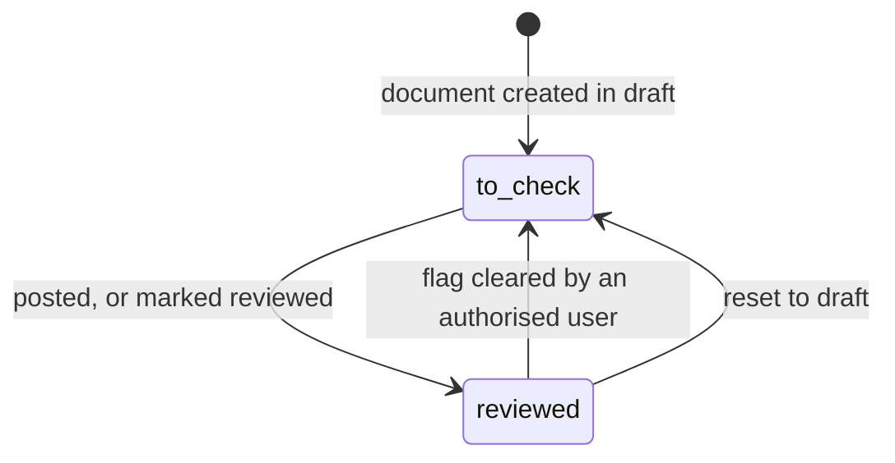
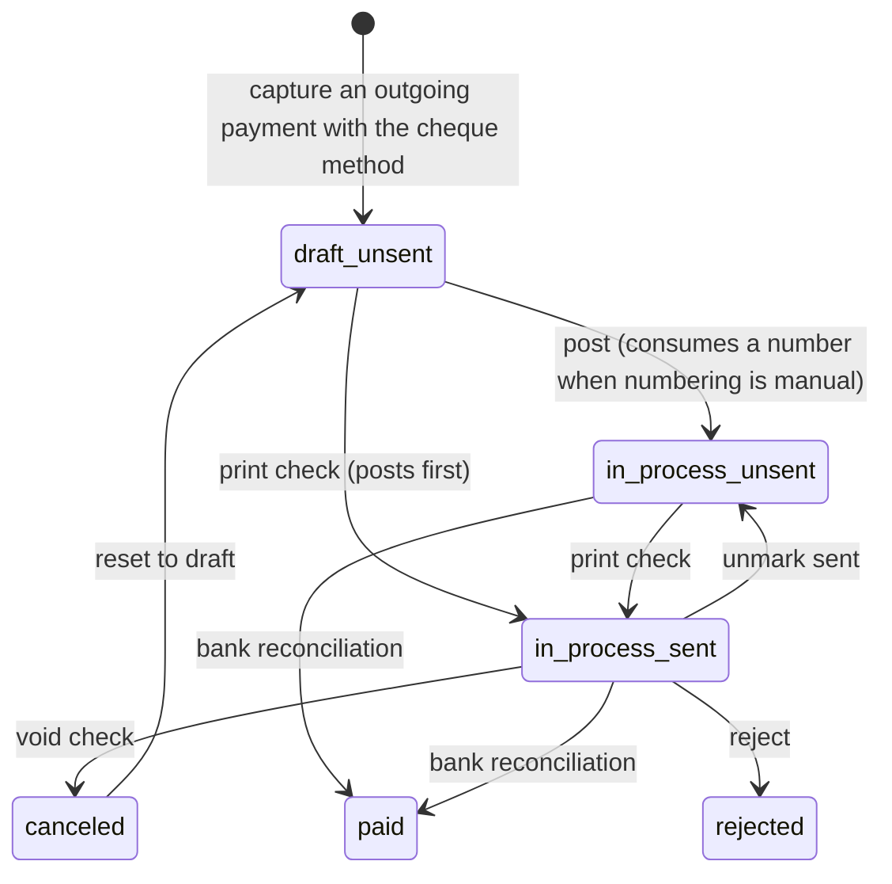
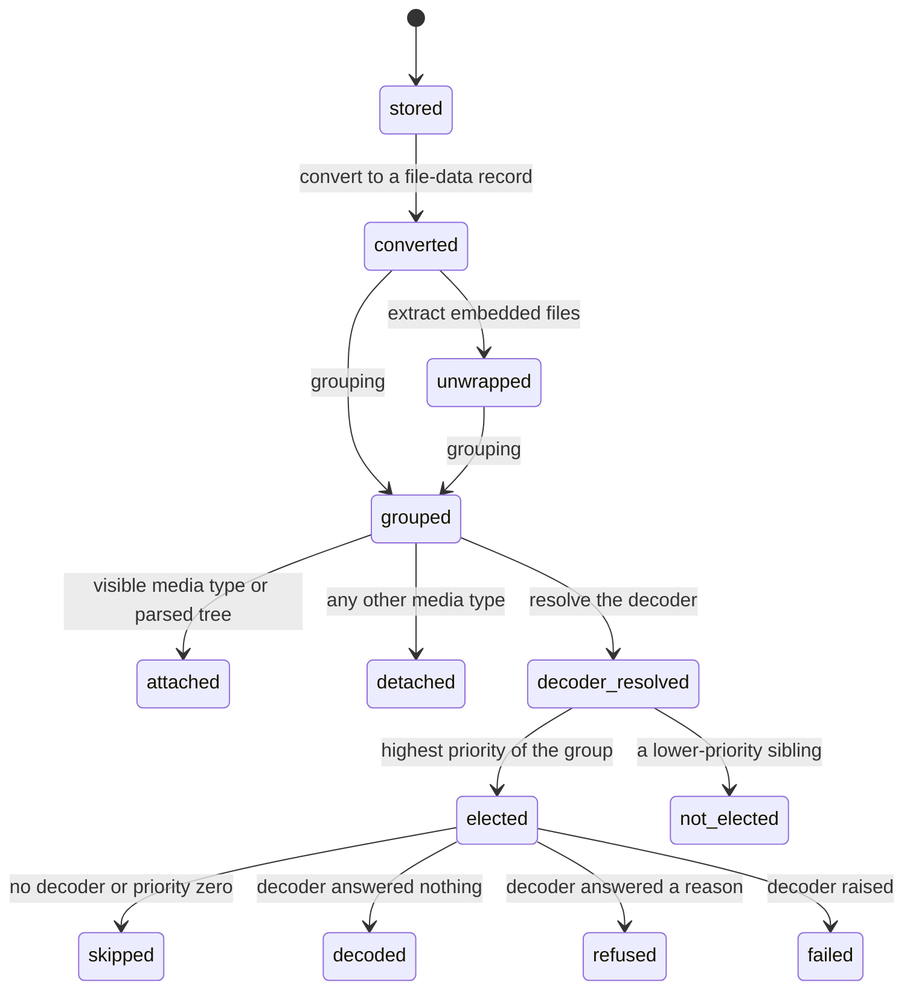

# Accounts Payable — State Machines

A purchase document carries **four** independent state fields, and the outgoing payment that settles it carries a fifth. They are:

1. the **document status** (`state`) — draft, posted, cancelled;
2. the **payment status** (`payment_state`) — how much of the document has been settled;
3. the **reviewed flag** (`checked`) — a two-valued state used by the "to check" queue;
4. the **automatic posting mode** (`auto_post`) — a scheduling state rather than a lifecycle state, but it gates a transition and is therefore specified here;
5. on the payment: the **payment status** (`state`) plus the **sent flag** (`is_sent`), which together form the cheque lifecycle.

---

## 1. Document status

### 1.1 States

| Value | Label | Meaning |
|---|---|---|
| `draft` | Draft | The document exists, may be edited freely, has no definitive number (its number is the placeholder `/` unless it has been posted before), and has no effect on any balance. Its dynamic lines are recomputed at every save. |
| `posted` | Posted | The document has a definitive number from its journal sequence, its journal items are part of the ledger, its balance invariant is enforced, and its payable term lines are available for reconciliation. |
| `cancel` | Cancelled | The document is void. Its journal items still exist but are excluded from the ledger. It keeps its number (so no gap appears in the sequence) and can only return to draft. |

Required, read-only to direct writes, not copied, tracked, default `draft`.

### 1.2 Transitions

| From | To | Trigger | Guards | Side effects |
|---|---|---|---|---|
| — | `draft` | Create | — | Sequence number left at `/`; dynamic lines computed on first save |
| `draft` | `posted` | Post (single, from the document) | All posting validations of `business-rules.md` §3 pass. The caller must belong to the invoicing group | See §1.3 |
| `draft` | `posted` | Post (mass, through the Confirm Entries wizard) | Same, plus: hash-securing entries are skipped unless *Force Hash* is ticked; future-dated entries are scheduled unless *Force* is ticked | See §1.3, plus the acknowledgements of `workflows.md` §9 |
| `draft` | `draft` with `auto_post` = `at_date` | Post with soft scheduling and an accounting date later than today | The caller chose soft posting (the default of the mass wizard) | The automatic posting mode is set to *At Date* if it was *No*; the chatter receives *This move will be posted at the accounting date: «date»* |
| `draft` | `posted` | Automatic posting of a vendor bill | The company allows automatic bill validation; the vendor's policy is *Always*; there is no abnormal-amount warning; the journal does not secure entries with a hash; **no duplicate was detected** | Posting; when a duplicate was detected instead, no posting occurs and the chatter receives *Auto-post was disabled on this invoice because a potential duplicate was detected.* |
| `draft` | `posted` | Scheduled automatic posting job | The accounting date has arrived | Posting, plus the copy of the next recurrence when the mode is periodic |
| `posted` | `draft` | Reset to draft | Not restricted by the hash rules; no hash on the entry; no cancellation request required; not an exchange difference entry; not a cash basis entry | See §1.4 |
| `cancel` | `draft` | Reset to draft | Same guards | See §1.4 |
| `posted` | `cancel` | Cancel | The entry passes the reset-to-draft guards first, because cancelling goes through draft | See §1.5 |
| `draft` | `cancel` | Cancel | — | See §1.5 |
| `draft` | *deleted* | Delete | The document may be unlinked (see §1.6) | Row removed |
| `posted` | *reversed* | Reverse | Posted; the reversal is a **new** document, the original stays posted | See `accounting-effects.md` §5 |

### 1.3 Side effects of posting a purchase document

In the order in which they occur:

1. The access check: the caller must hold the invoicing group, otherwise *You don't have the access rights to post an invoice.*
2. Every validation of `business-rules.md` §3 is collected; if any failed, all failures are raised together, one per line.
3. Analytic accounts that are archived abort the operation: *You cannot post an entry with an archived analytic account: «names»*.
4. Under soft posting, future-dated entries are split off and scheduled instead of posted.
5. For each entry to post: the violated lock dates are recomputed and the **accounting date is moved forward** to the first allowed date (see `calculations.md` §2.3).
6. Analytic lines are created in one batch from the analytic distributions.
7. For a recurring entry (automatic posting mode monthly, quarterly or yearly) the **next occurrence is copied**.
8. Every accountable line's partner is forced to the document's commercial partner.
9. Related draft cash-basis entries and exchange-difference entries reachable through the reconciliations of these lines are dragged into the same posting batch; cash-basis entries whose input values no longer match are deleted so the user must redo the reconciliation.
10. The status becomes `posted` and the posted-before flag becomes true. **The number is assigned by the sequence mechanism at this point.**
11. If any line of a vendor bill has a deductibility below 100 and the caller lacks the partial-deductibility group, that group is granted to the caller.
12. The private-share lines are relabelled with the document number: *«number» - private part* for the products total line and *«number» - private part (taxes)* for the tax line.
13. Reversal documents whose source is posted are reconciled against their source.
14. Lines marked for reconciliation are reconciled.
15. The vendor's supplier rank — and that of its commercial partner — is incremented by one per posted purchase document. For a miscellaneous entry the increment is driven by the presence of payable lines with a partner.
16. A document whose total is zero is immediately treated as paid.
17. After posting, the *autopost bills* learning wizard may open (see `workflows.md` §8.3).

### 1.4 Side effects of resetting to draft

1. Refusal when any selected entry is neither posted nor cancelled: *Only posted/cancelled journal entries can be reset to draft.*
2. Refusal when any selected entry requires a cancellation request: *You can't reset to draft those journal entries. You need to request a cancellation instead.*
3. Draftability checks, each raising immediately:
   - the entry is the exchange-difference entry of some reconciliation → *You cannot reset to draft an exchange difference journal entry.*
   - the entry is a cash-basis entry, or the cash-basis entry of a reconciliation that has since been undone → *You cannot reset to draft a tax cash basis journal entry.*
   - the entry carries an inalterability hash → *You cannot reset to draft a locked journal entry.*
4. The **next** occurrence of the same recurrence, if it exists and is still draft, is deleted.
5. Every analytic line of every journal item is deleted (without re-synchronising).
6. The status becomes `draft` and the sending data is cleared.
7. Attachments are detached **only for sale documents** — the printable file is renamed *«name» (detached by «user» on «date»)«extension»* and unhooked from its field so that it can be regenerated. A purchase document keeps its supplier file untouched.

The number is **not** cleared: the document keeps it, so re-posting reuses the same number and no gap appears.

### 1.5 Side effects of cancelling

1. Any selected entry that is posted is first reset to draft, with all the guards of §1.4.
2. Refusal when, after that, any entry is not draft: *Only draft journal entries can be cancelled.*
3. Every reconciliation of every journal item is removed.
4. Every payment whose entry this is becomes `canceled`.
5. The automatic posting mode is forced to `no` and the status becomes `cancel`.

### 1.6 Deletability

A document may be **unlinked** only when all of the following hold:

- it carries no inalterability hash;
- its accounting date is strictly later than the effective lock date for its journal;
- it is not a posted cash-basis entry (neither the entry of a reconciliation nor one created from an origin);
- it is not a posted exchange-difference entry.

When a caller asks to remove a batch of documents, each is classified:

| Classification | Condition | Action taken |
|---|---|---|
| Reverse | not unlinkable | a cancelling reversal is created and posted |
| Cancel | unlinkable but protected by the restrictive audit trail (it was posted before and the company enables that trail) | reset to draft if needed, then cancelled |
| Unlink | otherwise | reset to draft if needed, then deleted |

### 1.7 Diagram



---

## 2. Payment status

### 2.1 States

| Value | Label | Meaning on a purchase document |
|---|---|---|
| `not_paid` | Not Paid | Nothing has been reconciled against the payable term lines |
| `partial` | Partially Paid | Some reconciliation exists but a residual remains |
| `in_payment` | In Payment | The residual is zero but at least one settling payment has not yet been matched against a bank statement. **In the base package this value is never produced**: the hook that decides it answers `paid`. An accounting package overrides the hook to enable it |
| `paid` | Paid | The residual is zero and every settling payment is matched |
| `reversed` | Reversed | The residual is zero and the reconciliation was exclusively against documents of the mirror type (for a bill: vendor credit notes, optionally mixed with miscellaneous entries) |
| `blocked` | Blocked | The user has explicitly excluded the document from payment. Sticky: it is never recomputed away |
| `invoicing_legacy` | Invoicing App Legacy | A historical marker. Sticky: never recomputed |

Computed, stored, read-only, not copied, tracked.

### 2.2 The computation

Documents are first partitioned:

- entries whose current status is `invoicing_legacy` or `blocked` are **left alone**;
- entries that are not invoice-like, or are posted-and-not-invoice-like, or are drafts with a zero total, get `not_paid`;
- the rest — invoice-like documents that are either posted, or draft with a non-zero total — are **qualified** and computed.

For each qualified document the reconciliations of its lines are gathered from both directions of every partial reconciliation, and then **restricted to the partials that touch a receivable or payable line** of this document. For each such partial the system records: whether the counterpart entry is a payment, whether it is a bank statement line, the counterpart entry's type, and whether every counterpart payment is matched with a bank statement.

Then, in order:

1. If the residual amount is zero in the document currency:
   - and at least one counterpart is a payment or a statement line:
     - if **every** counterpart payment is matched → `paid`;
     - otherwise → the in-payment hook, which answers `paid` in the base package;
   - and no counterpart is a payment or a statement line → `paid`, **unless** the set of counterpart types indicates a pure reversal, in which case `reversed`. For a bill (`in_invoice` or `in_receipt`) the set must be exactly `{in_refund}` or `{in_refund, entry}`. For a vendor credit note the set must be exactly `{entry}`.
2. Else, if the document is posted and at least one linked payment has no journal entry of its own and is `in_process` → the in-payment hook.
3. Else, if any reconciliation exists at all → `partial`.
4. Else, if the document is posted and at least one linked payment has no journal entry of its own and is `paid` → the in-payment hook.
5. Else → `not_paid`.

### 2.3 Transitions

| From | To | Trigger |
|---|---|---|
| `not_paid` | `partial` | A partial reconciliation is created against a payable term line |
| `partial` | `paid` | The last residual is reconciled and every settling payment is matched |
| `not_paid` | `paid` | A single reconciliation clears the whole residual |
| `not_paid` or `partial` | `reversed` | The whole residual is cleared exclusively by vendor credit notes (and optionally miscellaneous entries) |
| `paid` or `partial` | `not_paid` or `partial` | A reconciliation is undone |
| any except `paid`, `in_payment` | `blocked` | The user toggles the payment block |
| `blocked` | `not_paid` | The user toggles the payment block off; the status is then scheduled for recomputation |

Blocking is refused on a document already paid or in payment: *You can't block a paid invoice.*

Registering a payment is refused on a blocked document: *You cannot register payments for blocked invoices.*; on a document that is not posted: *You can only register payment for posted journal entries.*; and on a miscellaneous entry: *You cannot register payments for miscellaneous entries.*

### 2.4 Diagram



---

## 3. Reviewed flag

### 3.1 States

| Value | Label | Meaning |
|---|---|---|
| false | *(to check)* | The document has been captured but nobody with review authority has confirmed it. It appears in the *To Check* queue and in the journal dashboard counter |
| true | Reviewed | Somebody with review authority has confirmed the document |

Computed with a writable override, stored, tracked, not copied.

### 3.2 The default computation

```formula
reviewed = ( status is posted ) and ( journal type is general or the current user is able to review )
```

The "able to review" predicate answers **true** in the base package; an accountant package narrows it to a group. The consequence in the base package is therefore: **a document becomes reviewed the moment it is posted**, and a document that is not posted is not reviewed. A purchase document that is imported and posted automatically is reviewed as well; the queue is populated only by documents that are still draft, or by documents whose flag was cleared by hand, or by installations where the review predicate is narrowed.

### 3.3 Transitions

| From | To | Trigger | Guard |
|---|---|---|---|
| false | true | Post | — |
| false | true | *Set as Reviewed* on the document, or the *Check* server action on a selection | Only entries in `posted` state are affected. The caller must be able to review, otherwise *You don't have the access rights to perform this action.* |
| true | false | Direct write of the flag | Same authority check |
| true | *reset* | Reset to draft | Refused when the caller cannot review: *Validated entries can only be changed by your accountant.* |

### 3.4 Diagram



---

## 4. Automatic posting mode

### 4.1 States

| Value | Label | Meaning |
|---|---|---|
| `no` | No | Nothing is scheduled |
| `at_date` | At Date | The entry will be posted by the scheduled job on its accounting date, once |
| `monthly` | Monthly | Posted on its accounting date, and a copy is created one month later |
| `quarterly` | Quarterly | As above, three months later |
| `yearly` | Yearly | As above, twelve months later |

Required, default `no`, not copied.

### 4.2 Transitions

| From | To | Trigger | Side effects |
|---|---|---|---|
| `no` | `at_date` | Soft posting of an entry dated in the future | Chatter note *This move will be posted at the accounting date: «date»*; the banner *This move is configured to be posted automatically at the accounting date: «date».* |
| any | any | Direct edit | A periodic mode adds the banner *«mode» auto-posting enabled. Next accounting date: «date».*, extended with *The recurrence will end on «date» (included).* when an end date is set |
| periodic | — | The entry is posted | The next occurrence is copied before posting completes |
| any | `no` | Cancel | Forced as part of cancelling |
| — | — | Reset to draft | The **next** occurrence, if still draft, is deleted |

Posting with hard (non-soft) scheduling an entry that is both scheduled and future-dated is refused: *This move is configured to be auto-posted on «date»*.

---

## 5. Cheque lifecycle

The cheque is not a separate entity: it is an outgoing payment whose method code is `check_printing`. Its lifecycle is the combination of the payment status and the sent flag.

### 5.1 Payment status values

| Value | Label | Meaning for a cheque |
|---|---|---|
| `draft` | Draft | The payment has been captured but not posted; no cheque number has been consumed |
| `in_process` | In Process | The payment is posted; the cheque is written and may be printed; the money has left the ledger's outstanding account but the bank has not confirmed it |
| `paid` | Paid | The liquidity line is fully reconciled — in practice, the bank statement carrying the cheque has been reconciled — or the outstanding account is a cash account, in which case posting goes straight to paid |
| `canceled` | Canceled | The cheque was voided |
| `rejected` | Rejected | The bank refused it |

The status is computed with a writable override: a payment that is `paid` or `in_process` is re-evaluated to `paid` when the sum of the residual amounts of its liquidity lines is zero in company currency, or when none of its liquidity accounts is reconcilable; and a payment that is `in_process` and whose reconciled invoices and bills are **all** paid also becomes `paid`.

### 5.2 The sent flag

| Value | Meaning |
|---|---|
| false | The cheque has not been printed. It appears in the *Checks to Print* filter and in the bank journal's *Checks to print* counter |
| true | The cheque has been printed. The document shows a *Sent* ribbon |

Read-only to direct writes from the interface; not copied.

### 5.3 Transitions

| From (status, sent) | To | Trigger | Guards | Side effects |
|---|---|---|---|---|
| (`draft`, false) | (`in_process`, false) | Post the payment | The recipient bank account must be trusted when the method requires one, otherwise *To record payments with «method name», the recipient bank account must be manually validated. You should go on the partner bank account of «partner» in order to validate it.* | **If the journal uses manual numbering and the method is the cheque method, the journal's cheque sequence is consumed and the number is written on the payment.** The journal items are created; their label becomes *Checks - «number»* possibly followed by *: «memo»* |
| (`draft`, false) or (`in_process`, false) | (`in_process`, true) | *Print Check* on a journal using **manual numbering** | At least one selected payment uses the cheque method and is not already sent; all selected payments share one bank journal | Drafts are posted first; the layout is resolved; the sent flag is set; the printable document is produced |
| (`draft`, false) or (`in_process`, false) | (`in_process`, true) | *Print Check* on a journal using **pre-printed stationery** | Same | The pre-numbered wizard opens, pre-filled with the highest existing cheque number of the journal plus one, padded to the same width. On confirmation: drafts are posted, the sent flag is set, then each payment in order receives a number starting from the entered one and incrementing by one, padded to the width of the entered number; then the printable document is produced and the browser closes the dialogue when the download completes |
| (`in_process`, true) | (`in_process`, false) | *Unmark Sent* | The method is the cheque method and the payment is sent | The sent flag is cleared, so the cheque re-enters the print queue and can be reprinted |
| (`in_process`, true) | (`canceled`, true) | *Void Check* | The method is the cheque method, the status is `in_process` and the cheque has been sent | The payment is reset to draft (which resets its journal entry to draft) and then cancelled (which removes every reconciliation, deletes the draft entry and sets the status to `canceled`). **The cheque number is retained on the record**, so the voided number is never reused: the uniqueness constraint only looks at posted entries, but the audit trail keeps the void visible |
| (`in_process`, *) | (`paid`, *) | The liquidity line is reconciled, typically at bank reconciliation | — | Status recomputed |
| (`in_process`, *) | (`rejected`, *) | Reject | — | Status set |
| (`in_process`, *) or (`paid`, *) | (`draft`, *) | Reset to draft | The journal entry must itself be draftable | The entry is reset to draft |

Printing refusals:

| Condition | Message |
|---|---|
| No selected payment uses the cheque method, or all of them have already been sent | *Payments to print as a checks must have 'Check' selected as payment method and not have already been reconciled* |
| The selected payments span more than one bank journal | *In order to print multiple checks at once, they must belong to the same bank journal.* |
| No cheque layout is configured, or it is `disabled` | *You have to choose a check layout. For this, go in Invoicing/Accounting Settings, search for 'Checks layout' and set one.* offered together with a navigation to the accounting configuration panel labelled *Go to the configuration panel* |
| The configured layout no longer resolves to a printable document | *Something went wrong with Check Layout, please select another layout in Invoicing/Accounting Settings and try again.* with the same navigation |

### 5.4 Diagram



---

## 6. Interaction between the four document-level machines

| Situation | Document status | Payment status | Reviewed | Automatic posting |
|---|---|---|---|---|
| A draft bill just uploaded | `draft` | `not_paid` (or `paid` when the total is zero) | false | `no` |
| A draft bill dated next month, soft-posted | `draft` | `not_paid` | false | `at_date` |
| A posted, unpaid bill | `posted` | `not_paid` | true | `no` |
| A posted bill partly settled by a cheque still in process | `posted` | `partial` | true | `no` |
| A posted bill fully settled | `posted` | `paid` | true | `no` |
| A posted bill fully offset by a vendor credit note | `posted` | `reversed` | true | `no` |
| A bill the treasurer refuses to pay for now | `posted` | `blocked` | true | `no` |
| A cancelled bill | `cancel` | the value it had, recomputed to `not_paid` because cancelling removed every reconciliation | unchanged | `no` |

Note that cancelling a document removes every reconciliation on its lines, which drives the payment status of **the counterpart documents** back to `partial` or `not_paid`.

---

## 7. The attachment and decoding lifecycle

Attachments are not a state field, but they move through a well-defined sequence of conditions that an implementation must reproduce. The states below are properties of a **file-data record** rather than stored values.

### 7.1 States

| State | Meaning |
|---|---|
| `stored` | The file exists as an attachment, owned by nothing in particular |
| `converted` | The file has been turned into a file-data record: its bytes, media type, parsed tree and format label are known |
| `unwrapped` | Every file embedded in it has been extracted and converted in turn; extracted files carry the container as their origin and have **no** stored attachment of their own |
| `grouped` | The file has been assigned to a group; one document will be created per group |
| `attached` | The file's media type (or its parsed tree) qualifies it to stay visible on the document; its owning model and identifier now point at that document |
| `detached` | The file did not qualify; its owning model and identifier have been cleared, so it no longer clutters the document |
| `decoder resolved` | A decoder and its priority are known, or it is known that none applies |
| `elected` | This is the highest-priority file of its group and will be the one decoded |
| `decoded` | The decoder ran and wrote onto the document |
| `refused` | The decoder answered a reason; nothing was written and the reason was posted |
| `failed` | The decoder raised; the transaction was rolled back and the error was posted |
| `skipped` | No decoder applied, or its priority was zero |

### 7.2 Transitions

| From | To | Trigger | Guard | Side effects |
|---|---|---|---|---|
| `stored` | `converted` | Any import entry point | — | The parsed tree is attempted; a parse failure is logged and yields no tree |
| `converted` | `unwrapped` | Any import entry point | The file is a Portable Document Format container | Each embedded file becomes a converted record with the container as origin; recursion continues |
| `converted` / `unwrapped` | `grouped` | Grouping | — | Either the origin rule or the mixed-types rule applies |
| `grouped` | `attached` | Fixing the document's attachments | The media type is one of the visible kinds, or the file parses as a tree | The owning model and identifier are written |
| `grouped` | `detached` | The same step | Otherwise | The owning model and identifier are cleared |
| `grouped` | `decoder resolved` | Decoding | — | The decoder and priority are computed once and cached on the record |
| `decoder resolved` | `elected` | Decoding | It sorts first by *(has a decoder, priority)* | — |
| `elected` | `skipped` | Decoding | No decoder, or priority zero | A technical log line |
| `elected` | `decoded` | Decoding | The decoder answered nothing | The document now carries the decoded values; the lines it created are marked imported |
| `elected` | `refused` | Decoding | The decoder answered a reason | *Attachment «file name» not imported: «reason»* |
| `elected` | `failed` | Decoding | The decoder raised anything but a redirecting warning | Roll back; the three-part error message |

### 7.3 Diagram



---

## 8. The duplicate-warning state

Also not a stored state, but a three-valued condition every implementation must reproduce on a purchase document.

| Condition | Value | What is shown |
|---|---|---|
| the duplicate set is empty | **none** | nothing |
| the duplicate set is non-empty and the exact flag is true | **exact** | the red banner, with the delete action when at least one duplicate is a draft |
| the duplicate set is non-empty, the exact flag is false, and the document is `draft` | **probable** | the amber banner, with the same conditional delete action |
| the duplicate set is non-empty, the exact flag is false, and the document is `posted` or `cancel` | **none** | nothing — a probable duplicate is only worth flagging while it can still be avoided |

The value is recomputed on every change to the vendor reference, the type, the partner, the bill date, the tax totals or the currency, and it is never stored.

Effect on the other machines: the **exact** and **probable** values both suppress automatic posting (see §1.2); neither ever blocks manual posting.

---

## 9. Summary of guards, by transition

| Transition | Guards, in the order they are evaluated |
|---|---|
| draft → posted | invoicing group; quick-encoding total matches; recipient bank account active; recipient bank account trusted for an inbound document; total not negative; vendor present; bill date present; account and journal coherence per line; not already posted or cancelled; at least one accountable line; not scheduled in the future under hard posting; journal active; currency active; no archived account; no cross-company account; no archived analytic account |
| posted → draft | posted or cancelled; no cancellation request needed; not an exchange-difference entry; not a cash-basis entry; not hashed; the reviewer authority when the document is reviewed |
| cancel → draft | the same |
| draft → cancel | (after the automatic reset) every selected document is draft |
| posted → reversed | posted; one company; the reversal journal has the same type |
| draft → deleted | not the middle of a numbering chain, unless the caller is an accounting manager or quick encoding is on; not posted before under a restrictive audit trail; the deletability rules of §1.6 |
| payment draft → in process | the recipient bank account is trusted when the method requires one |
| cheque unsent → sent | the cheque method; not already sent; one bank journal; a resolvable layout |
| cheque sent → cancelled | the cheque method; status in process; already sent; the underlying entry is resettable |
