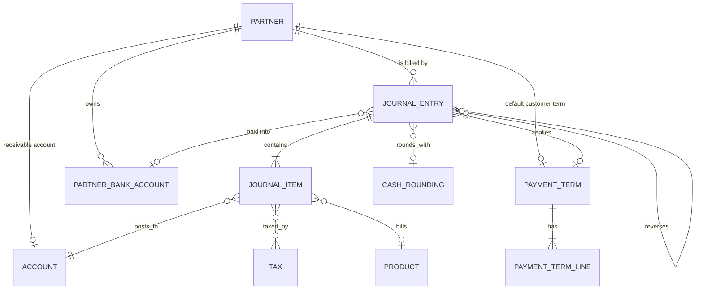

# Entities of the Accounts Receivable domain

This file defines every entity the domain owns or extends, field by field. The field tables use
three columns: the field with its storage name, its type, and its meaning together with every rule
attached to it (required, default, computed and from what, stored or not, readonly, copy behavior,
tracking, company scoping, indexing, deletion behavior and, for selections, every value with its
label).

Throughout this file:

- "Round to the document currency" means: round the number to the number of decimal places of the
  document currency using the rounding rule described in
  [`../multi-currency/calculations.md`](../multi-currency/calculations.md).
- "Company currency" is the currency of the company that owns the document.
- "Signed" on an amount means the amount carries the accounting sign (a debit is positive, a credit
  is negative) rather than the customer-facing sign.
- A field marked *computed and stored* is recomputed by the platform whenever one of its declared
  triggers changes, and its last computed value is persisted, so it can be searched and grouped.
- A field marked *computed, not stored* is recalculated on every read and cannot be searched unless
  an explicit search rule is given.

---

## 1. Journal Entry in its invoice role

Journal Entry (`account.move`, table `account_move`).

One record is at the same time the commercial document (the customer invoice, the credit note or the
sales receipt) and the accounting entry that document produces. There is no separate invoice table.
The discriminator is the document type field `move_type`.

The generic journal entry mechanics — posting, numbering through the sequence mixin, the lock dates,
the inalterability hash chain, the audit trail, the balance invariant — belong to the ledger domain
and are specified in [`../general-ledger/entities.md`](../general-ledger/entities.md). What follows
is the complete receivable-facing definition.

### 1.1 Purpose

- Represent a claim on a customer, expressed as a list of billed items plus taxes, and as a set of
  journal items whose receivable side carries the due dates.
- Carry the totals that the sales domain, the reporting domain and the partner credit computation
  read.
- Carry the delivery state (has the document been sent to the customer) and the settlement state
  (has the claim been paid).

### 1.2 Lifecycle

1. **Created** in the draft status, either by a user, by the sales domain when an order is invoiced,
   by the portal when a customer pays, or by a scheduled recurring-entry job.
2. **Edited** freely while draft. Every write re-runs the dynamic line synchronisation described in
   [`calculations.md`](calculations.md).
3. **Posted**: the document receives its number, its journal items become part of the ledger, the
   analytic lines are created, and the receivable lines become reconcilable.
4. **Settled** progressively as payments are reconciled against the receivable lines; the payment
   status moves from not paid to partially paid to in payment or paid.
5. **Reversed** by a credit note, or **cancelled**, or **reset to draft** when the rules allow it.

### 1.3 Document type values

The field `move_type` (document type) is required, readonly in the interface, tracked in the message
thread, indexed, default `entry`, and participates in default-value propagation. Its values:

| Value | Label | Belongs to this domain | Direction | Reverse type |
| --- | --- | --- | --- | --- |
| `entry` | Journal Entry | No (ledger) | outbound convention | `entry` |
| `out_invoice` | Customer Invoice | Yes | inbound (money comes in) | `out_refund` |
| `out_refund` | Customer Credit Note | Yes | outbound (money goes out) | `out_invoice` |
| `in_invoice` | Vendor Bill | No (payable) | outbound | `in_refund` |
| `in_refund` | Vendor Credit Note | No (payable) | inbound | `in_invoice` |
| `out_receipt` | Sales Receipt | Yes | inbound | `out_refund` |
| `in_receipt` | Purchase Receipt | No (payable) | outbound | `in_refund` |

Derived predicates used everywhere in this specification:

| Predicate | True when |
| --- | --- |
| is a sale document | type is `out_invoice` or `out_refund`; when receipts are included, also `out_receipt`. |
| is a purchase document | type is `in_invoice` or `in_refund`; when receipts are included, also `in_receipt`. |
| is an invoice | is a sale document or is a purchase document (receipts optionally included). |
| is inbound | type is `out_invoice`, `in_refund` or `out_receipt`. Money is expected to come in. |
| is outbound | type is `in_invoice`, `out_refund` or `in_receipt`. Money is expected to go out. |
| is an entry | type is `entry`. |

**Direction sign** (`direction_sign`): computed, not stored, from the document type. It is `+1` when
the type is `entry` or when the document is outbound; it is `−1` otherwise (that is, for every
inbound document: customer invoice, sales receipt, vendor credit note). It converts a customer-facing
price into an accounting balance.

### 1.4 Field table — identification and accounting placement

| Field (storage name) | Type | Meaning and rules |
| --- | --- | --- |
| Number (`name`) | text | The document number. Computed and stored, with a manual override (the user may type a number). Not copied when duplicating. Tracked. Indexed with a trigram index for partial search. Computation: records are processed sorted by accounting date, then by reference, then by internal identifier. A cancelled document is skipped. If the document has never been posted and its current number does not match its accounting date period, the number is cleared. If the document has an accounting date, has no number (or the placeholder `/`), and is not draft, the next number of the sequence is taken. See [`calculations.md`](calculations.md) section "Numbering". |
| Number placeholder (`name_placeholder`) | text | Computed, not stored. When the number is empty or `/`, the accounting date is set and no previous number exists for the sequence, this holds the number the document *would* take, so the form can show it greyed out. Otherwise empty. |
| Reference (`ref`) | text | Free customer reference. Not copied. Tracked. Trigram indexed. |
| Accounting Date (`date`) | date | Required. Indexed. Not copied. Tracked. Computed and stored with manual override, precomputed on creation. For an invoice the source is the document date if set, otherwise the existing accounting date. For a sale document the source date is used as is. For a purchase document the source date is first pushed forward past any violated lock date. Changing it forces recomputation of the line dates and of the number. |
| Status (`state`) | selection | Required, readonly, not copied, tracked, default `draft`. Values: `draft` (Draft), `posted` (Posted), `cancel` (Cancelled). See [`state-machines.md`](state-machines.md). |
| Type (`move_type`) | selection | See section 1.3. |
| Journal (`journal_id`) | many-to-one to Journal | Required. Computed and stored with manual override, precomputed. Company-checked. Restricted to the journals listed in the suitable-journals field. Recomputed whenever the current journal's kind is not valid for the document type. For a sale document only journals of kind sale are valid. Selection rule: if the document currency is set and differs from the company currency, prefer a journal of the right kind whose currency equals the document currency; otherwise take the first journal of the right kind belonging to the company. If none exists, raise the no-journal error. |
| Company (`company_id`) | many-to-one to Company | Computed and stored with manual override, precomputed, indexed. Taken from the journal's company; if the journal's company is not an ancestor of the current company, the first accessible branch of the journal company (or of the active company) is used. |
| Journal Items (`line_ids`) | one-to-many to Journal Item | Every line of the document, of every kind. Copied when the document is duplicated. |
| Invoice lines (`invoice_line_ids`) | one-to-many to Journal Item | A filtered view of the same lines, restricted to the display kinds `product`, `line_section`, `line_subsection` and `line_note`. Not copied (the full line set is copied instead). This is the list the user edits. |
| Ledger (`journal_group_id`) | many-to-one to Journal Group | Not stored; search only. Used to filter documents by a named group of journals. |
| Suitable journals (`suitable_journal_ids`) | many-to-many to Journal | Computed, not stored. The journals acceptable for this document type and company. |
| Show journal (`show_journal`) | boolean | Computed, not stored. True when more than one suitable journal exists, or when the current journal is not among the suitable ones. Controls whether the journal selector is displayed. |
| Highest number (`highest_name`) | text | Computed, not stored. The last number already used in the same sequence scope. Used by the number warning. |
| Made a sequence gap (`made_sequence_gap`) | boolean | Stored, maintained by the numbering routine. True when this document is the first one that breaks the natural numbering order. Used by the gap report. |
| Posted before (`posted_before`) | boolean | Stored, not copied. Set to true the first time the document is posted; it stays true even after a reset to draft. Governs whether the number may be cleared. |
| Type name (`type_name`) | text | Computed, not stored, language dependent. The human label of the type, with two overrides: `out_invoice` reads "Invoice" and `out_refund` reads "Credit Note". |
| Country code (`country_code`) | text | Related to the company's fiscal country code, readonly. |

### 1.5 Field table — dates and terms

| Field (storage name) | Type | Meaning and rules |
| --- | --- | --- |
| Invoice/Bill Date (`invoice_date`) | date | The commercial date of the document; the date printed on it and the date from which the payment term counts. Indexed. Not copied. For a sale document, if it is still empty at posting time the current date is used. For a purchase document posting fails without it. |
| Due Date (`invoice_date_due`) | date | Indexed. Not copied. Computed and stored with manual override. Computation: the latest maturity date among the needed payment term keys; if there are none, the previously set due date; if that is also empty, today. Editing it when there is no payment term rewrites the single payment term line's maturity date. |
| Delivery Date (`delivery_date`) | date | Stored, computed (the base computation does nothing; other domains fill it), with manual override, precomputed. Not copied. Writing it also writes the same date on every product line's delivery date where that concept exists. |
| Show delivery date (`show_delivery_date`) | boolean | Computed, not stored. True when a delivery date exists and the document is a sale document (receipts excluded). |
| Taxable Supply Date (`taxable_supply_date`) | date | Stored, computed (base computation does nothing; localizations fill it), with manual override, precomputed. Not copied. When present it participates in the accounting-date and currency-rate computations. |
| Show taxable supply date (`show_taxable_supply_date`) | boolean | Computed, not stored. False in the base platform. |
| Taxable supply date placeholder (`taxable_supply_date_placeholder`) | text | Computed, not stored. Empty in the base platform. |
| Payment Terms (`invoice_payment_term_id`) | many-to-one to Payment Term | Computed and stored with manual override, precomputed, company-checked. For a sale document it defaults to the customer's customer payment term; for a purchase document to the vendor payment term; for anything else it is cleared. If the partner carries none, the previously chosen term is kept. Writing it clears any manually entered due date so the term can recompute it. |
| Needed terms (`needed_terms`) | opaque map | Computed, not stored, not exportable. The map from payment term key to the amounts the payment term lines must carry. This is the input of the payment term synchronisation. Fully specified in [`calculations.md`](calculations.md). |
| Needed terms dirty (`needed_terms_dirty`) | boolean | Computed together with the previous field. Set to true whenever the needed terms were recomputed, which tells the synchroniser that the payment term lines may have to change. |
| Next Payment Date (`next_payment_date`) | date | Computed, not stored, searchable. The earliest payment date among the unreconciled lines of the document, where a line's payment date is its early payment discount deadline if that deadline has not passed, otherwise its maturity date. |
| Auto-post (`auto_post`) | selection | Required, default `no`, not copied. Values: `no` (No), `at_date` (At Date), `monthly` (Monthly), `quarterly` (Quarterly), `yearly` (Yearly). A value other than `no` makes the document post automatically on its accounting date; the recurring values additionally copy the document forward by that period. |
| Auto-post until (`auto_post_until`) | date | Computed and stored with manual override, not copied. Cleared automatically when auto-post is `no` or `at_date`. The last accounting date for which a recurring copy is produced. |
| First recurring entry (`auto_post_origin_id`) | many-to-one to Journal Entry | Readonly, not copied, indexed when not null. Points at the first document of a recurring chain. |
| Hide post button (`hide_post_button`) | boolean | Computed, not stored. True when the status is not draft, or when auto-post is enabled and the accounting date is in the future. |

### 1.6 Field table — parties

| Field (storage name) | Type | Meaning and rules |
| --- | --- | --- |
| Partner (`partner_id`) | many-to-one to Partner | The customer. Tracked. Indexed. Company-checked. Participates in default-value propagation. Deletion is restricted: a partner referenced by a document cannot be deleted. Writing it re-stamps the commercial entity on every journal item of the document. |
| Commercial Entity (`commercial_partner_id`) | many-to-one to Partner | Computed and stored, readonly, company-checked, deletion restricted. The commercial parent of the partner (the invoicing company behind a contact). Every accountable journal item carries this partner, not the contact. |
| Delivery Address (`partner_shipping_id`) | many-to-one to Partner | Computed and stored with manual override, precomputed, company-checked. For an invoice it is the delivery address resolved from the partner; otherwise empty. It feeds the fiscal position resolution. |
| Recipient Bank (`partner_bank_id`) | many-to-one to Partner Bank Account | Computed and stored with manual override. Tracked. Indexed when not null. Deletion restricted. Company-checked. For an inbound document (customer invoice, sales receipt, vendor credit note) with a preferred inbound payment method whose journal has a bank account, that bank account is used. Otherwise the bank accounts of the *bank partner* are filtered to the company and to the active ones, then sorted by two keys: first, accounts whose currency equals the document currency or that have no currency; second, accounts that are allowed for outgoing payments come after those that are not. The first of the sorted list is taken. |
| Bank partner (`bank_partner_id`) | many-to-one to Partner | Computed, not stored. For an inbound document it is the company's own partner (the money comes to us, so the account shown is ours); for an outbound document it is the commercial entity of the customer. |
| Fiscal Position (`fiscal_position_id`) | many-to-one to Fiscal Position | Computed and stored with manual override, precomputed, company-checked, deletion restricted. For a purchase receipt the company's purchase-receipt fiscal position wins. Otherwise the fiscal position is resolved from the partner and the delivery address, in the company's context. It maps the accounts and the taxes of every line. |
| Has fiscal position changed (`show_update_fpos`) | boolean | Not stored. Set to true by the form when the fiscal position field is edited, so the "update taxes and accounts on the lines" button appears. |
| Salesperson (`invoice_user_id`) | many-to-one to User | Computed and stored with manual override, not copied, tracked. For a sale document with a partner, the first non-empty of: the current value, the partner's salesperson, the commercial entity's salesperson, the current user if internal, the user who created the document. For anything else it is cleared. |
| User (`user_id`) | many-to-one to User | Related to the salesperson; exists so that generic mail templates find a user field. |
| Invoice partner display name (`invoice_partner_display_name`) | text | Computed and stored. The partner's display name; if there is no partner, the text `@From: ` followed by the source e-mail address, or `#Created by: ` followed by the creating user's name. |
| Source Email (`invoice_source_email`) | text | Tracked. The e-mail address a document created by incoming mail came from. |

### 1.7 Field table — currency and rate

| Field (storage name) | Type | Meaning and rules |
| --- | --- | --- |
| Currency (`currency_id`) | many-to-one to Currency | Required, tracked. Computed and stored with manual override, precomputed. The first non-empty of: the foreign currency of the originating statement line, the journal currency, the currently set currency, the journal company's currency. Writing it re-triggers the whole tax and term synchronisation because the amounts must be re-expressed. |
| Company Currency (`company_currency_id`) | many-to-one to Currency | Related to the company currency, readonly. |
| Expected rate (`expected_currency_rate`) | decimal, full precision | Computed, not stored. The conversion rate from the company currency to the document currency at the rate date, where the rate date is the document date if set, otherwise today. |
| Currency Rate (`invoice_currency_rate`) | decimal, full precision | Computed and stored with manual override, precomputed, not copied. For an invoice it takes the expected rate. It is the rate from company currency to document currency: one unit of company currency is worth this many units of document currency. A user may override it; the override survives until one of the triggers changes. |
| Inactive currency warning (`display_inactive_currency_warning`) | boolean | Computed, not stored. True when the document currency is archived. |

### 1.8 Field table — amounts

All amount fields are computed together by one routine and are all stored and readonly (except where
an inverse is noted). The routine is specified with worked examples in
[`calculations.md`](calculations.md), section "Document totals".

| Field (storage name) | Type | Currency | Meaning |
| --- | --- | --- | --- |
| Untaxed Amount (`amount_untaxed`) | monetary | document | Customer-facing net total. Tracked. |
| Tax (`amount_tax`) | monetary | document | Customer-facing tax total. |
| Total (`amount_total`) | monetary | document | Customer-facing gross total. Has an inverse: writing it in the quick-encoding mode adjusts a line so the total matches. |
| Amount Due (`amount_residual`) | monetary | document | Customer-facing amount still owed. |
| Untaxed Amount Signed (`amount_untaxed_signed`) | monetary | company | Accounting-signed net total. |
| Untaxed Amount Signed Currency (`amount_untaxed_in_currency_signed`) | monetary | document | Accounting-signed net total in the document currency. |
| Tax Signed (`amount_tax_signed`) | monetary | company | Accounting-signed tax total. |
| Total Signed (`amount_total_signed`) | monetary | company | Accounting-signed gross total; for a plain journal entry it is the absolute value instead. |
| Total in Currency Signed (`amount_total_in_currency_signed`) | monetary | document | Accounting-signed gross total in document currency; for a plain journal entry, the absolute value. |
| Amount Due Signed (`amount_residual_signed`) | monetary | company | Accounting-signed residual. |
| Invoice Totals (`tax_totals`) | opaque structure | — | Computed, not stored, not exportable, language dependent. The structure the form and the printed document use to render the totals block: the net subtotal, one row per tax group with its base and its tax, the gross total, and, when applicable, the cash rounding row and the early payment discount rows. It has an inverse so that a user may correct a tax amount directly in the totals block; the correction is pushed back onto the matching tax line. |
| Amount total in words (`amount_total_words`) | text | Computed, not stored. The gross total spelled out in words in the document currency, with commas removed. |
| Payment Status (`payment_state`) | selection | — | Computed and stored, readonly, not copied, tracked. See section 1.9. |
| Status in payment (`status_in_payment`) | selection | — | Computed, not stored, not copied. A merged status for list views: it shows the payment status when the document is posted and settled in some way, the literal `sent` when posted and already sent, otherwise the document status. Its search form maps to: `draft` when the document status is draft, `cancel` when cancelled, the payment status otherwise. |

### 1.9 Payment status values

| Value | Label | Meaning |
| --- | --- | --- |
| `not_paid` | Not Paid | No settlement at all, or the document does not qualify as a settleable invoice. |
| `in_payment` | In Payment | The residual is zero but at least one settling payment has not yet been matched with a bank statement, so the money is not confirmed in the bank. Only used when the company's setting asks for it. |
| `paid` | Paid | The residual is zero and every settling payment is matched. |
| `partial` | Partially Paid | Some reconciliation exists but the residual is not zero. |
| `reversed` | Reversed | The residual is zero and the only counterparts are documents of the reversing type (a customer invoice cancelled by customer credit notes, possibly with plain entries). |
| `blocked` | Blocked | Set manually to stop follow-up. Cannot be set on a paid or in-payment document. |
| `invoicing_legacy` | Invoicing App Legacy | A frozen status that the computation never overwrites. |

### 1.10 Field table — settlement and reconciliation links

| Field (storage name) | Type | Meaning and rules |
| --- | --- | --- |
| Matched Payments (`matched_payment_ids`) | many-to-many to Payment | Not copied. The payments explicitly linked to this document, including payments that do not yet have a journal entry. |
| Reconciled Payments (`reconciled_payment_ids`) | many-to-many to Payment | Computed, not stored, searchable. The payments actually reconciled against the document's lines, plus the matched payments that have no journal entry. |
| Payment count (`payment_count`) | integer | Computed, not stored, evaluated with elevated rights. The number of reconciled payments. |
| Outstanding credits or debits (`invoice_outstanding_credits_debits_widget`) | opaque structure | Computed, not stored, not exportable, restricted to the invoicing and read-only accounting groups. The list of unreconciled counterpart lines the user may attach to this document in one click. Built only when the status is draft or posted, the payment status is not paid or partially paid, and the document is an invoice. It searches journal items on the same receivable or payable accounts, posted, in the company or a child company, for the same commercial entity, not reconciled, with a balance of the opposite sign to the document direction, and a non-zero residual in at least one currency. Each entry carries the amount expressed in the document currency: if the counterpart line's currency equals the document currency the absolute residual in currency is used, otherwise the absolute residual in company currency is converted to the document currency at the counterpart line's date. Zero-valued entries are dropped. The block title is "Outstanding credits" for an inbound document and "Outstanding debits" otherwise. |
| Has outstanding (`invoice_has_outstanding`) | boolean | Computed, not stored, same group restriction. True when the previous structure is not empty. |
| Payments widget (`invoice_payments_widget`) | opaque structure | Computed, not stored, not exportable, same group restriction. The list of partial reconciliations already applied, with, for each: the counterpart label, its journal, its company when different, the reconciled amount, the currency, the date, the identifier of the partial reconciliation (so it can be undone), the payment and its method name, whether the counterpart is a refund, whether the row is an exchange difference, and the formatted amounts in both currencies. Title "Less Payment". |
| Preferred Payment Method Line (`preferred_payment_method_line_id`) | many-to-one to Payment Method Line | Computed and stored with manual override. For a sale document, the partner's preferred inbound payment method; otherwise the preferred outbound one. |
| Has reconciled entries (`has_reconciled_entries`) | boolean | Computed, not stored. True when the document has more than one reconciled line. |
| Payment term details (`payment_term_details`) | opaque list | Computed, not stored, not exportable. One entry per payment term line, sorted by maturity date, each holding the formatted date and the customer-facing amount (the amount in currency multiplied by `+1` for an inbound document and `−1` otherwise). Used by the printed document. |
| Show payment term details (`show_payment_term_details`) | boolean | Computed, not stored. True when the document type is one of the four early-discount-eligible types, the payment status is not paid or partially paid, and either there is more than one payment term line or an early payment discount exists. |
| Show discount details (`show_discount_details`) | boolean | Computed together with the previous one. True under the same type and status conditions when the payment term carries an early payment discount. |
| Reversal of (`reversed_entry_id`) | many-to-one to Journal Entry | Readonly, not copied, indexed when not null, company-checked. On a credit note, the invoice it reverses. |
| Reversal entries (`reversal_move_ids`) | one-to-many to Journal Entry | The credit notes that reverse this document. |
| Exchange difference origin (`exchange_diff_partial_ids`) | one-to-many to Partial Reconciliation | The partial reconciliations for which this document is the exchange difference entry. |
| Needs cancel request (`need_cancel_request`) | boolean | Computed, not stored. False in the base platform; a localization sets it when the document has been filed with a tax authority and may only be cancelled through an approved request. |

### 1.11 Field table — sending and printing

| Field (storage name) | Type | Meaning and rules |
| --- | --- | --- |
| Sent (`is_move_sent`) | boolean | Readonly, not copied. True once the document has been sent to the customer or its file has been generated. |
| Sending data (`sending_data`) | structured data | Not copied. Non-empty while an asynchronous send is in flight; it holds the chosen options so the background job can finish the work. Cleared on reset to draft. |
| Is being sent (`is_being_sent`) | boolean | Computed, not stored. True when the sending data is non-empty. |
| Sent (searchable) (`move_sent_values`) | selection | Computed, not stored, searchable. `sent` (Sent) or `not_sent` (Not Sent), mirroring the sent flag. Its search form maps directly onto the flag. |
| Display send button (`display_send_button`) | boolean | Computed, not stored. True for a posted sale document. |
| Highlight send button (`highlight_send_button`) | boolean | Computed, not stored. True when no send is in flight and no document file exists yet. |
| Document file (`invoice_pdf_report_file`) | binary, stored as attachment | Not copied. The rendered printable document. |
| Document attachment (`invoice_pdf_report_id`) | many-to-one to Attachment | Computed, not stored, from the binary field. The attachment record holding the rendered document. |
| Terms and Conditions (`narration`) | rich text | Computed and stored with manual override. When the system parameter that enables invoice terms is on and the document is a sale document: if the company's terms are of the plain kind, the company's terms text translated into the customer's language; if the company's terms are of the web-page kind, the text "Terms & Conditions: " followed by the company's base address and the path `/terms`. |
| Payment quick response code generator (`qr_code_method`) | selection | Not copied. Which quick response code generator to use when printing. The choices are the generators available on the installation, ordered by their declared priority. Empty means "the first available generator that can produce a code". |
| Show the payment quick response code (`display_qr_code`) | boolean | Computed, not stored. True when the type is a customer invoice, a sales receipt, a vendor bill or a purchase receipt and the company enables payment codes. |
| Show the link quick response code (`display_link_qr_code`) | boolean | Computed, not stored. Same type condition with the company's portal-link code setting. |
| Incoterm (`invoice_incoterm_id`) | many-to-one to Incoterm | Computed and stored with manual override. Defaults to the company's incoterm for an outgoing document. |
| Incoterm Location (`incoterm_location`) | text | Computed and stored with manual override. |
| Incoterm placeholder (`invoice_incoterm_placeholder`) | text | Computed, not stored. The company's incoterm code and name, shown greyed out. |
| Attachments (`attachment_ids`) | one-to-many to Attachment | Every attachment whose owning model is the journal entry. |

### 1.12 Field table — warnings, checks and miscellaneous

| Field (storage name) | Type | Meaning and rules |
| --- | --- | --- |
| Cash Rounding Method (`invoice_cash_rounding_id`) | many-to-one to Cash Rounding Method | The rounding rule applied to the total. Setting it, clearing it or changing its strategy rebuilds the rounding line. |
| Origin (`invoice_origin`) | text | Readonly, tracked, not copied. The source document or documents, as free text, for example the sales order names. |
| Payment Reference (`payment_reference`) | text | Trigram indexed, not copied, tracked. Computed and stored with manual override. It is filled only for a posted customer invoice that has none, using the journal's reference model and type (see [`calculations.md`](calculations.md), "Payment reference"). Writing it re-stamps the label of every payment term line. |
| Sanitised payment reference (`sanitize_payment_reference`) | text | Computed, not stored, evaluated with the caller's rights. The payment reference with every character that is not a Latin letter or a digit removed. There is a matching database index on the same expression so that bank matching can search it. |
| Partner credit warning (`partner_credit_warning`) | text | Computed, not stored, restricted to the invoicing and read-only accounting groups. See section 6.3. |
| Duplicates (`duplicated_ref_ids`) | many-to-many to Journal Entry | Computed, not stored. The documents detected as duplicates of this one. See [`business-rules.md`](business-rules.md), "Duplicate detection". |
| Has draft duplicates (`is_draft_duplicated_ref_ids`) | boolean | Computed, not stored. True when at least one detected duplicate is draft. |
| Is exact duplicate (`is_exact_move_duplicate`) | boolean | Computed with the previous one. Purchase-side only: true when a duplicate shares the reference, a compatible type, the partner, the document date and the total. |
| Abnormal amount warning (`abnormal_amount_warning`) | text | Computed, not stored. Warns that the total is far from the historical distribution for this partner. It is produced **only** for a draft purchase document, so it is always empty on a receivable document; see [`../accounts-payable/business-rules.md`](../accounts-payable/business-rules.md). |
| Abnormal date warning (`abnormal_date_warning`) | text | Computed, not stored. Warns that the document date is far from the expected next date for this partner. Same restriction: purchase documents only. |
| Alerts (`alerts`) | structured data | Computed, not stored. The collected banner messages shown above the form, each with a level and a message. |
| Taxes legal notes (`taxes_legal_notes`) | rich text | Computed, not stored. The concatenation of the distinct legal notes of the taxes used on the document. |
| Reviewed (`checked`) | boolean | Computed and stored with manual override, tracked, not copied. Marks a posted document as reviewed. |
| Quick edit mode (`quick_edit_mode`) | boolean | Computed, not stored. True when the company enables quick encoding for this journal kind. |
| Total (Tax inc.) (`quick_edit_total_amount`) | monetary | The gross total the user types in quick encoding; the platform then creates a line to match it. |
| Quick encoding values (`quick_encoding_vals`) | structured data | Computed, not stored, not exportable. |
| No Follow-Up (`no_followup`) | boolean | Computed with manual override, not stored on the document (it is stored on the lines). Excludes the document from follow-up reports; writing it writes the same flag on the receivable lines. |
| Is sale installed (`is_sale_installed`) | boolean | Computed, not stored. Lets the interface hide fields that only make sense with the sales domain present. |
| Tax country (`tax_country_id`) | many-to-one to Country | Computed, not stored. The country whose taxes may be used: the fiscal position's country when the fiscal position declares a foreign tax registration, otherwise the company's fiscal country. |
| Tax country code (`tax_country_code`) | text | Computed, not stored. The code of the previous field. |
| Tax lock date message (`tax_lock_date_message`) | text | Computed, not stored. Warns that the accounting date will be moved because of a tax lock date. |
| Always tax exigible (`always_tax_exigible`) | boolean | Computed and stored with manual override. True when the document is not an invoice and carries no cash-basis tax, meaning its taxes are immediately due. |

### 1.13 Ordering, display name, uniqueness, archival, multi-company

- **Ordering**: accounting date descending, then number descending, then document date descending,
  then internal identifier descending.
- **Display name**: when the status is draft, it starts with a per-type prefix — "Draft Invoice",
  "Draft Credit Note", "Draft Bill", "Draft Vendor Credit Note", "Draft Sales Receipt", "Draft
  Purchase Receipt", "Draft Entry". When the number exists and is not `/`, it is appended after a
  space. When the caller asks for the full form, the partner name and the formatted accounting date
  are appended, each after a comma and a space. When the caller asks for the reference, it is
  appended in parentheses, shortened to fifty characters. A posted customer invoice numbered
  `INV/2026/00001` therefore displays as `INV/2026/00001`, and the same document while draft
  displays as `Draft Invoice`.
- **Display name in the amount form**: when the caller asks for it (used by the duplicate list), the
  name becomes, for a posted sale document, *the number*, then the reference after " - " when there
  is one, then " at " and the formatted total; for a purchase document the label is the reference or
  the number; a draft adds " (Draft)" after the total; and a document with no label at all reads
  "Draft (" followed by the formatted total and ")".
- **Searchable by name**: the number, the partner name and the reference.
- **Uniqueness**: a unique index over the pair (number, journal) restricted to posted documents whose
  number is not `/`. Violating it produces the message *"Another entry with the same name already
  exists."*
- **Archival**: journal entries are not archivable. A document is removed from sight by cancelling it.
- **Multi-company**: the company is derived from the journal; every related record (journal, account,
  partner, bank account, fiscal position, payment term, cash rounding method) is company-checked
  against it. A document may belong to a branch company; accounts belonging to an ancestor company
  are accepted, accounts of an unrelated company are refused at posting.
- **Indexes** maintained for performance: on the journal for unreviewed documents; on the tuple
  (journal, status, payment status, type, date); on (journal, date); on (journal, company, date); on
  the tuple used for gap detection restricted to documents that made a gap; on the reference
  restricted to purchase documents; on the sanitised payment reference expression.

---

## 2. Journal Item in its invoice-line role

Journal Item (`account.move.line`, table `account_move_line`).

A single table holds every kind of line. The kind is the display type. The lines the user types are
product lines, sections, subsections and notes; every other kind is produced and maintained by the
dynamic line synchronisation and must not be edited directly.

### 2.1 Display types

| Value | Label | Produced by | Accountable | Purpose |
| --- | --- | --- | --- | --- |
| `product` | Product | The user, or the sales domain | Yes | A billed item: description, quantity, unit price, discount, taxes, income account. |
| `cogs` | Cost of Goods Sold | The inventory valuation domain | Yes | The cost side of a sold item, in the company currency only. |
| `tax` | Tax | Tax synchronisation | Yes | One line per tax repartition grouping key. |
| `discount` | Discount | Discount allocation synchronisation | Yes | Moves the discounted part of a product line to a dedicated discount account. |
| `rounding` | Rounding | Cash rounding synchronisation | Yes | The cash rounding difference. |
| `payment_term` | Payment Term | Payment term synchronisation | Yes | The receivable (or payable) line carrying one instalment and its due date. |
| `line_section` | Section | The user | No | A heading in the line list. |
| `line_subsection` | Subsection | The user | No | A second-level heading. |
| `line_note` | Note | The user | No | A free text row. |
| `epd` | Early Payment Discount | Early payment discount synchronisation | Yes | The anticipated discount booked at invoicing time in the "always" computation mode. |
| `non_deductible_product_total` | Non Deductible Products Total | Non-deductible synchronisation | Yes | Purchase side only. |
| `non_deductible_product` | Non Deductible Products | Non-deductible synchronisation | Yes | Purchase side only. |
| `non_deductible_tax` | Non Deductible Tax | Non-deductible synchronisation | Yes | Purchase side only. |

The display type is required, computed and stored with manual override, precomputed. Its computation
only fills lines that have none: on an invoice, a line whose tax repartition is set becomes `tax`; a
line whose account is receivable or payable becomes `payment_term`; anything else becomes `product`.
On a non-invoice everything becomes `product`.

The three non-accountable kinds (`line_section`, `line_subsection`, `line_note`) must have no
account, no balance and no currency amount; this is enforced by a stored check.

### 2.2 Field table — link to the document

| Field (storage name) | Type | Meaning and rules |
| --- | --- | --- |
| Journal Entry (`move_id`) | many-to-one to Journal Entry | Required, readonly, indexed, company-checked. Deleting the document deletes its lines. Access to the line follows access to the document. |
| Journal (`journal_id`) | many-to-one to Journal | Related to the document's journal, stored, precomputed, indexed, not copied. |
| Ledger (`journal_group_id`) | many-to-one to Journal Group | Not stored; search only. |
| Company (`company_id`) | many-to-one to Company | Related to the document's company, stored, readonly, precomputed, indexed. |
| Company Currency (`company_currency_id`) | many-to-one to Currency | Related, stored, readonly, precomputed. |
| Number (`move_name`) | text | Related to the document number, stored, indexed. |
| Status (`parent_state`) | selection | Related to the document status, stored. |
| Date (`date`) | date | Related to the document accounting date, stored, not copied; aggregated with the minimum. |
| Invoice date (`invoice_date`) | date | Related to the document date, stored, not copied; aggregated with the minimum. |
| Reference (`ref`) | text | Related to the document reference, stored, not copied, trigram indexed. |
| Type (`move_type`) | selection | Related to the document type. |
| Sequence (`sequence`) | integer | Computed and stored with manual override, precomputed. It orders the lines. Default by display type: tax lines 10000, rounding lines 11000, payment term lines 12000, everything else 100. |

### 2.3 Field table — the accountable core

| Field (storage name) | Type | Meaning and rules |
| --- | --- | --- |
| Account (`account_id`) | many-to-one to Account | Computed and stored with manual override, precomputed, with an inverse, company-checked, tracked, deletion restricted, restricted to accounts that are not off-balance. Selection rules are in section 2.7. |
| Account name (`account_name`) | text | Related to the account name. |
| Account code (`account_code`) | text | Related to the account code. |
| Label (`name`) | text | Computed and stored with manual override, precomputed, tracked. See section 2.8. |
| Debit (`debit`) | monetary in company currency | Computed and stored from the balance, precomputed, with an inverse. Equals the balance when the balance is positive, otherwise zero. Under storno accounting the sides are swapped. |
| Credit (`credit`) | monetary in company currency | Computed and stored from the balance, precomputed, with an inverse. Equals minus the balance when the balance is negative, otherwise zero. Under storno accounting the sides are swapped. |
| Balance (`balance`) | monetary in company currency | The signed amount in company currency. On an invoice line it is derived from the currency amount and the rate by the synchronisation; it is never defaulted from the other lines. On a non-invoice line, when nothing is given, it defaults to the negative of the sum of the other lines so the entry balances. |
| Amount in Currency (`amount_currency`) | monetary in the line currency | Computed and stored with manual override. When it has never been set it is the balance multiplied by the line rate, rounded to the line currency. When the line currency equals the company currency and the document is not an invoice, it is forced equal to the balance. |
| Currency (`currency_id`) | many-to-one to Currency | Computed and stored with manual override. A cost-of-goods-sold line always uses the company currency; a line of an invoice uses the document currency; any other line keeps its currency or falls back to the company currency. |
| Rate (`currency_rate`) | decimal | Computed and stored. On an invoice line it is the document's currency rate (or one). Otherwise it is the conversion rate from company currency to line currency at the document date, or one when there is no currency. |
| Same currency (`is_same_currency`) | boolean | Computed, not stored. True when the line currency equals the company currency. |
| Partner (`partner_id`) | many-to-one to Partner | Computed with manual override, with an inverse. Always the commercial entity of the document's partner on accountable lines. |
| Storno (`is_storno`) | boolean | Computed and stored with manual override, precomputed. Only meaningful when the company uses storno accounting: it flips a line's debit and credit sides so that a reversal is booked as a negative on the original side rather than on the opposite side. |
| Cumulated balance (`cumulated_balance`) | monetary | Computed, not stored, only meaningful in a list ordered by the caller: the running sum of the balance in the list order. |
| Matching number (`matching_number`) | text | The reconciliation group label. |
| Reconciled (`reconciled`) | boolean | Computed and stored. True when both residuals are zero. |
| Residual (`amount_residual`) | monetary in company currency | Computed and stored. The balance minus the reconciled debit part plus the reconciled credit part, rounded to the company currency. |
| Residual in Currency (`amount_residual_currency`) | monetary in line currency | Computed and stored. The currency amount minus the reconciled debit part plus the reconciled credit part, rounded to the line currency. |
| Full reconciliation (`full_reconcile_id`) | many-to-one to Full Reconciliation | Set when the line belongs to a fully balanced reconciliation group. |
| Matched debits (`matched_debit_ids`) / Matched credits (`matched_credit_ids`) | one-to-many to Partial Reconciliation | The partial reconciliations in which this line is respectively the credit or the debit side. |
| Due Date (`date_maturity`) | date | Indexed, tracked. On a payment term line it is the instalment due date; the payment term synchronisation writes it. |
| No Follow-Up (`no_followup`) | boolean | Computed and stored with manual override, with an inverse. Default: true when the journal is not of a kind that produces follow-ups. |

### 2.4 Field table — the commercial part of a product line

| Field (storage name) | Type | Meaning and rules |
| --- | --- | --- |
| Product (`product_id`) | many-to-one to Product Variant | With an inverse, deletion restricted, company-checked, indexed. Setting it defaults the label, the unit, the unit price, the taxes and the account. |
| Allowed units (`allowed_uom_ids`) | many-to-many to Unit of Measure | Computed, not stored. The product's reference unit plus its declared alternative units. |
| Unit (`product_uom_id`) | many-to-one to Unit of Measure | Computed and stored with manual override, precomputed, deletion restricted, restricted to the allowed units. For a purchase document it prefers the unit of the matching vendor price entry, otherwise the product's reference unit; for a sale document it is the product's reference unit. Only recomputed while the document is draft. |
| Quantity (`quantity`) | decimal, product-unit precision | Computed and stored with manual override, precomputed. On a product line it defaults to one when empty; on every other line it is cleared. |
| Unit Price (`price_unit`) | decimal | Computed and stored with manual override, precomputed, displayed with at least the product-price precision. Recomputed from the product and the unit, unless the line was imported. It asks the product for the price already adjusted for tax inclusion, in the document currency, at the document date, for the sale or purchase side, through the fiscal position and converted to the line unit. |
| Discount (%) (`discount`) | decimal, discount precision | Default zero. A percentage subtracted from the line amount. |
| Subtotal (`price_subtotal`) | monetary in line currency | Computed and stored. The line net amount after discount, with taxes excluded, as produced by the tax engine. |
| Total (`price_total`) | monetary in line currency | Computed and stored. The line amount with taxes included. |
| Taxes (`tax_ids`) | many-to-many to Tax | Computed with manual override. The taxes applied to the line. Selection rules in section 2.9. |
| Grouped tax (`group_tax_id`) | many-to-one to Tax | The tax group record when the applied tax is a group. |
| Deductibility (`deductible_amount`) | decimal | Default 100. Purchase side only: the percentage of the line that is deductible. |
| Tax calculation rounding method (`tax_calculation_rounding_method`) | selection | Related to the company setting, readonly. |
| Hide Composition (`collapse_composition`) | boolean | On a section line: the lines under it are not printed. |
| Hide Prices (`collapse_prices`) | boolean | On a section line: the prices of the lines under it are not printed. |
| Parent Section Line (`parent_id`) | many-to-one to Journal Item | Computed, not stored, evaluated with elevated rights. The section (or subsection) a line belongs to. |
| Translated product name (`translated_product_name`) | text | Computed, not stored. The product display name in the partner's language. |

### 2.5 Field table — tax lines and tax grids

| Field (storage name) | Type | Meaning and rules |
| --- | --- | --- |
| Originator Tax (`tax_line_id`) | many-to-one to Tax | On a tax line, the tax it represents. |
| Tax repartition (`tax_repartition_line_id`) | many-to-one to Tax Repartition Line | On a tax line, the repartition rule that produced it; it determines the account and the grids. |
| Tax base amount (`tax_base_amount`) | monetary in company currency | The base on which the tax line was computed. |
| Tax grids (`tax_tag_ids`) | many-to-many to Account Tag | The reporting grids the line contributes to, with their sign. |
| Tax group (`tax_group_id`) | many-to-one to Tax Group | Used by the editable-tax widget. |
| Extra tax data (`extra_tax_data`) | structured data | Carries per-line tax computation details that must survive a round trip. |
| Is refund (`is_refund`) | boolean | Computed, not stored. True for a line of a credit note; for a plain entry it is derived from the repartition document kind, or, absent that, from the tax kind and the side of the line, and it is inverted when the entry is itself a reversal. |

### 2.6 Field table — the synchronisation keys

These fields exist only to drive the dynamic line synchronisation. They are computed, not stored and
not exportable.

| Field (storage name) | Type | Meaning |
| --- | --- | --- |
| Term key (`term_key`) | opaque key | On a payment term line: the triple (document, maturity date, early discount deadline). Empty on any other line. |
| Early discount key (`epd_key`) | opaque key | On an early payment discount line, when the payment term carries a discount in the "always" mode: the tuple (account, analytic distribution, taxes, tax grids, document). Empty otherwise. |
| Early discount needed (`epd_needed`) | opaque map | On a product line: the early payment discount lines this line requires, with their amounts. Specified in [`calculations.md`](calculations.md). |
| Early discount dirty (`epd_dirty`) | boolean | Set to true whenever the previous field is recomputed. |
| Discount allocation key (`discount_allocation_key`) | opaque key | On a discount line: the triple (account, document, rate). |
| Discount allocation needed (`discount_allocation_needed`) | opaque map | On a product line whose document declares a discount allocation account: the two discount lines the line requires. |
| Discount allocation dirty (`discount_allocation_dirty`) | boolean | Set to true whenever the previous field is recomputed. |

### 2.7 Account selection on a line

The account is chosen by one routine with three branches, applied in order.

**Branch A — payment term lines.** For every payment term line of the batch:

1. Determine the required account kind: receivable when the document is a sale document (receipts
   included), payable otherwise.
2. Take the first non-empty of:
   1. the account already used by another payment term line of the same document (so all instalments
      share one account);
   2. the commercial entity's receivable (or payable) account, read in the document's company;
   3. the company's own partner record's receivable (or payable) account, read in the same company;
   4. any active account of the required kind belonging to the company.
3. If the document carries a fiscal position, map the resulting account through it.

**Branch B — product lines of an invoice.**

- If the line has a product: ask the product template for its accounts under the document's fiscal
  position and take the income account for a sale document, or the expense account for a purchase
  document. If the returned account is empty, keep whatever the line already had.
- If the line has no product but has a partner: take the account most frequently used with that
  partner, that company and that document type; if there is one, use it.

**Branch C — fallback for any line still without an account.** Look at the last two lines of the
document that have an account and the same display type. If they both use the same single account and
the document has more than two lines, reuse that account. Otherwise use the journal's default
account.

### 2.8 Label computation on a line

Only lines belonging to a document whose inalterability hash is not yet set are touched.

1. **Payment term lines.** Collect the payment term lines of the document sorted by maturity date
   (a line without a maturity date sorts last). Choose a base label:
   - if the document has both a payment reference and a reference and they differ: the reference,
     then the separator " - ", then the payment reference;
   - else if the document has a payment reference: the payment reference;
   - else if the document is a vendor bill or a vendor credit note and has a reference: the reference;
   - else: no label.
   If the payment term has more than one line, append the instalment marker: the base label, a space,
   then the words "installment #" followed by the one-based position of this line among the sorted
   payment term lines. When the base label is empty the leading space is stripped, so the label reads
   for example `installment #2`.
2. **Lines with no product, or sections, subsections and notes**: stop; the label is left alone.
3. **Product lines with a product**: the default label is the product display name and, on a sale
   journal, the product's sales description on a second line; on a purchase journal, the product's
   purchase description. The product is read in the document partner's language if it has one, else in
   the line partner's language. This default is written when the label is empty, or when the previous
   label was exactly the previous default (so a user edit is preserved), or when the product changed.

### 2.9 Tax selection on a line

Lines of kind section, subsection, note, payment term and cost of goods sold are skipped, as are
imported lines. A line is (re)taxed when it has a product, or when it is not a discount line and
either the account carries taxes or the line has none.

1. For a sale document: take the product's customer taxes filtered to the document company; if there
   are none, take the account's taxes restricted to those usable on sales.
2. For a purchase document: take the product's vendor taxes filtered to the document company; if
   there are none, take the account's taxes restricted to those usable on purchases.
3. Otherwise, when the caller asks for account defaults, take the account's taxes; when the caller
   asks to skip computed taxes, or the document is a plain entry, take none; otherwise take the
   account's taxes.
4. Filter the result to the taxes of the line's company.
5. If the document carries a fiscal position, map the taxes through it.

### 2.10 Ordering, display name, constraints

- **Ordering**: accounting date descending, then document number descending, then internal identifier.
- **Display name**: the document number, then the label, formatted as `number label`; when the
  reference differs from the label the reference is inserted in parentheses.
- **Searchable by name**: the label, the document and the product.
- **Stored checks**:
  - *"Wrong credit or debit value in accounting entry!"* — on any accountable line the product of
    debit and credit must be zero (only one side may be non-zero).
  - *"The amount expressed in the secondary currency must be positive when account is debited and
    negative when account is credited. If the currency is the same as the one from the company, this
    amount must strictly be equal to the balance."* — on any accountable line the balance and the
    currency amount must have the same sign (both may be zero).
  - *"Missing required account on accountable line."* — an accountable line must have an account.
  - *"Forbidden balance or account on non-accountable line"* — a section, subsection or note must have
    a zero currency amount, a zero debit, a zero credit and no account.
- **Indexes**: on (partner, reference); on (date descending, document number descending, identifier);
  on (account, partner) restricted to unreconciled lines; on the journal restricted to lines with a
  negative residual; on (account, date).

---

## 3. Payment Term

Payment Term (`account.payment.term`, table `account_payment_term`).

### 3.1 Purpose and lifecycle

A named instalment plan. Attached to a customer (as the customer payment term) or to a document, it
decides how the gross total is split into receivable lines and when each one falls due. It may also
carry a single early payment discount offer.

A payment term is created, edited and archived. It is never deleted while a document references it.

### 3.2 Field table

| Field (storage name) | Type | Meaning and rules |
| --- | --- | --- |
| Payment Terms (`name`) | text | Required, translatable. The name shown everywhere. |
| Active (`active`) | boolean | Default true. Setting it to false hides the term without deleting it. |
| Description on the Invoice (`note`) | rich text | Translatable. Printed on the document. |
| Terms (`line_ids`) | one-to-many to Payment Term Line | Copied when the term is duplicated. Default: a single line of kind percent, amount 100, zero days. |
| Company (`company_id`) | many-to-one to Company | Empty means the term is shared by every company. Company scoping uses the "parent of" rule: a term of a parent company is usable by its branches. |
| Sequence (`sequence`) | integer | Required, default 10. Orders the terms in selection lists. |
| Currency (`currency_id`) | many-to-one to Currency | Computed, not stored, depends on the active company. The company's currency, or the active company's currency when the term is shared. Used only to format the preview. |
| Show installment dates (`display_on_invoice`) | boolean | Default true. When true, the instalment table is printed on the document. |
| Discount % (`discount_percentage`) | decimal | Default 2.0. The early payment discount rate. |
| Discount Days (`discount_days`) | integer | Default 10. The number of days after the document date during which the discount may be taken. |
| Early Discount (`early_discount`) | boolean | Turns the early payment discount on. |
| Cash Discount Tax Reduction (`early_pay_discount_computation`) | selection | Computed and stored with manual override. Values: `included` (On early payment), `excluded` (Never), `mixed` (Always (upon invoice)). Default by company country: `mixed` for Belgium, `excluded` for the Netherlands, `included` everywhere else. See [`calculations.md`](calculations.md), "Early payment discount". |
| Date example (`example_date`) | date | Not stored. Default: the example date given by the caller, else today. Only used to render the preview. |
| Example amount (`example_amount`) | monetary | Not stored, readonly, default 1000. Only used to render the preview. |
| Example invalid (`example_invalid`) | boolean | Computed. True when the term has no line. |
| Example preview (`example_preview`) | rich text | Computed, not stored. One line per distinct due date: the text "<i>N</i># Installment of <i>amount</i> due on <i>date</i>". |
| Example preview discount (`example_preview_discount`) | rich text | Computed, not stored. When an early discount is on: "Early Payment Discount: <i>amount</i> if paid before <i>date</i>". |
| Fiscal country codes (`fiscal_country_codes`) | text | Computed, not stored, depends on the allowed companies. A comma-joined list of the fiscal country codes of the relevant companies; used to show or hide country-specific options. |

### 3.3 Duplication

Duplicating a payment term appends the suffix " (copy)" to the name and copies the lines.

### 3.4 Deletion

Deleting a payment term that is referenced by at least one document is refused with the message:

> Uh-oh! Those payment terms are quite popular and can't be deleted since there are still some
> records referencing them. How about archiving them instead?

---

## 4. Payment Term Line

Payment Term Line (`account.payment.term.line`, table `account_payment_term_line`).

### 4.1 Field table

| Field (storage name) | Type | Meaning and rules |
| --- | --- | --- |
| Payment Terms (`payment_id`) | many-to-one to Payment Term | Required, indexed. Deleting the term deletes its lines. |
| Value (`value`) | selection | Required, default `percent`. Values: `percent` (Percent), `fixed` (Fixed). A percent line takes a share of the total; a fixed line takes an absolute amount expressed in the document currency. |
| Due (`value_amount`) | decimal, payment-term precision | Computed and stored with manual override. For a percent line, a ratio between 0 and 100. For a fixed line, an absolute amount. Default computation: on a fixed line, zero; on a percent line, one hundred minus the sum of the percentages already used by the other percent lines of the same term. |
| Days (`nb_days`) | integer | Computed and stored with manual override. Default computation: when the line has no day count and the term already has more than one line, the day count of the previous line plus thirty; otherwise it keeps its value. |
| Delay type (`delay_type`) | selection | Required, default `days_after`. Values: `days_after` (Days after invoice date), `days_after_end_of_month` (Days after end of month), `days_after_end_of_next_month` (Days after end of next month), `days_end_of_month_on_the` (Days end of month on the). |
| Days on the next month (`days_next_month`) | text, at most two characters | Default `10`. Only used by the fourth delay type. |
| Display days next month (`display_days_next_month`) | boolean | Computed, not stored. True when the delay type is the fourth one. |

### 4.2 Ordering

By internal identifier, so the order in which lines were created is the order in which they are
evaluated — and therefore the last created line is the balance line.

### 4.3 Due date rule

Given a reference date (the document date, or today when there is none), the due date of a line is:

| Delay type | Due date |
| --- | --- |
| `days_after` | reference date plus the day count. |
| `days_after_end_of_month` | the last day of the reference date's month, plus the day count. |
| `days_after_end_of_next_month` | the last day of the month after the reference date's month, plus the day count. |
| `days_end_of_month_on_the` | Let *d* be the "days on the next month" value read as an integer; when it cannot be read as an integer it is taken as one. If *d* is zero or negative: the last day of the month of (reference date plus the day count). Otherwise: reference date plus the day count, then move one month forward and set the day of month to *d*. |

Worked examples are in [`calculations.md`](calculations.md), "Due date algorithm".

---

## 5. Cash Rounding Method

Cash Rounding Method (`account.cash.rounding`, table `account_cash_rounding`).

### 5.1 Purpose

In some countries the smallest coins have been withdrawn from circulation, so a cash-paid document
total must be a multiple of the smallest remaining coin. This entity carries that multiple, the
tie-breaking rule, the way the difference is booked, and the two accounts that absorb it.

### 5.2 Field table

| Field (storage name) | Type | Meaning and rules |
| --- | --- | --- |
| Name (`name`) | text | Required, translatable. |
| Rounding Precision (`rounding`) | decimal | Required, default 0.01. The smallest non-zero coin value, for example 0.05. Must be strictly positive. |
| Rounding Strategy (`strategy`) | selection | Required, default `add_invoice_line`. Values: `biggest_tax` (Modify tax amount), `add_invoice_line` (Add a rounding line). |
| Rounding Method (`rounding_method`) | selection | Required, default `HALF-UP`. Values: `UP` (Up), `DOWN` (Down), `HALF-UP` (Nearest). The tie-breaking rule of the rounding operation. |
| Profit Account (`profit_account_id`) | many-to-one to Account | Company-dependent (each company stores its own value), company-checked, deletion restricted. Restricted to accounts that are neither receivable nor payable. Used when the rounding increases the company's result. |
| Loss Account (`loss_account_id`) | many-to-one to Account | Company-dependent, company-checked, deletion restricted, same account restriction. Used when the rounding decreases the company's result. |

### 5.3 Operations

- **Round an amount**: round the amount to a multiple of the rounding precision using the configured
  rounding method.
- **Compute the difference** between an amount and its rounded value: first round the amount to the
  given currency, then subtract it from the result of rounding it to the coin multiple, then round
  the difference to the currency. For example with a precision of 0.05, the nearest method and a
  two-decimal currency: an amount of 23.91 gives a difference of 0.09 (23.91 rounds to 24.00... see
  [`calculations.md`](calculations.md) for the exact arithmetic and the worked example at 0.05).

### 5.4 Validation

Setting a rounding precision that is not strictly positive is refused with:

> Please set a strictly positive rounding value.

---

## 6. Partner in its receivable role

Partner (`res.partner`, table `res_partner`). Only the fields this domain adds or reads are listed.

### 6.1 Field table

| Field (storage name) | Type | Meaning and rules |
| --- | --- | --- |
| Total Receivable (`credit`) | monetary | Computed, not stored, searchable, depends on the active company, restricted to the invoicing and read-only accounting groups. The sum of the residual amounts, in company currency, of every unreconciled journal item of a posted entry on a receivable account for this partner, across the company tree rooted at the active company's root. |
| Total Payable (`debit`) | monetary | Same, on payable accounts, with the sign inverted so that an amount owed is positive. |
| Credit to invoice (`credit_to_invoice`) | monetary | Computed, not stored, same group restriction. Zero in this domain; the sales domain fills it with the amount of confirmed but not yet invoiced orders. |
| Credit Limit (`credit_limit`) | decimal | Company-dependent, not copied, editable, same group restriction. Zero means no limit. |
| Partner Limit (`use_partner_credit_limit`) | boolean | Computed with an inverse, same group restriction. True when the partner's limit differs from the company-wide fallback. Setting it to false resets the limit to the company fallback. |
| Show credit limit (`show_credit_limit`) | boolean | Computed, not stored, same group restriction. Mirrors the company setting that enables credit limits. |
| Days Sales Outstanding (`days_sales_outstanding`) | decimal | Computed, not stored. See section 6.2. |
| Total Invoiced (`total_invoiced`) | monetary | Computed, not stored, same group restriction. The sum of the net subtotals, in company currency, over the reporting projection, for every customer invoice and customer credit note that is neither draft nor cancelled, for this partner and all of its children. |
| Account Receivable (`property_account_receivable_id`) | many-to-one to Account | Company-dependent, company-checked, deletion restricted, restricted to receivable accounts. |
| Customer Payment Terms (`property_payment_term_id`) | many-to-one to Payment Term | Company-dependent, company-checked, deletion restricted. |
| Fiscal Position (`property_account_position_id`) | many-to-one to Fiscal Position | Company-dependent, company-checked. |
| Degree of trust (`trust`) | selection | Company-dependent. Values: `good` (Good Debtor), `normal` (Normal Debtor), `bad` (Bad Debtor). |
| Invoice sending (`invoice_sending_method`) | selection | Company-dependent. Values: `manual` (Manual), `email` (by Email). The default channel proposed by the sending wizard. |
| Electronic invoice format (`invoice_edi_format`) | selection | Computed with an inverse, evaluated with elevated rights; the underlying storage is company-dependent. Empty in the base platform; the electronic invoicing domain adds the formats. |
| Invoice report (`invoice_template_pdf_report_id`) | many-to-one to Report | Stored, editable, restricted to the available invoice templates. Which printable layout to use for this customer. |
| Available invoice templates (`available_invoice_template_pdf_report_ids`) | one-to-many to Report | Computed, not stored. |
| Invoices (`invoice_ids`) | one-to-many to Journal Entry | Readonly, not copied. |
| Journal entry count (`account_move_count`) | integer | Computed, same group restriction. |
| Ignore abnormal invoice date (`ignore_abnormal_invoice_date`) | boolean | Company-dependent. Suppresses the abnormal-date warning for this customer. |
| Ignore abnormal invoice amount (`ignore_abnormal_invoice_amount`) | boolean | Company-dependent. Suppresses the abnormal-amount warning. |

### 6.2 Days Sales Outstanding

```formula
days_sales_outstanding = ( total_receivable ÷ total_invoiced_tax_included ) × days_since_oldest_invoice
```

- *total_receivable* is the partner's receivable aggregate defined above.
- *total_invoiced_tax_included* is the sum of the accounting-signed gross totals, in company currency,
  of every sale document (receipts included) of the active company for the partner's commercial
  entity, excluding draft and cancelled documents.
- *days_since_oldest_invoice* is the number of whole days between the earliest document date of that
  same set and today. When the set is empty the earliest date is taken as today, giving zero days.
- When *total_invoiced_tax_included* is zero the result is zero (no division is performed).

Worked example: a customer with a receivable balance of 12 000.00, a lifetime invoiced amount of
90 000.00 and an oldest invoice dated 300 days ago has a days-sales-outstanding of
(12 000 ÷ 90 000) × 300 = 40.0 days.

### 6.3 Credit limit warning

The warning text is computed on a draft customer invoice only, and only when the company's credit
limit feature is on.

1. Let *current_amount* be the document's gross total, taken from the totals structure: the total in
   document currency when the document currency equals the company currency, otherwise the total in
   company currency.
2. Let *excluded_amount* be the part of the current amount that already counts inside the partner's
   "credit to invoice" aggregate (the sales domain supplies it; it is zero here).
3. Compute:

```formula
credit_to_invoice = partner_credit_to_invoice − excluded_amount
total_credit      = partner_total_receivable + credit_to_invoice + current_amount
```

4. If the partner has no credit limit, or *total_credit* is less than or equal to the limit, the
   warning is empty.
5. Otherwise the first line is:

   > *the partner name* has reached its credit limit of: *the limit formatted in the company currency*

   followed by a newline and one of four second lines:

   | Condition | Second line |
   | --- | --- |
   | credit to invoice greater than zero and current amount greater than zero | `Total amount due (including sales orders and this document): ` followed by the total |
   | only credit to invoice greater than zero | `Total amount due (including sales orders): ` followed by the total |
   | only current amount greater than zero | `Total amount due (including this document): ` followed by the total |
   | neither | `Total amount due: ` followed by the total |

Worked example: a customer with a limit of 10 000.00, a receivable balance of 7 500.00, no orders
awaiting invoicing, and a draft invoice of 3 000.00 produces a total credit of 10 500.00, which
exceeds the limit, and therefore the two lines:

> Acme Industries has reached its credit limit of: $10,000.00
> Total amount due (including this document): $10,500.00

---

## 7. Partner Bank Account in its receivable role

Partner Bank Account (`res.partner.bank`, table `res_partner_bank`). Only the receivable-relevant
behavior is given here; the account number validation belongs to
[`../payments-and-bank-reconciliation/entities.md`](../payments-and-bank-reconciliation/entities.md).

| Field (storage name) | Type | Meaning and rules |
| --- | --- | --- |
| Allow outgoing payments (`allow_out_payment`) | boolean | Tracked. A number that has not been verified must not be used to send money. A customer invoice showing an untrusted company account is refused at posting (see [`business-rules.md`](business-rules.md)). |
| Include Reference (`include_reference`) | boolean | Whether the payment reference is embedded in the quick response code payload. |
| Proxy Type (`proxy_type`) | selection | Default `none` (None). Country variants extend the list (for example a mobile number or a national identifier used as a payment alias). |
| Proxy Value (`proxy_value`) | text | The alias value matching the proxy type. |
| Country proxy keys (`country_proxy_keys`) | text | Computed, not stored. Empty in the base platform; a country variant lists the proxy types it accepts. |
| Display code settings (`display_qr_setting`) | boolean | Computed, not stored, depends on the active company. False in the base platform. |
| Related documents (`related_moves`) | one-to-many to Journal Entry | The documents that name this account as the recipient account. |

---

## 8. Invoice Send Wizard and Invoice Batch Send Wizard

Invoice Send Wizard (`account.move.send.wizard`) and Invoice Batch Send Wizard
(`account.move.send.batch.wizard`) are transient: they hold the user's choices for one sending
operation and are discarded afterwards. Their complete field lists and the sending algorithm are in
[`workflows.md`](workflows.md), "Sending a customer document", and
[`interfaces.md`](interfaces.md), "Sending".

---

## 9. Invoice Reversal Wizard

Invoice Reversal Wizard (`account.move.reversal`). Transient. It turns one or more posted documents
into credit notes.

| Field (storage name) | Type | Meaning and rules |
| --- | --- | --- |
| Journal Entries (`move_ids`) | many-to-many to Journal Entry | Required in practice; restricted to posted documents. Filled from the records the user selected. |
| New entries (`new_move_ids`) | many-to-many to Journal Entry | Filled by the wizard with the documents it produced, so the caller can open them. |
| Reversal date (`date`) | date | Default: today. The accounting date, the document date and the due date of the credit note. |
| Reason displayed on Credit Note (`reason`) | text | Appended to the reference of the credit note. Hidden when the source is a plain journal entry. |
| Journal (`journal_id`) | many-to-one to Journal | Required, computed and stored with manual override, company-checked. Defaults to the first active journal among the sources' journals. Restricted to the available journals. |
| Company (`company_id`) | many-to-one to Company | Required, readonly. Taken from the sources; all sources must share one company. |
| Available journals (`available_journal_ids`) | many-to-many to Journal | Computed, not stored. Every journal of the company whose kind is among the kinds of the sources' journals; when there is no source, every journal of the company. |
| Country code (`country_code`) | text | Related to the company country code. Lets localizations add their own fields. |
| Residual (`residual`) | monetary | Computed, not stored. The residual of the single source, or zero when several are selected. |
| Currency (`currency_id`) | many-to-one to Currency | Computed, not stored. The single shared currency of the sources, else empty. |
| Move type (`move_type`) | text | Computed, not stored. The type of the single source; when several sources are selected it is the literal `some_invoice` if any of them is a customer invoice or a vendor bill, and empty otherwise. |

Two buttons trigger the work: **Reverse** (plain reversal) and **Reverse and Create Invoice**
(reversal plus a fresh draft copy); the second is hidden when the source is a plain journal entry.
Both are specified in [`workflows.md`](workflows.md), "Reversing a customer invoice".

**Validation.** Choosing a journal whose kind is not among the kinds of the sources' journals is
refused with: *"Journal should be the same type as the reversed entry."* Opening the wizard on
documents of more than one company is refused with: *"All selected moves for reversal must belong to
the same company."* Opening it on a document that is not posted is refused with: *"To reverse a
journal entry, it has to be posted first."*

---

## 10. Debit Note Wizard

Debit Note Wizard (`account.debit.note`). Transient. A debit note charges the customer *more* for an
already invoiced transaction, as a new document of the same type as the original.

| Field (storage name) | Type | Meaning and rules |
| --- | --- | --- |
| Journal Entries (`move_ids`) | many-to-many to Journal Entry | The source documents. |
| Reason (`reason`) | text | Copied into the reference of the debit note. |
| Debit note date (`date`) | date | The accounting date of the debit note. |
| Copy lines (`copy_lines`) | boolean | When true, the product lines of the source are copied into the debit note; when false the debit note starts empty. Only offered when every source document shares the same document type. |
| Journal (`journal_id`) | many-to-one to Journal | The journal of the debit note; defaults to the source journal. |
| Move type (`move_type`) | selection | Informational: the type of the source. |

---

## 11. Invoice Analysis Line

Invoice Analysis Line (`account.invoice.report`, database view `account_invoice_report`). A read-only
projection over the product lines of posted (or at least non-draft) invoices, used for pivot and
graph analysis. Its full column list is specified in
[`../accounts-payable/entities.md`](../accounts-payable/entities.md) because the same projection
serves both directions; the receivable-relevant point is that the sign convention makes customer
invoices positive and customer credit notes negative.

---

## 12. Relations at a glance


