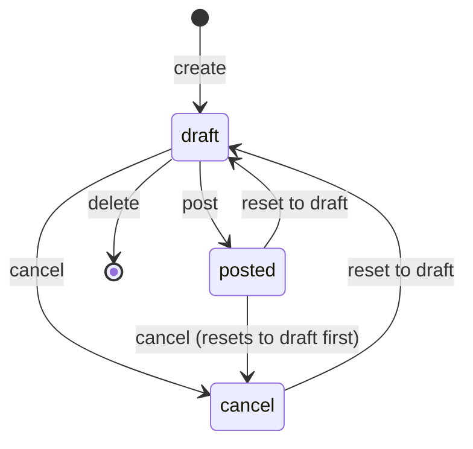
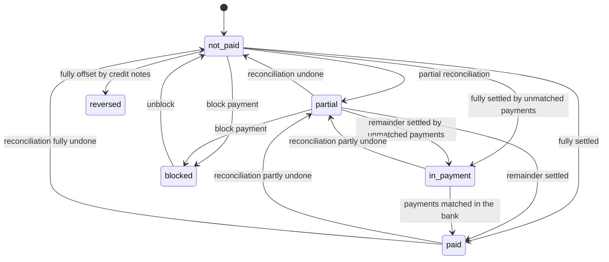
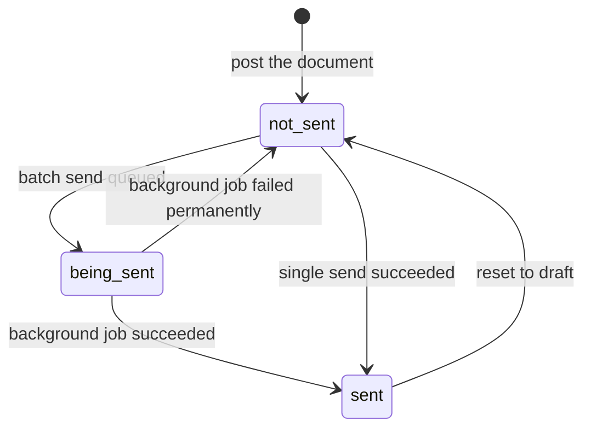
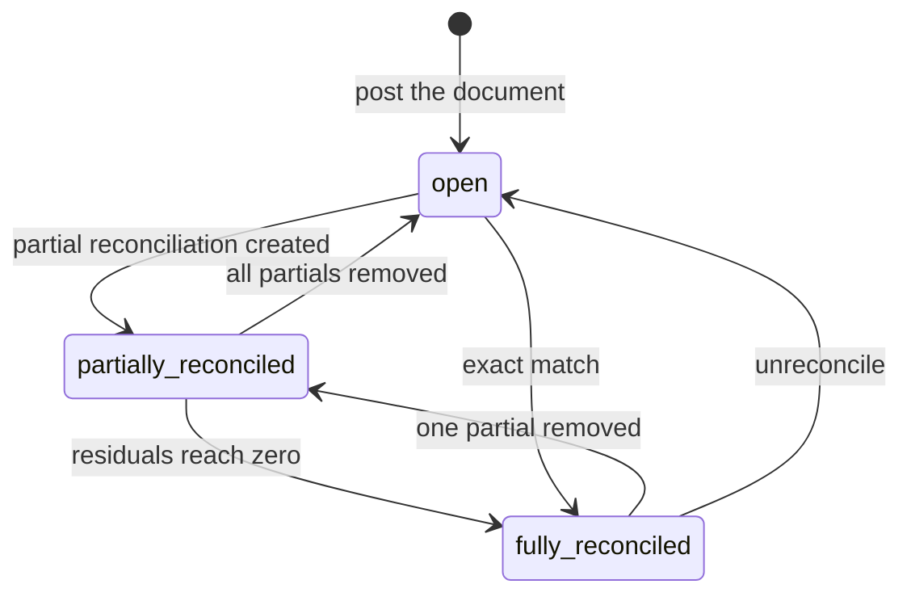

# State machines of the Accounts Receivable domain

Three independent state fields govern a customer document, plus two derived indicators.

| Machine | Field | Who moves it | Section |
| --- | --- | --- | --- |
| Document status | `state` (Status) | User actions and scheduled jobs | 1 |
| Payment status | `payment_state` (Payment Status) | Recomputed from reconciliation | 2 |
| Sending status | `is_move_sent` (Sent) and `sending_data` | The sending flow | 3 |
| Combined display status | `status_in_payment` | Derived | 4 |
| Line reconciliation status | `reconciled`, `full_reconcile_id`, `matching_number` | Reconciliation | 5 |

Every transition below lists the journal items it produces. Amount formulas are given in full in
[`calculations.md`](calculations.md) and the complete account-selection rules in
[`accounting-effects.md`](accounting-effects.md).

---

## 1. Document status

### 1.1 States

| Value | Label | Meaning |
| --- | --- | --- |
| `draft` | Draft | The document is being prepared. Its journal items exist in the database but are excluded from every ledger figure because they belong to an entry that is not posted. It usually has no number, or a number that will be recomputed. It may be freely modified and deleted. |
| `posted` | Posted | The document is part of the ledger. It has a number. Its receivable line is reconcilable and appears in the aged receivable report. Almost nothing may be changed. |
| `cancel` | Cancelled | The document is void. It keeps its number if it had one. Its journal items no longer contribute to any ledger figure. It cannot be posted again without first returning to draft. |

The status is required, readonly (no direct write from the interface), not copied when the document
is duplicated, tracked in the message thread, and defaults to `draft`.

### 1.2 Diagram

### 1.3 Transitions

| From | To | Trigger | Guards | Side effects |
| --- | --- | --- | --- | --- |
| — | `draft` | Create a document | The journal must exist and be of a kind valid for the document type. | The number is left empty or `/`; the dynamic line synchronisation runs for the first time and builds the tax lines, the discount allocation lines, the cash rounding line, the early payment discount lines and the payment term lines. |
| `draft` | `posted` | The **Confirm** button, the mass posting action, the scheduled auto-post job, or a caller that posts programmatically | Every rule of section 1.4. | See section 1.5. |
| `draft` | `cancel` | The **Cancel** button | The document must be draft (a posted document is first reset to draft by the same action). | All reconciliations of the document's lines are undone; every payment whose entry is this document is set to cancelled; auto-post is turned off; the status becomes cancelled. |
| `posted` | `draft` | The **Reset to Draft** button | Every rule of section 1.6. | The analytic lines created at posting are deleted; the sending data is cleared; the generated document file is detached and renamed; the next draft copy of a recurring chain is deleted. |
| `posted` | `cancel` | The **Cancel** button | The reset-to-draft rules must pass first. | The reset-to-draft effects, then the cancel effects. |
| `cancel` | `draft` | The **Reset to Draft** button | Same rules as from posted. | Same effects. |
| `draft` | deleted | The delete action | The rules in [`business-rules.md`](business-rules.md), "Deleting a document". | The lines are deleted with the document. |

### 1.4 Guards on posting

Posting collects *all* failing conditions and raises them together, one per line, so the user sees
every problem at once. The conditions, with their exact messages:

**Access.** The user must belong to the invoicing group, unless the caller runs with elevated rights:

> You don't have the access rights to post an invoice.

**Per invoice (checked for every document that is an invoice, receipts included):**

1. In quick-encoding mode, when a target total was typed and it differs from the computed total:
   > The current total is *the computed total* but the expected total is *the typed total*. In order
   > to post the invoice/bill, you can adjust its lines or the expected Total (tax inc.).
2. The recipient bank account must not be archived:
   > The recipient bank account linked to this invoice is archived.
   > So you cannot confirm the invoice.
3. On an inbound document whose recipient bank account is not trusted for outgoing payments:
   - if the caller is the system user, a public user or a portal user, the bank account is silently
     cleared instead of failing (so that automated and portal flows are not blocked);
   - else, if the current user is allowed to mark accounts as trusted, a redirecting warning is
     raised offering to open the bank settings:
     > The company bank account (*the account number*) linked to this invoice is not trusted. Go to
     > the Bank Settings, double-check that it is yours or correct the number, and click on Send
     > Money to trust it.
   - else:
     > The bank account of your company is not trusted. Please ask an admin or someone with approval
     > rights to check it.
4. The total must not be negative:
   > You cannot validate an invoice with a negative total amount. You should create a credit note
   > instead. Use the action menu to transform it into a credit note or refund.
5. A customer must be set on a sale document:
   > The 'Customer' field is required to validate the invoice.
   > You probably don't want to explain to your auditor that you invoiced an invisible man :)
6. On a sale document with no document date, the document date is set to today. If the currency rate
   had been overridden by the user, the override is preserved while the date is set.

**Per document (checked for every document, invoice or not):**

7. Each line's account must be compatible with the journal (the journal's allowed-account rule).
8. The document must not already be posted or cancelled:
   > The entry *the document number* (id *the internal identifier*) must be in draft.
9. There must be at least one accountable line (sections, subsections and notes do not count):
   > Even magicians can't post nothing!
10. When posting is forced (not the soft mode) on a future-dated auto-post document:
    > This move is configured to be auto-posted on *the formatted date*
11. The journal must not be archived:
    > You cannot post an entry in an archived journal (*the journal name*)
12. The currency must not be archived:
    > You cannot validate a document with an inactive currency: *the currency name*
13. No line may use an archived account (unless the caller explicitly skips this check):
    > A line of this move is using a archived account, you cannot post it.
14. Every account used must belong to the document's company or one of its ancestors:
    > The entry is using accounts (*the comma-separated account codes and names*) from a different
    > company.
15. No line may carry an archived analytic account (checked after the grouped messages):
    > You cannot post an entry with an archived analytic account: *the comma-separated names*

**Soft posting.** In the soft mode (the default for scheduled callers), a document whose accounting
date is in the future is not posted. Instead its auto-post value is set to "At Date" if it was "No",
and a note is added to the message thread:

> This move will be posted at the accounting date: *the formatted date*

### 1.5 Side effects of posting

In order:

1. For each document being posted, the violated lock dates are evaluated; if any, the accounting
   date is pushed to the first open date according to the accounting-date rule.
2. The analytic lines are created from the analytic distributions of the lines.
3. If the document is part of a recurring chain (auto-post monthly, quarterly or yearly), the next
   occurrence is copied forward.
4. Every accountable line whose partner differs from the document's commercial entity is corrected to
   carry the commercial entity.
5. Draft reverse documents whose source is posted are collected for automatic reconciliation.
6. For each partial reconciliation attached to the document's lines whose counterpart is posted or is
   being posted in the same operation:
   - the associated exchange difference entry, if any, is added to the set being posted;
   - if the cash-basis values of the partial no longer match what was recorded, the partial is
     deleted, forcing the user to redo the reconciliation;
   - otherwise the associated cash-basis entries are added to the set being posted.
7. The status is written to `posted` and the "posted before" flag to true.
8. Purchase-side only: if any line has a deductibility below one hundred percent and the user is not
   in the partial-deductibility group, the group is granted to the user.
9. Non-deductible total and non-deductible tax lines are relabelled with the document number
   followed by " - private part" or " - private part (taxes)".
10. Draft reverse documents are reconciled against their sources.
11. Lines that were marked for reconciliation are reconciled.
12. The customer rank of the partner (and of its commercial entity) is increased by one for each
    sale document posted; the supplier rank likewise for purchase documents. For a plain entry, the
    ranks are increased per partner found on receivable and payable lines.
13. Any posted invoice whose total is zero in its currency triggers the "invoice paid" hook
    immediately.

**Journal items produced.** Posting does not create journal items: the lines already exist from the
draft stage. What posting does is make them count. The complete set of lines that a posted customer
invoice carries is:

| Line kind | Account | Side | Amount |
| --- | --- | --- | --- |
| one per billed item | the income account of the product under the fiscal position, else the account fallback | credit | the net amount of the line |
| one per discount allocation, when a discount allocation account is configured | the product line's own account | credit reversal (a debit of the discounted part) | the discounted part |
| one per discount allocation counterpart | the discount allocation account | debit | the discounted part |
| one per tax repartition grouping key | the account of the tax repartition line | credit | the tax amount for that key |
| one cash rounding line, when a cash rounding method applies | the profit or loss account, or the biggest tax's account | either | the rounding difference |
| one early payment discount pair per grouping key, in the "always" mode | the product line's account and the same account without taxes | both | the anticipated discount |
| one per instalment | the receivable account | debit | the instalment amount |

All amounts are given in both the document currency and the company currency; the company-currency
amount of every line is the document-currency amount divided by the document's currency rate, rounded
to the company currency.

### 1.6 Guards on resetting to draft

1. Only a posted or cancelled document may be reset:
   > Only posted/cancelled journal entries can be reset to draft.
2. A document that must be cancelled through an approved request may not be reset:
   > You can't reset to draft those journal entries. You need to request a cancellation instead.
3. The document must not be an exchange difference entry:
   > You cannot reset to draft an exchange difference journal entry.
4. The document must not be a cash-basis tax entry, nor the origin of one:
   > You cannot reset to draft a tax cash basis journal entry.
5. The document must not carry an inalterability hash:
   > You cannot reset to draft a locked journal entry.

### 1.7 Effects of resetting to draft

1. The next draft occurrence of the recurring chain this document belongs to, if it exists, is
   deleted.
2. Every analytic line created from this document's lines is deleted, with analytic synchronisation
   suppressed so they are not immediately recreated.
3. The status becomes draft and the sending data is cleared.
4. For a sale document, the generated document file is detached: the attachment stops being the value
   of the file field (so a fresh one can be produced) and is renamed to
   *the original name* ` (detached by ` *the user name* ` on ` *today's date* `)` *the extension*.

### 1.8 The auto-post job

A scheduled job runs daily. It selects every draft document whose auto-post value is not "No" and
whose accounting date is on or before today, and posts them in the non-soft mode. For a recurring
value (monthly, quarterly, yearly) the posting also copies the document forward by one period until
the auto-post end date is reached.

---

## 2. Payment status

### 2.1 States

See [`entities.md`](entities.md), section 1.9, for the value table. The status is recomputed, never
written directly, with two exceptions: the imported-balance value (`invoicing_legacy`) is never overwritten, and the blocked value
is set and cleared by an explicit user action.

### 2.2 Diagram

### 2.3 The computation

1. Split the documents into four groups:
   - documents whose current status is the imported-balance value (`invoicing_legacy`) — left untouched;
   - documents whose current status is blocked — left untouched;
   - documents that *qualify*: the document is an invoice (receipts included) **and** either it is
     posted, or it is draft with a non-zero total in its currency;
   - everything else — forced to "not paid".
2. For every qualifying document, gather from the partial reconciliation table, for each of its
   lines, on both the debit and the credit side:
   - the account kind of the line;
   - the set of document types of the counterparts;
   - whether *every* counterpart that is a payment is matched with a bank statement (a counterpart
     that is not a payment counts as matched);
   - whether any counterpart is a payment;
   - whether any counterpart is a bank statement line.
   Rows where the counterpart line belongs to the same document are excluded.
3. Keep only the rows whose line is on a receivable or payable account.
4. Decide:

   | Condition | Result |
   | --- | --- |
   | The residual is zero **and** some counterpart is a payment or a statement line **and** every payment counterpart is matched | `paid` |
   | The residual is zero **and** some counterpart is a payment or a statement line **and** some payment counterpart is not matched | the in-payment value (see below) |
   | The residual is zero **and** no counterpart is a payment or a statement line **and** the counterpart types are exactly the reversing types for this document type | `reversed` |
   | The residual is zero **and** no counterpart is a payment or a statement line, other cases | `paid` |
   | The residual is not zero **and** the document is posted **and** some linked payment has no journal entry and is in process | the in-payment value |
   | The residual is not zero **and** there is at least one reconciliation row | `partial` |
   | The residual is not zero **and** the document is posted **and** some linked payment has no journal entry and is paid | the in-payment value |
   | otherwise | `not_paid` |

   The **reversing types** are:
   - for a customer invoice or a sales receipt: the counterpart types are exactly {customer credit
     note}, or exactly {customer credit note, plain entry};
   - for a vendor bill or a purchase receipt: exactly {vendor credit note}, or exactly {vendor credit
     note, plain entry};
   - for a plain entry, a customer credit note or a vendor credit note: exactly {plain entry}.

   The **in-payment value** is `in_payment` when the company asks for the distinction, and `paid`
   otherwise; the company setting is described in [`configuration.md`](configuration.md).

### 2.4 Blocking and unblocking

The **Block payment** toggle:

- If the status is already blocked, it is set back to "not paid" and the field is scheduled for
  recomputation, so the true status returns.
- Otherwise, if the status is paid or in payment, the action is refused:
  > You can't block a paid invoice.
- Otherwise the status becomes blocked.

### 2.5 Journal items produced by a settlement

Settlement itself produces no journal items on the invoice; it creates partial reconciliation records
that link the invoice's receivable line to the payment's receivable line. Two side effects do produce
journal items and are specified in [`accounting-effects.md`](accounting-effects.md):

- **exchange differences** when the invoice and the payment are in the same foreign currency but were
  converted at different rates, or when the residual in one currency reaches zero before the other;
- **cash-basis tax entries** when the invoice carries a tax whose exigibility is "on payment".

---

## 3. Sending status

### 3.1 States

| Indicator | Meaning |
| --- | --- |
| Not sent | The sent flag is false and no sending is in flight. The **Send** button is highlighted. |
| Being sent | The sending data is non-empty: a background job is going to generate and deliver the document. |
| Sent | The sent flag is true: the document file exists and, if an e-mail channel was chosen, the message has been posted to the thread with the file attached. |

### 3.2 Diagram

### 3.3 Transitions

| From | To | Trigger | Guards | Side effects |
| --- | --- | --- | --- | --- |
| not sent | sent | The single-document **Send** wizard confirmed | The document is posted and is a sale document; the chosen printable layout is marked as an invoice layout; no blocking alert. | The document file is rendered and stored as the attachment of the file field; the attachment becomes the main attachment of the thread; the sent flag becomes true; if the e-mail channel is chosen, a message is posted with the file and the extra attachments; the journal's notification subscribers are informed. |
| not sent | being sent | The multi-document **Send** wizard confirmed without forcing the synchronous mode | The sending scheduled job must be active, otherwise the operation is refused. | Each document's sending data is set to the author user and the author partner; the sending job is triggered immediately; the user gets the notification "Invoices are being sent in the background." with title "Sending invoices". |
| being sent | sent | The sending job runs | — | Same as the single send, per document. On success a bus notification titled "Invoices sent" with the body "Invoices sent successfully." is pushed to the author. |
| being sent | not sent | The sending job fails without a retry flag | — | The error is posted on the document's thread; a bus notification titled "Invoices in error" with the body "One or more invoices couldn't be processed." is pushed to the author; the sending data is cleared. When the error is marked retryable and the run came from the job, the sending data is kept so the next run tries again. |
| sent | not sent | Reset to draft | The reset-to-draft guards. | The file is detached and renamed; the sending data is cleared. The sent flag itself is not cleared by the reset; it is the absence of the attachment that makes the send button highlight again. |

### 3.4 Sending guards

Before anything else the following per-document constraints are checked; the first failure is raised:

- > You can't generate invoices that are not posted.
- > You can only generate sales documents.

And on the chosen layout:

- > The sending of invoices is not set up properly, make sure the report used is set for invoices.

And when no printable layout applies at all:

- > There is no template that applies to this move type.

Alerts of level "danger" block the send and are raised as their message. The base platform defines
two alerts:

| Key | Level | Message | Action offered |
| --- | --- | --- | --- |
| sending job archived | warning | The scheduled action 'Send Invoices automatically' is archived. You won't be able to send invoices in batch. (followed by "\nPlease contact your administrator." when the user cannot edit the job) | "Check", opening the job, when the user may edit it |
| missing e-mail | danger in single mode, warning in batch mode | Partner(s) should have an email address. | "View Partner(s)" in batch mode, opening the partners concerned under the title "Check Partner(s) Email(s)" |

---

## 4. Combined display status

`status_in_payment` merges the document status and the payment status into one column for lists and
kanban views.

| Document status | Payment status | Displayed |
| --- | --- | --- |
| `posted` | one of partial, in payment, paid, reversed, blocked | that payment status |
| `posted` | anything else, and the document has been sent | `sent` (Sent) |
| `posted` | anything else, not sent | `posted` (Posted) |
| `draft` | one of partial, in payment, paid, blocked | that payment status |
| `draft` | anything else | `draft` (Draft) |
| `cancel` | any | `cancel` (Cancelled) |

For searching and grouping, the value is computed directly in the database as: `draft` when the
document status is draft, `cancel` when it is cancelled, and the payment status otherwise. The
searchable form therefore never yields `sent`; the separate "Sent" search field exists for that.

---

## 5. Line reconciliation status

Every payment term line of a posted customer document participates in reconciliation.

### 5.1 States of a receivable line

| State | Condition |
| --- | --- |
| Open | No partial reconciliation touches the line. Both residuals equal the line amounts. |
| Partially reconciled | At least one partial reconciliation touches the line and at least one residual is non-zero. |
| Fully reconciled | Both residuals are zero. The reconciled flag is true; a full reconciliation record is created and its matching label is stamped on every participating line. |

### 5.2 Effects on the document

- Each change of a line's residual re-triggers the document's amount computation and therefore the
  payment status computation.
- Undoing a reconciliation on a foreign-currency document also reverses the exchange difference
  entry that the reconciliation had created.
- Undoing a reconciliation on a document with cash-basis taxes reverses the cash-basis entry.

### 5.3 The one-click reconciliation from the document form

Two named operations exist on a document:

- **Attach an outstanding line**: given the identifier of a candidate line from the outstanding
  block, the platform collects that line plus every unreconciled line of the document on the same
  account and reconciles them together.
- **Detach a partial reconciliation**: given the identifier of an existing partial reconciliation, it
  is deleted; the residuals and the payment status recompute automatically.
