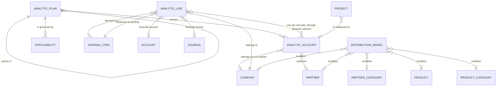

# Analytic Accounting — Entities

This file specifies every entity of the domain in full: purpose, lifecycle, complete field
table, relations, uniqueness rules, defaults, computed fields with their rules, ordering,
display rule, archival behaviour and multi-company behaviour. It also specifies the **analytic
distribution structure** and the **dynamic column contract** — the run-time creation of one
stored column per root plan — because a rebuild cannot reproduce this domain without them.

Every persistent entity carries the platform's common fields: the internal identifier, the
creation timestamp and author, and the last-update timestamp and author. Entities that support
archiving also carry `active` (active flag). These common fields are repeated in a field table
only where the entity gives them a special meaning.

Field tables carry a column for the reproduced identifier, a column for the full name in words,
the type, whether the field is required, its default, whether it is stored or derived, whether it
is copied when the record is duplicated, whether it is tracked in a discussion thread, and its
meaning and rules. A field marked *derived* is recomputed on read and has no column of its own
unless the row says otherwise.

Contents:

1. [The analytic distribution structure](#1-the-analytic-distribution-structure)
2. [Analytic Plan](#2-analytic-plan)
3. [The dynamic column contract](#3-the-dynamic-column-contract)
4. [Analytic Plan Applicability](#4-analytic-plan-applicability)
5. [Analytic Account](#5-analytic-account)
6. [Analytic Line](#6-analytic-line)
7. [Analytic Distribution Model](#7-analytic-distribution-model)
8. [Analytic Mixin](#8-analytic-mixin)
9. [Analytic Plan Fields Mixin](#9-analytic-plan-fields-mixin)
10. [Fields this domain adds to entities of other domains](#10-fields-this-domain-adds-to-entities-of-other-domains)
11. [Relationship summary](#11-relationship-summary)
12. [Invariants across entities](#12-invariants-across-entities)
13. [Reconciliation notes](#13-reconciliation-notes)

The generated reference pages for the entities of this folder are
[../../references/entities/account.analytic.plan.md](../../references/entities/account.analytic.plan.md),
[../../references/entities/account.analytic.applicability.md](../../references/entities/account.analytic.applicability.md),
[../../references/entities/account.analytic.account.md](../../references/entities/account.analytic.account.md),
[../../references/entities/account.analytic.line.md](../../references/entities/account.analytic.line.md),
[../../references/entities/account.analytic.distribution.model.md](../../references/entities/account.analytic.distribution.model.md),
[../../references/entities/analytic.mixin.md](../../references/entities/analytic.mixin.md) and
[../../references/entities/analytic.plan.fields.mixin.md](../../references/entities/analytic.plan.fields.mixin.md).

---

## 1. The analytic distribution structure

The analytic distribution is the central data structure of the domain. It is a structured
document held in the field `analytic_distribution` (analytic distribution) of every record that
implements the Analytic Mixin.

### 1.1 Shape

Each entry of the document is:

- a **key**, called a **combination**: the identifiers of one or more analytic accounts, written
  as decimal numbers separated by commas, with no spaces — for example `12`, or `12,45`, or
  `12,45,78`;
- a **value**: a percentage, a real number.

```formula
distribution = { key₁ : percentage₁ , key₂ : percentage₂ , … }
key          = account_identifier  [ "," account_identifier ]*
```

A key naming more than one account means: this slice of the amount is tagged on **all** of those
accounts at once, and it produces **one** analytic line that carries all of them. A combination
names at most one account per root plan, because an analysed record has exactly one column per
root plan; the accounts of a compound key are therefore expected to belong to different root
plans, and that is what makes the tagging meaningful.

One reserved key exists, `__update__` (the partial-update marker). Its value is not a percentage
but a list of the stored column names of the root plans that the incoming distribution intends to
replace. It is consumed by the merge algorithm of [calculations.md](calculations.md) section 7
and is never stored.

### 1.2 Rules of the structure

1. Each value is the percentage of the host record's amount attributed to that combination. A
   value above one hundred is accepted and meaningful: it analyses the amount more than once on
   that axis. A total below one hundred analyses only part of the amount. Only a mandatory plan
   forces a plan's total to be exactly one hundred.
2. Percentages are stored rounded to the number of decimal places of the decimal precision record
   named `Percentage Analytic` (the percentage precision), which is **two**.
3. The empty document and the absent document are equivalent and mean "no analytic attribution".
4. The reserved key `__update__` may appear **only in a value being written**. A written document
   without it replaces the stored document entirely.
5. The order of the combinations inside the document, and the order of the identifiers inside a
   combination, are significant as an output convention only: a merge produces the identifiers of
   the non-replaced side first, in ascending identifier order, followed by the identifiers of the
   replaced side, in ascending identifier order. The generation of analytic lines walks the
   entries in the order in which they appear in the stored document, and the accounts of one
   combination in the order in which they appear in the key; both orders change which slice
   absorbs a remainder.
6. An identifier that names an account that no longer exists is tolerated everywhere: it is
   skipped when the distribution is validated, when its account list is derived and when analytic
   lines are generated from it.

### 1.3 Reading a key

1. Split the key on commas.
2. Read each fragment as a whole number. Fragments that are not made of digits are ignored when
   the list of accounts is derived for search and display; they are read strictly when analytic
   lines are built.
3. Look up the analytic accounts by those identifiers, discarding identifiers that no longer
   exist.

### 1.4 Worked example

A document line of 1 000.00 in the company currency is attributed sixty percent to analytic
account 7 and forty percent to analytic account 8, both of the plan *Departments*, and entirely
to analytic account 12 of the plan *Project*:

```
{ "7,12" : 60 , "8,12" : 40 }
```

The *Departments* plan totals 60 + 40 = 100 percent and the *Project* plan totals 60 + 40 = 100
percent, because account 12 appears in both combinations. Posting this line produces two analytic
lines of −600.00 and −400.00, each carrying one account of *Departments* and account 12 of
*Project*. The complete computation is in [calculations.md](calculations.md) section 9.

---

## 2. Analytic Plan

**Analytic Plan** (`account.analytic.plan`, table `account_analytic_plan`, catalogued as
*Analytic Plans*) is one axis of analysis.

### 2.1 Purpose

A plan groups the analytic accounts that answer one question. "Projects" answers *which
project*; "Departments" answers *which department*; "Vehicles" answers *which vehicle*. Plans
form a tree: a plan may have a parent plan and any number of child plans. The topmost ancestor of
a plan is its **root plan**, and only root plans are axes in the full sense — only they receive a
stored column on the records that carry analysis, only they have an applicability, and only they
are counted when a distribution is validated.

Sub-plans exist so that one axis can be sub-divided for reporting: a root plan "Projects" may
have sub-plans "Internal" and "Customer", each holding its own analytic accounts. An amount
tagged with an account of a sub-plan is, for every purpose except grouping, tagged on the root.

One root plan is designated the **base plan** by the system parameter `analytic.project_plan`
(the base-plan parameter); it is the only plan whose stored column has a fixed name.

### 2.2 Field table

| Identifier | Full name | Type | Required | Default | Stored or derived | Copied | Tracked | Meaning and rules |
|---|---|---|---|---|---|---|---|---|
| `name` | Name | Text, translatable | yes | none | stored | yes | no | Name of the axis. Writing it re-synchronises the dynamic columns on every model that carries analysis, so that each column's label follows the plan's name. The column name itself never changes. |
| `description` | Description | Long text | no | none | stored | yes | no | Free description of what the axis measures. |
| `parent_id` | Parent | Link to Analytic Plan | no | none | stored, indexed when not empty | yes | no | Parent plan. Deleting the parent deletes this plan. The selectable set excludes this plan and all its descendants. Writing it re-synchronises the dynamic columns and moves analytic line values between columns (section 3.7). |
| `parent_path` | Materialised path | Text, indexed | no | none | stored, maintained by the tree machinery | no | no | The slash-separated chain of ancestor identifiers ending with this plan's own identifier and a trailing slash, for example `4/17/23/`. Used for descendant tests and for the depth computation. |
| `root_id` | Root plan | Link to Analytic Plan | no | none | derived, not stored | no | no | The first identifier of the materialised path read as a plan; the plan itself when the path is empty. Searchable with the equality operator only, which is translated into a materialised-path prefix test; any other operator is not supported. |
| `children_ids` | Children | Collection of Analytic Plan | no | none | derived from the reverse link | no | no | The plans whose parent is this one. |
| `children_count` | Children plans count | Whole number | no | 0 | derived, not stored | no | no | The number of direct children. Shown on the *Subplans* button of the form. |
| `complete_name` | Complete name | Text | no | none | derived, recursive, **stored** | no | no | The parent's complete name, a space, a solidus, a space, and this plan's name; the name alone when there is no parent. Example: `Projects / Customer / Retainers`. |
| `account_ids` | Accounts | Collection of Analytic Account | no | none | derived from the reverse link | no | no | The analytic accounts whose plan is this one — **direct members only**, not the sub-plans' accounts. |
| `account_count` | Analytic accounts count | Whole number | no | 0 | derived, not stored | no | no | The number of direct member accounts. |
| `all_account_count` | All analytic accounts count | Whole number | no | 0 | derived, not stored | no | no | The number of analytic accounts in this plan **and in every descendant plan**, obtained by matching descendants on the materialised-path prefix and counting accounts grouped by plan. A plan whose whole sub-tree has no account is never offered in a distribution editor. |
| `color` | Colour index | Whole number | no | a pseudo-random whole number from one to eleven inclusive, drawn at creation | stored | yes | no | Tints the plan's chip in the distribution editor and the card of its accounts. |
| `sequence` | Sequence | Whole number | no | 10 | stored | yes | no | Manual ordering of plans; the first sort key, and the order of the plan columns in the distribution editor. |
| `default_applicability` | Default applicability | Selection: `optional` — *Optional*; `mandatory` — *Mandatory*; `unavailable` — *Unavailable* | required on the form of a root plan | `optional`, registered as a system-wide default when the capability is installed | stored **per company** (one value per company; reading returns the value of the company the reader acts for) | yes | no | The applicability used when no applicability rule beats the baseline. Meaningful on a root plan only; the form hides it as soon as a parent is set. |
| `applicability_ids` | Applicability rules | Collection of Analytic Plan Applicability | no | none | derived from the reverse link | no | no | The rules attached to this plan. The form restricts the visible rules to those of the company the reader acts for. |

### 2.3 Identity, ordering, display and search

- **Uniqueness:** none beyond the internal identifier. Two plans may share a name. A cycle is
  impossible because the parent selection excludes the plan and its sub-tree and because the
  materialised path is maintained by the tree machinery.
- **Ordering:** `sequence` ascending, then internal identifier ascending.
- **Display name:** the complete name, therefore `Departments` for a root plan and
  `Departments / Europe` for a sub-plan of *Departments*.
- **Tree storage:** the plan is a materialised-path tree, so descendant tests are prefix tests
  rather than recursive queries.
- **Indexes:** the materialised path is indexed; the parent link is indexed for the rows where it
  is not empty.

### 2.4 Validation

| Rule | Condition | Message |
|---|---|---|
| The base plan cannot be given a parent ([business-rules.md](business-rules.md) `AA-003`) | A user selects a parent on the form of the plan designated as the base plan. The refusal happens while the form is still being edited, before anything is written. | "You cannot add a parent to the base plan 'the plan name'" |
| A base plan must exist ([business-rules.md](business-rules.md) `AA-016`) | The set of root plans is resolved and the base-plan parameter names no existing plan. Every operation that needs the plan list then fails. | "A 'Project' plan needs to exist and its id needs to be set as `analytic.project_plan` in the system variables" |
| Column rewrite conflict ([business-rules.md](business-rules.md) `AA-011`) | Re-parenting would make an analytic line hold two different accounts in what becomes a single column. | "Whoa there! Making this change would wipe out your current data. Let's avoid that, shall we?" with a button labelled "See them" |
| A column still used by a stored view ([business-rules.md](business-rules.md) `AA-009`) | Deleting a plan whose stored column is still named by a stored view definition. | "Cannot rename/delete fields that are still present in views:" followed by the field list and the view name |

Both refusal texts and the field-in-view text are reproduced verbatim.

### 2.5 Multi-company behaviour

A plan itself has **no company**: it is global, and no record rule restricts it. Two things about
it are per-company: its default applicability, which is a company-dependent value, and its
applicability rules, each of which may name a company. A plan is therefore visible everywhere but
may behave differently in each company.

### 2.6 Archiving

Plans are not archivable: they are deleted, or left in place with no account, in which case they
are never offered in a distribution editor.

### 2.7 Lifecycle

| Event | What happens |
|---|---|
| Created | The plan takes a random colour, a sequence of ten and the installed default applicability. The cached answer to *which plans are relevant* is dropped. A plan created without a parent gains its stored column and the column's partial index on every model that carries analysis; a plan created with a parent gains the grouping column of its depth if that column does not exist yet. The columns are created by the synchronisation that the writing of the plan's name triggers. |
| Renamed | The dynamic columns of every model carrying analysis are re-synchronised, which refreshes the label of the plan's stored column (root plan) or of the grouping column of its depth (sub-plan). Column names never change, so renaming is always safe. |
| Re-parented, gaining a parent | **Before** the parent is written, analytic line values are moved from the plan's own column into the column of the future parent's root, for every account whose plan is this plan or any descendant of it. The write then removes the plan's stored column and creates or relabels the grouping column of the new depth, and does the same for every descendant. |
| Re-parented, losing its parent | The parent is written **first**, which creates the plan's own stored column with its partial index and deletes the grouping column of the former depth when no plan remains at that level. Analytic line values are moved **after** the write, out of the former parent's root column into the plan's own column. |
| Default applicability written | The cached answer to *which plans are relevant* is dropped. |
| Deleted | The stored columns of the plans being deleted are removed first, together with the values they hold; the plans are then deleted, children cascading with the parent; the grouping columns that no longer correspond to any surviving plan level are removed; finally the stable registry cache and the cached answer to *which plans are relevant* are dropped. |
| Designated as the base plan | The former base plan is re-synchronised and therefore receives a generated column of its own, empty; the generated column that the new base plan owned until then is deleted with its contents. No value is migrated. |

Every create, write and delete of a plan makes every open client reload its definition of the
models that carry analysis, because their set of fields has changed.

---

## 3. The dynamic column contract

This section specifies behaviour that has no field table, because it *is* the creation of
fields. Every model that carries analysis implements the **Analytic Plan Fields Mixin**
(`analytic.plan.fields.mixin`), and for each root plan the system creates a real stored column on
that model's table.

### 3.1 Which models carry the columns

Every model that declares itself a descendant of the Analytic Plan Fields Mixin. In the delivered
system the analytic line is the only such model of this domain; inventory valuation and
manufacturing cost holders are others, contributed by their own domains. The mechanism is written
to serve any number of them, and the synchronisation walks the whole set.

### 3.2 The base plan

One root plan is designated the **base plan**. Its identity is held in the system parameter
`analytic.project_plan` (the base-plan parameter), whose shipped value is the identifier of the
plan named *Project* delivered as reference data. The base plan is special in exactly one way:
its stored column is named `account_id` (project account) rather than being derived from its
identifier. Everything else about it is ordinary.

The list of root plans is resolved as: the base plan first, then every other plan with no parent,
read with elevated rights and cached for the process. Both halves are needed together in several
places, and the base plan always comes first.

### 3.3 Column naming

```formula
strict_column_name( plan ) = "account_id"                        when the plan is the base plan
strict_column_name( plan ) = "x_plan" + plan_identifier + "_id"  otherwise

column_name( plan ) = strict_column_name( root_plan_of( plan ) )
```

So an account belonging to a sub-plan is stored in the column of that sub-plan's **root**. A
sub-plan never owns a stored column.

Worked example. The base plan has identifier one. A root plan *Departments* has identifier
fourteen. A sub-plan *Engineering* under *Departments* has identifier twenty-two.

| Plan | Root | Strict column name | Column name actually used |
|---|---|---|---|
| Base plan (identifier 1) | itself | `account_id` | `account_id` |
| *Departments* (14) | itself | `x_plan14_id` | `x_plan14_id` |
| *Engineering* (22) | *Departments* | `x_plan22_id` (never created) | `x_plan14_id` |

The stored column is a link to Analytic Account, marked manual, copied when a record is
duplicated, with a deletion rule of **restrict** so that an analytic account still referenced by
an analytic line cannot be deleted. When the model has a real table, a partial balanced-tree
index is created over that column covering only the rows where the column is not empty, and the
field is marked as indexed.

### 3.4 The grouping column of a sub-plan

A sub-plan does not own a stored column, but it does own a **derived** column, so that a report
can group by "the sub-plan at depth one of the Departments axis".

```formula
depth( plan ) = ( number of slashes in the materialised path ) − 1

hierarchy_name( plan ) = column_name( plan ) + "_" + depth( plan )
hierarchy_name( plan ) = "x_" + that                       when it begins with "account_id"
```

The derived column is a link to an Analytic **Plan** (not an account), not stored, read-only,
whose value is read through the chain: the stored account column, then that account's plan, then
that plan's parent repeated *depth minus one* times. Its label is the root plan's name followed
by a space and the depth in parentheses.

A root plan has a materialised path of the form `own identifier/`, which contains one slash, so
its depth is zero and it owns no grouping column.

Worked example, continuing the previous one. *Engineering* has materialised path `14/22/`, which
contains two slashes, so its depth is one. Its grouping column is `x_plan14_id_1`, its value
chain is "the account in `x_plan14_id`, then that account's plan" (the parent step is repeated
zero times), and its label is `Departments (1)`.

A sub-sub-plan *Platform* under *Engineering*, path `14/22/31/`, has depth two, grouping column
`x_plan14_id_2`, value chain "the account in `x_plan14_id`, then its plan, then that plan's
parent", and label `Departments (2)`.

For a sub-plan of the **base** plan the name would begin with `account_id`, so it is prefixed:
depth one gives `x_account_id_1`.

### 3.5 Synchronisation

Whenever a plan's name or parent is written, every model carrying analysis is re-synchronised.
For one model, the plans are processed **sorted by materialised path**, so that a parent is always
handled before its children:

1. **The plan has a parent.**
   1. If a stored column exists for this plan, delete it. The deletion is performed with the
      capability-removal marker raised, so that the column is dropped outright rather than being
      protected.
   2. Compute the grouping column's name and its label.
   3. If no grouping column exists with that name, create it: a link to Analytic Plan, manual,
      on this model, not stored, read-only, with the related chain of section 3.4.
   4. Otherwise just refresh its label.
2. **The plan has no parent** (it is a root).
   1. If a grouping column exists for this plan, delete it with the capability-removal marker
      raised.
   2. Compute the stored column's name; the label is the plan's name.
   3. If no stored column exists with that name, create it as described in section 3.3, then,
      when the model has a real table, create the partial index and mark the field as indexed.
   4. Otherwise just refresh its label.
3. Recurse into the plan's children.

### 3.6 Deleting a plan and its columns

1. Delete the stored columns of the plans being deleted.
2. Collect their grouping columns.
3. Delete the plans themselves (children cascade).
4. Delete each collected grouping column **unless it is still in use** — that is, unless some
   plan still exists whose root is the root the column belongs to and whose depth is at least the
   column's depth. The test reads the root plan's identifier out of the column name (falling back
   to the base plan when the name carries no digits) and the depth from the trailing number, then
   searches for a plan with that root whose materialised path has at least that many path
   separators.
5. Clear the stable registry cache and drop the cached answer to *which plans are relevant*.

A stored column that a stored view definition still names cannot be deleted; the deletion is
refused with the message quoted in section 2.4 and nothing at all is removed.

### 3.7 Moving analytic line values between columns

Whenever the column that should hold a set of analytic accounts changes — because an account
moved to another plan, or because a plan gained or lost a parent — the analytic lines are
rewritten in place.

Algorithm, given a new column name, a current column name and a set of analytic accounts:

1. If the two names are equal, do nothing.
2. Look for at least one analytic line where the **new** column already holds a value that is
   neither one of these accounts nor empty, while the **current** column holds one of these
   accounts. Such a line would have to hold two accounts of the same axis, which is impossible,
   so the whole operation is refused with a redirecting warning carrying the message "Whoa there!
   Making this change would wipe out your current data. Let's avoid that, shall we?", an action
   opening the offending analytic lines in a list, and a button labelled "See them". Nothing has
   been written.
3. Otherwise, in one statement, set the new column to the current column's value and clear the
   current column, for every analytic line whose current column holds one of these accounts.
4. Invalidate the cached analytic lines.

Note the deliberate exception in step 2: a line where the new column **already holds the same
account** is not a conflict, because the rewrite is a no-operation for it.

The set of accounts is always "every account whose plan is the plan being moved **or any
descendant of it**", never only the direct members.

---

## 4. Analytic Plan Applicability

**Analytic Plan Applicability** (`account.analytic.applicability`, table
`account_analytic_applicability`, catalogued as *Analytic Plan's Applicabilities*) is one rule
that overrides a plan's default applicability. Rules compete by a score; the highest-scoring rule
that beats the baseline wins. The scoring is specified in [calculations.md](calculations.md)
section 2.

### 4.1 Field table

| Identifier | Full name | Type | Required | Default | Stored or derived | Copied | Meaning and rules |
|---|---|---|---|---|---|---|---|
| `analytic_plan_id` | Plan | Link to Analytic Plan | no | none | stored, indexed when not empty | yes | The plan whose applicability this rule overrides. A rule is only ever evaluated for the plan it belongs to, and only for a root plan, because sub-plans have no applicability of their own. |
| `business_domain` | Domain | Selection, see section 4.2 | yes | none | stored | yes | The kind of document the rule applies to. |
| `applicability` | Applicability | Selection: `optional` — *Optional*; `mandatory` — *Mandatory*; `unavailable` — *Unavailable* | yes | none | stored | yes | The applicability the plan takes when this rule wins. |
| `company_id` | Company | Link to Company | no | the company the reader is acting for | stored | yes | When set, the rule is evaluated only for that company and is excluded outright when another company is supplied. When empty, the rule applies to every company. |
| `account_prefix` | Financial accounts prefixes | Text | no | none | stored | yes | *Added by the general ledger capability.* One or more prefixes of financial account codes, separated by commas or semicolons; every space is removed before splitting and empty fragments are dropped. The rule matches when the financial account's code begins with one of them. A rule that carries a prefix and whose prefix does not match is eliminated entirely. |
| `product_categ_id` | Product category | Link to Product Category | no | none | stored | yes | *Added by the general ledger capability.* The rule matches when the supplied product's category is exactly this one; descendants of the category do not match. A rule that carries a category and whose category does not match is eliminated entirely. |
| `display_account_prefix` | Show the prefix field | Boolean | no | false | derived, not stored | no | True when the business domain is `general`, `invoice` or `bill`; the expenses capability additionally makes it true for `expense`. Governs whether the prefix cell is shown in the rule list inside the plan form. |
| `account_prefix_placeholder` | Prefix placeholder | Text | no | none | derived, not stored | no | Hint shown in the empty prefix cell. It reproduces the text "e.g. " followed by three comma-separated numbers. For a rule on `bill` the numbers come from the code of the first expense account; otherwise from the code of the first income account. The first two characters of that code are read as a number, and the hint shows that number, that number plus one and that number plus two. When there is no such account, or the two characters are not a number, the hint falls back to `60, 61, 62` for `bill` and `40, 41, 42` for every other business domain. |

### 4.2 The closed list of business domains

The base value is contributed by this domain; every other value is contributed by another
capability and exists only when that capability is installed. Removing the capability that
contributed a value deletes the rules carrying it.

| Value | Label | Contributed by |
|---|---|---|
| `general` | Miscellaneous | this domain |
| `invoice` | Invoice | the general ledger capability |
| `bill` | Vendor Bill | the general ledger capability |
| `expense` | Expense | the expenses capability |
| `timesheet` | Timesheet | the timesheets capability |
| `purchase_order` | Purchase Order | the purchasing capability |
| `sale_order` | Sale Order | the sales capability |
| `manufacturing_order` | Manufacturing Order | the manufacturing accounting capability |
| `stock_picking` | Stock Picking | the project and inventory accounting capability |

### 4.3 Identity, ordering and display

- **Uniqueness:** none beyond the internal identifier. Several rules of one plan may carry the
  same business domain; the score decides between them and, on an exact tie, the rule examined
  first keeps the win, which is the rule with the lower internal identifier.
- **Ordering:** internal identifier ascending; no explicit order is declared.
- **Display name:** the platform default built from the identifier. Rules are only ever edited
  inline in the plan form, so they need no name of their own.

### 4.4 Lifecycle and caching

Creating, writing or deleting a rule drops the cached answer to *which plans are relevant*.

### 4.5 Multi-company behaviour

Company scoping is *parent-of*: a rule belonging to a parent company is visible to its branches.
The record rule admits rules with no company and rules whose company is a parent of one of the
companies the reader is acting for.

---

## 5. Analytic Account

**Analytic Account** (`account.analytic.account`, table `account_analytic_account`) is one value
on one axis.

### 5.1 Purpose and lifecycle

An analytic account is the thing an amount is tagged with: a project, a department, a vehicle, a
cost centre, a campaign, a region, a customer contract. It belongs to exactly one plan and,
through it, to exactly one root plan. It accumulates analytic lines and exposes their total as a
balance. It can be archived when the work it represents is finished; archiving hides it from
selection and, crucially, prevents the posting of any entry that still refers to it.

The entity carries a discussion thread, so that changes to its name, its reference, its customer
and its archival flag are tracked and can be discussed.

### 5.2 Field table

| Identifier | Full name | Type | Required | Default | Stored or derived | Copied | Tracked | Meaning and rules |
|---|---|---|---|---|---|---|---|---|
| `name` | Analytic account | Text, translatable | yes | none | stored, three-letter-sequence index | yes, with ` (copy)` appended unless a name is supplied | yes | The account's name. |
| `code` | Reference | Text | no | none | stored, indexed | yes | yes | A short code shown in square brackets before the name in the display name. |
| `active` | Active | Boolean | yes | true | stored | yes | yes | An archived account is hidden from the default lists and from the value lists of the distribution editor. Existing distributions and existing analytic lines keep referring to it, and posting an entry whose distribution names it is refused. |
| `plan_id` | Plan | Link to Analytic Plan | yes | none | stored, indexed | yes | no | The plan (root plan or sub-plan) the account belongs to. Writing it moves the account's value in the analytic lines from the old root's column to the new root's column (section 3.7). |
| `root_plan_id` | Root plan | Link to Analytic Plan | no | none | derived from the plan's root and **stored** | yes | no | The axis this account belongs to. Every validation total and every accumulation is keyed on this field, and it decides which column of an analysed record stores the account. |
| `color` | Colour index | Whole number | no | none | derived from the plan's colour, not stored | no | no | Colour of the account's chip in the distribution editor and of its card. |
| `line_ids` | Analytic lines | Collection of Analytic Line | no | none | derived through the magic column `auto_account_id` | no | no | The analytic lines that carry this account in the column of its root plan. Resolving the collection needs the plan to be named in the reader's context; reading a single account through the web client supplies it automatically. |
| `company_id` | Company | Link to Company | no | the company the reader is acting for | stored | yes | no | When empty, the account is shared by every company. When set, the account may be used by that company and by its branches. |
| `partner_id` | Customer | Link to Partner | no | none | stored, indexed when not empty, company-checked | yes | yes | The customer the account relates to. Name searches on this field are run with elevated rights for speed. It appears in the display name. |
| `balance` | Balance | Money in the account's currency | no | 0 | derived, not stored | no | no | Credit minus debit — the gross margin of the axis value. See [calculations.md](calculations.md) section 13. |
| `debit` | Debit | Money in the account's currency | no | 0 | derived, not stored | no | no | The negated total of the negative analytic lines, therefore a positive number: the cost attributed to the account. |
| `credit` | Credit | Money in the account's currency | no | 0 | derived, not stored | no | no | The total of the non-negative analytic lines: the revenue attributed to the account. |
| `currency_id` | Currency | Link to Currency | no | none | derived from the company's currency, not stored | no | no | The currency the three totals are expressed in. When the account has no company, the totals are expressed in the currency of the company the reader is acting for. |

### 5.3 Fields other domains add to Analytic Account

| Identifier | Full name | Type | Added by | Meaning |
|---|---|---|---|---|
| `invoice_count` | Invoice count | Whole number, derived, not stored | the general ledger capability | The number of posted sale documents, receipts included, having at least one journal item whose distribution names this account. |
| `vendor_bill_count` | Vendor bill count | Whole number, derived, not stored | the general ledger capability | The same for purchase documents, receipts included. |
| `project_ids`, `project_count` | Projects, project count | Collection and whole number | [../projects-and-tasks/entities.md](../projects-and-tasks/entities.md) | The projects bound to this analytic account. Creating a project creates or reuses an analytic account of the base plan; deleting an account is refused while a project bound to it still has tasks. |
| `purchase_order_count` | Purchase order count | Whole number, derived | [../purchasing/entities.md](../purchasing/entities.md) | The number of purchase orders with a line attributed to this account. |
| `production_ids`, `production_count`, `bom_ids`, `bom_count`, `workcenter_ids`, `workorder_count` | Manufacturing orders, manufacturing order count, bills of materials, bills of materials count, work centres, work order count | Collections and whole numbers | [../manufacturing/entities.md](../manufacturing/entities.md) | The manufacturing documents attributed to this account. |

### 5.4 Identity, ordering, display and search

- **Uniqueness:** none beyond the internal identifier: two accounts of the same plan may share a
  name and a code.
- **Ordering:** by plan, then by name ascending.
- **Name search:** matches the name or the reference.
- **Display name**, assembled in this order:

  ```formula
  display_name = name
  display_name = "[" + code + "] " + display_name                when a reference is set
  display_name = display_name + " - " + commercial_partner_name  when the customer has a commercial partner with a name
  ```

  Worked example: an account named *Website redesign* with reference `WEB-01` whose customer is a
  contact of the company *Acme* displays as `[WEB-01] Website redesign - Acme`. An account named
  *Operating Costs* with no reference and no customer displays as `Operating Costs`.
- **Duplication:** the copy's name is the original's name followed by a space and the word
  *(copy)* in parentheses, unless a name was supplied to the copy; every other stored field is
  copied.
- **Reading one record through the web client** additionally puts the account's plan into the
  reader's context, so that the magic column of section 9 resolves to the right stored column.
- **Indexes:** a three-letter-sequence index on the name, a plain index on the reference, a plain
  index on the plan, and an index on the customer restricted to the rows where it is set.

### 5.5 Validation

| Rule | Condition | Message |
|---|---|---|
| Company consistency with existing lines (`AA-031`) | The company is written and at least one analytic line carrying the account belongs to a company that is neither the new company nor one of its descendants. Clearing the company is always allowed. | "You can't change the company of an analytic account that already has analytic items! It's a recipe for an analytical disaster!" |
| Column rewrite conflict (`AA-032`) | The plan is written and the move of section 3.7 would overwrite a different account already present in the destination column. | "Whoa there! Making this change would wipe out your current data. Let's avoid that, shall we?" with a button labelled "See them" |
| Deletion while used by an expense (`AA-033`) | An expense's distribution names the account. | "You cannot delete an analytic account that is used in an expense." |
| Deletion while a project still has tasks (`AA-034`) | A project bound to the account still has tasks. | "Before we can bid farewell to these accounts, you need to tidy up the projects linked to them by removing their existing tasks!" |
| Deletion while an analytic line references it (`AA-035`) | Any analytic line holds the account in a plan column: the column's deletion rule is restrict, so the database refuses. A distribution that merely names the account is not a reference and does not block the deletion. | The platform's deletion-restricted message, described in [../platform-foundation/business-rules.md](../platform-foundation/business-rules.md) |
| Customer company consistency (`AA-036`) | The customer belongs to a company that is not the account's company and is not shared. | "Uh-oh! You've got some company inconsistencies here:" followed by one line per violation of the form "- 'the record' belongs to company 'the company' while 'the field label' (the field identifier: the values) belongs to another company." and the closing line "To avoid a mess, no company crossover is allowed!" |

### 5.6 Grouped totals

The balance, the debit and the credit are not stored, so they cannot be summed by the query
engine. When a list of accounts is grouped and a total of one of them is requested, the system
substitutes a collection of the records of the group and sums the figures in memory. Two
aggregation shapes are supported, a plain sum and a sum after converting each account's figure
from its own company's currency into the currency of the company the reader is acting for. See
[calculations.md](calculations.md) section 13.3.

### 5.7 Multi-company behaviour

Company scoping is *parent-of*: an account belonging to a parent company is usable by its
branches. An account with no company is usable everywhere. The record rule admits accounts with
no company and accounts whose company is a parent of one of the companies the reader is acting
for.

### 5.8 Lifecycle

| Step | Effect |
|---|---|
| Created | Ordinary creation. The account becomes selectable in the column of its root plan on every model that carries analysis, and the account counts of its plan and of every ancestor plan increase by one. |
| Plan changed | The analytic line values are migrated from the column of the current root plan to the column of the new root plan, restricted to this one account, with the conflict check of section 3.7. When the two root plans coincide — a move between two sub-plans of one hierarchy — the column names are identical and nothing is migrated. |
| Company changed | Refused when analytic lines of a company outside the new company's sub-tree already reference the account. |
| Archived | Hidden from the default lists and from the value lists; blocks the posting of entries whose distribution still names it; existing lines and distributions are untouched. |
| Deleted | Refused while used by an expense, while a project bound to it still has tasks, or while an analytic line still holds it in a plan column. |

---

## 6. Analytic Line

**Analytic Line** (`account.analytic.line`, table `account_analytic_line`, shown to users as
*Analytic Item*) is one dated, signed amount posted against one account per axis.

### 6.1 Purpose and lifecycle

An analytic line is the analytic book's equivalent of a journal item, with two differences: it
does not balance against anything, and it carries **one account per axis** rather than one
account. Most lines are created by the posting of a journal entry and destroyed when that entry
is reset to draft. Some are created directly by other domains — a timesheet line is an analytic
line — and those drive the distribution of their journal item in the opposite direction.

### 6.2 Field table

| Identifier | Full name | Type | Required | Default | Stored or derived | Copied | Meaning and rules |
|---|---|---|---|---|---|---|---|
| `account_id` | Project account | Link to Analytic Account | no | none | stored, indexed, company-checked | yes | The stored column of the base plan, contributed by the Analytic Plan Fields Mixin. Deletion rule restrict. Its label is replaced at run time by the base plan's name and its selectable set by the accounts of the base plan and of all its descendants. |
| `x_plan<plan identifier>_id` | The account column of one non-base root plan | Link to Analytic Account | no | none | stored, index restricted to the rows where it is not empty | yes | One such column per non-base root plan, created and deleted with the plan. Deletion rule restrict. |
| `x_plan<plan identifier>_id_<depth>` and `x_account_id_<depth>` | The sub-plan grouping column of one hierarchy depth | Link to Analytic Plan | no | none | derived, not stored, read-only | no | One per existing hierarchy depth per root plan. Used to group reports by sub-plan level. |
| `auto_account_id` | Analytic account (magic column) | Link to Analytic Account | no | none | derived from the reader's context, writable, searchable | no | Stands for *all* the plan columns at once: reading returns the value of the column of the plan named in the context, writing stores the account in the column of the account's own root plan, searching expands into a disjunction over every root plan's column. Negative search operators are not supported. |
| `name` | Description | Text | yes | none | stored | yes | Description of the fact. See [calculations.md](calculations.md) section 9 for the default built from a journal item. |
| `date` | Date | Date | yes | today in the reader's time zone | stored, indexed | yes | Accounting date of the fact. |
| `amount` | Amount | Money in the line's currency | yes | 0 | stored | yes | Signed amount: negative for a cost, positive for a revenue. |
| `unit_amount` | Quantity | Decimal | no | 0 | stored | yes | The quantity behind the amount, expressed in the unit. Copied whole from the journal item to every slice, never divided. |
| `product_uom_id` | Unit | Link to Unit of Measure | no | none | stored | yes | The unit the quantity is expressed in. |
| `partner_id` | Partner | Link to Partner | no | none | stored, derived with a writable override, company-checked | yes | The partner the fact relates to. When the line is attached to a journal item, the value follows that journal item's partner; when the journal item has none, the value already stored is kept. |
| `user_id` | User | Link to User | no | the user named by the reader's context, otherwise the acting user | stored, indexed | yes | The user the fact is attributed to. |
| `company_id` | Company | Link to Company | yes | the company the reader is acting for | stored, read-only on the form | yes | Owning company. Set at creation and never changed afterwards. |
| `currency_id` | Currency | Link to Currency | no | none | derived from the company's currency and **stored**, read-only, computed with elevated rights | yes | The currency of the amount. Always the company currency: an analytic line has no foreign-currency amount and no rate of its own. |
| `category` | Category | Selection, see section 6.3 | no | `other` | stored | yes | The kind of document the fact came from. |
| `fiscal_year_search` | Fiscal year search | Boolean | no | none | search-only, not stored, not exportable, not translated | no | Search helper. Any condition written on it is replaced, whatever the operator and the value, by "the date is on or after the first day of the fiscal year containing today, minus one year". |
| `analytic_distribution` | Analytic distribution | Structured document | no | none | derived, not stored, writable | no | Editing helper. Reading it returns a single entry mapping the line's own combination to one hundred. Writing it **splits the line**; see section 6.6 and [calculations.md](calculations.md) section 12. |
| `analytic_precision` | Percentage precision | Whole number | no | the number of decimal places of the decimal precision record named `Percentage Analytic`, which is two | not stored | no | Carried so that the distribution editor knows how many digits to allow. |

### 6.3 Fields the general ledger capability adds to Analytic Line

| Identifier | Full name | Type | Required | Default | Stored or derived | Copied | Meaning and rules |
|---|---|---|---|---|---|---|---|
| `product_id` | Product | Link to Product Variant | no | none | stored, indexed when not empty, company-checked | yes | The product of the fact. |
| `product_category` | Product category | Link to Product Category | no | none | derived from the product's category, not stored | no | Used for grouping. |
| `general_account_id` | Financial account | Link to Account | no | none | stored, derived from the journal item's account with a writable override, indexed when not empty, company-checked | yes | The account of the financial chart the fact was booked on. Deletion rule restrict. Drives the profitability classification. |
| `journal_id` | Financial journal | Link to Journal | no | none | stored, derived from the journal item's journal, read-only, company-checked | yes | The journal of the originating journal item. |
| `move_line_id` | Journal item | Link to Journal Item | no | none | stored, indexed, company-checked | yes | The journal item the line was generated from. **Deleting the journal item deletes the analytic line.** |
| `code` | Code | Text, at most eight characters | no | none | stored | yes | A short free code. |
| `ref` | Reference | Text, labelled "Ref." | no | none | stored | yes | Reference copied from the originating journal item. |
| `analytic_profitability` | Profitability | Selection: `uncategorized` — *Uncategorized*; `revenue` — *Revenue*; `loss` — *Loss* | no | none | derived, not stored, searchable and sortable | no | Classification of the fact for margin reporting. The rule is in [calculations.md](calculations.md) section 14. The search form only supports the inclusion operator. |

**The closed list of category values.**

| Value | Label | Contributed by |
|---|---|---|
| `other` | Other | this domain (the default) |
| `invoice` | Customer Invoice | the general ledger capability |
| `vendor_bill` | Vendor Bill | the general ledger capability |
| `manufacturing_order` | Manufacturing Order | the manufacturing accounting capability |
| `picking_entry` | Inventory Transfer | the project and inventory accounting capability |

Further fields are added to Analytic Line by the timesheets domain (the employee, the project,
the task, the department, the manager, the job title, the encoding unit, the time-off flags, the
milestone, the parent task, the read-only flag, the calendar display name and the message
partners) and by the sales and timesheet billing domains (the sales order line, the order, the
invoicing state and type, the commercial partner, the edited flag, the billable flag and the
order state). They are specified in [../timesheets/entities.md](../timesheets/entities.md) and
[../sales/entities.md](../sales/entities.md).

### 6.4 Sign convention

An analytic line's amount is positive for revenue and negative for cost. When a line is generated
from a journal item, the amount is the negated balance of that journal item multiplied by the
percentage: a debit — a positive balance, typically an expense or an asset — yields a negative
analytic amount, and a credit — a negative balance, typically income — yields a positive analytic
amount. Manual lines follow the same convention, and the product valuation helper always produces
a negative amount because it values a consumption.

### 6.5 Identity, ordering and display

- **Uniqueness:** none beyond the internal identifier. Several analytic lines of one journal item
  may carry the same combination of accounts; when that happens the back-computation keeps only
  the percentage of the **last** line processed (`AA-076`).
- **Ordering:** date descending, then internal identifier descending. The most recent line is
  first and, among lines of the same date, the most recently created.
- **Display name:** the description, except in the timesheets domain, where it is composed from
  the project and the task.
- **List header:** when a list of analytic lines is opened in the context of one analytic account,
  its header reproduces the text "Entries: " followed by the account's name.
- **Indexes:** the date, the user, the journal item, the base plan column, one partial index per
  generated plan column, and the product and financial account where they are not empty.

### 6.6 Validation

| Rule | Condition | Message |
|---|---|---|
| At least one account (`AA-066`) | No plan column holds a value. Checked whenever any plan column is written. | "At least one analytic account must be set" |
| Financial account consistency (`AA-067`) | The line is attached to a journal item and its financial account differs from that journal item's account. Checked whenever either is written. | "The journal item is not linked to the correct financial account" |

### 6.7 Writing a distribution onto an analytic line

An analytic line exposes a distribution of its own, and writing it **splits the line**. The
algorithm, its worked examples and the notification it sends are specified in
[calculations.md](calculations.md) section 12, and the procedure in
[workflows.md](workflows.md) workflow 23.

### 6.8 Keeping the journal item's distribution in step

Creating, writing or deleting an analytic line re-derives the distribution of the journal item it
belongs to, by the back-computation of [calculations.md](calculations.md) section 11:

| Operation | Trigger |
|---|---|
| Creation | Always, for the journal items of the created analytic lines. |
| Write | Only when the write touches the amount, the journal item link, or any plan column. When the journal item link changed, both the journal item pointed at before the write and the one pointed at after it are re-derived. |
| Deletion | Always, for the journal items of the deleted analytic lines. |

All three are suppressed while the synchronisation guard is raised, which is the case throughout
the generation of analytic lines from a distribution and throughout their deletion on a reset to
draft.

### 6.9 Setting a product by hand

Choosing a product, a unit, a quantity or a currency on an analytic line recomputes the amount
from the product's cost, sets the financial account to the product's expense account and fills
the unit from the product when none was chosen. The formula is in
[calculations.md](calculations.md) section 14.3. When no product is chosen, the recomputation
does nothing at all.

### 6.10 Multi-company behaviour

The record rule is strict — **not** parent-of: an analytic line is visible only when its company
is one of the companies the reader is currently acting for. A line with no company is not
visible, and a line is never visible from a parent company that is not active. This is
deliberately tighter than the rule on analytic accounts: master data is shared downwards, facts
are not shared at all.

### 6.11 Lifecycle

| Step | Effect |
|---|---|
| Created | The distribution of the journal item the line points at is recomputed from that journal item's analytic lines, unless the creation happens inside the generation from a posted journal item, which raises the synchronisation guard. |
| Written on the amount, the journal item link or any plan column | The distributions of the journal item pointed at before the write and of the one pointed at after it are recomputed from their analytic lines. |
| Deleted | The distribution of the journal item pointed at is recomputed from its remaining analytic lines. |
| Its journal entry is reset to draft | Every analytic line of every journal item of the entry is deleted with the synchronisation guard raised, so the distributions survive untouched. |
| Its journal item is deleted | The analytic line is deleted by cascade. |

---

## 7. Analytic Distribution Model

**Analytic Distribution Model** (`account.analytic.distribution.model`, table
`account_analytic_distribution_model`) pre-fills a distribution from the context of the document
being entered.

### 7.1 Purpose

A model is a standing instruction of the form "when a line concerns *this partner* / *this
product* / *this account prefix*, propose *this distribution*". Models never force a value: they
fill the root plans that no higher-priority model and no related source document has already
filled. Models are matched, ordered and combined as specified in
[calculations.md](calculations.md) sections 4 to 6. The model implements the Analytic Mixin, so
it carries a stored distribution of its own.

### 7.2 Field table

| Identifier | Full name | Type | Required | Default | Stored or derived | Copied | Meaning and rules |
|---|---|---|---|---|---|---|---|
| `sequence` | Sequence | Whole number | no | 10 | stored | yes | Priority. The first sort key and therefore the whole of the specificity rule. Presented as a drag handle. |
| `partner_id` | Partner | Link to Partner | no | none | stored | yes | Condition on the document line's partner. Empty means "any partner". Deleting the partner deletes the model. |
| `partner_category_id` | Partner category | Link to Partner Category | no | none | stored | yes | Condition on the categories of the document line's partner. Empty means "any category". Deleting the category deletes the model. |
| `company_id` | Company | Link to Company | no | the company the reader is acting for | stored | yes | Condition on the document line's company. Empty means "shared by every company". Deleting the company deletes the model. |
| `account_prefix` | Accounts prefix | Text | no | none | stored | yes | *Added by the general ledger capability.* One or more financial-account code prefixes separated by a comma or a semicolon, each optionally followed by spaces. Empty means "any account". This is the only condition evaluated in memory rather than in the stored query. |
| `product_id` | Product | Link to Product Variant | no | none | stored, company-checked | yes | *Added by the general ledger capability.* Condition on the document line's product. Empty means "any product". Deleting the product deletes the model. |
| `product_categ_id` | Product category | Link to Product Category | no | none | stored | yes | *Added by the general ledger capability.* Condition on the category of the document line's product, compared exactly. Empty means "any category". Deleting the category deletes the model. |
| `prefix_placeholder` | Prefix placeholder | Text | no | none | derived, not stored | no | *Added by the general ledger capability.* Hint for the empty prefix cell, reproducing "e.g. " followed by three comma-separated numbers derived from the first two characters of the code of the first expense account of the company the reader is acting for, falling back to `60, 61, 62` when there is no such account or the two characters are not a number. |
| `analytic_distribution` | Analytic distribution | Structured document | no | none | stored, writable, from the Analytic Mixin | yes | The distribution this model proposes. |
| `analytic_precision` | Percentage precision | Whole number | no | the number of decimal places of `Percentage Analytic`, which is two | not stored, from the Analytic Mixin | no | Editing precision of the percentages. |
| `distribution_analytic_account_ids` | Analytic accounts of the distribution | Collection of Analytic Account | no | none | derived from the distribution, not stored, searchable, from the Analytic Mixin | no | The distinct accounts named anywhere in the distribution, in first-appearance order, skipping identifiers that no longer exist. |

### 7.3 Identity, ordering and display

- **Uniqueness:** none beyond the internal identifier. Several models may carry identical
  conditions; all of them are then evaluated, in order.
- **Ordering:** `sequence` ascending, then internal identifier **descending**. Among models with
  the same sequence, the most recently created one is evaluated first.
- **Display name:** the creation timestamp. A model has no name of its own; it is recognised in
  the interface by its conditions.

### 7.4 Validation

| Rule | Condition | Message |
|---|---|---|
| Company consistency of the accounts (`AA-059`) | The model's distribution names an analytic account that belongs to one specific company while the model itself has no company or a different company. Checked whenever the model's company is written, by matching the account identifiers extracted from the distribution's keys against the accounts that have a company. | "You defined a distribution with analytic account(s) belonging to a specific company but a model shared between companies or with a different company" |

### 7.5 Multi-company behaviour

Company scoping is *parent-of*. The record rule admits models with no company and models whose
company is a parent of one of the companies the reader is acting for.

---

## 8. Analytic Mixin

**Analytic Mixin** (`analytic.mixin`) is the contract a record implements to carry a
distribution. It has no table of its own; every model that implements it gains the following
fields on its own table.

### 8.1 Fields contributed

| Identifier | Full name | Type | Required | Default | Stored or derived | Copied | Meaning and rules |
|---|---|---|---|---|---|---|---|
| `analytic_distribution` | Analytic distribution | Structured document | no | none | **stored**, writable, with a derivation that does nothing unless the host model overrides it, searchable | yes | The distribution attached to this record. Every written value is normalised (section 8.6). |
| `analytic_precision` | Percentage precision | Whole number | no | the number of decimal places of `Percentage Analytic`, which is two | not stored | no | Editing precision of the percentages; read by the distribution editor. |
| `distribution_analytic_account_ids` | Analytic accounts of the distribution | Collection of Analytic Account | no | none | derived, not stored, searchable | no | The distinct existing accounts named in the distribution, in first-appearance order, with duplicates removed and with identifiers of accounts that no longer exist removed. |

### 8.2 The index

On every implementing model that has a real table and stores the distribution, a generalised
inverted index is created over the **array of account identifiers** extracted from the
distribution's keys. Extraction is: take the keys of the structured document, render them as
text, and split that text on every run of non-digit characters. The index makes "which records
mention this analytic account" a fast query; without it, such a search scans every row.

### 8.3 Searching a distribution in the database

| Operator | Value | Behaviour |
|---|---|---|
| in / not in | a list containing the empty value | Passed through unchanged, so that "has no distribution" works. |
| in / not in | a list of account identifiers | The condition becomes an array-overlap test between the record's extracted identifiers and the given list. |
| in / not in | a single text value | Resolved to accounts by exact display-name match, then treated as the previous row. See the compatibility finding in section 13. |
| contains / does not contain | a text fragment | Resolved to accounts by partial, case-insensitive display-name match, then treated as an array-overlap test. |
| anything else | — | Refused with "Operation not supported". |

The negative forms additionally admit records whose distribution is empty. When the resolution
finds no account at all, the condition collapses to a constant — false for the positive form and
true for the negative one.

A special case exists for the analytic grouping used by financial reports: when the reader's
context marks that grouping, the condition is left untouched, because in that context the field
holds a different shape and lives in a temporary table.

### 8.4 Filtering an already-loaded set

When records that are already loaded are filtered in memory, a condition on the distribution is
rewritten into the same condition on the derived list of analytic accounts. That list is a
collection of records, so the equality and inequality operators are additionally accepted there
and are matched against the account display name or the account identifier.

### 8.5 Grouping by distribution

Grouping records by their distribution is supported with a restriction: the **only** aggregation
allowed is a count. The grouping expands each record into one row per analytic account mentioned
in its distribution and counts a per-model owner identifier rather than the record itself:

| Implementing model | Owner counted |
|---|---|
| Journal item | its journal entry |
| Purchase order line | its purchase order |
| Asset | itself |
| Expense | itself |

Any other model refuses the grouping with the message "the table name does not support
analytic_distribution grouping." and any aggregation other than a count refuses with
"analytic_distribution grouping does not accept the aggregate name as aggregate." Both texts are
reproduced; the placeholders are described in [business-rules.md](business-rules.md) `AA-058`.

### 8.6 Normalisation on write and on create

Every write and every creation rounds each percentage of the document to the percentage
precision. The value of the reserved key `__update__` is passed through untouched. A value that is
empty or absent is stored as nothing rather than as an empty map. The purpose is comparability:
two economically identical distributions must compare as equal.

### 8.7 Validation and merge

The conditional validation against mandatory plans is specified in
[calculations.md](calculations.md) section 8 and in [business-rules.md](business-rules.md)
`AA-078` to `AA-082`. The partial-update merge is specified in
[calculations.md](calculations.md) section 7.

### 8.8 The models that implement the mixin in this edition

| Model | Owning domain | What the distribution attributes |
|---|---|---|
| Journal Item | [../general-ledger/](../general-ledger/README.md) | the posted amount, which is what generates analytic lines |
| Analytic Distribution Model | this domain | the template itself |
| Sales Order Line | [../sales/](../sales/README.md) | the future invoice line, copied onto it |
| Purchase Order Line | [../purchasing/](../purchasing/README.md) | the future bill line, copied onto it |
| Expense | [../expenses/](../expenses/README.md) | the future expense journal item |
| Reconciliation Model Line | [../payments-and-bank-reconciliation/](../payments-and-bank-reconciliation/README.md) | the journal item the rule writes |
| Asset | [../general-ledger/](../general-ledger/README.md) | the depreciation entries |
| Work Centre | [../manufacturing/](../manufacturing/README.md) | the work order cost |
| Withholding tax line | [../taxes/](../taxes/README.md) | the withheld amount |

---

## 9. Analytic Plan Fields Mixin

**Analytic Plan Fields Mixin** (`analytic.plan.fields.mixin`, catalogued as *Analytic Plan
Fields*) is the contract a record implements to carry one analytic account per root plan instead
of a distribution.

### 9.1 Fields contributed

| Identifier | Full name | Type | Stored or derived | Copied | Meaning |
|---|---|---|---|---|---|
| `account_id` | Project account | Link to Analytic Account | stored, indexed, company-checked, deletion rule restrict | yes | The stored column of the base plan. Its label is replaced at run time by the base plan's name. |
| `x_plan<plan identifier>_id` | The account column of one non-base root plan | Link to Analytic Account | stored, partial index, deletion rule restrict | yes | One per non-base root plan, created and deleted with the plan. |
| `x_plan<plan identifier>_id_<depth>` | The sub-plan grouping column of one depth | Link to Analytic Plan | derived, not stored, read-only | no | One per existing hierarchy depth per root plan. |
| `auto_account_id` | Analytic account (magic column) | Link to Analytic Account | derived from the context, writable, searchable | no | Stands for all the plan columns at once. |

### 9.2 Derived helpers the mixin provides

| Helper | Result |
|---|---|
| Plan column names | The column names of the base plan and of every other root plan, keeping only those that actually exist on this model. |
| Analytic accounts of a record | The accounts held in those columns, skipping the empty ones, in plan order. |
| Distribution key of a record | Those accounts' identifiers joined by commas, in plan order. |
| Distribution of a record | The empty document when no account is set; otherwise a single entry mapping the distribution key to one hundred. |
| Mandatory plans for a company and a business domain | The name and the column name of every relevant plan whose applicability is `mandatory` in that situation. |
| Domain for a plan | The accounts whose plan is that plan or any descendant of it. |
| Context for a plan's column | The default plan used when an account is quick-created from that column. |

### 9.3 The mixin's constraint

| Rule | Condition | Message |
|---|---|---|
| At least one account (`AA-066`) | A record carrying plan columns has no value in any of them. Checked whenever any plan column is written. | "At least one analytic account must be set" |

### 9.4 Defaulting, labels and view patching

- **Defaulting.** When the reader's context names a default account for the magic column, the
  record is created with that account placed in the column of **its own plan's root**.
- **Field descriptions.** When the reader may read plans, each plan column's label is replaced by
  the plan's name and its selectable set is restricted to the accounts of that plan or of any
  descendant of it.
- **View patching.** When a view contains the base plan's column, a column for every other root
  plan is inserted immediately after it, in reverse plan order so that the final order matches the
  plan order, each copying the attributes of the original node, marked as shown by default, and
  carrying its own restricted set and its own default plan for quick creation. In a search view
  the base plan's column additionally receives its restriction explicitly. When a view contains a
  grouping filter on the base plan's column, a grouping filter is inserted for every other root
  plan and, for each root plan, a grouping filter for every depth of sub-plan that has a grouping
  column on this model.
- Both the field descriptions and the view patching are skipped when the reader is using the
  view-customisation tool, so that the stored view definition is edited rather than the patched
  one, and for a reader who may not read plans.
- **Search item folding.** In a search panel, several grouping entries that belong to the same
  root plan column are folded into one entry whose options are the depths; a grouping entry that
  names a plan column or a grouping column that no longer exists is removed, which keeps a stored
  personal filter from referring to a deleted plan.

---

## 10. Fields this domain adds to entities of other domains

### 10.1 Journal Item (owned by [../general-ledger/](../general-ledger/README.md))

Journal Item implements the Analytic Mixin, therefore it carries `analytic_distribution`,
`analytic_precision` and `distribution_analytic_account_ids` as described in section 8. This
domain adds:

| Identifier | Full name | Type | Stored or derived | Meaning and rules |
|---|---|---|---|---|
| `analytic_line_ids` | Analytic lines | Collection of Analytic Line | derived from the reverse link | The analytic lines generated from this journal item. Writing analytic lines directly on a journal item of a **draft** entry is allowed and is interpreted as a way of stating the distribution: the lines are consumed, the distribution is recomputed from them, and the lines themselves are then deleted, because a draft entry never owns analytic lines. |
| `has_invalid_analytics` | Invalid analytics flag | Boolean | derived, not stored | True when the item is a product line whose account type is none of receivable, payable, cash and credit card, and whose distribution fails the mandatory plan validation. It highlights the line before posting and does not by itself prevent posting. |

**The derivation of the distribution.** For a product line, or for any line of a document that is
not an invoice or a receipt, the proposal is the *related distribution* combined with the *model
distribution*; when that combination is empty, the value already stored on the line is kept. The
related distribution is empty by default, is the distribution of the first linked sales order line
when the sales capability is installed, and is the distribution of the linked purchase order line
when the purchasing capability is installed. The model distribution is obtained by asking the
distribution models with the arguments product, product category, partner, partner categories,
account prefix (the code of the line's financial account), company, and the root plans already
filled by the related distribution. The proposal is computed once per distinct set of arguments
and reused for every line that shares them. The derivation depends on the financial account, the
partner and the product.

**The inverse.** Writing the distribution on a journal item merges the written document with the
stored one, then, for the journal items whose entry is **posted**, deletes their analytic lines
and regenerates them. The whole inverse does nothing when the synchronisation guard is raised.
See [workflows.md](workflows.md) workflow 18.

**Derived journal items.** A tax line, an early payment discount line and a discount allocation
line all carry a distribution of their own: a tax line copies the distribution of the base lines
it is computed on, through the grouping key used to build tax lines; an early payment discount
line copies the base line's distribution, and its counterpart on the cash discount account takes
the distribution proposed by the distribution models with the cash discount account's code as the
account prefix, the company, the commercial partner and the partner's categories; a discount
allocation line receives a distribution weighted from the distributions of the product lines whose
discounts it allocates, as computed in [calculations.md](calculations.md) section 15.

### 10.2 Journal Entry (owned by [../general-ledger/](../general-ledger/README.md))

This domain adds no field to Journal Entry but adds behaviour to two operations:

1. **Post.** Before an entry is posted, posting is refused when any analytic account named in the
   distribution of any of its journal items is archived, with the message "You cannot post an
   entry with an archived analytic account: the account names". After the accounting date has been
   adjusted for the lock dates, the analytic lines of every journal item of every entry being
   posted are created in one batch, which first validates the mandatory plans.
2. **Reset to draft.** Every analytic line of every journal item of the entry is deleted, with the
   synchronisation guard raised, before the state becomes draft.

### 10.3 Configuration Settings (owned by [../platform-foundation/](../platform-foundation/README.md))

| Identifier | Full name | Type | Default | Meaning |
|---|---|---|---|---|
| `group_analytic_accounting` | Analytic accounting | Boolean | false | Grants or revokes the analytic accounting permission group for every user of the internal user group. Switching it on also switches the full accounting capability setting on, as a form-level consequence applied before saving. Switching the budget capability setting on switches this setting on as well. |

### 10.4 System Parameter (owned by [../platform-foundation/](../platform-foundation/README.md))

This domain adds a guard to the write operation of System Parameter for the key
`analytic.project_plan`:

1. The new value must be a string of digits naming an existing analytic plan that currently owns
   a stored column, which means an existing root plan. Otherwise the write is refused with "The
   value for the key must be the ID to a valid analytic plan that is not a subplan", the
   placeholder being the parameter key.
2. When the write succeeds, two effects follow, in this order. First, the plan that was the base
   plan before the change is re-synchronised on every model that carries analysis: because it is
   no longer the base plan, a generated column named after its identifier is created for it, empty.
   Second, the generated column that the new base plan owned until then is deleted from every such
   model, together with its contents.
3. The consequence is that the fixed column `account_id` keeps the values it already contained,
   which from now on are read as accounts of the new base plan, while the accounts recorded for
   the new base plan in its generated column and the accounts recorded for the former base plan in
   the fixed column are not migrated. Changing this parameter is therefore a configuration-time
   operation that must be performed before analytic lines exist, and a rebuild must state that
   restriction to the user.

### 10.5 Project (owned by [../projects-and-tasks/](../projects-and-tasks/README.md))

The project accounting capability of this domain adds three profitability sections to a project,
all computed from records this domain owns, plus one navigation entry:

| Section identifier | Label | Sequence | Content |
|---|---|---|---|
| `other_purchase_costs` | Vendor Bills | 11 | The cost of vendor bills and vendor credit notes that mention the project's analytic account but come from no purchase order. |
| `other_revenues_aal` | Other Revenues | 14 | The positive analytic lines of the project's analytic account that have no journal item and whose category is neither `manufacturing_order` nor `picking_entry`. |
| `other_costs_aal` | Other Costs | 15 | The negative analytic lines of the same set. |

The arithmetic of the three sections, including the multi-currency conversion, is in
[calculations.md](calculations.md) section 17. The navigation entry is described in
[interfaces.md](interfaces.md).

---

## 11. Relationship summary



## 12. Invariants across entities

1. **Every analytic account has exactly one plan, and therefore exactly one root plan.**
2. **Every analytic line has at least one analytic account**, and at most one per root plan,
   because there is one column per root plan.
3. **The distribution on a journal item and the analytic lines it owns agree**, in both
   directions: posting derives the lines from the distribution, and editing the lines re-derives
   the distribution.
4. **Analytic lines do not balance.** There is no invariant relating the lines of one entry to
   one another; each is independent.
5. **A sub-plan never owns a stored column**; its accounts live in the root's column.
6. **Percentages are stored rounded to the percentage precision**, which is two decimal places.
7. **An archived analytic account blocks posting** of any entry whose distribution names it.
8. **A draft journal entry never owns analytic lines.**
9. **An analytic line's amount is always in the company currency** of its own company.
10. **A plan has no company**; only its default applicability and its applicability rules are
    company-specific.

## 13. Reconciliation notes

These notes record where the two independently written drafts of this folder disagreed and what
the source tree shows.

1. **Field identifiers.** One draft named fields by invented canonical names (for instance a
   "project plan account" column and a "financial account" column); the other reproduced the
   stored names. The stored names are contractual, so this file reproduces them —
   `account_id`, `x_plan<plan identifier>_id`, `general_account_id`, `move_line_id`, `ref`,
   `product_uom_id`, `analytic_precision`, `distribution_analytic_account_ids`, `children_ids`,
   `applicability_ids`, `color`, `analytic_plan_id`, `product_categ_id`, `partner_category_id`,
   `auto_account_id`, `root_plan_id` and `root_id` — and gives each its full name in words in the
   identifier column of every field table.
2. **The grouping column of a sub-plan.** One draft named it after the depth with a separating
   word; the source builds it as the root plan's column name, an underscore and the depth, with
   an `x_` prefix added when the result would begin with `account_id`. Section 3.4 states the
   source form.
3. **Business domains.** One draft listed only `general`, `invoice` and `bill`; the other listed
   six more. Both are right within their scope: the base value is `general`, the general ledger
   capability adds two, and five further capabilities add one each. Section 4.2 lists all nine
   with their contributing capability.
4. **The prefix cell visibility.** One draft said the prefix cell is shown for `general`,
   `invoice` and `bill`; the other added `expense`. The general ledger capability computes the
   first three and the expenses capability then forces the flag true for `expense`, so both are
   right; section 4.1 states both halves.
5. **The default description of a generated analytic line.** One draft stated that a line with no
   label but with a reference yields the reference followed immediately by the partner's name.
   The source binds the fallback text to the solidus, so a line with a reference yields the
   reference **alone**; the composed text `/ -- ` followed by the partner's name or a solidus is
   produced only when both the label and the reference are empty. [calculations.md](calculations.md)
   section 9 states the corrected rule.
6. **Two refusal messages.** One draft rewrote "id" as "identifier" inside the base-plan messages.
   Messages are reproduced verbatim, so this folder quotes "A 'Project' plan needs to exist and
   its id needs to be set as `analytic.project_plan` in the system variables" and "The value for
   the key must be the ID to a valid analytic plan that is not a subplan" exactly as the system
   emits them.
7. **Searching a distribution by name.** One draft stated that a list of names passed to the
   inclusion operator is resolved to accounts by exact display-name match. The source tests
   whether the **whole** value is text rather than each element: with a list, the elements are
   passed through unresolved, and with a single text value the text is iterated character by
   character and each character is resolved as a display name. This is recorded as a
   **compatibility finding** in [business-rules.md](business-rules.md) `AA-057`; the partial-match
   operator behaves as documented, and filtering an already-loaded set resolves names correctly.
8. **Archiving of plans.** One draft gave plans an archival flag. Plans have none; section 2.6
   states the current behaviour.
