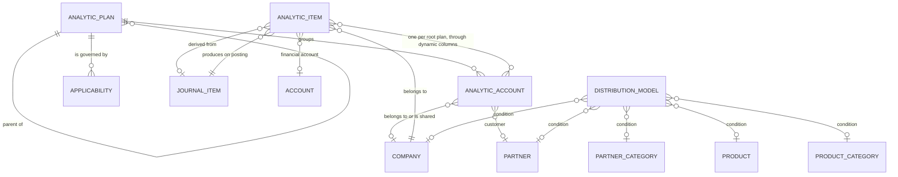

# Analytic Accounting — Entities

This file specifies every entity of the domain in full: purpose, lifecycle, complete field
table, relations, uniqueness rules, defaults, computed fields with their rules, ordering,
display rule, archival behaviour and multi-company behaviour. It also specifies the **dynamic
column contract** — the run-time creation of one stored column per root plan — because a rebuild
cannot reproduce this domain without it.

Field tables use three columns: the field with its storage name, its type, and its meaning and
rules. A field marked *stored* has a real column; a field marked *derived* is recomputed on read
and has no column unless the table says otherwise.

---

## 1. Analytic Plan

**Analytic Plan** (`account.analytic.plan`, table `account_analytic_plan`) is one axis of
analysis.

### 1.1 Purpose

A plan groups the analytic accounts that answer one question. "Projects" answers *which
project*; "Departments" answers *which department*; "Vehicles" answers *which vehicle*. Plans
form a tree: a plan may have a parent plan and any number of child plans. The topmost ancestor of
a plan is its **root plan**, and only root plans are axes in the full sense — only they receive a
stored column on the records that carry analysis, and only they are counted when a distribution
is validated.

Sub-plans exist so that one axis can be sub-divided for reporting: a root plan "Projects" may
have sub-plans "Internal" and "Customer", each holding its own analytic accounts. An amount
tagged with an account of a sub-plan is, for every purpose except grouping, tagged on the root.

### 1.2 Lifecycle

| Event | What happens |
|---|---|
| Created | The plan takes a random colour, a sequence of ten and a default applicability. The cached answer to *which plans are relevant* is dropped. Creating a plan alone does **not** create a column; the column is created when the plan's name is written, which the creation itself does. |
| Renamed | The dynamic columns of every model carrying analysis are re-synchronised, which renames the column's label. |
| Re-parented | Before the change, analytic items are moved from the plan's old column to the new root's column. After the change the columns are re-synchronised: a plan that gained a parent loses its stored column and gains a derived grouping column; a plan that lost its parent gains a stored column. After a plan is detached from its parent, the items are moved back. |
| Default applicability written | The cached answer to *which plans are relevant* is dropped. |
| Deleted | The plan's stored column is deleted. Derived grouping columns are deleted unless another plan still sits at the same depth in the same root. The cached answer is dropped, along with the whole stable cache. Children are deleted with the parent, because the parent link cascades. |

### 1.3 Field table

| Field (storage name) | Type | Meaning and rules |
|---|---|---|
| Name (`name`) | Text, translatable | **Required.** Writing it re-synchronises the dynamic columns on every model that carries analysis, so that the column's label follows the plan's name. |
| Description (`description`) | Long text | Free text. |
| Parent (`parent_id`) | Link to Analytic Plan | Indexed when not empty. Deleting the parent deletes this plan. The selectable set excludes this plan and all its descendants. Writing it re-synchronises the dynamic columns and moves analytic items between columns (see §2.6). |
| Materialised path (`parent_path`) | Text, indexed | **Maintained by the tree machinery.** The slash-separated chain of ancestor identifiers ending with this plan's own identifier and a trailing slash, for example `4/17/23/`. |
| Root plan (`root_id`) | Link to Analytic Plan | **Derived, not stored.** The first identifier of the materialised path, read as a plan; when the path is empty, the plan itself. Searchable: a search for a given root is translated into a materialised-path prefix test. |
| Children (`children_ids`) | Collection of Analytic Plan | The plans whose parent is this one. |
| Children count (`children_count`) | Whole number | **Derived, not stored.** The number of direct children. |
| Complete name (`complete_name`) | Text | **Derived and stored, recursive.** The parent's complete name, a space, a solidus, a space, and this plan's name; or just the name when there is no parent. Example: `Projects / Customer / Retainers`. |
| Accounts (`account_ids`) | Collection of Analytic Account | The analytic accounts whose plan is this one — **direct members only**, not the sub-plans' accounts. |
| Analytic accounts count (`account_count`) | Whole number | **Derived, not stored.** The number of direct member accounts. |
| All analytic accounts count (`all_account_count`) | Whole number | **Derived, not stored.** The number of analytic accounts in this plan **and in every descendant plan**. Computed by matching descendants on the materialised-path prefix and counting accounts grouped by plan. |
| Colour (`color`) | Whole number | **Default: a random whole number from one to eleven inclusive.** Used to tint the plan's chips in the distribution editor. |
| Sequence (`sequence`) | Whole number | **Default ten.** Orders the plans; the first sort key. |
| Default applicability (`default_applicability`) | Selection, **company-dependent** | The applicability used when no applicability rule wins. Values: `optional` — *Optional*; `mandatory` — *Mandatory*; `unavailable` — *Unavailable*. Company-dependent means the value is held per company, so the same plan may be mandatory in one company and optional in another. On installation the system-wide default value for this field is set to `optional`. |
| Applicability rules (`applicability_ids`) | Collection of Analytic Plan Applicability | The rules attached to this plan. The interface restricts the visible rules to those of the reader's current company. |

### 1.4 Ordering, display and search

- **Ordering:** sequence ascending, then internal identifier ascending.
- **Display name:** the complete name.
- **Tree storage:** the plan is a materialised-path tree, so descendant tests are prefix tests
  rather than recursive queries.

### 1.5 Validation

| Rule | Condition | Message |
|---|---|---|
| The base plan cannot be given a parent | When a user selects a parent for the plan designated as the base plan (see §2.2), the change is refused as the parent is chosen. | *You cannot add a parent to the base plan 'the plan name'* |
| A base plan must exist | Whenever the set of root plans is resolved, the base plan is read from the system parameter; if it is missing, every operation that needs the plan list fails. | *A 'Project' plan needs to exist and its id needs to be set as `analytic.project_plan` in the system variables* |

### 1.6 Multi-company behaviour

A plan itself has **no company**: it is global. Two things about it are per-company: its default
applicability, which is a company-dependent value, and its applicability rules, each of which may
name a company. A plan is therefore visible everywhere but may behave differently in each
company.

---

## 2. The dynamic column contract

This section specifies behaviour that has no field table, because it *is* the creation of
fields. Every model that carries analysis implements the **Analytic Plan Fields Mixin**
(`analytic.plan.fields.mixin`), and for each root plan the system creates a real stored column on
that model's table.

### 2.1 Which models carry the columns

Every model that declares itself a descendant of the Analytic Plan Fields Mixin. In the delivered
system the analytic item is the only such model, but the mechanism is written to serve any number
of them, and the synchronisation walks the whole set.

### 2.2 The base plan

One root plan is designated the **base plan**. Its identity is held in the system parameter
`analytic.project_plan` (the base-plan parameter), whose shipped value is the identifier of the
plan named *Project* delivered as reference data. The base plan is special in exactly one way:
its stored column is named `account_id` (project account) rather than being derived from its
identifier. Everything else about it is ordinary.

The list of root plans is resolved as: the base plan first, then every other plan with no parent,
read with elevated rights and cached for the process. Both halves are needed together in several
places, and the base plan always comes first.

### 2.3 Column naming

```formula
strict_column_name( plan ) = "account_id"                    when the plan is the base plan
strict_column_name( plan ) = "x_plan" + plan_identifier + "_id"   otherwise

column_name( plan ) = strict_column_name( root_plan_of( plan ) )
```

So an account belonging to a sub-plan is stored in the column of that sub-plan's **root**. A
sub-plan never owns a stored column.

Worked example. The base plan has identifier one. A root plan *Departments* has identifier
fourteen. A sub-plan *Engineering* under *Departments* has identifier twenty-two.

| Plan | Root | Strict column name | Column name actually used |
|---|---|---|---|
| Base plan (identifier 1) | itself | `account_id` | `account_id` |
| *Departments* (14) | itself | `x_plan14_id` | `x_plan14_id` |
| *Engineering* (22) | *Departments* | `x_plan22_id` (never created) | `x_plan14_id` |

### 2.4 The grouping column of a sub-plan

A sub-plan does not own a stored column, but it does own a **derived** column, so that a report
can group by "the sub-plan at depth one of the Departments axis".

```formula
depth( plan ) = ( number of slashes in the materialised path ) − 1

hierarchy_name( plan ) = column_name( plan ) + "_" + depth( plan )
hierarchy_name( plan ) = "x_" + that                       when it begins with "account_id"
```

The derived column is a link to an Analytic **Plan** (not an account), not stored, read-only,
whose value is read through the chain: the stored account column, then that account's plan, then
that plan's parent repeated *depth minus one* times. Its label is the root plan's name followed
by a space and the depth in parentheses.

Worked example, continuing the previous one. *Engineering* has materialised path `14/22/`, which
contains two slashes, so its depth is one. Its grouping column is `x_plan14_id_1`, its value
chain is "the account in `x_plan14_id`, then that account's plan" (the parent step is repeated
zero times), and its label is `Departments (1)`.

A sub-sub-plan *Platform* under *Engineering*, path `14/22/31/`, has depth two, grouping column
`x_plan14_id_2`, value chain "the account in `x_plan14_id`, then its plan, then that plan's
parent", and label `Departments (2)`.

For a sub-plan of the **base** plan, the name would begin with `account_id`, so it is prefixed:
depth one gives `x_account_id_1`.

### 2.5 Synchronisation

Whenever a plan's name or parent is written, every model carrying analysis is re-synchronised.
For one model, the plans are processed **sorted by materialised path**, so that a parent is always
handled before its children:

1. **The plan has a parent.**
   1. If a stored column exists for this plan, delete it. (The deletion is performed with the
      package-uninstall marker raised, so that the column is dropped outright rather than being
      protected.)
   2. Compute the grouping column's name and its label.
   3. If no grouping column exists with that name, create it: a link to Analytic Plan, manual,
      on this model, not stored, read-only, with the related chain of §2.4.
   4. Otherwise just refresh its label.
2. **The plan has no parent** (it is a root).
   1. If a grouping column exists for this plan, delete it with the uninstall marker raised.
   2. Compute the stored column's name; the label is the plan's name.
   3. If no stored column exists with that name, create it: a link to Analytic Account, manual,
      on this model, **copied** when a record is duplicated, with a deletion rule of **restrict**
      so that an analytic account still referenced cannot be deleted. Then, when the model has a
      real table, create a **partial** balanced-tree index on that column covering only the rows
      where the column is not empty, and mark the field as indexed.
   4. Otherwise just refresh its label.
3. Recurse into the plan's children.

### 2.6 Deleting a plan and its columns

1. Delete the stored columns of the plans being deleted.
2. Collect their grouping columns.
3. Delete the plans themselves (children cascade).
4. Delete each collected grouping column **unless it is still in use** — that is, unless some
   plan still exists whose root is the root the column belongs to and whose depth is at least the
   column's depth. The test reads the root plan's identifier out of the column name (falling back
   to the base plan when the name carries no digits) and the depth from the trailing number, then
   searches for a plan with that root whose materialised path has at least that many path
   separators.
5. Clear the stable cache and drop the cached answer to *which plans are relevant*.

### 2.7 Moving analytic items between columns

Whenever the column that should hold a set of analytic accounts changes — because an account
moved to another plan, or because a plan gained or lost a parent — the analytic items are
rewritten in place.

Algorithm, given a new column name, a current column name and a set of analytic accounts:

1. If the two names are equal, do nothing.
2. Look for at least one analytic item where the **new** column already holds a value that is
   neither one of these accounts nor empty, and the **current** column holds one of these
   accounts. Such an item would have to hold two accounts of the same axis, which is impossible,
   so:
   - Raise a redirecting warning with the message
     *Whoa there! Making this change would wipe out your current data. Let's avoid that, shall
     we?*, an action opening the offending analytic items in a list, and a button labelled
     **See them**.
3. Otherwise, in one statement, set the new column to the current column's value and clear the
   current column, for every analytic item whose current column holds one of these accounts.
4. Invalidate the cached analytic items.

Note the deliberate exception in step 2: an item where the new column **already holds the same
account** is not a conflict, because the rewrite is a no-operation for it.

### 2.8 The mixin's own fields

| Field (storage name) | Type | Meaning and rules |
|---|---|---|
| Project Account (`account_id`) | Link to Analytic Account | The stored column of the base plan. Deletion rule **restrict**, indexed, company-checked. Its label is replaced at run time by the base plan's name. |
| Analytic Account (`auto_account_id`) | Link to Analytic Account | **Derived, not stored, writable, searchable.** A magic column standing for *all* the plan columns at once. Reading it returns the value of the column of the plan named in the reader's context; writing it writes into the column of the chosen account's own plan; searching it expands into a disjunction over every root plan's column. Used as the reverse side of the analytic account's list of items, and as syntactic sugar in search views. |

Derived helpers the mixin provides, all of which a rebuild needs:

| Helper | Result |
|---|---|
| Plan column names | The column names of the base plan and every other root plan, keeping only those that actually exist on this model. |
| Analytic accounts of a record | The accounts held in those columns, skipping the empty ones. |
| Distribution key of a record | Those accounts' identifiers joined by commas, in plan order. |
| Distribution of a record | The empty map when there is no account; otherwise a single entry mapping the distribution key to one hundred. |
| Mandatory plans for a company and a business domain | The name and column name of every relevant plan whose applicability is `mandatory`. |
| Domain for a plan | Accounts whose plan is that plan or any descendant of it. |

### 2.9 The mixin's constraint

| Rule | Condition | Message |
|---|---|---|
| At least one account | A record carrying plan columns must have a value in at least one of them. Checked whenever any plan column is written. | *At least one analytic account must be set* |

### 2.10 Defaulting and presentation

- **Defaulting.** When the reader's context names a default analytic account, the record is
  created with that account placed in the column of **its own plan's root**, whichever that is.
- **Field labels and domains.** When the reader may read plans, each plan column's label is
  replaced by the plan's name and its selectable set is restricted to accounts of that plan or
  any descendant.
- **View patching.** When a view contains the base plan's column, a column for every other root
  plan is inserted immediately after it, in reverse plan order so that the final order matches
  the plan order, each carrying its own restricted set and a default plan for creation. In a
  search view the base plan's column additionally receives its restriction explicitly. When a
  view contains a filter on the base plan's column, a grouping filter is inserted for every other
  root plan and, for each root plan, a grouping filter for every depth of sub-plan that has a
  grouping column.
- All of the patching is skipped when the reader is using the view-customisation tool, so that the
  stored view definition is edited rather than the patched one.

---

## 3. Analytic Plan Applicability

**Analytic Plan Applicability** (`account.analytic.applicability`, table
`account_analytic_applicability`) is one rule that overrides a plan's default applicability.

### 3.1 Field table

| Field (storage name) | Type | Meaning and rules |
|---|---|---|
| Plan (`analytic_plan_id`) | Link to Analytic Plan | Indexed when not empty. The plan this rule belongs to. |
| Domain (`business_domain`) | Selection | **Required.** The kind of document the rule applies to. Base value: `general` — *Miscellaneous*. The accounting package adds `invoice` — *Invoice* and `bill` — *Vendor Bill*; both are removed when that package is removed. |
| Applicability (`applicability`) | Selection | **Required.** Values: `optional` — *Optional*; `mandatory` — *Mandatory*; `unavailable` — *Unavailable*. |
| Company (`company_id`) | Link to Company | **Default: the company the reader is acting for.** May be empty, meaning the rule applies to every company. |
| Financial Accounts Prefixes (`account_prefix`) | Text | *Added by the accounting package.* One or more prefixes, separated by commas or semicolons. The rule applies only when the financial account's code begins with one of them. |
| Product Category (`product_categ_id`) | Link to Product Category | *Added by the accounting package.* The rule applies only when the product's category is this one. |
| Show the prefix field (`display_account_prefix`) | Boolean | **Derived, not stored.** True when the business domain is `general`, `invoice` or `bill`. |
| Prefix placeholder (`account_prefix_placeholder`) | Text | **Derived, not stored.** A hint of the form *e.g.* followed by three comma-separated numbers. For a rule on `bill` the numbers are derived from the first expense account's code; otherwise from the first income account's code. The first two characters of that code are read as a number, and the hint shows that number and the next two. When there is no such account, or the two characters are not a number, the hint falls back to `60, 61, 62` for a bill and `40, 41, 42` otherwise. |

### 3.2 Scoring

The score of a rule and the selection of the winner are specified as arithmetic in
[calculations.md](calculations.md) §6.

### 3.3 Lifecycle and caching

Creating, writing or deleting a rule drops the cached answer to *which plans are relevant*.

### 3.4 Multi-company behaviour

Company scoping is *parent-of*: a rule belonging to a parent company is visible to its branches.
The record rule restricts visibility to rules with no company or whose company is a parent of one
of the reader's companies.

---

## 4. Analytic Account

**Analytic Account** (`account.analytic.account`, table `account_analytic_account`) is one value
on one axis.

### 4.1 Purpose and lifecycle

An analytic account is the thing an amount is tagged with: a project, a department, a vehicle, a
customer contract. It belongs to exactly one plan and, through it, to exactly one root plan. It
accumulates analytic items and exposes their total as a balance. It can be archived when the
work it represents is finished; archiving hides it from selection and, crucially, prevents the
posting of any entry that still refers to it.

The entity carries a discussion thread, so that changes to its name, its reference, its customer
and its archival flag are tracked and can be discussed.

### 4.2 Field table

| Field (storage name) | Type | Meaning and rules |
|---|---|---|
| Analytic Account (`name`) | Text, translatable | **Required, tracked**, indexed for partial-word search. The account's name. |
| Reference (`code`) | Text, indexed, tracked | A short code shown in brackets before the name in the display name. |
| Active (`active`) | Boolean | **Default true, tracked.** An archived account is hidden from selection. Posting an entry that refers to an archived account is refused (see [business-rules.md](business-rules.md)). |
| Plan (`plan_id`) | Link to Analytic Plan | **Required, indexed.** Writing it moves the account's analytic items from the old root's column to the new root's column (see §2.7). |
| Root Plan (`root_plan_id`) | Link to Analytic Plan | **Derived from the plan's root and stored.** The axis this account belongs to. Every validation and every accumulation is keyed on this. |
| Colour Index (`color`) | Whole number | **Derived from the plan's colour**, not stored separately. |
| Analytic Items (`line_ids`) | Collection of Analytic Item | The items tagged with this account. The link is made through the magic column of §2.8, so the reader's context must name the plan for the collection to resolve. |
| Company (`company_id`) | Link to Company | **Default: the company the reader is acting for.** May be empty, meaning the account is shared by every company. |
| Customer (`partner_id`) | Link to Partner | Indexed when not empty, **tracked**, company-checked. Searched with elevated rights for speed. Appears in the display name. |
| Balance (`balance`) | Money in the account's currency | **Derived, not stored.** See [calculations.md](calculations.md) §9. |
| Debit (`debit`) | Money | **Derived, not stored.** The negated total of the negative items, so a positive number. |
| Credit (`credit`) | Money | **Derived, not stored.** The total of the positive items. |
| Currency (`currency_id`) | Link to Currency | **Derived from the company's currency.** |
| Invoice count (`invoice_count`) | Whole number | *Added by the accounting package.* **Derived, not stored.** The number of posted sale documents, receipts included, having at least one journal item whose distribution names this account. |
| Vendor bill count (`vendor_bill_count`) | Whole number | *Added by the accounting package.* **Derived, not stored.** The same for purchase documents, receipts included. |

### 4.3 Ordering, display and search

- **Ordering:** by plan, then by name ascending.
- **Name search:** matches the name and the reference.
- **Display name**, assembled in this order:

  ```formula
  display_name = name
  display_name = "[" + code + "] " + display_name                          when a reference is set
  display_name = display_name + " - " + commercial_partner_name            when the customer has a commercial partner with a name
  ```

  Worked example: an account named *Website redesign* with reference `WEB-01` whose customer is a
  contact of the company *Acme* displays as `[WEB-01] Website redesign - Acme`.
- **Duplication:** the copy's name is the original's name followed by a space and the word
  *(copy)* in parentheses, unless a name was supplied to the copy.
- **Reading one record through the web client** additionally puts the account's plan into the
  reader's context, so that the magic column of §2.8 resolves to the right stored column.

### 4.4 Validation

| Rule | Condition | Message |
|---|---|---|
| Company consistency with existing items | When the company is written, the change is refused if any analytic item tagged with the account belongs to a company that is not the new company or one of its descendants. | *You can't change the company of an analytic account that already has analytic items! It's a recipe for an analytical disaster!* |
| Column rewrite conflict | When the plan is written and the move of §2.7 would overwrite an account already present in the destination column. | *Whoa there! Making this change would wipe out your current data. Let's avoid that, shall we?* with a button **See them**. |

### 4.5 Grouped totals

The balance, the debit and the credit are not stored, so they cannot be summed by the query
engine. When a list of accounts is grouped and a total of one of them is requested, the system
substitutes a collection of the records in the group and sums the figures in memory. Two
aggregation shapes are supported, a plain sum and a sum after converting each account's figure
from its own company's currency into the reader's company currency. See
[calculations.md](calculations.md) §9.3.

### 4.6 Multi-company behaviour

Company scoping is *parent-of*: an account belonging to a parent company is usable by its
branches. An account with no company is usable everywhere. The record rule admits accounts with
no company and accounts whose company is a parent of one of the reader's companies.

---

## 5. Analytic Item

**Analytic Item** (`account.analytic.line`, table `account_analytic_line`) is one dated, signed
amount posted against one account per axis.

### 5.1 Purpose and lifecycle

An analytic item is the analytic book's equivalent of a journal item, with two differences: it
does not balance against anything, and it carries **one account per axis** rather than one
account. Most items are created by the posting of a journal entry and destroyed when that entry
is reset to draft. Some are created directly by other domains — a timesheet line is an analytic
item — and those drive the distribution on their journal item in the opposite direction.

### 5.2 Field table

| Field (storage name) | Type | Meaning and rules |
|---|---|---|
| Description (`name`) | Text | **Required.** See [calculations.md](calculations.md) §11 for the default built from a journal item. |
| Date (`date`) | Date | **Required, indexed, default: today in the reader's time zone.** |
| Amount (`amount`) | Money in the item's currency | **Required, default zero.** Negative for a cost, positive for a revenue. |
| Quantity (`unit_amount`) | Decimal | **Default zero.** The quantity behind the amount. Copied whole from the journal item to every slice, never divided. |
| Unit (`product_uom_id`) | Link to Unit of Measure | The unit the quantity is expressed in. |
| Partner (`partner_id`) | Link to Partner | Company-checked. When the item comes from a journal item, it is **derived and stored** from that journal item's partner and remains writable; the stored value is kept when the journal item has none. |
| User (`user_id`) | Link to User | **Indexed. Default:** the user named in the reader's context, or else the acting user. |
| Company (`company_id`) | Link to Company | **Required, read-only, default: the company the reader is acting for.** |
| Currency (`currency_id`) | Link to Currency | **Derived from the company's currency and stored**, read-only, computed with elevated rights. |
| Category (`category`) | Selection | **Default `other`.** Base value: `other` — *Other*. The accounting package adds `invoice` — *Customer Invoice* and `vendor_bill` — *Vendor Bill*. |
| Fiscal year search (`fiscal_year_search`) | Boolean | **Search-only, not stored, not exportable, not translated.** Searching on it is rewritten as: the item's date is on or after the start of the company's current fiscal year, minus one year. |
| Analytic Distribution (`analytic_distribution`) | Structured document | **Derived, not stored, writable.** Reading it returns a single entry mapping the item's own distribution key to one hundred. Writing it splits the item — see §5.5. |
| Percentage precision (`analytic_precision`) | Whole number | **Not stored. Default:** the digit count of the decimal precision record named `Percentage Analytic`. Carried so that the distribution editor knows how many digits to allow. |
| Product (`product_id`) | Link to Product Variant | *Added by the accounting package.* Company-checked, indexed when not empty. |
| Product category (`product_category`) | Link to Product Category | *Added by the accounting package.* **Derived from the product's category.** |
| Financial Account (`general_account_id`) | Link to Account | *Added by the accounting package.* **Derived from the journal item's account and stored, writable.** Deletion rule restrict, company-checked, indexed when not empty. |
| Financial Journal (`journal_id`) | Link to Journal | *Added by the accounting package.* **Derived from the journal item's journal and stored**, read-only, company-checked. |
| Journal Item (`move_line_id`) | Link to Journal Item | *Added by the accounting package.* Indexed, company-checked. **Deleting the journal item deletes the analytic item.** |
| Code (`code`) | Text, at most eight characters | *Added by the accounting package.* A short free code. |
| Reference (`ref`) | Text | *Added by the accounting package.* Copied from the journal item's reference. |
| Profitability (`analytic_profitability`) | Selection | *Added by the accounting package.* **Derived, not stored, searchable and sortable.** Values: `uncategorized` — *Uncategorized*; `revenue` — *Revenue*; `loss` — *Loss*. See [calculations.md](calculations.md) §12. |
| One column per root plan | Links to Analytic Account | Created at run time. See §2. |
| Analytic Account (`auto_account_id`) | Link to Analytic Account | The magic column of §2.8. |

### 5.3 Ordering

Date descending, then internal identifier descending. The most recent item is first, and among
items of the same date the most recently created.

### 5.4 Validation

| Rule | Condition | Message |
|---|---|---|
| At least one account | Inherited from the mixin (§2.9). | *At least one analytic account must be set* |
| Financial account consistency | When the item is linked to a journal item, its financial account must equal that journal item's account. Checked whenever either is written. | *The journal item is not linked to the correct financial account* |

### 5.5 Writing a distribution onto an analytic item

An analytic item exposes a distribution of its own, and writing it **splits the item**:

1. Merge the item's current distribution — a single entry mapping its own key to one hundred —
   with the incoming one, by the merge algorithm of [calculations.md](calculations.md) §8.
2. If the merged result is empty, do nothing for this item.
3. Determine the name of the field that carries the amount to split. For an ordinary analytic
   item this is the amount; other domains may redirect it to their own quantity field.
4. Build one set of values per entry of the merged distribution: the split amount, which is the
   item's current amount times the entry's percentage divided by one hundred; every plan column
   cleared; and then the plan column of each account named in the entry's key set to that
   account.
5. Write the **first** set of values onto the item itself.
6. Duplicate the item once per remaining set of values, applying each set to its copy.
7. When any copy was made, send the acting user a success notification reading
   *the number of created items* followed by a space and the words *analytic lines created*.

Worked example. An analytic item of minus one thousand tagged with account twelve of the root
plan *Projects* receives the distribution `{ "12" : 60 , "13" : 40 }` with no update marker, so
the merge returns the incoming distribution unchanged. Two sets of values are built: minus six
hundred with account twelve, and minus four hundred with account thirteen. The item itself
becomes minus six hundred, and one new item of minus four hundred is created. The user is told
*1 analytic lines created*.

### 5.6 Keeping the journal item's distribution in step

Creating, writing or deleting an analytic item re-derives the distribution of the journal item it
belongs to, by the back-computation of [calculations.md](calculations.md) §5:

| Operation | Trigger |
|---|---|
| Creation | Always, for the journal items of the created analytic items. |
| Write | Only when the write touches the amount, the journal item link, or any plan column. When the journal item link changed, both the old and the new journal items are re-derived. |
| Deletion | Always, for the journal items of the deleted analytic items. |

All three are suppressed while the synchronisation guard is raised.

### 5.7 Setting a product by hand

Choosing a product, a unit, a quantity or a currency on an analytic item recomputes the amount
from the product's cost, sets the financial account to the product's expense account, and fills
the unit from the product when none was chosen. The formula is in
[calculations.md](calculations.md) §11.1. When no product is chosen the recomputation does
nothing.

### 5.8 The list header

When a list of analytic items is opened in the context of one analytic account, its header reads
*Entries:* followed by a space and the account's name.

### 5.9 Multi-company behaviour

The record rule is strict — **not** parent-of: an analytic item is visible only when its company
is one of the reader's current companies. An item with no company is not visible. This is
deliberately tighter than the rule on analytic accounts.

---

## 6. Analytic Distribution Model

**Analytic Distribution Model** (`account.analytic.distribution.model`, table
`account_analytic_distribution_model`) pre-fills a distribution from the context of the document
being entered.

### 6.1 Purpose

A model is a standing instruction of the form "when a line concerns *this partner* / *this
product* / *this account prefix*, propose *this distribution*". Models are matched, ordered, and
combined as specified in [calculations.md](calculations.md) §7.

### 6.2 Field table

| Field (storage name) | Type | Meaning and rules |
|---|---|---|
| Sequence (`sequence`) | Whole number | **Default ten.** The first sort key, and therefore the whole of the specificity rule. Presented as a drag handle. |
| Partner (`partner_id`) | Link to Partner | Deleting the partner deletes the model. Empty means "any partner". |
| Partner Category (`partner_category_id`) | Link to Partner Category | Deleting the category deletes the model. Empty means "any category". |
| Company (`company_id`) | Link to Company | **Default: the company the reader is acting for.** Deleting the company deletes the model. Empty means "shared by every company". |
| Accounts Prefix (`account_prefix`) | Text | *Added by the accounting package.* One or more financial-account code prefixes separated by commas or semicolons. Empty means "any account". Evaluated in memory, not in the query. |
| Product (`product_id`) | Link to Product Variant | *Added by the accounting package.* Company-checked. Deleting the product deletes the model. |
| Product Category (`product_categ_id`) | Link to Product Category | *Added by the accounting package.* Deleting the category deletes the model. |
| Prefix placeholder (`prefix_placeholder`) | Text | *Added by the accounting package.* **Derived, not stored.** A hint of the form *e.g.* followed by three comma-separated numbers, derived from the first two characters of the first expense account's code of the reader's company, falling back to `60, 61, 62`. |
| Analytic Distribution (`analytic_distribution`) | Structured document | **Stored, copied, writable.** The distribution this model proposes. |
| Percentage precision (`analytic_precision`) | Whole number | Not stored; the digit count of the `Percentage Analytic` decimal precision record. |
| Analytic accounts of the distribution (`distribution_analytic_account_ids`) | Collection of Analytic Account | **Derived, not stored, searchable.** The distinct accounts named anywhere in the distribution, in first-appearance order, skipping identifiers that no longer exist. |

### 6.3 Ordering and display

- **Ordering:** sequence ascending, then internal identifier **descending**.
- **Display name:** the creation timestamp. A model has no name of its own.

### 6.4 Validation

| Rule | Condition | Message |
|---|---|---|
| Company consistency of the accounts | A model may not name an analytic account that belongs to a specific company unless the model belongs to that same company. Checked whenever the model's company is written, by matching the distribution's account identifiers against accounts having a company. | *You defined a distribution with analytic account(s) belonging to a specific company but a model shared between companies or with a different company* |

### 6.5 Multi-company behaviour

Company scoping is *parent-of*. The record rule admits models with no company and models whose
company is a parent of one of the reader's companies.

---

## 7. Analytic Mixin

**Analytic Mixin** (`analytic.mixin`) is the contract a record implements to carry a
distribution. It has no table of its own; every model that implements it gains the following
fields on its own table.

### 7.1 Fields contributed

| Field (storage name) | Type | Meaning and rules |
|---|---|---|
| Analytic Distribution (`analytic_distribution`) | Structured document | **Stored, copied, writable, derived and searchable.** The distribution attached to this record. The derivation does nothing by default; implementers override it. |
| Percentage precision (`analytic_precision`) | Whole number | **Not stored.** The digit count of the `Percentage Analytic` decimal precision record. |
| Analytic accounts of the distribution (`distribution_analytic_account_ids`) | Collection of Analytic Account | **Derived, not stored, searchable.** The distinct existing accounts named in the distribution. |

### 7.2 The index

On every implementing model that has a real table and stores the distribution, a generalised
inverted index is created over the **array of account identifiers** extracted from the
distribution's keys. Extraction is: take the keys of the structured document, render them as
text, and split that text on every run of non-digit characters. The index makes "which records
mention this analytic account" a fast query.

### 7.3 Searching a distribution

Searching the distribution field supports four shapes:

| Operator | Value | Behaviour |
|---|---|---|
| in / not in | a list containing the empty value | Passed through unchanged, so that "has no distribution" works. |
| in / not in | a list of account identifiers, or of names | Names are resolved to accounts by exact display-name match; the condition becomes an array-overlap test between the record's extracted identifiers and the given list. |
| contains / does not contain | a text fragment | Resolved to accounts by partial display-name match, then treated as the previous row. |
| anything else | — | Refused with *Operation not supported*. |

The negative form additionally admits records whose distribution is empty. When the resolution
finds no account at all, the condition collapses to a constant — false for the positive form and
true for the negative one.

A special case exists for the analytic grouping used by financial reports: when the reader's
context marks that grouping, the search is left untouched, because in that context the field
holds a different shape and lives in a temporary table.

### 7.4 Filtering in memory

When records are filtered in memory rather than by query, a condition on the distribution is
rewritten into the same condition on the derived list of analytic accounts, so that the operators
above behave identically.

### 7.5 Grouping by distribution

Grouping records by their distribution is supported with a restriction: the **only** aggregation
allowed is a count. The grouping works by expanding each record into one row per analytic account
mentioned in its distribution, and counting a per-model identifier rather than the record itself:

| Implementing model | Identifier counted |
|---|---|
| Journal item | its journal entry |
| Purchase order line | its order |
| Asset | itself |
| Expense | itself |

Any other model refuses the grouping, and any aggregation other than a count refuses with an
explicit failure naming the aggregation.

### 7.6 Normalisation on write and create

Every write and every creation normalises the percentages as specified in
[calculations.md](calculations.md) §1.3.

### 7.7 Validation

The conditional validation is specified in [calculations.md](calculations.md) §2.

---

## 8. Relationship summary



## 9. Invariants across entities

1. **Every analytic account has exactly one plan, and therefore exactly one root plan.**
2. **Every analytic item has at least one analytic account**, and at most one per root plan,
   because there is one column per root plan.
3. **The distribution on a journal item and the analytic items it owns agree**, in both
   directions: posting derives the items from the distribution, and editing the items re-derives
   the distribution.
4. **Analytic items do not balance.** There is no invariant relating the items of one entry to
   one another; each is independent.
5. **A sub-plan never owns a stored column**; its accounts live in the root's column.
6. **Percentages are stored rounded to the percentage precision.**
7. **An archived analytic account blocks posting** of any entry whose distribution names it.
