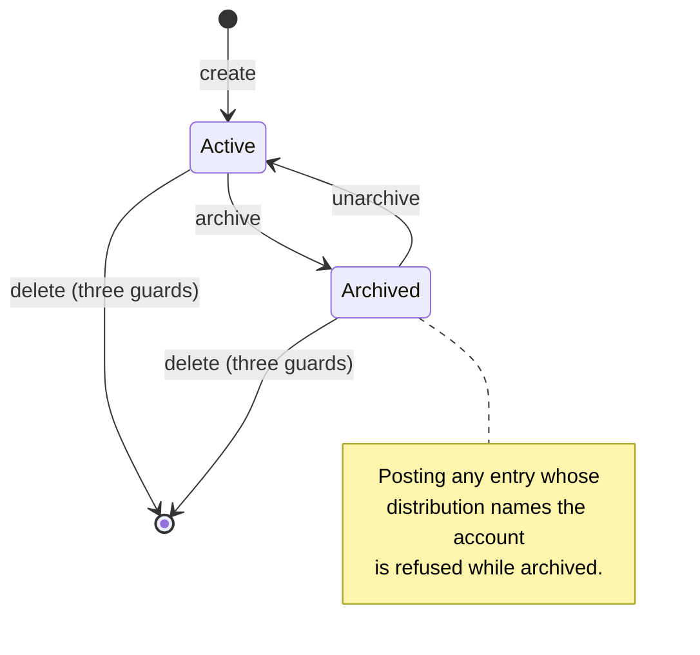
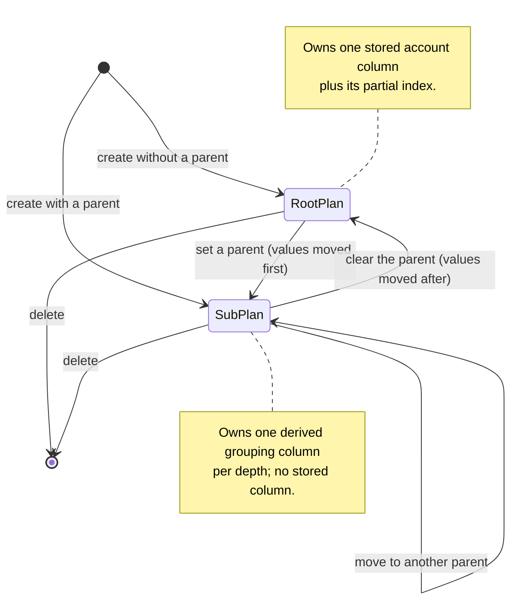
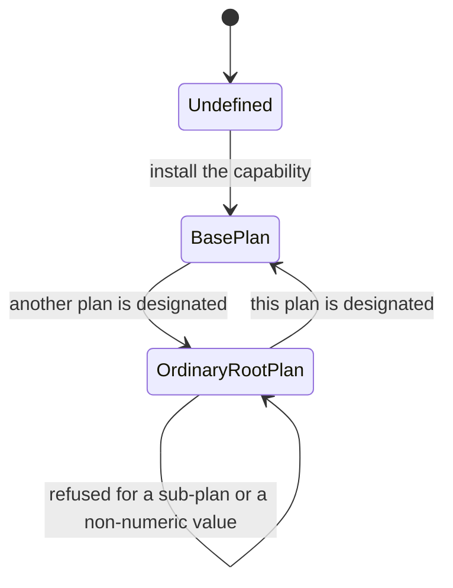
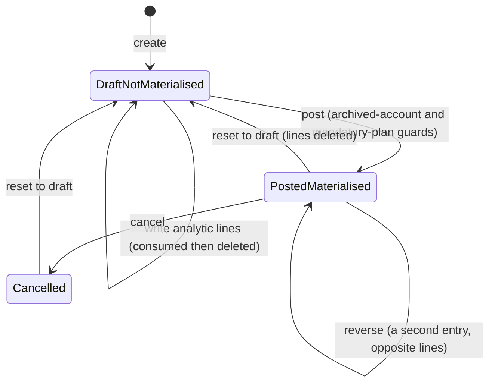
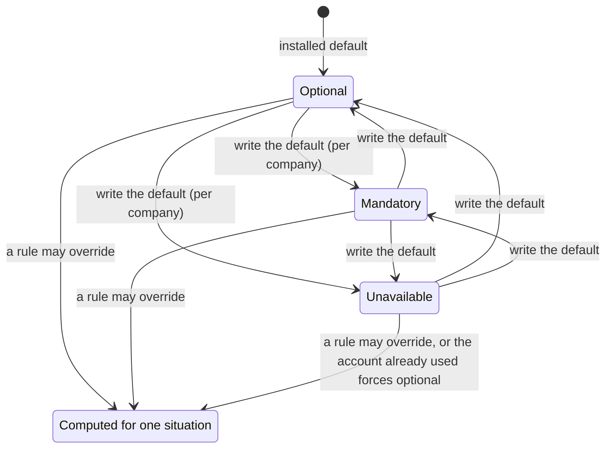
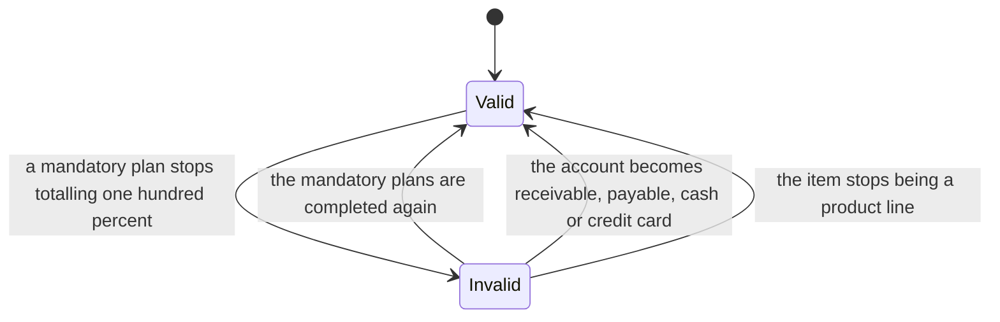

# Analytic Accounting — State Machines

This document specifies every state-bearing field of the domain: the states with their stored
value, their label and their meaning; the transitions with their trigger, their guard conditions,
their refusal message and their side effects; and a diagram for each machine.

The domain has no field literally named "state". It has six machines all the same, and a rebuild
that treats any of them casually produces the wrong records:

1. [The archival state of an analytic account](#1-the-archival-state-of-an-analytic-account)
2. [The hierarchy state of an analytic plan](#2-the-hierarchy-state-of-an-analytic-plan)
3. [The base-plan designation](#3-the-base-plan-designation)
4. [The analytic materialisation state of a journal entry](#4-the-analytic-materialisation-state-of-a-journal-entry)
5. [The applicability of a plan in a situation](#5-the-applicability-of-a-plan-in-a-situation)
6. [The distribution validity of a journal item](#6-the-distribution-validity-of-a-journal-item)
7. [Reconciliation notes](#7-reconciliation-notes)

Where a transition is refused, the message is reproduced exactly and the rule that carries it is
cited from [business-rules.md](business-rules.md).

---

## 1. The archival state of an analytic account

The field is `active` (active flag) on Analytic Account. It is required, defaults to true, is
copied when the record is duplicated and is **tracked** in the account's discussion thread.

### 1.1 States

| Value | Label | Meaning |
|---|---|---|
| `true` | Active | The account is offered in every value list, appears in the default lists, may be named in a new distribution, and does not block posting. |
| `false` | Archived | The account is hidden from the default lists and from the value lists of the distribution editor. Existing distributions and existing analytic lines keep referring to it and keep their amounts. Posting any journal entry whose distribution names it is refused. |

### 1.2 Transitions

| From | To | Trigger | Guards | Side effects |
|---|---|---|---|---|
| — | `true` | Create an analytic account | The name and the plan are set (`AA-037`) | The account becomes selectable in the column of its root plan; the account counts of its plan and of every ancestor plan increase by one |
| `true` | `false` | Archive, from the form's action menu or by writing the flag | none | A red ribbon reading "Archived" appears on the form; the change is written to the discussion thread; the account disappears from the default lists; every journal entry whose distribution names the account can no longer be posted (`AA-078`) |
| `false` | `true` | Unarchive | none | The change is written to the discussion thread; the posting block disappears |
| `true` or `false` | deleted | Delete | No expense names the account in its distribution (`AA-033`); no project bound to the account still has tasks (`AA-034`); no analytic line holds the account in a plan column (`AA-035`) | The account disappears; distributions that still name its identifier remain valid and silently ignore it (`AA-048`) |

### 1.3 Guards of the deletion, in order, with their messages

1. An expense refers to the account: "You cannot delete an analytic account that is used in an
   expense."
2. A project bound to the account still has tasks: "Before we can bid farewell to these accounts,
   you need to tidy up the projects linked to them by removing their existing tasks!"
3. An analytic line still holds the account in a plan column: the deletion rule of the column is
   restrict, so the platform refuses the deletion with its own restricted-deletion message,
   described in [../platform-foundation/business-rules.md](../platform-foundation/business-rules.md).

### 1.4 The effect of the archived state on posting

The posting guard reads, with elevated rights and with archived records included, the analytic
accounts named in the distributions of every journal item of the entries being posted, and refuses
when any of them is archived:

> You cannot post an entry with an archived analytic account: *the names of all the archived
> accounts found, separated by a comma and a space*

The guard runs before the accounting date is adjusted and before any analytic line is created, so a
refused posting leaves the entry in the draft state with no analytic line.

### 1.5 Diagram

---

## 2. The hierarchy state of an analytic plan

The state is carried by `parent_id` (parent plan) on Analytic Plan. It is not a selection field, but
it governs which columns exist on every model that carries analysis, so it behaves as a state
machine with two live states.

### 2.1 States

| State | Stored condition | Meaning |
|---|---|---|
| Root plan | `parent_id` is empty | The plan is an axis. It owns one stored analytic account column on every model that implements the Analytic Plan Fields Mixin, named `account_id` when it is the base plan and `x_plan` + its identifier + `_id` otherwise. It has an applicability, it is offered in distribution editors, and its own total is validated. |
| Sub-plan | `parent_id` is set | The plan is a subdivision of its root. It owns no stored column; its accounts live in the root's column. It owns one derived grouping column per depth on each such model. It has no applicability of its own and is never offered in a distribution editor. |

The **depth** of a plan is the number of solidus characters in its materialised path minus one:
zero for a root plan, one for its direct children, two for their children, and one more for each
further level.

### 2.2 Transitions

| From | To | Trigger | Guards | Side effects |
|---|---|---|---|---|
| — | Root plan | Create a plan with no parent | The name is set (`AA-001`) | The relevant-plan cache is dropped; the stored column and its partial index are created on every model that carries analysis; every open client reloads its definition of those models |
| — | Sub-plan | Create a plan with a parent | The name is set; the parent is neither the plan nor one of its descendants (`AA-002`) | The relevant-plan cache is dropped; the grouping column of the plan's depth is created if it does not exist yet; every open client reloads |
| Root plan | Sub-plan | Write a parent (demote) | The plan is not the base plan (`AA-003`); no analytic line would lose a value (`AA-011`) | **Before** the write, the analytic line values of every account of this plan and of its descendants are moved into the new parent's root column; the write then deletes the plan's stored column with the capability-removal marker raised and creates or relabels the grouping column of the new depth, recursing into the descendants |
| Root plan | Root plan (refused) | Write a parent when a conflict exists | — | Refused with "Whoa there! Making this change would wipe out your current data. Let's avoid that, shall we?" and a button labelled "See them"; nothing is written |
| Root plan | Root plan (refused) | Write a parent on the base plan | — | Refused, while the form is still being edited, with "You cannot add a parent to the base plan 'the plan name'" |
| Sub-plan | Root plan | Clear the parent (promote) | No analytic line would lose a value (`AA-011`) | The write happens **first**, creating the plan's stored column with its partial index and deleting the grouping column of the former depth when no plan remains at that level; the analytic line values are moved **after** the write, out of the former parent's root column into the plan's own column |
| Sub-plan | Sub-plan | Move to another parent | The new parent is neither the plan nor one of its descendants; no analytic line would lose a value | The values are moved into the new parent's root column before the write; the grouping columns of the old and the new depth are adjusted |
| Root plan or Sub-plan | deleted | Delete | No stored view definition names the column being removed (`AA-009`) | The plan's stored column is deleted with the values it held; the plan and all its descendants are deleted; the grouping columns that no longer match any surviving level are deleted; the registry cache and the relevant-plan cache are dropped |
| Root plan or Sub-plan | unchanged (refused) | Delete while a stored view names the column | — | Refused with "Cannot rename/delete fields that are still present in views:" followed by the field list and the view name; nothing is deleted |
| Root plan | Root plan | Rename | none | Only the label of the stored column changes, on every model; the column name never changes |
| Sub-plan | Sub-plan | Rename the root of its hierarchy | none | The label of every grouping column of that hierarchy becomes the new root name and the depth in parentheses |

### 2.3 The order of the two halves, and why it matters

`AA-012` is the whole of the difficulty: a demotion moves the values **before** the write, because
the plan's own column ceases to exist as part of that write; a promotion moves them **after**,
because the plan's own column is created as part of that write. A rebuild that performs the move on
the wrong side of the write loses every value the column held.

### 2.4 Worked transitions

- Plan *One* (root, column `x_plan5_id`) and plan *Two* (root, column `x_plan6_id`). An analytic
  line holds account 1 of *One* in `x_plan5_id` and nothing in `x_plan6_id`. Setting the parent of
  *One* to *Two* moves account 1 into `x_plan6_id`, clears `x_plan5_id`, then deletes `x_plan5_id`.
  Had the line held account 3 of *Two* in `x_plan6_id`, the conflict check would have refused the
  change, because the single remaining column cannot hold both accounts.
- With an intermediate level: *One* is a root plan, *Mid level* is its child, and account 1 belongs
  to *Mid level*. An analytic line holds account 1 in *One*'s column. Demoting *One* under *Two*
  moves account 1 into *Two*'s column, because the migration selects every account whose plan is
  *One* **or any descendant**. Promoting *One* again moves account 1 back.
- A parent plan has two children at depth one. Deleting the first keeps the grouping column of
  depth one, because the second still occupies that depth; deleting the second removes it
  (`AA-014`).

### 2.5 Diagram

---

## 3. The base-plan designation

Exactly one root plan is the **base plan** at any time. The state is not held on the plan but in the
system parameter `analytic.project_plan`, whose value is the plan's identifier written as digits.

### 3.1 States

| State | Condition | Meaning |
|---|---|---|
| Base plan | The parameter holds this plan's identifier | The plan's stored column is named `account_id` on every model that carries analysis. The plan is listed first wherever root plans are enumerated. It may never be given a parent. |
| Ordinary root plan | The parameter holds another identifier | The plan's stored column is named after its own identifier. |
| Undefined | The parameter is empty or names no existing plan | Every operation that needs the list of root plans fails with "A 'Project' plan needs to exist and its id needs to be set as `analytic.project_plan` in the system variables" |

### 3.2 Transitions

| From | To | Trigger | Guards | Side effects |
|---|---|---|---|---|
| Undefined | Base plan | Install the capability | none | The parameter is written with the identifier of the shipped plan named *Project*, and that plan is created when it does not already exist |
| Ordinary root plan | Base plan | Write the parameter with this plan's identifier | The value is a string of digits; the plan exists; the plan currently owns a stored column, which means it is a root plan (`AA-017`) | The former base plan is re-synchronised and therefore gains a generated column named after its identifier, **empty**; the generated column the new base plan owned until then is deleted with its contents; the fixed column keeps the values it held, which are from then on read as accounts of the new base plan |
| Ordinary root plan | unchanged (refused) | Write the parameter with a value that is not digits, names no plan, or names a sub-plan | — | Refused with "The value for the key must be the ID to a valid analytic plan that is not a subplan" |
| Base plan | Ordinary root plan | Another plan is designated | The same guards | The mirror of the row above |

### 3.3 The data consequence

No value is migrated by this transition (`AA-018`). The operation is therefore safe only before any
analytic line exists, and a rebuild must present it as a configuration-time decision.

### 3.4 Diagram

---

## 4. The analytic materialisation state of a journal entry

This is the machine a rebuild is most likely to get wrong. The state of the journal entry — a field
owned by [../general-ledger/state-machines.md](../general-ledger/state-machines.md) — decides
whether the analytic lines of its journal items exist.

### 4.1 States

| State | Stored value of the entry's state field | Meaning for this domain |
|---|---|---|
| Draft, not materialised | `draft` | The journal items may carry distributions, and those distributions are stored and editable, but **no analytic line exists** for any of them. Analytic lines created on such an item are consumed to rebuild its distribution and are then deleted immediately (`AA-073`). |
| Posted, materialised | `posted` | Each journal item with a non-empty distribution owns one analytic line per distribution entry whose rounded amount is not zero. The amounts of those lines add up exactly to the negated balance of the journal item for every plan the distribution completes to one hundred percent. |
| Cancelled | `cancel` | Reached from posted through the reset path, so the analytic lines have been deleted; the distributions survive. |

### 4.2 Transitions

| From | To | Trigger | Guards | Side effects |
|---|---|---|---|---|
| Draft, not materialised | Draft, not materialised | Write a distribution on a journal item | none | The written document is merged with the stored one (`AA-043`) and stored; nothing else happens |
| Draft, not materialised | Draft, not materialised | Create or write analytic lines on a journal item | The lines pass their own constraints (`AA-066`, `AA-067`) | The journal item's distribution is rebuilt from the created lines (`AA-093`); immediately afterwards the analytic lines of journal items of a draft entry are deleted with the synchronisation guard raised (`AA-073`) |
| Draft, not materialised | Posted, materialised | Post the entry | No analytic account named in any distribution is archived (`AA-078`); when the caller switched the validation flag on, every mandatory plan of every product line totals exactly one hundred percent (`AA-079` to `AA-083`); plus every guard of the general ledger | The accounting date is adjusted for the lock dates (`AA-094`); one analytic line is created per distribution entry whose rounded amount is not zero, with the closing-line rule and the rounding correction, in one batch, with the synchronisation guard raised |
| Draft, not materialised | Draft (refused) | Post with an archived account | — | Refused with "You cannot post an entry with an archived analytic account: the account names"; no analytic line is created |
| Draft, not materialised | Draft (refused) | Post with an incomplete mandatory plan | — | Refused with "One or more lines require a 100% analytic distribution."; when several entries were being posted, the refusal carries a redirect to a list titled "Items With Missing Analytic Distribution" behind a button labelled "See items"; no entry is posted |
| Posted, materialised | Posted, materialised | Write a distribution on a journal item | The entry is posted; the accounting date is not locked | The written document is merged with the stored one; every analytic line of that journal item is deleted and the lines are regenerated, with new identifiers, re-running the validation, the closing-line rule and the rounding correction (`AA-091`) |
| Posted, materialised | Posted, materialised | Create, edit or delete an analytic line by hand | The line passes its own constraints | The distributions of the journal items pointed at before and after the operation are rebuilt from their analytic lines, without regenerating the lines (`AA-093`) |
| Posted, materialised | Posted, fewer lines | Delete a journal item | The general ledger allows it | The analytic lines of that journal item are deleted by cascade (`AA-074`) |
| Posted, materialised | Draft, not materialised | Reset the entry to draft | The entry is posted or cancelled and the general ledger allows the reset | Every analytic line of every journal item of the entry is deleted with the synchronisation guard raised; the distributions are kept untouched, so posting again recreates equivalent lines with new identifiers |
| Posted, materialised | Cancelled | Cancel the entry | The same guards as the reset | The reset path runs first, so the analytic lines are deleted the same way |
| Cancelled | Draft, not materialised | Reset to draft | The general ledger allows it | Nothing more: the lines were already deleted |
| Posted, materialised | Posted, materialised (a second entry) | Reverse the entry | The general ledger allows it | The reversing entry copies the distributions; when **it** is posted, it produces the opposite analytic lines (section 18 of [calculations.md](calculations.md)); the original lines are kept |
| Any | unchanged | Archive an analytic account named in a distribution | none | Nothing changes for the existing lines; the next posting of any entry naming that account is refused |

### 4.3 The invariant

At every moment: an entry in the draft state owns no analytic line, and an entry in the posted state
owns exactly the analytic lines that its stored distributions produce, up to the manual edits of
`AA-093`, which rewrite the distributions rather than the lines.

### 4.4 Diagram

---

## 5. The applicability of a plan in a situation

This machine has no stored value of its own for the *answer*: the answer is computed for each
situation from the plan's stored default applicability and from its applicability rules. The
default applicability is a stored selection, held per company.

### 5.1 States of the stored default

| Value | Label | Meaning |
|---|---|---|
| `optional` | Optional | The plan is offered in the distribution editor; the reader may leave it empty. |
| `mandatory` | Mandatory | The plan is offered, its running total is shown in red until it reaches exactly one hundred percent and in green when it does, and a document whose lines do not complete it cannot be posted or confirmed from the interface. |
| `unavailable` | Unavailable | The plan is not offered at all, unless the record's distribution already names one of its accounts. |

The shipped system-wide default is `optional`. The value is stored per company, so the same plan may
be mandatory in one company and optional in another.

### 5.2 States of the computed answer

| Computed answer | How it is reached |
|---|---|
| `optional` | The default is `optional` and no rule beats the baseline; or a winning rule declares `optional`; or the plan is **forced** back into the list because the record already names one of its accounts although the computed answer was `unavailable` (`AA-029`); or the caller forced the applicability (`AA-030`). |
| `mandatory` | The default is `mandatory` and no rule beats the baseline, or a winning rule declares `mandatory`. |
| `unavailable` | The default is `unavailable` and no rule beats the baseline, or a winning rule declares `unavailable`. The plan is then omitted from the editor entirely. |
| not offered | The plan's whole sub-tree has no analytic account (`AA-028`), whatever the applicability; or the computed answer is `unavailable` and no account of the plan is already named. |

### 5.3 Transitions of the stored default

| From | To | Trigger | Guards | Side effects |
|---|---|---|---|---|
| any | any | Write the default applicability on a root plan, for the company the reader is acting for | The plan is a root plan; the value is one of the three | The relevant-plan cache is dropped (`AA-020`); other companies keep their own value |
| any | any | Create, write or delete an applicability rule | The rule carries a business domain and an applicability (`AA-022`) | The relevant-plan cache is dropped; the next document line sees the new rules |

### 5.4 The evaluation, restated as a decision

1. A forced applicability supplied by the caller is the answer; no rule is read.
2. Otherwise the current answer is the plan's default for the company, defended by a baseline score
   of zero point five.
3. Every rule that survives the company filter is scored; a score **strictly greater** than the
   current best replaces the answer.
4. The full arithmetic, including the elimination score of minus one, is in
   [calculations.md](calculations.md) section 2.

### 5.5 Diagram

---

## 6. The distribution validity of a journal item

The field is `has_invalid_analytics` (invalid analytics flag) on Journal Item. It is derived, not
stored, and recomputed whenever the account, the company, the entry, the product, the display type
or the distribution changes.

### 6.1 States

| Value | Meaning |
|---|---|
| `false` | Either the item is not subject to the check — it is not a product line, or its account type is receivable, payable, cash or credit card — or its distribution completes every mandatory plan of its situation. |
| `true` | The item is a product line on an account of another type, and its distribution fails the mandatory plan validation for its situation. The interface highlights the line. |

### 6.2 Transitions

| From | To | Trigger | Guards | Side effects |
|---|---|---|---|---|
| `false` | `true` | Write a distribution, an account, a product or a company that makes a mandatory plan incomplete | The item is a product line; its account type is none of the four excluded types | The line is highlighted; posting from the interface will be refused |
| `true` | `false` | Complete every mandatory plan, or change the account to one of the four excluded types, or change the display type away from a product line | — | The highlight disappears |

The computation runs the ordinary validation inside an exception guard and records only whether it
failed; it never raises, and it never prevents a write. It is a presentation aid only: the real
guard is the posting check of section 4.2.

### 6.3 Diagram

---

## 7. Reconciliation notes

1. **A missing document.** One of the two drafts of this folder had no state-machine document at
   all and described the lifecycles inside its workflow and entity files; the other listed the
   machines in its reading order but had not written them. This file is written from the state
   fields both drafts describe and from the source: the archival flag, the parent link, the base
   plan parameter, the entry state as it governs analytic lines, the applicability selection and
   the invalid analytics flag.
2. **Where the lifecycle tables lived.** The two state tables of the workflow-based draft — analytic
   lines against the entry state, and the position of a plan against the columns it owns — are
   superseded by sections 4 and 2 of this file, which carry the same rows plus the guards and the
   refusal messages. [workflows.md](workflows.md) now points here instead of repeating them.
3. **Cancellation.** One draft treated the cancelled state as a separate analytic state. The
   cancellation path reaches the draft state through the reset, so the analytic effect is the reset
   effect; section 4.2 states this explicitly rather than duplicating the rows.
