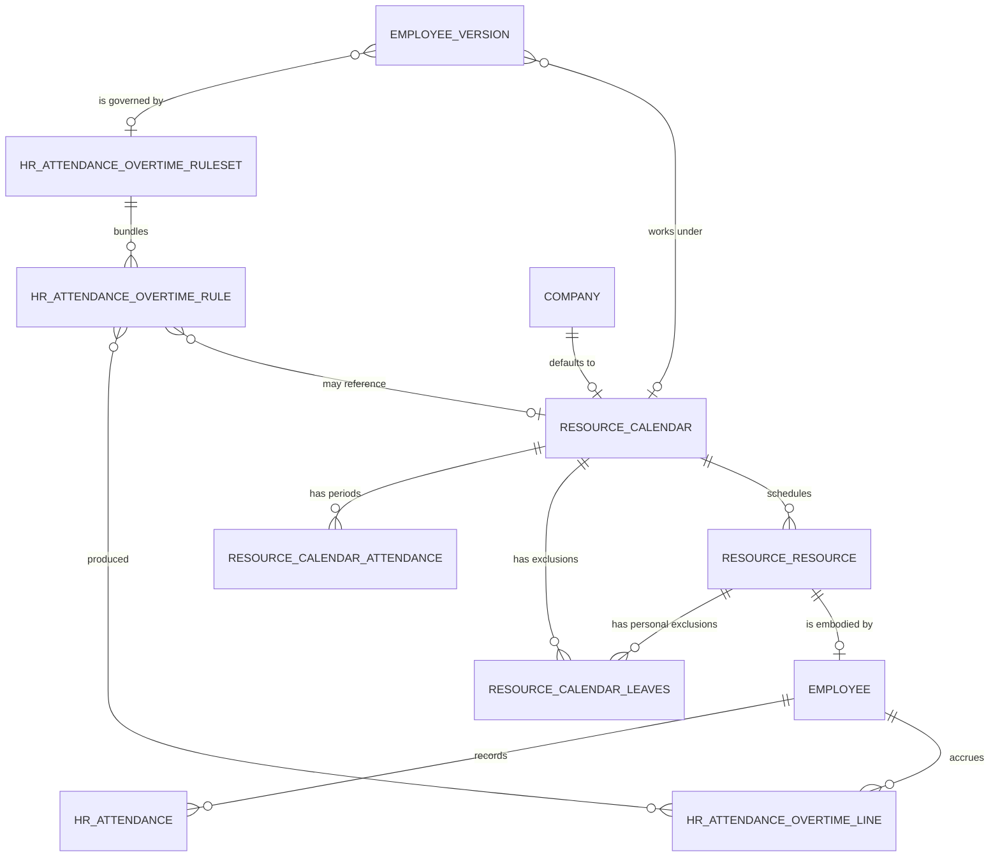

# Attendances and Working Time — Entities

This file specifies every entity of the domain: its purpose, its lifecycle, its complete
field table, its relations, its uniqueness rules, its defaults, its computed fields with
their rules, its ordering, its display rule, its archival behaviour, its multi-company
behaviour and the extension points other capability packages contribute to it.

Field tables carry five columns: the field with its **storage name** in code font, its
**full name** (the wording a person reads on screen), its type, the target of a relation
where there is one, and the meaning together with every rule that governs the field.
Where a field is computed, the computation is stated in words; where the computation is
long enough to be an algorithm, the table points at the chapter of
[calculations.md](calculations.md) or of
[working-schedule-algorithms.md](working-schedule-algorithms.md) that specifies it.

Three conventions apply throughout.

- **Audit fields.** Every persistent entity carries a surrogate integer identifier, a
  creation instant, a creating user, a last-modification instant and a
  last-modifying user. They are never repeated in the per-entity tables.
- **Archival.** An entity that supports archiving carries an activity flag defaulting to
  true. A record whose flag is false is excluded from every default search and from
  every relation search unless archived records are explicitly requested; it remains a
  valid target of pointers that already exist.
- **Decimal hours.** Every stored quantity of time in this domain is a decimal number of
  hours: the value `8.5` means eight hours and thirty minutes and `7.75` means seven
  hours and forty-five minutes. Screens render decimal hours in an hours-and-minutes
  notation, but no stored value is ever an hours-and-minutes string. The conversion is
  specified in
  [working-schedule-algorithms.md, chapter 1.3](working-schedule-algorithms.md#13-decimal-hours-and-their-conversion).

---

## 1. Entity map



The chain to read from left to right is: a **Working Schedule** is a pattern of
**Working Schedule Lines**; a **Resource** points at one Working Schedule (or at none);
an **Employee** owns exactly one Resource and, through its **Employee Version**, points
at the Working Schedule in force on any given date; **Attendances** belong to the
Employee; comparing Attendances against the Working Schedule through the **Overtime
Ruleset** attached to the Employee Version yields **Attendance Overtime Lines**.

---

## 2. Summary of entities

| Entity | Transport name | Storage name | Kind | Default ordering | Reference page |
|---|---|---|---|---|---|
| Working Schedule | `resource.calendar` | `resource_calendar` | persistent | by identifier (no explicit order) | [resource.calendar](../../references/entities/resource.calendar.md) |
| Working Schedule Line | `resource.calendar.attendance` | `resource_calendar_attendance` | persistent | sequence, week number, day of week, start hour | [resource.calendar.attendance](../../references/entities/resource.calendar.attendance.md) |
| Working Time Exclusion | `resource.calendar.leaves` | `resource_calendar_leaves` | persistent | start instant ascending | [resource.calendar.leaves](../../references/entities/resource.calendar.leaves.md) |
| Resource | `resource.resource` | `resource_resource` | persistent | name ascending | [resource.resource](../../references/entities/resource.resource.md) |
| Resource Mixin | `resource.mixin` | none (abstract) | abstract behaviour | inherited from the host entity | [resource.mixin](../../references/entities/resource.mixin.md) |
| Attendance | `hr.attendance` | `hr_attendance` | persistent | check-in descending | [hr.attendance](../../references/entities/hr.attendance.md) |
| Attendance Overtime Line | `hr.attendance.overtime.line` | `hr_attendance_overtime_line` | persistent | start instant ascending | [hr.attendance.overtime.line](../../references/entities/hr.attendance.overtime.line.md) |
| Overtime Rule | `hr.attendance.overtime.rule` | `hr_attendance_overtime_rule` | persistent | by identifier; presented by sequence inside a rule set | [hr.attendance.overtime.rule](../../references/entities/hr.attendance.overtime.rule.md) |
| Overtime Ruleset | `hr.attendance.overtime.ruleset` | `hr_attendance_overtime_ruleset` | persistent | by identifier | [hr.attendance.overtime.ruleset](../../references/entities/hr.attendance.overtime.ruleset.md) |
| Timesheet and Attendance Comparison | `hr.timesheet.attendance.report` | `hr_timesheet_attendance_report` | derived read-only table | date ascending inside the table; date descending when grouped | [hr.timesheet.attendance.report](../../references/entities/hr.timesheet.attendance.report.md) |
| Absence Ledger (shared, owned by [Time Off](../time-off/)) | `hr.leave.attendance.report` | `hr_leave_attendance_report` | derived read-only table | day descending, then employee | [hr.leave.attendance.report](../../references/entities/hr.leave.attendance.report.md) |

The full name recorded for `resource.calendar` in the machine-readable catalogue is
"Resource Working Time", for `resource.calendar.attendance` "Work Detail", for
`resource.calendar.leaves` "Resource Time Off Detail" and for `resource.resource`
"Resources"; those are the words the interface displays. This folder uses the canonical
business names **Working Schedule**, **Working Schedule Line**, **Working Time
Exclusion** and **Resource** in prose, because they say what the record is rather than
where it appears, and states the interface wording at the head of each chapter.

The Working Schedule Line is recorded in the shared catalogue as defined by the
scheduling capability package, and another capability package touches it during
installation; every field and every behaviour of that entity is nevertheless defined by
this domain and is specified in full here.

---

## 3. Working Schedule

**Working Schedule** (`resource.calendar`, table `resource_calendar`), displayed as
"Resource Working Time".

### 3.1 Purpose

A Working Schedule is the *written* definition of when work happens. It carries:

- a repeating pattern of periods (the Working Schedule Lines), either a one-week pattern
  or a two-week alternating pattern;
- the **time zone** in which the hours of that pattern are to be read — this is the
  single most consequential field in the entity, because the pattern says "eight
  o'clock" and only the time zone says *which* eight o'clock;
- its own closures (the global Working Time Exclusions attached to it);
- derived averages: hours per week, hours per day, number of working days per week, and
  the work-time rate against a full-time reference.

A Working Schedule is shared: many Resources point at the same schedule, and every
computation for those Resources reuses the same intervals. Each company has one default
Working Schedule, which is the fallback of every Resource without one, the source of the
full-time reference of every other schedule of that company, and the pattern copied into
every new schedule of that company.

- **Identity and uniqueness**: the surrogate identifier. Names are not unique; two
  companies commonly own schedules with the same name.
- **Default ordering**: by the surrogate identifier ascending; no explicit order is
  declared.
- **Display name rule**: the name.
- **Archival**: supported through the activity flag. Help text of that flag: "If the
  active field is set to false, it will allow you to hide the Working Time without
  removing it."
- **Hierarchy**: none. A schedule does, however, have a *reference* schedule: the
  default schedule of its company, from which the full-time reference is taken.

Three *shapes* of schedule exist and they behave differently in every algorithm, and two
*week layouts* cut across them.

| Dimension | Value | How recognised | Behaviour |
|---|---|---|---|
| Shape | Fully fixed | `schedule_type` is `fully_fixed` (the default) and `duration_based` is false | Periods have real start and end clock times. Work intervals are exactly those periods. |
| Shape | Duration based | `schedule_type` is `fully_fixed` and `duration_based` is true | Periods carry a *length* rather than meaningful clock times; the clock times are derived by centring the length on midday. Break periods are forbidden. |
| Shape | Flexible | `schedule_type` is `flexible`, which sets the flexible flag true | Periods are ignored for interval purposes. The schedule carries an hours-per-week and an hours-per-day budget; intervals are synthesised day by day, centred on midday, until the weekly budget is exhausted. |
| Week layout | Single week | `two_weeks_calendar` is false | The seven weekdays repeat every week. |
| Week layout | Two alternating weeks | `two_weeks_calendar` is true | The lines are split into a first week and a second week by two section markers; which week applies on a date is derived from the date itself. |

A **fully flexible** resource is a fourth case and is *not* a schedule shape: it is a
Resource with **no** Working Schedule at all. See
[chapter 6.4](#64-fully-flexible-resources).

### 3.2 Field table

| Field (storage name) | Full name | Type | Target | Meaning and rules |
|---|---|---|---|---|
| `name` | Name | single line text | | Required. The human name of the schedule. Default when creating from a form with a company already chosen: the phrase "Working Hours of " followed by the company name. Duplicating a schedule appends " (copy)". Copied on duplication. |
| `active` | Active | boolean | | Default true. Archival flag; copied on duplication. |
| `attendance_ids` | Working Time | one to many | Working Schedule Line, inverse `calendar_id` | The periods of the pattern, including break periods and, in two-week mode, the two section markers. Stored, computed, writable and copied when the schedule is duplicated. Recomputed (wholly replaced) whenever the company changes and the record either is new or previously had a different company: the new value is a copy of every period of the new company's default schedule, and at the same time the two-week flag and the time zone are copied from that schedule. |
| `attendance_ids_1st_week` | Working Time 1st Week | one to many | Working Schedule Line | Not stored. In two-week mode only, the subset of periods whose week number is "first". Writing to it, or to the second-week counterpart, rebuilds `attendance_ids` as the concatenation of the two subsets — unless the rebuild is suppressed, which it always is during record creation. |
| `attendance_ids_2nd_week` | Working Time 2nd Week | one to many | Working Schedule Line | As above for the periods whose week number is "second". |
| `company_id` | Company | many to one | Company | Optional. Default: the acting company. Restricted to the companies the acting user is allowed to act for. Indexed, the index skipping null values. A schedule with no company is usable by every company and its full-time reference is never overwritten by a company default. Copied on duplication. |
| `leave_ids` | Time Off | one to many | Working Time Exclusion, inverse `calendar_id` | Every exclusion attached to this schedule, both those that apply to all of its resources and those that apply to a single resource. Not copied. |
| `schedule_type` | Schedule Type | selection | | Required. Values: `flexible` labelled "Flexible"; `fully_fixed` labelled "Fully Fixed". Default `fully_fixed`. Help text: "Choose which level of definition you want to define on your Schedule - Flexible : Define an amount of hours to work on the week. - Fully Fixed : define the days, periods and the start & end time for each period of the day". Copied. |
| `duration_based` | Attendance based on duration | boolean | | Default false. When true, each period is entered as a *length* in hours and its clock times are derived by centring that length on twelve o'clock (see [calculations.md, chapter 2.3](calculations.md#23-deriving-clock-times-from-a-length)). Break periods may not exist on a duration-based schedule. Help text: "The hours will be centered around 12:00 to cover the duration for the day". Copied. |
| `flexible_hours` | Flexible Hours | boolean | | Stored, computed from `schedule_type`: true exactly when `schedule_type` is `flexible`. Writable: writing it sets `schedule_type` to `flexible` when true and to `fully_fixed` when false. Help text: "When enabled, it will allow employees to work flexibly, without relying on the company's working schedule (working hours)." Copied. |
| `full_time_required_hours` | Full Time Equivalent | decimal | | The number of hours per week that counts as full time. Stored, computed, writable, copied. Computed for every schedule that has a company as the hours-per-week of that company's default schedule. Default when the form supplies no value: the same quantity taken from the acting company's default schedule. Help text: "Number of hours to work on the company schedule to be considered as fulltime." |
| `global_leave_ids` | Global Time Off | one to many | Working Time Exclusion, restricted to exclusions with no resource | The schedule's own closures — public holidays and company shutdowns. Stored, computed, writable, copied on duplication. Recomputed (wholly replaced) whenever the company changes and the record either is new or previously had a different company: the new value is a copy of every global exclusion of the new company's default schedule, copying only the reason, the two instants and the time type. |
| `hours_per_day` | Average Hour per Day | decimal, two decimal places of storage precision | | Stored, computed, writable, copied. For every schedule that is **not** flexible, recomputed as the average hours per week divided by the number of distinct working days per week, rounded to two decimal places. Depends on the periods, their start and end hours, the two-week flag and the flexible flag. For a flexible schedule the value is *not* recomputed and stands as entered — it is the daily budget. Help text: "Average hours per day a resource is supposed to work with this calendar." See [calculations.md, chapter 1](calculations.md#1-the-averages-of-a-working-schedule). |
| `hours_per_week` | Hours per Week | decimal | | Stored, computed, writable, **not copied** on duplication, so a copy recomputes it from its own lines. For every non-flexible schedule, recomputed as the total hours of the pattern (halved in two-week mode), rounded to two decimal places. For a flexible schedule the value stands as entered — it is the weekly budget. |
| `is_fulltime` | Is Full Time | boolean | | Not stored. True when the full-time reference and the hours per week are equal when compared at three decimal places. |
| `two_weeks_calendar` | Calendar in 2 weeks mode | boolean | | Default false. When true the pattern alternates between a "first" and a "second" week and the periods carry a week number. Copied. |
| `two_weeks_explanation` | Explanation | single line text | | Not stored. A sentence naming the first and last day of the current week and stating whether the current week is the even or the odd week, in the form: "The current week (from *first day* to *last day*) corresponds to *even or odd* week." |
| `tz` | Timezone | selection of named time zones | | **Required.** The zone in which the hours of the pattern are interpreted. Default: the zone in the acting context, else the acting user's zone, else the zone of the built-in administrator user, else the universal-time zone. Help text: "This field is used in order to define in which timezone the resources will work." Copied. |
| `tz_offset` | Timezone offset | single line text | | Not stored. The current numeric offset of the schedule's zone from universal time, formatted as a sign followed by four digits (for example `+0100`), evaluated at the moment of reading. Used to warn a reader whose browser zone differs. |
| `work_resources_count` | Work Resources count | integer | | Not stored. The number of Resources pointing at this schedule. |
| `work_time_rate` | Work Time Rate | decimal | | Not stored, searchable through a dedicated search rule. The hours per week divided by the full-time reference, multiplied by one hundred; one hundred exactly when the full-time reference is zero. Help text: "Work time rate versus full time working schedule, should be between 0 and 100 %." |
| `associated_leaves_count` | Time Off Count | integer | | Not stored. Contributed by the absence domain: the count of public holidays attached to this schedule. |

### 3.3 Searching on the work-time rate

The work-time rate is not stored, so a search on it is answered by loading every
schedule and filtering in memory. Only four operators are supported — *is in*, *is not
in*, *less than* and *greater than* — and the compared value must be a whole number (a
list of whole numbers for the two set operators). Any other operator or any non-integral
value makes the search unsupported, and the framework then falls back to its generic
behaviour. The result is the set of schedules whose computed rate satisfies the
comparison.

### 3.4 Validations

| Rule | Condition | Message |
|---|---|---|
| Sections must come first in two-week mode | The schedule is in two-week mode, at least one period is a section marker, and the first period in sequence order is **not** a section marker | "In a calendar with 2 weeks mode, all periods need to be in the sections." |
| Periods must not overlap | Within one week (and, in two-week mode, within each week number separately), two non-section periods of the same weekday overlap | "Attendances can't overlap." |
| Exactly one section per week | While editing the periods of a two-week schedule interactively, the number of section markers with week number "first" is not exactly one, or the number with week number "second" is not exactly one | "You can't delete section between weeks." |

The overlap test is described precisely in
[business-rules.md, rule AWT-021](business-rules.md#3-working-schedule-rules): each line
is mapped to the interval from *weekday index × 24 + start hour + 0.000001* to *weekday
index × 24 + end hour*, and the merge of those intervals must not reduce their count.
The microscopic amount added to each start is what makes two periods that merely touch
(one ending at twelve, the next starting at twelve) legal while genuine overlaps are
still detected.

### 3.5 Lifecycle and behaviour on creation, duplication and deletion

- **Creation.** The two-week rebuild inverse is suppressed during creation, so writing
  the first-week and second-week collections at creation time does not immediately
  overwrite the whole period collection.
- **Creation by the company routine.** Every company created without a default working
  schedule receives one, named `Standard 40 hours/week` and owned by that company, and
  that schedule becomes the company default. A schedule created from the company form
  before the company existed is realigned to the new company afterwards.
- **Defaults on an empty form.** If no name is supplied but a company is, the name
  becomes "Working Hours of " followed by the company name. If the period collection is
  requested and empty, it is filled with a copy of the company's default schedule's
  periods, and the two-week flag is copied from that schedule as well. If the full-time
  reference is requested and empty, it is filled from the company's default schedule.
- **Default pattern when there is nothing to copy.** When the company has no default
  schedule, or when copying would import a two-week pattern into a one-week schedule,
  the fallback is the forty-hour week of [chapter 3.9](#39-the-built-in-forty-hour-pattern).
- **Duplication.** The copy's name is the original name followed by " (copy)". The
  period collection and the global exclusion collection are copied; the hours-per-week
  value is not copied and is recomputed.
- **Deletion.** Periods are deleted with the schedule (cascade). A company's default
  schedule cannot be deleted while the company points at it (restrict). Every other
  reference is emptied instead: a Resource whose schedule is deleted becomes fully
  flexible, an exclusion whose schedule is deleted becomes a closure of its company, and
  a timing rule whose schedule is deleted becomes invalid and is refused on its next
  save. Archiving is therefore the safe way to retire a schedule.

### 3.6 Switching a schedule between one-week and two-week mode

The operation named "switch calendar type" toggles the two-week flag on exactly one
schedule. The interface asks for confirmation first, with the text "Are you sure you
want to switch to a 2-week calendar? All work entries will be lost." in one direction
and "Are you sure you want to switch to a 1-week calendar? All work entries will be
lost." in the other.

1. **From one week to two weeks.** The two-week flag is set true. A new period
   collection is built: first a section marker named "First week" with sequence zero,
   weekday Monday, both hours zero, period kind morning, week number "first"; then a
   section marker named "Second week" with sequence twenty-five, the same field values
   but week number "second". Then, for every existing period in order, two copies are
   appended — one with week number "first" and sequence *index plus one*, one with week
   number "second" and sequence *index plus twenty-six*. The whole previous collection is
   cleared and replaced by this list.
2. **From two weeks to one week.** The two-week flag is set false, every existing period
   is deleted, the duration-based flag is forced false, and the period collection is
   refilled from the company's default schedule (or, failing that, from the forty-hour
   fallback).

The sequence numbers zero and twenty-five, and the offsets one and twenty-six, are what
make the ordering "first-week section, then up to twenty-four first-week periods, then
second-week section, then the second-week periods" hold.

### 3.7 Switching a schedule to duration-based entry

The operation named "switch based on duration" toggles the duration-based flag on
exactly one schedule. The interface asks for confirmation first, with the text "If
checked, the working schedule will be based on an amount of hours (defined for each day)
and not a start & end time anymore.Do you confirm ?" when switching on and "If
unchecked, the working schedule will be based on a defined start and end hours.Do you
confirm ?" when switching off. Both confirmation texts are reproduced exactly, including
the missing space before the final question.

1. **Turning it on.** Every break period is deleted. The remaining periods keep their
   stored lengths; their clock times become derived quantities.
2. **Turning it off.** Every period is deleted and the collection is refilled from the
   company's default schedule (or the forty-hour fallback). If the schedule is in
   two-week mode, the two-week expansion of step 1 of
   [chapter 3.6](#36-switching-a-schedule-between-one-week-and-two-week-mode) is then
   applied to that refilled collection.

### 3.8 Multi-company behaviour

A Working Schedule belongs to at most one company. The company field is restricted to
the companies the acting user may act for. Changing the company of an unsaved (or
newly-companied) schedule replaces both the period collection and the global-exclusion
collection with copies taken from the new company's default schedule, and copies that
schedule's two-week flag and time zone. The list of schedules offered to a reader is
limited to schedules of the allowed companies and to schedules with no company.

### 3.9 The built-in forty-hour pattern

When no company default schedule is available to copy, or when the company default is a
two-week schedule and the new schedule is not, the schedule is created with these
fifteen lines, totalling forty working hours per week:

| Name | Weekday | Start hour | End hour | Period of the day |
|---|---|---|---|---|
| Monday Morning | Monday | 8.0 | 12.0 | morning |
| Monday Lunch | Monday | 12.0 | 13.0 | break |
| Monday Afternoon | Monday | 13.0 | 17.0 | afternoon |
| Tuesday Morning | Tuesday | 8.0 | 12.0 | morning |
| Tuesday Lunch | Tuesday | 12.0 | 13.0 | break |
| Tuesday Afternoon | Tuesday | 13.0 | 17.0 | afternoon |
| Wednesday Morning | Wednesday | 8.0 | 12.0 | morning |
| Wednesday Lunch | Wednesday | 12.0 | 13.0 | break |
| Wednesday Afternoon | Wednesday | 13.0 | 17.0 | afternoon |
| Thursday Morning | Thursday | 8.0 | 12.0 | morning |
| Thursday Lunch | Thursday | 12.0 | 13.0 | break |
| Thursday Afternoon | Thursday | 13.0 | 17.0 | afternoon |
| Friday Morning | Friday | 8.0 | 12.0 | morning |
| Friday Lunch | Friday | 12.0 | 13.0 | break |
| Friday Afternoon | Friday | 13.0 | 17.0 | afternoon |

---

## 4. Working Schedule Line

**Working Schedule Line** (`resource.calendar.attendance`, table
`resource_calendar_attendance`), displayed as "Work Detail".

### 4.1 Purpose

One line is one *period* of one weekday of one schedule. A normal working day is
typically three lines: a morning period, a break period and an afternoon period. A line
may instead be a **section marker**, which carries no working time and exists only to
separate the first week from the second week visually and to determine which week each
following line belongs to.

- **Identity and uniqueness**: the surrogate identifier. No uniqueness rule; several
  lines of the same weekday are normal.
- **Default ordering**: sequence, then week number, then day of week, then start hour,
  all ascending.
- **Display name rule**: the name, except for a section marker, whose display name is
  the phrase "First week" or "Second week" followed, in parentheses, by "this week" when
  the marker's week number equals the week type of today and "other week" otherwise.
- **Company scoping**: inherited from the schedule.
- **Archival**: not supported; lines are deleted.

### 4.2 Field table

| Field (storage name) | Full name | Type | Target | Meaning and rules |
|---|---|---|---|---|
| `name` | Name | single line text | | Required. The label of the period, for example "Monday Morning". Copied. |
| `dayofweek` | Day of Week | selection | | Required, indexed, default `0`. Values: `0` "Monday"; `1` "Tuesday"; `2` "Wednesday"; `3` "Thursday"; `4` "Friday"; `5` "Saturday"; `6` "Sunday". This numbering matches the day-of-week numbering used by every algorithm in this domain: Monday is zero. Copied. |
| `hour_from` | Work from | decimal hours | | Required, indexed, default zero. The start of the period as a decimal hour in the schedule's time zone. Help text: "Start and End time of working. A specific value of 24:00 is interpreted as 23:59:59.999999." Copied. |
| `hour_to` | Work to | decimal hours | | Required, default zero. The end of the period, same convention: a value of twenty-four is materialised as the last representable instant of that same day and never as midnight of the next day. Copied. |
| `duration_hours` | Duration (hours) | decimal | | Stored, computed, writable, copied. Computed for every line whose end hour is non-zero as *end hour minus start hour*, except for a break period, where it is forced to zero. Writing it has an effect on the clock times **only on a duration-based schedule**; on any other schedule the written value is simply stored. |
| `duration_days` | Duration (days) | decimal | | Stored, computed, writable, copied. Computed from the period kind: zero for a break; one for a full-day period; otherwise one half if the line's length in hours is at most three quarters of the schedule's average hours per day, and one otherwise. Freely overridable by an administrator; every subsequent day count for that schedule then uses the overridden value. |
| `calendar_id` | Resource's Calendar | many to one | Working Schedule | Required, indexed, deleted with the schedule (cascade). Copied. |
| `duration_based` | Duration Based | boolean | Working Schedule | Mirror of the schedule's duration-based flag; decides which columns are editable. |
| `day_period` | Day Period | selection | | Required, default `morning`. Values: `morning` "Morning"; `lunch` "Break"; `afternoon` "Afternoon"; `full_day` "Full Day". A line whose kind is `lunch` is a break: it is never work time, and it is subtracted from an attendance when computing worked hours. Copied. |
| `week_type` | Week Number | selection | | Values: `0` "First"; `1` "Second". Default: unset. Meaningful only on a two-week schedule, where it is mandatory in practice. Copied. |
| `two_weeks_calendar` | Calendar in 2 weeks mode | boolean | Working Schedule | Mirror of the schedule's two-week flag; decides whether the week-number column is shown. |
| `display_type` | Display Type | selection | | Values: `line_section` "Section". Default unset. A line with this value set is a section marker: it carries no working time and is excluded from every interval computation, from every total and from overlap checking. Help text: "Technical field for UX purpose." Copied. |
| `sequence` | Sequence | integer | | Default ten. Determines the display order and, in two-week mode, which section marker a line falls under. Help text: "Gives the sequence of this line when displaying the resource calendar." Copied. |
| `work_entry_type_id` | Work Entry Type | many to one | Work Entry Type | Contributed by the work-entry domain; visible only to human-resources officers. Determines the kind of work entry generated from this period. See [Work Entries](../work-entries/). |

### 4.3 Computations in detail

The two lengths and the clock-time derivation are specified as formulas with worked
examples in [calculations.md, chapter 2](calculations.md#2-the-lengths-of-a-working-schedule-line).
In summary: a break has length zero in hours and zero in days; a full-day period is
worth one day; any other period is worth half a day when its length is at most three
quarters of the schedule's average day and a whole day above that; and on a
duration-based schedule writing the length re-derives the two clock times by centring
the length on twelve o'clock.

Lines whose end hour is exactly zero are left untouched by the length computation, which
matters for the two section markers, both of whose hours are zero.

### 4.4 Interactive clamping of the two hours

While a line is being edited, changing either hour immediately clamps both, in this
order:

1. The start hour is reduced to at most `23.99` and then raised to at least zero.
2. The end hour is reduced to at most `24` and then raised to at least zero.
3. The end hour is raised to at least the start hour, so the period can never be
   inverted.

A period therefore never crosses midnight; work that spans midnight is expressed as two
periods on two weekdays.

### 4.5 Validations

| Rule | Condition | Message |
|---|---|---|
| No break on a duration-based schedule | The line's period kind is `lunch` and its schedule is duration based | "*line name* is a break attendance, You should not have such record on duration based calendar" |

### 4.6 The week-type function

The week type of a date is a pure function of that date and of nothing else — not of the
schedule, not of the company, not of the locale, not of the reader's time zone:

```formula
week_type( date ) = floor( ( ordinal_day_number( date ) − 1 ) ÷ 7 )  modulo  2
```

where the *ordinal day number* counts days from the first day of year one of the
proleptic Gregorian calendar, with that first day numbered one. The result is zero
("first" week) or one ("second" week). Worked examples and the reason calendar week
numbers are deliberately not used are in
[working-schedule-algorithms.md, chapter 6](working-schedule-algorithms.md#6-two-week-alternating-schedules).

### 4.7 The work-period test

A line counts as *work* when both of the following hold: its period kind is not `lunch`,
and it is not a section marker. Every interval algorithm and every schedule total filters
on this test first.

### 4.8 Copying a line

When a schedule is duplicated, or when a schedule's periods are copied from a company's
default schedule, exactly eight values are carried over: the name, the day of week, the
start hour, the end hour, the period kind, the week number, the display type and the
sequence. The two derived lengths are **not** carried over; they are recomputed from the
copied values.

---

## 5. Working Time Exclusion

**Working Time Exclusion** (`resource.calendar.leaves`, table
`resource_calendar_leaves`), displayed as "Resource Time Off Detail".

### 5.1 Purpose

An exclusion is a dated span during which work does not happen. It has two distinct
uses, told apart by whether the resource field is set:

- **Resource set** — a personal absence. Validated absence requests create one of these
  per employee; so does any other domain that must remove a person from the working
  calendar.
- **Resource empty** — a *global* exclusion: a public holiday or a company closure. It
  applies to every resource of the schedule it names, or, when it names no schedule, to
  every resource of the company it names.

The time type distinguishes real absence from time that should still count as work
(training, for example).

- **Identity and uniqueness**: the surrogate identifier.
- **Default ordering**: start instant ascending.
- **Display name rule**: the reason.
- **Archival**: not supported.

### 5.2 Field table

| Field (storage name) | Full name | Type | Target | Meaning and rules |
|---|---|---|---|---|
| `name` | Reason | single line text | | Optional. The reason shown to users, such as a public holiday name or an absence kind. Copied. |
| `company_id` | Company | many to one | Company | Stored, computed, read-only. Default: the acting company. Computed as the company of the named schedule, falling back to the acting company when no schedule is named. Copied. |
| `calendar_id` | Working Hours | many to one | Working Schedule | Stored, computed, writable, indexed, copied. Computed for every exclusion that names a resource as that resource's schedule. Restricted to schedules of the exclusion's company or of no company; company consistency is enforced. When empty on a global exclusion, the exclusion applies across all schedules of the company. |
| `date_from` | Start Date | instant | | Required. The start of the exclusion, stored on the universal time scale. Copied. |
| `date_to` | End Date | instant | | Required, stored, computed, writable, copied. The end of the exclusion. |
| `resource_id` | Resource | many to one | Resource | Optional, indexed, copied. Empty means the exclusion is generic for the company; set means it applies to that resource only. Help text: "If empty, this is a generic time off for the company. If a resource is set, the time off is only for this resource". |
| `time_type` | Time Type | selection | | Values: `leave` "Time Off"; `other` "Other". Default `leave`. Help text: "Whether this should be computed as a time off or as work time (eg: formation)". Only exclusions matching the caller's filter are subtracted; the default filter selects `leave` only, so an exclusion of type `other` stays inside working time. Copied. |
| `holiday_id` | Time Off Request | many to one | Absence Request | Contributed by the absence domain: the request that produced this exclusion. Not copied. See [Time Off](../time-off/). |
| `elligible_for_accrual_rate` | Eligible for Accrual Rate | boolean | | Contributed by the absence domain. Default false. Help text: "If checked, this time off type will be taken into account for accruals computation." Copied. |
| `work_entry_type_id` | Work Entry Type | many to one | Work Entry Type | Contributed by the work-entry domain; visible only to human-resources officers. Copied. |
| `timesheet_ids` | Analytic Lines | one to many | Analytic Line, inverse "global time off" | Contributed by the timesheet-and-absence companion: the timesheet lines generated for this global closure. Not copied. See [Timesheets](../timesheets/). |

The storage name of the accrual flag is reproduced exactly, including its doubled
consonant.

### 5.3 Defaults on an empty form

When both instants are requested and neither is supplied, the exclusion is defaulted to
**the whole of today in the relevant schedule's time zone**:

1. Take today's date from the current instant.
2. Take the schedule: the one already chosen on the form if there is one, otherwise the
   acting company's default schedule.
3. Take that schedule's time zone, falling back to universal time.
4. The start instant is the beginning of today in that zone (`00:00:00.000000`),
   converted to the universal time scale and stored without a zone.
5. The end instant is the last representable moment of today in that zone
   (`23:59:59.999999`), likewise converted.

Worked example. Today is 2026-03-11 and the schedule's zone is `Europe/Brussels`, which
is one hour ahead of universal time on that date. The stored start becomes
`2026-03-10 23:00:00` and the stored end becomes `2026-03-11 22:59:59.999999`.

### 5.4 Computing the end instant

Whenever the start instant changes, the end instant is recomputed — but **only** when it
is empty or not strictly later than the start. A valid, later end instant entered by a
person is never overwritten. The rule is:

1. Choose a zone: the acting user's zone if the user has one or the context supplies
   one; otherwise the zone of the exclusion's company's default schedule; otherwise
   universal time.
2. Read the start instant in that zone.
3. Replace the time of day with `23:59:59`, keeping the same date in that zone.
4. Convert back to the universal time scale and store without a zone.

So an exclusion whose start is set to a morning instant automatically extends to the end
of that day.

### 5.5 Validations

| Rule | Condition | Message |
|---|---|---|
| Ordering | For any exclusion in the written set, the start instant is later than the end instant | "The start date of the time off must be earlier than the end date." |
| No overlapping public holidays | Contributed by the absence domain: two global exclusions of the same schedule overlap | "Two public holidays cannot overlap each other for the same working hours." |
| Company consistency | The named schedule's company is neither empty nor equal to the exclusion's company | The platform's standard company-consistency refusal, specified in [../../overview/security-model.md](../../overview/security-model.md). |

### 5.6 Ordering, display and copying

Exclusions are ordered by start instant ascending. When copied as part of copying a
schedule's global closures, exactly four values are carried over: the reason, the two
instants and the time type — not the resource, not the schedule, not the company.

### 5.7 Effect on attendance overtime

Every creation, modification or deletion of an exclusion triggers a recomputation of
extra hours for every attendance the exclusion can touch. The affected set is computed
by translating the exclusion into a search filter over attendances:

1. Split the written exclusions into those whose time type is `leave` and the rest. Only
   the former can affect attendances.
2. For those that name a resource that embodies an employee, group by resource. For each
   group, take the zone of the resource; take the earliest start instant of the group
   read in that zone and truncate it to the start of its day; take the latest end
   instant read in that zone and extend it to `23:59:59` of its day; convert both back
   to the universal scale. The filter selects attendances of that resource's employees
   whose check-in is at or before the upper bound and whose check-out is at or after the
   lower bound.
3. For the remaining exclusions (global, or attached to a resource with no employee),
   handle each individually: take the zone of the exclusion's schedule, falling back to
   the zone of the company's default schedule; expand the start and end to whole days in
   that zone as above; the filter selects attendances between those bounds, further
   narrowed to the exclusion's company when it has one and to employees on the
   exclusion's schedule when it names one.
4. Combine every clause with a logical *or*.

On modification the filter is computed **twice** — once before the write and once after —
and their union is used, so that moving an exclusion recomputes both the day it left and
the day it arrived at. The fields that trigger this are the two instants, the resource,
the schedule, the company and the time type.

---

## 6. Resource

**Resource** (`resource.resource`, table `resource_resource`), displayed as "Resources".

### 6.1 Purpose

A Resource is the schedulable thing. It may embody a person (an employee, through the
resource mixin) or a machine (a work centre). It carries the pointer to the Working
Schedule, its own time zone, an efficiency factor and an activity flag.

The Resource's own time zone matters in exactly two places: when the Resource has **no**
schedule (a fully flexible resource), and when an algorithm is explicitly told to group
resources by their own zone rather than by the schedule's zone. Everywhere else the
schedule's zone wins.

- **Identity and uniqueness**: the surrogate identifier. There is no natural key; two
  resources may share a name.
- **Default ordering**: name ascending.
- **Display name rule**: the name.
- **Archival**: supported. Archiving hides the resource from planning searches without
  deleting its history.
- **Company scoping**: the company may be empty, which means the record is visible to
  every company; a global record rule restricts reading to resources whose company is
  among the reader's allowed companies or is empty.

### 6.2 Field table

| Field (storage name) | Full name | Type | Target | Meaning and rules |
|---|---|---|---|---|
| `name` | Name | single line text | | Required, copied. When the resource is created through the resource mixin it receives the display name of the owning record. Duplicating appends " (copy)". |
| `active` | Active | boolean | | Default true, copied. Archival flag. Help text: "If the active field is set to False, it will allow you to hide the resource record without removing it." |
| `company_id` | Company | many to one | Company | Default: the acting company. Copied. Empty means shared by every company. |
| `resource_type` | Type | selection | | Required, default `user`, copied. Values: `user` "Human"; `material` "Material". Distinguishes a person from a piece of equipment. |
| `user_id` | User | many to one | User | Optional, indexed with an index that skips null values, **not copied**. The user account that manages this resource. Help text: "Related user name for the resource to manage its access." |
| `avatar_128` | Avatar 128 | image | | Not stored. The user's avatar; when the resource embodies an employee, the employee's avatar instead, read through the public employee entity for readers without human-resources rights. |
| `share` | Share | boolean | User | Mirror of the user's external-user flag. |
| `email` | Email | single line text | User | Mirror of the user's electronic mail address. |
| `phone` | Phone | single line text | User | Mirror of the user's telephone number. |
| `time_efficiency` | Efficiency Factor | decimal | | Required, default one hundred, copied. A percentage. An expected duration of one hour at a resource with efficiency two hundred becomes thirty minutes; at fifty it becomes two hours. **Must be strictly positive**; the database refuses any other value with "Time efficiency must be strictly positive". Help text: "This field is used to calculate the expected duration of a work order at this work center. For example, if a work order takes one hour and the efficiency factor is 100%, then the expected duration will be one hour. If the efficiency factor is 200%, however the expected duration will be 30 minutes." |
| `calendar_id` | Working Time | many to one | Working Schedule | Optional, copied, writable through an inverse rule. Default: the acting company's default schedule. Restricted to schedules of the resource's company. **Empty means fully flexible.** Help text: "Define the working schedule of the resource. If not set, the resource will have fully flexible working hours." When the resource embodies an employee, writing this field also writes the same schedule onto the employee. |
| `tz` | Timezone | selection of named time zones | | Required, copied. Default: the zone in the acting context, else the acting user's zone, else universal time. |
| `color` | Color | integer | | Contributed by the messaging companion: a display colour, defaulted to a random whole number from one to eleven inclusive. |
| `im_status` | Im Status | single line text | User | Contributed by the messaging companion: mirror of the user's instant-messaging presence, used by the hover card. |
| `employee_id` | Employee | one to many | Employee | Contributed by the human-resources domain: the employee (at most one in practice) embodied by this resource; company consistency enforced; archived employees included. |
| `job_title` | Job Title | single line text | | Not stored. The employee's job title. |
| `department_id` | Department | many to one | Department | Not stored. The employee's department. |
| `work_location_id` | Work Location | many to one | Work Location | Mirror of the employee's work location. |
| `work_email` | Work Email | single line text | Employee | Mirror of the employee's work electronic mail address. |
| `work_phone` | Work Phone | single line text | Employee | Mirror of the employee's work telephone number. |
| `show_hr_icon_display` | Show Human resources Icon Display | boolean | Employee | Mirror of the employee's presence-icon visibility. |
| `hr_icon_display` | Human resources Icon Display | selection | Employee | Mirror of the employee's presence icon. |
| `leave_date_to` | Leave Date To | date | User | Contributed by the absence domain: the last day of the resource's current absence. |
| `employee_skill_ids` | Employee Skill | one to many | Employee Skill | Contributed by the skills domain; shown on the hover card. |

### 6.3 Creation, defaults and idempotent writing

**On an empty form.** If no schedule is chosen but a company is, the schedule defaults to
that company's default schedule.

**On creation of records in bulk**, for each set of values:

1. If a company is named and no schedule is, the schedule is set to that company's
   default schedule.
2. If no time zone is given, it is taken from the named user's zone, falling back to the
   named schedule's zone; if both are empty the field default applies.

**Interactive changes.** Changing the company resets the schedule to the new company's
default schedule. Changing the user resets the time zone to that user's zone.

**Idempotent writing.** When the acting context requests idempotence and exactly one
resource is being written, every value equal to the current value is dropped from the
write; if nothing remains, no write happens at all and no modification timestamp
changes. This suppresses spurious modification tracking when a record that owns a
resource is saved unchanged. Records created through the resource mixin always set this
context flag.

**Duplication.** The copy's name is the original followed by " (copy)"; the user link is
not copied.

**Deletion.** A resource referenced by a record that includes the resource mixin cannot
be deleted, because that reference restricts deletion. Archiving is the supported
retirement. A resource no host record references may be deleted.

### 6.4 Fully flexible resources

A Resource with **no** schedule is *fully flexible*. The consequences are pervasive:

| Question | Answer for a fully flexible resource |
|---|---|
| Is it flexible? | Yes — the flexible test is "fully flexible, or the schedule has the flexible flag". |
| What are its attendance intervals over a span? | One single interval covering the whole span, carrying a synthetic period whose length in hours is the span in hours and whose length in days is the span in hours divided by twenty-four. |
| What are its work intervals? | The whole span. |
| What are its unavailable intervals? | Only its personal exclusions; no schedule gaps. |
| What are its absence days and hours over a span? | The whole span: the number of whole days between the two instants, and the span in hours. |
| What are its worked days and hours over a span through the resource-mixin operation? | Zero days and zero hours — the schedule-driven computation short-circuits when there is no schedule. |
| Which zone is used? | Its own time zone. |
| Does it accrue extra hours from a quantity rule? | No: the rule skips any period wholly covered by the fully-flexible part of the schedule picture. |
| Is it closed by the automatic check-out job? | No. |
| Is an absence detected for it? | No. |

### 6.5 Snapping a span to the schedule

The operation *adjust to calendar* takes a start instant and an end instant and returns,
for each resource, the closest working boundaries. It is specified as an algorithm in
[working-schedule-algorithms.md, chapter 9.2](working-schedule-algorithms.md#92-snapping-a-span-to-the-schedule).
Summary: the start is moved to the nearest **start** of a work interval on its own day,
and the end to the nearest **end** of a work interval within the window that begins at
the (already converted) start and ends at midnight after the end day. Either result may
be empty when the day contains no working time.

### 6.6 Schedule validity within a period

Because an employee's schedule can change from one Employee Version to the next, a
Resource does not have *one* schedule over a long span — it has a sequence of
(schedule, validity interval) pairs. The operation *calendars validity within a period*
returns, for each resource, a mapping from schedule to the interval set during which
that schedule applies.

- **Base behaviour (a resource with no contract history).** One entry: the resource's own
  schedule (falling back to its company's default schedule, then to the acting company's
  default schedule), valid for the whole requested span. When the recordset is empty, one
  entry keyed by the absent resource holds the default company's schedule for the whole
  span.
- **With contract history.** For each Employee Version whose contract overlaps the
  requested date range, one interval is produced in the employee's own time zone, from
  the beginning of the version's start date (or the requested start, whichever is later)
  to the end of the version's end date (or the requested end, whichever is earlier),
  keyed by that version's schedule. Versions are recognised as having contract history
  when the employee has at least one version with a contract start date.

The union of work intervals restricted to each validity interval gives the resource's
valid work intervals; see
[working-schedule-algorithms.md, chapter 12](working-schedule-algorithms.md#12-several-schedules-over-one-span).

### 6.7 The schedule in force at one instant

The operation *calendar at* returns, for each resource, the schedule in force at a given
instant.

- Base behaviour: the resource's own schedule.
- When the resource embodies an employee: the schedule of the employee's version
  covering the date obtained by reading the instant in the supplied zone. An employee's
  effective schedule for a date is the schedule of the first of that employee's versions
  whose contract covers the date; if none covers it, the employee's plain schedule.

This is the operation that lets one attendance-interval computation serve a mixture of
resources whose schedules changed mid-period.

### 6.8 Multi-company behaviour

A record rule restricts every read of Resources to those whose company is among the
acting companies or is empty.

---

## 7. Resource Mixin

**Resource Mixin** (`resource.mixin`) — abstract; it has no table of its own. Any entity
that includes it becomes schedulable. The Employee entity of
[Human Resources Core](../human-resources-core/) and the work centre entity of
[Manufacturing](../manufacturing/) are its principal users.

### 7.1 Fields contributed

| Field (storage name) | Full name | Type | Target | Meaning and rules |
|---|---|---|---|---|
| `resource_id` | Resource | many to one | Resource | **Required**, indexed, deletion restricted, search-access bypassed so that a user who may not read resources can still read records that own one. Not copied: duplicating the host creates a new resource. |
| `company_id` | Company | many to one | Company | Mirror of the resource's company, but **stored and writable**, indexed, precomputed before insertion. Default: the acting company. Writing it writes through to the resource. Copied. |
| `resource_calendar_id` | Working Hours | many to one | Working Schedule | Mirror of the resource's schedule, **stored and writable**, indexed. Default: the acting company's default schedule. Writing it writes through to the resource. Copied. |
| `tz` | Timezone | selection of named time zones | | Mirror of the resource's zone, writable. Help text: "This field is used in order to define in which timezone the resources will work." Copied. |

### 7.2 Creation

When records are created in bulk:

1. For each set of values that does **not** already name a resource, a set of resource
   values is prepared: the name is taken from the record's naming field; the time zone
   is the value removed from the record's own values if present, otherwise the time zone
   of the named schedule; the company is the named company or the acting company; the
   schedule is the named schedule if any.
2. All those resources are created in one operation and their identifiers are assigned
   back, in order, to the value sets that lacked one.
3. The records themselves are then created with the idempotent-write context flag set,
   which prevents the mirrored fields from rewriting values that are already correct.

### 7.3 Duplication

Duplicating a record that owns a resource duplicates the resource too, as one block. If
the duplication overrides the company, the new resource takes that company; if it
overrides the schedule, the new resource takes that schedule. The copied record then
points at the new resource and takes that resource's company and schedule.

### 7.4 Operations contributed

| Operation | Returns | Specified in |
|---|---|---|
| Worked days and hours over a span, in bulk | For each record, a pair *days* and *hours* | [working-schedule-algorithms.md, chapter 14](working-schedule-algorithms.md#14-operations-contributed-by-the-resource-mixin) |
| Absence days and hours over a span, in bulk | For each record, a pair *days* and *hours* | [working-schedule-algorithms.md, chapter 14](working-schedule-algorithms.md#14-operations-contributed-by-the-resource-mixin) |
| Snap a span to the schedule | For each record, a pair of instants or empties | [working-schedule-algorithms.md, chapter 9.2](working-schedule-algorithms.md#92-snapping-a-span-to-the-schedule) |
| List work time per day | For each record, a sorted list of (date, hours) pairs for every day with any work | [working-schedule-algorithms.md, chapter 14](working-schedule-algorithms.md#14-operations-contributed-by-the-resource-mixin) |
| List absences | A list of (date, hours, exclusion) triples | [working-schedule-algorithms.md, chapter 14](working-schedule-algorithms.md#14-operations-contributed-by-the-resource-mixin) |
| Schedules by date | For each record, the schedule in force | [chapter 6.7](#67-the-schedule-in-force-at-one-instant) |

The base schedule lookup returns the schedule stored on the host record and ignores the
date; [Human Resources Core](../human-resources-core/) overrides it to return the
schedule of the Employee Version effective on that date.

---

## 8. Attendance

**Attendance** (`hr.attendance`, table `hr_attendance`).

### 8.1 Purpose

One Attendance is one recorded presence span of one employee: a check-in instant, an
optional check-out instant, and the evidence captured at each end (the channel, the
geographic position, the network address and the browser). From the pair the system
derives the hours actually worked, the hours that were expected, and the hours in excess.

An Attendance with no check-out is **open**: the employee is currently checked in. At
most one open Attendance may exist per employee at any time.

- **Identity and uniqueness**: the surrogate identifier. The functional uniqueness rules
  are enforced by validation rather than by a unique index: an employee has at most one
  open record, and no two records of one employee overlap in time.
- **Default ordering**: check-in descending, so the most recent record comes first.
- **Company scoping**: derived from the employee. A global record rule limits reading to
  records whose employee belongs to one of the reader's allowed companies or whose
  employee has no company.
- **Archival**: not supported. Records are deleted.
- **Discussion thread**: present. Changes to the check-in, the check-out, the
  extra-hours status and the validated extra hours post messages in the thread, and the
  two unattended jobs post explanatory messages. See
  [Messaging and Activities](../messaging-and-activities/).
- **Duplication**: forbidden.

### 8.2 Field table

| Field (storage name) | Full name | Type | Target | Meaning and rules |
|---|---|---|---|---|
| `employee_id` | Employee | many to one | Employee | Required, indexed, deleted with the employee (cascade). Default: the acting user's employee, but only when the acting user belongs to the group that manages all attendances. Grouping on this field is widened by a dedicated rule (see [interfaces.md, chapter 3.4](interfaces.md#34-the-widened-employee-grouping)). |
| `department_id` | Department | many to one | Department | Mirror of the employee's department, read-only; used for grouping and filtering. |
| `manager_id` | Manager | many to one | Employee | Mirror of the employee's parent employee (the line manager), read-only; used for grouping. |
| `attendance_manager_id` | Attendance Manager | many to one | User | Mirror of the employee's attendance approver. |
| `is_manager` | Is Manager | boolean | | Not stored, depends on the reader. True when the acting user belongs to the group that manages all attendances, or belongs to the officer group **and** is the attendance approver of this attendance's employee. Controls whether the approval buttons and the editable instants are offered. |
| `check_in` | Check In | instant | | **Required**, indexed, tracked in the discussion thread. Default: the current instant. Not copied. |
| `check_out` | Check Out | instant | | Optional, tracked. Empty means the attendance is open. Not copied. |
| `date` | Date | date | | Required, stored, indexed, precomputed before insertion, computed. The calendar date of the check-in **read in the employee's effective time zone**. Falls back to today when either the employee or the check-in is missing — a precompute edge case that cannot persist after creation. |
| `worked_hours` | Worked Hours | decimal | | Stored, computed, read-only. The hours worked, break excluded. See [calculations.md, chapter 3](calculations.md#3-the-worked-hours-of-one-attendance). |
| `color` | Color | integer | | Not stored. A display colour: for a closed attendance, one when the worked hours exceed sixteen or the check-out channel is `technical`, else zero; for an open attendance, one when the check-in is earlier than one day before now, else ten. Colour one is rendered as an error, colour ten as a success, colour zero neutrally. A record in colour one is what the screens call an **attendance error**. |
| `overtime_hours` | Worked Extra Hours | decimal | | Stored, computed. The sum of the raw durations of the extra-hours lines linked to this attendance. May be negative. |
| `overtime_status` | Overtime Status | selection | | Stored, computed, writable, tracked. Values: `to_approve` "To Approve"; `approved` "Approved"; `refused` "Refused". Empty when no extra-hours line is linked. Otherwise: `approved` when every linked line is approved; `refused` when every linked line is refused; `to_approve` in every other case, including a mixture. See [state-machines.md, chapter 3](state-machines.md#3-the-extra-hours-status-of-an-attendance). |
| `validated_overtime_hours` | Validated Extra Hours | decimal | | Stored, computed, read-only, tracked. The sum of the **encoded** durations of the linked extra-hours lines whose status is `approved`. |
| `in_latitude` | Latitude | decimal, ten digits with seven decimal places | | Read-only; never aggregated in analyses. The latitude captured at check-in. |
| `in_longitude` | Longitude | decimal, ten digits with seven decimal places | | Read-only; never aggregated. The longitude captured at check-in. |
| `in_location` | In Location | single line text | | A human-readable place name. Help text: "Based on GPS-Coordinates if available or on IP Address" — reproduced verbatim; in words, the place is derived from the satellite-positioning coordinates when they are available and from the network address otherwise. |
| `in_ip_address` | internet protocol Address | single line text | | Read-only. The network address seen at check-in. |
| `in_browser` | Browser | single line text | | Read-only. The browser family reported at check-in. |
| `in_mode` | Mode | selection | | Read-only, default `manual`. Values: `kiosk` "Kiosk"; `systray` "Systray"; `manual` "Manual"; `technical` "Technical". The channel the check-in came through. |
| `out_latitude` | Out Latitude | decimal, ten digits with seven decimal places | | The latitude captured at check-out; never aggregated. |
| `out_longitude` | Out Longitude | decimal, ten digits with seven decimal places | | The longitude captured at check-out; never aggregated. |
| `out_location` | Out Location | single line text | | The place name of the check-out, derived as for the check-in. |
| `out_ip_address` | Out Internet protocol Address | single line text | | Read-only. The network address seen at check-out. |
| `out_browser` | Out Browser | single line text | | Read-only. The browser family reported at check-out. |
| `out_mode` | Out Mode | selection | | Read-only, default `manual`. Values: `kiosk`; `systray`; `manual`; `technical`; `auto_check_out` "Automatic Check-Out". The last value exists on the check-out side only. |
| `expected_hours` | Regular Hours | decimal | | Stored, computed, summed when aggregated. The worked hours minus the extra hours. |
| `device_tracking_enabled` | Device Tracking Enabled | boolean | Company | Mirror of the employee's company's device-and-location-tracking setting; when false the evidence blocks are hidden and no evidence is collected. |
| `linked_overtime_ids` | Linked Overtime | many to many | Attendance Overtime Line | Not stored, writable. The extra-hours lines whose employee and start instant match this attendance's employee and check-in. |

### 8.3 Display name

- Open attendance: the word "From" followed by the check-in rendered as a time of day in
  the viewer's zone (taken from the browser when the request carries one), for example
  "From 09:00:00".
- Closed attendance: the worked hours rendered as hours and minutes, then, in
  parentheses, the check-in time and the check-out time separated by a hyphen, for
  example "01:00 (08:00:00-09:00:00)". With a twelve-hour clock format the same record
  reads "01:00 (08:00:00 AM-09:00:00 AM)".

### 8.4 Computed fields in detail

**Date.** The attendance's date is not the date of the stored instant; it is the date in
the employee's effective zone, which is the zone of the employee's schedule, falling back
to the employee's own zone, falling back to the company default schedule's zone, falling
back to universal time. Consequence: an employee whose effective zone is
`America/New_York` checking in at `2026-03-02 03:00` universal time has an attendance
dated 2026-03-01.

**Linked extra-hours lines.** All extra-hours lines whose start instant is among the
check-in instants of the set being computed and whose employee is among the employees of
the set are loaded and grouped by the pair (employee, start instant). Each attendance
takes the group matching its own pair. The linkage is therefore **by value**, not by a
stored foreign key: an extra-hours line "belongs" to the attendance that starts at the
same instant for the same employee.

**Worked hours, extra hours, validated extra hours and regular hours** are specified as
formulas with worked examples in [calculations.md, chapters 3 and 4](calculations.md#3-the-worked-hours-of-one-attendance).

### 8.5 Validations

Specified in full with their messages in
[business-rules.md, chapter 4](business-rules.md#4-attendance-integrity-rules). In
summary:

| Rule | Message |
|---|---|
| Check-out must not precede check-in | "\"Check Out\" time cannot be earlier than \"Check In\" time." |
| No overlap with the attendance immediately preceding | "Cannot create new attendance record for *employee name*, the employee was already checked in on *date and time*" |
| At most one open attendance per employee | "Cannot create new attendance record for *employee name*, the employee hasn't checked out since *date and time*" |
| No attendance may straddle another | "Cannot create new attendance record for *employee name*, the employee was already checked in on *date and time*" |
| Reassignment to a foreign employee | "Do not have access, user cannot edit the attendances that are not their own or if they are not the attendance manager of the employee." |
| Duplication | "You cannot duplicate an attendance." |

The three overlap messages are raised from a single validation that runs for every
record being written, so a batch write fails as a whole when any record in it conflicts.

### 8.6 Lifecycle

| Event | Effect |
|---|---|
| Creation | Validations run. Extra hours are recomputed for the affected window. An open record is created with the check-in, the capture channel and the check-in evidence; the employee's attendance state becomes checked in. |
| Writing the employee, the check-in or the check-out | An access check runs first (see below). The affected window is computed **before** the write and **after** the write, and their union is recomputed. |
| Writing anything else | No recomputation. |
| Deletion | The affected window is computed before deletion and recomputed after, on the records that remain. |
| Duplication | **Forbidden.** Message: "You cannot duplicate an attendance." |
| Archiving the employee | Every open attendance of that employee is closed at the current instant, with elevated rights, so that a human-resources user holding no attendance right can still archive an employee without leaving a dangling open record. |

**Access check on writing.** Changing the employee of an attendance to an employee that
is not one of the acting user's own employees is refused unless the acting user belongs
to the administrator group, or is that employee's attendance approver. Message: "Do not
have access, user cannot edit the attendances that are not their own or if they are not
the attendance manager of the employee."

### 8.7 The recomputation window

Attendance changes do not recompute one attendance's extra hours; they recompute every
extra-hours line in a **window**, because a weekly rule makes neighbouring days
interdependent. The window is built as follows, for the closed attendances in the set,
grouped by employee:

1. Take the employee's own zone.
2. Read the earliest check-in and the latest check-out of the group in that zone.
3. If **any** rule of **any** rule set attached to the versions covering those
   attendances uses the weekly period, widen to whole weeks: the window starts at the
   Monday on or before the earliest check-in's date and ends at the Sunday on or after
   the latest check-out's date. Otherwise the window is exactly those two dates.
4. Convert the beginning of the first day and the last representable moment of the last
   day, in the employee's zone, to the universal scale. The filter selects attendances of
   that employee whose check-in is at or before the upper bound and whose check-out is
   **strictly after** the lower bound. The strict inequality is what stops an attendance
   ending exactly at midnight from being rebuilt when the following day is recomputed.
5. Combine one such clause per employee with a logical *or*. With no closed attendance
   in the set, the filter selects nothing.

### 8.8 Recomputing extra hours

Given an attendance filter (the window):

1. Translate the attendance filter into an extra-hours-line filter by renaming the field
   `check_in` to `time_start` and the field `check_out` to `time_stop`, leaving every
   other clause unchanged.
2. Load every matching extra-hours line. Remember the pairs (employee, date) of those
   lines whose encoded duration differs from their raw duration, or whose status is
   "to approve" — these are the *manually touched* days.
3. **Delete every matching extra-hours line.**
4. Collect the attendances to re-evaluate: the union of the set being written and every
   attendance matching the filter, keeping only closed ones. If none remain, stop.
5. Widen the evaluation span by one day on each side, to absorb time-zone shifts: from
   the beginning of the day before the earliest check-in date to the last moment of the
   day after the latest check-out date, both on the universal scale.
6. Resolve, for every employee involved, the sequence of Employee Version validity
   periods over that span, and from them the schedule intervals by work type (work,
   break, absence, fully flexible) — see
   [calculations.md, chapter 6.2](calculations.md#62-assembling-the-schedule-picture).
7. Group the attendances by the rule set of the employee version covering each
   attendance's localised check-in date. Attendances whose version has no rule set are
   skipped entirely.
8. For each rule set, run the generation algorithm of
   [calculations.md, chapter 6](calculations.md#6-the-extra-hours-generation-algorithm)
   over that rule set's attendances, bounded by the earliest and latest dates the
   attendances span.
9. For each produced value set whose (employee, date) pair was remembered in step 2,
   force the status to "to approve" — so that a day an approver had already touched
   returns to the approval queue rather than being silently auto-approved.
10. Create all the value sets in one operation, then mark the four derived attendance
    fields (extra hours, regular hours, validated extra hours, extra-hours status) for
    recomputation on every re-evaluated attendance.

### 8.9 Attendance-derived day and week intervals

Two helper decompositions are used by the extra-hours engine and are specified here
because they define what "an attendance on a day" means.

**Localised times.** For one attendance, the pair of *naive local* times obtained by
reading the check-in and the check-out in the time zone carried by the employee version
covering the check-in's date — that version's zone is the employee's **own** zone, not
the schedule's — and then dropping the zone. All extra-hours arithmetic happens in this
naive local space, so that "a day" means a local day.

**Dates spanned.** The list of dates from the localised check-in date to the localised
check-out date inclusive.

**Grouping by day and by week.** For a set of attendances, sorted by check-in:

- For each attendance and each date it spans, the *day interval* is the whole of that
  local date, from its first moment to its last representable moment. The attendance's
  own interval is intersected with it; a non-empty result is unioned into the day bucket
  for that (employee, date).
- The *week interval* runs from the first moment of the same local date to the last
  representable moment of the Sunday of that date's week. The attendance's interval is
  intersected with it; a non-empty result is unioned into the week bucket keyed by that
  Sunday.

Both buckets keep intervals distinct rather than merging touching ones, so that two
back-to-back attendances remain two intervals with two payloads.

---

## 9. Attendance Overtime Line

**Attendance Overtime Line** (`hr.attendance.overtime.line`, table
`hr_attendance_overtime_line`).

### 9.1 Purpose

One line states: *this employee, on this day, accumulated this many extra hours, because
of these rules, at this pay rate multiplier, and the approval state of that quantity is
this*. Lines are wholly derived: they are deleted and regenerated whenever anything they
depend on changes. The only human-authored parts are the status and the encoded
duration, and even those are preserved indirectly, by the "manually touched" rule of
[chapter 8.8](#88-recomputing-extra-hours).

Several lines may exist for the same employee and day when different rule combinations
cover different stretches of the day, and an attendance that spans midnight produces at
least one line per local day it touches.

A line may carry a **negative** duration. That is *undertime*: hours the employee was
expected to work and did not. Negative lines are produced only when the company has
absence management switched on.

- **Identity and uniqueness**: the surrogate identifier. Lines are never edited in place
  by the generator: a regeneration deletes every line in scope and recreates them, so
  line identifiers are **not** stable across regenerations.
- **Default ordering**: start instant ascending.
- **Display name rule**: the employee's display name.
- **Company scoping**: derived from the employee; a global record rule limits reading to
  lines whose employee belongs to one of the reader's allowed companies.
- **Archival**: not supported.

### 9.2 Field table

| Field (storage name) | Full name | Type | Target | Meaning and rules |
|---|---|---|---|---|
| `employee_id` | Employee | many to one | Employee | Required, indexed, deleted with the employee (cascade). Copied. |
| `company_id` | Company | many to one | Company | Mirror of the employee's company. |
| `date` | Day | date | | Required, indexed, copied. The local day the quantity is attributed to. |
| `status` | Status | selection | | Required, stored, computed, writable, precomputed, copied. Values: `to_approve` "To Approve"; `approved` "Approved"; `refused` "Refused". Computed **only while empty**: "to approve" when the employee's company requires approval by a manager, "approved" otherwise. An approval or a refusal is therefore never overwritten by a later recomputation of the field. |
| `duration` | Extra Hours | decimal | | Required, default zero, copied. The **raw** quantity of extra hours as computed, rounded to four decimal places at creation. |
| `manual_duration` | Extra Hours (encoded) | decimal | | Stored, computed, writable, copied. The **encoded** quantity — what actually counts towards the employee's balance. Computed as a copy of the raw duration whenever the raw duration changes; an approver may overwrite it to correct a day without changing the rule output. |
| `time_start` | Start | instant | | Copied. The start of the attendance that produced the line — equal to that attendance's check-in. This is the join key to the attendance. |
| `time_stop` | Stop | instant | | Copied. The end of the attendance that produced the line — equal to that attendance's check-out. |
| `amount_rate` | Overtime pay rate | decimal | | Required, default one, copied. The pay rate multiplier resulting from combining the rates of the contributing rules: `1.5` means one hundred and fifty per cent. Zero when no contributing rule is marked as paid. |
| `is_manager` | Is Manager | boolean | | Not stored, depends on the reader. True when the acting user belongs to the administrator group, or belongs to the officer group and is the employee's attendance approver. Controls the approval buttons. |
| `rule_ids` | Applied Rules | many to many | Overtime Rule | Copied. The exact set of rules that were simultaneously in force over the stretch this line represents. |
| `compensable_as_leave` | Compensable as Time Off | boolean | | Contributed by the extra-hours-deduction companion. Default false, copied. True when at least one contributing rule gives the hours back as time off. |

### 9.3 Constraints

| Constraint | Rule | Message |
|---|---|---|
| Ordering | The stop instant must be strictly later than the start instant | "Starting time should be before end time." |

An additional exclusion constraint preventing two lines of the same employee from
overlapping in time is **not** in force; overlapping lines are legitimate, because two
different rules can attribute different quantities to overlapping spans of the same
attendance, and because a weekly rule and a daily rule can both fire on the same
attendance.

### 9.4 Approval operations

| Operation | Effect |
|---|---|
| Approve | Sets the status of every line in the set to `approved`. |
| Refuse | Sets the status of every line in the set to `refused`. |
| Linked attendances | Returns the attendances of the same employees whose check-in is among the lines' start instants. |

Writing the status, the encoded duration or the raw duration on a line marks the
corresponding fields of the linked attendances for recomputation:

- writing the status or the encoded duration marks the attendance's extra-hours status
  and its validated extra hours;
- writing the raw duration marks the attendance's extra hours and its regular hours.

The linked attendances are found by the same value join as in the opposite direction:
attendances whose check-in is among the lines' start instants and whose employee is among
the lines' employees. This is what makes an approval on a line immediately visible on the
attendance and on the employee's balance.

### 9.5 Multi-company behaviour

A global record rule restricts every read of extra-hours lines to those whose employee's
company is among the acting companies.

---

## 10. Overtime Rule

**Overtime Rule** (`hr.attendance.overtime.rule`, table `hr_attendance_overtime_rule`).

### 10.1 Purpose

A rule is one condition under which presence becomes extra hours. There are exactly two
families, chosen by the "based off" field:

| Family | Value | Question the rule answers |
|---|---|---|
| Quantity | `quantity` | Did the total worked time of a **period** — one day or one week — exceed the expected quantity for that period? The excess is extra time, taken from the end of the period. |
| Timing | `timing` | Was work performed **at a moment** that is itself extra: on a non-working day, inside a night window, while the employee is off, or outside a named schedule? All the matching time is extra time. |

Both families support two tolerances and a pay rate.

- **Identity and uniqueness**: the surrogate identifier.
- **Default ordering**: by the surrogate identifier; inside a rule set, rules are
  presented and tie-broken by sequence.
- **Display name rule**: the name.
- **Company scoping**: the company of the rule set.
- **Archival**: not supported on the rule; the rule set carries the archive flag.

### 10.2 Field table

| Field (storage name) | Full name | Type | Target | Meaning and rules |
|---|---|---|---|---|
| `name` | Name | single line text | | Required, copied. |
| `description` | Description | rich text | | Free-form explanation or legal source. Copied. |
| `base_off` | Based Off | selection | | Required, default `quantity`, copied. Values: `quantity` "Quantity"; `timing` "Timing". Help text: "Base for overtime calculation. Use 'Quantity' when overtime hours are those in excess of a certain amount per day/week. Use 'Timing' when overtime hours happen on specific days or at specific times". |
| `timing_type` | Timing Type | selection | | Default `work_days`, copied. Values: `work_days` "On any working day"; `non_work_days` "On any non-working day"; `leave` "When employee is off"; `schedule` "Outside of a specific schedule". Meaningful only for timing rules. |
| `timing_start` | From | decimal hours | | Default zero, copied. The start of the band of hours of the local day within which presence counts. Database check: at least zero and strictly less than twenty-four, with the message "Timing Start is an hour of the day". |
| `timing_stop` | To | decimal hours | | Default twenty-four, copied. Database check: at least zero and at most twenty-four, with the message "Timing Stop is an hour of the day". When the start exceeds the stop, the band is read as *wrapping around midnight* — see [calculations.md, chapter 6.5](calculations.md#65-timing-rules). |
| `expected_hours_from_contract` | Hours from employee schedule | boolean | | Default true, copied. When true, the expected quantity for a quantity rule is derived from the employee's schedule for the period rather than from the fixed number. Help text: "The attendance can go into negative extra hours to represent the missing hours compared to what is expected if the Absence Management setting is enabled." |
| `resource_calendar_id` | Schedule | many to one | Working Schedule | Copied. The named schedule for a timing rule of kind "outside of a specific schedule". Restricted to schedules that are **not** flexible. |
| `expected_hours` | Usual work hours | decimal | | Copied. The fixed expected quantity per period, used when the expected quantity is not taken from the employee's schedule. |
| `quantity_period` | Quantity Period | selection | | Default `day`, copied. Values: `day` "Day"; `week` "Week". The period over which a quantity rule accumulates. A week runs Monday to Sunday and is keyed by its Sunday. |
| `sequence` | Sequence | integer | | Default ten, copied. The presentation order inside the rule set, and the tie-break when two paid rules propose the same rate. |
| `ruleset_id` | Ruleset | many to one | Overtime Ruleset | Required, indexed, copied; deletion of the set is restricted while rules point at it. |
| `company_id` | Company | many to one | Company | Mirror of the rule set's company. |
| `paid` | Pay Extra Hours | boolean | | Default false, copied. Only rules with this flag contribute to the combined rate. |
| `amount_rate` | Rate | decimal | | Default one, copied. The pay rate multiplier of this rule; one means ordinary pay, one and a half means time and a half. Used only when the rule is paid. |
| `employee_tolerance` | Employee Tolerance | decimal | | Default zero, copied. Hours of shortfall forgiven before a *negative* line is produced. Meaningful only on quantity rules and only when the company enables absence management. |
| `employer_tolerance` | Employer Tolerance | decimal | | Default zero, copied. Hours of excess forgiven before a *positive* line is produced. |
| `information_display` | Information | single line text | | Not stored. A one-line summary of the condition, shown in the rule list of the rule set; see below. |
| `compensable_as_leave` | Give back as time off | boolean | | Contributed by the extra-hours-deduction companion. Default false, copied. Hours produced by this rule may be converted into absence entitlement. |

### 10.3 The information summary

| Rule shape | Summary text |
|---|---|
| Quantity, expectation from the employee's schedule | "From Employee" |
| Quantity, fixed expectation | the whole number of expected hours, then " h / ", then "day" or "week" |
| Timing, kind "outside of a specific schedule" | "Outside Schedule: " followed by the schedule's name |
| Timing, any other kind | the label of the timing kind |

### 10.4 Validations

| Rule | Condition | Message |
|---|---|---|
| A quantity rule needs an expectation | Based off quantity, expectation not taken from the employee's schedule, and the fixed expected hours is zero or empty | "Rule '*rule name*' is based off quantity, but the usual amount of work hours is not specified" |
| A quantity rule needs a period | Based off quantity and the period is empty | "Rule '*rule name*' is based off quantity, but the period is not specified" |
| A schedule-timing rule needs a schedule | Based off timing, kind "outside of a specific schedule", and no schedule named | "Rule '*rule name*' is based off timing, but the work schedule is not specified" |

The first two are re-evaluated on creation and on any write of the family, the fixed
expected hours or the period; the third on creation and on any write of the family, the
timing kind or the named schedule.

### 10.5 Rate combination

Specified with its formulas and worked examples in
[calculations.md, chapter 7](calculations.md#7-combining-pay-rates). In summary: only
paid rules participate; when none of the contributing rules is paid the combined rate is
zero; in "maximum" mode the highest rate wins, ties broken by the higher sequence; in
"sum" mode the parts above one hundred per cent are added; and, with the
extra-hours-deduction companion installed, a paid rule that also gives its hours back as
time off contributes its whole rate instead of its rate minus one. The companion also
sets the line's compensable flag to true when **any** contributing rule is compensable.

---

## 11. Overtime Ruleset

**Overtime Ruleset** (`hr.attendance.overtime.ruleset`, table
`hr_attendance_overtime_ruleset`).

### 11.1 Purpose

A named bundle of Overtime Rules, scoped optionally to a company and to a country, with
the mode by which the rates of simultaneously-applying rules combine. Exactly one rule
set governs an employee at a time: the one named on the Employee Version covering the
date, so a change of rule set is dated like every other employment change.

- **Identity and uniqueness**: the surrogate identifier.
- **Default ordering**: by the surrogate identifier.
- **Display name rule**: the name.
- **Company scoping**: the company may be empty, which makes the set available to every
  company.
- **Archival**: supported.

### 11.2 Field table

| Field (storage name) | Full name | Type | Target | Meaning and rules |
|---|---|---|---|---|
| `name` | Name | single line text | | Required, copied. |
| `description` | Description | rich text | | Free-form explanation or legal source. Copied. |
| `rule_ids` | Rule | one to many | Overtime Rule, inverse `ruleset_id` | The rules of the set, presented by sequence. Copied. |
| `company_id` | Company | many to one | Company | Default: the acting company. Copied. Empty means the set is available to every company. |
| `country_id` | Country | many to one | Country | Default: the acting company's country. Copied. Used to filter which sets may be selected on an Employee Version. |
| `rate_combination_mode` | Rate Combination Mode | selection | | Required, default `max`, copied. Values: `max` "Maximum Rate"; `sum` "Sum of all rates". Help text: "Controls how the rates from the different rules that apply are combined. Max: use the highest rate. (e.g.: combined for 150% and 120 = 150%) Sum: sum the *extra* pay (i.e. above 100%). e.g.: combined rate for 150% & 120% = 100% (baseline) + (150-100)% + (120-100)% = 170%". |
| `rules_count` | Rules Count | integer | | Not stored. The number of rules in the set. |
| `active` | Active | boolean | | Default true, writable, copied. Archival flag. |

### 11.3 Regenerating extra hours for a rule set

The operation *regenerate extra hours*, offered as a button labelled "Regenerate
overtimes" with the help text "Regenerate overtimes for this ruleset", recomputes every
extra-hours line the rule set can have produced:

1. Find every Employee Version naming this rule set. If none, stop; the result is empty.
2. Find every attendance of those versions' employees whose date is on or after the
   earliest version date among them.
3. Run the recomputation of [chapter 8.8](#88-recomputing-extra-hours) over that set.

Note that the selection is by *employee* and *earliest version date*, not by version
validity interval: an employee who was once governed by this rule set has all of their
attendances from that version date onward re-evaluated, each under whatever rule set is
in force on its own date.

### 11.4 Multi-company behaviour

Two global record rules apply. The first allows every user to **read** rule sets whose
company is among the acting companies or is empty, and forbids creating, writing and
deleting. The second grants members of the attendance administrator group full rights
over rule sets in the same scope.

---

## 12. Timesheet and Attendance Comparison

**Timesheet and Attendance Comparison** (`hr.timesheet.attendance.report`, table
`hr_timesheet_attendance_report`) — a read-only derived table, rebuilt from its
definition whenever the capability package is installed or updated. It cannot be
created, written or deleted.

### 12.1 Purpose

For each employee and each day, compare the hours recorded as presence against the hours
recorded on timesheets, both as a quantity of time and as a cost.

### 12.2 Field table

| Field (storage name) | Full name | Type | Target | Meaning and rules |
|---|---|---|---|---|
| `employee_id` | Employee | many to one | Employee | Read-only. |
| `date` | Date | date | | Read-only. The day the comparison is for. |
| `total_timesheet` | Timesheets Time | decimal | | The sum of the timesheet quantities recorded for that employee on that day. |
| `total_attendance` | Attendance Time | decimal | | The sum of the worked hours of the attendances of that employee whose check-in falls on that day. |
| `total_difference` | Time Difference | decimal | | Attendance time minus timesheet time. |
| `timesheets_cost` | Timesheet Cost | decimal | | Timesheet time multiplied by the employee's hourly cost; empty rather than zero when the product is zero. |
| `attendance_cost` | Attendance Cost | decimal | | Attendance time multiplied by the hourly cost; empty rather than zero when the product is zero. |
| `cost_difference` | Cost Difference | decimal | | The time difference multiplied by the hourly cost; empty rather than zero when the product is zero. |
| `company_id` | Company | many to one | Company | Read-only. |

### 12.3 Composition rule

The table is the union of two streams, aggregated by employee, date, company and hourly
cost:

- **Attendance stream.** One row per attendance whose check-in date is on or before
  today. Its presence quantity is the attendance's worked hours; its timesheet quantity
  is empty. Its date is the check-in **read in the time zone of the working schedule of
  the employee's current version**. Its company is the employee's company. Its identifier
  is the negated attendance identifier, so that the two streams cannot collide.
- **Timesheet stream.** One row per analytic line that names a project and whose date is
  on or before today. Its timesheet quantity is the line's unit amount; its presence
  quantity is empty. Its date and company are the line's own.

Each output row then carries the sums of both quantities, their difference, and the three
money figures obtained by multiplying by the employee's hourly cost. Rows are ordered by
date; when the result is grouped without an explicit order, the order becomes the grouping
specification with **date groupings reversed to descending**. The identifier of a grouped
row is the greatest identifier in the group.

The amounts are specified in
[calculations.md, chapter 11](calculations.md#11-the-amounts-of-the-timesheet-comparison).

Worked example: an employee with an attendance from `08:00` to `16:00` on Wednesday
2022-02-09 and a timesheet of six hours on the same day. The attendance spans eight clock
hours but the schedule contains a one-hour break, so the worked hours are seven. The row
reports seven hours of presence, six hours of timesheet and a difference of one hour.

### 12.4 Access

Readable by members of the timesheet user group; a record rule limits an ordinary
timesheet user to rows of their own employee, while the timesheet approver group and the
timesheet administrator group see every row, all of them further restricted by a global
company condition. The navigation entry that leads to the analysis is hidden from users
who do not hold the timesheet user group. See [Timesheets](../timesheets/).

---

## 13. Absence Ledger (shared with the Time Off domain)

**Absence Ledger** (`hr.leave.attendance.report`, table `hr_leave_attendance_report`) — a
read-only derived table, contributed by the companion package that bridges absence
management and attendance. The entity is **owned by [Time Off](../time-off/)**; it is
specified here because every quantity in it is produced by this domain's schedule and
attendance arithmetic, and because the only group that may read it is this domain's
administrator group.

### 13.1 Purpose

For each employee and each working day of the last year, state the hours expected, the
hours actually worked, the hours covered by approved absence, and the resulting
difference. It answers "did this person deliver their contracted time, counting absence
as delivered?" The navigation entry that opens it is named "Time Off Ledger".

### 13.2 Field table

| Field (storage name) | Full name | Type | Target | Meaning and rules |
|---|---|---|---|---|
| `date` | Date | date | | The day. |
| `employee_id` | Employee | many to one | Employee | The employee. |
| `active` | Active | boolean | Employee | Mirror of the employee's activity flag, so that archived employees can be filtered. |
| `department_id` | Department | many to one | Department | Mirror of the employee's department. |
| `job_id` | Job Position | many to one | Job Position | Mirror of the employee's job position. |
| `schedule_id` | Working Schedule | many to one | Working Schedule | The schedule of the version in force that day. |
| `expected_hours` | Expected Hours | decimal | | The schedule's average hours per day, rounded to two decimal places. |
| `worked_hours` | Worked Hours | decimal | | The sum of worked hours of the attendances whose check-in date, on the universal scale, is that day, rounded to two decimal places. |
| `leave_hours` | Approved Time Off | decimal | | The share of validated absence hours attributed to that day, rounded to two decimal places. |
| `difference_hours` | Difference | decimal | | Worked hours minus expected hours plus absence hours. Help text: "Worked Hours - Expected Hours + Approved Time Off". |
| `leave_type_names` | Time Off Types | single line text | | Not stored. The comma-separated names of the absence kinds covering the day. |
| `leave_ids` | Time Offs | many to many | Absence Request | Not stored. The validated absence requests covering the day. |
| `attendance_ids` | Attendances | many to many | Attendance | Not stored. The attendances whose check-in, read in the viewer's zone, falls on the day. |

### 13.3 Composition rule

1. **Window.** From the first day of the month one year before today, to yesterday
   inclusive.
2. **Working weekdays per schedule.** The distinct weekday numbers on which each schedule
   has at least one period. Split shifts collapse to a single weekday entry.
3. **Employee days.** For every Employee Version that has a contract start date and whose
   version date is within the window, one row per day from the latest of (contract start,
   version date, window start) to the earliest of (contract end or window end, window
   end). Where two versions cover the same day, the one with the **later** version date
   wins. Each row carries the employee, the company, the day, the version's schedule and
   that schedule's time zone (universal time if empty).
4. **Closures.** Every global exclusion (one with no resource) is expanded into whole
   days, read in each relevant schedule's time zone, for both the case where the
   exclusion names a schedule and the case where it does not.
5. **Presence.** Attendances whose check-in lies within the window widened by one day on
   each side, summed by employee and by the check-in's universal-time date.
6. **Absence.** Validated absence requests overlapping the window. Each request's hours
   are divided **equally** across the days it spans that are (a) working weekdays of the
   schedule and (b) not closures — unless the absence kind includes public holidays in
   its duration, in which case closures are not excluded. The per-day shares are then
   summed per employee, schedule, zone and day.
7. **Output.** One row per employee day that falls on a working weekday of the schedule
   and is **not** a closure, joined to the presence sum and the absence share. Expected
   hours come from the schedule's average hours per day.

Rows are identified by a running number ordered by day descending then employee.

### 13.4 Access

Only members of the attendance administrator group may read this table, and the
navigation entry leading to it is hidden unless the reader is both an attendance
administrator and an absence officer.

---

## 14. Fields added to entities owned by other domains

### 14.1 Company (`res.company`) — owned by [Contacts and Organisations](../contacts-and-organizations/)

| Field (storage name) | Full name | Type | Target | Meaning and rules |
|---|---|---|---|---|
| `resource_calendar_id` | Default Working Hours | many to one | Working Schedule | The company's default schedule. Deletion restricted: a schedule in use as a company default cannot be deleted. Every company is given one on creation. |
| `resource_calendar_ids` | Working Hours | one to many | Working Schedule | Every schedule belonging to the company. |
| `hr_attendance_display_overtime` | Display Extra Hours | boolean | | Default false. Whether extra hours are shown to employees at the shared terminal and on employee profiles. Help text on the settings page: "Display Extra Hours in Kiosk mode and on User profile." |
| `attendance_kiosk_mode` | Attendance Mode | selection | | Default `barcode_manual`. Values: `barcode` "Barcode / RFID"; `barcode_manual` "Barcode / RFID and Manual Selection"; `manual` "Manual Selection". Which identification methods the shared terminal offers. Required; cannot be emptied. Help text on the settings page: "Define the way the user will be identified by the application." |
| `attendance_barcode_source` | Barcode Source | selection | | Default `front`. Values: `scanner` "Scanner"; `front` "Front Camera"; `back` "Back Camera". Where the terminal reads badges from. Required. |
| `attendance_kiosk_delay` | Attendance Kiosk Delay | integer | | Default ten. The number of seconds the terminal shows a confirmation before returning to its idle screen. Transmitted to the terminal in milliseconds. Required. |
| `attendance_kiosk_key` | Attendance Kiosk Key | single line text | | Default: a freshly generated universally unique identifier written as hexadecimal digits. **Not copied** when a company is duplicated. Readable only by members of the group that manages all attendances. The secret in the terminal's address. |
| `attendance_kiosk_url` | Attendance Kiosk Uniform resource locator | single line text | | Not stored. The base address of the installation followed by the terminal path and the terminal key; the path is reproduced as `/hr_attendance/` followed by the key. |
| `attendance_kiosk_use_pin` | Employee identification by personal identification number | boolean | | Default false. Whether manual selection at the terminal demands the employee's personal identification number. Hidden on the settings page when the terminal mode is badge-only. |
| `attendance_from_systray` | Attendance From Systray | boolean | | Default false. Whether the check-in control appears in the application's menu bar. |
| `attendance_overtime_validation` | Extra Hours Validation | selection | | Default `no_validation`. Values: `no_validation` "Automatically Approved"; `by_manager` "Approved by Manager". Decides the initial status of every new extra-hours line. |
| `auto_check_out` | Automatic Check Out | boolean | | Default false. Enables the automatic check-out job for this company's employees. Help text: "Automatically Check-Out Employees based on their working schedule with an additional tolerance. Does not apply to employees with a flexible working schedule." |
| `auto_check_out_tolerance` | Auto Check Out Tolerance | decimal | | Default two. Hours of overrun tolerated before automatic check-out applies. Visible only while automatic check-out is enabled. |
| `absence_management` | Absence Management | boolean | | Default false. Enables negative extra-hours lines and the absence-detection job. Help text: "If checked, days not covered by an attendance will be visible in the Report. Does not apply to employees with a flexible working schedule." |
| `attendance_device_tracking` | Device & Location Tracking | boolean | | Default false. Whether position, network address and browser are captured at each check-in and check-out. Help text: "Allow the collection of GPS location, IP address, and browser/device details used to track employee access and attendance". |
| `overtime_company_threshold` | Tolerance Time In Favor Of Company | integer | | Default zero, expressed in minutes. A tolerance retained on the company record for compatibility of stored data and hidden on the settings page; writing it triggers a full recomputation of that company's extra hours. Its visible equivalent is the employer tolerance on a rule. Stated help text: "Allow a period of time (around working hours) where extra time will not be counted, in benefit of the company". |
| `overtime_employee_threshold` | Tolerance Time In Favor Of Employee | integer | | Default zero, in minutes. The mirror of the previous field, with the same status. Stated help text: "Allow a period of time (around working hours) where extra time will not be deducted, in benefit of the employee". |
| `hr_presence_control_attendance` | Based on attendances | boolean | | Contributed by [Human Resources Core](../human-resources-core/) and aligned by this domain at installation: whether presence is controlled by attendance records. |

None of these fields is tracked. All of them are copied when a company is duplicated
except the terminal key, which is regenerated so that the copy does not share the
original's public address. Every field is readable by any user who may read the company,
except the terminal key; all of them are written through the settings page, which only
the administrator group may open.

Behaviours added to Company:

1. **On creation.** Every company created without a default working schedule receives
   one, named `Standard 40 hours/week` and owned by that company, and that schedule
   becomes the company default. A schedule created from the company form before the
   company existed is realigned to the new company afterwards.
2. **Generating the terminal key for existing companies** is done one company at a time,
   so that each gets a distinct value; the column initialisation for this field is
   therefore special and writes a distinct freshly generated identifier per row rather
   than one shared value.
3. **On writing either legacy threshold**, the companies whose value actually changes are
   collected and every extra-hours line of every employee of those companies is
   recomputed after the write.
4. **Regenerate terminal key** replaces the key with a fresh identifier, invalidating
   every previously distributed terminal address.
5. **Open the terminal page** returns a redirection to the terminal entry point of the
   acting company.
6. **Align presence control**: at installation, companies that control presence by user
   connection also start controlling presence by attendance; at removal, companies that
   control presence by attendance fall back to controlling it by connection.

### 14.2 Configuration Settings (`res.config.settings`) — owned by the platform foundation

Every company field listed above is exposed as a writable mirror on the settings page,
except the two legacy tolerances, which are plain fields on that page: they are read from
the acting company when the page opens and written back to the acting company in a
single write when the page is saved, and only when at least one of them differs from the
stored value. Writing them together avoids recomputing extra hours several times with a
half-saved configuration. The settings page also offers the operation that regenerates
the terminal key, which executes only when the acting user holds the group that manages
all attendances.

### 14.3 Employee (`hr.employee`) — owned by [Human Resources Core](../human-resources-core/)

| Field (storage name) | Full name | Type | Target | Meaning and rules |
|---|---|---|---|---|
| `attendance_manager_id` | Attendance Approver | many to one | User | Stored, writable. Restricted to internal users of the employee's company. Visible only to the attendance officer group. Setting it **adds that user to the officer group**; clearing it removes the user from that group unless they still approve someone else. Help text: "The user set in Attendance will access the attendance of the employee through the dedicated app and will be able to edit them." |
| `attendance_ids` | Attendance | one to many | Attendance | Visible to attendance officers and human-resources officers. |
| `last_attendance_id` | Last Attendance | many to one | Attendance | Stored, computed. The attendance of this employee with the greatest check-in not later than now. |
| `last_check_in` | Last Check In | instant | Attendance | Mirror of the last attendance's check-in, stored, **tracking explicitly suppressed** so that it does not flood the discussion thread. |
| `last_check_out` | Last Check Out | instant | Attendance | Mirror of the last attendance's check-out, stored, tracking suppressed. |
| `attendance_state` | Attendance Status | selection | | Not stored. Values: `checked_out` "Checked out"; `checked_in` "Checked in". Checked in exactly when the last attendance exists and has no check-out. |
| `hours_today` | Hours Today | decimal | | Not stored. See [calculations.md, chapter 5.1](calculations.md#51-hours-today-hours-previously-today-and-the-current-stretch). |
| `hours_previously_today` | Hours Previously Today | decimal | | Not stored. The hours of today excluding the most recent attendance. |
| `last_attendance_worked_hours` | Last Attendance Worked Hours | decimal | | Not stored. The contribution of the most recent attendance to today's total, counted from the later of its check-in and the start of today. |
| `hours_last_month` | Hours Last Month | decimal | | Not stored. The worked hours of the **current** month to date, rounded to two decimal places. |
| `hours_last_month_overtime` | Hours Last Month Overtime | decimal | | Not stored. The validated extra hours of the current month to date, rounded to two decimal places. |
| `hours_last_month_display` | Hours Last Month Display | single line text | | Not stored, visible to human-resources officers. The month's worked hours formatted as a compact number with trailing zeros removed. |
| `overtime_ids` | Overtime | one to many | Attendance Overtime Line | Visible to attendance officers and human-resources officers. |
| `total_overtime` | Total Overtime | decimal | | Not stored. The sum of the encoded durations of every **approved** extra-hours line of the employee, over all time. A reader who may not read another employee's lines silently sees zero rather than an error. |
| `display_extra_hours` | Display Extra Hours | boolean | Company | Mirror of the company's display setting. |
| `ruleset_id` | Ruleset | many to one | Overtime Ruleset | Writable mirror of the current version's rule set; visible to human-resources managers only. |
| `display_attendances` | Display Attendances | boolean | | Not stored, depends on the acting user. True when the acting user manages all attendances; or is an officer and is this employee's approver; or belongs to the own-attendance reader group and this employee is one of the acting user's own. |

Operations added to Employee by this domain:

| Operation | Effect |
|---|---|
| Change the attendance state (check in or check out), taking an evidence block | The single entry point used by every device. Reads the current attendance state. When the employee is **not** checked in, creates an attendance with the current instant as check-in and the evidence applied to the check-in side, and returns it. When the employee **is** checked in, finds the open record and writes the current instant as check-out with the evidence applied to the check-out side. When no open record can be found although the state says checked in, refuses with "Cannot perform check out on *employee name*, could not find corresponding check in. Your attendances have probably been modified manually by human resources." |
| Extra-hours data for a selection of attendances | Returns two maps keyed `validated_overtime` and `overtime_adjustments`: the first holds, per employee identifier, the sum of validated extra hours of the matching attendances; the second is **always empty** in current behaviour and must nevertheless be returned so that clients written against the contract keep working. |
| Open this month's attendances | Opens the simple attendance list of that employee, named "Attendances This Month", with the period filter pre-selected and creation disabled. |
| Open the badge scanner | Opens the badge-reading screen used to assign a badge identifier, named "Badge Scanner". |
| Schedule intervals by employee and by work type | Builds, for a batch of employees, the four interval families used by the extra-hours generator: absence, working time, break time, and the periods during which the employee has no schedule at all. Specified in [calculations.md, chapter 6.2](calculations.md#62-assembling-the-schedule-picture). |
| Expected attendances over a span | The work intervals the employee is expected to deliver, walking the versions whose contract overlaps the span. Specified in [calculations.md, chapter 6.7](calculations.md#67-the-expected-attendances-of-an-employee). |

Behaviours overridden on Employee by this domain:

1. **On creation**: when a value for the attendance approver is supplied, that user is
   added to the officer access group.
2. **On writing**: when the attendance approver changes and the new value is non-empty,
   the new approver is added to the officer group; after the write, every previous
   approver who is no longer the approver of any employee is removed from that group.
3. **On archiving**: every open attendance of the archived employees is closed at the
   current instant, with elevated rights.
4. **Presence state**: an employee who is checked in is reported present; an employee who
   is checked out, is inside their working hours and would otherwise be reported as
   outside working hours is reported absent. Attendance has the second highest priority
   after an active connection. See [state-machines.md, chapter 5](state-machines.md#5-the-presence-state-contribution-of-an-employee).
5. **Presence icon**: the icon is shown for every employee whose company controls
   presence by attendance, and for every employee linked to a user.

### 14.4 Public Employee (`hr.employee.public`) — owned by [Human Resources Core](../human-resources-core/)

Read-only mirrors used by the shared terminal and by the employee directory:

| Field (storage name) | Full name | Readable by |
|---|---|---|
| `attendance_state` | Attendance State | the attendance officer group |
| `hours_today` | Hours Today | the attendance officer group |
| `last_attendance_id` | Last Attendance | the attendance officer group |
| `attendance_manager_id` | Attendance Manager | the attendance officer group |
| `last_check_in` | Last Check In | the attendance officer group |
| `last_check_out` | Last Check Out | the attendance officer group |
| `hours_last_month` | Hours Last Month | every internal user |
| `hours_last_month_overtime` | Hours Last Month Overtime | every internal user |
| `total_overtime` | Total Overtime | every internal user |
| `display_extra_hours` | Display Extra Hours | every internal user |
| `display_attendances` | Display Attendances | every internal user |

Opening the month's attendance list from a public employee profile is allowed only when
the display-attendances flag is true; otherwise the operation returns nothing at all, so
an ordinary user pressing the button on somebody else's profile receives no action.

### 14.5 Employee Version (`hr.version`) — owned by [Human Resources Core](../human-resources-core/)

| Field (storage name) | Full name | Type | Target | Meaning and rules |
|---|---|---|---|---|
| `ruleset_id` | Ruleset | many to one | Overtime Ruleset | Visible to human-resources managers only, **tracked**, copied when a version is duplicated. Restricted to rule sets with no country or with a country among the acting companies' countries. Default: the shipped default rule set. |

A helper resolves, for a mapping of employees to sets of dates, which version governs each
(employee, date) pair: every version of those employees whose version date is not later
than the greatest requested date is loaded and grouped by employee; walking each
employee's dates in ascending order, the version pointer advances whenever the next
version's version date has been reached. Employees with no version are omitted.

### 14.6 User (`res.users`) — owned by [Identity and Access](../identity-and-access/)

| Field (storage name) | Full name | Type | Target | Meaning and rules |
|---|---|---|---|---|
| `resource_ids` | Resources | one to many | Resource | Every resource that names this user. |
| `resource_calendar_id` | Default Working Hours | many to one | Working Schedule | Writable mirror of the first named resource's schedule. |

Writing a time zone onto the built-in administrator user, when that user has never
signed in and is writing to itself, also writes the same zone onto that user's default
working schedule — or, when the user has none, onto the shipped standard schedule. This
exists so that the very first choice of time zone during initial setup propagates to the
default schedule instead of leaving it on universal time.

An internal operation *clean attendance officers* removes from the officer group every
user in the set who is no longer the attendance approver of any employee.

### 14.7 Request routing — owned by the platform foundation

The deferred part of the session payload is extended, for a signed-in user who has an
employee record, with the clock-widget payload specified in
[interfaces.md, chapter 2.1](interfaces.md#21-data-structures). This lets the menu-bar
widget render its initial state without issuing a request.

---

## 15. Reconciliation notes

Both source versions of this folder were merged field by field. The following points
differed between them and were resolved against the source tree; every other statement
was identical in substance in both, and the more precise wording was kept.

1. **Field identifiers.** One version named the fields of the Attendance entity
   `check_in_mode`, `check_in_latitude`, `check_in_internet_protocol_address` and so on,
   and renamed the schedule's time-zone field to `time_zone`. Those names are not the
   stored names. The contractual storage names are `in_mode`, `out_mode`, `in_latitude`,
   `in_longitude`, `in_location`, `in_ip_address`, `in_browser` and their check-out
   counterparts, and `tz` / `tz_offset` on the schedule. The stored names are reproduced
   here, as rule three of the documentation rules requires, and a full-name column was
   added to every field table.
2. **Entity names in prose.** One version used the catalogue's interface labels
   ("Resource Working Time", "Work Detail", "Resource Time Off Detail"), the other the
   business names ("Working Schedule", "Working Schedule Line", "Working Time
   Exclusion"). The business names are used in prose and the interface labels are stated
   once per chapter, because sibling folders already link to
   [`entities.md#3-working-schedule`](entities.md#3-working-schedule).
3. **Worked hours.** One version pointed at a chapter of its calculations file that did
   not exist. The worked-hours algorithm — elapsed time between the two instants with the
   break intervals of the schedule of the version in force subtracted, and no subtraction
   at all for a flexible or fully flexible resource — comes from the other version and is
   confirmed by the source; it is specified in
   [calculations.md, chapter 3](calculations.md#3-the-worked-hours-of-one-attendance).
4. **The zone used by the extra-hours generator.** One version said the day and week keys
   are computed in "the time zone of the employee version", the other said "the
   employee's own time zone". Both are true and they are the same thing: the version's
   zone field mirrors the employee's own zone. The zone used for the stored attendance
   date is a *different* chain (schedule first). Both statements are kept, made explicit,
   and their consequence is exercised by scenario
   [AWT-AC-096](acceptance-criteria.md#extra-hours-dates-time-zones-and-regeneration).
5. **The shortfall line's date.** One version dated it by "the check-in read in the
   employee's own zone", the other by "the local day of the attendance's check-in". The
   source reads the check-in in the employee's **effective** zone, that is the schedule's
   zone first. The effective-zone rule is the one stated here.
6. **Ownership of the Absence Ledger.** One version listed it among the entities this
   folder owns. The scope of the target taxonomy places it with
   [Time Off](../time-off/), because the companion package that defines it belongs
   there. Its full specification is kept here, in
   [chapter 13](#13-absence-ledger-shared-with-the-time-off-domain), marked as shared.
7. **The legacy tolerance settings.** One version said they are not shown on the settings
   page, the other listed them among the settings. Both are right in part: they exist on
   the settings page but their block is permanently invisible. That is stated in
   [chapter 14.1](#141-company-rescompany--owned-by-contacts-and-organisations).
8. **The name of the shipped country rule set.** One version wrote it out in words. The
   stored record name is `UAE Ruleset`; it is reproduced exactly in
   [configuration.md](configuration.md#62-overtime-rule-sets) and described in prose as
   the rule set shipped for the United Arab Emirates.
9. **Access rights of the scheduling entities.** One version listed only the platform
   settings group and every internal user. The catalogue records further grants
   contributed by other domains — human-resources officers, manufacturing users and
   managers, project users, absence officers — and they are listed in full in
   [configuration.md, chapter 8](configuration.md#8-access-rights-by-entity).
10. **The data contract of the extra-hours read.** One version named the returned keys
    "approved extra hours" and "adjustments". The reproduced keys are
    `validated_overtime` and `overtime_adjustments`; the second is always empty.
