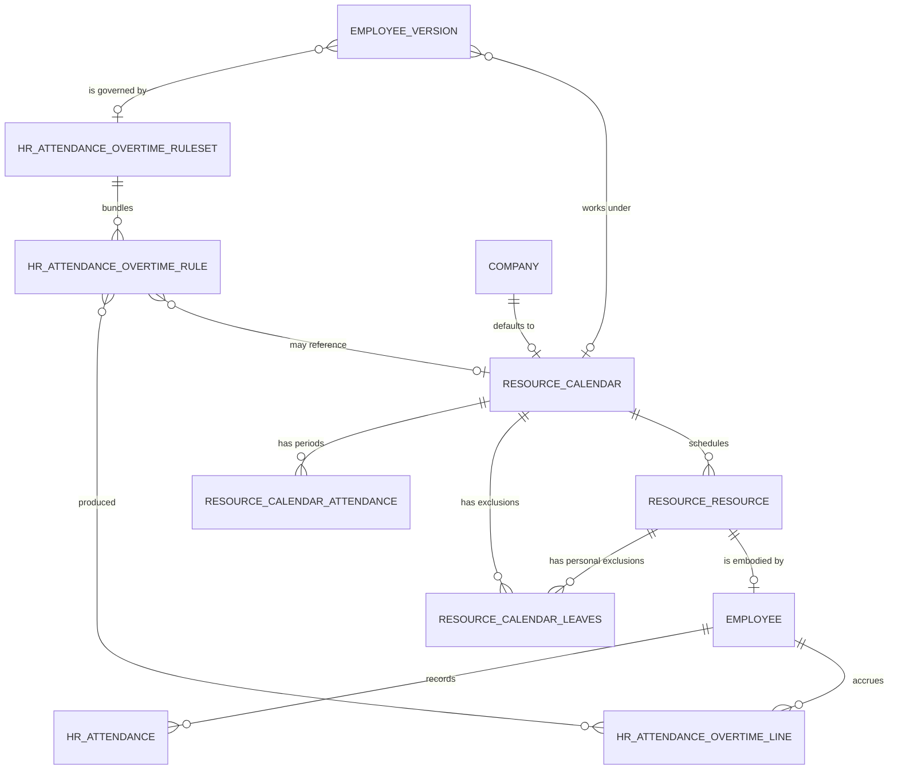

# Attendances and Working Time — Entities

This file specifies every entity of the domain: its purpose, its lifecycle, its complete
field table, its relations, its uniqueness rules, its defaults, its computed fields with
their rules, its ordering, its display rule, its archival behaviour and its multi-company
behaviour.

Field tables use three columns: the field with its storage name in code font, its type,
and its meaning together with every rule that governs it. Where a field is computed, the
computation is stated in words; where the computation is long enough to be an algorithm,
the table points at the relevant chapter of [calculations.md](calculations.md).

---

## 1. Entity map



The chain to read from left to right is: a **Working Schedule** is a pattern of
**Working Schedule Lines**; a **Resource** points at one Working Schedule (or at none);
an **Employee** owns exactly one Resource and, through its **Employee Version**, points
at the Working Schedule in force on any given date; **Attendances** belong to the
Employee; comparing Attendances against the Working Schedule through the
**Overtime Ruleset** attached to the Employee Version yields **Attendance Overtime
Lines**.

---

## 2. Summary of entities

| Entity | Transport name | Storage name | Kind | Default ordering |
|---|---|---|---|---|
| Working Schedule | `resource.calendar` | `resource_calendar` | persistent | by identifier (no explicit order) |
| Working Schedule Line | `resource.calendar.attendance` | `resource_calendar_attendance` | persistent | sequence, week number, day of week, start hour |
| Working Time Exclusion | `resource.calendar.leaves` | `resource_calendar_leaves` | persistent | start date ascending |
| Resource | `resource.resource` | `resource_resource` | persistent | name ascending |
| Resource Mixin | `resource.mixin` | none (abstract) | abstract | inherited |
| Attendance | `hr.attendance` | `hr_attendance` | persistent | check-in descending |
| Attendance Overtime Line | `hr.attendance.overtime.line` | `hr_attendance_overtime_line` | persistent | start instant ascending |
| Overtime Rule | `hr.attendance.overtime.rule` | `hr_attendance_overtime_rule` | persistent | by identifier |
| Overtime Ruleset | `hr.attendance.overtime.ruleset` | `hr_attendance_overtime_ruleset` | persistent | by identifier |
| Timesheet and Attendance Comparison | `hr.timesheet.attendance.report` | `hr_timesheet_attendance_report` | derived read-only table | date ascending inside the table, date descending when grouped |
| Absence Ledger | `hr.leave.attendance.report` | `hr_leave_attendance_report` | derived read-only table | date descending, then employee |

---

## 3. Working Schedule

**Working Schedule** (`resource.calendar`, table `resource_calendar`).

### 3.1 Purpose

A Working Schedule is the *written* definition of when work happens. It carries:

- a repeating pattern of periods (the Working Schedule Lines), either a one-week pattern
  or a two-week alternating pattern;
- the **time zone** in which the hours of that pattern are to be read — this is the
  single most consequential field in the entity, because the pattern says "eight
  o'clock" and only the time zone says *which* eight o'clock;
- its own closures (the global Working Time Exclusions attached to it);
- derived averages: hours per week, hours per day, number of working days per week, and
  the work-time rate against a full-time reference.

A Working Schedule is shared: many Resources point at the same schedule, and every
computation for those Resources reuses the same intervals. Each company has one default
Working Schedule.

Three *shapes* of schedule exist and they behave differently in every algorithm:

| Shape | How recognised | Behaviour |
|---|---|---|
| Fully fixed | `schedule_type` is `fully_fixed` (the default) and the flexible flag is false | Periods have real start and end clock times. Work intervals are exactly those periods. |
| Duration based | Fully fixed, plus `duration_based` is true | Periods carry a *length* rather than meaningful clock times; the clock times are derived by centring the length on midday. No break periods are allowed. |
| Flexible | `schedule_type` is `flexible`, which sets the flexible flag true | Periods are ignored for interval purposes. The schedule carries an hours-per-week and an hours-per-day budget; intervals are synthesised day by day, centred on midday, until the weekly budget is exhausted. |

A **fully flexible** resource is a fourth case and is *not* a schedule shape: it is a
Resource with **no** Working Schedule at all. See
[chapter 6.4](#64-fully-flexible-resources).

### 3.2 Field table

| Field (storage name) | Type | Meaning and rules |
|---|---|---|
| `name` | single line text | Required. The human name of the schedule. Default when creating from a form with a company already chosen: the phrase "Working Hours of " followed by the company name. Duplicating a schedule appends " (copy)" to the name. |
| `active` | boolean | Default true. Archival flag: setting it false hides the schedule without deleting it. Archived schedules are excluded from ordinary searches but remain valid targets of existing pointers. |
| `attendance_ids` | one-to-many to Working Schedule Line, inverse `calendar_id` | The periods of the pattern, including break periods and, in two-week mode, the two section markers. Stored, computed, writable and copied when the schedule is duplicated. Recomputed (wholly replaced) whenever the company changes and the record either is new or previously had a different company: the new value is a copy of every period of the new company's default schedule, and at the same time the two-week flag and the time zone are copied from that schedule. |
| `attendance_ids_1st_week` | one-to-many to Working Schedule Line | Not stored. In two-week mode only, the subset of periods whose week number is "first". Writing to it, or to the second-week counterpart, rebuilds `attendance_ids` as the concatenation of the two subsets — unless the rebuild is suppressed, which it always is during record creation. |
| `attendance_ids_2nd_week` | one-to-many to Working Schedule Line | As above for the periods whose week number is "second". |
| `company_id` | many-to-one to Company | Optional. Default: the acting company. Restricted to the companies the acting user is allowed to act for. Indexed (index skips null values). A schedule with no company is usable by every company. |
| `leave_ids` | one-to-many to Working Time Exclusion, inverse `calendar_id` | Every exclusion attached to this schedule, both those that apply to all of its resources and those that apply to a single resource. |
| `schedule_type` | selection | Required. Values: `flexible` labelled "Flexible"; `fully_fixed` labelled "Fully Fixed". Default `fully_fixed`. Choosing `flexible` means only a weekly amount of hours is defined; choosing `fully_fixed` means days, periods and start and end times are defined. |
| `duration_based` | boolean | Default false. When true, each period is entered as a *length* in hours and its clock times are derived by centring that length on twelve o'clock (see [calculations.md, chapter 6](calculations.md#6-duration-based-schedules)). Break periods may not exist on a duration-based schedule. |
| `flexible_hours` | boolean | Stored, computed from `schedule_type`: true exactly when `schedule_type` is `flexible`. Writable: writing it sets `schedule_type` to `flexible` when true and to `fully_fixed` when false. Help text: when enabled, employees may work flexibly without relying on the company's working hours. |
| `full_time_required_hours` | decimal | "Full Time Equivalent": the number of hours per week that counts as full time. Stored, computed, writable. Computed for every schedule that has a company as the hours-per-week of that company's default schedule. Default when the form supplies no value: the same quantity taken from the acting company's default schedule. |
| `global_leave_ids` | one-to-many to Working Time Exclusion, restricted to exclusions with no resource | The schedule's own closures — public holidays and company shutdowns. Stored, computed, writable, copied on duplication. Recomputed (wholly replaced) whenever the company changes and the record either is new or previously had a different company: the new value is a copy of every global exclusion of the new company's default schedule, copying only the reason, the two instants and the time type. |
| `hours_per_day` | decimal with two decimal places of storage precision | "Average Hour per Day". Stored, computed, writable. For every schedule that is **not** flexible, recomputed as the average hours per week divided by the number of distinct working days per week, rounded to two decimal places. Depends on the periods, their start and end hours, the two-week flag and the flexible flag. For a flexible schedule the value is *not* recomputed and stands as entered — it is the daily budget. See [calculations.md, chapter 5](calculations.md#5-schedule-averages-hours-per-week-hours-per-day-days-per-week). |
| `hours_per_week` | decimal | Stored, computed, writable, not copied on duplication. For every non-flexible schedule, recomputed as the total hours of the pattern (halved in two-week mode), rounded to two decimal places. For a flexible schedule the value stands as entered — it is the weekly budget. |
| `is_fulltime` | boolean | Not stored. True when the full-time reference and the hours per week are equal when compared at three decimal places. |
| `two_weeks_calendar` | boolean | Default false. When true the pattern alternates between a "first" and a "second" week and the periods carry a week number. |
| `two_weeks_explanation` | single line text | Not stored. A sentence naming the first and last day of the current week and stating whether the current week is the even or the odd week, in the form: "The current week (from *first day* to *last day*) corresponds to *even or odd* week." |
| `tz` | selection of named time zones | **Required.** The zone in which the hours of the pattern are interpreted. Default: the zone in the acting context, else the acting user's zone, else the zone of the built-in administrator user, else the universal-time zone. |
| `tz_offset` | single line text | Not stored. The current numeric offset of the schedule's zone from universal time, formatted as a sign followed by four digits (for example `+0100`), evaluated at the moment of reading. |
| `work_resources_count` | integer | Not stored. The number of Resources pointing at this schedule. |
| `work_time_rate` | decimal | Not stored, searchable. The hours per week divided by the full-time reference, multiplied by one hundred; one hundred exactly when the full-time reference is zero. Expressed as a percentage between zero and one hundred. |
| `associated_leaves_count` | integer | Not stored. Added by the absence domain: the count of public holidays attached to this schedule. |

### 3.3 Searching on the work-time rate

The work-time rate is not stored, so a search on it is answered by loading every
schedule and filtering in memory. Only four operators are supported — *is in*, *is not
in*, *less than* and *greater than* — and the compared value must be a whole number (a
list of whole numbers for the two set operators). Any other operator or any non-integral
value makes the search unsupported, and the framework then falls back to its generic
behaviour. The result is the set of schedules whose computed rate satisfies the
comparison.

### 3.4 Validations

| Rule | Condition | Message |
|---|---|---|
| Sections must come first in two-week mode | The schedule is in two-week mode, at least one period is a section marker, and the first period in sequence order is **not** a section marker | "In a calendar with 2 weeks mode, all periods need to be in the sections." |
| Periods must not overlap | Within one week (and, in two-week mode, within each week number separately), two non-section periods of the same weekday overlap | "Attendances can't overlap." |
| Exactly one section per week | While editing the periods of a two-week schedule interactively, the number of section markers with week number "first" is not exactly one, or the number with week number "second" is not exactly one | "You can't delete section between weeks." |

The overlap test is described precisely in
[business-rules.md, chapter 2.2](business-rules.md#22-periods-must-not-overlap): a
microscopic amount is added to each start hour so that two periods that merely touch
(one ending at twelve, the next starting at twelve) are **not** reported as overlapping.

### 3.5 Lifecycle and behaviour on creation, duplication and deletion

- **Creation.** The two-week rebuild inverse is suppressed during creation, so writing
  the first-week and second-week collections at creation time does not immediately
  overwrite the whole period collection.
- **Defaults on an empty form.** If no name is supplied but a company is, the name
  becomes "Working Hours of " followed by the company name. If the period collection is
  requested and empty, it is filled with a copy of the company's default schedule's
  periods, and the two-week flag is copied from that schedule as well. If the full-time
  reference is requested and empty, it is filled from the company's default schedule.
- **Default pattern when there is nothing to copy.** When the company has no default
  schedule, or when copying would import a two-week pattern into a one-week schedule,
  the fallback is a forty-hour week: Monday to Friday, each day with a morning period
  from eight to twelve, a break period from twelve to thirteen, and an afternoon period
  from thirteen to seventeen. The fifteen periods are named "*Weekday* Morning",
  "*Weekday* Lunch" and "*Weekday* Afternoon".
- **Duplication.** The copy's name is the original name followed by " (copy)". The
  period collection and the global exclusion collection are copied; the hours-per-week
  value is not copied (it is recomputed).
- **Deletion.** Periods are deleted with the schedule (cascade). A company's default
  schedule cannot be deleted while the company points at it (restrict).

### 3.6 Switching a schedule between one-week and two-week mode

The operation named "switch calendar type" toggles the two-week flag on exactly one
schedule.

1. **From one week to two weeks.** The two-week flag is set true. A new period
   collection is built: first a section marker named "First week" with sequence zero,
   weekday Monday, both hours zero, period kind morning, week number "first"; then a
   section marker named "Second week" with sequence twenty-five, the same field values
   but week number "second". Then, for every existing period in order, two copies are
   appended — one with week number "first" and sequence *index plus one*, one with week
   number "second" and sequence *index plus twenty-six*. The whole previous collection is
   cleared and replaced by this list.
2. **From two weeks to one week.** The two-week flag is set false, every existing period
   is deleted, the duration-based flag is forced false, and the period collection is
   refilled from the company's default schedule (or, failing that, from the forty-hour
   fallback described above).

The sequence numbers zero and twenty-five, and the offsets one and twenty-six, are what
make the ordering "first-week section, then up to twenty-four first-week periods, then
second-week section, then the second-week periods" hold.

### 3.7 Switching a schedule to duration-based entry

The operation named "switch based on duration" toggles the duration-based flag on
exactly one schedule.

1. **Turning it on.** Every break period is deleted. The remaining periods keep their
   stored lengths; their clock times become derived quantities.
2. **Turning it off.** Every period is deleted and the collection is refilled from the
   company's default schedule (or the forty-hour fallback). If the schedule is in
   two-week mode, the two-week expansion of step 1 of
   [chapter 3.6](#36-switching-a-schedule-between-one-week-and-two-week-mode) is then
   applied to that refilled collection.

### 3.8 Multi-company behaviour

A Working Schedule belongs to at most one company. The company field is restricted to
the companies the acting user may act for. Changing the company of an unsaved (or
newly-companied) schedule replaces both the period collection and the global-exclusion
collection with copies taken from the new company's default schedule, and copies that
schedule's two-week flag and time zone.

---

## 4. Working Schedule Line

**Working Schedule Line** (`resource.calendar.attendance`, table
`resource_calendar_attendance`), labelled "Work Detail" in the interface.

### 4.1 Purpose

One line is one *period* of one weekday of one schedule. A normal working day is
typically three lines: a morning period, a break period and an afternoon period. A line
may instead be a **section marker**, which carries no working time and exists only to
separate the first week from the second week visually and to determine which week each
following line belongs to.

### 4.2 Field table

| Field (storage name) | Type | Meaning and rules |
|---|---|---|
| `name` | single line text | Required. The label of the period, for example "Monday Morning". |
| `dayofweek` | selection | Required, indexed, default `0`. Values: `0` Monday, `1` Tuesday, `2` Wednesday, `3` Thursday, `4` Friday, `5` Saturday, `6` Sunday. This numbering matches the day-of-week numbering used by every algorithm in this domain: Monday is zero. |
| `hour_from` | decimal hours | Required, indexed, default zero. The start of the period as a decimal hour in the schedule's time zone. A value of twenty-four is interpreted as the last representable instant of the day (`23:59:59.999999`). |
| `hour_to` | decimal hours | Required, default zero. The end of the period, same convention. |
| `duration_hours` | decimal | Stored, computed, writable. Computed for every line whose end hour is non-zero as *end hour minus start hour*, except for a break period, where it is forced to zero. Writing it has an effect **only on a duration-based schedule**, where it re-derives the clock times (see below). |
| `duration_days` | decimal | Stored, computed, writable. Computed from the period kind: zero for a break; one for a full-day period; otherwise one half if the line's length in hours is at most three quarters of the schedule's average hours per day, and one otherwise. |
| `calendar_id` | many-to-one to Working Schedule | Required, indexed, deleted with the schedule (cascade). |
| `duration_based` | boolean | Mirror of the schedule's duration-based flag. |
| `day_period` | selection | Required, default `morning`. Values: `morning` "Morning"; `lunch` "Break"; `afternoon` "Afternoon"; `full_day` "Full Day". A line whose kind is `lunch` is a break: it is never work time, and it is subtracted from an attendance when computing worked hours. |
| `week_type` | selection | Values: `0` "First", `1` "Second". Default: unset. Meaningful only on a two-week schedule. |
| `two_weeks_calendar` | boolean | Mirror of the schedule's two-week flag. |
| `display_type` | selection | Values: `line_section` "Section". Default unset. A line with this value set is a section marker: it carries no working time and is excluded from every interval computation. |
| `sequence` | integer | Default ten. Determines the display order and, in two-week mode, which section marker a line falls under. |
| `work_entry_type_id` | many-to-one to Work Entry Type | Added by the work-entry domain; restricted to human-resources officers. Determines the kind of work entry generated from this period. |

### 4.3 Ordering and display

Lines are ordered by sequence, then week number, then day of week, then start hour.

Section markers get a special display name: the phrase "First week" or "Second week"
followed, in parentheses, by "this week" when the marker's week number equals the week
type of today, and "other week" otherwise.

### 4.4 Computations in detail

**Length in hours.** For every line whose end hour is non-zero:

```formula
duration_hours = 0                                if day_period = "lunch"
duration_hours = hour_to − hour_from              otherwise
```

Lines whose end hour is exactly zero are left untouched by this computation, which
matters for the two section markers (both hours zero).

**Length in days.** A period is worth a whole day, half a day or nothing:

```formula
duration_days = 0                                          if day_period = "lunch"
duration_days = 1                                          if day_period = "full_day"
duration_days = 0.5   if duration_hours ≤ ( hours_per_day × 3 ÷ 4 )
duration_days = 1     if duration_hours > ( hours_per_day × 3 ÷ 4 )
```

where *hours per day* is the schedule's average. Worked example: on a schedule averaging
eight hours per day the threshold is six hours. A morning period of four hours counts as
half a day; an afternoon period of seven hours counts as a whole day.

The value is stored and writable, so an administrator may override it; every subsequent
day count for that schedule uses the overridden value.

**Deriving clock times from a length (duration-based schedules only).** Writing the
length re-derives the two clock times, for lines of a duration-based schedule only:

```formula
full_day  :  hour_from = 12 − ( duration_hours ÷ 2 )   ,  hour_to = 12 + ( duration_hours ÷ 2 )
morning   :  hour_from = 12 − duration_hours           ,  hour_to = 12
afternoon :  hour_from = 12                            ,  hour_to = 12 + duration_hours
```

Worked example: a duration-based full-day period of seven hours becomes a period from
`08:30` to `15:30` in the schedule's time zone. A duration-based morning of three and a
half hours becomes `08:30` to `12:00`.

### 4.5 Interactive clamping of the two hours

While a line is being edited, changing either hour immediately clamps both:

1. The start hour is reduced to at most `23.99` and raised to at least zero.
2. The end hour is reduced to at most `24` and raised to at least zero.
3. The end hour is raised to at least the start hour, so the period can never be
   inverted.

### 4.6 Validations

| Rule | Condition | Message |
|---|---|---|
| No break on a duration-based schedule | The line's period kind is `lunch` and its schedule is duration based | "*line name* is a break attendance, You should not have such record on duration based calendar" |

### 4.7 The week-type function

The week type of a date is a pure function of that date and of nothing else — not of the
schedule, not of the company, not of the locale:

```formula
week_type( date ) = floor( ( ordinal_day_number( date ) − 1 ) ÷ 7 )  modulo  2
```

where the *ordinal day number* counts days from the first day of year one of the
proleptic Gregorian calendar, with that first day numbered one. The result is zero
("first" week) or one ("second" week).

This deliberately avoids calendar week numbers, because some years contain fifty-three
calendar weeks and two odd week numbers would then follow one another. Counting raw days
guarantees strict alternation for ever. See
[calculations.md, chapter 7](calculations.md#7-two-week-alternating-schedules) for worked
examples.

### 4.8 The work-period test

A line counts as *work* when both of the following hold: its period kind is not `lunch`,
and it is not a section marker. Every interval algorithm filters on this test before
summing hours.

### 4.9 Copying a line

When a schedule is duplicated, or when a schedule's periods are copied from a company's
default schedule, exactly eight values are carried over: the name, the day of week, the
start hour, the end hour, the period kind, the week number, the display type and the
sequence. The two derived lengths are **not** carried over; they are recomputed from the
copied values.

---

## 5. Working Time Exclusion

**Working Time Exclusion** (`resource.calendar.leaves`, table
`resource_calendar_leaves`), labelled "Resource Time Off Detail" in the interface.

### 5.1 Purpose

An exclusion is a dated span during which work does not happen. It has two distinct
uses, told apart by whether the resource field is set:

- **Resource set** — a personal absence. Validated absence requests create one of these
  per employee; so does any other domain that must remove a person from the working
  calendar.
- **Resource empty** — a *global* exclusion: a public holiday or a company closure. It
  applies to every resource of the schedule it names, or, when it names no schedule, to
  every resource of the company it names.

The `time_type` field distinguishes real absence from time that should still count as
work (training, for example).

### 5.2 Field table

| Field (storage name) | Type | Meaning and rules |
|---|---|---|
| `name` | single line text | The reason. Optional. |
| `company_id` | many-to-one to Company | Stored, computed, read-only. Default: the acting company. Computed as the company of the named schedule, falling back to the acting company when no schedule is named. |
| `calendar_id` | many-to-one to Working Schedule | Stored, computed, writable, indexed. Computed for every exclusion that names a resource as that resource's schedule. Restricted to schedules of the exclusion's company or of no company; company consistency is enforced. When empty on a global exclusion, the exclusion applies across all schedules of the company. |
| `date_from` | instant | Required. The start of the exclusion, stored on the universal time scale. |
| `date_to` | instant | Required, stored, computed, writable. The end of the exclusion. |
| `resource_id` | many-to-one to Resource | Optional, indexed. Empty means the exclusion is generic for the company; set means it applies to that resource only. |
| `time_type` | selection | Values: `leave` "Time Off"; `other` "Other". Default `leave`. Chooses whether the span is counted as absence or as work time (for example training). Only exclusions matching the caller's filter are subtracted; the default filter selects `leave` only. |
| `holiday_id` | many-to-one to Absence Request | Added by the absence domain: the request that produced this exclusion. |
| `elligible_for_accrual_rate` | boolean | Added by the absence domain. Default false. Marks the exclusion as counting towards accrual computations. |
| `work_entry_type_id` | many-to-one to Work Entry Type | Added by the work-entry domain; restricted to human-resources officers. |
| `timesheet_ids` | one-to-many to Analytic Line | Added by the timesheet-and-absence companion: the timesheet lines generated for this global closure. |

### 5.3 Defaults on an empty form

When both instants are requested and neither is supplied, the exclusion is defaulted to
**the whole of today in the relevant schedule's time zone**:

1. Take today's date from the current instant.
2. Take the schedule: the one already chosen on the form if there is one, otherwise the
   acting company's default schedule.
3. Take that schedule's time zone, falling back to universal time.
4. The start instant is the beginning of today in that zone (`00:00:00`), converted to
   the universal time scale and stored without a zone.
5. The end instant is the last representable moment of today in that zone
   (`23:59:59.999999`), likewise converted.

Worked example. Today is 2026-03-11 and the schedule's zone is `Europe/Brussels`, which
is one hour ahead of universal time on that date. The stored start becomes
`2026-03-10 23:00:00` and the stored end becomes `2026-03-11 22:59:59.999999`.

### 5.4 Computing the end instant

Whenever the start instant changes, the end instant is recomputed — but **only** when it
is empty or not later than the start. The rule is:

1. Choose a zone: the acting user's zone if the user has one or the context supplies
   one; otherwise the zone of the exclusion's company's default schedule; otherwise
   universal time.
2. Read the start instant in that zone.
3. Replace the time of day with `23:59:59`, keeping the same date in that zone.
4. Convert back to the universal time scale and store without a zone.

So an exclusion whose start is set to a morning instant automatically extends to the end
of that day.

### 5.5 Validations

| Rule | Condition | Message |
|---|---|---|
| Ordering | For any exclusion in the written set, the start instant is later than the end instant | "The start date of the time off must be earlier than the end date." |

### 5.6 Ordering, display and copying

Exclusions are ordered by start instant ascending. When copied as part of copying a
schedule's global closures, exactly four values are carried over: the reason, the two
instants and the time type — not the resource, not the schedule, not the company.

### 5.7 Effect on attendance overtime

Every creation, modification or deletion of an exclusion triggers a recomputation of
extra hours for every attendance the exclusion can touch. The affected set is computed
by translating the exclusion into a search filter over attendances:

1. Split the written exclusions into those whose time type is `leave` and the rest. Only
   the former can affect attendances.
2. For those that name a resource that embodies an employee, group by resource. For each
   group, take the zone of the resource; take the earliest start instant of the group
   read in that zone and truncate it to the start of its day; take the latest end
   instant read in that zone and extend it to `23:59:59` of its day; convert both back
   to the universal scale. The filter selects attendances of that resource's employees
   whose check-in is at or before the upper bound and whose check-out is at or after the
   lower bound.
3. For the remaining exclusions (global, or attached to a resource with no employee),
   handle each individually: take the zone of the exclusion's schedule, falling back to
   the zone of the company's default schedule; expand the start and end to whole days in
   that zone as above; the filter selects attendances between those bounds, further
   narrowed to the exclusion's company when it has one and to employees on the
   exclusion's schedule when it names one.
4. Combine every clause with a logical *or*.

On modification the filter is computed **twice** — once before the write and once after —
and their union is used, so that moving an exclusion recomputes both the day it left and
the day it arrived at. The fields that trigger this are the two instants, the resource,
the schedule, the company and the time type.

---

## 6. Resource

**Resource** (`resource.resource`, table `resource_resource`).

### 6.1 Purpose

A Resource is the schedulable thing. It may embody a person (an employee, through the
resource mixin) or a machine (a work centre). It carries the pointer to the Working
Schedule, its own time zone, an efficiency factor and an activity flag.

The Resource's own time zone matters in exactly two places: when the Resource has **no**
schedule (a fully flexible resource), and when an algorithm is explicitly told to group
resources by their own zone rather than by the schedule's zone. Everywhere else the
schedule's zone wins.

### 6.2 Field table

| Field (storage name) | Type | Meaning and rules |
|---|---|---|
| `name` | single line text | Required. Duplicating appends " (copy)". |
| `active` | boolean | Default true. Archival flag. |
| `company_id` | many-to-one to Company | Default: the acting company. |
| `resource_type` | selection | Required, default `user`. Values: `user` "Human"; `material` "Material". |
| `user_id` | many-to-one to User | Optional, indexed (index skips null values), not copied. The user account that manages this resource. |
| `avatar_128` | image | Not stored. The user's avatar; when the resource embodies an employee, the employee's avatar instead, read through the public employee entity for users without human-resources rights. |
| `share` | boolean | Mirror of the user's share flag. |
| `email` | single line text | Mirror of the user's electronic mail address. |
| `phone` | single line text | Mirror of the user's telephone number. |
| `time_efficiency` | decimal | Required, default one hundred. A percentage. An expected duration of one hour at a resource with efficiency two hundred becomes thirty minutes. **Must be strictly positive**; the database rejects any other value with "Time efficiency must be strictly positive". |
| `calendar_id` | many-to-one to Working Schedule | Optional. Default: the acting company's default schedule. Restricted to schedules of the resource's company. **Empty means fully flexible.** When the resource embodies an employee, writing this field also writes the same schedule onto the employee. |
| `tz` | selection of named time zones | Required. Default: the zone in the acting context, else the acting user's zone, else universal time. |
| `color` | integer | Added by the messaging companion: a display colour, defaulted at random. |
| `im_status` | single line text | Mirror of the user's instant-messaging presence. |
| `employee_id` | one-to-many to Employee | Added by the human-resources domain: the employee (at most one in practice) embodied by this resource; company consistency enforced; archived employees included. |
| `job_title` | single line text | Not stored. The employee's job title. |
| `department_id` | many-to-one to Department | Not stored. The employee's department. |
| `work_location_id`, `work_email`, `work_phone`, `show_hr_icon_display`, `hr_icon_display` | mirrors of employee fields | Added by the human-resources domain. |
| `leave_date_to` | date | Added by the absence domain: the date the resource returns to work. |
| `employee_skill_ids` | one-to-many to Employee Skill | Added by the skills domain. |

### 6.3 Creation, defaults and idempotent writing

**On an empty form.** If no schedule is chosen but a company is, the schedule defaults to
that company's default schedule.

**On creation of records in bulk**, for each set of values:

1. If a company is named and no schedule is, the schedule is set to that company's
   default schedule.
2. If no time zone is given, it is taken from the named user's zone, falling back to the
   named schedule's zone; if both are empty the field default applies.

**Interactive changes.** Changing the company resets the schedule to the new company's
default schedule. Changing the user resets the time zone to that user's zone.

**Idempotent writing.** When the acting context requests idempotence and exactly one
resource is being written, every value equal to the current value is dropped from the
write; if nothing remains, no write happens at all. This suppresses spurious
modification tracking when a record that owns a resource is saved unchanged. Records
created through the resource mixin always set this context flag.

**Duplication.** The copy's name is the original followed by " (copy)".

### 6.4 Fully flexible resources

A Resource with **no** schedule is *fully flexible*. The consequences are pervasive:

| Question | Answer for a fully flexible resource |
|---|---|
| Is it flexible? | Yes — the flexible test is "fully flexible, or the schedule has the flexible flag". |
| What are its attendance intervals over a span? | One single interval covering the whole span, carrying a synthetic period whose length in hours is the span in hours and whose length in days is the span in hours divided by twenty-four. |
| What are its work intervals? | The whole span. |
| What are its unavailable intervals? | Only its personal exclusions; no schedule gaps. |
| What are its absence days and hours over a span? | The whole span: the number of whole days between the two instants, and the span in hours. |
| What are its worked days and hours over a span? | Zero days and zero hours — the calendar-driven computation short-circuits when there is no schedule. |
| Which zone is used? | Its own time zone. |

### 6.5 Snapping a span to the schedule

The operation *adjust to calendar* takes a start instant and an end instant and returns,
for each resource, the closest working boundaries. It is specified as an algorithm in
[calculations.md, chapter 10.2](calculations.md#102-snapping-a-span-to-the-schedule).
Summary: the start is moved to the nearest **start** of a work interval on its own day,
and the end to the nearest **end** of a work interval within the window that begins at
the (already converted) start and ends at midnight after the end day. Either result may
be empty when the day contains no working time.

### 6.6 Schedule validity within a period

Because an employee's schedule can change from one Employee Version to the next, a
Resource does not have *one* schedule over a long span — it has a sequence of
(schedule, validity interval) pairs. The operation *calendars validity within a period*
returns, for each resource, a mapping from schedule to the interval set during which
that schedule applies.

- **Base behaviour (a resource with no contract history).** One entry: the resource's own
  schedule (falling back to its company's default schedule, then to the acting company's
  default schedule), valid for the whole requested span. When the recordset is empty, one
  entry keyed by the false resource holds the default company's schedule for the whole
  span.
- **With contract history.** For each Employee Version whose contract overlaps the
  requested date range, one interval is produced in the employee's own time zone, from
  the beginning of the version's start date (or the requested start, whichever is later)
  to the end of the version's end date (or the requested end, whichever is earlier),
  keyed by that version's schedule. Versions are recognised as having contract history
  when the employee has at least one version with a contract start date.

The union of work intervals restricted to each validity interval gives the resource's
valid work intervals; see
[calculations.md, chapter 13](calculations.md#13-multiple-schedules-over-one-span).

### 6.7 The schedule in force at one instant

The operation *calendar at* returns, for each resource, the schedule in force at a given
instant.

- Base behaviour: the resource's own schedule.
- When the resource embodies an employee: the schedule of the employee's version
  covering the date obtained by reading the instant in the supplied zone. An employee's
  effective schedule for a date is the schedule of the first of that employee's versions
  whose contract covers the date; if none covers it, the employee's plain schedule.

This is the operation that lets one attendance-interval computation serve a mixture of
resources whose schedules changed mid-period.

### 6.8 Multi-company behaviour

A record rule restricts every read of Resources to those whose company is among the
acting companies or is empty.

---

## 7. Resource Mixin

**Resource Mixin** (`resource.mixin`) — abstract; it has no table of its own. Any entity
that includes it becomes schedulable. The Employee entity is its principal user.

### 7.1 Fields contributed

| Field (storage name) | Type | Meaning and rules |
|---|---|---|
| `resource_id` | many-to-one to Resource | **Required**, indexed, deletion restricted, search-access bypassed (so that a user who cannot read resources can still read records that own one). |
| `company_id` | many-to-one to Company | Mirror of the resource's company, but **stored and writable**, indexed, precomputed. Default: the acting company. |
| `resource_calendar_id` | many-to-one to Working Schedule | Mirror of the resource's schedule, **stored and writable**, indexed. Default: the acting company's default schedule. |
| `tz` | selection of named time zones | Mirror of the resource's zone, writable. |

### 7.2 Creation

When records are created in bulk:

1. For each set of values that does **not** already name a resource, a set of resource
   values is prepared: the name is taken from the record's naming field; the time zone
   is the value popped from the record's own values if present, otherwise the time zone
   of the named schedule; the company is the named company or the acting company; the
   schedule is the named schedule if any.
2. All those resources are created in one operation and their identifiers are assigned
   back, in order, to the value sets that lacked one.
3. The records themselves are then created with the idempotent-write context flag set.

### 7.3 Duplication

Duplicating a record that owns a resource duplicates the resource too. If the
duplication overrides the company, the new resource takes that company; if it overrides
the schedule, the new resource takes that schedule. The copied record then points at the
new resource and takes that resource's company and schedule.

### 7.4 Operations contributed

| Operation | Returns | Specified in |
|---|---|---|
| Worked days and hours over a span, in bulk | For each record, a pair *days* and *hours* | [calculations.md, chapter 9](calculations.md#9-counting-hours-and-counting-days) |
| Absence days and hours over a span, in bulk | For each record, a pair *days* and *hours* | [calculations.md, chapter 9.4](calculations.md#94-counting-absence) |
| Snap a span to the schedule | For each record, a pair of instants or empties | [calculations.md, chapter 10.2](calculations.md#102-snapping-a-span-to-the-schedule) |
| List work time per day | For each record, a sorted list of (date, hours) pairs for every day with any work | [calculations.md, chapter 9.5](calculations.md#95-work-time-per-day) |
| List absences | A list of (date, hours, exclusion) triples | [calculations.md, chapter 9.6](calculations.md#96-listing-absences) |
| Schedules by date | For each record, the schedule in force | [chapter 6.7](#67-the-schedule-in-force-at-one-instant) |

---

## 8. Attendance

**Attendance** (`hr.attendance`, table `hr_attendance`).

### 8.1 Purpose

One Attendance is one recorded presence span of one employee: a check-in instant, an
optional check-out instant, and the metadata captured at each end (the channel, the
geographic position, the network address and the browser). From the pair the system
derives the hours actually worked, the hours that were expected, and the hours in excess.

An Attendance with no check-out is **open**: the employee is currently checked in. At
most one open Attendance may exist per employee at any time.

### 8.2 Field table

| Field (storage name) | Type | Meaning and rules |
|---|---|---|
| `employee_id` | many-to-one to Employee | Required, indexed, deleted with the employee (cascade). Default: the acting user's employee, but only when the acting user belongs to the group that manages all attendances. Grouping on this field is expanded by a dedicated rule (see [interfaces.md](interfaces.md#43-grouping-by-employee)). |
| `department_id` | many-to-one to Department | Mirror of the employee's department, read-only. |
| `manager_id` | many-to-one to Employee | Mirror of the employee's parent employee (the line manager), read-only. |
| `attendance_manager_id` | many-to-one to User | Mirror of the employee's attendance approver. |
| `is_manager` | boolean | Not stored. True when the acting user belongs to the group that manages all attendances, or belongs to the officer group **and** is the attendance approver of this attendance's employee. |
| `check_in` | instant | **Required**, indexed, tracked in the discussion thread. Default: the current instant. |
| `check_out` | instant | Optional, tracked. Empty means the attendance is open. |
| `date` | date | Required, stored, indexed, precomputed, computed. The calendar date of the check-in **read in the employee's effective time zone**. Falls back to today when either the employee or the check-in is missing (a precompute edge case that cannot persist after creation). |
| `worked_hours` | decimal | Stored, computed, read-only. The hours worked, break excluded. See [calculations.md, chapter 13.1](calculations.md#131-worked-hours-of-one-attendance). |
| `color` | integer | Not stored. A display colour: for a closed attendance, one when the worked hours exceed sixteen or the check-out channel is `technical`, else zero; for an open attendance, one when the check-in is earlier than one day before now, else ten. |
| `overtime_hours` | decimal | Stored, computed. "Worked Extra Hours": the sum of the raw durations of the extra-hours lines linked to this attendance. May be negative. |
| `overtime_status` | selection | Stored, computed, writable, tracked. Values: `to_approve` "To Approve"; `approved` "Approved"; `refused` "Refused". Empty when no extra-hours line is linked. Otherwise: `approved` when every linked line is approved; `refused` when every linked line is refused; `to_approve` in every other case, including a mixture. |
| `validated_overtime_hours` | decimal | Stored, computed, read-only, tracked. The sum of the **encoded** durations of the linked extra-hours lines whose status is `approved`. |
| `in_latitude` | decimal, ten digits with seven decimals | Read-only; never aggregated. The latitude captured at check-in. |
| `in_longitude` | decimal, ten digits with seven decimals | Read-only; never aggregated. The longitude captured at check-in. |
| `in_location` | single line text | A human-readable place name, derived from the coordinates when available and otherwise from the network address. |
| `in_ip_address` | single line text | Read-only. The network address seen at check-in. |
| `in_browser` | single line text | Read-only. The browser reported at check-in. |
| `in_mode` | selection | Read-only, default `manual`. Values: `kiosk` "Kiosk"; `systray` "Systray"; `manual` "Manual"; `technical` "Technical". The channel the check-in came through. |
| `out_latitude`, `out_longitude`, `out_location`, `out_ip_address`, `out_browser` | as the check-in counterparts | Captured at check-out. |
| `out_mode` | selection | Read-only, default `manual`. Values: `kiosk`; `systray`; `manual`; `technical`; `auto_check_out` "Automatic Check-Out". |
| `expected_hours` | decimal | Stored, computed, summed when aggregated. "Regular Hours": the worked hours minus the extra hours. |
| `device_tracking_enabled` | boolean | Mirror of the employee's company's device-and-location-tracking setting. |
| `linked_overtime_ids` | many-to-many to Attendance Overtime Line | Not stored, writable. The extra-hours lines whose employee and start instant match this attendance's employee and check-in. |

### 8.3 Display name

- Open attendance: the word "From" followed by the check-in rendered as a time of day in
  the viewer's zone (taken from the browser when the request carries one), for example
  "From 09:00".
- Closed attendance: the worked hours rendered as hours and minutes, then, in
  parentheses, the check-in time and the check-out time separated by a hyphen, for
  example "07:30 (09:00-17:30)".

### 8.4 Computed fields in detail

**Date.** The attendance's date is not the date of the stored instant; it is the date in
the employee's effective zone, which is the zone of the employee's schedule, falling back
to the employee's own zone, falling back to the company default schedule's zone, falling
back to universal time. Consequence: an employee in the zone named `America/New_York`
checking in at `2026-03-02 03:00` universal time has an attendance dated 2026-03-01.

**Linked extra-hours lines.** All extra-hours lines whose start instant is among the
check-in instants of the set being computed and whose employee is among the employees of
the set are loaded and grouped by the pair (employee, start instant). Each attendance
takes the group matching its own pair. The linkage is therefore **by value**, not by a
stored foreign key: an extra-hours line "belongs" to the attendance that starts at the
same instant for the same employee.

**Regular hours.**

```formula
expected_hours = worked_hours − overtime_hours
```

Worked example: eight and a half hours worked, one and a half of them extra, gives seven
regular hours. When the extra hours are negative (missing time under absence
management), the regular hours exceed the worked hours by the missing amount.

### 8.5 Validations

Specified in full with their messages in
[business-rules.md, chapter 4](business-rules.md#4-attendance-validity-rules). In
summary:

| Rule | Message |
|---|---|
| Check-out must not precede check-in | "\"Check Out\" time cannot be earlier than \"Check In\" time." |
| No overlap with the attendance immediately preceding | "Cannot create new attendance record for *employee name*, the employee was already checked in on *date and time*" |
| At most one open attendance per employee | "Cannot create new attendance record for *employee name*, the employee hasn't checked out since *date and time*" |
| No attendance may straddle another | "Cannot create new attendance record for *employee name*, the employee was already checked in on *date and time*" |

### 8.6 Lifecycle

| Event | Effect |
|---|---|
| Creation | Validations run. Extra hours are recomputed for the affected window. |
| Writing the employee, the check-in or the check-out | An access check runs first (see below). The affected window is computed **before** the write and **after** the write, and their union is recomputed. |
| Writing anything else | No recomputation. |
| Deletion | The affected window is computed before deletion and recomputed after. |
| Duplication | **Forbidden.** Message: "You cannot duplicate an attendance." |
| Archiving the employee | Every open attendance of that employee is closed at the current instant. |

**Access check on writing.** Changing the employee of an attendance to an employee that
is not one of the acting user's own employees is refused unless the acting user belongs
to the administrator group, or is that employee's attendance approver. Message: "Do not
have access, user cannot edit the attendances that are not their own or if they are not
the attendance manager of the employee."

### 8.7 The recomputation window

Attendance changes do not recompute one attendance's extra hours; they recompute every
extra-hours line in a **window**, because a weekly rule makes neighbouring days
interdependent. The window is built as follows, for the closed attendances in the set,
grouped by employee:

1. Take the employee's own zone.
2. Read the earliest check-in and the latest check-out of the group in that zone.
3. If **any** rule of **any** rule set attached to the versions covering those
   attendances uses the weekly period, widen to whole weeks: the window starts at the
   Monday on or before the earliest check-in's date and ends at the Sunday on or after
   the latest check-out's date. Otherwise the window is exactly those two dates.
4. Convert the beginning of the first day and the last representable moment of the last
   day, in the employee's zone, to the universal scale. The filter selects attendances of
   that employee whose check-in is at or before the upper bound and whose check-out is
   strictly after the lower bound.
5. Combine one such clause per employee with a logical *or*. With no closed attendance
   in the set, the filter selects nothing.

### 8.8 Recomputing extra hours

Given an attendance filter (the window):

1. Translate the attendance filter into an extra-hours-line filter by renaming the field
   `check_in` to `time_start` and the field `check_out` to `time_stop`, leaving every
   other clause unchanged.
2. Load every matching extra-hours line. Remember the pairs (employee, date) of those
   lines whose encoded duration differs from their raw duration, or whose status is
   "to approve" — these are the *manually touched* days.
3. **Delete every matching extra-hours line.**
4. Collect the attendances to re-evaluate: the union of the set being written and every
   attendance matching the filter, keeping only closed ones. If none remain, stop.
5. Widen the evaluation span by one day on each side (to absorb time-zone shifts): from
   the beginning of the day before the earliest check-in date to the last moment of the
   day after the latest check-out date, both on the universal scale.
6. Resolve, for every employee involved, the sequence of Employee Version validity
   periods over that span, and from them the schedule intervals by work type (work,
   break, absence, fully flexible) — see
   [calculations.md, chapter 14.2](calculations.md#142-assembling-the-schedule-picture).
7. Group the attendances by the rule set of the employee version covering each
   attendance's localised check-in date. Attendances whose version has no rule set are
   skipped entirely.
8. For each rule set, run the generation algorithm of
   [calculations.md, chapter 14](calculations.md#14-the-overtime-computation-algorithm)
   over that rule set's attendances, bounded by the earliest and latest dates the
   attendances span.
9. For each produced value set whose (employee, date) pair was remembered in step 2,
   force the status to "to approve" — so that a day an approver had already touched
   returns to the approval queue rather than being silently auto-approved.
10. Create all the value sets in one operation, then mark the four derived attendance
    fields (extra hours, regular hours, validated extra hours, extra-hours status) for
    recomputation on every re-evaluated attendance.

### 8.9 Attendance-derived day and week intervals

Two helper decompositions are used by the overtime engine and are specified here because
they define what "an attendance on a day" means.

**Localised times.** For one attendance, the pair of *naive local* times obtained by
reading the check-in and the check-out in the time zone of the employee version covering
the check-in's date, then dropping the zone. All overtime arithmetic happens in this
naive local space, so that "a day" means a local day.

**Dates spanned.** The list of dates from the localised check-in date to the localised
check-out date inclusive.

**Grouping by day and by week.** For a set of attendances, sorted by check-in:

- For each attendance and each date it spans, the *day interval* is the whole of that
  local date (from the first moment to the last representable moment). The attendance's
  own interval is intersected with it; a non-empty result is unioned into the day bucket
  for that (employee, date).
- The *week interval* runs from the first moment of the same local date to the last
  representable moment of the Sunday of that date's week. The attendance's interval is
  intersected with it; a non-empty result is unioned into the week bucket keyed by that
  Sunday.

Both buckets keep intervals distinct rather than merging touching ones, so that two
back-to-back attendances remain two intervals with two payloads.

---

## 9. Attendance Overtime Line

**Attendance Overtime Line** (`hr.attendance.overtime.line`, table
`hr_attendance_overtime_line`).

### 9.1 Purpose

One line states: *this employee, on this day, accumulated this many extra hours, because
of these rules, at this pay rate multiplier, and the approval state of that quantity is
this*. Lines are wholly derived: they are deleted and regenerated whenever anything they
depend on changes. The only human-authored parts are the status and the encoded
duration, and even those are preserved indirectly, by the "manually touched" rule of
[chapter 8.8](#88-recomputing-extra-hours).

A line may carry a **negative** duration. That is *undertime*: hours the employee was
expected to work and did not. Negative lines are produced only when the company has
absence management switched on.

### 9.2 Field table

| Field (storage name) | Type | Meaning and rules |
|---|---|---|
| `employee_id` | many-to-one to Employee | Required, indexed, deleted with the employee (cascade). |
| `company_id` | many-to-one to Company | Mirror of the employee's company. |
| `date` | date | Required, indexed. The local day the quantity is attributed to. |
| `status` | selection | Required, stored, computed, writable, precomputed. Values: `to_approve` "To Approve"; `approved` "Approved"; `refused` "Refused". Computed only when empty: "to approve" when the employee's company requires approval by a manager, "approved" otherwise. |
| `duration` | decimal | Required, default zero. The **raw** quantity of extra hours as computed, rounded to four decimal places at creation. |
| `manual_duration` | decimal | Stored, computed, writable. The **encoded** quantity — what actually counts towards the employee's balance. Computed as a copy of the raw duration; an approver may overwrite it to correct a day without changing the rule output. |
| `time_start` | instant | The start of the attendance that produced the line — equal to that attendance's check-in. This is the join key to the attendance. |
| `time_stop` | instant | The end of the attendance that produced the line — equal to that attendance's check-out. |
| `amount_rate` | decimal | Required, default one. The pay rate multiplier resulting from combining the rates of the contributing rules. Zero when no contributing rule is marked as paid. |
| `is_manager` | boolean | Not stored. True when the acting user belongs to the administrator group, or belongs to the officer group and is the employee's attendance approver. |
| `rule_ids` | many-to-many to Overtime Rule | The rules that were simultaneously in force over the interval this line represents. |
| `compensable_as_leave` | boolean | Added by the extra-hours-deduction companion: true when at least one contributing rule gives the hours back as time off. |

### 9.3 Constraints

| Constraint | Rule | Message |
|---|---|---|
| Ordering | The stop instant must be strictly later than the start instant | "Starting time should be before end time." |

An additional exclusion constraint preventing two lines of the same employee from
overlapping in time is **not** in force; overlapping lines are legitimate, because two
different rules can attribute different quantities to overlapping spans of the same
attendance, and because a weekly rule and a daily rule can both fire on the same
attendance.

### 9.4 Ordering and naming

Lines are ordered by start instant ascending. The display name of a line is the display
name of its employee.

### 9.5 Approval operations

| Operation | Effect |
|---|---|
| Approve | Sets the status of every line in the set to `approved`. |
| Refuse | Sets the status of every line in the set to `refused`. |

Writing the status, the encoded duration or the raw duration on a line marks the
corresponding fields of the linked attendances for recomputation:

- writing the status or the encoded duration marks the attendance's extra-hours status
  and its validated extra hours;
- writing the raw duration marks the attendance's extra hours and its regular hours.

The linked attendances are found by the same value join as in the opposite direction:
attendances whose check-in is among the lines' start instants and whose employee is among
the lines' employees.

### 9.6 Multi-company behaviour

A global record rule restricts every read of extra-hours lines to those whose employee's
company is among the acting companies.

---

## 10. Overtime Rule

**Overtime Rule** (`hr.attendance.overtime.rule`, table `hr_attendance_overtime_rule`).

### 10.1 Purpose

A rule is one condition under which presence becomes extra hours. There are exactly two
families, chosen by the "based off" field:

- **Quantity rules** say: *anything beyond N hours in a period is extra*. The period is a
  day or a week; N is either a fixed number or "whatever the employee's schedule
  expects".
- **Timing rules** say: *presence at this moment is extra*, regardless of how much was
  worked. The moment is characterised by the kind of day (a working day, a non-working
  day, a day the employee is off) or by being outside a named schedule, and optionally
  narrowed to a band of hours of the day.

Both families support two tolerances and a pay rate.

### 10.2 Field table

| Field (storage name) | Type | Meaning and rules |
|---|---|---|
| `name` | single line text | Required. |
| `description` | rich text | Free-form explanation. |
| `base_off` | selection | Required, default `quantity`. Values: `quantity` "Quantity"; `timing` "Timing". |
| `timing_type` | selection | Default `work_days`. Values: `work_days` "On any working day"; `non_work_days` "On any non-working day"; `leave` "When employee is off"; `schedule` "Outside of a specific schedule". Only meaningful for timing rules. |
| `timing_start` | decimal hours | Default zero. "From". The start of the band of hours of the local day within which presence counts. Database check: at least zero and strictly less than twenty-four, with message "Timing Start is an hour of the day". |
| `timing_stop` | decimal hours | Default twenty-four. "To". Database check: at least zero and at most twenty-four, with message "Timing Stop is an hour of the day". When the start exceeds the stop, the band is read as *wrapping around midnight* — see [calculations.md, chapter 14.5](calculations.md#145-timing-rules). |
| `expected_hours_from_contract` | boolean | Default true. "Hours from employee schedule". When true, the expected quantity for a quantity rule is derived from the employee's schedule for the period rather than from the fixed number. Its help text also records that, with absence management enabled, the attendance can go into negative extra hours representing missing time. |
| `resource_calendar_id` | many-to-one to Working Schedule | The named schedule for a timing rule of kind "outside of a specific schedule". Restricted to schedules that are **not** flexible. |
| `expected_hours` | decimal | "Usual work hours": the fixed expected quantity per period, used when the expected quantity is not taken from the employee's schedule. |
| `quantity_period` | selection | Default `day`. Values: `day` "Day"; `week` "Week". The period over which a quantity rule accumulates. A week runs Monday to Sunday and is keyed by its Sunday. |
| `sequence` | integer | Default ten. Used only to break ties when choosing the highest-rate rule. |
| `ruleset_id` | many-to-one to Overtime Ruleset | Required, indexed. |
| `company_id` | many-to-one to Company | Mirror of the rule set's company. |
| `paid` | boolean | "Pay Extra Hours". Only rules with this flag contribute to the combined rate. |
| `amount_rate` | decimal | Default one. The pay rate multiplier of this rule; one means ordinary pay, one and a half means time and a half. |
| `employee_tolerance` | decimal | Hours of shortfall forgiven before a *negative* line is produced. |
| `employer_tolerance` | decimal | Hours of excess forgiven before a *positive* line is produced. |
| `information_display` | single line text | Not stored. A short summary shown in lists; see below. |
| `compensable_as_leave` | boolean | Added by the extra-hours-deduction companion. Default false. "Give back as time off": hours produced by this rule may be converted into absence entitlement. |

### 10.3 The information summary

| Rule shape | Summary text |
|---|---|
| Quantity, expectation from the employee's schedule | "From Employee" |
| Quantity, fixed expectation | the whole number of expected hours, then " h / ", then "day" or "week" |
| Timing, kind "outside of a specific schedule" | "Outside Schedule: " followed by the schedule's name |
| Timing, any other kind | the label of the timing kind |

### 10.4 Validations

| Rule | Condition | Message |
|---|---|---|
| A quantity rule needs an expectation | Based off quantity, expectation not taken from the employee's schedule, and the fixed expected hours is zero or empty | "Rule '*rule name*' is based off quantity, but the usual amount of work hours is not specified" |
| A quantity rule needs a period | Based off quantity and the period is empty | "Rule '*rule name*' is based off quantity, but the period is not specified" |
| A schedule-timing rule needs a schedule | Based off timing, kind "outside of a specific schedule", and no schedule named | "Rule '*rule name*' is based off timing, but the work schedule is not specified" |

### 10.5 Rate combination

When several rules contribute to the same stretch of time, their rates are combined once
per stretch. Only rules flagged as paid participate. If **no** contributing rule is paid,
the combined rate is **zero**.

```formula
combined_rate = max( amount_rate of each paid contributing rule )        when mode = "max"
combined_rate = 1 + Σ ( amount_rate of each paid contributing rule − 1 ) when mode = "sum"
```

Ties in the maximum are broken by the higher sequence number; the chosen rule's rate is
used, which is the same number, so the tie-break only matters to implementations that
record which rule won.

**With the extra-hours-deduction companion installed**, and only in "sum" mode, rules
that give hours back as time off are summed at their **full** rate rather than at their
rate minus one:

```formula
combined_rate = 1
              + Σ ( amount_rate − 1 ) over paid rules not compensable as time off
              + Σ ( amount_rate )     over paid rules compensable as time off
```

Worked example. Two paid rules contribute, one at one and a half and one at one and one
fifth.
- Mode "max": the combined rate is 1.5.
- Mode "sum": 1 + (1.5 − 1) + (1.2 − 1) = 1.7.
- Mode "sum" with the one-and-a-half rule marked compensable as time off:
  1 + (1.2 − 1) + 1.5 = 2.7.

The companion also sets the line's compensable flag to true when **any** contributing
rule is compensable.

---

## 11. Overtime Ruleset

**Overtime Ruleset** (`hr.attendance.overtime.ruleset`, table
`hr_attendance_overtime_ruleset`).

### 11.1 Purpose

A named bundle of Overtime Rules, scoped optionally to a company and to a country, with
the mode by which the rates of simultaneously-applying rules combine. Exactly one rule
set governs an employee at a time: the one named on the Employee Version covering the
date.

### 11.2 Field table

| Field (storage name) | Type | Meaning and rules |
|---|---|---|
| `name` | single line text | Required. |
| `description` | rich text | Free-form explanation. |
| `rule_ids` | one-to-many to Overtime Rule, inverse `ruleset_id` | The rules of the set. |
| `company_id` | many-to-one to Company | Default: the acting company. Empty means the set is available to every company. |
| `country_id` | many-to-one to Country | Default: the acting company's country. Used to filter which sets may be selected on an Employee Version. |
| `rate_combination_mode` | selection | Required, default `max`. Values: `max` "Maximum Rate"; `sum` "Sum of all rates". See [chapter 10.5](#105-rate-combination). |
| `rules_count` | integer | Not stored. The number of rules in the set. |
| `active` | boolean | Default true, writable. Archival flag. |

### 11.3 Regenerating extra hours for a rule set

The operation *regenerate extra hours* recomputes every extra-hours line the rule set can
have produced:

1. Find every Employee Version naming this rule set. If none, stop.
2. Find every attendance of those versions' employees whose date is on or after the
   earliest version date among them.
3. Run the recomputation of [chapter 8.8](#88-recomputing-extra-hours) over that set.

Note that the selection is by *employee* and *earliest version date*, not by version
validity interval: an employee who was once governed by this rule set has all of their
attendances from that version date onward re-evaluated, each under whatever rule set is
in force on its own date.

### 11.4 Multi-company behaviour

Two global record rules apply. The first allows every user to **read** rule sets whose
company is among the acting companies or is empty, and forbids creating, writing and
deleting. The second grants members of the attendance administrator group full rights
over rule sets in the same scope.

---

## 12. Timesheet and Attendance Comparison

**Timesheet and Attendance Comparison** (`hr.timesheet.attendance.report`, table
`hr_timesheet_attendance_report`) — a read-only derived table, rebuilt from its
definition whenever the package is installed or updated. It cannot be created, written
or deleted.

### 12.1 Purpose

For each employee and each day, compare the hours recorded as presence against the hours
recorded on timesheets, both as a quantity of time and as a cost.

### 12.2 Field table

| Field (storage name) | Type | Meaning and rules |
|---|---|---|
| `employee_id` | many-to-one to Employee | Read-only. |
| `date` | date | Read-only. The day the comparison is for. |
| `total_timesheet` | decimal | "Timesheets Time": the sum of the timesheet quantities recorded for that employee on that day. |
| `total_attendance` | decimal | "Attendance Time": the sum of the worked hours of the attendances of that employee whose check-in falls on that day. |
| `total_difference` | decimal | "Time Difference": attendance time minus timesheet time. |
| `timesheets_cost` | decimal | "Timesheet Cost": timesheet time multiplied by the employee's hourly cost; empty rather than zero when the product is zero. |
| `attendance_cost` | decimal | "Attendance Cost": attendance time multiplied by the hourly cost; empty rather than zero when the product is zero. |
| `cost_difference` | decimal | "Cost Difference": the time difference multiplied by the hourly cost; empty rather than zero when the product is zero. |
| `company_id` | many-to-one to Company | Read-only. |

### 12.3 Composition rule

The table is the union of two streams, aggregated by employee, date, company and hourly
cost:

- **Attendance stream.** One row per attendance whose check-in date is on or before
  today. Its presence quantity is the attendance's worked hours; its timesheet quantity
  is empty. Its date is the check-in **read in the time zone of the working schedule of
  the employee's current version**. Its company is the employee's company. Its identifier
  is the negated attendance identifier, so that the two streams cannot collide.
- **Timesheet stream.** One row per analytic line that names a project and whose date is
  on or before today. Its timesheet quantity is the line's unit amount; its presence
  quantity is empty. Its date and company are the line's own.

Each output row then carries the sums of both quantities, their difference, and the three
money figures obtained by multiplying by the employee's hourly cost. Rows are ordered by
date; when the result is grouped without an explicit order, the order becomes the grouping
specification with **date groupings reversed to descending**.

Worked example, from the package's own test: an employee with an attendance from `08:00`
to `16:00` on Wednesday 2022-02-09 and a timesheet of six hours on the same day. The
attendance spans eight clock hours but the schedule contains a one-hour break, so the
worked hours are seven. The row reports seven hours of presence, six hours of timesheet
and a difference of one hour.

---

## 13. Absence Ledger

**Absence Ledger** (`hr.leave.attendance.report`, table `hr_leave_attendance_report`) — a
read-only derived table.

### 13.1 Purpose

For each employee and each working day of the last year, state the hours expected, the
hours actually worked, the hours covered by approved absence, and the resulting
difference. It answers "did this person deliver their contracted time, counting absence
as delivered?"

### 13.2 Field table

| Field (storage name) | Type | Meaning and rules |
|---|---|---|
| `date` | date | The day. |
| `employee_id` | many-to-one to Employee | The employee. |
| `active` | boolean | Mirror of the employee's activity flag, so that archived employees can be filtered. |
| `department_id` | many-to-one to Department | Mirror of the employee's department. |
| `job_id` | many-to-one to Job Position | Mirror of the employee's job position. |
| `schedule_id` | many-to-one to Working Schedule | The schedule of the version in force that day. |
| `expected_hours` | decimal | The schedule's average hours per day, rounded to two decimals. |
| `worked_hours` | decimal | The sum of worked hours of the attendances whose check-in date (on the universal scale) is that day, rounded to two decimals. |
| `leave_hours` | decimal | "Approved Time Off": the share of validated absence hours attributed to that day, rounded to two decimals. |
| `difference_hours` | decimal | Worked hours minus expected hours plus absence hours. |
| `leave_type_names` | single line text | Not stored. The comma-separated names of the absence kinds covering the day. |
| `leave_ids` | many-to-many to Absence Request | Not stored. The validated absence requests covering the day. |
| `attendance_ids` | many-to-many to Attendance | Not stored. The attendances whose check-in, read in the viewer's zone, falls on the day. |

### 13.3 Composition rule

1. **Window.** From the first day of the month one year before today, to yesterday
   inclusive.
2. **Working weekdays per schedule.** The distinct weekday numbers on which each schedule
   has at least one period. Split shifts collapse to a single weekday entry.
3. **Employee days.** For every Employee Version that has a contract start date and whose
   version date is within the window, one row per day from the latest of (contract start,
   version date, window start) to the earliest of (contract end or window end, window
   end). Where two versions cover the same day, the one with the **later** version date
   wins. Each row carries the employee, the company, the day, the version's schedule and
   that schedule's time zone (universal time if empty).
4. **Closures.** Every global exclusion (one with no resource) is expanded into whole
   days, read in each relevant schedule's time zone, for both the case where the
   exclusion names a schedule and the case where it does not.
5. **Presence.** Attendances whose check-in lies within the window widened by one day on
   each side, summed by employee and by the check-in's universal-time date.
6. **Absence.** Validated absence requests overlapping the window. Each request's hours
   are divided **equally** across the days it spans that are (a) working weekdays of the
   schedule and (b) not closures — unless the absence kind includes public holidays in
   its duration, in which case closures are not excluded. The per-day shares are then
   summed per employee, schedule, zone and day.
7. **Output.** One row per employee day that falls on a working weekday of the schedule
   and is **not** a closure, joined to the presence sum and the absence share. Expected
   hours come from the schedule's average hours per day.

Rows are identified by a running number ordered by day descending then employee.

### 13.4 Access

Only members of the attendance administrator group may read this table, and the
navigation entry leading to it is hidden unless the user is both an attendance
administrator and an absence officer.

---

## 14. Fields added to entities owned by other domains

### 14.1 Company (`res.company`)

| Field (storage name) | Type | Meaning and rules |
|---|---|---|
| `resource_calendar_id` | many-to-one to Working Schedule | "Default Working Hours". Deletion restricted: a schedule in use as a company default cannot be deleted. Every company is given one on creation. |
| `resource_calendar_ids` | one-to-many to Working Schedule | Every schedule belonging to the company. |
| `hr_attendance_display_overtime` | boolean | "Display Extra Hours": whether extra hours are shown to employees at the shared terminal and in lists. |
| `attendance_kiosk_mode` | selection | Default `barcode_manual`. Values: `barcode` "Barcode / RFID"; `barcode_manual` "Barcode / RFID and Manual Selection"; `manual` "Manual Selection". Which identification methods the shared terminal offers. |
| `attendance_barcode_source` | selection | Default `front`. Values: `scanner` "Scanner"; `front` "Front Camera"; `back` "Back Camera". Where the terminal reads badges from. |
| `attendance_kiosk_delay` | integer | Default ten. The number of seconds the terminal shows a confirmation before returning to its idle screen. Transmitted to the terminal in milliseconds. |
| `attendance_kiosk_key` | single line text | Default: a freshly generated universally unique identifier in hexadecimal. Not copied. Readable only by members of the group that manages all attendances. The secret in the terminal's address. |
| `attendance_kiosk_url` | single line text | Not stored. The base address of the installation followed by `/hr_attendance/` and the terminal key. |
| `attendance_kiosk_use_pin` | boolean | Whether manual selection at the terminal demands the employee's personal identification number. |
| `attendance_from_systray` | boolean | Default false. Whether the check-in control appears in the application's menu bar. |
| `attendance_overtime_validation` | selection | Default `no_validation`. Values: `no_validation` "Automatically Approved"; `by_manager` "Approved by Manager". Decides the initial status of every new extra-hours line. |
| `auto_check_out` | boolean | Default false. Enables the automatic check-out job for this company's employees. |
| `auto_check_out_tolerance` | decimal | Default two. Hours of overrun tolerated before automatic check-out applies. |
| `absence_management` | boolean | Default false. Enables negative extra-hours lines and the absence-detection job. |
| `attendance_device_tracking` | boolean | Default false. "Device & Location Tracking": whether position, network address and browser are captured. |
| `overtime_company_threshold` | integer | Default zero. "Tolerance Time In Favor Of Company" — a legacy tolerance retained on the company record; writing it triggers a full recomputation of that company's extra hours. |
| `overtime_employee_threshold` | integer | Default zero. "Tolerance Time In Favor Of Employee" — same. |

Generating the terminal key for existing companies is done one company at a time, so that
each gets a distinct value; the column initialisation for this field is therefore special
and writes a distinct freshly generated identifier per row.

Writing either legacy threshold on a set of companies collects the companies whose value
actually changes and recomputes every extra-hours line of every employee of those
companies.

An operation named *regenerate terminal key* replaces the key with a fresh identifier,
invalidating every previously distributed terminal address.

### 14.2 Employee (`hr.employee`)

| Field (storage name) | Type | Meaning and rules |
|---|---|---|
| `attendance_manager_id` | many-to-one to User | "Attendance Approver". Stored, writable. Restricted to internal users of the employee's company. Visible only to the attendance officer group. Setting it **adds that user to the officer group**; clearing it removes the user from that group unless they still approve someone else. |
| `attendance_ids` | one-to-many to Attendance | Visible to attendance officers and human-resources officers. |
| `last_attendance_id` | many-to-one to Attendance | Stored, computed. The attendance of this employee with the greatest check-in not later than now. |
| `last_check_in` | instant | Mirror of the last attendance's check-in, stored, not tracked. |
| `last_check_out` | instant | Mirror of the last attendance's check-out, stored, not tracked. |
| `attendance_state` | selection | Not stored. Values: `checked_out` "Checked out"; `checked_in` "Checked in". Checked in exactly when the last attendance exists and has no check-out. |
| `hours_today` | decimal | Not stored. See [calculations.md, chapter 16.1](calculations.md#161-hours-today). |
| `hours_previously_today` | decimal | Not stored. The hours of today excluding the most recent attendance. |
| `last_attendance_worked_hours` | decimal | Not stored. The hours of the most recent attendance alone, counted from the later of its check-in and the start of today. |
| `hours_last_month` | decimal | Not stored. The worked hours of the current month to date, rounded to two decimals. |
| `hours_last_month_overtime` | decimal | Not stored. The validated extra hours of the current month to date, rounded to two decimals. |
| `hours_last_month_display` | single line text | Not stored. The month's worked hours formatted with trailing zeros removed. |
| `overtime_ids` | one-to-many to Attendance Overtime Line | Visible to attendance officers and human-resources officers. |
| `total_overtime` | decimal | Not stored. The sum of the encoded durations of every **approved** extra-hours line of the employee, over all time. |
| `display_extra_hours` | boolean | Mirror of the company's display setting. |
| `ruleset_id` | many-to-one to Overtime Ruleset | Writable mirror of the current version's rule set; visible to human-resources managers only. |
| `display_attendances` | boolean | Not stored, depends on the acting user. True when the acting user manages all attendances; or is an officer and is this employee's approver; or belongs to the own-attendance reader group and this employee is one of the acting user's own. |

### 14.3 Public Employee (`hr.employee.public`)

Read-only mirrors, each restricted to the attendance officer group except where noted:
the attendance state, the hours today, the hours of the month and its extra hours (these
two without a group restriction), the last attendance, the total extra hours (no group
restriction), the attendance approver, the last check-in and check-out, the company's
display setting and the display-attendances flag. Opening the month's attendance list
from a public employee is allowed only when the display-attendances flag is true.

### 14.4 Employee Version (`hr.version`)

| Field (storage name) | Type | Meaning and rules |
|---|---|---|
| `ruleset_id` | many-to-one to Overtime Ruleset | Visible to human-resources managers only, tracked. Restricted to rule sets with no country or with a country among the acting companies' countries. Default: the shipped default rule set. |

A helper resolves, for a mapping of employees to sets of dates, which version governs each
(employee, date) pair: every version of those employees whose version date is not later
than the greatest requested date is loaded and grouped by employee; walking each
employee's dates in ascending order, the version pointer advances whenever the next
version's version date has been reached. Employees with no version are omitted.

### 14.5 User (`res.users`)

| Field (storage name) | Type | Meaning and rules |
|---|---|---|
| `resource_ids` | one-to-many to Resource | Every resource managed by this user. |
| `resource_calendar_id` | many-to-one to Working Schedule | Writable mirror of the first managed resource's schedule. |

Writing a time zone onto the built-in administrator user, when that user has never logged
in and is writing to itself, also writes the same zone onto that user's default working
schedule — or, when the user has none, onto the shipped standard schedule. This exists so
that the very first choice of time zone during initial setup propagates to the default
schedule instead of leaving it on universal time.

An internal operation *clean attendance officers* removes from the officer group every
user in the set who is no longer the attendance approver of any employee.
