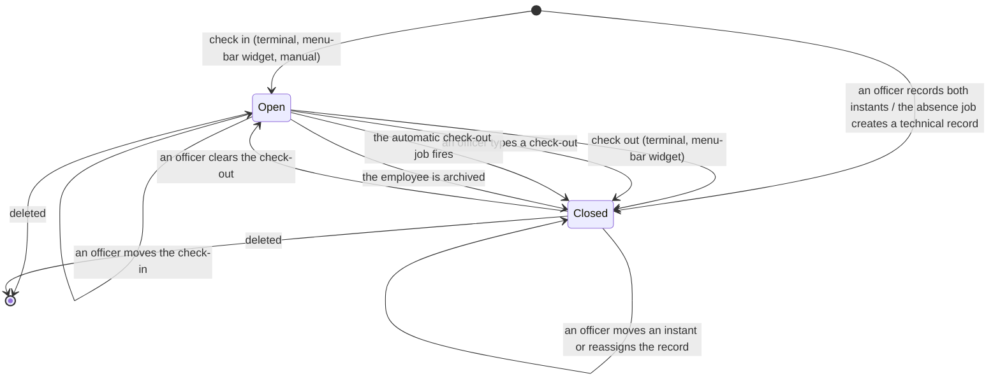
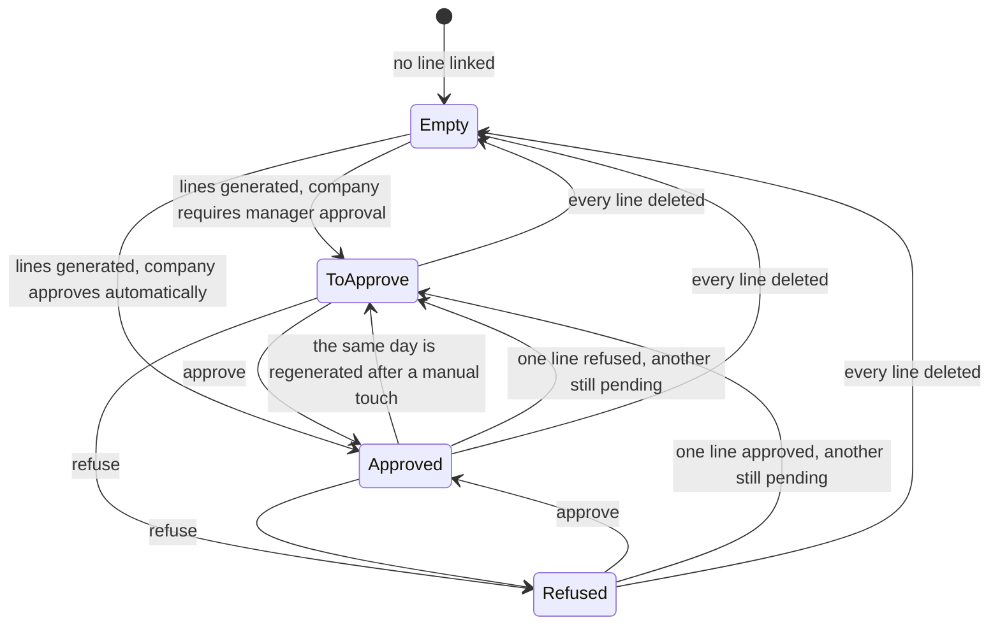
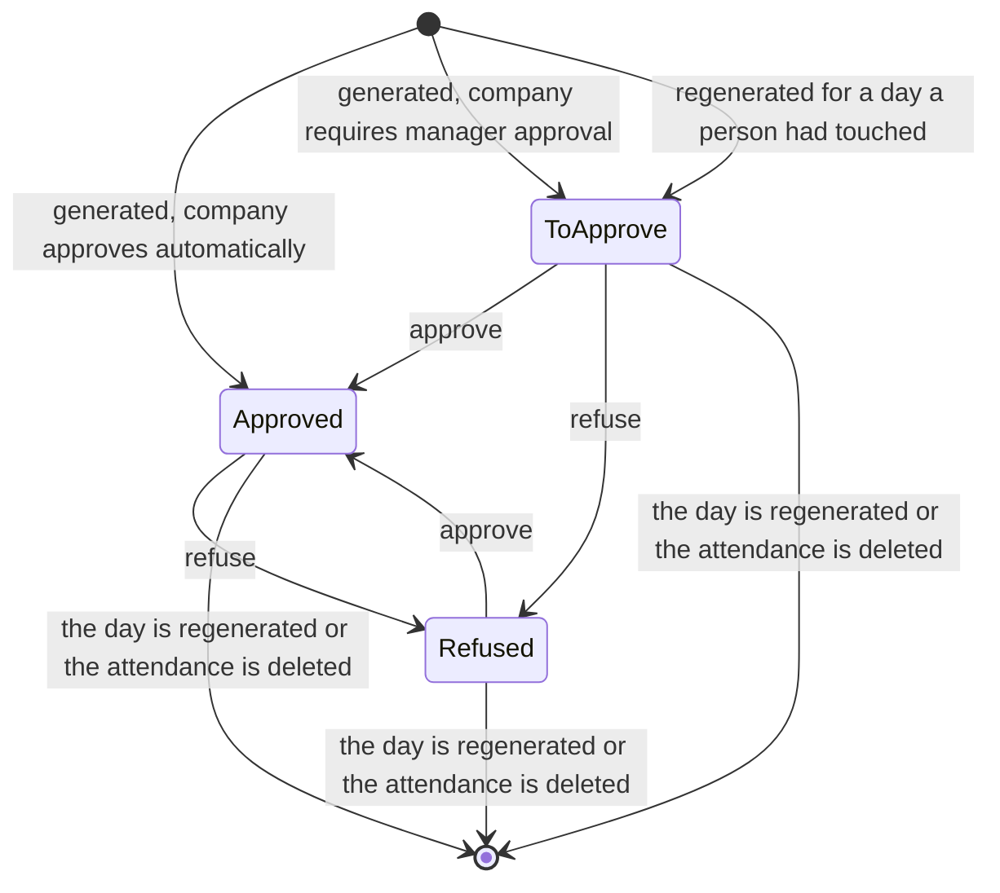
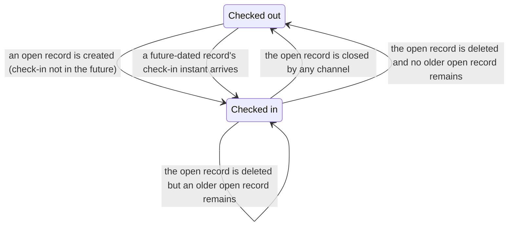
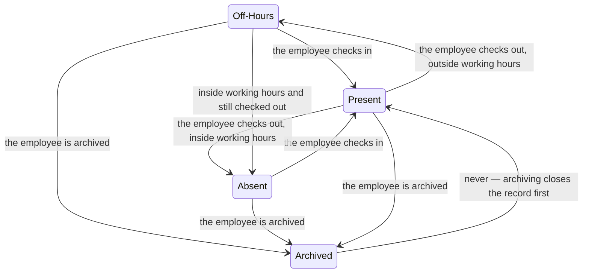
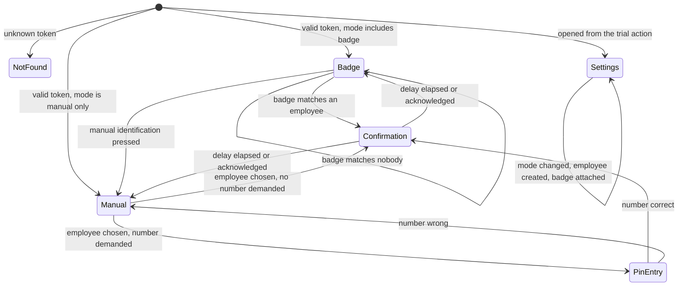

# Attendances and Working Time — State machines

This domain carries three fields that are true state fields — the extra-hours status of an
Attendance, the status of an Attendance Overtime Line and the capture channel of each side
of an Attendance — and four conditions that behave as state machines without a status
column: whether an Attendance is open or closed, whether an employee is checked in,
which shape and week layout a Working Schedule has, and which screen the shared terminal
is showing.

Each machine below states every state with its stored value, its label and its meaning;
every transition with its origin, its destination, the operation that triggers it, the
guards evaluated in order and the records created or changed; the exact refusal message of
every guard that can refuse; and a diagram.

Rule identifiers of the form `AWT-nnn` point at [business-rules.md](business-rules.md).
The arithmetic behind the transitions is in [calculations.md](calculations.md) and
[working-schedule-algorithms.md](working-schedule-algorithms.md).

---

## 1. The state-bearing fields of the domain

| Machine | Entity | Field (storage name) | Stored? | Chapter |
|---|---|---|---|---|
| Openness of a presence record | Attendance | `check_out` ("Check Out"), by its presence or absence | Yes, but it is an instant, not a status | [chapter 2](#2-the-openness-of-an-attendance) |
| Extra-hours status of a presence record | Attendance | `overtime_status` ("Overtime Status") | Stored, computed, writable, tracked | [chapter 3](#3-the-extra-hours-status-of-an-attendance) |
| Approval status of an extra-hours quantity | Attendance Overtime Line | `status` ("Status") | Stored, computed only while empty, writable | [chapter 4](#4-the-status-of-an-attendance-overtime-line) |
| Presence state of a person | Employee | `attendance_state` ("Attendance Status"), and through it `hr_presence_state` ("Presence") | Not stored; derived on read | [chapter 5](#5-the-presence-state-contribution-of-an-employee) |
| Capture channel of each side | Attendance | `in_mode` ("Mode") and `out_mode` ("Out Mode") | Stored, written by the channel, read-only on every screen | [chapter 6](#6-the-capture-channel-of-each-side-of-an-attendance) |
| Shape and week layout | Working Schedule | `schedule_type` ("Schedule Type"), `duration_based` ("Attendance based on duration"), `two_weeks_calendar` ("Calendar in 2 weeks mode") | All stored | [chapter 7](#7-the-shape-and-the-week-layout-of-a-working-schedule) |
| Screen shown by the shared terminal | none — client state | derived from `attendance_kiosk_mode` ("Attendance Mode") and the identification result | Not stored | [chapter 8](#8-the-screen-states-of-the-shared-terminal) |

Two further selections of the domain are **not** state machines and are listed here so
that a reader does not look for them below: the period kind of a Working Schedule Line
(`day_period`, values `morning`, `lunch`, `afternoon`, `full_day`) and the time type of a
Working Time Exclusion (`time_type`, values `leave` and `other`) are classifications
chosen once at creation. They never move under an operation. They are specified in
[entities.md](entities.md).

---

## 2. The openness of an Attendance

An Attendance has no status column. Its lifecycle is decided by one question: is the
check-out instant set?

### 2.1 States

| State | How it is represented | Label used here | Meaning |
|---|---|---|---|
| Absent | no record | — | The employee has never checked in, or every record has been deleted. |
| Open | `check_out` ("Check Out") is empty | Open | The employee is currently at work. The record contributes nothing to extra hours, carries no extra-hours line and has worked hours of zero. The employee's attendance state reads `checked_in`. |
| Closed | `check_out` is set | Closed | The presence span is complete. Worked hours are computed, extra hours are generated for the affected window, and the record may carry extra-hours lines. |

A closed record whose two instants are equal is legal and has worked hours of zero; it is
the ordinary result of checking in and out again immediately.

### 2.2 Transition table

| From | To | Trigger | Guards, in order | Records created or changed |
|---|---|---|---|---|
| Absent | Open | Check-in from the shared terminal by badge, from the shared terminal after manual selection, from the menu-bar widget, or by an officer creating a record without a check-out | 1. the check-in is present (`AWT-040`); 2. no other record of the employee is open (`AWT-043`); 3. the check-in does not fall inside another record of the employee (`AWT-042`); 4. no later record of the employee starts before this record's (absent) end (`AWT-044`) | One Attendance is created with the check-in, the capture channel and the check-in evidence. The employee's last attendance is repointed and the attendance state becomes `checked_in`. The extra-hours recomputation is invoked for the window and produces nothing, because an open record is skipped. |
| Absent | Closed | An officer creates a record with both instants; the absence-detection job creates a technical attendance | 1. the check-out is not earlier than the check-in (`AWT-041`); 2. the three overlap guards (`AWT-042`, `AWT-043`, `AWT-044`) | One Attendance is created. Worked hours are computed. Extra hours are regenerated over the window of [entities.md, chapter 8.7](entities.md#87-the-recomputation-window). |
| Open | Closed | Check-out from the shared terminal by badge, from the shared terminal after manual selection, or from the menu-bar widget | 1. an open record of this employee exists (`AWT-048`); 2. the check-out is not earlier than the check-in (`AWT-041`) | The check-out instant, the check-out capture channel and the check-out evidence are written. Worked hours are computed. Extra hours are regenerated over the union of the window before and the window after the write. The attendance state becomes `checked_out`. |
| Open | Closed | An officer types a check-out on the form | 1. the reader's manager flag is true (`AWT-103`); 2. `AWT-041`; 3. the three overlap guards | The same, with the capture channel left at its stored value (`manual` unless the record was opened by another channel). |
| Open | Closed | The automatic check-out job fires | 1. the employee's company enables automatic check-out; 2. the employee's schedule is not flexible; 3. the day test of [calculations.md, chapter 12.3](calculations.md#123-the-test-and-the-truncation) is satisfied (`AWT-090`) | The check-out is written at the computed instant (`AWT-091`), the check-out channel becomes `auto_check_out`, and a note is posted in the record's discussion thread (`AWT-092`). Extra hours are regenerated by the ordinary write path. |
| Open | Closed | The employee is archived | none | The check-out is set to the current instant with elevated rights (`AWT-053`), so that a human-resources user holding no attendance right can archive an employee without leaving a dangling open record. |
| Closed | Open | An officer clears the check-out | 1. the reader's manager flag is true; 2. no other record of the employee is open (`AWT-043`) | The check-out is emptied. Every extra-hours line of the affected days is deleted and rebuilt from the remaining closed records, so the record's own lines disappear. |
| Open | Open | An officer moves the check-in | 1. the manager flag; 2. `AWT-042`, `AWT-043`, `AWT-044` | The union of the window before and the window after the write is regenerated. |
| Closed | Closed | An officer moves either instant, or reassigns the record to another employee | 1. the manager flag; 2. the reassignment guard (`AWT-046`); 3. `AWT-041`; 4. the three overlap guards | The union of the two windows is regenerated. Moving an instant across midnight moves the resulting quantity from one local day to the other. |
| Open or Closed | Absent | An officer deletes the record | the reader may delete the record under the access rules of [configuration.md, chapter 9](configuration.md#9-record-rules) | The window the record covered is computed first; the record is deleted; the extra-hours lines of that window are then rebuilt from the records that remain. |

### 2.3 The guards in order, with their refusal messages

Every guard below aborts the whole write, including the other records of a batch
(`AWT-045`).

1. **The check-in is present.** A record with no check-in is refused by the required-value
   check of the field; the interface reports the field as required and names it "Check In".
2. **The check-out is not earlier than the check-in.** Refusal message, reproduced exactly:
   "\"Check Out\" time cannot be earlier than \"Check In\" time." Equal instants pass.
3. **The check-in does not fall inside an earlier record.** The latest other record of the
   same employee whose check-in is at or before this check-in must not have a check-out
   later than this check-in. Refusal message: "Cannot create new attendance record for
   *employee name*, the employee was already checked in on *date and time*", where
   *employee name* is the employee's display name and *date and time* is the offending
   check-in rendered in the reader's zone and format.
4. **At most one open record.** When the record being written has no check-out and another
   record of the same employee has none either, the refusal message is: "Cannot create new
   attendance record for *employee name*, the employee hasn't checked out since *date and
   time*", where *date and time* is the check-in of the other open record.
5. **No record straddles another.** When the record being written has a check-out, the
   latest other record whose check-in is strictly earlier than that check-out must be the
   same record already examined by guard three. Otherwise the refusal message is: "Cannot
   create new attendance record for *employee name*, the employee was already checked in on
   *date and time*".
6. **Reassignment.** Writing the employee of a record is allowed only when the new employee
   is one of the writer's own employees, or the writer holds the administrator group, or
   the writer is the attendance approver of the new employee. Otherwise: "Do not have
   access, user cannot edit the attendances that are not their own or if they are not the
   attendance manager of the employee."
7. **Duplication.** Any attempt to duplicate a record is refused with "You cannot duplicate
   an attendance." There is no state in which duplication is permitted.
8. **Check-out with no open record.** When a device asks for a check-out while the
   employee's attendance state says checked in but no open record can be found, the
   operation refuses with "Cannot perform check out on *employee name*, could not find
   corresponding check in. Your attendances have probably been modified manually by human
   resources."

### 2.4 Diagram



---

## 3. The extra-hours status of an Attendance

The field `overtime_status` ("Overtime Status") is stored and tracked, but it is **derived
from the linked extra-hours lines** rather than set directly. It exists so that a list can
be filtered and coloured by approval state without joining to the lines, and so that the
approve and refuse buttons of the form have something to bind to.

### 3.1 States

| Stored value | Label | Meaning |
|---|---|---|
| *empty* | — | No extra-hours line is linked to the record. The status bar and both approval buttons are hidden. |
| `to_approve` | "To Approve" | At least one linked line is still pending, or the linked lines are a mixture of approved and refused. The quantity does not count towards the employee's balance until it is approved. |
| `approved` | "Approved" | Every linked line is approved. The record's validated extra hours are the sum of the encoded amounts of those lines. |
| `refused` | "Refused" | Every linked line is refused. The record's validated extra hours are zero. |

The linkage is by value, not by a stored pointer: a line belongs to the attendance of the
same employee whose check-in equals the line's start instant
([entities.md, chapter 8.4](entities.md#84-computed-fields-in-detail)).

### 3.2 Transition table

| From | To | Trigger | Guards, in order | Records created or changed |
|---|---|---|---|---|
| *empty* | `to_approve` | The generator creates at least one line for this record while the company's extra-hours validation is "Approved by Manager"; or a regeneration forces a touched day back to pending | The company setting `attendance_overtime_validation` is `by_manager`, or the day was recorded as manually touched (`AWT-060`) | The record's extra hours and regular hours are recomputed; the validated extra hours stay at zero. |
| *empty* | `approved` | The generator creates lines while the validation setting is "Automatically Approved" | The company setting is `no_validation` | Extra hours, regular hours and validated extra hours are all recomputed; the employee's balance moves at once. |
| `to_approve` | `approved` | The approve action on the record, the header approve action of a list, or the approval of the last pending line | The reader's manager flag is true (`AWT-103`) | Every linked line moves to `approved`; the validated extra hours become the sum of the encoded amounts; the employee's balance moves. |
| `to_approve` | `refused` | The refuse action on the record, or the refusal of the last line | The manager flag | Every linked line moves to `refused`; the validated extra hours fall to zero. |
| `approved` | `refused` | The refuse action | The manager flag | As above; the amount leaves the employee's balance. |
| `refused` | `approved` | The approve action | The manager flag | The amount re-enters the balance. |
| `approved` or `refused` | `to_approve` | One line among several is approved while another is refused or still pending | none | The mixture rule applies: any combination that is not "all approved" or "all refused" reads `to_approve`. |
| any | *empty* | Every linked line is deleted — by a regeneration that produces nothing, or by the deletion of the attendance's day from the scope | none | The status bar and the approval buttons disappear; the extra hours and validated extra hours fall to zero. |
| `approved` | `to_approve` | A regeneration of the **same** local day, when the day was recorded as manually touched | `AWT-060` | The lines are deleted and recreated; the recreated lines are forced to `to_approve` whatever the company setting says. |

A regeneration of a **different** day never disturbs this record's status: the scope
condition of [entities.md, chapter 8.7](entities.md#87-the-recomputation-window) selects
only the affected days, and a weekly rule is what widens that scope to whole weeks
(`AWT-062`).

### 3.3 Diagram



---

## 4. The status of an Attendance Overtime Line

The field `status` ("Status") is the only human-authored state in the domain. It is
required, stored and precomputed; the computation runs **only while the field is empty**,
so an approval or a refusal is never overwritten by a later recomputation of the field
itself. It is nevertheless lost when the line is deleted and recreated, which is what a
regeneration does — hence the preservation rule `AWT-060`.

### 4.1 States

| Stored value | Label | Meaning |
|---|---|---|
| `to_approve` | "To Approve" | The quantity is computed but not granted. It counts in the record's extra hours and in its regular hours, and does **not** count in the record's validated extra hours nor in the employee's balance. |
| `approved` | "Approved" | The **encoded** amount of the line counts in the record's validated extra hours and in the employee's total approved extra hours, and, when the line is flagged compensable as time off, in the deductible balance of [Time Off](../time-off/). |
| `refused` | "Refused" | The quantity is recorded but granted to nobody. It still counts in the record's extra hours, and therefore still shifts the regular hours, but contributes zero to the balance. |

A negative line — a shortfall — passes through exactly the same three states. Approving a
shortfall makes the negative encoded amount count in the balance; refusing it removes the
negative amount from the balance and leaves the balance higher.

### 4.2 Transition table

| From | To | Trigger | Guards, in order | Records created or changed |
|---|---|---|---|---|
| *not yet created* | `approved` | The generator creates the line and the employee's company has `attendance_overtime_validation` set to `no_validation` | The employee's company is resolved through the line's employee | The linked attendance's validated extra hours and extra-hours status are marked for recomputation. |
| *not yet created* | `to_approve` | The generator creates the line and the company setting is `by_manager` | as above | The same fields are marked; the balance does not move. |
| *not yet created* | `to_approve` | A regeneration recreates a line for an (employee, day) pair whose previous lines had an encoded amount different from the computed amount, or were still pending | `AWT-060`; the pair was recorded before the deletion | The company setting is overridden; the day returns to the approval queue. |
| `to_approve` | `approved` | The approve action on the line, the approve action on the linked attendance, or the header approve action of the management queue | The reader holds the administrator group or the manage-all group, or holds the officer group and is the employee's attendance approver (`AWT-103`) | The status is written; the linked attendances' validated extra hours and extra-hours status are recomputed; the employee's balance rises by the encoded amount. |
| `to_approve` | `refused` | The refuse action, in the same three places | The same guard | The status is written; the validated extra hours of the linked attendance fall by the encoded amount. |
| `approved` | `refused` | The refuse action | The same guard | The amount leaves the balance. |
| `refused` | `approved` | The approve action | The same guard | The amount re-enters the balance. |
| any | *deleted* | A regeneration whose scope covers the line's day, the deletion of the attendance that produced it, the deletion of the employee (cascade), or a change of rule set followed by the regeneration action | none | The line disappears. Its identifier is not reused; downstream consumers must join on the employee, the day and the two instants (`AWT-061`). |

Writing the encoded amount (`manual_duration`, "Extra Hours (encoded)") is **not** a
transition: the status is untouched. It changes the balance immediately and marks the day
as manually touched, so that the next regeneration of that day returns the recreated line
to `to_approve`.

### 4.3 The guards in order

1. **The manager flag.** The line's derived flag `is_manager` ("Is Manager") is true when
   the acting user belongs to the attendance administrator group, or belongs to the officer
   group and is the attendance approver of the line's employee. The approve and refuse
   buttons are hidden when it is false; the operations themselves are additionally
   protected by the record rules of
   [configuration.md, chapter 9](configuration.md#9-record-rules), which refuse the write
   with the platform's standard access refusal.
2. **Company scope.** A global record rule limits every read and write of a line to lines
   whose employee's company is among the reader's allowed companies.
3. **The database check.** The stop instant must be strictly later than the start instant;
   the refusal message is "Starting time should be before end time." A generated line
   always satisfies it, because its instants are the check-in and check-out of a closed
   attendance and a zero-length attendance produces no line.

### 4.4 Diagram



---

## 5. The presence-state contribution of an employee

Two derived selections describe where a person is. The first, `attendance_state`
("Attendance Status"), belongs to this domain and has two values. The second,
`hr_presence_state` ("Presence"), belongs to
[Human Resources Core](../human-resources-core/) and has four; this domain overrides its
computation and supplies the second-highest-priority answer, after an active connection.

### 5.1 The attendance state

| Stored value | Label | Meaning |
|---|---|---|
| `checked_in` | "Checked in" | The employee's **last** attendance exists and has no check-out. |
| `checked_out` | "Checked out" | There is no last attendance, or the last attendance has a check-out. |

The *last* attendance is the record of that employee with the greatest check-in that is
**not later than the current instant**. A record created for a future instant therefore
does not make the employee checked in; the state flips by itself when that instant
arrives, because the field is computed on read and is never stored.

| From | To | Trigger | Guards | Effects |
|---|---|---|---|---|
| `checked_out` | `checked_in` | An open record is created whose check-in is not in the future | the openness guards of [chapter 2.3](#23-the-guards-in-order-with-their-refusal-messages) | The employee's last attendance, last check-in and last check-out are repointed. The menu-bar widget's button label changes from "Check in" to "Check out". |
| `checked_out` | `checked_in` | Time passes until a record created for a future instant becomes the last attendance | none | None; the field is recomputed on the next read. |
| `checked_in` | `checked_out` | The open record receives a check-out, by any of the six paths of [chapter 2.2](#22-transition-table) | the guards of that transition | As above; the widget's label changes back. |
| `checked_in` | `checked_out` | The open record is deleted | the reader may delete it | The state falls back to whatever the next-most-recent record says; when an older open record exists, the employee stays `checked_in`. |

### 5.2 The presence state this domain contributes

The presence state is computed by the human-resources domain and then corrected by this
one. The four values are `present` ("Present"), `absent` ("Absent"), `archive`
("Archived") and `out_of_working_hour` ("Off-Hours"). This domain applies two corrections,
in this order, after the base computation has run:

1. Every employee whose attendance state is `checked_in` is reported `present`, whatever
   the base computation concluded. This is the second-highest priority in the whole
   presence chain: only an active connection outranks it.
2. Every employee whose attendance state is `checked_out`, whose base presence state is
   `out_of_working_hour`, and who is nevertheless inside their working hours at this
   instant, is reported `absent`. In words: the schedule says the person should be here,
   the person has not checked in, and no connection contradicts it.

The presence icon (`hr_icon_display`, values `presence_present`,
`presence_out_of_working_hour`, `presence_absent`, `presence_archive` and
`presence_undetermined`) follows the presence state. This domain widens the condition under
which the icon is shown at all: it is shown for every employee whose company controls
presence by attendance, and for every employee linked to a user, rather than only for the
latter.

| From (base) | To (after this domain) | Condition |
|---|---|---|
| any of `absent`, `out_of_working_hour`, `archive` | `present` | The attendance state is `checked_in`. |
| `out_of_working_hour` | `absent` | The attendance state is `checked_out` **and** the employee is inside their working hours now. |
| `present` | `present` | Unchanged; an active connection already decided. |
| `out_of_working_hour` | `out_of_working_hour` | The attendance state is `checked_out` and the employee is outside their working hours now. |
| `archive` | `archive` | The employee is archived; archiving also closes the open record, so the attendance state is `checked_out` by then. |

### 5.3 Diagram





---

## 6. The capture channel of each side of an Attendance

Both channels are stored selections, both default to `manual`, and both are read-only on
every screen: the channel is **recorded by the operation that wrote the instant**, never
chosen by a person (`AWT-050`). They are state fields because they say, permanently, how
each half of the record came into being.

### 6.1 States

| Stored value | Label | Applies to | Written by |
|---|---|---|---|
| `kiosk` | "Kiosk" | both sides | Any of the shared-terminal endpoints: badge identification, manual selection. |
| `systray` | "Systray" | both sides | The menu-bar widget endpoint. |
| `manual` | "Manual" | both sides | The default. A record created or edited by a person keeps it. |
| `technical` | "Technical" | both sides | The absence-detection job, on both sides of the one-second record it creates. |
| `auto_check_out` | "Automatic Check-Out" | the check-out side only | The automatic check-out job. |

### 6.2 Transition table

| Field | From | To | Trigger | Effects |
|---|---|---|---|---|
| `in_mode` | *unset at creation* | `manual` | Any creation that does not state a channel | The check-in evidence block stays empty. |
| `in_mode` | *unset at creation* | `kiosk` | A check-in through the shared terminal | The evidence block of [interfaces.md, chapter 2.2](interfaces.md#22-the-evidence-block-built-on-the-server) is applied to the check-in side. |
| `in_mode` | *unset at creation* | `systray` | A check-in through the menu-bar widget | The same evidence block is applied. |
| `in_mode` | *unset at creation* | `technical` | The absence-detection job | No evidence; the record lasts one second. |
| `out_mode` | *unset at creation* | `manual` | A check-out typed by a person, or the closure performed when the employee is archived | No evidence. |
| `out_mode` | *unset at creation* | `kiosk` or `systray` | A check-out through that channel | The evidence block is applied to the check-out side. |
| `out_mode` | *unset at creation* | `technical` | The absence-detection job | Both sides carry `technical`. |
| `out_mode` | any | `auto_check_out` | The automatic check-out job closes the record | The check-out instant is computed rather than observed; a note is posted in the discussion thread. |

A channel is never cleared and never moves back to `manual`: once a side has been captured
by a device, the record says so for good. Editing the instant afterwards does **not**
change the channel, which is why an automatically closed record stays visible to the
"Automatically Checked-Out" filter even after an officer corrects its check-out.

### 6.3 Consequences of the channel

| Channel | Consequence |
|---|---|
| `technical` on the check-out side | The record is drawn in the error colour whatever its length (`AWT-052`). |
| `auto_check_out` on the check-out side | The record matches the "Automatically Checked-Out" filter of the search panel. |
| `manual` on either side | The evidence block of that side is hidden on the form, because a manual entry carries no device evidence. |
| `kiosk` or `systray` | The evidence block is shown when the company enables device and location tracking, and hidden when it does not. |

---

## 7. The shape and the week layout of a Working Schedule

Three stored booleans and one selection decide how a schedule is read. They are not
independent: the shape excludes some layouts, and each switch rewrites the period list.

### 7.1 States

| Combination | `schedule_type` | `duration_based` | `two_weeks_calendar` | Meaning |
|---|---|---|---|---|
| Fixed, one week | `fully_fixed` | false | false | The default. Seven weekdays of periods with real start and end hours, repeating every week. |
| Fixed, two weeks | `fully_fixed` | false | true | Two complete weeks separated by two section markers; the week in force is derived from the date. |
| Duration based, one week | `fully_fixed` | true | false | Each period carries a length; its clock times are derived by centring the length on twelve o'clock. Break periods are forbidden. |
| Duration based, two weeks | `fully_fixed` | true | true | The same, in two alternating weeks. |
| Flexible | `flexible` | ignored | ignored | No period list is read at all. The schedule carries a daily budget and a weekly budget; intervals are synthesised. The period tab disappears from the form. |

The derived boolean `flexible_hours` ("Flexible Hours") mirrors the selection: it is true
exactly when `schedule_type` is `flexible`, and writing it writes the selection back.

A **fully flexible resource** is not one of these states: it is a Resource with no schedule
at all. See [entities.md, chapter 6.4](entities.md#64-fully-flexible-resources).

### 7.2 Transition table

| From | To | Trigger | Guards | Records created or changed |
|---|---|---|---|---|
| Fixed, one week | Fixed, two weeks | The "switch calendar type" operation | The user confirms "Are you sure you want to switch to a 2-week calendar? All work entries will be lost." | Two section markers are inserted, named "First week" (sequence zero, week number "first") and "Second week" (sequence twenty-five, week number "second"); every existing period is duplicated into both weeks with sequences *index plus one* and *index plus twenty-six*; the previous collection is replaced. |
| Fixed, two weeks | Fixed, one week | The same operation, in the other direction | The user confirms "Are you sure you want to switch to a 1-week calendar? All work entries will be lost." | Every period is deleted; the duration-based flag is forced false; the period list is refilled from the company's default schedule, or from the built-in forty-hour pattern when there is none. |
| Fixed (either layout) | Duration based | The "switch based on duration" operation | The user confirms "If checked, the working schedule will be based on an amount of hours (defined for each day) and not a start & end time anymore.Do you confirm ?" | Every break period is deleted (`AWT-026`); the remaining periods keep their stored lengths and their clock times become derived. |
| Duration based | Fixed | The same operation, in the other direction | The user confirms "If unchecked, the working schedule will be based on a defined start and end hours.Do you confirm ?" | Every period is deleted and the list is refilled from the company's default schedule, or from the forty-hour fallback; when the schedule is in two-week mode the refilled list is then duplicated into the two weeks. |
| Fixed or duration based | Flexible | The schedule type is set to `flexible`, on the form or by writing the flexible flag | none | The period tab disappears. The averages stop being recomputed and stand as entered (`AWT-028`). The stored periods are kept but are ignored by every interval algorithm. |
| Flexible | Fixed | The schedule type is set to `fully_fixed` | none | The period tab reappears with whatever periods were stored; the averages are recomputed from them at once. |
| Any | Any, with a new company | The company of an unsaved or newly-companied schedule is changed | none | The period list and the global-closure list are replaced by copies taken from the new company's default schedule, and that schedule's two-week flag and time zone are copied as well (`AWT-032`). |

Both confirmation texts of the duration switch are reproduced exactly, including the
missing space before the final question mark.

### 7.3 Diagram

```mermaid
stateDiagram-v2
    state "Fixed, one week" as F1
    state "Fixed, two weeks" as F2
    state "Duration based, one week" as D1
    state "Duration based, two weeks" as D2
    state "Flexible" as FL
    F1 --> F2: switch calendar type (confirmed)
    F2 --> F1: switch calendar type (confirmed); periods rebuilt from the company default
    F1 --> D1: switch based on duration (confirmed); breaks deleted
    D1 --> F1: switch back (confirmed); periods rebuilt
    F2 --> D2: switch based on duration (confirmed); breaks deleted
    D2 --> F2: switch back (confirmed); periods rebuilt and duplicated into both weeks
    F1 --> FL: schedule type set to flexible
    F2 --> FL: schedule type set to flexible
    D1 --> FL: schedule type set to flexible
    FL --> F1: schedule type set to fully fixed
```

---

## 8. The screen states of the shared terminal

The shared terminal is an unauthenticated page identified only by the company token in its
address. Its screen sequence is a state machine of its own, and a rebuild has to reproduce
it because the sequence is what keeps the page from exposing anything but check-in and
check-out.

### 8.1 States

| Screen | Reached when | What it shows | What leaves it |
|---|---|---|---|
| Not found | The token matches no company | The platform's not-found response | Nothing; the page never renders. |
| Badge identification | The company's terminal mode is `barcode` or `barcode_manual` | A badge target and the configured reader — a dedicated reader, the front camera or the rear camera | A badge is presented; or, in mode `barcode_manual`, the manual-identification action. |
| Manual identification | The mode is `manual` or `barcode_manual` and the manual action was pressed | A searchable, paginated employee list with avatars and job titles, and a department side panel with employee counts | An employee row is pressed; or the back action returns to badge identification. |
| Personal identification number entry | An employee was chosen manually **and** the company demands a personal identification number | A numeric keypad with the prompt naming the employee and the direction of the action | The number is confirmed, or the entry is cancelled. |
| Confirmation | Any identification succeeded | A greeting or a farewell with the employee's name and picture, the instant of the action, the hours worked today and, when the company permits it, the extra hours of today and the running balance | The configured delay elapses, or the acknowledgement action is pressed. |
| Settings | The page was opened from the trial action, or the session has no password and is not the public user | The terminal mode chooser, the create-an-employee action and the attach-a-badge action | The operator leaves the settings screen. |

### 8.2 Transition table

| From | To | Trigger | Guards | Effects |
|---|---|---|---|---|
| — | Not found | The page is requested with an unknown token | none | Nothing is written. |
| — | Badge identification | The page is requested with a valid token and the mode includes badge identification | When the requesting session has a password and the page was not opened from the trial action, the session is signed out first | The page payload of [interfaces.md, chapter 2.1](interfaces.md#21-data-structures) is rendered. |
| — | Settings | The page is requested from the trial action, or by a session with no password that is not the public user | none | The same payload is rendered with the mode reported as `settings`. |
| Badge identification | Confirmation | A badge is presented and one employee of that company carries it | The reader is locked against double reads while the request is in flight | A check-in or a check-out is performed with elevated rights and both channels recorded as `kiosk`. |
| Badge identification | Badge identification | A badge is presented and no employee of that company carries it | none | Nothing is written; the notification "No employee corresponding to Badge Identifier '*scanned value*.'" is shown, the scanned value being echoed exactly as read. |
| Badge identification | Manual identification | The manual-identification action is pressed | The mode is `barcode_manual` | The employee page is requested with the token, a page size, an offset and a filter restricted to the name and the department (`AWT-111`). |
| Manual identification | Confirmation | An employee row is pressed | The company does not demand a personal identification number | A check-in or a check-out is performed with elevated rights and channel `kiosk`. |
| Manual identification | Personal identification number entry | An employee row is pressed | The company demands a personal identification number | The employee information block is fetched first, so that the prompt can name the employee. |
| Personal identification number entry | Confirmation | The number is confirmed and equals the employee's stored number | The employee belongs to the company of the token | The check-in or check-out is performed. |
| Personal identification number entry | Manual identification | The number is confirmed and does not match | none | Nothing is written; the notification "Wrong Personal Identification Number" is shown. The response is an empty structure, indistinguishable from an unknown employee. |
| Confirmation | Badge identification or Manual identification | The configured delay elapses, or the acknowledgement action is pressed | none | Nothing is written. |
| Settings | Settings | The mode chooser is used, an employee is created, or a badge is attached | The acting session must be the one the terminal was opened with | The company's terminal mode, a new employee, or an employee's badge identifier is written. |
| any | any | The keep-alive call fires periodically while the page is open | none | The session is refreshed so that a terminal left open across a shift does not expire. |

### 8.3 Diagram



---

## 9. Reconciliation notes

Neither source version of this folder contained a separate state-machine document. One
version described the machines inside its workflow file, as four tables without diagrams,
without stored values for the presence states and without the screen sequence of the
shared terminal; the other described the extra-hours status and the line status inside its
entity file. This file was written from both, from the state fields recorded in the entity
catalogue and from the source, and the following points were resolved.

1. **The openness of an Attendance is not a status field.** One version listed "open" and
   "closed" as if they were stored values. They are not: openness is the emptiness of the
   check-out instant. The machine is specified as such in
   [chapter 2](#2-the-openness-of-an-attendance), and the stored representation is stated
   for every state, as rule seven of the documentation rules requires.
2. **The transition from closed back to open** was missing from both versions. An officer
   may clear a check-out, subject to the one-open-record guard; the transition and its
   effect on the extra-hours lines are specified in
   [chapter 2.2](#22-transition-table).
3. **The mixture case of the attendance's extra-hours status.** One version stated only
   "all approved" and "all refused". A record whose lines are partly approved and partly
   refused reads `to_approve`; that is the general rule and it is stated as such.
4. **The presence-state correction.** One version said only that a checked-in employee is
   reported present. The second correction — a checked-out employee inside their working
   hours whose base state is off-hours is reported absent — comes from the source and is
   specified in [chapter 5.2](#52-the-presence-state-this-domain-contributes), together
   with the four stored values and the five icon values.
5. **The capture channels** were described in one version as a validation rule and in the
   other as a field default. They are a state machine over two fields, with one value
   (`auto_check_out`) that exists on one side only; that is
   [chapter 6](#6-the-capture-channel-of-each-side-of-an-attendance).
6. **The schedule shape switches.** Both versions described the two switching operations,
   one under workflows and one under the entity. They are transitions of a state machine
   with five reachable combinations, and the exact confirmation texts belong to the guards;
   that is [chapter 7](#7-the-shape-and-the-week-layout-of-a-working-schedule).
7. **The screen sequence of the shared terminal** appeared in one version as a list of
   screens without transitions. It is specified here as a machine, because the order of the
   screens is what bounds what an unauthenticated caller can reach.
