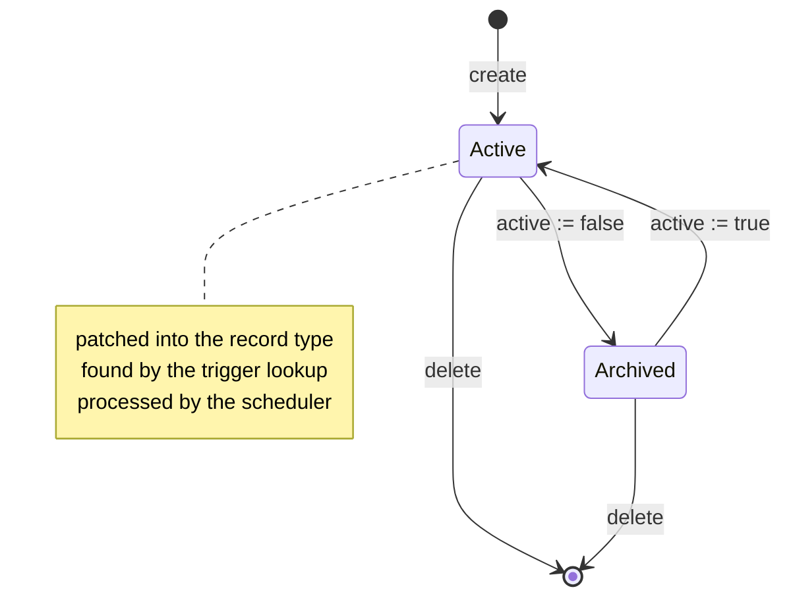
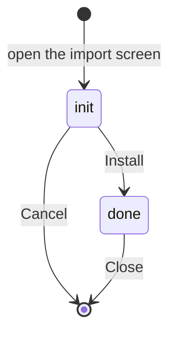
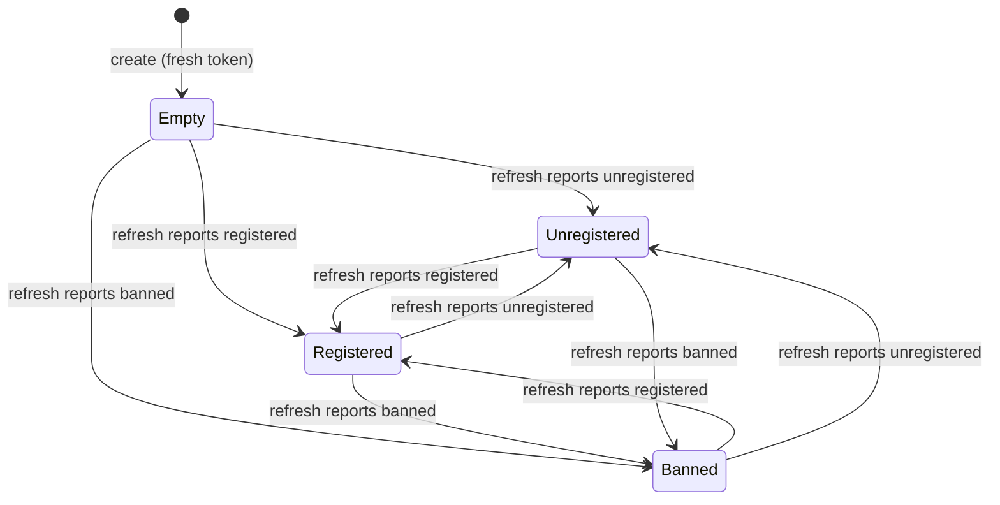
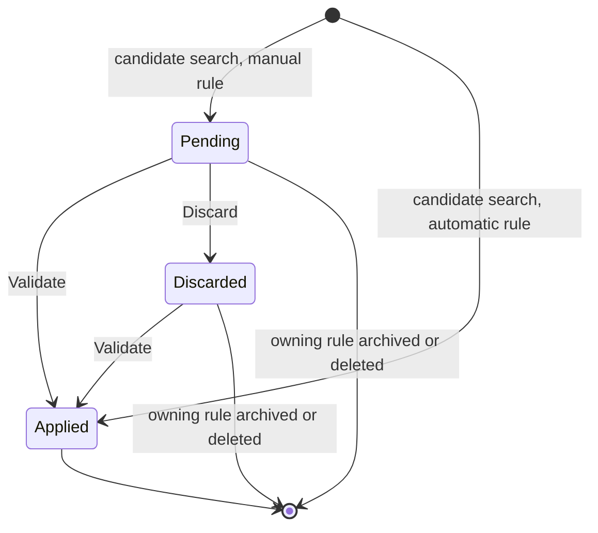
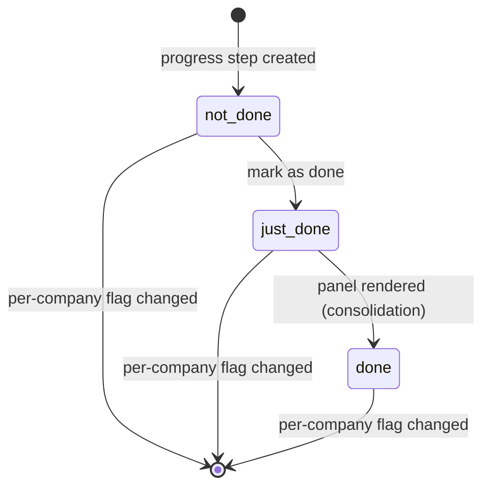
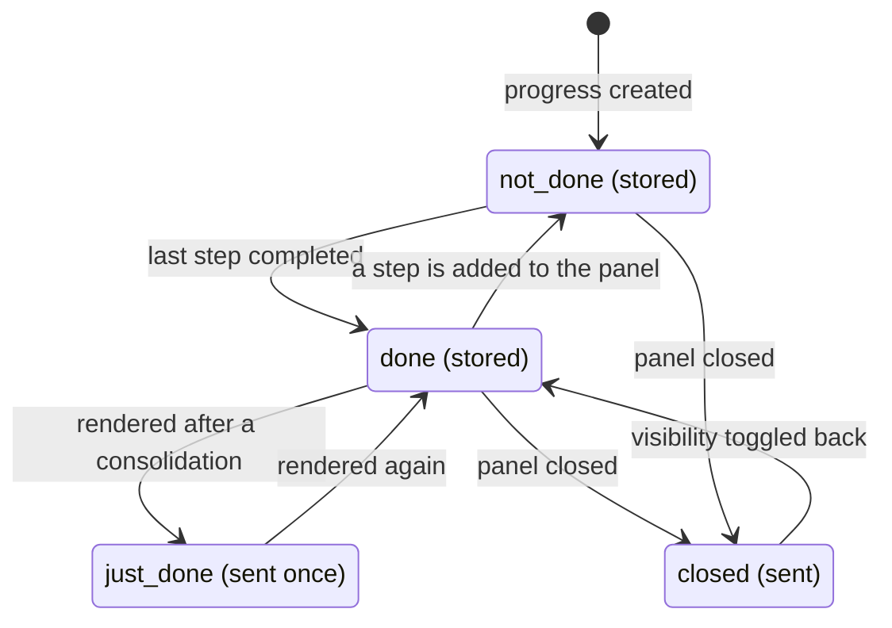
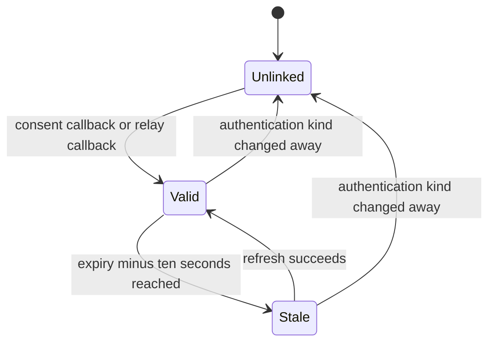
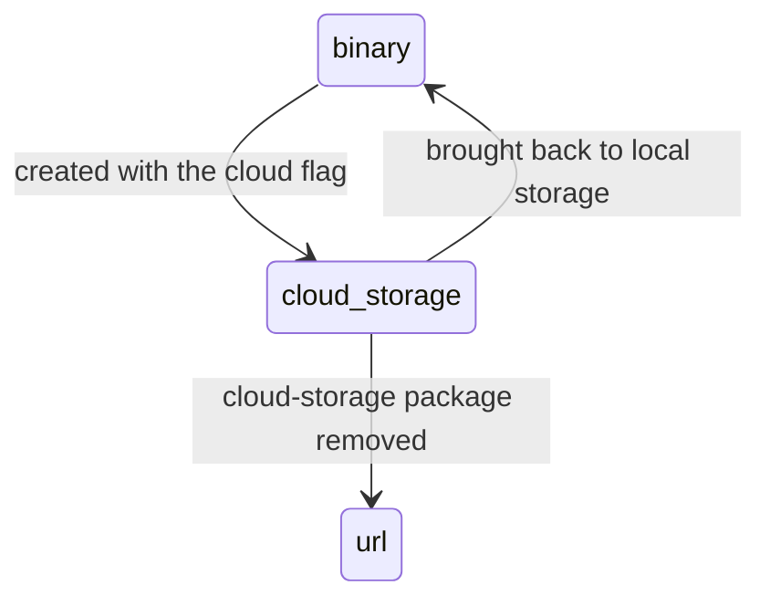

# State machines

This document lists every stored state field in the domain, every value it may hold, every
transition between those values, the operation that triggers each transition, the conditions that
must hold, and the records each transition creates or changes. Two derived machines — states that
are computed rather than stored but that a rebuild must reproduce exactly — are included at the end
and marked as derived.

Contents:

1. [Automation Rule activation](#1-automation-rule-activation)
2. [Module Import Wizard status](#2-module-import-wizard-status)
3. [Metered service account registration](#3-metered-service-account-registration)
4. [Recycling Record disposition](#4-recycling-record-disposition)
5. [Onboarding step completion](#5-onboarding-step-completion)
6. [Onboarding panel completion](#6-onboarding-panel-completion)
7. [Delegated mail authorisation (derived)](#7-delegated-mail-authorisation-derived)
8. [Attachment storage kind (derived)](#8-attachment-storage-kind-derived)

---

# 1. Automation Rule activation

The Automation Rule has no dedicated status field. Its only state is the activation flag, and that
flag has consequences far beyond hiding the record: it decides whether the record type is patched at
all, and whether the time-based scheduler is switched on.

## 1.1 States

| Stored value of `active` | Label | Meaning |
|---|---|---|
| true | Active | The rule is patched into the watched record type, is found by the trigger lookup, and is processed by the time-based scheduler when its trigger is a time trigger. |
| false | Archived | The rule is invisible to the trigger lookup and to the scheduler, and its patch is removed at the next registry rebuild. |

## 1.2 Transition table

| From | To | Trigger | Guards | Records created or changed |
|---|---|---|---|---|
| — | Active | Creating a rule | Every constraint of [`business-rules.md`](business-rules.md) §1 passes | The rule; a fresh webhook identifier; the scheduler interval is recomputed; the registry patches are reinstalled; the client template cache is emptied when the rule is a live-update rule with at least one live-update field |
| Active | Archived | Writing the flag to false | none | The scheduler interval is recomputed and, when no time rule is left active, the scheduled job is switched off; the registry patches are reinstalled; the template cache is emptied when the rule was or is a live-update rule |
| Archived | Active | Writing the flag to true | Every constraint of [`business-rules.md`](business-rules.md) §1 passes | The scheduler interval is recomputed and the job is switched on when the rule is a time rule; the patches are reinstalled; the template cache is emptied as above |
| Active or Archived | — | Deleting a rule | none | The rule's actions are deleted with it; the scheduler interval is recomputed; the patches are reinstalled; the template cache is emptied when the rule was a live-update rule |

## 1.3 Diagram

## 1.4 The side machine: the scheduled job

The scheduled job that runs time-based rules has its own two states, and they are driven entirely by
the rules:

| State | When |
|---|---|
| Switched off | No active rule has a time trigger. This is the shipped state. |
| Switched on | At least one active rule has a time trigger. |

Its interval is recomputed on every rule creation, deletion, activation change, record-type change,
trigger change, live-update-field change, delay change and delay-unit change. The arithmetic is in
[`calculations.md`](calculations.md) §3.1. Two rules govern the write:

1. The switch always follows the existence of an active time rule.
2. The interval is only ever **shortened**, never lengthened: the new interval is written only when
   it is strictly smaller than the current one. Deactivating the rule that forced a short interval
   therefore leaves the job running more often than necessary until a shorter one appears or the
   job's own record is edited. This is recorded as a **compatibility finding**: the interval drifts
   downwards over the life of a database. A corrected behaviour would recompute the interval from
   the surviving rules on every change, in both directions.
3. When the job's record is locked by another transaction, the update is abandoned silently and the
   job keeps its previous switch and interval.

---

# 2. Module Import Wizard status

## 2.1 States

| Stored value | Label | Meaning |
|---|---|---|
| `init` | init | The archive has been chosen or downloaded and the options are being set. The archive field, the force flag and the demonstration-data flag are editable; the dependency description is shown; the footer offers *Install* and *Cancel*. |
| `done` | done | The installation finished. Only the resulting message is shown; the footer offers *Close*. |

Both labels are reproduced exactly as stored: they are the raw values, not translated phrases.

## 2.2 Transition table

| From | To | Trigger | Guards | Records created or changed |
|---|---|---|---|---|
| — | `init` | Opening the import screen, or downloading a package from the remote directory | For the second path, the reader must be an administrator and the archive's missing dependencies must all be resolvable | One wizard record, carrying the archive and the dependency description |
| `init` | `done` | Pressing *Install* | Every guard of [`business-rules.md`](business-rules.md) §3 passes | Every package in the archive is created or updated; its data files, static files, translation files and asset declarations are loaded; the browser is then sent to the application root |
| `init` | — | Pressing *Cancel* | none | Nothing; the transient record is left to be collected |
| `done` | — | Pressing *Close* | none | Nothing |

The transition to `done` is not written by the install operation itself: the install operation
navigates the browser away, so the `done` branch of the form is reached only when the wizard is
opened again on a record whose status was already set. The status field therefore behaves as a
display switch rather than as a progress marker. This is recorded as a **compatibility finding**: a
corrected behaviour would write the status and the resulting message before navigating, so that a
failure part-way through leaves a readable record.

## 2.3 Diagram

---

# 3. Metered service account registration

The account's state is a mirror: it is never written by a user and never written by a local
operation other than the refresh. It reports what the outside service says about the credential.

## 3.1 States

| Stored value | Label | Meaning |
|---|---|---|
| empty | — | The credential has never been presented to the outside service, or the refresh has never succeeded. This is the state of a freshly created account. |
| `unregistered` | Unregistered | The outside service knows the token but no paid registration is attached to it. |
| `registered` | Registered | The outside service recognises the credential and will bill units against it. |
| `banned` | Banned | The outside service refuses to serve this credential. |

## 3.2 Transition table

| From | To | Trigger | Guards | Records created or changed |
|---|---|---|---|---|
| — | empty | Creating an account, explicitly or through the find-or-create lookup | none | The account, with a fresh token; on a neutralised database the token gains the suffix `+disabled` |
| any | the value the service reports | Reading accounts through the web client | Tests are not running; the service answered; the answered token matches the stored token exactly, compared in constant time | The account's balance, alert threshold, state and lock flag are written with the update-suppression flag and with thread tracking switched off, so the refresh leaves no message in the thread |
| any | unchanged | Reading accounts while the service is unreachable | — | Nothing; a warning is logged |

Because the refresh writes the lock flag to true at the same time, an account that has ever been
seen by the outside service can no longer have its service changed on the form.

## 3.3 Diagram

Every transition is the same operation — the refresh — carrying a different answer. There is no
local transition.

---

# 4. Recycling Record disposition

## 4.1 States

| State | How it is stored | Meaning |
|---|---|---|
| Pending | `active` is true and the record exists | The candidate is waiting for a human decision. It appears in the recycle list. |
| Discarded | `active` is false and the record exists | A human refused the suggestion. The candidate no longer appears in the default list but still blocks the same original from being proposed again, because the duplicate check reads archived candidates too. |
| Applied | the record no longer exists | The suggestion was carried out; the candidate was deleted after the original was archived or deleted. |

## 4.2 Transition table

| From | To | Trigger | Guards | Records created or changed |
|---|---|---|---|---|
| — | Pending | The candidate search of a rule in manual mode | The original matches the rule's filter and age threshold, and no candidate — pending or discarded — already exists for that rule and original | One candidate per original, in batches of fifty thousand, committed batch by batch outside tests |
| — | Applied | The candidate search of a rule in automatic mode | Same guards | One candidate per original, in batches of five thousand, each batch validated immediately and then deleted; committed batch by batch outside tests |
| Pending | Applied | *Validate* on the candidate | none beyond the rule's own action | The original is archived when the rule's action is `archive`, or deleted when it is `unlink`, both with elevated rights; the candidate is then deleted. A candidate whose original has already disappeared is deleted without touching anything. |
| Pending | Discarded | *Discard* on the candidate | none | The candidate's activation flag is cleared; the original is untouched |
| Discarded | Applied | *Validate* on the candidate, reached through the *Discarded* filter | none | As above |
| Pending or Discarded | — | Archiving the owning rule | none | Every candidate of that rule is deleted outright, before the rule's own write is applied |
| Pending or Discarded | — | Deleting the owning rule | none | Every candidate of that rule is deleted by the cascade |

## 4.3 Diagram

## 4.4 Guard detail: the duplicate check

The candidate search reads every existing candidate of the rules being searched **with archived
records included**, groups their original identifiers by rule, and skips any original already in
that group. A discarded candidate therefore permanently suppresses its original for that rule, until
the rule is archived — which deletes the candidates — or the rule is deleted.

---

# 5. Onboarding step completion

## 5.1 States

| Stored value | Label | Meaning |
|---|---|---|
| `not_done` | Not done | The step has never been completed for this company. This is also the state reported when no progress-step record exists at all. |
| `just_done` | Just done | The step was completed since the panel was last rendered. The client shows the celebration for this step exactly once. |
| `done` | Done | The step is complete and the celebration has already been shown. |

## 5.2 Transition table

| From | To | Trigger | Guards | Records created or changed |
|---|---|---|---|---|
| — | `not_done` | Creating the progress-step records for a step | A progress record exists for the panel and for the reader's company or for no company | One progress-step record per step, carrying the reader's company when the step is per-company and no company otherwise, linked to every matching panel progress record |
| `not_done` | `just_done` | Marking the step as done | The record is in `not_done`; records already in `just_done` or `done` are left alone | The progress-step record's state; the owning panel progress records recompute their own state |
| `just_done` | `done` | Rendering the panel | The consolidation runs on every step whose state was `just_done` at render time | The progress-step records' states; the panel progress records recompute |
| any | — | Changing the step's per-company flag | The flag actually changes value | Every progress-step record of that step is deleted, and the panels are asked to refresh their progress records |
| any | — | Deleting the step, or deleting the company | none | The progress-step record is deleted by the cascade |

## 5.3 The rendering consolidation

Rendering a panel does four things in this order:

1. For every step of the panel — iterating the panel's steps, not the progress records, because a
   step in `not_done` may have no progress record at all — read the step's current state and record
   it in a mapping keyed by the step identifier.
2. Collect the progress-step records whose state is `just_done`.
3. Consolidate that collection: every one of them becomes `done`.
4. Add one extra entry to the mapping under the key `onboarding_state`, computed by §6.3.

The mapping is what the client receives. Because step three happens after step one, the client is
told `just_done` for a step whose stored state is already `done` by the time the answer is sent.
That is deliberate: it is what makes the celebration appear exactly once.

## 5.4 Diagram

---

# 6. Onboarding panel completion

## 6.1 Stored states

| Stored value of `onboarding_state` | Label | Meaning |
|---|---|---|
| `not_done` | Not done | At least one step of the panel is not yet complete. |
| `done` | Done | Every step of the panel is complete. |

The stored field never holds `just_done`, although the selection allows it: the computation can only
produce the two values above.

## 6.2 The stored computation

The state is recomputed whenever the panel's step list changes, whenever the progress-step list
changes, or whenever any of those progress steps changes state. It is `done` when the number of
progress steps in state `just_done` or `done` equals the number of steps on the panel, and
`not_done` in every other case — including the case where the panel has more steps than progress
steps, and the degenerate case of a panel with no steps at all, where zero equals zero and the state
is `done`.

## 6.3 The rendering state

The value the client receives under the key `onboarding_state` is **not** the stored value. It is
computed at render time as follows, in this order:

| Condition | Value sent |
|---|---|
| The panel has been closed for this company | `closed` |
| The stored state is `done` and at least one step was consolidated during this render | `just_done` |
| The stored state is `done` and nothing was consolidated | `done` |
| The stored state is `not_done` | no entry at all is sent under that key |

The `just_done` value is what makes the closing banner — the completion message and the *Close
Panel* button — appear exactly once.

## 6.4 The visibility flag

A second, independent stored state governs whether the panel is displayed at all.

| Stored value of `is_onboarding_closed` | Meaning |
|---|---|
| false | The panel is displayed. |
| true | The panel is hidden. |

| From | To | Trigger | Guards | Records changed |
|---|---|---|---|---|
| false | true | *Close* on the panel, or the client's close operation, or the confirmation dialogue's *Get them out of my sight!* button | A progress record exists for the reader's context; when none does, nothing happens | The progress record's closed flag |
| either | inverted | *Toggle visibility*, from the panel list header or the panel form header | A progress record exists | The progress record's closed flag |
| true | true | Closing by external identifier when the identifier resolves to nothing | none | Nothing at all; the operation is deliberately silent |

## 6.5 Diagram

---

# 7. Delegated mail authorisation (derived)

A mail server linked to an outside provider has no status field; its authorisation state is derived
from the three token fields. A rebuild must reproduce the derivation because the refusals depend on
it.

## 7.1 States

| State | How it is derived | Meaning |
|---|---|---|
| Unlinked | No refresh token | The consent round-trip has never completed. Sending or fetching fails. |
| Linked, token valid | A refresh token exists, an access token exists, and the expiry instant minus ten seconds is still in the future | The cached access token is used as-is. |
| Linked, token stale | A refresh token exists, and either the access token is missing, or the expiry instant is missing, or the expiry instant minus ten seconds is in the past | A new access token is fetched before use. |

The ten-second margin is the five-second token-request timeout plus five seconds, and exists so that
a token does not expire between being fetched and being used to open a session.

## 7.2 Transition table

| From | To | Trigger | Guards | Records created or changed |
|---|---|---|---|---|
| Unlinked | Linked, token valid | The consent callback returns with an authorisation code | The state parameter parses; the record type carries the provider behaviour; the record exists; the cross-site protection token matches in constant time; for the first provider, when the server has an owner or the reader is not a settings administrator, the address the provider reports must be verified and must normalise to the same address as the server's own | The record's activation flag is set to true and the three token fields are written; the browser is redirected to the server form, or to the user's own preferences when the server is that user's personal one |
| Unlinked | Linked, token valid | The relay callback returns with the tokens already exchanged | The same cross-site protection check, and for the first provider the same address verification | The same three fields plus the activation flag |
| Linked, token valid | Linked, token stale | Time passes | none | Nothing is written; the derivation simply changes |
| Linked, token stale | Linked, token valid | Building the authentication string | The refresh succeeds | The access token and its expiry are written. For the second provider the **refresh token is also replaced**, because that provider returns a new one on every refresh |
| any Linked | Unlinked | Changing the server's authentication kind away from the delegated kind | none | The three token fields are cleared |
| Unlinked | Unlinked | Building the authentication string for the second provider | none | Fails with "Please connect with your Outlook account before using it." |

## 7.3 Diagram

## 7.4 What each state permits

| Operation | Unlinked | Stale | Valid |
|---|---|---|---|
| Save the server record | yes | yes | yes |
| Open the consent address | yes | yes | yes |
| Send a message through the outgoing server | no | yes, after a refresh | yes |
| Fetch messages through the incoming server | no | yes, after a refresh | yes |

---

# 8. Attachment storage kind (derived)

An attachment's storage kind is a stored selection owned by
[`../platform-foundation/`](../platform-foundation/); this folder adds one value and two
transitions.

## 8.1 The value added

| Stored value | Label | Meaning |
|---|---|---|
| `cloud_storage` | Cloud Storage | The bytes live in an outside object store. The attachment's address field identifies the blob; the bytes field is empty. |

## 8.2 Transition table

| From | To | Trigger | Guards | Records changed |
|---|---|---|---|---|
| `binary` | `cloud_storage` | Completing the creation of an attachment whose creation call asked for cloud storage | A provider is configured, otherwise the operation fails with "Cloud Storage is not enabled" | The attachment's media type is rewritten to its current value so that it is not guessed again, the bytes are cleared, the kind becomes `cloud_storage` and the address becomes the newly built blob address |
| `cloud_storage` | `binary` | Bringing an attachment back to local storage | The signed download address resolves and the download answers successfully, otherwise it fails with "Failed to download attachment (%(id)s) from cloud: %(code)s - %(reason)s" | The kind becomes `binary`, the address is cleared and the downloaded bytes are stored |
| `cloud_storage` | `url` | Removing the cloud-storage package | none | The value falls back to a plain address attachment, by the removal rule declared on the selection |

## 8.3 Diagram

## 8.4 What each state changes about serving the file

| Kind | How a download request is answered |
|---|---|
| `binary` | The platform's own answer: the bytes are streamed. |
| `cloud_storage`, with a complete provider configuration | A redirection to a freshly signed address, cached for the address's lifetime minus ten seconds, and not cached at all when that difference is zero or negative. |
| `cloud_storage`, with an incomplete provider configuration | The platform's own answer, which finds no bytes. This is recorded as a **compatibility finding**: a corrected behaviour would refuse the request with an explicit message rather than serve an empty file. |
