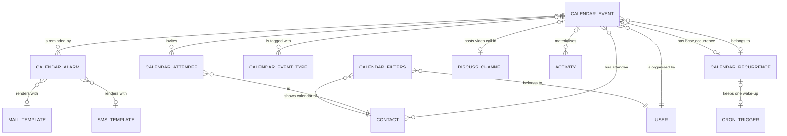

# Entities of Calendar and Scheduling

## 1. Reading this document

This document describes every entity the Calendar and Scheduling domain owns, field by field. For
each entity it gives the purpose, the lifecycle, the complete field table, the relations, the
uniqueness constraints, the ordering, the display-name rule, the archival behaviour, the company
behaviour and the extension points other capability packages contribute.

Each field table has these columns:

| Column | Meaning |
|---|---|
| Identifier | The stored field name, reproduced exactly because integrations depend on it. |
| Full name | The name in words, used in prose everywhere else in this repository. |
| Type | The value kind, written in words. |
| Target | For a reference field, the entity referred to. |
| Required | Whether the field must hold a value when the record is written. |
| Default | The value applied when the field is not supplied. |
| Computed | The derivation rule and the fields it depends on, and whether the derived value is stored. |
| Meaning | What the value means to the business. |

Two conventions apply throughout.

First, the two external calendar services this domain talks to are never named by brand in prose.
They are **the first external calendar service** (its stored selection value is `google`, and the
identifiers of the capability package that talks to it all begin with `google_`) and **the second
external calendar service** (its stored selection value is `microsoft`, and the identifiers of its
capability package all begin with `microsoft_`). The full names of the entities that carry those
identifiers are reproduced from the entity dictionary of this repository and therefore do contain
the service names.

Second, an entity described here as **behaviour only** has no table of its own. It contributes
fields and operations to the entities that adopt it.

Contents:

1. [Reading this document](#1-reading-this-document)
2. [Calendar Event](#2-calendar-event-calendarevent)
3. [Calendar Attendee Information](#3-calendar-attendee-information-calendarattendee)
4. [Event Recurrence Rule](#4-event-recurrence-rule-calendarrecurrence)
5. [Event Alarm](#5-event-alarm-calendaralarm)
6. [Event Meeting Type](#6-event-meeting-type-calendareventtype)
7. [Calendar Filters](#7-calendar-filters-calendarfilters)
8. [Event Alarm Manager](#8-event-alarm-manager-calendaralarm_manager)
9. [Calendar Popover Delete Wizard](#9-calendar-popover-delete-wizard-calendarpopoverdeletewizard)
10. [Calendar Provider Configuration Wizard](#10-calendar-provider-configuration-wizard-calendarproviderconfig)
11. [Synchronize a record with Google Calendar](#11-synchronize-a-record-with-google-calendar-googlecalendarsync)
12. [Google Calendar Account Reset](#12-google-calendar-account-reset-googlecalendaraccountreset)
13. [Synchronize a record with Microsoft Calendar](#13-synchronize-a-record-with-microsoft-calendar-microsoftcalendarsync)
14. [Microsoft Calendar Account Reset](#14-microsoft-calendar-account-reset-microsoftcalendaraccountreset)
15. [Fields this domain adds to entities owned elsewhere](#15-fields-this-domain-adds-to-entities-owned-elsewhere)
16. [Relationship diagram](#16-relationship-diagram)

---

# 2. Calendar Event (`calendar.event`)

Reference page: [`../../references/entities/calendar.event.md`](../../references/entities/calendar.event.md).

**Transport name** `calendar.event`. **Storage** table `calendar_event`. **Kind** persistent.
**Default ordering** by `start` descending. The entity carries the discussion-thread behaviour, so
it has followers, messages and tracked-field logging; see
[../messaging-and-activities/](../messaging-and-activities/).

## 2.1 Purpose

A Calendar Event is one appointment in time: a subject, a start instant, a stop instant, a set of
attendees drawn from the Contact register, an organiser, a visibility policy, a set of reminders and
optionally a link to the recurrence that generated it and to a business document it was scheduled
from. Every occurrence of a repeating meeting is a Calendar Event in its own right; the system does
not compute occurrences on the fly at read time. That single decision explains most of the
behaviour specified in [calculations.md](calculations.md) and
[workflows.md](workflows.md).

## 2.2 Lifecycle

1. **Creation.** A Calendar Event is created from the calendar screen, from the quick-creation
   panel, from a Contact's meeting button, from an Activity of the meeting category, or by the
   synchronisation of an external calendar service. Creation derives the attendee records from the
   attendee contacts, may attach an Activity to the linked document, may prepend the organiser and
   single-counterpart contact details to the description, and, when the record is marked recurrent,
   builds the whole recurrence immediately.
2. **Active life.** The record is edited, attendees respond, reminders fire, the record is
   synchronised outwards and inwards.
3. **Archival.** Setting `active` (the activity flag) to false hides the event and, in the two
   external services, removes it. Recurring events are archived in bulk by the mass-archive
   operation.
4. **Deletion.** A Calendar Event is deleted outright when no external identifier is attached to it.
   When one is attached, the first external calendar service archives it instead, so that the next
   synchronisation run still knows the remote copy must be removed.

## 2.3 Field table

| Identifier | Full name | Type | Target | Required | Default | Computed | Meaning |
|---|---|---|---|---|---|---|---|
| `name` | name | single line text | — | yes | none | — | The meeting subject. Its label is "Meeting Subject". |
| `description` | description | rich text | — | no | none | — | The description shared with the external calendar services in both directions. |
| `user_id` | user | reference | User | no | the acting user | — | The organiser. Indexed, skipping empty values. |
| `partner_id` | partner | reference | Contact | no | none | related to the organiser's contact, read only | The contact record of the organiser, shown as "Scheduled by". |
| `location` | location | single line text | — | no | none | — | The physical place. Changes are tracked in the discussion thread. |
| `notes` | notes | rich text | — | no | none | — | Internal notes. Unlike the description, never synchronised outwards. |
| `videocall_location` | videocall_location | single line text | — | no | none | computed from `videocall_source` and `access_token`, stored, writable, copied on duplication | The web address at which the meeting is joined. |
| `access_token` | access_token | single line text | — | no | none | stored, indexed, not copied on duplication | The unguessable token that identifies this event in the public video-call address. Generated as a thirty-two character hexadecimal value when a platform-hosted video call is requested. |
| `videocall_source` | videocall_source | selection | — | no | none | computed from `videocall_location`, not stored | Where the video call is hosted: `discuss` = the platform's own conversation channel; `custom` = an address typed by a person; the first external calendar service adds `google_meet` = its own conferencing product. Removing the added value falls back to `discuss`. |
| `videocall_channel_id` | videocall_channel | reference | Discussion Channel | no | none | — | The conversation channel created the first time somebody joins the platform-hosted video call. Indexed, skipping empty values. |
| `privacy` | privacy | selection | — | no | none | — | The visibility policy chosen on this event: `public` = "Public"; `private` = "Private"; `confidential` = "Only internal users". Empty means "follow the organiser's default". |
| `effective_privacy` | effective_privacy | selection | — | no | none | computed from `privacy` and `user_id`, not stored | The visibility actually applied: the event's own policy when set, otherwise the organiser's calendar default privacy. |
| `show_as` | show_as | selection | — | yes | `busy` | — | Whether the organiser and attendees count as occupied during the event: `free` = "Available"; `busy` = "Busy". |
| `is_highlighted` | is_highlighted | true or false | — | no | false | computed, not stored | True when the screen was opened from a Contact and that contact is an attendee of this event. Used to emphasise the event visually. |
| `is_organizer_alone` | is_organizer_alone | true or false | — | no | false | computed from `partner_id` and `attendee_ids`, not stored | True when the event has more than one attendee and every attendee other than the organiser has declined. |
| `active` | active | true or false | — | no | true | — | The activity flag. False hides the event from every ordinary search. Changes are tracked. |
| `categ_ids` | categorys | many-to-many set | Event Meeting Type | no | empty | — | Free tags. Association table `meeting_category_rel`, with columns `event_id` and `type_id`. |
| `start` | start | date and time | — | yes | the next half hour | indexed, tracked | The start instant, held in coordinated universal time for a timed event. For an all-day event the pair of dates below is authoritative and this field holds a conventional eight o'clock. |
| `stop` | stop | date and time | — | yes | start plus the default duration | computed from `start` and `duration`, stored, writable, tracked | The stop instant. For an all-day event it holds a conventional eighteen o'clock. |
| `display_time` | display_time | single line text | — | no | none | computed, not stored | The human sentence describing when the event happens, in the reader's time zone. |
| `allday` | allday | true or false | — | no | false | — | True when the event occupies whole days and carries no clock time. |
| `start_date` | start_date | date | — | no | none | computed from `allday`, `start` and `stop`, stored, with an inverse, tracked | The first day of an all-day event. Empty for a timed event. |
| `stop_date` | stop_date | date | — | no | none | computed from `allday`, `start` and `stop`, stored, with an inverse, tracked | The last day of an all-day event. Empty for a timed event. |
| `duration` | duration | decimal number | — | no | none | computed from `start` and `stop`, stored, writable | The length in hours, rounded to two decimals. |
| `res_id` | related_record_identifier | reference to a record of a named entity | — | no | none | — | The identifier of the business document the meeting was scheduled from. Its entity is named by `res_model`. |
| `res_model_id` | related_record_model_definition | reference | Model definition | no | none | deletes the event when the model definition is removed | The definition of the entity the meeting was scheduled from. |
| `res_model` | related_record_model | single line text | — | no | none | related to the transport name of `res_model_id`, stored, read only | The transport name of that entity. |
| `res_model_name` | related_record_model_name | single line text | — | no | none | related to the display name of `res_model_id`, not stored | The readable name of that entity, shown on the button that jumps to the document. |
| `activity_ids` | activities | one-to-many set | Activity | no | empty | — | The activities that point at this meeting through their meeting field. |
| `attendee_ids` | attendees | one-to-many set | Calendar Attendee Information | no | empty | — | One attendee record per invited contact, holding that contact's response. |
| `current_attendee` | current_attendee | reference | Calendar Attendee Information | no | none | computed from `attendee_ids` and their state, not stored, searchable | The attendee record of the reader, when the reader is invited. |
| `current_status` | current_status | selection | — | no | none | related to the state of `current_attendee`, writable | The reader's own response, exposed on the event so that it can be changed from the event screen. Its label is "Attending?". |
| `should_show_status` | should_show_status | true or false | — | no | false | computed from `attendee_ids`, not stored | True when the reader is an attendee and at least one other contact is also an attendee, so that a response control is worth showing. |
| `partner_ids` | partners | many-to-many set | Contact | no | the acting user's contact, plus the contact the screen was opened from | — | The invited contacts. Association table `calendar_event_res_partner_rel`, with columns `calendar_event_id` and `res_partner_id`. |
| `invalid_email_partner_ids` | invalid_email_partners | many-to-many set | Contact | no | empty | computed from `partner_ids`, not stored | The attendees whose electronic mail address is missing or malformed, so that the screen can warn about them. |
| `unavailable_partner_ids` | unavailable_partners | many-to-many set | Contact | no | empty | computed from `allday`, `partner_ids`, `start` and `stop`, not stored | The attendees who are occupied during the event, either by another busy event or, when the working-hours package is installed, by being outside their working schedule. |
| `alarm_ids` | alarms | many-to-many set | Event Alarm | no | empty | removal of a reminder still used by an event is refused | The reminders attached to the event. Association table `calendar_alarm_calendar_event_rel`. |
| `recurrency` | recurrency | true or false | — | no | false | — | True when the event belongs to, or is about to create, a repetition series. |
| `recurrence_id` | recurrence | reference | Event Recurrence Rule | no | none | indexed, skipping empty values | The repetition series this occurrence belongs to. |
| `follow_recurrence` | follow_recurrence | true or false | — | no | false | — | True when the occurrence still sits exactly where the rule puts it. False marks an occurrence that was moved or edited on its own, called an outlier. |
| `recurrence_update` | recurrence_update | selection | — | no | `self_only` | not stored, not copied | The scope a change is meant to have: `self_only` = "This event"; `future_events` = "This and following events"; `all_events` = "All events". It is supplied with the change and never kept. |
| `rrule` | rrule | single line text | — | no | none | computed from the recurrence and the repetition selector, writable, not stored | The repetition rule in the calendar-interchange text form, mirrored from the series. |
| `rrule_type_ui` | rrule_type_user_interface | selection | — | no | none | computed from `recurrence_id` and `recurrency`, writable, not stored | The simplified repetition choice offered on screen: `daily`, `weekly`, `monthly`, `yearly`, `custom`. `custom` is shown whenever the series repeats with an interval other than one. |
| `rrule_type` | rrule_type | selection | — | no | none | computed, writable, not stored | The repetition frequency mirrored from the series: `daily` = "Days"; `weekly` = "Weeks"; `monthly` = "Months"; `yearly` = "Years". |
| `event_tz` | event_time_zone | selection | — | no | none | computed, writable, not stored | The time zone the repetition rule is evaluated in, mirrored from the series. |
| `end_type` | end_type | selection | — | no | none | computed, writable, not stored | How the series ends, mirrored from the series: `count`, `end_date`, `forever`. |
| `interval` | interval | whole number | — | no | none | computed, writable, not stored | How many periods separate two occurrences, mirrored from the series. |
| `count` | count | whole number | — | no | none | computed, writable, not stored | How many occurrences the series has, mirrored from the series. |
| `mon` | mon | true or false | — | no | false | computed, writable, not stored | Repeat on Mondays, mirrored from the series. |
| `tue` | tue | true or false | — | no | false | computed, writable, not stored | Repeat on Tuesdays. |
| `wed` | wed | true or false | — | no | false | computed, writable, not stored | Repeat on Wednesdays. |
| `thu` | thu | true or false | — | no | false | computed, writable, not stored | Repeat on Thursdays. |
| `fri` | fri | true or false | — | no | false | computed, writable, not stored | Repeat on Fridays. |
| `sat` | sat | true or false | — | no | false | computed, writable, not stored | Repeat on Saturdays. |
| `sun` | sun | true or false | — | no | false | computed, writable, not stored | Repeat on Sundays. |
| `month_by` | month_by | selection | — | no | none | computed, writable, not stored | For a monthly series, whether the day is picked by number or by weekday position: `date` = "Date of month"; `day` = "Day of month". |
| `day` | day | whole number | — | no | none | computed, writable, not stored | The day number of a monthly series counted by number. |
| `weekday` | weekday | selection | — | no | none | computed, writable, not stored | The weekday of a monthly series counted by position: `MON`, `TUE`, `WED`, `THU`, `FRI`, `SAT`, `SUN`. |
| `byday` | byday | selection | — | no | none | computed, writable, not stored | The position of that weekday inside the month: `1` = "First"; `2` = "Second"; `3` = "Third"; `4` = "Fourth"; `-1` = "Last". |
| `until` | until | date | — | no | none | computed, writable, not stored | The last day on which the series may place an occurrence. |
| `display_description` | display_description | true or false | — | no | false | computed from `description`, not stored | True when the description holds anything other than empty markup. |
| `attendees_count` | attendees_count | whole number | — | no | 0 | computed, not stored | How many contacts are invited. |
| `accepted_count` | accepted_count | whole number | — | no | 0 | computed, not stored | How many attendees accepted. |
| `declined_count` | declined_count | whole number | — | no | 0 | computed, not stored | How many attendees declined. |
| `tentative_count` | tentative_count | whole number | — | no | 0 | computed, not stored | How many attendees answered "Maybe". |
| `awaiting_count` | awaiting_count | whole number | — | no | 0 | computed, not stored | How many invited contacts have not answered. |
| `user_can_edit` | user_can_edit | true or false | — | no | false | computed from `partner_ids`, depends on the reader, not stored | True when the reader may change the event. |

### 2.3.1 Fields contributed by other capability packages

| Identifier | Full name | Package | Type | Target | Default | Meaning |
|---|---|---|---|---|---|---|
| `google_id` | google | first external calendar service | single line text | — | none | The identifier of the matching event in the first external calendar service. Computed from the series identifier, stored, writable, not copied on duplication, indexed skipping empty values. |
| `need_sync` | need_sync | first external calendar service | true or false | — | true | True when the record still has to be pushed to the first external calendar service. Not copied on duplication. |
| `guests_readonly` | guests_readonly | first external calendar service | true or false | — | false | True when the remote copy forbids attendees to change the event, so the platform must refuse such a change too. |
| `videocall_source` (added value) | videocall_source | first external calendar service | selection value | — | — | Adds `google_meet` to the hosting choices. |
| `microsoft_id` | microsoft | second external calendar service | single line text | — | none | The organiser-scoped identifier of the matching event in the second external calendar service. Indexed, not copied. |
| `ms_universal_event_id` | ms_universal_event | second external calendar service | single line text | — | none | The identifier of that event that is the same in every calendar of that service. Indexed, not copied. |
| `need_sync_m` | need_sync_m | second external calendar service | true or false | — | true | True when the record still has to be pushed to the second external calendar service. Not copied. |
| `microsoft_recurrence_master_id` | microsoft_recurrence_master | second external calendar service | single line text | — | none | The identifier of the series head in the second external calendar service, carried on every occurrence. |
| `opportunity_id` | opportunity | customer relationship management | reference | Lead or Opportunity | none | The opportunity the meeting belongs to; see [../customer-relationship-management/](../customer-relationship-management/). |
| `applicant_id` | applicant | recruitment | reference | Applicant | none | The applicant the interview belongs to; see [../recruitment/](../recruitment/). |

## 2.4 Relations

- One Calendar Event has many Calendar Attendee Information records, one per invited contact,
  removed with the event.
- One Calendar Event may belong to one Event Recurrence Rule; one Event Recurrence Rule has many
  Calendar Events.
- One Calendar Event may be the base occurrence of one Event Recurrence Rule, through the series'
  own base reference.
- Many Calendar Events share many Event Alarms.
- Many Calendar Events share many Event Meeting Types.
- Many Calendar Events share many Contacts as attendees.
- One Calendar Event may own one Discussion Channel for its video call.
- One Calendar Event may be pointed at by many Activities.

## 2.5 Uniqueness, ordering and display name

There is no uniqueness constraint on Calendar Event. Records are ordered by start instant,
descending, so the most recent meeting comes first.

The display name is the subject, except that a reader who may not see a private event reads the
single word "Busy" instead. The rule is stated in
[business-rules.md, chapter 4](business-rules.md#4-visibility-and-privacy).

## 2.6 Archival

The activity flag hides the event. Archiving is used rather than deletion in three situations:
when the first external calendar service holds a copy that has still to be withdrawn; when a
recurrence is trimmed and the detached occurrences must be kept out of the way; and when a whole
series is withdrawn through the mass-archive operation.

Archiving a series head causes the series to pick a new base occurrence. Archiving the last
occurrence of a series deletes the series.

## 2.7 Company behaviour

Calendar Event carries no company field. A meeting is therefore visible across companies, subject to
the privacy rules. The working-hours computation is company aware in a different way: it reads the
working schedules of the companies the reader has selected, and falls back to the current company's
working schedule for an attendee who has no schedule of their own.

## 2.8 Extension points

| Extension point | Contributed by | Effect |
|---|---|---|
| Additional reminder kinds | text-message reminders | Adds the `sms` reminder kind and makes the reminder scheduler consider it. |
| Additional hosting choice for the video call | first external calendar service | Adds `google_meet`. |
| Outward and inward synchronisation | both external calendar services | Adds the identifier and pending-synchronisation fields, and wraps creation, writing, deletion and archiving. |
| Working-hours awareness | working-hours package | Extends the unavailable-attendee computation with the attendees' working schedules and adds the unusual-day query used to shade the calendar. |
| Opportunity link | customer relationship management | Adds the opportunity reference and defaults the linked document when the meeting is created from an opportunity. |
| Applicant link | recruitment | Adds the applicant reference. |
| Absence meetings | time off | Suppresses the automatic video call for absence-driven meetings. |

---

# 3. Calendar Attendee Information (`calendar.attendee`)

Reference page: [`../../references/entities/calendar.attendee.md`](../../references/entities/calendar.attendee.md).

**Transport name** `calendar.attendee`. **Storage** table `calendar_attendee`. **Kind** persistent.
**Default ordering** by creation instant ascending. **Record label** the common name.

## 3.1 Purpose

One Calendar Attendee Information record is the invitation of one contact to one event. It carries
the response, the token that lets that contact answer without signing in, and the time zone used
when the invitation is rendered.

## 3.2 Lifecycle

An attendee record is created whenever a contact is added to the attendee set of an event, either
directly or by an inward synchronisation that carries a response. It is removed when the contact is
removed from that set, when the event is deleted, or when the contact record is deleted. It is never
duplicated: duplication is refused outright.

## 3.3 Field table

| Identifier | Full name | Type | Target | Required | Default | Computed | Meaning |
|---|---|---|---|---|---|---|---|
| `event_id` | event | reference | Calendar Event | yes | none | indexed; removed with the event | The meeting this invitation belongs to. Its label is "Meeting linked". |
| `recurrence_id` | recurrence | reference | Event Recurrence Rule | no | none | related to the event's series, not stored | The series the meeting belongs to, exposed so that a whole series can be answered at once. |
| `partner_id` | partner | reference | Contact | yes | none | read only; removed with the contact | The invited contact. |
| `email` | email | single line text | — | no | none | related to the contact's electronic mail address, not stored | The address the invitation is sent to. |
| `phone` | phone | single line text | — | no | none | related to the contact's telephone number, not stored | The number a text-message reminder is sent to. |
| `common_name` | common_name | single line text | — | no | none | computed from the contact, the contact's name and the address, stored | The contact's name, or the address when the contact has no name. Used as the record label. |
| `access_token` | access_token | single line text | — | no | a freshly generated thirty-two character hexadecimal value | — | The token that authorises answering the invitation from a link in the message, without signing in. |
| `mail_tz` | mail_time_zone | selection | — | no | none | computed from the contact's time zone, not stored | The time zone in which the invitation renders the times. |
| `state` | state | selection | — | no | `needsAction` | — | The response. `accepted` = "Yes"; `declined` = "No"; `tentative` = "Maybe"; `needsAction` = "Needs Action". Its label is "Status". |
| `availability` | availability | selection | — | no | none | read only | Whether the attendee is free at that time: `free` = "Available"; `busy` = "Busy". Set by callers that compute availability; not maintained by this entity itself. |

## 3.4 Relations

- Many Calendar Attendee Information records belong to one Calendar Event.
- Each record points at exactly one Contact.
- Through the event, each record reaches at most one Event Recurrence Rule.

## 3.5 Uniqueness, ordering and display name

There is no database uniqueness constraint. The set of attendee records is nevertheless kept in step
with the attendee contact set: adding a contact that is already an attendee creates no second
record, and removing a contact deletes its record. Records are ordered by creation instant
ascending, so the organiser, added first, comes first. The display name is the common name.

## 3.6 Archival

Calendar Attendee Information has no activity flag. Attendee records of an archived event stay in
place and reappear when the event is unarchived.

## 3.7 Extension points

| Extension point | Contributed by | Effect |
|---|---|---|
| Response propagation | first external calendar service | After a response, pushes the whole event outwards, using the organiser's connection when the organiser is not the reader. |
| Response propagation | second external calendar service | After a response, calls the service's dedicated answer operation with `accept`, `tentativelyAccept` or `decline`, but only for a reader who is an attendee and not the organiser. |
| Alternative invitation template | appointment scheduling | Replaces the template used to send the invitation. |

---

# 4. Event Recurrence Rule (`calendar.recurrence`)

Reference page: [`../../references/entities/calendar.recurrence.md`](../../references/entities/calendar.recurrence.md).

**Transport name** `calendar.recurrence`. **Storage** table `calendar_recurrence`. **Kind**
persistent.

## 4.1 Purpose

An Event Recurrence Rule is the repetition pattern of a series of meetings, together with the list
of Calendar Events that make up the series and a pointer to the occurrence that acts as the pattern
for the others. It also owns the scheduled trigger that wakes the reminder job for the series.

## 4.2 Lifecycle

1. **Creation.** A series is created the first time repetition values are applied to an event that
   has none, and again whenever a series is split so that a later part carries different values.
2. **Application.** Applying the series generates the missing occurrences from its pattern and
   detaches the occurrences the pattern no longer produces.
3. **Trimming.** Stopping a series at an occurrence detaches that occurrence and every later one and
   rewrites the pattern to end on the day before the start of the period that contains it.
4. **Deletion.** A series is deleted when its last occurrence leaves it, when the repetition is
   broken with the scope "All events", or when a whole series is deleted.

## 4.3 Field table

| Identifier | Full name | Type | Target | Required | Default | Computed | Meaning |
|---|---|---|---|---|---|---|---|
| `name` | name | single line text | — | no | none | computed from `rrule`, stored | The sentence that describes the pattern, for example "Every 2 Weeks on Tuesday, Wednesday for 3 events". |
| `base_event_id` | base_event | reference | Calendar Event | no | none | set to empty when that event is removed; not copied | The occurrence whose values are copied when the series generates the others. |
| `calendar_event_ids` | calendar_events | one-to-many set | Calendar Event | no | empty | — | The occurrences of the series. |
| `event_tz` | event_time_zone | selection | — | no | the reader's time zone | — | The time zone in which the pattern is evaluated, so that a nine o'clock meeting stays at nine o'clock across a daylight-saving change. |
| `rrule` | rrule | single line text | — | no | none | computed from every pattern field, stored, with an inverse that parses it back | The pattern in the calendar-interchange text form. |
| `dtstart` | dtstart | date and time | — | no | none | computed as the earliest start among the occurrences, not stored | The instant the series starts. |
| `rrule_type` | rrule_type | selection | — | no | `weekly` | — | The frequency: `daily` = "Days"; `weekly` = "Weeks"; `monthly` = "Months"; `yearly` = "Years". |
| `end_type` | end_type | selection | — | no | `count` | — | How the series ends: `count` = "Number of repetitions"; `end_date` = "End date"; `forever` = "Forever". |
| `interval` | interval | whole number | — | no | 1 | — | How many periods separate two occurrences. |
| `count` | count | whole number | — | no | 1 | — | How many occurrences the series has when it ends by count. |
| `mon` | mon | true or false | — | no | false | — | Repeat on Mondays. |
| `tue` | tue | true or false | — | no | false | — | Repeat on Tuesdays. |
| `wed` | wed | true or false | — | no | false | — | Repeat on Wednesdays. |
| `thu` | thu | true or false | — | no | false | — | Repeat on Thursdays. |
| `fri` | fri | true or false | — | no | false | — | Repeat on Fridays. |
| `sat` | sat | true or false | — | no | false | — | Repeat on Saturdays. |
| `sun` | sun | true or false | — | no | false | — | Repeat on Sundays. |
| `month_by` | month_by | selection | — | no | `date` | — | For a monthly series: `date` = "Date of month"; `day` = "Day of month". |
| `day` | day | whole number | — | no | 1 | — | The day number for a monthly series counted by number. |
| `weekday` | weekday | selection | — | no | none | — | The weekday for a monthly series counted by position: `MON` = "Monday"; `TUE` = "Tuesday"; `WED` = "Wednesday"; `THU` = "Thursday"; `FRI` = "Friday"; `SAT` = "Saturday"; `SUN` = "Sunday". |
| `byday` | byday | selection | — | no | none | — | The position inside the month: `1` = "First"; `2` = "Second"; `3` = "Third"; `4` = "Fourth"; `-1` = "Last". |
| `until` | until | date | — | no | none | — | The last day on which the series may place an occurrence. Its label is "Repeat Until". |
| `trigger_id` | trigger | reference | Triggered action | no | none | — | The one scheduled trigger the series keeps alive so that the reminder job wakes for the next occurrence only. |

### 4.3.1 Fields contributed by other capability packages

| Identifier | Full name | Package | Type | Default | Meaning |
|---|---|---|---|---|---|
| `google_id` | google | first external calendar service | single line text | none | The identifier of the series in that service. Indexed, skipping empty values; not copied. |
| `need_sync` | need_sync | first external calendar service | true or false | true | True when the series must still be pushed outwards. |
| `microsoft_id` | microsoft | second external calendar service | single line text | none | The organiser-scoped identifier of the series head in that service. |
| `ms_universal_event_id` | ms_universal_event | second external calendar service | single line text | none | The identifier of that series head that is the same in every calendar of the service. |
| `need_sync_m` | need_sync_m | second external calendar service | true or false | **false** | True when the series must still be pushed to the second service. Unlike every other adopter of that behaviour, the series defaults it to false, because a series is only pushed when it is applied. |

## 4.4 Constraints

| Name | Condition | Message |
|---|---|---|
| `_month_day` | Either the frequency is not monthly, or the monthly mode is not by weekday position, or the day number is between 1 and 31 inclusive, or the weekday is one of the seven weekday values and the position is one of the five position values. | "The day must be between 1 and 31" |

## 4.5 Relations, ordering and display name

- One Event Recurrence Rule has many Calendar Events, and points at one of them as its base.
- One Event Recurrence Rule owns at most one Triggered action.

The entity has no explicit ordering, so records come back in insertion order. The display name is
the computed pattern sentence.

## 4.6 Archival and company behaviour

Event Recurrence Rule has no activity flag of its own; the two synchronisation behaviours add one
when they are installed, which is what allows a series to be archived rather than deleted while a
remote copy still exists. The entity carries no company field.

## 4.7 Extension points

| Extension point | Contributed by | Effect |
|---|---|---|
| Series identity in the first service | first external calendar service | Builds each occurrence's remote identifier from the series identifier and the occurrence's start instant, and deletes the single-event copy when an already-synchronised event becomes a series. |
| Series identity in the second service | second external calendar service | Maps the pattern to and from that service's pattern-and-range structure, and refuses to change a synchronised series from the platform. |

---

# 5. Event Alarm (`calendar.alarm`)

Reference page: [`../../references/entities/calendar.alarm.md`](../../references/entities/calendar.alarm.md).

**Transport name** `calendar.alarm`. **Storage** table `calendar_alarm`. **Kind** persistent.

## 5.1 Purpose

An Event Alarm is a reusable reminder definition: how long before the start, in what unit, delivered
by which channel, rendered from which template. Events point at reminders; reminders hold no
reference back to events.

## 5.2 Lifecycle

Reminders are shipped as seven default records and can be created freely. A reminder that is still
attached to at least one event cannot be deleted; the association refuses the removal.

## 5.3 Field table

| Identifier | Full name | Type | Target | Required | Default | Computed | Meaning |
|---|---|---|---|---|---|---|---|
| `name` | name | single line text | — | yes | none | translatable | The label shown in the reminder list, for example "Notification - 15 Minutes". |
| `alarm_type` | alarm_type | selection | — | yes | `email` | — | The delivery channel: `notification` = "Notification"; `email` = "Email". The text-message package adds `sms` = "SMS Text Message"; removing that package resets affected reminders to the default channel. |
| `duration` | duration | whole number | — | yes | 1 | — | How many units before the start the reminder fires. Its label is "Remind Before". |
| `interval` | interval | selection | — | yes | `hours` | — | The unit: `minutes` = "Minutes"; `hours` = "Hours"; `days` = "Days". |
| `duration_minutes` | duration_minutes | whole number | — | no | 0 | computed from `duration` and `interval`, stored, searchable | The lead time expressed in minutes, which is the value every comparison uses. |
| `mail_template_id` | mail_template | reference | Email Template | no | none | computed from `alarm_type` and itself, stored, writable | The template used to render an electronic-mail reminder. Restricted to templates whose entity is Calendar Attendee Information. |
| `body` | body | long text | — | no | none | — | An extra sentence appended to an in-application notification. Its label is "Additional Message". |
| `notify_responsible` | notify_responsible | true or false | — | no | false | — | For a text-message reminder, whether the organiser is also messaged. Forced back to false for the other two channels. |
| `sms_template_id` | text_message_template | reference | Text message template | no | none | computed from `alarm_type` and itself, stored, writable | The template used to render a text-message reminder. Restricted to templates whose entity is Calendar Event. Contributed by the text-message package. |

## 5.4 Derivations

- The lead time in minutes is `duration` for minutes, `duration × 60` for hours and
  `duration × 60 × 24` for days; anything else yields zero. Searching on the lead time is rewritten
  into a search on the pair of stored fields, so that a search for "less than ninety minutes" also
  matches a reminder of one hour.
- Choosing the electronic-mail channel with no template attaches the shipped reminder template.
  Choosing any other channel, or clearing the template, empties it.
- Choosing the text-message channel with no template attaches the shipped text-message reminder
  template; any other channel empties it.
- Whenever the duration, the unit, the channel or the organiser flag changes on screen, the name is
  rewritten as the channel label, a space-hyphen-space, the duration, a space and the unit label,
  and, when the organiser flag is on, a further space-hyphen-space and the words "Notify
  Responsible".

## 5.5 Relations, ordering, display name, archival and company behaviour

Many Event Alarms are shared by many Calendar Events. There is no ordering clause and no uniqueness
constraint; the display name is the name; there is no activity flag and no company field.

---

# 6. Event Meeting Type (`calendar.event.type`)

Reference page: [`../../references/entities/calendar.event.type.md`](../../references/entities/calendar.event.type.md).

**Transport name** `calendar.event.type`. **Storage** table `calendar_event_type`. **Kind**
persistent.

## 6.1 Purpose

A free tag that classifies meetings and gives them a colour in the calendar.

## 6.2 Field table

| Identifier | Full name | Type | Required | Default | Meaning |
|---|---|---|---|---|---|
| `name` | name | single line text | yes | none | The tag. |
| `color` | color_index | whole number | no | a whole number drawn at random between 1 and 11 inclusive | The colour index used to paint the tag. |

## 6.3 Constraints

| Name | Condition | Message |
|---|---|---|
| `_name_uniq` | The tag is unique across all tags. | "Tag name already exists!" |

## 6.4 Relations, ordering, display name, archival and company behaviour

Many Event Meeting Types are shared by many Calendar Events through the association table
`meeting_category_rel`. There is no ordering clause; the display name is the name; there is no
activity flag and no company field.

---

# 7. Calendar Filters (`calendar.filters`)

Reference page: [`../../references/entities/calendar.filters.md`](../../references/entities/calendar.filters.md).

**Transport name** `calendar.filters`. **Storage** table `calendar_filters`. **Kind** persistent.

## 7.1 Purpose

One row remembers that one user has one colleague's calendar in their side list, and whether that
colleague's box is ticked. The calendar screen writes these rows directly as the reader ticks and
unticks people.

## 7.2 Field table

| Identifier | Full name | Type | Target | Required | Default | Meaning |
|---|---|---|---|---|---|---|
| `user_id` | user | reference | User | yes | the acting user | The owner of the side list. Indexed; the row is removed with the user. Its label is "Me". |
| `partner_id` | partner | reference | Contact | yes | none | The colleague whose calendar is listed. Indexed. Its label is "Employee". |
| `active` | active | true or false | no | true | The activity flag; a hidden row is not offered in the side list. |
| `partner_checked` | partner_checked | true or false | no | true | Whether the colleague's box is ticked, so that their events are overlaid. Its label is "Checked". |

## 7.3 Constraints

| Name | Condition | Message |
|---|---|---|
| `_user_id_partner_id_unique` | The pair of user and contact is unique. | "A user cannot have the same contact twice." |

## 7.4 Operations, ordering, display name and company behaviour

The entity offers one named operation, which deletes every row that points at a given contact; it is
used when a contact is removed. There is no ordering clause; the display name falls back to the
contact reference; there is no company field.

---

# 8. Event Alarm Manager (`calendar.alarm_manager`)

Reference page: [`../../references/entities/calendar.alarm_manager.md`](../../references/entities/calendar.alarm_manager.md).

**Transport name** `calendar.alarm_manager`. **Kind** behaviour only; no table, no fields.

## 8.1 Purpose

The Event Alarm Manager is the reminder engine. It answers three questions and performs one job:

1. Which events of a given reader carry an in-application reminder that is due, or will become due,
   in the next twenty-four hours?
2. Which events carry a reminder of a given channel whose firing instant falls between the previous
   run of the reminder job and now?
3. What payload must be pushed over the notification bus so that the reader's screen can count down
   to the next reminder?

and, as the job itself, sends the electronic-mail reminders and, when the text-message package is
installed, the text-message reminders.

## 8.2 Operations

| Operation | Purpose |
|---|---|
| Next potential limiting reminder | For a channel, optionally a horizon in seconds and optionally a set of contacts, returns for every candidate event the earliest and latest reminder instants, the event bounds and the smallest and largest lead times. Only events the reader may read are kept. |
| Check one date | For one occurrence date, one event, one channel and a horizon, returns one entry per matching reminder with the instant at which it must fire, skipping reminders already acknowledged. |
| Events by reminder to notify | For a channel, returns the events whose start minus the reminder lead time falls at or after the previous run of the reminder job and strictly before now, keyed by reminder. Reminders created after the previous run whose instant already passed are skipped by design, because those attendees have just been invited anyway. |
| Extra conditions | A hook the two synchronisation packages use to exclude, from the electronic-mail reminder query, events that already carry an external identifier, so that the external service sends the reminder instead. |
| Send reminders | The scheduled job. See [workflows.md, chapter 10](workflows.md#10-reminders-scheduling-and-sending). |
| Next notification | The payload the polling route returns to a signed-in reader. |
| Build one notification | Turns one due in-application reminder into the payload described in [interfaces.md, chapter 11](interfaces.md#11-the-notification-bus-contract). |
| Notify next reminder | Pushes that payload over the notification bus to every non-shared user among a set of contacts. |

---

# 9. Calendar Popover Delete Wizard (`calendar.popover.delete.wizard`)

Reference page: [`../../references/entities/calendar.popover.delete.wizard.md`](../../references/entities/calendar.popover.delete.wizard.md).

**Transport name** `calendar.popover.delete.wizard`. **Kind** transient. It carries the
message-composition behaviour, so it also has a template reference, a subject and a body inherited
from that behaviour.

## 9.1 Purpose

Two screens are built on this one transient record. The first asks how much of a series to delete.
The second confirms the deletion and offers to send a cancellation message to the attendees first.

## 9.2 Field table

| Identifier | Full name | Type | Target | Required | Default | Computed | Meaning |
|---|---|---|---|---|---|---|---|
| `calendar_event_id` | calendar_event | reference | Calendar Event | no | none | — | The occurrence the reader asked to delete. |
| `delete` | delete | selection | — | no | `one` | — | The scope: `one` = "Delete this event"; `next` = "Delete this and following events"; `all` = "Delete all the events". |
| `recipient_ids` | recipients | many-to-many set | Contact | no | empty | computed from the event, writable | The organiser's contact together with every attendee's contact. |
| `subject` | subject | single line text | — | no | none | computed from the template rendered against the event, writable | The subject of the cancellation message. Inherited from the composition behaviour. |
| `body` | body | rich text | — | no | none | computed from the template rendered against the event, writable | The body of the cancellation message. Inherited from the composition behaviour. |

## 9.3 Operations

| Operation | Effect |
|---|---|
| `close` | The first screen's confirmation. When the event has exactly one attendee and that attendee is the organiser's own contact, deletes according to the scope directly. Otherwise hands over to the event's deletion action so that the second screen can offer to notify the attendees. |
| `action_delete` | Deletes according to the scope carried in the screen context, then redirects to `/app/calendar`. |
| `action_send_mail_and_delete` | Sends the shipped deletion template to the event with the light notification layout, immediately, and then performs `action_delete`. |

---

# 10. Calendar Provider Configuration Wizard (`calendar.provider.config`)

Reference page: [`../../references/entities/calendar.provider.config.md`](../../references/entities/calendar.provider.config.md).

**Transport name** `calendar.provider.config`. **Kind** transient.

## 10.1 Purpose

A one-screen setup panel that lets an administrator install and configure one of the two external
calendar services without opening the general settings screen. Its default values are read straight
from the system parameters, so the screen always shows what is currently stored.

## 10.2 Field table

| Identifier | Full name | Type | Required | Default | Meaning |
|---|---|---|---|---|---|
| `external_calendar_provider` | external_calendar_provider | selection | no | `google` | Which service to configure: `google` = the first external calendar service; `microsoft` = the second. Its label is "Choose an external calendar to configure". |
| `cal_client_id` | cal_client | single line text | no | the stored value of the parameter `google_calendar_client_id` | The application registration identifier of the first service. |
| `cal_client_secret` | cal_client_secret | single line text | no | the stored value of the parameter `google_calendar_client_secret` | Its secret. Masked on screen. |
| `cal_sync_paused` | cal_sync_paused | true or false | no | the stored value of the parameter `google_calendar_sync_paused`, read as false when absent | Whether synchronisation with the first service is suspended. |
| `microsoft_outlook_client_identifier` | microsoft_outlook_client_identifier | single line text | no | the stored value of the parameter `microsoft_calendar_client_id` | The application registration identifier of the second service. |
| `microsoft_outlook_client_secret` | microsoft_outlook_client_secret | single line text | no | the stored value of the parameter `microsoft_calendar_client_secret` | Its secret. Masked on screen. |
| `microsoft_outlook_sync_paused` | microsoft_outlook_sync_paused | true or false | no | the stored value of the parameter `microsoft_calendar_sync_paused`, read as false when absent | Whether synchronisation with the second service is suspended. |

## 10.3 Operation

`action_calendar_prepare_external_provider_sync` is restricted to administrators and is logged as an
administrative action. It looks up the capability package whose technical name is the chosen
service's stored value followed by `_calendar`; installs it immediately when it is not installed;
and then writes the three parameters that belong to the chosen service. The three parameters of the
other service are left untouched.

---

# 11. Synchronize a record with Google Calendar (`google.calendar.sync`)

Reference page: [`../../references/entities/google.calendar.sync.md`](../../references/entities/google.calendar.sync.md).

**Transport name** `google.calendar.sync`. **Kind** behaviour only; no table of its own. Calendar
Event and Event Recurrence Rule both adopt it.

## 11.1 Purpose

The behaviour gives an entity everything it needs to keep itself in step with the first external
calendar service: the remote identifier, the pending-synchronisation flag, an activity flag, and the
create, write, delete and archive wrapping that queues the outward calls.

## 11.2 Field table

| Identifier | Full name | Type | Required | Default | Meaning |
|---|---|---|---|---|---|
| `google_id` | google | single line text | no | none | The remote identifier. Indexed, skipping empty values; not copied on duplication. |
| `need_sync` | need_sync | true or false | no | true | True while the record still has to be pushed outwards. Not copied on duplication. |
| `active` | active | true or false | no | true | The activity flag, so that a record with a remote copy can be archived rather than deleted. |

## 11.3 Behaviour contributed to the adopting entity

| Moment | Behaviour |
|---|---|
| Writing | When the change touches at least one synchronised field and the pending flag is not being written explicitly and the reader has not stopped synchronisation, the pending flag is raised. After the write, and unless synchronisation is suspended, every record that is pending and already has a remote identifier is patched outwards with a three-second request budget, under the organiser's connection when the organiser has one. |
| Creating | Records whose organiser has stopped synchronisation are created with the pending flag already lowered. After creation, an all-day recurring first occurrence is protected from being pushed as a single event. Then, unless synchronisation is suspended, every pending active record is inserted outwards with a three-second request budget. |
| Deleting | A record that carries a remote identifier is not deleted. When the caller asked for archiving on error, the activity flag is lowered instead; otherwise the record is archived, which is what causes the remote copy to be removed at the next run. |
| Cancelling | Clears the remote identifier and then deletes the record, so that no outward deletion is attempted. |
| Selecting records to push | Records matching the entity's own outward scope. Outside a full run, the scope is narrowed to records that have no remote identifier and are active, or that are pending. At most two hundred records are taken in one transaction. |

## 11.4 Operations the adopting entity must supply

Values to write from a remote event; values to send outwards; the outward scope; the set of fields
whose change marks the record pending; how to restart synchronisation for a user; which user's
connection to use; and whether insertion must be blocked because the organiser is somebody else.
Both adopters supply all seven; the details are in
[external-calendar-synchronisation.md](external-calendar-synchronisation.md).

---

# 12. Google Calendar Account Reset (`google.calendar.account.reset`)

Reference page: [`../../references/entities/google.calendar.account.reset.md`](../../references/entities/google.calendar.account.reset.md).

**Transport name** `google.calendar.account.reset`. **Kind** transient.

## 12.1 Purpose

Disconnects one user from the first external calendar service and decides what happens to the events
that user owns and how the next connection behaves.

## 12.2 Field table

| Identifier | Full name | Type | Target | Required | Default | Meaning |
|---|---|---|---|---|---|---|
| `user_id` | user | reference | User | yes | the user whose form the panel was opened from | The account being reset. |
| `delete_policy` | delete_policy | selection | — | yes | `dont_delete` | What to do with the user's existing events: `dont_delete` = "Leave them untouched"; `delete_google` = "Delete from the current Google Calendar account"; `delete_odoo` = "Delete from Odoo"; `delete_both` = "Delete from both". Its label is "User's Existing Events" and its help text reads "This will only affect events for which the user is the owner". |
| `sync_policy` | sync_policy | selection | — | yes | `new` | What the next run does: `new` = "Synchronize only new events"; `all` = "Synchronize all existing events". Its label is "Next Synchronization". |

## 12.3 Operation

`reset_account` is specified step by step in
[workflows.md, chapter 19](workflows.md#19-reset-an-account).

---

# 13. Synchronize a record with Microsoft Calendar (`microsoft.calendar.sync`)

Reference page: [`../../references/entities/microsoft.calendar.sync.md`](../../references/entities/microsoft.calendar.sync.md).

**Transport name** `microsoft.calendar.sync`. **Kind** behaviour only; no table of its own. Calendar
Event and Event Recurrence Rule both adopt it.

## 13.1 Purpose

The same service as chapter 11, for the second external calendar service, with two structural
differences: that service gives an event two identifiers rather than one, and it refuses most
changes to a series made from outside its own screens.

## 13.2 Field table

| Identifier | Full name | Type | Required | Default | Meaning |
|---|---|---|---|---|---|
| `microsoft_id` | microsoft | single line text | no | none | The identifier of the event inside one particular calendar of the service. Different for the organiser and for each attendee. Indexed; not copied. Its label is "Organizer event Id". |
| `ms_universal_event_id` | ms_universal_event | single line text | no | none | The identifier that is the same in every calendar of the service. Indexed; not copied. Its label is "Universal event Id". |
| `need_sync_m` | need_sync_m | true or false | no | true, except on Event Recurrence Rule where it is false | True while the record still has to be pushed outwards. Not copied. |
| `active` | active | true or false | no | true | The activity flag. |

## 13.3 Behaviour contributed to the adopting entity

| Moment | Behaviour |
|---|---|
| Writing | When the change touches at least one synchronised field, the pending flag is not written explicitly and the reader's synchronisation is active, the pending flag is raised. After the write, and unless synchronisation is suspended, each pending record that already has an identifier is either deleted outwards, when the change lowered the activity flag, or patched outwards. The request budget is read from a parameter and defaults to five seconds. |
| Creating | When the reader has stopped synchronisation, records are created with the pending flag lowered. After creation, and unless synchronisation is suspended, every pending active record is inserted outwards. |
| Deleting | Every record that already carries the universal identifier is deleted outwards first, then removed locally. |
| Cancelling | Clears both identifiers and deletes the record. |
| Selecting records to push | The entity's own outward scope, narrowed by the shared extension: in a full run, only records with no universal identifier; otherwise records with no universal identifier that are active, or records that are pending. When the reader has a last-synchronisation instant, only records written at or after that instant less five minutes are considered. |

---

# 14. Microsoft Calendar Account Reset (`microsoft.calendar.account.reset`)

Reference page: [`../../references/entities/microsoft.calendar.account.reset.md`](../../references/entities/microsoft.calendar.account.reset.md).

**Transport name** `microsoft.calendar.account.reset`. **Kind** transient.

## 14.1 Purpose

The counterpart of chapter 12 for the second external calendar service.

## 14.2 Field table

| Identifier | Full name | Type | Target | Required | Default | Meaning |
|---|---|---|---|---|---|---|
| `user_id` | user | reference | User | yes | the user whose form the panel was opened from | The account being reset. |
| `delete_policy` | delete_policy | selection | — | yes | `dont_delete` | `dont_delete` = "Leave them untouched"; `delete_microsoft` = "Delete from the current Microsoft Calendar account"; `delete_odoo` = "Delete from Odoo"; `delete_both` = "Delete from both". Its label is "User's Existing Events" and its help text reads "This will only affect events for which the user is the owner". |
| `sync_policy` | sync_policy | selection | — | yes | `new` | `new` = "Synchronize only new events"; `all` = "Synchronize all existing events". |

## 14.3 Operation

`reset_account` is specified step by step in
[workflows.md, chapter 19](workflows.md#19-reset-an-account).

---

# 15. Fields this domain adds to entities owned elsewhere

The entities below belong to other domains. This chapter lists only what Calendar and Scheduling
contributes to them; everything else about them is specified in the owning folder.

## 15.1 Contact (`res.partner`) — owned by [../contacts-and-organizations/](../contacts-and-organizations/)

| Identifier | Full name | Type | Target | Default | Meaning |
|---|---|---|---|---|---|
| `meeting_count` | meeting_count | whole number | — | 0 | How many meetings this contact and its children attend. Computed, not stored. Its label is "# Meetings". |
| `meeting_ids` | meetings | many-to-many set | Calendar Event | empty | The meetings this contact attends, through the same association table as the attendee set. Not copied. |
| `calendar_last_notif_ack` | calendar_last_notif_ack | date and time | — | the current instant | The instant at which this contact last acknowledged the in-application reminders, so that the same reminder is not shown twice. Its label is "Last notification marked as read from base Calendar". |

Operations added: the meeting counter and the meeting map; a statistics tile on the contact screen
showing the meeting count with a calendar icon and the label "Meetings"; the attendee-detail payload
consumed by the calendar screen; a creation message that reads "Contact created through Calendar
sync." when the contact was created by an inward synchronisation; the acknowledgement writer; the
scheduling action; and the busy-events map used by the availability computation. The working-hours
package adds the employee lookup, the schedule computation, the business-hours payload and the
interval conversion.

## 15.2 User (`res.users`) — owned by [../identity-and-access/](../identity-and-access/)

| Identifier | Full name | Type | Default | Meaning |
|---|---|---|---|---|
| `calendar_default_privacy` | calendar_default_privacy | selection | see below | The visibility applied to this user's events that carry no policy of their own: `public` = "Public by default"; `private` = "Private by default"; `confidential` = "Internal users only". Computed from the user's settings record, with an inverse that writes it back. Readable and writable by the user themself. |
| `google_calendar_rtoken` | google_calendar_rtoken | single line text | none | The long-lived credential for the first service, mirrored from the settings record. Settings-administration group only. |
| `google_calendar_token` | google_calendar_token | single line text | none | The short-lived credential. Same visibility. |
| `google_calendar_token_validity` | google_calendar_token_validity | date and time | none | When the short-lived credential expires. Same visibility. |
| `google_calendar_sync_token` | google_calendar_sync_token | single line text | none | The marker that lets the next run fetch only what changed. Same visibility. |
| `google_calendar_cal_id` | google_calendar_cal | single line text | none | The last calendar of that service that was synchronised. Same visibility. |
| `google_synchronization_stopped` | google_synchronization_stopped | true or false | false | True when this user has stopped synchronising with the first service. Writable. |
| `microsoft_calendar_rtoken` | microsoft_calendar_rtoken | single line text | none | The long-lived credential for the second service. Settings-administration group only; not copied. |
| `microsoft_calendar_token` | microsoft_calendar_token | single line text | none | The short-lived credential. Same visibility. |
| `microsoft_calendar_token_validity` | microsoft_calendar_token_validity | date and time | none | When it expires. |
| `microsoft_calendar_sync_token` | microsoft_calendar_sync_token | single line text | none | The change marker for the second service, mirrored from the settings record. |
| `microsoft_synchronization_stopped` | microsoft_synchronization_stopped | true or false | false | True when this user has stopped synchronising with the second service. Writable. |
| `microsoft_last_sync_date` | microsoft_last_sync_date | date and time | none | The instant of the last successful run against the second service. Writable. |

The default privacy of a newly created user is taken from the system parameter
`calendar.default_privacy`, whose shipped value is `public`.

## 15.3 User Settings (`res.users.settings`) — owned by [../identity-and-access/](../identity-and-access/)

| Identifier | Full name | Type | Required | Default | Meaning |
|---|---|---|---|---|---|
| `calendar_default_privacy` | calendar_default_privacy | selection | yes | `public` | The stored default visibility: `public` = "Public"; `private` = "Private"; `confidential` = "Only internal users". Its help text reads "Default privacy setting for whom the calendar events will be visible." |
| `google_calendar_rtoken` | google_calendar_rtoken | single line text | no | none | The long-lived credential. Label "Refresh Token". Not copied; settings-administration group only. |
| `google_calendar_token` | google_calendar_token | single line text | no | none | The short-lived credential. Label "User token". |
| `google_calendar_token_validity` | google_calendar_token_validity | date and time | no | none | Its expiry. Label "Token Validity". |
| `google_calendar_sync_token` | google_calendar_sync_token | single line text | no | none | The change marker. Label "Next Sync Token". |
| `google_calendar_cal_id` | google_calendar_cal | single line text | no | none | The last synchronised calendar of that service. Label "Calendar identifier". |
| `google_synchronization_stopped` | google_synchronization_stopped | true or false | no | false | Whether this user stopped the first service. |
| `microsoft_calendar_sync_token` | microsoft_calendar_sync_token | single line text | no | none | The change marker for the second service. Label "Microsoft Next Sync Token". |
| `microsoft_synchronization_stopped` | microsoft_synchronization_stopped | true or false | no | false | Whether this user stopped the second service. |
| `microsoft_last_sync_date` | microsoft_last_sync_date | date and time | no | none | The last successful run against the second service. |

All of these fields are excluded from the payload the client receives when a session opens.

## 15.4 Activity (`mail.activity`) — owned by [../messaging-and-activities/](../messaging-and-activities/)

| Identifier | Full name | Type | Target | Default | Meaning |
|---|---|---|---|---|---|
| `calendar_event_id` | calendar_event | reference | Calendar Event | none | The meeting this activity was turned into. Indexed skipping empty values; the activity is removed with the meeting. Its label is "Calendar Meeting". |

Operations added: writing a new deadline on an activity shifts the linked meeting by the same number
of days, computed in the reader's time zone for a timed meeting and directly for an all-day meeting;
a scheduling action that opens the calendar screen pre-filled from the activity; marking an activity
done appends the feedback to the meeting's internal notes as "Feedback: " followed by the feedback
turned into markup; and a combined operation that deletes the activity together with its meeting.

## 15.5 Activity Mixin (`mail.activity.mixin`) — owned by [../messaging-and-activities/](../messaging-and-activities/)

| Identifier | Full name | Type | Target | Meaning |
|---|---|---|---|---|
| `activity_calendar_event_id` | activity_calendar_event | reference | Calendar Event | The meeting of the next activity on the document, or empty. Computed, not stored, visible to internal users only. |

## 15.6 Activity Type (`mail.activity.type`) — owned by [../messaging-and-activities/](../messaging-and-activities/)

The category selection gains the value `meeting` = "Meeting". An activity type in that category opens
the calendar instead of the ordinary activity panel, and the shipped "Meeting" activity type is put
into it.

## 15.7 Activity Schedule Wizard (`mail.activity.schedule`) — owned by [../messaging-and-activities/](../messaging-and-activities/)

Gains the action that turns the planned activity into a meeting. It refuses to run on more than one
document at a time; see [business-rules.md](business-rules.md#8-activities-and-linked-documents).

## 15.8 Discussion Channel (`discuss.channel`) — owned by [../messaging-and-activities/](../messaging-and-activities/)

| Identifier | Full name | Type | Target | Meaning |
|---|---|---|---|---|
| `calendar_event_ids` | calendar_events | one-to-many set | Calendar Event | The meetings whose video call is held in this channel. |

A channel that belongs to a meeting never rings its members when somebody joins the call: the
invitation is the meeting itself.

## 15.9 Config Settings (`res.config.settings`) — owned by [../platform-foundation/](../platform-foundation/)

| Identifier | Full name | Type | Bound parameter | Default | Meaning |
|---|---|---|---|---|---|
| `cal_client_id` | cal_client | single line text | `google_calendar_client_id` | empty | The application registration identifier of the first service. |
| `cal_client_secret` | cal_client_secret | single line text | `google_calendar_client_secret` | empty | Its secret. |
| `cal_sync_paused` | cal_sync_paused | true or false | `google_calendar_sync_paused` | false | Whether synchronisation with the first service is suspended. Its help text reads "Indicates if synchronization with Google Calendar is paused or not." |
| `cal_microsoft_client_id` | cal_microsoft_client | single line text | `microsoft_calendar_client_id` | empty | The application registration identifier of the second service. |
| `cal_microsoft_client_secret` | cal_microsoft_client_secret | single line text | `microsoft_calendar_client_secret` | empty | Its secret. |
| `cal_microsoft_sync_paused` | cal_microsoft_sync_paused | true or false | `microsoft_calendar_sync_paused` | false | Whether synchronisation with the second service is suspended. Its help text reads "Indicates if synchronization with Outlook Calendar is paused or not." |

## 15.10 Request Routing (`ir.http`) — owned by [../platform-foundation/](../platform-foundation/)

The domain registers one additional authentication method, named `calendar`, used by the invitation
routes. It is specified in [business-rules.md, chapter 9](business-rules.md#9-public-access-to-an-invitation).

## 15.11 Entities this domain uses but does not extend

| Entity | Transport name | Owner | Why it is used |
|---|---|---|---|
| Email Templates | `mail.template` | [../messaging-and-activities/](../messaging-and-activities/) | The five shipped invitation, rescheduling, reminder, update and deletion templates. |
| Text message templates | `sms.template` | [../messaging-and-activities/](../messaging-and-activities/) | The shipped text-message reminder template. |
| Message subtypes | `mail.message.subtype` | [../messaging-and-activities/](../messaging-and-activities/) | The "Invitation" subtype under which acceptances and declines are logged. |
| Triggered actions | `ir.cron.trigger` | [../platform-foundation/](../platform-foundation/) | The one-shot wake-ups the reminder engine plants. |
| Scheduled Actions | `ir.cron` | [../platform-foundation/](../platform-foundation/) | The three scheduled jobs of this domain. |
| System Parameter | `ir.config_parameter` | [../platform-foundation/](../platform-foundation/) | Every setting listed in [configuration.md, chapter 3](configuration.md#3-system-parameters). |
| Default Values | `ir.default` | [../platform-foundation/](../platform-foundation/) | The per-user and per-company default meeting duration. |
| Resource Working Time | `resource.calendar` | [../attendances-and-working-time/](../attendances-and-working-time/) | The working schedules the availability computation intersects. |
| Employee | `hr.employee` | [../human-resources-core/](../human-resources-core/) | The bridge from an attendee contact to a working schedule. |
| Google Service | `google.service` | [../automation-and-integration/](../automation-and-integration/) | The delegated-authorisation and request helper used to reach the first service. |
| Microsoft Service | `microsoft.service` | [../automation-and-integration/](../automation-and-integration/) | The same helper for the second service. |
| Google Gmail Mixin | `google.gmail.mixin` | [../automation-and-integration/](../automation-and-integration/) | Shares the same application registration family; not used by calendar synchronisation itself. |
| Microsoft Outlook Mixin | `microsoft.outlook.mixin` | [../automation-and-integration/](../automation-and-integration/) | The same. |

---

# 16. Relationship diagram

