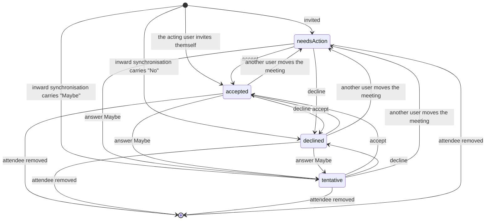
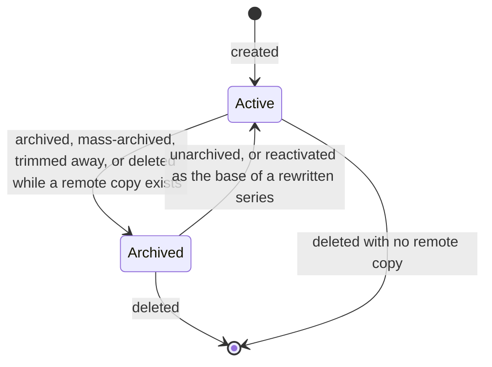
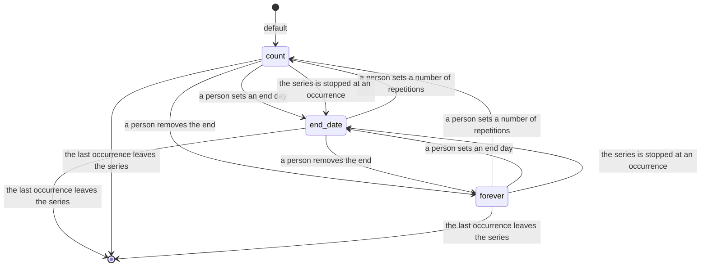
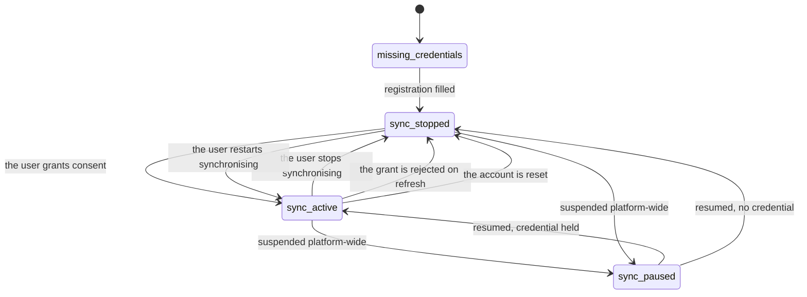
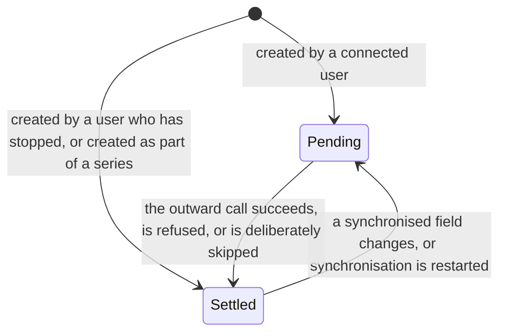
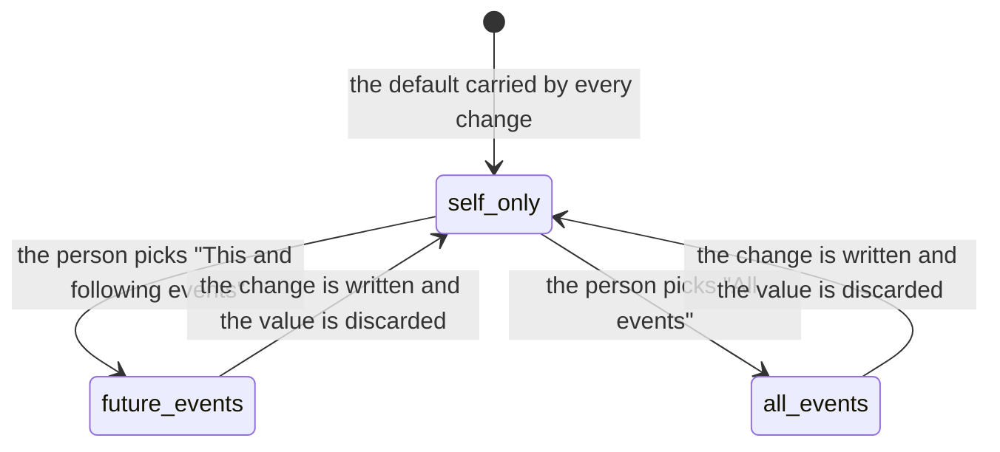

# State machines of Calendar and Scheduling

## 1. Overview

The domain holds no single "document state" the way an order or an invoice does. A meeting is not
approved, posted or paid; it simply exists, is answered by its attendees, and eventually falls into
the past. What the domain does hold is twelve selection fields whose values change the system's
behaviour, and this document specifies each of them completely: its values, its transitions, the
guard on each transition, the records each transition creates or changes, and the refusal message
when a transition is blocked.

| Chapter | Field | Entity | Kind |
|---|---|---|---|
| [2](#2-attendee-response-state) | `state` | Calendar Attendee Information | full state machine |
| [3](#3-event-activity-flag) | `active` | Calendar Event | two-state machine |
| [4](#4-recurrence-termination-mode) | `end_type` | Event Recurrence Rule | mode selector with side effects |
| [5](#5-per-user-synchronisation-state-first-external-calendar-service) | derived from three stored values | User | derived state machine |
| [6](#6-per-user-synchronisation-state-second-external-calendar-service) | derived from three stored values | User | derived state machine |
| [7](#7-record-pending-synchronisation-flag-first-service) | `need_sync` | Calendar Event, Event Recurrence Rule | two-state machine |
| [8](#8-record-pending-synchronisation-flag-second-service) | `need_sync_m` | Calendar Event, Event Recurrence Rule | two-state machine |
| [9](#9-recurrence-scope-selector) | `recurrence_update` | Calendar Event | transient selector |
| [10](#10-deletion-scope-selector) | `delete` | Calendar Popover Delete Wizard | transient selector |
| [11](#11-video-call-hosting-selector) | `videocall_source` | Calendar Event | derived selector |
| [12](#12-visibility-selector) | `privacy` and `effective_privacy` | Calendar Event | selector with a derived companion |
| [13](#13-availability-selector) | `show_as` | Calendar Event | two-value selector |
| [14](#14-attendee-availability-marker) | `availability` | Calendar Attendee Information | two-value marker |

---

# 2. Attendee response state

Field `state` on Calendar Attendee Information. This is the only machine in the domain that a person
drives directly, and the only one an outsider can drive without signing in.

## 2.1 States

| Stored value | Label | Meaning |
|---|---|---|
| `needsAction` | "Needs Action" | The invitation was delivered and no answer has been given. This is the default for every attendee except the one that is the acting user. |
| `accepted` | "Yes" | The attendee will come. |
| `declined` | "No" | The attendee will not come. A declined attendee receives no reminder of any channel. |
| `tentative` | "Maybe" | The attendee may come. Counted separately from the three others. |

## 2.2 Transition table

| From | To | Trigger | Guards, in order | Records created or changed |
|---|---|---|---|---|
| — | `accepted` | Creating an attendee record with no explicit response, for the contact of the acting user | The supplied values carry no response, and the contact is exactly the acting user's contact | The attendee record is created with `accepted`. Write access on the event is checked immediately after creation. |
| — | `needsAction` | Creating an attendee record with no explicit response, for any other contact | The supplied values carry no response | The attendee record is created with `needsAction`. |
| — | any of the four | Creating an attendee record from an inward synchronisation | The supplied values carry a response | The attendee record is created with that response, unchanged. |
| any | `tentative` | The named operation `do_tentative`, from the invitation list on the event screen, from the public invitation page, or from the event-level response control | The reader may write the event | The response becomes `tentative`. The first external calendar service pushes the event outwards. The second calls its answer operation with `tentativelyAccept`. |
| any | `accepted` | The named operation `do_accept` | The reader may write the event | The response becomes `accepted`. A message is posted on the event, authored by the attendee's contact, under the "Invitation" subtype, whose body reads the attendee's common name followed by " has accepted the invitation". Both services are told, as above, the second with `accept`. |
| any | `declined` | The named operation `do_decline` | The reader may write the event | The response becomes `declined`. A message is posted on the event, authored by the attendee's contact, under the "Invitation" subtype, whose body reads the attendee's common name followed by " has declined the invitation". Both services are told, the second with `decline`. |
| any but `accepted` | `accepted` | The route `/calendar/meeting/accept` | The invitation token resolves to an attendee record; when a session is open and the signed-in login is not the anonymous one, that session's contact is the attendee's contact | Only attendee records that are not already accepted are changed. The reader is then sent to the invitation view route. |
| any but `declined` | `declined` | The route `/calendar/meeting/decline` | The same two guards | Only attendee records that are not already declined are changed. |
| any but `accepted` | `accepted`, for every occurrence of the series | The route `/calendar/recurrence/accept` | The same two guards, and the attendee's event belongs to a series | Every attendee record of the same contact, on every occurrence of the series, that is not already accepted, is accepted. |
| any but `declined` | `declined`, for every occurrence of the series | The route `/calendar/recurrence/decline` | The same two guards | The mirror of the previous row. |
| any | `accepted`, `declined` or `tentative` on a chosen scope | The named operation `change_attendee_status` | Exactly one event is addressed | With the scope "All events" every occurrence of the series is addressed; with "This and following events" every occurrence starting at or after this one; otherwise only this one. Within that set, only the attendee record whose contact is the reader's contact is changed. |
| any | `needsAction` | Somebody other than the organiser changes a time field of the event | The event has an organiser, and that organiser is not the acting user, and at least one of the start, stop, start date and stop date is being written | Only the organiser's own attendee record is reset, so that the organiser is asked to confirm the new time. |
| any | `accepted` for the acting user, `needsAction` for everybody else | A recurrence is rewritten or trimmed with new time values | The scope is "All events" or "This and following events", and at least one time field changed | Every attendee record of the affected occurrences is reset. |
| any | the remote response | An inward synchronisation carries a response for an existing attendee | The remote address matches the attendee's address | The response is overwritten with the remote value. For the second service the remote values map as `none` and `notResponded` to `needsAction`, `tentativelyAccepted` to `tentative`, `declined` to `declined`, `accepted` to `accepted`, and `organizer` to `accepted`. |
| any | `declined` | An event is cancelled remotely and the reader is not its organiser | The reader is an attendee of the cancelled event | The event itself is kept; the reader's own attendee record is set to `declined`. |

## 2.3 Guards and their messages

| Guard | Failure |
|---|---|
| The reader may write the event | The platform's own access refusal is raised. Reading or writing an attendee record always re-checks write access on the parent event, both after creation and after every change. |
| The invitation token resolves to an attendee | The request is refused with the text "Invalid Invitation Token." |
| The open session belongs to the attendee | The request is refused with the text "Invitation cannot be forwarded via email. This event/meeting belongs to " followed by the attendee's electronic mail address, then " and you are logged in as ", then the signed-in user's address, then ". Please ask organizer to add you." |
| The event may be answered in the second service | An attendee who is not the organiser may answer; an organiser may not, because that service treats the organiser's own response as fixed. Answering an occurrence of a series is refused with the recurrence-update refusal of [business-rules.md](business-rules.md#7-external-synchronisation). |

## 2.4 Diagram

---

# 3. Event activity flag

Field `active` on Calendar Event. The flag is the domain's substitute for deletion whenever a remote
copy exists, and its transitions therefore carry more consequence than a simple hide.

## 3.1 States

| Stored value | Label | Meaning |
|---|---|---|
| true | "Active" | The event takes part in every ordinary search, is counted in availability, and is pushed to the external services. |
| false | archived | The event is hidden. The first external calendar service reads the change as an instruction to remove its copy. Reminders are not sent for it. |

## 3.2 Transition table

| From | To | Trigger | Guards | Records created or changed |
|---|---|---|---|---|
| true | false | Archiving one event | The reader may write the event | The event is hidden. Every series whose base occurrence is this event picks a new base, namely its earliest remaining occurrence that is not an outlier. |
| true | false | The mass-archive operation with the scope "All events" | Exactly one event is addressed | Every occurrence of the series is hidden. For the first service, the whole series is deleted remotely in one request, and the pending flag is lowered on every occurrence so that no second removal is attempted. For the second service, the operation is refused outright when the event is synchronised. |
| true | false | The mass-archive operation with the scope "This and following events" | Exactly one event is addressed | The series is trimmed at this occurrence; the detached occurrences are hidden. When this occurrence is the base occurrence, the case is handled as "All events" instead. |
| true | false | The mass-archive operation with the scope "This event" | Exactly one event is addressed | This occurrence alone is hidden with the scope "This event". If the series is then empty it is deleted; if this occurrence was the base occurrence, the series picks a new base. |
| true | false | Trimming a series while updating future occurrences | — | Every detached occurrence except the one being updated is hidden, and, for the first service, has its remote identifier cleared. |
| true | false | Deleting an event that carries a remote identifier of the first service | — | The event is archived instead of deleted, so that the next run still knows to remove the remote copy. |
| false | true | Unarchiving | The reader may write the event | The event becomes visible again. |
| false | true | Rewriting a series with the scope "All events" | — | The base occurrence is reactivated before the new pattern is applied. |
| false | — | Deleting an archived event | No remote identifier of the first service is attached | The event, its attendee records and its activities are removed. |

## 3.3 Diagram

---

# 4. Recurrence termination mode

Field `end_type` on Event Recurrence Rule, mirrored on Calendar Event.

## 4.1 States

| Stored value | Label | Meaning |
|---|---|---|
| `count` | "Number of repetitions" | The series stops after a fixed number of occurrences, held in `count`. This is the default. |
| `end_date` | "End date" | The series stops on the day held in `until`, inclusive. |
| `forever` | "Forever" | The series has no stated end. It is nevertheless bounded; the bounds are computed in [calculations.md, chapter 11](calculations.md#11-the-occurrence-horizon-and-its-caps). |

## 4.2 Transition table

| From | To | Trigger | Guards | Records created or changed |
|---|---|---|---|---|
| any | `count` | A person picks "Number of repetitions" and supplies a count | The count is strictly positive | The pattern text is rebuilt; applying the series creates or detaches occurrences accordingly. |
| any | `end_date` | A person picks "End date" and supplies a day | — | The pattern text is rebuilt with an end instant equal to the last microsecond of that day. |
| any | `end_date` | The series is stopped at an occurrence | The series still has at least one remaining occurrence | The mode becomes `end_date` and the end day becomes the day before the start of the period that contains the stopping occurrence. When no occurrence remains, the series is deleted instead. |
| any | `forever` | A person picks "Forever" | — | The pattern text is rebuilt with neither a count nor an end instant. |
| any | the parsed mode | The pattern text is written directly | The text parses | An end instant in the text yields `end_date`; otherwise a count yields `count`; otherwise `forever`. |

## 4.3 Guards and their messages

| Guard | Failure message |
|---|---|
| The interval is strictly positive | "The interval cannot be negative." |
| The count is strictly positive when the mode is `count` | "The number of repetitions cannot be negative." |
| A weekly series names at least one weekday | "You have to choose at least one day in the week" |
| A monthly series counted by number uses a day between 1 and 31 | "The day must be between 1 and 31" |

## 4.4 Diagram

---

# 5. Per-user synchronisation state, first external calendar service

This state is not stored in one field. It is derived, for one user, from one system parameter and
two stored values on that user: whether the service is suspended platform-wide, whether the user
holds a long-lived credential, and whether the user has stopped synchronising.

## 5.1 States

| Derived value | Meaning |
|---|---|
| `sync_paused` | The parameter `google_calendar_sync_paused` reads true. Nothing is sent outwards and nothing is fetched, for anybody, whatever each user's own settings say. Records still raise their pending flag, so the backlog is replayed when the suspension is lifted. |
| `sync_active` | The suspension is off and the user holds a long-lived credential and has not stopped synchronising. |
| `sync_stopped` | The suspension is off and the user has stopped synchronising, or holds no long-lived credential. |
| `missing_credentials` | Reported, not stored: the platform has no application registration for the service, so no user can connect. |

The reported status a screen receives is `missing_credentials` when the two registration parameters
are not both filled; otherwise the derived value above, further downgraded from `sync_active` to
`sync_stopped` when the user holds no long-lived credential.

## 5.2 Transition table

| From | To | Trigger | Guards | Records created or changed |
|---|---|---|---|---|
| `missing_credentials` | `sync_stopped` | An administrator fills the registration identifier and secret, from the general settings screen or from the provider panel | The reader belongs to the settings-administration group | Two system parameters are written. The provider panel also installs the capability package if it is absent. |
| `sync_stopped` | `sync_active` | The user grants consent through the service's own consent page and the callback returns an authorisation code | The state carried through the consent round trip names the calendar service | The user's settings record receives the long-lived credential, the short-lived credential and its expiry. |
| `sync_active` | `sync_stopped` | The named operation that stops synchronisation | Exactly one user is addressed | The stopped flag is raised on the user's settings record. |
| `sync_stopped` | `sync_active` | The named operation that restarts synchronisation | Exactly one user is addressed | The stopped flag is lowered, and every series and every event inside the outward scope has its pending flag raised, so the next run pushes them all. |
| `sync_active` or `sync_stopped` | `sync_paused` | The named operation that suspends synchronisation, or ticking the suspension box on the settings screen | — | The parameter `google_calendar_sync_paused` is set to true. |
| `sync_paused` | the value the user's own settings imply | The named operation that resumes synchronisation, or unticking the box | — | The parameter is set to false. |
| `sync_active` | `sync_stopped` | The short-lived credential is refreshed and the service answers that the grant is invalid | The answer carries a client or authorisation error | The transaction is rolled back, the three credential values are cleared and committed, and the refusal message of [business-rules.md](business-rules.md#7-external-synchronisation) is raised. |
| any | `sync_stopped` | The account reset panel is confirmed | The reader may run the panel | The three credential values, the change marker and the last-calendar marker are cleared. The event treatment follows the two chosen policies. |

## 5.3 Diagram

---

# 6. Per-user synchronisation state, second external calendar service

The same three derived values, computed from the parameter `microsoft_calendar_sync_paused`, the
user's short-lived credential and the user's stopped flag. Two differences from chapter 5 matter.

First, the active test reads the **short-lived** credential rather than the long-lived one, so a user
whose short-lived credential has expired and cannot be refreshed falls to `sync_stopped`.

Second, stopping and restarting also move the last-synchronisation instant: stopping clears it, and
restarting sets it to the current instant. That instant narrows the outward scope, so a restart
deliberately ignores everything written before it.

| From | To | Trigger | Guards | Records created or changed |
|---|---|---|---|---|
| `missing_credentials` | `sync_stopped` | An administrator fills the two registration parameters | Settings-administration group | The parameters `microsoft_calendar_client_id` and `microsoft_calendar_client_secret`. |
| `sync_stopped` | `sync_active` | Consent is granted and the callback returns a code | The state names the calendar service | The user receives the long-lived credential, the short-lived credential and its expiry. |
| `sync_active` | `sync_stopped` | The stopping operation | Exactly one user | The stopped flag is raised and the last-synchronisation instant is cleared. |
| `sync_stopped` | `sync_active` | The restarting operation | Exactly one user | The last-synchronisation instant is set to now, the stopped flag is lowered, and every series and event inside the outward scope has its pending flag raised. |
| any | `sync_paused` | The suspending operation or the settings box | — | The parameter `microsoft_calendar_sync_paused`. |
| `sync_paused` | the implied value | The resuming operation or the settings box | — | The same parameter. |
| `sync_active` | `sync_stopped` | A refresh is rejected | The answer carries a client or authorisation error | The transaction is rolled back; the long-lived and short-lived credentials, the expiry and the change marker are cleared and committed; the refusal message is raised. |
| any | `sync_stopped` | The account reset panel is confirmed | The reader may run the panel | The credentials are cleared, the change marker and the last-synchronisation instant are cleared, and the two policies are applied. |

The diagram of chapter 5 applies unchanged, reading the second service's parameter and credentials.

---

# 7. Record pending-synchronisation flag, first service

Field `need_sync` on Calendar Event and on Event Recurrence Rule.

## 7.1 States

| Stored value | Meaning |
|---|---|
| true | The record has changed locally and the change has not yet been accepted by the service. |
| false | The record is believed to match the remote copy, or must deliberately not be pushed. |

## 7.2 Transition table

| From | To | Trigger | Guards | Records created or changed |
|---|---|---|---|---|
| — | true | A record is created | Its organiser has not stopped synchronising | The default applies. |
| — | false | A record is created | Its organiser has stopped synchronising | The flag is lowered before insertion. |
| — | false | A recurring event or an occurrence of a series is created | The values carry a series reference or the recurrent marker | Occurrences are never pushed one by one; the series is pushed instead. |
| — | false | The first occurrence of an all-day series is created while the rest of the batch is not to be pushed | The record is pending, all-day, recurrent and not yet attached to a series | Prevents that occurrence from being inserted as a single event and then again as part of the series. |
| false | true | Any synchronised field is written | The pending flag is not itself in the values, and the reader has not stopped synchronising | For a Calendar Event the synchronised fields are the subject, the description, the all-day marker, the start, the end, the stop, the attendees, the reminders, the location, the visibility, the activity flag, the availability marker and the video-call address. For an Event Recurrence Rule the only synchronised field is the pattern text. |
| false | true | The user restarts synchronisation | — | Every record inside the outward scope. |
| false | true | The account reset panel is confirmed with the policy `all` | — | Every event of that user that carried a remote identifier. |
| true | false | The outward insertion succeeds | A short-lived credential is available | The remote identifier returned by the service is stored and the flag is lowered. |
| true | false | The outward patch succeeds and values were sent | A short-lived credential is available | The flag is lowered. |
| true | false | The outward deletion succeeds | The record still exists | The flag is lowered. |
| true | false | The service rejects the call with a client or forbidden answer | — | The flag is lowered so that the record is not retried until somebody changes it again, and a note is posted on the event. |
| true | false | A series is applied | — | Every occurrence of the series has the flag lowered, because the series itself carries the outward copy. |
| true | false | A recurrence is updated with the scope "This and following events" | — | The updated occurrence has the flag lowered and its remote identifier cleared. |
| true | false | An event is archived through the mass-archive operation | — | The archive values include the lowered flag, so that archiving does not also queue an individual deletion. |
| true | false | The account reset panel is confirmed with the policy `new` | — | Every remaining event of that user. |
| any | true | A recurrence is updated with the scope "All events" and the change touches a synchronised field | Exactly one event is addressed | The series itself is marked pending. |

## 7.3 Diagram

---

# 8. Record pending-synchronisation flag, second service

Field `need_sync_m`. The machine of chapter 7 applies, with these differences.

| Difference | Detail |
|---|---|
| Default on a series | An Event Recurrence Rule defaults the flag to **false**, not true. A series is only pushed when it is applied. |
| Raising condition | The flag is raised only when the reader's derived synchronisation state is `sync_active`, whereas the first service raises it whenever the reader has not stopped. |
| Synchronised fields on an event | The subject, the description, the all-day marker, the start, the end, the stop, the organiser, the visibility, the attendees, the reminders, the location, the availability marker, the activity flag and the video-call address. Note that the organiser is a synchronised field here and is not in the first service. |
| Synchronised fields on a series | The pattern text together with every synchronised field of an event. |
| Lowering after a patch | The flag is set to the negation of the service's answer: a patch that reports the event as absent leaves the record pending. |
| Lowering after an insertion | Both identifiers are stored and the flag is lowered in one write. |
| Writing an event with the activity flag lowered | The record is deleted remotely rather than patched. |
| Series application | Applying a series lowers the flag on every occurrence and deletes from the service any single-event copy of an occurrence that has just become part of a series. |

---

# 9. Recurrence scope selector

Field `recurrence_update` on Calendar Event. The field is never stored; it accompanies a change and
tells the system how far the change reaches.

## 9.1 Values

| Stored value | Label | Meaning |
|---|---|---|
| `self_only` | "This event" | Only this occurrence changes. This is the default. |
| `future_events` | "This and following events" | This occurrence and every later one change. |
| `all_events` | "All events" | Every occurrence changes. |

## 9.2 Decision table

| Scope | Number of events addressed | Series present | Effect |
|---|---|---|---|
| `self_only` | any | any | The change is written directly. Writing a time field also lowers the occurrence's follow marker, making it an outlier. Writing a pattern field is refused. |
| `future_events` | exactly one | yes | The series is trimmed at this occurrence; the detached later occurrences except this one are hidden; this occurrence receives the change; a new series is created from this occurrence with the combined pattern, whose count is the supplied count or, failing that, the number of detached occurrences. |
| `future_events` | exactly one | yes, and this occurrence is the base occurrence | Handled as `all_events`, because trimming a series at its own head is the same as replacing it. |
| `all_events` | exactly one | yes | The whole series is archived and deleted, the base occurrence is reactivated and receives the change, and a new series is built from it. When nothing that matters to the outside world changed and no time or pattern value changed, the change is instead written straight onto every occurrence. |
| `future_events` or `all_events` | more than one | any | The scope is ignored: the change is written directly to each addressed event. |
| any | any | no series | The scope is ignored. |

## 9.3 Guards and their messages

| Guard | Failure message |
|---|---|
| A pattern field may only be written with a scope of "This and following events" or "All events", or together with the recurrent marker | "Unable to save the recurrence with \"This Event\"" |
| A recurrence may not be updated without a base occurrence | "You can't update a recurrence without base event." |
| The second external calendar service forbids changing a synchronised series from the platform | "Due to an Outlook Calendar limitation, recurrence updates must be done directly in Outlook Calendar." When at least one occurrence is not yet synchronised, the message instead reads "Due to an Outlook Calendar limitation, recurrence updates must be done directly in Outlook Calendar.\nIf this recurrence is not shown in Outlook Calendar, you must delete it in Odoo Calendar and recreate it in Outlook Calendar." |
| The second service forbids moving an occurrence across its neighbours | "Outlook limitation: in a recurrence, an event cannot be moved to or before the day of the previous event, and cannot be moved to or after the day of the following event." |

## 9.4 Diagram

---

# 10. Deletion scope selector

Field `delete` on Calendar Popover Delete Wizard.

| Stored value | Label | Meaning |
|---|---|---|
| `one` | "Delete this event" | Only this occurrence is removed. The default. |
| `next` | "Delete this and following events" | Every occurrence starting at this one is removed. |
| `all` | "Delete all the events" | The series and every occurrence are removed. |

| From | To | Trigger | Effect |
|---|---|---|---|
| — | `one` | The panel opens | The default. |
| `one` | `next` or `all` | The person picks another radio button | Nothing yet. |
| any | — | The person confirms, on an event with exactly one attendee who is the organiser's own contact | `one` deletes the occurrence; `next` maps to the scope "This and following events"; `all` maps to "All events". |
| any | — | The person confirms, on any other event | The event's deletion action runs, which either deletes at once, when the organiser synchronises with an external service or more than one event is addressed, or opens the confirmation panel that offers to notify the attendees. |
| any | — | The person confirms on the second panel | The chosen scope is applied and the reader is sent to `/app/calendar`. |

---

# 11. Video-call hosting selector

Field `videocall_source` on Calendar Event. Derived from the stored web address, never written
directly.

| Stored value | Label | Derivation |
|---|---|---|
| `discuss` | "Discuss" | The web address contains the platform's own join path, `calendar/join_videocall`. |
| `custom` | "Custom" | Any other non-empty address, or none. |
| `google_meet` | "Google Meet" | Added by the first external calendar service: the address contains that service's conferencing host, `meet.google.com`. Evaluated before the two values above. When the package is removed, affected events fall back to `discuss`. |

| From | To | Trigger | Effect |
|---|---|---|---|
| any | `discuss` | A person asks for a platform-hosted call | A thirty-two character hexadecimal token is generated when the event has none, and the address becomes the platform's base address, a slash, `calendar/join_videocall`, a slash and the token. |
| any | `custom` | A person types an address | When the typed address carries no scheme it is completed with the platform's own scheme and host before being stored. |
| any | `google_meet` | An inward synchronisation carries a conferencing entry point of the video kind | The address is taken from that entry point. |
| any | none | A person clears the address | The address is emptied; the derived value falls back to `custom`. |

---

# 12. Visibility selector

Fields `privacy` and `effective_privacy` on Calendar Event.

| Stored value | Label | Meaning |
|---|---|---|
| empty | shown as the placeholder "User default" | No policy on the event; the organiser's own default applies. |
| `public` | "Public" | Every internal user may read every field. |
| `private` | "Private" | Only the organiser and the attendees may read the sensitive fields; every other internal user reads the subject as "Busy" and reads the other sensitive fields as empty. |
| `confidential` | "Only internal users" | Readable by internal users; not offered to portal users. |

The companion field holds the policy actually applied: the event's own policy when it is set, and
otherwise the organiser's default privacy. The organiser's default is itself one of `public`,
`private` and `confidential`, is stored on the user's settings record, defaults to `public`, and is
seeded for a new user from the system parameter `calendar.default_privacy`.

| From | To | Trigger | Guards | Effect |
|---|---|---|---|---|
| any | any | A person edits the event | The reader may write the event | The stored policy changes; every derived visibility recomputes. |
| any | the mapped value | An inward synchronisation from the first service | — | The remote visibility value is copied straight into the policy, or the policy is emptied when the remote copy carries none. |
| any | the mapped value | An inward synchronisation from the second service | — | The remote sensitivity maps as `normal` to `public`, `private` to `private` and `confidential` to `confidential`; anything else empties the policy. |
| any | the mapped value | An outward synchronisation to the second service | — | The reverse mapping, with an empty policy resolved through the organiser's default and, when there is no organiser, sent as `normal`. |

---

# 13. Availability selector

Field `show_as` on Calendar Event.

| Stored value | Label | Meaning |
|---|---|---|
| `free` | "Available" | The attendees are not counted as occupied during the event. |
| `busy` | "Busy" | The attendees are counted as occupied. The default. |

| From | To | Trigger | Effect |
|---|---|---|---|
| `busy` | `free` | A person picks "Available" | The event stops contributing to the unavailability of its attendees. Outward, the first service is told the time is transparent; the second is told `free`. |
| `free` | `busy` | A person picks "Busy" | The reverse. Outward, the first service is told the time is opaque; the second is told `busy`. |
| any | `free` | An inward synchronisation reports transparent time, or the value `free` | The value becomes `free`. |
| any | `busy` | Any other inward value | The value becomes `busy`. |

---

# 14. Attendee availability marker

Field `availability` on Calendar Attendee Information. Read only on screen and never written by this
domain's own operations; it exists so that a caller that has computed an attendee's availability can
record it against the invitation.

| Stored value | Label | Meaning |
|---|---|---|
| empty | — | Availability was never computed for this invitation. |
| `free` | "Available" | The attendee was free when the value was computed. |
| `busy` | "Busy" | The attendee was occupied when the value was computed. |
