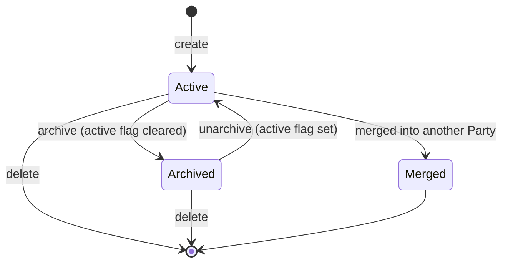
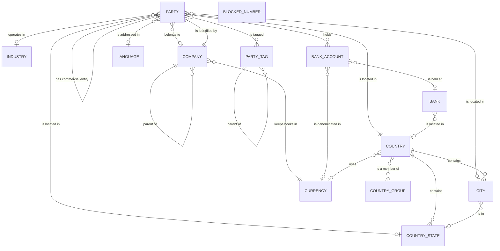

# Entities of the Contacts and Organizations domain

This file defines every entity of the domain: its purpose, its lifecycle, its complete field
table, its relations, its uniqueness rules, its defaults, its computed fields with the exact rule
that computes them, its ordering, its naming rule, its archival behaviour and its multi-company
behaviour.

## Reading conventions for the field tables

Each field table has three columns.

- **Field (storage name)** — the human name of the field followed by the exact storage name in
  code font. The storage name is the column name in the table and the name used on every external
  contract (import files, remote operations, electronic documents).
- **Type** — one of: text, long text, rich text, whole number, decimal number, true/false,
  date, date and time, selection, image, binary, structured document, link to one (a reference to
  exactly one record of another entity), link to many (a list of references), reverse list (the
  records of another entity that point back at this one), many-to-many (a symmetric list held in
  a join table).
- **Meaning and rules** — what the field means, whether it is required, its default, whether it is
  computed and from what, whether the computed value is stored, whether it is read-only, whether
  it is copied when the record is duplicated, whether changes to it are recorded in the record's
  message history ("tracked"), whether it is scoped per company, whether it is indexed, what
  happens to this record when the referenced record is deleted, and, for selections, every value
  with its stored token and its label.

A **company-dependent** field is stored once per record as a map from company to value; reading it
returns the value for the company the reader is acting for, and writing it changes only that
company's entry. A fall-back entry applies when a company has no entry of its own.

---

# 1. Party (`res.partner`, table `res_partner`)

## 1.1 Purpose

The Party is the universal counterparty record. One row of this table may be, depending on its
flags and its place in the hierarchy:

- an **organization** — a company, association or public body that the business deals with;
- a **person** — an individual, who may or may not be attached to an organization;
- an **address** — a postal location belonging to an organization or a person, used for invoicing,
  for delivery, or for some other purpose;
- the **identity of a company operating inside the system** — every Company record points at a
  Party record that holds its name, address, tax registration number, logo and bank accounts;
- the **identity of a user** — every user account points at a Party record.

There is no separate customer table, supplier table, address table or person table. The
distinction is carried by three fields — the organization flag (`is_company`), the parent link
(`parent_id`) and the address type (`type`) — and by the derived commercial entity
(`commercial_partner_id`).

## 1.2 The four shapes a Party can take

| Shape | Organization flag | Parent link | Address type | Commercial entity |
|---|---|---|---|---|
| Independent organization | set | empty | `contact` | itself |
| Independent person | clear | empty | `contact` | itself |
| Person attached to an organization | clear | set | `contact` | the nearest organization ancestor |
| Address of an organization or person | clear | set | `invoice`, `delivery` or `other` | the nearest organization ancestor |
| Subsidiary organization | set | set | `contact` | itself |

The last row is important: an organization is *always* its own commercial entity even when it has
a parent. A subsidiary therefore keeps its own tax registration number and its own company
registration number, and does not inherit them from the group.

## 1.3 Lifecycle



- **Created** by an operator, by an automatic rule, by the parsing of an inbound electronic mail
  message, by the import of an electronic invoice, by a storefront checkout, or by the creation of
  a Company or a user account.
- **Archived** by clearing the active flag. An archived Party stays in the database, keeps all its
  references, and disappears from every default search. Archiving is refused when a user account
  still points at the Party and that account is itself active.
- **Deleted** only when no foreign key still points at the record and no active user account is
  attached. In practice deletion is rare: the system prefers archiving.
- **Merged** — the record is absorbed into another Party by the merge procedure, after which the
  source rows are deleted and every reference has been rewritten to the destination.

## 1.4 Complete field table

### 1.4.1 Identity

| Field (storage name) | Type | Meaning and rules |
|---|---|---|
| Name (`name`) | text | The name of the person or the organization. Indexed. Not marked required at the database level, but a database check constraint named `res_partner_check_name` refuses a row whose address type is `contact` and whose name is empty; addresses of type `invoice`, `delivery` and `other` may have an empty name. Marked as suitable for default export. Writing it also renames every bank account of the Party whose account holder name still equals the previous name (see §12.4). |
| Complete name (`complete_name`) | text | Computed and stored, indexed. The name as it should appear in lists, prefixed with the commercial entity's name when the Party is a person or an address inside an organization. Recomputed when the organization flag, the name, the parent's name, the address type, the free-text company name or the commercial company name changes. The full algorithm is in [calculations.md](calculations.md) §1.1. |
| Display name (`display_name`) | text | Computed, not stored. The name as it appears in a reference field. Built from the complete name plus optional decorations selected by the reading context: internal identifier, electronic mail address, postal address, tax registration number, and a two-line "formatted" variant. Full algorithm in [calculations.md](calculations.md) §1.3. |
| Reference (`ref`) | text | A free identifier the business gives the Party (a customer number, a supplier number). Indexed. No uniqueness constraint. Searchable through the record-name search. |
| Parent (`parent_id`) | link to one Party | The organization or person this record belongs to. Indexed. Labelled `Related Company`. A cycle in this link is refused. Setting it clears the free-text company name. Setting it triggers the whole field-synchronization algorithm (see §1.7). |
| Parent name (`parent_name`) | text | Read-only mirror of the parent's name. |
| Children (`child_ids`) | reverse list of Party | The records whose parent is this one, restricted to active records. The reverse list is read with the archived-record filter switched off so that archived children are still loadable through it explicitly. |
| Organization flag (`is_company`) | true/false | Default cleared (the Party is a person). When set, the Party is an organization and is its own commercial entity. Writing this field is performed with elevated rights when the writer belongs to the contact-creation group, so that a user who may edit parties but not bypass record rules can still flip it. |
| Organization or person (`company_type`) | selection | Interface-only field with values `person` (label `Individual` in the shipped form, stored token `person`) and `company` (label `Company`). Computed from the organization flag; writing it sets the organization flag to true when the value is `company` and false otherwise. Explicitly documented as an interface convenience: business logic must read the organization flag, never this field. |
| Job position (`function`) | text | The role of a person inside the organization ("Chief Financial Officer"). Free text. |
| Employee flag (`employee`) | true/false | Marks the Party as an employee of the business. Default cleared. |
| Industry (`industry_id`) | link to one Industry | The line of business of the organization. Part of the commercial field set, therefore pushed down to descendants from the commercial entity. |
| Free-text company name (`company_name`) | text | The name of the organization the Party belongs to, when that organization does **not** yet exist as its own record. Cleared automatically the moment a parent is set, in both create and write. Used by the "create the parent organization" operation (§1.10). |
| Commercial company name (`commercial_company_name`) | text | Computed and stored. The legal name under which the Party trades. Equal to the commercial entity's name when the commercial entity is an organization; otherwise equal to this record's free-text company name. Recomputed when the free-text company name, the parent's organization flag or the commercial entity's name changes. |
| Commercial entity (`commercial_partner_id`) | link to one Party | Computed and stored, indexed, recursive. The Party that carries the commercial relationship — see §1.6 and [calculations.md](calculations.md) §2. |
| Address type (`type`) | selection | `contact` (label `Contact`), `invoice` (label `Invoice`), `delivery` (label `Delivery`), `other` (label `Other`). Default `contact`. A value supplied through the default mechanism that is not one of these four is discarded and replaced by an empty value, to protect against a stale default leaking out of a menu's context. |
| Address type description (`type_address_label`) | text | Computed, not stored. `Invoice Address` when the address type is `invoice`; `Delivery Address` when it is `delivery`; `Company Address` when the type is `contact` **and** a parent is set; `Address` otherwise. |
| Barcode (`barcode`) | text | Company-dependent. Never copied when the record is duplicated. Used to identify the Party at a scanner. A validation refuses a value already used by another Party. |

### 1.4.2 Postal address

| Field (storage name) | Type | Meaning and rules |
|---|---|---|
| Street (`street`) | text | First address line. Part of the address field set and therefore subject to hierarchy synchronization. |
| Street 2 (`street2`) | text | Second address line. |
| Postal code (`zip`) | text | Marked as a field that may change defaults elsewhere. |
| City (`city`) | text | Free-text city name. |
| State (`state_id`) | link to one Country State | Restricted by an interface filter to the states of the selected country, applied only when a country is selected. Deleting a state that is still referenced is refused (delete restriction). Choosing a state whose country differs from the selected country sets the country to the state's country. |
| Country (`country_id`) | link to one Country | Deleting a country that is still referenced is refused (delete restriction). Changing the country clears the state when the state does not belong to the new country. |
| Country code (`country_code`) | text | Read-only mirror of the country's two-letter code. |
| Complete address (`contact_address`) | text | Computed, not stored. The address rendered with the country's layout — see [calculations.md](calculations.md) §6. Depends on every field that takes part in the layout plus the country, the state and the free-text company name. |
| Latitude (`partner_latitude`) | decimal number | Ten significant digits, seven of them after the decimal mark. Geographic latitude. |
| Longitude (`partner_longitude`) | decimal number | Ten significant digits, seven of them after the decimal mark. Geographic longitude. |

The **address field set** is exactly: street, second street line, postal code, city, state,
country. When the extended-address behaviour is installed the controlled city reference is added
to the set. Everything that says "the address fields" in this specification means this set.

### 1.4.3 Means of contact

| Field (storage name) | Type | Meaning and rules |
|---|---|---|
| Electronic mail address (`email`) | text | Free text. May hold several addresses separated by commas. |
| Formatted electronic mail address (`email_formatted`) | text | Computed, not stored. The display form `"Name" <address>`. Built defensively: when the stored value normalises to one or more addresses, the result is the name paired with those normalised addresses joined by commas; when it does not normalise at all but is non-empty, the result is the name paired with the raw value; when the stored value is empty the result is empty. When the name is empty the literal text `False` is used as the name part, deliberately, so that the failure is visible in delivery logs. Full rule in [calculations.md](calculations.md) §1.4. |
| Telephone (`phone`) | text | Free text. When the telephone-validation behaviour is installed, editing this field in a form rewrites it into international presentation form (see §16 and [calculations.md](calculations.md) §9). |
| Website link (`website`) | text | Free text. On create and on write, a value without a scheme is rewritten: if the value parses with no network location, the path is moved into the network location; then the scheme `http` is added. So `example.com` is stored as `http://example.com`. |
| Notes (`comment`) | rich text | Internal notes. |

### 1.4.4 Language, time zone and salesperson

| Field (storage name) | Type | Meaning and rules |
|---|---|---|
| Language (`lang`) | selection | The selection is the list of active languages, each as its locale code paired with its name. Computed, stored, editable. On create or update: when a parent is set, the value becomes the parent's language, or, if the parent has none, the default language, or, failing that, the language of the current session; when no parent is set and no language is set, the value becomes the default language or the session language. Every document and message sent to this Party is rendered in this language. |
| Active language count (`active_lang_count`) | whole number | Computed, not stored. The number of active languages in the system. Used by the interface to hide the language selector when only one language exists. |
| Time zone (`tz`) | selection | Every time zone name known to the platform, sorted alphabetically except that names beginning with the prefix `Etc/` are pushed to the end of the list. Default: the time zone found in the session context. Used when printing documents and when importing or exporting time values. When unset, Coordinated Universal Time is used. |
| Time zone offset (`tz_offset`) | text | Computed, not stored. The current offset of the Party's time zone from Coordinated Universal Time, formatted as a signed four-digit string such as `+0200`. When no time zone is set, the offset of Greenwich Mean Time is used, giving `+0000`. |
| Salesperson (`user_id`) | link to one user | Computed with pre-computation, stored, editable. The internal user in charge of this Party. On creation, a Party that has no salesperson of its own, that is a person (not an organization), and whose parent has a salesperson, inherits the parent's salesperson. |

### 1.4.5 Tax and legal identification

| Field (storage name) | Type | Meaning and rules |
|---|---|---|
| Tax registration number (`vat`) | text | Indexed. The value-added tax identifier or equivalent tax number. The single character `/` is a deliberate marker meaning "this counterparty has no tax number". Part of the *synchronised* commercial field set: a value written on a child is pushed **up** to the parent as well as down to descendants. |
| Tax registration label (`vat_label`) | text | Computed from the context company, not stored. The country-specific word for the tax number, taken from the acting company's country; when the country defines none, the literal `Tax ID`. |
| Party with the same tax registration number (`same_vat_partner_id`) | link to one Party | Computed, never stored. Holds another Party that already uses the same tax registration number, so the interface can warn about a probable duplicate. See [business-rules.md](business-rules.md) §7 for the exact search. |
| Company registration number (`company_registry`) | text | Computed, stored, editable; indexed with an index that skips empty values. The registration number of the organization in its national register, used when it differs from the tax number. Part of the commercial field set (pushed down, not up). |
| Company registration label (`company_registry_label`) | text | Computed, not stored. A per-country label for the registration number, taken from a country-code-to-label map which is empty in the foundation package and filled by country-specific behaviour; when the country is absent from the map, the literal `Company ID`. |
| Company registration placeholder (`company_registry_placeholder`) | text | Computed, not stored. An example value shown as a hint in the input field. Empty in the foundation package; filled by country-specific behaviour. |
| Party with the same company registration number (`same_company_registry_partner_id`) | link to one Party | Computed, never stored. Same purpose as the tax-number twin, for the registration number. |

### 1.4.6 Classification and presentation

| Field (storage name) | Type | Meaning and rules |
|---|---|---|
| Tags (`category_id`) | many-to-many with Party Tag, join table `res_partner_res_partner_category_rel`, this side `partner_id`, other side `category_id` | Free classification. Default: the tag named in the reading context under the key `category_id`, if any. |
| Colour index (`color`) | whole number | Default zero. Chooses the colour of the record's card in a card view. |
| Active (`active`) | true/false | Default set. Clearing it archives the Party. |
| Shared party (`partner_share`) | true/false | Computed and stored. True when the Party either has no user account at all, or has only user accounts that are themselves marked as shared (portal or public). False for the built-in super-user's Party, always. Used by the multi-company record rule so that the parties of internal users stay visible to everybody. |
| Public party (`is_public`) | true/false | Computed with elevated rights, not stored. True when at least one attached user account (including archived ones) is a public user. |
| Users (`user_ids`) | reverse list of user | Every user account whose Party is this record. Read bypassing search access restrictions. |
| Main user (`main_user_id`) | link to one user | Computed from the reading user and from the attached accounts' active and shared flags, not stored. Resolution order: (1) if the Party is the reading user's own Party, the reading user; (2) otherwise, among the *active* attached accounts, the one that sorts last under the key "(not shared, negative identifier)" sorted descending — which selects a non-shared account over a shared one and, among equals, the one with the lowest identifier; (3) as a special case, if the Party is the built-in system Party and no active account was found, the built-in system user is used even though it may be archived. |
| Bank accounts (`bank_ids`) | reverse list of Bank Account | The accounts held by this Party. |
| Self reference (`self`) | link to one Party | Computed, not stored. Holds the record's own identifier. Exists so that a printable document can pass the whole record to a contact-rendering widget. |
| Application statistics (`application_statistics`) | structured document | Computed, not stored. A list of per-application counters shown on the Party's card. Empty in the foundation package; other domains add entries through an extension point that returns a map from Party identifier to a list of entries. The extension point exists as a separate method precisely because overriding the computation itself would lose previously assigned values. |

### 1.4.7 Images

Supplied by the image-holder and avatar-holder behaviours (§18).

| Field (storage name) | Type | Meaning and rules |
|---|---|---|
| Image (`image_1920`) | image | The stored picture, reduced on write so that neither side exceeds one thousand nine hundred and twenty pixels. |
| Image 1024 (`image_1024`) | image | Derived from the stored picture, reduced to at most one thousand and twenty-four pixels per side, stored as an attachment for speed. |
| Image 512 (`image_512`) | image | Derived, at most five hundred and twelve pixels per side, stored. |
| Image 256 (`image_256`) | image | Derived, at most two hundred and fifty-six pixels per side, stored. |
| Image 128 (`image_128`) | image | Derived, at most one hundred and twenty-eight pixels per side, stored. |
| Avatar (`avatar_1920`) | image | Computed, not stored. The picture to show for this Party at the largest size; falls back to a generated or placeholder image. |
| Avatar 1024 (`avatar_1024`) | image | Same at one thousand and twenty-four pixels. |
| Avatar 512 (`avatar_512`) | image | Same at five hundred and twelve pixels. |
| Avatar 256 (`avatar_256`) | image | Same at two hundred and fifty-six pixels. |
| Avatar 128 (`avatar_128`) | image | Same at one hundred and twenty-eight pixels. |

The avatar computations of the Party depend additionally on the name, on the shared flag of the
attached user accounts, on the organization flag and on the address type, because those four
decide which placeholder is used. The selection rule is in §1.11 and the generation algorithm is
in [calculations.md](calculations.md) §12.

### 1.4.8 Company scoping

| Field (storage name) | Type | Meaning and rules |
|---|---|---|
| Company (`company_id`) | link to one Company | Indexed. When empty, the Party is visible to every company. When set, the Party belongs to that company. Writing it is constrained: if the Party has attached user accounts, the new company must be the single company of all of them, otherwise the write is refused. Writing it cascades to every child. A default is taken from the parent when a child is being created. |

The company-scoping domain used when another record must check that its Party is compatible with
its own company is **"parent of"**: a Party is acceptable for a company when the Party has no
company, or when the Party's company is that company or one of its ancestors.

## 1.5 Ordering, record-name search and default values

- **Ordering**: by complete name ascending, then by internal identifier descending. So two parties
  with the same complete name are listed most-recent-first.
- **Record-name search fields**: complete name, electronic mail address, reference, tax
  registration number, company registration number. A free-text search in a reference field
  therefore matches on any of the five.
- **Default values on create**: when the creation context supplies a parent, the company is
  defaulted to that parent's company. When the creation context supplies an address type that is
  not one of the four valid tokens, the address type is emptied rather than kept.
- **Duplication**: copying a Party appends the suffix ` (copy)` to the name unless the caller
  supplies an explicit name. Company-dependent fields whose copy flag is cleared — the barcode —
  are not carried over.

## 1.6 The commercial entity

The commercial entity is the Party that carries the commercial relationship: the legal person that
signs the contract, owes the money and appears on the invoice header. It is computed and stored
recursively:

- if the Party is an organization, or has no parent, the commercial entity is the Party itself;
- otherwise the commercial entity is the commercial entity of the parent.

Because the field is stored and recursive, changing the organization flag or the parent of any
record in a chain recomputes the field on that record and on every descendant.

Worked resolution across three levels is given in [calculations.md](calculations.md) §2.2.

## 1.7 The two field sets that travel through the hierarchy

Two named sets of fields are synchronised between a Party, its parent and its descendants.

**The address field set** — street, second street line, postal code, city, state, country (plus
the controlled city reference when the extended-address behaviour is installed). Rules:

- A child whose address type is `contact` shares the parent's address. Whenever the parent's
  address changes, the change is pushed to every `contact`-type child.
- Conversely, when a `contact`-type child's address changes, the change is pushed **up** to the
  parent, which then pushes it down to its other `contact`-type children.
- Addresses of type `invoice`, `delivery` and `other` are *not* synchronised: they are independent
  postal locations.

**The commercial field set** — the synchronised commercial fields plus the company registration
number and the industry. The synchronised commercial fields are exactly: the tax registration
number. Rules:

- All commercial fields are pushed **down** from the commercial entity to every descendant that is
  not itself an organization.
- Only the *synchronised* subset (the tax registration number) is pushed **up** from a child to its
  parent.
- Company-dependent commercial fields are additionally propagated to every other company's entry.

The exact algorithm, with its ordering, its loop protection and its worked examples, is in
[calculations.md](calculations.md) §3.

A guard exists for the very first contact created under an organization: if the parent is an
organization (or has no parent of its own), the child has at least one address field filled, the
parent has none filled, and the child is the parent's only child, then the child's address is
copied up to the parent. The reasoning is that an operator who types an address while creating the
first contact of a new organization meant it to be the organization's address.

## 1.8 Uniqueness rules

| Rule | Scope | Enforcement | Message |
|---|---|---|---|
| A `contact`-type Party must have a name | per row | database check constraint `res_partner_check_name` | `Contacts require a name` |
| The parent chain must not contain a cycle | per hierarchy | validation on the parent field | `You cannot create recursive Partner hierarchies.` |
| A barcode may be used by at most one Party | whole table, per company (the field is company-dependent) | validation on the barcode field | `Another partner already has this barcode` |
| The company assigned to a Party that *is* a company must be that company | per row | validation on the company field | `The company assigned to this partner does not match the company this partner represents.` |

There is **no** database uniqueness constraint on the name, the electronic mail address, the
reference, the tax registration number or the company registration number. Duplicate tax
registration numbers and duplicate company registration numbers are detected and *warned about*,
not refused; see [business-rules.md](business-rules.md) §7.

## 1.9 Write and create side effects

On **create**, in order:

1. If the operation is an import, the state/country consistency of every row is repaired first
   (see [business-rules.md](business-rules.md) §4.3).
2. For each row: a website value is normalised; a supplied parent clears the free-text company
   name.
3. The rows are inserted.
4. For each row that did not supply a language explicitly, the language computation is run by
   hand. This is necessary because a user-defined default value suppresses the automatic
   computation.
5. Unless the context carries the suppression flag `_partners_skip_fields_sync`, the
   field-synchronization algorithm is run for each row against the full set of values including
   defaults.

On **write**, in order:

1. If the active flag is being cleared, the attached user accounts are re-read and the archive
   guard is applied (see [business-rules.md](business-rules.md) §9.1).
2. A website value is normalised.
3. A supplied parent clears the free-text company name.
4. If the name is being changed, every bank account of the Party whose account holder name equals
   the *previous* name has its account holder name changed to the new name.
5. The previous value of every field being written is captured, per record, so that the
   synchronization pass can be limited to fields that genuinely changed. This prevents infinite
   loops when a computation writes back the same value.
6. If the company is being changed, the compatibility check against attached users runs, and the
   change cascades to every child.
7. If the organization flag is in the payload and the writer is not already acting with elevated
   rights but does belong to the contact-creation group, the organization flag is written with
   elevated rights in a separate operation and removed from the payload.
8. The remaining values are written.
9. For each record, if any attached user account is an internal user other than the writer, the
   writer's write access on that user account is verified.
10. The field-synchronization algorithm is run with only the fields whose value actually changed.

## 1.10 Operations exposed on the Party

| Operation | Effect |
|---|---|
| Create the parent organization (`create_company`) | Requires a single record. If the free-text company name is set, a new organization Party is created with that name, with the organization flag set, with this Party's tax registration number and with a copy of this Party's address fields. This Party is then re-parented under the new organization, and every existing child of this Party is re-parented under the new organization as well. Returns true. When the free-text company name is empty, nothing happens. |
| Open the commercial entity (`open_commercial_entity`) | Requires a single record. Returns a window action that opens the commercial entity's form. |
| Resolve addresses (`address_get`) | Returns a map from requested address type to Party identifier. Algorithm in [calculations.md](calculations.md) §5. |
| Create from a text label (`name_create`) | Parses a combined name-and-address string, creates a Party, returns its identifier and display name. Algorithm in [calculations.md](calculations.md) §4.1. |
| Find or create from an address (`find_or_create`) | Parses the string; searches for an existing Party whose electronic mail address matches case-insensitively; returns it, or creates one. Algorithm in [calculations.md](calculations.md) §4.2. |
| Split the street (`_get_street_split`) | Returns the street decomposed into name, house number and door number. In the foundation package the decomposition is computed on the fly; when the extended-address behaviour is installed the stored fields are returned instead. |
| List all addresses (`_get_all_addr`) | Returns a one-element list describing this Party's address as a flat map with the keys `contact_type`, `street`, `street2`, `zip`, `city`, `state` (the state code) and `country` (the country code). Note that `contact_type` is filled with the street value. Other domains extend this to return several addresses. |
| Import templates (`get_import_templates`) | Returns one entry: the label `Import Template for Contacts` and the path of a shipped spreadsheet template. |

## 1.11 Avatar placeholder selection

When no image is stored, the avatar falls back to a placeholder file chosen as follows:

1. organization flag set → the generic company picture;
2. else address type `delivery` → the truck picture;
3. else address type `invoice` → the bill picture;
4. else address type `other` → the puzzle-piece picture;
5. else → the generic grey avatar picture.

But the fall-back is only reached for parties that have **no** internal user account and whose
address type is not `contact`. A Party that has at least one non-shared user account, or whose
address type is `contact`, gets the *generated initials avatar* instead when it has a name, and
the grey placeholder when it has none. The full rule:

1. Split the set into those with a non-shared user account **or** an address type of `contact`
   (call them the *named* group) and the rest.
2. For the named group, apply the standard avatar rule: use the stored image if any; otherwise, if
   the record exists and has a name, generate the initials avatar; otherwise use the grey
   placeholder.
3. For the rest, those with no stored image get the placeholder chosen by the five-step rule above,
   computed once per distinct placeholder path and shared across the group.
4. The remainder — no user account, not `contact`, but with a stored image — get their stored
   image.

## 1.12 Multi-company behaviour

- The company field may be empty, meaning "shared by all companies".
- A global record rule restricts visibility: a Party is visible when it is a *shared* Party (see
  the shared-party flag), **or** its company is one of the reader's allowed companies or an
  ancestor of one, **or** it has no company. The first clause exists so that the Party of an
  internal user of another company remains selectable in reference fields.
- Portal and public users see only the parties inside their own commercial entity's subtree, and
  may only read them.
- Writing the company cascades to children, so a whole subtree always shares one company.
- A Party that represents a Company must have that same Company as its company value.

---

# 2. Party Tag (`res.partner.category`, table `res_partner_category`)

## 2.1 Purpose

A free, hierarchical classification applied to parties: "Wholesaler", "Prospect", "Key account",
"Services / Consulting". Tags carry no behaviour of their own; other domains use them in filters
and in rules.

## 2.2 Field table

| Field (storage name) | Type | Meaning and rules |
|---|---|---|
| Name (`name`) | text | Required. Translated. |
| Colour (`color`) | whole number | Default: a pseudo-random whole number drawn uniformly from one to eleven inclusive at the moment the record is created. Excluded from aggregation in grouped views. |
| Parent tag (`parent_id`) | link to one Party Tag | Indexed. Deleting the parent deletes the children (delete cascade). |
| Child tags (`child_ids`) | reverse list of Party Tag | The tags whose parent is this one. |
| Active (`active`) | true/false | Default set. Clearing it hides the tag without removing it. |
| Hierarchy path (`parent_path`) | text | Indexed. The materialised path of ancestor identifiers, maintained by the platform so that "is a descendant of" can be answered with a single prefix comparison. |
| Parties (`partner_ids`) | many-to-many with Party, join table `res_partner_res_partner_category_rel`, this side `category_id`, other side `partner_id` | The parties carrying this tag. Not copied when a tag is duplicated. |

## 2.3 Rules

- **Ordering**: by name, then by identifier.
- **Display name**: the names of the tag and of all its ancestors, from the root down, joined by
  the three-character separator ` / ` (space, slash, space). A tag named `Consulting` whose parent
  is `Services` displays as `Services / Consulting`.
- **Cycle guard**: a validation on the parent field refuses a cycle with the message
  `You can not create recursive tags.`
- **Search by display name**: a search with a text-matching operator is rewritten into "is a
  descendant of any tag matching the text". So searching for `Services` returns parties tagged
  `Services` *and* parties tagged `Services / Consulting`. A negated text-matching operator is not
  supported and is passed through unchanged to the generic mechanism.

---

# 3. Industry (`res.partner.industry`, table `res_partner_industry`)

## 3.1 Purpose

The standard economic sector of an organization. Shipped as a fixed list following a standard
sector classification with single-letter section codes.

## 3.2 Field table

| Field (storage name) | Type | Meaning and rules |
|---|---|---|
| Name (`name`) | text | Translated. The short label, for example `Agriculture`. |
| Full name (`full_name`) | text | Translated. The section letter and the official wording, for example `A - AGRICULTURE, FORESTRY AND FISHING`. |
| Active (`active`) | true/false | Default set. |

## 3.3 Rules

- **Ordering**: by name, then by identifier.
- No uniqueness constraint.
- The industry is part of the commercial field set on the Party, so setting it on an organization
  pushes it down to every non-organization descendant.
- The complete shipped list is in [configuration.md](configuration.md) §8.6.

---

# 4. Country (`res.country`, table `res_country`)

## 4.1 Purpose

A sovereign state or dependent territory. The country of a Party drives the postal address layout,
the tax registration number validation, the telephone number interpretation, the selection of a
fiscal position, the flag image, and whether a state and a postal code are required.

## 4.2 Field table

| Field (storage name) | Type | Meaning and rules |
|---|---|---|
| Country name (`name`) | text | Required, translated, unique. |
| Country code (`code`) | text | Required, exactly two characters, unique. The two-letter international country code. Upper-cased on create and on write. |
| Layout in reports (`address_format`) | long text | The substitution template used to render a postal address of this country. Default: `%(street)s\n%(street2)s\n%(city)s %(state_code)s %(zip)s\n%(country_name)s`. Validated on write (see §4.4). Substitution keys are listed in §4.3. |
| Input view (`address_view_id`) | link to one interface view | Restricted to form views of the Party entity. When set, the address block of the Party form is replaced wholesale by this view, so a country can impose an entirely different set of address inputs. Changing it clears the cached interface templates. |
| Currency (`currency_id`) | link to one Currency | The country's currency. Used to default a new Company's currency when its country is chosen. |
| Flag image path (`image_url`) | text | Computed, not stored. See §4.5. |
| Country calling code (`phone_code`) | whole number | The international dialling prefix without the plus sign, for example thirty-two for Belgium. Changing it clears the stable cache. |
| Country groups (`country_group_ids`) | many-to-many with Country Group, join table `res_country_res_country_group_rel`, this side `res_country_id`, other side `res_country_group_id` | The groups this country belongs to. |
| Country group codes (`country_group_codes`) | structured document | Computed, not stored. The list of the codes of the country's groups, skipping groups with no code. When the country belongs to no group with a code, the value is a one-element list containing the empty string, deliberately, so that consumers can iterate without a null check. |
| States (`state_ids`) | reverse list of Country State | The administrative subdivisions of the country. |
| Customer name position (`name_position`) | selection | `before` (label `Before Address`) or `after` (label `After Address`). Default `before`. Where the counterparty's name is placed relative to the address block on a printed document. |
| Tax registration label (`vat_label`) | text | Translated, always pre-fetched. The country's own word for the tax registration number, for example the local term for the value-added tax identifier. Changing it clears the cached interface templates, because the Party form relabels the field from this value. |
| State required (`state_required`) | true/false | Default cleared. When set, address forms require a state. |
| Postal code required (`zip_required`) | true/false | Default **set**. When cleared, address forms accept an empty postal code. |

## 4.3 Layout substitution keys

The layout template may contain any of the following keys, each written as a percent sign, an
opening parenthesis, the key, a closing parenthesis and the letter `s`.

| Key | Value substituted |
|---|---|
| `street` | The first address line. |
| `street2` | The second address line. |
| `zip` | The postal code. |
| `city` | The city. |
| `state_id` | Accepted as a key of the address field set but rendered as the state's display name; layouts in practice use the two keys below instead. |
| `country_id` | Likewise for the country. |
| `state_code` | The state's code, or an empty string. |
| `state_name` | The state's name, or an empty string. |
| `country_code` | The country's two-letter code, or an empty string. |
| `country_name` | The country's name, or an empty string. |
| `company_name` | The commercial company name of the Party, or an empty string. |

When the extended-address behaviour is installed, the keys `street_name`, `street_number` and
`street_number2` are **not** added to the layout key set: the layout continues to use the combined
street field.

Any key that is not supplied is substituted with the empty string, because the substitution map is
a defaulting map whose missing entries produce the empty string.

## 4.4 Layout validation

A validation runs on every write of the layout. It substitutes the number one for every valid key
and checks that the substitution succeeds. If the substitution raises because of a malformed
template or an unknown key, the write is refused with the message `The layout contains an invalid
format key`.

The list of valid keys used by the validation is: the address field set of the Party, plus
`state_code`, `state_name`, `country_code`, `country_name` and `company_name`.

## 4.5 Flag image path

```formula
flag_path = "/base/static/img/country_flags/" + flag_code + ".png"
```

where

```formula
flag_code = mapped_override( country_code )   if the country code has a mapped override
          = lowercase( country_code )          otherwise
```

and the flag path is **empty** when the country code is empty or when the country is one of the
two territories that deliberately have no flag.

The ten mapped overrides:

| Country code | Flag code used | Reason |
|---|---|---|
| `GF` | `fr` | Overseas department, uses the metropolitan flag. |
| `BV` | `no` | Dependency. |
| `BQ` | `nl` | Special municipality. |
| `GP` | `fr` | Overseas department. |
| `HM` | `au` | External territory. |
| `YT` | `fr` | Overseas department. |
| `RE` | `fr` | Overseas department. |
| `MF` | `fr` | Overseas collectivity. |
| `UM` | `us` | Minor outlying islands. |
| `XI` | `uk` | Customs territory identified by a special two-letter code. |

The two territories with no flag: `AQ` (Antarctica) and `SJ` (Svalbard and Jan Mayen — separate
jurisdictions with no dedicated flag).

## 4.6 Search behaviour

Searching countries by text has a two-stage behaviour:

1. If the operator is not a negative one and the search text is exactly two characters long, the
   countries whose code matches under that operator are found first and returned first, and are
   then excluded from the second stage. The remaining limit is reduced by the number found; if the
   limit is exhausted, the search returns immediately.
2. The generic name search then runs on the remaining candidates.

So typing `BE` finds Belgium before it finds Belize or Benin.

The record-name search fields are the name and the code.

## 4.7 Caching

- The mapping from country code to calling code is cached under the stable cache.
- Creating, writing (when the code or the calling code changes) or deleting a country clears the
  stable cache.
- Changing the input view or the tax registration label clears the interface template cache.

## 4.8 Extension by other behaviours

| Added by | Field | Meaning |
|---|---|---|
| Extended addresses | Enforce cities (`enforce_cities`) | True/false. When set, every address in this country must choose its city from the controlled city list. |
| Tax number validation | Has a foreign fiscal position (`has_foreign_fiscal_position`) | Computed per acting company, not stored. True when the acting company has at least one fiscal position with a foreign tax registration number set for this country. A caching helper used by the tax-number validity rule. |

## 4.9 Rules

- **Ordering**: by name, then by identifier.
- **Deletion**: refused while any Party still points at the country, because the Party's country
  link is a restricting link.
- The shipped table of two hundred and sixty-one countries is in
  [configuration.md](configuration.md) §8.1.

---

# 5. Country State (`res.country.state`, table `res_country_state`)

## 5.1 Purpose

An administrative subdivision of a country: a federated state, a province, a department, a canton,
a region.

## 5.2 Field table

| Field (storage name) | Type | Meaning and rules |
|---|---|---|
| Country (`country_id`) | link to one Country | Required, indexed. |
| State name (`name`) | text | Required. |
| State code (`code`) | text | Required. |

## 5.3 Rules

- **Uniqueness**: the pair (country, code) must be unique. Message: `The code of the state must be
  unique by country!`
- **Ordering**: by code, then by identifier.
- **Record-name search fields**: name and code.
- **Display name**: the state name, a space, and the country's two-letter code in parentheses — for
  example `California (US)`. Under the "formatted display name" context the display becomes the
  state name, a tab, and the country code between double hyphens: `California \t --US--`.
- **Search by text** has a three-stage behaviour:
  1. When the operator is `in`, the search is decomposed into one equality search per element, each
     limited by the remaining budget; the default budget when none is given is one hundred.
  2. When the operator is not negative and the text is non-empty, the states whose code matches the
     text under a case-sensitive prefix-and-wildcard match are returned first and excluded from the
     next stage.
  3. The generic name search runs on the remainder.
- **Search by display name** additionally accepts the parenthesised form: a value of the shape
  `Name (Country)` is decomposed with a full-string pattern and turned into "name matches *Name*
  and (country name contains *Country* or country code equals *Country*)". When the reading context
  carries a country identifier, the search is further restricted to that country.
- The shipped table of two thousand one hundred and thirty-one states is in
  [configuration.md](configuration.md) §8.2.

---

# 6. Country Group (`res.country.group`, table `res_country_group`)

## 6.1 Purpose

A named set of countries. Used for customs unions (which drive tax treatment), for shipping zones,
and for restricting the availability of payment providers and of delivery methods.

## 6.2 Field table

| Field (storage name) | Type | Meaning and rules |
|---|---|---|
| Name (`name`) | text | Required, translated. |
| Code (`code`) | text | Upper-cased on create and on write. Unique. |
| Countries (`country_ids`) | many-to-many with Country, join table `res_country_res_country_group_rel`, this side `res_country_group_id`, other side `res_country_id` | The members of the group. |

## 6.3 Rules

- **Uniqueness**: the code must be unique. Message: `The country group code must be unique!`
- The group code is the contract other domains rely on. Two codes matter to this domain:
  - `EU_PREFIX` — the set of countries whose tax registration numbers carry a two-letter country
    prefix. Membership of this group switches on the prefix handling in the tax-number algorithm
    and in the duplicate detection.
  - `EU-VAT` and `EU` — the customs-union groups used by the tax domain.
- The shipped table of nineteen country groups is in [configuration.md](configuration.md) §8.3.

---

# 7. City (`res.city`, table `res_city`)

Supplied by the extended-address behaviour.

## 7.1 Purpose

A controlled list of cities, so that an address in a country that enforces cities cannot contain a
free-text city name. Introduced for electronic document exchange, where a numeric or coded city is
required.

## 7.2 Field table

| Field (storage name) | Type | Meaning and rules |
|---|---|---|
| Name (`name`) | text | Required, translated. |
| Postal code (`zipcode`) | text | The city's postal code, when it has exactly one. |
| Country (`country_id`) | link to one Country | Required. |
| State (`state_id`) | link to one Country State | Restricted by an interface filter to the states of the selected country. |

## 7.3 Rules

- **Ordering**: by name.
- **Record-name search fields**: name and postal code.
- **Display name**: the name alone when there is no postal code; otherwise the name, a space, and
  the postal code in parentheses — for example `Brussels (1000)`.
- No uniqueness constraint.
- Choosing a city on a Party cascades: the free-text city becomes the city's name, the postal code
  becomes the city's postal code, and the state becomes the city's state. Clearing the city on an
  existing record clears all three.
- Changing the country on a Party clears the chosen city when the city does not belong to the new
  country.
- The controlled city reference is added to the Party's address field set, so it is synchronised
  through the hierarchy exactly like the other address fields.
- Looking up a city by name (`_get_res_city_by_name`) searches for a city whose name matches
  case-insensitively within a given country and returns at most one. A public visitor performs this
  search with elevated rights, because public visitors cannot read the city table directly. In the
  foundation package, before the extended-address behaviour is installed, this lookup exists but
  returns nothing.

---

# 8. Currency (`res.currency`, table `res_currency`)

Only the aspects that bear on parties and documents are given here; rates, conversion and rounding
arithmetic belong to [Multi-Currency](../multi-currency/README.md).

## 8.1 Field table

| Field (storage name) | Type | Meaning and rules |
|---|---|---|
| Currency code (`name`) | text | Required, exactly three characters, unique. The three-letter international currency code. |
| Numeric code (`iso_numeric`) | whole number | The three-digit numeric code of the same international standard. |
| Name (`full_name`) | text | The currency's name in words, for example `United States dollar`. |
| Symbol (`symbol`) | text | Required. The sign printed next to amounts. |
| Rounding factor (`rounding`) | decimal number | Twelve significant digits, six of them after the decimal mark. Default one hundredth. Amounts are rounded to the nearest multiple of this factor. A database check refuses a value that is not strictly greater than zero, with the message `The rounding factor must be greater than 0!` |
| Decimal places (`decimal_places`) | whole number | Computed and stored from the rounding factor. |
| Active (`active`) | true/false | Default set. |
| Symbol position (`position`) | selection | `after` (label `After Amount`) or `before` (label `Before Amount`). Default `after`. |
| Currency unit label (`currency_unit_label`) | text | Translated. The name of one unit, for example `Dollars`. Used when writing an amount in words. |
| Currency subunit label (`currency_subunit_label`) | text | Translated. The name of one hundredth of a unit, for example `Cents`. |
| Rates (`rate_ids`) | reverse list of Currency Rate | The dated conversion rates. |

## 8.2 Rules relevant here

- **Uniqueness**: the currency code must be unique. Message: `The currency code must be unique!`
- **Ordering**: active first, then by currency code.
- **Record-name search fields**: currency code and name.
- Creating, deleting or changing the active flag of a currency re-evaluates the multi-currency
  security group: when more than one currency is active the group is granted to every internal
  user, and when at most one is active the group is withdrawn.
- A currency that is the currency of a Company cannot be deactivated. Message: `This currency is
  set on a company and therefore cannot be deactivated.` Two context flags suppress the check: the
  installation flag and an explicit force flag.
- Writing a Company's currency to an inactive currency activates it.
- The shipped table of one hundred and eighty-six currencies is in
  [configuration.md](configuration.md) §8.4.

---

# 9. Language (`res.lang`, table `res_lang`)

## 9.1 Purpose

A locale. It decides how dates, times and numbers are written, which way text runs, which day
starts the week, and which translation set is used for a Party's documents.

## 9.2 Field table

| Field (storage name) | Type | Meaning and rules |
|---|---|---|
| Name (`name`) | text | Required, unique. The human name, for example `English (US)`. |
| Locale code (`code`) | text | Required, unique. The locale identifier, for example `en_US`. Cannot be modified once set. |
| Language code (`iso_code`) | text | The two-letter language code used to name the translation files. |
| Address-bar code (`url_code`) | text | Required, unique. The short code that appears in a web address. Defaulted on create to the language code if present, otherwise to the locale code. |
| Active (`active`) | true/false | No default; a language ships inactive and is activated on demand. |
| Direction (`direction`) | selection | `ltr` (label `Left-to-Right`) or `rtl` (label `Right-to-Left`). Required, default `ltr`. |
| Date format (`date_format`) | selection | Required, default `%m/%d/%Y`. Nine values, each shown with a sample built from the current year — see §9.3. |
| Time format (`time_format`) | selection | Required, default `%H:%M:%S`. Two values: `%H:%M:%S` shown as `13:00:00`, and `%I:%M:%S %p` shown as ` 1:00:00 PM`. |
| First day of week (`week_start`) | selection | Required, default `7`. Values `1` through `7` labelled `Monday` to `Sunday`. |
| Separator format (`grouping`) | selection | Required, default `[3,0]`. Two values: `[3,0]` labelled `International Grouping`, which renders one hundred and twenty-three million four hundred and fifty-six thousand seven hundred and eighty-nine as `123,456,789.00`; and `[3,2,0]` labelled `Indian Grouping`, which renders the same number as `12,34,56,789.00`. |
| Decimal separator (`decimal_point`) | text | Required, default the full stop. Not trimmed of surrounding spaces. |
| Thousands separator (`thousands_sep`) | text | Default the comma. Not trimmed of surrounding spaces. May be empty. |
| Flag image (`flag_image`) | image | An optional uploaded flag. |
| Flag image address (`flag_image_url`) | text | Computed, not stored. When a flag image is uploaded, the address that serves it from this record; otherwise the shipped flag file whose name is the lower-cased part of the locale code after the last underscore. For the locale code `en_US` this yields the flag file named `us`. |

## 9.3 The nine date formats

| Stored value | Sample shown (with the current year written as *Y*) |
|---|---|
| `%d/%m/%Y` | `31/01/`*Y* |
| `%m/%d/%Y` | `01/31/`*Y* |
| `%Y/%m/%d` | *Y*`/01/31` |
| `%d-%m-%Y` | `31-01-`*Y* |
| `%m-%d-%Y` | `01-31-`*Y* |
| `%Y-%m-%d` | *Y*`-01-31` |
| `%d.%m.%Y` | `31.01.`*Y* |
| `%m.%d.%Y` | `01.31.`*Y* |
| `%Y.%m.%d` | *Y*`.01.31` |

## 9.4 Constraints and rules

| Rule | Message |
|---|---|
| The name must be unique. | `The name of the language must be unique!` |
| The locale code must be unique. | `The code of the language must be unique!` |
| The address-bar code must be unique. | `The URL code of the language must be unique!` |
| At least one language must exist. The check is skipped during installation. | `At least one language must be active.` |
| The date format and the time format must not contain a forbidden directive. The forbidden set is every directive in the platform's date-and-time translation map except the two-digit year directive, which is allowed though discouraged. | `Invalid date/time format directive specified. Please refer to the list of allowed directives, displayed when you edit a language.` |
| The locale code cannot be changed once the record exists. | `Language code cannot be modified.` |
| A language still chosen by an active user cannot be deactivated. | `Cannot deactivate a language that is currently used by users.` |
| A language still chosen by an active Party cannot be deactivated. | `Cannot deactivate a language that is currently used by contacts.` |
| A language chosen by any user account, active or archived, cannot be deactivated: it is the language the system was set up in and automated processes depend on it. | `You cannot archive the language in which the application was setup as it is used by automated processes.` (The message as produced names the application by its product name; a rebuild substitutes its own.) |
| The base language `en_US` can never be deleted. | `Base Language 'en_US' can not be deleted.` |
| The reader's own preferred language cannot be deleted. | `You cannot delete the language which is the user's preferred language.` |
| An active language cannot be deleted. | `You cannot delete the language which is Active!\nPlease de-activate the language first.` |

## 9.5 Behaviour on change

- **Ordering**: active first, then by name.
- **On deactivation**, before the three guards above pass, the user-defined default value that sets
  the default language of new parties is discarded for that language.
- **On activation**, the short-code reassignment runs: for every language being activated whose
  address-bar code still contains an underscore, the system looks for an inactive language whose
  address-bar code is the part before the underscore; if it finds one, and that language's locale
  code is not itself the short code, the inactive language's address-bar code is lengthened to its
  own locale code and the newly activated language takes the short code. So activating
  `fr_BE` while `fr_FR` is inactive gives `fr_BE` the address-bar code `fr`.
- **On unarchive**, the translations of every installed package are loaded for the activated
  languages.
- Every create, write and delete flushes and clears the stable cache, because the active-language
  data is cached there.
- **Duplication** appends ` (copy)` to the name, the locale code and the address-bar code unless
  the caller supplies them.

## 9.6 The cached active-language data

A read-only snapshot of the active languages is held in the stable cache, keyed by any one of the
cached fields. The cached fields are exactly: identifier, name, locale code, language code,
address-bar code, active flag, direction, date format, time format, first day of week, separator
format, decimal separator, thousands separator, flag image address. The snapshot is ordered by
name. A lookup for a value that is not an active language returns a dummy entry in which every
cached field is false, so that consumers never have to null-check. Asking for a field that is not
in the cached set raises `Field "<the field name>" is not cached`.

The installed-languages list exposed to selection fields is the list of (locale code, name) pairs
from this snapshot, sorted by name.

## 9.7 Number formatting

The language's formatting operation is specified in full, with the interspersion algorithm and
worked examples, in [calculations.md](calculations.md) §10. The shipped table of ninety-three
languages is in [configuration.md](configuration.md) §8.5.

---

# 10. Bank (`res.bank`, table `res_bank`)

## 10.1 Purpose

A financial institution. Bank accounts point at it so that payment files can carry the
institution's identifier and address.

## 10.2 Field table

| Field (storage name) | Type | Meaning and rules |
|---|---|---|
| Name (`name`) | text | Required. |
| Street (`street`) | text | First address line. |
| Street 2 (`street2`) | text | Second address line. |
| Postal code (`zip`) | text | |
| City (`city`) | text | |
| State (`state`) | link to one Country State | Labelled `Fed. State` (federated state). Restricted by an interface filter to the states of the selected country, applied only when a country is selected. Note the storage name is `state`, not `state_id`. |
| Country (`country`) | link to one Country | Note the storage name is `country`, not `country_id`. |
| Country code (`country_code`) | text | Read-only mirror of the country's two-letter code. |
| Electronic mail address (`email`) | text | |
| Telephone (`phone`) | text | |
| Active (`active`) | true/false | Default set. |
| Bank identifier code (`bic`) | text | Indexed. The institution's international business identifier code, also called the society-for-worldwide-interbank-financial-telecommunication code. Upper-cased on create and on write. |

## 10.3 Rules

- **Ordering**: by name, then by identifier.
- **Record-name search fields**: name and bank identifier code.
- **Display name**: the name; if a bank identifier code is present, the name followed by a space,
  a hyphen, a space and the code — for example `Banque Nationale - BNPAFRPP`.
- **Search by display name**: a case-insensitive containment search or its negation on a non-empty
  value is rewritten as "the bank identifier code starts with the text (case-insensitively) **or**
  the name contains the text", with the negation applied to the whole disjunction. Every other
  operator falls through to the generic mechanism.
- **State and country interlock**: choosing a country whose value differs from the state's country
  clears the state; choosing a state sets the country to the state's country.
- The shipped table of one hundred and fifteen banks is in
  [configuration.md](configuration.md) §8.7.

---

# 11. Bank Account (`res.partner.bank`, table `res_partner_bank`)

## 11.1 Purpose

An account number held by a Party at a Bank. It is the target of outgoing payments and the source
of incoming ones, and it is printed on invoices.

## 11.2 Field table

| Field (storage name) | Type | Meaning and rules |
|---|---|---|
| Active (`active`) | true/false | Default set. |
| Account number (`acc_number`) | text | Required. Searchable through a dedicated search that sanitises the search term the same way the stored sanitised number is sanitised. |
| Sanitised account number (`sanitized_acc_number`) | text | Computed and stored, read-only. The account number with every non-alphanumeric character removed and the remainder upper-cased. This is the value all comparisons use. |
| Clearing number (`clearing_number`) | text | An additional routing number used in some countries. |
| Account type (`acc_type`) | selection | Computed, not stored. The selection is produced at run time by an extension point; the foundation package offers exactly one value, `bank`, labelled `Normal`. Behaviour that understands international bank account numbers adds a second value. The value is derived from the account number by an extension point which, in the foundation package, always answers `bank`. |
| Account holder name (`acc_holder_name`) | text | Computed from the Party, stored, editable. Defaults to the Party's name. Used when the name on the account differs from the Party's name. Kept in step: renaming a Party renames every account of that Party whose holder name still equalled the old name. |
| Account holder (`partner_id`) | link to one Party | Required, indexed. Deleting the Party deletes the account (delete cascade). Restricted by an interface filter to parties that are organizations **or** have no parent — an address cannot hold a bank account. |
| Send money (`allow_out_payment`) | true/false | Default **cleared**. Never copied when the record is duplicated. When cleared, the account may not be used as the destination of an outgoing payment. This is an anti-fraud control: a newly imported or newly created account is not payable until somebody deliberately allows it. |
| Bank (`bank_id`) | link to one Bank | The institution. |
| Bank name (`bank_name`) | text | Mirror of the bank's name, writable (writing it renames the bank). |
| Bank identifier code (`bank_bic`) | text | Mirror of the bank's identifier code, writable. |
| Sequence (`sequence`) | whole number | Default ten. Orders the accounts of one Party. |
| Currency (`currency_id`) | link to one Currency | The currency of the account. |
| Company (`company_id`) | link to one Company | Mirror of the Party's company, stored, read-only. |
| Country code (`country_code`) | text | Mirror of the Party's country code. |
| Notes (`note`) | long text | |
| Colour (`color`) | whole number | Computed, not stored. Ten when outgoing payments are allowed, one when they are not. Gives the card a green or a red tint. |

## 11.3 Rules

- **Ordering**: by sequence, then by identifier.
- **Record name**: the account number.
- **Display name**: the account number, a space, a hyphen, a space and the bank's name when a bank
  is set; otherwise the account number alone.
- **Uniqueness**: the pair (sanitised account number, account holder) must be unique. Message:
  `The combination Account Number/Partner must be unique.`
- **Sanitisation on write**: a payload that tries to write the sanitised number directly is
  rewritten so that the value lands in the account number instead; then the sanitised number is
  recomputed from the account number. The sanitised number can therefore never be set to something
  inconsistent with the account number.
- **Deletion**: deleting a bank account archives it instead. The reason is that accounts are
  referenced by posted accounting entries which must not lose their reference. A dedicated archive
  operation exists that archives and then asks the interface to reload, because the plain archive
  does not refresh the surrounding form.
- **Company scoping**: the company-scoping domain is "parent of" — an account is acceptable for a
  company when its company is that company or one of its ancestors, or when it has no company.
- A global record rule restricts visibility to accounts whose company is one of the reader's
  companies or an ancestor of one, or which have no company.
- **Trust**: an extension point (`_user_can_trust`) answers whether the reading user may treat the
  account as trusted. In the foundation package it always answers yes.

## 11.4 Find or create an account

The find-or-create procedure is specified in [calculations.md](calculations.md) §7. Its purpose is
to attach an account number found in an incoming document to the right Party without creating a
second copy and without silently creating an account for one of the business's own companies.

---

# 12. Company (`res.company`, table `res_company`)

## 12.1 Purpose

A legal entity operating inside the system. Every document belongs to exactly one company. A
Company does not hold its own name and address: it delegates them to a Party.

## 12.2 Field table

| Field (storage name) | Type | Meaning and rules |
|---|---|---|
| Company name (`name`) | text | Required, stored, editable. A mirror of the Party's name: writing it renames the Party. Unique. |
| Active (`active`) | true/false | Default set. Archiving a company archives every branch beneath it. |
| Sequence (`sequence`) | whole number | Default ten. Orders companies in the company switcher. |
| Parent company (`parent_id`) | link to one Company | Indexed. Deleting the parent is refused while branches exist (delete restriction). **Cannot be changed after creation.** |
| Branches (`child_ids`) | reverse list of Company | The direct branches. |
| All branches (`all_child_ids`) | reverse list of Company | The same list read with the archived-record filter switched off. |
| Hierarchy path (`parent_path`) | text | Indexed. Materialised path of ancestor identifiers. |
| Ancestors (`parent_ids`) | link to many Company | Computed with elevated rights, not stored. Every company on the path from the root down to and including this one, in that order. When the path is empty the value is the company itself. |
| Root company (`root_id`) | link to one Company | Computed with elevated rights, not stored. The first element of the ancestor chain. |
| Party (`partner_id`) | link to one Party | Required, indexed. The Party that holds this company's identity. |
| Company tagline (`report_header`) | rich text | Translated. Included in the header or footer of printed documents depending on the chosen layout. |
| Report footer (`report_footer`) | rich text | Translated. Shown at the bottom of every printed document. |
| Company details (`company_details`) | rich text | Translated. Shown at the top of every printed document. |
| Company details are empty (`is_company_details_empty`) | true/false | Computed, not stored. True when the company details, stripped of markup, contain no text. Exists because an "empty" rich-text field still holds an empty paragraph. |
| Company logo (`logo`) | binary | A mirror of the Party's stored image, writable. Default: the shipped default logo file. |
| Logo for the web (`logo_web`) | binary | Computed and stored, held in the row rather than as an attachment because it is fetched directly for speed. The Party's image resized to a width of one hundred and eighty pixels with the height left free. |
| Uses the default logo (`uses_default_logo`) | true/false | Computed and stored. True when the logo is empty or byte-identical to the shipped default. |
| Currency (`currency_id`) | link to one Currency | Required. Default: the currency of the reading user's company. A **root-delegated** field: a branch must have the same value as its root. |
| Accepted users (`user_ids`) | many-to-many with user, join table `res_company_users_rel`, this side `cid`, other side `user_id` | The user accounts allowed to act for this company. |
| Street (`street`) | text | Computed from the Party, with an inverse that writes back to the Party. |
| Street 2 (`street2`) | text | Same. |
| Postal code (`zip`) | text | Same. |
| City (`city`) | text | Same. |
| State (`state_id`) | link to one Country State | Same. Labelled `Fed. State`. Restricted by an interface filter to the states of the selected country. |
| Country (`country_id`) | link to one Country | Same. |
| Country code (`country_code`) | text | Mirror of the country's code. |
| Bank accounts (`bank_ids`) | reverse list of Bank Account | Mirror of the Party's accounts, writable. |
| Electronic mail address (`email`) | text | Mirror of the Party's, stored, writable. |
| Telephone (`phone`) | text | Mirror of the Party's, stored, writable. |
| Website (`website`) | text | Mirror of the Party's, writable. |
| Tax registration number (`vat`) | text | Mirror of the Party's, writable. |
| Company registration number (`company_registry`) | text | Mirror of the Party's, writable. |
| Company registration placeholder (`company_registry_placeholder`) | text | Mirror of the Party's. |
| Paper format (`paperformat_id`) | link to one paper format | Default: the shipped European paper format. |
| Document template (`external_report_layout_id`) | link to one interface view | The outer layout of every printed document. |
| Font (`font`) | selection | Eight values: `Lato`, `Roboto`, `Open_Sans` (labelled `Open Sans`), `Montserrat`, `Oswald`, `Raleway`, `Tajawal`, `Fira_Mono` (labelled `Fira Mono`). Default `Lato`. |
| Primary colour (`primary_color`) | text | A colour expressed as text. |
| Secondary colour (`secondary_color`) | text | A colour expressed as text. |
| Colour index (`color`) | whole number | Computed with an inverse. Reading: the colour index of the root company's Party; if that is zero, the remainder of the root company's identifier divided by twelve. Writing: sets the root company's Party colour index. |
| Layout background (`layout_background`) | selection | `Blank`, `Demo logo`, `Custom`. Required, default `Blank`. |
| Layout background image (`layout_background_image`) | binary | |
| Uninstalled country packages (`uninstalled_l10n_module_ids`) | link to many software packages | Computed, not stored. The automatically-installable country-specific packages that target this company's country and are not yet installed. |

## 12.3 The address computation

The Company's address fields are not stored on the Company. They are computed from the Party:

1. For each company that has a Party, resolve the Party's **contact** address using the
   address-resolution algorithm with the single preference `contact`.
2. If that resolution yields a Party, read the six address fields from it with elevated rights and
   copy them onto the Company.

Each address field has its own inverse that writes the value straight back onto the Company's own
Party (not onto the resolved contact). Writing any of the six therefore edits the company's own
Party record.

Changing an address field invalidates the whole computed address set so that the resolution runs
again.

## 12.4 Rules

| Rule | Enforcement | Message |
|---|---|---|
| The company name must be unique. | database constraint | `The company name must be unique!` |
| A company cannot be duplicated. | the duplicate operation itself | `Duplicating a company is not allowed. Please create a new company instead.` |
| The company hierarchy cannot be changed. | write guard on the parent field | `The company hierarchy cannot be changed.` |
| A company with active users cannot be archived. | validation on the active flag | `The company <the company name> cannot be archived because it is still used as the default company of <the number of active users> users.` |
| A branch's root-delegated fields must equal the root's. The delegated set is exactly: the currency. | validation on the delegated fields and the parent | `The <the field's label> of a subsidiary must be the same as it's root company.` |

## 12.5 Create and write behaviour

On **create**:

1. For every row that supplies a name but no Party, a Party is created first, with the
   organization flag set, with the parent default explicitly suppressed, and carrying the name,
   the logo as its image, the electronic mail address, the telephone, the website, the tax
   registration number and the country from the row. Those parties are flushed so that their
   stored computed fields exist. Each row is then given its new Party.
2. For every row with a parent, each root-delegated field that the row did not supply is filled
   from the parent.
3. The whole cache is cleared.
4. The rows are inserted.
5. The creating user and the built-in super-user are both added to the accepted-users list of every
   new company.
6. Every currency used by a new company that is inactive is activated.
7. Every new company that has a country triggers the installation of its country-specific packages
   — suppressed while tests run, while the registry is initialising, during installation and
   during import.

On **write**:

1. A parent in the payload is refused outright.
2. An inactive currency in the payload is activated.
3. The values are written.
4. If the payload touches the active flag or the sequence, the whole cache is cleared, because the
   cached list of a user's companies depends on them.
5. If the payload touches the font, the primary colour, the secondary colour or the document
   template, the compiled style-sheet cache is cleared, because those four are compiled into it.
6. Clearing the active flag archives every branch.
7. For every root company whose payload touched a root-delegated field, that field is copied to
   every branch beneath it.
8. A company that has just acquired a country triggers the installation of its country-specific
   packages.
9. If the payload touched any of the six address fields, the computed address set is invalidated.

## 12.6 Company-related helpers

| Helper | Behaviour |
|---|---|
| Main company (`_get_main_company`) | Returns the shipped main company if it exists; otherwise the company with the lowest identifier. |
| Accessible branches (`_accessible_branches`) | Cached per (allowed companies, company, user). Walks down from the company, collecting at each level the branches that are among the reader's allowed companies. When the result is empty and the reader is the built-in super-user, the company itself is returned, because the super-user bypasses record rules anyway. |
| All branches selected (`_all_branches_selected`) | True when the set of companies equals exactly the full subtree of their roots. Used by operations that only make sense for whole companies. |
| Company parties (`_get_company_partner_ids`) | Cached. The identifiers of the parties of every company, active or archived. Used by the bank-account find-or-create guard. |
| Public user for a company (`_get_public_user`) | Returns an existing public user belonging to the company, or copies the built-in public user with the name `Public user for <the company name>` and the login `public-user@company-<the company identifier>.com`. |
| Branches window (`action_all_company_branches`) | A window action listing the direct branches of one company, with the archived-record filter switched off and the parent defaulted. |

## 12.7 Multi-company visibility

- Internal users, portal users and public users may **read** only the companies in their allowed
  set. The access-rights holder group may read, create, update and delete every company.
- The rule for the access-rights holder group is unconditional; the rules for the other three are
  "the company is in my allowed set".

---

# 13. Blocked Number (`phone.blacklist`, table `phone_blacklist`)

Supplied by the telephone-validation behaviour.

## 13.1 Purpose

A telephone number that must not receive automated messages. The list is global: it is not scoped
by company, by mailing list or by campaign.

## 13.2 Field table

| Field (storage name) | Type | Meaning and rules |
|---|---|---|
| Telephone number (`number`) | text | Required, tracked in the record's message history. Stored in the strict international form (a plus sign followed by the country calling code and the national number, with no separators). Searchable through a dedicated search that sanitises the search term first. |
| Active (`active`) | true/false | Default set, tracked. A blocked number is *deactivated* rather than deleted when it is unblocked, so that the history of blocking and unblocking survives. |

## 13.3 Rules

- **Record name**: the telephone number.
- **Uniqueness**: the number must be unique. Message: `Number already exists`
- The entity carries a message thread, so every change to the number and to the active flag is
  logged, and a reason can be posted when a number is blocked or unblocked.
- **Creation semantics** are deliberately idempotent and are specified as an algorithm in
  [workflows.md](workflows.md) §12.1. In outline: every submitted number is normalised; a number
  that cannot be normalised raises; duplicates within one batch are collapsed; numbers that already
  exist are *reactivated* unless the caller explicitly asked for them to stay inactive; only
  genuinely new numbers are inserted; and the returned set is in the order the caller asked for.
- **Writing the number** normalises it first and raises on failure.
- **Searching the number** normalises the search term first, falling back to the raw term when
  normalisation fails.

## 13.4 Errors

| Condition | Message |
|---|---|
| A number submitted for blocking cannot be parsed or formatted. | `<the underlying formatting error> Please correct the number and try again.` |
| A user without write access on the blocked-number list tries to open the unblock dialogue. | `You do not have the access right to unblacklist phone numbers. Please contact your administrator.` |

---

# 14. Telephone Thread Mixin (`mail.thread.phone`)

## 14.1 Purpose

An abstract behaviour that any entity holding a telephone number can adopt. It gives the entity a
normalised number, a blocked-state flag, and a search field that finds a record by any spelling of
its number. The Party adopts it.

## 14.2 Field table

| Field (storage name) | Type | Meaning and rules |
|---|---|---|
| Sanitised number (`phone_sanitized`) | text | Computed with elevated rights and stored. The first of the entity's number fields that yields a normalised value, in the order the entity declares. Depends on the number fields, on the country field, and on every stored party-reference field of the entity (because the fall-back country can change with the party). |
| Telephone blocked (`phone_sanitized_blacklisted`) | true/false | Computed with elevated rights, not stored, searchable. Restricted to internal users. True when the sanitised number appears in the blocked list. |
| Blocked number is the telephone (`phone_blacklisted`) | true/false | Computed with elevated rights, not stored. Restricted to internal users. Distinguishes which of several number fields is the blocked one. The computation loops over the number fields and leaves the flag holding the verdict of the *last* field examined, which is a known limitation when a record has both a mobile and a landline field. |
| Telephone number search (`phone_mobile_search`) | text | Not stored. Exists only to be searched: see §14.4. |

## 14.3 The number fields and the country

- The **number fields** of an entity are, by default, whichever of `mobile` and `phone` the entity
  has, in that order. An entity may override the list.
- The **country field** of an entity is `country_id` when it has one, otherwise none.
- The **country resolution** for a record, used to interpret a national number, is:
  1. the record's own country field, if it has one and it is filled;
  2. otherwise, the country of the first party found in any of the entity's party-reference fields;
  3. otherwise, the acting company's country.

## 14.4 Searching by telephone number

Searching the telephone-number search field runs a hand-written query rather than a simple pattern
match, because numbers are stored in many spellings. The algorithm:

1. A search with the operator "is in" is expanded into a disjunction of equality searches; "is not
   in" into a conjunction of inequality searches.
2. The search term is trimmed.
3. The searchable fields are the stored number fields of the entity plus the sanitised number. The
   sanitised number is dropped from the list when its supporting index does not exist, to avoid a
   full table scan.
4. If no searchable field remains, the search fails with `Missing definition of phone fields.`
5. A search for "set" or "not set" (the term being the boolean true or empty with an equality or
   inequality operator) is turned into a conjunction or disjunction of emptiness tests over the
   searchable fields, with the operator inverted when the term is the boolean true.
6. An empty term matches everything.
7. A term shorter than three characters fails with `Please enter at least 3 characters when
   searching a Phone number.`
8. Every stored value is normalised inside the query by deleting every character in the class
   "whitespace, backslash, full stop, solidus, opening parenthesis, closing parenthesis, hyphen".
   The term is normalised the same way.
9. **Plus-prefix equivalence.** When the term starts with a plus sign or with two zeros, the prefix
   is stripped and the query looks for *both* `00` followed by the rest and `+` followed by the
   rest. So searching `+32485112233` also finds a number stored as `0032485112233`, and the
   reverse.
10. For pattern operators the normalised term is wrapped: with a trailing wildcard in the
    plus-prefix case, and with wildcards on both sides otherwise.
11. The matching identifiers are collected and the search resolves to "identifier is in that list".

## 14.5 Indexes created

For every searchable field the behaviour creates, at table-creation time:

- a tree index on the normalised expression of the field, restricted to rows where the field is not
  empty — this serves equality and known-prefix pattern matches;
- when the database supports three-character-gram indexes, a generalised inverted index on the same
  normalised expression with the three-character-gram operator class, restricted the same way —
  this serves containment and leading-wildcard matches.

Abstract entities with no physical table are skipped.

## 14.6 Operations

| Operation | Behaviour |
|---|---|
| Block (`_phone_set_blacklisted`) | Adds every record's sanitised number to the blocked list, with elevated rights. |
| Unblock (`_phone_reset_blacklisted`) | Removes every record's sanitised number from the blocked list, with elevated rights. |
| Open the unblock dialogue (`phone_action_blacklist_remove`) | Checks that the reader has write access on the blocked list; if so returns a window action opening the unblock dialogue as a modal; otherwise raises the access error quoted in §13.4. |

## 14.7 Validity guard

Before computing the sanitised number or searching the blocked flag, the behaviour asserts that the
entity really declares at least one *text* number field. If it does not, the operation fails with
`Invalid primary phone field on model <the entity's transport name>`.

---

# 15. Unblock Number Wizard (`phone.blacklist.remove`, transient)

| Field (storage name) | Type | Meaning and rules |
|---|---|---|
| Telephone number (`phone`) | text | Required, read-only. The number to unblock. |
| Reason (`reason`) | text | Free text. |

Applying the wizard removes the number from the blocked list. When a reason was given, the reason
is posted on the blocked-number record as the rich-text paragraph `Unblock Reason: <the reason>`.

---

# 16. Merge Wizard (`base.partner.merge.automatic.wizard`, transient) and Merge Group (`base.partner.merge.line`, transient)

## 16.1 Purpose

Finds groups of parties that are probably duplicates, lets an operator step through them, and
merges two or three parties into one while rewriting every reference in the database.

## 16.2 Merge Wizard field table

| Field (storage name) | Type | Meaning and rules |
|---|---|---|
| Group by electronic mail address (`group_by_email`) | true/false | A grouping criterion. |
| Group by name (`group_by_name`) | true/false | A grouping criterion. |
| Group by organization flag (`group_by_is_company`) | true/false | A grouping criterion. |
| Group by tax registration number (`group_by_vat`) | true/false | A grouping criterion. |
| Group by parent (`group_by_parent_id`) | true/false | A grouping criterion. |
| State (`state`) | selection | Read-only, required, default `option`. Values `option` (label `Option`), `selection` (label `Selection`), `finished` (label `Finished`). |
| Number of groups (`number_group`) | whole number | Read-only. How many candidate groups the search produced. |
| Current group (`current_line_id`) | link to one Merge Group | The group being treated. |
| Groups (`line_ids`) | reverse list of Merge Group | The candidate groups still to treat. |
| Parties (`partner_ids`) | many-to-many with Party | The parties of the current group. Read with the archived-record filter switched off. |
| Destination (`dst_partner_id`) | link to one Party | The Party that survives the merge. |
| Exclude parties with a user account (`exclude_contact`) | true/false | An exclusion filter. |
| Exclude parties with accounting entries (`exclude_journal_item`) | true/false | An exclusion filter, offered only when the accounting behaviour is installed. |
| Maximum number of groups (`maximum_group`) | whole number | Caps the candidate search. |

## 16.3 Merge Group field table

| Field (storage name) | Type | Meaning and rules |
|---|---|---|
| Wizard (`wizard_id`) | link to one Merge Wizard | |
| Lowest identifier (`min_id`) | whole number | The lowest Party identifier in the group; used to order the groups. |
| Identifiers (`aggr_ids`) | text | Required. The list of Party identifiers in the group, held as text. |

Ordering of groups: by lowest identifier ascending.

## 16.4 Opening the wizard from a selection

When the wizard is opened with a selection of parties already made, its defaults are: the state
becomes `selection`; the parties become the selection; and the destination becomes the **last**
element of the selection ordered by "(not active, creation date)" descending — which selects, among
the active ones, the **oldest** record. See [calculations.md](calculations.md) §11.2 for the exact
ordering.

The whole merge algorithm — the grouping query, the five safety checks, the four rewriting passes,
the field-value merge and the deletion — is in [calculations.md](calculations.md) §11 and
[workflows.md](workflows.md) §10.

---

# 17. Geocoding Provider (`base.geo_provider`, table `base_geo_provider`) and Geocoder (`base.geocoder`)

Supplied by the geolocation behaviour.

## 17.1 Geocoding Provider field table

| Field (storage name) | Type | Meaning and rules |
|---|---|---|
| Technical name (`tech_name`) | text | The token that selects the code path. Two values ship: `openstreetmap` and `googlemap`. |
| Name (`name`) | text | The human label. `Open Street Map` and `Google Place Map` respectively. |

Access: every internal user may read the list; nobody may create, update or delete it through the
access-rights matrix.

## 17.2 Geocoder

An abstract behaviour with no fields. It exposes:

| Operation | Behaviour |
|---|---|
| Resolve the provider (`_get_provider`) | Reads the configured provider identifier from the system parameter `base_geolocalize.geo_provider`; if it is absent or points at a deleted record, the first provider in the table is used. |
| Build the query string (`geo_query_address`) | Dispatches to a per-provider builder named after the technical name if one exists, otherwise to the default builder. |
| Default query builder | Joins, with a comma and a space, the non-empty elements of: the street; the postal code and the city joined by a space and trimmed; the state; the country. |
| Query builder for the second provider | Same as the default, except that a country name containing a comma and ending in ` of` or ` of the` is rewritten by moving the part after the comma to the front — so `Congo, Democratic Republic of the` becomes `Democratic Republic of the Congo`. |
| Find coordinates (`geo_find`) | Dispatches to a per-provider caller named after the technical name. When no such caller exists the operation fails with `Provider <the technical name> is not implemented for geolocation service.` A failure raised deliberately by the caller is re-raised; any other failure is swallowed and the result is "not found". |

The two provider callers and the reverse lookup are specified in [interfaces.md](interfaces.md) §8.

---

# 18. Supporting behaviours

## 18.1 Image Holder (`image.mixin`)

Gives an entity one stored image and four derived sizes. The stored image is reduced on write so
that neither side exceeds one thousand nine hundred and twenty pixels. The four derived fields are
related to the stored one, are stored themselves (as attachments, for reading speed), and are
reduced to one thousand and twenty-four, five hundred and twelve, two hundred and fifty-six and one
hundred and twenty-eight pixels per side respectively.

## 18.2 Avatar Holder (`avatar.mixin`)

Gives an entity five computed avatar fields, one per image size. The entity names the field that
holds the text the avatar is generated from; for the Party this is the name.

The standard computation of one avatar field from its image field, per record:

1. If the image field holds a value, the avatar is that value.
2. Otherwise, if the record exists (has an identifier) and the naming field is non-empty, the avatar
   is the generated initials image (see [calculations.md](calculations.md) §12).
3. Otherwise the avatar is the placeholder file, encoded.

The placeholder path is an extension point; the base value is the grey avatar file.

A scoped, expiring access token can be produced for the smallest avatar so that it can be served
without the reader having read access on the record.

## 18.3 Address Layout Holder (`format.address.mixin`)

Rewrites a **form** so that its address block matches the country of the *acting company* — never
the country of the record being displayed. Two mutually exclusive behaviours:

- **Replacement.** If the acting company's country names an input view, and the reading context does
  not carry the suppression flag `no_address_format`, and the input view either has no entity or
  has this entity, then every element of the form carrying the address-block marker class is
  replaced by the input view's own address block. When the entity being displayed is not the Party,
  the substituted block is first validated against the entity; if validation fails the form is left
  untouched.
- **Reordering.** Otherwise, if the acting company's country has a layout and the suppression flag
  is absent, the postal code, city and state inputs inside every address block are reordered to
  follow the order in which they appear on the layout's city line. The procedure:
  1. Take the first line of the layout that contains the key `city` and extract, in order of
     appearance, the address keys it contains.
  2. Map the two state keys onto the state input.
  3. Take the first key as the anchor. The set of inputs still to place is the postal code, the city
     and the state, minus the anchor.
  4. Walk the remaining keys in order, moving each corresponding input to sit immediately after the
     previously placed one.
  5. Append any of the three inputs that the layout did not mention, in an unspecified order, after
     the last placed one.

Because the rewrite depends on the acting company and on the suppression flag, both are part of the
form cache key.

## 18.4 Tax Label Holder (`format.vat.label.mixin`)

Relabels the tax registration input. When the acting company's country defines a tax registration
label, every input named `vat` and every label pointing at `vat` in the form has its displayed
string replaced by that label. Two passes are needed because some behaviours replace the input
entirely, in which case only the separate label element survives.

---

# 19. Fields added to the Party by the optional behaviours

| Behaviour | Field (storage name) | Type | Meaning |
|---|---|---|---|
| Extended addresses | Street name (`street_name`) | text | Computed from the street and stored; writing it rebuilds the street. |
| Extended addresses | House number (`street_number`) | text | Computed from the street and stored; labelled `House`. |
| Extended addresses | Door number (`street_number2`) | text | Computed from the street and stored; labelled `Door`. |
| Extended addresses | City reference (`city_id`) | link to one City | The controlled city. Added to the address field set. |
| Extended addresses | Country enforces cities (`country_enforce_cities`) | true/false | Mirror of the country's enforcement flag. |
| Tax number validation | Intra-community valid (`vies_valid`) | true/false | Computed, stored, editable, tracked. True when the remote customs-union verification service answered that the tax registration number is assigned. |
| Tax number validation | Perform intra-community validation (`perform_vies_validation`) | true/false | Computed per acting company, not stored. True when the Party has a tax registration number, that number's first two characters are not the acting company's fiscal country code, and the acting company has switched verification on. |
| Geolocation | Geolocation date (`date_localization`) | date | The day the coordinates were last resolved. |
| Public page | Website full description (`website_description`) | rich text | Translated with the markup-aware translator, stripped of inline styles, overridable sanitisation. |
| Public page | Website short description (`website_short_description`) | long text | Translated. |
| Public page | Published (`is_published`) | true/false | Tracked. Whether the Party has a public page. |

The extended-address behaviour also changes the street decomposition helper so that it returns the
three stored fields instead of parsing on the fly.

The geolocation behaviour additionally intercepts every write: if the payload touches the street,
the postal code, the city, the state or the country, and does **not** set both coordinates, then
both coordinates are forced to zero. Moving an address therefore always invalidates its
coordinates.

---

# 20. Entity relationship summary


