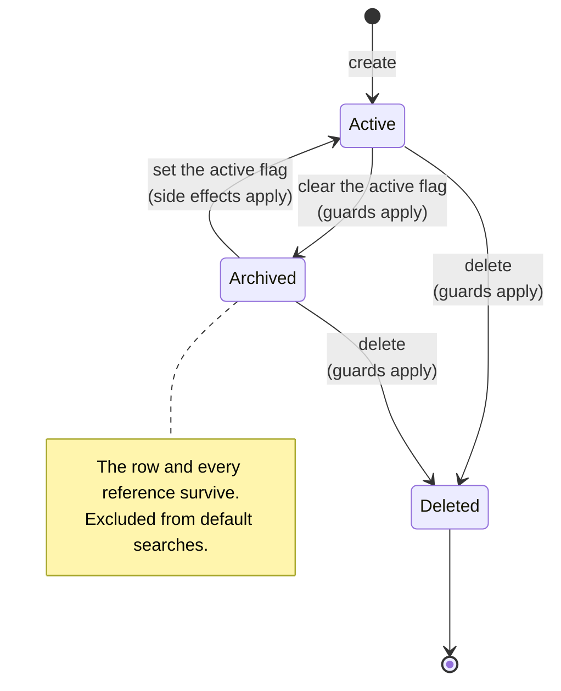
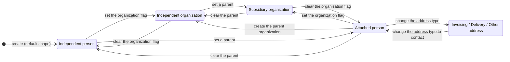
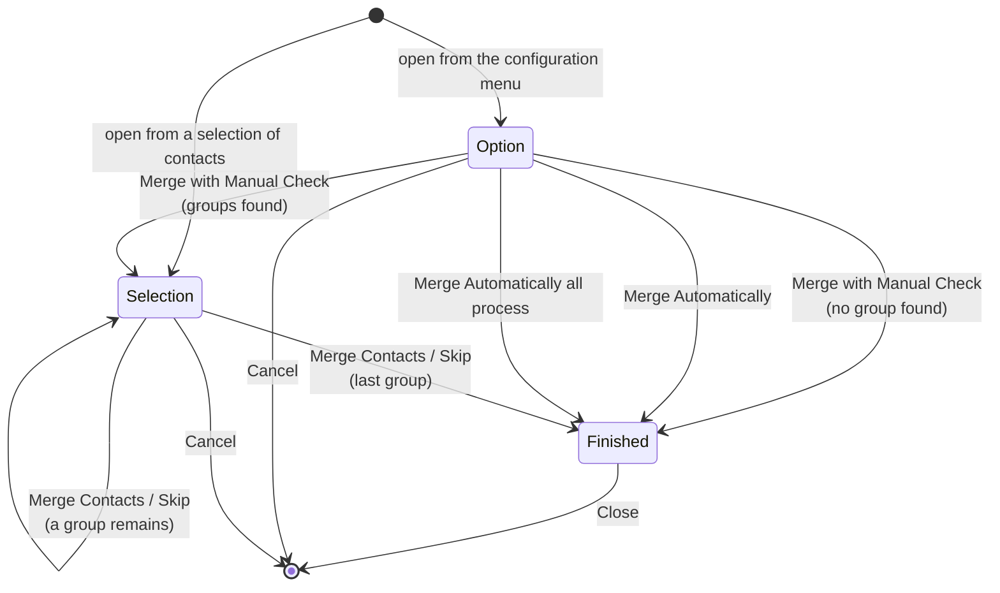
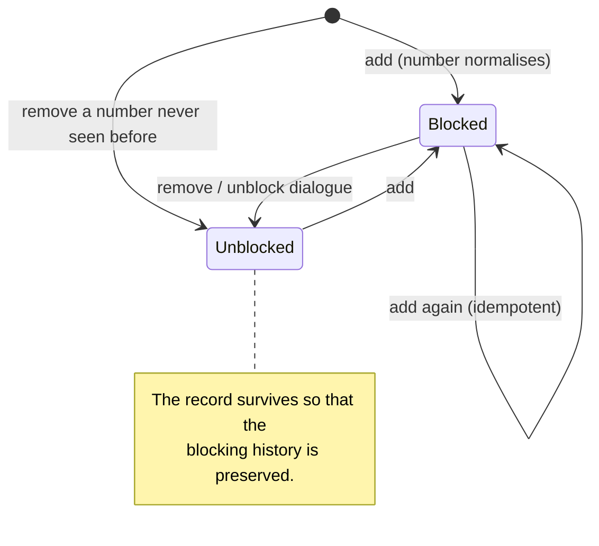
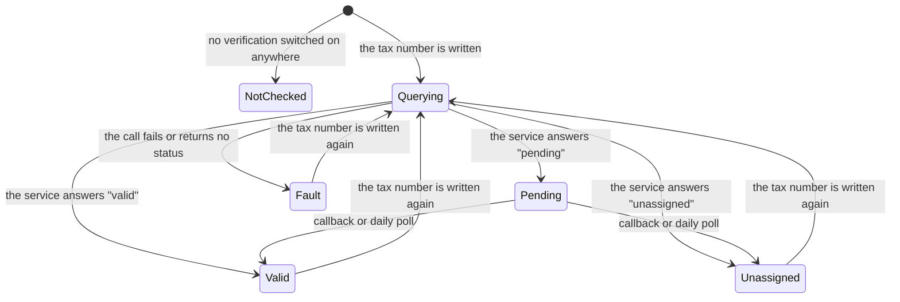

# State machines of the Contacts and Organizations domain

This domain is a master-data domain. It has no document that moves from draft to posted, and no
irreversible financial transition. What it does have is four genuine state machines, each with
states, guarded transitions and side effects:

1. the **archival lifecycle** shared by the Party, the Party Tag, the Industry, the Bank, the Bank
   Account, the Currency, the Language and the Company;
2. the **shape lifecycle** of a Party — the combination of the organization flag, the parent link
   and the address type, whose legal combinations and transitions are constrained;
3. the **merge wizard** lifecycle, which is a stored three-state field with explicit transitions;
4. the **blocked-number** lifecycle, which is an archival lifecycle with unusual create semantics
   and with its own message trail.

A fifth, the **tax-number verification** state, is a three-valued outcome fed by an external
service and is documented here because its transitions are asynchronous.

---

# 1. The archival lifecycle

## 1.1 States

| Value | Label | Meaning |
|---|---|---|
| active flag set | *(no visible label; the record simply appears)* | The record takes part in every default search, can be selected in reference fields, and can be modified. |
| active flag cleared | `Archived` (shown as a red ribbon on the form and as a filter in the search panel) | The record stays in the database with every reference intact, but is excluded from every default search and from every reference-field dropdown unless the caller explicitly disables the exclusion. |

There is no third state. A record is either active or archived; deletion removes the row and is a
separate operation, not a state.

## 1.2 Transitions

| From | To | Trigger | Guard conditions | Side effects |
|---|---|---|---|---|
| active | archived | writing the active flag to false, or the archive operation | **Party**: no active user account may be attached — see §1.3. **Company**: no active user may have this company as its own company. **Currency**: no Company may use this currency. **Language**: no active user and no active Party may use this language, and no user account at all (active or archived) may use it. | **Party**: none beyond the write. **Company**: every branch is archived too. **Language**: the user-defined default that sets the language of new parties is discarded for this language. **Bank Account**: none. |
| archived | active | writing the active flag to true, or the unarchive operation | none for the Party, the Tag, the Industry, the Bank or the Company | **Language**: the translations of every installed package are loaded for the language, and the short-code reassignment runs. **Currency**: the multi-currency security group is re-evaluated. |
| active or archived | deleted | the delete operation | **Party**: no user account may be attached. **Country** and **Country State**: no Party may reference them. **Language**: it must not be the base language, must not be the reader's own language, and must not be active. | **Bank Account**: the delete operation is *redefined* to archive instead — see §1.4. |

## 1.3 The Party archive guard

Clearing the active flag on a Party runs this guard before anything else:

1. Force a re-read of the attached user accounts (the reverse list is otherwise stale, because
   creating a user adds it to the list even when the user is inactive).
2. Search, with elevated rights, for **active** user accounts whose Party is one of the records
   being archived.
3. If none are found, the archive proceeds.
4. If some are found and the acting user has write access on user accounts, raise a redirecting
   warning: the message

   ```
   You cannot archive contacts linked to an active user.
   You first need to archive their associated user.

   Linked active users : <the display names of the users, separated by a comma and a space>
   ```

   together with an action that opens those user accounts and a button labelled `Go to users`.
5. If some are found and the acting user has **no** write access on user accounts, raise a plain
   validation failure:

   ```
   You cannot archive contacts linked to an active user.
   Ask an administrator to archive their associated user first.

   Linked active users :
   <the display names of the users, separated by a comma and a space>
   ```

Note the difference between the two: the second has a line feed instead of a space before the list.

## 1.4 The Bank Account exception

Deleting a Bank Account never deletes the row. The delete operation is replaced by an archive and
returns success. The reason is that posted accounting entries and sent payment files reference the
account, and losing the reference would break the audit trail. A separate operation exists that
archives the account and then asks the interface to reload the page, because archiving from within
an embedded list does not otherwise refresh the surrounding form.

## 1.5 Diagram



---

# 2. The shape lifecycle of a Party

A Party's *shape* is the triple (organization flag, parent link, address type). Not every triple is
reachable, and the transitions between shapes have side effects that are larger than anything else
in the domain.

## 2.1 States

| State | Organization flag | Parent | Address type | Commercial entity | Address behaviour |
|---|---|---|---|---|---|
| **Independent organization** | set | empty | `contact` | itself | owns its address |
| **Independent person** | clear | empty | `contact` | itself | owns its address |
| **Attached person** | clear | set | `contact` | the nearest organization ancestor, or the topmost record | shares the parent's address |
| **Subsidiary organization** | set | set | `contact` | itself | owns its address; does **not** share the parent's |
| **Invoicing address** | clear | set | `invoice` | as for an attached person | owns its address |
| **Delivery address** | clear | set | `delivery` | as for an attached person | owns its address |
| **Other address** | clear | set | `other` | as for an attached person | owns its address |
| **Orphan address** | clear | empty | `invoice`, `delivery` or `other` | itself | owns its address |

The orphan address is reachable — nothing forbids an address with no parent — and is the only
shape in which the name may legitimately be empty while the record has no relatives. The database
check constraint only requires a name for the `contact` type.

## 2.2 Transitions

| From | To | Trigger | Guard | Side effects |
|---|---|---|---|---|
| Independent person | Attached person | set the parent | the new parent must not be a descendant (no cycle); the parent's company must be compatible | the free-text company name is cleared; the commercial fields are inherited from the new commercial entity and pushed on to this record's own descendants; the parent's address is inherited if the parent has one; the commercial entity and the commercial company name are recomputed on this record and on every descendant; every stored complete name in the subtree is recomputed; the salesperson is inherited if this record has none and it is a person |
| Attached person | Independent person | clear the parent | none | the commercial entity becomes the record itself; the commercial company name falls back to the free-text company name, which is empty, so the complete name loses its prefix and may become just a comma and the name; the address is **not** cleared — the record keeps the copy it inherited |
| Independent person | Independent organization | set the organization flag | the acting user must belong to the contact-creation group, otherwise the flag is written with elevated rights on their behalf | the commercial entity is unchanged (it was already itself); the complete name loses its prefix if it had one |
| Attached person | Subsidiary organization | set the organization flag | as above | the commercial entity becomes the record itself; the whole subtree's commercial entity is recomputed; the subtree stops inheriting the group's commercial fields (but keeps the values it already has — nothing is erased); the complete name loses its prefix |
| Subsidiary organization | Attached person | clear the organization flag | as above | the commercial entity becomes the parent's; the commercial fields of the new commercial entity are **not** automatically pushed at this moment, because the push is triggered by a parent change, not by an organization-flag change — the values stay as they were until the commercial entity's fields are next written |
| Attached person | Invoicing / Delivery / Other address | change the address type | none | the record stops taking part in address synchronization in both directions; its address is frozen at whatever it currently holds; it may now have an empty name |
| Invoicing / Delivery / Other address | Attached person | change the address type to `contact` | the name must be non-empty, enforced by the database check constraint | the parent's address is inherited immediately (the synchronization's upstream step fires on a type change to `contact`), overwriting whatever the address held |
| Attached person | Independent organization | the "create the parent organization" operation | the free-text company name must be non-empty | a new organization is created carrying the free-text name, this record's tax registration number and a copy of this record's address; this record is re-parented under it; every child of this record is re-parented under it as well |
| any | *(merged away)* | the merge operation | see [business-rules.md](business-rules.md) §10 | every reference is rewritten; the record is deleted |

## 2.3 The forbidden transition

A Party may **never** acquire a parent that is one of its own descendants. The validation runs on
every write of the parent and fails with `You cannot create recursive Partner hierarchies.` The
same rule, with a different message, protects the Party Tag tree
(`You can not create recursive tags.`) and, structurally, the Company tree — although the Company
forbids *any* change of parent, not merely a cycling one.

## 2.4 Diagram



---

# 3. The merge wizard lifecycle

## 3.1 States

| Value | Label | Meaning |
|---|---|---|
| `option` | `Option` | The starting state when the wizard is opened from the configuration menu. The operator chooses the grouping criteria, the exclusion filters and the maximum number of groups. |
| `selection` | `Selection` | A concrete group of parties is on screen; the operator chooses the destination and either merges or skips. This is also the starting state when the wizard is opened from a selection of parties. |
| `finished` | `Finished` | There are no more groups to treat. The screen shows a message and a button that reopens the wizard from scratch. |

The state is stored, read-only and required, with the default `option`.

## 3.2 Transitions

| From | To | Trigger operation | Guard conditions | Side effects |
|---|---|---|---|---|
| *(none)* | `selection` | opening the wizard with a selection of parties already made | the selection context must name the Party entity and be non-empty | the selected parties become the wizard's party list, and the destination is defaulted to the oldest active one |
| `option` | `selection` | `Merge with Manual Check` | at least one grouping criterion must be chosen, otherwise the operation fails with `You have to specify a filter for your selection.` | the grouping query runs; one Merge Group is created per surviving candidate group; the group count is stored; the first group is loaded and its destination defaulted |
| `option` | `finished` | `Merge with Manual Check` when the query finds no group | the same criterion guard | the group count is stored as zero; the state moves straight to `finished` because the next-screen step finds no groups |
| `option` | `finished` | `Merge Automatically` | the same criterion guard; the operation is confirmed by the operator with the question `Are you sure to execute the automatic merge of your contacts?` | the grouping query runs; then every group is merged in turn, each group being deleted and the transaction committed after each merge; finally the state is set to `finished` |
| `option` | `finished` then `selection` | `Merge Automatically all process` | the same criterion guard; confirmed with `Are you sure to execute the list of automatic merges of your contacts?` | the parent-migration pass runs to completion; then a brand-new wizard is created with the criteria "tax registration number, electronic mail address and name" and its automatic process is run; then every Party that has a parent and the organization flag set has that flag cleared; finally the next-screen step runs on the original wizard |
| `selection` | `selection` | `Merge Contacts` | the party list must be non-empty; the five safety checks of [business-rules.md](business-rules.md) §10 must pass | the merge is performed; the current group is deleted; the next group is loaded |
| `selection` | `finished` | `Merge Contacts` when it was the last group | as above | as above, but the next-screen step finds no group and moves to `finished` |
| `selection` | `selection` | `Skip these contacts` | none | the current group is deleted without merging; the next group is loaded |
| `selection` | `finished` | `Skip these contacts` when it was the last group | none | as above |
| `selection` | `finished` | `Merge Contacts` with an empty party list | none | the state is set directly to `finished` and the wizard is redisplayed |
| any | *(closed)* | `Cancel` (in `option` and `selection`) or `Close` (in `finished`) | none | the wizard record is discarded |

## 3.3 The next-screen step

Every transition that treats one group ends by running the same step:

1. Invalidate the whole in-memory cache.
2. If any group remains:
   - the current group becomes the first remaining one;
   - the party list becomes that group's identifiers;
   - the destination becomes the oldest active Party of that group;
   - the state becomes `selection`.
3. Otherwise:
   - the current group is cleared;
   - the party list is emptied;
   - the state becomes `finished`.
4. Write those values and return a window action that reopens the wizard as a modal on the same
   record.

## 3.4 Diagram



---

# 4. The blocked-number lifecycle

## 4.1 States

| Value | Label | Meaning |
|---|---|---|
| active flag set | *(the number appears in the blocked list)* | Automated messages to this number are suppressed. |
| active flag cleared | `Archived` | The number is *not* blocked, but the record survives so that the history of blocking and unblocking is preserved. |

Both the number and the active flag are tracked, so every transition leaves an entry in the
record's message history.

## 4.2 Transitions

| From | To | Trigger | Guard | Side effects |
|---|---|---|---|---|
| *(none)* | active | the add operation, or a direct create with the active flag defaulted | the number must normalise into the strict international form, otherwise the operation fails with `<the underlying formatting error> Please correct the number and try again.` | the number is stored normalised; when the caller supplied a reason, that reason is posted as an internal note on the new record |
| archived | active | the add operation on a number that already exists but is inactive | the same normalisation guard | the record is reactivated rather than duplicated; when a reason was supplied, it is set as the log message of the tracking entry rather than posted separately |
| active | active | the add operation on a number that is already active | the same normalisation guard | nothing is created; the existing record is returned; a supplied reason becomes the log message of the tracking entry |
| active | archived | the remove operation, or the unblock dialogue | none | the record is archived; when a reason was supplied it becomes the log message of the tracking entry |
| *(none)* | archived | the remove operation on a number that has never been blocked | the same normalisation guard | a record is created **with the active flag cleared**, so that the unblocking itself is recorded; a supplied reason is posted as an internal note |

## 4.3 The batch create semantics

The create operation is deliberately idempotent and order-preserving. Given a list of value maps:

1. Normalise every number. A number that cannot be normalised aborts the whole batch.
2. Collapse duplicates within the batch, keeping the first occurrence.
3. Search, with archived records included, for records whose number is among those requested.
4. Compute the set of requested numbers that the caller explicitly asked to stay inactive, narrowed
   to those that already exist.
5. Reactivate every existing record that is inactive and is not in that set.
6. Create only the numbers that do not exist at all.
7. Return the records in the order the caller listed the numbers, existing and created alike.

## 4.4 Diagram



---

# 5. The tax-number verification state

Supplied by the tax-number behaviour. It is not a stored selection but a true/false flag driven by
a three-valued external answer, and its transitions are asynchronous.

## 5.1 The external answers

| Answer | Stored flag | Message written to the Party's history |
|---|---|---|
| `valid` | set | `The Intra-Community validity has been updated to: valid.` |
| `unassigned` | cleared | `The Intra-Community validity has been updated to: unassigned.` |
| `pending` | cleared | `The VIES check is pending. The status will be updated soon.` |
| `fault` | cleared | `The VIES check failed. Please check the Tax ID manually.` |

The message is written for every Party in the set that has a persisted identifier.

## 5.2 Transitions

| From | To | Trigger | Guard | Side effects |
|---|---|---|---|---|
| *(unset)* | queried | the tax registration number is written | at least one Company in the database must have verification switched on; otherwise the flag is simply cleared and no call is made | the flag is set from the service's answer; a history entry is written |
| queried | inherited | the tax registration number is written on a Party whose parent carries the **same** number | the parent must exist and its number must be identical | no call is made; the flag is copied from the parent |
| `pending` | `valid` or `unassigned` | the service calls back on the published endpoint with a signed token | the token must verify against the recorded signature and must not have expired (the signature is valid for seven days) | every Party whose tax registration number equals the one named in the token has its flag updated and a history entry written |
| `pending` | `valid` or `unassigned` | the daily scheduled job polls the service for updates | none | the answers are grouped by tax registration number and applied to every Party carrying that number |
| any | suppressed | an import is running | the reading context carries the import flag | the flag's computation is removed from the queue entirely, so importing a large file never calls the service |

## 5.3 Diagram



---

# 6. States that do **not** exist

A rebuild must not invent them.

- There is **no** approval state on a Party. A Party is usable the moment it exists.
- There is **no** draft state on a Bank Account. An account is usable the moment it exists, subject
  only to the outgoing-payment permission flag, which is a permission and not a state.
- There is **no** verification state on a bank account number in the foundation package. The
  account type is derived from the number's shape, not from a workflow.
- There is **no** publication workflow on a Party's public page. The published flag is a single
  true/false, tracked, with two message subtypes so that the change appears in the history — but
  nothing gates the transition.
- There is **no** lifecycle on a Country, a Country State, a Country Group, a City or an Industry
  beyond the archival flag (and the Country, the Country State and the Country Group have no
  archival flag at all).
