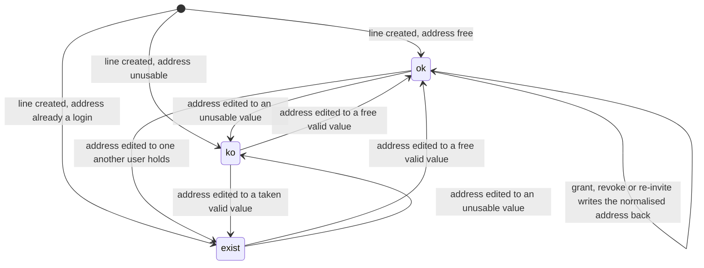
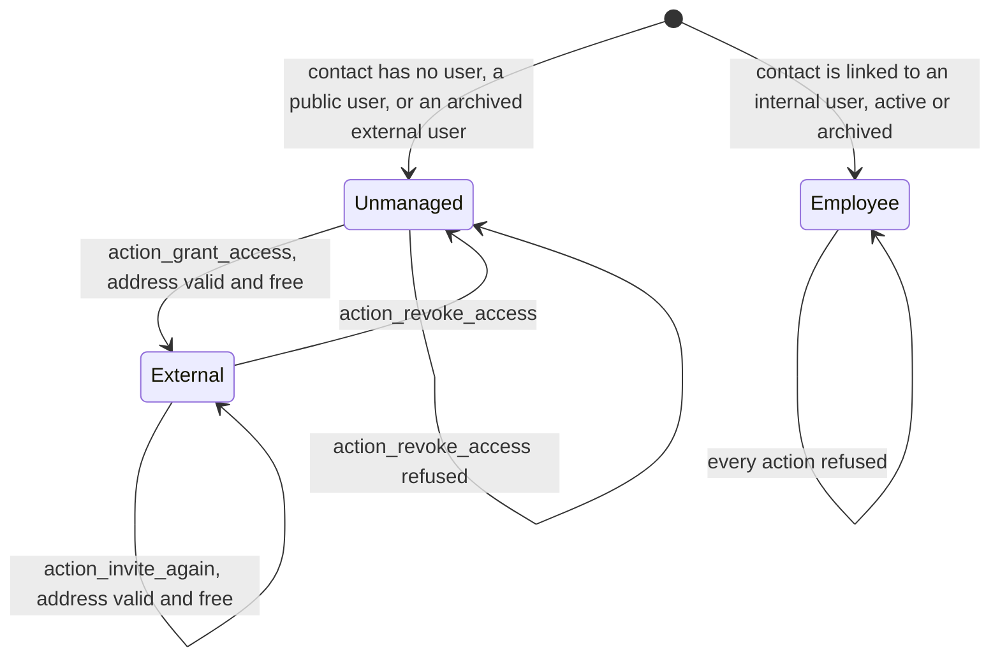
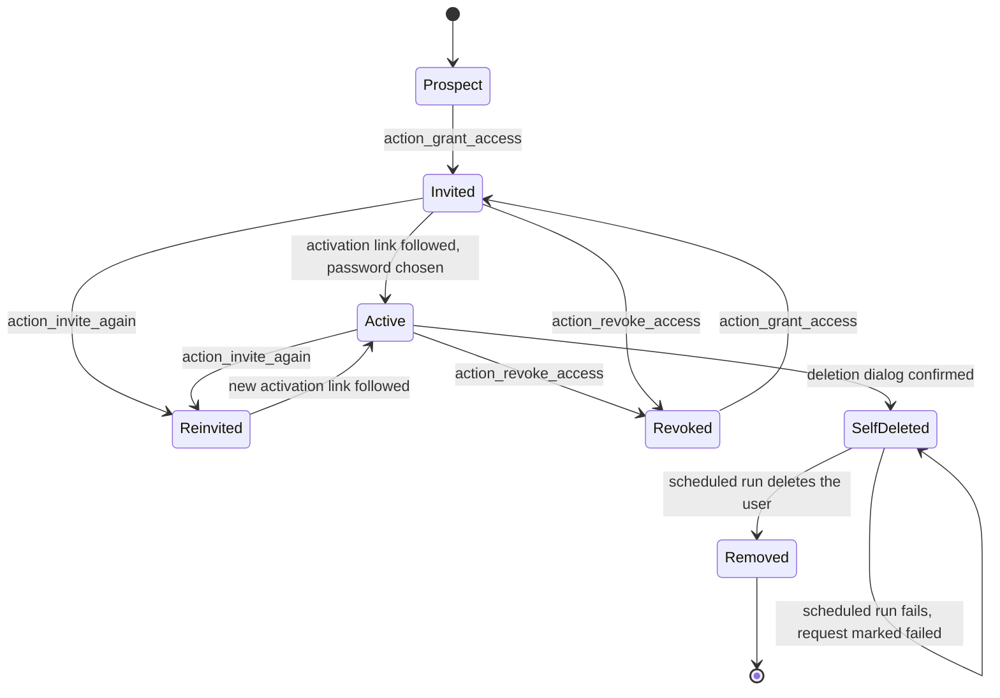
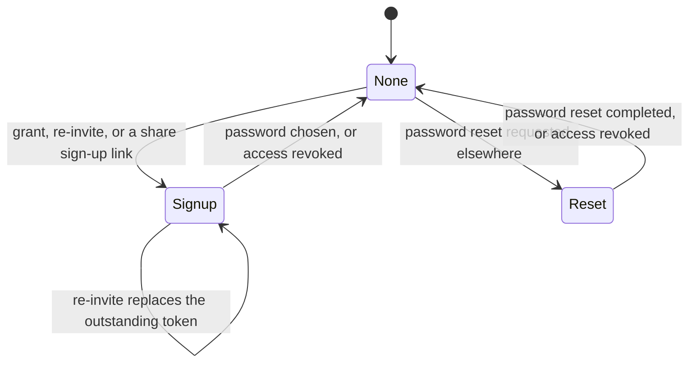
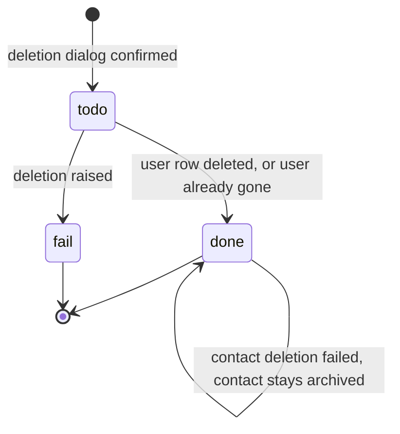
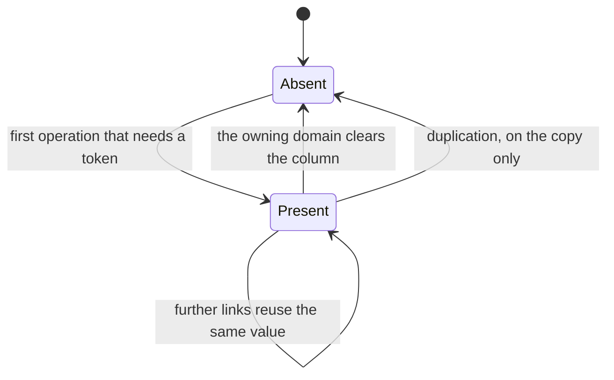
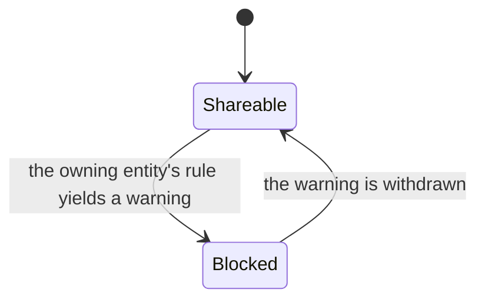
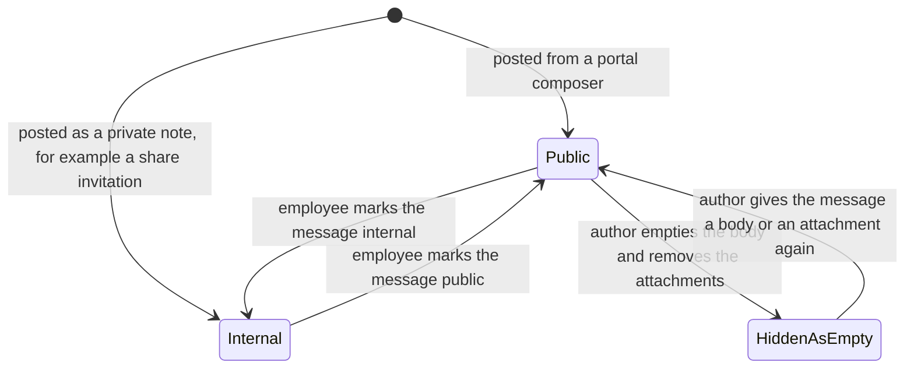
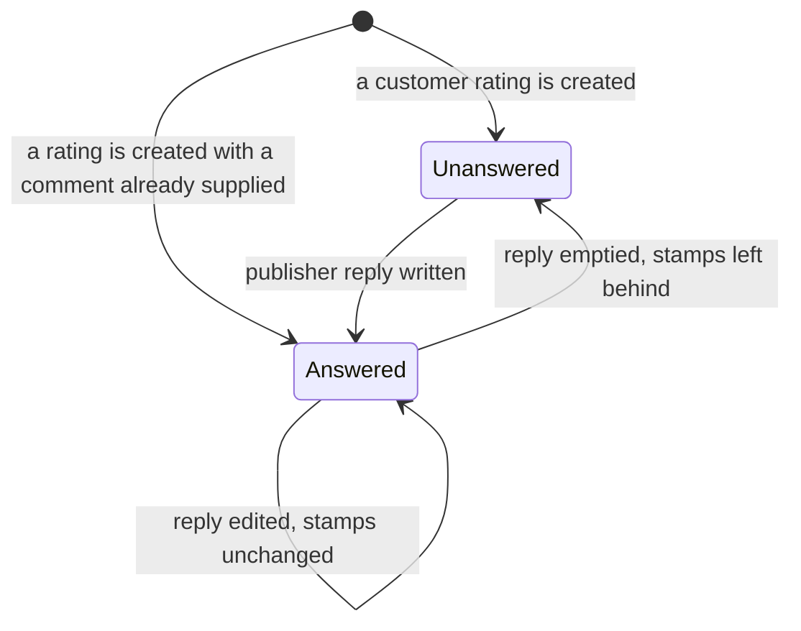
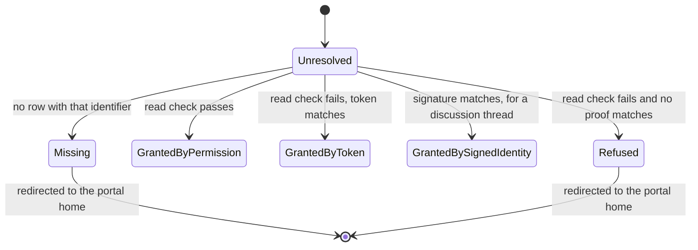

# State machines of the Customer Portal

Every state field this domain owns or drives, with its stored values, its labels, the meaning of each
state, the complete transition table, the guards of each transition in the order they are evaluated
with the exact refusal message, and a diagram.

The Customer Portal stores only one declared selection field of its own — the address validity of an
invitation line. Everything else it drives is a state carried on a record owned by another domain: a
User's activity and group membership, a Contact's outstanding-token marker, a User Deletion Request,
a document's security token, a Message's internal marker, a Rating's publisher reply. Those machines
are specified here because this domain is the only place that moves them, and a rebuild that
implemented the portal without them would produce a different observable system.

Two of the machines below are **derived**: their state is not stored but recomputed from other
records every time the record is read. A derived machine still has states, transitions and guards; it
differs only in that a transition is caused by a change in the records it derives from rather than by
a write on the machine's own column. Each such machine says so at its head.

Conventions used in the tables:

- **From** and **To** name states by their stored value where one exists, and by their name where the
  machine is derived.
- **Trigger** names the operation, using the reproduced operation identifier where the operation is a
  named button or an extension point.
- **Guards** are listed in evaluation order. The first guard that fails stops the transition, leaves
  every record untouched and produces the message shown.
- **Side effects** list every record created or changed.

Cross-references: the rule identifiers `PORT-RULE-nnn` are defined in
[business-rules.md](business-rules.md); the procedures that move these machines are in
[workflows.md](workflows.md); the fields are specified in [entities.md](entities.md); the scenarios
that verify them are in [acceptance-criteria.md](acceptance-criteria.md).

---

## 1. Address validity of an invitation line

**Entity**: Portal Access Wizard User (`portal.wizard.user`).
**Field**: `email_state`, labelled `Status`.
**Kind**: computed, not stored, default `ok`, recomputed for the whole set of lines of the dialog at
once whenever any line's `email` changes.
**Purpose**: tell the Contact manager, before anything is written, whether the address typed on a
line can become the login of an external user.

### 1.1 States

| Stored value | Label | Meaning | What the dialog shows |
|---|---|---|---|
| `ok` | `Valid` | The address normalises to a single valid address, and no user other than the line's own linked user already holds that address as a login. | A green check mark, with the tooltip `Valid Email Address`. The buttons `Grant Access` and `Re-Invite` become available (subject to the access state of section 2). |
| `ko` | `Invalid` | The address is empty, or does not normalise to a single valid address. | A red cross, with the tooltip `Invalid Email Address`. Neither `Grant Access` nor `Re-Invite` is shown. |
| `exist` | `Already Registered` | The address normalises correctly, but a **different** user already holds it as a login; archived users count. | A red struck-through person, with the tooltip `Email Address already taken by another user`. Neither `Grant Access` nor `Re-Invite` is shown. |

The three icon buttons are real, enabled controls rather than plain icons, because a disabled control
does not raise the pointer events that show a tooltip. Pressing one runs `action_refresh_modal`,
which reopens the dialog and changes nothing (`PORT-RULE-033`).

**Normalisation** of an address means: trim it; when it has the display form `Name <local@domain>`,
keep the part between the angle brackets; lowercase the domain part; yield nothing when the result is
not a single syntactically valid address.

### 1.2 Transition table

The whole set of lines is recomputed in one pass, so a single trigger can move several lines at once.

| From | To | Trigger | Guards, in order | Side effects |
|---|---|---|---|---|
| (line does not exist) | `ko` | The line is created by the derivation of `user_ids` from `partner_ids`, and the Contact has no address or an unusable one | The address does not normalise | None. |
| (line does not exist) | `ok` | The same derivation, when the Contact's address normalises and is free | 1. The address normalises. 2. No candidate user satisfies `_is_portal_similar_than_user` | None. |
| (line does not exist) | `exist` | The same derivation, when the Contact's address normalises but is taken | 1. The address normalises. 2. Some candidate user satisfies `_is_portal_similar_than_user` | None. |
| any | `ko` | The Contact manager edits `email` on any line of the dialog | The edited line's address does not normalise | None; the icon changes. |
| any | `ok` | The same edit | 1. The address normalises. 2. No candidate satisfies the already-registered test, including the per-website narrowing of `PORT-RULE-175` when the Website and Storefront capability package is installed | None; the icon changes. |
| any | `exist` | The same edit | 1. The address normalises. 2. A candidate satisfies the already-registered test | None; the icon changes. |
| `ok` | `ok` | `action_grant_access`, `action_revoke_access` or `action_invite_again` succeeds and writes the normalised address back onto the Contact (`PORT-RULE-004`) | None | The Contact's `email` becomes the normalised address; the dialog is reopened and every line is recomputed. |
| any | any | `action_refresh_modal` | None | The dialog is reopened; the recomputation runs again and may change the state if the user table changed meanwhile. |

### 1.3 The guards in detail, with their messages

The state itself never refuses anything: it is a computed value. The refusals happen when an action
is pressed on a line whose state is not `ok`. They are evaluated in this order, before any other
guard of the action (`PORT-RULE-002`, `PORT-RULE-003`):

| Order | Condition | Message |
|---|---|---|
| 1 | `email_state` is `ko` | `The contact "%s" does not have a valid email.` The placeholder is the Contact's name. |
| 2 | `email_state` is `exist` | `The contact "%s" has the same email as an existing user` The placeholder is the Contact's name. The message carries no final full stop; reproduce it exactly. |

The candidate search that decides between `ok` and `exist` is specified as three extension points in
[entities.md](entities.md) sections 4.3.9 to 4.3.11, with the per-website override in section 4.6 and
worked numbers in [calculations.md](calculations.md) section 7.

### 1.4 Diagram

---

## 2. Access state of an invitation line

**Entity**: Portal Access Wizard User (`portal.wizard.user`).
**Fields**: the pair `is_portal` and `is_internal`, both computed from `user_id`, `user_id.active`
and `user_id.group_ids`.
**Kind**: derived. The state is a property of the linked User, surfaced on the line.
**Purpose**: decide which of the three action buttons a line offers, and refuse an action that does
not match the line's situation.

### 2.1 States

| State | `is_portal` | `is_internal` | Meaning | Buttons offered |
|---|---|---|---|---|
| Unmanaged | false | false | The Contact has no user at all, or its user is archived and was an external user, or its user holds only the public group. | `Grant Access`, when `email_state` is `ok`. |
| External | true | false | The Contact has a user that is active and is an external user. | `Revoke Access`; and `Re-Invite` when `email_state` is `ok`. |
| Employee | false | true | The Contact has a user that is an employee, **whether that user is active or archived**. | None. A disabled marker labelled `Internal User` is shown instead, with the tooltip `This partner is linked to an internal User and already has access to the Portal.` The `email` cell of the line is read-only. |

The combination `is_portal` true and `is_internal` true cannot occur: the derivation tests for an
employee first and, when that test succeeds, forces `is_portal` to false. An archived employee stays
in the Employee state deliberately, so that an account that was internal is never silently recycled
as an external one; restoring it belongs to the user administration screens of
[Identity and Access](../identity-and-access/README.md).

### 2.2 Transition table

| From | To | Trigger | Guards, in order | Side effects |
|---|---|---|---|---|
| Unmanaged (no linked user) | External | `action_grant_access` | 1. `email_state` is not `ko`. 2. `email_state` is not `exist`. 3. The line is not already External or Employee | The normalised address is written onto the Contact when it differs; a User is created from the portal user template in the Contact's company, or in the acting company when the Contact has none, with `login` and `email` set to the normalised address, `partner_id` set to the Contact, `company_id` set to the chosen company and `company_ids` set to exactly that company; the portal group is added and the public group removed; the Contact's `signup_type` becomes `signup`; the invitation message is sent immediately; the dialog is reopened. |
| Unmanaged (linked user exists, public or archived external) | External | `action_grant_access` | The same three guards | The normalised address is written onto the Contact when it differs; the existing User is written with `active` true, the portal group added and the public group removed; the Contact's `signup_type` becomes `signup`; the invitation message is sent; the dialog is reopened. |
| External | External | `action_invite_again` | 1. `email_state` is not `ko`. 2. `email_state` is not `exist`. 3. The line is External | The normalised address is written onto the Contact when it differs; the Contact is prepared for sign-up again, which replaces the outstanding token and stops the previous activation link from working; the invitation message is sent again; the dialog is reopened. |
| External | Unmanaged | `action_revoke_access` | The line is External | The normalised address is written onto the Contact when it differs; the Contact's `signup_type` is cleared; the linked User is archived when it exists and is an external user. The portal group is **kept** (`PORT-RULE-007`). No message is sent. The dialog is reopened. |
| External | External | `action_grant_access` | Fails at guard 3 | Nothing is written; refusal message below. |
| Employee | Employee | `action_grant_access` | Fails at guard 3 | Nothing is written; refusal message below. |
| Unmanaged | Unmanaged | `action_revoke_access` | Fails | Nothing is written; refusal message below. |
| Employee | Employee | `action_revoke_access` | Fails | Nothing is written; the same refusal as the previous row. |
| Unmanaged | Unmanaged | `action_invite_again` | Fails at guard 3 | Nothing is written; refusal message below. |
| Employee | Employee | `action_invite_again` | Fails at guard 3 | Nothing is written; the same refusal as the previous row. |
| any | unchanged | `action_refresh_modal` | None | The dialog is reopened and every line is recomputed. |

### 2.3 The guards in detail, with their messages

**`action_grant_access`**, in order:

| Order | Condition that fails | Message | Rule |
|---|---|---|---|
| 1 | `email_state` is `ko` | `The contact "%s" does not have a valid email.` | `PORT-RULE-002` |
| 2 | `email_state` is `exist` | `The contact "%s" has the same email as an existing user` | `PORT-RULE-003` |
| 3 | `is_portal` is true, or `is_internal` is true | `The partner "%s" already has the portal access.` | `PORT-RULE-001` |

**`action_revoke_access`**, in order:

| Order | Condition that fails | Message | Rule |
|---|---|---|---|
| 1 | `is_portal` is false | `The partner "%s" has no portal access or is internal.` | `PORT-RULE-006` |

**`action_invite_again`**, in order:

| Order | Condition that fails | Message | Rule |
|---|---|---|---|
| 1 | `email_state` is `ko` | `The contact "%s" does not have a valid email.` | `PORT-RULE-002` |
| 2 | `email_state` is `exist` | `The contact "%s" has the same email as an existing user` | `PORT-RULE-003` |
| 3 | `is_portal` is false | `You should first grant the portal access to the partner "%s".` | `PORT-RULE-008` |

In every one of these messages the placeholder is the Contact's name. Two further refusals can occur
**after** the guards have passed, while the transition is being carried out:

| Condition | Message | Rule |
|---|---|---|
| The system parameter that names the portal user template does not resolve to an existing user | `Signup: invalid template user` | Raised by [Identity and Access](../identity-and-access/README.md) during `_create_user`. |
| The shipped invitation template cannot be resolved | `The template "Portal: new user" not found for sending email to the portal user.` | `PORT-RULE-009` |

Both leave the transaction to be rolled back: a failure at the second one has already created the
User and set the groups, so the surrounding transaction must undo them.

### 2.4 Diagram

---

## 3. Lifecycle of an external user account

**Entities**: User (`res.users`), Contact (`res.partner`), User Deletion Request
(`res.users.deletion`), all owned by [Identity and Access](../identity-and-access/README.md).
**State carriers**: the User's `active` flag and group membership, the Contact's `signup_type`, and
the existence of a User Deletion Request.
**Kind**: composite; there is no single stored column. This machine is the reason the invitation
dialog and the account deletion page exist, so it is specified here in full.

### 3.1 States

| State | How it is recognised | Meaning |
|---|---|---|
| Prospect | No User is linked to the Contact. | A person the operating company knows but who cannot sign in. |
| Invited | A User exists, `active` is true, the portal group is held, the public group is not, the Contact's `signup_type` is `signup`, and the User has never signed in (`login_date` empty). | An invitation has been sent and the activation link is outstanding. |
| Active | A User exists, `active` is true, the portal group is held, the Contact's `signup_type` is empty, and `login_date` carries a value. | The person has set a password and can sign in. |
| Re-invited | Same as Invited, but `login_date` may already carry a value. | A fresh activation link has been issued; the previous one no longer resolves. |
| Revoked | A User exists, `active` is false, the portal group is still held, the Contact's `signup_type` is empty. | The person cannot sign in. Their identity and their history are intact. |
| Self-deleted | A User exists, `active` is false, `login` starts with `__deleted_user_`, the stored password is the empty string, the User holds no application key, the Contact is archived, and one User Deletion Request in state `todo` names the User. | The person asked for their account to be removed; the account is already unusable and the removal is queued. |
| Removed | No User row; the Contact row is gone as well, or is still present and archived. | The scheduled run has processed the queue. |

### 3.2 Transition table

| From | To | Trigger | Guards, in order | Side effects |
|---|---|---|---|---|
| Prospect | Invited | `action_grant_access` on an invitation line | The three guards of section 2.3 | A User is created from the portal user template; the portal group is added, the public group removed; `signup_type` becomes `signup`; the invitation message is sent immediately with the tracking medium `portalinvite`. |
| Revoked | Invited | `action_grant_access` on the same line later | The same guards; the line is Unmanaged again because the User is archived | The User is written with `active` true; the portal group is re-asserted and the public group removed; `signup_type` becomes `signup`; a new invitation is sent. |
| Invited | Active | The person opens the activation link and chooses a password | 1. The token resolves a Contact. 2. The Contact's latest authentication moment, its list of users and its `signup_type` still match the values captured when the token was produced. 3. The token has not expired: the sign-up window, one hundred and forty-four hours by default, or the reset window, four hours by default | The password is written on the User; `signup_type` is cleared; the person is signed in and, because they are not an employee, redirected to `/my` (`PORT-RULE-040`). |
| Invited | Re-invited | `action_invite_again` | The three guards of section 2.3 | The Contact is prepared for sign-up again; a new token payload replaces the previous one; a new invitation message is sent. The previous activation link stops resolving. |
| Active | Re-invited | `action_invite_again` | The same guards | The same side effects. The person can still sign in with their existing password while the new link is outstanding. |
| Active | Revoked | `action_revoke_access` | `is_portal` is true | `signup_type` is cleared; the User is archived. The portal group is kept. No message is sent. Existing sessions stop working at the next request because the User is inactive. |
| Invited | Revoked | `action_revoke_access` | `is_portal` is true | The same side effects; the outstanding activation link stops resolving, because its payload names the Contact's `signup_type` and the list of its users. |
| Active | Self-deleted | The person confirms the account deletion dialog at `/my/deactivate_account` | 1. The typed confirmation equals the person's `login`, otherwise `PORT-RULE-130`. 2. The supplied password passes an interactive credential check, otherwise `PORT-RULE-131`. 3. Every user in the set is an external user, otherwise `PORT-RULE-132` | A note is logged on the Contact; the block-list candidates are collected when the choice was ticked; `login` becomes `__deleted_user_<identifier>_<seconds since the start of 1970 with a fraction>` and the stored password becomes the empty string; every application key is revoked; an audit line records the login, the identifier and the caller's network address; the User is archived as the system robot user, a failure being swallowed; the Contact is archived, a failure being swallowed; one User Deletion Request is created in state `todo`; the collected addresses are added to the electronic mail block list and the collected numbers to the telephone block list; the session is closed and the browser is sent to the sign-in page with the message `Account deleted!`. |
| Self-deleted | Removed | The daily scheduled run processes the queue | The request is in `todo` and its row lock is obtained | The User row is deleted; the Contact row is deleted when nothing references it; the request becomes `done`. |
| Self-deleted | Self-deleted | The daily scheduled run fails to delete the User | None | The work is rolled back, an error line is written and the request becomes `fail`. The account stays archived and renamed for ever, because the run only ever searches for `todo`. |

### 3.3 What cannot happen

| Attempted move | Why it is impossible |
|---|---|
| Employee to External through the invitation dialog | Guard 3 of `action_grant_access` refuses with `The partner "%s" already has the portal access.` |
| Revoked to Active without a new invitation | The activation token was invalidated when `signup_type` was cleared, and the User is archived. |
| Self-deleted to Active | The stored password is the empty string, which no credential check can satisfy, and the login no longer matches anything the person knows. |
| Removed to any other state | The User row no longer exists. |
| External user in both the portal group and the public group | The grant adds the portal group and removes the public group in the same write (`PORT-RULE-173`). |

### 3.4 Diagram

---

## 4. The outstanding-token marker on a Contact

**Entity**: Contact (`res.partner`), owned by
[Contacts and Organizations](../contacts-and-organizations/README.md); the field belongs to the
sign-up capability of [Identity and Access](../identity-and-access/README.md).
**Field**: `signup_type`.
**Purpose**: say which kind of token is outstanding for the Contact. The value is part of the payload
of the token itself, which is why changing it invalidates every outstanding link.

### 4.1 States

| Stored value | Label | Meaning |
|---|---|---|
| (empty) | — | No token is outstanding. Any link previously issued for this Contact no longer resolves. |
| `signup` | Sign Up | An invitation to create the password of a new account is outstanding. |
| `reset` | Reset Password | A password-reset link is outstanding. This domain never sets this value; it is listed because clearing the marker on revocation cancels a reset link as well as an invitation link. |

### 4.2 Transition table

| From | To | Trigger | Guards | Side effects |
|---|---|---|---|---|
| any | `signup` | `action_grant_access` succeeds | The guards of section 2.3 | The token payload is regenerated from the Contact identifier, the list of its users, its latest authentication moment and the new marker. Any previously issued link stops resolving. |
| any | `signup` | `action_invite_again` succeeds | The guards of section 2.3 | The same. |
| any | `signup` | The share wizard sends a sign-up link to a recipient with no account, and free sign-up is enabled | The recipient has no user; the parameter `auth_signup.invitation_scope` is `b2c` | A token is produced and embedded in the personal link posted to that recipient. |
| `signup` or `reset` | (empty) | The person completes the sign-up or the reset | The token validated | The password is written; the marker is cleared. |
| `signup` or `reset` | (empty) | `action_revoke_access` succeeds | `is_portal` is true | The outstanding link stops resolving. |
| (empty) | `reset` | A password reset is requested | Owned by [Identity and Access](../identity-and-access/README.md) | Not driven by this domain. |

### 4.3 Diagram

---

## 5. User Deletion Request

**Entity**: User Deletion Request (`res.users.deletion`), owned by
[Identity and Access](../identity-and-access/README.md). The Customer Portal is the only place that
creates one.
**Field**: `state`, labelled `State`, required, default `todo`.
**Processed by**: the daily scheduled job, in batches of fifty.

### 5.1 States

| Stored value | Label | Meaning |
|---|---|---|
| `todo` | `To Do` | The removal is queued and has not been attempted, or the run that attempted it did not reach it. |
| `done` | `Done` | The User row has been deleted, or the User had already disappeared by other means. The Contact may or may not have been deleted with it. |
| `fail` | `Failed` | The removal of the User raised. The request is never picked up again, because the run searches only for `todo`. |

### 5.2 Transition table

| From | To | Trigger | Guards, in order | Side effects |
|---|---|---|---|---|
| (none) | `todo` | The account deletion dialog is confirmed | The three guards of the deletion dialog (`PORT-RULE-130`, `PORT-RULE-131`, `PORT-RULE-132`) | One request per user in the set, naming the User. |
| `todo` | `done` | The scheduled run starts and the request's User no longer exists | The `user_id` link is empty | The request is marked done before the batch is cut; the count of such requests is reported as immediate progress and the rest as remaining work. |
| `todo` | `todo` | The scheduled run reaches a request another run has already taken | The row lock is obtained but the state is no longer `todo` | The request is skipped. |
| `todo` | `done` | The scheduled run deletes the User successfully | 1. The request is among the first fifty of the remaining ones. 2. The exclusive row lock is obtained. 3. The state is still `todo` | The User row is deleted; an audit line records the identifier, the name and the name of the person who asked; one unit of progress is reported; the Contact deletion is attempted next. |
| `todo` | `fail` | The scheduled run cannot delete the User | The same three guards passed and the deletion raised | The work of the request is rolled back; an error line records the identifier, the name, the requester and the error; one unit of progress is reported; the run continues with the next request when its time budget allows and stops otherwise. |
| `done` | `done` | The Contact deletion that follows a successful User deletion fails | None | The work of that step is rolled back; a warning line records the identifier, the name, the requester and the error; the Contact stays archived; the run stops when its budget is exhausted. |

### 5.3 Guards and their absence of messages

This machine raises no user-facing message: it runs unattended. Its outcomes are visible only in the
audit trail and in the stored state. That is deliberate — the person who asked for the deletion has
already been signed out and told `Account deleted!`, and the account is already unusable whatever the
queue does afterwards.

### 5.4 Diagram

---

## 6. The security token of a document

**Entity**: every entity that adopts the Portal Access Mixin (`portal.mixin`).
**Field**: `access_token`, labelled `Security Token`, not copied when a record is duplicated.
**Purpose**: a per-record secret whose holder may read the record without holding a permission.

### 6.1 States

| State | How it is recognised | Meaning |
|---|---|---|
| Absent | `access_token` is empty | No link issued for this record can prove access. Every share address that includes a token creates one before it is built. |
| Present | `access_token` holds a version-4 random universally unique identifier in its canonical thirty-six character form | Every link ever issued that carries this value keeps working. |

### 6.2 Transition table

| From | To | Trigger | Guards, in order | Side effects |
|---|---|---|---|---|
| Absent | Present | Any operation that needs the token: opening the share dialog, building a share address, building a record-page address, computing the previous or next link of a record page, notifying a message on a record that has a customer | For the share-address builder only: the acting user must pass the read check on the record, otherwise the platform's standard read refusal is raised (`PORT-RULE-013`). The record-page address builder deliberately performs no check, because its callers have already resolved the record | A freshly generated identifier is written with elevated rights. The write is mandatory rather than an in-memory assignment, because it is what clears the cache; without it the value read back would still be empty (`PORT-RULE-140`). |
| Present | Present | Any further use | None | Nothing. The token is not rotated, has no use counter and no expiry (`PORT-RULE-025`). |
| Present | Absent (on the copy only) | The record is duplicated | None | The copy is created with an empty token; the original keeps its own (`PORT-RULE-141`). |
| Present | Absent | The owning domain clears the column | Owned by that domain | Every link issued for the record stops working, and every signed recipient identity issued for it becomes invalid, because the token is part of the signed triple. |

### 6.3 What may be asked of the column

Filtering on `access_token` is supported only with the two membership operators. Any other operator
is rejected as unsupported, which forbids pattern matching and ordering comparisons on a secret
(`PORT-RULE-142`). There is no uniqueness constraint on the column; **industry-standard default**: a
replacement should add a unique index per adopting entity, because a collision would hand a reader
the wrong document.

### 6.4 Diagram

---

## 7. Shareability of a document

**Entity**: every entity that adopts the Portal Access Mixin (`portal.mixin`).
**Field**: `access_warning`, computed and not stored; the base implementation always yields the empty
string, and an adopting entity overrides it.
**Purpose**: let a document declare, per record and per moment, that it must not be shared.

### 7.1 States

| State | How it is recognised | What the share dialog does |
|---|---|---|
| Shareable | `access_warning` is the empty string | The copy-ready link, the recipient selector, the note and the `Send` button are shown. |
| Blocked | `access_warning` is not empty | A warning banner carrying the text is shown at the top of the dialog and the `Send` button is hidden. |

### 7.2 Transition table

| From | To | Trigger | Guards | Side effects |
|---|---|---|---|---|
| Shareable | Blocked | The owning domain's rule starts yielding a non-empty text for this record, typically because the record changed state | Owned by that domain | None on the record; the next opening of the share dialog shows the banner. |
| Blocked | Shareable | The owning domain's rule starts yielding the empty string again | Owned by that domain | None. |

### 7.3 The guard, and what is missing from it

The `Send` button is hidden while the state is Blocked, and nothing else refuses the send: the
operation that sends the invitations performs no server-side re-check (`PORT-RULE-012`).
**Industry-standard default**: a replacement must additionally refuse the send server-side while
`access_warning` is not empty, because a control that exists only in the browser is not a control.
The refusal has no shipped text; a replacement should reuse the warning text itself as the refusal
message so that the reason is the same in both places.

### 7.4 Diagram

---

## 8. Visibility of a message on a portal page

**Entity**: Message (`mail.message`), owned by
[Messaging and Activities](../messaging-and-activities/README.md).
**Field**: `is_internal`.
**Purpose**: decide whether a message of a document's discussion thread appears on the document's
portal page.

A message is shown on a portal page only when **all** of the following hold, which is why this
machine has a third state that no single field carries:

- `is_internal` is false;
- the message has a subtype and that subtype is not itself internal;
- the body is neither empty nor the marker left behind by an emptied edited message, **or** the
  message carries at least one attachment, **or**, when the rating bridge is installed, the message
  carries a rating value;
- the message kind is one of `comment`, `email`, `email_outgoing`, `auto_comment` or
  `out_of_office`.

### 8.1 States

| State | How it is recognised | Meaning |
|---|---|---|
| Public | `is_internal` false, subtype set and not internal, and the non-empty test passes | The message appears on the portal page for every reader, including an anonymous visitor holding a token. |
| Internal | `is_internal` true, or the subtype is internal | The message appears only in the back-office thread. An employee reading the portal page does not see it either (`PORT-RULE-172`). |
| Hidden as empty | `is_internal` false and the subtype is public, but the body is empty or the emptied-message marker and there is no attachment and no rating value | The message exists and is not internal, yet no portal page lists it. |

### 8.2 Transition table

| From | To | Trigger | Guards | Side effects |
|---|---|---|---|---|
| (none) | Public | A reader posts from a portal composer | The thread resolves for the posting permission the entity declares (`PORT-RULE-060`) | A message is created as a comment with the public comment subtype; its author is the acting user's Contact, or the Contact resolved from the signed identity or the token for an anonymous visitor (`PORT-RULE-062`), or no author at all when nothing resolves. |
| (none) | Internal | The share wizard sends an invitation | None | One message per recipient is posted with the private-note subtype, so it never appears on the portal page although the recipient receives it (`PORT-RULE-014`). |
| Public | Internal | An employee toggles the internal marker at `/mail/update_is_internal` | The session exists and the message write permission of the messaging domain allows it | `is_internal` becomes true; the message disappears from every portal thread. |
| Internal | Public | The same toggle in the other direction | The same | `is_internal` becomes false; the message appears on the portal page. |
| Public | Hidden as empty | The author edits their own message down to an empty body and removes its attachments | For an anonymous visitor: the resolved portal Contact equals the message author (`PORT-RULE-063`) | The body becomes the emptied-message marker; the non-empty test now fails. |
| Hidden as empty | Public | The author edits the message again and gives it a body or an attachment | The same | The non-empty test passes again. |

### 8.3 Diagram

---

## 9. Publisher reply under a rating

**Entity**: Rating (`rating.rating`), owned by
[Messaging and Activities](../messaging-and-activities/README.md); the three fields are contributed
by the rating bridge of this domain.
**Fields**: `publisher_comment`, `publisher_id`, `publisher_datetime`.
**Purpose**: let the operating company answer a customer rating in public.

### 9.1 States

| State | How it is recognised | What the page shows |
|---|---|---|
| Unanswered | `publisher_comment` is empty | The rating alone. A reader who may publish sees the control that opens the reply editor. |
| Answered | `publisher_comment` is not empty, `publisher_id` names a Contact and `publisher_datetime` carries a moment | The rating, then the publisher's picture, name, the formatted moment and the comment. |

### 9.2 Transition table

| From | To | Trigger | Guards, in order | Side effects |
|---|---|---|---|---|
| (none) | Unanswered | A reader posts a rating from the portal composer | The reader is not the anonymous public user and the page does not disable the composer (`PORT-RULE-080`) | A message carrying the rating value is posted; the messaging domain creates the Rating row with elevated rights. |
| (none) | Answered | A Rating is created with a non-empty `publisher_comment` already in the values | 1. The write guard of section 9.3. 2. Nothing else | Before the row is written, `publisher_datetime` is set to the current moment when not supplied and `publisher_id` to the Contact of the acting user when not supplied; after the rows exist the guard runs a second time for the rows that ended with a non-empty comment. |
| Unanswered | Answered | `/website/rating/comment` is called with a rating identifier and a comment | 1. The rating identifier resolves to a Rating, otherwise the answer is the structure `{ "error": "Invalid rating" }` with a successful transport status and nothing is written (`PORT-RULE-081`). 2. The write guard of section 9.3 | The comment is written; the two stamps are filled when they were not supplied; the answer carries the publisher picture address, the comment, the formatted moment, the publisher identifier and the publisher name. |
| Answered | Answered | The same endpoint with a different comment | The same two guards | The comment is replaced. The stamps are **not** refreshed, because they are only filled when they are absent from the incoming values and the stored ones are not cleared; the reply therefore keeps the moment and the publisher of the first answer. **Compatibility finding**: a reader sees an edited reply under the original date. A corrected behaviour would refresh the moment on every change; a replacement that aims at strict compatibility must keep the first moment. |
| Answered | Unanswered | The endpoint is called with an empty comment | The first guard only; the write guard is skipped, because it runs only when the incoming comment is non-empty | The comment becomes empty. The publisher and the moment are left as they were, so the row keeps a stamp with no comment. |

### 9.3 The write guard, in order

| Order | Condition | Outcome |
|---|---|---|
| 1 | The website editor group exists in the installation **and** the acting user belongs to it | Allowed; no further check. |
| 2 | Otherwise, for each entity that the affected Ratings rate, the acting user must hold the write permission on those records | A failure refuses the whole operation with `Updating rating comment require write access on related record`, raised as a permission refusal chained from the underlying one. Reproduce the wording exactly, including its grammar (`PORT-RULE-083`). |

### 9.4 Diagram

---

## 10. How a request proves its access to a document

**Kind**: not a stored state. This is the resolution a portal endpoint performs on every request, and
it is written here as a machine because every page, every report, every download, every discussion
thread and every payment of the portal depends on reaching the same verdict in the same order.

### 10.1 States

| State | Meaning |
|---|---|
| Unresolved | The endpoint has the entity name, the record identifier and whichever of `access_token`, `pid` and `hash` the address carried. |
| Missing | No row with that identifier exists. |
| Granted by permission | The acting identity — the session user, or the anonymous public user when there is no session — passes the read check on the record. |
| Granted by token | The read check failed, but the supplied token is non-empty, the record's token is non-empty, and the two are equal under a constant-time comparison. |
| Granted by signed identity | Used by the discussion thread only: the supplied signature equals the signature of the supplied recipient identifier for this record, or the signature of the record's logical parent for that recipient. |
| Refused | None of the above. |

### 10.2 Transition table

| From | To | Trigger | Guards, in order | Side effects |
|---|---|---|---|---|
| Unresolved | Missing | The shared access check browses the record with elevated rights | The row does not exist | The refusal `This document does not exist.` is raised as a missing-record refusal. Every shipped document page answers it with a redirection to `/my`, so that a stale link does not reveal whether a record ever existed (`PORT-RULE-020`). |
| Unresolved | Granted by permission | The same check | The read check passes for the acting identity | The record is returned read with elevated rights, so that the page may show related data the reader could not read directly. |
| Unresolved | Granted by token | The same check | 1. The read check failed. 2. A token was supplied. 3. The record's token is not empty. 4. The two are equal under a constant-time comparison | The record is returned read with elevated rights. The token is unchanged; reading never consumes it. |
| Unresolved | Refused | The same check | The read check failed and the token test failed | The platform's standard read refusal is re-raised. Every shipped document page answers it with a redirection to `/my`. |
| Unresolved | Granted by signed identity | Thread resolution for a discussion thread | 1. The inherited resolution failed. 2. Both a signature and a recipient identifier were supplied. 3. The signature equals the record's signature for that recipient under a constant-time comparison, or, failing that, equals the logical parent's signature for that recipient (`PORT-RULE-068`) | The thread is returned read with elevated rights. The recipient Contact becomes the identity under which the visitor may post, react and edit their own messages. |
| Granted by token | Granted by token, with an author | Thread resolution when only a token was supplied | The token matches | The first Contact among the record's mail recipients becomes the portal Contact, so a message posted from a bare token link is attributed to the document's own customer (`PORT-RULE-062`). |

### 10.3 The order matters

The order in the table is the order the system evaluates, and a replacement must keep it:

1. Existence before permission, so that a missing record produces a missing-record refusal and not a
   permission refusal.
2. Permission before token, so that a signed-in reader who may read the record is never treated as an
   anonymous holder of a link, and so that their own record rules, not the token, decide what they
   see.
3. Signature before token when resolving an author, so that a personal link attributes a message to
   the person it was sent to rather than to the document's customer.
4. Every secret comparison is constant time with respect to the number of matching leading
   characters. An ordinary short-circuiting comparison leaks the secret through response timing and
   does not satisfy this specification.

### 10.4 Diagram

---

## 11. Where the other state machines of a portal page live

A portal page shows documents whose own state machines belong to the domain that owns them. The
portal never moves those machines by itself; it offers the button that calls the owning domain's
operation, and it renders the resulting state. The table records where each of them is specified, so
that a reader of this folder is never left looking for one.

| Machine seen on a portal page | Where it is specified |
|---|---|
| Quotation and sales order states, and the signature and rejection that move them | [Sales](../sales/README.md) |
| Invoice states and payment states | [Accounts Receivable](../accounts-receivable/README.md) |
| Vendor bill states | [Accounts Payable](../accounts-payable/README.md) |
| Request-for-quotation and purchase order states, and the acknowledgement that moves them | [Purchasing](../purchasing/README.md) |
| Project and task stages, and the collaborator editing mode | [Projects and Tasks](../projects-and-tasks/README.md) |
| Payment transaction states | [Payment Providers](../payment-providers/README.md) |
| Subscription and second-factor enrolment states of an account | [Identity and Access](../identity-and-access/README.md) |
| Attachment states, including the pending state that this domain's removal endpoint tests | [Messaging and Activities](../messaging-and-activities/README.md) and [attachments and the file store](../../runtime/attachments-and-file-store.md) |
