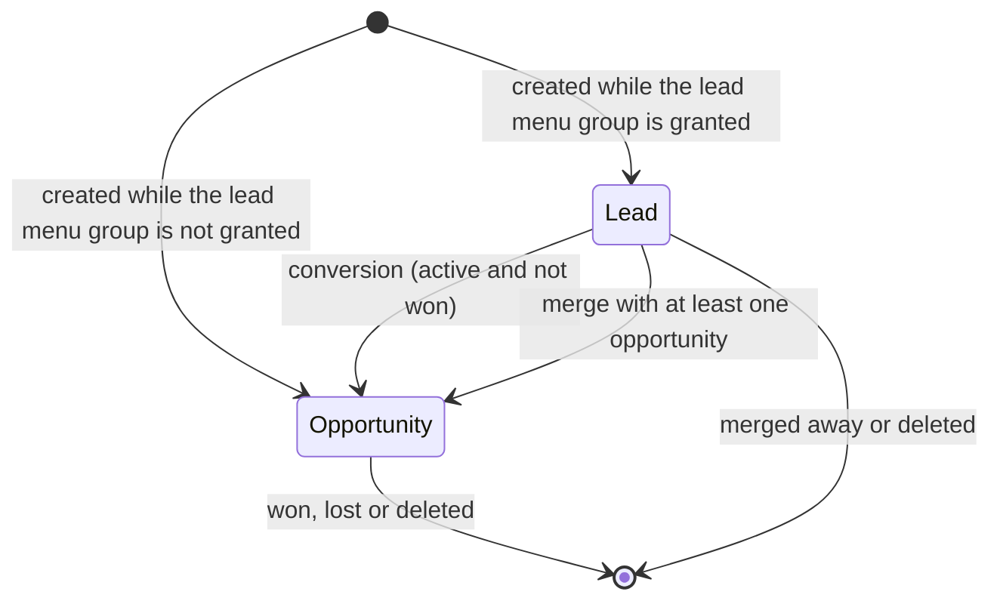
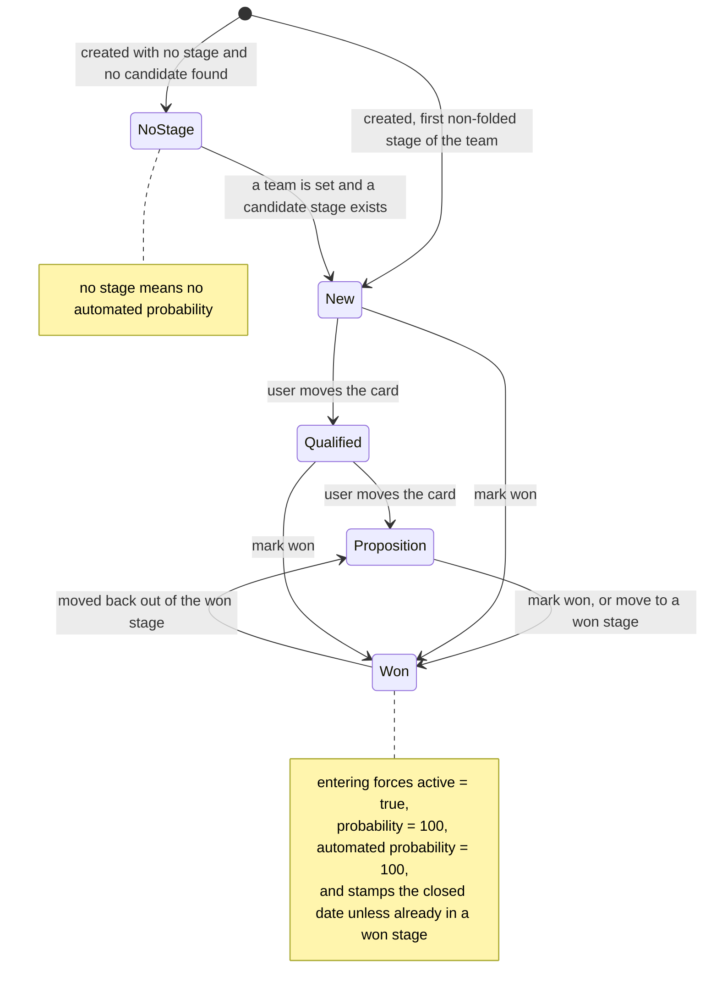
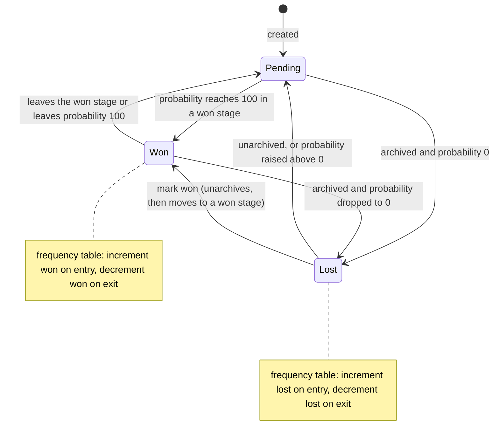
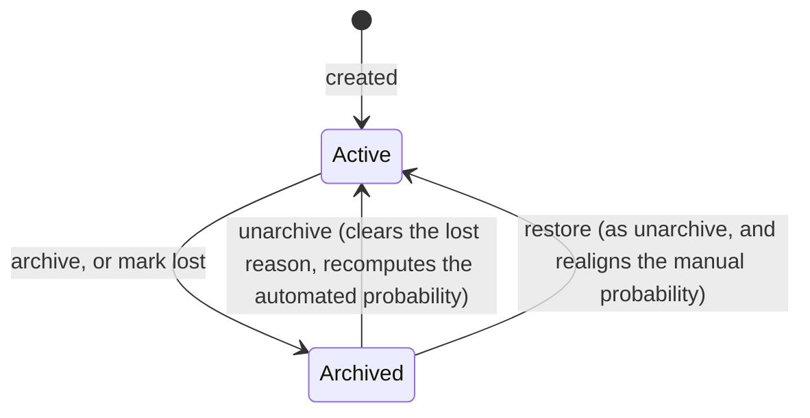
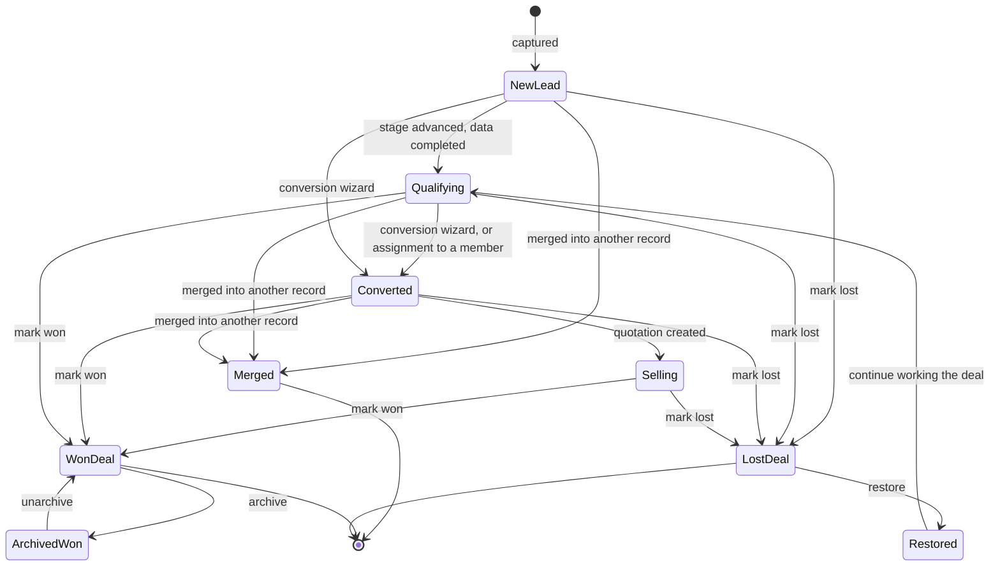
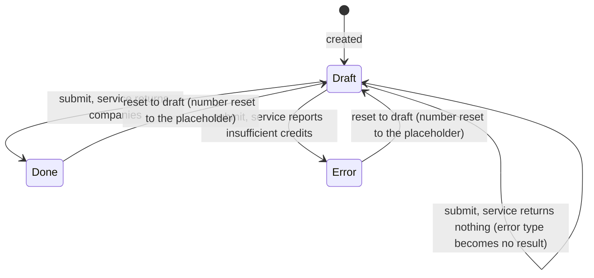
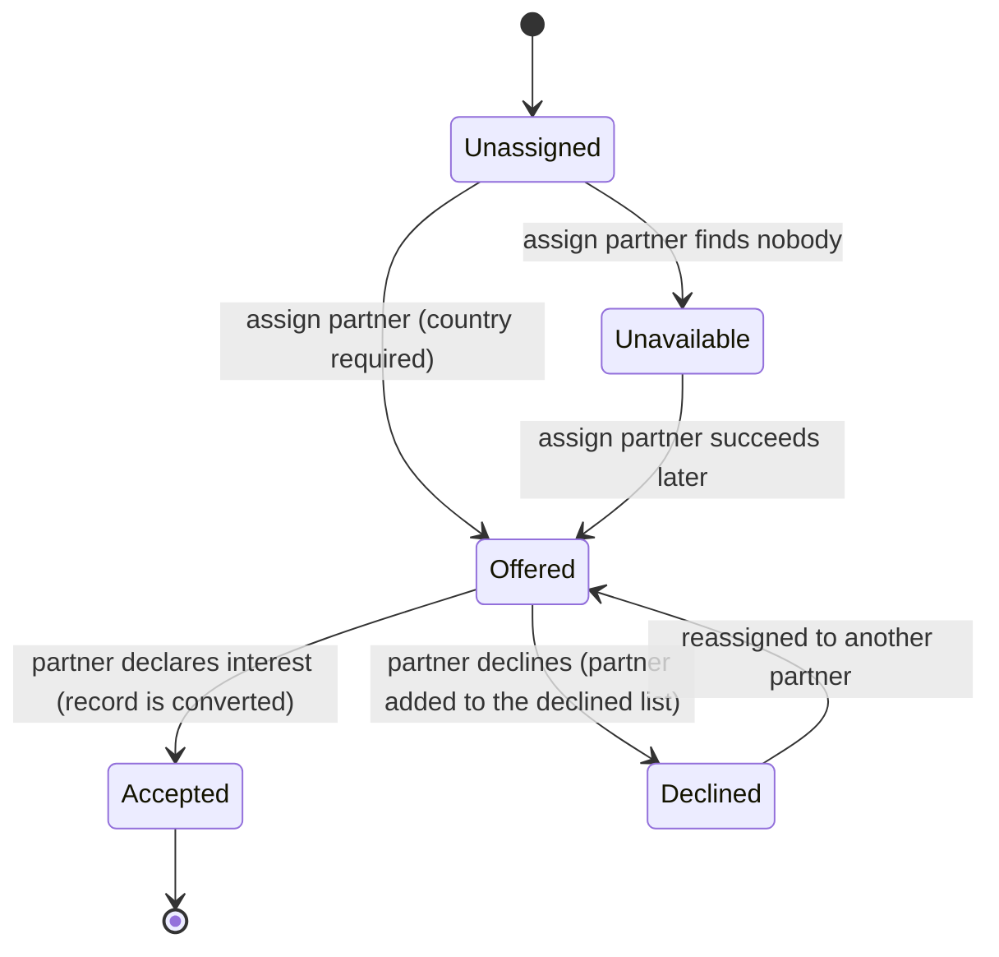
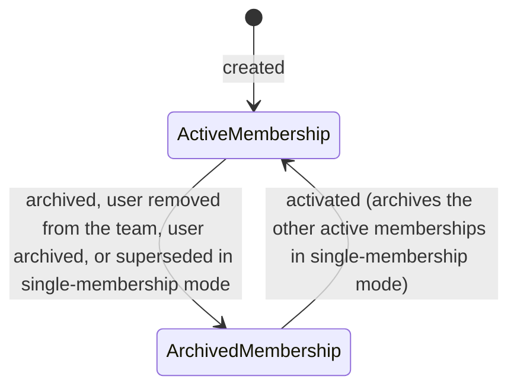

# State machines

This file specifies every state-bearing field of the Customer Relationship Management domain: the
maturity of a Lead, its position in the pipeline, its won or lost outcome, its archival flag, the
status of a Lead Generation Request, and the partner-network assignment status. For each, a table
of states, a table of transitions with guards and side effects, and a diagram.

Entities are named in full on first use with their transport and storage names: Lead (`crm.lead`,
table `crm_lead`), Stage (`crm.stage`, table `crm_stage`), Sales Team (`crm.team`, table
`crm_team`), Lead Generation Request (`crm.iap.lead.mining.request`, table
`crm_iap_lead_mining_request`).

A remark on shape. The Lead does **not** have a single status field. It has four orthogonal
dimensions, and the business meaning of a record is the combination:

| Dimension | Field | Nature |
|---|---|---|
| Maturity | `type` (type) | two values, normally one-way |
| Pipeline position | `stage_id` (stage) | an ordered set of user-defined values |
| Outcome | `won_status` (won or lost) | **derived**, never written directly |
| Existence | `active` (active) | a boolean archival flag |

Specifying them separately, and then specifying how they combine, is the only way to describe the
behaviour correctly.

---

## 1. Maturity — the `type` field

### 1.1 States

| Value | Label | Meaning |
|---|---|---|
| `lead` | Lead | An unqualified interest. May have nothing but an electronic mail address. Not expected to carry a Contact, an expected revenue or a meaningful probability. |
| `opportunity` | Opportunity | A qualified deal, expected to carry a Contact, a salesperson, a team, a stage and an expected revenue. |

The field is **required**; there is no empty state.

### 1.2 Default

`lead` when the acting user holds the group *Show Lead Menu*; `opportunity` otherwise. Records
created through the incoming electronic mail gateway on a team alias take the value stored in the
alias defaults, which is `lead` when the alias owner uses leads and the group is granted, and
`opportunity` otherwise. Records created through the public website form take `lead` when the
resolved team uses leads and `opportunity` otherwise; with no resolved team the group decides.

### 1.3 Transitions

| From | To | Trigger | Guards | Side effects |
|---|---|---|---|---|
| `lead` | `opportunity` | The conversion routine, invoked by the single-conversion wizard, by the mass-conversion wizard, by the assignment routine when it hands a lead to a member, or by the partner-network "I am interested" action. | The record must be **active**. Its outcome must not be `won`. Both are checked per record; a record failing either is silently skipped, not rejected. | `date_conversion` (conversion date) is stamped with the current instant. When the chosen Contact differs from the current one, `partner_id` (contact) is updated. When the record has no stage, one is chosen by the stage-search routine using the target team. Afterwards, if a salesperson list or a team was supplied, they are applied through the round robin. |
| `lead` | `opportunity` | A merge whose inputs include at least one opportunity. | The merge guards (at least two records, at most five unless relaxed). | The surviving record's type becomes `opportunity`. |
| `opportunity` | `lead` | Not offered by any action. | — | The field is writable, so a direct write is technically possible, but no workflow performs it and the conversion is treated as one-way. |

### 1.4 Diagram

---

## 2. Pipeline position — the `stage_id` field

### 2.1 States

The states are the Stage records themselves; they are configuration data, not a fixed enumeration.
The delivered set is:

| Stage | Sequence | Won flag | Folded | Colour |
|---|---|---|---|---|
| New | 1 | no | no | 11 |
| Qualified | 2 | no | no | 5 |
| Proposition | 3 | no | no | 8 |
| Won | 70 | **yes** | no | 10 |

A stage may additionally be restricted to a set of teams. A record may also have **no** stage at
all, which is a meaningful state: it suppresses the automated probability entirely.

### 2.2 Transitions

| From | To | Trigger | Guards | Side effects |
|---|---|---|---|---|
| *(none)* | the first non-folded stage available to the record's team | Automatic, on creation, and whenever the team changes such that the current stage is no longer available. | The stage-search routine must find a candidate; otherwise the record keeps no stage. | `date_last_stage_update` (last stage update) is stamped. |
| any stage | any other stage | A user drags the card, edits the field, or a routine writes it. | The interface restricts the selectable stages to those with no team restriction or with the record's team among their teams; a direct write is not restricted. | `date_last_stage_update` is stamped with the current instant, but **only** when at least one record in the write actually changes stage. The stage-duration tracking accumulates the time spent in the previous stage. A tracked message is posted. The probability is recomputed unless it is manual. |
| any stage | a stage flagged as won | The same triggers, plus the explicit "mark won" action. | — | In addition to the above: `active` is forced to true, `probability` is forced to 100 and `automated_probability` is forced to 100, all inside the same write. `date_closed` (closed date) is stamped — **except** when the record was already in a won stage, in which case the closed date is left untouched so that moving between two won stages does not reset it. The frequency table receives a "reaches won" increment. The posted message uses the *Opportunity Won* subtype. |
| a stage flagged as won | a stage not flagged as won | The same triggers. | — | `date_closed` is cleared when the write leaves the probability strictly positive. The frequency table receives a "leaves won" decrement. The outcome becomes `pending` unless the record is archived **and** the probability is zero. |

### 2.3 Guard enforced by a constraint

A record whose stage is flagged as won and whose probability is not exactly 100 is rejected with
"A lead in a Won stage cannot be lost. Move it to another stage first." This is what makes "in a
won stage" and "probability 100" equivalent in practice.

### 2.4 Effect of reconfiguring a stage

Toggling a stage's won flag rewrites every lead currently in that stage: setting the flag forces
their probability and automated probability to 100; clearing it recomputes their probability from
the automatic computation. The interface warns before saving.

### 2.5 Diagram

---

## 3. Outcome — the `won_status` field

### 3.1 Nature

This field is **computed and stored**; it is never written directly. It depends on `active`,
`probability` and `stage_id`.

### 3.2 States

| Value | Label | Definition |
|---|---|---|
| `won` | Won | `probability` is exactly 100 **and** the stage is flagged as a won stage. |
| `lost` | Lost | `active` is false **and** `probability` is exactly 0. |
| `pending` | Pending | Everything else. |

The two positive definitions are checked in that order, so a record that somehow satisfied both
would be reported as won — but that situation is rejected by the constraint below.

### 3.3 The mutual-exclusion constraint

Every creation and every write that touches `active`, `stage_id` or `probability` recomputes the
outcome before and after and rejects a record that is simultaneously won and lost with the message
"The lead *the record* cannot be won and lost at the same time."

### 3.4 Transitions and their side effects on the frequency table

| From | To | Trigger | Side effect |
|---|---|---|---|
| `pending` | `won` | The record reaches probability 100 in a won stage, by the "mark won" action, by a direct stage change, or by a stage being reconfigured as won. | The frequency table is incremented in the won direction for every cell of the record, with the stage expansion "all stages". A tracked message with the *Opportunity Won* subtype is posted. |
| `won` | `pending` | The record leaves the won stage, or its probability leaves 100. | The frequency table is **decremented** in the won direction. A tracked message with the *Opportunity Restored* subtype is posted. |
| `pending` | `lost` | The "mark lost" action, or archiving a record whose probability is already zero, or setting the probability to zero on an already archived record. | The frequency table is incremented in the lost direction, with the stage expansion "stages up to and including the current one". A tracked message with the *Opportunity Lost* subtype is posted. `date_closed` is stamped. |
| `lost` | `pending` | Unarchiving, or the explicit "restore" action, or raising the probability above zero on an archived record. | The frequency table is **decremented** in the lost direction. The lost reason is cleared by the unarchive routine. A tracked message with the *Opportunity Restored* subtype is posted. |
| `lost` | `won` | Marking a lost record won (the action unarchives first, then moves it to a won stage). | Both adjustments happen in the same operation: decrement lost, increment won. |
| `won` | `lost` | Archiving a won record **and** dropping its probability to zero, in that combination. | Both adjustments: decrement won, increment lost. |

### 3.5 The two behaviours that surprise

- **Archiving a won record does not un-win it.** The record stays `won` because the stage is still
  a won stage and the probability is still 100. No frequency adjustment occurs.
- **Archiving a pending record does not lose it.** The record only becomes `lost` if its
  probability is also zero. An archived record with probability 20 is `pending`.

### 3.6 Diagram

---

## 4. Existence — the `active` field

### 4.1 States

| Value | Meaning |
|---|---|
| true | The record appears in ordinary searches and views. |
| false | The record is archived: hidden from ordinary searches, still readable by identifier, still counted by duplicate detection and by the lost-reason navigation. |

Default: true. Tracked with tracking order 72.

### 4.2 Transitions

| From | To | Trigger | Guards | Side effects |
|---|---|---|---|---|
| true | false | The generic archive operation, or the "mark lost" action. | None. | `date_closed` is stamped by the write rule whenever a write sets `active` to false. If the probability is also zero the outcome becomes `lost` and the frequency table is incremented. |
| false | true | The generic unarchive operation. | None. | Only the records that were actually inactive are affected. Their lost reason is cleared. Their probability is recomputed. If they were `lost`, the frequency table is decremented. |
| false | true | The explicit "restore" action. | None. | Everything the unarchive operation does, **plus** the manual probability is set equal to the automated probability, which re-attaches the record to the automatic computation. |

### 4.3 Why restore and unarchive differ

Unarchiving recomputes only the *automated* probability, because the manual probability is left
alone by the alignment rule once it has diverged. A record that was lost has probability 0 while
its automated probability may be, say, 18.40; after a plain unarchive it would sit at 0 with an
automated value of 18.40 and would be reported as still detached. Restore closes that gap by
copying the automated value onto the manual one.

### 4.4 Diagram

---

## 5. The combined lifecycle of a Lead

Putting the four dimensions together, the meaningful business states are:

| Business state | `type` | `active` | Stage | `probability` | `won_status` |
|---|---|---|---|---|---|
| New unqualified lead | `lead` | true | first non-folded | computed or 0 | `pending` |
| Lead being qualified | `lead` | true | any non-won | computed | `pending` |
| Converted opportunity | `opportunity` | true | any non-won | computed | `pending` |
| Won deal | `opportunity` (normally) | true | a won stage | 100 | `won` |
| Won deal later archived | `opportunity` | false | a won stage | 100 | `won` |
| Lost deal | either | false | unchanged | 0 | `lost` |
| Restored deal | either | true | unchanged | realigned | `pending` |
| Merged away | — | — | — | — | the record no longer exists |

### 5.1 Combined diagram

---

## 6. Lead Generation Request status

### 6.1 States

| Value | Label | Meaning |
|---|---|---|
| `draft` | Draft | The request is being composed. Its number is the placeholder text "New". |
| `error` | Error | The last submission failed because the external service reported insufficient credits. |
| `done` | Done | The last submission succeeded and produced leads. |

**Required**, default `draft`.

An auxiliary field records **why** a submission failed:

| Value of the error type | Label | Meaning |
|---|---|---|
| `credits` | Insufficient Credits | The service refused for lack of credits. This value is accompanied by the status `error`. |
| `no_result` | No Result | The service answered but returned nothing. The status is **left unchanged**, so a first submission that finds nothing stays `draft`. |

### 6.2 Transitions

| From | To | Trigger | Guards | Side effects |
|---|---|---|---|---|
| `draft` | `done` | Submit. | The service must answer with data. | The error type is cleared. If the number is still the placeholder, it is replaced by the next value of the numbering series. The payload is built and sent. Each returned company produces one Lead, with a note posted on it summarising the company data. The view switches to the produced leads, filtered on the requested type. |
| `draft` | `error` | Submit. | The service answers with a credit error. | The error type becomes `credits`. No lead is created. |
| `draft` | `draft` | Submit. | The service answers with no data. | The error type becomes `no_result`. No lead is created. When the request is being edited inside a dialogue, the dialogue is reopened on the same record so that the error is displayed. |
| `error` or `done` | `draft` | Reset to draft. | None. | The number is reset to the placeholder text "New", so the next submission consumes a new number from the series. |

### 6.3 Diagram

---

## 7. Partner-network assignment status of an Opportunity

This is not a stored selection field; it is the combination of two fields, and it behaves as a
state machine from the point of view of the reselling partner.

### 7.1 States

| State | Condition | Meaning |
|---|---|---|
| Unassigned | `partner_assigned_id` (assigned partner) is empty | No partner has been offered the deal. |
| Offered | `partner_assigned_id` is set and the partner is not among `partner_declined_ids` (partners not interested) | The deal is waiting for the partner's answer. |
| Accepted | The partner posted the interest message; the record has been converted to an opportunity | The partner is working the deal. |
| Declined | The partner is among `partner_declined_ids` and `partner_assigned_id` is empty again | The partner refused; the deal returns to the pool but that partner is excluded from future searches. |
| Unavailable | `partner_assigned_id` is empty and the record carries the "no partner available" tag | The geographic search found nobody. |

### 7.2 Transitions

| From | To | Trigger | Guards | Side effects |
|---|---|---|---|---|
| Unassigned | Offered | The "assign partner" action, or an explicit partner choice. | The record must have a country, otherwise it is skipped and reported. | Coordinates are computed and stored if missing. A partner is selected by the widening geographic search with weighted choice. If the partner has a salesperson, that salesperson is written on the record. The partner assignment date is recomputed to today. |
| Unassigned | Unavailable | The "assign partner" action finds nobody. | — | The "no partner available" tag is added. |
| Offered | Accepted | The partner presses "I am interested" in the partner portal. | The acting portal user's commercial entity must be an ancestor of the assigned partner, otherwise "Only users with commercial partner which is a parent of the assigned partner can edit this lead." | A message "I am interested by this lead." — plus the optional comment — is posted. The record is converted to an opportunity. |
| Offered | Declined | The partner presses "I am not interested" in the partner portal. | The same access guard. | A message is posted, worded "I am not interested by this lead. I contacted the lead." or "… I have not contacted the lead." depending on the answer given, plus the optional comment. The partner's whole commercial hierarchy is unsubscribed from the record and added to the declined list. The assigned partner is cleared. If the partner marked it as unwanted solicitation, the "spam" tag is added. |
| Declined | Offered | A new "assign partner" run. | — | The declined partners are excluded from every pass of the geographic search. |

### 7.3 Diagram

---

## 8. Sales Team Member activity

### 8.1 States

| Value of `active` | Meaning |
|---|---|
| true | The membership counts towards the team's capacity, the user appears among the team's salespeople, and the pair participates in assignment. |
| false | The membership is retained for history only. |

### 8.2 Transitions

| From | To | Trigger | Guards | Side effects |
|---|---|---|---|---|
| *(none)* | true | Creating a membership, directly or by adding a user to a team's salespeople list. | In single-membership mode, the pair must not duplicate an existing **active** membership. | In single-membership mode, every other active membership of that user is archived. The member is added to the team's favourites. |
| true | false | Archiving the membership, removing the user from the team's salespeople list, archiving the user, or creating an active membership for that user in another team while in single-membership mode. | None. | The team's capacity drops by the member's capacity. The user's main team is recomputed. |
| false | true | Activating the membership. | In single-membership mode, the same duplicate check. | In single-membership mode, the user's other active memberships are archived. |

### 8.3 Diagram

---

## 9. Summary of every field that changes state automatically on a Lead write

This table collects, in evaluation order, everything a single write to a Lead can change beyond
the values the caller supplied. It is the authoritative reference for implementing the write path.

| Order | Condition on the incoming values | Automatic change |
|---|---|---|
| 1 | a website is supplied | the website text is cleaned (a bare domain becomes a full address) |
| 2 | a stage is supplied and at least one record's stage differs | `date_last_stage_update` is set to the current instant |
| 3 | a stage is supplied, at least one record's stage differs, and the new stage is flagged as won | `active` becomes true, `probability` becomes 100 and `automated_probability` becomes 100, all added to the same write |
| 4 | a salesperson is supplied and it is empty | `date_open` is cleared |
| 5 | a salesperson is supplied, it is not empty, and at least one record's salesperson differs | `date_open` is set to the current instant |
| 6 | the supplied probability is at least 100, **or** the supplied active flag is false | `date_closed` is set to the wall-clock instant |
| 7 | otherwise, the supplied probability is strictly greater than zero | `date_closed` is cleared |
| 8 | otherwise, the stage changed, the new stage is not won, and no probability was supplied | `date_closed` is cleared |
| 9 | the write touches `active`, `stage_id` or `probability` | the outcome of every record is captured before the write and recomputed after it, and the frequency table is adjusted accordingly |
| 10 | the new stage is a won stage | the write is split: records already in a won stage are written **without** the closed date so that it is not reset, and the others are written with it |

Step 6 is the one place where the wall clock is read rather than the transaction clock; steps 2
and 5 use the transaction clock. In practice the two differ by microseconds.
