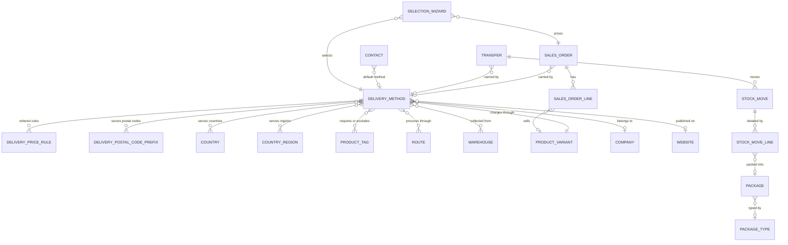

# Entities

This file specifies every entity the Delivery and Shipping domain owns, the two transport
structures that the carrier-integration contract passes between the system and a carrier
integration, and every field this domain adds to entities owned by other domains. For each entity
it gives the purpose, the life cycle, the complete field table, the relations, the uniqueness
rules, the ordering, the display-name rule, the archival behaviour, the multi-company behaviour and
the extension points that other capability packages contribute.

Generated reference pages carrying the same field lists in machine-readable form are linked from
each entity heading.

## 0. Conventions

Field tables use four columns:

- **Identifier** — the reproduced storage name, in code font. It is contractual: an import, an
  integration or a client is keyed on it.
- **Full name** — the name in words, as the interface shows it.
- **Type** — `boolean`, `integer`, `decimal`, `monetary` (a decimal rounded by a named currency),
  `single line text`, `long text`, `selection` (values listed), `link to X` (a reference to one
  record of X), `collection of X` (the back-reference side of a one-to-many relation),
  `set of X` (a many-to-many relation), `structured value` (a nested value made of named keys and
  lists, stored as one column).
- **Meaning and rules** — required, default, computed and from what, stored or not, read-only,
  copy behaviour on duplication, company scoping, indexing, delete behaviour and selection labels.

Unless a row says otherwise a field is optional, stored, writable, copied when the record is
duplicated, and not tracked in the discussion thread.

Further conventions used throughout this folder:

- **Required** means the system refuses to store the record without a value.
- **Default** is the value applied when the field is not supplied on creation.
- **Computed** names the inputs the value is derived from. A computed field is *stored* when the
  derived value is written to the table and recomputed only when an input changes, and *unstored*
  when it is recalculated on every read.
- **Writable computed** means the value is normally derived but may be overwritten by a user or by
  a caller; the derivation then runs again only when one of its inputs changes.
- **Mirror** means the value is read through a relation from another record and is not edited here.
  A mirror is *stored* when a copy is written to this table.
- **Inverse-writable mirror** means the value is read through a relation but writing it writes the
  source field instead.

Every persistent entity additionally carries the shared audit fields described once here and never
repeated per entity: the surrogate integer key `id` (identifier), `create_date` (created on),
`create_uid` (created by user), `write_date` (last updated on) and `write_uid` (last updated by
user). Entities that support archiving carry `active` (active); archived records are hidden from
every query that does not explicitly ask for them.

Weights in this folder are expressed in the weight unit named by the weight unit-of-measure system
parameter, and volumes in the volume unit named by the volume unit-of-measure system parameter.
Both parameters are owned by [`../units-of-measure-and-packaging/`](../units-of-measure-and-packaging/)
and are described in [configuration.md](configuration.md).

---

## 1. Delivery Method

**Delivery Method** (`delivery.carrier`, table `delivery_carrier`) is the single record that
answers three separate questions about carriage:

1. **What may the customer buy?** — a name, a delivery product, a charge, a description and an
   availability filter.
2. **How is the charge computed?** — a provider kind and, for the rule-based kind, an ordered list
   of Delivery Price Rules.
3. **What is exchanged with the carrier?** — an integration level, an environment flag, a debug
   flag, a tracking-link pattern, return-label options and an insurance percentage.

Reference page:
[../../references/entities/delivery.carrier.md](../../references/entities/delivery.carrier.md).

### 1.1 Purpose and life cycle

A Delivery Method has no state field. Its life cycle is the ordinary configuration life cycle:

1. **Created** by a sales administrator or an inventory administrator, or shipped as a default
   record (see [configuration.md](configuration.md) section 2).
2. **Offered** as soon as it passes the availability filter of a Sales Order or of a Transfer. In
   the storefront it must additionally be published.
3. **Used** on a Sales Order through the shipping charge line, and on a Transfer through the
   carrier reference.
4. **Archived** by clearing `active`. An archived method is no longer offered anywhere, including
   as the default method of a Contact, but historical orders and transfers keep their reference to
   it.

A Delivery Method is never deleted while a Delivery Price Rule references it — deleting the method
cascades to its rules — and its delivery product cannot be deleted while a method references it.

### 1.2 Field table

| Identifier | Full name | Type | Meaning and rules |
|---|---|---|---|
| `name` | Delivery Method | single line text | Required. Translatable. The commercial name shown in the wizard, in the storefront list, on the quotation and on the shipping charge line. |
| `active` | Active | boolean | Default true. Clearing it archives the method. |
| `sequence` | Sequence | integer | Default 10. Determines the display order; the list view exposes it as a drag handle. Methods are ordered by this value and then by identifier. |
| `delivery_type` | Provider | selection | Required. Default `fixed`. The provider kind. Core values: `fixed` (label "Fixed Price") and `base_on_rule` (label "Based on Rules"). The collection-in-store package adds `in_store` (label "Pick up in store"). Every carrier integration package adds one further value. Changing the value changes which pricing engine, which sending routine and which tracking-link routine apply. |
| `allow_cash_on_delivery` | Cash on Delivery | boolean | Default false. When true, the cash-on-delivery payment provider is offered for an order carried by this method. Help text: "Allow customers to choose Cash on Delivery as their payment method." |
| `integration_level` | Integration Level | selection | Default `rate_and_ship`. Values `rate` (label "Get Rate") and `rate_and_ship` (label "Get Rate and Create Shipment"). At `rate` the system only asks the carrier for a price and never creates a shipment; at `rate_and_ship` it also creates the shipment when an outgoing Transfer is validated. Help text: "Action while validating Delivery Orders". Hidden for the two core kinds and for the in-store kind. |
| `prod_environment` | Environment | boolean | Default false. False means the integration talks to the carrier's test service; true means the production service. Help text: "Set to True if your credentials are certified for production." |
| `debug_logging` | Debug logging | boolean | Default false. When true, every request and response body exchanged with the carrier is written to the technical log. Help text: "Log requests in order to ease debugging". |
| `company_id` | Company | link to Company | Stored, writable mirror of `product_id.company_id`. Empty means the method is visible to every company. |
| `product_id` | Delivery Product | link to Product Variant | Required. The service product that carries the charge onto the order and the invoice. Deleting the product is refused while a method references it. The form pre-fills a new product as a service, not sellable, not purchasable, invoiced on ordered quantities. |
| `currency_id` | Currency | link to Currency | Unstored mirror of `product_id.currency_id`. Names the currency of `fixed_price`, `fixed_margin`, `amount` and of the two amounts of every Delivery Price Rule. |
| `fixed_price` | Fixed Price | decimal | Stored computed from `product_id.list_price`, writable: writing it writes the sales price of the delivery product. This is the charge of the fixed engine before any price list. |
| `tracking_url` | Tracking Link | single line text | The pattern from which a tracking link is built. The placeholder `<shipmenttrackingnumber>` is replaced by the tracking reference of the Transfer. Shown only for the two core kinds. Help text: "This option adds a link for the customer in the portal to track their package easily. Use <shipmenttrackingnumber> as a placeholder in your URL." |
| `invoice_policy` | Invoicing Policy | selection | Required. Default `estimated`. Core value `estimated` (label "Estimated cost"); the Delivery – Inventory bridge adds `real` (label "Real cost") and declares that a `real` value falls back to the default when that bridge is removed. At `estimated` the charge computed when the method is chosen is what the customer pays; at `real` the charge returned by the carrier at shipment time replaces it. Hidden for the two core kinds, for the in-store kind and whenever the integration level is `rate`. |
| `country_ids` | Countries | set of Country | Association table `delivery_carrier_country_rel`, columns `carrier_id` and `country_id`. Empty means every country. |
| `state_ids` | States | set of Country Region | Association table `delivery_carrier_state_rel`, columns `carrier_id` and `state_id`. Empty means every region. The screen restricts the choice to regions of the selected countries and is read-only while no country is selected. |
| `zip_prefix_ids` | Zip Prefixes | set of Delivery Postal Code Prefix | Association table `delivery_zip_prefix_rel`, columns `carrier_id` and `zip_prefix_id`. Empty means every postal code. Read-only while no country is selected. Help text: "Prefixes of zip codes that this carrier applies to. Note that regular expressions can be used to support countries with varying zip code lengths, i.e. '$' can be added to end of prefix to match the exact zip (e.g. '100$' will only match '100' and not '1000')". |
| `max_weight` | Max Weight | decimal | Zero means no limit. Expressed in the weight unit of the weight system parameter. Help text: "If the total weight of the order is over this weight, the method won't be available." |
| `weight_uom_name` | Weight unit of measure label | single line text | Unstored computed. The display name of the weight unit named by the weight system parameter. Shown beside `max_weight`. |
| `max_volume` | Max Volume | decimal | Zero means no limit. Expressed in the volume unit of the volume system parameter. Help text: "If the total volume of the order is over this volume, the method won't be available." |
| `volume_uom_name` | Volume unit of measure label | single line text | Unstored computed. The display name of the volume unit named by the volume system parameter. |
| `must_have_tag_ids` | Must Have Tags | set of Product Tag | Association table `product_tag_delivery_carrier_must_have_rel`. Help text: "The method is available only if at least one product of the order has one of these tags." |
| `excluded_tag_ids` | Excluded Tags | set of Product Tag | Association table `product_tag_delivery_carrier_excluded_rel`. Help text: "The method is NOT available if at least one product of the order has one of these tags." |
| `carrier_description` | Carrier Description | long text | Translatable. Printed at the foot of the quotation and repeated in the order confirmation message. Help text: "A description of the delivery method that you want to communicate to your customers on the Sales Order and sales confirmation email.E.g. instructions for customers to follow." |
| `margin` | Margin on Rate | decimal | A fraction, not a percentage: the screen shows it with a percentage widget, so 0.5 is displayed as fifty per cent. Added proportionally to the charge of every engine except the fixed engine. Constrained to be at least −1. Help text: "This percentage will be added to the shipping price." |
| `fixed_margin` | Additional margin | monetary | An absolute amount in the method currency, added after the proportional margin, for every engine except the fixed engine. Help text: "This fixed amount will be added to the shipping price." |
| `free_over` | Free if order amount is above | boolean | Default false. When true and the order total without carriage reaches `amount`, the charge is waived. Hidden for the rule-based kind. Help text: "If the order total amount (shipping excluded) is above or equal to this value, the customer benefits from a free shipping". |
| `amount` | Amount | monetary | Default 1000. The threshold of the waiver, expressed in the company currency. Required on screen whenever `free_over` is true. Help text: "Amount of the order to benefit from a free shipping, expressed in the company currency". |
| `can_generate_return` | Can Generate Return | boolean | Unstored computed from `delivery_type`. False for the two core kinds and for the in-store kind; a carrier integration that can produce a return label overrides the computation to true for its own kind. |
| `return_label_on_delivery` | Generate Return Label | boolean | Default false. When true, a return label is produced automatically when the outgoing shipment is created. Cleared automatically whenever `can_generate_return` becomes false. Help text: "The return label is automatically generated at the delivery." |
| `get_return_label_from_portal` | Return Label Accessible from Customer Portal | boolean | Default false. When true, the return-label attachments receive an access token so that the customer can download them from the portal. Cleared automatically whenever `return_label_on_delivery` becomes false. Help text: "The return label can be downloaded by the customer from the customer portal." |
| `supports_shipping_insurance` | Supports Shipping Insurance | boolean | Unstored computed from `delivery_type`. False for the two core kinds and for the in-store kind; a carrier integration that sells insurance overrides the computation to true for its own kind. Controls whether `shipping_insurance` is shown. |
| `shipping_insurance` | Insurance Percentage | integer | Default 0. Constrained between 0 and 100 inclusive. The share of the declared value of the parcel that the carrier is asked to insure. Help text: "Shipping insurance is a service which may reimburse senders whose parcels are lost, stolen, and/or damaged in transit." |
| `price_rule_ids` | Pricing Rules | collection of Delivery Price Rule | Copied when the method is duplicated. Shown only for the rule-based kind. |
| `route_ids` | Routes | set of Route | Association table `stock_route_shipping`, columns `shipping_id` and `route_id`. Restricted to routes whose `shipping_selectable` flag is set. Contributed by the Delivery – Inventory bridge. Every line of an order carried by this method is procured through these routes unless the line names its own. Shown only to users of the advanced-location group. |
| `warehouse_ids` | Stores | set of Warehouse | Contributed by the collection-in-store package. The stores from which the customer may collect. Meaningful only for the `in_store` kind. |
| `is_mondialrelay` | Is Parcel-Point Network | boolean | Unstored computed from `product_id.default_code`: true when that code is exactly `MR`. Searchable: a search on this field is rewritten as a search on the delivery product's code. Contributed by the parcel-point network companion. |
| `mondialrelay_brand` | Brand Code | single line text | Default `BDTEST  ` (six letters followed by two spaces; the value is reproduced, including the trailing spaces, because the parcel-point network's selector widget and tracking address expect it verbatim). Required on screen when `is_mondialrelay` is true. Contributed by the parcel-point network companion. |
| `mondialrelay_packagetype` | Parcel-Point Container Code | single line text | Default `24R`. Readable and writable only by members of the settings group. Passed to the parcel-point selector widget as the collection-and-delivery mode. Contributed by the parcel-point network companion. |
| `is_published` | Is Published | boolean | Default false. Not copied. Indexed. Contributed by the storefront domain through the published-record mixin. Only a published method is offered in the storefront. |
| `website_published` | Visible on current website | boolean | Unstored computed from `is_published` and `website_id`, writable, searchable. True when the method is published and either carries no website or carries the website currently being served. |
| `can_publish` | Can Publish | boolean | Unstored computed. Whether the current user may change the publication flag. |
| `website_id` | Website | link to Website | Empty means every website. |
| `website_url` | Website Address | single line text | Unstored computed. Always the placeholder `#` for a Delivery Method: the record has no public page of its own. |
| `website_absolute_url` | Website Absolute Address | single line text | Unstored computed. Always the placeholder `#`, for the same reason. |
| `website_description` | Description for Online Quotations | long text | Inverse-writable mirror of `product_id.description_sale`. Shown under the method's name in the storefront list and on the payment-confirmation page. |

### 1.3 Constraints, relations and ordering

**Database constraints.**

| Name | Condition | Message |
|---|---|---|
| `_margin_not_under_100_percent` | `margin` at least −1 | "Margin cannot be lower than -100%" |
| `_shipping_insurance_is_percentage` | `shipping_insurance` between 0 and 100 inclusive | "The shipping insurance must be a percentage between 0 and 100." |

**Record constraints.** Three checks run on every write; they are stated in full with their
messages in [business-rules.md](business-rules.md) as rules DSH-001, DSH-041 and DSH-042:

1. A tag may not appear in both `must_have_tag_ids` and `excluded_tag_ids`.
2. A published in-store method must have at least one store.
3. Every store of an in-store method that carries a company must carry that same company.

**Relations.**

| Relation | Target | Nature |
|---|---|---|
| `product_id` | Product Variant | Many-to-one, deletion of the product refused while referenced |
| `company_id` | Company | Many-to-one, stored mirror of the product's company |
| `currency_id` | Currency | Many-to-one, unstored mirror of the product's currency |
| `price_rule_ids` | Delivery Price Rule | One-to-many, the rule side deletes with the method |
| `country_ids`, `state_ids`, `zip_prefix_ids` | Country, Country Region, Delivery Postal Code Prefix | Many-to-many availability filters |
| `must_have_tag_ids`, `excluded_tag_ids` | Product Tag | Many-to-many availability filters |
| `route_ids` | Route | Many-to-many, procurement routes |
| `warehouse_ids` | Warehouse | Many-to-many, collection stores |
| `website_id` | Website | Many-to-one, publication scope |

**Ordering.** By `sequence` ascending, then by identifier ascending. The order matters: the
storefront offers the first available method as the preselected one when the order carries none.

**Display name.** The value of `name`.

**Duplication.** Duplicating a Delivery Method copies its Delivery Price Rules and names the copy
"<name> (copy)", where the placeholder is the name of the original.

**Archival.** `active` defaults to true. An archived method is excluded from the default method of
a Contact, from the availability computations and from every selection list, but not from the
records that already reference it.

**Company behaviour.** `company_id` is a stored mirror of the delivery product's company and may be
overwritten. A global record rule limits every user to the methods of the companies currently
active for that user plus the methods with no company; the rule is given in
[configuration.md](configuration.md) section 5. A Sales Order and a Transfer both check that the
method they reference belongs to a compatible company.

### 1.4 Extension points

A capability package adds a carrier integration to the system by doing five things:

1. Extending `delivery_type` with one further stored value, and declaring what happens to that
   value when the package is removed.
2. Adding a rating routine named after that value, which takes a Sales Order and returns the rate
   result described in section 5.
3. Adding a sending routine named after that value, which takes a set of Transfers and returns one
   shipment result per Transfer, as described in section 5.
4. Adding a tracking-link routine, a cancellation routine and a return-label routine named after
   that value.
5. Optionally adding a default container-code routine named after that value, so that a Package
   Type created for that carrier receives the carrier's own code for a non-standard container.

Two further optional overrides exist: the computation of `can_generate_return` and the computation
of `supports_shipping_insurance`, each of which a package sets to true for its own kind.

The full contract, including what happens when a routine is missing, is specified in
[interfaces.md](interfaces.md) section 4 and in [workflows.md](workflows.md).

---

## 2. Delivery Price Rule

**Delivery Price Rule** (`delivery.price.rule`, table `delivery_price_rule`) is one line of the
ordered list that the rule-based pricing engine evaluates. Reference page:
[../../references/entities/delivery.price.rule.md](../../references/entities/delivery.price.rule.md).

### 2.1 Purpose and life cycle

A rule states a condition over one of five order variables and, when the condition holds, a charge
of the form *base amount plus factor amount times one of the five variables*. The engine walks the
rules in order and stops at the first whose condition holds. A rule has no state field; it is
created, edited and deleted inside the form of its Delivery Method and is deleted with it.

### 2.2 Field table

| Identifier | Full name | Type | Meaning and rules |
|---|---|---|---|
| `name` | Name | single line text | Unstored computed from `variable`, `operator`, `max_value`, `list_base_price`, `list_price`, `variable_factor` and `currency_id`. The one-line reading of the rule; the exact construction is given in [calculations.md](calculations.md) section 6. |
| `sequence` | Sequence | integer | Required. Default 10. Determines evaluation order; the list view exposes it as a drag handle. |
| `carrier_id` | Carrier | link to Delivery Method | Required. Indexed. Deleting the method deletes the rule. |
| `currency_id` | Currency | link to Currency | Unstored mirror of `carrier_id.currency_id`. Names the currency of the two amounts. |
| `variable` | Condition variable | selection | Required. Default `quantity`. Values `weight` ("Weight"), `volume` ("Volume"), `wv` ("Weight * Volume"), `price` ("Price"), `quantity` ("Quantity"). The quantity the condition tests. |
| `operator` | Condition operator | selection | Required. Default `<=`. Values `==` (shown as "="), `<=`, `<`, `>=`, `>`. |
| `max_value` | Maximum Value | decimal | Required. The right-hand side of the condition. Despite the name it is simply the comparison value; with the `>=` operator it is a lower bound. |
| `list_base_price` | Sale Base Price | monetary | Required. Default 0. The constant part of the charge, in the method currency. |
| `list_price` | Sale Price | monetary | Required. Default 0. The factor part of the charge, in the method currency per unit of the factor variable. |
| `variable_factor` | Variable Factor | selection | Required. Default `weight`. Same five values as `variable`. The quantity that `list_price` is multiplied by. |

### 2.3 Constraints, relations and ordering

There is no database constraint and no record constraint on a Delivery Price Rule. Nothing forbids
overlapping conditions, contradictory conditions, gaps between conditions or a negative amount; the
engine simply takes the first condition that holds, and reports failure when none does. This is
recorded as rule DSH-016 in [business-rules.md](business-rules.md).

**Ordering.** By `sequence` ascending, then by `list_price` ascending, then by identifier
ascending. The second key means that two rules with the same sequence are evaluated cheapest
first.

**Display name.** The computed `name`.

**Duplication.** Rules are copied with their Delivery Method.

**Company behaviour.** A rule has no company of its own; it inherits the visibility of its method
through the method's record rule.

---

## 3. Delivery Postal Code Prefix

**Delivery Postal Code Prefix** (`delivery.zip.prefix`, table `delivery_zip_prefix`) is one
reusable postal-code pattern that may be attached to any number of Delivery Methods. Reference
page:
[../../references/entities/delivery.zip.prefix.md](../../references/entities/delivery.zip.prefix.md).

### 3.1 Purpose and life cycle

The record exists so that a postal-code restriction written once can be shared by several methods.
It has one field. It is created and edited from a technical menu, or inline from the availability
page of a Delivery Method.

### 3.2 Field table

| Identifier | Full name | Type | Meaning and rules |
|---|---|---|---|
| `name` | Prefix | single line text | Required. Unique across all records. Converted to upper case on creation and on every write, so that the comparison against a destination postal code — which is also upper-cased before the test — is case-insensitive. The value is a regular-expression fragment: it is anchored at the start of the postal code, and the end-of-string marker may be appended to force an exact match. |

### 3.3 Constraints, relations and ordering

| Name | Condition | Message |
|---|---|---|
| `_name_uniq` | `name` unique | "Prefix already exists!" |

**Relations.** Many-to-many with Delivery Method through `delivery_zip_prefix_rel`.

**Ordering.** By `name` ascending, then by identifier ascending.

**Display name.** The value of `name`.

**Archival.** The entity has no archive flag. A prefix that is no longer wanted is detached from
every method and then deleted.

**Company behaviour.** None: prefixes are global.

---

## 4. Delivery Method Selection Wizard

**Delivery Method Selection Wizard** (`choose.delivery.carrier`, table `choose_delivery_carrier`)
is the transient record behind the dialogue a salesperson uses to attach a Delivery Method and its
charge to a Sales Order. Reference page:
[../../references/entities/choose.delivery.carrier.md](../../references/entities/choose.delivery.carrier.md).

### 4.1 Purpose and life cycle

The record lives only for the duration of the dialogue and is removed by the transient-record
cleaner. Its life cycle is:

1. **Opened** from a Sales Order, either to add a method ("Add shipping") or to update the charge
   of the method already on the order ("Update shipping cost").
2. **Rated** — for the two core kinds the rate is requested every time the method or the weight
   changes; for every other kind the user presses a button to request it.
3. **Confirmed** — the shipping charge line is written onto the order and the wizard is discarded.
4. **Discarded** — nothing is written.

### 4.2 Field table

| Identifier | Full name | Type | Meaning and rules |
|---|---|---|---|
| `order_id` | Sales Order | link to Sales Order | Required. Deleting the order deletes the wizard record. |
| `partner_id` | Customer | link to Contact | Required. Unstored mirror of `order_id.partner_id`. |
| `carrier_id` | Shipping Method | link to Delivery Method | Required. Restricted to the methods listed in `available_carrier_ids`. |
| `delivery_type` | Provider | selection | Unstored mirror of `carrier_id.delivery_type`. Drives which controls are shown. |
| `delivery_price` | Charge to apply | decimal | The amount that will be written on the shipping charge line. It is the amount after the free-above-a-threshold waiver, so it is zero when the waiver applies. Hidden. |
| `display_price` | Cost | decimal | Read-only. The amount before the waiver, so that the user sees what the carriage really costs even when the customer is not charged for it. |
| `currency_id` | Currency | link to Currency | Unstored mirror of `order_id.currency_id`. |
| `company_id` | Company | link to Company | Unstored mirror of `order_id.company_id`. |
| `available_carrier_ids` | Available Carriers | set of Delivery Method | Unstored computed from `partner_id`. Every method of the order's company that passes the availability filter for the order's delivery address and content; when the order has no customer, every method of the company. |
| `invoicing_message` | Invoicing message | long text | Unstored computed from `carrier_id`. Empty, except that the Delivery – Inventory bridge sets it to "The shipping price will be set once the delivery is done." when the method's invoicing policy is `real`. Shown as a warning banner. |
| `delivery_message` | Delivery message | long text | Read-only. The warning returned by the rating routine, most often the free-above-a-threshold notice. Copied onto the Sales Order on confirmation. |
| `total_weight` | Total Order Weight | decimal | Writable mirror of `order_id.shipping_weight`. Editing it re-requests the rate with the edited weight and, through the mirror, stores the edited weight on the order. |
| `weight_uom_name` | Weight unit label | single line text | Read-only. Defaulted to the display name of the weight unit named by the weight system parameter. |
| `shipping_zip` | Destination postal code | single line text | Unstored mirror of `order_id.partner_shipping_id.zip`. Passed to the parcel-point selector widget. |
| `shipping_country_code` | Destination country code | single line text | Unstored mirror of `order_id.partner_shipping_id.country_id.code`. Passed to the parcel-point selector widget. |
| `is_mondialrelay` | Is Parcel-Point Network | boolean | Unstored computed from `carrier_id`: true when the method's delivery product carries the code `MR`. |
| `mondialrelay_last_selected` | Last Relay Selected | single line text | The structured description of the point the customer chose, as the selector widget returns it: the keys `id`, `name`, `street`, `street2`, `zip`, `city` and `country`. |
| `mondialrelay_last_selected_id` | Last Relay Identifier | single line text | Unstored computed from `carrier_id` and `order_id.partner_shipping_id`. When the order's delivery address is already a parcel point, the two-letter country code, a hyphen and the point's number; otherwise the empty string. Pre-selects the point in the widget. |
| `mondialrelay_brand` | Brand Code | single line text | Unstored mirror of `carrier_id.mondialrelay_brand`. |
| `mondialrelay_colLivMod` | Collection and delivery mode | single line text | Unstored mirror of `carrier_id.mondialrelay_packagetype`. |
| `mondialrelay_allowed_countries` | Allowed countries | single line text | Unstored computed from `carrier_id`: the two-letter codes of the method's countries, upper-cased and joined by commas, or the empty string when the method restricts no country. |

### 4.3 Behaviour

- **On a change of method or of weight.** The delivery message is cleared. For the fixed and the
  rule-based kinds the rate is requested at once; a failure is shown as a blocking dialogue
  carrying the rating routine's own message. For every other kind both prices are set to zero and
  the user must press the rate button.
- **On a change of order.** For a kind other than fixed or rule-based, and only when the order
  already carries a shipping charge line, the rate is requested; a failure is shown as a
  non-blocking notification titled "<method name> Error" whose body is the rating routine's
  message.
- **The rate button** re-requests the rate and re-opens the same wizard, carrying forward the flag
  that says whether the carrier declined to quote. A failure raises the rating routine's message as
  an error.
- **Confirmation** writes the shipping charge line, clears the order's recomputation flag and
  copies the delivery message onto the order. For the parcel-point network it first turns the
  chosen point into a delivery address, refusing with "Please, choose a Parcel Point" when no point
  was chosen.

**Ordering, display name, archival, company behaviour.** The entity declares no ordering, no
display-name rule beyond the default, no archive flag and no company field of its own; it borrows
the company of its order.

---

## 5. The two transport structures of the carrier contract

Two structures are passed to a carrier integration when a shipment is created. They are not stored
records and have no table: they are built on demand from a Sales Order or from a Transfer, handed
to the integration, and discarded. They are specified here because every carrier integration
depends on their shape.

### 5.1 Delivery Parcel

One Delivery Parcel describes one physical parcel.

| Member | Full name | Type | Meaning |
|---|---|---|---|
| `picking_id` | Source transfer | link to Transfer | The Transfer the parcel comes from, or nothing when the parcel was built from an order. |
| `order_id` | Source order | link to Sales Order | The Sales Order the parcel comes from, or nothing when the parcel was built from a transfer. |
| `company_id` | Company | link to Company | The company of the order, or of the transfer when there is no order. |
| `commodities` | Commodities | list of Delivery Commodity | The goods inside the parcel; an empty list when none could be determined. |
| `weight` | Weight | decimal | The parcel weight in the weight unit of the weight system parameter. |
| `dimension` | Dimensions | structured value | Three members — `length`, `width`, `height` — taken from the container type. |
| `packaging_type` | Container code | single line text | The carrier's own code for the container type, taken from the container type's `shipper_package_code`, or nothing when that field is empty. |
| `name` | Name | single line text | The package name for a parcel built from a package, the reproduced literal `Bulk Content` for the parcel that carries the loose goods of a transfer, and nothing for a parcel built from an order. |
| `total_cost` | Declared value | decimal | The value declared to the carrier, in the currency below. |
| `currency_id` | Currency | link to Currency | The company currency of the source document. |

### 5.2 Delivery Commodity

One Delivery Commodity describes one product line inside a parcel; carriers use the list to build a
commercial invoice for a cross-border shipment.

| Member | Full name | Type | Meaning |
|---|---|---|---|
| `product_id` | Product | link to Product Variant | The product shipped. |
| `qty` | Whole-unit quantity | integer | The quantity rounded to a whole number and never below one. |
| `real_qty` | Exact quantity | decimal | The unrounded quantity in the product's reference unit; falls back to the whole-unit quantity when no unrounded quantity was supplied. |
| `monetary_value` | Declared unit value | decimal | The unit value declared to the carrier. |
| `country_of_origin` | Country of origin | single line text | The two-letter code of the product's country of origin, or of the source warehouse's address when the product declares none. |

The construction of both structures, including how parcels are split when a container type caps the
weight and how the declared value is spread over the parcels, is specified in
[calculations.md](calculations.md) sections 9 and 10.

---

## 6. Fields added to entities owned by other domains

This domain contributes fields to fourteen entities owned elsewhere. Each subsection names the
owning domain, so that the reader can find the rest of the entity there.

### 6.1 Sales Order (`sale.order`) — owned by [`../sales/`](../sales/)

| Identifier | Full name | Type | Meaning and rules |
|---|---|---|---|
| `carrier_id` | Delivery Method | link to Delivery Method | The method chosen for the order. Company-checked against the order's company. Cleared automatically when the last shipping charge line is deleted. Help text: "Fill this field if you plan to invoice the shipping based on picking." |
| `delivery_message` | Delivery message | single line text | Read-only. Not copied. The warning the rating routine returned when the method was chosen. |
| `delivery_set` | Has a shipping charge | boolean | Unstored computed from `order_line`: true when at least one line is a shipping charge line. |
| `recompute_delivery_price` | Delivery cost should be recomputed | boolean | Set to true by the change handler whenever the lines, the customer or the delivery address change while a shipping charge line exists. Drives the amber highlighting of the charge line and the amber "Update shipping cost" button. Cleared when the wizard is confirmed. |
| `is_all_service` | Service Product | boolean | Unstored computed from `order_line`: true when every line that is not a display line carries a service product. Hides all three shipping buttons. |
| `shipping_weight` | Shipping Weight | decimal | Stored computed from the lines' quantities and units, writable. The estimated weight of the goods, used to rate the shipment. Recomputed whenever a line quantity or unit changes; a manual value survives until then. |
| `pickup_location_data` | Pickup location data | structured value | The description of the collection point the customer chose. For a parcel-point integration it is the point's own record; for the in-store kind it is the store's pickup-location record, whose `id` member is the warehouse identifier. |

Behaviour contributed to the Sales Order:

- The order total without carriage is the order total minus the tax-inclusive total of the shipping
  charge lines.
- Price-list recomputation skips shipping charge lines, because their price comes from the rating
  engine and not from the price list.
- Confirming an order that carries pickup location data turns that data into a delivery address
  before the standard confirmation runs (section 6.1 of [workflows.md](workflows.md)).
- Computing the delivery address resets it to the customer whenever the computation lands on an
  address flagged as a pickup point.
- Updating a line quantity through the storefront marks the order for recomputation.

### 6.2 Sales Order Line (`sale.order.line`) — owned by [`../sales/`](../sales/)

| Identifier | Full name | Type | Meaning and rules |
|---|---|---|---|
| `is_delivery` | Is a Delivery | boolean | Default false. Marks the line as the shipping charge line. |
| `product_qty` | Product Qty | decimal | Unstored computed from `product_id`, `product_uom_id` and `product_uom_qty`: the ordered quantity converted into the product's reference unit. Zero when any of the three is missing. Displayed with the product-unit precision. |
| `recompute_delivery_price` | Delivery cost should be recomputed | boolean | Unstored mirror of `order_id.recompute_delivery_price`, used by the list view to highlight the charge line. |

Behaviour contributed to the Sales Order Line:

- A shipping charge line may not be invoiced on its own.
- Deleting a shipping charge line clears the order's Delivery Method.
- A shipping charge line may be deleted from a confirmed order, unlike an ordinary line.
- A shipping charge line never carries a price-list item.
- The domain adds a helper that lists the lines whose product is not a service and not a combination
  and whose weight is zero while the reference quantity is positive; a carrier integration uses it
  to refuse a shipment of weightless goods.
- When the shipment result must be written back onto a locked order, the price and the description
  of a set of lines that are all shipping charge lines are removed from the protected-field list
  for that one write.

### 6.3 Transfer (`stock.picking`) — owned by [`../inventory-operations/`](../inventory-operations/)

| Identifier | Full name | Type | Meaning and rules |
|---|---|---|---|
| `carrier_id` | Carrier | link to Delivery Method | Restricted to the methods listed in `allowed_carrier_ids`. Company-checked. Read-only once the transfer is done or cancelled. |
| `carrier_price` | Shipping Cost | decimal | The charge the carrier actually asked for, after margins, written when the shipment is created. |
| `carrier_tracking_ref` | Tracking Reference | single line text | Not copied. One reference, or several separated by commas when the same transfer is covered by more than one shipment. |
| `carrier_tracking_url` | Tracking link (on-screen label "Tracking URL") | single line text | Unstored computed from `carrier_id` and `carrier_tracking_ref`: the tracking link the method's routine builds, or nothing when either input is missing. |
| `delivery_type` | Provider | selection | Unstored, read-only mirror of `carrier_id.delivery_type`. |
| `integration_level` | Integration Level | selection | Unstored mirror of `carrier_id.integration_level`. |
| `allowed_carrier_ids` | Allowed carriers | set of Delivery Method | Unstored computed from the destination contact, the method limits and the goods: every method of the transfer's company that passes the availability filter for the transfer, or every method of the company when the transfer has no contact. |
| `weight` | Weight | decimal | Stored computed from the weights of the moves, computed with elevated rights: the sum of the weights of the moves that are not cancelled. Displayed with the stock-weight precision. Help text: "Total weight of the products in the picking." |
| `weight_uom_name` | Weight unit label | single line text | Unstored computed, read-only: the display name of the weight unit named by the weight system parameter. |
| `is_return_picking` | Is a return | boolean | Unstored computed from `carrier_id` and the moves: true when the method can produce a return label and at least one move both originates in a returned move and ends in an internal location. |
| `return_label_ids` | Return labels | collection of Attachment | Unstored computed: the attachments of this transfer whose name begins with the method's return-label prefix. |
| `destination_country_code` | Destination Country | single line text | Unstored mirror of `partner_id.country_id.code`. |

Behaviour contributed to the Transfer: the send-to-shipper step, the propagation of the method and
the tracking reference to the next transfer of a multi-step route, the cancellation of a shipment,
the printing of a return label, the opening of the tracking page and the estimation of the weight
from the demanded quantities. All of them are specified in [workflows.md](workflows.md).

The destination contact becomes required on the form as soon as the transfer carries a method whose
integration level is `rate_and_ship`.

### 6.4 Stock Move (`stock.move`) — owned by [`../inventory-operations/`](../inventory-operations/)

| Identifier | Full name | Type | Meaning and rules |
|---|---|---|---|
| `weight` | Weight | decimal | Stored computed from `product_id`, `product_uom_qty` and the line unit, computed with elevated rights: the demanded quantity converted into the product's reference unit multiplied by the product's unit weight, or zero when the product's unit weight is not strictly positive. Displayed with the stock-weight precision. |

Behaviour contributed to the Stock Move:

- When a transfer is created for a set of moves and at least one of their rules propagates the
  carrier, the new transfer receives a Delivery Method and a tracking reference; the rule is given
  in [calculations.md](calculations.md) section 13.
- The grouping key that decides which moves share a transfer is extended with the Delivery Method
  of the move's sales order, so moves of two orders carried differently are never merged into one
  transfer.

### 6.5 Stock Move Line (`stock.move.line`) — owned by [`../inventory-operations/`](../inventory-operations/)

| Identifier | Full name | Type | Meaning and rules |
|---|---|---|---|
| `sale_price` | Sale price | decimal | Unstored computed from the moved quantity, its unit, the product and the sales order line: the tax-inclusive value of the quantity actually moved. The computation is given in [calculations.md](calculations.md) section 11. |
| `destination_country_code` | Destination country | single line text | Unstored mirror of `picking_id.destination_country_code`. |
| `carrier_id` | Carrier | link to Delivery Method | Unstored mirror of `picking_id.carrier_id`. |

Behaviour contributed to the Stock Move Line: the aggregation used by the delivery slip is extended
with the Harmonized System code of each product; the put-in-pack hooks add the package carrier kind
and the shipping weight; and the presence of a carrier forces the package dialogue to be shown.

### 6.6 Package (`stock.package`) — owned by [`../inventory-operations/`](../inventory-operations/)

| Identifier | Full name | Type | Meaning and rules |
|---|---|---|---|
| `weight` | Weight | decimal | Unstored computed from the contained quantities and the container type: the container type's base weight plus the weight of the contents, and, when the computation is asked in the context of one transfer, plus the base weight and contents of every child container destined to the same place. Displayed with the stock-weight precision. Help text: "Total weight of all the products contained in the package." |
| `weight_uom_name` | Weight unit label | single line text | Unstored computed, read-only: the display name of the weight unit named by the weight system parameter. |
| `weight_is_kg` | Weight unit is kilogram | boolean | Unstored computed: true when the weight system parameter resolves to the kilogram. Used to choose the container-content marker of the parcel barcode. |
| `weight_uom_rounding` | Weight rounding | decimal | Unstored computed at the same time as the flag above: the rounding step of the weight unit. Used to scale the weight into the parcel barcode. |
| `package_carrier_type` | Carrier | selection | Unstored mirror of `package_type_id.package_carrier_type`. |

Behaviour contributed to the Package: the pre-pack hook adds the package carrier kind to the
dialogue's defaults, and the post-pack hook writes the shipping weight supplied by the dialogue.

### 6.7 Package Type (`stock.package.type`) — owned by [`../units-of-measure-and-packaging/`](../units-of-measure-and-packaging/)

| Identifier | Full name | Type | Meaning and rules |
|---|---|---|---|
| `shipper_package_code` | Carrier Code | single line text | The carrier's own code for this container type. Sent to the carrier as the container code of every parcel built from this type. |
| `package_carrier_type` | Carrier | selection | Default `none` (label "No carrier integration"). Every carrier integration package adds one further value, equal to the value it added to the provider kind. |

Behaviour contributed to the Package Type: choosing a carrier kind looks up the first Delivery
Method of that kind and fills the carrier code with that method's default container code, or clears
the carrier code when no such method exists. A container type bound to a carrier displays no length
unit, because the carrier integration expresses the dimensions in its own unit and no conversion is
performed — this is recorded as a **compatibility finding** in
[business-rules.md](business-rules.md) rule DSH-058.

### 6.8 Operation Type (`stock.picking.type`) — owned by [`../inventory-operations/`](../inventory-operations/)

| Identifier | Full name | Type | Meaning and rules |
|---|---|---|---|
| `batch_group_by_carrier` | Carrier | boolean | Default false. When set, automatic batching only groups transfers that carry the same Delivery Method. Help text: "Automatically group batches by carriers". Shown only when automatic batching is on. |
| `batch_max_weight` | Maximum weight | integer | Default 0, meaning no limit. A transfer is not added to a batch when doing so would take the batch above this weight. Help text: "A transfer will not be automatically added to batches that will exceed this weight if the transfer is added to it.\nLeave this value as '0' if no weight limit." |
| `weight_uom_name` | Weight unit label | single line text | Unstored computed, read-only: the display name of the weight unit named by the weight system parameter. Shown beside the maximum weight. |

The operation type's existing shipping-label flag — set by default on outgoing operation types and
cleared on incoming and internal ones — is what decides whether validating a transfer sends the
shipment; it is owned by [`../inventory-operations/`](../inventory-operations/) and is used here as
a guard.

### 6.9 Route (`stock.route`) — owned by [`../inventory-operations/`](../inventory-operations/)

| Identifier | Full name | Type | Meaning and rules |
|---|---|---|---|
| `shipping_selectable` | Applicable on Shipping Methods | boolean | Default false. Only a route carrying this flag may be attached to a Delivery Method. |

### 6.10 Product Template (`product.template`) — owned by [`../products-and-catalog/`](../products-and-catalog/)

| Identifier | Full name | Type | Meaning and rules |
|---|---|---|---|
| `hs_code` | Harmonized System Code | single line text | The standardised customs classification code of the goods. Printed on the delivery slip and on the product label, and sent to the carrier with the commodity list. Help text: "Standardized code for international shipping and goods declaration." |
| `country_of_origin` | Origin of Goods | link to Country | Where the goods were produced, not where they are shipped from. Help text: "Rules of origin determine where goods originate, i.e. not where they have been shipped from, but where they have been produced or manufactured.\nAs such, the 'origin' is the 'economic nationality' of goods traded in commerce." |

### 6.11 Contact (`res.partner`) — owned by [`../contacts-and-organizations/`](../contacts-and-organizations/)

| Identifier | Full name | Type | Meaning and rules |
|---|---|---|---|
| `property_delivery_carrier_id` | Delivery Method | link to Delivery Method | Company-dependent: each company stores its own value for the same contact. The method proposed by default when a shipping charge is added to an order for this contact. Help text: "Used in sales orders." |
| `is_pickup_location` | Is a pickup point | boolean | Default false. Marks an address created from a collection point. Such an address is excluded from the list of selectable delivery addresses and is never chosen as the default delivery address of an order. |
| `is_mondialrelay` | Is a parcel-point address | boolean | Unstored computed from `ref`: true when the external reference begins with `MR#`. Contributed by the parcel-point network companion. Such an address shows the network's badge in the portal, uses the network's placeholder avatar and may not be edited by the customer. |

### 6.12 Warehouse (`stock.warehouse`) — owned by [`../inventory-operations/`](../inventory-operations/)

| Identifier | Full name | Type | Meaning and rules |
|---|---|---|---|
| `opening_hours` | Opening Hours | link to Working Schedule | Company-checked. The schedule whose attendance lines are turned into the store's opening hours in the collection-point selector. |

Behaviour contributed to the Warehouse: the preparation of its pickup-location record, including the
geolocation of its address and the flagging of an address that cannot be geolocated. It is
specified in [calculations.md](calculations.md) section 15.

### 6.13 Website (`website`) — owned by [`../website-and-storefront/`](../website-and-storefront/)

| Identifier | Full name | Type | Meaning and rules |
|---|---|---|---|
| `in_store_dm_id` | In-store Delivery Method | link to Delivery Method | Unstored computed: the first published in-store Delivery Method that either carries no website or carries this one, and either carries no company or carries this website's company. When it is empty, collection in store is off for that website. |

Behaviour contributed to the Website: the quantity a product page advertises takes the in-store
stores into account, as specified in [calculations.md](calculations.md) section 17.

### 6.14 Put-in-pack Wizard (`stock.put.in.pack`) — owned by [`../inventory-operations/`](../inventory-operations/)

| Identifier | Full name | Type | Meaning and rules |
|---|---|---|---|
| `shipping_weight` | Shipping Weight | decimal | Stored computed from the chosen container type and the chosen existing package, writable. The weight that will be written on the package. |
| `weight_uom_name` | Weight unit label | single line text | Unstored computed: the name of the weight unit named by the weight system parameter. |
| `package_carrier_type` | Carrier Type | single line text | The carrier kind derived from the Delivery Methods of the lines being packed. When it is empty the shipping-weight controls are hidden and no weight is passed on. |

Behaviour contributed to the wizard: the derivation of the default shipping weight, the
maximum-weight warning, the restriction of the selectable container types and packages to the
carrier kind, and the passing of the weight into the packing operation. All of them are specified
in [calculations.md](calculations.md) section 12 and in [business-rules.md](business-rules.md).

### 6.15 Payment Provider and Payment Transaction — owned by [`../payment-providers/`](../payment-providers/)

The domain adds two values to the custom-provider mode: `cash_on_delivery` (label "Cash On
Delivery") and `on_site` (label "Pay on site"). Both are ordinary custom providers; what this
domain contributes is the compatibility filter that hides them and the post-processing that
confirms the order. Both are specified in [workflows.md](workflows.md) sections 10 and 11 and in
[configuration.md](configuration.md) section 2.

### 6.16 Batch Transfer (`stock.picking.batch`) — owned by [`../inventory-operations/`](../inventory-operations/)

The domain adds no field to the Batch Transfer. It adds two weight guards to the automatic
merging of a transfer into a batch and of a line into a wave; they are specified in
[calculations.md](calculations.md) section 14.

### 6.17 Product Category — owned by [`../products-and-catalog/`](../products-and-catalog/)

The domain adds no field to the Product Category. It adds a deletion guard that protects the
shipped "Deliveries" category, because the delivery products of the shipped Delivery Methods belong
to it. The guard is rule DSH-060 in [business-rules.md](business-rules.md).

---

## 7. Entity relationship diagram

---

## 8. Where the rest is specified

| Question | File |
|---|---|
| What states a shipment and a shipping charge pass through | [state-machines.md](state-machines.md) |
| How a charge, a weight, a parcel, a distance or a barcode is computed | [calculations.md](calculations.md) |
| The step-by-step procedures that create and change these records | [workflows.md](workflows.md) |
| Every validation and its exact message | [business-rules.md](business-rules.md) |
| Menus, views, routes, printable documents and the carrier contract | [interfaces.md](interfaces.md) |
| Shipped records, groups, access rights and record rules | [configuration.md](configuration.md) |
| What reaches the ledger | [accounting-effects.md](accounting-effects.md) |
| Numbered scenarios with concrete numbers | [acceptance-criteria.md](acceptance-criteria.md) |
| Every term of the domain | [glossary.md](glossary.md) |
