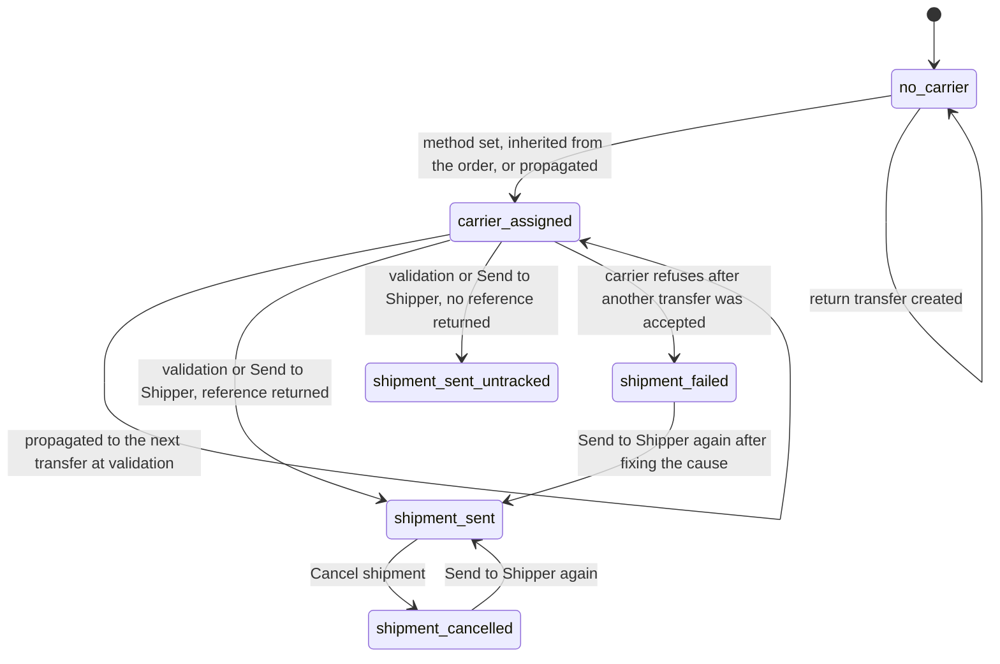
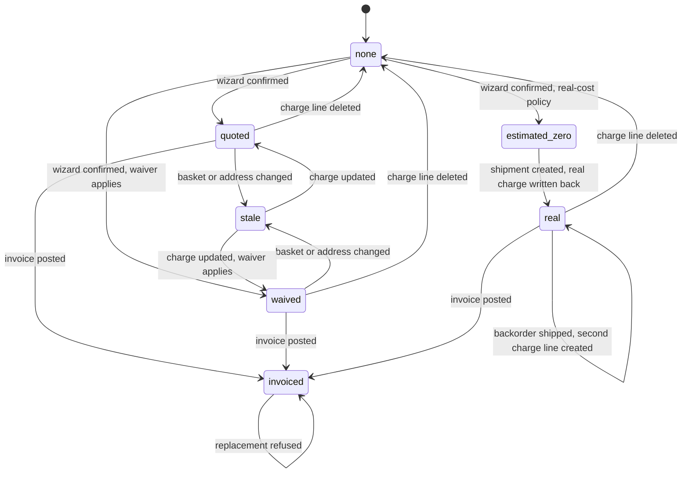
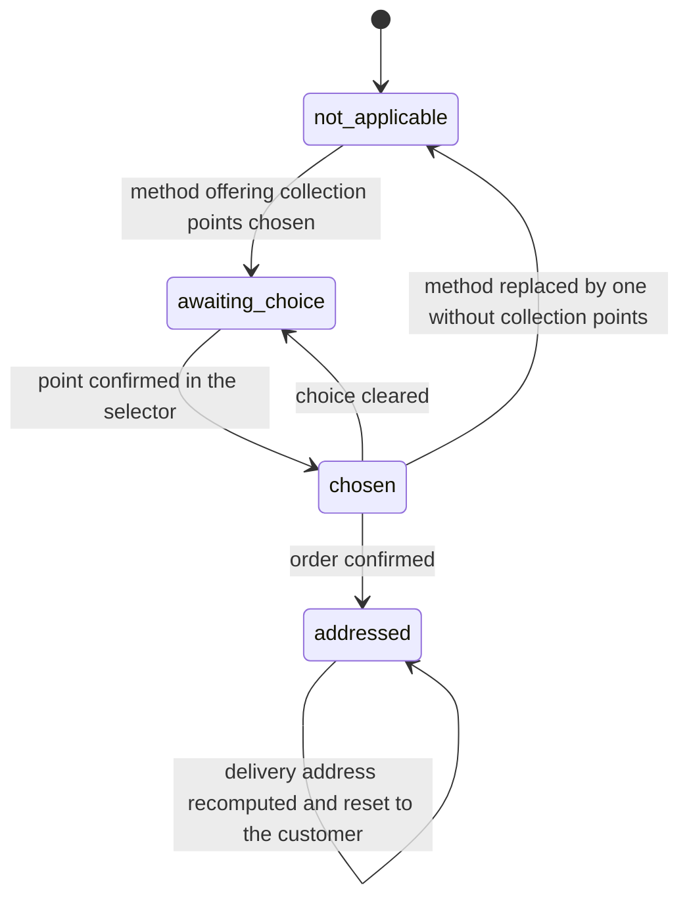
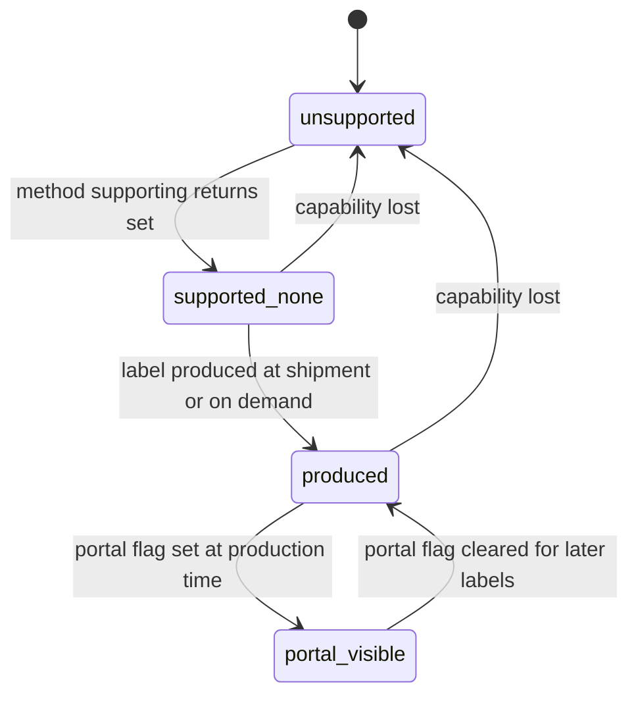
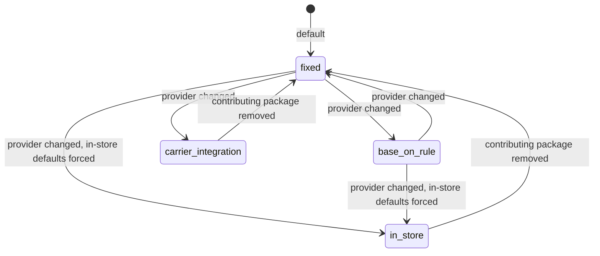
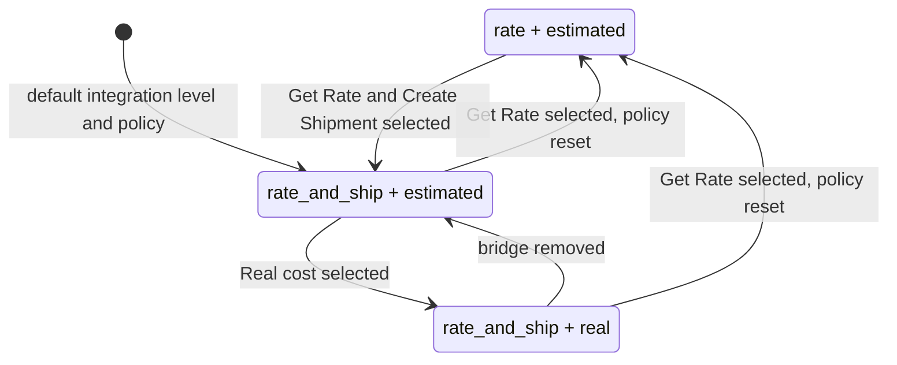
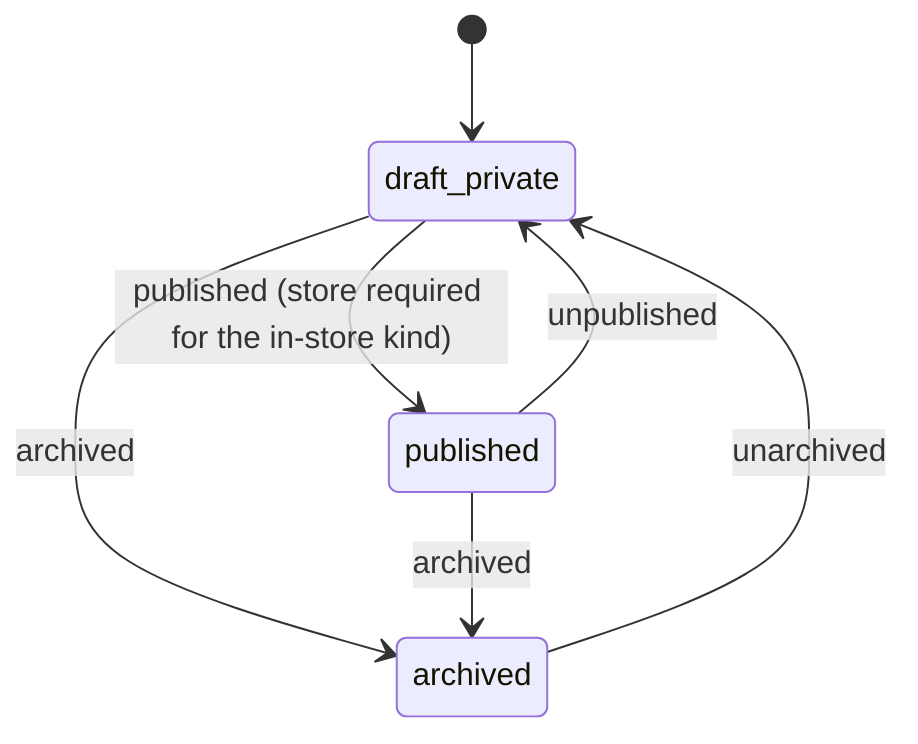

# State machines

The Delivery and Shipping domain stores no state column of its own. What it does store is a small
set of fields whose combinations form well-defined lifecycles, and a set of selection fields whose
value changes rewrite other fields. This file specifies all of them the way a stored state field
would be specified: every state with the field combination that defines it, its label and its
meaning; every transition with its origin, its destination, the operation that triggers it, the
conditions that must hold and the records it creates or changes; the exact refusal message of every
guard; and a diagram per machine.

Seven machines are specified:

| # | Machine | Carried by |
|---|---|---|
| 1 | Shipment lifecycle of a Transfer | `carrier_id`, `carrier_tracking_ref`, `carrier_price` on the Transfer |
| 2 | Shipping charge lifecycle of a Sales Order | `carrier_id`, `delivery_set`, `recompute_delivery_price`, the charge line's price and invoiced quantity |
| 3 | Collection point lifecycle of a Sales Order | `pickup_location_data` on the order, `is_pickup_location` on the address |
| 4 | Return label lifecycle of a Transfer | `return_label_ids`, `return_label_on_delivery`, `get_return_label_from_portal` |
| 5 | Provider kind of a Delivery Method | `delivery_type` |
| 6 | Integration level and invoicing policy of a Delivery Method | `integration_level`, `invoice_policy` |
| 7 | Publication of a Delivery Method | `active`, `is_published` |

Cross-references to the guards use the rule identifiers of
[business-rules.md](business-rules.md).

---

## 1. Shipment lifecycle of a Transfer

### 1.1 States

| State | Defining condition | Label | Meaning |
|---|---|---|---|
| `no_carrier` | `carrier_id` empty | No carrier | Nobody has been asked to carry these goods. No shipment will be created when the transfer is validated, and the tracking button is hidden. |
| `carrier_assigned` | `carrier_id` set, `carrier_tracking_ref` empty, transfer not yet done | Carrier assigned | A Delivery Method is chosen. Whether a shipment will be created at validation depends on the method's integration level and on the operation type's shipping-label flag. |
| `shipment_sent` | `carrier_id` set, `carrier_tracking_ref` set, `carrier_price` written | Sent to carrier | The carrier accepted the shipment, returned a charge and a tracking reference, and labels were attached. The tracking page and the cancellation button become available. |
| `shipment_sent_untracked` | `carrier_id` set, `carrier_tracking_ref` empty, `carrier_price` written, transfer done | Sent without tracking | The sending routine ran and returned a charge but no tracking reference. This is the normal outcome of the two core kinds, whose sending routines return no reference. |
| `shipment_failed` | `carrier_id` set, transfer done, a warning activity of the carrier kind open on the transfer | Shipment failed | The carrier refused the shipment while another transfer of the same validation batch had already been accepted, so the refusal was recorded as a warning instead of aborting the validation. |
| `shipment_cancelled` | `carrier_id` set, `carrier_tracking_ref` cleared after having been set, cancellation message in the history | Shipment cancelled | The shipment was voided with the carrier. The transfer itself stays done; only the shipment is gone. |

The states are *not* mutually exclusive with the Transfer's own state, which is owned by
[`../inventory-operations/`](../inventory-operations/). A transfer can be in `carrier_assigned`
while it is draft, waiting, ready or done.

### 1.2 Transition table

| # | From | To | Trigger | Guards | Records created or changed |
|---|---|---|---|---|---|
| T1 | `no_carrier` | `carrier_assigned` | A user sets the Carrier on the transfer form, or a list mass-edit sets it | The method must be in `allowed_carrier_ids`, so it must pass the availability filter for this transfer (DSH-010 to DSH-015); the method's company must be compatible with the transfer's company (DSH-043); the transfer must not be done or cancelled | `carrier_id` written on the Transfer |
| T2 | `no_carrier` | `carrier_assigned` | A Sales Order is confirmed and the outgoing transfer is created | The order carries a Delivery Method | `carrier_id` written on the new Transfer from the order |
| T3 | `no_carrier` | `carrier_assigned` | A shipping charge is added to an already confirmed Sales Order | The transfer is neither done nor cancelled and contains no move that returns another move | `carrier_id` written on every such pending transfer of the order |
| T4 | `no_carrier` | `carrier_assigned` | A transfer of a multi-step route is created for moves whose rule propagates the carrier | At least one rule of the moves carries the propagation flag; either the referenced sales orders name exactly one method, or the origin transfers name exactly one method — the origin transfers win when both are available | `carrier_id` and, when an origin transfer has one, `carrier_tracking_ref` written on the new Transfer |
| T5 | `carrier_assigned` | `carrier_assigned` (next transfer) | An earlier transfer of the same route that carries a method is validated | The next transfers are not returns, carry no method yet, and at least one rule of their moves carries the propagation flag | `carrier_id` and `carrier_tracking_ref` copied onto each next Transfer |
| T6 | `carrier_assigned` | `shipment_sent` | The transfer is validated, or the "Send to Shipper" button is pressed on a done outgoing transfer | The method's integration level is `rate_and_ship`; the operation kind is not incoming; the tracking reference is still empty; the operation type's shipping-label flag is set; the sending routine returns a tracking reference | `carrier_price` written; `carrier_tracking_ref` written on this transfer and propagated along the chain; label attachments created; a message posted; for a `real` invoicing policy a shipping charge line created or updated on the Sales Order |
| T7 | `carrier_assigned` | `shipment_sent_untracked` | Same trigger as T6 | Same guards as T6 except that the sending routine returns no tracking reference | `carrier_price` written; a message posted carrying an empty reference; for a `real` invoicing policy a shipping charge line created or updated |
| T8 | `carrier_assigned` | `shipment_failed` | The transfer is validated together with at least one other carrier transfer that was already accepted, and the sending routine refuses | The refusal is a user-level refusal; at least one carrier transfer of the same batch was already processed | A message carrying the refusal text is posted; a warning activity dated today is scheduled on the transfer for the transfer's responsible user, or for the validating user when the transfer has none; the transfer itself stays validated |
| T9 | `carrier_assigned` | *(validation aborted)* | The transfer is validated alone, or as the first carrier transfer of the batch, and the sending routine refuses | No carrier transfer of the batch was processed yet | Nothing is written; the whole validation is undone and the refusal is shown to the user |
| T10 | `shipment_sent` | `shipment_cancelled` | The "Cancel" button beside the tracking reference is pressed | The transfer is done; the tracking reference is set; the provider kind is neither `fixed` nor `base_on_rule`; the user confirms the prompt "Cancelling a delivery may not be undoable. Are you sure you want to continue?" | The cancellation routine is called; a message "Shipment <tracking reference> cancelled" is posted; `carrier_tracking_ref` is cleared |
| T11 | `shipment_cancelled` | `shipment_sent` | The "Send to Shipper" button is pressed again | Same guards as T6; the tracking reference is empty again after T10 | As T6 |
| T12 | any | `no_carrier` | A return transfer is created from this transfer | — | The new return Transfer is created with `carrier_id` empty and `carrier_price` zero, whatever the source transfer carried |

### 1.3 Guards in order, with their refusal messages

For transition **T6** the guards are evaluated in this order:

1. The transfer carries a Delivery Method. When it does not, nothing happens; this is a silent
   skip, not a refusal.
2. The method's integration level is `rate_and_ship`. When it is `rate`, nothing happens.
3. The operation kind is not incoming. When it is, nothing happens.
4. The tracking reference is empty. When it is not, nothing happens — a shipment is never created
   twice for the same transfer.
5. The operation type's shipping-label flag is set. When it is not, nothing happens.
6. The provider's sending routine exists for the method's kind. When it does not, the routine
   returns nothing and the step that reads the first result fails; a carrier integration is
   therefore required to supply one. This is recorded as **compatibility finding** DSH-057.
7. The sending routine itself may refuse. A refusal carries the carrier's own text; the system does
   not rewrite it. The two core kinds never refuse, except that the rule-based kind refuses with
   "There is no matching delivery rule." when the destination address does not match the method's
   country, region and postal-code filters.

For transition **T10** the guards are:

1. The button is only rendered when the transfer is done, the tracking reference is set and the
   provider kind is neither `fixed` nor `base_on_rule` and is not empty.
2. The cancellation routine must exist for the method's kind. The two core kinds declare the
   routine but leave it unimplemented, so calling it on a fixed or rule-based method fails. The
   interface prevents this by hiding the button for those two kinds; a caller that reaches the
   operation another way gets a failure with no user-facing text. This is recorded as
   **compatibility finding** DSH-056.

### 1.4 Diagram

---

## 2. Shipping charge lifecycle of a Sales Order

### 2.1 States

| State | Defining condition | Label | Meaning |
|---|---|---|---|
| `none` | `delivery_set` false | No shipping charge | The order carries no shipping charge line. The "Add shipping" button is offered when the order has lines and they are not all services. |
| `quoted` | `delivery_set` true, `recompute_delivery_price` false | Charge quoted | A shipping charge line exists and matches the current basket. The charge line shows the amount the customer will pay. |
| `stale` | `delivery_set` true, `recompute_delivery_price` true | Charge out of date | The basket, the customer or the delivery address changed after the charge was computed. The charge line is highlighted in amber and the "Update shipping cost" button is highlighted in amber. Nothing forbids confirming the order in this state. |
| `waived` | `delivery_set` true, charge line price zero, method's waiver flag set | Charge waived | The order total without carriage reached the threshold, so the customer is charged nothing. The charge line's description carries the free-shipping annotation and the order's delivery message carries the waiver notice. |
| `estimated_zero` | `delivery_set` true, charge line price zero, method's invoicing policy `real` | Charge to be determined | The method charges the real cost. The line is created at zero and its description carries the estimate in brackets. |
| `real` | `delivery_set` true, charge line price equal to the transfer's shipping cost | Real charge applied | A shipment was created and its charge replaced the zero estimate. The bracketed estimate is removed from the description. |
| `invoiced` | charge line's invoiced quantity greater than zero | Charge invoiced | The charge has reached a customer invoice and can no longer be removed or replaced. |

### 2.2 Transition table

| # | From | To | Trigger | Guards | Records created or changed |
|---|---|---|---|---|---|
| S1 | `none` | `quoted` | The selection wizard is confirmed | The rate request succeeded; see DSH-017 to DSH-025 | Existing charge lines removed; `carrier_id` written on the order; one Sales Order Line created with the charge; `recompute_delivery_price` cleared; `delivery_message` copied from the wizard |
| S2 | `none` | `waived` | The selection wizard is confirmed for a method whose waiver applies | The method's waiver flag is set, its kind is not `base_on_rule`, and the order total without carriage converted into the company currency reaches the threshold | As S1, with a charge of zero and the description extended with a line break and the reproduced text "Free Shipping" |
| S3 | `none` | `estimated_zero` | The selection wizard is confirmed for a method whose invoicing policy is `real` | The method's invoicing policy is `real` | As S1, with the price forced to zero and the description extended with " (Estimated Cost: <formatted charge>)" |
| S4 | `quoted` or `waived` | `stale` | A line is added, changed or removed, or the customer or the delivery address changes | A shipping charge line exists | `recompute_delivery_price` set to true on the order |
| S5 | `stale` | `quoted` | The wizard is re-confirmed through "Update shipping cost" | The existing charge lines must all be uninvoiced (DSH-026) | Existing charge lines removed and one new line created; `recompute_delivery_price` cleared |
| S6 | any charged state | `none` | The shipping charge line is deleted, or the method is replaced | Every charge line to be removed must have an invoiced quantity of zero (DSH-026) | Charge lines deleted; when the last one goes, the order's `carrier_id` is cleared and, in the storefront, `pickup_location_data` is emptied unless the caller asked to keep it |
| S7 | `estimated_zero` | `real` | An outgoing transfer of the order is validated and the shipment is created | The method's invoicing policy is `real` and the returned charge is not zero | The first matching charge line — a shipping charge line priced at zero in the order currency whose product is the method's delivery product — receives the transfer's shipping cost as its price and the method's plain name as its description; when no such line exists a new charge line is created first |
| S8 | `real` | `real` | A backorder of the same order is validated | Same as S7 | Because the first charge line is no longer priced at zero, no line matches and a second charge line is created for the backorder's own shipping cost |
| S9 | `quoted`, `waived`, `real` | `invoiced` | An invoice is created from the order and posted | The charge line's invoicing policy makes it invoiceable | The charge line's invoiced quantity becomes one |
| S10 | `invoiced` | *(refused)* | The wizard tries to replace the charge | Every charge line has a non-zero invoiced quantity | Nothing changes; the operation is refused with the message given in DSH-026 |

### 2.3 Guards in order, with their refusal messages

Removing the shipping charge lines, which every replacement starts with, proceeds as follows:

1. Collect the shipping charge lines of the order. When there are none, stop; this is not an error.
2. Keep only those whose invoiced quantity is zero.
3. When that subset is empty, refuse with the text reproduced below, where the first placeholder is
   a newline-separated list of the processed lines, one per line, each written as a hyphen, a
   space, the product's display name without its internal code, a colon, the invoiced quantity, the
   word between them being a lowercase letter x surrounded by spaces, and the unit price:

   "You can not update the shipping costs on an order where it was already invoiced!

   The following delivery lines (product, invoiced quantity and price) have already been processed:

   "

4. Otherwise delete the uninvoiced lines.

A shipping charge line is exempt from the rule that forbids deleting a line of a confirmed order:
the domain removes shipping charge lines from the set of lines that cannot be deleted, so that a
salesperson may always re-price the carriage of a confirmed order that has not been invoiced.

### 2.4 Diagram

---

## 3. Collection point lifecycle of a Sales Order

A collection point is either a point of a carrier's own network, offered by a carrier integration,
or one of the seller's own stores, offered by the in-store kind. Both travel through the same
field.

### 3.1 States

| State | Defining condition | Label | Meaning |
|---|---|---|---|
| `not_applicable` | The order's method does not offer collection points | Not applicable | The method declares no pickup-location flag, or declares it as false. The selector is not shown. |
| `awaiting_choice` | The method offers points, `pickup_location_data` empty | Awaiting a choice | The selector is shown. In the storefront, payment is blocked. |
| `chosen` | `pickup_location_data` set, the order is still a quotation | Point chosen | The point's description is stored on the order. For the in-store kind the order's warehouse and fiscal position have been recomputed from it. |
| `addressed` | The order is confirmed and `partner_shipping_id` points at an address flagged as a pickup point | Point turned into an address | Confirmation turned the stored description into a child delivery address of the customer's delivery address, reusing an identical one when it exists. |

### 3.2 Transition table

| # | From | To | Trigger | Guards | Records created or changed |
|---|---|---|---|---|---|
| P1 | `not_applicable` | `awaiting_choice` | A method that offers collection points is set on the order | The method declares a pickup-location flag and that flag is true | Nothing; the selector appears |
| P2 | `awaiting_choice` | `chosen` | The customer or the salesperson confirms a point in the selector | The selector's save operation carries a non-empty description | `pickup_location_data` written. For the in-store kind: `warehouse_id` set to the store, the fiscal position recomputed from the store's address, and the taxes recomputed when the fiscal position changed |
| P3 | `chosen` | `awaiting_choice` | The stored description is cleared, or the shipping charge line is removed in the storefront | The caller did not ask to keep the collection point | `pickup_location_data` emptied; for the in-store kind the warehouse is recomputed the ordinary way |
| P4 | `chosen` | `not_applicable` | The order's method is replaced by one that does not offer collection points | — | The charge line is replaced; `pickup_location_data` emptied; for an order that was in-store, the warehouse and the fiscal position are recomputed and the taxes are recomputed when the fiscal position changed |
| P5 | `chosen` | `addressed` | The order is confirmed | The stored description carries a street, a city, a postal code and a country code | An existing child delivery address with the same street, city, region and country is reused; otherwise a Contact is created as a delivery address under the order's current delivery address, carrying the point's name or the delivery address's name, the point's street, city, postal code, region and country, the delivery address's electronic mail address and telephone number, and the pickup-point flag. The order's delivery address is then replaced by it |
| P6 | `addressed` | `addressed` | The order's delivery address is recomputed | The computed address carries the pickup-point flag | The delivery address is reset to the customer, because a pickup point must never become a customer's default delivery address |

### 3.3 Guards, with their refusal messages

- For a parcel-point integration the wizard refuses to confirm without a chosen point:
  "Please, choose a Parcel Point".
- For a parcel-point integration the order refuses to confirm when the method and the delivery
  address disagree about being parcel-point records: "Mondial Relay mismatching between delivery
  method and shipping address." When several orders are confirmed together, the message is followed
  by a space, an opening parenthesis, the comma-separated names of the disagreeing orders and a
  closing parenthesis.
- For the in-store kind the storefront refuses to reach payment without a chosen store, with the
  two-part message "Sorry, we are unable to ship your order." and "Please choose a store to collect
  your order."
- For the in-store kind the storefront refuses to reach payment when the chosen store cannot supply
  every line: "Sorry, we are unable to ship your order." and "Some products are not available in
  the selected store." The same second sentence is raised as a validation refusal when the cart is
  checked immediately before payment.

### 3.4 Diagram

---

## 4. Return label lifecycle of a Transfer

### 4.1 States

| State | Defining condition | Label | Meaning |
|---|---|---|---|
| `unsupported` | The method's return capability flag is false | Returns not supported | The two core kinds and the in-store kind are always here. No return label can be produced. |
| `supported_none` | The capability flag is true, `return_label_ids` empty | No return label yet | A return label can be produced but none exists. |
| `produced` | `return_label_ids` not empty | Return label produced | At least one attachment whose name begins with the method's return-label prefix exists on the transfer. |
| `portal_visible` | `produced` and the portal flag is set | Return label published | The attachments carry access tokens, so the customer can download them from the order's portal page. |

### 4.2 Transition table

| # | From | To | Trigger | Guards | Records created or changed |
|---|---|---|---|---|---|
| R1 | `unsupported` | `supported_none` | A Delivery Method whose kind supports returns is set on the transfer | The method's capability computation returns true for its kind | Nothing stored; the computed capability changes |
| R2 | `supported_none` | `produced` | The outgoing shipment is created and the method asks for a return label at delivery | The automatic-return flag is set on the method | The carrier's return-label routine is called; one or more attachments named with the prefix `LabelReturn-<provider kind>` are created on the transfer |
| R3 | `supported_none` | `produced` | The "Print Return Label" button is pressed on an incoming transfer | The transfer is a return — the method supports returns and at least one move both originates in a returned move and ends in an internal location — the transfer is not done, and the operation kind is incoming | As R2 |
| R4 | `produced` | `portal_visible` | The same operation as R2 or R3, when the portal flag is set | The method's portal flag is set | An access token is generated on each return-label attachment |
| R5 | `portal_visible` | `produced` | The portal flag is cleared on the method | — | New labels no longer receive a token; existing tokens are not removed |
| R6 | any | `unsupported` | The method's capability flag becomes false | — | The automatic-return flag is cleared, which in turn clears the portal flag |

### 4.3 Guards

The automatic-return flag is cleared by the form as soon as the capability flag is false, and the
portal flag is cleared by the form as soon as the automatic-return flag is false. Both are
on-screen adjustments, not stored constraints: a programmatic write can leave the three flags
inconsistent, in which case the return-label routine is simply never called because the capability
flag is checked first.

### 4.4 Diagram

---

## 5. Provider kind of a Delivery Method

The provider kind is a genuine stored selection field. Changing it does not move a record through a
business lifecycle, but it does rewrite other fields and change which routines apply, so it is
specified here as a machine.

### 5.1 States

| Stored value | Label | Meaning |
|---|---|---|
| `fixed` | Fixed Price | The charge is the price of the delivery product under the order's price list. Margins are ignored. No shipment is created with any carrier. |
| `base_on_rule` | Based on Rules | The charge is produced by the ordered Delivery Price Rules. Margins apply. The free-above-a-threshold waiver is not applied by the rating step. No shipment is created with any carrier. |
| `in_store` | Pick up in store | The customer collects the goods from one of the seller's stores. The charge is the delivery product's sales price. Added by the collection-in-store package. |
| *(one per carrier integration)* | *(the integration's own label)* | The charge and the shipment come from an external carrier's computer system. Added by a carrier integration package, which also supplies the routines listed in [entities.md](entities.md) section 1.4. |

### 5.2 Transition table

| # | From | To | Trigger | Guards | Records created or changed |
|---|---|---|---|---|---|
| K1 | any | `in_store` | The kind is set to `in_store` on creation | — | The integration level is forced to `rate`; cash on delivery is cleared; the country, region and postal-code filters are cleared; every warehouse of the resolved company is attached as a store; the method is published when at least one warehouse was found. The company is taken from the supplied company, failing that from the delivery product's company, failing that from the current company |
| K2 | any | `in_store` | The kind is set to `in_store` on a later write | — | The same four forced values as K1. The stores are **not** recomputed, so a method switched to the in-store kind after creation has no store and cannot be published until stores are added by hand. This is recorded as **compatibility finding** DSH-059 |
| K3 | `rate_and_ship` integrations | any | The kind is changed | — | The screen hides the integration level, the invoicing policy, the environment button and the debug button for the two core kinds and for the in-store kind, but the stored values are not rewritten |
| K4 | any | *(value removed)* | The package that contributed the kind is removed | — | Each contributing package declares what happens to its own value; the collection-in-store package declares that an `in_store` method falls back to the default kind, `fixed` |

### 5.3 Diagram

---

## 6. Integration level and invoicing policy

These two selection fields interact, so they are specified as one machine.

### 6.1 States

| Combination | Meaning |
|---|---|
| `rate` + `estimated` | The carrier is only asked for a price. The customer pays the estimate. No shipment is created, no label is produced and no tracking reference is stored automatically. |
| `rate_and_ship` + `estimated` | The carrier is asked for a price when the method is chosen, and for a shipment when the outgoing transfer is validated. The customer pays the estimate; the charge the carrier actually asked for is stored on the transfer but never written back onto the order. |
| `rate_and_ship` + `real` | The carrier is asked for a price when the method is chosen, but the charge line is created at zero with the estimate in brackets. The charge the carrier asks for at shipment time replaces it. |
| `rate` + `real` | Unreachable through the interface: selecting the `rate` level resets the policy to `estimated`, and the policy control is hidden while the level is `rate`. A programmatic write can create the combination, in which case no shipment is ever created and the charge line stays at zero for ever. This is recorded as **compatibility finding** DSH-055. |

### 6.2 Transition table

| # | From | To | Trigger | Guards | Records created or changed |
|---|---|---|---|---|---|
| I1 | `rate_and_ship` | `rate` | The user selects "Get Rate" | — | The invoicing policy is reset to `estimated` by the form |
| I2 | `rate` | `rate_and_ship` | The user selects "Get Rate and Create Shipment" | — | The invoicing policy control becomes visible, still holding `estimated` |
| I3 | `estimated` | `real` | The user selects "Real cost" | The integration level must be `rate_and_ship` for the control to be visible | Nothing else changes; the effect is felt at the next confirmation of the selection wizard |
| I4 | `real` | `estimated` | The Delivery – Inventory bridge is removed | — | Every method whose policy is `real` falls back to `estimated` |

### 6.3 Diagram

---

## 7. Publication of a Delivery Method

### 7.1 States

| State | Defining condition | Label | Meaning |
|---|---|---|---|
| `draft_private` | `active` true, `is_published` false | Not published | Available in the back office, never offered in the storefront. |
| `published` | `active` true, `is_published` true | Published | Offered in the storefront to every website when `website_id` is empty, and only to the named website otherwise, and only for a compatible company. |
| `archived` | `active` false | Archived | Hidden everywhere. The publication flag keeps its value but has no effect. |

### 7.2 Transition table

| # | From | To | Trigger | Guards | Records created or changed |
|---|---|---|---|---|---|
| W1 | `draft_private` | `published` | The publish switch is turned on | For an in-store method, at least one store must be attached, otherwise the write is refused with "The delivery method must have at least one warehouse to be published." (DSH-041) | `is_published` set |
| W2 | `published` | `draft_private` | The publish switch is turned off | — | `is_published` cleared. For a website whose only in-store method this was, collection in store becomes unavailable and the product page stops advertising in-store stock |
| W3 | `draft_private` or `published` | `archived` | The method is archived | — | `active` cleared. The method disappears from the wizard's available list, from the transfer's allowed list and from the storefront |
| W4 | `archived` | `draft_private` or `published` | The method is unarchived | — | `active` set; the publication flag is unchanged |
| W5 | `draft_private` | `published` | An in-store method is created with at least one warehouse in the resolved company | The creation routine sets both the stores and the flag in one write, so W1's guard is satisfied by construction | `warehouse_ids` and `is_published` written together |

### 7.3 Diagram

---

## 8. Interaction between the machines

Three interactions are worth stating explicitly, because a rebuild that implements the machines
separately will get them wrong:

1. **Machine 1 feeds machine 2.** Transition T6 or T7 triggers transition S7 whenever the method's
   invoicing policy is `real` and the returned charge is not zero. The order is written from the
   transfer, not the other way round, and the write bypasses the order's field protection.
2. **Machine 2 feeds machine 1.** Transition S1 on a confirmed order triggers transition T3 on
   every pending transfer of that order. A transfer that is already done keeps the method it had,
   and a return transfer never receives one.
3. **Machine 3 feeds machine 5 indirectly.** Choosing an in-store collection point sets the order's
   warehouse, which sets the fiscal position, which may change every tax on the order. Replacing
   the in-store method by any other undoes all three. Neither change touches the shipping charge
   line's own price, which is recomputed by machine 2's transitions.
