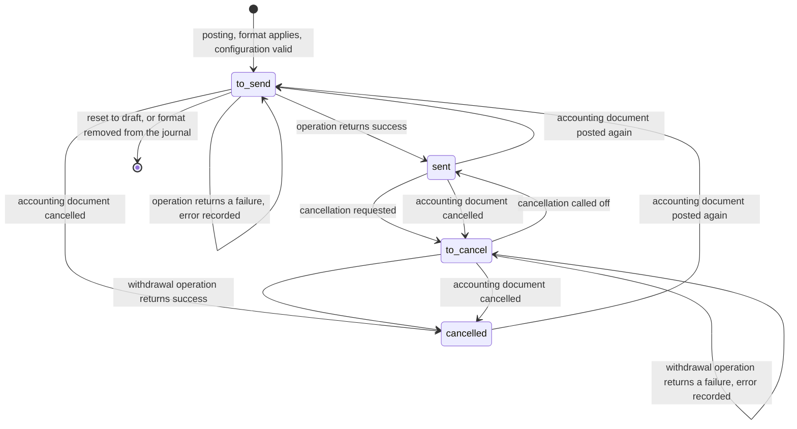
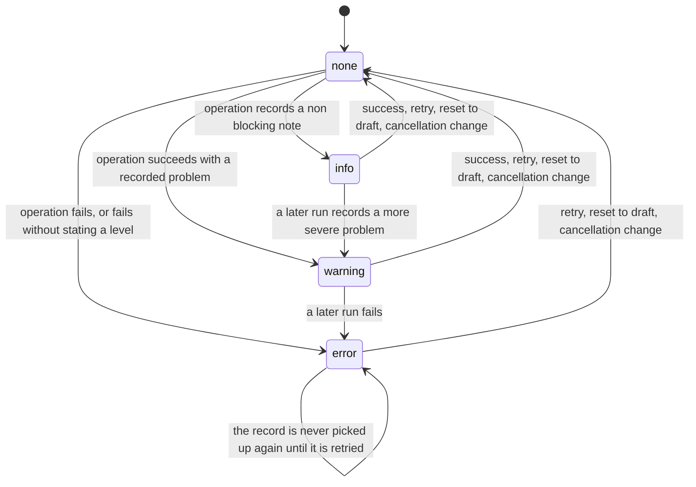
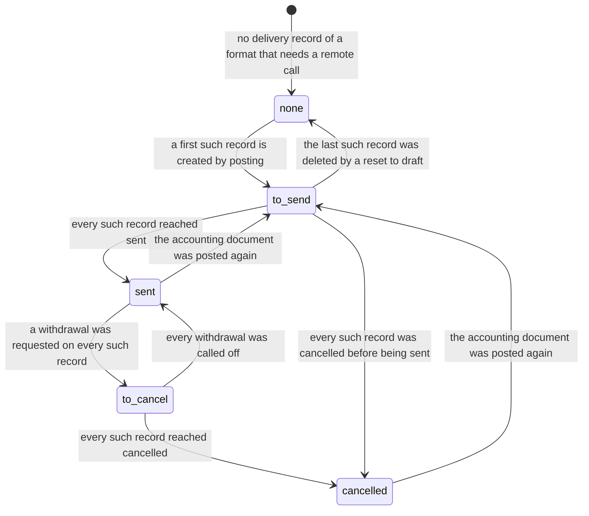
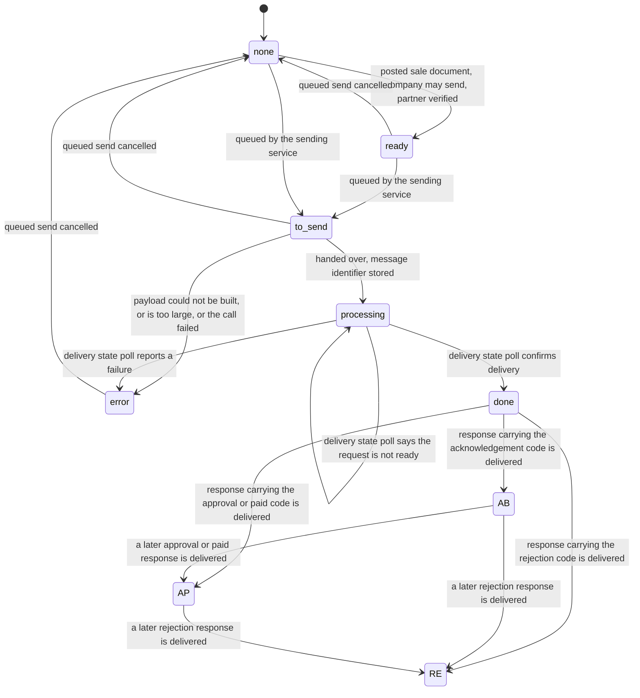
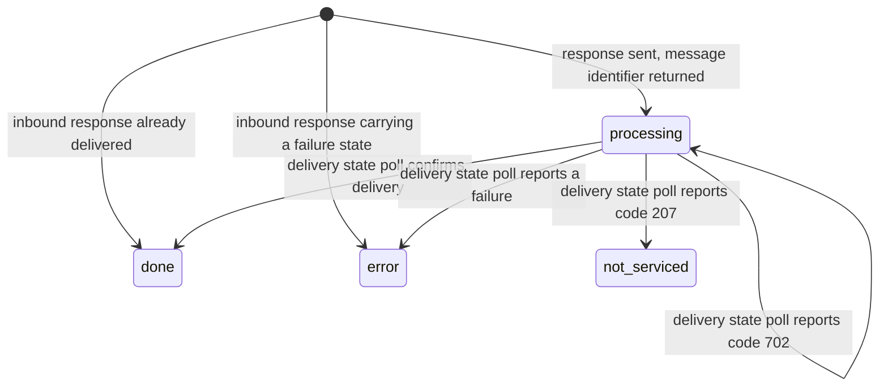
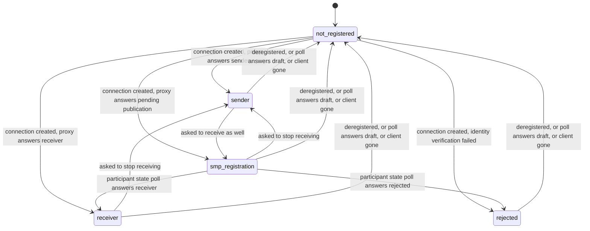
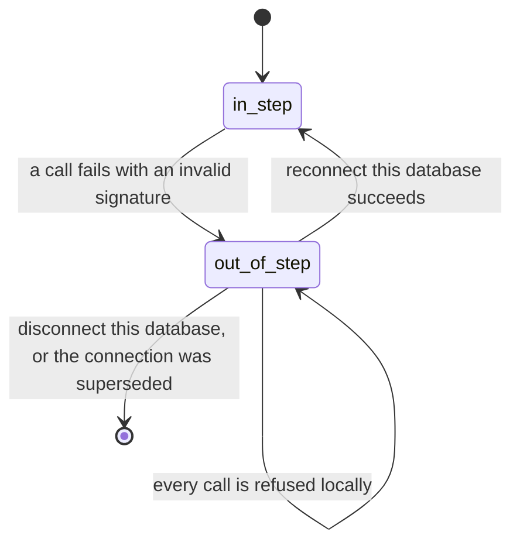
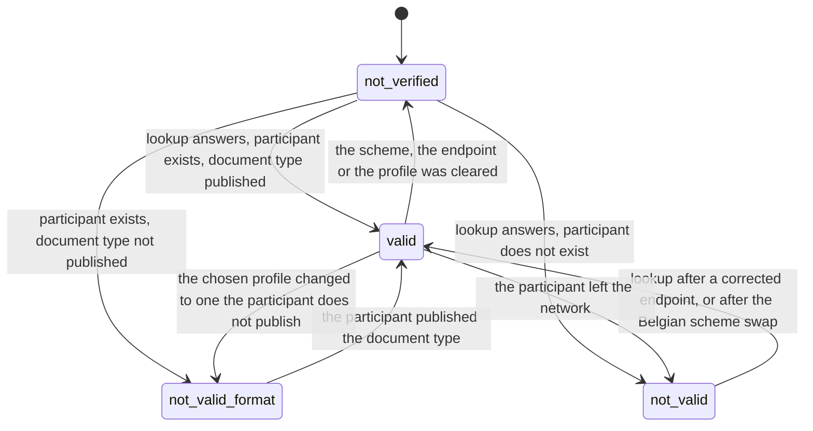
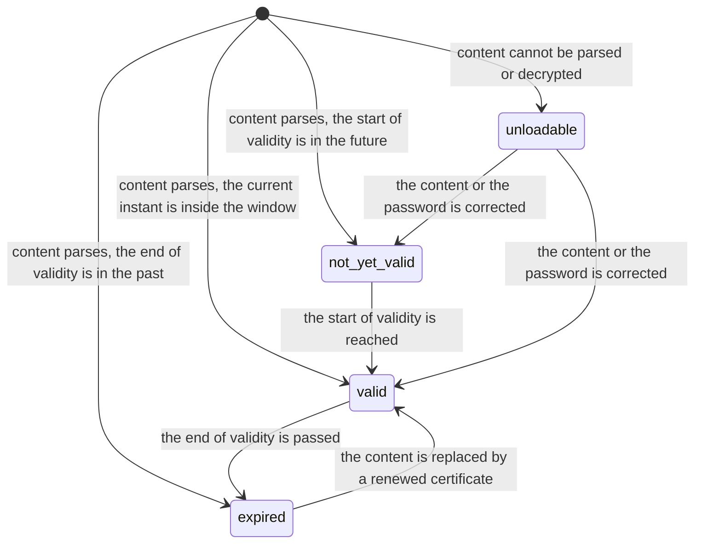

# State machines

Every stored or derived state field of the Electronic Invoicing and Document Exchange domain, in one place. For each machine this document gives the complete list of states with their stored value, their label and their meaning; the complete transition table with origin, destination, triggering operation, guard conditions and the records created or changed; the guards of each transition in the order in which they are evaluated, with the exact text of the refusal when a guard fails; and a diagram.

The domain owns eleven machines.

| Number | Machine | Carrier | Kind |
|---|---|---|---|
| 1 | Delivery state of an Electronic Document | Electronic Document, field `state` | stored, written by the framework |
| 2 | Blocking level of an Electronic Document | Electronic Document, field `blocking_level` | stored severity ladder |
| 3 | Aggregated delivery state of an accounting document | Journal Entry, field `electronic_document_state` | derived and stored |
| 4 | Aggregated blocking level and error message of an accounting document | Journal Entry, fields `electronic_document_blocking_level` and `electronic_document_error_message` | derived, not stored |
| 5 | Network state of an accounting document | Journal Entry, field `network_document_state` | derived and stored |
| 6 | Delivery state of a business response | Peppol Business Response, field `delivery_state` | stored |
| 7 | Registration state of a company on the exchange network | Company, field `participant_state` | stored |
| 8 | Token synchronisation state of a proxy credential | Electronic Interchange Proxy User, field `is_token_out_of_step` | stored, two values |
| 9 | Archival state of a proxy credential | Electronic Interchange Proxy User, field `active` | stored, two values |
| 10 | Verification state of a trading partner | Contact, field `participant_verification_state` | stored per company |
| 11 | Validity state of a Digital Certificate | Digital Certificate, derived from the validity window and the loading error | derived, not stored |

Three further selection fields of the domain are fixed classifications rather than machines, because no operation moves a record from one value to another: the operating mode of a proxy credential (`prod`, `test`, `demo`), the scope of a certificate (`general`), and the original format of a certificate (`der`, `pem`, `pkcs12`). Each is enumerated in [entities.md](entities.md). The response code of a business response (`AB`, `IP`, `UQ`, `CA`, `RE`, `AP`, `PD`) is likewise a classification, fixed at creation and never changed; it is enumerated in [peppol-network.md](peppol-network.md) and it drives machine 5.

Every rule identifier quoted below is defined in [business-rules.md](business-rules.md). The procedures that fire these transitions are written out step by step in [workflows.md](workflows.md).

---

# 1. Delivery state of an Electronic Document

**Carrier.** Electronic Document, field `state`, stored, not copied when the accounting document is duplicated.

One Electronic Document exists per accounting document per registered format. The field records where that one pairing stands: waiting to be handed over, handed over, waiting to be withdrawn, withdrawn.

## 1.1 States

| Stored value | Label | Meaning |
|---|---|---|
| (empty) | none | The record does not exist yet. The framework never stores an empty value on an existing record: an Electronic Document is always created with the value `to_send`. The empty value is listed because it is the origin of the creation transition. |
| `to_send` | To Send | The accounting document is posted, the format applies to it, and the payload has not yet been produced or has not yet been accepted by the remote service. A record in this state is picked up by the sending scheduled action unless its blocking level is `error`. |
| `sent` | Sent | The format has produced the payload and, for a format that needs a remote call, the remote service has accepted it. The produced file is stored on the record. |
| `to_cancel` | To Cancel | A withdrawal of an already accepted payload has been asked for and has not yet been granted by the remote service. A record in this state is picked up by the sending scheduled action unless its blocking level is `error`. |
| `cancelled` | Cancelled | Either the remote service granted the withdrawal, or the accounting document was cancelled before the payload was ever accepted. The produced file is cleared when the withdrawal was granted. |

## 1.2 Transition table

| From | To | Trigger | Guards, in evaluation order | Records created or changed |
|---|---|---|---|---|
| (empty) | `to_send` | Posting an accounting document | 1. the journal of the accounting document declares the format; 2. the format declares an applicability for that accounting document; 3. the format reports no configuration error for that accounting document | One Electronic Document is created with the format, the accounting document and the state `to_send`. |
| `sent`, `to_cancel`, `cancelled` | `to_send` | Posting the same accounting document again | same three guards | The existing Electronic Document of that format is reused: the state is written to `to_send` and the stored file is cleared. No second record is created, because at most one record may exist per pairing. |
| `to_send` | `sent` | Processing a job of the posting flow, from the immediate processing of formats that need no remote call, from the sending scheduled action, or from the manual processing operation | 1. the blocking level is not `error`; 2. the accounting document is posted, for the scheduled action only; 3. the operation of the format returns success for that accounting document | The state becomes `sent`; the error text and the blocking level are cleared; the returned file, when the operation returned one, replaces the stored file, and the previously stored file is deleted when it was not linked to a business record. |
| `to_send` | `to_send` | The same triggers as the previous row, when the operation returns a failure | 1. the blocking level is not `error` | The state is unchanged. The error text receives the returned text, or is cleared when the result carries none. The blocking level receives the returned level, defaulting to `error` when a text was returned without a level, and is cleared when no text was returned. |
| `to_send` | (deleted) | Resetting the accounting document to draft | 1. no Electronic Document of the accounting document makes the cancellation button visible, see rule **EIDI-RULE-041** | The error text and the blocking level are first cleared on every Electronic Document of the accounting document, then every record in `to_send` is deleted. |
| `to_send` | (deleted) | Removing the format from the journal | 1. the removed format needs no remote call | The records of the removed format on the journals concerned are deleted. A format that needs a remote call cannot be removed while such records exist; see rule **EIDI-RULE-004**. |
| `to_send`, `to_cancel` | `cancelled` | Cancelling the accounting document | none; every record not in `sent` is written | The state becomes `cancelled`; the error text and the blocking level are cleared. Records whose format needs no remote call are then processed immediately. |
| `sent` | `to_cancel` | Cancelling the accounting document | none; every record in `sent` is written | The state becomes `to_cancel`; the error text and the blocking level are cleared. Records whose format needs no remote call are then processed immediately. |
| `sent` | `to_cancel` | The cancellation request operation on the accounting document | 1. the fiscal lock dates of the accounting document allow the change; 2. the format needs a remote call; 3. the format declares an applicability for the accounting document; 4. the applicability declares a withdrawal operation | The collected records are written to `to_cancel` with the error text and the blocking level cleared. When at least one record was collected, the note `A cancellation of the EDI has been requested.` is posted in the discussion thread of the accounting document; inside that reproduced message the abbreviation expands to electronic data interchange. |
| `to_cancel` | `sent` | The call-off operation on the accounting document | 1. the format declares an applicability for the accounting document; 2. the applicability declares a withdrawal operation | The collected records are written back to `sent` with the error text and the blocking level cleared. When at least one record was collected, the note `A request for cancellation of the EDI has been called off.` is posted in the discussion thread. |
| `to_cancel` | `cancelled` | Processing a job of the cancellation flow | 1. the blocking level is not `error`; 2. the accounting document is posted, for the scheduled action only; 3. the withdrawal operation of the format returns success for that accounting document | The state becomes `cancelled`; the error text, the stored file and the blocking level are cleared; the previously stored file is deleted when it was not linked to a business record. When the accounting document is posted and every one of its Electronic Documents is now either `cancelled` or belongs to a format that needs no remote call, the accounting document is reset to draft and then cancelled. |
| `to_cancel` | `to_cancel` | The same trigger, when the withdrawal operation returns a failure | 1. the blocking level is not `error` | The state is unchanged. The error text receives the returned text, or is cleared when the result carries none. The blocking level receives the returned level, defaulting to `error` when a text was returned, and is cleared otherwise. |
| any | (deleted) | Deleting the accounting document | none | The Electronic Documents of that accounting document are deleted, because the link to the accounting document deletes the dependent record. |

## 1.3 Guards in order, with their refusals

**Posting.** The three guards are evaluated per format declared on the journal.

1. The format declares an applicability for the accounting document. A format that declares none is skipped silently: no record is created and the posting continues.
2. The format reports no configuration error. When it reports at least one, the whole posting is refused with `Invalid invoice configuration:\n\n%s`, where the placeholder is the collected error messages joined by a line break. The refusal rolls back the entire posting, including the general ledger part, so an accounting document is never posted with a format it cannot satisfy. This is rule **EIDI-RULE-031**.
3. When both guards pass, the record is created or reused.

**Cancellation request.** The guards are evaluated per accounting document and then per Electronic Document.

1. The fiscal lock dates of the accounting document allow a change. A failure raises the fiscal lock refusal of the general ledger domain; see [../general-ledger/business-rules.md](../general-ledger/business-rules.md).
2. Per record: the format needs a remote call, the format declares an applicability, and the applicability declares a withdrawal operation. A record failing any of the three is not collected. When no record of the accounting document is collected, no note is posted and nothing changes; the operation is silently a no-operation.

**Reset to draft.** The single guard is the visibility of the cancellation request button, which is true when the accounting document is posted and at least one of its Electronic Documents belongs to a format that needs a remote call, is in state `sent`, and whose applicability declares a withdrawal operation. When the guard fails the refusal is `You can't edit the following journal entry %s because an electronic document has already been sent. Please use the 'Request EDI Cancellation' button instead.`, where the placeholder is the display name of the accounting document and the abbreviation inside the quoted button name expands to electronic data interchange. This is rule **EIDI-RULE-041**.

**Job execution.** Before a job runs, the framework asserts that every record of the job shares one format, one company and one state. A job whose records do not share one state raises `All electronic documents of a job should have the same state`. A replacement must treat this as an internal consistency failure rather than as a user-facing validation, because job preparation cannot produce such a job.

**Locking.** Before a job of a format that needs a remote call is processed, the records of the job, their accounting documents and the files that may be deleted are locked. When the lock cannot be taken and the caller asked for no intermediate commits, the refusal is `This document is being sent by another process already. `; the trailing space is part of the reproduced message. When the caller allows intermediate commits, the job is skipped silently and left for the next run of the scheduled action.

## 1.4 Diagram

## 1.5 States reachable only by an automatic process

The state `cancelled` reached from `to_cancel` is only ever written by the sending scheduled action or by the manual processing operation, never directly by a user: a user asks for the withdrawal and the remote service grants it. The state `sent` reached from `to_send` for a format that needs no remote call is written inside the posting transaction itself, so it is reached without any scheduled action.

---

# 2. Blocking level of an Electronic Document

**Carrier.** Electronic Document, field `blocking_level`, stored.

The blocking level qualifies the error text stored on the same record. It is not a lifecycle: it is a severity that decides whether the record stays in the work queue.

## 2.1 States

| Stored value | Label | Meaning |
|---|---|---|
| (empty) | none | No error is recorded. The record is in the queue whenever its delivery state is `to_send` or `to_cancel`. |
| `info` | Info | Something was recorded that is not an error at all. The record stays in the queue and the current operation succeeded. |
| `warning` | Warning | An error occurred that did not prevent the current operation from succeeding. The record stays in the queue. |
| `error` | Error | An error occurred that blocks the current operation. The record is excluded from job preparation and is therefore never picked up by the scheduled action again until a user retries it. |

## 2.2 Transition table

| From | To | Trigger | Guards | Records changed |
|---|---|---|---|---|
| any | the level returned by the operation | An operation of the format returns a failure carrying a level | the record was in the job, therefore its level was not `error` | The blocking level and the error text are written together. |
| any | `error` | An operation of the format returns a failure carrying an error text but no level | same | The default level is `error`. |
| any | (empty) | An operation of the format returns success, or returns a failure carrying no error text | same | The blocking level and the error text are cleared together. |
| any | (empty) | The retry operation on the accounting document | none | The error text and the blocking level are cleared on **every** Electronic Document of the accounting document, whatever their level, and the records are then processed with intermediate commits. This is the only way out of `error`. |
| any | (empty) | Resetting the accounting document to draft | the reset is allowed, see machine 1 | The error text and the blocking level are cleared on every Electronic Document of the accounting document. |
| any | (empty) | Requesting a cancellation, calling a cancellation off, or cancelling the accounting document | the guards of the corresponding row of machine 1 | The error text and the blocking level are cleared on the records written. |

## 2.3 Diagram

---

# 3. Aggregated delivery state of an accounting document

**Carrier.** Journal Entry, field `electronic_document_state`, derived from the delivery states of its Electronic Documents and stored.

This field is never written directly. It is recomputed whenever the delivery state of any Electronic Document of the accounting document changes. Only records whose format needs a remote call are considered, so a document that carries only file-producing formats always shows an empty aggregated state.

## 3.1 States

| Stored value | Label | Meaning |
|---|---|---|
| (empty) | none | The accounting document has no Electronic Document of a format that needs a remote call, or the collected states match none of the rules below. |
| `to_send` | To Send | At least one delivery record still has to be handed over. |
| `sent` | Sent | Every delivery record of a format that needs a remote call has been accepted. |
| `to_cancel` | To Cancel | No delivery record is waiting to be sent and at least one is waiting to be withdrawn. |
| `cancelled` | Cancelled | Every delivery record of a format that needs a remote call has been withdrawn. |

## 3.2 Derivation, as an ordered decision

Collect the distinct delivery states of the Electronic Documents of the accounting document whose format needs a remote call, then apply the first row that holds.

| Order | Condition on the collected states | Aggregated value |
|---|---|---|
| 1 | the only collected state is `sent` | `sent` |
| 2 | the only collected state is `cancelled` | `cancelled` |
| 3 | the collected states contain `to_send` | `to_send` |
| 4 | the collected states contain `to_cancel` | `to_cancel` |
| 5 | nothing was collected, or none of the rows above holds | (empty) |

Two consequences a replacement must preserve. A mixture of `sent` and `cancelled`, with nothing pending, produces the **empty** value rather than either of them, because rows 1 and 2 both demand that the collected set hold exactly one value. A mixture of `to_send` and `to_cancel` produces `to_send`, because row 3 is evaluated before row 4.

## 3.3 Diagram

---

# 4. Aggregated blocking level and error message of an accounting document

**Carrier.** Journal Entry, fields `electronic_document_error_count`, `electronic_document_blocking_level` and `electronic_document_error_message`, all derived and none stored.

## 4.1 States of the aggregated blocking level

| Value | Label | Meaning |
|---|---|---|
| (empty) | none | No Electronic Document of the accounting document carries an error text. |
| `info` | Info | Errors exist but no delivery record carries the level `error` or `warning`. |
| `warning` | Warning | At least one delivery record carries the level `warning` and none carries `error`. |
| `error` | Error | At least one delivery record carries the level `error`. |

## 4.2 Derivation, as an ordered decision

The error count is the number of Electronic Documents of the accounting document whose error text is not empty. Then apply the first row that holds. The placeholder written below as a count is replaced by that error count, rendered as a number.

| Order | Condition | Aggregated message | Aggregated level |
|---|---|---|---|
| 1 | the error count is zero | (empty) | (empty) |
| 2 | the error count is one | the error text of that single record, reproduced unchanged | the blocking level of that single record |
| 3 | the error count is greater than one and at least one delivery record of the accounting document carries the level `error` | `<count> Electronic invoicing error(s)` | `error` |
| 4 | the error count is greater than one, no record carries `error`, and at least one carries `warning` | `<count> Electronic invoicing warning(s)` | `warning` |
| 5 | the error count is greater than one and no record carries `error` or `warning` | `<count> Electronic invoicing info(s)` | `info` |

**Compatibility finding.** Rows 3, 4 and 5 examine the blocking level of **every** Electronic Document of the accounting document, including records that carry no error text at all and therefore contribute nothing to the count. A record left at level `warning` with its error text cleared would still raise the aggregated level to `warning` while contributing nothing to the message. In practice the level and the text are always written and cleared together, so the situation does not arise; a corrected behaviour would restrict the level examination to the records that carry an error text. The observed behaviour is documented here because a replacement that restricted the examination would differ on a hand-edited database.

---

# 5. Network state of an accounting document

**Carrier.** Journal Entry, field `network_document_state`, derived and stored, not copied when the accounting document is duplicated.

This machine tracks one accounting document across the document exchange network: whether it is eligible to be sent, whether it has been queued, handed over, delivered, and what the recipient answered. The three answer states exist only when the business response package is installed.

## 5.1 States

| Stored value | Label | Meaning |
|---|---|---|
| (empty) | none | The document is not eligible for the network, or it is a draft sale document that has not been sent. |
| `ready` | Ready to send | The document is posted, the company may send, the commercial partner is a verified participant, and nothing has been handed over. |
| `to_send` | Queued | The sending service has queued the document for asynchronous sending. |
| `skipped` | Skipped | A legacy outcome kept for compatibility. No current operation writes it. A record found in this state counts as not sent and is treated exactly as `error` by every guard that tests whether the document has left the platform. |
| `processing` | Pending Reception | The payload has been handed to the proxy and a message identifier has come back. Delivery has not been confirmed. |
| `done` | Done | The network has confirmed the delivery to the recipient access point. |
| `error` | Error | The payload could not be built, was too large, could not be handed over, or the network reported a failure. |
| `AB` | Received | The recipient answered that it received the document. Requires the business response package. |
| `AP` | Approved | The recipient answered that it accepts the document, or that it has paid it. Requires the business response package. |
| `RE` | Rejected | The recipient answered that it rejects the document. Requires the business response package. |

## 5.2 Derivation, step one: the base states

The base derivation depends on the posting state of the accounting document. Apply the first row that holds.

| Order | Condition | Value written |
|---|---|---|
| 1 | the company may send on the network, **and** the verification state of the commercial partner for that company is `valid`, **and** the accounting document is posted, **and** the accounting document is a sale document including receipts, **and** the network state is currently empty | `ready` |
| 2 | the accounting document is a draft, **and** it is a sale document including receipts, **and** it has not left the platform | (empty) |
| 3 | neither row holds | the stored value is kept unchanged |

A company may send when its registration state is `sender`, `smp_registration` or `receiver`. "Has left the platform" is the derived sent flag of section 5.6.

## 5.3 Derivation, step two: the answer states

Only when the business response package is installed. Collect the response codes of the business responses attached to the accounting document whose own delivery state is `done`, then apply the first row that holds.

| Order | Condition on the collected response codes | Value written |
|---|---|---|
| 1 | no code was collected | the result of step one is kept |
| 2 | the collected codes contain `RE`, the rejection code | `RE` |
| 3 | the collected codes contain `AP`, the approval code, or `PD`, the paid code | `AP` |
| 4 | codes were collected but none of the rows above holds | `AB` |

Row 4 therefore covers the acknowledgement code `AB`, the in-process code `IP`, the under-query code `UQ` and the conditionally-accepted code `CA`: all four present the document as received.

## 5.4 Transition table

| From | To | Trigger | Guards, in evaluation order | Records created or changed |
|---|---|---|---|---|
| (empty) | `ready` | Posting a sale document, or any recomputation after the posting state changed | the five conditions of row 1 of section 5.2 | Only the field. |
| `ready` or (empty) | `to_send` | The pre-send step of the sending service, when the network sending method is among the chosen methods | 1. the company may send; when it may not, and all selected documents belong to one company, the registration wizard is opened instead of sending | Only the field. |
| `to_send` | `error` | The sending service could not produce the payload | 1. no freshly generated structured file exists **and** either no structured file is stored on the document or the document has already left the platform | The field becomes `error` and the sending result records the error title `Errors occurred while creating the EDI document (format: %s):`, where the placeholder is the description of the builder of the chosen profile and the abbreviation expands to electronic data interchange. |
| `to_send` | `error` | The sending service produced a payload larger than the limit | 1. the produced file exceeds sixty four million bytes | The field is **not** written by this branch; the sending result records the error `Invoice %s exceeds the size limit of 64 MB to be sent via Peppol.`, where the placeholder is the number of the accounting document. See the compatibility finding in section 5.7. |
| `to_send` | `error` | The generation of the structured file or of the printed document failed before the network step | 1. the sending result carries a blocking error **and** the network sending method is among the chosen methods | Only the field. |
| `to_send` | `error` | The send call to the proxy raised | 1. the call raised a proxy error | The field becomes `error` and the sending result records the message of the proxy error as its error title. |
| `to_send` | `error` | The send call answered with an error object | 1. the answer carries an error object | The field becomes `error` and the sending result records the message built from the proxy error catalogue as its error title. |
| `to_send` | `processing` | The send call succeeded | 1. the call returned one message per document, in the order the documents were sent | The message identifier of the document receives the returned identifier; the field becomes `processing`; the attachments that travelled and the attachments that could not travel are logged in the discussion thread; the delivery state polling scheduled action is scheduled to run in five minutes. |
| `processing` | the state carried by the answer, in practice `done` | The delivery state polling scheduled action | 1. the answer carries no error object | The field receives the state carried by the answer. A log entry reading "Peppol status update: " followed by that state is written in the discussion thread. The message is acknowledged to the proxy. |
| `processing` | `error` | The delivery state polling scheduled action | 1. the answer carries an error object whose code is not `702` | The field becomes `error`; the message built from the proxy error catalogue is written in the discussion thread; the message is acknowledged to the proxy. |
| `processing` | `processing` | The delivery state polling scheduled action | 1. the answer carries an error object whose code is `702`, meaning the request is not ready | Nothing is written and the message is **not** acknowledged, so the same message is polled again on the next run. |
| `done` or any earlier state | `AB` | An inbound business response carrying `AB`, `IP`, `UQ` or `CA` reaches delivery state `done` | 1. the business response package is installed; 2. the response belongs to this document; 3. no collected code is `RE`, `AP` or `PD` | The field becomes `AB`. For the acknowledgement code a log entry is written reading "The Peppol receiver of this document replied that he has received it." |
| any | `AP` | An inbound business response carrying `AP` or `PD` reaches delivery state `done` | 1. the business response package is installed; 2. no collected code is `RE` | The field becomes `AP`. For the approval code a log entry is written reading "The Peppol receiver of this document replied that he has accepted it." |
| any | `RE` | An inbound business response carrying `RE` reaches delivery state `done` | 1. the business response package is installed | The field becomes `RE` and a log entry is written reading "The Peppol receiver of this document has rejected it with the following information:" followed by a line break and the assembled reason and suggested action text. |
| `ready`, `to_send`, `error`, `skipped` or (empty) | (empty) | The operation that cancels a queued network send | 1. no selected document has left the platform | The field is cleared and the stored queued sending data of the document is cleared. |
| any | (empty) | The accounting document goes back to draft | 1. the document is a sale document including receipts; 2. the document has not left the platform | Only the field, by the base derivation of section 5.2. |

## 5.5 Guards in order, with their refusals

**Cancelling a queued network send.** The single guard is that no selected accounting document has left the platform. When any has, the refusal is `Cannot cancel an entry that has already been sent to PEPPOL`. This is rule **EIDI-RULE-266**.

**Reset to draft of a sent sale document.** The reset button is hidden for a sale document that has left the platform, so the transition cannot be attempted from the interface. An attempt through an operation is refused by the general ledger reset rules together with rule **EIDI-RULE-267**.

**Resequencing.** An accounting document that carries an Electronic Document in state `sent` for a format that needs a remote call may not be resequenced; the refusal is `The following documents have already been sent and cannot be resequenced: %s`, rule **EIDI-RULE-043**.

**Applicability of the network sending method to a company.** The method applies when the country of the company is one of the countries where the network is used and the registration state of the company is not `not_registered` and not `rejected`.

**Applicability of the network sending method to one document.** Evaluated in this order: the country of the commercial partner is one of the countries where the network is used; the method applies to the company; the verification state of the commercial partner is `valid`; the registration state of the company is not `rejected`; and either the document still needs a structured file in the chosen profile or it already has one and has not left the platform. A document failing any of the five is not sent on the network; the other chosen sending methods still run.

## 5.6 The derived sent flag

The accompanying derived field `network_is_sent` is true when the network state is **none** of: empty, `ready`, `to_send`, `error`, `skipped`. It is therefore true exactly in the states `processing`, `done`, `AB`, `AP` and `RE`. Every guard phrased above as "has left the platform" reads this flag.

## 5.7 Compatibility finding: the size limit

When the produced structured file exceeds sixty four million bytes, the sending service records the error `Invoice %s exceeds the size limit of 64 MB to be sent via Peppol.` and abandons the document, but it does **not** write `error` into the network state. The document therefore stays in `to_send` and will be offered for sending again, failing the same way each time. This is recorded as a **compatibility finding**. A corrected behaviour would write `error` into the network state on this branch, exactly as the neighbouring branches do, so that the document leaves the queue and the user sees the failure on the document itself.

## 5.8 Diagram

---

# 6. Delivery state of a business response

**Carrier.** Peppol Business Response, field `delivery_state`, stored. Requires the business response package.

One record exists per business response, whether this platform sent it or received it. The response code is fixed at creation; this machine tracks only the delivery of the response message itself.

## 6.1 States

| Stored value | Label | Meaning |
|---|---|---|
| (empty) | none | Never stored on a persisted record: a response is always created with a state. Listed as the origin of the creation transitions. |
| `processing` | Pending Reception | The response has been handed to the proxy and a message identifier has come back. Delivery has not been confirmed. |
| `done` | Done | The network has confirmed the delivery. Only responses in this state are read by machine 5. |
| `error` | Error | The network reported a failure for this response. |
| `not_serviced` | Not Serviced | The recipient of the response cannot receive responses at all. The document this response belongs to can no longer be answered. |

## 6.2 Transition table

| From | To | Trigger | Guards, in evaluation order | Records created or changed |
|---|---|---|---|---|
| (empty) | `processing` | Sending a response: automatically after a received document has been imported (code `AB`), automatically when a received vendor bill is posted (code `AP`), or from the rejection wizard (code `RE`) | 1. the accounting document carries a message identifier; 2. the accounting document may still be answered, see section 6.4; 3. for the rejection code, at least one reason from the rejection reason list is given; 4. the call to the proxy returned a message identifier for that document | One Peppol Business Response is created with the returned message identifier, the response code, the state `processing` and the accounting document. A log entry reading "A Peppol response was sent to the Peppol Access Point declaring you " followed by "received", "accepted" or "rejected" and " this document." is written on every document for which a response was created. |
| (none) | the state carried by the inbound message | Receiving a response about a document this platform sent | 1. the inbound message declares the response document type; 2. the response code read from the message is one of the seven known codes; 3. the accounting document referenced by the origin message identifier exists in this company | One Peppol Business Response is created with the message identifier of the inbound message, the read response code, the state carried by the inbound message and the accounting document. When that state is `done`, the corresponding log entry of machine 5 is written on the accounting document. |
| `processing` | the state carried by the answer | The delivery state polling scheduled action | 1. the record is a response; 2. the answer carries no error object | The field receives the state carried by the answer. The message is acknowledged to the proxy. |
| `processing` | `not_serviced` | The delivery state polling scheduled action | 1. the answer carries an error object whose code is `207` | The field becomes `not_serviced`. No log entry is written. The message is acknowledged to the proxy. From this point the accounting document may no longer be answered at all. |
| `processing` | `error` | The delivery state polling scheduled action | 1. the answer carries an error object whose code is neither `702` nor `207` | The field becomes `error` and the log entry `Peppol business response error: %s` is written on the accounting document, where the placeholder is the detail message of the error, falling back to its general message. The message is acknowledged to the proxy. |
| `processing` | `processing` | The delivery state polling scheduled action | 1. the answer carries an error object whose code is `702` | Nothing is written and the message is **not** acknowledged. |
| any | (deleted) | Deleting the accounting document | none | The responses of that accounting document are deleted, because the link to the accounting document deletes the dependent record. |

## 6.3 Guards in order, with their refusals

**Sending a rejection.** The rejection wizard refuses with `At least one reason must be given when rejecting a Peppol invoice.` when no rejection reason is selected. The same refusal is raised by the sending operation itself when it is called with the rejection code and a clarification list that holds no entry belonging to the reason list. This is rule **EIDI-RULE-274**.

**Sending any response.** The set of accounting documents is first filtered to those that carry a message identifier and that may still be answered. When nothing survives the filter, the operation returns without contacting the proxy and without writing anything.

**A call that raises.** When the call to the proxy raises, no response record is created and a log entry is written on every document of the batch reading "An error occurred while responding to this invoice's expeditor." followed by a line break, "Status: ", the response code, " - " and the text of the error.

**A call that succeeds partially.** The answer holds one message per document, matched by position. Documents for which the answer carries no message identifier receive no response record, and a log entry is written on them reading "A Peppol response declaring you " followed by "received", "accepted" or "rejected" and " this document could not be sent to the Peppol Access Point."

## 6.4 When a document may still be answered

The derived flag `network_can_send_response` of the accounting document is true when all of the following hold. It is the guard of every response transition.

1. The accounting document carries a network message identifier.
2. The accounting document is a vendor bill or a vendor credit note.
3. No existing response of the document is in state `not_serviced`.
4. No existing response of the document that is **not** in state `error` carries the code `AP` or the code `RE`.
5. The partner of the accounting document publishes the response transaction on the network.

A document may therefore be acknowledged once, and then approved or rejected once, and never again after that. A response that failed with state `error` does not close the door: condition 4 ignores it, so the approval or the rejection can be attempted again.

## 6.5 Diagram

---

# 7. Registration state of a company on the exchange network

**Carrier.** Company, field `participant_state`, stored, required, default `not_registered`.

This machine says what a company may do on the document exchange network. It is mirrored on the Journal and on the configuration settings as a read-through field, and the wizards read it to decide which buttons to offer.

## 7.1 States

| Stored value | Label | Meaning |
|---|---|---|
| `not_registered` | Not registered | The company has no connection. It can neither send nor receive. |
| `sender` | Can send but not receive | The company is connected and may hand documents to the network, but it is not published in the service metadata register, so nobody can address a document to it. |
| `smp_registration` | Can send, pending registration to receive | Publication in the service metadata register has been asked for and is not yet effective. The company may already send. |
| `receiver` | Can send and receive | The company is published and may both send and receive. |
| `rejected` | Rejected | The identity verification of the company failed. The company may not send. |

**Which states may send.** `sender`, `smp_registration` and `receiver`. Every operation that hands a document to the network, and the delivery state polling, is restricted to companies in one of those three. **Which states may receive.** `receiver` only; the inbox polling is restricted to it.

**The derived participation role** shown in the configuration settings maps `sender` to the value `sending_only` and every other state that can send to `sending_and_receiving`; writing the role back triggers the upgrade or the downgrade transition below.

## 7.2 Transition table

| From | To | Trigger | Guards, in evaluation order | Records created or changed |
|---|---|---|---|---|
| `not_registered` | the state the proxy returns: `sender`, `smp_registration`, `receiver` or `rejected` | Creating the connection from the registration wizard, when the proxy requires no interactive identity verification | 1. the electronic address scheme and the endpoint are set; 2. the contact electronic mail address is set; 3. the mobile number is set and can be normalised; 4. no connection of a different kind already exists for the company; 5. no credential already exists for the same company, service and operating mode | A private key of two thousand and forty eight bits is generated and stored as a Digital Key; one Electronic Interchange Proxy User is created with the returned client identifier, the returned rotating token, the participant identification and the operating mode; the company state receives the state the proxy returns; a welcome message is sent when that state is `sender`; the webhook address and its token are registered with the proxy. |
| `not_registered` | unchanged until the answer comes back | Creating the connection when the proxy requires an interactive identity verification | 1. the same five guards; 2. the chosen verification method is one the proxy offers | The browser is sent to the authorisation address returned by the proxy. Nothing is written until the callback or the webhook returns; the callback then performs the same side effects as the previous row. |
| `sender` | `smp_registration` | Asking to receive as well, from the configuration wizard or by writing the participation role | 1. the current state is exactly `sender`, otherwise the refusal of section 7.3; 2. the participant identification is not already published on the network by another provider | The list of published document types is sent to the proxy; the stored migration key is cleared; the external provider name is cleared; the company state becomes `smp_registration`; the participant state polling scheduled action is scheduled to run in one hour. |
| `smp_registration` | `receiver` | The participant state polling scheduled action, when the proxy answers with the receiver state | none | Only the field. The inbox polling now includes this company. |
| `smp_registration` | `rejected` | The participant state polling scheduled action, when the proxy answers with the rejected state | none | Only the field. |
| `smp_registration` or `receiver` | `sender` | Asking to stop receiving, from the configuration wizard or by writing the participation role | 1. when the current state is `receiver`, the pending delivery states and the pending inbox are drained first, so that nothing in flight is lost | The proxy is asked to remove the publication; the company state becomes `sender`. |
| any state holding a credential | `not_registered` | Deregistering, from the configuration wizard | 1. the current registration state read back from the proxy is `sender`, `smp_registration` or `receiver`; when it is not, the drain and the cancellation call are skipped | When the guard holds: the pending delivery states and the pending inbox are drained, the work is committed, and the proxy is asked to cancel the registration. In every case: the participant configuration is reset, and the credential record is **deleted**. |
| any state | `not_registered` | The participant state polling scheduled action, when the proxy answers with the draft state | none | The participant configuration is reset and the credential record is **archived**, not deleted. |
| any state | `not_registered` | The participant state polling scheduled action, when the call fails with the code saying the client is gone | none | The participant configuration is reset and the credential record is archived. Any other failure of the poll is logged and changes nothing, deliberately, so that a transient failure of the proxy cannot push a database into a state it cannot recover from without help. |
| any state | `not_registered` | Any call that fails with the code saying no such user exists, while the credential is already archived and the company holds no other credential of the same kind | none | The company state becomes `not_registered`, the stored migration key is cleared, the change is committed, and the refusal `We could not find a user with this information on our server. Please check your information.` is raised. |
| any state | `not_registered` | Disconnecting this database, from the out-of-step recovery | 1. the credential is marked out of step | A **soft** reset of the participant configuration is performed and the credential record is deleted. The registration held by the proxy is left untouched, because another database now owns it. |
| any state | `not_registered` | The out-of-step marking call answered that the connection was superseded | none | The disconnect of the previous row is performed, the change is committed, and the refusal `This connection has been superseded by another database. Register again.` is raised. This is rule **EIDI-RULE-239**. |

## 7.3 Guards in order, with their refusals

**Before the connection enquiry**, the registration wizard evaluates, in this order:

1. The electronic address scheme and the endpoint are both set. The refusal is `Please fill in the electronic address scheme code and the Participant Identifier code.` This is rule **EIDI-RULE-210**.
2. No connection of another kind already exists for this company. The refusal is `A connection to '%s' already exists.`, where the placeholder is the translated label of the other service. This is rule **EIDI-RULE-213**.
3. The contact electronic mail address and the mobile number are both set. The refusal is `Contact email and phone number are required.`, rule **EIDI-RULE-215**. The scheme and the endpoint are checked again by the wizard itself with the refusal `Peppol Address should be provided.`, rule **EIDI-RULE-216**, and the fiscal country of the selected company must carry a code, with the refusal `Please select a country for your company.`, rule **EIDI-RULE-214**.
4. The mobile number parses as a valid international number. The refusal is `Please enter the mobile number in the correct international format.\nFor example: +32123456789, where +32 is the country code.`, rule **EIDI-RULE-226**. A branch company that registers itself must use an identification differing from that of its parent, with the refusal `Peppol Identifier should be different from main company.`, rule **EIDI-RULE-217**.
5. No credential already exists for the same company, service and operating mode. The refusal is `A user already exists with this identification.` When the proxy itself reports an existing user, the refusal is `A user already exists with theses credentials on our server. Please check your information.`; the spelling is reproduced from the message and is not corrected here.

**Upgrading a sender to a receiver.** The first guard is that the current state is exactly `sender`. When it is not, the refusal is `Cannot register a user with a %s application`, where the placeholder is the translated label of the current state. This is rule **EIDI-RULE-218**. The second guard is that the participant identification is not already published on the network by a different provider; when it is, the external provider name is stored on the company and the refusal `A participant with these details has already been registered on the network. If you have previously registered to a Peppol service, please deregister.` is raised, extended with `The Peppol service that is used is %s.` when the serving access point can be named and is not this platform. This is rule **EIDI-RULE-228**.

**Reaching the proxy while out of step.** Every call made while the credential is marked out of step is refused locally, before any network access, with `Failed to connect to Peppol Access Point. This might happen if you restored a database from a backup or copied it without neutralization. To fix this, please go to Settings > Accounting > Peppol Settings and click on 'Reconnect this database'.` This is rule **EIDI-RULE-238**.

## 7.4 Mapping of the remote state onto the local state

The participant state poll receives a remote state name and maps it as follows. An unknown remote name is logged as a warning and changes nothing.

| Remote name | Local value written |
|---|---|
| `draft` | `not_registered`, with the configuration reset and the credential archived |
| `sender` | `sender` |
| `smp_registration` | `smp_registration` |
| `receiver` | `receiver` |
| `rejected` | `rejected` |
| anything else | nothing is written; a warning is logged |

## 7.5 Resetting the participant configuration

A **full reset** sets the state to `not_registered`, clears the migration key, clears the external provider name, clears the electronic address scheme, the endpoint, the contact electronic mail address and the mobile number, and then lets the ordinary derivations recompute the contact electronic mail address, the mobile number, the scheme and the endpoint. A branch company that had borrowed the configuration of its parent therefore gets its own defaults back.

A **soft reset** sets the state to `not_registered` and clears the migration key only. It keeps the scheme, the endpoint and the contact details, so that the user can register again with the same identification. The soft reset is used by the out-of-step disconnect and nowhere else.

## 7.6 Diagram

---

# 8. Token synchronisation state of a proxy credential

**Carrier.** Electronic Interchange Proxy User, field `is_token_out_of_step`, stored, default false. The companion counter `token_step_version` is a monotonic integer sent to the proxy so that it can tell which database asked last.

This machine exists because the rotating shared secret that signs every request is stored in the database. Restoring a backup, or copying a database without neutralising it, produces two databases holding the same credential. The proxy detects the collision and the losing database is put into a state where it refuses to act rather than fight for the connection.

## 8.1 States

| Stored value | Label | Meaning |
|---|---|---|
| false | in step | The stored rotating token is the one the proxy expects. Calls proceed normally. |
| true | out of step | The proxy has told this database that its token no longer matches. Every call is refused locally before any network access. Only two operations remain available, both signed with the private key instead of the token. |

## 8.2 Transition table

| From | To | Trigger | Guards, in evaluation order | Records changed |
|---|---|---|---|---|
| false | true | Any call to the proxy that fails with the code saying the signature is invalid | 1. the credential is not already out of step | The flag becomes true and the stored rotating token is cleared. The change is flushed immediately, so that a token renewal committed by another transaction cannot overwrite it. The proxy is then told, with a request signed by the private key, that this connection is out of step, carrying the current counter. The change is committed and the refusal of section 7.3 is raised. |
| true | true | Any call to the proxy | none | The call is refused locally with the out-of-step message. Nothing is written. |
| true | false | The reconnect operation of the configuration settings | 1. the credential is out of step | The counter is increased by one; the resynchronisation request, signed by the private key, is sent to the proxy with the new counter; on success the returned rotating token is stored and the flag becomes false; the participant state polling scheduled action is then triggered asynchronously, so that a confirmation that succeeds on the proxy but fails before the local commit cannot leave the database unrecoverable. |
| true | (record deleted) | The disconnect operation of the configuration settings, or a resynchronisation that answers that the connection was superseded | 1. the credential is out of step | A soft reset of the participant configuration is performed and the credential record is deleted. The registration held by the proxy is untouched. |

## 8.3 Guards in order, with their refusals

1. Marking a connection out of step is idempotent: when the flag is already true the operation returns at once, without contacting the proxy.
2. The reconnect and the disconnect operations both assert that the flag is true. They are not offered while the credential is in step.
3. When the marking call itself answers that the connection was superseded, the disconnect is performed, committed, and the refusal `This connection has been superseded by another database. Register again.` is raised. This is rule **EIDI-RULE-239**.
4. When the resynchronisation answers that the connection was superseded, the disconnect is performed, committed, and the error of the answer is raised with its own code and message.

## 8.4 Diagram

---

# 9. Archival state of a proxy credential

**Carrier.** Electronic Interchange Proxy User, field `active`, stored, default true.

## 9.1 States

| Stored value | Label | Meaning |
|---|---|---|
| true | active | The credential is live. It is used by every scheduled action and by every lookup. It occupies the one slot allowed per company, service and operating mode. |
| false | archived | The credential is ignored by every scheduled action and by every lookup, and the slot is free, so a new registration can be made for the same company, service and operating mode. The record is kept for audit. |

## 9.2 Transition table

| From | To | Trigger | Guards | Records changed |
|---|---|---|---|---|
| (none) | true | Creating the connection | the guards of machine 7 | The record is created active. |
| true | false | The participant state poll answers with the draft state | none | The participant configuration of the company is reset and the record is archived. |
| true | false | The participant state poll fails with the code saying the client is gone | none | Same effects. |
| true | false | A call fails with the code saying no such user exists, because the participant identification was claimed by somebody else | none | The record is archived. |
| true or false | (deleted) | Deregistering, or disconnecting an out-of-step database | the guards of machine 7 | The record is deleted. |

## 9.3 The uniqueness rule that makes archiving meaningful

A partial unique index allows at most one **active** credential per company, service and operating mode. Its violation message is `This company has an active user already created for this electronic interchange type`, in which the reproduced wording of the service kind expands to electronic data interchange. Archiving rather than deleting therefore keeps the history of a lost connection while freeing the slot for a new one. This is rule **EIDI-RULE-211**.

---

# 10. Verification state of a trading partner

**Carrier.** Contact, field `participant_verification_state`, stored **per company**, default `not_verified`.

The value is company-dependent: the same contact can be a valid participant for one company of the database and unverified for another, because the lookup depends on the profile the company would use.

## 10.1 States

| Stored value | Label | Meaning |
|---|---|---|
| `not_verified` | Unchecked | No usable lookup has been performed. Either the contact has no scheme or no endpoint, or the chosen profile is not one the network accepts. |
| `not_valid` | Partner is not on Peppol | The lookup answered and the participant does not exist on the network. |
| `not_valid_format` | Partner cannot receive format | The participant exists on the network but does not publish the document type the chosen profile would produce. |
| `valid` | Partner is on Peppol | The participant exists and publishes the required document type. Only this value allows a document to be sent to the contact over the network. |

## 10.2 Transition table

| From | To | Trigger | Guards, in evaluation order | Records changed |
|---|---|---|---|---|
| any | `not_verified` | Any lookup | 1. the electronic address scheme is missing, or the endpoint is missing, or the chosen profile is not a profile the network accepts | Only the field, for the active company. |
| any | `not_valid` | Any lookup | 1. the three preconditions above hold; 2. the lookup produced no answer, **or** the published identification does not match the identification asked for, **or** the first published service belongs to the national pre-registration register of Belgium | Only the field. |
| any | `valid` | Any lookup | 1. the preconditions hold; 2. the participant exists; 3. the customization identifier the chosen profile would write appears inside the document type identifier of at least one published service | The field, and the list of published document type identifiers stored on the contact. |
| any | `not_valid_format` | Any lookup | 1. the preconditions hold; 2. the participant exists; 3. guard 3 of the previous row fails | The field, and the list of published document type identifiers. |

The lookup is triggered by: the explicit check operation on the contact; a change of the chosen profile, of the endpoint or of the scheme on the contact form; the applicability test of the network sending method when the state is `not_verified`; and the start of a batch send, for every pairing of commercial partner and company whose state is not `valid`.

## 10.3 The Belgian scheme swap

When the state after a lookup is not `valid`, the contact carries an endpoint, and the scheme is the Belgian company registry scheme `0208` or the Belgian tax identification scheme `9925`, one further attempt is made with the other of those two schemes: the endpoint is converted by adding the country prefix `BE` when moving to the tax identification scheme, and by removing the first two characters when moving to the company registry scheme. When the converted pair passes the endpoint validity rules and its lookup answers `valid`, the scheme and the endpoint of the contact are rewritten to the converted pair and the check is run again, which stores `valid`. Otherwise nothing is rewritten.

## 10.4 Logging of a change

A change of this field is logged in the discussion thread of the contact rather than tracked in the ordinary audit trail, because the value is per company and the entry must name the company. The entry shows the old label, an arrow, the new label, the label of the field and the display name of the company. Nothing is logged when the value did not change.

## 10.5 Diagram

---

# 11. Validity state of a Digital Certificate

**Carrier.** Digital Certificate. The state is derived from the loading error, the start of validity, the end of validity and the current instant. The derived boolean `is_valid` collapses it to two values; this section names the four situations a replacement must distinguish, because the interface and the signing operations treat them differently.

## 11.1 States

| Derived value | Label | Meaning |
|---|---|---|
| unloadable | Loading error | The uploaded content could not be parsed, or could not be decrypted with the password given. The loading error holds the explanation and the validity window is empty. |
| not yet valid | Not yet valid | The certificate loaded and the current instant is before the start of validity. |
| valid | Valid | The certificate loaded, the loading error is empty, and the current instant lies between the start and the end of validity, inclusive at both ends. |
| expired | Expired | The certificate loaded and the current instant is after the end of validity. |

The derived boolean is true exactly in the third situation: the start and the end of validity are both set, the loading error is empty, and the start is not after the current instant while the end is not before it. Searching on the boolean is translated into a stored condition requiring a non-empty normalised certificate, a start not after the current instant, an end not before it, and an empty loading error.

## 11.2 Transition table

| From | To | Trigger | Guards, in evaluation order | Records changed |
|---|---|---|---|---|
| (none) | unloadable | Uploading content that cannot be parsed | 1. the content is not empty; 2. no encoding of the parsing order succeeds | The normalised certificate, the subject common name, the original format, the start and end of validity and the serial number are cleared. When a password was given, the loading error receives `This certificate could not be loaded. Either the content or the password is erroneous.` |
| (none) | not yet valid, valid or expired | Uploading content that parses | 1. the content is not empty; 2. one encoding of the parsing order succeeds | The original format, the normalised certificate, the subject common name, the serial number, the start of validity and the end of validity are written, and the loading error is cleared. A private key found in the upload is stored as a Digital Key and linked. Every issuing certificate present in the upload that is not already stored is created as an archived record. |
| not yet valid | valid | The passage of time reaches the start of validity | none | Nothing is stored; the derived value changes on the next read. |
| valid | expired | The passage of time passes the end of validity | none | Nothing is stored. |
| any | the state produced by the new content | Changing the content or the password | 1. the record has content | The same derivation runs again and the issuing certificate discovery is repeated. |
| any | archived | Archiving the record | none | The record leaves the default selections but stays available as a candidate issuer, because the issuer search deliberately includes archived records. |

## 11.3 Guards in order, with their refusals

The validations of the certificate are evaluated in this order and the first failure wins.

1. The certificate and the linked private key are compatible: the public half of the private key equals the public key inside the certificate. The refusal is `The certificate and private key are not compatible.` The comparison is made in constant time.
2. The linked private key loaded: it carries no loading error. The refusal is the loading error of the key itself.
3. The certificate and the linked public key are compatible. The refusal is `The certificate and public key are not compatible.`
4. The linked public key loaded. The refusal is the loading error of the key itself.
5. The certificate itself loaded: when the content is set and the normalised certificate is empty, the refusal is the loading error when it is present, and `This certificate could not be loaded. Please provide the certificate password.` otherwise.

**Signing.** Signing is refused when the derived boolean is false. The signing operation therefore fails for an unloadable, a not-yet-valid and an expired certificate, and for a valid certificate that carries no private key.

## 11.4 Diagram

---

# 12. How the machines interlock

The eleven machines are not independent. The table below states every dependency a replacement has to honour, because a change in one machine forces a recomputation in another.

| Machine changed | Machines that must be recomputed | Why |
|---|---|---|
| 1, delivery state of an Electronic Document | 3, and 4 through the error count | The aggregated state and the aggregated message are derived from the delivery records of the accounting document. |
| 2, blocking level | 4 | The aggregated level reads the levels of every delivery record. |
| 6, delivery state of a business response | 5 | Only responses in state `done` feed the answer states of the network machine. |
| 7, registration state of a company | 5, and 10 indirectly | A company that stops being able to send makes every eligible document ineligible; a change of profile eligibility re-triggers partner verification. |
| 10, verification state of a partner | 5 | A partner that stops being `valid` makes the base derivation stop producing `ready`. |
| 8, token synchronisation | 7 | A superseded connection deletes the credential and resets the registration state. |
| 9, archival of a credential | 7 | Archiving the credential of a company always accompanies a reset of its registration state. |
| 11, validity of a certificate | none inside this domain | The certificate is consumed by the signing operations; no state field of this domain reads it. |

Two ordering rules complete the picture.

1. **The aggregated states are recomputed inside the same transaction as the records they read.** A posting that creates delivery records and immediately processes the ones that need no remote call produces the final aggregated state before the transaction ends; no intermediate value is ever visible to another transaction.
2. **The network machine is recomputed on every change of the posting state of the accounting document**, because its base derivation reads that state. A document posted, reset to draft and posted again therefore walks empty, `ready`, empty, `ready`, unless it has already left the platform, in which case row 2 of the base derivation refuses to clear the state and the stored value survives the reset.

---

# 13. Cross-references

- Field definitions, types, defaults and derivations of every field named here: [entities.md](entities.md).
- The procedures that fire the transitions, step by step: [workflows.md](workflows.md).
- Every numbered rule quoted here, with its full message: [business-rules.md](business-rules.md).
- The network itself, the proxy call contract, the error catalogue and the response code lists: [peppol-network.md](peppol-network.md).
- The scheduled actions that drive the automatic transitions, with their intervals and batch sizes: [configuration.md](configuration.md).
- The buttons and banners that expose these states: [interfaces.md](interfaces.md).
- Numbered scenarios that exercise every transition: [acceptance-criteria.md](acceptance-criteria.md).
