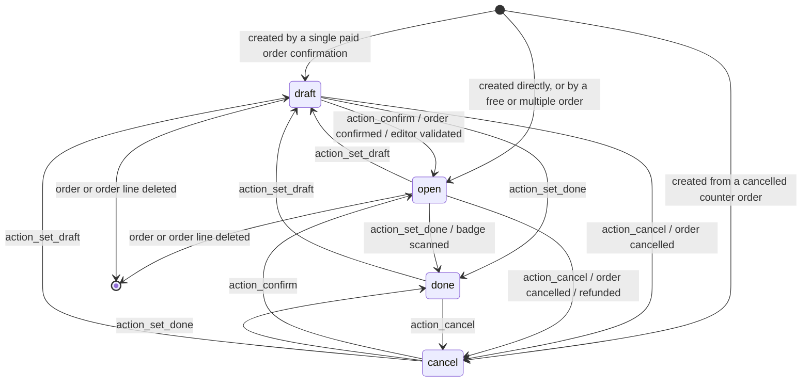
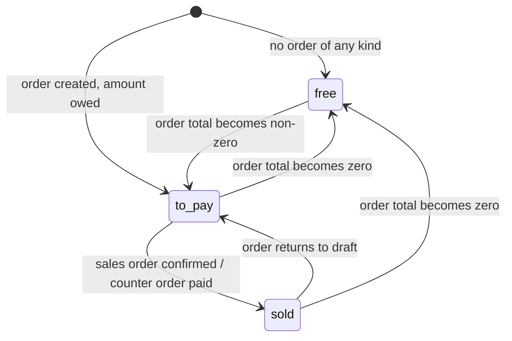
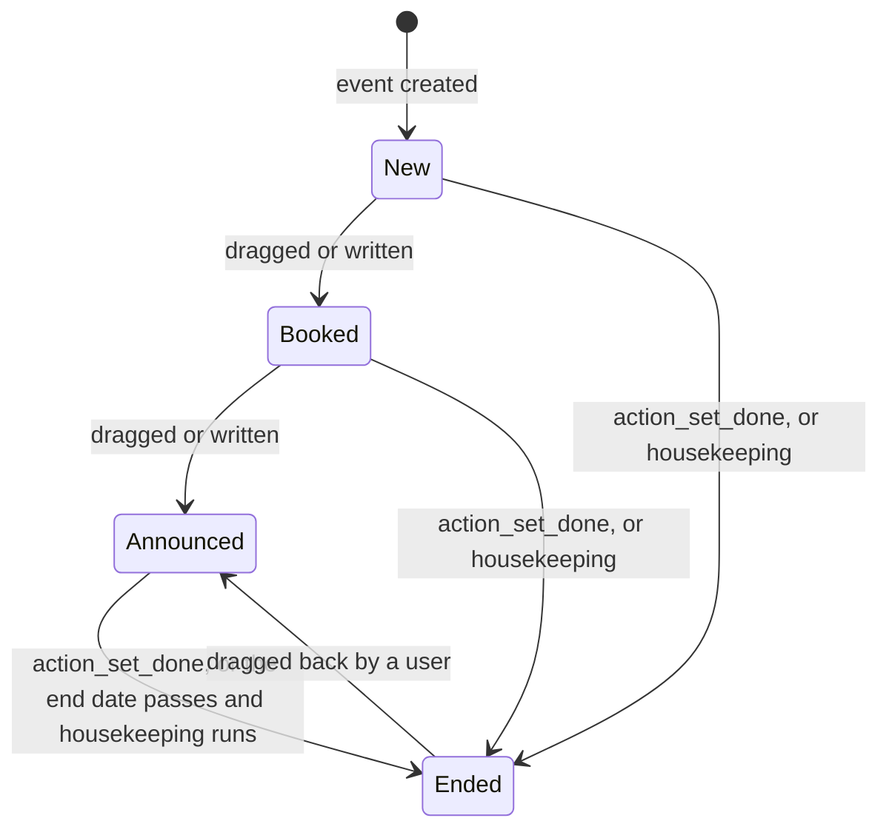
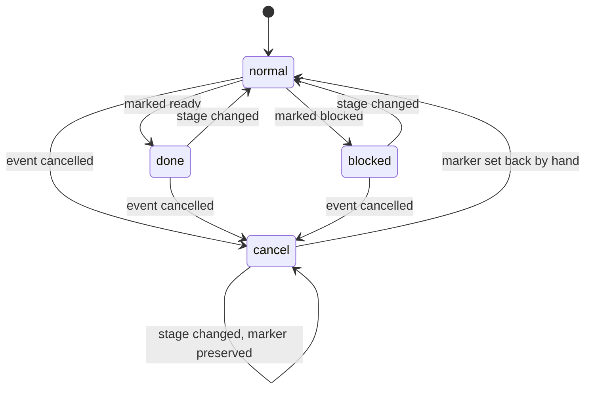
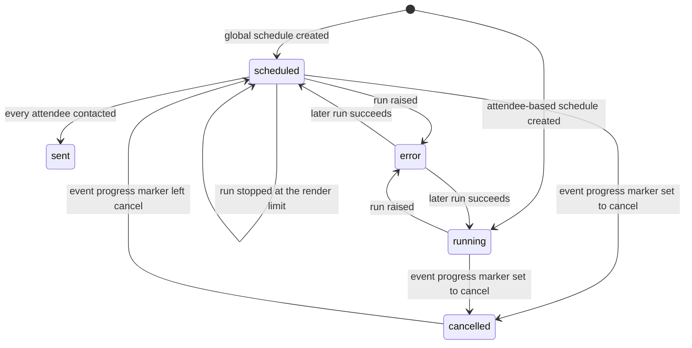
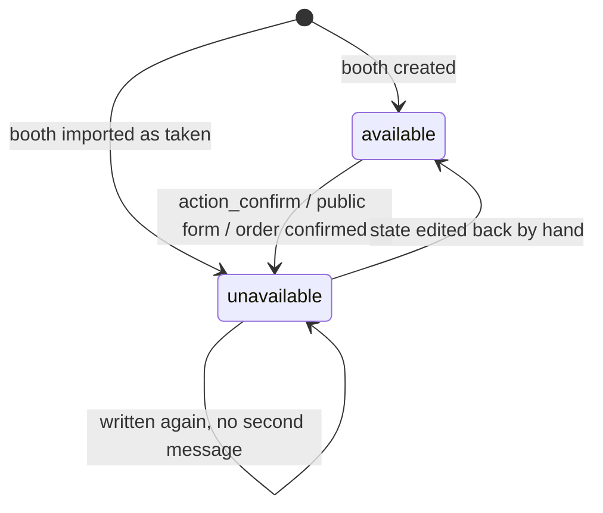
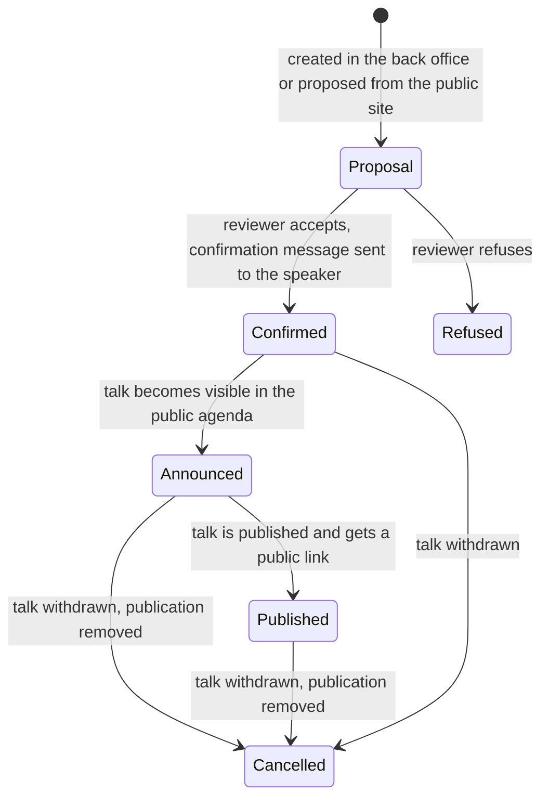
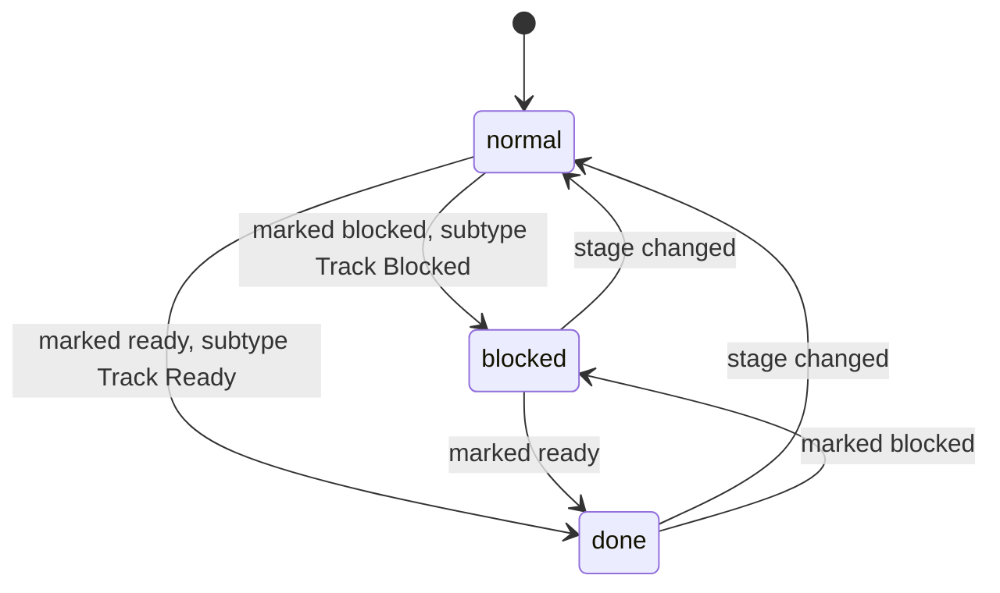
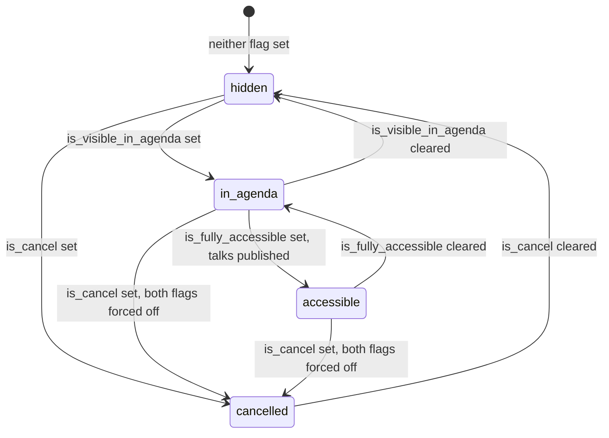

# Events — State machines

Every state field of this domain, state by state and transition by transition: the stored value,
the label the interface shows, the meaning of the state, the operation that triggers each
transition, the guards that must hold in the order in which they are evaluated, the exact text of
each refusal, the records the transition creates or changes, and a diagram of the machine.

Conventions used here:

- A **stored value** is reproduced exactly, in code font, because integrations read it from the
  database. A **label** is the text the interface shows for that value.
- A verbatim refusal is reproduced between quotation marks; a placeholder written between angle
  brackets is replaced by the value named inside it.
- Rules cited as `EV-RULE-nnn` are defined in [`business-rules.md`](business-rules.md); formulas
  cited by section are in [`calculations.md`](calculations.md); the field tables are in
  [`entities.md`](entities.md).
- "Elevated rights" means the step is performed without the access checks of the acting user,
  because the acting user may legitimately lack the right to the record being written.

The domain carries eight state machines and two ladder-shaped derived states:

| # | Machine | Entity | Field |
|---|---|---|---|
| 1 | Registration life cycle | Event Registration | `state` |
| 2 | Registration payment situation | Event Registration | `sale_status` |
| 3 | Event pipeline | Event | `stage_id` |
| 4 | Event progress marker | Event | `kanban_state` |
| 5 | Automatic communication status | Event Automated Mailing | `mail_state` |
| 6 | Booth availability | Event Booth | `state` |
| 7 | Talk pipeline | Event Track | `stage_id` |
| 8 | Talk progress marker | Event Track | `kanban_state` |
| L1 | Talk stage capability ladder | Event Track Stage | `is_cancel`, `is_visible_in_agenda`, `is_fully_accessible` |
| L2 | Public visibility of an event | Event | `website_published`, `website_visibility` |

Two further status vocabularies are not stored on a record but are part of the observable contract
and are specified in sections 11 and 12: the outcome of a badge scan at the registration desk, and
the archive flag that suspends every machine.

---

## 1. Registration life cycle (`state` on Event Registration)

**Field** `state` (Status) on Event Registration (`event.registration`, table
`event_registration`). Required, derived and stored, precomputed before insertion, editable through
the four operations below, tracked in the discussion thread, **not** copied when the record is
duplicated. Its default is produced by the derivation of section 2.4 rather than by a constant.

### 1.1 States

| Stored value | Label | Meaning | Consumes a seat |
|---|---|---|---|
| `draft` | Unconfirmed | The seat is being prepared: an order carries it but the money is not settled, or an operator has not finished the attendee details. The attendee is not counted anywhere and receives no automatic communication. | no |
| `open` | Registered | The seat is taken. It is counted in `seats_reserved`, the attendee receives the automatic communications, the badge can be printed and the badge can be scanned at the desk. | yes |
| `done` | Attended | The attendee was scanned in, or was marked as attending by hand. The seat moves from `seats_reserved` to `seats_used`; `seats_taken` does not change. | yes |
| `cancel` | Cancelled | The seat was given up. It is released from every counter, the record is kept for the audit trail, and the pending communication traces of that attendee are deleted the next time the scheduler runs. | no |

Only an **active** registration in state `open` or `done` consumes a seat. Archiving a registration
releases its seat without changing its state (section 12).

### 1.2 Transition table

| From | To | Trigger | Guards | Records created or changed |
|---|---|---|---|---|
| — | `open` | Creating a registration with no sales order and no counter order | The seat verification of `EV-RULE-030` must pass. | A barcode is generated when none was supplied; the seat counters of the event, of the slot and of the ticket rise by one; one Registration Mail Scheduler trace is created for every attendee-based communication of the event, and in synchronous mode those messages are sent at once; lead rules with the trigger "Attendees are created" run, followed by the "Attendees are registered" rules because the new record is already `open`. |
| — | `draft` | Creating a registration from the confirmation of exactly one sales order whose line total including tax is not zero | None: the state is forced before the seat check, so the seats are not yet consumed. | The registration carries the order and the order line; a note linking back to the order is posted in its thread; no seat is consumed. |
| — | `open` | Creating a registration from a sales order in every other case (several orders confirmed together, or a zero line total) | The seat verification of `EV-RULE-030` must pass. | As for the first row, plus the sale status of section 2. |
| — | `open` or `draft` or `cancel` | Creating a registration from a counter order line | The seat verification of `EV-RULE-030` must pass whenever the derived state is `open`. | The registration carries the counter order line; the derived state follows the counter order state (section 2.3); the remaining seats are broadcast to every open counter session. |
| `draft`, `cancel` | `open` | `action_confirm`, the confirmation of the sales order, or the validation of the attendee editor | The seat verification of `EV-RULE-030` must pass for the event, the slot and the ticket of the registration. | The seat is consumed; the attendee-based communication schedulers of the event are woken for that attendee; lead rules with the trigger "Attendees are registered" run. |
| `draft`, `open`, `cancel` | `done` | `action_set_done`, or a successful badge scan at the registration desk | The seat verification of `EV-RULE-030` must pass. | `date_closed` is stamped with the current moment when it is still empty; the note *"Attended on <date, short format>"* is logged in the thread of the registration; the seat moves from reserved to used; attendee-based traces are created if they do not exist yet; lead rules with the trigger "Attendees attended" run. |
| any | `cancel` | `action_cancel`, the cancellation of the sales order, or a refund of the counter order line | None. | The seat is released from the event, slot and ticket counters; the not-yet-sent Registration Mail Scheduler traces of that attendee are deleted the next time the scheduler processes them; the attendee stops counting in the order attendee counter. |
| any | `draft` | `action_set_draft` | None. | The seat is released from every counter. |
| `open` or `done` | unchanged | Archiving the registration (`active` becomes false) | None. | The seat is released while the record stays in its state. |
| `open` or `done` | unchanged | Un-archiving the registration (`active` becomes true) | The seat verification of `EV-RULE-030` must pass with a requested count of zero, which means the current figures must not already overflow any limit. | The seat is taken again. |

### 1.3 Guards, in order, with their refusal

The single guard of this machine is the seat verification. It runs whenever `active`, `state`,
`event_id`, `event_slot_id` or `event_ticket_id` changes, and it is also called explicitly before
registrations are created from the public site and before an online payment is accepted.

1. The registrations being checked are grouped by event, then by the pair (`event_slot_id`,
   `event_ticket_id`), and counted.
2. For each pair the availability is computed as in
   [`calculations.md`](calculations.md#2-seat-availability-of-a-slot-and-ticket-combination). A
   pair whose availability is "no limit" always passes.
3. A pair whose availability is strictly smaller than the requested count fails and contributes one
   line *"<name>: missing <n> seat(s)"*, where the shortfall is the requested count minus the
   availability and the name is the ticket name followed by ` - ` and the slot display name when
   both are given, the slot display name when only a slot is given, the ticket name when only a
   ticket is given, and the event name when neither is given.
4. When at least one pair failed, the whole operation is rejected with
   *"There are not enough seats available for <event name>:"* followed by a new line and one line
   per failing pair. Nothing is written.

Two further guards belong to the record rather than to the transition, and are checked on every
write: a slot must belong to the event of the registration and a multi-slot event requires a slot
(`EV-RULE-021`, refusals *"Invalid event / slot choice"* and
*"Slot choice is mandatory on multi-slots events."*), and a ticket must belong to the event
(`EV-RULE-022`, refusal *"Invalid event / ticket choice"*).

### 1.4 Diagram

---

## 2. Registration payment situation (`sale_status` on Event Registration)

**Field** `sale_status` (Sale Status) on Event Registration. Read-only, derived and stored,
precomputed before insertion, not copied on duplication. The field exists only when the product
bridge is installed; without it a registration has no payment situation at all and its state
defaults to `open`.

### 2.1 States

| Stored value | Label | Meaning |
|---|---|---|
| `to_pay` | Not Sold | An order carries the seat and money is still owed: the order is not confirmed, or the counter order is not paid. |
| `sold` | Sold | The order that carries the seat is confirmed, or the counter order is paid, done or invoiced, and the amount is not zero. |
| `free` | Free | No money is owed: either the seat carries no order at all, or the total of the order that carries it is zero. |

`state` and `sale_status` are computed together, in one pass, from the order that carries the seat.

### 2.2 Derivation from a sales order

Registrations are grouped by sales order and, for each group, in this order:

1. Every registration whose order is cancelled is set to `state = cancel`. Together with the
   registrations already cancelled these form the cancelled set of the group.
2. When the **order total including tax is zero**, compared with the rounding of the currency of
   that order, every registration of the group gets `sale_status = free`, and every registration
   with no state or with the state `draft` becomes `open`.
3. Otherwise the registrations whose order is confirmed and which are not in the cancelled set get
   `sale_status = sold`; every other registration of the group gets `sale_status = to_pay`. A sold
   registration whose state is empty, `draft` or `cancel` becomes `open`. A registration that is
   neither sold nor cancelled becomes `draft`.
4. After the group pass, a registration still without a payment situation gets `free` and a
   registration still without a state gets `open`.

Whenever this derivation moves a registration from `draft` or `cancel` to `open`, the
attendee-based communication schedulers of its event are woken for that attendee.

### 2.3 Derivation from a counter order

| Counter order situation | `sale_status` | `state` |
|---|---|---|
| The counter order is cancelled | unchanged | `cancel` |
| The counter order total is zero | `free` | `open` |
| Any other counter order, base counter bridge only | `sold` | `open` |
| Counter order in state `paid`, `done` or `invoiced`, with the counter-and-sales bridge installed | `sold` | `open` |
| Counter order in any other state, with the counter-and-sales bridge installed | `to_pay` | `draft` |

### 2.4 Base rule

With the product bridge installed and no order of any kind, an empty payment situation becomes
`free` and an empty state becomes `open`.

### 2.5 Diagram

---

## 3. Event pipeline (`stage_id` on Event)

**Field** `stage_id` (Stage) on Event (`event.event`, table `event_event`). A link to Event Stage
(`event.stage`, table `event_stage`), which is user-definable master data rather than a fixed
selection. The field is tracked in the discussion thread, is **not** copied when the event is
duplicated, and restricts the deletion of a stage that is in use. Grouping events by stage always
shows every stage, including the empty ones.

### 3.1 Stages

A stage carries `name` (Stage Name), `sequence` (Sequence, default 1), `description` (Stage
description), `fold` (Folded in Kanban) and `pipe_end` (End Stage). The stage flagged `pipe_end`
is the one into which finished events are moved automatically. The shipped stages are:

| Name | `sequence` | `pipe_end` | `fold` | Meaning |
|---|---|---|---|---|
| New | 1 | no | no | Freshly created; the default stage of a new event, because it has the lowest sequence. |
| Booked | 2 | no | no | The venue and the date are secured. |
| Announced | 3 | no | no | The event has been publicly announced. |
| Ended | 5 | yes | yes | Finished events; the housekeeping pass moves an event here once its end date has passed. |

### 3.2 Transition table

| From | To | Trigger | Guards | Records created or changed |
|---|---|---|---|---|
| — | the stage with the lowest `sequence` | Creating an event | At least one stage must exist; with no stage the field stays empty. | The event is created with `kanban_state = normal`. |
| any stage | the chosen stage | A user drags the event card to another column, or writes the stage on the form | None. | `kanban_state` is reset to `normal` unless it is `cancel`, which is preserved. |
| any stage that is not an ending stage | the first stage by `sequence` whose `pipe_end` is true | The operation `action_set_done` on one or several events | At least one stage must be flagged as an ending stage; when none exists nothing happens and no error is raised. | The stage is written; the progress marker is reset by the rule above. |
| any stage that is not an ending stage, on an event whose `date_end` is strictly in the past | the first stage by `sequence` whose `pipe_end` is true | The periodic housekeeping pass | The same: when no ending stage exists nothing happens. | The stage is written; the progress marker is reset by the rule above. |

### 3.3 Diagram

---

## 4. Event progress marker (`kanban_state` on Event)

**Field** `kanban_state` (Kanban State) on Event. Selection, derived, stored and editable, default
`normal`, tracked in the discussion thread, not copied on duplication. It is independent of the
pipeline: it says how the work on the event is going, and one of its values suspends the whole
registration and communication machinery.

### 4.1 States

| Stored value | Label | Meaning |
|---|---|---|
| `normal` | In Progress | The ordinary situation. |
| `done` | Ready for Next Stage | The organiser considers the work of the current stage finished. |
| `blocked` | Blocked | Something prevents progress. |
| `cancel` | Cancelled | The event is called off. Registrations are closed whatever the dates and the seats, every automatic communication of the event is skipped by the scheduler, and the readable status of every unfinished communication becomes `cancelled`. |

### 4.2 Transition table

| From | To | Trigger | Guards | Records created or changed |
|---|---|---|---|---|
| — | `normal` | Creating an event | None. | — |
| any | `done` | The user marks the event ready | None. | — |
| any | `blocked` | The user marks the event blocked | None. | — |
| any | `cancel` | The user cancels the event | None. | `event_registrations_open` becomes false; the communication scheduler stops selecting the schedules of the event; every unfinished schedule reports the status `cancelled`. |
| `normal`, `done`, `blocked` | `normal` | The event moves to another stage | None. | The marker is reset by the stage change. |
| `cancel` | `cancel` | The event moves to another stage | None. | The marker is **not** reset: a cancelled event stays cancelled across stage changes. |

### 4.3 Diagram

---

## 5. Automatic communication status (`mail_state` on Event Automated Mailing)

**Field** `mail_state` (Global communication Status) on Event Automated Mailing (`event.mail`,
table `event_mail`). Derived and never stored, therefore it always reflects the current situation
and can never be repaired: it is a reading of three stored facts (`error_datetime`, `mail_done`
and the progress marker of the event) plus the trigger kind of the schedule.

### 5.1 States

| Stored value | Label | Meaning |
|---|---|---|
| `running` | Running | The schedule is attendee based (`interval_type = after_sub`): it never finishes, because it contacts every future attendee as they arrive. |
| `scheduled` | Scheduled | A global schedule that is due in the future, or is due now but has not been executed yet. |
| `sent` | Sent | A global schedule that has reached every attendee it had to reach; `mail_done` is true. |
| `error` | Error | The last run raised; `error_datetime` carries the moment of that failure. |
| `cancelled` | Cancelled | The schedule is not finished and the progress marker of its event is `cancel`. |

### 5.2 Derivation, evaluated in this order

| Order | Condition | Value |
|---|---|---|
| 1 | `error_datetime` is set | `error` |
| 2 | `mail_done` is false and the `kanban_state` of the event is `cancel` | `cancelled` |
| 3 | `interval_type = after_sub` | `running` |
| 4 | `mail_done` is true | `sent` |
| 5 | none of the above | `scheduled` |

### 5.3 Transition table

| From | To | Trigger | Guards | Records created or changed |
|---|---|---|---|---|
| — | `scheduled` or `running` | Creating a schedule | The template reference is required. | `scheduled_date` is computed and the communication job is woken for the earliest of the new dates. |
| `scheduled` | `sent` | A run of the job that reaches every attendee | The event must be active, its progress marker must not be `cancel`, `scheduled_date` must be at or before the current moment, `mail_done` must be false, and, for an attendee-based schedule, the event must not have ended. A schedule whose trigger is "before the event starts" or "after the event started" is additionally refused once the event, or the slot for a slot trace, has ended. | The resume point moves to the last attendee contacted; `mail_count_done` is refreshed; `mail_done` becomes true when the counter reaches `seats_taken`. A global schedule that finds no attendee at all is marked sent immediately without sending anything. |
| `scheduled` | `scheduled` | A run that hits the render limit | The same guards. | The first `render limit` attendees are contacted, the resume point advances, `mail_done` stays false and the job wakes itself again. |
| `scheduled` or `running` | `error` | A run raises | None. | `error_datetime` is stamped with the current moment; at most once per hour a message is posted on the event for the organiser, the event responsible and the last author of the template. |
| `error` | `scheduled`, `running` or `sent` | A later run succeeds | The same guards as the ordinary run. | `error_datetime` is cleared. |
| any state that is not `sent` | `cancelled` | The progress marker of the event becomes `cancel` | None. | Nothing is written on the schedule; the status is a reading. |
| `cancelled` | the previous reading | The progress marker of the event leaves `cancel` | None. | Nothing is written. |
| `running` | `running` | Every run of an attendee-based schedule | None. | Traces are created for the attendees that have none, due traces are sent and marked, and traces whose registration fell back to `draft` or `cancel` are deleted. `mail_done` is never set for this kind. |

### 5.4 Diagram

---

## 6. Booth availability (`state` on Event Booth)

**Field** `state` (Status) on Event Booth (`event.booth`, table `event_booth`). Required, default
`available`, tracked in the discussion thread. The derived boolean `is_available` is true exactly
when the state is `available`; a search on it is rewritten into a search on the state, and only the
"is in" and "is not in" forms are supported (`EV-RULE-076` neighbours in
[`business-rules.md`](business-rules.md)).

### 6.1 States

| Stored value | Label | Meaning |
|---|---|---|
| `available` | Available | Free. The booth is offered on the public booth page, in the booth configurator of a sales order, and it counts in `event_booth_count_available`; its category counts in the list of categories that still have a free booth. |
| `unavailable` | Unavailable | Taken. The booth disappears from every offer. It carries a renter, and, when its category asks for one, a sponsor. |

Grouping booths by state always shows both columns, even when one of them is empty.

### 6.2 Transition table

| From | To | Trigger | Guards | Records created or changed |
|---|---|---|---|---|
| — | `available` | Creating a booth by hand, from an event template, or by duplicating an event | None. | The creator is not subscribed to the thread of the booth. |
| — | `unavailable` | Creating a booth directly in the taken state, for example by an import | None. | The post-confirmation rule runs immediately: the sponsor is created or reused when the category asks for one, and the booking message is posted on the event. |
| `available` | `unavailable` | `action_confirm` from the back office, or the public booth form when online booth sales are not installed | None. | The renter block (`partner_id`, `contact_name`, `contact_email`, `contact_phone`) is written in the same operation; a sponsor is created or reused when `use_sponsor` is set on the category and the booth has a renter; a message built from the booking layout is posted **on the event** under the subtype "Booth Booked", naming the booth. |
| `available` | `unavailable` | Confirming the sales order that carries the reservation | Every requested booth must still be available; otherwise the confirmation is refused with *"The following booths are unavailable, please remove them to continue : "* followed by one indented line per booth. | The same side effects, plus: every other pending Event Booth Registration on the same booths is destroyed, a message reading *"Your order has been cancelled because the following booths have been reserved"* followed by the booth names is posted on each losing order for its salesperson, and each losing order is cancelled. |
| `unavailable` | `unavailable` | Writing the state `unavailable` again | None. | **No second message.** Only the booths that were `available` immediately before the write are treated as newly booked, which is what stops a repeated confirmation from posting twice. |
| `unavailable` | `unavailable` | The invoice that carries the booth is paid | None. | `is_paid` becomes true, with elevated rights. Reversing or unreconciling the payment does not clear it. |
| `unavailable` | `available` | A user edits the state back by hand | None. | Nothing else. There is no operation that frees a booth, because a booking is a commercial commitment. |

A booth that carries a sales order cannot be deleted: *"You can't delete the following booths as
they are linked to sales orders: <comma separated booth names>"* (`EV-RULE-072`).

### 6.3 Diagram

---

## 7. Talk pipeline (`stage_id` on Event Track)

**Field** `stage_id` (Stage) on Event Track (`event.track`, table `event_track`). Required, indexed,
tracked in the discussion thread, not copied on duplication, restricting the deletion of a stage in
use, and defaulting to the stage with the lowest `sequence`. Grouping talks by stage always shows
every stage.

### 7.1 Stages

The stages are user-definable master data. Each carries `name`, `sequence`, `color`, `description`,
`fold`, the three capability flags of the ladder in section 9, three kanban legends
(`legend_blocked`, `legend_done`, `legend_normal`) and an optional `mail_template_id`. The shipped
stages are:

| Name | `sequence` | `is_visible_in_agenda` | `is_fully_accessible` | `is_cancel` | `fold` | Template sent on entry |
|---|---|---|---|---|---|---|
| Proposal | 1 | no | no | no | no | — |
| Confirmed | 2 | no | no | no | no | "Event: Track Confirmation" |
| Announced | 3 | yes | no | no | no | — |
| Published | 4 | yes | yes | no | no | — |
| Refused | 5 | no | no | no | yes | — |
| Cancelled | 6 | no | no | yes | yes | — |

### 7.2 Transition table

| From | To | Trigger | Guards | Records created or changed |
|---|---|---|---|---|
| — | the stage with the lowest `sequence` | Creating a talk in the back office | At least one stage must exist. | A message built from the "new talk" layout is posted **on the event** under the subtype "New Track"; the stage synchronisation below is applied. |
| — | the stage with the lowest `sequence` | A visitor submits the public proposal form | The event must have `website_track_proposal` on and must be reachable from the current website; otherwise the answer is the code `forbidden`. A separate contact block requires a contact address or a telephone; otherwise the answer is the code `invalidFormInputs`. | The talk is created with **no** responsible user; the creator is not subscribed; a signed-in visitor is subscribed to the thread; the same message and stage synchronisation as above. |
| any stage | the chosen stage | A reviewer drags the card, or writes the stage | None. | `kanban_state` is reset to `normal` unless a new marker is written in the same operation; the stage synchronisation below is applied; when the target stage carries a message template, that template is sent to the speaker as an internal note using the light notification layout. |

**Stage synchronisation.** Entering a stage whose `is_fully_accessible` is true publishes the talk.
Entering a stage whose `is_cancel` is true unpublishes it. A stage that is neither leaves the
publication flag untouched.

### 7.3 Diagram

---

## 8. Talk progress marker (`kanban_state` on Event Track)

**Field** `kanban_state` (Kanban State) on Event Track. Required, default `normal`, not copied on
duplication. The readable legend of the current value is stored in `kanban_state_label`, which is
tracked, so that the discussion thread records the transition in words rather than in codes.

### 8.1 States

| Stored value | Label | Default legend | Meaning |
|---|---|---|---|
| `normal` | Grey | `In Progress` | The ordinary situation. |
| `done` | Green | `Ready for Next Stage` | The talk is ready to move on. |
| `blocked` | Red | `Blocked` | Something prevents progress on the talk. |

The three legends are per stage, so a stage may relabel them; the values themselves never change.

### 8.2 Transition table

| From | To | Trigger | Guards | Records created or changed |
|---|---|---|---|---|
| — | `normal` | Creating a talk | None. | — |
| `normal` | `blocked` | The reviewer marks the talk blocked | None. | A message is posted under the subtype "Track Blocked"; `kanban_state_label` becomes the red legend of the current stage. |
| `normal` | `done` | The reviewer marks the talk ready | None. | A message is posted under the subtype "Track Ready", which is subscribed by default; `kanban_state_label` becomes the green legend. |
| `blocked`, `done` | `normal` | The talk moves to another stage without an explicit marker | None. | `kanban_state_label` becomes the grey legend of the new stage. |

### 8.3 Diagram

---

## 9. Ladder L1 — the capability flags of a talk stage

**Fields** `is_cancel` (Cancelled Stage), `is_visible_in_agenda` (Visible in agenda) and
`is_fully_accessible` (Fully accessible) on Event Track Stage (`event.track.stage`, table
`event_track_stage`). The last two are derived, stored and editable; writing one recomputes the
other, so the three can never contradict each other.

| Situation | `is_visible_in_agenda` | `is_fully_accessible` | Effect on a talk entering the stage |
|---|---|---|---|
| `is_cancel` is true | forced false | forced false | The talk is unpublished. |
| `is_fully_accessible` is set true | forced true | true | The talk is published; the public and the speaker get a working link. |
| `is_visible_in_agenda` is set false | false | forced false | The talk disappears from the public agenda unless it is published in its own right. |
| `is_visible_in_agenda` is true and `is_fully_accessible` is false | true | false | The talk appears in the agenda and the talk list for a reader who is at least a Registration Desk user, and stays invisible to an anonymous visitor until it is published. |

---

## 10. Ladder L2 — the public visibility of an event

Two independent fields decide who finds an event on the public site: `website_published`
(Website Published, boolean, tracked) and `website_visibility` (Website Visibility, selection,
required, default `public`, tracked).

| Stored value of `website_visibility` | Label | Anonymous visitor | Signed-in user | Participant |
|---|---|---|---|---|
| `public` | Public | sees the event in lists and searches | sees it | sees it |
| `link` | Via a Link | reaches it only through its direct link | reaches it only through its direct link | sees it in lists |
| `logged_users` | Logged Users | reaches it only through its direct link | sees it in lists | sees it in lists |

In every case the event page itself stays reachable through its own link; the setting governs
listing and searching only. A participant is a reader with a registration in state `open` or `done`
on the event, resolved by the heuristic of
[`calculations.md`](calculations.md#12-participation-detection).

| From | To | Trigger | Guards | Records created or changed |
|---|---|---|---|---|
| unpublished | published | The user publishes the event | None. | A message is posted in the thread under the subtype "Event published". |
| published | unpublished | The user unpublishes the event | None. | A message is posted under the subtype "Event unpublished". |
| any | any | The user changes `website_visibility` | None. | The change is tracked in the thread. |

An unpublished event is invisible to anonymous and portal readers because of the record rule
"Event: public/portal: published read"; an Event User and an Event Administrator can always open
its public page.

---

## 11. The outcome vocabulary of a badge scan

The operation `register_attendee`, invoked with a barcode and an optional event identifier, returns
one of seven status words together with the registration summary. The words are part of the
contract of the registration desk and are reproduced exactly. The tests are evaluated in the order
of the table; the first one that matches decides.

| Order | Situation | Status returned | State change |
|---|---|---|---|
| 1 | No registration carries that barcode | `invalid_ticket` | none |
| 2 | The registration is in state `cancel` | `canceled_registration` | none |
| 3 | The registration is in state `draft` | `unconfirmed_registration` | none |
| 4 | The event of the registration has finished | `not_ongoing_event` | none |
| 5 | The desk was opened for a given event and the registration belongs to another one | `need_manual_confirmation` | none |
| 6 | The registration is already in state `done` | `already_registered` | none |
| 7 | None of the above | `confirmed_registration` | the registration moves to `done` with every side effect of section 1.2 |

---

## 12. The archive flag, which suspends every machine

Event, Event Registration, Event Question, Event Booth Category, Event Sponsor and Event Track all
carry `active` (Active, boolean, default true).

| Entity | Effect of clearing `active` | Effect of setting it back |
|---|---|---|
| Event | The event leaves every default list; the communication scheduler stops selecting its schedules; its registrations keep their own state. | The event reappears and its due schedules are selected again at the next run. |
| Event Registration | The seat is released from the event, slot and ticket counters while the state is unchanged. | The seat is taken again, but only if the seat verification of `EV-RULE-030` passes with a requested count of zero; otherwise the operation is refused with the sold-out message and nothing is written. |
| Event Question | The question is no longer offered on any form; the recorded answers are kept. Archiving is the only way to retire a question that has already been answered. | The question is offered again. |
| Event Booth Category | The category is no longer offered when a booth is created. | It is offered again. |
| Event Sponsor | The sponsor disappears from the public exhibitor pages. | It reappears, subject to its publication flag. |
| Event Track | The talk disappears from the back office lists and from the public pages. | It reappears, subject to its stage and its publication flag. |

---

## 13. The state fields of the revenue analysis

The read-only analysis Event Sales Report (`event.sale.report`, database view `event_sale_report`)
carries three state columns so that the figures can be filtered by situation. They are copies, not
machines of their own:

| Column | Values and labels | Source |
|---|---|---|
| `event_registration_state` | `draft` (Unconfirmed), `cancel` (Cancelled), `open` (Confirmed), `done` (Attended) | the `state` of the registration behind the row. Note that the label of `open` reads "Confirmed" here while the registration itself labels it "Registered"; the stored value is the same. **Compatibility finding**: the two labels for one stored value are inconsistent; a corrected behaviour would use "Registered" in both places, and a replacement may align them without changing the stored value. |
| `sale_status` | `to_pay` (Not Sold), `sold` (Sold), `free` (Free) | the payment situation of the registration. |
| `sale_order_state` | the states of the sales order, which belong to the [Sales](../sales/README.md) domain | the order behind the row. |

---

## Reconciliation notes

1. **Where this document comes from.** Version M carried its state machines as section 29 of
   `workflows.md` and had no `state-machines.md`; version P had no state machine document at all
   but its reading order announced one covering "the registration lifecycle, the event stage
   pipeline and its cancellation marker, the stand availability states, the session pipeline, the
   communication status". This file merges both: every transition table of version M is reproduced
   here, extended with the stored values, the labels, the meanings, the guards in evaluation order,
   the exact refusals and a diagram per machine, and the section of `workflows.md` now points here.
2. **Cancellation of an event.** Version P described the cancellation marker as a separate machine
   from the stage pipeline. That is the observed behaviour and it is kept: sections 3 and 4 are two
   independent machines, and section 4 is the one that closes registrations and suspends the
   communications.
3. **Booth states.** Version P called the entity a stand and described "the stand availability
   states"; version M called it a booth. The full name of the entity in the dictionary of this
   repository is Event Booth, so the consolidated text says booth throughout and records "stand" as
   a synonym in [`glossary.md`](glossary.md).
4. **Label of `open` in the revenue analysis.** Section 13 records the inconsistency between
   "Registered" on the registration and "Confirmed" in the analysis as a compatibility finding,
   because both labels are observable and a rebuild has to choose.
