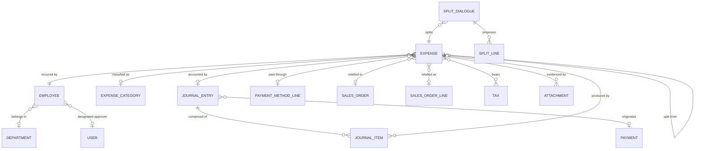

# Expenses — Entities

This file specifies every entity the expense domain owns or extends: its purpose, its lifecycle, its complete field table, its relations, its uniqueness rules, its defaults, its computed fields with their rules, its ordering, its display rule, its archival behaviour and its multi-company behaviour.

Field tables use three columns: **Field (storage name)**, **Type**, **Meaning and rules**. Unless the third column says otherwise, a field is stored, writable, not required, not indexed, not tracked and copied when the record is duplicated.

---

## 1. Entity map



---

## 2. Expense

**Expense** (`hr.expense`, table `hr_expense`).

### 2.1 Purpose

An Expense is **one cost, incurred by one employee, on one date, for one expense category, in one currency**. It is the only durable entity this domain owns. It carries:

- what was bought (the expense category, the free description, the quantity, the unit);
- how much it cost (the total in the currency of the receipt, the total in the company currency, the tax part of each, the untaxed part of each, the unit price and the conversion rate);
- who paid (the payment mode — the employee out of pocket, or the company directly — and, for a company payment, which payment method);
- who must approve it and who did (the approver, the approval state and the approval timestamp);
- where it must be charged (the expense account and the analytic distribution);
- whether it is to be rebilled (the sales order and the sales order line it produced);
- the accounting consequence (the journal entry it produced and that entry's residual amount).

### 2.2 Lifecycle summary

1. **Created** in the *Draft* status — by hand, by uploading one or more receipt files, by an electronic mail message sent to the expense mailbox, by splitting another expense, or programmatically from a project context.
2. **Submitted** by the employee or by an approver. If the employee has no designated approver and no computed responsible approver (or the responsible approver is the employee themselves), the submission is immediately converted into an approval.
3. **Approved** or **Refused** by an approver. Refusal always carries a mandatory reason, which is posted to the message thread.
4. **Posted** by an accountant. Two distinct accounting paths run here, selected by the payment mode.
5. **In Payment** / **Paid** — for an employee-paid expense, once the resulting payable line starts being settled; for a company-paid expense, immediately at posting, because the money already left the company.
6. **Reset** to Draft at any point where the linked entry can be removed or reversed.

The full state machine, including the exact guards, is in `state-machines.md`.

### 2.3 Ordering, display and identity

| Aspect | Rule |
|---|---|
| Default ordering | Expense date descending, then internal identifier descending (`date desc, id desc`). Two expenses of the same date therefore appear newest-created first. |
| Display name | The description (`name`). No prefix, no sequence number, no employee name. |
| Natural key | None. Two expenses may be identical in every visible respect; the system only *warns* about that (see §2.13 and `calculations.md` §7). |
| Numbering sequence | The Expense entity itself is **not** numbered. A numbering series named *Expense invoice*, with code `hr.expense.invoice` (the sequence's code), prefix `EXP/` and three-digit padding, is shipped; it is available to the accounting documents produced by the domain and is not consumed by the Expense itself. See `configuration.md` §5. |
| Company scoping | `company_id` (the owning company) is required and read-only after creation. A global record rule restricts every read to companies in the reader's allowed set. |
| Automatic company consistency | The entity declares automatic company checking: every reference it holds that is itself company-scoped (employee, expense category, account, taxes, payment method line, sales order) must belong to the expense's company or to no company. Violating that raises the generic company-mismatch error described in `business-rules.md` §2.6. |
| Archival | The Expense entity has **no** archive flag. Removal is by deletion, and deletion is forbidden once the expense is approved or beyond (see `business-rules.md` §4.1). |
| Message thread | The entity is a message thread with a designated main attachment, and an activity holder. Posting a message to it requires only read access, not write access, so that an employee may comment on an expense they can no longer edit. |
| Analytic capability | The entity carries an analytic distribution and participates in the analytic mandatory-plan validation with the business domain value `expense`. |

### 2.4 Field table — identification and description

| Field (storage name) | Type | Meaning and rules |
|---|---|---|
| Description (`name`) | text, single line | **Required.** The free description of the cost, shown everywhere as the record's display name. Computed with `precompute` and stored, but writable: the computation only fills it when it is empty, taking the display name of the expense category. Depends on the expense category. Copied on duplication. Its first line, truncated to 64 characters, becomes part of every journal item label (see `calculations.md` §6.1). |
| Expense Date (`date`) | date | The date the cost was incurred. Defaults to today in the reader's time zone. Used as the accounting date of a **company-paid** entry, as the date at which the currency conversion rate is looked up, and as part of the duplicate key. Not required by the storage layer; when absent, the conversion-rate lookup falls back to today. |
| Internal Notes (`description`) | long text | Free notes. Never printed on the accounting document, never used in any computation. |
| Company (`company_id`) | reference to Company | **Required, read-only.** Defaults to the company the user is currently acting for. Determines the company currency, the chart of accounts, the journals, the allowed payment methods and the analytic models. Deleting the company is restricted while an expense refers to it. |
| Former Report (`former_sheet_id`) | whole number | A plain integer kept so that expenses which were once grouped under a common submission remain groupable by that number. It references nothing and is never validated. |
| Origin Split Expense (`split_expense_origin_id`) | reference to Expense | Set on every piece produced by a split, and on the piece that kept the original record, to the identifier of the expense that was split. Lets the whole family of pieces be reopened together. Null for an expense that was never split. |

### 2.5 Field table — people

| Field (storage name) | Type | Meaning and rules |
|---|---|---|
| Employee (`employee_id`) | reference to Employee | **Required, indexed, tracked.** The person who incurred the cost. Computed with `precompute` and stored but writable: recomputed from the company, it takes the employee record the current user owns in that company, unless the creation context already forces an employee. Its default, evaluated when no value is supplied, is the current user's employee; when the current user has **no** employee **and** is not at least a Team Approver, creation fails with *"The current user has no related employee. Please, create one."* Restricted by a searchable filter (`filter_for_expense`, "may an expense be encoded for this employee by me") described in §7.2. Deleting an employee is restricted while an expense refers to them. |
| Department (`department_id`) | reference to Department | Read-only, computed and stored from the employee's department, recomputed whenever the employee or the employee's department changes. **Not** copied on duplication. Used for grouping, for the department dashboard count and for one branch of the approval permission test. |
| Manager (`manager_id`) | reference to User | Read-only, computed and stored, **tracked**, **not** copied. The user responsible for approving this particular expense. Recomputed together with the department whenever the employee changes, by the responsible-approver algorithm of `calculations.md` §3.1. Overwritten with the approving user at the moment of approval. Its selection list is limited to internal (non-shared) users who are either the designated expense approver of some employee of the current user, or members of the Team Approver group. |

### 2.6 Field table — the expense category and its consequences

| Field (storage name) | Type | Meaning and rules |
|---|---|---|
| Category (`product_id`) | reference to Product Variant | **Tracked.** The expense category. Not required by the storage layer — an expense arriving by electronic mail may have none — but required by the entry form and by submission. Restricted to variants whose "can be expensed" flag is set. Deletion of the variant is **restricted** while an expense refers to it. Automatic company checking applies. |
| Category description (`product_description`) | rich text | Read-only, not stored, language-dependent. The category's own description, or false when that description is empty of text. Shown as help under the category selector. |
| Unit (`product_uom_id`) | reference to Unit of Measure | Read-only to the user, computed with `precompute` and stored from the category's reference unit. Copied. Used to convert the category's unit cost into a price per expense unit and carried onto the journal item. |
| Category has a cost (`product_has_cost`) | true/false | Read-only, not stored. True when a category is set **and** its unit cost is not zero in the company currency. This single flag switches the whole pricing model (see `calculations.md` §2). |
| Category has a tax (`product_has_tax`) | true/false | Read-only, not stored. True when the category carries at least one supplier tax belonging to the expense's company. Drives whether the tax selector is offered. |
| Quantity (`quantity`) | decimal | **Required**, displayed with the *Product Unit* decimal precision, default **1**. When the category has no cost, an interface rule resets it to 1: whenever the "category has a cost" flag turns false while the expense is in Draft, the quantity is forced back to 1. |
| Unit Price (`price_unit`) | decimal | **Required, read-only**, computed and stored, displayed with at least the *Product Price* decimal precision. Two rules, applied only while the expense is in Draft (see `calculations.md` §2.3). Copied on duplication. |
| Account (`account_id`) | reference to Account | Computed with `precompute` and stored but writable. The expense account to debit. Restricted to accounts whose type is **not** receivable, payable, cash or credit card, and which belong to the expense's company chain. Recomputed from the category and the company: with no category, the company's own default expense account; with a category, the expense account resolved for that category (its own override, else its product category's), and only if that resolution returns something — a null resolution leaves any manual value alone. Help text: *"An expense account is expected"*. |
| Included taxes (`tax_ids`) | set of references to Tax, association table `expense_tax` (columns `expense_id`, `tax_id`) | Computed with `precompute` and stored but writable. Restricted to taxes whose usage is `purchase` (purchase taxes) and to the expense's company. Recomputed from the category and the company as the category's supplier taxes filtered to the expense's company. Help text: *"Both price-included and price-excluded taxes will behave as price-included taxes for expenses."* — this is the single most consequential rule of the domain and is specified in `calculations.md` §4. |

### 2.7 Field table — payment mode and payment method

| Field (storage name) | Type | Meaning and rules |
|---|---|---|
| Paid By (`payment_mode`) | selection | **Required, tracked**, default `own_account`. Two values: `own_account` labelled *"Employee (to reimburse)"* and `company_account` labelled *"Company"*. The whole posting algorithm branches on this field (`accounting-effects.md`). |
| Payment Method (`payment_method_line_id`) | reference to Payment Method Line | Computed and stored but writable; restricted to the computed list of selectable method lines. Meaningful only in the company payment mode: it names the account and journal through which the company paid. Help text: *"The payment method used when the expense is paid by the company."* The computation takes the **first** entry of the selectable list. |
| Selectable payment methods (`selectable_payment_method_line_ids`) | set of references to Payment Method Line | Read-only, not stored, evaluated with elevated rights. If the company names an explicit allowed list, that list; otherwise every outbound payment method line of an active journal of that company. |
| Journal (`journal_id`) | reference to Journal | Read-only, not stored, mirrors the journal of the chosen payment method line. For the employee payment mode it is empty, and the journal is instead chosen in the posting dialogue. |
| Vendor (`vendor_id`) | reference to Partner | The third party actually paid. Optional. When set, it becomes the partner of every journal item of a company-paid entry and the partner of the payment. **Required** when the chosen payment method's code is `sepa_ct` (Single Euro Payments Area credit transfer), because the transfer file needs a creditor name. |

### 2.8 Field table — amounts and currency

Eight monetary fields exist because two currencies (the receipt currency and the company currency) each need three figures (total, tax, untaxed), plus the unit price and the outstanding amount.

| Field (storage name) | Type | Meaning and rules |
|---|---|---|
| Currency (`currency_id`) | reference to Currency | **Required**, default the company currency. Computed with `precompute` and stored but writable: whenever the "category has a cost" flag is true **and** the expense is in Draft, it is forced back to the **company currency** — a category priced per unit is always priced in the company's own money. Deleting the currency is restricted while an expense refers to it. |
| Report Company Currency (`company_currency_id`) | reference to Currency | Read-only mirror of the company's currency. |
| Is multiple currency (`is_multiple_currency`) | true/false | Read-only, not stored. True when the receipt currency differs from the company currency; falls back to the acting company's currency on both sides when either is missing. |
| Total In Currency (`total_amount_currency`) | money in `currency_id` | **Tracked.** Computed with `precompute` and stored but **writable** — this is the field the employee types when the category has no unit cost. When the category *has* a unit cost it is recomputed as the tax-included total of *unit price × quantity* (`calculations.md` §2.2). Changing it through the form also drives an interface rule that recomputes the unit price and refuses the change when the user may not edit the expense. |
| Total (`total_amount`) | money in `company_currency_id` | **Tracked.** Computed with `precompute` and stored, **writable**, and carrying a write-back rule. Normally the receipt total converted at the conversion rate; when the user types it directly, the write-back rule treats the typed figure as an override of the rate (`calculations.md` §5.4). |
| Tax amount in Currency (`tax_amount_currency`) | money in `currency_id` | Read-only, computed with `precompute` and stored. The tax part of the receipt total, computed by running the tax engine on the receipt total in price-included mode. Not copied. |
| Tax amount (`tax_amount`) | money in `company_currency_id` | Read-only, computed with `precompute` and stored. The tax part of the company-currency total. In the mono-currency case it is simply the receipt tax amount; otherwise the tax engine is run again on the company-currency total. Not copied. |
| Total Untaxed Amount In Currency (`untaxed_amount_currency`) | money in `currency_id` | Read-only, computed with `precompute` and stored, in the same pass as the tax amount in currency. Not copied. |
| Total Untaxed Amount (`untaxed_amount`) | money — declared against `currency_id` although it holds a company-currency figure | Read-only, computed with `precompute` and stored, in the same pass as the tax amount in company currency. Not copied. Reported as the cost figure of the project profitability panel and as the cost basis of the rebilling margin. |
| Amount Due (`amount_residual`) | money in `company_currency_id` | Read-only mirror of the residual amount of the linked journal entry. Empty when no entry exists. Drives the *In Payment* versus *Paid* distinction. |
| Conversion rate (`currency_rate`) | decimal with nine decimal places | **Read-only, tracked, not stored.** The number of units of company currency obtained for one unit of receipt currency. Recomputed whenever the receipt currency, the receipt total or the expense date changes; otherwise derived back from the two totals. Exactly 1 in the mono-currency case. See `calculations.md` §5. |
| Conversion rate label (`label_currency_rate`) | text | Read-only, not stored. Rendered as *"1 «receipt currency code» = «rate to six decimals» «company currency code»"*. Blank in the mono-currency case. |

### 2.9 Field table — status and approval

| Field (storage name) | Type | Meaning and rules |
|---|---|---|
| Status (`state`) | selection | **Read-only, computed and stored, indexed, tracked, not copied**, default `draft`. Seven values, in this declared order: `draft` *Draft*, `submitted` *Submitted*, `approved` *Approved*, `posted` *Posted*, `in_payment` *In Payment*, `paid` *Paid*, `refused` *Refused*. The refused value is deliberately declared **last** so that it sorts after every other value in status-ordered views. The computation is given in `state-machines.md` §2.3. |
| Approval state (`approval_state`) | selection | **Read-only, not copied.** Three values: `submitted` *Submitted*, `approved` *Approved*, `refused` *Refused*; empty means "not yet submitted". This is the writable half of the status: the visible status is derived from it and from the linked journal entry. |
| Approval Date (`approval_date`) | date and time | **Read-only.** Stamped with the moment of approval. Cleared on reset. Carried onto each piece when an approved expense is split. |
| Is Editable By Current User (`is_editable`) | true/false | Read-only, not stored, depends on the acting user. The single gate used by the interface and by several write rules. Algorithm in `business-rules.md` §3.2. |
| Can Reset (`can_reset`) | true/false | Read-only, not stored, depends on the acting user. Algorithm in `business-rules.md` §3.4. |
| Can Approve (`can_approve`) | true/false | Read-only, not stored, depends on the acting user. True exactly when the "cannot approve" reason for this expense is empty. Algorithm in `business-rules.md` §3.3. |

### 2.10 Field table — accounting link

| Field (storage name) | Type | Meaning and rules |
|---|---|---|
| Journal Entry (`account_move_id`) | reference to Journal Entry | **Read-only, not copied, indexed** (index built only over non-null values). The single entry produced when the expense was posted. For the employee mode it is the purchase receipt, possibly shared with the other expenses of the same employee posted in the same operation. For the company mode it is the entry that belongs to the created payment, and it is **never** shared. Cleared when the expense is reset. A constraint forbids more than one expense from sharing the same **payment**. |
| Analytic Distribution (`analytic_distribution`) | structured value: a map from analytic account identifier to percentage | Computed and stored but writable. Recomputed from the analytic distribution models using, as inputs, the expense category, the category's product category, the employee's work contact, the work contact's partner tags, the expense account's code and the company; the computed distribution replaces the existing one only when the model returns something. Copied. The whole map must total exactly one hundred per cent per analytic plan root; the mandatory-plan check is run with the business domain `expense` at approval and at posting. Two further layers override this default when projects are involved (see §8 and `calculations.md` §11). |
| Analytic precision (`analytic_precision`) | whole number | Read-only, not stored. The number of decimals used when displaying and validating the percentages. |
| Analytic accounts in the distribution (`distribution_analytic_account_ids`) | set of references to Analytic Account | Read-only, not stored. The accounts named by the distribution, exposed so that expenses can be searched by analytic account. |

### 2.11 Field table — rebilling to a customer

These three fields exist only when the expense-rebilling capability is active.

| Field (storage name) | Type | Meaning and rules |
|---|---|---|
| Customer to Reinvoice (`sale_order_id`) | reference to Sales Order | **Indexed** (non-null index), **tracked**, computed and stored but writable. Emptied automatically whenever the expense stops being rebillable. Nominally restricted to orders in the *Sales Order* state; in practice the selector widens that restriction through a dedicated name search (see §9.1) so that a salesperson may see every confirmed order by name. Automatic company checking applies. Help text: *"If the category has an expense policy, it will be reinvoiced on this sales order"*. Changing it in the form invalidates and recomputes the analytic distribution. |
| Rebilling line (`sale_order_line_id`) | reference to Sales Order Line | Read-only, **indexed** (non-null index), computed and stored, **not copied**. The line the posting created on the order. Emptied when the expense stops being rebillable. |
| Can be reinvoiced (`can_be_reinvoiced`) | true/false | Read-only, not stored. True when the expense category's rebilling policy is *at cost* or *at sales price*. |

### 2.12 Field table — receipts and messaging

| Field (storage name) | Type | Meaning and rules |
|---|---|---|
| Attachments (`attachment_ids`) | set of Attachments | The receipt files. Technically the attachments whose owning entity is the Expense entity and whose owning record identifier is this expense. Adding and deleting them is governed by the status (see `business-rules.md` §9). Deleting the expense deletes them. |
| Main attachment (`message_main_attachment_id`) | reference to Attachment | Indexed. The receipt shown beside the form. Set forcibly by the upload operation to the **last** uploaded file. |
| Main attachment checksum (`message_main_attachment_checksum`) | text | Read-only mirror of the content fingerprint of the main attachment. |
| Number of Attachments (`nb_attachment`) | whole number | Read-only, not stored. The count of attachments owned by this expense, evaluated in one grouped read for the whole set being displayed. |
| Expenses with the same receipt (`same_receipt_expense_ids`) | set of references to Expense | Read-only, not stored. Other expenses carrying an attachment whose content fingerprint equals one of this expense's attachment fingerprints. Never populated for an expense that came out of a split. Algorithm in `calculations.md` §7.2. |
| Possible duplicates (`duplicate_expense_ids`) | set of references to Expense | Read-only, not stored. Other expenses matching this one on the six-column duplicate key. Algorithm in `calculations.md` §7.1. |
| Message thread fields | various | Followers, messages, activities, notification counters, and the activity decorations. When the employee is set on creation or changed, the employee's user is automatically added as a follower with the same subtypes as the triggering change. |

### 2.13 Uniqueness, constraints and referential rules

| Rule | Statement |
|---|---|
| No database uniqueness | The entity declares no unique index of any kind. Duplicates are detected and warned about, never prevented. |
| Non-zero amount beyond draft | Whenever the status is other than Draft **or** the approval state is set, neither the company-currency total nor the receipt-currency total may be zero. Violation message: *"Only draft expenses can have a total of 0."* Re-checked on every change of status, approval state or either total. |
| One expense per payment | An expense's journal entry may not belong to a payment that already carries another expense. Violation message: *"Only one expense can be linked to a particular payment"*. |
| One company-paid expense per entry | Checked from the entry side: if any expense on a journal entry is company-paid and the entry carries more than one expense, the entry is rejected with *"Each expense paid by the company must have a distinct and dedicated journal entry."* |
| Deletion of an analytic account | Forbidden while any expense's analytic distribution names that account: *"You cannot delete an analytic account that is used in an expense."* |
| Deletion of an expense category | Restricted by the reference itself (the reference is declared as restricting). |
| Deletion of an employee | Restricted by the reference itself. |
| Deletion of the company or the currency | Restricted by the reference itself. |
| Deletion of the journal entry | Sets the expense's entry reference to null (the reference is declared as nulling on delete), which returns the expense to the Approved status. |
| Deletion of the split origin | Sets the reference to null. |
| Deletion of the sales order or the rebilling line | Sets the reference to null. |

### 2.14 Copy behaviour

Duplicating an expense copies: the description, the expense date, the employee, the company, the expense category, the unit, the quantity, the unit price, the internal notes, the currency, both totals, the taxes, the account, the analytic distribution, the payment mode, the payment method, the vendor, the split origin, the former report number, the approval date and the sales order.

Duplicating does **not** copy: the status, the approval state, the department, the manager, the journal entry reference, the rebilling line reference, the tax and untaxed amounts (they are recomputed), the attachments, the messages.

Duplication is used internally by the split operation: each additional piece is a copy of the expense being split, overwritten with the piece's own values.

---

## 3. Expense category (the Product Variant seen as an expense category)

**Product Variant** (`product.product`, table `product_product`), together with its template **Product Template** (`product.template`, table `product_template`).

A variant becomes an expense category by setting one flag. The domain adds the following fields and rules to the product entities; everything else about products is specified in `../products-and-catalog/`.

| Field (storage name) | Type | Meaning and rules |
|---|---|---|
| Expenses (`can_be_expensed`) | true/false, on the template | Computed and stored but writable. Marks the product as usable as an expense category. Help text: *"Specify whether the product can be selected in an expense."* The computation **forces it off** for any product whose kind is neither a goods product nor a service, or which is not purchasable. |
| Purchasable (`purchase_ok`) | true/false, on the template | Extended: whenever "can be expensed" is on, this is forced on. The two flags therefore cannot disagree. |
| Unit cost (`standard_price`) | money per unit, company-dependent | Not added here, but re-purposed: a non-zero unit cost turns the category into a *priced* category, whose expenses are quantity-driven (distance claims, per-night allowances). Zero means the employee types the total. |
| Reference unit (`uom_id`) | reference to Unit of Measure | Re-purposed as the unit in which the category is priced (kilometres for a distance category, units otherwise). |
| Supplier taxes (`supplier_taxes_id`) | set of references to Tax | Re-purposed as the default tax set of the expense. When a product form is opened with the "create an expense category" intent, the default supplier taxes are deliberately cleared, so a new category starts untaxed. |
| Expense account (`property_account_expense_id`) | reference to Account, company-dependent | Re-purposed as the account to debit. Resolved through the usual product-then-product-category chain. |
| Re-Invoice Costs (`expense_policy`) | selection, on the template | Three values: `no` *No*, `cost` *At cost*, `sales_price` *Sales price*; default `no`. Computed and stored but writable. Two independent computations force it to *No*: for a product that may not be sold, and for a product that may not be expensed. |
| Re-Invoice Policy visible (`visible_expense_policy`) | true/false, on the template | Read-only, not stored. Normally true only for purchasable products when the acting user may set rebilling policies; for a product marked as an expense category it is additionally true whenever the acting user is at least an All Approver. |
| Rebilling policy explanation (`expense_policy_tooltip`) | text | Read-only, not stored, language-dependent. Empty when the product is not an expense category or has no policy; otherwise one of three sentences: for *No* — *"Expenses of this category may not be added to a Sales Order."*; for *At cost* — *"Expenses will be added to the Sales Order at their actual cost when posted."*; for *Sales price* — *"Expenses will be added to the Sales Order at their sales price (product price, pricelist, etc.) when posted."* |
| Unit-cost change warning (`standard_price_update_warning`) | text | Read-only, not stored, evaluated while the unit cost is being edited in the form. Algorithm in `calculations.md` §2.6. Text: *"There are unsubmitted expenses linked to this category. Updating the category cost will change expense amounts. Make sure it is what you want to do."* |
| Delivered-quantity method | derived | A sales order line flagged as coming from an expense takes its delivered quantity from analytic lines rather than manually. |

### 3.1 Side effect of changing a category's unit cost

Writing a new unit cost on a product cascades, with elevated rights, over every **Draft** expense of the **acting company** that uses that product:

1. Recompute the "category has a cost" flag for the expense from the new unit cost.
2. If the category now has a cost: set the expense's unit price to the new unit cost. The totals follow from the standard computation, so the expense total becomes *quantity × new unit cost* including taxes.
3. If the category now has **no** cost: set the quantity to 1 and set the unit price to the expense's current company-currency total. The total is therefore preserved and the quantity collapses to one.

Expenses beyond Draft are never touched.

---

## 4. Expense Split Line

**Expense Split Line** (`hr.expense.split`, table `hr_expense_split`). Short-lived: rows are created when the split dialogue opens and discarded afterwards.

### 4.1 Purpose and lifecycle

One proposed piece of an expense that is being cut into several. Two lines are proposed by default, each holding half of the receipt total; the user may delete lines, edit their amounts, taxes and analytic distribution, and add new ones. The dialogue only lets the split proceed when the pieces add back up to the original total.

It carries an analytic distribution of its own and participates in automatic company checking.

### 4.2 Field table

| Field (storage name) | Type | Meaning and rules |
|---|---|---|
| Description (`name`) | text | **Required.** Defaulted from the expense being split. |
| Dialogue (`wizard_id`) | reference to Expense Split Dialogue | The container. |
| Expense (`expense_id`) | reference to Expense | The expense being split. |
| Product (`product_id`) | reference to Product Variant | **Required**, restricted to expense categories, company-checked, **cascading deletion**. Defaulted from the expense. |
| Taxes (`tax_ids`) | set of references to Tax | Restricted to purchase taxes of the company. Defaulted from the expense. Maintained by an interface rule: when the chosen product has no taxes, or the line has none, the line's taxes are reset to the product's supplier taxes filtered to the company; otherwise the existing taxes are deliberately left alone, so that taxes removed on purpose stay removed. |
| Total In Currency (`total_amount_currency`) | money | **Required**, computed and stored but writable. Defaulted to **zero** by the default rule, then overwritten by the proposal algorithm. Recomputed from the product: when the chosen product has a non-zero unit cost, the amount becomes that unit cost expressed in the line's currency. |
| Tax amount in Currency (`tax_amount_currency`) | money | Read-only, not stored. The tax part of the line total, computed in forced price-included mode. |
| Employee (`employee_id`) | reference to Employee | **Required**, **cascading deletion**. Defaulted from the expense; editable, so a split may reassign a piece to a colleague. |
| Company (`company_id`) | reference to Company | Defaulted from the expense. |
| Currency (`currency_id`) | reference to Currency | Defaulted from the expense. |
| Product has a tax (`product_has_tax`) | true/false | Read-only, not stored. True when the chosen product carries supplier taxes of the line's company. |
| Product has a cost (`product_has_cost`) | true/false | Read-only, computed and **stored**. True when the chosen product's unit cost differs from zero at two decimal places. |
| Approval state (`approval_state`) | selection | Read-only, defaulted from the expense, carried onto the produced expense so that splitting an approved expense yields approved pieces. |
| Approval Date (`approval_date`) | date and time | Read-only, defaulted from and carried onto the produced expense. |
| Manager (`manager_id`) | reference to User | Read-only, restricted to members of the Team Approver group, defaulted from and carried onto the produced expense. |
| Customer to Reinvoice (`sale_order_id`) | reference to Sales Order | Present only with the rebilling capability. Computed and stored but writable: cleared whenever the line's product is not rebillable. Restricted to confirmed orders of the line's company. Carried onto the produced expense. |
| Can be reinvoiced (`can_be_reinvoiced`) | true/false | Read-only, not stored. True when the line's product has a rebilling policy of *at cost* or *at sales price*. |
| Analytic Distribution (`analytic_distribution`) | map | Deep-copied from the expense so that editing one piece never disturbs another. |

### 4.3 The values a split line hands to an expense

When the split is confirmed, each line produces this set of values: description, product, receipt-currency total, **company-currency total computed as the expense's conversion rate times the line total, rounded to the expense's currency**, taxes, analytic distribution, employee, the product's reference unit, approval state, approval date, manager, the sales order (when the rebilling capability is active), and the expense account resolved from the product for the line's company when that resolution returns one.

---

## 5. Expense Split Dialogue

**Expense Split Dialogue** (`hr.expense.split.wizard`, table `hr_expense_split_wizard`). Short-lived.

| Field (storage name) | Type | Meaning and rules |
|---|---|---|
| Expense (`expense_id`) | reference to Expense | **Required**, **cascading deletion**. The expense being split. |
| Pieces (`expense_split_line_ids`) | set of Expense Split Lines | The proposed pieces. |
| Total Amount (`total_amount_currency`) | money in the expense's currency | Read-only, not stored. The plain sum of the pieces' totals. |
| Total amount original (`total_amount_currency_original`) | money | Read-only mirror of the expense's receipt total. Help text: *"Total amount of the original Expense that we are splitting"*. |
| Taxes (`tax_amount_currency`) | money | Read-only, not stored. The plain sum of the pieces' tax amounts. |
| Split possible (`split_possible`) | true/false | Read-only, not stored. True exactly when the original total is non-zero **and** comparing the original total with the sum of the pieces, at the currency's precision, yields equality. Help text: *"The sum of after split shut remain the same"*. |
| Currency (`currency_id`) | reference to Currency | Read-only mirror of the expense's currency. |

---

## 6. The three short-lived confirmation dialogues

### 6.1 Expense Posting Dialogue

**Expense Posting Dialogue** (`hr.expense.post.wizard`, table `hr_expense_post_wizard`). Shown before employee-paid expenses are posted.

| Field (storage name) | Type | Meaning and rules |
|---|---|---|
| Company (`company_id`) | reference to Company | Read-only, defaults to the acting company. |
| Accounting Date (`accounting_date`) | date | Defaults to today. Becomes the **bill date** of the created purchase receipt; the entry's own accounting date is then derived from it by the general rule of `../general-ledger/`. Help text: *"Specify the bill date of the related vendor bill."* |
| Journal (`employee_journal_id`) | reference to Journal | Restricted to purchase journals of the acting company. Default resolution, in order: (1) the acting company's default expense journal; (2) the default expense journal of the **closest parent company** that has one, searching from the nearest parent outwards; (3) the first purchase journal of the acting company. Help text: *"The journal used when the expense is paid by employee."* |

The dialogue has one operation, *Post Entries* (`action_post_entry`), specified in `workflows.md` §8.3.

### 6.2 Expense Refusal Dialogue

**Expense Refusal Dialogue** (`hr.expense.refuse.wizard`, table `hr_expense_refuse_wizard`).

| Field (storage name) | Type | Meaning and rules |
|---|---|---|
| Reason (`reason`) | text | **Required.** Free text. Rendered into the refusal message posted on every refused expense. |
| Expenses (`expense_ids`) | set of references to Expense | Defaulted from the records the operation was launched on. |

One operation, *Refuse* (`action_refuse`), which runs the refusal algorithm and closes.

### 6.3 Duplicate Expense Confirmation Dialogue

**Duplicate Expense Confirmation Dialogue** (`hr.expense.approve.duplicate`, table `hr_expense_approve_duplicate`).

| Field (storage name) | Type | Meaning and rules |
|---|---|---|
| Expenses (`expense_ids`) | set of references to Expense, read-only | Defaulted from the duplicate set handed over by the approval operation. |

Two operations:

- *Approve* — approves every listed expense that is still in the Submitted status, then closes.
- *Refuse* — refuses every listed expense that is still in the Submitted status with the fixed reason **"Duplicate Expense"**, then closes.

---

## 7. Extensions to the human-resources entities

### 7.1 Employee

**Employee** (`hr.employee`, table `hr_employee`) and its public projection **Public Employee** (`hr.employee.public`, table `hr_employee_public`).

| Field (storage name) | Type | Meaning and rules |
|---|---|---|
| Expense Approver (`expense_manager_id`) | reference to User | Computed and stored but writable. The user designated to approve this employee's expenses. Help text: *"Select the user responsible for approving "Expenses" of this employee. If empty, the approval is done by an Administrator or Approver (determined in settings/users)."* Selection restricted to users who are a parent of the employee in the hierarchy, or who belong to the Team Approver group. The recomputation runs whenever the employee's hierarchical parent changes: if the new parent has a user, and the current approver is either empty or was the **previous** parent's user, the approver becomes the new parent's user; if there is no new parent user and no approver is set, the approver is cleared. Explicit manual choices therefore survive a reorganisation. |
| (public projection) Expense Approver | reference to User, read-only | The same value, exposed read-only on the public employee projection. |
| Archiving an employee | behaviour | The expense approver reference is one of the user references emptied when an employee is archived. |

### 7.2 The "may I encode an expense for this employee" filter

Both the Employee entity and its public projection expose a non-stored, searchable-only boolean named `filter_for_expense`. It has no value; searching on it translates into a restriction on who may be chosen as the employee of an expense. The translation, evaluated for the acting user, is:

1. If the user is at least an **All Approver** (and, on the public projection, also if the user is an accounting user): every employee of no company or of a company under the root of the acting company.
2. Otherwise, if the user is at least a **Team Approver** and owns at least one employee record: employees whose department is managed by the user's employee, **or** whose hierarchical parent is the user's employee, **or** who are the user's employee, **or** whose designated expense approver is the user — in every case restricted to employees of no company or of the user's employee's company.
3. Otherwise, if the user owns an employee record: only that employee, again restricted to no company or that employee's company.
4. Otherwise: nothing.

Only the "is one of" operator is supported; any other operator is refused as not implemented. On the Employee entity itself the field is further restricted to human-resources users and expense Administrators.

### 7.3 Department

**Department** (`hr.department`, table `hr_department`).

| Field (storage name) | Type | Meaning and rules |
|---|---|---|
| Expenses to Approve (`expenses_to_approve_count`) | whole number | Read-only, not stored. The number of expenses of that department whose status is *Submitted*, obtained by one grouped count over all the departments being displayed. |

---

## 8. Extensions to the accounting entities

### 8.1 Journal Entry

**Journal Entry** (`account.move`, table `account_move`).

| Field (storage name) | Type | Meaning and rules |
|---|---|---|
| Expenses (`expense_ids`) | set of references to Expense | The inverse of the expense's entry reference: every expense this entry accounts for. |
| Number of Expenses (`nb_expenses`) | whole number | Read-only, not stored, evaluated with elevated rights. The count of the above. |

Behavioural overrides carried by an entry that has expenses:

| Override | Rule |
|---|---|
| Commercial partner | For an entry carrying at least one **employee-paid** expense, the commercial partner becomes the partner's own commercial partner, **unless** that commercial partner is the company's own partner, in which case the entry's partner itself is used. This prevents an employee whose contact record hangs under the company's contact from having their reimbursement booked against the company. |
| Journal kind check | An entry carrying expenses is **excluded** from the check that a document type must sit in a journal of the matching kind. A purchase receipt produced from expenses may therefore live in a sales, bank or miscellaneous journal. |
| Creation message | When the entry carries exactly one expense the message thread records *"Journal entry created from this expense: «link»"*; with several, *"Journal entry created from these expenses: «links separated by commas»"*. |
| Payment-term line | For an entry carrying at least one **company-paid** expense the needed term line is rebuilt from scratch (see `accounting-effects.md` §4.4). |
| Product base line | A product line whose expense is **employee-paid** is handed to the tax engine in forced total-included mode. |
| Reversal | Before reversing, the entry's link to its expenses is **cleared**, so the reversal entry carries no expenses and the original stops pointing at them. |
| Cancellation | Likewise, cancelling an entry clears its link to its expenses, so the expenses can be reimbursed through a new entry; cancelling the entry is not cancelling the expense. |

### 8.2 Journal Item

**Journal Item** (`account.move.line`, table `account_move_line`).

| Field (storage name) | Type | Meaning and rules |
|---|---|---|
| Expense (`expense_id`) | reference to Expense | **Indexed** (non-null index), **copied** on duplication — deliberately, because the copy must remember that its price is tax-inclusive. |

Behavioural overrides:

| Override | Rule |
|---|---|
| Partner | Every line of an entry that carries expenses takes the **entry's** partner, instead of deriving one from the account or the document. This keeps the employee on all lines and prevents an unrelated bank account from being proposed at payment time. |
| Payable/receivable nature check | The rule that a term line must sit on a payable or receivable account is **skipped** for lines whose expense is company-paid, because there the counterpart is an outstanding-payments account. |
| Attachment lookup | The attachments of the originating expense are added to the set of attachments a line can display. |
| Tax totals | Lines carrying an expense have their totals computed in forced price-included mode. |
| Tax-line matching | When matching a tax line back to its base line, the expense is part of the match: a tax line matches a base line only when the base line has no expense or the two expenses are the same. |

### 8.3 Payment

**Payment** (`account.payment`, table `account_payment`).

| Field (storage name) | Type | Meaning and rules |
|---|---|---|
| Expenses (`expense_ids`) | set of references to Expense | Mirror of the expenses carried by the payment's own entry. |

Behavioural overrides:

| Override | Rule |
|---|---|
| Outstanding account | For a payment whose expenses are company-paid, the outstanding account becomes the account resolved by the expense's destination-account algorithm (`calculations.md` §6.3) instead of the journal's default outstanding account. |
| Recipient bank account requirement | A payment created from an expense never requires a recipient bank account. |
| Field locking | Once a payment carries an expense, writing any of the following raises *"You cannot do this modification since the payment is linked to an expense."*: date, amount, payment direction, partner kind, payment reference, currency, partner, destination account, recipient bank account, journal, memo, payment method line. Every other field, such as the "sent" marker, remains writable. |
| Creation message | *"Payment created for: «link to the expenses»"*. |

### 8.4 Tax

**Tax** (`account.tax`, table `account_tax`).

| Field (storage name) | Type | Meaning and rules |
|---|---|---|
| Expenses (`hr_expense_ids`) | set of references to Expense through the association table `expense_tax` | Read-only, not copied. The inverse of the expense's tax set. |

Behavioural overrides: a tax counts as **used** — and therefore may not be silently deleted or hidden — as soon as at least one expense refers to it. Furthermore, the expense identifier is added to the grouping keys the tax engine uses for base lines and for tax-distribution lines, so that two expenses on the same entry never merge their tax lines.

### 8.5 Analytic Plan Applicability

**Analytic Plan Applicability** (`account.analytic.applicability`, table `account_analytic_applicability`).

| Field (storage name) | Type | Meaning and rules |
|---|---|---|
| Business domain (`business_domain`) | selection, extended | Gains the value `expense` labelled *Expense*, with cascading deletion. A plan may therefore be declared optional, mandatory or unavailable for expenses. |
| Show account prefix | behaviour | For an applicability whose business domain is `expense`, the account-prefix criterion is always displayed, because expenses always carry an expense account. |

---

## 9. Extensions to the sales entities

### 9.1 Sales Order

**Sales Order** (`sale.order`, table `sale_order`).

| Field (storage name) | Type | Meaning and rules |
|---|---|---|
| Expenses (`expense_ids`) | set of references to Expense, read-only | The expenses pointing at this order whose status is *Posted*, *In Payment* or *Paid*. |
| Number of Expenses (`expense_count`) | whole number | Read-only, not stored, evaluated with elevated rights. Counts **all** expenses pointing at the order, whatever their status — deliberately wider than the list above, so that the smart button also reveals expenses not yet posted. |

Behavioural override — **name search widening**: when the search is performed with the "show every order for expenses" intent, and the acting user is a salesperson who may **not** see all leads, the ordinary name search is replaced by an elevated search restricted to confirmed orders of the accessible companies. The effect is that an employee may name any confirmed order as the order to rebill to, even one belonging to another salesperson, while still only seeing its name. Negative search operators are refused as not implemented under this intent.

### 9.2 Sales Order Line

**Sales Order Line** (`sale.order.line`, table `sale_order_line`).

| Field (storage name) | Type | Meaning and rules |
|---|---|---|
| Expenses (`expense_ids`) | set of references to Expense, read-only | The expenses that produced this line. |
| Expense (`expense_id`) | reference to Expense | Present only with the expense-margin capability. The single expense used as the cost basis of the line's margin. |

Behavioural override — **cost of a rebilling line**: when the line carries an expense, its cost per unit becomes

```formula
line_cost_per_unit = convert_to_line_currency( untaxed_amount_in_receipt_currency ÷ max(expense_quantity, 1) )
```

rather than the product's standard cost. The division guards against a zero quantity by substituting one. Conversion into the line's currency uses the ordinary sales conversion helper. The full margin formula is in `calculations.md` §10.5.

---

## 10. Extensions to the company and the settings

### 10.1 Company

**Company** (`res.company`, table `res_company`).

| Field (storage name) | Type | Meaning and rules |
|---|---|---|
| Default Expense Journal (`expense_journal_id`) | reference to Journal | Company-checked, restricted to purchase journals. Help text: *"The company's default journal used when an employee expense is created."* Used as the first candidate by the posting dialogue and by the direct posting path. **Set automatically**: if the company has none when the posting dialogue runs, the journal chosen in that dialogue is written back onto the company with elevated rights. |
| Payment methods available for expenses paid by company (`company_expense_allowed_payment_method_line_ids`) | set of references to Payment Method Line | Company-checked, restricted to outbound method lines attached to an active journal. When non-empty it **replaces** the otherwise automatic list of selectable payment methods. |

### 10.2 Settings

**Settings** (`res.config.settings`, table `res_config_settings`). Short-lived. Specified in `configuration.md` §2; the fields are:

| Field (storage name) | Type | Meaning |
|---|---|---|
| `hr_expense_alias_prefix` | text | The local part of the expense mailbox address. |
| `hr_expense_alias_domain_id` | reference to Alias Domain | The domain part of the expense mailbox address. |
| `hr_expense_use_mailgateway` | true/false, backed by the system parameter `hr_expense.use_mailgateway` | *"Let your employees record expenses by email"*. |
| `module_hr_payroll_expense` | true/false | *"Reimburse Expenses in Payslip"* — activates the payroll reimbursement capability. |
| `module_hr_expense_extract` | true/false | *"Send bills to OCR to generate expenses"* — activates the optical-character-recognition digitisation capability. |
| `module_hr_expense_stripe` | true/false | Activates the company-card issuing capability. |
| `expense_journal_id` | reference to Journal | Mirror of the company's default expense journal. |
| `company_expense_allowed_payment_method_line_ids` | set of references | Mirror of the company's allowed payment methods. |

---

## 11. Entities this domain reads but never writes

| Entity | Transport name | What is read |
|---|---|---|
| Account | `account.account` | Code (for the analytic model match), type (for the account-selection restriction), active flag (for the outstanding account check) |
| Journal | `account.journal` | Kind, default account, active flag, company |
| Payment Method Line | `account.payment.method.line` | Direction, code, journal, dedicated outstanding account |
| Analytic Distribution Model | `account.analytic.distribution.model` | The matched default distribution |
| Analytic Account | `account.analytic.account` | Its root plan, for the project-versus-sales-order distribution reconciliation |
| Currency | `res.currency` | Rounding step, decimal places, name, symbol, conversion rate |
| Partner | `res.partner` | The employee's work contact, its parent, its payable account property, its tags, its bank accounts |
| Project | `project.project` | Its analytic account and its analytic distribution |
| Pricelist | `product.pricelist` | The sales price of a category, for the *at sales price* rebilling policy |
| Alias | `mail.alias` | The expense mailbox address and its contact policy |
| Attachment | `ir.attachment` | Name, content, content fingerprint, media kind |
