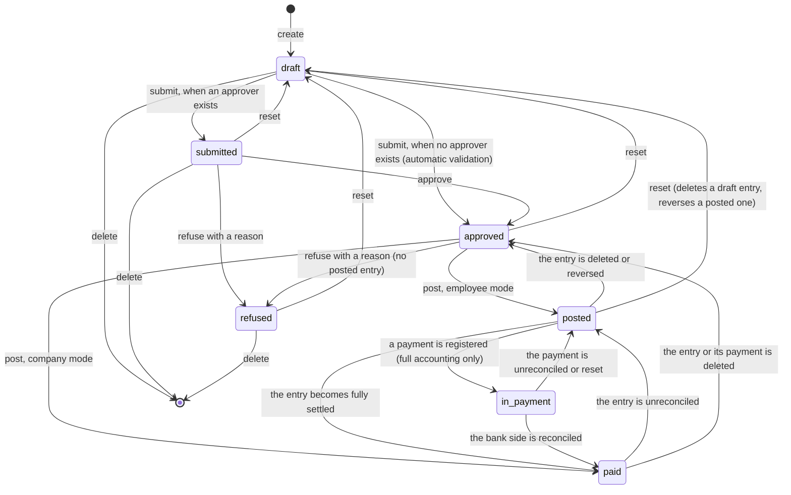

# Expenses — State Machines

This file specifies every state field of the domain: its values, its transitions, the operation that triggers each transition, the guard conditions, the side effects, and the message-thread subtype broadcast on each change.

---

## 1. Overview: one visible status derived from two hidden drivers

The Expense entity (`hr.expense`, table `hr_expense`) shows **one** status field to the user, but that field is entirely derived. Nothing ever writes it directly. It is computed, and stored, from exactly two inputs:

| Driver | Owner | What it expresses |
|---|---|---|
| **Approval state** (`approval_state`) | the expense itself | How far the human approval chain has got: not yet submitted, submitted, approved, refused |
| **Linked journal entry** (`account_move_id`), through its own status and its payment status, plus the expense's outstanding amount | the accounting domain | How far the accounting has got: no entry, a draft entry, a posted entry, a settled entry |

The rule is: **the accounting driver wins whenever there is an entry.** As soon as an expense has a journal entry, the approval state stops being visible; when the entry disappears, the approval state becomes visible again. This is what lets an accountant delete or reverse an entry and hand the expense back to the approval chain in exactly the state it was in.

A third, invisible driver — the payment mode — decides *how* the accounting driver is read: for a company-paid expense the money left the company at posting time, so the expense jumps straight to *Paid* without passing through *Posted*.

---

## 2. The visible status

### 2.1 States

| Value | Label | Meaning |
|---|---|---|
| `draft` | Draft | The expense exists and has never been submitted, or it was reset. It is the only status in which the employee themselves may freely edit and delete it, in which attachments may be added and removed, and in which a total of zero is tolerated. |
| `submitted` | Submitted | The employee has handed the expense to an approver. An approval activity is scheduled on the approver. |
| `approved` | Approved | An approver has accepted the expense. It is now waiting for an accountant. It may no longer be deleted. |
| `posted` | Posted | A journal entry exists and is not yet settled. For an employee-paid expense this is the period during which the company owes the employee. |
| `in_payment` | In Payment | A payment has been recorded against the entry but the bank side is not yet reconciled. This value only ever appears when the full accounting capability is active; with invoicing only, the system collapses it into *Paid* (see §2.4). |
| `paid` | Paid | Nothing further is owed. Reached either by settling an employee-paid entry, or immediately at posting for a company-paid expense. |
| `refused` | Refused | An approver rejected the expense with a reason. Terminal unless reset. Declared **last** in the value list so that status-ordered lists and grouped views place it after every other status. |

The status is indexed, tracked in the message thread, and never copied when an expense is duplicated (a copy starts at *Draft*).

### 2.2 Diagram

### 2.3 The computation, step by step

Given one expense, let *entry* be its linked journal entry.

1. If *entry* exists and its status is **cancelled**, the expense status is **`paid`**. Stop.
2. If *entry* exists:
   1. If the payment mode is `company_account`, the status is **`paid`**. Stop. (Justification recorded in the source: the money has already left; the bank statement may simply not have arrived yet.)
   2. Otherwise, if the entry's status is **draft**, the status is **`posted`**. Stop.
   3. Otherwise, if the entry's payment status is **not paid**, the status is **`posted`**. Stop.
   4. Otherwise, if the entry's payment status is **in payment**, **or** the payment status is **partial** and the expense's outstanding amount is not zero in the company currency, the status is the value returned by the *in-payment status hook* (§2.4). Stop.
   5. Otherwise the status is **`paid`**. Stop. (This branch covers a payment status of *paid*, *reversed*, *blocked*, and *partial* with a zero outstanding amount.)
3. If no entry exists, the status is the **approval state** when one is set, and **`draft`** otherwise.

The computation is re-evaluated whenever the outstanding amount changes, the entry's status changes, the entry's payment status changes, or the approval state changes.

### 2.4 The in-payment status hook

The accounting core exposes a hook that answers "what status does a document take when it has been paid but the bank has not confirmed?". With invoicing capability only, the hook answers **`paid`** — users who do not do bank reconciliation never want to see an intermediate value. With the full accounting capability the hook answers **`in_payment`**. The expense status therefore shows *In Payment* only in the second configuration; in the first, step 2.4 of the algorithm above yields *Paid*.

A rebuild must expose the same hook and use it in exactly this one place, so that the two configurations differ in no other respect.

### 2.5 Notable consequences of the computation

| Consequence | Why |
|---|---|
| A company-paid expense can never be seen as *Posted*. | Step 2.1 short-circuits. |
| Deleting the journal entry of a posted employee expense returns it to *Approved*, not to *Draft*. | Step 3 falls back to the approval state, which is still `approved`. |
| Unreconciling a payment returns a *Paid* expense to *Posted*. | The entry's payment status returns to *not paid*, hitting step 2.3. |
| Refusing does **not** clear the approval date or the manager. | Only the approval state changes. |
| An expense whose entry is cancelled shows *Paid*. | Step 1. In practice the cancellation operation also clears the link between the entry and its expenses, so the expense usually falls through to step 3 and shows *Approved* instead; step 1 is the answer for any entry that remains linked while cancelled. |

---

## 3. The approval state

### 3.1 States

| Value | Label | Meaning |
|---|---|---|
| *(empty)* | — | Never submitted, or reset. |
| `submitted` | Submitted | Handed to an approver. |
| `approved` | Approved | Accepted. |
| `refused` | Refused | Rejected with a reason. |

The approval state is read-only to users and never copied.

### 3.2 Transition table

| From | To | Trigger operation | Guards | Side effects |
|---|---|---|---|---|
| *(empty)* | `submitted` | **Submit** (`action_submit`) | (a) The acting user is the expense's employee **or** may approve the expense; (b) the expense has a category; (c) the totals are not zero. | The manager is filled in with the computed responsible approver if it was empty (written with elevated rights). An approval activity of the type *Expense Approval* is scheduled on the manager, falling back to the freshly computed responsible approver, falling back to the acting user. The activity scheduling runs in "quick update" mode. |
| *(empty)* | `approved` | **Submit**, automatic validation branch | Additionally: the expense qualifies for automatic validation, that is, **either** it has no manager **and** the employee has no designated expense approver, **or** its manager is the employee's own user. | The approval algorithm of §3.3 runs immediately, with analytic validation switched **on**. The duplicate check is deliberately **skipped** on this path. |
| `submitted` | `approved` | **Approve** (`action_approve`) | The approval permission test passes for every selected expense. If any selected expense has duplicates in the statuses *Submitted*, *Approved*, *Posted*, *Paid* or *In Payment*, the operation does **not** approve: it opens the Duplicate Expense Confirmation Dialogue instead. | See §3.3. |
| `submitted` | `approved` | **Approve** from the duplicate dialogue | None beyond the dialogue being open. Only listed expenses still in *Submitted* are approved. | See §3.3. |
| `submitted` or `approved` | `refused` | **Refuse** (`action_refuse`, then the refusal dialogue) | (a) The approval permission test passes for every selected expense; (b) no selected expense has a **posted** journal entry. | See §3.4. |
| `submitted` | `refused` | **Refuse** from the duplicate dialogue | Only listed expenses still in *Submitted* are refused. | Same as above, with the fixed reason **"Duplicate Expense"**. |
| any | *(empty)* | **Reset to Draft** (`action_reset`) | (a) The reset permission test passes for every selected expense; (b) no selected expense is linked to an entry whose status is other than absent or draft — *at the moment the guard runs*. | See §3.5. |
| `approved` | `approved` | **Post** | The status is *Approved* and a payment mode is set. | The approval state is unchanged; only a journal entry appears, which changes the **visible** status. |

### 3.3 The approval side effects

Running for each expense whose current status is *Submitted* or *Draft*:

1. Validate the analytic distribution against every plan declared **mandatory** for the business domain `expense`, passing the expense's account, its category, and its company. A failure raises the analytic validation error of `../analytic-accounting/`.
2. Write three fields together: approval state ← `approved`; manager ← **the acting user** (overwriting whoever was there); approval date ← the current moment.
3. After the loop, refresh activities and notifications for the whole selection: approval activities are marked done on approved expenses.

A second guard runs inside the write itself: writing an approved status or approval state re-runs the approval permission test, but only over the expenses that were *not* automatically validated — that is, over those whose manager differs from the employee's own user, or whose employee has a designated expense approver.

### 3.4 The refusal side effects

1. With elevated rights, collect the linked journal entries. If any of them is **not** in draft status, abort the whole operation with *"You cannot cancel an expense linked to a posted journal entry"*.
2. Delete every **draft** linked entry, so that no orphan entry is left behind.
3. Set the approval state to `refused` for all selected expenses.
4. On each expense, post a message rendered from the refusal template, using the comment subtype, with two values: the reason and the expense's description.
5. Refresh activities: approval activities on refused expenses are **removed** (not marked done).

### 3.5 The reset side effects

1. Run the reset permission test (§4 of `business-rules.md`) and the "no posted entry" guard.
2. Strip the calling context of all default values and of any project in context.
3. With elevated rights, split the linked entries into draft ones and non-draft ones.
4. **Reverse** every non-draft entry in cancellation mode, giving each reversal a bill date of today. Cancellation mode means the reversal is immediately reconciled against the original, so both end up fully neutralised. Note that the reversal operation first clears the link between the original entry and its expenses.
5. **Delete** every draft entry.
6. With elevated rights, clear three fields on the expenses: approval state, approval date and journal entry reference.
7. Refresh activities: approval activities are removed.

Because step 6 clears the entry reference, the visible status falls back to *Draft*.

### 3.6 Message-thread subtypes broadcast on a status change

Six subtypes are shipped for the Expense entity, none of them subscribed to by default:

| Subtype | Label | Description | When it is used |
|---|---|---|---|
| `mt_expense_approved` | Approved | *Expense approved* | The status became `approved` other than by reverting from an accounted status. |
| `mt_expense_refused` | Refused | *Expense refused* | Broadcast of a refusal. |
| `mt_expense_paid` | Paid | *Expense paid* | The status became `paid`. |
| `mt_expense_reset` | Draft | *Expense reset to Draft* | The status became `draft`. |
| `mt_expense_entry_delete` | Journal Entry Deleted | *Journal entry deleted* | The status reverted to `approved` from `posted`, `in_payment` or `paid`, **and** no journal entry remains linked. |
| `mt_expense_entry_draft` | Journal Entry Reset to Draft | *Journal entry reset to draft* | The status reverted to `approved` from `posted`, `in_payment` or `paid`, **and** a journal entry is still linked. |

Selection rule, evaluated for one expense whose status just changed, using the status **before** the change:

1. If the new status is `draft`, use *Draft*.
2. If the new status is `paid`, use *Paid*.
3. If the new status is `approved`:
   - if the previous status was one of `posted`, `in_payment`, `paid`, use *Journal Entry Reset to Draft* when an entry is still linked, otherwise *Journal Entry Deleted*;
   - otherwise use *Approved*.
4. In every other case, fall back to the generic tracking subtype of the message framework.

If the change did not touch the status at all, the generic tracking subtype is used.

---

## 4. The payment progress of the linked entry

An employee-paid expense produces a purchase receipt whose payable line must be settled. The relevant states are owned by `../general-ledger/` and `../payments-and-bank-reconciliation/`; this section records only how they map back onto the expense.

| Entry status | Entry payment status | Outstanding amount | Expense status |
|---|---|---|---|
| draft | — | — | `posted` |
| posted | not paid | anything | `posted` |
| posted | in payment | anything | in-payment hook (`in_payment`, or `paid` with invoicing only) |
| posted | partial | non-zero | in-payment hook |
| posted | partial | zero | `paid` |
| posted | paid | — | `paid` |
| posted | reversed | — | `paid` |
| posted | blocked | — | `paid` |
| cancelled | — | — | `paid` |
| *(no entry)* | — | — | the approval state, or `draft` |

### 4.1 Worked progression for an employee-paid expense of 1 600.00

| Step | Event | Entry status | Entry payment status | Outstanding | Expense status |
|---|---|---|---|---|---|
| 1 | Posted | posted | not paid | 1 600.00 | Posted |
| 2 | Payment of 1 000.00 registered | posted | partial | 600.00 | In Payment |
| 3 | Payment of 600.00 registered | posted | in payment | 0.00 | In Payment |
| 4 | The bank line is reconciled against both payments | posted | paid | 0.00 | Paid |
| 5 | The two payments are reset to draft and unreconciled | posted | not paid | 1 600.00 | Posted |
| 6 | The entry is reset to draft and deleted | *(none)* | — | — | Approved |

Step 2 shows why the outstanding amount is part of the computation: a *partial* payment status with a non-zero remainder is reported as *In Payment*, not as *Posted*, so that the employee sees that reimbursement has begun.

---

## 5. The company-paid path has no payment progress

For a company-paid expense the posting operation creates a **payment** whose own entry is the expense's entry. The expense reaches *Paid* at that instant and stays there. There is no *Posted* stage and no reimbursement to register: the counterpart of the expense line is an outstanding-payments account, and settling that account against a bank statement is an operation of `../payments-and-bank-reconciliation/` that has no effect on the expense status.

The only way out of *Paid* for a company-paid expense is to remove the accounting:

| Event | Result |
|---|---|
| The payment is deleted | Its entry goes with it; the expense's entry reference becomes null; the status falls back to *Approved*. |
| The payment's entry is cancelled | Cancelling clears the link to the expenses; the status falls back to *Approved*. |
| The expense is reset | The entry is reversed in cancellation mode and the references are cleared; the status becomes *Draft*. |

---

## 6. The journal entry status, as seen from this domain

For completeness, the three statuses of the produced entry and what each means here:

| Value | Label | Meaning in this domain |
|---|---|---|
| `draft` | Draft | The entry exists but has not been posted. This is a transient state during the posting operation, and the state an entry returns to when an accountant resets it. |
| `posted` | Posted | The entry is in the ledger and numbered. |
| `cancel` | Cancelled | The entry has been voided. Cancelling it clears its link to the expenses. |

The transitions themselves, the numbering, the lock dates and the audit-trail protections are specified in `../general-ledger/state-machines.md`.

---

## 7. Guard summary

Every guard that can block a transition, with its exact message, gathered in one place. The full permission algorithms are in `business-rules.md` §3.

| Transition | Guard | Message when it fails |
|---|---|---|
| Submit | The acting user is not the employee and may not approve | *"You do not have the required permission to submit this expense."* |
| Submit | No expense category | *"You can not submit an expense without a category."* |
| Submit / Approve / Post | A total of zero | *"Only draft expenses can have a total of 0."* |
| Approve | The approval permission test fails | *"You cannot approve:"* followed by one line per blocked expense (four possible reasons, listed in `business-rules.md` §3.3) |
| Refuse | The approval permission test fails | *"You cannot refuse:"* followed by the same per-expense reasons |
| Refuse | A linked entry is posted | *"You cannot cancel an expense linked to a posted journal entry"* |
| Reset | The reset permission test fails | *"Only HR Officers, accountants, or the concerned employee can reset to draft."* |
| Reset | A linked entry is not draft | *"You cannot reset to draft an expense linked to a posted journal entry."* |
| Post | Any selected expense is not *Approved* | *"You can only generate an accounting entry for approved expense(s)."* |
| Post | Any selected expense has no payment mode | *"Please specify if the expenses were paid by the company, or the employee."* |
| Post | Employee-paid expenses of several companies selected together | *"You can't post simultaneously employee-paid expenses belonging to different companies"* |
| Post | A company-paid expense uses the Single Euro Payments Area credit-transfer method with no vendor | *"The vendor is required for expenses using SEPA Credit Transfer as the payment method. Please set a vendor on the following expenses: «comma-separated descriptions»"* |
| Post | No payment method line on a company-paid expense | *"You need to add a manual payment method on the journal («journal name»)"* |
| Post | The acting user may not create journal entries | *"You don't have the rights to create accounting entries."* |
| Post | No expense account can be resolved | The account-resolution failure message of `business-rules.md` §5.2 |
| Post | The employee has no work contact, employee mode | *"No work contact found for the employee «employee name», please configure one."* |
| Post | The resolved destination accounts differ across the selection | *"The following expenses payment method leads to several accounts payable and this isn't supported: «expenses»"* |
| Post | The outstanding account is archived | *"The account «account name» («account code») is archived. Activate it to continue"*, offered with a button *Go to Account* |
| Delete | The status is *Approved*, *Posted*, *In Payment* or *Paid* | *"You cannot delete a posted or approved expense."* |
| Split | The status is *Posted*, *Paid* or *In Payment* | *"You cannot split an expense that is already posted."* |
| Split | The acting user may not edit the expense | *"You do not have the rights to edit this expense."* |
