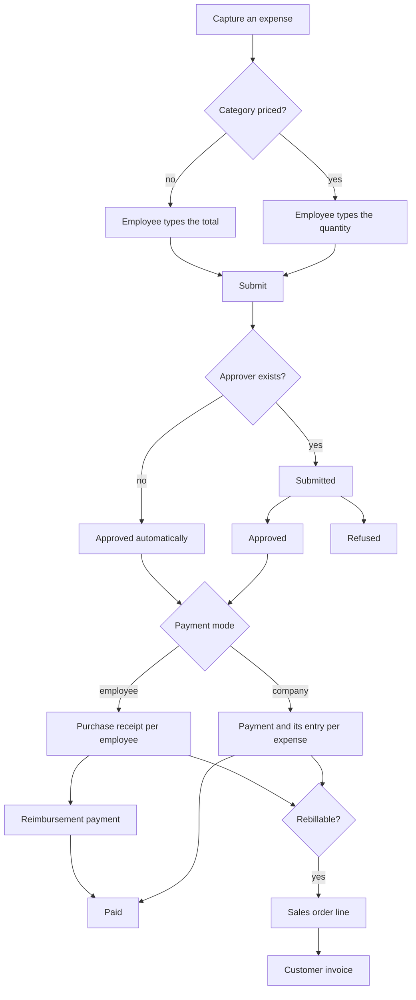

# Expenses — Workflows

End-to-end operational procedures, step by step. Each step states the records it creates or
changes, the operation it invokes, and the conditions under which it fails. Guard messages are
stated by rule identifier and reproduced in [`business-rules.md`](business-rules.md).

---

## 1. The shape of the domain

Six capture routes feed the same single entity; two posting routes leave it. Everything between is
one approval chain.

---

## 2. Capturing an expense

### 2.1 By hand, on the entry form

**Actor.** Any internal user, for their own employee record; an approver, for an employee they may
encode for (rule EXP-PRM-1 and the encoding filter of [`entities.md`](entities.md) §7.2).

1. Open *My Expenses* and create a record. The form is opened with the acting user's employee
   already filled in, the company set to the acting company, the currency set to the company
   currency, the quantity at 1, the payment mode at *Employee (to reimburse)* and the expense date
   at today in the reader's time zone.
   - **Fails** when the acting user owns no employee record and is not at least a Team Approver:
     rule EXP-STR-1.
2. Choose the **expense category**. This one choice settles six things at once: the description
   (when it is still empty), the unit, the tax set, the expense account, the analytic distribution
   and the pricing model. See [`calculations.md`](calculations.md) §2.1.
3. Depending on the pricing model:
   - **Amount-driven** — type the total and, when the multi-currency capability is active, choose
     the currency. The form shows the tax part beside it as *"(incl «tax amount» tax)"* whenever
     that amount is non-zero.
   - **Quantity-driven** — type the quantity. The unit price and the unit are shown read-only
     beside it; the currency selector is not offered, the currency being forced to the company
     currency.
4. When the currency differs from the company currency, the form additionally shows the
   company-currency total and the rate label. Either may be overridden by typing the
   company-currency total; see [`calculations.md`](calculations.md) §5.4.
5. Optionally adjust the taxes, the expense date, the manager, the account, the analytic
   distribution, the internal notes and — for a company-paid expense — the vendor and the payment
   method.
6. Set the payment mode. Choosing *Company* reveals the vendor and makes the payment method
   required.
7. Attach the receipt (§2.3).
8. Save. The record is created in the *Draft* status, the employee's user is subscribed to the
   message thread, and the creation message is posted.

At every point the form's editability follows rule EXP-PRM-1: a field is offered for editing only
while the editability flag is true.

### 2.2 From one or more receipt files

**Actor.** Any internal user, from the list or the card view of *My Expenses*.

1. Press *Upload* — labelled *Scan* on a small screen — or drop files onto the view. The view
   accepts any file type and any number of files.
2. The files are uploaded and become attachments owned by nothing yet.
3. The creation operation runs:
   1. **Fails** when no attachment was supplied, when any attachment already belongs to a record,
      or when no Product Variant is expensable at all: rule EXP-ATT-6.
   2. Choose the default category: the expensable variant whose internal reference is `EXP_GEN` if
      there is one, otherwise the first expensable variant found.
   3. For **each** attachment, create one expense with a description of
      *"Untitled Expense «today's date, formatted for the reader's language»"*, a unit price of 0
      and that category; write the category's own expense account when it has one; re-own the
      attachment to the new expense; and force that attachment as the expense's main attachment.
4. The view is replaced by a list of exactly the expenses just created, named *"Generate Expenses"*.
   Uploading again while that list is open widens the list instead of replacing it.
5. The employee opens each expense and types its amount.

One file produces one expense. Nothing is read out of the file by this domain; the digitisation
capability that fills the amounts from the image is a separate capability, activated by the setting
of [`configuration.md`](configuration.md) §2.

### 2.3 Attaching a receipt to an existing expense

**Actor.** The expense's employee, or anyone who may write the expense.

1. Press *Attach Receipt* in the form's header. The button is placed **first** in the header when
   the expense has no attachment yet, and **last** when it already has one, so that the primary
   action of an expense without evidence is to supply it.
2. The files are uploaded and created as attachments of the expense.
   - **Fails** when the status is beyond *Submitted*: rule EXP-ATT-1.
   - **Fails** when the acting user has no access at all: the upload endpoint refuses.
   - An attachment created by the expense's **own** employee on an expense they may not otherwise
     write is created with elevated rights, keeping only the name, the content, the owning record
     and the owning entity: rule EXP-ATT-4.
3. The operation checks access — rule EXP-ATT-3 — and forcibly sets the **last** uploaded file as
   the expense's main attachment, so the receipt appears beside the form.
4. The attachment counter in the list view and the header updates.

Deleting an attachment follows rule EXP-ATT-2: allowed up to *Submitted*, refused afterwards.

### 2.4 From an electronic mail message

**Actor.** An employee, sending to the expense mailbox address.

1. The routing layer accepts the message only from an address belonging to an internal user, the
   alias's contact policy being `employees`: rule EXP-MAI-2.
2. Identify the employee from the sender address by the procedure of
   [`calculations.md`](calculations.md) §8.1.
   - **Stops** when no employee matches: the message falls through to generic routing and no
     expense is created (rule EXP-MAI-1).
3. Take the employee's company; when the employee has none, take the acting company. Switch the
   acting company to it, so that the category's company-dependent accounts resolve correctly.
4. Parse the subject for a category, a price and a currency, considering **only** the company's own
   currency: [`calculations.md`](calculations.md) §8.2 and §8.3.
5. Create the expense with the values of [`calculations.md`](calculations.md) §8.5. The message
   itself becomes the first message of the expense's thread and its attachments become the
   expense's attachments.
6. Send the acknowledgement (rule EXP-MAI-4):
   - **The employee has a user** — render the registration template and post it as a note on the
     expense, addressed to that user's partner, with the subject *"Re: «the original subject»"* and
     the light notification layout.
   - **The employee has no user** — render the no-user registration template, which wraps the same
     body in a framed layout carrying the company's logotype, and send it directly to the address
     the message came from, referencing the original message.
7. The acknowledgement states the category when one was found, and otherwise says:
   *"Category: not found"* followed by
   *"The first word of the email subject did not correspond to any category code. You'll have to
   set the category manually on the expense."*
   It also states the price and the currency symbol, and — when the employee has a user — offers a
   link labelled *"View Expense"*.

The empty-list help of the expense views advertises the address when the mailbox is switched on:
*"Tip: try sending receipts by email"* followed by the address as a link whose subject is
pre-filled with *"Lunch with customer $12.32"*.

### 2.5 By splitting another expense

See §7.

### 2.6 From a project

**Actor.** A project manager or an approver, from a project.

1. Open the project's *Expenses* embedded action. It is offered in two places: beside the project's
   task views, and beside the project update dashboard. Both are restricted to All Approvers.
2. The action lists the expenses whose analytic distribution names the project's analytic account,
   and carries the project in its context.
3. Creating an expense from that list gives it the project's analytic distribution by default; see
   [`calculations.md`](calculations.md) §11.2. The default is applied both while the form is being
   filled and again at creation time, so a programmatic creation in that context also receives it.

---

## 3. Submitting

**Actor.** The expense's employee, or anyone who could approve it (rule EXP-PRM-6).

1. Press *Submit* on the form, or *Submit* above the list after selecting records.
2. For each selected expense, in order:
   1. **Fails** when the acting user is neither the employee nor able to approve: rule EXP-PRM-6.
   2. **Fails** when the expense has no category: rule EXP-MAI-3.
   3. When the manager is empty, compute the responsible approver
      ([`calculations.md`](calculations.md) §3.1) and write it onto the expense with elevated
      rights.
3. Partition the selection by the automatic-validation test of
   [`calculations.md`](calculations.md) §3.2.
4. For the expenses that do **not** qualify: write an approval state of `submitted`. The visible
   status becomes *Submitted*.
   - **Fails** when either total is zero: rule EXP-AMT-1.
5. For the expenses that **do** qualify: run the approval algorithm of §4.3 immediately, with
   analytic validation switched on. The duplicate check of §4.2 is deliberately **skipped** on this
   path. The visible status becomes *Approved*.
   - **Fails** when a mandatory analytic plan is unsatisfied: rule EXP-ANA-1. The expense stays in
     *Draft*.
6. Refresh the activities and notifications of the whole selection with elevated rights (§3.1).

### 3.1 Activity and notification refresh

Run after every operation that changes an approval state. For each expense:

| Visible status | Action |
|---|---|
| *Submitted* | Schedule an activity of the type *Expense Approval* on the expense's manager, falling back to the freshly computed responsible approver, falling back to the acting user. The scheduling runs in quick-update mode, which suppresses the activity notification. |
| *Approved* | Mark the *Expense Approval* activities of that expense as done. |
| *Draft* or *Refused* | Remove the *Expense Approval* activities of that expense without marking them done. |
| *Posted*, *In Payment*, *Paid* | Nothing. |

No electronic-mail message is sent at submission time. The approver is told by the **weekly
reminder job** of §12, which is what produces the message *"New expenses waiting for your
approval"*.

---

## 4. Approving

**Actor.** An approver for whom the approvability test of rule EXP-PRM-2 passes.

### 4.1 The operation

1. Press *Approve* on the form — offered only while the status is *Submitted* and the approvability
   flag is true — or *Approve* above the list after selecting records.
2. Run the approval test over the whole selection.
   - **Fails** with the collected reasons: rule EXP-PRM-2.
3. Collect the duplicates: the union of the duplicate sets of the selected expenses, restricted to
   those whose status is *Submitted*, *Approved*, *Posted*, *Paid* or *In Payment*.
4. **If that collection is not empty**, do **not** approve. Open the Duplicate Expense Confirmation
   Dialogue instead, carrying the collection (§4.2).
5. Otherwise run the approval algorithm (§4.3).

### 4.2 The duplicate confirmation

The dialogue lists the suspected duplicates with their date, employee, category, company-currency
total, description, manager and approval date, under the text:

> "The following approved expenses have similar employee, amount and category than some expenses of this report. Please verify this report does not contain duplicates."

Three buttons:

| Button | Effect |
|---|---|
| *Refuse* | Refuse every listed expense **that is still in the *Submitted* status** with the fixed reason "Duplicate Expense", then close. |
| *Approve* | Approve every listed expense that is still in the *Submitted* status, then close. |
| *Cancel* | Close, changing nothing. |

Two properties follow from "every listed expense", and a rebuild must reproduce both:

- The dialogue acts on the **duplicates**, not on the selection the approver started from. An
  approver who selected one expense and confirms approval also approves the other members of its
  duplicate family that are still submitted.
- Listed expenses that are already approved or posted are left alone, the filter keeping only the
  submitted ones.

There is a second, separate operation that only records a judgement: it posts, on **each** duplicate
of the expense, a message authored by the system's own partner reading
*"«acting user's name» confirms this expense is not a duplicate with similar expense."*

### 4.3 The approval algorithm

Run over the expenses of the selection whose status is *Submitted* or *Draft* — the second value is
what lets automatic validation reuse this algorithm.

1. For each such expense, validate the analytic distribution against every mandatory plan of the
   business domain `expense`, passing the account, the category and the company: rule EXP-ANA-1.
2. Write three fields together on that expense:

   | Field | Value |
   |---|---|
   | approval state | `approved` |
   | manager | **the acting user**, overwriting whoever was there |
   | approval date | the current moment |

   The write itself re-runs the approval test for the expenses that were not automatically
   validated: rule EXP-PRM-9.
3. After the loop, refresh activities and notifications for the whole selection (§3.1).

The visible status becomes *Approved*. Nothing accounting has happened yet.

---

## 5. Refusing

**Actor.** An approver for whom the approvability test passes; the button is restricted to Team
Approvers and is offered while the status is *Submitted* or *Approved*.

1. Press *Refuse*. The refusal test runs over the selection.
   - **Fails** with the collected reasons: rule EXP-PRM-3.
2. The Expense Refusal Dialogue opens, its expense set defaulted from the records the operation was
   launched on. It asks for a **mandatory** reason.
3. Press *Refuse* in the dialogue. The refusal algorithm runs:
   1. With elevated rights, collect the linked journal entries. If any is **not** draft, abort the
      whole operation: rule EXP-LIF-5. Nothing is changed.
   2. Delete every **draft** linked entry, so no orphan entry is left behind.
   3. Write an approval state of `refused` on every selected expense. The visible status becomes
      *Refused*.
   4. On each expense, post a message rendered from the refusal template with the comment subtype
      and two values — the reason and the expense's description. The rendered body reads
      *"Your Expense «description» has been refused"* followed by a list holding
      *"Reason: «the reason»"*.
   5. Refresh activities: the approval activities are **removed**, not marked done (§3.1).
4. The dialogue closes.

Refusing does **not** clear the approval date or the manager (invariant EXP-INV-14); only a reset
does.

---

## 6. Resetting to draft

**Actor.** A user for whom the reset test of rule EXP-PRM-4 passes. The form offers two reset
buttons: an accounting user sees one on every status but *Draft*; a non-accounting user sees one
only on *Submitted*, *Approved* and *Refused*.

1. Press *Reset*.
2. Run the reset test over the selection.
   - **Fails**: rule EXP-PRM-4.
3. Check that no selected expense is linked to an entry whose status is other than absent or draft.
   - **Fails**: rule EXP-LIF-6.
4. Strip the calling context of every default value and of any project it carries, so that the
   records created in the next steps inherit nothing from the screen the reset was launched from.
5. With elevated rights, split the linked entries into draft ones and non-draft ones.
6. **Reverse** every non-draft entry in cancellation mode, giving each reversal a bill date of today
   in the reader's time zone. Cancellation mode reconciles the reversal against the original
   immediately, so both net to zero. The reversal operation first clears the link between the
   original entry and its expenses (rule EXP-EXT-7), and, with the rebilling capability present,
   first resets the rebilling lines (§9.4).
7. **Delete** every draft entry. With the rebilling capability present, deleting the entry likewise
   resets the rebilling lines first.
8. With elevated rights, clear three fields on the expenses: approval state, approval date and
   journal-entry reference.
9. Refresh activities: the approval activities are removed (§3.1).

Because step 8 clears the entry reference, the visible status falls back to the approval state,
which step 8 also cleared — so the status becomes *Draft*.

---

## 7. Splitting one expense into several

**Actor.** A user for whom the expense is editable, subject to rule EXP-LIF-4.

1. Press *Split Expense*.
   - **Fails** when the status is *Posted*, *Paid* or *In Payment*: rule EXP-LIF-2.
   - **Fails** when the expense is not editable: rule EXP-LIF-3.
2. Two Expense Split Lines are created, each proposing half of the receipt-currency total, one
   rounded up and one rounded down ([`calculations.md`](calculations.md) §9.1), and a dialogue is
   created to hold them.
3. The dialogue opens, titled *"Expense split"*. It shows the running total of the pieces, the
   original total, the running total of the pieces' taxes, and — when the two totals disagree — a
   warning reading *"The total amount doesn't match the original amount."* with the running total
   in the danger colour.
4. The user edits the pieces: change an amount, change a category, clear or add taxes, change the
   employee, change the analytic distribution, change the sales order, delete a piece, add a piece.
   - Changing a piece's category to one that carries no supplier taxes, or to one where the piece
     has none, resets the piece's taxes to that category's supplier taxes filtered to the piece's
     company. Where the piece already has taxes and the category has some, the existing taxes are
     deliberately **left alone**, so taxes removed on purpose during the split stay removed.
   - Choosing a category with a non-zero unit cost overwrites the piece's total with that unit cost
     expressed in the piece's currency, and makes the amount read-only.
5. Press *Split Expense*. The button is disabled until the sum check of
   [`calculations.md`](calculations.md) §9.3 passes.
6. The split runs:
   1. Write the **first** piece's values onto the expense being split.
   2. For every remaining piece, **copy** the expense and overwrite the copy with that piece's
      values. The copy is created with the split marker in context, so its creation message reads
      *"Expense created from a split."*
   3. Copy every attachment of the original onto each new expense.
   4. Set the split-origin reference on the original and on every copy to the original's existing
      origin, or to the original itself when it has none.
7. The dialogue closes onto a list of the whole family — the original, the new pieces, and any
   earlier siblings sharing the same origin — titled *"Split Expenses"*.

Because the approval state, the approval date and the manager travel with each piece, splitting an
**approved** expense yields approved pieces, and splitting a submitted one yields submitted pieces.
The status of each piece follows from its approval state.

A split piece never participates in same-receipt detection
([`calculations.md`](calculations.md) §7.2), precisely because step 6.3 gave it a copy of the
original's receipt.

The *Split* smart button on the form of any member of the family reopens the whole family.

---

## 8. Posting

**Actor.** A user holding the accounting invoicing privilege. The *Post Journal Entries* button is
offered on the form while the status is *Approved*.

### 8.1 The single entry point

1. Run the posting preconditions over the whole selection: rules EXP-PST-1, EXP-PST-2.
2. Partition the selection by payment mode into *company-paid* and *employee-paid*.
3. **Fails** when the employee-paid part spans more than one company: rule EXP-PST-3.
4. **Fails** when any company-paid expense uses the single-area credit-transfer method without a
   vendor: rule EXP-PST-4.
5. When the rebilling capability is present, for each expense that names a sales order and has no
   analytic distribution at all: create an analytic account from the order's own creation values
   and set the distribution to one hundred per cent of it.
6. When the project-and-sales capability is present, for each expense whose order has a project and
   that has no distribution at all: create the project's analytic account if it lacks one, and set
   the distribution to the project's.
7. If there are company-paid expenses, run §8.4 and then post their **payments**, which posts their
   entries at the same time.
8. If there are employee-paid expenses, open the posting dialogue (§8.2), carrying the identifiers
   of the entries just created so that the closing action can show them together.

### 8.2 The posting dialogue

Created empty and shown as a modal. Its title is *"Post expenses paid by the employee"* when
company-paid entries were created in the same operation, and *"Post expenses"* otherwise.

| Field | Default |
|---|---|
| Company | the acting company, read-only |
| Journal | the acting company's default expense journal; else the default expense journal of the **closest parent company** that has one, searching from the nearest parent outwards; else the first purchase journal of the acting company. Restricted to purchase journals of the acting company. |
| Accounting Date | today in the reader's time zone |

### 8.3 Posting the employee-paid expenses

Pressing *Post Expenses* runs:

1. Read the expenses from the operation's active identifiers.
2. **Fails** when the acting user may not create journal entries: rule EXP-PST-6.
3. Build the receipt values, one receipt per **employee**, as specified in
   [`accounting-effects.md`](accounting-effects.md) §3.1, and overwrite two of them with the
   dialogue's answers: the journal and the bill date.
4. Create the entries with elevated rights.
5. For each created entry, force its **first** attachment as its main attachment, without the usual
   filtering that skips structured-document files — a receipt image must be shown even when the
   entry also carries a structured document.
6. Post the entries. Numbering, the accounting-date derivation and the lock-date checks are those of
   [`../general-ledger/`](../general-ledger/).
7. When the acting company has **no** default expense journal, write the journal chosen in the
   dialogue onto the company with elevated rights. The next posting therefore proposes the same
   journal.
8. Close onto: the created entry when there is exactly one, or a list of the created entries plus
   the company-paid entries of the same operation, titled *"New expense entries"*, when there are
   several.

The expenses' visible status becomes *Posted*, through the status computation of
[`state-machines.md`](state-machines.md) §2.3; no status field is written.

### 8.4 Posting the company-paid expenses

No dialogue. For **each** company-paid expense, individually:

1. Strip the context of default values and of any project.
2. Prepare the entry values and the payment values
   ([`accounting-effects.md`](accounting-effects.md) §4).
   - **Fails** when the expense has no payment method line: rule EXP-PST-5.
   - **Fails** when no expense account can be resolved: rule EXP-ACC-1.
   - **Fails** when the outstanding account is archived: rule EXP-ACC-4.
3. Create the **entry** first, with elevated rights, with its lines fully written out.
4. Create the **payment**, pointing at that entry.
5. Write back onto the entry: the originating payment, **and the journal identifier again**. The
   journal must be re-asserted because setting the originating payment triggers a recomputation
   chain that would otherwise void the company currency of the lines.
6. After every expense has been processed, post the **payments**. Posting a payment posts its entry.

The expenses' visible status becomes *Paid* immediately, the money having already left the company.

### 8.5 The direct posting path

A second, internal path posts employee-paid expenses without the dialogue. It is used where no user
interaction is possible.

1. Run the posting preconditions (rules EXP-PST-1, EXP-PST-2).
2. Keep only the employee-paid expenses and group them by **company**.
3. For each company, choose the journal: the company's default expense journal, else the first
   purchase journal of that company.
4. Build the receipts as in §8.3 with a bill date of **today**, create them with elevated rights,
   force the main attachment, and post them.

The difference from §8.3 is that this path groups by company as well as by employee and therefore
accepts a multi-company selection, where the dialogue path refuses one (rule EXP-PST-3).

---

## 9. Rebilling an expense to a customer

Present with the expense-rebilling capability.

### 9.1 Setting it up

1. On the expense **category**, set the rebilling policy to *At cost* or *Sales price*. The
   category form shows a sentence explaining the chosen policy
   ([`entities.md`](entities.md) §3) and, for *Sales price*, reveals the list price.
   The window action that creates an expense category defaults the policy to *At cost*.
2. On the **expense**, the *Customer to Reinvoice* field appears as soon as the category is
   rebillable. The employee names a confirmed sales order. The selector shows every confirmed order
   of the accessible companies by name, even ones belonging to another salesperson: rule EXP-REB-5.
3. Naming the order re-derives the analytic distribution: rule EXP-REB-6.

### 9.2 What happens at posting

Rebilling rides on the analytic lines created when the expense's journal entry is posted.

1. Posting the entry creates one analytic line per analytic account named in each item's
   distribution, with the amounts of [`calculations.md`](calculations.md) §10.5.
2. Before those analytic lines are stored, each journal item is asked whether it may be rebilled:
   [`calculations.md`](calculations.md) §10.1. Items of a reversal entry are excluded beforehand.
3. The sales order is determined for each rebillable item:
   [`calculations.md`](calculations.md) §10.2.
4. The order is checked: rule EXP-REB-1.
5. The rebilling price is computed: [`calculations.md`](calculations.md) §10.3.
6. A **new** sales order line is created — never a reused one, rule EXP-REB-3 — with the values of
   [`accounting-effects.md`](accounting-effects.md) §8.4.
7. Each analytic line is stamped with the sales order line.
8. The line's delivered quantity is then computed from the analytic lines pointing at it:
   [`calculations.md`](calculations.md) §10.5.

### 9.3 Invoicing

The rebilling line is an ordinary sales order line from then on. It is invoiced by the ordinary
invoicing flow of [`../sales/workflows.md`](../sales/workflows.md), on ordered or on delivered
quantities according to the category's own invoicing policy, and produces an ordinary customer
invoice specified in
[`../accounts-receivable/accounting-effects.md`](../accounts-receivable/accounting-effects.md).

### 9.4 Undoing a rebilling

Three events reset a rebilling line, all of them acting **before** the change that triggered them:

| Event | Moment |
|---|---|
| the expense's entry is reset to draft | before the entry leaves the posted status |
| the expense's entry is reversed | before the reversal is created |
| the expense's entry is deleted | before the deletion |

In each case every rebilling line of the expenses that entry carried is written back to an ordered
quantity of 0, a delivered quantity of 0 and no linked expenses (rule EXP-REB-4). The line is kept
on the order at zero; a later posting creates a **new** line beside it.

**Worked sequence**, for an order carrying one ordinary line of three units and six expenses:

| Step | Order lines |
|---|---|
| Post the six expenses | the ordinary line, plus six expense lines with their quantities |
| Reset the six entries to draft and delete them, then reset the expenses | the ordinary line unchanged, plus six expense lines at 0 / 0 with no expenses |
| Re-submit, re-approve and re-post | the previous eight lines unchanged, plus **six new** expense lines with their quantities |

The order therefore accumulates zeroed lines. That is the accepted cost of guaranteeing that one
expense never disturbs another's quantity.

---

## 10. Tracking expense cost on a project

Present with the expense-costs-on-projects capability.

1. The expense receives the project's analytic distribution, either because it was created from the
   project's expense action (§2.6), or because an analytic distribution model matched, or because
   the posting step of §8.1 supplied one from the sales order's project.
2. Posting the expense produces the analytic lines of
   [`calculations.md`](calculations.md) §10.5, which are what the project reads.
3. The project's profitability panel gains an *Expenses* section with the figures of
   [`calculations.md`](calculations.md) §11.5: a cost side always, and a revenue side when at least
   one of the expenses produced a rebilling line.
4. Pressing the figure opens the expenses behind it, as a form when there is exactly one and as a
   list otherwise. The figure is only clickable for a user who is at least a Team Approver.
5. Four exclusions keep the panel from counting anything twice; they are listed in
   [`calculations.md`](calculations.md) §11.5.

---

## 11. Reimbursing the employee

**Actor.** An accounting user.

1. Open the purchase receipt produced by §8.3, or reach it from the expense's *Journal Entry* smart
   button, or use the *Register Payment* shortcut on the expense, which opens the
   register-payment dialogue on the expense's entry and pre-fills the recipient bank account when
   the entry names exactly one.
2. Register the payment through the ordinary dialogue of
   [`../payments-and-bank-reconciliation/workflows.md`](../payments-and-bank-reconciliation/workflows.md).
   Two things are changed for expenses: the batching key carries the employee's bank account (rule
   EXP-PAY-4) and the created payment's lines are stamped with the expense (rule EXP-PAY-5).
3. The payment debits the employee's payable account and credits the journal's outstanding-payments
   account. Its debit is reconciled against the receipt's payment-term line.
4. The expense's status follows the receipt's payment status:
   [`state-machines.md`](state-machines.md) §4.
5. Reconciling the bank statement line against the payment's outstanding line completes the chain
   and the expense becomes *Paid*.

Partial reimbursement is supported: the expense shows *In Payment* as soon as any amount has been
matched and a residual remains.

---

## 12. The weekly reminder to approvers

A scheduled job runs **every week** and does the following:

1. Read every expense whose visible status is *Submitted*.
2. If there is none, stop.
3. Group them by **company**. For each company:
   1. Determine the sender address: the acting user's own address, else the company's formatted
      address, else the formatted address of the nearest ancestor company that has one.
   2. If no sender address can be found, log a warning that the messages for that company could not
      be sent and move to the next company.
   3. Group that company's submitted expenses by **manager**. Skip the group whose manager is empty.
   4. For each manager, choose the message language: the first language of the manager's partner,
      else the acting language, else the system's default language.
   5. Render the approval-reminder template in that language with the manager's name, the address
      `/odoo/expenses-to-process` — the route of the *Expenses to Process* window action — and the
      company.
   6. Queue a message to the manager's employee work address, falling back to the manager's own
      address, with the subject *"New expenses waiting for your approval"*.
4. Send every queued message.

The rendered body reads *"Expenses approval"* as a heading, then *"Dear «manager name»,"*, then
*"New expenses are waiting for your approval. You can Review them by following this link."*, then a
button labelled *"View expenses"*, then the company's name, telephone number, electronic-mail
address and website.

This job is the **only** thing that notifies an approver by electronic mail. Submission itself
schedules an activity in quick-update mode, which suppresses the activity's own notification, so an
approver who checks nothing hears about a submission at the next run of this job.

---

## 13. Failure-condition summary

| Operation | Conditions that stop it |
|---|---|
| Create | EXP-STR-1, EXP-STR-6 |
| Attach a receipt | EXP-ATT-1, EXP-ATT-3 |
| Delete an attachment | EXP-ATT-2 |
| Create expenses from files | EXP-ATT-6 |
| Submit | EXP-PRM-6, EXP-MAI-3, EXP-AMT-1, EXP-ANA-1 (automatic-validation path only) |
| Approve | EXP-PRM-2, EXP-ANA-1, EXP-AMT-1 |
| Refuse | EXP-PRM-3, EXP-LIF-5 |
| Reset | EXP-PRM-4, EXP-LIF-6 |
| Split | EXP-LIF-2, EXP-LIF-3 |
| Post | EXP-PST-1 … EXP-PST-7, EXP-ACC-1 … EXP-ACC-4, EXP-REB-1, EXP-ANA-1 |
| Delete | EXP-LIF-1 |
| Edit a consequential field | EXP-PRM-8 |
| Edit a payment linked to an expense | EXP-PAY-1 |
| Delete an analytic account | EXP-EXT-8 |
