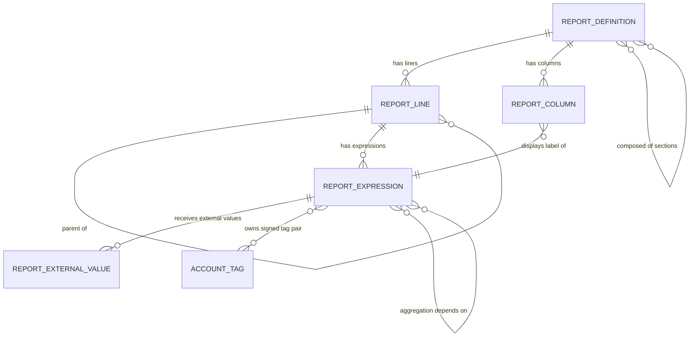

# Financial Reporting — Entities

This file specifies every entity of the Financial Reporting domain: its purpose, its lifecycle,
every field with its type and rules, its relations, its uniqueness rules, its defaults, its
computed fields, its ordering, its display rule, its archival behavior and its multi-company
behavior.

Conventions used in the field tables:

- **Field (storage name)** gives the human name followed by the exact storage name in code font.
  A rebuild may choose different storage names internally, but any external contract (import
  files, remote operations, export files) must use the names given here.
- **Type** is the abstract type: text, translated text, integer, decimal, date, boolean,
  selection, link to one record, link to many records.
- *Required* means the record cannot be stored without a value.
- *Stored* means the value is persisted; *derived* means it is recomputed on read from other
  fields; *derived and stored* means it is computed on write and persisted, and may be overridden
  by hand where stated.
- *Company-scoped* means the record belongs to exactly one company; *company-neutral* means the
  record is shared by all companies of the database.

---

## 1. Report Definition

**Report Definition** (`account.report`, table `account_report`).

### 1.1 Purpose

A Report Definition is the header of one report. It holds the report's name, the conditions under
which the report is offered to a user, the set of user-facing filters the report supports, the
presentation rules that apply to the whole report, its ordered list of columns and the root of its
line tree.

A Report Definition carries no formula of its own. All figures come from the expressions of its
lines.

### 1.2 Lifecycle

1. **Created** — either by loading a data package (all shipped reports arrive this way) or by a
   user with the accounting manager group through the report designer.
2. **Available** — the report appears in the reporting menu when its availability condition is
   satisfied for the active company (see §1.5).
3. **Archived** — setting the active flag to false hides the report everywhere without deleting
   it. An archived report keeps its lines, expressions, columns and external values.
4. **Deleted** — permitted only when the report has no variants. Deleting a report cascades to its
   lines (and therefore to their expressions, and therefore to the external values attached to
   those expressions) and to its columns.

There is no state field: a Report Definition is either active or archived.

### 1.3 Field table — identity and structure

| Field (storage name) | Type | Meaning and rules |
|---|---|---|
| Name (`name`) | Translated text | Required. The report's title as shown in menus, headers and printed documents. Translatable per language. |
| Sequence (`sequence`) | Integer | Ordering key. Reports are ordered by this value then by database identifier. No default, so an unset sequence sorts as zero. |
| Active (`active`) | Boolean | Default true. False hides the report from every list and every menu without deleting it. Archival flag; see §1.2. |
| Lines (`line_ids`) | Link to many Report Lines | The report's whole line tree, both roots and descendants, each pointing back through its own report link. Ordered by the line ordering rule (§2.6). |
| Columns (`column_ids`) | Link to many Report Columns | The report's ordered column set. A report with no column displays no figures at all, only line names. |
| Root Report (`root_report_id`) | Link to one Report Definition | Optional. When set, this report is a *variant* of the named report. Indexed when not empty. A report whose root report is empty is itself a root report. |
| Variants (`variant_report_ids`) | Link to many Report Definitions | The reverse of the root report link: every report that declares this one as its root. |
| Sections (`section_report_ids`) | Link to many Report Definitions | The ordered set of reports that make up this composite report. Stored in the association table `account_report_section_rel` with columns `main_report_id` (this report) and `sub_report_id` (the section). |
| Section Of (`section_main_report_ids`) | Link to many Report Definitions | The reverse of the sections link: the composite reports this report is a section of. Same association table with the two columns exchanged. |
| Composite Report (`use_sections`) | Boolean, derived and stored, overridable | True when the report has at least one section. Recomputed whenever the sections change; a user may override it, but adding a section sets it to true again. |

### 1.4 Field table — scoping

| Field (storage name) | Type | Meaning and rules |
|---|---|---|
| Chart of Accounts (`chart_template`) | Selection | Optional. The identifier of a chart of accounts template. The selectable values are exactly the chart templates the installation knows about, offered dynamically; a rebuild must offer the same list the chart template registry exposes. When set together with an availability condition of `coa`, the report is offered only to companies whose chart of accounts came from that template. |
| Country (`country_id`) | Link to one Country | Optional. The country whose legislation the report implements. Used by the availability condition `country`, by the tax tag engine (tags are unique per country), and by the display rule (§1.8). |
| Availability (`availability_condition`) | Selection, derived and stored, overridable | Values: `country` ("Country Matches"), `coa` ("Chart of Accounts Matches"), `always` ("Always"). Computed rule: if the report has a root report **and** a country, the value becomes `country`; otherwise, if no value has been set yet, it becomes `always`. Changing the value away from `country` clears the country field through an on-change rule. |

### 1.5 Availability algorithm

Given an active company and a user, a Report Definition is offered when all of the following hold:

1. The report is active.
2. The report is not a section of a composite report, unless it is also reachable in its own
   right (it has its own menu entry) — sections are reached through their composite parent.
3. The availability condition is satisfied:
   - `always` — always satisfied.
   - `country` — satisfied when the report's country equals the company's fiscal country, or when
    the report's country is one of the foreign value-added tax countries the company is
    registered in **and** the report allows foreign value-added tax (`allow_foreign_vat` is true).
   - `coa` — satisfied when the chart of accounts template identifier stored on the company
     equals the report's chart of accounts identifier.
4. The user has read access to the Report Definition (§ access matrix in
   [`configuration.md`](configuration.md)).

When several variants of the same root report are available, the variant selector offers all of
them plus the root itself, and the variant whose country equals the company's fiscal country is
pre-selected. If none matches, the root report is pre-selected.

### 1.6 Field table — presentation and behavior

| Field (storage name) | Type | Meaning and rules |
|---|---|---|
| Only Tax Exigible Lines (`only_tax_exigible`) | Boolean, derived and stored, overridable | When true, the evaluation considers only Journal Items whose tax exigibility has been reached — that is, items of accrual-basis taxes, plus items of payment-basis taxes that have been paid and whose cash-basis entry exists. When false, all matching items are considered regardless of exigibility. Default derived by the filter inheritance rule (§1.7) with a fallback of false. |
| Allow Foreign Value-Added Tax (`allow_foreign_vat`) | Boolean, derived and stored, overridable | When true, the report may be produced for a country in which the company holds a foreign value-added tax registration, not only for its own fiscal country. Filter inheritance with a fallback of false. |
| Default Opening (`default_opening_date_filter`) | Selection, derived and stored, overridable | The date filter pre-selected when the report is opened. Values: `this_year` ("This Year"), `this_quarter` ("This Quarter"), `this_month` ("This Month"), `today` ("Today"), `previous_month` ("Last Month"), `previous_quarter` ("Last Quarter"), `previous_year` ("Last Year"), `this_return_period` ("This Return Period"), `previous_return_period` ("Last Return Period"). Filter inheritance with a fallback of `previous_month`. |
| Currency Translation (`currency_translation`) | Selection, derived and stored, overridable | How balances held in a foreign currency are translated into the presentation currency. Values: `current` ("Use the most recent rate at the date of the report") and `cta` ("Use cumulative translation adjustment"). Filter inheritance with a fallback of `cta`. |
| Integer Rounding (`integer_rounding`) | Selection | Optional. When set, every monetary figure of the report is rounded to a whole unit of currency before display and before being fed into aggregation. Values: `HALF-UP` ("Nearest"), `UP` ("Up"), `DOWN` ("Down"). Empty means no whole-unit rounding; figures keep the currency's own decimal places. |
| Load More Limit (`load_more_limit`) | Integer | Optional. The maximum number of sub-lines produced in one expansion of an unfoldable line. When the expansion would produce more, only this many are returned together with a "load more" continuation marker carrying the offset. Zero or empty means no limit. |
| Search Bar (`search_bar`) | Boolean | When true, the rendered report offers a free-text search box that filters the visible lines by name. |
| Prefix Groups Threshold (`prefix_groups_threshold`) | Integer | Default 4000. When expanding a line would produce more than this many sub-lines, the expansion instead produces one intermediate level of *prefix groups* (see [`calculations.md`](calculations.md) §11.4) so that the user drills down through name prefixes rather than receiving thousands of rows. |

### 1.7 Filter switches and the filter inheritance rule

Each of the following fields turns one user-facing filter on or off for this report. All of them
are derived and stored and may be overridden by hand.

| Field (storage name) | Type | Meaning and rules |
|---|---|---|
| Multi-Company (`filter_multi_company`) | Selection | `selector` ("Use Company Selector") offers a company picker; `tax_units` ("Use Tax Units") offers the tax units the active companies belong to instead. Empty means no multi-company filter: the report is produced for the active company only. Fallback `selector`. |
| Date Range (`filter_date_range`) | Boolean | True offers a from-date and a to-date; false offers only a single as-of date. Fallback true. |
| Draft Entries (`filter_show_draft`) | Boolean | True offers the choice between posted entries only and all entries. Fallback true. |
| Unreconciled Entries (`filter_unreconciled`) | Boolean | True offers a switch restricting the report to Journal Items that are not fully reconciled. Fallback false. |
| Unfold All (`filter_unfold_all`) | Boolean | True offers a switch that expands every unfoldable line at once. Fallback false. |
| Hide lines at 0 (`filter_hide_0_lines`) | Selection | `by_default` ("Enabled by Default"), `optional` ("Optional"), `never` ("Never"). Fallback `optional`. |
| Period Comparison (`filter_period_comparison`) | Boolean | True offers comparison against previous periods or against an arbitrary custom period. Fallback true. |
| Growth Comparison (`filter_growth_comparison`) | Boolean | True offers, in addition, a percentage growth column between the current and the single comparison period. Fallback true. |
| Journals (`filter_journals`) | Boolean | True offers a journal picker, grouped by journal type and by journal group. Fallback false. |
| Analytic Filter (`filter_analytic`) | Boolean | True offers analytic account and analytic plan pickers. Fallback false. |
| Account Groups (`filter_hierarchy`) | Selection | `by_default`, `optional`, `never`. Controls whether account lines are nested inside their account groups. Fallback `optional`. |
| Account Types (`filter_account_type`) | Selection | `both` ("Payable and receivable"), `payable`, `receivable`, `disabled`. Restricts which account types the report considers, and whether the user may change that restriction. Fallback `disabled`. |
| Partners (`filter_partner`) | Boolean | True offers a partner picker and a partner-category picker. Fallback false. |
| Favorite Filters (`filter_aml_ir_filters`) | Boolean | True lets the user apply a saved search filter defined on Journal Items to the report. Fallback false. |
| Budgets (`filter_budgets`) | Boolean | True offers a budget picker adding one budget column per selected budget. Fallback false. |

**Filter inheritance rule.** Every derived filter field, and also `only_tax_exigible`,
`allow_foreign_vat`, `default_opening_date_filter` and `currency_translation`, is computed by the
same three-branch rule. Let *accessible* mean "a menu entry exists that opens this report
directly". Reports are processed in an order that handles composite reports before their sections.

```formula
if (accessible OR has_root_report) AND is_section_of_some_report:
        keep the current value unchanged
else if has_root_report:
        value = value_of_the_same_field_on_the_root_report
else if exactly_one_composite_parent AND NOT accessible:
        value = value_of_the_same_field_on_that_composite_parent
else:
        value = the_fallback_value_of_this_field
```

The rule exists so that a national variant inherits the behavior of its root report and a section
inherits the behavior of the composite report it belongs to, while a report that is used both
standalone and as a section is never silently reconfigured. The inheritance is a *default*, not a
link: changing the root report's filter later does not change the variants that already exist.

### 1.8 Display rule

```formula
display_name = name                                    when country is empty
display_name = name + " (" + country_code + ")"        when country is set
```

The country code is the two-letter code of the linked country. Example: a report named "Tax
Report" whose country is Luxembourg displays as `Tax Report (LU)`.

### 1.9 Constraints

| Rule | Condition | Message |
|---|---|---|
| Root report depth | The report named as root report must not itself have a root report. | *Only a report without a root report of its own can be selected as root report.* |
| Parent precedes child | Walking the report's lines in ascending sequence, every line whose parent is set must appear after its parent. | *Line "the line name" defines line "the parent line name" as its parent, but appears before it in the report. The parent must always come first.* |
| Sections are flat | No report listed as a section may itself have sections. | *The sections defined on a report cannot have sections themselves.* |
| Country required for country availability | If the availability condition is `country`, the country must be set. | *The Availability is set to 'Country Matches' but the field Country is not set.* |
| Deletion guard | A report that has variants cannot be deleted. | *You can't delete a report that has variants.* |

### 1.10 Changing the country of an existing report

Changing the country of a report has a side effect on the tax tags of its tax tag expressions,
because a tax tag is unique per (name, applicability, country). For every tax tag expression of
every line of every report whose country actually changes:

1. Find the signed tag pair currently matching the expression's formula in the *old* country.
2. Find every report expression related to those tags.
3. If **all** of those related expressions belong to reports that are being changed in the same
   operation, move the tags to the new country by writing the new country onto them.
4. Otherwise, leave the old tags alone (another report still needs them) and, if no tag pair with
   the same name already exists in the new country, create the pair there.

### 1.11 Duplication

Duplicating a report performs a deep copy:

1. The copy's name is the original's name followed by a space and the word for "(copy)", repeated
   as many times as needed until no other report has that name.
2. Every root line (a line with no parent) is copied recursively, each child copied under its
   copied parent, in document order. See §2.9 for the per-line copy rule.
3. While copying, a mapping from each original line code to its copied code is accumulated.
4. Every aggregation expression of the copied report has its formula rewritten: every occurrence
   of an original code that is delimited by non-word characters on both sides is replaced by the
   corresponding copied code. The same rewrite is applied to the subformula when one is present.
5. Every column of the original is copied onto the new report.

The rewrite in step 4 is why codes matter: without it, a duplicated report's aggregation lines
would keep pointing at the original report's lines.

### 1.12 Multi-company behavior

A Report Definition is **company-neutral**: it has no company field and is shared by every company
of the database. Company scoping happens at evaluation time through the company filter and through
the company field of the Journal Items read. External values, by contrast, *are* company-scoped
(§5).

---

## 2. Report Line

**Report Line** (`account.report.line`, table `account_report_line`).

### 2.1 Purpose

A Report Line is one row of a report. Lines form a tree: a line may have children, and the depth
of a line in that tree determines its indentation level. A line has a name, an optional code by
which other lines' formulas may reference it, and zero or more expressions that produce its
figures.

A line with children and a line with a grouping key are mutually exclusive: a line either has an
explicit sub-structure authored in the definition, or a dynamic sub-structure produced by grouping
ledger rows, never both.

### 2.2 Field table — identity and tree

| Field (storage name) | Type | Meaning and rules |
|---|---|---|
| Name (`name`) | Translated text | Required. The label shown in the first column of the rendered report. |
| Parent Report (`report_id`) | Link to one Report Definition | Required, indexed, derived and stored, overridable, recursive, deleted with the report. Computed rule: a line with a parent takes its parent's report. A root line must be given its report explicitly. |
| Parent Line (`parent_id`) | Link to one Report Line | Optional, indexed when not empty. On deletion of the parent, this field is emptied (the child is *not* deleted; it becomes a root line of the same report). |
| Child Lines (`children_ids`) | Link to many Report Lines | The reverse of the parent link. |
| Level (`hierarchy_level`) | Integer, required, derived and stored, overridable, recursive | The indentation level. Computed rule: a line with no parent has level 1. A line whose parent has level 0 has level 3. A line whose parent has any other level has the parent's level plus 2. Shipped data commonly gives top lines the level 0 explicitly, which makes their children level 3 and their grandchildren level 5. |
| Sequence (`sequence`) | Integer | Ordering key within the report. Lines are ordered by this value then by database identifier. |
| Code (`code`) | Text | Optional. A short identifier unique within the report, used by aggregation formulas as the left half of a `code.label` reference, by the carry-over target syntax, and by external files that address report lines by code. |
| Expressions (`expression_ids`) | Link to many Report Expressions | The figures this line produces, one per label. |

### 2.3 Field table — behavior and presentation

| Field (storage name) | Type | Meaning and rules |
|---|---|---|
| Group By (`groupby`) | Text | Optional. A comma-separated list of field names of the Journal Item entity. When set, the line becomes unfoldable and expands into one sub-line per distinct combination of those keys among the Journal Items the line's expressions matched. Authored in the definition and not editable by the end user. |
| User Group By (`user_groupby`) | Text, derived and stored, overridable | The grouping actually applied, which the end user may change on the rendered report. Computed rule: for a line that does not yet exist in storage and has no user grouping, it takes the value of `groupby`; then the grouping validity check runs, and if that check fails the value falls back to `groupby`. |
| Foldable (`foldable`) | Boolean | Default false. False means the line is expanded on opening whenever it can be. True means the line starts folded and shows a folding control. |
| Print On New Page (`print_on_new_page`) | Boolean | Default false. True starts a new page of the printable document at this line; the line and everything after it are printed on the new page. |
| Action (`action_id`) | Link to one Action | Optional. When set, the line's name becomes a link that runs this action when clicked, instead of expanding the line. |
| Hide if Zero (`hide_if_zero`) | Boolean | Default false. True hides the line, and all of its descendants, when every one of its column figures is zero. |
| Horizontal Split Side (`horizontal_split_side`) | Selection, derived and stored, overridable, recursive | `left` ("Left") or `right` ("Right"), or empty. Used by reports drawn as two facing halves — a balance sheet with assets on the left and liabilities and equity on the right. Computed rule: a line with a parent inherits the parent's side. |

### 2.4 Field table — formula shortcuts

These five fields are **not stored**. They exist so that a definition written in a data package can
declare a line and its single balance expression in one place instead of two. Writing one of them
creates, updates or deletes an expression of the matching engine whose label is `balance`.

| Field (storage name) | Engine created | What is written |
|---|---|---|
| Domain Formula Shortcut (`domain_formula`) | `domain` | The value must match the shape *subformula*`(`*formula*`)` where the subformula is `sum` or `-sum`. The text inside the parentheses becomes the formula; the word before the parenthesis becomes the subformula. Any reference to an external identifier inside the formula is resolved to the numeric identifier of the referenced record before storing, so that the stored formula contains only literal values. |
| Account Codes Formula Shortcut (`account_codes_formula`) | `account_codes` | The whole value becomes the formula; no subformula. |
| Aggregation Formula Shortcut (`aggregation_formula`) | `aggregation` | The whole value becomes the formula; no subformula. |
| Tax Tags Formula Shortcut (`tax_tags_formula`) | `tax_tags` | The whole value becomes the formula; no subformula. |
| External Formula Shortcut (`external_formula`) | `external` | The value is a display type, not a formula. `percentage` stores formula `most_recent` and subformula `editable;rounding=0`. `monetary` stores formula `sum` and subformula `editable`. Any other value stores formula `most_recent` and subformula `editable`. In every case the created expression's display type is set to the value written. |

Algorithm applied when one of these fields is written on a set of lines:

1. Collect, for the expressions labelled `balance` of those lines, which of them came from a data
   package (they have an external identifier) and which were made by hand.
2. For each line:
   a. If the matching shortcut field is empty, delete the line's `balance` expression of that
      engine **unless** it came from a data package, and continue with the next line.
   b. Otherwise, build the candidate values (formula, subformula, engine, label `balance`, and
      the display type when the engine is `external`). Leading spaces, tabulations and newlines
      are stripped from the front of the formula.
   c. If the line already has expressions, find the one labelled `balance`. If that expression
      came from a data package, delete it and queue a creation; otherwise overwrite it in place.
   d. If the line has no expression at all, queue a creation.
3. Create all queued expressions in one batch.

### 2.5 Uniqueness

| Rule | Scope | Message |
|---|---|---|
| Code uniqueness | The pair (report, code) must be unique. | *A report line with the same code already exists.* |

An empty code is allowed and may repeat: only lines that are referenced by formulas need codes.

### 2.6 Ordering and traversal

Lines are ordered by sequence then database identifier. The rendered order is a depth-first
traversal: each line is emitted, then its children in their own order, then the next sibling. The
definition-time constraint of §1.9 ("Parent precedes child") guarantees that the flat, sequence
ordered list already has every parent before its children, so a single pass suffices.

### 2.7 Constraints

| Rule | Condition | Message |
|---|---|---|
| No child under a grouped line | A line may not be created or moved under a parent that has a grouping key (authored or user-chosen). | *A line cannot have both children and a groupby value (line 'the parent line name').* |
| No self-parenting | A line may not be its own parent. | *Line "the line name" defines itself as its parent.* |
| Grouping compatible with engines | Changing the authored or user grouping re-runs the engine compatibility check of §3.8. | see §3.8 |

### 2.8 Deletion

Deleting a line explicitly deletes its expressions first, so that the tag housekeeping of §3.11
runs. Children of a deleted line are *not* deleted: their parent link is emptied and they become
root lines of the same report. A rebuild that prefers cascading deletion of children changes
observable behavior and must not do so.

### 2.9 Duplication

Copying a line for the purpose of duplicating a report:

1. The copy is attached to the new report, under the copied parent (empty for a root line).
2. The copy's code is the original code followed by `_COPY`, repeated until no line anywhere has
   that code. A line with no code keeps no code.
3. Children are copied recursively, in order.
4. Every expression of the original is copied onto the copied line, keeping its label, engine,
   formula, subformula, date scope, display type and flags.

### 2.10 Multi-company behavior

Company-neutral, like the Report Definition.

---

## 3. Report Expression

**Report Expression** (`account.report.expression`, table `account_report_expression`).

### 3.1 Purpose

A Report Expression is one labelled figure of one line. It names the engine that computes it, the
formula that engine interprets, an optional subformula that modifies the interpretation, the date
window the figure covers, and how the figure is displayed.

A line's expressions are distinguished by their **label**. A column of the report displays the
expression whose label equals the column's expression label; a line with no expression carrying
that label shows an empty cell in that column.

### 3.2 Field table

| Field (storage name) | Type | Meaning and rules |
|---|---|---|
| Report Line (`report_line_id`) | Link to one Report Line | Required, indexed, deleted with the line. |
| Report Line Name (`report_line_name`) | Text, derived from the line | Mirror of the line's name; used as the record's display base. |
| Label (`label`) | Text | Required, copied on duplication. Unique per line. Conventionally `balance` for a single-figure line; `base` and `tax` for a tax report line; anything the designer chooses otherwise. Labels beginning with `_carryover_` and `_applied_carryover_` are reserved by the carry-over mechanism (§3.10). |
| Computation Engine (`engine`) | Selection | Required. One of `domain`, `tax_tags`, `aggregation`, `account_codes`, `external`, `custom`. See §3.3. |
| Formula (`formula`) | Text | Required. Interpreted by the engine. Stored normalized: leading and trailing whitespace removed and every run of whitespace collapsed to a single space. |
| Subformula (`subformula`) | Text | Optional except for the `domain` engine, where it is mandatory. Interpreted by the engine. Stored normalized in the same way as the formula. |
| Date Scope (`date_scope`) | Selection | Required, default `strict_range`. See §3.5. |
| Figure Type (`figure_type`) | Selection | Optional. One of `monetary`, `percentage`, `integer`, `float`, `date`, `datetime`, `boolean`, `string`. When empty, the display type of the column the figure lands in is used. |
| Is Growth Good when Positive (`green_on_positive`) | Boolean | Default true. Controls only the colour of the growth-comparison percentage: true paints a positive growth as favourable, false paints a negative growth as favourable. An expense line typically sets this to false. |
| Blank if Zero (`blank_if_zero`) | Boolean | Default false. True displays an empty cell instead of a zero. |
| Auditable (`auditable`) | Boolean, derived and stored, overridable | True when the engine is one of `tax_tags`, `domain`, `account_codes`, `external`, `aggregation` — that is, everything except `custom`. When true, the figure offers the audit drill-down. A designer may switch it off by hand for an expression whose drill-down would be meaningless. |
| Carry Over To (`carryover_target`) | Text | Optional. A reference of the shape *line code*`.`*expression label* naming the expression that receives the amount this expression carries over. Only meaningful on an expression whose label starts with `_carryover_`. When empty, the target is found automatically (§3.10). |

### 3.3 The six computation engines

| Stored value | Engine | What the formula is | What the subformula is |
|---|---|---|---|
| `domain` | Record filter | A record filter over Journal Items, written in the platform's filter language: a list of conditions, each a triple of field path, operator and value, combined by the prefix operators for logical and, or and not. | Mandatory. One of `sum`, `sum_if_pos`, `sum_if_neg`, `count_rows`, each optionally prefixed with `-` to reverse the sign. |
| `tax_tags` | Tax tag | A tag name, optionally prefixed with `-`. Matches the signed tag pair whose names are the plus-prefixed and minus-prefixed forms of the name. | Not used by the engine itself. |
| `aggregation` | Aggregation | An arithmetic expression over references of the shape *line code*`.`*expression label* and numeric literals, or the single keyword `sum_children`. | Optional. One of the bound clauses `if_above`, `if_below`, `if_between`, `if_other_expr_above`, `if_other_expr_below`, the cross-report selector `cross_report`, or the division guard `ignore_zero_division`. |
| `account_codes` | Account code prefix | A signed sum of terms, each term being an account code prefix or a tag selector, optionally with excluded sub-prefixes and optionally with a balance-character filter. | Not used. |
| `external` | External value | Either `sum` or `most_recent`. | Optional. `editable`, `rounding=`*n*, or both separated by a semicolon. |
| `custom` | Custom function | The name of a function provided by an extension package. | The key to read in the mapping that function returns. |

The exact grammar and exact evaluation semantics of each engine are specified in
[`calculations.md`](calculations.md) §§3 to 8, each with a worked numeric example.

The labels shown to users for the first and the last engine name the host platform and the host
language respectively; a rebuild should name them after its own filter language and its own
extension language. The *stored values* must not change, because data packages depend on them.

### 3.4 Distribution of engines in the shipped data

Across the one hundred and sixty-five shipped report definitions, the six thousand five hundred
and fifty-five shipped expressions use the engines in these proportions:

| Engine | Expressions | Share |
|---|---|---|
| `tax_tags` | 4 041 | 61.6 % |
| `aggregation` | 1 674 | 25.5 % |
| `external` | 788 | 12.0 % |
| `domain` | 25 | 0.4 % |
| `account_codes` | 15 | 0.2 % |
| `custom` | 12 | 0.2 % |

The most frequent labels are `balance` (3 353 expressions), `tax` (999), `base` (604), `vat`
(121), `code` (106) and `tax_base` (105). Six thousand five hundred and nine expressions leave the
date scope at its default; thirty-six use `previous_return_period`, seven use `from_fiscalyear`
and three use `from_beginning`. Six thousand five hundred and twenty-seven leave the display type
empty and take it from their column.

The most frequent subformula heads are `editable` (753), `if_above` (178), `round` (102),
`if_other_expr_above` (96), `cross_report` (50), `if_below` (21), `-sum` (16),
`ignore_zero_division` (16), `sum` (8), `if_other_expr_below` (7), `if_between` (2) and
`count_rows` (1).

### 3.5 Date scopes

The date scope decides which accounting dates the expression's Journal Items must fall in. Let the
report's requested period be the closed interval from *date from* to *date to*; for a single-date
report, *date from* is the same as *date to*. Let the fiscal year containing *date to* run from
*fiscal year start* to *fiscal year end*.

| Stored value | Label | Window used |
|---|---|---|
| `strict_range` | Strictly on the given dates | *date from* ≤ accounting date ≤ *date to*. |
| `from_beginning` | From the very start | accounting date ≤ *date to*, with no lower bound. |
| `from_fiscalyear` | From the start of the fiscal year | *fiscal year start* ≤ accounting date ≤ *date to*. |
| `to_beginning_of_fiscalyear` | At the beginning of the fiscal year | accounting date ≤ *fiscal year start* − 1 day, with no lower bound. |
| `to_beginning_of_period` | At the beginning of the period | accounting date ≤ *date from* − 1 day, with no lower bound. |
| `previous_return_period` | From previous return period | The whole of the tax return period immediately preceding the one that contains *date to*, using the company's tax return periodicity. |

Two refinements apply to the unbounded scopes:

1. For an account whose type does not carry its balance forward — every income and expense type,
   and the current-year-earnings equity type — the lower bound of an unbounded scope is raised to
   the start of the fiscal year containing the upper bound. This is what makes a profit and loss
   line show the year's result and a balance sheet line show the accumulated position, with the
   very same scope value.
2. Where the upper bound is exclusive (`to_beginning_of_fiscalyear`, `to_beginning_of_period`) the
   day named is *not* included.

### 3.6 Display rule

```formula
display_name = report_line_name + " [" + label + "]"
```

Example: the expression labelled `tax` of a line named "Standard rated supplies" displays as
`Standard rated supplies [tax]`.

### 3.7 Uniqueness and database-level checks

| Rule | Kind | Message |
|---|---|---|
| One label per line | Unique on (report line, label). | *The expression label must be unique per report line.* |
| Record-filter engine needs a subformula | Check: engine is not `domain`, or the subformula is not empty. | *Expressions using 'domain' engine should all have a subformula.* |

### 3.8 Grouping compatibility

An expression using the `aggregation` or the `external` engine cannot live on a line that has an
authored grouping key or a user grouping key, because those engines produce a single figure with
no underlying ledger rows to group. Violating this raises:

*Groupby feature isn't supported by 'the engine label' engine. Please remove the groupby value on
'the report line display name'*

The check runs when an expression is created or its engine changes, and again when a line's
authored or user grouping changes.

### 3.9 Formula validation

Validation runs on creation and on every change of the formula, grouped by engine.

- **Record filter** (`domain`) — the formula must parse as a literal list structure, and the
  resulting record filter must be accepted by the Journal Item search. Anything else raises the
  formula error.
- **Account code prefix** (`account_codes`) — all spaces are removed, then the formula is split
  before every plus sign and every minus sign. Each non-empty token must match the term grammar of
  [`calculations.md`](calculations.md) §6.1 and must yield a non-empty prefix part. Anything else
  raises the formula error.
- **Aggregation** (`aggregation`) — the whole formula must match, from first character to last,
  either the literal keyword `sum_children` or an arithmetic expression alternating operands and
  operators, where an operand is a number or a *code*`.`*label* reference, with optional spaces and
  optional parentheses, and an operator is one of space, `*`, `/`, `+`, `-`. Anything else raises
  the formula error.
- The other three engines are not syntax-checked at write time; their formulas are validated when
  first evaluated.

The formula error message is:

*Invalid formula for expression 'the label' of line 'the line name': the formula*

### 3.10 Carry-over fields

The carry-over mechanism moves an amount from one period into the next without creating any
Journal Entry. It uses a pair of expressions on the same line, distinguished by their labels:

- An expression labelled `_carryover_`*x* computes **how much** should be carried over out of the
  period. Its subformula is normally a bound clause such as `if_below(EUR(0))`, so that only
  amounts below zero are carried.
- An expression labelled `_applied_carryover_`*x* uses the `external` engine and reports **how
  much was carried in** from earlier periods.
- The main expression labelled *x* is the figure the user sees; its formula normally adds the
  applied carry-over to the period's own movement.

The **Carry Over To** field lets a designer send the carried amount to a different line. When it
is empty, the target is resolved automatically:

1. Strip the leading `_carryover_` from this expression's label, leaving *x*.
2. Look for the expression labelled `_applied_carryover_`*x* **on the same line**.
3. If none exists, raise *Could not determine carryover target automatically for expression the
   label.*

Two validations guard the field:

| Condition | Message |
|---|---|
| Carry Over To is set on an expression whose label does not start with `_carryover_`. | *You cannot use the field carryover_target in an expression that does not have the label starting with _carryover_* |
| Carry Over To is set and the label part after the period does not start with `_applied_carryover_`. | *When targeting an expression for carryover, the label of that expression must start with _applied_carryover_* |

Twenty of the shipped expressions are labelled `_applied_carryover_balance` and seventeen
`_carryover_balance`; nineteen shipped expressions set an explicit carry-over target, for example
`BF_CREDIT_REPORTED._applied_carryover_balance` and `VP7._applied_carryover_debit`.

### 3.11 Tax tag housekeeping

Expressions of the `tax_tags` engine own the signed tag pairs that connect taxes to report lines.

**On creation.** For every created expression whose engine is `tax_tags`, take the formula as the
tag name and the report's country as the country. If no tag with that name (with any leading minus
stripped), applicability "taxes" and that country exists, create one. Tag creation values are:
name = the formula with any leading `-` removed, applicability = `taxes`, country = the report's
country.

**On change of engine to `tax_tags`.** Before writing, create the missing tags for every
expression that is gaining the engine, using the new formula if one is being written and the old
formula otherwise.

**On change of formula of a `tax_tags` expression.** Group the affected expressions by the country
of their report and remember their former formulas. After the write, for each country and each
former formula:

1. If tags already exist for the *new* formula in that country, do nothing.
2. Otherwise, find the tags of the *former* formula. If every expression related to those tags is
   part of the current write, rename the tags — the name becomes the new formula with any leading
   `-` removed. Otherwise, create new tags for the new formula.

**On change of formula when the engine is being changed away from `tax_tags`.** No tag change is
propagated.

**On deletion.** For each tag matched by the deleted expressions:

1. Search for any other `tax_tags` expression, in a report of the same country, whose formula
   matches the tag name. If one exists, leave the tag alone.
2. Otherwise, check whether any Journal Item carries the tag.
   - If yes, the tag is **archived** (its active flag becomes false) — it must survive because
     posted entries reference it.
   - If no, the tag is **deleted**.
3. In both cases the tag is first unlinked from every tax repartition line that used it.

**Matching a formula to tags.** A tax tag expression with formula *f* matches the tags whose name
equals *f* with any leading `-` removed, whose applicability is "taxes" and whose country is the
report's country. The match is made on the English text of the name, ignoring the active flag, so
archived tags are found too. The tag's *sign* comes from the first character of the matching
expression's formula: a formula starting with `-` means the tag's balance is negated when
displayed.

### 3.12 Dependency expansion for aggregation

Given a set of expressions, the full set they depend on is obtained by repeated expansion:

1. Start with the given set as both the result and the work list.
2. For each aggregation expression in the work list:
   - If its formula is exactly `sum_children`, its dependencies are the expressions of the
     *children of its line* that carry the **same label**.
   - Otherwise, parse the formula into a mapping from line code to the set of labels used
     (§3.13), and search for the expressions matching those (code, label) pairs. The search is
     restricted to the expression's own report, unless the subformula selects another report with
     `cross_report(...)`, in which case it is restricted to that report.
3. Add everything found to the result; the new work list is the aggregation expressions found that
   are not yet in the result.
4. Repeat until the work list is empty.

Errors raised during expansion:

| Condition | Message |
|---|---|
| A `cross_report` subformula does not match the shape `cross_report(` *reference* `)`. | *In report 'the report name', on line 'the line name', with label 'the label', The format of the cross report expression is invalid. Expected: cross_report(<report_id>\|<xml_id>) Example: cross_report(my_module.my_report) or cross_report(123)* |
| The reference inside `cross_report` is neither a number nor a known external identifier. | *In report 'the report name', on line 'the line name', with label 'the label', Failed to parse the cross report id or xml_id.* |
| The reference inside `cross_report` names the expression's own report. | *You cannot use cross report on itself* |

### 3.13 Parsing an aggregation formula into dependencies

1. Remove every space and every parenthesis from the formula.
2. Split what remains on the four arithmetic operators `-`, `+`, `/`, `*`.
3. Discard empty terms (they occur when the formula starts with a sign or contains two operators
   in a row).
4. Discard terms that are entirely numeric — matching an optional integer part, an optional
   period, and digits.
5. Split every remaining term on the single period it contains: the part before is the line code,
   the part after is the expression label. Record the label under the code.
6. If the expression has a subformula of the shape `if_other_expr_above(`*code*`.`*label*`, ...)`
   or `if_other_expr_below(`*code*`.`*label*`, ...)`, record that (code, label) too.

Requesting this parse for an expression whose engine is not `aggregation` raises *Cannot get
aggregation details from a line not using 'aggregation' engine*.

Worked example: the formula `A.balance + B.balance + A.other` yields the mapping
{`A` → {`balance`, `other`}, `B` → {`balance`}}.

### 3.14 Multi-company behavior

Company-neutral. The tags an expression owns are country-scoped, not company-scoped.

---

## 4. Report Column

**Report Column** (`account.report.column`, table `account_report_column`).

### 4.1 Purpose

A Report Column declares one displayed column of a report. A column does not name a line: it names
an **expression label**, and every line that has an expression with that label contributes a
figure to this column.

### 4.2 Field table

| Field (storage name) | Type | Meaning and rules |
|---|---|---|
| Name (`name`) | Translated text | Required. The column header. |
| Expression Label (`expression_label`) | Text | Required. The label of the expressions whose value this column shows. |
| Sequence (`sequence`) | Integer | Ordering key. Columns are ordered by this value then by database identifier. |
| Report (`report_id`) | Link to one Report Definition | The owning report. Indexed when not empty. |
| Sortable (`sortable`) | Boolean | Default false. True lets the user sort the report's lines by this column's values, ascending then descending. Sorting applies within each level of the tree and never re-parents a line. |
| Figure Type (`figure_type`) | Selection | Required, default `monetary`. One of `monetary`, `percentage`, `integer`, `float`, `date`, `datetime`, `boolean`, `string`. Used for every figure of the column that does not carry its own display type. |
| Blank if Zero (`blank_if_zero`) | Boolean | Default false. True displays an empty cell instead of a zero anywhere in this column. |
| Custom Audit Action (`custom_audit_action_id`) | Link to one window action | Optional. Replaces the default audit drill-down for figures in this column with the named window action. |

### 4.3 Display types

| Value | Rendering |
|---|---|
| `monetary` | Formatted with the presentation currency's symbol, its position and its decimal places, with the thousands separator of the user's language, and with the report's whole-unit rounding applied when set. |
| `percentage` | The raw value multiplied by one hundred is *not* applied: the stored figure is already a percentage, rendered with a trailing percent sign and, unless a rounding subformula says otherwise, one decimal. |
| `integer` | Rendered with no decimals and a thousands separator. |
| `float` | Rendered with the decimal precision of the language, no currency symbol. |
| `date` | Rendered in the user's date format. |
| `datetime` | Rendered in the user's date and time format, in the user's time zone. |
| `boolean` | Rendered as a tick or a cross. |
| `string` | Rendered verbatim, left-aligned; the only display type where the text value of an external value is used instead of the numeric value. |

### 4.4 Columns and comparison

When the user asks for a comparison, the whole column set is repeated once per period, in the
order current period first then the comparison periods from the most recent to the oldest. When
growth comparison is active and exactly one comparison period is selected, one extra percentage
column is appended after the two period groups.

### 4.5 Multi-company behavior

Company-neutral.

---

## 5. Report External Value

**Report External Value** (`account.report.external.value`, table
`account_report_external_value`).

### 5.1 Purpose

An External Value is a figure that does not come from the ledger. There are two kinds, in the same
table:

1. **Manual values** — typed by a user into an editable cell of a rendered report.
2. **Carry-over values** — generated by the carry-over mechanism when a period is closed, to be
   picked up by the next period.

Every External Value points at exactly one expression, carries exactly one date, and belongs to
exactly one company.

### 5.2 Field table

| Field (storage name) | Type | Meaning and rules |
|---|---|---|
| Name (`name`) | Text | Required. A short label explaining the value. For a manual value it is the text the user gave, or a default naming the expression. For a carry-over value it names the originating line and period. |
| Numeric Value (`value`) | Decimal | The figure. Zero when the value is textual. |
| Text Value (`text_value`) | Text | Used instead of the numeric value when the target expression's display type is `string`. |
| Date (`date`) | Date | Required. The date the value is attached to. Manual values are created at the *date to* currently selected in the report. Carry-over values are created at the last day of the period being closed. Part of the record ordering. |
| Target Expression (`target_report_expression_id`) | Link to one Report Expression | Required, deleted with the expression. The expression this value feeds. |
| Target Line (`target_report_line_id`) | Link to one Report Line, derived | The line of the target expression. |
| Target Expression Label (`target_report_expression_label`) | Text, derived | The label of the target expression. |
| Country (`report_country_id`) | Link to one Country, derived | The country of the report the target line belongs to. Used to keep national values apart. |
| Company (`company_id`) | Link to one Company | Required, default the active company. The company the value belongs to. Company consistency with the rest of the record is enforced automatically. |
| Origin Expression Label (`carryover_origin_expression_label`) | Text | For a carry-over value, the label of the expression the amount came from. Empty for a manual value. |
| Origin Line (`carryover_origin_report_line_id`) | Link to one Report Line | For a carry-over value, the line the amount came from. Empty for a manual value. |

Distinguishing rule: a record whose origin line is set is a carry-over value; a record whose origin
line is empty is a manual value.

### 5.3 Ordering

By date ascending, then by database identifier. This ordering is what makes the `most_recent`
formula of the external engine deterministic: the last record in that order within the window is
the most recent one.

### 5.4 Lifecycle

1. **Created** — by a user editing a cell of a report whose expression's subformula contains
   `editable`, or by the carry-over step of a period closing.
2. **Read** — by the external value engine, and only by it.
3. **Edited** — a manual value may be edited or deleted by a user with the accounting manager
   group, as long as the period is not locked. A carry-over value is not meant to be edited by
   hand; doing so is permitted but breaks the correspondence between consecutive periods.
4. **Deleted** — explicitly, or automatically when the target expression, and therefore the target
   line and the report, is deleted.

### 5.5 Multi-company behavior

Company-scoped and required. A report produced for several companies at once sums the external
values of all selected companies for the expression and window concerned.

---

## 6. Entities consumed from other domains

### 6.1 Account Tag

**Account Tag** (`account.account.tag`, table `account_account_tag`). Defined by the General Ledger
and Taxes domains; created, renamed, archived and deleted by this domain whenever a tax tag
expression is written (§3.11).

| Field (storage name) | Type | Meaning as used here |
|---|---|---|
| Tag Name (`name`) | Translated text | Required. For a tax tag, the expression's formula with any leading minus removed. |
| Applicability (`applicability`) | Selection | `accounts`, `taxes`, `products`. Required, default `accounts`. Tax tags are always `taxes`. |
| Colour Index (`color`) | Integer | Display only. |
| Active (`active`) | Boolean | Default true. Set to false when a tag must survive because posted entries reference it, but no expression needs it any more. |
| Country (`country_id`) | Link to one Country | The country the tag is available in when applied to taxes. Part of the uniqueness rule. |
| Report Expression (`report_expression_id`) | Link to one Report Expression, derived | The tax tag expression whose formula matches this tag's English name, ignoring a leading minus. Resolved by matching the tag's English name against the expression formula with its leading minus trimmed. |
| Negate Balance (`balance_negate`) | Boolean, derived | True when the matching expression's formula starts with a minus sign, meaning the tag's contribution to the report line is the negated balance. |

Uniqueness: the triple (name, applicability, country) must be unique. Message: *A tag with the
same name and applicability already exists in this country.*

Deletion guard: the three cash-flow tags shipped with the application — "Operating Activities",
"Financing Activities" and "Investing & Extraordinary Activities" — cannot be deleted. Message:
*You cannot delete this account tag (the tag name), it is used on the chart of account
definition.*

Display rule under multiple value-added tax registrations: when the active company has foreign
value-added tax countries, a tax tag whose country differs from the company's fiscal country is
displayed as *tag name (country code)*.

Translation rule: when a tax tag's English name equals its first character followed by the English
name of a report line of the same country, the tag's name in every installed language is kept
synchronized with that line's translated name, preserving the first character (the sign).

### 6.2 Tax Group

**Tax Group** (`account.tax.group`, table `account_tax_group`). Defined by the Taxes domain. Only
the four fields that the tax closing entry needs are restated here.

| Field (storage name) | Type | Meaning as used here |
|---|---|---|
| Tax Payable Account (`tax_payable_account_id`) | Link to one Account | The account credited by the closing entry when the period's tax balance is in favour of the authorities. |
| Tax Receivable Account (`tax_receivable_account_id`) | Link to one Account | The account debited by the closing entry when the period's tax balance is in favour of the company. |
| Tax Advance Account (`advance_tax_payment_account_id`) | Link to one Account | The account holding advance payments already made to the authorities; its balance is consumed by the closing entry before the payable or receivable account is used. |
| Country (`country_id`) | Link to one Country, derived and stored, overridable | Defaults to the company's fiscal country, or its ordinary country when no fiscal country is set. The closing is produced per country, so this field partitions the closing. |

### 6.3 Journal Item

**Journal Item** (`account.move.line`, table `account_move_line`). Defined by the
[General Ledger](../general-ledger/README.md) domain. This domain reads, and never writes, the
following of its fields:

| Field (storage name) | Why this domain reads it |
|---|---|
| `account_id` | Account selection for the account code prefix engine, the hierarchy filter and every account-grouped report. |
| `partner_id` | Partner grouping, the partner ledger, the aged reports and the partner filter. |
| `journal_id` | The journal filter and the journal audit report. |
| `date` | Every date scope. |
| `date_maturity` | The bucket assignment of the aged receivable and aged payable reports. |
| `debit`, `credit`, `balance` | Every ledger figure. |
| `amount_currency`, `currency_id` | Foreign-currency columns and currency translation. |
| `amount_residual`, `amount_residual_currency` | The aged reports and the unreconciled filter. |
| `full_reconcile_id`, `matching_number`, `reconciled` | The unreconciled filter and the reconciliation columns of the partner ledger. |
| `tax_tag_ids` | The tax tag engine. |
| `tax_ids`, `tax_line_id`, `tax_group_id` | The tax report drill-down and the tax closing entry. |
| `tax_tag_invert` | The sign rule of the tax tag engine (§ [`calculations.md`](calculations.md) §4.3). |
| `analytic_distribution` | The analytic filter. |
| `company_id` | The company filter and the multi-company consolidation. |
| `parent_state` | The draft-entries filter: only `posted` when the filter is off, `posted` and `draft` when it is on, never `cancel`. |
| `display_type` | Exclusion of section and note rows, which carry no amount. |
| `move_id` and its name, reference and type | Every drill-down and every printed detail row. |

### 6.4 Account

**Account** (`account.account`, table `account_account`). Defined by the General Ledger domain.
This domain reads:

| Field (storage name) | Why this domain reads it |
|---|---|
| `code` | The account code prefix engine and the ordering of account lines. |
| `name` | Line labels. |
| `account_type` | The statement reports' line selection, and the carry-forward rule of §3.5. |
| `internal_group` | The coarse grouping into equity, asset, liability, income, expense and off-balance. |
| `include_initial_balance` | Whether an unbounded date scope really reaches back before the fiscal year. Derived as: the account's internal group is neither income nor expense, **and** its type is not current-year earnings. |
| `tag_ids` | The `tag(...)` selector of the account code prefix engine and the cash-flow statement's activity classification. |
| `group_id` | The account-group hierarchy filter. |
| `company_ids` | The company filter. |

The nineteen account types, with the internal group each belongs to and whether it carries its
balance forward:

| Type value | Label | Internal group | Carries balance forward |
|---|---|---|---|
| `asset_receivable` | Receivable | asset | yes |
| `asset_cash` | Bank and Cash | asset | yes |
| `asset_current` | Current Assets | asset | yes |
| `asset_non_current` | Non-current Assets | asset | yes |
| `asset_prepayments` | Prepayments | asset | yes |
| `asset_fixed` | Fixed Assets | asset | yes |
| `liability_payable` | Payable | liability | yes |
| `liability_credit_card` | Credit Card | liability | yes |
| `liability_current` | Current Liabilities | liability | yes |
| `liability_non_current` | Non-current Liabilities | liability | yes |
| `equity` | Equity | equity | yes |
| `equity_unaffected` | Current Year Earnings | equity | **no** |
| `income` | Income | income | no |
| `income_other` | Other Income | income | no |
| `expense` | Expenses | expense | no |
| `expense_other` | Other Expenses | expense | no |
| `expense_depreciation` | Depreciation | expense | no |
| `expense_direct_cost` | Cost of Revenue | expense | no |
| `off_balance` | Off-Balance Sheet | off | yes |

---

## 7. Relations between the entities of this domain



Cardinality notes:

- A Report Definition has zero or more lines and zero or more columns. A report with lines but no
  columns renders only names; a report with columns but no lines renders only a header, unless it
  produces its lines dynamically.
- A Report Line has zero or more expressions. A line with no expression is a pure heading.
- A Report Expression has zero or more External Values. Only the `external` engine reads them, but
  nothing prevents attaching them elsewhere; they are simply ignored.
- The link from a Report Column to a Report Expression is by label, not by stored reference: it is
  resolved at render time, per line.

---

## 8. Records created and destroyed as side effects

| Trigger | Record affected | Effect |
|---|---|---|
| Creating an expression with engine `tax_tags` | Account Tag | Creates the signed pair in the report's country when it does not exist. |
| Changing an expression's engine to `tax_tags` | Account Tag | Same, before the write. |
| Changing the formula of a `tax_tags` expression | Account Tag | Renames the pair when this domain owns it exclusively, otherwise creates a new pair. |
| Deleting a `tax_tags` expression | Account Tag, Tax Repartition Line | Unlinks the tag from every repartition line, then archives the tag if Journal Items use it, else deletes it. |
| Changing a report's country | Account Tag | Moves or duplicates the tag pairs as described in §1.10. |
| Editing a cell of an editable external expression | Report External Value | Creates or updates a manual value at the report's *date to*, for the active company. |
| Closing a period on a report with carry-over | Report External Value | Creates one carry-over value per carrying expression, dated at the last day of the closed period. |
| Validating a tax return | Journal Entry, and the company's tax lock date | Creates and posts the tax closing entry (see [`accounting-effects.md`](accounting-effects.md)) and moves the tax lock date forward. |
