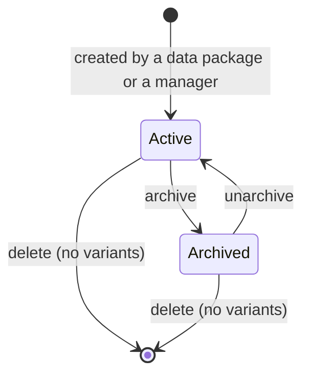
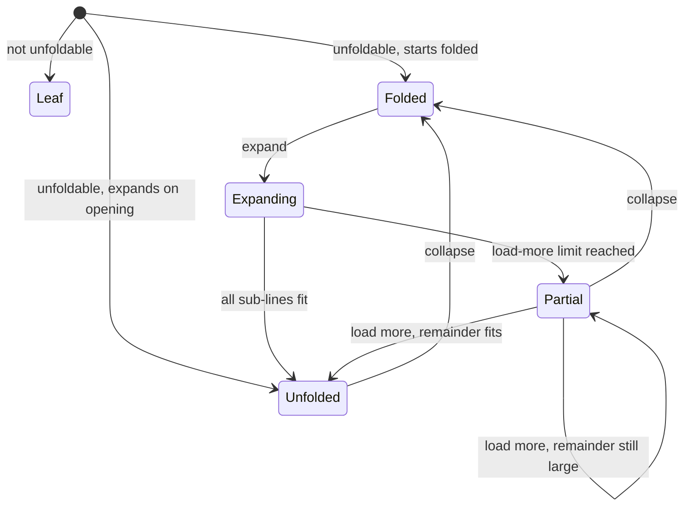
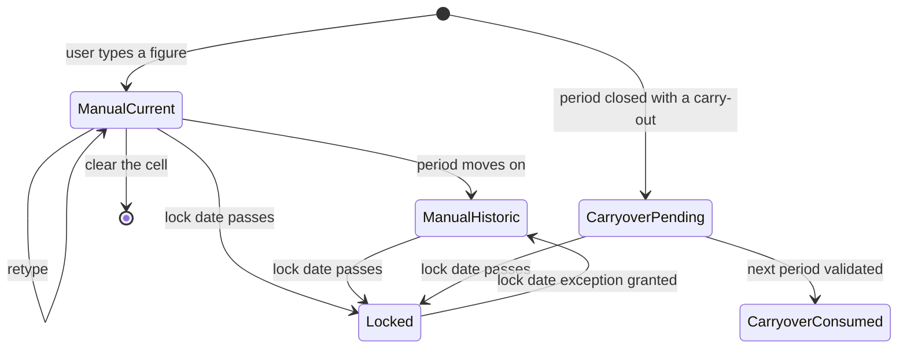
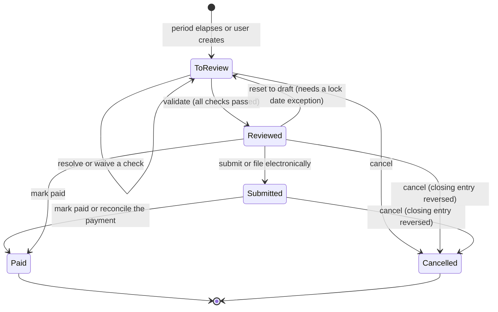
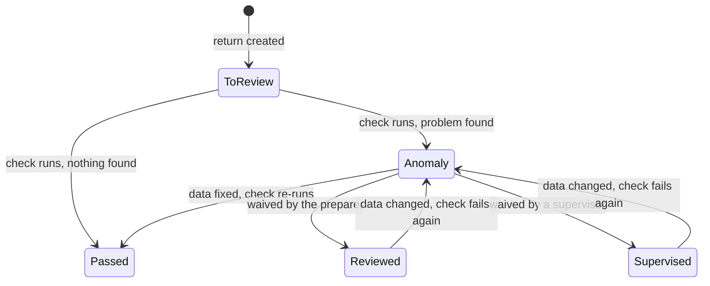
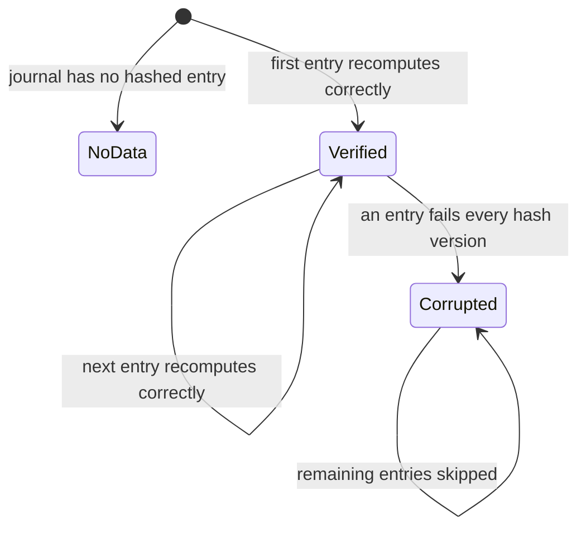
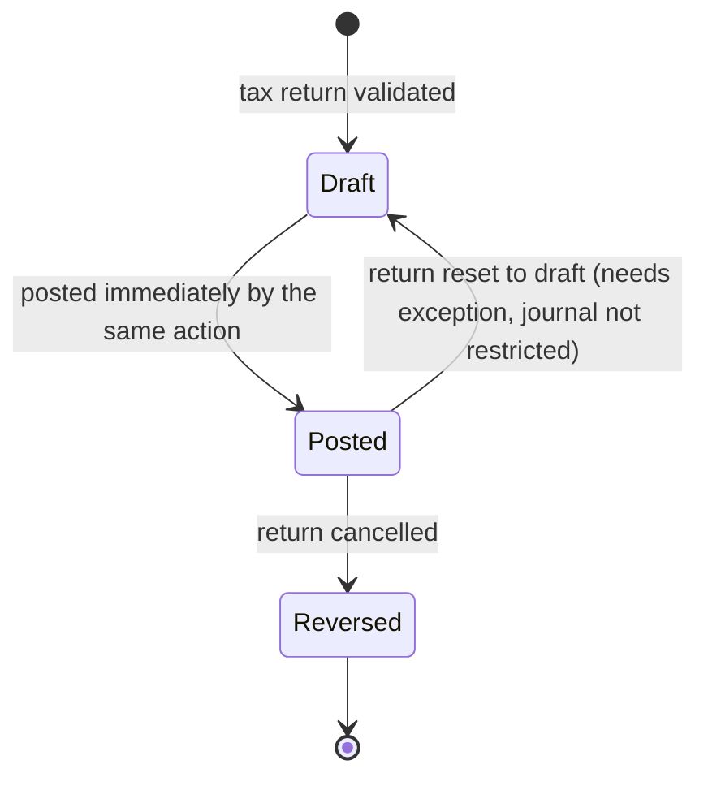

# Financial Reporting — State Machines

This file specifies every state-bearing object of the Financial Reporting domain: its states,
its transitions with their triggers, guards and side effects, and a diagram of each machine.

Six machines exist:

1. The **availability** of a Report Definition (§1).
2. The **folding state** of a rendered line (§2).
3. The **lifecycle of an External Value** (§3).
4. The **tax return** and its three steps (§4).
5. The **tax check** attached to a tax return (§5).
6. The **integrity finding** produced by the hash integrity check (§6).

A seventh machine, the Journal Entry state, belongs to the
[General Ledger](../general-ledger/state-machines.md) domain; this domain reads it and, through
the tax closing, drives one entry from draft to posted. §7 restates only the part that matters
here.

---

## 1. Report Definition availability

### 1.1 States

| Value | Label | Meaning |
|---|---|---|
| `active` = true | Active | The definition is offered wherever its availability condition is satisfied. |
| `active` = false | Archived | The definition is hidden from every list, menu and selector. Its lines, expressions, columns and external values are untouched. |

There is no stored state field beyond the active flag; availability is the combination of that
flag with the availability condition evaluated against the current company
([`entities.md`](entities.md) §1.5).

### 1.2 Transitions

| From | To | Trigger | Guards | Side effects |
|---|---|---|---|---|
| Active | Archived | A user with the accounting manager group archives the report. | None. | The report disappears from menus and from every variant selector. Rendered reports already open are unaffected until reloaded. Tags owned by its tax tag expressions are **not** touched. |
| Archived | Active | A user with the accounting manager group unarchives the report. | None. | The report reappears where its availability condition is satisfied. |
| Active or Archived | Deleted | A user with the accounting manager group deletes the report. | The report must have no variants. | Cascades to the lines, therefore to the expressions, therefore to the external values; runs the tag housekeeping of [`entities.md`](entities.md) §3.11 for every tax tag expression; deletes the columns. |

Failure: deleting a report that has variants raises *You can't delete a report that has
variants.*

### 1.3 Diagram

---

## 2. Folding state of a rendered line

A rendered line is a transient object; its state lives in the rendering session, not in storage.
It is specified here because the whole drill-down contract depends on it.

### 2.1 States

| Value | Label | Meaning |
|---|---|---|
| `leaf` | Leaf | The line has no children, no grouping key and no dynamic generator. It shows no folding control. |
| `folded` | Folded | The line can expand but has not been expanded. Its figures are already computed and displayed. |
| `expanding` | Expanding | An expansion has been requested and the sub-lines are being produced. |
| `unfolded` | Unfolded | The sub-lines are present under the line. |
| `partial` | Partially loaded | Some sub-lines are present and a continuation marker follows them, because the load-more limit was reached. |

### 2.2 Transitions

| From | To | Trigger | Guards | Side effects |
|---|---|---|---|---|
| — | `leaf` | The line is emitted and is not unfoldable. | The line has no children, no authored or user grouping key and no generator. | None. |
| — | `folded` | The line is emitted, is unfoldable, and its foldable flag is set, or the unfold-all option is off and the line is not in the user's set of unfolded lines. | — | None. |
| — | `unfolded` | The line is emitted, is unfoldable, and either its foldable flag is not set or the unfold-all option is on or the line is in the user's set of unfolded lines. | — | The sub-lines are produced in the same pass. |
| `folded` | `expanding` | The user activates the folding control. | The line is unfoldable. | The line's identifier is added to the user's set of unfolded lines. |
| `expanding` | `unfolded` | The sub-lines are produced and their count is at or below the load-more limit, or no limit is set. | — | The sub-lines are inserted after the line, at level plus one. |
| `expanding` | `partial` | The sub-lines are produced and their count exceeds the load-more limit. | The report sets a non-zero load-more limit. | The first *limit* sub-lines are inserted, followed by a continuation marker carrying the offset reached and the number remaining. |
| `expanding` | `unfolded` with prefix groups | The candidate count exceeds the prefix-group threshold. | The report's threshold is non-zero. | One level of prefix-group rows is inserted instead of the candidates; each prefix-group row starts in state `folded`. |
| `partial` | `partial` | The user activates the continuation marker and more remain. | — | The next *limit* sub-lines are appended and the marker's offset advances. |
| `partial` | `unfolded` | The user activates the continuation marker and the remainder fits. | — | The remaining sub-lines are appended and the marker is removed. |
| `unfolded` or `partial` | `folded` | The user activates the folding control. | — | The sub-lines are discarded and the line's identifier is removed from the user's set of unfolded lines. |
| any | `folded` | The user turns the unfold-all option off. | — | Every unfoldable line collapses and the set of unfolded lines is emptied. |
| `folded` | `unfolded` | The user turns the unfold-all option on. | — | Every unfoldable line expands, subject to the same limit and threshold rules. |

### 2.3 Diagram

### 2.4 Invariants

1. A line's figures never change when it is expanded or collapsed. Expansion produces detail; it
   never recomputes the parent.
2. The sum of the sub-lines' figures equals the parent's figure, up to rounding, for every
   grouping expansion and every account expansion. It does **not** for an aggregation line, which
   has no sub-lines.
3. Collapsing and re-expanding a line must produce the same sub-lines in the same order.

---

## 3. Lifecycle of an External Value

### 3.1 States

An External Value has no stored state field. Its state is the combination of its kind and its
position in time:

| State | Recognition | Meaning |
|---|---|---|
| `manual_current` | Origin line is empty; its date falls in the window currently displayed. | A hand-typed figure the user can still edit in place. |
| `manual_historic` | Origin line is empty; its date falls in an earlier window. | A hand-typed figure of a past period. Editable only by reopening that period. |
| `carryover_pending` | Origin line is set; the target period has not yet been rendered or closed. | An amount waiting to be picked up. |
| `carryover_consumed` | Origin line is set; the target period has been closed. | An amount already absorbed into a closed declaration. |
| `locked` | Any of the above whose date is on or before an applicable lock date. | Immutable. |

### 3.2 Transitions

| From | To | Trigger | Guards | Side effects |
|---|---|---|---|---|
| — | `manual_current` | A user types a figure into an editable cell. | The expression's subformula contains `editable`; the user holds the accounting manager group; the date is after every applicable lock date. | A record is created, or an existing manual record for the same expression, date and company is overwritten. |
| `manual_current` | `manual_current` | A user retypes the figure. | Same guards. | The value is overwritten; no second record is created. |
| `manual_current` | deleted | A user clears the cell. | Same guards. | The record is deleted. |
| `manual_current` | `manual_historic` | The report is opened on a later period. | — | None; the classification is a consequence of the window, not an action. |
| — | `carryover_pending` | A tax return is validated and a carrying expression produced a non-zero amount. | The carry-out expression resolves a target ([`entities.md`](entities.md) §3.10). | A record is created with the origin line, the origin expression label, the closing date, the company and the amount. Re-validating the same period overwrites it rather than adding a second one. |
| `carryover_pending` | `carryover_consumed` | The next period's return is validated. | — | None on the record itself; the amount has been read into the next declaration. |
| any | `locked` | A lock date moves past the record's date. | — | Further writes are refused. |
| `locked` | editable again | A lock date exception is granted, or the lock date is moved back. | The user holds the group the exception requires. | Writes become possible again for the exception's scope and duration. |
| any | deleted | The target expression, its line or its report is deleted. | — | Cascade. |

### 3.3 Diagram

---

## 4. The tax return

A tax return is the object that turns one rendering of one tax report, for one period and one
company or tax unit, into a filed declaration and a posted Journal Entry.

### 4.1 Return types

| Type | Meaning |
|---|---|
| Value-added tax return, also called the tax return | The periodic declaration of output and input tax. |
| Annual closing, corporate tax | The yearly corporate income tax declaration. |
| Value-added tax listing | A national annual listing of customers, where the law requires one. |
| European sales list | The periodic listing of intra-community supplies, where the law requires one. |
| Advance payment | A national instalment paid ahead of the periodic declaration. |
| Statistical trade declaration | The periodic declaration of intra-community goods movements, where the law requires one. |

Which types exist for a company depends on its country package; every type uses the same three
steps.

### 4.2 States

| Value | Label | Meaning |
|---|---|---|
| `new` | To review | The return exists for a period but no check has been resolved and nothing is posted. |
| `reviewed` | Reviewed | Every check has passed or been waived; the closing entry is posted and the tax lock date has moved. |
| `submitted` | Submitted | The declaration has been filed with the authorities, or manually marked as filed. |
| `paid` | Paid | The resulting payment (or refund) has been settled, or manually marked as settled. |
| `cancelled` | Cancelled | The return was abandoned; its closing entry, if any, has been reversed. |

### 4.3 Transitions

| From | To | Trigger | Guards | Side effects |
|---|---|---|---|---|
| — | `new` | A return period elapses, or a user creates a return by choosing a type and a period. | The company has a tax return periodicity and a tax return journal. | One return record per period, per company (or per tax unit), per type. The checks of §5 are instantiated in state `to_review`. |
| `new` | `reviewed` | The user activates Validate. | Every check is in state `reviewed`, `supervised` or `passed`; no check is in state `anomaly`; the period contains no draft entry unless the corresponding check was waived. | 1. The carry-over amounts are computed and written ([`calculations.md`](calculations.md) §12.4). 2. The tax closing Journal Entry is created and posted ([`accounting-effects.md`](accounting-effects.md) §2). 3. The company's tax lock date moves to the last day of the period, unless it is already later. 4. A rendering of the report is attached to the return as a printable document and as a spreadsheet workbook. |
| `new` | `new` | The user resolves or waives a check. | — | The check changes state (§5). |
| `reviewed` | `submitted` | The user activates Submit, or the electronic filing succeeds. | The closing entry is posted. | The filing file is generated and attached; the filing reference, when the authority returns one, is stored. |
| `submitted` | `paid` | The user activates Mark Paid, or a payment is reconciled against the closing entry's counterpart line. | — | The return leaves the list of pending returns. |
| `reviewed` | `paid` | The user activates Mark Paid directly, when the law requires no separate submission. | — | As above. |
| `reviewed` | `new` | The user resets the return to draft. | The tax lock date must first be moved back, which requires a lock date exception. | The closing entry is reset to draft or reversed, depending on whether the entry is itself secured; the carry-over records written by this closing are deleted. |
| any | `cancelled` | The user cancels the return. | The user holds the accounting manager group. | A posted closing entry is reversed by a new entry, never deleted. |

### 4.4 Diagram

### 4.5 Guards in detail

**Validate.**

1. Every check attached to the return is in a passing state (§5.2).
2. The period's end date is not after today, unless the user confirms a future closing.
3. The company has a tax return journal; otherwise the transition is refused and the user is
   redirected to the accounting periods configuration.
4. Every tax group whose taxes moved in the period has a tax payable account and a tax receivable
   account; otherwise the transition is refused and the user is redirected to the tax group
   concerned. The exact message is given in [`business-rules.md`](business-rules.md) §6.

**Reset to draft.**

1. The tax lock date must not cover the period. Because validating moved it there, a lock date
   exception is required in practice.
2. The closing entry must be resettable: an entry in a journal running in restricted mode cannot
   be reset and must be reversed instead.

### 4.6 Invariants

1. At most one non-cancelled return exists per (company or tax unit, type, period).
2. A return in state `reviewed` or later always has exactly one posted closing entry, or none
   when the period's net position and every account balance were zero.
3. The carry-over records written by a validation are deleted when the same validation is undone,
   so that re-validating produces the same figures.

---

## 5. The tax check

A tax check is one automatic verification attached to a tax return. Checks are declared per
country and per return type; a generic set applies everywhere.

### 5.1 The generic checks

| Check | What it verifies | Optional |
|---|---|---|
| Bank matching | Every bank statement line of the period is reconciled, so that no purchase is missing. | Yes for a value-added tax return. |
| Bill attachments | Every vendor bill of the period carries an attached document as audit proof. | No. |
| Company data | The company has the identification the declaration needs: its tax registration identifier and its country. | No. |
| Draft entries | No invoice or bill of the period is still in draft. | No. |
| No negative amount in the declaration | No box of the rendered report carries a negative amount, where the law forbids one. | Declared per country. |
| Taxes and countries matching | Every tax applied on an invoice or bill matches the customer's or supplier's country. | No. |

### 5.2 States

| Value | Label | Colour | Meaning |
|---|---|---|---|
| `to_review` | To review | grey | The check has not been run, or has been run and its outcome has not been examined. |
| `reviewed` | Reviewed | green | A user examined the check and accepted the situation. Passing. |
| `supervised` | Supervised | green | A user with a supervising role accepted the situation on someone else's behalf. Passing. |
| `anomaly` | Anomaly | red | The check failed and has not been waived. Blocking. |
| `passed` | Passed | green | The check ran and found nothing. Passing. |

### 5.3 Transitions

| From | To | Trigger | Guards | Side effects |
|---|---|---|---|---|
| — | `to_review` | The return is created. | — | None. |
| `to_review` | `passed` | The check runs and finds nothing. | — | The check stops blocking validation. |
| `to_review` | `anomaly` | The check runs and finds something. | — | The check blocks validation; the count of pending checks is shown in red on the return. |
| `anomaly` | `passed` | The user fixes the underlying data and the check re-runs. | — | As above. |
| `anomaly` | `reviewed` | The user waives the check as reviewed. | — | A note is written to the return's message log naming the user and the time. |
| `anomaly` | `supervised` | The user waives the check as supervised. | The user holds the supervising role. | Same note. |
| `reviewed` or `supervised` | `anomaly` | The underlying data changes and the check re-runs and fails again. | — | The waiver is cleared; a note is written. |

Every state change is written to the return's message log, so the waiving of a check is itself
auditable.

### 5.4 Diagram

---

## 6. The integrity finding

The hash integrity check produces one finding per journal and per sequence prefix. A finding is a
result, not a stored record, but its three outcomes behave as a state machine over the scan.

### 6.1 States

| Value | Label | Meaning |
|---|---|---|
| `no_data` | No data | The journal holds no entry carrying a hash. |
| `verified` | Verified | Every hashed entry of the prefix recomputed to its stored hash. |
| `corrupted` | Corrupted | An entry's stored hash matched no hash version. |

### 6.2 Transitions during a scan

| From | To | Trigger | Side effects |
|---|---|---|---|
| — | `no_data` | The journal's first batch is empty and no entry was carried over from a previous batch. | The finding records the journal's name and the restricted-mode flag. |
| — | `verified` | An entry recomputes correctly and the prefix has no corrupted entry yet. | The prefix's first entry is recorded if it is the first, and its last entry is updated. |
| `verified` | `corrupted` | An entry recomputes to no known hash version. | The corrupted entry is recorded; every remaining entry of that prefix is skipped. |
| `corrupted` | `corrupted` | Further entries of the same prefix are read. | They are skipped; the first corruption is the reported one. |

A prefix never returns from `corrupted` to `verified` within one scan. A later scan, after the
data is restored, can report `verified` again.

### 6.3 Diagram

---

## 7. The Journal Entry, as this domain sees it

The full machine is specified in [General Ledger](../general-ledger/state-machines.md). Only two
facts matter here.

**Reading.** The report engines read entries in state `posted` always, and in state `draft` when
the draft-entries option is on. They never read entries in state `cancel`.

**Writing.** The tax closing creates exactly one entry and drives it:

| From | To | Trigger | Guards | Side effects |
|---|---|---|---|---|
| — | `draft` | Validating a tax return. | The tax return journal exists; the accounts of §16 of [`calculations.md`](calculations.md) are all configured. | One entry with the lines of [`accounting-effects.md`](accounting-effects.md) §2. |
| `draft` | `posted` | The same validation, immediately. | The entry balances; the accounting date is not before a lock date other than the tax lock date that this very validation is about to move. | The entry receives its number from the tax return journal's sequence; the tax lock date moves. |
| `posted` | `posted` reversal | Cancelling a validated return. | The user holds the accounting manager group. | A reversing entry is created and posted; the original stays. |
| `posted` | `draft` | Resetting a validated return to draft. | The entry's journal does not run in restricted mode; a lock date exception covers the period. | The carry-over records of that validation are deleted. |

