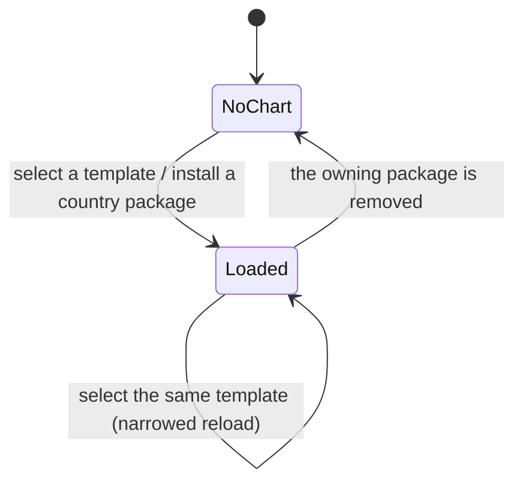
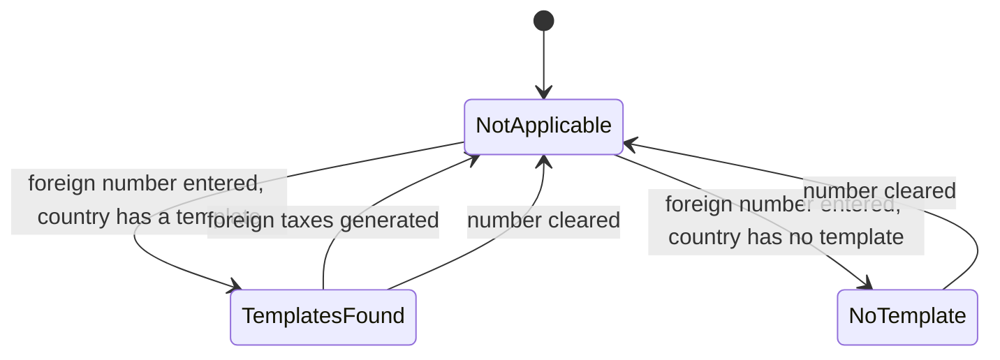
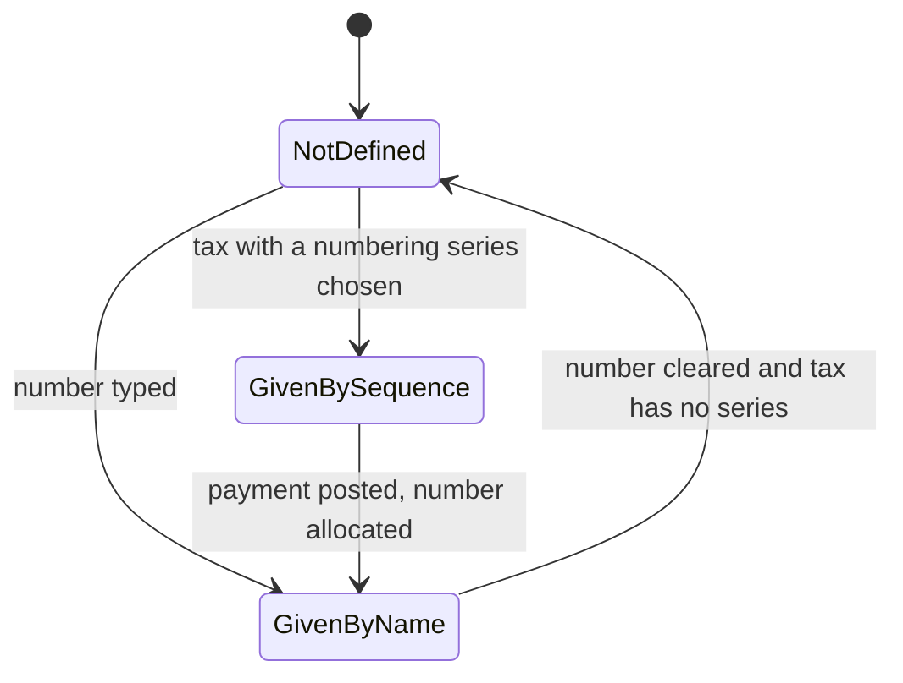
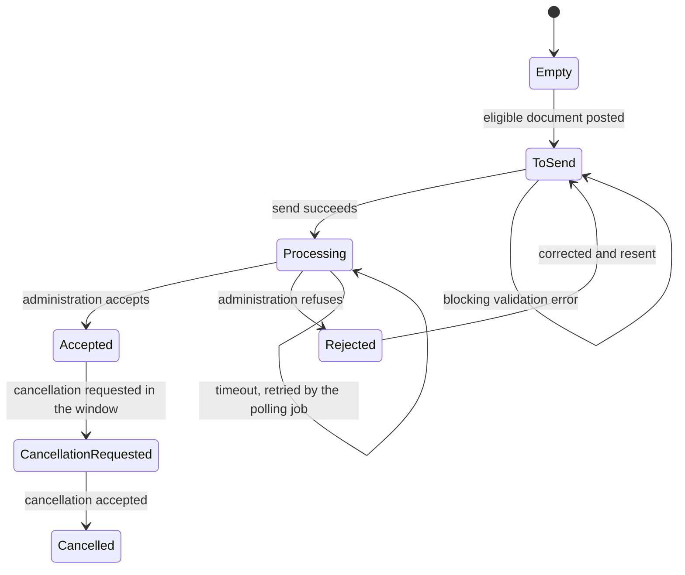

# Fiscal Localizations: State Machines

Every state field this domain introduces, whether it lives on a record the domain owns or on a
record owned by another domain that a country package extends. For each machine this document
gives the stored values with their labels and meaning, the complete transition table with origin,
destination, triggering operation, guard conditions and side effects, the exact refusal message of
each guard, and a diagram.

Three conventions apply throughout.

- **Stored values are reproduced exactly**, in code font, because integrations, imports and audit
  extracts read them. The label beside a stored value is the text the client displays.
- **The empty state.** Most country exchange fields have no value until the document becomes
  eligible for that country's flow. The empty state is written "(empty)" and is a real state of the
  machine: it is what a document that was never transmitted is in, and several machines return to
  it when a transmission is abandoned.
- **Messages** are quoted exactly. A placeholder is described in words inside angle brackets, for
  example `<name>` for the name of the record.

The mechanics that surround these machines — how a template is loaded, how a payload is built, how
a scheduled job polls a portal — are in [workflows.md](workflows.md). The numbered rules that the
guards enforce are in [business-rules.md](business-rules.md). The arithmetic quoted in a side
effect is in [calculations.md](calculations.md).

---

## 1. Index of machines

| Section | Machine | Host record | Field identifier | Stored |
|---|---|---|---|---|
| [2](#2-chart-of-accounts-template-selection) | Chart of accounts template selection | Company | `chart_template` | yes |
| [3](#3-foreign-registration-header-mode) | Foreign registration header mode | Fiscal Position | `foreign_vat_header_mode` | no |
| [4](#4-withholding-line-placeholder-type) | Withholding line placeholder type | Withholding Line | `placeholder_type` | no |
| [5](#5-the-generic-country-exchange-machine) | Generic country exchange machine | Journal Entry | varies by country | varies |
| [6](#6-italy-exchange-state) | Italian exchange state | Journal Entry | `l10n_it_edi_state` | yes |
| [7](#7-italy-declaration-of-intent) | Italian declaration of intent | Italy Declaration of Intent | `state` | yes |
| [8](#8-italy-company-liquidation-state) | Italian liquidation state | Company | `l10n_it_eco_index_liquidation_state` | yes |
| [9](#9-hungary-exchange-state) | Hungarian exchange state | Journal Entry | `l10n_hu_edi_state` | yes |
| [10](#10-spain-basque-country-invoice-registration) | Basque Country invoice registration | Spain Basque Country Document, Journal Entry, Point of Sale Order | `state`, `l10n_es_tbai_state` | document only |
| [11](#11-spain-verifiable-invoice-registration) | Verifiable invoice registration | Spain Verifiable Invoice Document, Journal Entry, Point of Sale Order | `state`, `l10n_es_edi_verifactu_state` | yes |
| [12](#12-greece-invoice-registry) | Greek invoice registry | Greece Interchange Document, Journal Entry | `state`, `provider_pdf_state`, `l10n_gr_edi_state` | yes |
| [13](#13-croatia-fiscalisation-and-delivery) | Croatian fiscalisation and delivery | Croatia Interchange Addendum, Company | `fiscalization_status`, `mer_document_status`, `business_document_status`, `l10n_hr_mer_connection_state` | yes |
| [14](#14-denmark-exchange-network) | Danish exchange network | Journal Entry, Denmark Business Response, Company, Contact | `nemhandel_move_state`, `nemhandel_state`, `l10n_dk_nemhandel_proxy_state`, `nemhandel_verification_state` | yes |
| [15](#15-romania-portal) | Romanian portal | Journal Entry, Romania Interchange Document, Transfer, Batch Transfer | `l10n_ro_edi_state`, `state`, `l10n_ro_edi_stock_state` | yes |
| [16](#16-poland-national-system-and-bank-account-verification) | Polish national system and bank verification | Journal Entry, Poland Bank Account Verification | `l10n_pl_edi_status`, `verification_status` | yes |
| [17](#17-malaysia-portal) | Malaysian portal | Malaysia Interchange Document, Journal Entry, Contact | `myinvois_state`, `l10n_my_edi_state`, `l10n_my_tin_validation_state` | yes |
| [18](#18-india-electronic-invoice-and-way-bill) | Indian electronic invoice and way bill | Journal Entry, India Electronic Way Bill | `l10n_in_edi_status`, `state` | yes |
| [19](#19-indonesia-electronic-invoice-and-payment-code) | Indonesian electronic invoice and payment code | Indonesia Electronic Invoice Document, Indonesia Quick Response Transaction | lifecycle, `paid` | partly |
| [20](#20-turkey-exchange-and-dispatch) | Turkish exchange and dispatch | Journal Entry, Contact, Transfer | `l10n_tr_nilvera_send_status`, `l10n_tr_nilvera_customer_status`, `l10n_tr_nilvera_dispatch_state` | yes |
| [21](#21-vietnam-invoicing-service) | Vietnamese invoicing service | Journal Entry | `l10n_vn_edi_invoice_state` | yes |
| [22](#22-taiwan-invoicing-service) | Taiwanese invoicing service | Journal Entry | `l10n_tw_edi_state`, `l10n_tw_edi_refund_state` | yes |
| [23](#23-jordan-invoice-registry) | Jordanian invoice registry | Journal Entry, Point of Sale Order | `l10n_jo_edi_state`, `l10n_jo_edi_pos_state` | yes |
| [24](#24-serbia-invoice-registry) | Serbian invoice registry | Journal Entry | `l10n_rs_edi_state` | yes |
| [25](#25-france-periodic-reporting-and-portal) | French periodic reporting and portal | France Reporting Flow, Journal Entry, Company, Contact, France Portal Response Wizard | `state`, `period_status`, `l10n_fr_pdp_status`, `pdp_ppf_move_state`, `pdp_ppf_lifecycle_state`, `pdp_kyc_status`, `pdp_verification_display_state`, `status` | mostly |
| [26](#26-france-point-of-sale-certification) | French point of sale certification | Point of Sale Order, France Sale Closing | hash chain, closing kind | yes |
| [27](#27-latin-america-check-issue-state) | Latin America check issue state | Latin America Check | `issue_state` | yes |
| [28](#28-peppol-business-response-state) | Business response state of the exchange network | Business Level Response | `pdp_ppf_state` | yes |
| [29](#29-the-inherited-activity-state) | Inherited activity state | every record with scheduled activities | `activity_state` | no |

---

## 2. Chart of accounts template selection

**Host.** Company. **Field.** `chart_template`, the chart of accounts template code. **Stored.**
Yes. There is no selection list of fixed values: the value is the code of one of the templates in
the registry, for example `be_comp`, `es_pymes` or `ar_ri`. The machine is the *installation state*
of a company's accounting.

| State | Stored value | Meaning |
|---|---|---|
| No chart | (empty) | The company has no chart of accounts. Invoicing is impossible: no account, no tax, no journal exists for it. |
| Loaded | any registered template code | The template of that code has been instantiated for the company. Accounts, taxes, tax groups, fiscal positions, journals and reports exist and the company defaults point at them. |
| Reloaded | the same template code | The same template was selected again. The value does not change; what changes is the content of the instantiated records, which are updated under the narrowing rules of [workflows.md](workflows.md#4-reloading-a-chart-of-accounts-template). |

| From | Trigger | Guards, in order | To | Side effects |
|---|---|---|---|---|
| No chart | Install a country package whose template matches the company country | The company has no template code | Loaded | The first template of the package whose country matches the company is scheduled for loading. |
| No chart | Select a template | The chosen code is a registered template code. The user holds the accounting administrator group. | Loaded | The full load of [workflows.md](workflows.md#3-loading-a-chart-of-accounts-template) runs: accounts, groups, taxes, tax groups, fiscal positions, journals, reconciliation models and reports are created; company defaults are written; translations are loaded; per-company external identifiers are created. |
| Loaded | Select the **same** template | The company already carries this code | Reloaded | The narrowed reload runs. Existing records are updated, superseded taxes are renamed and deactivated, report tags are refreshed, and nothing that carries posted accounting is deleted. |
| Loaded | Select a **different** template | Refused | Loaded | The refusal message is quoted below. |
| Loaded | Remove the package that owns the code | none | No chart | The company's template code is cleared. The instantiated accounts, taxes and journals stay, because they carry posted journal items. |

**Guard messages.**

Changing to a different template once accounting exists is refused:

> "Can't install chart of account, some accounting entries already exist for the company."

A load attempted by a user without the accounting administrator right is refused by the ordinary
access check of [business-rules.md](business-rules.md#16-permissions).

---

## 3. Foreign registration header mode

**Host.** Fiscal Position. **Field.** `foreign_vat_header_mode`, the foreign registration header
mode. **Stored.** No; it is recomputed from the position's country and the templates available for
that country. It drives what the form offers when a company registers for tax abroad.

| State | Stored value | Label | Meaning |
|---|---|---|---|
| Templates found | `templates_found` | Templates Found | At least one chart of accounts template exists for the position's country, so the system can offer to instantiate that country's taxes into the company's own chart. |
| No template | `no_template` | No Template | The position carries a foreign tax identification number but the country has no template, so no taxes can be generated and the user must create them by hand. |
| Not applicable | (empty) | — | The position carries no foreign tax identification number, or the country already has its taxes instantiated for this company. |

| From | Trigger | Guards | To | Side effects |
|---|---|---|---|---|
| Not applicable | Enter a foreign tax identification number and a country | The country has at least one registered template and the company has no tax of that country yet | Templates found | The "generate the foreign taxes" action becomes available on the position. |
| Not applicable | Enter a foreign tax identification number and a country | The country has no registered template | No template | The form shows the explanation that taxes must be created manually. |
| Templates found | Run the foreign tax instantiation | The instantiation succeeds | Not applicable | Taxes, tax groups and their report tags of the foreign country are created inside the company's chart, tagged with the foreign country, and the foreign country's tax return becomes available. |
| Templates found or No template | Clear the foreign tax identification number | none | Not applicable | The company's list of foreign registration countries is recomputed. |

---

## 4. Withholding line placeholder type

**Host.** Withholding Line, and through it both the Payment Withholding Line and the Payment
Register Withholding Line. **Field.** `placeholder_type`, the placeholder type. **Stored.** No.
It tells the user interface what the number box of a withholding line is showing before the line is
numbered for real.

| State | Stored value | Label | Meaning |
|---|---|---|---|
| Given by the sequence | `sequence` | Given By the Sequence | The withholding tax carries its own numbering series, so the displayed number is the next number that series will produce, and the real number is allocated when the payment is posted. |
| Given by the name | `name` | Given By the Name | The line already carries a number typed by the user, which will be kept. |
| Not defined | `not_defined` | Not defined | Neither a series nor a typed number exists, so the line will be posted without a withholding number. |

| From | Trigger | Guards | To | Side effects |
|---|---|---|---|---|
| any | Choose a withholding tax that has a numbering series | The tax's series is set | Given by the sequence | The preview number is read from the series without consuming it. |
| any | Type a number on the line | The typed value is not empty | Given by the name | The typed value becomes the number of the line. |
| any | Choose a withholding tax without a series and leave the number empty | none | Not defined | The line will carry no withholding number. |
| Given by the sequence | Post the payment | none | Given by the name | The series is consumed and the produced number is written on the line. |

---

## 5. The generic country exchange machine

Twenty-two country packages transmit invoices to a tax administration or to an accredited
intermediary. Their vocabularies differ, but the shape of every one of them is the machine below.
Sections 6 to 25 give the exact values, guards and messages of each country; this section states
what they have in common, so that the country sections can be read as differences from a known
base.

| State of the pattern | Meaning |
|---|---|
| (empty) | The document has never been offered to the country's flow, or it is not eligible for it. |
| To send | The document is eligible and a payload can be built. |
| Sent or processing | A payload has been transmitted and an answer is awaited. |
| Accepted, valid or registered | The administration has accepted the document. A registration number, and in several countries a visual code and a signature, come back and are stored. |
| Rejected, refused or invalid | The administration has refused the document. The errors are stored on the record and posted in its discussion thread. |
| Cancellation requested | A cancellation has been transmitted and its answer is awaited. |
| Cancelled | The administration has accepted the cancellation. |
| Error | The transmission itself failed, as opposed to the document being refused. |

| From | Trigger | Guards, in order | To | Side effects |
|---|---|---|---|---|
| (empty) | Post an eligible document | The company's fiscal country is the country of the flow; the journal is of the right kind; the counterpart carries the identification the country demands | To send | The country's send action appears on the document. |
| To send | Send | 1. No blocking validation error. 2. The document is not already being sent by another process. 3. The company's credentials for the country exist. | Sent or processing | The payload is built and attached; a transmission identifier is stored; where the country keeps a dedicated document record, one is created. |
| To send | Send | A blocking validation error exists | To send | Nothing is transmitted. The errors are shown grouped by cause and, where the country stores them, written on the record. |
| Sent or processing | The polling job receives an acceptance | none | Accepted | The registration number, the visual code and any signature are stored; a confirmation is posted in the discussion thread; the document becomes printable in its final form. |
| Sent or processing | The polling job receives a refusal | none | Rejected | The errors are stored and posted; where the country allows it, the document may be reset to draft and corrected. |
| Sent or processing | The polling job receives nothing before the country's timeout | The timeout has elapsed | Sent or processing, or a country-specific timeout state | The job retries at its next run. |
| Accepted | Request a cancellation | The country allows cancellation and the cancellation window is still open | Cancellation requested | A cancellation payload carrying a reason is transmitted. |
| Cancellation requested | The polling job receives an acceptance | none | Cancelled | The document is annotated. In most countries a credit note is required in addition. |
| Rejected | Correct and resend | The document is back in a modifiable state | To send | A new payload is built. |

**Guards shared by every country flow.**

1. **Single sender.** A document being transmitted is locked so that two processes cannot send it
   at once. A second attempt is refused with a message of the form "This document is being sent by
   another process already."
2. **Immutability after acceptance.** Once accepted, the number, date, counterpart, lines and taxes
   of the document may not change. This is enforced by the ordinary posting lock plus a country
   constraint that forbids resetting the document to draft.
3. **Chaining.** Several countries require each document to reference the previous document of the
   same company, forming a chain. The chain index is stored on the country document record and
   copied onto the invoice; a gap in the chain invalidates every later document.
4. **No deletion after transmission.** A transmitted document may not be deleted. The refusal is
   country-specific; two examples are "You cannot delete a generated E-waybill. Instead, you should
   cancel it." and "You cannot delete sent flows."

