# Fiscal Localizations: State Machines

Every state field this domain introduces, whether it lives on a record the domain owns or on a
record owned by another domain that a country package extends. For each machine this document
gives the stored values with their labels and meaning, the complete transition table with origin,
destination, triggering operation, guard conditions and side effects, the exact refusal message of
each guard, and a diagram.

Three conventions apply throughout.

- **Stored values are reproduced exactly**, in code font, because integrations, imports and audit
  extracts read them. The label beside a stored value is the text the client displays.
- **The empty state.** Most country exchange fields have no value until the document becomes
  eligible for that country's flow. The empty state is written "(empty)" and is a real state of the
  machine: it is what a document that was never transmitted is in, and several machines return to
  it when a transmission is abandoned.
- **Messages** are quoted exactly. A placeholder is described in words inside angle brackets, for
  example `<name>` for the name of the record.

The mechanics that surround these machines — how a template is loaded, how a payload is built, how
a scheduled job polls a portal — are in [workflows.md](workflows.md). The numbered rules that the
guards enforce are in [business-rules.md](business-rules.md). The arithmetic quoted in a side
effect is in [calculations.md](calculations.md).

---

## 1. Index of machines

| Section | Machine | Host record | Field identifier | Stored |
|---|---|---|---|---|
| [2](#2-chart-of-accounts-template-selection) | Chart of accounts template selection | Company | `chart_template` | yes |
| [3](#3-foreign-registration-header-mode) | Foreign registration header mode | Fiscal Position | `foreign_vat_header_mode` | no |
| [4](#4-withholding-line-placeholder-type) | Withholding line placeholder type | Withholding Line | `placeholder_type` | no |
| [5](#5-the-generic-country-exchange-machine) | Generic country exchange machine | Journal Entry | varies by country | varies |
| [6](#6-italy-exchange-state) | Italian exchange state | Journal Entry | `l10n_it_edi_state` | yes |
| [7](#7-italy-declaration-of-intent) | Italian declaration of intent | Italy Declaration of Intent | `state` | yes |
| [8](#8-italy-company-liquidation-state) | Italian liquidation state | Company | `l10n_it_eco_index_liquidation_state` | yes |
| [9](#9-hungary-exchange-state) | Hungarian exchange state | Journal Entry | `l10n_hu_edi_state` | yes |
| [10](#10-spain-basque-country-invoice-registration) | Basque Country invoice registration | Spain Basque Country Document, Journal Entry, Point of Sale Order | `state`, `l10n_es_tbai_state` | document only |
| [11](#11-spain-verifiable-invoice-registration) | Verifiable invoice registration | Spain Verifiable Invoice Document, Journal Entry, Point of Sale Order | `state`, `l10n_es_edi_verifactu_state` | yes |
| [12](#12-greece-invoice-registry) | Greek invoice registry | Greece Interchange Document, Journal Entry | `state`, `provider_pdf_state`, `l10n_gr_edi_state` | yes |
| [13](#13-croatia-fiscalisation-and-delivery) | Croatian fiscalisation and delivery | Croatia Interchange Addendum, Company | `fiscalization_status`, `mer_document_status`, `business_document_status`, `l10n_hr_mer_connection_state` | yes |
| [14](#14-denmark-exchange-network) | Danish exchange network | Journal Entry, Denmark Business Response, Company, Contact | `nemhandel_move_state`, `nemhandel_state`, `l10n_dk_nemhandel_proxy_state`, `nemhandel_verification_state` | yes |
| [15](#15-romania-portal) | Romanian portal | Journal Entry, Romania Interchange Document, Transfer, Batch Transfer | `l10n_ro_edi_state`, `state`, `l10n_ro_edi_stock_state` | yes |
| [16](#16-poland-national-system-and-bank-account-verification) | Polish national system and bank verification | Journal Entry, Poland Bank Account Verification | `l10n_pl_edi_status`, `verification_status` | yes |
| [17](#17-malaysia-portal) | Malaysian portal | Malaysia Interchange Document, Journal Entry, Contact | `myinvois_state`, `l10n_my_edi_state`, `l10n_my_tin_validation_state` | yes |
| [18](#18-india-electronic-invoice-and-way-bill) | Indian electronic invoice and way bill | Journal Entry, India Electronic Way Bill | `l10n_in_edi_status`, `state` | yes |
| [19](#19-indonesia-electronic-invoice-and-payment-code) | Indonesian electronic invoice and payment code | Indonesia Electronic Invoice Document, Indonesia Quick Response Transaction | lifecycle, `paid` | partly |
| [20](#20-turkey-exchange-and-dispatch) | Turkish exchange and dispatch | Journal Entry, Contact, Transfer | `l10n_tr_nilvera_send_status`, `l10n_tr_nilvera_customer_status`, `l10n_tr_nilvera_dispatch_state` | yes |
| [21](#21-vietnam-invoicing-service) | Vietnamese invoicing service | Journal Entry | `l10n_vn_edi_invoice_state` | yes |
| [22](#22-taiwan-invoicing-service) | Taiwanese invoicing service | Journal Entry | `l10n_tw_edi_state`, `l10n_tw_edi_refund_state` | yes |
| [23](#23-jordan-invoice-registry) | Jordanian invoice registry | Journal Entry, Point of Sale Order | `l10n_jo_edi_state`, `l10n_jo_edi_pos_state` | yes |
| [24](#24-serbia-invoice-registry) | Serbian invoice registry | Journal Entry | `l10n_rs_edi_state` | yes |
| [25](#25-france-periodic-reporting-and-portal) | French periodic reporting and portal | France Reporting Flow, Journal Entry, Company, Contact, France Portal Response Wizard | `state`, `period_status`, `l10n_fr_pdp_status`, `pdp_ppf_move_state`, `pdp_ppf_lifecycle_state`, `pdp_kyc_status`, `pdp_verification_display_state`, `status` | mostly |
| [26](#26-france-point-of-sale-certification) | French point of sale certification | Point of Sale Order, France Sale Closing | hash chain, closing kind | yes |
| [27](#27-latin-america-check-issue-state) | Latin America check issue state | Latin America Check | `issue_state` | yes |
| [28](#28-peppol-business-response-state) | Business response state of the exchange network | Business Level Response | `pdp_ppf_state` | yes |
| [29](#29-the-inherited-activity-state) | Inherited activity state | every record with scheduled activities | `activity_state` | no |

---

## 2. Chart of accounts template selection

**Host.** Company. **Field.** `chart_template`, the chart of accounts template code. **Stored.**
Yes. There is no selection list of fixed values: the value is the code of one of the templates in
the registry, for example `be_comp`, `es_pymes` or `ar_ri`. The machine is the *installation state*
of a company's accounting.

| State | Stored value | Meaning |
|---|---|---|
| No chart | (empty) | The company has no chart of accounts. Invoicing is impossible: no account, no tax, no journal exists for it. |
| Loaded | any registered template code | The template of that code has been instantiated for the company. Accounts, taxes, tax groups, fiscal positions, journals and reports exist and the company defaults point at them. |
| Reloaded | the same template code | The same template was selected again. The value does not change; what changes is the content of the instantiated records, which are updated under the narrowing rules of [workflows.md](workflows.md#4-reloading-a-chart-of-accounts-template). |

| From | Trigger | Guards, in order | To | Side effects |
|---|---|---|---|---|
| No chart | Install a country package whose template matches the company country | The company has no template code | Loaded | The first template of the package whose country matches the company is scheduled for loading. |
| No chart | Select a template | The chosen code is a registered template code. The user holds the accounting administrator group. | Loaded | The full load of [workflows.md](workflows.md#3-loading-a-chart-of-accounts-template) runs: accounts, groups, taxes, tax groups, fiscal positions, journals, reconciliation models and reports are created; company defaults are written; translations are loaded; per-company external identifiers are created. |
| Loaded | Select the **same** template | The company already carries this code | Reloaded | The narrowed reload runs. Existing records are updated, superseded taxes are renamed and deactivated, report tags are refreshed, and nothing that carries posted accounting is deleted. |
| Loaded | Select a **different** template | Refused | Loaded | The refusal message is quoted below. |
| Loaded | Remove the package that owns the code | none | No chart | The company's template code is cleared. The instantiated accounts, taxes and journals stay, because they carry posted journal items. |

**Guard messages.**

Changing to a different template once accounting exists is refused:

> "Can't install chart of account, some accounting entries already exist for the company."

A load attempted by a user without the accounting administrator right is refused by the ordinary
access check of [business-rules.md](business-rules.md#16-permissions).

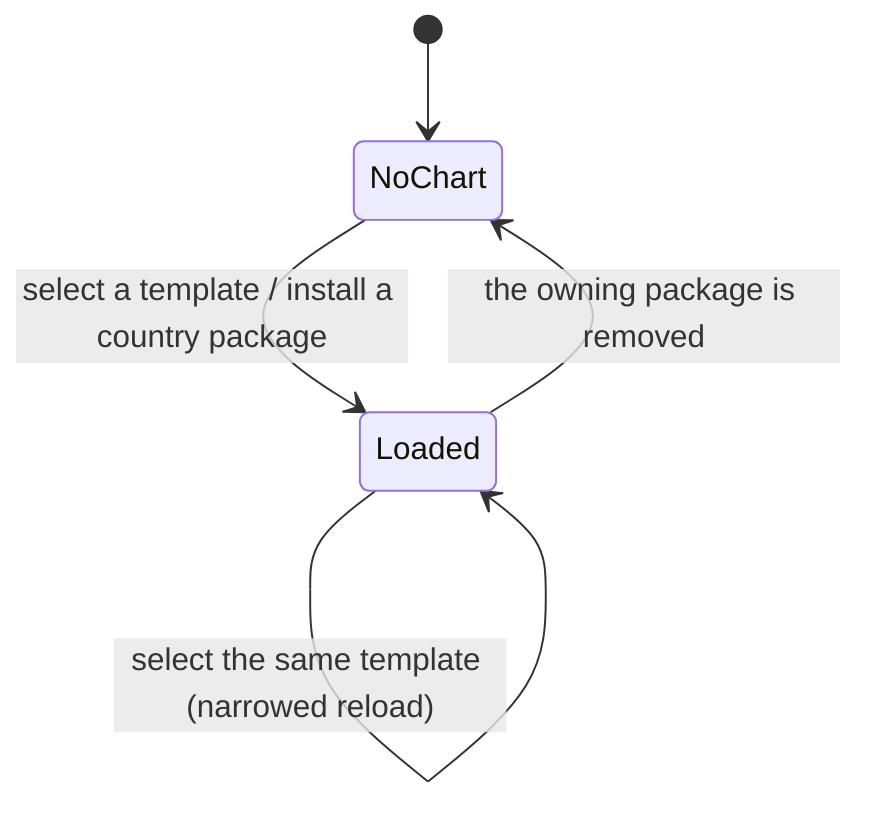
```mermaid
stateDiagram-v2
    [*] --> NoChart
    NoChart --> Loaded : select a template / install a country package
    Loaded --> Loaded : select the same template (narrowed reload)
    Loaded --> NoChart : the owning package is removed
```

---

## 3. Foreign registration header mode

**Host.** Fiscal Position. **Field.** `foreign_vat_header_mode`, the foreign registration header
mode. **Stored.** No; it is recomputed from the position's country and the templates available for
that country. It drives what the form offers when a company registers for tax abroad.

| State | Stored value | Label | Meaning |
|---|---|---|---|
| Templates found | `templates_found` | Templates Found | At least one chart of accounts template exists for the position's country, so the system can offer to instantiate that country's taxes into the company's own chart. |
| No template | `no_template` | No Template | The position carries a foreign tax identification number but the country has no template, so no taxes can be generated and the user must create them by hand. |
| Not applicable | (empty) | — | The position carries no foreign tax identification number, or the country already has its taxes instantiated for this company. |

| From | Trigger | Guards | To | Side effects |
|---|---|---|---|---|
| Not applicable | Enter a foreign tax identification number and a country | The country has at least one registered template and the company has no tax of that country yet | Templates found | The "generate the foreign taxes" action becomes available on the position. |
| Not applicable | Enter a foreign tax identification number and a country | The country has no registered template | No template | The form shows the explanation that taxes must be created manually. |
| Templates found | Run the foreign tax instantiation | The instantiation succeeds | Not applicable | Taxes, tax groups and their report tags of the foreign country are created inside the company's chart, tagged with the foreign country, and the foreign country's tax return becomes available. |
| Templates found or No template | Clear the foreign tax identification number | none | Not applicable | The company's list of foreign registration countries is recomputed. |

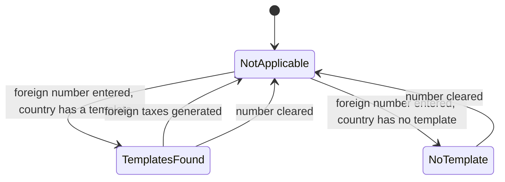
```mermaid
stateDiagram-v2
    [*] --> NotApplicable
    NotApplicable --> TemplatesFound : foreign number entered, country has a template
    NotApplicable --> NoTemplate : foreign number entered, country has no template
    TemplatesFound --> NotApplicable : foreign taxes generated
    TemplatesFound --> NotApplicable : number cleared
    NoTemplate --> NotApplicable : number cleared
```

---

## 4. Withholding line placeholder type

**Host.** Withholding Line, and through it both the Payment Withholding Line and the Payment
Register Withholding Line. **Field.** `placeholder_type`, the placeholder type. **Stored.** No.
It tells the user interface what the number box of a withholding line is showing before the line is
numbered for real.

| State | Stored value | Label | Meaning |
|---|---|---|---|
| Given by the sequence | `sequence` | Given By the Sequence | The withholding tax carries its own numbering series, so the displayed number is the next number that series will produce, and the real number is allocated when the payment is posted. |
| Given by the name | `name` | Given By the Name | The line already carries a number typed by the user, which will be kept. |
| Not defined | `not_defined` | Not defined | Neither a series nor a typed number exists, so the line will be posted without a withholding number. |

| From | Trigger | Guards | To | Side effects |
|---|---|---|---|---|
| any | Choose a withholding tax that has a numbering series | The tax's series is set | Given by the sequence | The preview number is read from the series without consuming it. |
| any | Type a number on the line | The typed value is not empty | Given by the name | The typed value becomes the number of the line. |
| any | Choose a withholding tax without a series and leave the number empty | none | Not defined | The line will carry no withholding number. |
| Given by the sequence | Post the payment | none | Given by the name | The series is consumed and the produced number is written on the line. |

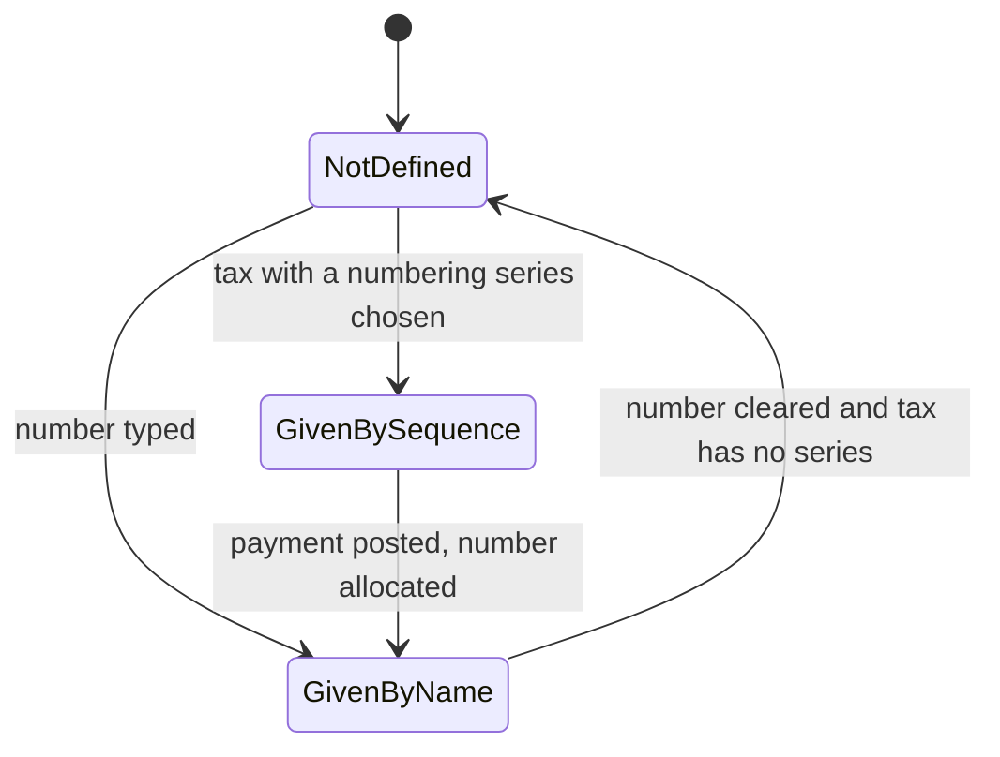
```mermaid
stateDiagram-v2
    [*] --> NotDefined
    NotDefined --> GivenBySequence : tax with a numbering series chosen
    NotDefined --> GivenByName : number typed
    GivenBySequence --> GivenByName : payment posted, number allocated
    GivenByName --> NotDefined : number cleared and tax has no series
```

---

## 5. The generic country exchange machine

Twenty-two country packages transmit invoices to a tax administration or to an accredited
intermediary. Their vocabularies differ, but the shape of every one of them is the machine below.
Sections 6 to 25 give the exact values, guards and messages of each country; this section states
what they have in common, so that the country sections can be read as differences from a known
base.

| State of the pattern | Meaning |
|---|---|
| (empty) | The document has never been offered to the country's flow, or it is not eligible for it. |
| To send | The document is eligible and a payload can be built. |
| Sent or processing | A payload has been transmitted and an answer is awaited. |
| Accepted, valid or registered | The administration has accepted the document. A registration number, and in several countries a visual code and a signature, come back and are stored. |
| Rejected, refused or invalid | The administration has refused the document. The errors are stored on the record and posted in its discussion thread. |
| Cancellation requested | A cancellation has been transmitted and its answer is awaited. |
| Cancelled | The administration has accepted the cancellation. |
| Error | The transmission itself failed, as opposed to the document being refused. |

| From | Trigger | Guards, in order | To | Side effects |
|---|---|---|---|---|
| (empty) | Post an eligible document | The company's fiscal country is the country of the flow; the journal is of the right kind; the counterpart carries the identification the country demands | To send | The country's send action appears on the document. |
| To send | Send | 1. No blocking validation error. 2. The document is not already being sent by another process. 3. The company's credentials for the country exist. | Sent or processing | The payload is built and attached; a transmission identifier is stored; where the country keeps a dedicated document record, one is created. |
| To send | Send | A blocking validation error exists | To send | Nothing is transmitted. The errors are shown grouped by cause and, where the country stores them, written on the record. |
| Sent or processing | The polling job receives an acceptance | none | Accepted | The registration number, the visual code and any signature are stored; a confirmation is posted in the discussion thread; the document becomes printable in its final form. |
| Sent or processing | The polling job receives a refusal | none | Rejected | The errors are stored and posted; where the country allows it, the document may be reset to draft and corrected. |
| Sent or processing | The polling job receives nothing before the country's timeout | The timeout has elapsed | Sent or processing, or a country-specific timeout state | The job retries at its next run. |
| Accepted | Request a cancellation | The country allows cancellation and the cancellation window is still open | Cancellation requested | A cancellation payload carrying a reason is transmitted. |
| Cancellation requested | The polling job receives an acceptance | none | Cancelled | The document is annotated. In most countries a credit note is required in addition. |
| Rejected | Correct and resend | The document is back in a modifiable state | To send | A new payload is built. |

**Guards shared by every country flow.**

1. **Single sender.** A document being transmitted is locked so that two processes cannot send it
   at once. A second attempt is refused with a message of the form "This document is being sent by
   another process already."
2. **Immutability after acceptance.** Once accepted, the number, date, counterpart, lines and taxes
   of the document may not change. This is enforced by the ordinary posting lock plus a country
   constraint that forbids resetting the document to draft.
3. **Chaining.** Several countries require each document to reference the previous document of the
   same company, forming a chain. The chain index is stored on the country document record and
   copied onto the invoice; a gap in the chain invalidates every later document.
4. **No deletion after transmission.** A transmitted document may not be deleted. The refusal is
   country-specific; two examples are "You cannot delete a generated E-waybill. Instead, you should
   cancel it." and "You cannot delete sent flows."

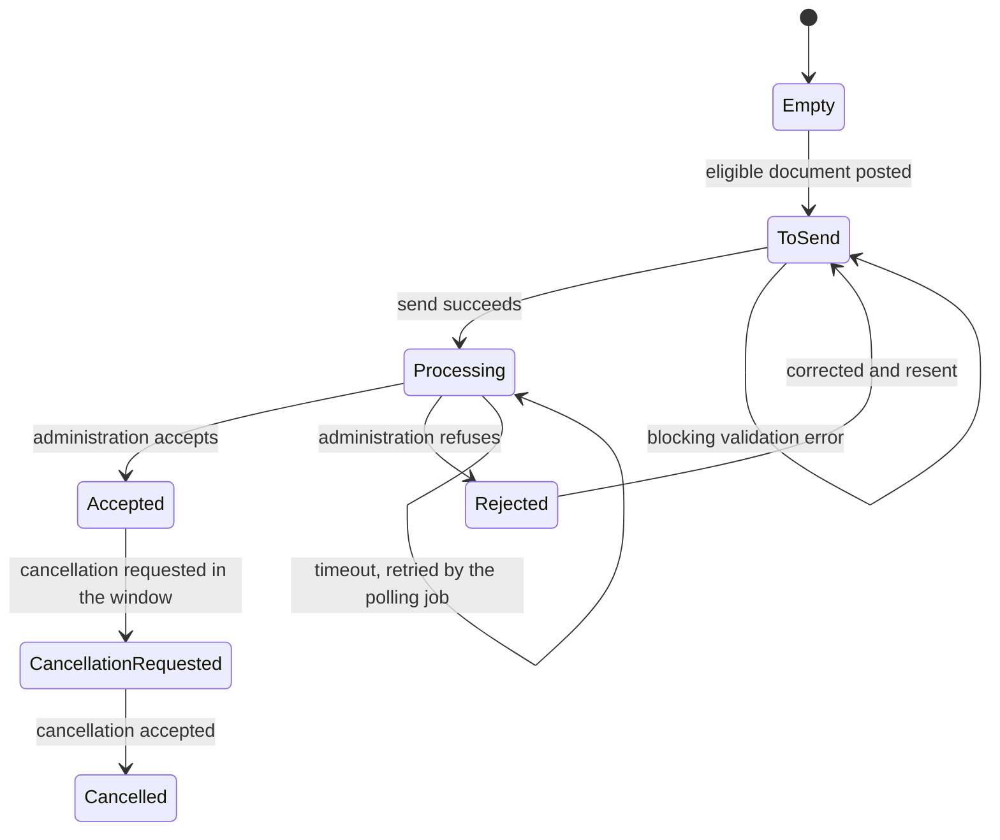
```mermaid
stateDiagram-v2
    [*] --> Empty
    Empty --> ToSend : eligible document posted
    ToSend --> Processing : send succeeds
    ToSend --> ToSend : blocking validation error
    Processing --> Accepted : administration accepts
    Processing --> Rejected : administration refuses
    Processing --> Processing : timeout, retried by the polling job
    Rejected --> ToSend : corrected and resent
    Accepted --> CancellationRequested : cancellation requested in the window
    CancellationRequested --> Cancelled : cancellation accepted
```

---

## 6. Italy exchange state

**Host.** Journal Entry. **Field.** `l10n_it_edi_state`, the exchange state. **Stored.** Yes,
tracked in the discussion thread, and writable by hand so that an accountant can force a value when
the exchange service and the ledger disagree.

| State | Stored value | Label | Meaning |
|---|---|---|---|
| Not in the flow | (empty) | — | The invoice has not been transmitted, or a transmission was abandoned and the state was cleared. |
| Being sent | `being_sent` | Being Sent To SdI | The payload has been handed to the transport and the upload has not been acknowledged. |
| Requires a user signature | `requires_user_signature` | Requires user signature | The payload needs a qualified signature that the system cannot apply on its own. |
| Processing | `processing` | SdI Processing | The exchange system has accepted the upload and is validating it. |
| Rejected | `rejected` | SdI Rejected | The exchange system refused the document. |
| Delivered | `forwarded` | SdI Accepted, Forwarded to Partner | The exchange system accepted the document and delivered it to the counterpart. |
| Delivery failed | `forward_failed` | SdI Accepted, Forward to Partner Failed | The document was accepted but could not be delivered; the seller must give the counterpart a copy by other means. |
| Delivering | `forward_attempt` | SdI Accepted, Forwarding to Partner | Delivery is in progress. |
| Accepted by the public body | `accepted_by_pa_partner` | SdI Accepted, Accepted by the PA Partner | A public-sector counterpart has accepted the document. |
| Rejected by the public body | `rejected_by_pa_partner` | SdI Accepted, Rejected by the PA Partner | A public-sector counterpart has refused the document; a credit note is required. |
| Accepted after the term expired | `accepted_by_pa_partner_after_expiry` | SdI Accepted, PA Partner Expired Terms | The public-sector counterpart did not answer within fifteen days, so the document is deemed accepted. |

The three values `being_sent`, `processing` and `forward_attempt` are the **waiting states**: the
polling job looks for documents in exactly those states.

| From | Trigger | Guards, in order | To | Side effects |
|---|---|---|---|---|
| (empty) | Post an eligible sales invoice | The company's fiscal country is Italy; the counterpart carries a destination code or a certified electronic mail address | (empty) | The send button appears with the label computed for the current state. |
| (empty) | Send | 1. The proxy user of the company exists and its mode is not the demonstration mode when a real transmission is asked. 2. No blocking validation error. 3. The document is not already locked by another sender. | Being sent | The payload is attached to the invoice under the name recorded in the payload name field; the transaction reference is stored. |
| Being sent | The transport acknowledges the upload | none | Processing | The header text of the invoice is rewritten with the new state and the next action. |
| Being sent, Processing, Delivering | The polling job reports `notificaScarto` | none | Rejected | The transaction reference is cleared, the attached payload is removed, and the errors are posted in the discussion thread. The invoice may be reset to draft. |
| Processing | The polling job reports `ricevutaConsegna` | none | Delivered | A confirmation is posted in the discussion thread. |
| Processing | The polling job reports a delivery attempt | none | Delivering | The header text is updated. |
| Processing, Delivering | The polling job reports `notificaMancataConsegna` | none | Delivery failed | The header text tells the seller to deliver a copy by other means. |
| Processing, Delivered | The polling job reports `notificaEsito` with the outcome `EC01` | none | Accepted by the public body | A confirmation is posted. |
| Processing, Delivered | The polling job reports `notificaEsito` with the outcome `EC02` | none | Rejected by the public body | The refusal is posted; a credit note must be issued. |
| Processing, Delivered | The polling job reports `notificaDecorrenzaTermini` | The fifteen-day answer term has expired | Accepted after the term expired | A confirmation is posted. |
| any | The polling job reports `not_found`, or a status the map does not cover | none | (empty) | The state is cleared and the transaction reference kept, so the document can be sent again. |
| any waiting state | An accountant forces a value | The user may write on the invoice | the forced value | When the forced value is `rejected` or `rejected_by_pa_partner` and the invoice was marked as sent, the sent marker is cleared so the invoice can be corrected and sent again. |

**Guard messages.**

> "This move is not waiting for updates from the SdI."

Shown when the "check the state" action is used on an invoice that is not in a waiting state. The
name of the exchange service is reproduced because the message is user-visible text.

> "This document is being sent by another process already."

> "An error occurred while downloading updates from the Proxy Server: (<code>) <message>"

Here `<code>` is the numeric error code returned by the transport and `<message>` its text.

**Reset to draft.** The reset button is hidden when the invoice has a transaction reference and its
state is neither empty nor `rejected`. That is the immutability guard of section 5 in its Italian
form.

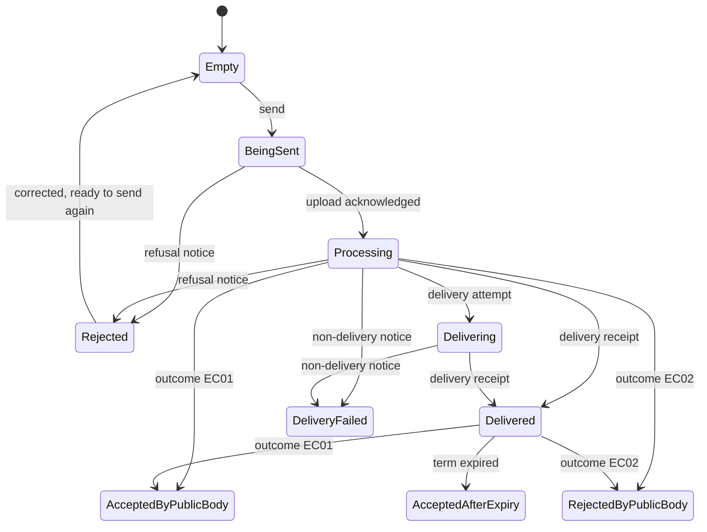
```mermaid
stateDiagram-v2
    [*] --> Empty
    Empty --> BeingSent : send
    BeingSent --> Processing : upload acknowledged
    BeingSent --> Rejected : refusal notice
    Processing --> Rejected : refusal notice
    Processing --> Delivered : delivery receipt
    Processing --> Delivering : delivery attempt
    Processing --> DeliveryFailed : non-delivery notice
    Delivering --> Delivered : delivery receipt
    Delivering --> DeliveryFailed : non-delivery notice
    Processing --> AcceptedByPublicBody : outcome EC01
    Processing --> RejectedByPublicBody : outcome EC02
    Delivered --> AcceptedByPublicBody : outcome EC01
    Delivered --> RejectedByPublicBody : outcome EC02
    Delivered --> AcceptedAfterExpiry : term expired
    Rejected --> Empty : corrected, ready to send again
```

---

## 7. Italy declaration of intent

**Host.** Italy Declaration of Intent. **Field.** `state`. **Stored.** Yes, required, read-only on
the form and tracked in the discussion thread. A declaration of intent is a customer's statement
that it is a habitual exporter, which lets the seller invoice without value-added tax up to a
threshold and within a validity window.

| State | Stored value | Label | Meaning |
|---|---|---|---|
| Draft | `draft` | Draft | Entered but not yet usable. Invoices and sales orders may not use it. |
| Active | `active` | Active | Usable on invoices and sales orders dated inside the validity window and while the threshold is not exhausted. |
| Revoked | `revoked` | Revoked | The customer or the administration withdrew the declaration. It can never become active again. |
| Terminated | `terminated` | Terminated | The declaration has run its course, by exhaustion of the threshold or by the end of its window. It may be reactivated. |

| From | Trigger | Guards, in order | To | Side effects |
|---|---|---|---|---|
| Draft | Validate | The record is in the draft state | Active | The declaration becomes selectable on invoices and sales orders of its customer, in its currency and its company. |
| Active | Reset to draft | The record is in the active state | Draft | The declaration stops being selectable. Documents that already use it keep it. |
| Active | Revoke | none | Revoked | The declaration stops being selectable and can no longer be reactivated. |
| Draft, Terminated | Revoke | none | Revoked | The same. |
| Active, Draft | Terminate | The record is not revoked | Terminated | The declaration stops being selectable. |
| Revoked | Terminate | Refused silently; the record stays revoked | Revoked | Nothing changes. |
| Draft, Revoked, Terminated | Reactivate | The record is not already active | Active | The declaration becomes selectable again. |

**Guards on use, evaluated when a document names a declaration.** These do not change the state;
they refuse the document. They run in the order given.

| Condition | Message |
|---|---|
| The declaration belongs to another company. | "The Declaration of Intent belongs to company `<declaration company>`, not `<company>`." |
| The declaration is in another currency. | "The Declaration of Intent uses currency `<declaration currency>`, not `<currency>`." |
| The declaration belongs to another customer. | "The Declaration of Intent belongs to partner `<declaration partner>`, not `<partner>`." |
| The declaration is in the draft state. | "The Declaration of Intent is in draft." |
| The declaration is revoked or terminated. | "The Declaration of Intent must be active." |
| The document date falls outside the validity window. | "The Declaration of Intent is valid from `<start date>` to `<end date>`, not on `<date>`." |

The last three checks are not blocking when the amount invoiced against the declaration is not
positive, because a credit note may legitimately be dated after the window.

**Threshold warning.** The remaining amount is the threshold minus the amount already invoiced
minus the amount ordered but not yet invoiced. When a document would push the remaining amount
below zero, a warning is shown that names the declaration, the threshold and the excess: "Pay
attention, the threshold of your Declaration of Intent `<name>` of `<threshold>` is exceeded by
`<excess>`, this document included." The warning does not block the document.

**Deletion.** Refused once the declaration is used: "You cannot delete Declarations of Intents that
are already used on at least one Invoice or Sales Order."

**Check constraint.** The threshold must be strictly positive.

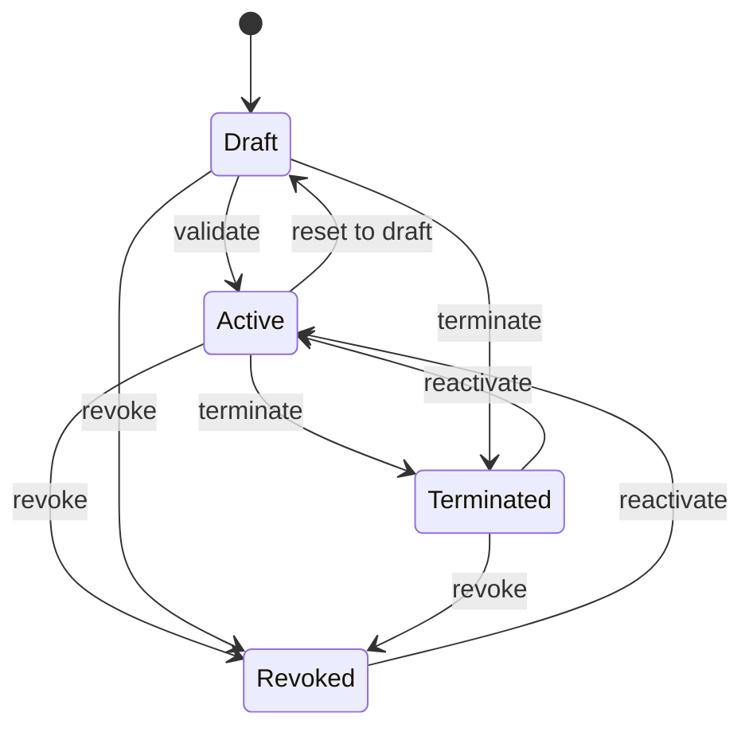
```mermaid
stateDiagram-v2
    [*] --> Draft
    Draft --> Active : validate
    Active --> Draft : reset to draft
    Active --> Revoked : revoke
    Draft --> Revoked : revoke
    Terminated --> Revoked : revoke
    Active --> Terminated : terminate
    Draft --> Terminated : terminate
    Terminated --> Active : reactivate
    Revoked --> Active : reactivate
```

---

## 8. Italy company liquidation state

**Host.** Company. **Field.** `l10n_it_eco_index_liquidation_state`, the liquidation state.
**Stored.** Yes. It is printed on the economic and administrative index block of the Italian
electronic invoice.

| State | Stored value | Label | Meaning |
|---|---|---|---|
| In liquidation | `LS` | The company is in a state of liquidation | The company is winding up. The payload declares it. |
| Not in liquidation | `LN` | The company is not in a state of liquidation | Ordinary trading. |
| Not declared | (empty) | — | The block is omitted from the payload. |

The value is set by hand on the company form. There are no guards beyond the ordinary write right
on the company, and no side effect other than the content of the payload.

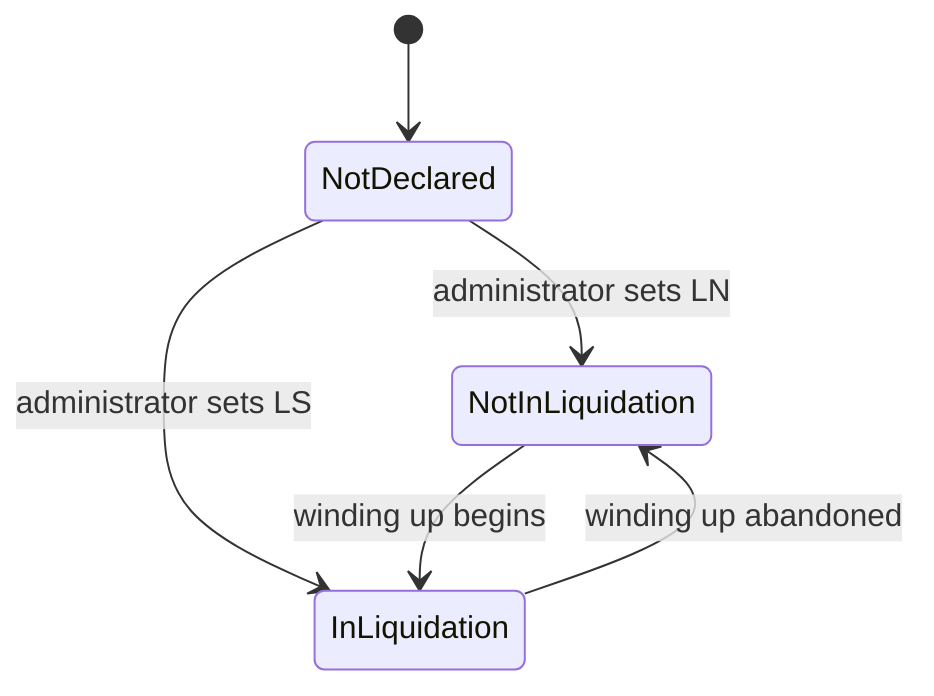
```mermaid
stateDiagram-v2
    [*] --> NotDeclared
    NotDeclared --> NotInLiquidation : administrator sets LN
    NotDeclared --> InLiquidation : administrator sets LS
    NotInLiquidation --> InLiquidation : winding up begins
    InLiquidation --> NotInLiquidation : winding up abandoned
```

---

## 9. Hungary exchange state

**Host.** Journal Entry. **Field.** `l10n_hu_edi_state`, the exchange state. **Stored.** Yes. The
Hungarian flow is the most elaborate of the domain because the administration answers
asynchronously and because cancellation is itself a transmitted request that can time out.

| State | Stored value | Label | Meaning |
|---|---|---|---|
| Not in the flow | (empty) | — | Never transmitted. |
| Sent | `sent` | Sent, waiting for response | The invoice was uploaded and a transaction code was returned. |
| Send timed out | `send_timeout` | Timeout when sending | The upload did not return a transaction code within the allowed time. The invoice may or may not have arrived. |
| Confirmed | `confirmed` | Confirmed | The administration accepted the invoice without reservation. |
| Confirmed with warnings | `confirmed_warning` | Confirmed with warnings | The administration accepted the invoice but reported warnings, or an answer arrived that needs a human decision. |
| Rejected | `rejected` | Rejected | The administration refused the invoice. |
| Cancellation sent | `cancel_sent` | Cancellation request sent | A technical annulment was uploaded and its answer is awaited. |
| Cancellation timed out | `cancel_timeout` | Timeout when requesting cancellation | The annulment upload did not return in time. |
| Cancellation pending | `cancel_pending` | Cancellation request pending | The administration acknowledged the annulment and is waiting for it to be approved in its own portal. |
| Cancelled | `cancelled` | Cancelled | The annulment was approved. |

The states `sent`, `send_timeout`, `cancel_sent`, `cancel_timeout` and `cancel_pending` are the
in-flight states. The states that allow a fresh upload are the empty state, `rejected` and
`cancelled`.

| From | Trigger | Guards, in order | To | Side effects |
|---|---|---|---|---|
| (empty), Rejected, Cancelled | Upload | 1. The company's fiscal country is Hungary. 2. The document is a posted sales document. 3. The company holds credentials for the administration. 4. No blocking validation error. | Sent | The payload is built and transmitted; the transaction code is stored; the invoice takes the next index in its chain. |
| (empty), Rejected, Cancelled | Upload | The transport does not answer within the allowed time | Send timed out | The chain index is set to the "unknown" marker so that later invoices are not numbered against a possibly absent document. |
| (empty), Rejected, Cancelled | Upload | The administration refuses the payload outright | Rejected | The errors are stored and posted. |
| Sent, Send timed out | Query the status | The administration reports success | Confirmed | The chain index is confirmed; the acceptance is posted. |
| Sent, Send timed out | Query the status | The administration reports success with warnings | Confirmed with warnings | The warnings are stored and posted. |
| Sent, Send timed out | Query the status | The administration reports a refusal | Rejected | The errors are stored and posted; the invoice may be reset to draft. |
| Sent, Send timed out | Query the status | No answer yet | Sent | The job retries at its next run. |
| Confirmed, Confirmed with warnings | Request a technical annulment | The user confirms the annulment wizard and gives a code and a reason | Cancellation sent | The annulment payload is transmitted. |
| Cancellation sent, Cancellation timed out | Query the status | The administration acknowledges but has not approved | Cancellation pending | The invoice waits for the approval to be given in the administration's portal. |
| Cancellation sent, Cancellation timed out, Cancellation pending | Query the status | The annulment is approved | Cancelled | Every invoice of the chain that carries a state is cancelled together with this one, and the ledger entry is cancelled. |
| Cancellation sent, Cancellation timed out, Cancellation pending | Query the status | The administration reports a problem with the annulment | Confirmed with warnings | The problem is posted; the invoice returns to a confirmed state so that the annulment can be attempted again. |
| Cancellation sent | The transport does not answer within the allowed time | none | Cancellation timed out | The job retries. |

**Guard message.** Resetting to draft or cancelling an invoice that has been transmitted is
refused:

> "Cannot reset to draft or cancel invoice `<name>` because an electronic document was already sent
> to NAV!"

Here `<name>` is the invoice number, and the administration's short name is reproduced because the
message is user-visible.

**Chain index.** The invoice carries a chain index. The value −1 marks an invoice whose position in
the chain is not yet known, which is what a send timeout produces; the value 0 marks a cancelled
invoice; a positive value is the invoice's position among the modifications of a base invoice.

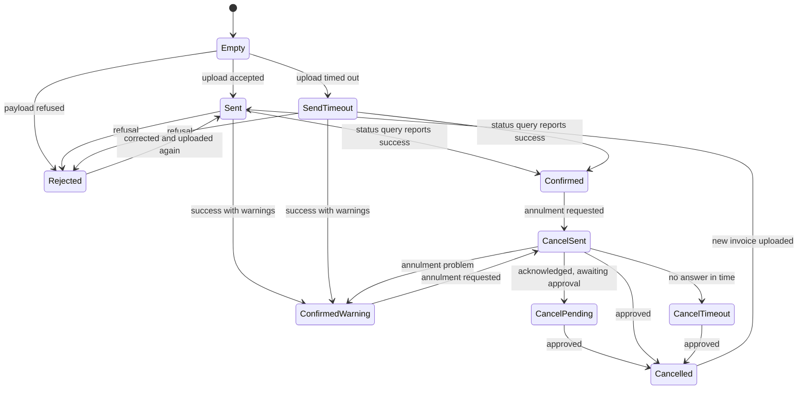
```mermaid
stateDiagram-v2
    [*] --> Empty
    Empty --> Sent : upload accepted
    Empty --> SendTimeout : upload timed out
    Empty --> Rejected : payload refused
    Sent --> Confirmed : status query reports success
    Sent --> ConfirmedWarning : success with warnings
    Sent --> Rejected : refusal
    SendTimeout --> Confirmed : status query reports success
    SendTimeout --> ConfirmedWarning : success with warnings
    SendTimeout --> Rejected : refusal
    Confirmed --> CancelSent : annulment requested
    ConfirmedWarning --> CancelSent : annulment requested
    CancelSent --> CancelTimeout : no answer in time
    CancelSent --> CancelPending : acknowledged, awaiting approval
    CancelPending --> Cancelled : approved
    CancelSent --> Cancelled : approved
    CancelTimeout --> Cancelled : approved
    CancelSent --> ConfirmedWarning : annulment problem
    Rejected --> Sent : corrected and uploaded again
    Cancelled --> Sent : new invoice uploaded
```

---

## 10. Spain Basque Country invoice registration

Three provincial administrations of the Basque Country require every invoice to be signed and
registered in a chain. The registration is carried by a dedicated document record, and the invoice
shows a derived summary of it.

### 10.1 Spain Basque Country Document

**Host.** Spain Basque Country Document. **Field.** `state`. **Stored.** Yes, read-only, default
`to_send`. A separate document is created for the registration of an invoice and for its
cancellation; a boolean `is_cancel` says which of the two a given record is.

| State | Stored value | Label | Meaning |
|---|---|---|---|
| To send | `to_send` | To Send | The payload has been produced and is waiting to be transmitted. |
| Accepted | `accepted` | Accepted | The administration registered the document and returned its acknowledgement. Only in this state, and only with a chain index, is the document part of the chain. |
| Rejected | `rejected` | Rejected | The administration refused the document. The refusal text is stored on the record. |

| From | Trigger | Guards, in order | To | Side effects |
|---|---|---|---|---|
| — | Post an invoice that requires registration | The company has the Basque regime enabled, and the document is a sales document, or a purchase document when the provincial administration is the one that also registers purchases | To send | A document record is created carrying the invoice number, its date, the payload attachment and the next chain index. |
| To send | Transmit | 1. A signing certificate is configured. 2. A provincial administration is chosen on the company. 3. The company's tax identification number is filled in. 4. For a self-employed taxpayer in the province that requires it, the activity heading parameter is set. 5. The invoice is posted. 6. The invoice has not already been registered. | Accepted | The chain index is confirmed, the acknowledgement and the visual code are stored on the invoice, and the answer text is written on the document. |
| To send | Transmit | The administration refuses | Rejected | The refusal text is stored and posted in the invoice's discussion thread. The invoice may be corrected and a new document produced. |
| Accepted | Transmit a cancellation | A cancellation document exists in the state `to_send` | Accepted, and the cancellation document becomes Accepted | The invoice's derived state becomes cancelled. |

**Guard messages.**

| Failing condition | Message |
|---|---|
| No signing certificate. | "Please configure the certificate for TicketBAI." |
| No provincial administration chosen. | "Please specify a tax agency on your company for TicketBAI." |
| No tax identification number on the company. | "Please configure the Tax ID on your company for TicketBAI." |
| A self-employed taxpayer in the province that demands an activity heading, with no heading configured. | "In order to use Ticketbai Batuz for freelancers, you will need to configure the Epigrafe or Main Activity. In this version, you need to go in debug mode to Settings > Technical > System Parameters and set the parameter 'l10n_es_edi_tbai.epigrafe' to your epigrafe number. You can find them in `<address of the published list>`" |
| The invoice is not posted. | "Cannot send an entry that is not posted to TicketBAI." |
| The invoice has already been registered or cancelled. | "This entry has already been posted." |
| A purchase document in the province that registers purchases, with no vendor reference. | "You need to fill in the Reference field as the invoice number from your vendor." |
| Reset to draft of an invoice that is in the chain. | "You cannot reset to draft an entry that has been posted to TicketBAI's chain" |
| Deletion of an invoice that is in the chain. | "You cannot delete a move that has a TicketBAI chain id." |

### 10.2 The derived state on the invoice and on the receipt

**Host.** Journal Entry, and Point of Sale Order for receipts. **Field.** `l10n_es_tbai_state`.
**Stored.** No; it is derived from the two document records.

| State | Stored value | Label | Derivation |
|---|---|---|---|
| To send | `to_send` | To Send | Registration is required for this document and no registration document has been accepted. |
| Sent | `sent` | Sent | The registration document is accepted. |
| Cancelled | `cancelled` | Cancelled | The cancellation document is accepted. This value exists on the invoice only; a point of sale receipt has the first two values. |
| Not required | (empty) | — | The company does not use the regime, or every line of the document is ignored by it. |

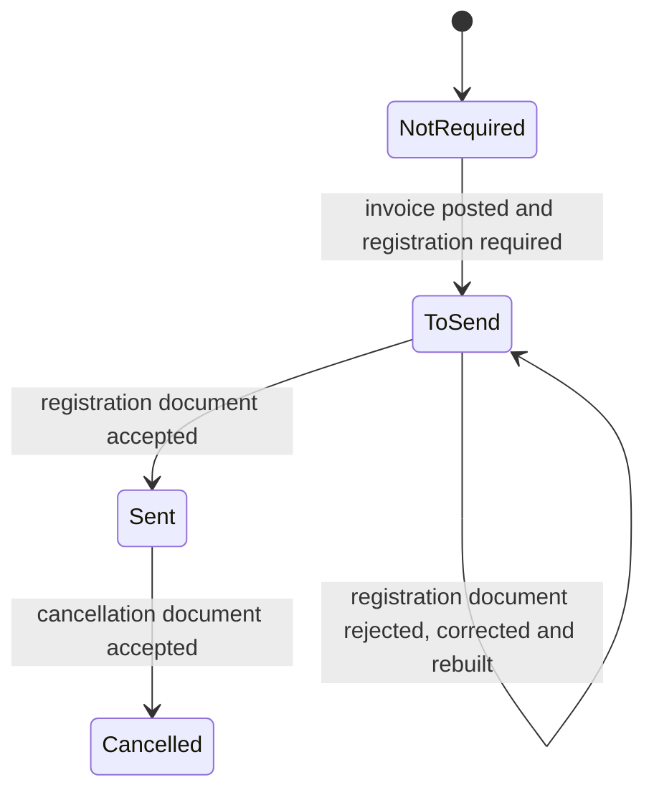
```mermaid
stateDiagram-v2
    [*] --> NotRequired
    NotRequired --> ToSend : invoice posted and registration required
    ToSend --> Sent : registration document accepted
    ToSend --> ToSend : registration document rejected, corrected and rebuilt
    Sent --> Cancelled : cancellation document accepted
```

---

## 11. Spain verifiable invoice registration

The national verifiable-invoice regime chains every billing record, submission and cancellation
alike, and sends them in batches with a waiting time between shipments.

### 11.1 Spain Verifiable Invoice Document

**Host.** Spain Verifiable Invoice Document. **Field.** `state`. **Stored.** Yes, read-only. Each
record is of one of two kinds, held in `document_type`: `submission` (Submission) or `cancellation`
(Cancellation).

| State | Stored value | Label | Meaning |
|---|---|---|---|
| Waiting | (empty) | — | The record has been generated and its payload attached, and it has not been answered yet. The batch sender picks these up. |
| Rejected | `rejected` | Rejected | The administration refused the record. |
| Registered with errors | `registered_with_errors` | Registered with Errors | The administration registered the record but reported errors on it. It counts as registered. |
| Accepted | `accepted` | Accepted | The administration registered the record without reservation. |

The administration's own codes map onto these states as follows: `Incorrecto` becomes `rejected`,
`AceptadoConErrores` becomes `registered_with_errors`, and `Correcto` becomes `accepted`. When the
administration reports that the record is a duplicate it returns a second vocabulary, which maps as
`AceptadaConErrores` to `registered_with_errors`, `Correcta` to `accepted` and `Anulada` to the
cancelled state of the invoice.

| From | Trigger | Guards, in order | To | Side effects |
|---|---|---|---|---|
| — | Post an invoice under the regime | The journal entry is posted; the regime key is compatible with the tax applicability | Waiting | A submission record is created with the next chain index and its payload attached. The batch sender is triggered, immediately when the waiting time since the last shipment has elapsed, otherwise by the scheduled job at the next possible moment. |
| Waiting | The batch answer names the record as incorrect | none | Rejected | The errors are stored; the invoice's derived state becomes rejected. |
| Waiting | The batch answer names the record as accepted with errors | none | Registered with errors | The registration code is stored. |
| Waiting | The batch answer names the record as correct | none | Accepted | The registration code and the visual code address are stored. |
| Waiting | The transport reports a fault for the whole shipment | none | Rejected | Every record of the shipment is marked rejected with the fault text. |
| Accepted, Registered with errors | Cancel the invoice | The invoice is in the accepted or registered-with-errors state | a new cancellation record in the Waiting state | The cancellation is chained after the submission. |

**Deletion.** A successfully generated record can never be deleted, because the chain includes it.
No user, of any group, holds write access to this entity; every change is made by the system.

### 11.2 The derived state on the invoice and on the receipt

**Host.** Journal Entry, and Point of Sale Order. **Field.** `l10n_es_edi_verifactu_state`.
**Stored.** Yes, computed and stored.

| State | Stored value | Label | Derivation |
|---|---|---|---|
| Not registered | (empty) | — | No document of the invoice has been answered. |
| Rejected | `rejected` | Rejected | The latest answered document is a rejection and no registration exists. |
| Registered with errors | `registered_with_errors` | Registered with Errors | The latest registered document is a submission answered with errors. |
| Accepted | `accepted` | Accepted | The latest registered document is an accepted submission. |
| Cancelled | `cancelled` | Cancelled | The latest registered document is a cancellation. When this value is reached and the invoice is not yet cancelled in the ledger, the invoice is cancelled. |

**Warnings shown when the invoice is modified.**

> "You are modifying a journal entry for which a Veri*Factu document has been sent to the AEAT already."

> "You are modifying a journal entry for which a Veri*Factu document is waiting to be sent."

> "`<existing warning>`A Veri*Factu document is waiting to be sent as soon as possible."

**Refusals.**

> "The journal entry has to be posted."

> "The Veri*Factu Regime Key is not compatible with the Veri*Factu Tax Applicability."

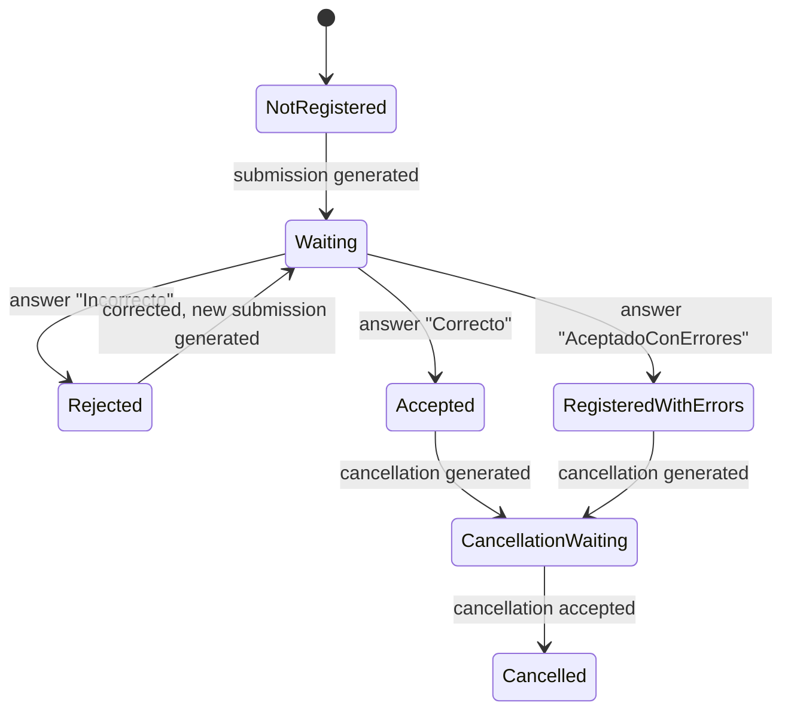
```mermaid
stateDiagram-v2
    [*] --> NotRegistered
    NotRegistered --> Waiting : submission generated
    Waiting --> Rejected : answer "Incorrecto"
    Waiting --> RegisteredWithErrors : answer "AceptadoConErrores"
    Waiting --> Accepted : answer "Correcto"
    Rejected --> Waiting : corrected, new submission generated
    Accepted --> CancellationWaiting : cancellation generated
    RegisteredWithErrors --> CancellationWaiting : cancellation generated
    CancellationWaiting --> Cancelled : cancellation accepted
```

---

## 12. Greece invoice registry

### 12.1 Greece Interchange Document

**Host.** Greece Interchange Document. **Field.** `state`. **Stored.** Yes, required. One record is
written for every attempt, successful or not, so the record list is the transmission history.

| State | Stored value | Label | Meaning |
|---|---|---|---|
| Invoice sent | `invoice_sent` | Invoice sent | A sales invoice was transmitted and the registry returned its registration mark. |
| Invoice send failed | `invoice_error` | Invoice send failed | A sales invoice was refused. The error text is on the record. |
| Expense classification ready to send | `bill_fetched` | Expense classification ready to send | A vendor bill was fetched from the registry and its income or expense classification has still to be transmitted. |
| Expense classification sent | `bill_sent` | Expense classification sent | The classification of a vendor bill was transmitted and accepted. |
| Expense classification send failed | `bill_error` | Expense classification send failed | The classification was refused. |
| Invoice submission pending | `invoice_pending` | Invoice submission pending | The transmission is in flight through the accredited intermediary. |

A second field, `provider_pdf_state`, the final document status, tracks the printable document the
intermediary returns: `pending` (Pending), `sent` (Sent) and `error` (Failed).

| From | Trigger | Guards, in order | To | Side effects |
|---|---|---|---|---|
| — | Send a sales invoice | The company is registered with the registry; every line carries an income classification pair; the counterpart carries the identification the registry demands | Invoice sent | The registration mark, the classification mark and the address of the registry entry are stored, and the invoice's derived state follows. |
| — | Send a sales invoice | The registry refuses | Invoice send failed | The error text, built as the code in square brackets followed by the message and a full stop for each error, is stored and posted. |
| — | Send a sales invoice through the accredited intermediary | The intermediary accepts the hand-off | Invoice submission pending | The final document status becomes `pending`. |
| Invoice submission pending | The polling job receives the outcome | Accepted | Invoice sent | The final document status becomes `sent` and the returned printable document is attached. |
| Invoice submission pending | The polling job receives the outcome | Refused | Invoice send failed | The final document status becomes `error`. |
| — | Fetch vendor bills from the registry | The company is registered | Expense classification ready to send | A vendor bill is created or matched and its classification fields are opened for entry. |
| Expense classification ready to send | Send the classification | Every line carries an expense classification pair | Expense classification sent | The classification mark is stored. |
| Expense classification ready to send | Send the classification | The registry refuses | Expense classification send failed | The error text is stored and posted. |

### 12.2 The derived state on the invoice

**Host.** Journal Entry. **Field.** `l10n_gr_edi_state`. **Stored.** Yes, read-only, tracked. It
takes the state of the most recent document of the invoice, but only when that state is one of
`invoice_sent`, `bill_fetched`, `bill_sent` or `invoice_pending`; the two failure states are not
copied onto the invoice, so a failed attempt leaves the invoice in its previous state and the
failure is visible only on the document and in the discussion thread. This asymmetry is deliberate:
it lets the user retry without the invoice looking transmitted.

Resetting an invoice to draft is possible only while the derived state is empty or
`bill_fetched`.

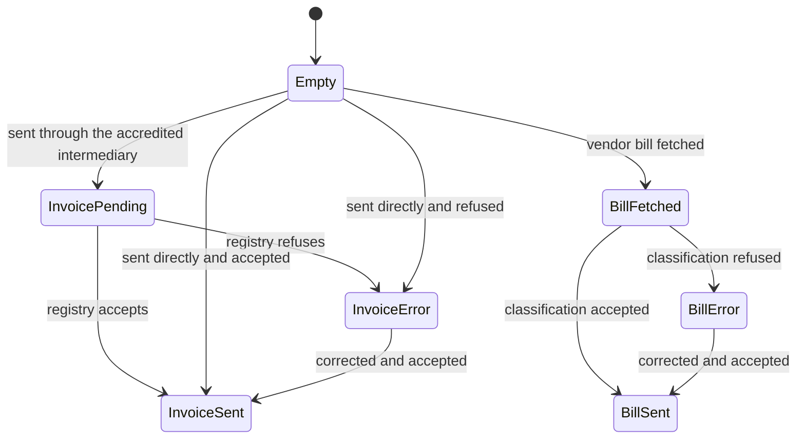
```mermaid
stateDiagram-v2
    [*] --> Empty
    Empty --> InvoicePending : sent through the accredited intermediary
    InvoicePending --> InvoiceSent : registry accepts
    InvoicePending --> InvoiceError : registry refuses
    Empty --> InvoiceSent : sent directly and accepted
    Empty --> InvoiceError : sent directly and refused
    InvoiceError --> InvoiceSent : corrected and accepted
    Empty --> BillFetched : vendor bill fetched
    BillFetched --> BillSent : classification accepted
    BillFetched --> BillError : classification refused
    BillError --> BillSent : corrected and accepted
```

---

## 13. Croatia fiscalisation and delivery

The Croatian package tracks three independent statuses on one addendum record attached to the
invoice, plus a connection state on the company. They are independent because fiscalisation with
the tax administration, delivery through the accredited intermediary and the counterpart's business
answer are three separate events.

**Host.** Croatia Interchange Addendum, one record per journal entry.

### 13.1 Fiscalisation status

**Field.** `fiscalization_status`. **Stored.** Yes.

| State | Stored value | Label | Meaning |
|---|---|---|---|
| Not fiscalised | (empty) | — | The invoice has not been reported to the tax administration. |
| Successful | `0` | Successful | The administration accepted the report and returned a fiscalisation number, stored in `fiscalization_number`. |
| Unsuccessful | `1` | Unsuccessful | The administration refused the report. The reason is in `fiscalization_error`. |
| Pending | `2` | Pending | The report was sent and no answer has arrived. |

A companion field `fiscalization_channel_type`, the delivery channel type, records `0`, whose label
is "Delivered via EDI", when the invoice also reached the counterpart through the network, and `1`,
whose label is "Not delivered via EDI", when it did not, in which case the seller must deliver a
copy by other means.

### 13.2 Intermediary document status

**Field.** `mer_document_status`. **Stored.** Yes. It mirrors the accredited intermediary's own
lifecycle, and the stored values are the intermediary's numeric codes.

| State | Stored value | Label | Meaning |
|---|---|---|---|
| In validation | `20` | In validation | The intermediary is checking the payload. |
| Sent | `30` | Sent | The payload left the intermediary towards the counterpart. |
| Delivered | `40` | Delivered | The counterpart's system acknowledged receipt. |
| Cancelled | `45` | Canceled | The transmission was cancelled. |
| Unsuccessful | `50` | Unsuccessful | Delivery failed. |
| Delivered as a report | `70` | Delivered (eReporting) | The document was delivered as a report rather than as an invoice. |

### 13.3 Business document status

**Field.** `business_document_status`. **Stored.** Yes. It is the counterpart's own answer.

| State | Stored value | Label | Meaning |
|---|---|---|---|
| Approved | `0` | APPROVED | The counterpart accepted the invoice. |
| Rejected | `1` | REJECTED | The counterpart refused it. The reason is in `business_status_reason`. |
| Payment fulfilled | `2` | PAYMENT_FULFILLED | The counterpart reported full payment. |
| Payment partially fulfilled | `3` | PAYMENT_PARTIALLY_FULLFILLED | The counterpart reported partial payment. The amount already reported is kept in `payment_reported_amount`. |
| Receiving confirmed | `4` | RECEIVING_CONFIRMED | The counterpart confirmed receipt without judging the content. |
| Received | `99` | RECEIVED | The counterpart's system logged the document. |
| None | `None` | None | No answer. The stored value is the four-character text `None`, not an empty value. This is a **compatibility finding**: an empty value would be the natural representation, and a rebuild that used an empty value would have to translate it at the boundary to stay compatible with extracts that expect the text. |

### 13.4 Company connection state

**Host.** Company. **Field.** `l10n_hr_mer_connection_state`. **Stored.** Yes, required, read-only.

| State | Stored value | Label | Meaning |
|---|---|---|---|
| Inactive | `inactive` | Inactive | The company has no working connection to the intermediary. Sending, fetching and reporting jobs skip it. |
| Active | `active` | Active | Credentials were accepted. The company is included in the scheduled fetch of inbound documents, in the delivery-status refresh and in the payment reporting job. |

| From | Trigger | Guards | To | Side effects |
|---|---|---|---|---|
| Inactive | Save credentials | The intermediary accepts the credentials | Active | A purchase journal for inbound documents must exist; when none is set the company form asks for one. |
| Active | Save credentials | The intermediary refuses the credentials | Inactive | The company drops out of every scheduled job. |

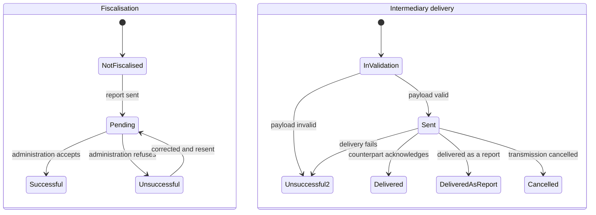
```mermaid
stateDiagram-v2
    state "Fiscalisation" as F {
        [*] --> NotFiscalised
        NotFiscalised --> Pending : report sent
        Pending --> Successful : administration accepts
        Pending --> Unsuccessful : administration refuses
        Unsuccessful --> Pending : corrected and resent
    }
    state "Intermediary delivery" as D {
        [*] --> InValidation
        InValidation --> Sent : payload valid
        InValidation --> Unsuccessful2 : payload invalid
        Sent --> Delivered : counterpart acknowledges
        Sent --> DeliveredAsReport : delivered as a report
        Sent --> Cancelled : transmission cancelled
        Sent --> Unsuccessful2 : delivery fails
    }
```

---

## 14. Denmark exchange network

### 14.1 Invoice state on the network

**Host.** Journal Entry. **Field.** `nemhandel_move_state`. **Stored.** Yes, computed and stored,
read-only.

| State | Stored value | Label | Meaning |
|---|---|---|---|
| Not on the network | (empty) | — | The invoice is not eligible, or it was cancelled before being handed over. |
| Ready to send | `ready` | Ready to send | The company is a registered receiver, the counterpart's endpoint is verified, and the invoice is a posted sales document. |
| Queued | `to_send` | Queued | The invoice was put in the sending queue. |
| Pending reception | `processing` | Pending Reception | The payload was handed to the network and the delivery answer is awaited. |
| Done | `done` | Done | The network confirmed delivery. |
| Error | `error` | Error | The payload could not be produced, or the network refused it. The error is posted in the discussion thread. |
| Approved | `BusinessAccept` | Approved | The counterpart returned a business-level approval. Contributed by the response package. |
| Rejected | `BusinessReject` | Rejected | The counterpart returned a business-level rejection. Contributed by the response package. |

| From | Trigger | Guards, in order | To | Side effects |
|---|---|---|---|---|
| (empty) | Post a sales document | 1. The company's registration state is `receiver`. 2. The counterpart's endpoint verification state is `valid`. 3. The document is posted and is a sales document or a receipt. 4. The invoice has no state yet. | Ready to send | The network becomes one of the offered sending methods. |
| Ready to send | Send with the network method chosen | The payload can be produced | Queued | The payload is attached and the invoice enters the queue. |
| Ready to send | Send | The payload cannot be produced | Error | The generation errors are stored. |
| Queued | The sending job hands the payload to the network | The network accepts the hand-off | Pending reception | The message identifier returned by the network is stored in `nemhandel_message_uuid`. |
| Queued | The sending job hands the payload to the network | The network refuses | Error | The refusal is stored. |
| Pending reception | The status job receives a delivery confirmation | none | Done | The confirmation is posted. |
| Pending reception | The status job receives a failure | none | Error | The failure is posted. |
| Done | A business-level approval arrives for the message identifier | none | Approved | A Denmark Business Response record is written. |
| Done | A business-level rejection arrives for the message identifier | none | Rejected | A Denmark Business Response record is written together with the rejection note. |
| Ready to send, Queued, Error | Cancel the electronic document | The state is not `processing` and not `done` | (empty) | The state and the prepared sending data are cleared. |
| Pending reception, Done | Cancel the electronic document | Refused | unchanged | See the message below. |
| any state on a draft sales document | Reset to draft | The state is not `processing` and not `done` | (empty) | The invoice leaves the flow. |

**Guard message.**

> "Cannot cancel an entry that has already been sent to Nemhandel"

**Eligibility of the payload.** The public-information payload is produced only when the
counterpart carries a tax identification number and its endpoint verification for that payload
format is `valid`; otherwise no payload is produced for that format.

### 14.2 Denmark Business Response

**Host.** Denmark Business Response. **Field.** `nemhandel_state`. **Stored.** Yes. The kind of
answer is in `response_code`, whose values are `BusinessAccept` (Approval) and `BusinessReject`
(Rejection).

| State | Stored value | Label | Meaning |
|---|---|---|---|
| Pending reception | `processing` | Pending Reception | The answer was handed to the network and its delivery is awaited. |
| Done | `done` | Done | The answer was delivered. |
| Error | `error` | Error | The answer could not be delivered. |
| Not serviced | `not_serviced` | Not Serviced | The counterpart does not accept business-level answers, so nothing more will be attempted. |

| From | Trigger | Guards | To | Side effects |
|---|---|---|---|---|
| — | Approve or reject an inbound document | The answer kind is one of the two allowed codes | Pending reception | A response record is created and the payload is handed to the network. |
| Pending reception | The status job reports delivery | none | Done | The invoice's own state takes the response code, so it becomes Approved or Rejected. |
| Pending reception | The status job reports that the counterpart does not accept answers | none | Not serviced | Nothing further is attempted. |
| Pending reception | The status job reports a failure | none | Error | The failure is posted. |

### 14.3 Company registration state

**Host.** Company. **Field.** `l10n_dk_nemhandel_proxy_state`. **Stored.** Yes, required.

| State | Stored value | Label | Meaning |
|---|---|---|---|
| Not registered | `not_registered` | Not registered | No registration exists. Sending and receiving are impossible. |
| In verification | `in_verification` | In verification | The registration was submitted and the identity check is running. |
| Can send and receive | `receiver` | Can send and receive | The registration is complete. |
| Rejected | `rejected` | Rejected | The registration was refused. |

| From | Trigger | Guards, in order | To | Side effects |
|---|---|---|---|---|
| Not registered | Run the registration wizard | 1. The operating mode is not the demonstration mode. 2. A telephone number is given. 3. A primary contact electronic mail address is given. 4. The company's tax identification number is filled in. 5. The telephone number has been verified with a code. 6. The verification code has six digits. | In verification | A proxy user is created for the company. |
| In verification | The status job reports success | none | Can send and receive | Inbound documents begin to arrive. |
| In verification | The status job reports refusal | none | Rejected | The reason is shown on the company form. |
| Can send and receive | Deregister | none | Not registered | The proxy user is removed. |

**Guard messages.**

> "Cannot register a user with a `<mode>` application"

> "Please enter a phone number to verify your application."

> "Please enter a primary contact email to verify your application."

> "Please fill in your company's VAT"

> "Contact email and phone number are required."

> "Please first verify your phone number by clicking on 'Send a registration code by SMS'."

> "The verification code should contain six digits."

> "Connection error, please try again later."

### 14.4 Contact endpoint verification state

**Host.** Contact. **Field.** `nemhandel_verification_state`. **Stored.** Yes.

| State | Stored value | Label | Meaning |
|---|---|---|---|
| Not verified yet | `not_verified` | Not verified yet | The endpoint has never been checked. |
| Not on the network | `not_valid` | Not on Nemhandel | The endpoint is not registered on the network. |
| Valid | `valid` | Valid | The endpoint is registered and can receive the format. |

The check runs when the contact is saved with an endpoint, and again before every send.

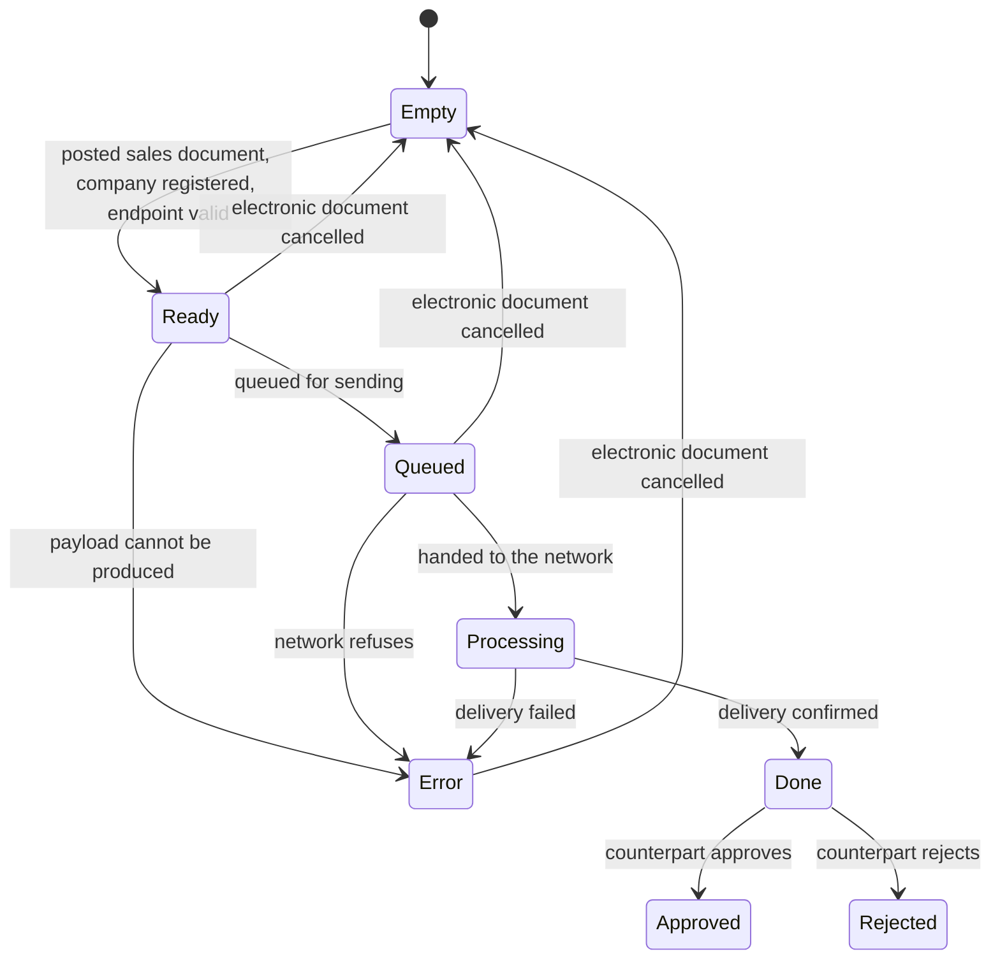
```mermaid
stateDiagram-v2
    [*] --> Empty
    Empty --> Ready : posted sales document, company registered, endpoint valid
    Ready --> Queued : queued for sending
    Ready --> Error : payload cannot be produced
    Queued --> Processing : handed to the network
    Queued --> Error : network refuses
    Processing --> Done : delivery confirmed
    Processing --> Error : delivery failed
    Done --> Approved : counterpart approves
    Done --> Rejected : counterpart rejects
    Ready --> Empty : electronic document cancelled
    Queued --> Empty : electronic document cancelled
    Error --> Empty : electronic document cancelled
```

---

## 15. Romania portal

### 15.1 Romania Interchange Document

**Host.** Romania Interchange Document. **Field.** `state`. **Stored.** Yes, required, read-only.
The invoicing package defines the first three values and the goods-movement package adds the last
three, so a database with only the invoicing package installed sees three states.

| State | Stored value | Label | Meaning |
|---|---|---|---|
| Invoice sent | `invoice_sent` | Sent | The invoice payload reached the portal and validation is awaited. |
| Invoice refused | `invoice_refused` | Error | The portal refused the invoice. |
| Invoice validated | `invoice_validated` | Validated | The portal validated the invoice and returned the signature, the certificate and the download key. |
| Movement sent | `stock_sent` | Sent | A goods-movement declaration reached the portal. |
| Movement failed | `stock_sending_failed` | Error | The declaration was refused. |
| Movement validated | `stock_validated` | Validated | The declaration was validated. |

Each record carries the moment of the attempt, the message, the signature key, the certificate key,
the download key and the answer attachment. A "fetch the status" button is offered only while the
record is in `invoice_sent` and the invoice's own state is also `invoice_sent`.

### 15.2 Invoice state

**Host.** Journal Entry. **Field.** `l10n_ro_edi_state`. **Stored.** Yes, read-only. It is the
state of the most recent document of the invoice, with one extra value that no document carries.

| State | Stored value | Label | Meaning |
|---|---|---|---|
| Not in the flow | (empty) | — | Never transmitted. |
| Not indexed | `invoice_not_indexed` | Not indexed | The invoice was sent but the portal has not yet given it an index, so the answer cannot be looked up by index and must be fetched by the message identifier. |
| Sent | `invoice_sent` | Sent | Transmitted, awaiting validation. |
| Refused | `invoice_refused` | Refused | The portal refused it. |
| Validated | `invoice_validated` | Validated | The portal validated it. |

| From | Trigger | Guards, in order | To | Side effects |
|---|---|---|---|---|
| (empty) | Send | 1. The company holds an access token for the portal. 2. The invoice is a posted customer invoice or credit note. 3. No blocking validation error. | Sent | A document record is created in `invoice_sent` and the payload is attached. |
| (empty) | Send | The portal accepts the payload but returns no index | Not indexed | The message identifier is stored and the invoice is picked up by the indexing job. |
| Not indexed | The indexing job finds the index | none | Sent | The document record is completed. |
| Sent | The status job reports that processing is not finished | none | Sent | The message "SPV has not finished processing the invoice, try again later." is posted. |
| Sent | The status job reports validation | none | Validated | "This invoice has been accepted by the SPV." is posted; the signature, certificate and download keys are stored; the earlier `invoice_sent` document records are removed. |
| Sent | The status job reports refusal | none | Refused | The refusal text is stored on a new document record and posted. |
| Refused | Correct and resend | The invoice is modifiable | Sent | A new document record is created. |
| (empty), Refused | Send | The invoice is not ready | (empty) or Refused | "The invoice is not ready to be sent: `<comma-separated reasons>`" is posted. |

**Reset to draft.** Refused while the state is `invoice_sent` or `invoice_validated`.

### 15.3 Goods movement state on a transfer and on a batch transfer

**Host.** Transfer, and Batch Transfer. **Field.** `l10n_ro_edi_stock_state`. **Stored.** Yes,
read-only.

| State | Stored value | Label | Meaning |
|---|---|---|---|
| Not declared | (empty) | — | No declaration was sent for this movement. |
| Sent | `stock_sent` | Sent | The declaration reached the portal. |
| Error | `stock_sending_failed` | Error | The declaration was refused. |
| Validated | `stock_validated` | Validated | The declaration was validated and the movement code was returned. |

The transitions mirror those of the invoice: send, poll, validate or refuse, correct and resend. A
batch transfer sends one declaration for the whole batch and its state is the state of that
declaration.

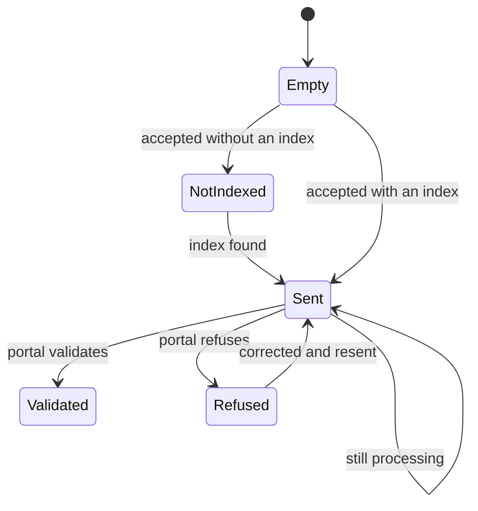
```mermaid
stateDiagram-v2
    [*] --> Empty
    Empty --> NotIndexed : accepted without an index
    NotIndexed --> Sent : index found
    Empty --> Sent : accepted with an index
    Sent --> Validated : portal validates
    Sent --> Refused : portal refuses
    Sent --> Sent : still processing
    Refused --> Sent : corrected and resent
```

---

## 16. Poland national system and bank account verification

### 16.1 Invoice status in the national system

**Host.** Journal Entry. **Field.** `l10n_pl_edi_status`. **Stored.** Yes, read-only.

| State | Stored value | Label | Meaning |
|---|---|---|---|
| Not in the flow | (empty) | — | Never transmitted, or cleared after a rejection was reset to draft. |
| Sent | `sent` | Sent (In Progress) | The payload reached the national system and processing is running. |
| Accepted | `accepted` | Accepted | The system accepted the invoice and returned its national number, stored in `l10n_pl_edi_number`. |
| Rejected | `rejected` | Rejected | The system refused the invoice. |
| Ready to fetch | `fetch_ready` | Fetch Ready | An inbound document is available in the system and can be pulled into a vendor bill. |
| Fetched | `fetched` | Fetched | The inbound document was pulled and a vendor bill exists for it. |
| Fetch failed | `fetch_failed` | Fetch Failed | The pull failed. |

**Answer codes.** The national system answers with a numeric code that maps onto the states as
follows. The message quoted in each row is posted in the invoice's discussion thread and written
into the invoice's status header when the state changes.

| Code | Resulting state | Message |
|---|---|---|
| 100 | Sent | "KSeF Status: Invoice accepted for further processing (Code: 100)." |
| 150 | Sent | "KSeF Status: Processing in progress (Code: 150)." |
| 200 | Accepted | "KSeF Status: Success (Code: 200). Invoice accepted." |
| 405 | Rejected | "KSeF Status: Rejected (Code: 405). Processing canceled." |
| 410 | Rejected | "KSeF Status: Rejected (Code: 410). Incorrect scope of permissions." |
| 415 | Rejected | "KSeF Status: Rejected (Code: 415). It is not possible to send an invoice with an attachment." |
| 430 | Rejected | "KSeF Status: Rejected (Code: 430). Invoice file verification error." |
| 435 | Rejected | "KSeF Status: Rejected (Code: 435). File decryption error." |
| 440 | Rejected | "KSeF Status: Rejected (Code: 440). Duplicate invoice." |
| 450 | Rejected | "KSeF Status: Rejected (Code: 450). Invoice document semantics verification error." |
| 500 | Rejected | "KSeF Status: Error (Code: 500). Unknown error." followed by the description the system returned. |
| any other | unchanged | "Unknown status received from KSeF (Code: `<code>`): `<description>`" |

| From | Trigger | Guards, in order | To | Side effects |
|---|---|---|---|---|
| (empty) | Send | The company holds a session with the national system; the invoice is a posted customer document | Sent | The payload is attached and the reference number and session identifier are stored. |
| Sent | The hourly status job asks for the outcome | The code maps to `sent` | Sent | The message is posted only when the state actually changes. |
| Sent | The hourly status job asks for the outcome | The code maps to `accepted` | Accepted | The national number is stored; the official acknowledgement becomes downloadable. |
| Sent | The hourly status job asks for the outcome | The code maps to `rejected` | Rejected | The rejection message is posted. |
| Rejected | Reset to draft | The state is `rejected` | (empty) | The status, the national number, the reference, the session identifier and the header are all cleared so that the invoice can be sent again. |
| Sent, Accepted | Reset to draft | Refused | unchanged | The reset button is hidden for these two states. |
| — | The inbound job finds a document addressed to the company | none | Ready to fetch | A placeholder is created. |
| Ready to fetch | Pull the document | The pull succeeds | Fetched | A vendor bill is created from the payload. |
| Ready to fetch | Pull the document | The pull fails | Fetch failed | The failure is logged and the job retries. |

**Guard messages.**

> "This invoice does not have a KSeF Invoice Reference Number. It may not have been sent yet."

> "You can only download a UPO for an 'Accepted' invoice. Please update the status first."

The abbreviations inside these two messages are the national system's own names for the reference
number and for the official acknowledgement, and they are reproduced because the text is
user-visible.

### 16.2 Bank account verification status

**Host.** Poland Bank Account Verification. **Field.** `verification_status`. **Stored.** Yes,
required, read-only. One record is written per check of a supplier bank account against the
national register of taxpayers.

| State | Stored value | Label | Meaning |
|---|---|---|---|
| Valid | `valid` | Valid | The supplier's tax identification number is linked in the register to the bank account used for the payment. |
| Invalid | `invalid` | Invalid | The number is not linked to that account. Paying anyway loses the right to deduct. |
| Incomplete counterpart | `incomplete_partner` | Incomplete partner | The counterpart has no tax identification number, or no bank account. No call to the register is made. |
| Counterpart not found | `not_found_partner` | Partner not found | The register was called and does not know the number. |
| Error | `error` | "An error occurred during check with Government API" | The register could not be reached or answered with an error. |

| From | Trigger | Guards, in order | To | Side effects |
|---|---|---|---|---|
| — | Register a payment to a supplier | The counterpart has both a tax identification number and a bank account | one of Valid, Invalid, Counterpart not found or Error | A record is written with the moment of the check, the correlation identifier returned by the register, and copies of the account number and of the tax identification number, so that a later change to the contact cannot alter the evidence. |
| — | Register a payment to a supplier | The counterpart lacks a number or an account | Incomplete counterpart | No call is made. |
| any | Register another payment the same day for the same pair | A record of the same day exists for the same account and number | unchanged | The existing result is reused rather than calling the register again. |

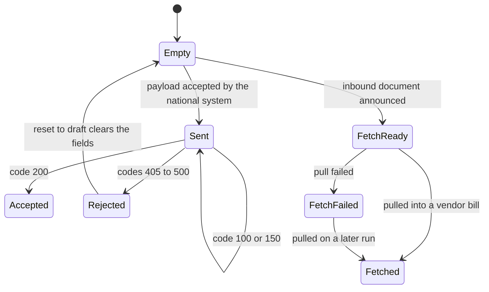
```mermaid
stateDiagram-v2
    [*] --> Empty
    Empty --> Sent : payload accepted by the national system
    Sent --> Sent : code 100 or 150
    Sent --> Accepted : code 200
    Sent --> Rejected : codes 405 to 500
    Rejected --> Empty : reset to draft clears the fields
    Empty --> FetchReady : inbound document announced
    FetchReady --> Fetched : pulled into a vendor bill
    FetchReady --> FetchFailed : pull failed
    FetchFailed --> Fetched : pulled on a later run
```

---

## 17. Malaysia portal

### 17.1 Malaysia Interchange Document

**Host.** Malaysia Interchange Document. **Field.** `myinvois_state`. **Stored.** Yes, read-only,
tracked. One document carries one or more invoices, or a consolidated batch of point of sale
receipts.

| State | Stored value | Label | Meaning |
|---|---|---|---|
| Not submitted | (empty) | — | Built but not submitted, or the submission is being prepared. |
| Validation in progress | `in_progress` | Validation In Progress | The portal accepted the submission and is validating it. |
| Valid | `valid` | Valid | The portal validated the document and returned its unique identifier and its validation moment. |
| Rejected | `rejected` | Rejected | The buyer rejected the document within the allowed window. |
| Invalid | `invalid` | Invalid | The portal refused the document. An invalid document can never be shown to a customer, so the invoices it carries are cancelled. |
| Cancelled | `cancelled` | Cancelled | The issuer cancelled the document within the allowed window. The invoices it carries are cancelled. |

| From | Trigger | Guards, in order | To | Side effects |
|---|---|---|---|---|
| (empty), Invalid | Submit | 1. The company is registered for the service. 2. Every document file could be generated. 3. The counterpart carries the identification the portal demands. | Validation in progress | The submission identifier and the document's unique identifier are stored. |
| (empty), Invalid | Submit | The file generation fails | (empty) | The message "Error when generating the documents' files:" followed by the errors is posted, and nothing is submitted. |
| (empty) | Submit | The portal refuses the submission itself | Invalid | The message "This document could not be sent for the following reason(s):" followed by the reasons is posted. |
| Validation in progress | The status job asks the portal | The portal answers `valid` | Valid | The validation moment is stored and the next status check is deferred by one hour. |
| Validation in progress | The status job asks the portal | The portal answers `invalid` | Invalid | The reason is posted, or, when the portal gives none, "MyInvois did not return a specific reason for the invalidation. Please check the MyInvois portal for the exact reason." is posted. The invoices are cancelled. |
| Validation in progress | The status job asks the portal | The portal answers with an unchanged status | unchanged | Nothing is posted. |
| Validation in progress | The status job fails | none | unchanged | The message "The status update failed with the following errors:" followed by the errors is posted. |
| Valid | Cancel | 1. Less than seventy-two hours have passed since the validation moment. 2. The state is `valid` or `rejected`. 3. A reason is given. | Cancelled | The message "This document has been cancelled for reason: `<reason>`" is posted and the invoices are cancelled. |
| Valid | Reject, as the buyer | The same three guards | Rejected | The message "This document has been rejected for reason: `<reason>`" is posted. |
| Rejected | Cancel, as the issuer | The same three guards | Cancelled | As above. |

**Guard messages.**

> "It has been more than 72h since the document validation, you can no longer cancel it.
> Instead, you should issue a debit or credit note."

> "You can only change the state of a document in the valid or rejected states."

> "You must provide a reason for updating the document."

> "Please register for the E-Invoicing service in the settings first."

> "You do not have the permission to update this invoice."

> "Support for consolidated invoices in the invoicing app is not yet implemented."

> "Invalid Operation. No order to consolidate."

**Immediate polling.** After a submission the status is asked up to three times, with a pause of
one second between attempts, and the loop stops as soon as no document of the submission is still
in `in_progress`.

### 17.2 The derived state on the invoice

**Host.** Journal Entry. **Field.** `l10n_my_edi_state`. **Stored.** Yes, read-only, tracked. It
carries the same six values as the document and follows the document that covers the invoice.

### 17.3 Contact tax identification validation state

**Host.** Contact. **Field.** `l10n_my_tin_validation_state`. **Stored.** Yes.

| State | Stored value | Label | Meaning |
|---|---|---|---|
| Not checked | (empty) | — | The number has never been validated against the portal. |
| Valid | `valid` | Valid | The portal recognises the pair of identification number and registration number. |
| Invalid | `invalid` | Invalid | The portal does not recognise the pair. Submitting an invoice for this counterpart will be refused. |

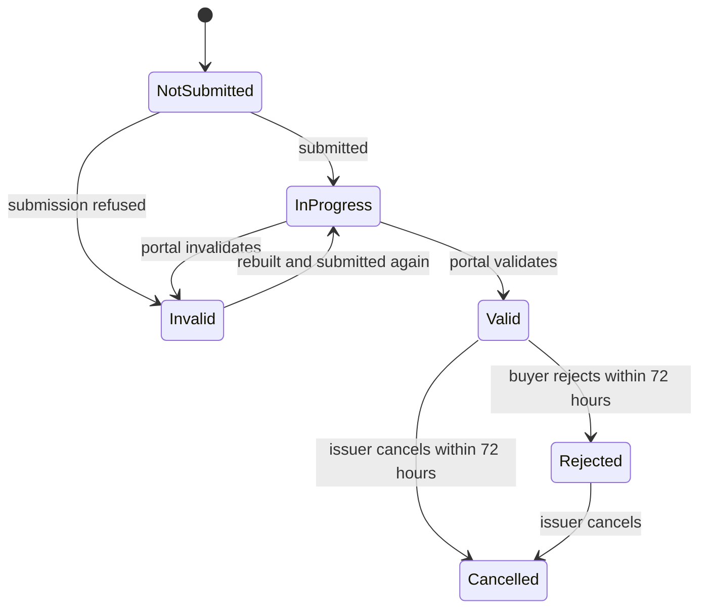
```mermaid
stateDiagram-v2
    [*] --> NotSubmitted
    NotSubmitted --> InProgress : submitted
    NotSubmitted --> Invalid : submission refused
    InProgress --> Valid : portal validates
    InProgress --> Invalid : portal invalidates
    Valid --> Cancelled : issuer cancels within 72 hours
    Valid --> Rejected : buyer rejects within 72 hours
    Rejected --> Cancelled : issuer cancels
    Invalid --> InProgress : rebuilt and submitted again
```

---

## 18. India electronic invoice and way bill

### 18.1 Electronic invoice status

**Host.** Journal Entry. **Field.** `l10n_in_edi_status`. **Stored.** Yes, read-only, tracked.

| State | Stored value | Label | Meaning |
|---|---|---|---|
| Not in the flow | (empty) | — | Not eligible or never sent. |
| To send | `to_send` | To Send | Eligible and waiting for transmission. |
| Sent | `sent` | Sent | The portal registered the invoice and returned its registration number, its acknowledgement number and date, and the signed visual code. |
| Cancelled | `cancelled` | Cancelled | The registration was cancelled on the portal. |

| From | Trigger | Guards, in order | To | Side effects |
|---|---|---|---|---|
| (empty) | Post an eligible invoice | The company's fiscal country is India, the company is registered for electronic invoicing, the invoice is a customer document above the reporting threshold | To send | The send action appears. |
| To send | Send | 1. The company's credentials are valid. 2. No blocking validation error. | Sent | The registration number, the acknowledgement number and date, the signed payload and the visual code are stored and attached. |
| To send | Send | A validation error exists | To send | The error is stored on the invoice as rich text and shown. |
| Sent | Cancel | 1. A cancellation reason and cancellation remarks are given. 2. The portal's cancellation window is still open. | Cancelled | The cancellation payload is transmitted and the answer is stored. |

### 18.2 Electronic way bill

**Host.** India Electronic Way Bill. **Field.** `state`. **Stored.** Yes, required, read-only,
tracked.

| State | Stored value | Label | Meaning |
|---|---|---|---|
| Pending | `pending` | Pending | The permit record exists and no permit number has been obtained. |
| Generated | `generated` | Generated | The portal issued a permit number with a validity period. |
| Cancelled | `cancel` | Cancelled | The permit was cancelled on the portal. |
| Delivery note | `challan` | Challan | The movement travels under a delivery note instead of a permit, so no permit will be requested. |

| From | Trigger | Guards, in order | To | Side effects |
|---|---|---|---|---|
| — | Create a permit from an invoice or a transfer | none | Pending | The document details, the two billing parties, the two shipping parties, the transport mode, the distance and the fiscal position are derived. |
| Pending | Generate | Every eligibility check passes, listed in [business-rules.md](business-rules.md) | Generated | The permit number, its validity period and the portal's answer are stored and attached. |
| Pending | Generate | A check fails | Pending | The error message and its blocking level are stored on the permit. |
| Pending | Mark as a delivery note | none | Delivery note | The permit will not be requested and the document may be printed. |
| Generated | Cancel | A cancellation reason is given and the portal's window is open | Cancelled | The cancellation answer is stored. |
| Cancelled, Delivery note | Reset to pending | The state is `cancel` or `challan` | Pending | The permit may be requested again. |

**Guard messages.**

> "Only Delivery Challan and Cancelled E-waybill can be reset to pending."

> "Please generate the E-Waybill to print it."

> "Please generate the E-Waybill or mark the document as a Challan to print it."

> "The challan can only be generated in the Pending state."

> "This document is being sent by another process already."

> "You cannot delete a generated E-waybill. Instead, you should cancel it."

> "waiting for IRN generation to create E-waybill"

> "Unable to send E-waybill by IRN. Ensure GST Number set on company setting and EDI and Ewaybill credentials are correct."

The last two messages name the registration number and the goods and services tax number by the
abbreviations the portal uses; they are reproduced because they are user-visible text.

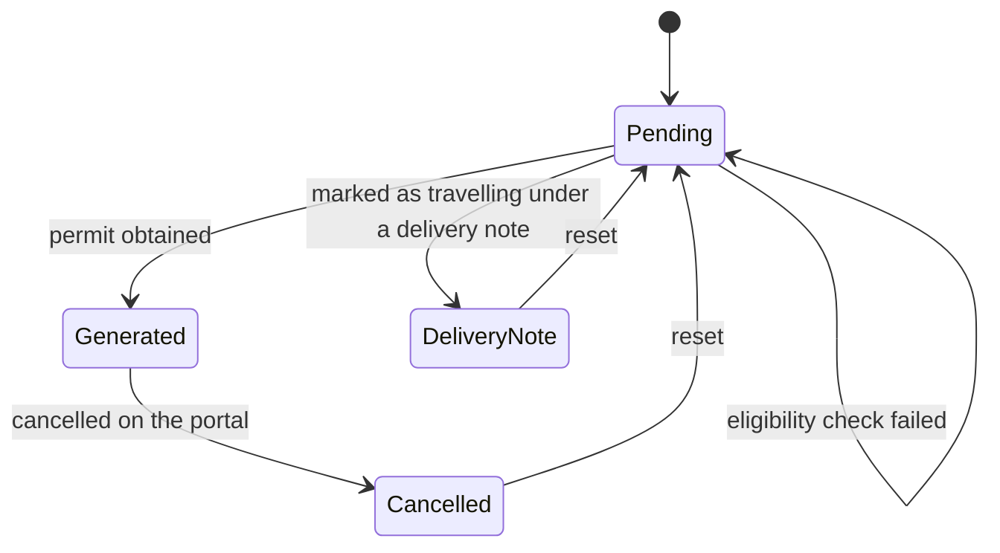
```mermaid
stateDiagram-v2
    [*] --> Pending
    Pending --> Generated : permit obtained
    Pending --> Pending : eligibility check failed
    Pending --> DeliveryNote : marked as travelling under a delivery note
    Generated --> Cancelled : cancelled on the portal
    Cancelled --> Pending : reset
    DeliveryNote --> Pending : reset
```

---

## 19. Indonesia electronic invoice and payment code

### 19.1 Indonesia Electronic Invoice Document

**Host.** Indonesia Electronic Invoice Document. This record has **no selection field**: its
lifecycle is carried by the presence of its attachment and by the invoices attached to it. It is
listed here because the index of country flows would otherwise be incomplete, and because a rebuild
must reproduce the same observable lifecycle.

| State | How it is recognised | Meaning |
|---|---|---|
| Empty | No attachment and no invoices | The document was created and nothing has been added. |
| Filled | Invoices attached, no attachment produced | Customer invoices have been gathered; only posted customer invoices and credit notes of the same company that are not already on another document may be added. |
| Generated | An attachment exists | The payload was produced and stored as the document's main attachment. It can be downloaded and uploaded to the administration's own portal by hand. |
| Regenerated | A new attachment replaces the old one | The payload was produced again after the invoices changed. |

| From | Trigger | Guards, in order | To | Side effects |
|---|---|---|---|---|
| Empty | Add invoices | Each invoice is a posted customer invoice or credit note of the document's company and is not already on a document | Filled | The document's name is recomputed from its invoices. |
| Filled | Generate | 1. Every invoice carries a transaction code. 2. Every invoice is a customer invoice. | Generated | The payload is built and attached. |
| Filled | Generate | An invoice has no transaction code | Filled | "Some documents don't have a transaction code: `<list of invoice numbers>`" |
| Filled | Generate | An invoice is not a customer invoice | Filled | "Some documents are not Customer Invoices: `<list of invoice numbers>`" |
| Generated | Regenerate | The same two guards | Regenerated | The previous attachment is replaced. |

### 19.2 Indonesia Quick Response Transaction

**Host.** Indonesia Quick Response Transaction. **Field.** `paid`, a boolean rather than a
selection. The record represents one payment code presented to a customer.

| State | Stored value | Meaning |
|---|---|---|
| Unpaid | false | The code has been generated and the scheme has not reported payment. |
| Paid | true | The scheme reported that the code was paid. |

| From | Trigger | Guards | To | Side effects |
|---|---|---|---|---|
| — | Generate a payment code for an invoice or a receipt | The supported record kind is one the mechanism covers | Unpaid | The code content, its amount as a whole number of the local currency, its identifier and the moment of creation are stored together with the bank account that produced it. |
| Unpaid | The status check asks the scheme | The scheme reports payment | Paid | The payment is recorded against the invoice or the receipt. |
| Unpaid | The clean-up job runs | The record is older than thirty-five minutes and still unpaid | deleted | A code older than thirty-five minutes can no longer be paid and its status will never change, so the record is removed. |

**Guard message.** Generating a code for a record kind the mechanism does not cover is refused
with "QRIS capability is not extended to model %s yet!", where the placeholder is the technical
name of the record kind. The message is reproduced with its placeholder because it is user-visible
text.

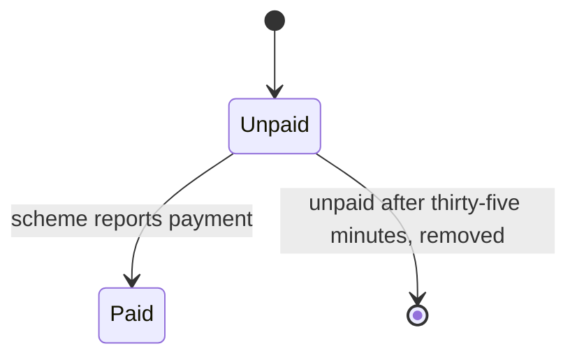
```mermaid
stateDiagram-v2
    [*] --> Unpaid
    Unpaid --> Paid : scheme reports payment
    Unpaid --> [*] : unpaid after thirty-five minutes, removed
```

---

## 20. Turkey exchange and dispatch

### 20.1 Invoice send status

**Host.** Journal Entry. **Field.** `l10n_tr_nilvera_send_status`. **Stored.** Yes, read-only.

| State | Stored value | Label | Meaning |
|---|---|---|---|
| Not sent | `not_sent` | Not sent | The invoice has not been handed to the intermediary. |
| Waiting | `waiting` | Waiting | The intermediary has queued the document. |
| Sent | `sent` | Sent and waiting response | The document was handed over and the outcome is awaited. |
| Successful | `succeed` | Successful | The document was delivered and accepted. |
| Error | `error` | Error | The transmission failed. When a transmission identifier exists, the document may be retried. |
| Unknown | `unknown` | Unknown | The intermediary returned a status the system does not map. |

| From | Trigger | Guards, in order | To | Side effects |
|---|---|---|---|---|
| Not sent | Send | 1. The company holds credentials for the intermediary. 2. The counterpart's status is known, that is not `not_checked`. 3. No blocking validation error. | Sent | The transmission identifier is stored. |
| Sent, Waiting, Unknown | The refresh job asks for the status | The intermediary returns a status that is one of the stored values | that value | The invoice's own status field takes it. |
| Sent, Waiting, Unknown | The refresh job asks for the status | The intermediary returns anything else | Unknown | The raw answer is kept for support. |
| Error | Send again | A transmission identifier exists | Sent | A new attempt is made with the same identifier. |
| — | The inbound job fetches documents whose status is `succeed` | none | Successful | Vendor bills are created from the fetched documents, ordered by their creation moment so that an interrupted run can resume where it stopped. |

### 20.2 Contact status

**Host.** Contact. **Field.** `l10n_tr_nilvera_customer_status`. **Stored.** Yes, read-only,
tracked.

| State | Stored value | Label | Meaning |
|---|---|---|---|
| Not verified | `not_checked` | Not Verified | The counterpart has never been looked up in the intermediary's directory. |
| Archive counterpart | `earchive` | E-Archive | The counterpart is not registered, so the document must be issued as an archive invoice and delivered by other means. |
| Registered counterpart | `einvoice` | E-Invoice | The counterpart is registered and receives electronic invoices through the network. Its aliases are stored as Turkey Electronic Invoicing Alias records. |

The lookup runs when the contact is saved with a tax identification number and again before every
send.

### 20.3 Dispatch state on a transfer

**Host.** Transfer. **Field.** `l10n_tr_nilvera_dispatch_state`. **Stored.** Yes, tracked.

| State | Stored value | Label | Meaning |
|---|---|---|---|
| Not dispatched | (empty) | — | No electronic dispatch note is required or none has been prepared. |
| To send | `to_send` | To Send | A dispatch note payload can be produced for this transfer. |
| Sent | `sent` | Sent | The dispatch note was transmitted. Trailer plates and driver data travel with it. |

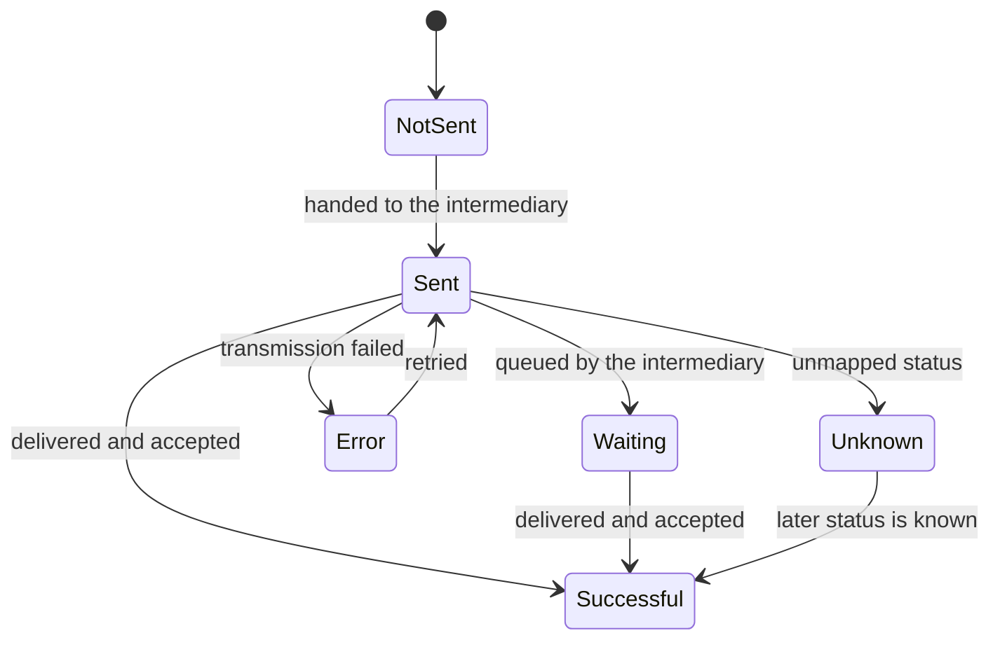
```mermaid
stateDiagram-v2
    [*] --> NotSent
    NotSent --> Sent : handed to the intermediary
    Sent --> Successful : delivered and accepted
    Sent --> Waiting : queued by the intermediary
    Waiting --> Successful : delivered and accepted
    Sent --> Error : transmission failed
    Sent --> Unknown : unmapped status
    Unknown --> Successful : later status is known
    Error --> Sent : retried
```

---

## 21. Vietnam invoicing service

**Host.** Journal Entry. **Field.** `l10n_vn_edi_invoice_state`. **Stored.** Yes.

| State | Stored value | Label | Meaning |
|---|---|---|---|
| Not in the flow | (empty) | — | Never issued through the service, or reset after a cancellation. |
| Ready to send | `ready_to_send` | Ready to send | A posted customer document that has not been issued yet. |
| Sent | `sent` | Sent | The service issued the invoice and returned its number and its lookup code. |
| Payment status to update | `payment_state_to_update` | Payment status to update | The ledger's payment state changed after issuance, so the service has to be told. |
| Cancelled | `canceled` | Canceled | A cancellation request was accepted. |
| Adjusted | `adjusted` | Adjusted | An adjustment invoice was issued against this one. |
| Replaced | `replaced` | Replaced | A replacement invoice was issued against this one. |

| From | Trigger | Guards, in order | To | Side effects |
|---|---|---|---|---|
| (empty) | Post a customer document | The company's fiscal country is Vietnam and the document has not been issued | Ready to send | The invoice symbol and the invoice template of the counterpart, or the company defaults, are filled in. |
| Ready to send | Issue | 1. Credentials for the service exist. 2. A symbol and a template are set. 3. No blocking validation error. | Sent | The invoice number, the lookup code and the transaction identifier are stored. |
| Sent | The payment state of the ledger changes | The country is Vietnam and the state is `sent` | Payment status to update | The update action becomes available. |
| Payment status to update | Send the payment update | The service accepts | Sent | The state returns to `sent` because the service is again in step with the ledger. |
| Sent, Payment status to update | Request a cancellation | 1. A reason is given. 2. The agreement document name and date are given. 3. The invoice is not already cancelled. | Cancelled | The cancellation is transmitted, the fiscal and tax lock dates are checked, and the ledger entry is cancelled. |
| Sent | Issue an adjustment invoice | The original is issued | Adjusted | The adjustment invoice takes its own place in the flow. |
| Sent | Issue a replacement invoice | The original is issued | Replaced | The replacement invoice takes its own place in the flow. |
| Cancelled | Reset the cancelled entry to draft | The ledger entry is cancelled | (empty) | Every field of the flow is cleared so that the document can be issued again. |

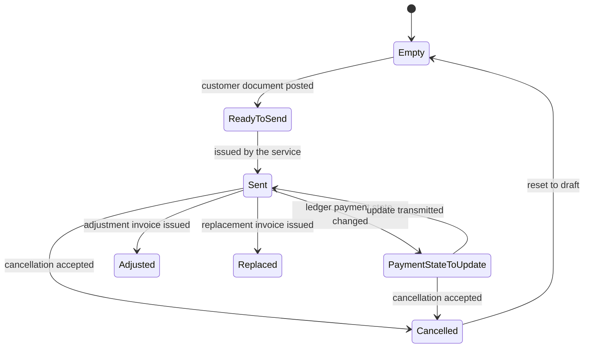
```mermaid
stateDiagram-v2
    [*] --> Empty
    Empty --> ReadyToSend : customer document posted
    ReadyToSend --> Sent : issued by the service
    Sent --> PaymentStateToUpdate : ledger payment state changed
    PaymentStateToUpdate --> Sent : update transmitted
    Sent --> Cancelled : cancellation accepted
    PaymentStateToUpdate --> Cancelled : cancellation accepted
    Sent --> Adjusted : adjustment invoice issued
    Sent --> Replaced : replacement invoice issued
    Cancelled --> Empty : reset to draft
```

---

## 22. Taiwan invoicing service

### 22.1 Invoice status

**Host.** Journal Entry. **Field.** `l10n_tw_edi_state`. **Stored.** Yes, read-only, tracked.

| State | Stored value | Label | Meaning |
|---|---|---|---|
| Not issued | (empty) | — | The invoice has not been issued through the service. |
| Invoiced | `invoiced` | Invoiced | The service issued the invoice and returned its number and issuance moment. |
| Valid | `valid` | Valid | A status query reported the invoice as valid, that is not voided. |
| Invalid | `invalid` | Invalid | A status query reported the invoice as voided. |

| From | Trigger | Guards, in order | To | Side effects |
|---|---|---|---|---|
| (empty) | Issue | 1. Credentials for the service exist. 2. The counterpart carries the identification the service demands, or the receipt is issued to a carrier. 3. No blocking validation error. | Invoiced | The invoice number, the issuance moment and the random code are stored. |
| Invoiced, Valid, Invalid | Query the status | The service reports that the invoice is not voided | Valid | The answer is stored. |
| Invoiced, Valid | Query the status | The service reports that the invoice is voided | Invalid | The answer is stored. |
| Invoiced, Valid | Cancel | A reason is given | Invalid | The cancellation is transmitted. Refused without a reason with "You must provide a reason for canceling the invoice." |
| Invoiced, Valid | Print | none | unchanged | The service returns a printable form. |

### 22.2 Refund agreement status

**Host.** Journal Entry. **Field.** `l10n_tw_edi_refund_state`. **Stored.** Yes, read-only. It
applies to a credit note, where the buyer must agree to the refund before the service accepts it.

| State | Stored value | Label | Meaning |
|---|---|---|---|
| Not applicable | (empty) | — | The document is not a credit note under the service. |
| To be agreed | `to_be_agreed` | To be agreed | The buyer's agreement has been requested. |
| Agreed | `agreed` | Agreed | The buyer agreed and the credit note can be issued. |
| Disagreed | `disagreed` | Disagreed | The buyer refused; the credit note cannot be issued through the service. |

```mermaid
stateDiagram-v2
    [*] --> NotIssued
    NotIssued --> Invoiced : issued
    Invoiced --> Valid : status query, not voided
    Invoiced --> Invalid : status query, voided
    Valid --> Invalid : cancelled with a reason
```

---

## 23. Jordan invoice registry

**Host.** Journal Entry, and Point of Sale Order for receipts. **Fields.** `l10n_jo_edi_state` on
the invoice and `l10n_jo_edi_pos_state` on the receipt. **Stored.** Yes, tracked.

| State | Stored value | Label | Meaning |
|---|---|---|---|
| Not in the flow | (empty) | — | Not eligible. |
| To send | `to_send` | To Send | Eligible and waiting for transmission. |
| Sent | `sent` | Sent | The registry accepted the document and returned its unique identifier and its visual code. |
| Sent in demonstration mode | `demo` | Sent (Demo) | The company runs in demonstration mode, so nothing left the system but the document is marked as processed. |

| From | Trigger | Guards, in order | To | Side effects |
|---|---|---|---|---|
| (empty) | Post an eligible document | The company's fiscal country is Jordan and the document is a customer document or a receipt | To send | The send action appears. |
| To send | Send | 1. Credentials exist, unless demonstration mode is on. 2. No blocking validation error. 3. Demonstration mode is off. | Sent | The unique identifier, the visual code and the signed payload are stored and attached. |
| To send | Send | Demonstration mode is on | Sent in demonstration mode | The payload is produced and attached but nothing is transmitted. |

```mermaid
stateDiagram-v2
    [*] --> Empty
    Empty --> ToSend : eligible document posted
    ToSend --> Sent : transmitted and accepted
    ToSend --> Demo : demonstration mode
```

---

## 24. Serbia invoice registry

**Host.** Journal Entry. **Field.** `l10n_rs_edi_state`. **Stored.** Yes, read-only, tracked. It is
the simplest of the country machines: the transmission either worked or it did not.

| State | Stored value | Label | Meaning |
|---|---|---|---|
| Not in the flow | (empty) | — | Never transmitted. |
| Sent | `sent` | Sent | The payload reached the registry. |
| Error | `sending_failed` | Error | The transmission failed. The error text is stored and posted. |

| From | Trigger | Guards | To | Side effects |
|---|---|---|---|---|
| (empty), Error | Send | No blocking validation error and credentials exist | Sent | The payload is attached. |
| (empty), Error | Send | The transmission fails | Error | The error text is stored and posted. |
| Error | Correct and send again | The invoice is modifiable | Sent | A new payload is produced. |

```mermaid
stateDiagram-v2
    [*] --> Empty
    Empty --> Sent : transmission succeeded
    Empty --> Error : transmission failed
    Error --> Sent : retried successfully
```

---

## 25. France periodic reporting and portal

France has the richest set of state fields of the domain, because the country separates the
transmission of an invoice through the portal, the lifecycle answers the portal returns, and the
periodic report of transactions and payments that must be filed even for documents that never
travel through the portal.

### 25.1 France Reporting Flow

**Host.** France Reporting Flow. **Field.** `state`. **Stored.** Yes, required, default `ready`.

| State | Stored value | Label | Meaning |
|---|---|---|---|
| Ready | `ready` | Ready | The flow is open. Its set of documents is still being computed and its payload may be rebuilt. This is the only open state; the other three are sent states, in which the documents and the payload are immutable. |
| Sent | `sent` | Sent | The payload was handed to the portal and a tracking identifier came back. |
| Error | `error` | Error | The transmission failed. |
| Completed | `completed` | Completed | The portal confirmed that the flow was processed. |

A second field, `transmission_type`, the transmission kind, is derived: a flow with no parent is
`initial` (Initial) and a flow created to correct an earlier one is `rectificative`
(Rectificative). Two further fields fix the scope: `report_type` is `transaction` (Transaction) or
`payment` (Payment), and `operation_type` is `sale` (Sales) or `purchase` (Acquisitions).

| From | Trigger | Guards, in order | To | Side effects |
|---|---|---|---|---|
| — | A reportable document is posted and no open flow covers its period and scope | none | Ready | A flow is created for the period, the report kind and the operation kind. |
| Ready | Build the payload | At least one valid document is in scope | Ready | The payload is attached to the flow as its only attachment. |
| Ready | Build the payload | No valid document is in scope | Ready | "Payload build failed: no valid invoices." is posted once. |
| Ready | Send | 1. The flow has not been sent. 2. There is at least one valid document. 3. The flow is not identical to the previous flow of the same scope. 4. A payload exists. 5. A proxy user is configured. 6. The portal returns a tracking identifier. | Sent | The tracking identifier is stored; an audit message is posted on every document of the flow; the documents record the flow they were sent in; a rectificative flow is opened for any document that still carries an error. |
| Ready | Send | The flow contains documents with validation errors and neither the "send without the invalid ones" option nor the last day of the grace period applies | Ready | The refusal message below is shown. |
| Ready | Send | The flow is identical to the previous flow of the same scope | Ready | "This flow is identical to the previous flow `<name>`." is posted once. |
| Ready | Send | There is nothing valid to send | Ready | "No valid transactions/payments to send." is posted once. |
| Sent | The portal confirms processing | none | Completed | The confirmation is recorded in the raw transport status and message. |
| Sent | The portal reports a problem | none | Error | The raw transport status and message hold the reason. |
| Error | Send a rectificative flow | A new flow is created with this one as its parent | Ready on the new flow | The parent keeps its own state. |
| any sent state | Delete | Refused | unchanged | "You cannot delete sent flows." |

**Guard messages.**

> "Flow `<name>` has already been sent."

> "This flow still contains invoices with validation errors. Fix them or use the 'Send without invalid invoices' button."

> "No active PDP proxy user is configured for company `<company>`."

> "The flow payload is missing. Build the payload before sending."

> "The PDP proxy did not return a flow tracking identifier."

> "You cannot delete sent flows."

**Automatic sending.** A scheduled job sends the flows whose grace period is ending. It posts
"Flow automatically sent by cron (status: `<status>`). `<extra>`", where the extra text is
"Invalid invoices were excluded." when the flow carried documents in error and is empty otherwise.

### 25.2 Reporting period status

**Host.** France Reporting Flow. **Field.** `period_status`. **Stored.** No; it is recomputed from
today's date and the two due dates of the flow.

| State | Stored value | Label | Rule |
|---|---|---|---|
| Open | `open` | Open | Today is before the start of the due period. The flow accumulates documents and cannot yet be filed. |
| Grace | `grace` | Grace | Today is on or after the start of the due period and on or before its end. The flow may be filed. |
| Closed | `closed` | Closed | Today is after the end of the due period. The filing is late. |
| Undefined | (empty) | — | One of the two due dates is missing. |

```mermaid
stateDiagram-v2
    [*] --> Ready
    Ready --> Sent : payload handed to the portal
    Ready --> Ready : nothing valid to send, or identical to the previous flow
    Sent --> Completed : portal confirms processing
    Sent --> Error : portal reports a problem
    Error --> Ready : rectificative flow opened
```

### 25.3 Reporting status on the invoice

**Host.** Journal Entry. **Field.** `l10n_fr_pdp_status`. **Stored.** Yes, computed and stored,
read-only, tracked.

| State | Stored value | Label | Rule, evaluated in this order |
|---|---|---|---|
| Draft | (empty) | — | The entry is a draft. |
| Out of scope | `out_of_scope` | Out of scope | The entry has no reporting kind, so it is not reportable at all. |
| Error | `error` | Error | The entry carries at least one blocking reporting error. |
| Waiting for a flow | (empty) | — | The entry is reportable, has no error and no flow covers it yet. |
| Pending | `pending` | Pending | The flow that covers the entry has a period that has not ended. |
| Ready, Sent, Error or Completed | `ready`, `sent`, `error`, `completed` | Ready, Sent, Error, Completed | The period of the covering flow has ended, so the entry shows the flow's own state. |

### 25.4 Portal invoice status and portal lifecycle status

**Host.** Journal Entry. **Fields.** `pdp_ppf_move_state`, the portal invoice status, and
`pdp_ppf_lifecycle_state`, the portal lifecycle status. **Stored.** Yes, read-only. Both carry the
same four values.

| State | Stored value | Label | Meaning |
|---|---|---|---|
| Not reported | (empty) | — | The entry has not been processed for the portal, or it is not a sales document, which the invoice status requires. |
| In progress | `in_progress` | In Progress | The extract has been prepared and its answer is awaited. |
| Sent | `sent` | Sent | The extract reached the portal. |
| Done | `done` | Done | The portal acknowledged the extract. |
| Error | `error` | Error | The extract failed. |

The invoice status reports the tax extract of a sales document; the lifecycle status reports the
payment and settlement events of any processed document. Both are recomputed whenever the entry is
processed for the portal, and both are cleared when it is not.

### 25.5 Company identity verification status

**Host.** Company. **Field.** `pdp_kyc_status`, the identity verification status. **Stored.** Yes.

| State | Stored value | Label | Meaning |
|---|---|---|---|
| Not started | (empty) | — | No verification has been requested. |
| Processing | `processing` | Processing | The identity documents were submitted and the verification service is examining them. |
| Success | `success` | Success | The company is verified and may register on the portal. |
| Failure | `fail` | Fail | The verification failed. The company must submit new documents. |

The transition out of `processing` is driven by the verification service, which calls the public
verification-status address listed in [interfaces.md](interfaces.md).

### 25.6 Contact electronic invoicing state

**Host.** Contact. **Field.** `pdp_verification_display_state`, the electronic invoicing state.
**Stored.** No; it is recomputed from the directory lookups.

| State | Stored value | Label | Meaning |
|---|---|---|---|
| Not verified yet | `not_verified` | Not verified yet | No lookup has been made. |
| Not in the national directory | `pdp_not_valid` | Partner is not in the annuaire | The counterpart is not registered in the national directory. |
| Cannot receive the format, national directory | `pdp_not_valid_format` | Partner cannot receive format | The counterpart is registered but does not accept the format the company would send. |
| In the national directory | `pdp_valid` | Partner is in the annuaire | The counterpart is registered and accepts the format. |
| Not on the international network | `peppol_not_valid` | Partner is not on Peppol | The counterpart is not registered on the international network. |
| Cannot receive the format, international network | `peppol_not_valid_format` | Partner cannot receive format | Registered on the international network but not for this format. |
| On the international network | `peppol_valid` | Partner is on Peppol | Registered on the international network and able to receive the format. |

### 25.7 Portal response wizard status

**Host.** France Portal Response Wizard. **Field.** `status`. **Stored.** Yes, on the transient
record. It is the answer the company sends back to the portal about an inbound invoice; the stored
values are the portal's own codes, which is why two of them are upper-case pairs of letters.

| State | Stored value | Label | Meaning |
|---|---|---|---|
| Approved | `AP` | Approved | The invoice is approved for payment. |
| In hand | `in_hand` | In Hand | The invoice has been received and is being examined. |
| Suspended | `suspended` | Suspended | Examination is suspended pending information. |
| Refused | `refused` | Refused | The invoice is refused. |
| Paid | `PD` | Paid | The invoice has been paid. |
| Completed | `completed` | Completed | The exchange about this invoice is closed. |
| Cancelled | `cancelled` | Cancelled | The invoice was cancelled. |

The wizard writes the chosen status, with an optional reason, to the portal; the answer is recorded
as a Business Level Response, whose own state machine is section 28.

---

## 26. France point of sale certification

The French point of sale certification has no selection field. Its machine is carried by a hash
chain and by immutable closings, and a rebuild must reproduce the same observable states.

### 26.1 Receipt inalterability

| State | How it is recognised | Meaning |
|---|---|---|
| Open | The order has no hash | The order is being taken and may still be changed. |
| Hashed | The order carries a hash | The order was validated. Its own hash was computed over its immutable fields together with the hash of the previous hashed order of the same company, so the orders form a chain. |

| From | Trigger | Guards | To | Side effects |
|---|---|---|---|---|
| Open | Validate the order | The company is a company whose accounting is unalterable | Hashed | The hash is stored, together with the sequence position of the order in the chain. |
| Hashed | Modify a protected field | Refused | Hashed | "According to the French law, you cannot modify a point of sale order line. Forbidden fields: `<fields>`." and "You cannot overwrite the values ensuring the inalterability of the point of sale." |
| Hashed | Delete | Refused | Hashed | "According to French law, you cannot delete a point of sale order." |
| Hashed | Change the fiscal position used on the order | Refused | Hashed | "You cannot modify a fiscal position used in a POS order." |

The integrity report recomputes the chain and reports the first divergence. It is refused for a
company whose accounting is not unalterable, with "Accounting is not unalterable for the company
`<company>`. This mechanism is designed for companies where accounting is unalterable." and, for a
user without the right, with "Please contact your accountant to print the Hash integrity result."

### 26.2 Sale closing

**Host.** France Sale Closing. There is no state field; the closing kind is fixed at creation and
never changes. The values are `daily` (Daily), `monthly` (Monthly) and `annually` (Annual).

| State | How it is recognised | Meaning |
|---|---|---|
| Created | The record exists | A closing was produced by the scheduled job for its interval. It stores the interval total, the cumulative grand total since the beginning of the company's history, its sequence number, the last order included and that order's hash. |
| Immutable | always | Sale Closings must never be modified or deleted under any circumstances. |

```mermaid
stateDiagram-v2
    [*] --> Open
    Open --> Hashed : order validated, hash chained to the previous order
    Hashed --> Hashed : modification and deletion refused
```

---

## 27. Latin America check issue state

**Host.** Latin America Check. **Field.** `issue_state`. **Stored.** Yes, computed and stored,
read-only. The field applies to an **issued** cheque, that is one that has a liquidity item in the
ledger; a cheque that only passes through the company has no issue state and is tracked by the
journal that currently holds it.

| State | Stored value | Label | Rule |
|---|---|---|---|
| Not issued | (empty) | — | The cheque has no outstanding item. |
| Handed | `handed` | Handed | The cheque has an outstanding item whose residual amount is not zero, so the bank has not debited it yet. |
| Debited | `debited` | Debited | The residual amount is zero and no receivable or payable item took part in the reconciliation, so the bank debited the cheque. |
| Voided | `voided` | Voided | The residual amount is zero and a receivable or payable item took part in the reconciliation, which is what the void operation produces. |

| From | Trigger | Guards, in order | To | Side effects |
|---|---|---|---|---|
| Not issued | Post a payment that issues the cheque | The payment method code is `own_checks` or `new_third_party_checks` | Handed | A liquidity item is written for the cheque. When the payment carries more than one cheque, a splitting entry is posted that replaces the single liquidity item by one item per cheque, each carrying the cheque number and the cheque's own maturity date, and the counterpart line of that entry is reconciled against the payment's liquidity item. |
| Handed | Reconcile the cheque's item against a bank statement line | The residual amount reaches zero without a receivable or payable counterpart | Debited | The cheque leaves the company's hands definitively. |
| Handed | Void the cheque | The cheque has an outstanding item | Voided | The payment is unreconciled from the invoice it paid; a reversing entry named "Void check" is created and posted in the journal of the outstanding item, with one line on the payment's destination account and one line on the outstanding account, both carrying the cheque's maturity date, currency, amount and counterpart; the reversing entry is reconciled against the cheque's item and against the payment's receivable or payable line. |

**Movement guards** (they do not change the issue state but refuse the payment that would move the
cheque). All of them are collected and shown together, one per line, each prefixed by an asterisk.

| Condition | Message |
|---|---|
| The payment's currency differs from a cheque's currency. | "The currency of the payment and the currency of the check must be the same." |
| The sum of the cheques does not equal the payment amount. | "The amount of the payment  does not match the amount of the selected check. Please try to deselect and select the check again." |
| A cheque being moved belongs to a draft payment. | "Selected checks \"`<names>`\" are not posted" |
| An outbound movement names a cheque that is no longer in the payment's journal. | "Some checks are not anymore in journal, it seems it has been moved by another payment." |
| An inbound movement that is not a transfer names a cheque that is already in hand. | "Some checks are already in hand and can't be received again. Checks: `<names>`" |
| The payment date precedes the last operation done with the cheque. | "It seems you're trying to move a check with a date (`<date>`) prior to last operation done with the check (`<last operation>`). This may be wrong, please double check it. By continue, the last operation on the check will remain being `<last operation>`" |
| Cancelling or reopening a payment whose cheque is debited or voided. | "You can't cancel or re-open a payment with checks if some check has been debited or been voided. Checks:" followed by one line per cheque giving its number and its issue state. |
| A payment with a cheque method has no outstanding account. | "A payment with any Third Party Check or Own Check payment methods needs an outstanding account" |
| Another cheque exists with the same number, issuer and bank. | "Other checks were found with same number, issuer and bank. Please double check you are not encoding the same check more than once. List of other payments/checks: `<names>`" This one is a warning, not a refusal. |
| Deleting a cheque whose payment is no longer draft. | "Can't delete a check if payment is In Process!" |

**Mass transfer guards.** The mass transfer wizard collects cheques and moves them to another
journal in one operation.

| Condition | Message |
|---|---|
| The selected cheques are not all in the same journal and in hand. | "All selected checks must be on the same journal and on hand" |
| The action is started from records that are not payments. | "The register payment wizard should only be called on account.payment records." |
| The selected payments are not cheque payments. | "You have selected payments which are not checks. Please call this action from the Third Party Checks menu" |
| A selected cheque is not posted. | "All the selected checks must be posted" |
| The selected cheques are in different currencies. | "All the selected checks must use the same currency" |

```mermaid
stateDiagram-v2
    [*] --> NotIssued
    NotIssued --> Handed : payment issuing the cheque is posted
    Handed --> Debited : outstanding item fully reconciled against the bank
    Handed --> Voided : void operation posts the reversing entry
```

---

## 28. Business response state of the exchange network

**Host.** Business Level Response. **Field.** `pdp_ppf_state`, the portal status. **Stored.** Yes,
read-only. The response entity itself belongs to
[Electronic Invoicing and Document Exchange](../electronic-invoicing-and-document-exchange/README.md);
the French portal package adds this field and drives it.

| State | Stored value | Label | Meaning |
|---|---|---|---|
| Not transmitted | (empty) | — | The answer has been prepared and not yet handed over. |
| Sent | `sent` | Sent | The answer was handed to the portal. |
| Received | `received` | received | The portal confirmed that the answer reached the other party. The label is reproduced with its lower-case first letter because it is the text the client displays. |
| Error | `error` | Error | The answer could not be delivered. |

---

## 29. The inherited activity state

Nine records of this domain carry scheduled activities: the France Reporting Flow, the India
Electronic Way Bill, the India Permanent Account Number Entity, the Indonesia Electronic Invoice
Document, the Italy Declaration of Intent, the Malaysia Interchange Document, the Latin America
Check, the Egypt Signing Device and the Greece Interchange Document. Each of them therefore carries
the platform's derived activity state, `activity_state`, whose values are `overdue` (Overdue),
`today` (Today) and `planned` (Planned), and which is empty when no activity is scheduled. The
field is not stored and is recomputed from the due dates of the record's open activities. It is
specified once, for every record in the system, in
[Messaging and Activities](../messaging-and-activities/README.md); this domain adds no rule to it.

---

## 30. States this domain deliberately does not define

Three lifecycles that a reader might expect to find here belong elsewhere and are only referenced
by the country flows.

1. **The posting state of a journal entry** (draft, posted, cancelled) belongs to
   [General Ledger](../general-ledger/state-machines.md). Country guards hook into it: they forbid
   the reset to draft of a transmitted document and they cancel an entry when the administration
   invalidates it.
2. **The payment state of an invoice** belongs to
   [Accounts Receivable](../accounts-receivable/README.md) and
   [Accounts Payable](../accounts-payable/README.md). Two countries watch it: Vietnam, which must
   report a change of payment state to the invoicing service, and Croatia, which reports payments
   to the tax administration.
3. **The state of a point of sale session** belongs to [Point of Sale](../point-of-sale/README.md).
   The country packages add fiscal numbering, hashing and receipt transmission on top of it without
   changing its states.
