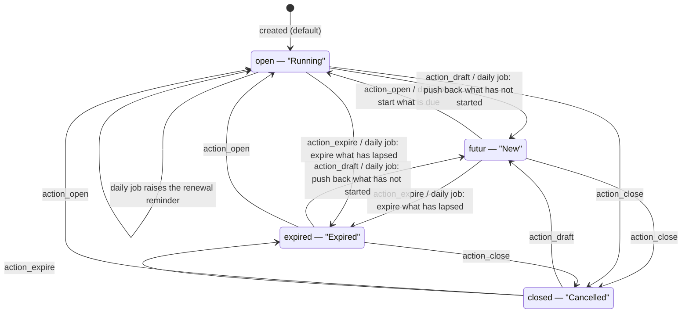
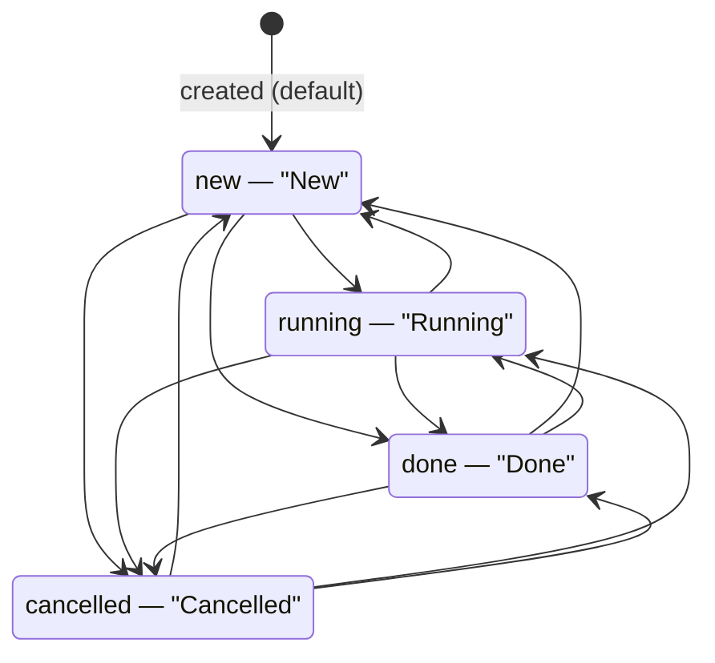
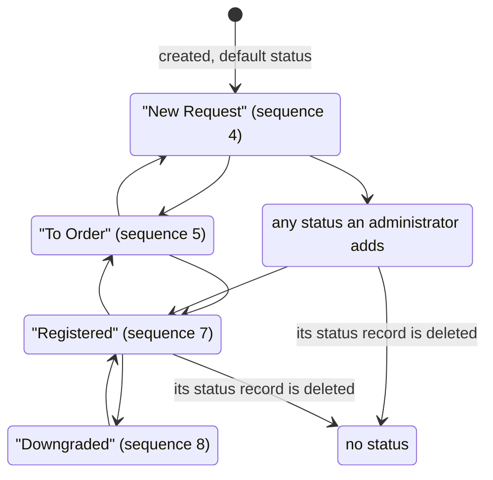
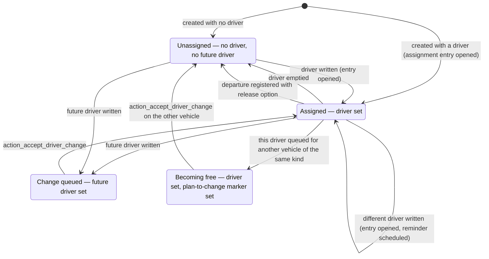
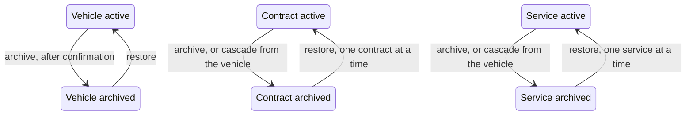

# State machines

This file specifies every state-carrying field of the fleet domain: the stored values it may hold, the label and meaning of each, every transition with its origin, destination, triggering operation, guard conditions and side effects, and a diagram of each machine. It also specifies the two pipelines that are *not* fixed machines — the vehicle status and the driver assignment — and says exactly what replaces a fixed machine in each case.

Five machines are described:

| Machine | Entity | Field | Kind |
|---|---|---|---|
| [M1](#m1-the-vehicle-contract-lifecycle) — Vehicle Contract lifecycle | `fleet.vehicle.log.contract` | `state` | Closed selection of four values |
| [M2](#m2-the-vehicle-service-progress) — Vehicle Service progress | `fleet.vehicle.log.services` | `state` | Closed selection of four values |
| [M3](#m3-the-vehicle-status-pipeline) — Vehicle status pipeline | `fleet.vehicle` | `state_id` | Open pipeline over configurable records |
| [M4](#m4-the-driver-assignment-machine) — Driver assignment | `fleet.vehicle` | `driver_id`, `future_driver_id`, `plan_to_change_car`, `plan_to_change_bike` | Derived machine over four fields |
| [M5](#m5-the-archive-machine) — Archive | `fleet.vehicle`, `fleet.vehicle.log.contract`, `fleet.vehicle.log.services`, `fleet.vehicle.model`, `fleet.vehicle.model.brand` | `active` | Two-state machine with a downward cascade |

A sixth field, `contract_state` on the Vehicle, looks like a state but is not one: it is a derived mirror of the state of the contract with the latest expiry. It is specified in section [M6](#m6-the-derived-contract-state-of-a-vehicle) for completeness.

---

## M1: the Vehicle Contract lifecycle

### M1.1 States

| Stored value | Label | Meaning |
|---|---|---|
| `futur` | "New" | Coverage has not begun. The start date is in the future. The contract contributes no recurring cost to a month before its start. |
| `open` | "Running" | Coverage is in force. Today falls on or after the start date and on or before the expiration date, or the expiration date is empty. This is the only state in which the daily job raises a renewal reminder. |
| `expired` | "Expired" | Coverage has lapsed. Today is after the expiration date. The contract still counts as an outstanding obligation for the purposes of the vehicle's overdue flag. |
| `closed` | "Cancelled" | The agreement was cancelled or superseded. A cancelled contract is excluded from every renewal computation, from the vehicle's contract counter and from the vehicle's derived contract state. |

The default at creation is `open`. That is deliberate: most contracts are entered while they are already in force. A contract entered with a start date in the future stays `open` until either its dates are written again or the daily job runs; see the transitions below.

The state is not carried into a duplicate, so duplicating a cancelled contract yields a running one.

### M1.2 Transition table

| # | From | To | Trigger | Guards, in order | Records created or changed |
|---|---|---|---|---|---|
| T1.1 | `futur`, `open`, `expired` | `closed` | The operation `action_close`, reached from the status bar of the contract form | None. The operation is unconditional. | The contract's `state` becomes `closed`. The change is written to the discussion thread under the tracking subtype. Every vehicle that owns the contract re-derives `contract_count`, `contract_renewal_due_soon`, `contract_renewal_overdue` and `contract_state`, because a cancelled contract is excluded from all four. |
| T1.2 | `open`, `expired`, `closed` | `futur` | The operation `action_draft`, reached from the status bar | None. | The contract's `state` becomes `futur`, logged in the thread. `days_left` becomes minus one and `expires_today` becomes false, because both are defined only for `open` and `expired`. |
| T1.3 | `futur`, `expired`, `closed` | `open` | The operation `action_open`, reached from the status bar | None. | The contract's `state` becomes `open`, logged in the thread. `days_left` and `expires_today` are re-derived from the expiration date. |
| T1.4 | `futur`, `open`, `closed` | `expired` | The operation `action_expire`, reached from the status bar | None. | The contract's `state` becomes `expired`, logged in the thread. |
| T1.5 | any state other than `closed` | `futur` | Writing `start_date` or `expiration_date` on the contract | The contract must have a start date; a contract with no start date is left untouched. The contract must not be `closed`. Today must be strictly earlier than the start date. | After the write of the dates has been applied, the contract's `state` becomes `futur` through T1.2. |
| T1.6 | any state other than `closed` | `open` | Writing `start_date` or `expiration_date` on the contract | The contract must have a start date and must not be `closed`. Either the contract has no expiration date, or today falls on or after the start date and on or before the expiration date. | The contract's `state` becomes `open` through T1.3. |
| T1.7 | any state other than `closed` | `expired` | Writing `start_date` or `expiration_date` on the contract | The contract must have a start date and must not be `closed`. Today must be after the expiration date, and the expiration date must be present. | The contract's `state` becomes `expired` through T1.4. |
| T1.8 | `open`, `futur` | `expired` | The daily job, step "expire what has lapsed" | The contract's state must not already be `expired` and must not be `closed`. The expiration date must be strictly earlier than today. | The contract's `state` becomes `expired`, logged in the thread. |
| T1.9 | `open`, `expired` | `futur` | The daily job, step "push back what has not started" | The contract's state must not already be `futur` and must not be `closed`. The start date must be strictly later than today. | The contract's `state` becomes `futur`, logged in the thread. |
| T1.10 | `futur` | `open` | The daily job, step "start what is due" | The contract's state must be exactly `futur`. The start date must be earlier than or equal to today. | The contract's `state` becomes `open`, logged in the thread. |
| T1.11 | `open` | `open` (no state change) | The daily job, step "remind about what is about to lapse" | The contract's state must be exactly `open`. The expiration date must be strictly earlier than today plus the configured alert delay. The contract must have a responsible user. The contract must not already carry an activity of the renewal type. | One activity of the renewal type is created on the contract, with its deadline set to the contract's expiration date and its responsible user set to the contract's responsible user. |
| T1.12 | any | unchanged | Writing `expiration_date` or `user_id` with a non-empty value | The contract must carry an activity of the renewal type; when it does not, nothing happens. | The existing renewal activity's deadline is set to the new expiration date and its responsible user to the new responsible user. No second activity is created. |

**The order of the four job steps matters.** The job performs them in exactly this order: reminders (T1.11), then expiry (T1.8), then push-back (T1.9), then start (T1.10). A consequence worth stating: a contract whose start date is in the future and whose expiration date is in the past — an impossible agreement, but one a user can type — is first expired by T1.8 and then pushed back to `futur` by T1.9 in the same run, and it oscillates on every subsequent run. That is a **compatibility finding**, recorded in [business-rules.md](business-rules.md) as FLT-C12; a corrected behaviour would refuse an expiration date earlier than the start date at write time.

**The write-driven transitions are evaluated after the write.** T1.5 through T1.7 read the dates as they are *after* the change, so writing both dates at once is evaluated against the new pair. They fire only when at least one of the two dates appears in the write; writing only the state, the amount or the frequency does not re-evaluate anything.

**A cancelled contract is inert under both the write-driven transitions and the job.** Every one of T1.5 through T1.10 excludes `closed`. A cancelled contract can only leave that state through T1.2, T1.3 or T1.4, all of which are explicit operations a user invokes.

### M1.3 Guards and their refusal messages

None of the four operations has a guard, and none of them can refuse. There is therefore no refusal message on this machine. What the machine does have is a set of *silent* no-operations, which a rebuild must reproduce exactly:

| Condition | Observed behaviour |
|---|---|
| `action_close` invoked on an already cancelled contract | The state is written again to the same value; the tracking layer records no change because the value did not change. |
| A date written on a cancelled contract | The state is not re-evaluated; the contract stays cancelled. |
| A date written on a contract with no start date | The state is not re-evaluated at all, whatever the expiration date says. |
| The expiration date written on a contract that has no renewal activity | No activity is created and none is rescheduled. |
| The expiration date written as an empty value | The rescheduling step is skipped, because it fires only on a non-empty value. The state re-evaluation still fires, and an empty expiration date with a start date on or before today yields `open`. |

### M1.4 Diagram

---

## M2: the Vehicle Service progress

### M2.1 States

| Stored value | Label | Meaning |
|---|---|---|
| `new` | "New" | The work has been recorded but not started. This is the state a service created by hand starts in, and the state a service created from a posted vendor bill starts in. |
| `running` | "Running" | The work is under way. |
| `done` | "Done" | The work is finished. |
| `cancelled` | "Cancelled" | The work was abandoned. A cancelled service is excluded from the service half of the Fleet Analysis Report. |

The default at creation is `new`. Grouping a list or a board by this field expands to all four values even when a value has no record, so an empty column still appears on the board.

### M2.2 Transition table

Every transition of this machine is a direct write of the field. The system declares no guard on any of them and no operation named after any of them: the status bar on the service form is clickable, and dragging a card between board columns writes the field. The machine is therefore fully connected — any state may be reached from any other.

| # | From | To | Trigger | Guards | Records created or changed |
|---|---|---|---|---|---|
| T2.1 | any | `new` | Clicking "New" on the status bar; dragging the card into the New column; a direct write | None | The service's `state` becomes `new`; the change is logged in the discussion thread. |
| T2.2 | any | `running` | Clicking "Running"; dragging into the Running column; a direct write | None | The service's `state` becomes `running`; logged in the thread. |
| T2.3 | any | `done` | Clicking "Done"; dragging into the Done column; a direct write | None | The service's `state` becomes `done`; logged in the thread. |
| T2.4 | any | `cancelled` | Clicking "Cancelled"; dragging into the Cancelled column; a direct write | None | The service's `state` becomes `cancelled`; logged in the thread. The service stops contributing to the service half of the Fleet Analysis Report the next time that set is derived. |

### M2.3 What the state does and does not affect

- It **does** decide whether the service contributes to the Fleet Analysis Report: only services that are not `cancelled` are counted, and only services whose archive flag is set.
- It **does** decide how the row is coloured in the list: `done` is shown in the success colour, `new` in the warning colour, `running` in the information colour, and `cancelled` in neither.
- It **does not** lock any field. A `done` service can still have its cost, date, vendor or vehicle changed, subject only to the billed-service rules of [business-rules.md](business-rules.md).
- It **does not** interact with the odometer link, the vehicle's counters or the vehicle's service-activity indicator. That indicator is derived from the *activities* scheduled on services, not from this field.

### M2.4 Diagram

---

## M3: the vehicle status pipeline

### M3.1 Why this is not a closed machine

The Vehicle has no selection field describing its progress. Instead it points at a Vehicle Status record, and Vehicle Statuses are ordinary configuration records an administrator creates, renames, reorders, folds and deletes. There is consequently no fixed set of stored values, no fixed set of transitions and no guard anywhere: any status may follow any other, and the change is a plain write of the reference.

A rebuild must reproduce that openness. Hard-coding the shipped statuses as a selection would break every installation that has added one.

### M3.2 The statuses shipped with the system

Four statuses are shipped as part of the ordinary installation. They are ordinary records: renaming or deleting one is permitted, and no rule refers to any of them by name except the two noted below.

| External identifier | Name | Sequence | Role |
|---|---|---|---|
| `fleet_vehicle_state_new_request` | "New Request" | 4 | The default status of a newly created vehicle, and one of the two statuses that suppress the plan-to-change marking when a future driver is set. |
| `fleet_vehicle_state_to_order` | "To Order" | 5 | A vehicle that has been approved and must now be ordered. |
| `fleet_vehicle_state_registered` | "Registered" | 7 | A vehicle that has been delivered and registered. |
| `fleet_vehicle_state_downgraded` | "Downgraded" | 8 | A vehicle that has been moved to a lower class or taken out of its original assignment. |

Three further statuses — "Ordered" at sequence 6, "Reserve" at sequence 9 and "Waiting List" at sequence 10 — exist only in the demonstration data set. The gaps at sequences 6, 9 and 10 in the shipped list are exactly those three.

The "Waiting List" status is referenced by name in two of the driver-assignment rules. Because it is not shipped outside the demonstration data, those references resolve to nothing on an ordinary installation, and both rules are written to tolerate that; the consequences are set out in M4.3. This is **compatibility finding** FLT-C02 in [business-rules.md](business-rules.md).

### M3.3 Transition table

| # | From | To | Trigger | Guards | Records created or changed |
|---|---|---|---|---|---|
| T3.1 | no status | any status | Creating a vehicle without naming a status | None | `state_id` is set to the status identified as `fleet_vehicle_state_new_request`, when that record exists; otherwise it is left empty. |
| T3.2 | any status or none | any status | Clicking a segment of the status bar on the vehicle form; dragging the vehicle card between board columns; a direct write; a multiple-record edit from the list | None | `state_id` is written. The change is logged in the discussion thread, because the field is tracked. |
| T3.3 | a status | no status | Deleting the Vehicle Status record | None | `state_id` is emptied on every vehicle that pointed at the deleted status. The deletion is not blocked. |

### M3.4 Diagram

The arrows above show the ordinary progression and the deletion path. They are not guards: every pair of statuses is reachable in both directions.

---

## M4: the driver assignment machine

### M4.1 The state of an assignment

A vehicle's assignment is described by four fields taken together, and by the driver assignment entries the vehicle has accumulated:

| Field | Meaning in the machine |
|---|---|
| `driver_id` | Who drives it now. |
| `future_driver_id` | Who is queued to drive it next. |
| `plan_to_change_car` | Set on a **car** whose current driver has been queued to receive a different car, meaning this car will soon be free. |
| `plan_to_change_bike` | The same marker for a **bicycle**. |

The named states of the machine are the meaningful combinations:

| Named state | `driver_id` | `future_driver_id` | Plan-to-change marker | Meaning |
|---|---|---|---|---|
| Unassigned | empty | empty | clear | The vehicle is free and nobody is queued for it. |
| Assigned | set | empty | clear | The vehicle is driven and is not going to change hands. |
| Change queued | set or empty | set | clear on this vehicle | Somebody is queued to take the vehicle. The button "Apply New Driver" appears on the form. |
| Becoming free | set | empty | set | The current driver of this vehicle has been queued for a *different* vehicle of the same kind, so this one will shortly be available. |
| Unassigned, previously marked | empty | empty | set | The plan-to-change marker survives on a vehicle whose driver was cleared by any path other than the apply operation. |

### M4.2 Transition table

| # | From | To | Trigger | Guards, in order | Records created or changed |
|---|---|---|---|---|---|
| T4.1 | Unassigned | Assigned | Creating a vehicle with a driver in the supplied values | The supplied values must name a driver. | One driver assignment entry is created with the vehicle, the supplied driver and a start date of today. No end date is set. No reminder activity is scheduled, because the vehicle had no previous driver. |
| T4.2 | Assigned | Assigned, with a different driver | Writing a new, non-empty driver onto the vehicle | The written driver must differ from the vehicle's current driver. | One driver assignment entry is created with the vehicle, the new driver and a start date of today. Because the vehicle had a driver, one activity of the generic to-do kind is also scheduled, assigned to the vehicle's fleet manager when it has one and to the acting user when it does not, carrying the note "Specify the End date of %s" where the placeholder is replaced by the name of the **previous** driver. The previous driver's own assignment entry is *not* closed automatically; the activity is what asks a human to close it. |
| T4.3 | Unassigned | Assigned | Writing a non-empty driver onto a vehicle with none | The written driver must differ from the vehicle's current driver, which is trivially true when there is none. | One driver assignment entry is created as in T4.2. No activity is scheduled. |
| T4.4 | Assigned | Unassigned, previously marked, or Unassigned | Writing an empty driver onto the vehicle | None. | `driver_id` becomes empty. No assignment entry is created, because the rule that creates one fires only on a non-empty driver. No entry is closed. |
| T4.5 | Assigned or Unassigned | Change queued | Writing a non-empty future driver onto the vehicle | The vehicle's status, taken from the write when it is being written and from the record otherwise, must be neither the "Waiting List" status nor the "New Request" status. When the "Waiting List" status does not exist at all, the whole guard is skipped and every vehicle qualifies — see M4.3. | `future_driver_id` is set. The set of vehicle kinds of the qualifying vehicles is collected. Every *other* vehicle whose driver is the incoming future driver and whose kind is in that set receives its plan-to-change marker: `plan_to_change_car` for a car, `plan_to_change_bike` for a bicycle. Those other vehicles move to "Becoming free". |
| T4.6 | Unassigned | Change queued | Creating a vehicle with a future driver in the supplied values | The "Waiting List" status must either not exist, or differ from the status named in the supplied values. The supplied values must also name a vehicle kind. | Every existing vehicle whose driver is that future driver and whose kind matches the supplied kind receives its plan-to-change marker. Because the vehicle kind is a mirrored, read-only field that a creation call does not normally supply, this branch is effectively unreachable from a screen; see **compatibility finding** FLT-C03. |
| T4.7 | Change queued | Assigned, with the queued driver | The operation `action_accept_driver_change`, reached from the "Apply New Driver" button on the vehicle form | The button is shown only when a future driver is set. The operation reads the vehicle kind of the record it is invoked on, so it operates on one vehicle at a time. | Three things happen, in order. First, every vehicle whose driver is one of the future drivers of the selection and whose kind equals the selection's kind is found; on all of them `driver_id` is emptied and both plan-to-change markers are cleared. Second, for the vehicle itself both plan-to-change markers are cleared. Third, `driver_id` is set to `future_driver_id` and `future_driver_id` is emptied. Because the third step writes a non-empty driver, T4.2 also fires: a new assignment entry is created and — when the vehicle already had a driver — the end-date reminder activity is scheduled. |
| T4.8 | Becoming free | Assigned | The operation `action_accept_driver_change` invoked on the *other* vehicle | As T4.7. | The marked vehicle's `driver_id` is emptied and both markers are cleared, by the first step of T4.7. |
| T4.9 | Assigned | Unassigned | Registering the departure of the employee who drives the vehicle, with the release option set | The departure assistant's release option must be set. | Every assignment entry whose driver is one of the leaver's contacts and whose end date is empty or later than the departure date has its end date set to the departure date. Every vehicle whose driver is one of those contacts has `driver_id` and `driver_employee_id` emptied. See [workflows.md](workflows.md), procedure W-16. |
| T4.10 | Assigned | Assigned, with a different driver contact | Writing a new work contact onto the Employee who is the vehicle's driver Employee | The employee's new work contact must differ from the old one. | The vehicle's `driver_id` is rewritten to the new contact. Because that is a non-empty driver write, T4.2 fires as well: a new assignment entry opens and the end-date reminder is scheduled. |
| T4.11 | Change queued | Change queued, with a different future driver contact | Writing a new work contact onto the Employee who is the vehicle's future driver Employee | As T4.10. | The vehicle's `future_driver_id` is rewritten to the new contact, and T4.5 fires again with the new contact. |
| T4.12 | Assigned | Assigned | Writing a driver Employee onto the vehicle | None. | The synchronisation rule rewrites the supplied values so that `driver_id` becomes that employee's work contact, or becomes empty when the employee has none. When the *previous* driver Employee differs from the one being written, the previous driver contact and the previous employee's user contact are both removed from the vehicle's follower list. |
| T4.13 | Assigned | Assigned | Writing a driver contact onto the vehicle, with the people bridge installed | Exactly one Employee must have that contact as work contact; when none or more than one does, the driver Employee is emptied instead. | The synchronisation rule adds `driver_employee_id` to the values being written. |

### M4.3 What happens when the "Waiting List" status is absent

Both T4.5 and T4.6 look up the "Waiting List" status by name. On an ordinary installation that record does not exist. The two rules behave differently in that case, and both behaviours must be reproduced:

- In **T4.6**, the guard reads "the waiting-list status does not exist, **or** it is not the status named in the supplied values". With the record absent the first half is true, so every vehicle qualifies.
- In **T4.5**, the guard reads "the waiting-list status does not exist, **or** the vehicle's status is neither the waiting-list status nor the new-request status". With the record absent the first half is true, so the new-request exclusion is skipped as well: a vehicle sitting in "New Request" *does* mark its future driver's other vehicles.

The net effect on an ordinary installation is that neither exclusion applies. On an installation that has added a status named as the waiting list, both exclusions apply. A rebuild should implement the guard as written, because the difference is observable.

### M4.4 Guards and refusal messages

This machine refuses nothing. There is no message on any transition. What it does instead is create records silently: an assignment entry on every non-empty driver write, and a reminder activity on every driver replacement.

### M4.5 Diagram

---

## M5: the archive machine

### M5.1 States

Five entities of this domain carry an archive flag: Vehicle, Vehicle Contract, Vehicle Service, Vehicle Model and Vehicle Manufacturer. Each has two states.

| Stored value | Label | Meaning |
|---|---|---|
| true | "Active" | The record is in the working set. It appears in every list, board and reference field by default. |
| false | Archived | The record is hidden from every default search. It is reachable through the "Archived" filter each of the five search views offers. |

### M5.2 Transition table

| # | Entity | From | To | Trigger | Guards | Records created or changed |
|---|---|---|---|---|---|---|
| T5.1 | Vehicle | active | archived | The archive entry of the record's action menu | The desktop client first shows a confirmation dialogue whose body is exactly "Every service and contract of this vehicle will be considered as archived. Are you sure that you want to archive this record?", with a confirm and a cancel choice. The archive proceeds only on confirm. | The vehicle's `active` becomes false. Every contract of the vehicle, whatever its state or its current archive flag, has `active` set to false. Every service of the vehicle, likewise. The vehicle's `service_count` and `contract_count` are re-derived, and because they now match the archived side they report the counts of the archived records. |
| T5.2 | Vehicle | archived | active | The restore entry of the action menu | None; no dialogue is shown. | The vehicle's `active` becomes true. **Its contracts and services are not restored.** They must each be restored on their own. |
| T5.3 | Vehicle Contract | active | archived | The archive entry of the contract's action menu, or the cascade of T5.1 | None. | `active` becomes false. The contract disappears from the vehicle's counter, because the counter compares archive flags. |
| T5.4 | Vehicle Contract | archived | active | The restore entry | None. | `active` becomes true. |
| T5.5 | Vehicle Service | active | archived | The archive entry, or the cascade of T5.1 | None. | `active` becomes false. The service stops contributing to the Fleet Analysis Report, which counts only services whose archive flag is set. |
| T5.6 | Vehicle Service | archived | active | The restore entry | None. | `active` becomes true. |
| T5.7 | Vehicle Model | active | archived | The archive entry | None. | `active` becomes false. The model stops being offered when creating a vehicle. Existing vehicles of that model are untouched. Its manufacturer's `model_count` is re-derived and drops by one. |
| T5.8 | Vehicle Model | archived | active | The restore entry | None. | `active` becomes true; the manufacturer's `model_count` rises by one. |
| T5.9 | Vehicle Manufacturer | active | archived | The archive entry offered on the manufacturer card menu | None. | `active` becomes false. The manufacturer stops being offered when creating a model. |
| T5.10 | Vehicle Manufacturer | archived | active | The restore entry offered on the manufacturer card menu | None. | `active` becomes true. |

### M5.3 Diagram

---

## M6: the derived contract state of a vehicle

`contract_state` on the Vehicle is not written by anybody. It mirrors the state of one particular contract: the contract with the **greatest expiration date** among the vehicle's contracts that have an expiration date and are not cancelled. It therefore takes the same four stored values as M1, with different labels:

| Stored value | Label on the vehicle | Label on the contract |
|---|---|---|
| `futur` | "Incoming" | "New" |
| `open` | "In Progress" | "Running" |
| `expired` | "Expired" | "Expired" |
| `closed` | "Closed" | "Cancelled" |

The value `closed` is declared in the selection but can never be produced, because cancelled contracts are excluded from the derivation. It exists so that the field can display a label should a stored value of `closed` ever reach it. When the vehicle has no contract with an expiration date, the field holds the **empty text** rather than an empty reference; a rebuild must reproduce that, because a client that expects one of the four values will otherwise show nothing at all rather than a blank.

The derivation runs whenever the vehicle's contract collection changes, and it produces `contract_renewal_due_soon` and `contract_renewal_overdue` in the same pass. All three formulas are in [calculations.md](calculations.md).

---

## Cross-machine interactions

1. **Archiving a vehicle does not change any contract state.** A running contract on an archived vehicle stays running, and the daily job still moves it to expired when its date passes, because the job searches contracts without filtering on the archive flag. A rebuild that filters the job on active contracts would diverge.
2. **Cancelling a contract changes the vehicle's derived state.** Because cancelled contracts are excluded, cancelling the contract with the latest expiry promotes the next one, which may flip the vehicle's overdue flag.
3. **The service progress and the archive flag are independent.** A cancelled service and an archived service are different things; the Fleet Analysis Report requires *both* that the service is not cancelled and that it is active.
4. **The driver assignment machine and the status pipeline touch only at the guard of T4.5 and T4.6**, where two specific statuses suppress the plan-to-change marking.
5. **Applying a driver change fires the ordinary driver-write transitions.** A rebuild must not implement the apply operation as a direct database write that skips them, or the assignment entry and the end-date reminder will be missing.
