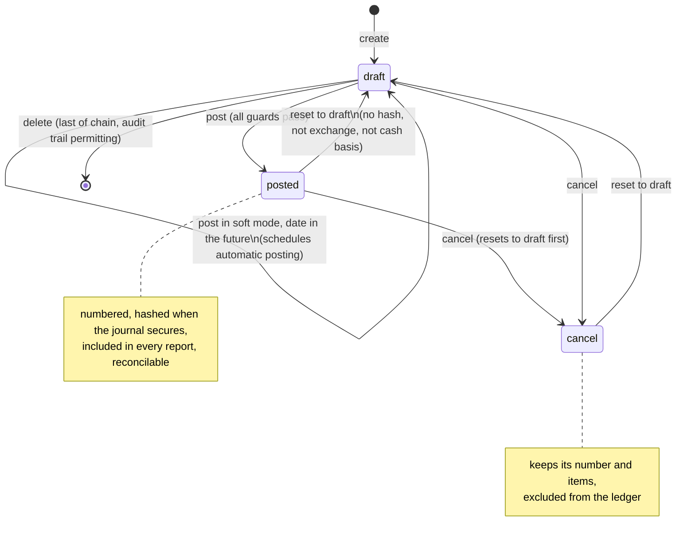
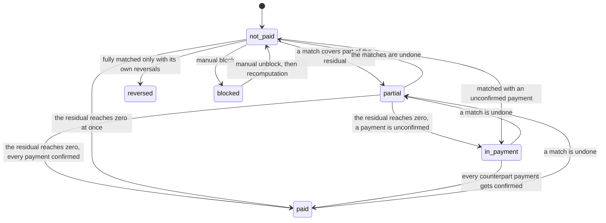
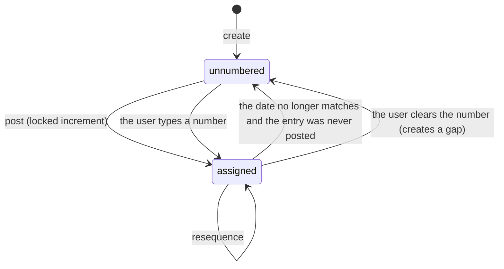
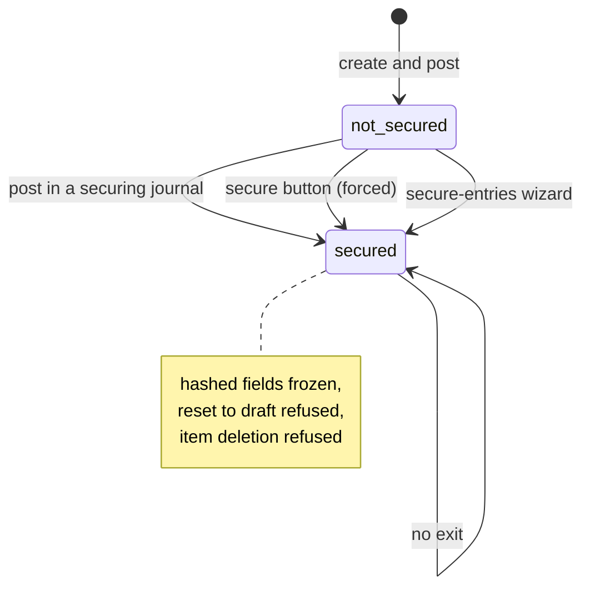
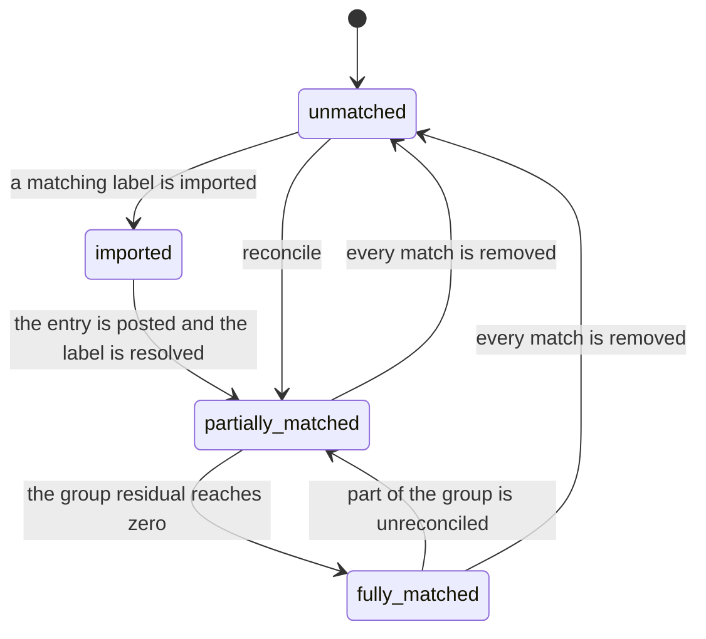
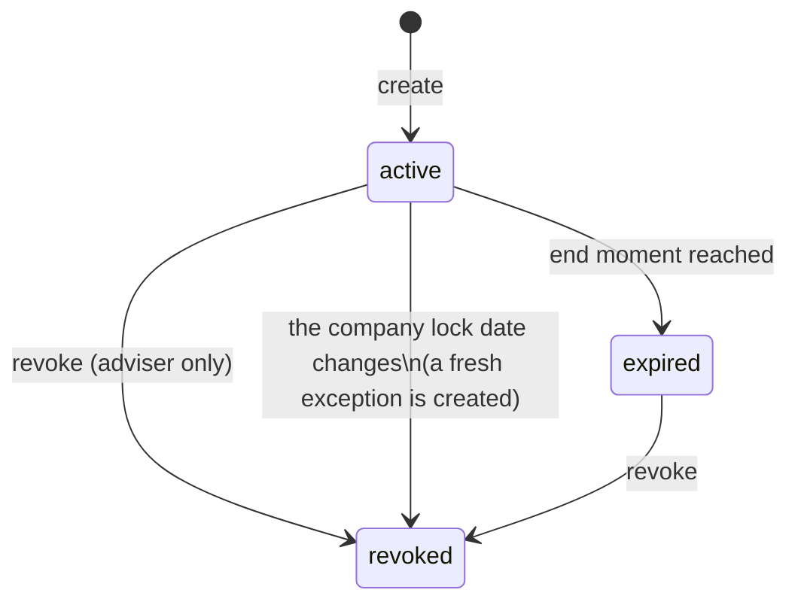
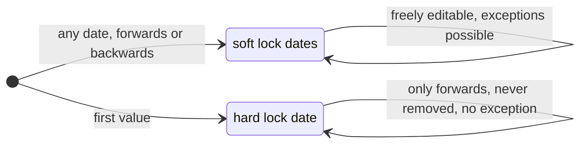

# General Ledger — State Machines

This document specifies every state-bearing field of the domain: the states with their stored value, their label and their meaning; the transitions with their trigger, their guard conditions and their side effects; and a diagram for each machine.

Contents:

1. [Journal Entry state](#1-journal-entry-state)
2. [Journal Entry payment status](#2-journal-entry-payment-status)
3. [Journal Entry merged display status](#3-journal-entry-merged-display-status)
4. [Journal Entry numbering lifecycle](#4-journal-entry-numbering-lifecycle)
5. [Journal Entry securing (hash) lifecycle](#5-journal-entry-securing-hash-lifecycle)
6. [Journal Entry automatic posting lifecycle](#6-journal-entry-automatic-posting-lifecycle)
7. [Journal Item reconciliation status](#7-journal-item-reconciliation-status)
8. [Lock Exception state](#8-lock-exception-state)
9. [Account activity state](#9-account-activity-state)
10. [Company lock-date progression](#10-company-lock-date-progression)

---

## 1. Journal Entry state

The field is `state`. It is required, read-only to the user (it is only changed by the operations below), not copied, tracked in the audit trail, and defaults to `draft`.

### States

| Value | Label | Meaning |
|---|---|---|
| `draft` | Draft | The document is being prepared. It has no definitive number (or it kept the number of a previous posting). Its items are freely editable. It does **not** appear in the ledger, in the trial balance or in any financial report. |
| `posted` | Posted | The document is part of the ledger. It has a number. Its items are frozen except for a few non-legal fields. It is included in every report and may be reconciled. |
| `cancel` | Cancelled | The document is void. It is not part of the ledger. It keeps its number and its items so that the audit trail stays complete, and it can be sent back to draft. |

### Transitions

| From | To | Trigger operation | Guard conditions | Side effects |
|---|---|---|---|---|
| — | `draft` | Create | Creating a record already in the posted state is refused | The entry is numbered `/` unless the caller supplied a number |
| `draft` | `posted` | Post | see the full guard list below | see the full side-effect list below |
| `draft` | `draft` | Post with soft mode when the date is in the future | The entry date is after today | The automatic posting mode is switched to "At Date" when it was "No", and a message is logged: "This move will be posted at the accounting date: *the date*" |
| `posted` | `draft` | Reset to draft | The entry is not an exchange-difference entry; is not a cash-basis entry and has never been one; carries no hash; is not waiting for an approved cancellation | Analytic lines are deleted; the sending data is cleared; the next draft occurrence of a recurrence is deleted; specified attachments are detached; the lock dates and the tax lock date are re-checked |
| `posted` | `cancel` | Cancel | Same guards as the reset to draft, because cancelling first resets to draft | The reconciliations of the items are undone; the linked payments become cancelled; the automatic posting mode is set to "No" |
| `cancel` | `draft` | Reset to draft | Same guards | Same side effects |
| `cancel` | `posted` | — | **Not possible directly.** A cancelled entry must be reset to draft first | — |
| `draft` | `cancel` | Cancel | none beyond being draft | The reconciliations of the items are undone; the linked payments become cancelled; the automatic posting mode is set to "No" |
| `draft` | deleted | Delete | The entry must be the last of its numbering chain unless the acting user is an accountant, the company is in quick-encoding mode, or deletion is forced; the entry must never have been posted when the company keeps a restrictive audit trail; no item may belong to a hashed entry | The reconciliations are undone, the items are deleted, the gap flags of the neighbouring entries are updated |
| `posted` | deleted | Delete | Same as above, plus the items may not be deleted while the entry is posted | The entry must be reset to draft first in practice |

### Guards of the posting transition

Posting a set of entries collects **all** violations and raises them together, one message per line. The checks, in order:

1. **Permission.** The acting user must belong to the invoicing group. Otherwise: "You don't have the access rights to post an invoice."
2. For invoice-like documents only: the quick-encoding total must match, the recipient bank account must be active and trusted, the total must not be negative, the counterpart must be set, and the document date must be known for a purchase document. These are specified in `../accounts-receivable/` and `../accounts-payable/`.
3. **Account and journal coherence** of every item: the account must be active (unless the item was captured automatically or the check is explicitly skipped), and an account that forces a currency must be used with that currency.
4. **State.** The entry must be draft: "The entry *the number* (id *the identifier*) must be in draft."
5. **Content.** At least one accountable item must exist: "Even magicians can't post nothing!"
6. **Future date in hard mode.** When soft mode is off and the entry is scheduled for automatic posting with a future date: "This move is configured to be auto-posted on *the date*".
7. **Journal.** The journal must be active: "You cannot post an entry in an archived journal (*the journal name*)".
8. **Currency.** The document currency must be active: "You cannot validate a document with an inactive currency: *the currency name*".
9. **Accounts active.** No item may use an archived account: "A line of this move is using a archived account, you cannot post it."
10. **Account ownership.** Every account must belong to the company of the entry or to one of its ancestors: "The entry is using accounts (*the account display names*) from a different company."
11. **Analytic accounts.** No item may distribute to an archived analytic account: "You cannot post an entry with an archived analytic account: *the names*".
12. **Balance.** Enforced independently at every write: the sum of the balances of the items, rounded to the company-currency precision, must be zero. Otherwise "The entry is not balanced." for a single entry, or "The following entries are unbalanced:" followed by one indented number per entry.
13. **Lock dates.** Not a refusal but a shift: see the side effects.

### Side effects of the posting transition

In order:

1. **Soft mode split.** In soft mode, entries dated after today are not posted; they receive the automatic posting mode "At Date" when they had none and a message is logged. The remaining entries proceed.
2. **Accounting date shift.** For every entry, the violated lock dates are computed for its accounting date and its tax involvement. When there is at least one, the accounting date is recomputed through the accounting-date rule of `calculations.md`, which moves the entry to the first open period.
3. **Analytic lines.** The analytic lines of every item are created.
4. **Recurrence.** Entries whose automatic posting mode is monthly, quarterly or yearly produce the next occurrence, unless an occurrence already exists at that date or the recurrence has passed its end date.
5. **Partner coherence.** On an invoice-like document, every accountable item whose partner differs from the commercial entity of the document is corrected.
6. **Related draft entries.** For every match in which an item of the entry takes part, the counterpart exchange-difference entry and the counterpart cash-basis entry are added to the set to post, unless the source document changed since the match was made, in which case the match is deleted so that the user redoes it.
7. **State write.** The state becomes posted and the "posted before" flag becomes true. Writing the state to posted is what triggers the numbering (through the number computation) and then the hashing.
8. **Numbering.** Entries whose number is still empty and whose date is known receive the next number of their chain. See section 4.
9. **Hashing.** After the write, the securing routine runs on the posted entries. See section 5.
10. **Reversal reconciliation.** A posted entry that reverses an already posted entry is reconciled with it, account by account and currency by currency, receivable and payable accounts first.
11. **Imported matching numbers.** Items carrying a matching number imported from another system are turned into real reconciliations.
12. **Counterpart ranking.** Every partner of a sale document, or of a receivable item of a plain entry, has its customer rank increased; every partner of a purchase document, or of a payable item, has its supplier rank increased.
13. **Zero-total documents.** An invoice-like document whose total is zero immediately triggers the "paid" follow-up hook.

### Guards of the reset-to-draft transition

1. Every entry must be posted or cancelled: "Only posted/cancelled journal entries can be reset to draft."
2. No entry may require an approved cancellation: "You can't reset to draft those journal entries. You need to request a cancellation instead."
3. No entry may be the exchange-difference entry of a match: "You cannot reset to draft an exchange difference journal entry."
4. No entry may be a cash-basis entry, either currently linked to a match or historically created from a document: "You cannot reset to draft a tax cash basis journal entry."
5. No entry may carry a hash: "You cannot reset to draft a locked journal entry."
6. When the entry is marked reviewed and the acting user is not allowed to review, the write is refused: "Validated entries can only be changed by your accountant."
7. The lock dates and the tax lock date are re-checked, because leaving the posted state modifies a locked period.

### Guards of the cancel transition

Cancelling first resets every posted entry to draft, so the reset guards apply. Then every entry must be draft: "Only draft journal entries can be cancelled."

### Diagram



---

## 2. Journal Entry payment status

The field is `payment_state`. It is computed and stored, read-only, not copied, tracked. It applies to invoice-like documents; every other document reports "Not Paid" unless it was manually blocked.

### States

| Value | Label | Meaning |
|---|---|---|
| `not_paid` | Not Paid | No amount has been matched |
| `partial` | Partially Paid | Part of the amount has been matched; a residual remains |
| `in_payment` | In Payment | The residual is zero but at least one counterpart payment has not itself been confirmed against a bank transaction |
| `paid` | Paid | The residual is zero and every counterpart payment is confirmed |
| `reversed` | Reversed | The residual is zero and the only counterparts are reversal documents of the matching family |
| `blocked` | Blocked | Set manually; the document is excluded from chasing |
| `invoicing_legacy` | Invoicing App Legacy | A frozen value carried by documents imported from a stand-alone invoicing installation; never produced |

### Qualification

A document is evaluated only when it is an invoice-like document **and** it is posted, or it is draft with a non-zero total. Everything else is forced to "Not Paid". A document already in the blocked or the legacy status keeps it until it is explicitly changed.

### Computation

1. Collect, for every receivable or payable item of the document, the matches in which that item participates with a counterpart item belonging to a **different** entry. For each such group record: whether any counterpart is a payment, whether any counterpart is a bank transaction, whether **all** counterparts that are payments are themselves matched with a bank transaction, and the set of counterpart document types.
2. If the residual of the document is zero at the precision of the document currency:
   - When at least one counterpart is a payment or a bank transaction: the status is "Paid" if every counterpart payment is matched, otherwise "In Payment".
   - When there is no payment and no bank transaction among the counterparts: the status is "Paid", unless the counterpart types are exactly the reversal family of the document type, in which case it is "Reversed". The reversal families are: a vendor bill or purchase receipt whose counterparts are only vendor credit notes (optionally together with plain entries); a customer invoice or sales receipt whose counterparts are only customer credit notes (optionally together with plain entries); a plain entry or either credit note whose counterparts are only plain entries.
3. Otherwise, if the document is posted and at least one attached payment has no journal entry of its own and is "in process", the status is "In Payment".
4. Otherwise, if at least one match exists, the status is "Partially Paid".
5. Otherwise, if the document is posted and at least one attached payment has no journal entry of its own and is "paid", the status is "In Payment".
6. Otherwise the status is "Not Paid".

### Manual transitions

| From | To | Trigger | Guard |
|---|---|---|---|
| any except paid and in payment | `blocked` | The "block payment" toggle | Refused for a paid or in-payment document: "You can't block a paid invoice." |
| `blocked` | recomputed | The same toggle | The status is reset to "Not Paid" and immediately recomputed |

### Diagram



---

## 3. Journal Entry merged display status

The field is `status_in_payment`. It is computed, not stored, not copied. It exists so that one column can show a single meaningful state to a non-accountant.

| Document state | Payment status | Displayed value |
|---|---|---|
| posted | partial, in payment, paid, reversed or blocked | the payment status itself |
| posted | anything else, and the document was sent | `sent` (Sent) |
| posted | anything else, not sent | `posted` (Posted) |
| draft | partial, in payment, paid or blocked | the payment status itself |
| draft | anything else | `draft` (Draft) |
| cancelled | any | `cancel` (Cancelled) |

---

## 4. Journal Entry numbering lifecycle

The number is not a state field, but it goes through a well-defined lifecycle that behaves like one.

### Number states

| Situation | Value of the number | Meaning |
|---|---|---|
| Never numbered | `/` or empty | The entry has not consumed a number |
| Proposed | `/` or empty, with a placeholder shown | The number the entry would take is displayed but not reserved |
| Assigned | an actual number | The entry has consumed a number of its chain |
| Reassigned | a different actual number | The entry was renumbered by the resequence wizard or by an explicit edit |
| Released | `/` again | The number was cleared, which is how a user deliberately creates a gap |

### Transitions

| From | To | Trigger | Guard | Side effects |
|---|---|---|---|---|
| never numbered | assigned | Posting, through the number computation | The entry is not cancelled; the entry has a date; the entry is leaving the draft state | The next number of the chain is reserved under a database lock; the prefix and the counter are recomputed; the gap flags of the neighbours are updated |
| never numbered | assigned | Manual entry of a number | The number must match the journal override pattern when one exists, otherwise the accountant group is required; an entry that was posted before may not change journal while it keeps a number | The uniqueness index refuses a duplicate among posted entries |
| assigned | never numbered | The number computation, when the entry was never posted and its number no longer matches its date | The entry is not cancelled and has never been posted | The number is cleared so that the next posting takes a number of the right period |
| assigned | reassigned | Resequence wizard | The journal must not be hash-secured when the reordering is by date | All selected numbers are cleared first, then reassigned |
| assigned | released | Clearing the number manually | Only possible while the entry is draft in practice; the write checks the lock dates when the entry is posted | The entry is removed from its chain, leaving a gap that the gap detection will flag |

### Gap flag

The boolean `made_sequence_gap` marks the entry that *opens* a gap. It is maintained whenever the prefix, the counter, the journal or the number changes, and whenever an entry is deleted. An entry is flagged when it has a real number and either:

- the previous entry of the same journal, same prefix and same suffix has a real number whose counter is not exactly one less; or
- a following entry exists, the entry itself is not posted, and the previous entry is posted.

The flag is skipped for an entry that was numbered through the locked increment within the current transaction, because that path cannot create a gap.

### Diagram



---

## 5. Journal Entry securing (hash) lifecycle

### States

| Situation | Value of `inalterable_hash` | Meaning |
|---|---|---|
| Not secured | empty | The entry can still be reset to draft, renumbered or edited |
| Secured | a version marker followed by a hexadecimal digest | The entry is frozen: the hashed fields can never change, the entry can never be reset to draft, its items can never be deleted |

The derived boolean `secured` simply reports whether the hash is present.

### Transitions

| From | To | Trigger | Guard | Side effects |
|---|---|---|---|---|
| not secured | secured | Writing the state to posted, when the journal secures posted entries | The chain must contain no unreconciled bank transaction; the chain must contain at least one entry to hash; the chain must contain no numbering gap | Every entry of the chain from the last already hashed entry up to the newly posted entry receives a hash, in ascending counter order; each receives the log message "This journal entry has been secured." |
| not secured | secured | The explicit "secure" button on an entry | The same chain checks, but the journal setting is ignored | Same; in addition the group that may see secured entries is activated when the journal does not secure by default |
| not secured | secured | The secure-entries wizard | The same chain checks except that a numbering gap is tolerated; chains containing an unreconciled bank transaction are skipped entirely | Same |
| secured | not secured | — | **Impossible.** There is no operation that removes a hash | — |

### Chain selection

Entries are grouped by journal and then by numbering prefix; each group is one chain. Within a chain:

1. The last entry of the selection, by counter, is taken. If that entry is not eligible (not posted, or the journal does not secure and hashing is not forced) the chain is skipped.
2. The last already hashed entry of the chain is found.
3. The entries to hash are the posted, unhashed entries of the chain whose counter is at most the counter of the last selected entry and, unless the caller asks otherwise, strictly greater than the counter of the last already hashed entry. They are processed in ascending counter order.
4. The previous hash fed into the first computation is the hash of the last already hashed entry, or the empty string when the chain has never been hashed.

### Warnings and refusals

| Condition | Message |
|---|---|
| An entry of the chain is the entry of an unreconciled bank transaction | "An error occurred when computing the inalterability. All entries have to be reconciled." |
| The chain contains no entry to hash | "This move could not be locked either because some move with the same sequence prefix has a higher number. You may need to resequence it." |
| The counters of the entries to hash are not contiguous | "An error occurred when computing the inalterability. A gap has been detected in the sequence." |

### Diagram



---

## 6. Journal Entry automatic posting lifecycle

The field is `auto_post`. It is required, defaults to "No" and is not copied (but a recurrence copies it explicitly).

| Value | Label | Meaning |
|---|---|---|
| `no` | No | Nothing automatic happens |
| `at_date` | At Date | The entry is posted by the scheduled job on its accounting date; nothing is repeated |
| `monthly` | Monthly | Posted on its accounting date, and the next occurrence one month later is created at posting time |
| `quarterly` | Quarterly | Same, three months later |
| `yearly` | Yearly | Same, twelve months later |

| From | To | Trigger | Guard | Side effects |
|---|---|---|---|---|
| `no` | `at_date` | Posting in soft mode with a future date | The accounting date is after today | A message is logged |
| any | `no` | Cancelling the entry | none | — |
| any | `no` | Ticking "Force" in the validate wizard | none | The entry is then posted immediately |
| `monthly`/`quarterly`/`yearly` | unchanged | Posting | — | The next occurrence is created unless one already exists at that date or the end date has passed |
| any but `no`/`at_date` | any but `no`/`at_date` | Changing the mode | The end date is cleared when the mode becomes "No" or "At Date" | — |

A vendor document scheduled for automatic posting must carry a document date: "For this entry to be automatically posted, it required a bill date."

Resetting an entry of a recurrence to draft deletes the **next** occurrence of the same recurrence when that occurrence is still draft.

### Next date of a recurrence

The next accounting date advances by the period length while preserving the day of month of the **first** entry of the recurrence:

```formula
months_already_elapsed = ( current_year − origin_year ) × 12 + current_month − origin_month
next_date = origin_date + ( period_length_in_months + months_already_elapsed ) months
```

where the period length is 1 for monthly, 3 for quarterly and 12 for yearly, and the addition of months clamps the day to the last day of the target month when needed.

---

## 7. Journal Item reconciliation status

There is no stored state field; the status is the combination of the residual amounts, the boolean `reconciled` and the text `matching_number`.

| Situation | `matching_number` | `reconciled` | Residuals |
|---|---|---|---|
| Never matched | empty | false | equal to the balance and to the foreign amount |
| Matched but the group does not net to zero | `P` followed by the identifier of the smallest match of the group | false | reduced by the matched amounts |
| Matched and the group nets to zero | the decimal identifier of the Full Reconciliation | true | zero in both currencies |
| Imported from another system, not yet turned into real matches | `I` followed by the imported label | false | unchanged |
| On an account that does not allow matching | empty | false | zero by definition |

### Transitions

| From | To | Trigger | Guard | Side effects |
|---|---|---|---|---|
| unmatched | partially matched | Reconcile | Both items must be posted, on the same account, on an account that allows matching or is a liquidity account, and in the same company; neither may already be fully matched; the tax exigibility rule must allow it | One or more Partial Reconciliations are created; the residuals are recomputed; the matching numbers of the whole connected group are recomputed; an exchange-difference entry may be created; cash-basis entries may be created |
| partially matched | fully matched | Reconcile, when the group residual reaches zero | The group must net to zero in the company currency and, when a single foreign currency is involved, in that currency too | A Full Reconciliation is created; every item of the group takes its identifier as matching number |
| fully matched | partially matched | Unreconcile part of the group | The lock dates must allow undoing | The Full Reconciliation is deleted; the surviving items fall back to the partial form |
| any matched | unmatched | Unreconcile | Same | The matches are deleted; the exchange-difference and cash-basis entries they produced are reversed or deleted; the matching numbers are recomputed |
| imported | matched | Posting the entry | — | The imported label is resolved into real matches |

### Diagram



---

## 8. Lock Exception state

The field is `state`. It is computed, not stored, and searchable.

| Value | Label | Meaning | Condition |
|---|---|---|---|
| `active` | Active | The exception currently relaxes the lock date | The record is active and either has no end moment or its end moment is in the future |
| `expired` | Expired | The exception has run out | The record is active and its end moment is in the past |
| `revoked` | Revoked | The exception was withdrawn | The record is inactive |

| From | To | Trigger | Guard | Side effects |
|---|---|---|---|---|
| — | `active` | Create | Exactly one lock date field must be given | A message and a tracked value are posted on the company audit trail; the cached user lock dates are invalidated |
| `active` | `expired` | The end moment passes | — | None; the state is recomputed on read |
| `active` | `revoked` | Revoke | The acting user must belong to the accounting-adviser group | The end moment is stamped with the current time; the cached user lock dates are invalidated |
| `active` | `revoked` + a new `active` record | The company writes the same lock date field | — | The exception is copied with the new company lock date recorded, then the original is revoked |



---

## 9. Account activity state

Accounts have no selection field; the two-valued `active` flag behaves as a state machine.

| Value | Meaning |
|---|---|
| true | The account appears in selection lists, in the chart of accounts and in the reports |
| false | Archived: hidden from selection lists; existing journal items keep referring to it and the reports still show it when archived records are included |

| From | To | Trigger | Guard | Side effects |
|---|---|---|---|---|
| true | false | Archive | The account may not be referenced by a fiscal position account mapping nor by a tax distribution line | The account disappears from selection lists; posting an entry that still uses it is refused |
| false | true | Unarchive | none | — |
| true | deleted | Delete | No journal item may reference it; it may not be referenced by a fiscal position account mapping nor by a tax distribution line | — |

Journals follow the same pattern with one extra guard: a journal may not be archived while it still holds draft entries.

---

## 10. Company lock-date progression

The five lock dates are not selection fields but they form a monotone progression that behaves like a ratchet.

| Lock date | May move backwards | May be cleared | May be relaxed by an exception |
|---|---|---|---|
| Global Lock Date | yes | yes | yes |
| Tax Return Lock Date | yes | yes | yes |
| Sales Lock Date | yes | yes | yes |
| Purchase Lock Date | yes | yes | yes |
| Hard Lock Date | **no** | **no** | **no** |

| From | To | Trigger | Guard | Side effects |
|---|---|---|---|---|
| any soft value | a new soft value | Writing the field | No unreconciled bank transaction may exist on or before the resulting fiscal lock date | Every active exception on that field that relaxed the old value is revoked and recreated against the new value; the cached user lock dates are invalidated |
| no hard value | a hard value | Writing the field | No draft entry may exist on or before the new hard lock date; no unreconciled bank transaction may exist on or before the resulting fiscal lock date | Same invalidation |
| a hard value | an earlier value | Writing the field | Refused: "A new Hard Lock Date must be posterior (or equal) to the previous one." | — |
| a hard value | empty | Writing the field | Refused: "The Hard Lock Date cannot be removed." | — |

The "resulting fiscal lock date" used by the bank-transaction check is the later of the new Global Lock Date and the new Hard Lock Date when at least one of them is being written.


