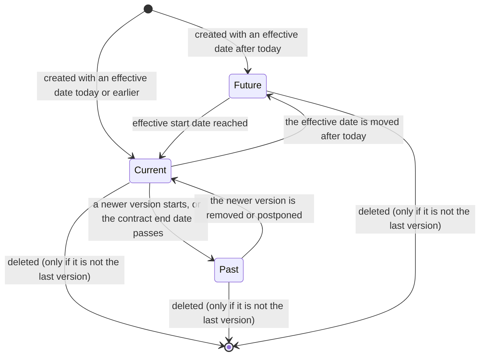
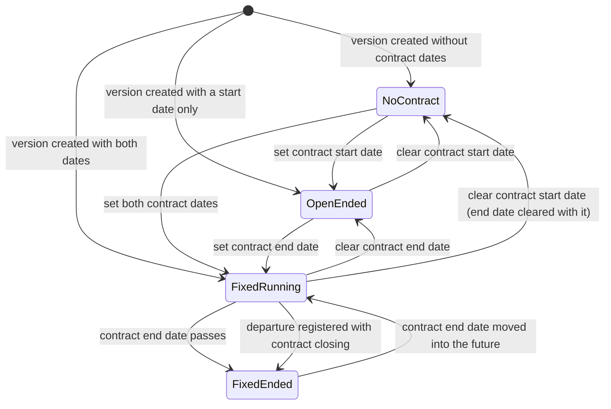
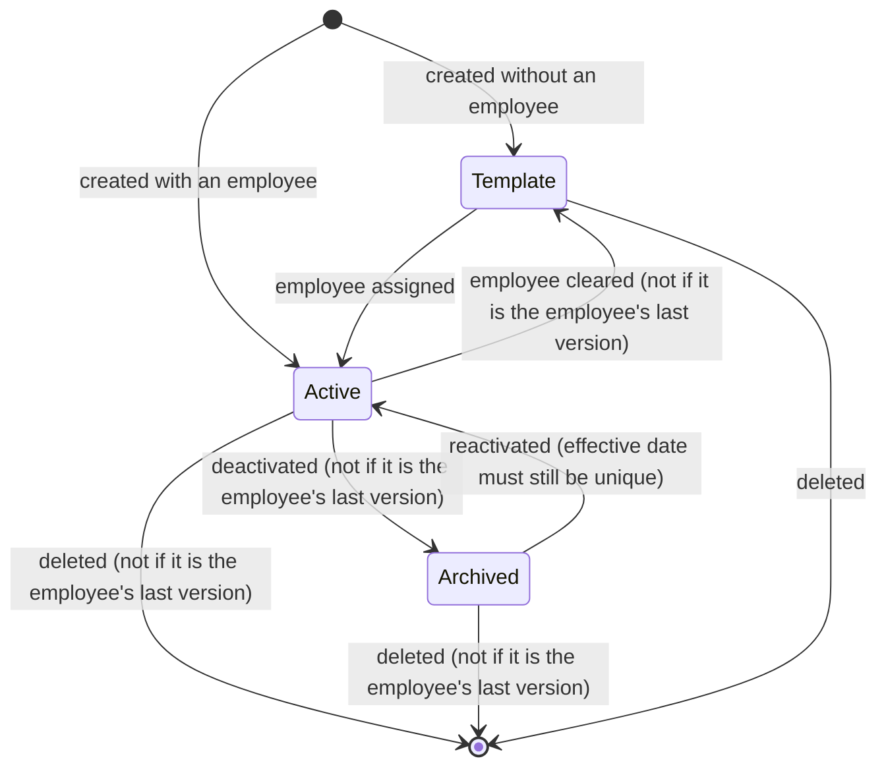
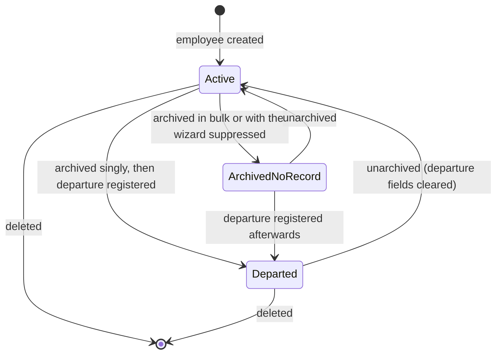
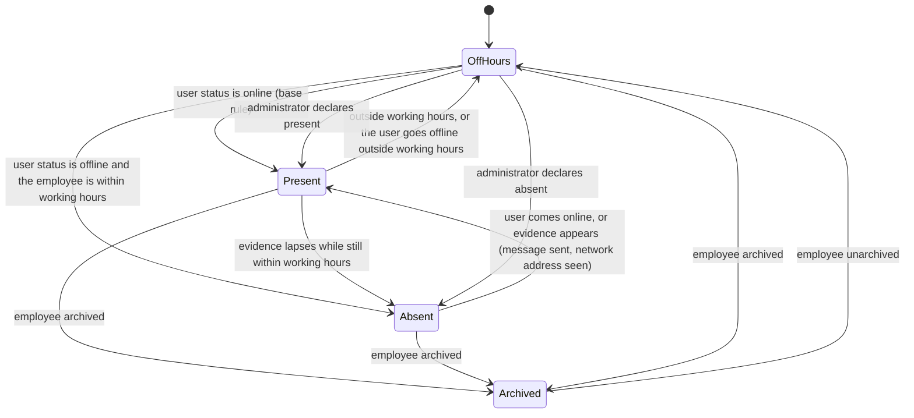
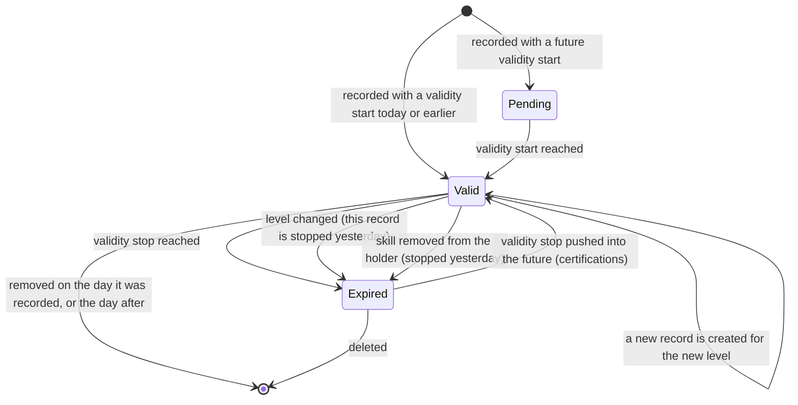

# State machines of the Human Resources Core domain

This domain has no field literally named "state" on its main entities. Its lifecycles are
nevertheless real state machines, expressed through combinations of dates and flags. This
file enumerates every one of them: the states, the transitions with their triggers, guards
and side effects, and a diagram for each.

The seven state machines are:

1. [Employee Version temporal position](#1-employee-version-temporal-position) — past,
   current or future, derived from dates.
2. [Contract period of a version](#2-contract-period-of-a-version) — no contract,
   open-ended contract, fixed-term contract, ended contract.
3. [Employee Version record availability](#3-employee-version-record-availability) —
   draft-in-form, active, archived, deleted; plus the template state.
4. [Employee employment lifecycle](#4-employee-employment-lifecycle) — active, archived
   with departure recorded, reinstated.
5. [Presence state](#5-presence-state) — present, absent, off-hours, archived; with the
   extended rules layered on top.
6. [Skill assertion validity](#6-skill-assertion-validity) — pending, valid, expired,
   removed.
7. [Weekly home-working plan and its exceptions](#7-weekly-home-working-plan-and-its-exceptions)
   — default day, exceptional day.

---

## 1. Employee Version temporal position

### 1.1 What determines the state

Three derived Boolean indicators on the Employee Version — Is Past, Is Current, Is Future —
are computed from two derived dates, the Effective Start Date and the Effective End Date,
compared against **today**. Those two derived dates are themselves built from the Effective
Date, the Contract Start Date, the Contract End Date and the effective date of the *next*
version of the same employee. See
[calculations, section 4](calculations.md#4-effective-start-and-end-dates-of-a-version).

Because the state depends on today's date and not on any stored flag, a version changes
state **without anybody writing to it**, simply because time passes. That is why a nightly
job exists to refresh the employee's stored Current Version pointer; see
[configuration, section 8.2](configuration.md#82-current-version-refresh-job).

### 1.2 States

| State | How it is recognised | Meaning |
|---|---|---|
| Future | Effective Start Date is later than today. | The terms have been prepared but do not apply yet. |
| Current | Effective Start Date is today or earlier **and** (Effective End Date is empty or today or later). | The terms apply today. |
| Past | Effective End Date exists and is earlier than today. | The terms applied in the past and have been superseded or have expired. |

The three indicators are not mutually exclusive by construction — they are three
independent comparisons — but the formulas make them so in every reachable configuration,
because the Effective End Date is always on or after the Effective Start Date whenever both
exist.

A fourth, orthogonal indicator, **Is Under Contract**, is true only when a Contract Start
Date exists *and* the version is current. A version can therefore be current without the
employee being under contract: this is the normal situation for an employee recorded in the
directory whose contractual terms have not been entered.

### 1.3 Transitions

| From | To | Trigger | Guard | Side effects |
|---|---|---|---|---|
| Future | Current | The clock passes midnight and the Effective Start Date becomes today. | — | The employee's Current Version pointer moves to this version when the nightly refresh job runs, or earlier if any dependency of the pointer is written. When the pointer moves, the employee's Resource working schedule is rewritten to this version's schedule. |
| Current | Past | A newer version is created whose Effective Date is on or before today, or the Contract End Date is reached. | — | Same pointer movement, in the other direction. |
| Past | Current | The newer version is deleted or archived, or its Effective Date is pushed into the future. | The employee must keep at least one version. | Pointer movement. |
| Current | Future | The Effective Date is moved forward past today. | The unique-date index must still hold. | Pointer movement; the pointer falls back to the employee's first version if no version is left in the past. |

### 1.4 Diagram



---

## 2. Contract period of a version

### 2.1 What determines the state

Two stored dates on the Employee Version: the Contract Start Date and the Contract End
Date. A database check constraint forbids an end date without a start date, which removes
one of the four combinations.

### 2.2 States

| State | Contract Start Date | Contract End Date | Meaning |
|---|---|---|---|
| No contract | empty | empty (forced) | The person is in the directory but no contractual period is recorded. Is Under Contract is false. Time off, work entries and payroll treat this employee as having no employment period. |
| Open-ended contract | set | empty | Employment began and has no planned end. |
| Fixed-term contract, running | set | set, today or later | Employment began and will end on a known date. |
| Fixed-term contract, ended | set | set, earlier than today | Employment ended. |
| Forbidden | empty | set | Rejected by the check constraint with the message "The contract must have a start date." |

### 2.3 A contract spans several versions

A single *contract* — one continuous employment period — is normally described by **several**
versions, all of which carry the **same** pair of contract dates. When a person's department
or wage changes in the middle of a contract, a new version starts on the change date and
copies the contract dates of the version it supersedes. The contract period is therefore
identified by the pair (Contract Start Date, Contract End Date) and grouped across versions
by that pair; see
[calculations, section 5](calculations.md#5-contract-periods).

This has two visible consequences:

- Writing a contract date on one version propagates it to every other version of the same
  contract period, so that the group stays consistent. The propagation is described in
  [workflows, section 7](workflows.md#7-changing-a-contract-date).
- Two versions of the same employee whose contract periods overlap are refused.

### 2.4 Transitions

| From | To | Trigger operation | Guard conditions | Side effects |
|---|---|---|---|---|
| No contract | Open-ended | Set the Contract Start Date. | The new period must not overlap any other contract period of the same employee. When the employee has exactly one version, the version's Effective Date is also moved to the contract start date. | Every version of the same contract period is synchronised. The employee becomes under contract on and after that date, which makes time off, work entries and scheduling treat the period as employment. |
| No contract | Fixed-term running | Set both contract dates. | Start must not be after end; no overlap. | Same. |
| Open-ended | Fixed-term running | Set the Contract End Date. | Start must not be after end; no overlap with a later contract period. | Same. All versions of the period receive the end date. |
| Fixed-term running | Fixed-term ended | The clock passes the Contract End Date. | — | The employee stops being under contract. Nothing is written. |
| Fixed-term running | Open-ended | Clear the Contract End Date. | No overlap with a later contract period. | Synchronisation across the period. |
| Any contracted state | No contract | Clear the Contract Start Date. | — | An on-change rule clears the Contract End Date as soon as the start date is cleared, so the forbidden combination cannot be reached through the form. |
| Fixed-term running | Fixed-term ended (forced) | Register a departure with "Set Contract End Date" ticked. | The departure date must not precede the current version's contract start date. | The contract end date of the current version, and therefore of the whole period, becomes the departure date. |

### 2.5 Diagram



---

## 3. Employee Version record availability

### 3.1 States

| State | How it is recognised | Meaning |
|---|---|---|
| Template | Employee link is empty. | A reusable set of terms, not a version of anybody. It is excluded from every version-selection algorithm because those all filter on the employee. |
| Active | Employee link is set and Active is true. | Participates in version selection and in the unique-effective-date index. |
| Archived | Employee link is set and Active is false. | Kept for history; excluded from the unique-effective-date index; still visible to version selection only as a last-resort fallback (see below). |
| Deleted | The record no longer exists. | |

### 3.2 Version selection and the archived state

Version selection for a date works on the **active** versions of the employee; but if the
employee has no active version at all, the selection falls back to **all** versions,
including archived ones. This guarantees that the algorithm always returns something for an
employee that has any version at all, which in turn underpins the guarantee that an
employee always has a Current Version.

### 3.3 Transitions

| From | To | Trigger operation | Guard conditions | Side effects and messages |
|---|---|---|---|---|
| Template | Active | Set the Employee link on a template. | — | The record becomes a version; its company is recomputed from the employee. |
| Active | Template | Clear the Employee link. | The selection being modified must not comprise **all** of that employee's versions. Otherwise: "Cannot unassign all the active versions of an employee." | — |
| Active | Archived | Set Active to false. | The selection being modified must not comprise all of that employee's versions. Otherwise: "Cannot archive all the active versions of an employee." | The record leaves the unique-effective-date index, so another active version may now take the same effective date. The employee's Current Version is recomputed. |
| Archived | Active | Set Active to true. | The unique-effective-date index must still hold: no other active version of the same employee may already carry this effective date. Otherwise: "An employee cannot have multiple active versions sharing the same effective date." | Current Version recomputed. |
| Active or Archived | Deleted | Delete the record. | The employee must not be left with zero versions. Otherwise: "Employee *the employee name* must always have at least one active version." | — |
| Template | Deleted | Delete the record. | — | Versions referring to it as their contract template keep a dangling reference cleared by the relation's default behaviour. |

### 3.4 Diagram



---

## 4. Employee employment lifecycle

### 4.1 States

| State | How it is recognised | Meaning |
|---|---|---|
| Active | Active is true. | The person is on the books. |
| Departed | Active is false **and** the current version carries a Departure Reason and a Departure Date. | The person has left; the record is kept for history and for reporting. |
| Archived without departure record | Active is false and no Departure Reason is set. | Reachable when an employee is archived by a mass operation or by a caller that suppressed the wizard. |
| Reinstated | Active was set back to true. | The three departure fields are cleared. |

There is no separate "hired" state. An employee exists from the moment the record is
created; whether they are contractually employed is the separate Contract Period state
machine of [section 2](#2-contract-period-of-a-version).

### 4.2 Transitions

| From | To | Trigger operation | Guard conditions | Side effects |
|---|---|---|---|---|
| — | Active | Create an employee. | Badge identifier unique; at most one employee per user per company. | A Resource is created; a first Employee Version is created and linked; a work contact is created when none was given; a generated avatar is stored when no image was given; department-subscribed discussion channels gain the new member; an onboarding suggestion message is logged on the thread. |
| Active | Archived without departure record | Archive with the wizard suppressed, or archive several employees at once. | — | The Resource is archived. Manager and Coach links pointing at the archived employees are emptied everywhere. No wizard is opened. |
| Active | Departed | Archive exactly one employee through the normal path, then complete the Departure Registration Wizard. | The departure date must not precede the current version's contract start date; otherwise "Departure date can't be earlier than the start date of current contract." | See [workflows, section 8](workflows.md#8-registering-a-departure) for the full effect list: departure fields written, contract end date optionally set, equipment optionally unassigned, linked user optionally archived. |
| Active | Departed (bulk) | Run the Departure Registration Wizard directly over several employees. | Same date guard. | Same effects. Whether the employees are archived depends on the calling context: the wizard only archives when it is invoked in termination mode. |
| Archived (either kind) | Reinstated | Unarchive. | — | The Resource is unarchived. Departure Reason, Departure Description and Departure Date are all cleared. Note that the contract end date written at departure is **not** cleared. |
| Any | Deleted | Delete the employee. | No other record may still restrict-reference it. | The Resource is deleted afterwards. All versions, skill assertions, resume lines and home-working exceptions cascade away. |

### 4.3 Diagram



---

## 5. Presence state

### 5.1 States

| Value | Label | Meaning |
|---|---|---|
| `present` | Present | The person is considered to be at work right now. |
| `absent` | Absent | The person is expected to be working right now but no sign of activity was found. |
| `out_of_working_hour` | Off-Hours | The person is not expected to be working right now. |
| `archive` | Archived | The employee record is archived. This value overrides every other. |

### 5.2 The base rule

Evaluated on every read; nothing is stored. Given an employee:

1. Start with `out_of_working_hour`.
2. If the employee's company has "Presence Based on User Status" switched on:
   a. Read the messaging presence status of the linked user, defaulting to `offline` when
      the user has no presence record.
   b. If that status is `online`, the state becomes `present`.
   c. Otherwise, if that status is `offline` **and** the employee is inside a working
      interval right now, the state becomes `absent`.
3. If the employee is archived, the state becomes `archive`, overriding whatever was
   computed.

"Inside a working interval right now" is evaluated in batch for efficiency; the exact
procedure is in
[calculations, section 13.1](calculations.md#131-are-these-employees-working-right-now).

### 5.3 The advanced rules

When the advanced presence capability is installed, two more evidence sources and a manual
override are layered on top. The layered rule replaces steps 1 to 3 above with:

1. Run the base rule first, producing a provisional state.
2. If a manual override is in effect for this employee, the state is the stored presence
   state and evaluation stops.
3. If neither "Presence Based on Messages Sent" nor "Presence Based on Network Address" is
   switched on for the employee's company, keep the provisional state and stop.
4. Otherwise, let *evidence* be true when any of the three stored indicators is true:
   Message Sent Today, Network Address Seen Today, Manually Set Present.
   a. If the company's Last Presence Computation stamp exists and falls on **today**, and
      the employee is working right now, and *evidence* is true, the state becomes
      `present`.
   b. Otherwise, if the employee is working right now, is marked as absent by the time-off
      layer, and *evidence* is false, the state becomes `absent`.
   c. Otherwise the state becomes `out_of_working_hour`.

Note that step 4 deliberately reduces the state to `out_of_working_hour` rather than keeping
the base result when neither branch matches: with advanced presence on, the advanced
evidence is authoritative.

### 5.4 The evidence-gathering job

A job, run on demand when the advanced settings are saved and schedulable thereafter,
recomputes the stored indicators for every employee of the acting company:

1. Reset all four indicator flags to false on every employee of the company.
2. If "Presence Based on Network Address" is on: for each employee, collect the distinct
   network addresses recorded for that employee's user since midnight today; if any of them
   appears in the company's comma-separated list of valid addresses, set Network Address
   Seen Today and remove the employee from further consideration.
3. If "Presence Based on Messages Sent" is on: for each remaining employee, count the
   messages authored by that employee's user's contact between midnight today and now; if
   the count reaches the company's threshold, set Message Sent Today and remove the
   employee from further consideration.
4. Stamp the company's Last Presence Computation with the current moment.
5. For every employee of the company, copy the freshly computed presence state into the
   Stored Presence State so that grouping works.

### 5.5 The manual override

Two operations, both restricted to the Human Resources Administrator group and both
refusing with "You don't have the right to do this. Please contact an Administrator."
otherwise:

| Operation | Effect |
|---|---|
| Declare present | Manually Set Present ← true; Manual Presence Override Active ← true; Stored Presence State ← `present`. |
| Declare absent | Manually Set Present ← false; Manual Presence Override Active ← true; Stored Presence State ← `absent`. |

In addition, any write that sets the Stored Presence State to `present` — from any source —
also sets Manually Set Present to true.

### 5.6 The presence icon

A parallel derived value drives the icon shown on cards. Base rule: the icon is the literal
text `presence_` followed by the presence state, and it is shown only when the employee has
a linked user.

The home-working capability overrides it: after the base rule, if a work location is known
for today — the exception dated today if one exists, otherwise the weekday default — the
icon becomes `presence_` followed by that location's kind (`home`, `office` or `other`) and
it is shown unconditionally.

### 5.7 Diagram



---

## 6. Skill assertion validity

### 6.1 States

A skill assertion — an Employee Skill or a Job Skill — has no state field. Its state is read
from its validity window compared to today.

| State | How it is recognised | Meaning |
|---|---|---|
| Pending | Validity Start is later than today. | The assertion is recorded but not yet in force. It still participates in overlap checking. |
| Valid | Validity Start is today or earlier and (Validity Stop is empty or today or later). | In force. Appears in the holder's current-skills collection. |
| Expired | Validity Stop exists and is earlier than today. | Kept for history. Does **not** appear in the current-skills collection — except for a certification skill where no assertion of that skill is still valid, in which case the most recently expired one is shown. |
| Removed | The record no longer exists. | Only reachable through genuine deletion, which is restricted (see below). |

### 6.2 Transitions

| From | To | Trigger operation | Guard conditions | Side effects |
|---|---|---|---|---|
| — | Valid | Add a skill to a holder. | No conflicting assertion (overlapping window for a regular skill; exact duplicate for a certification). The skill must belong to the chosen skill type; the level must belong to the chosen skill type; the validity stop must not precede the validity start. | Any still-valid assertion of the **same holder and same skill** is expired first, so that a regular skill never has two valid levels at once. |
| Valid | Expired | Change the level (or the skill, the skill type or the holder) of a valid assertion. | The resulting pair of records must not conflict. | The existing record's Validity Stop becomes yesterday, and a **new** record is created carrying the new values, with a Validity Start of today for a regular skill or the original start for a certification. |
| Valid | Expired | Remove a skill from a holder. | — | Instead of deletion, the Validity Stop becomes yesterday — unless the assertion began today or yesterday, or is already expired, in which case the record is deleted outright; and unless setting the stop to yesterday would itself create a conflict, in which case the record is deleted outright. |
| Valid | Expired | The clock passes the Validity Stop. | — | Nothing is written; the state changes because the comparison changes. |
| Pending | Valid | The clock passes the Validity Start. | — | Nothing is written. |
| Valid or Expired | Valid with new dates | Change only the validity dates (a certification renewal entered explicitly). | Certifications only, since a regular skill's window is recomputed rather than edited. The new window must not exactly duplicate an existing one. | An ordinary write; no new record is created, because none of the four identifying fields changed. |
| Any | Removed | Delete. | Allowed freely for certifications; for a regular skill, only when the assertion started today or yesterday, or has already expired. | — |

### 6.3 Diagram



### 6.4 Worked example of a level progression

An employee holds "English: A2" recorded on the first of March, with no validity stop.
On the twentieth of June the level is changed to B1.

| Step | Record | Validity Start | Validity Stop | State after |
|---|---|---|---|---|
| Before | English: A2 | 1 March | empty | Valid |
| Instruction | change the level of that record to B1 | | | |
| After, record 1 | English: A2 | 1 March | 19 June | Expired |
| After, record 2 | English: B1 | 20 June | empty | Valid |

The current-skills collection contains only the B1 record. The full-history collection
contains both. No information is lost, and the level change is auditable to the day.

Had the change been made on the first of March itself — the same day the A2 record was
created — the A2 record would have been **deleted** instead of stopped, because its
validity start is not earlier than yesterday; the history would then contain only the B1
record.

---

## 7. Weekly home-working plan and its exceptions

### 7.1 States of one calendar day for one employee

| State | How it is recognised | Meaning |
|---|---|---|
| Unset | The weekday field of that weekday is empty and no exception exists for that date. | No declared work location for that day. No location icon is shown. |
| Default | The weekday field is set and no exception exists for that date. | The person works at the weekday's usual location. |
| Exceptional | An Employee Home-Working Location exists for that date. | The person works at the exception's location that day, whatever the weekday default says. |

### 7.2 Transitions

| From | To | Trigger operation | Guard conditions | Side effects |
|---|---|---|---|---|
| Unset or Default | Exceptional | Set a location for one date, with "Recurring" left off, choosing a location **different** from the weekday default. | The pair (Employee, Date) must be unique, which it is by construction because the operation looks the exception up first. | An exception record is created, or the existing one is rewritten. |
| Exceptional | Default | Set a location for one date, with "Recurring" left off, choosing exactly the weekday default. | — | The exception record is **deleted**: the platform refuses to store a redundant exception. |
| Exceptional | Default (new default) | Set a location for one date with "Recurring" switched on. | — | The exception for that date is deleted **first**, then the weekday field is written on the employee through its linked user, changing the default for that weekday from now on. |
| Unset | Default | Set a location for one date with "Recurring" switched on. | — | The weekday field is written. |
| Default | Unset | Clear the weekday field. | The work location being removed must not be deleted while still used — see below. | — |
| Exceptional | Unset | Delete the exception directly. | — | — |

### 7.3 Interaction with work location deletion

Deleting a Work Location is refused outright when any employee uses it as a weekday default:
"You cannot delete locations that are being used by your employees". When no weekday default
uses it, deletion proceeds and every single-date exception pointing at it is deleted first,
silently returning those days to their weekday default.

### 7.4 Diagram

```mermaid
stateDiagram-v2
    [*] --> Unset
    Unset --> Default: weekday default set (recurring)
    Default --> Unset: weekday default cleared
    Unset --> Exceptional: one-date location set
    Default --> Exceptional: one-date location set, different from the weekday default
    Exceptional --> Default: one-date location set equal to the weekday default (exception deleted)
    Exceptional --> Default: recurring location set on that weekday (exception deleted first)
    Exceptional --> Unset: exception deleted and no weekday default
```

---

## 8. Cross-machine interactions worth noting

| Interaction | Description |
|---|---|
| Departure closes the contract | Registering a departure with "Set Contract End Date" ticked drives the Contract Period machine from "running" to "ended" on the current version, and the change propagates to every version of the same contract period. |
| Archiving an employee changes presence | The Presence machine short-circuits to `archive` as soon as the Employee machine reaches an archived state. |
| A new version can change the working schedule immediately | When the newly created version is (or becomes) the Current Version, the employee's Resource schedule is rewritten, which changes every future interval computation — attendance expectations, time-off durations, work entries and meeting availability. |
| Version changes move future leaves | Changing the working schedule of an employee is normally accompanied by transferring the future leaves from the old schedule to the new one; the transfer operation exists precisely for that and takes the start of today as its default cut-off. |
| A contract period with no version boundary inside it | Is the common case: a single version both starts the contract and describes the terms. The two machines then move together. |
