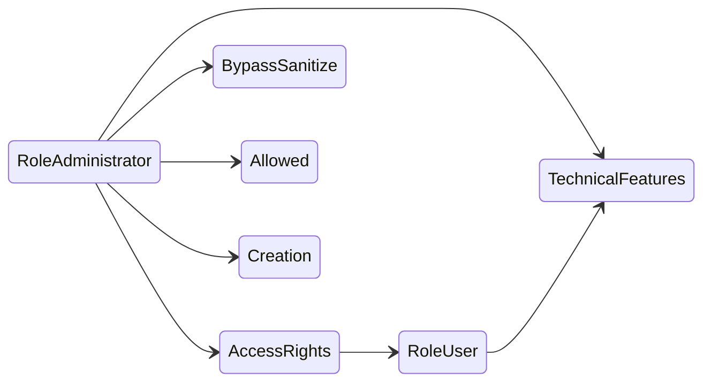

# Identity and Access — Configuration

This file specifies everything that is configured rather than transacted: the settings mechanism
itself, the shipped groups and privileges, the access-right matrix, the record rules, the system
parameters, the default records and the scheduled jobs.

The **settings mechanism** (section 2) is one of the three critical procedures of the domain and is
given as an exact numbered algorithm.

---

## 1. Sequences and numbering

**This domain defines no sequences and no numbering formats.** No entity of the domain carries a
human-readable document number: users are identified by their login, groups by their name inside a
privilege, companies by their name, keys by their label. The only generated identifiers are random
secrets (section 3 of [calculations.md](calculations.md)) and random tokens (section 5.1 of the same
file), neither of which is sequential — deliberately, because a predictable token would be a
credential anyone could guess.

One reserved textual form exists: a self-removed account's login becomes

```
__deleted_user_<the account identifier>_<the current moment as a decimal number of seconds>
```

which is chosen so that it can never collide with a real login and can never be signed in with.

---

## 2. The settings mechanism

### 2.1 What a settings screen is

A settings screen is a **transient record**. Its fields are not stored anywhere: they are read from,
and written back to, four different places according to a naming convention. Opening the screen
*projects in*; saving *projects out*.

The four destinations are:

| Prefix or attribute | Destination | Example meaning |
|---|---|---|
| name begins with `default_` | a user-defined default value on a named entity and field | "new sales orders default to this payment term" |
| name begins with `group_` | an implication between a holder group and an implied group | "internal users can see analytic accounting" |
| name begins with `module_` | the installation state of a package | "install the directory sign-in package" |
| the field carries a stored-parameter key | a system parameter | "the minimum password length is 12" |
| none of the above | whatever the screen's own projection hook does | usually a value mirrored onto the company |

### 2.2 Declaring a settings field

A settings field may carry four extra attributes beyond the ordinary ones:

| Attribute | Applies to | Required when | Meaning |
|---|---|---|---|
| target entity | fields named `default_…` | always | The entity whose field receives the default. |
| stored parameter key | any field | to make the field a parameter field | The parameter key. |
| holder groups | boolean or selection fields named `group_…` | optional | Comma-separated external references of the groups that gain or lose the implication. Defaults to the single group *Role / User*. |
| implied group | boolean or selection fields named `group_…` | always | The external reference of the group that is implied or un-implied. |

### 2.3 The classification procedure

**Precondition.** A list of field names, or nothing (meaning all of them).

For each name, in the order given:

1. If the name begins with `default_`:
   1. The field **must** declare a target entity, otherwise this is a structural error naming the
      field.
   2. Record the triple (field name, target entity, the name with its first 8 characters removed).
2. Else if the name begins with `group_`:
   1. The field's type **must** be boolean or selection, otherwise a structural error.
   2. The field **must** declare an implied group, otherwise a structural error.
   3. Read the holder-group references: the declared value split on commas, defaulting to the single
      reference of *Role / User*. Resolve each to a group record; resolve the implied group too. A
      reference that does not resolve yields an empty record, which the later steps treat as "no
      group".
   4. Record the triple (field name, the holder groups, the implied group).
3. Else if the name begins with `module_`:
   1. The field's type **must** be boolean or selection, otherwise a structural error.
   2. Add to the package set the package whose name is the field name with its first 7 characters
      removed.
4. Else if the field declares a stored-parameter key:
   1. The field's type **must** be one of boolean, integer, decimal, text, selection, link or
      date-and-time, otherwise a structural error.
   2. Record the pair (field name, the key).
5. Otherwise record the field name as *other*.

**Postcondition.** Five collections: defaults, groups, packages, parameters, others.

### 2.4 Projecting in (opening the screen)

**Preconditions.** A list of requested field names. Nothing happens when the list is empty.

1. Start from the ordinary default values of the transient entity.
2. Verify that the acting user may **read** the settings entity; otherwise raise the read refusal.
3. Classify the requested fields.
4. **Defaults.** For each (field name, target entity, target field): read the stored default for
   that entity and field with **no user scope, no company scope and no condition**. If the read
   yields a value (including a falsy one — only "absent" is skipped), assign it.
5. **Groups.** For each (field name, holder groups, implied group): the value is *true* exactly when
   the implied group is in the **transitive closure of every one of the holder groups**. For a
   selection field, convert the boolean to the text `1` or `0`.
6. **Packages.** For each package in the package set: the field named `module_<package name>` is
   true when the package's state is *installed*, *to install* or *to upgrade*.
7. **Parameters.** For each (field name, key):
   1. Read the parameter; when it is absent, use the field's own declared default, or *false* when
      it has none.
   2. If the value is not *false*, convert it:
      - **link**: parse as a whole number, browse, and keep the identifier only if the record still
        exists. A parse failure or a deleted record yields *false* and, for a parse failure, a logged
        warning. (This is deliberate: a dangling reference must not make the settings screen
        unopenable.)
      - **integer**: parse as a whole number; on failure use 0 and log a warning.
      - **decimal**: parse as a decimal; on failure use 0 and log a warning.
      - **boolean**: parse as a truth value, falling back to the truthiness of the raw value.
   3. Assign the result.
   The warning text is *Error when converting value 'the raw value' of field 'the field' for
   ir.config.parameter 'the key'*.
8. **Others.** Merge in whatever the screen's own read hook returns; it overrides anything above.

### 2.5 Projecting out (saving the screen)

**Preconditions.** Exactly one settings record. The acting user is an administrator, otherwise
*Only administrators can change the settings*.

1. Disable the archive filter for the whole operation, so archived groups and packages are still
   found.
2. Classify **all** the fields.
3. Re-read the current state by running the projection-in procedure over every field of the
   entity's catalogue. This is what "changed" is measured against.
4. Run the screen's own projection-out hook. By default that hook performs steps 5, 6 and 7.
5. **Defaults.** For each (field name, target entity, target field):
   1. Compute the value: for a record-valued field, the identifier when the field is a single link
      and the list of identifiers otherwise; for anything else, the value itself.
   2. If the field was absent from the re-read state, **or** the value differs from it, write the
      default with elevation, unscoped.
6. **Groups.** Sort the group triples in **ascending order of the field's current value**, so that
   every *false* is processed before every *true*. For each triple whose value equals the re-read
   state, skip. Otherwise:
   - a true value **applies** the implied group to the holder groups: every holder group whose
     transitive closure does not already contain the implied group gains it as a direct implication;
   - a false value **removes** the implied group: within the union of the transitive closures of the
     holder groups, every group that directly implies the implied group loses that implication.
   Both operations run with elevation.
7. **Parameters.** For each (field name, key):
   1. Read the current parameter value.
   2. Convert the new value: a **text** value is trimmed and, when the result is empty, becomes
      *false*; an **integer** or **decimal** value becomes its literal representation, or *false*
      when it is zero; a **link** value becomes its identifier.
   3. If the current value equals the new one — compared both as text and directly — write nothing.
   4. Otherwise set the parameter. Setting it to *false* **deletes** it.
8. **Packages.** Collect:
   - *to install*: packages whose field is true and whose state is not *installed*;
   - *to uninstall*: packages whose field is false and whose state is *installed* or *to upgrade*.
9. If either collection is non-empty, flush all pending work.
10. If there is anything to uninstall, return the uninstall confirmation dialogue seeded with those
    packages, and **stop**. The installations do not happen in this call.
11. Otherwise install the packages whose state is *uninstalled*.
12. If anything was installed, reset the transaction: the registry and every environment are no
    longer valid.
13. Ask for the next configuration step. If it is anything other than a plain close, return it.
14. Otherwise tell the client to reload, so the menus and the current screen pick up the new state.

### 2.6 Why the ordering in step 6 matters

Removing an implied group reaches into the **whole closure** of the holder groups, while applying
one touches only the named holder groups. If an addition were processed before a removal, the
removal could strip an implication the addition had just created through an intermediate group.
Sorting by value — false first, true second — makes the outcome independent of field declaration
order.

### 2.7 The creation optimisation

Saving a settings screen without changing anything would write every mirrored field and could
trigger long recomputation chains. Therefore, at **creation** of the transient record, for every
field that is a writable mirror of another record's field:

1. Split the mirror path into its first segment and the rest.
2. If the proposal does not also carry a value for the first segment, skip this field.
3. Determine the **current** value by converting the proposed value of the first segment into a
   record and then walking the remaining segments (taking the first element whenever a collection is
   met).
4. Determine the **new** value by converting the proposed value of the field itself.
5. If they are equal, remove the field from the proposal.

### 2.8 The settings fields of this domain

| Field (storage name) | Kind | Destination | Meaning |
|---|---|---|---|
| Company (`company_id`) | other | — | **Required**, defaults to the acting company. The company whose mirrored values the screen edits. |
| Is a root company (`is_root_company`) | other | — | Computed: the selected company has no parent. |
| Multi-Currencies (`group_multi_currency`) | group | implies *Multi Currencies* into *Role / User* | Allows working in more than one currency. |
| Show Effect (`show_effect`) | parameter | `base_setup.show_effect` | Whether celebratory animations are shown. |
| Profiling enabled until (`profiling_enabled_until`) | parameter | `base.profiling_enabled_until` | The moment until which performance profiling is permitted. |
| Custom Report Footer (`report_footer`) | other | mirrors the company's report footer | |
| Document Template (`external_report_layout_id`) | other | mirrors the company's document template | |
| Number of Companies (`company_count`) | other | — | Computed with elevation: the total number of companies. |
| Number of Active Users (`active_user_count`) | other | — | Computed with elevation: the number of accounts whose share flag is false. |
| Number of Languages (`language_count`) | other | — | Computed: the number of installed languages. |
| Company Name (`company_name`) | other | mirrors the company's display name | |
| Company information (`company_informations`) | other | — | Computed: the company's address rendered over several lines (street, second street line, postal code, then a space-hyphen-space and the city, the state, the country), then a line break, the country's tax-identifier label or the words *value-added tax*, a colon, and the tax identifier — each element omitted when empty. |
| Company country code (`company_country_code`) | other | mirrors the company's country code | |
| Company country group codes (`company_country_group_codes`) | other | mirrors the country's group codes | |
| Enable password reset from the sign-in page (`auth_signup_reset_password`) | parameter | `auth_signup.reset_password` | |
| Customer Account (`auth_signup_uninvited`) | parameter | `auth_signup.invitation_scope` | Values `b2b` (*On invitation*) and `b2c` (*Free sign up*); default `b2c`. |
| Template user for new users created through sign-up (`auth_signup_template_user_id`) | parameter | `base.template_portal_user_id` | The account copied when provisioning. |
| Customer Application Keys (`portal_allow_api_keys`) | other | the parameter `portal.allow_api_keys`, through an explicit read and write | Whether external users may create application keys. |
| Minimum Password Length (`minlength`) | parameter | `auth_password_policy.minlength` | Default 0, which disables the policy. Clamped to zero or more when edited. |
| Enforce two-factor authentication (`auth_totp_enforce`) | other | — | A presentation toggle: switching it on proposes the policy *Employees only* when none is set; switching it off clears the policy. Read back as "a policy is set". |
| Two-factor authentication enforcing policy (`auth_totp_policy`) | parameter | `auth_totp.policy` | Values `employee_required` (*Employees only*) and `all_required` (*All users*). |
| Directory parameters (`ldaps`) | other | mirrors the company's directory configurations | |
| Allow users to sign in with the shipped provider (`auth_oauth_google_enabled`) | other | written onto the shipped provider record | |
| Client identifier (`auth_oauth_google_client_id`) | other | written onto the shipped provider record | |
| Server address (`server_uri_google`) | other | — | Computed: the base address followed by the delegated-sign-in return path. Displayed so it can be copied into the provider's console. |
| Install the import package (`module_base_import`) | package | `base_import` | |
| Install the external-provider sign-in package (`module_auth_oauth`) | package | `auth_oauth` | |
| Install the directory sign-in package (`module_auth_ldap`) | package | `auth_ldap` | |
| Other package toggles | package | `google_calendar`, `microsoft_calendar`, `mail_plugin`, `account_inter_company_rules`, `voip`, `web_unsplash`, `sms`, `partner_autocomplete`, `base_geolocalize`, `google_recaptcha`, `website_cf_turnstile`, `google_address_autocomplete` | Each installs the named package when switched on. |

### 2.9 Settings actions

| Action | Effect |
|---|---|
| Open the company | Opens the acting company's form. |
| Edit the default groups of new users | Opens the group *Default access for new users* in a dedicated dialogue. **If that group does not exist, it is created** with that name and given the external reference `base.default_user_group`, marked non-updatable. |
| Edit the document header | Opens the view behind the selected document template; does nothing when none is selected. |
| Open the external-user template | Reads the account identifier from `base.template_portal_user_id`, refuses with *Invalid template user. It seems it has been deleted.* when it no longer exists, and otherwise opens that account's full form. |

### 2.10 The older configuration item

The base of the older step-by-step items declares four handlers — *next*, *execute*, *cancel*,
*skip* — and one convention: when *execute* or *cancel* returns an action, that action replaces the
default "go to the next item". The default *next* tells the client to reload. Not implementing
*execute* is a structural error: *Configuration items need to implement execute*.

---

## 3. Shipped privileges and application categories

| Privilege | Category | Groups it offers |
|---|---|---|
| Export | Master Data (sequence 1) | *Allowed* |
| Contact | Master Data | *Creation* |

Both categories and privileges are extended by every other domain; the two above are the ones the
foundation itself ships. The presentation order of the groups inside a privilege is computed as in
section 14.8 of [calculations.md](calculations.md).

---

## 4. Shipped groups

| Group | External reference | Directly implies | Privilege | Comment |
|---|---|---|---|---|
| Access Rights | `base.group_erp_manager` | *Role / User* | — | The permission administrator: may read and write users, groups, access rights, record rules, entity definitions and external identifiers. |
| Bypass HTML Field Sanitize | `base.group_sanitize_override` | — | — | Allows storing markup that would otherwise be stripped. |
| Role / Administrator | `base.group_system` | *Access Rights*, *Bypass HTML Field Sanitize* | — | *Access to the settings to configure the apps*. Held by the system account and the administrator account out of the box. |
| Role / User | `base.group_user` | — | — | *Access to the home menu*. Maximum application-key duration: **90 days**. |
| Multi Companies | `base.group_multi_company` | — | — | Presentation group: shows the company switcher. Membership is maintained mechanically (section 14.10 of [calculations.md](calculations.md)). |
| Multi Currencies | `base.group_multi_currency` | — | — | Reveals currency fields. |
| Technical Features | `base.group_no_one` | — | — | Implied **by** *Role / User* and *Role / Administrator*. Effective only while the request is in developer mode. |
| Allowed | `base.group_allow_export` | — | Export | Implied **by** *Role / Administrator*. Held by the system account. Permits exporting records. |
| Creation | `base.group_partner_manager` | — | Contact | Implied **by** *Role / Administrator*. Held by the system account. Permits creating and editing contacts. |
| Role / Portal | `base.group_portal` | — | — | *Portal members have specific access rights (such as record rules and restricted menus). They usually do not belong to the usual groups of the system.* |
| Role / Public | `base.group_public` | — | — | *Public users have specific access rights (such as record rules and restricted menus). They usually do not belong to the usual groups of the system.* |
| Default access for new users | `base.default_user_group` | — | — | Shipped **non-updatable**. Holds no permissions of its own; the groups it implies are copied into every new internal account. |

**Disjointness.** *Role / User*, *Role / Portal* and *Role / Public* are mutually disjoint: no
account's closure may contain more than one of them.

### 4.1 The implication graph of the shipped groups



(The last three edges into *Allowed*, *Creation* and *Technical Features* are declared from the
other end, as "implied by", but the resulting graph is the one drawn.)

---

## 5. Access-right matrix

Read as: *members of the group may perform the ticked operations on records of the entity*. A row
whose group is empty applies to everyone. Absence of a row means the operation is refused.

### 5.1 Identity entities

| Entity | Group | Read | Create | Modify | Delete |
|---|---|---|---|---|---|
| `res.users` | Role / Public | ✓ | | | |
| `res.users` | Role / Portal | ✓ | | | |
| `res.users` | Role / User | ✓ | | | |
| `res.users` | Access Rights | ✓ | ✓ | ✓ | ✓ |
| `res.groups` | Role / User | ✓ | | | |
| `res.groups` | Access Rights | ✓ | ✓ | ✓ | ✓ |
| `res.groups.privilege` | Role / User | ✓ | | | |
| `res.groups.privilege` | Access Rights | ✓ | ✓ | ✓ | ✓ |
| `res.users.log` | Role / Administrator | ✓ | ✓ | | |
| `res.users.settings` | *(everyone)* | | | | |
| `res.users.settings` | Role / User | ✓ | ✓ | ✓ | ✓ |
| `res.users.deletion` | *(everyone)* | | | | |
| `res.users.deletion` | Access Rights | ✓ | ✓ | ✓ | ✓ |
| `res.device` | Role / User | ✓ | ✓ | ✓ | ✓ |
| `res.device.log` | Role / User | ✓ | ✓ | ✓ | ✓ |
| `res.users.identitycheck` | Role / User | ✓ | ✓ | ✓ | |
| `res.users.identitycheck` | Role / Portal | ✓ | ✓ | ✓ | |
| `res.users.apikeys` | Role / User | ✓ | | | |
| `res.users.apikeys` | Role / Portal | ✓ | | | |
| `res.users.apikeys.description` | Role / User | ✓ | ✓ | | |
| `res.users.apikeys.description` | Role / Portal | ✓ | ✓ | | |
| `res.users.apikeys.show` | Role / User | ✓ | ✓ | | |

Note the shape of the application-key rows: the entity is **readable** but not writable, creatable
or deletable through the ordinary path. Creation happens through the direct insert of section 13.3
of [entities.md](entities.md) and removal through the elevated removal of section 13.6, both gated
by their own permission tests.

### 5.2 Permission entities

| Entity | Group | Read | Create | Modify | Delete |
|---|---|---|---|---|---|
| `ir.model.access` | Access Rights | ✓ | ✓ | ✓ | ✓ |
| `ir.rule` | Access Rights | ✓ | ✓ | ✓ | ✓ |
| `ir.model` | Access Rights | ✓ | ✓ | ✓ | ✓ |
| `ir.model` | Role / User | | | | |
| `ir.model.fields` | Access Rights | ✓ | ✓ | ✓ | ✓ |
| `ir.model.fields` | Role / User | | | | |
| `ir.model.fields.selection` | Access Rights | ✓ | ✓ | ✓ | ✓ |
| `ir.model.data` | Access Rights | ✓ | ✓ | ✓ | ✓ |
| `ir.model.data` | Role / User | | | | |
| `ir.model.constraint` | Access Rights | ✓ | | ✓ | ✓ |
| `ir.model.relation` | Access Rights | ✓ | ✓ | ✓ | ✓ |
| `ir.default` | *(everyone)* | | | | |
| `ir.default` | Role / User | ✓ | ✓ | ✓ | ✓ |
| `ir.default` | Role / Administrator | ✓ | ✓ | ✓ | ✓ |
| `ir.config_parameter` | Role / Administrator | ✓ | ✓ | ✓ | ✓ |

The rows with a group and **no** ticks are meaningful: they exist so that the presence of the group
does not accidentally grant anything, and they document that the decision was taken.

### 5.3 Company and reference entities

| Entity | Group | Read | Create | Modify | Delete |
|---|---|---|---|---|---|
| `res.company` | Role / Public | ✓ | | | |
| `res.company` | Role / Portal | ✓ | | | |
| `res.company` | Role / User | ✓ | | | |
| `res.company` | Access Rights | ✓ | ✓ | ✓ | ✓ |
| `res.partner` | Role / Public | ✓ | | | |
| `res.partner` | Role / Portal | ✓ | | | |
| `res.partner` | Role / User | ✓ | | | |
| `res.partner` | Creation (contacts) | ✓ | ✓ | ✓ | ✓ |
| `res.country`, `res.country.state`, `res.country.group` | Role / Public, Role / Portal, Role / User | ✓ | | | |
| `res.currency`, `res.currency.rate` | Role / Public, Role / Portal, Role / User | ✓ | | | |
| `res.currency`, `res.currency.rate` | Role / Administrator | ✓ | ✓ | ✓ | ✓ |
| `res.lang` | Role / Public, Role / Portal, Role / User | ✓ | | | |
| `res.lang` | Role / Administrator | ✓ | ✓ | ✓ | ✓ |

### 5.4 Authentication entities

| Entity | Group | Read | Create | Modify | Delete |
|---|---|---|---|---|---|
| `auth_totp.device` | Role / User | ✓ | | | |
| `auth_totp.device` | Role / Portal | ✓ | | | |
| `auth.totp.rate.limit.log` | Role / User | | | | |
| `auth.passkey.key` | Role / User | ✓ | | ✓ | |
| `auth.passkey.key` | Role / Portal | ✓ | | ✓ | |
| `auth.passkey.key` | Access Rights | ✓ | | ✓ | ✓ |
| `auth.passkey.key.create` | Role / User | ✓ | ✓ | ✓ | ✓ |
| `auth.passkey.key.create` | Role / Portal | ✓ | ✓ | ✓ | ✓ |
| `auth.oauth.provider` | Role / Administrator | ✓ | ✓ | ✓ | ✓ |
| `res.company.ldap` | Role / Administrator | ✓ | ✓ | ✓ | ✓ |

Note that passkeys are **not creatable** through the ordinary path either: they are created through
the account's own collection, which is why the creation column is empty while the modification
column is ticked.

### 5.5 Portal, onboarding, privacy and recycling entities

| Entity | Group | Read | Create | Modify | Delete |
|---|---|---|---|---|---|
| `portal.wizard` | Creation (contacts) | ✓ | ✓ | ✓ | |
| `portal.wizard.user` | Creation (contacts) | ✓ | ✓ | ✓ | |
| `portal.share` | Creation (contacts) | ✓ | ✓ | ✓ | |
| `onboarding.onboarding` | *(everyone)* | | | | |
| `onboarding.onboarding` | Role / User | | | | |
| `onboarding.onboarding` | Role / Administrator | ✓ | ✓ | ✓ | ✓ |
| `onboarding.onboarding.step` | *(everyone)* / Role / User | | | | |
| `onboarding.onboarding.step` | Role / Administrator | ✓ | ✓ | ✓ | ✓ |
| `onboarding.progress` | *(everyone)* / Role / User | | | | |
| `onboarding.progress` | Role / Administrator | ✓ | ✓ | ✓ | ✓ |
| `onboarding.progress.step` | *(everyone)* / Role / User | | | | |
| `onboarding.progress.step` | Role / Administrator | ✓ | ✓ | ✓ | ✓ |
| `privacy.log` | Role / Administrator | ✓ | ✓ | ✓ | ✓ |
| `privacy.lookup.wizard` | Role / Administrator | ✓ | ✓ | ✓ | ✓ |
| `privacy.lookup.wizard.line` | Role / Administrator | ✓ | ✓ | ✓ | |
| `data_recycle.model` | Role / Administrator | ✓ | ✓ | ✓ | ✓ |
| `data_recycle.record` | Role / Administrator | ✓ | ✓ | ✓ | ✓ |

Onboarding is deliberately written with three rows per entity — one for everyone, one for internal
users, one for administrators — so that the "no permission" decision for the first two is explicit
rather than implied by absence. Ordinary users never read these entities through the object layer;
the panel is rendered by elevated code.

### 5.6 Other foundation entities administered from this domain

| Entity | Group | Read | Create | Modify | Delete |
|---|---|---|---|---|---|
| `ir.ui.menu` | Role / User | ✓ | | | |
| `ir.ui.menu` | Role / Administrator | ✓ | ✓ | ✓ | ✓ |
| `ir.ui.view` | *(everyone)* | | | | |
| `ir.ui.view` | Role / Administrator | ✓ | ✓ | ✓ | ✓ |
| `ir.ui.view.custom` | Role / Administrator | ✓ | ✓ | ✓ | ✓ |
| `ir.filters` | — | see the record rules of section 6 | | | |
| `ir.exports` | Allowed (export) | ✓ | ✓ | ✓ | ✓ |
| `ir.exports.line` | Role / User | ✓ | ✓ | ✓ | ✓ |
| `ir.cron`, `ir.cron.progress`, `ir.cron.trigger` | Role / Administrator | ✓ | ✓ | ✓ | ✓ |
| `ir.attachment` | *(everyone)* | | | | |
| `ir.attachment` | Role / User | ✓ | ✓ | ✓ | ✓ |
| `ir.sequence`, `ir.sequence.date_range` | Role / User | ✓ | | | |
| `ir.sequence`, `ir.sequence.date_range` | Role / Administrator | ✓ | ✓ | ✓ | ✓ |
| `ir.module.module` and its dependency and exclusion entities | Role / Administrator | ✓ | ✓ | ✓ | ✓ |
| `ir.module.category` | Access Rights | ✓ | | | |
| every action entity | Role / Administrator | ✓ | ✓ | ✓ | ✓ |
| `ir.embedded.actions` | Role / User | ✓ | ✓ | ✓ | ✓ |
| `decimal.precision` | Role / Administrator | ✓ | | ✓ | |
| `reset.view.arch.wizard` | Role / Administrator | ✓ | ✓ | ✓ | |
| `properties.base.definition` | Role / Administrator | ✓ | ✓ | ✓ | ✓ |

---

## 6. Record rules

Each row gives the filter exactly. *Global* rules have no group and are combined by intersection;
the others are grants combined by union among themselves. The three context names available are
defined in section 3.4 of [business-rules.md](business-rules.md).

### 6.1 On the User

| Rule | Groups | Filter | Operations |
|---|---|---|---|
| `base.res_users_rule` | **global** | the account is internal (its share flag is false) **or** one of its permitted companies is among the active companies | read, create, modify, delete |
| `base.res_users_rule_portal` | Role / Portal (set) | the account's commercial contact equals the acting user's commercial contact | read, create, modify, delete |

The first is the multi-company isolation of accounts: an external user of company *Alpha* is
invisible to an administrator working only in *Beta*, while internal users are visible everywhere.
The second confines an external user to the accounts of their own commercial entity.

### 6.2 On the Contact

| Rule | Groups | Filter | Operations |
|---|---|---|---|
| `base.res_partner_rule` | **global** | the contact is not a shared contact **or** its company is an ancestor-or-self of one of the active companies **or** it has no company | read, create, modify, delete |
| `base.res_partner_portal_public_rule` | Role / Portal, Role / Public | the contact is a descendant-or-self of the acting user's commercial contact | read only |

### 6.3 On the Company

| Rule | Groups | Filter | Operations |
|---|---|---|---|
| `base.res_company_rule_employee` | Role / User (set) | the company is among the active companies | read, create, modify, delete |
| `base.res_company_rule_portal` | Role / Portal (set) | the company is among the active companies | read, create, modify, delete |
| `base.res_company_rule_public` | Role / Public (set) | the company is among the active companies | read, create, modify, delete |
| `base.res_company_rule_erp_manager` | Access Rights | always true | read, create, modify, delete |

Because these are grants combined by union, a permission administrator sees every company while
everyone else sees only the active ones.

### 6.4 On defaults, filters and personal records

| Rule | Groups | Filter | Operations |
|---|---|---|---|
| `base.ir_default_user_rule` | Role / User | the default's user is the acting user | create, modify, delete (not read) |
| `base.ir_default_system_rule` | Role / Administrator | always true | create, modify, delete (not read) |
| `base.ir_filters_employee_rule` | Role / User | the filter's users include nobody or the acting user | read, create, modify, delete |
| `base.ir_filters_portal_public_rule` | Role / Portal, Role / Public | the filter's users include the acting user | read, create, modify, delete |
| `base.ir_filters_admin_all_rights_rule` | Access Rights | always true | read, create, modify, delete |
| `base.ir_ui_view_custom_personal` | **global** | the customisation's user is the acting user | read, create, modify, delete |
| `base.res_users_log_rule` | **global** | the entry's author is the acting user | create, modify, delete (not read) |
| `base.change_password_rule` | **global** | the line's author is the acting user | read, create, modify, delete |
| `base.change_password_own_rule` | **global** | the record's author is the acting user | read, create, modify, delete |
| `base.res_users_identity_check` | **global** | the record's author is the acting user | read, create, modify, delete |

Note the pattern of the default-value rules: they do **not** apply to reading. Defaults must be
readable by everyone, because they are consulted when a record is prepared; only writing them is
confined.

### 6.5 On user settings, keys and devices

| Rule | Groups | Filter | Operations |
|---|---|---|---|
| `base.res_users_settings_rule_user` | Role / User | the settings row's account is the acting user | read, create, modify, delete |
| `base.res_users_settings_rule_admin` | Role / Administrator | always true | read, create, modify, delete |
| `base.api_key_user` | Role / Portal, Role / User | the key's account is the acting user | read, create, modify, delete |
| `base.api_key_admin` | Role / Administrator | always true | read, create, modify, delete |
| `base.api_key_public` | Role / Public | **never true** | read, create, modify, delete |
| `base.user_device` | Role / User | the device's account is the acting user | read, create, modify, delete |
| `base.user_device_admin` | Role / Administrator | always true | read, create, modify, delete |
| `base.user_device_logs` | Role / User | the log row's account is the acting user | read, create, modify, delete |
| `base.user_device_logs_admin` | Role / Administrator | always true | read, create, modify, delete |
| `base.embedded_action_user_delete_rule` | Role / User | the action's user is the acting user or nobody | modify, delete (not read, not create) |
| `base.embedded_action_admin_delete_rule` | Role / Administrator | always true | modify, delete |
| `base.properties_base_definition_rule_admin` | Role / Administrator | always true | read, create, modify, delete |

The "never true" filter on the anonymous account's key rule is the idiomatic way of writing "this
group is granted the entity by an access-right row, but may reach no record at all".

### 6.6 On authentication entities

| Rule | Groups | Filter | Operations |
|---|---|---|---|
| `auth_totp.rule_auth_totp_wizard` | **global** | the wizard's account is the acting user | read, create, modify, delete |
| `auth_totp.api_key_user` | Role / Portal, Role / User | the trusted browser's account is the acting user | read, create, modify, delete |
| `auth_totp.api_key_admin` | Role / Administrator | always true | read, create, modify, delete |
| `auth_totp.api_key_public` | Role / Public | **never true** | read, create, modify, delete |
| `auth_passkey.rule_auth_passkey_key_user` | Role / Portal, Role / User | the credential's owner is the acting user | read, create, modify, delete |
| `auth_passkey.rule_auth_passkey_key_admin` | Access Rights | always true | **read and delete only** |
| `auth_passkey.rule_auth_passkey_key_create_portal` | Role / Portal, Role / User | the wizard record's author is the acting user | read, create, modify, delete |

The administrator's passkey rule deliberately omits create and modify: a permission administrator
may inspect and remove someone's credentials but may not forge or alter one.

### 6.7 On the recycling candidate

The recycling entities carry no record rule: they are administered exclusively by holders of
*Role / Administrator*, and the access-right rows already confine them.

---

## 7. System parameters

### 7.1 Parameters of this domain

| Key | Default / shipped value | Read by | Meaning |
|---|---|---|---|
| `database.secret` | a random version-4 universally unique identifier, written at database creation | every signature | The key of every keyed hash in the system. Changing it invalidates every session, every signed token and every recipient signature at once. |
| `database.uuid` | a random version-1 universally unique identifier | external identification | |
| `database.create_date` | the moment of creation | — | |
| `web.base.url` | the loop-back host and the configured port | share addresses, passkey origin, delegated-sign-in return address | Updated on each interactive sign-in by a holder of *Role / Administrator*, unless frozen. |
| `web.base.url.freeze` | absent | the sign-in path | When set, the base address is never updated automatically. |
| `base.login_cooldown_after` | **10** written at creation; **5** assumed when absent | the cooldown predicate | Failures before cooldown; 0 disables. |
| `base.login_cooldown_duration` | **60** written at creation; **60** assumed when absent | the cooldown predicate | Cooldown length in seconds. |
| `base.template_portal_user_id` | the external-user template account, shipped | provisioning | The account copied for every self-registered or portal-granted account. |
| `base.default_max_email_size` | **10**, shipped | messaging | Present in the foundation's shipped data. |
| `password.hashing.rounds` | absent | the hashing context | Raises the iteration count above the floor of 600 000; never lowers it. |
| `base.enable_programmatic_api_keys` | absent (false) | programmatic key management | |
| `base.programmatic_api_keys_limit` | 10 assumed when absent | programmatic key minting | |
| `base.profiling_enabled_until` | absent | performance profiling | Exposed on the settings screen. |
| `base_setup.show_effect` | **True**, shipped | the client | |
| `auth_signup.invitation_scope` | **b2c**, written by a shipped function | registration | `b2b` — invited contacts only; `b2c` — anyone. |
| `auth_signup.reset_password` | **True**, written by a shipped function | the password-reset page | The page exists only when this is the text `True` or a token is supplied. |
| `auth_signup.signup.validity.hours` | 144 assumed when absent | sign-up token | |
| `auth_signup.reset_password.validity.hours` | 4 assumed when absent | reset token | |
| `auth_password_policy.minlength` | 0 assumed when absent | the password policy | |
| `auth_totp.policy` | absent | the second-factor requirement | `employee_required` or `all_required`. |
| `auth_totp.trusted_device_age` | 90 assumed when absent, invalid or non-positive | trusted browsers | In days. |
| `auth_oauth.authorization_header` | absent | delegated sign-in | When set, the provider's information address is called with a bearer header rather than a query parameter. |
| `auth_ldap.disable_chase_ref` | **True** assumed when absent | directory sign-in | When true, referral chasing is switched off. |
| `portal.allow_api_keys` | absent (false) | the customer-facing security page | Whether external users may create application keys. |
| `web.max_file_upload_size` | the platform default | the client | |
| `web.active_ids_limit` | 20000 assumed when absent | the client | |
| `web.quick_login` | true assumed when absent | the sign-in page | |

### 7.2 Renaming protection

The six parameters initialised at database creation (`database.secret`, `database.uuid`,
`database.create_date`, `web.base.url`, `base.login_cooldown_after`,
`base.login_cooldown_duration`) cannot be renamed:

> You cannot rename config parameters with keys *the comma-separated list of keys*

---

## 8. Shipped records

| Record | External reference | Content |
|---|---|---|
| The main company | `base.main_company` | Name *My Company*; contact `base.main_partner`; currency the United States dollar. Shipped non-updatable. |
| The system account | `base.user_root` | Identifier 1; contact `base.partner_root`; company the main company; electronic mail address a placeholder; signature *System*; holds *Role / Administrator*, *Allowed*, *Creation*. |
| The administrator account | `base.user_admin` | Identifier 2; login `admin`; password `admin` as shipped; contact `base.partner_admin`; company the main company; **explicit groups emptied** at data load and then *Role / Administrator* added by the group record; signature *Administrator*. |
| The administrator's settings row | `base.user_admin_settings` | Created only if missing. |
| The anonymous account | `base.public_user` | Name *Public user*; login `public`; empty password; explicit groups emptied and then *Role / Public* added by the group record; the shipped anonymous image; contact `base.public_partner`; **archived**. |
| The external-user template | `base.template_portal_user_id` | Name *Portal User Template*; login `portaltemplate`; **archived**; exactly one group, *Role / Portal*; an explicitly empty signature so that the signature computation is not re-triggered on every update. |
| The parameter pointing at the template | `base.default_template_user_config` | Key `base.template_portal_user_id`, value the template's identifier. |
| The default-group holder | `base.default_user_group` | Name *Default access for new users*; shipped **non-updatable** so an administrator's edits survive package updates. |

All the account and company records are shipped **non-updatable**, so that a package update never
resets a live installation's administrator, company name or currency.

---

## 9. Scheduled jobs

| Job | Interval | Priority | Runs as | What it does |
|---|---|---|---|---|
| Auto-vacuum internal data | every 1 day | 3 | — | Runs every registered automatic clean-up, including: keeping only the newest sign-in log row per account; deleting expired application keys; de-duplicating device log rows; marking as revoked the device log rows whose session no longer exists. |
| Portal Users Deletion | every 1 day | 8 | — | Processes the account deletion queue in batches of **50** (workflow 14 of [workflows.md](workflows.md)). |
| Users: Notify About Unregistered Users | every 1 day | 6 | the system account | Mails each inviter about the accounts they created 5 days ago that have never signed in, in batches of **100**. |
| Data Recycle: Clean Records | every 1 day | — (active) | — | Runs every recycling rule's collection with per-batch commits, then sends the due notifications. |

### 9.1 The automatic clean-ups in detail

| Clean-up | Statement |
|---|---|
| Sign-in log | Delete every row of an account for which a newer row of the same account exists. |
| Application keys | Delete every row whose expiry is set and is strictly before the current moment in coordinated universal time. |
| Device log de-duplication | Delete every row for which another row with the same session identifier, platform, browser and network address has a strictly greater last activity. When the job knows the moment of its previous run, restrict to groups whose surviving row is at or after that moment. |
| Device log revocation | In batches of 100 000 ordered by identifier: take non-revoked rows whose last activity is older than the maximum session inactivity, ask the session store which of their session identifiers are missing, mark those rows revoked and commit. The offset is reduced by the number revoked, so the scan does not skip rows. |

---

## 10. Configuration that is deliberately absent

| Not configurable | Why |
|---|---|
| The floor of the password iteration count | The parameter can only raise it above 600 000. |
| The identity re-confirmation window (10 minutes) | Fixed. |
| The second-factor digits (6), period (30 seconds) and acceptance window (±30 seconds) | Fixed, because common authenticator applications do not support other values. |
| The second-factor rate limits (5 per 3600 seconds, each kind) | Fixed. |
| The device-log write threshold (3600 seconds) | Fixed. |
| The application-key length (20 bytes) and index length (8 characters) | Fixed. |
| The key hashing iteration count (6 000) | Fixed. |
| The deletion-queue batch size (50), the reminder delay (5 days) and batch (100), the recycling batch sizes (5 000 and 50 000) | Fixed in the job definitions. |
| The disjointness of the three kind groups | Structural. |
| The immutability of the company hierarchy | Structural. |
