# Identity and Access — State Machines

This file specifies every state field of the domain: its states, its transitions, the guard on each
transition, the side effects of each transition, and a diagram. Several of the "states" in this
domain are not stored selection fields but **derived** or **session-held** states; those are marked
as such and are specified with the same rigour, because a re-implementation must reproduce them.

---

## 1. The sign-in state machine (session-held)

### 1.1 States

| State | Where it lives | Meaning |
|---|---|---|
| Anonymous | the session has no account identifier and no pending account | No one is signed in. Routes whose mode is `public` act as the anonymous account; routes whose mode is `user` treat the session as expired. |
| Pending | the session has a pending login and a pending account, and no account identifier | The first factor succeeded but a second factor is still required. The session cannot be used for anything but the second-factor exchange. |
| Established | the session has an account identifier, a login, a database name, a preference context and a session token | Fully signed in. |
| Locked | Established, plus the inactivity limit has been exceeded | Every request to a route whose mode is `user` and which does not opt out is answered with a re-authentication demand. |
| Expired | Established, plus either the session token no longer matches or the session limit has been exceeded | The next request signs the session out. |

### 1.2 Transitions

| From | To | Trigger | Guards | Side effects |
|---|---|---|---|---|
| Anonymous | Pending | Sign-in with valid credentials | The cooldown guard permits the attempt; the credentials verify; the result's second-factor policy is not `skip`; the account has a second-factor address | The account identifier is cleared; the pending login and pending account are written; a sign-in log row is created; the time zone may be captured from a cookie; the success is logged |
| Anonymous | Established | Sign-in with valid credentials | As above but the policy is `skip` **or** the account has no second-factor address | The above, plus finalisation (section 1.3) |
| Anonymous | Anonymous | Sign-in with invalid credentials | — | The cooldown failure counter for the source address is incremented; the failure is logged; the page shows *Wrong login/password* for a generic refusal, or the refusal's own text otherwise |
| Anonymous | Anonymous | Sign-in while the source is on cooldown | The cooldown predicate holds | Nothing is even attempted; a warning is logged; the refusal is *Too many login failures, please wait a bit before trying again.* |
| Pending | Established | A valid second-factor code is submitted | The cooldown guard permits; the rate limiter permits; the code matches and is newer than the last accepted counter | The last accepted counter is advanced; the code rate-limit rows are purged; finalisation; optionally a trusted-browser key and cookie are created |
| Pending | Established | The second-factor page is opened with a valid trusted-browser cookie | The cookie verifies as a key in the `browser` purpose for the pending account | Finalisation; no code is asked for |
| Pending | Pending | An invalid code is submitted | — | The rate limiter consumed one attempt; the cooldown counter is incremented; the form shows the refusal |
| Pending | Anonymous | The second-factor page is opened with no pending account | — | Redirect to the sign-in page |
| Established | Locked | A request arrives after the inactivity limit | The route's mode is `user`, the route does not opt out, and the inactivity predicate holds | A re-authentication demand: a redirect for a page request, an in-place condition for a programmatic call |
| Locked | Established | The re-authentication exchange completes | Every required factor verified | The *next identity check* moment is removed; the *last identity check* moment is set to now |
| Locked | Locked | The re-authentication exchange needs a second factor | The first factor verified, more than one method is available and the limit demands a second factor | The first factor (moment and method) is recorded in the session; the remaining methods are returned |
| Established | Expired | A request arrives after the session limit | The route's mode is `user` and the session predicate holds | A session-expired condition; the client returns the user to the sign-in page |
| Established | Expired | Any session-token field of the account changes elsewhere | — | The next request recomputes the token, finds a mismatch, signs the session out keeping the database, and continues unauthenticated |
| Established | Anonymous | Sign-out | — | The session is cleared and re-seeded with the defaults, keeping the database when asked; the language is reset; the session is marked for rotation; the sign-out hook runs |
| Established | Established | Impersonation | The acting account holds *Role / Administrator* | The session account becomes the account of identifier 1; the registry caches are cleared; a new session token is computed |

### 1.3 Finalisation

1. Pop the pending login and the pending account.
2. Read the account's preference context (language and time zone, resolved as in section 1.4).
3. Mark the session for rotation.
4. Write into the session: the database name, the login, the account identifier, the preference
   context, and the session token computed for this session identifier.

### 1.4 Resolving the preference context

The preference context is the pair (language, time zone) plus the acting account identifier. The
language is chosen by the first of these that names an installed language:

1. the account's own language;
2. the language the request prefers;
3. the language of the account's default company's contact;
4. the reference language;
5. the first installed language, or the reference language when none is installed.

### 1.5 Diagram

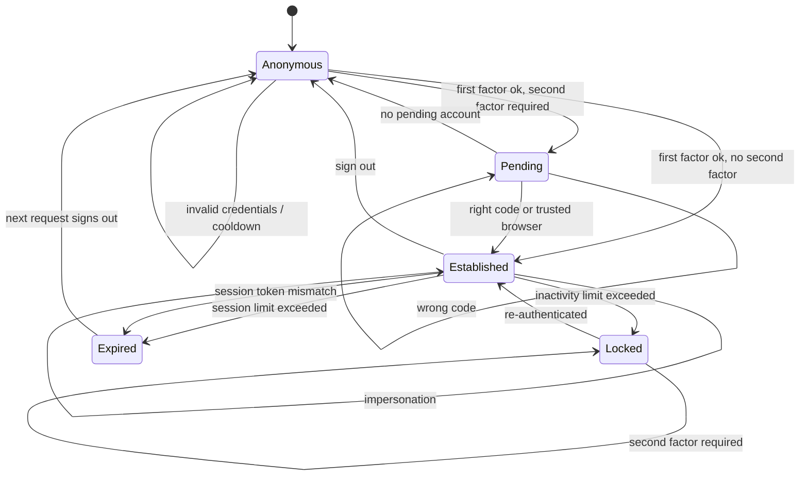

---

## 2. The account status (derived)

**Field** `state` on the User. Computed, not stored, searchable.

### 2.1 States

| Value | Label | Meaning |
|---|---|---|
| `new` | Invited | The account has never signed in: it has no sign-in log entry. |
| `active` | Confirmed | The account has at least one sign-in log entry. |

### 2.2 Transitions

| From | To | Trigger | Guards | Side effects |
|---|---|---|---|---|
| — | Invited | Account creation | — | A sign-up invitation is prepared and sent when the account has an electronic mail address and the creation is not marked "no password mail" |
| Invited | Confirmed | First successful sign-in | — | A sign-in log row is created; any sign-up token that recorded "never signed in" stops resolving |
| Invited | Invited | The reminder job runs 5 days after creation | The creator has an electronic mail address | A reminder is mailed to the creator |
| Invited | Invited | Re-invitation | — | A new sign-up token is computed and mailed |

There is no transition back from Confirmed: the sign-in log rows are only ever pruned down to the
newest one per account, never to zero.

### 2.3 Diagram

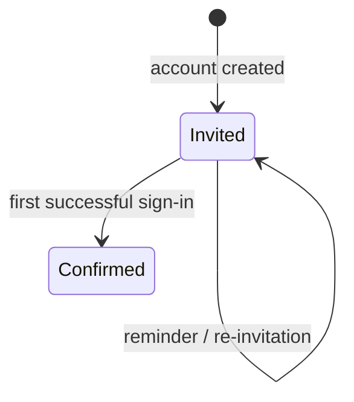

---

## 3. The account life state (stored)

**Field** `active` on the User, plus the deletion queue.

### 3.1 States

| State | Representation | Meaning |
|---|---|---|
| Active | the active flag is set | Usable. |
| Archived | the active flag is clear | Cannot sign in; hidden from ordinary searches; the linked contact is archived too. |
| Queued for deletion | archived, plus a deletion request in state *To Do* | The login has been replaced by a reserved unusable value and the secret cleared. |
| Deleted | the row is gone | — |

### 3.2 Transitions

| From | To | Trigger | Guards | Side effects |
|---|---|---|---|---|
| Active | Archived | Write the active flag to false | Not the acting account (*You cannot deactivate the user you're currently logged in as.*) | The contact is archived; any outstanding sign-up invitation is cancelled |
| Archived | Active | Write the active flag to true | Not the account of identifier 1 (*You cannot activate the superuser.*) | The contact is un-archived **before** the account |
| Active | Queued for deletion | Self-service account removal | Every selected account is an external user, otherwise *Only the portal users can delete their accounts. The user(s) … can not be deleted.* | The login becomes `__deleted_user_<identifier>_<the current moment as a decimal number of seconds>`; the secret is cleared; every application key is removed; the account is archived as the account of identifier 1 (failures ignored); the contact is archived (failures ignored); a deletion request in state *To Do* is created |
| Queued for deletion | Deleted | The deletion job processes the request | The row lock is obtained and the request is still *To Do* | The account is deleted; the request becomes *Done*; then the contact is deleted if possible |
| Queued for deletion | Queued for deletion | The deletion job fails on this account | — | The transaction is rolled back; the request becomes *Failed*; the job continues or stops depending on the progress budget |
| Active / Archived | Deleted | Direct deletion by an administrator | None of the four protected accounts is in the selection (see [entities.md](entities.md) section 1.11) | The registry caches are cleared; the contact's invitation is cancelled |

### 3.3 Diagram

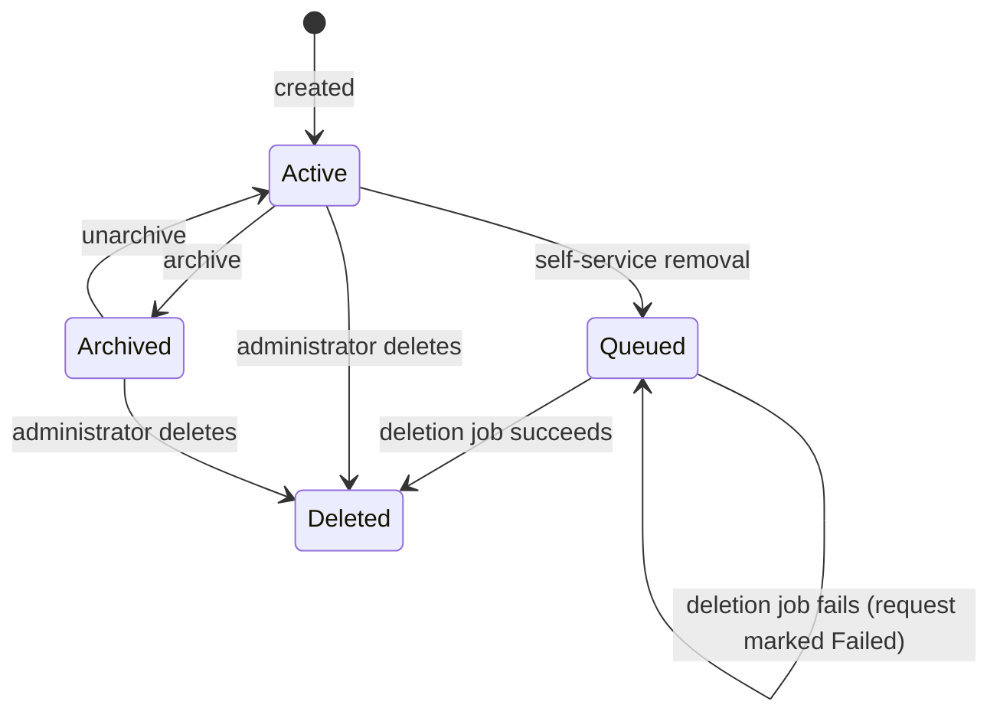

---

## 4. The user deletion request (stored)

**Field** `state` on the User Deletion Request.

| Value | Label | Meaning |
|---|---|---|
| `todo` | To Do | Waiting for the job. |
| `done` | Done | The account has been deleted, or was already gone when the job looked. |
| `fail` | Failed | The deletion raised; the transaction was rolled back. |

| From | To | Trigger | Guards | Side effects |
|---|---|---|---|---|
| — | To Do | Self-service account removal | — | — |
| To Do | Done | The job finds the request's account already absent | The link is empty | Counted in the job's progress before any real work |
| To Do | Done | The job deletes the account | The row lock is obtained; the request is still *To Do* | The account is deleted and the deletion is logged with the original requester's name; then the contact is deleted, and a failure there is logged as a warning but does not change the state |
| To Do | Failed | The account deletion raises | — | The transaction is rolled back and the failure is logged as an error |

A request in *Failed* is never retried automatically; an administrator must intervene.

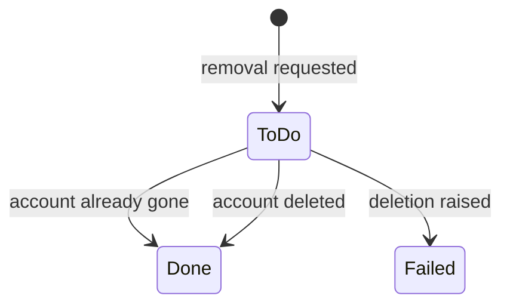

---

## 5. The onboarding step state (stored)

**Field** `step_state` on the Onboarding Step Progress; mirrored, per acting company, on the step
itself and aggregated on the panel.

### 5.1 States

| Value | Label | Meaning |
|---|---|---|
| `not_done` | Not done | The step has never been completed in this company. Usually there is no progress row at all, and the derived state of the step reads *Not done*. |
| `just_done` | Just done | The step was completed since the panel was last rendered. Exists so the completion animation is shown exactly once. |
| `done` | Done | Completed and already acknowledged. |

### 5.2 Transitions

| From | To | Trigger | Guards | Side effects |
|---|---|---|---|---|
| (no row) | Not done | Any read of the step's state | — | None; the absence of a row **is** *Not done* |
| (no row) | Just done | The step is marked as completed | — | A progress row is created for this step, linked to every progress row of every panel that contains the step and whose company is empty or the acting company; the company is the acting company when the step is per-company, empty otherwise |
| Not done | Just done | The step is marked as completed | The row's state is exactly *Not done* | — |
| Just done | Done | The panel is rendered | — | Consolidation: every *just done* row of the rendered panel becomes *Done* |
| Just done / Done | (row deleted) | The step's per-company flag is changed | — | Every progress row of the step is deleted, then the panels refresh their progress rows |

Marking an already-*Just done* or already-*Done* step as completed changes nothing; the operation
reports which rows it actually moved, so a caller can distinguish *just done now* from *was already
done*.

### 5.3 Diagram

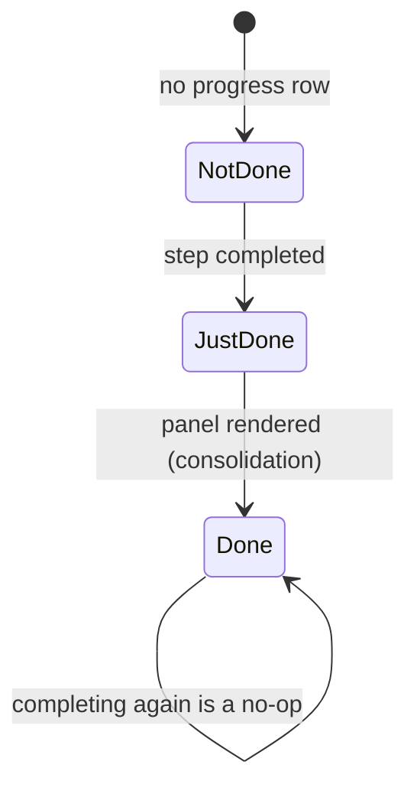

---

## 6. The onboarding panel state (derived and stored)

**Field** `onboarding_state` on the Onboarding Progress (stored, computed); surfaced on the panel as
the current completion state, and extended at render time with a fourth value.

### 6.1 States

| Value | Label | Meaning |
|---|---|---|
| `not_done` | Not done | The number of step-progress rows in *just done* or *done* differs from the number of steps of the panel. |
| `done` | Done | Those two numbers are equal. |
| `just_done` | Just done | Render-time only: the panel is *Done* **and** at least one step was consolidated during this render. |
| `closed` | (no label; render-time only) | The panel was dismissed. |

### 6.2 Transitions

| From | To | Trigger | Guards | Side effects |
|---|---|---|---|---|
| Not done | Done | The last outstanding step is completed | The counts become equal | The stored state is recomputed |
| Done | Not done | A step is added to the panel | The counts diverge again | The progress rows recompute their step links, then the stored state is recomputed |
| any | closed (render-time) | The panel is dismissed | — | The *was panel closed* flag on the current progress row is set |
| closed | any (render-time) | Visibility is toggled | — | The flag is inverted |

At render time the panel reports, per step, that step's current state, and then one overall value:
`closed` when the panel is dismissed; otherwise `just_done` when the stored state is *Done* and at
least one step was consolidated in this render; otherwise `done` when the stored state is *Done*;
otherwise nothing overall.

### 6.3 Diagram

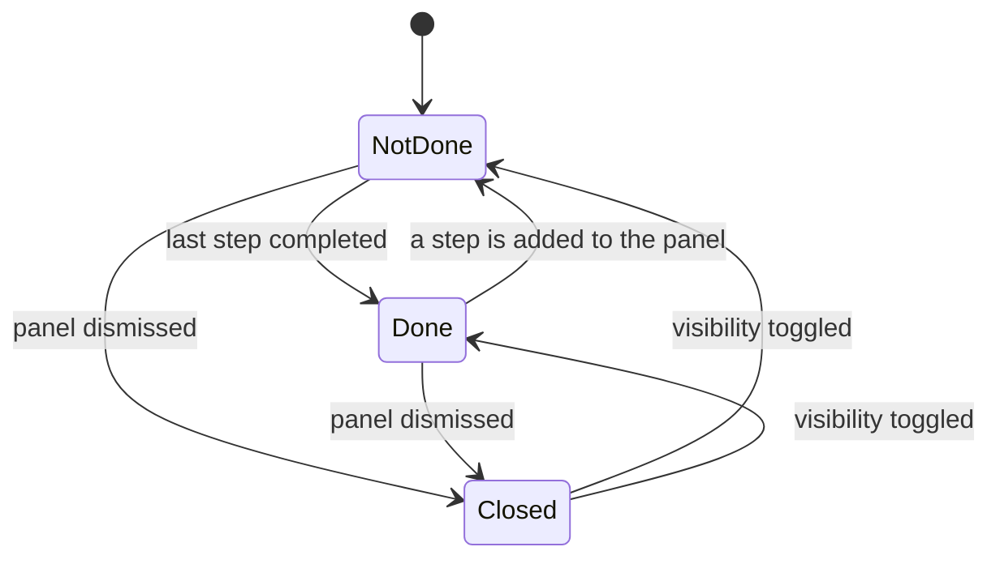

---

## 7. The recycling candidate state (stored)

**Field** `active` on the Recycling Candidate, plus the disappearance of the row.

### 7.1 States

| State | Representation | Meaning |
|---|---|---|
| Proposed | the row exists and the active flag is set | Awaiting a decision. Counted in the rule's outstanding count. |
| Discarded | the row exists and the active flag is clear | The operator refused. The row survives precisely so the record is never proposed again by this rule. |
| Consumed | the row is gone | The decision was taken and the pointed-at record was archived or deleted. |

### 7.2 Transitions

| From | To | Trigger | Guards | Side effects |
|---|---|---|---|---|
| — | Proposed | The rule collects records | The record satisfies the rule's filter and its date condition, and has no candidate row for this rule (active or discarded) | A row is created with the record identifier and the rule |
| Proposed | Consumed | Validation | — | The pointed-at record is archived (action *Archive*) or deleted (action *Delete*), both with elevation; a record that no longer exists is simply skipped; the candidate row is then deleted |
| Proposed | Discarded | Discard | — | The active flag is cleared |
| Discarded | Consumed | Validation of a discarded row | Only reachable by explicitly selecting archived candidates | Same as above |
| Proposed / Discarded | Consumed | The rule is deactivated | — | Every candidate row of the rule is deleted outright; the pointed-at records are untouched |

In *automatic* mode the Proposed state is transient: candidates are created and validated inside the
same batch, so nothing is ever visible to an operator.

### 7.3 Diagram

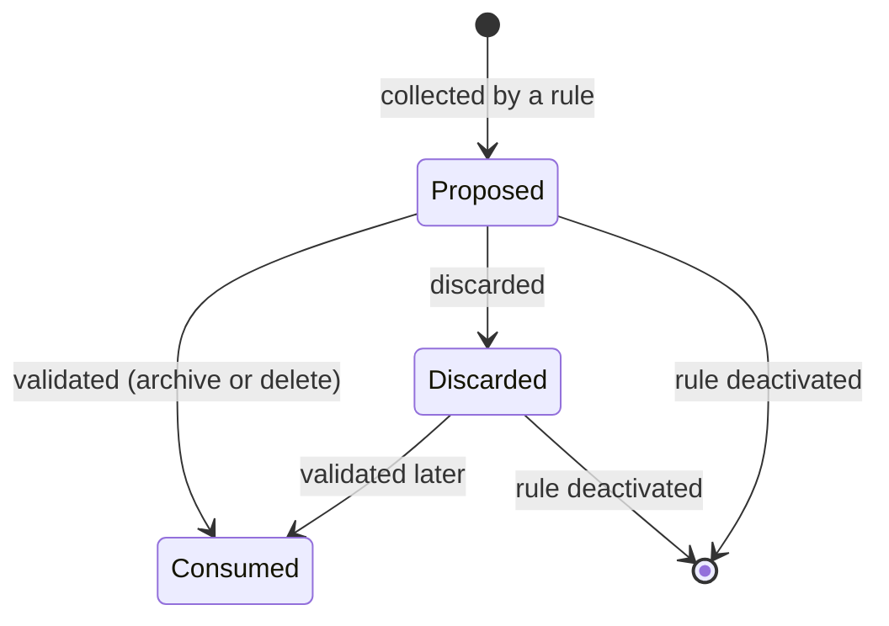

---

## 8. The device state (derived)

**Field** `revoked` on the Device Log; the Device view shows only non-revoked rows.

| State | Representation | Meaning |
|---|---|---|
| Live | the newest non-revoked log row for the (account, session, platform, browser) combination | Shown in the user's device list. |
| Superseded | a non-revoked log row that is not the newest of its combination | Not shown; kept for the network-address history; eventually removed by de-duplication. |
| Revoked | the revoked flag is set | Not shown. The session file no longer exists. |

| From | To | Trigger | Guards | Side effects |
|---|---|---|---|---|
| — | Live | A request updates the session trace | The trace is new, or its last activity is 3600 seconds or more old, and the session is not marked "tracing disabled" | A log row is inserted, on a writable connection if the current one is read-only |
| Live | Superseded | A newer row is written for the same combination | — | — |
| Live / Superseded | Revoked | The user revokes the device | The identity re-check passes | Every session with that session identifier is deleted from the session store; every log row with that identifier is marked revoked; if the current device was among them, the current session is signed out |
| Live / Superseded | Revoked | The sweep finds the session gone | The row's last activity is older than the maximum session inactivity and the session store does not know the identifier | The revoked flag is set, in batches of 100 000, with a commit between batches |
| Superseded | (row deleted) | De-duplication | Another row of the same (session, platform, browser, network address) has a greater last activity | — |

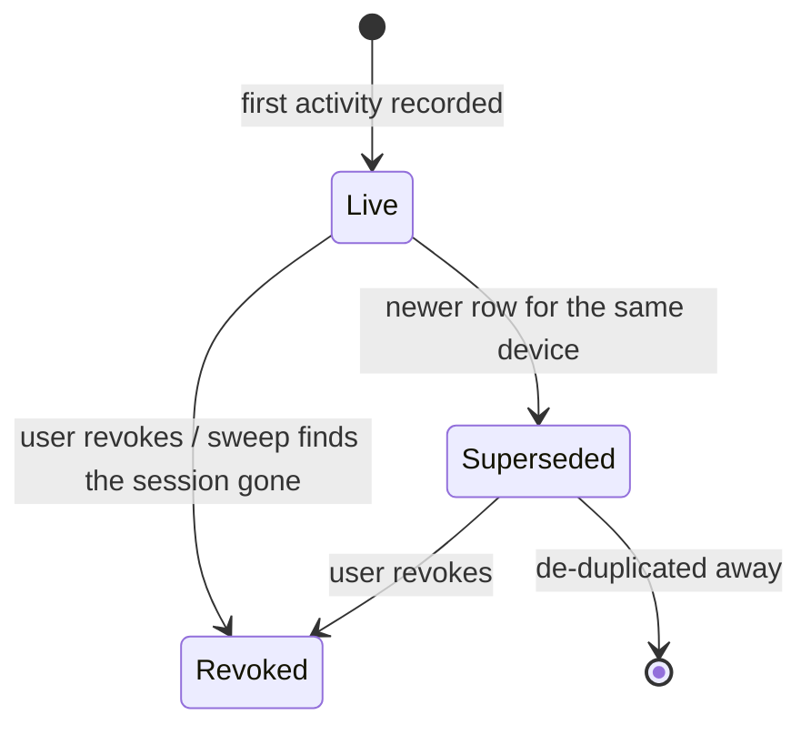

---

## 9. The second-factor state (derived)

**Field** `totp_enabled` on the User, derived from the presence of a secret.

| State | Representation | Meaning |
|---|---|---|
| Disabled | the secret is empty | Sign-in needs only the first factor. Programmatic connections accept a password. |
| Enabled | the secret is set | Sign-in demands a code unless a trusted-browser cookie or a passkey applies. Programmatic connections accept **only** an application key. |

| From | To | Trigger | Guards | Side effects |
|---|---|---|---|---|
| Disabled | Enabled | Enrolment completes | The identity re-check passes; the target is the acting account; the second factor is not already enabled; the typed code matches the proposed secret | The secret and the matched counter are stored; the session token is recomputed and written into the current session; the wizard's copy of the secret is blanked |
| Enabled | Disabled | Disabling | The identity re-check passes; the actor is the target, or an administrator, or elevated code | Every trusted browser is revoked; the secret is cleared; the session token is refreshed when the target is the acting account; a warning notice names the affected accounts |
| Enabled | Enabled | A password change | — | Every trusted browser is revoked first |

Changing the state invalidates every other session of the account, because the secret is a
session-token field.

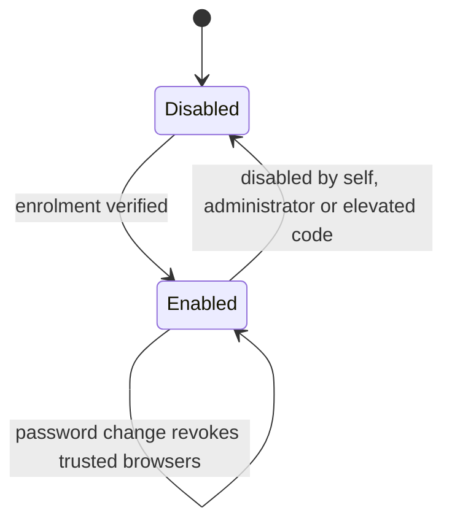

---

## 10. The trusted-browser state (derived)

A trusted browser is a scoped application key plus a cookie.

| State | Representation | Meaning |
|---|---|---|
| Trusted | a key row with the `browser` purpose, unexpired, and a matching cookie in the browser | The second-factor page is satisfied without a code. |
| Expired | the key row's expiry is past | Verification no longer returns it; the automatic clean-up eventually deletes the row. |
| Revoked | the key row has been removed | Verification fails; the cookie becomes inert. |

| From | To | Trigger | Guards | Side effects |
|---|---|---|---|---|
| — | Trusted | "Remember this browser" at the second-factor page | The code verified | A key is generated with elevation, expiring at now plus the trusted-browser age; the cookie is set with that maximum age, inaccessible to scripts, same-site *lax* |
| Trusted | Expired | Time passes | — | — |
| Trusted | Revoked | Revoke all trusted browsers, disable the second factor, or change one's own password | The identity re-check passes for the explicit revocation | The key rows are removed and the registry caches are cleared |

---

## 11. The passkey state (stored, implicit)

A passkey has no state field; its life is registration, use and deletion. The **signature counter**
is, however, a monotone state that must be reproduced.

| From | To | Trigger | Guards | Side effects |
|---|---|---|---|---|
| — | Registered (counter 0) | Registration completes | The identity re-check passes twice (opening and submitting); the challenge is present in the session; the assertion verifies against the challenge, the expected origins, the relying-party identifier and the user-verification requirement | A row is created through the account's passkey collection; the public key is written by direct column update; the session token is refreshed; the creation is logged |
| Registered (counter *n*) | Registered (counter *m*) | A successful authentication | The verifier accepts and reports a new counter *m* | The stored counter becomes *m*; the authentication result carries the policy *skip* |
| Registered | Deleted | Deletion | The identity re-check passes and the credential belongs to the acting account | The row is deleted through the account's passkey collection; the session token is refreshed; the deletion is logged. An attempt on someone else's credential does nothing and is logged |

The counter exists to detect a cloned authenticator: a verifier that sees a counter no greater than
the stored one rejects the assertion, and the rejection surfaces as a refusal carrying the
verifier's own message.

---

## 12. The portal access state (derived)

Derived, per contact, from the existence and the groups of the linked account. Shown on the grant
wizard as two booleans.

| State | Representation | Meaning |
|---|---|---|
| None | no account, or an archived account that is not internal and not external | The contact cannot sign in. |
| External | an active account holding *Role / Portal* | The contact can sign in to the customer-facing pages. |
| Internal | an account holding *Role / User* — **even if archived** | The contact is a member of the organisation; the grant wizard refuses to touch it. |

| From | To | Trigger | Guards | Side effects |
|---|---|---|---|---|
| None | External | Grant | The address is valid and not already used by a different account; the contact is neither external nor internal already | The contact's address is corrected if a new valid one was typed; an account is created from the external-user template in the contact's company (or the acting company) when there is none; the account is activated, given *Role / Portal* and stripped of *Role / Public*; a sign-up invitation is prepared; the invitation message is sent forcibly |
| External | None | Revoke | The contact is currently external | The address is corrected if needed; the contact's sign-up type is cleared so any outstanding token dies; the account is archived — it keeps *Role / Portal* |
| External | External | Invite again | The contact is currently external | The address is corrected if needed; a fresh sign-up invitation is prepared and sent |
| Internal | Internal | Any of the above | — | Refused: *The partner "…" already has the portal access.* for a grant, *The partner "…" has no portal access or is internal.* for a revoke |

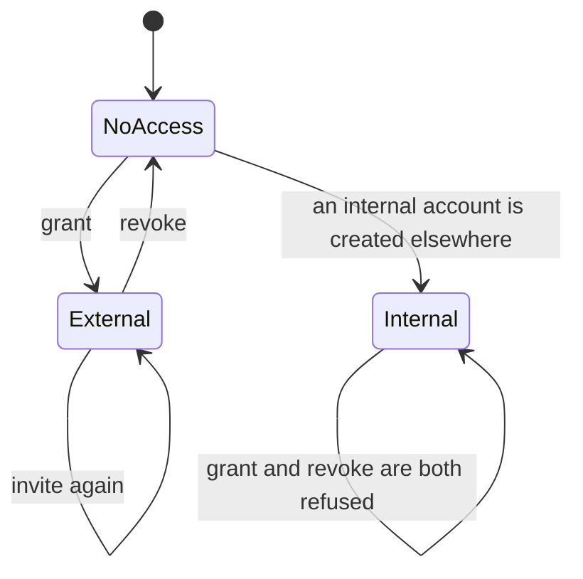

---

## 13. The sign-up invitation state (derived from the contact)

| State | Representation | Meaning |
|---|---|---|
| None | the contact's sign-up type is empty | No invitation outstanding; any previously issued token no longer resolves. |
| Sign-up | the type is `signup` | An invitation to create an account, valid for the sign-up validity (default 144 hours). |
| Reset | the type is `reset` | An invitation to set a new password, valid for the reset validity (default 4 hours). |

| From | To | Trigger | Guards | Side effects |
|---|---|---|---|---|
| None | Sign-up | Account creation with an address, or an explicit invitation, or a portal grant, or the bulk invitation | Not marked "no password mail"; not during a package installation or a file import | A token is computed and mailed; a delivery failure cancels the invitation |
| None | Reset | A password reset is requested | The account is not archived and has an address | A token is computed and mailed |
| Sign-up / Reset | None | Registration completes | — | The type is cleared before anything is written |
| Sign-up / Reset | None | The account is archived, or deleted, or the invitation is cancelled | — | The type is cleared |
| Sign-up / Reset | None (effectively) | The account signs in | — | The most recent sign-in moment changes, so the token stops resolving even though the type is unchanged |
| Sign-up / Reset | None (effectively) | The validity elapses | — | The signature's expiry check fails |

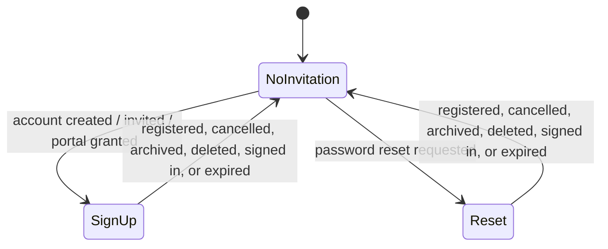

---

## 14. The application-key state (derived)

| State | Representation | Meaning |
|---|---|---|
| Valid | the row exists; the expiry is empty or not past; the account is active | Accepted in its purpose. |
| Expired | the expiry is past | Never selected by verification; deleted by the automatic clean-up. |
| Revoked | the row is gone | — |
| Inert | the row is valid but the account is archived | Verification joins to active accounts only, so the key is refused while the account is archived and works again if the account is re-activated. |

| From | To | Trigger | Guards | Side effects |
|---|---|---|---|---|
| — | Valid | Generation | The expiry validation passes; for the interactive path, the identity re-check passes and the actor is internal | The clear key is returned once |
| Valid | Expired | Time passes | — | — |
| Valid / Expired | Revoked | Removal | The actor is a system user, or every key belongs to the actor | The rows are deleted with elevation; the registry caches are cleared |
| Valid | Revoked | The account is removed through self-service | — | Every key of the account is removed |
| Expired | Revoked | The automatic clean-up runs | — | — |

---

## 15. The company life state (stored)

**Field** `active` on the Company.

| State | Meaning |
|---|---|
| Active | Usable; appears in the company switcher. |
| Archived | Hidden; never returned as a permitted company; its branches are archived with it. |

| From | To | Trigger | Guards | Side effects |
|---|---|---|---|---|
| Active | Archived | Write the active flag to false | No **active** account has this company as its default company, otherwise *The company … cannot be archived because it is still used as the default company of … users.* | Every branch beneath it is archived; the registry caches are cleared because the cached permitted-company lists depend on the flag |
| Archived | Active | Write the active flag to true | — | The registry caches are cleared. Branches are **not** un-archived automatically |

The company hierarchy itself has no state: a parent is chosen at creation and can never be changed
(*The company hierarchy cannot be changed.*), and duplication is refused outright.

---

## 16. The settings screen life (transient)

A settings record has no state field, but its life has three distinguishable moments and the middle
one can end the sequence early.

| Moment | What happens |
|---|---|
| Opened | The default values are read: user-defined defaults, group implications, package states and stored parameters are projected **into** the record. |
| Saved | The projections are written **out** (defaults, groups, parameters), then packages are considered. |
| Reloaded or diverted | If any package must be uninstalled, the uninstall confirmation dialogue is returned and the rest of the sequence does not run in this call. Otherwise installations happen, the transaction is reset when anything was installed, and the client is told to reload. |

Saving is refused for a non-administrator: *Only administrators can change the settings*.

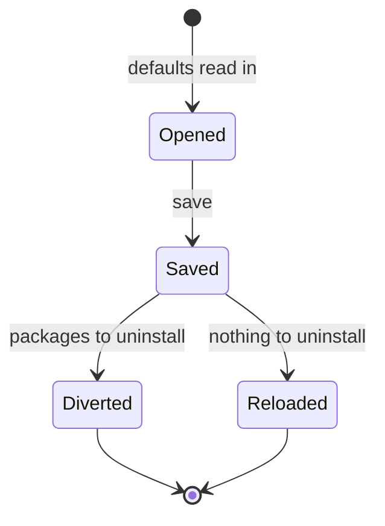
