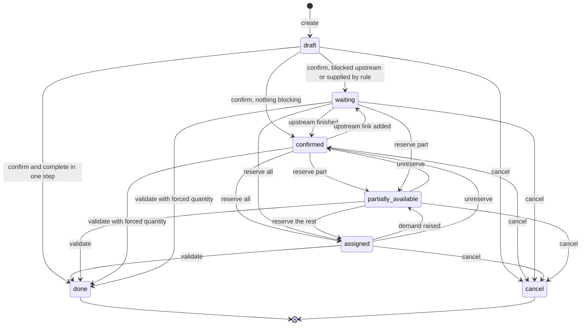
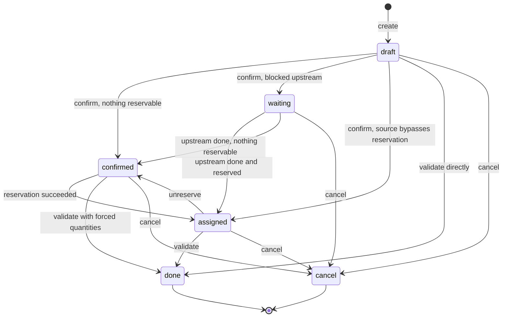
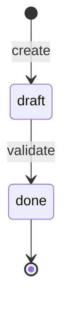
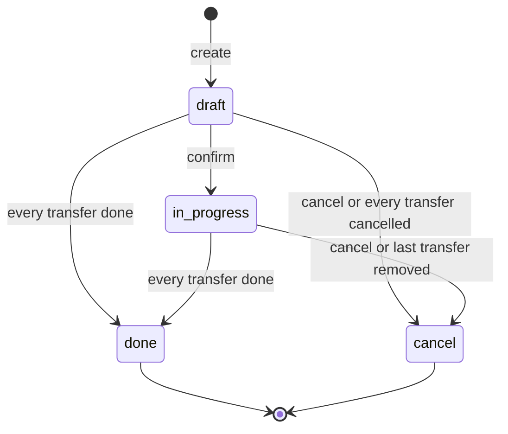

# Inventory Operations — State Machines

This domain has five state fields. Two of them are authoritative (a person or an algorithm writes them): the Stock Move status and the Scrap status. Two are derived (they are computed from other records and can never be written directly): the Transfer status and the Batch Transfer status. The fifth, the Stock Move Line status, is a mirror of its Stock Move's status.

There are also four boolean state-like flags that behave as latches and are specified here because transitions depend on them: the Transfer lock flag, the Transfer printed flag, the picked flag on Stock Moves and Stock Move Lines, and the counted flag on Stock Quantity records.

---

# 1. Stock Move status

## 1.1 States

| Value | Label | Meaning |
|---|---|---|
| `draft` | New | The move exists but promises nothing. No reservation. It may be freely edited or deleted. |
| `waiting` | Waiting Another Move | The move is confirmed but at least one move that must happen first is still open, or the move is configured to be supplied by another rule and no supplying move exists yet. |
| `confirmed` | Waiting | The move is confirmed, nothing blocks it upstream, but no quantity could be reserved. |
| `partially_available` | Partially Available | Some but not all of the demand is reserved. |
| `assigned` | Available | The whole demand is reserved (or the move bypasses reservation, or the demand is zero). |
| `done` | Done | The goods have physically moved. Terminal. |
| `cancel` | Cancelled | The move will never happen. Terminal. |

## 1.2 Transition table

| From | To | Trigger | Guard conditions | Side effects |
|---|---|---|---|---|
| (none) | `draft` | Create a move | The product must be goods, not a service. | The reordering rules of the affected products and warehouses are marked for recomputation. When the Transfer given at creation is already done, the move is created directly in `done` and picked. |
| `draft` | `waiting` | Confirm | The move has at least one originating move, **or** its supply method is advanced. | When the supply method is advanced, a supply request is raised for the source Location, which may create the supplying moves. The move is grouped into a Transfer when it has an Operation Type and no Transfer yet. |
| `draft` | `confirmed` | Confirm | Neither of the above; the rule that created the move is not the take-from-stock-else-trigger kind, or it is but the forecast covers the need. | Same grouping into a Transfer. For the take-from-stock-else-trigger kind, a supply request is raised for the missing part only. |
| `draft` | `cancel` | Cancel | — | See 1.4. |
| `waiting` | `confirmed` | Recompute after the last blocking originating move became done or cancelled, or after the originating links were cleared | No originating move with a positive demand is still open, and the supply method is take-from-stock or a supplying move exists. | None. |
| `confirmed` | `waiting` | Recompute after an originating link was added | At least one originating move with a positive demand is open, or the supply method is advanced and no originating move exists. | None. |
| `confirmed` / `waiting` / `partially_available` | `partially_available` | Reserve | A non-zero quantity, smaller than the demand, could be taken. | Stock Move Lines are created; the reserved counters on the matching Stock Quantity records are raised; put-away is applied to the new lines; the containing Transfer re-checks whole containers. |
| `confirmed` / `waiting` / `partially_available` | `assigned` | Reserve | The whole missing quantity could be taken, **or** the move bypasses reservation, **or** the demand is zero. | As above. For a bypassing move no reserved counter is raised. |
| `assigned` / `partially_available` | `confirmed` | Unreserve | The move is not done, not cancelled and not picked. | Every unpicked Stock Move Line is deleted, lowering the reserved counters. The status is then recomputed, which gives `confirmed`, or `waiting` when an originating move is still open. |
| `assigned` | `partially_available` | Raise the demand on a move that is not being unreserved | — | None. |
| any open state | `done` | Complete | The move is picked, its processed quantity is greater than zero (or it is an adjustment move), and it is not cancelled. | See 1.5. |
| any open state | `cancel` | Cancel | The move is not done, unless its destination Location has inventory-loss usage. | See 1.4. |
| `done` | — | — | A done move can never be cancelled: "You cannot cancel a stock move that has been set to 'Done'. Create a return in order to reverse the moves which took place." | — |

## 1.3 Status recomputation

Whenever the detail lines change, the demand changes, or the originating links change, the status is recomputed by the following numbered rule. Let *demand* be the demand in the line unit and *processed* be the sum of the detail-line quantities expressed in the line unit.

1. If the status is cancelled or done, stop; the status does not change.
2. If the status is draft and the processed quantity is zero, stop.
3. If *processed* is greater than or equal to *demand* (compared at the precision of the line unit), the status becomes `assigned`.
4. Otherwise, if *processed* is non-zero and less than or equal to *demand*, the status becomes `partially_available`.
5. Otherwise, if the supply method is advanced and there is no originating move, **or** at least one originating move has a positive demand and is neither done nor cancelled, the status becomes `waiting`.
6. Otherwise the status becomes `confirmed`.

The recomputation can be suppressed for one operation by the preserve-state switch; the completion algorithm uses this so that a move being completed is not pulled back to an open status by an intermediate write.

## 1.4 Cancellation side effects

1. Refuse outright when any move in the set is done and its destination Location usage is not inventory loss.
2. Restrict the set to the moves that are neither already cancelled nor done-into-inventory-loss.
3. Clear the picked flag on those moves.
4. Unreserve them: delete their unpicked detail lines and lower the reserved counters.
5. Set their status to cancelled.
6. For each cancelled move, look at the statuses of its *siblings* — the other originating moves of its destination moves:
   - When the move propagates cancellation and every sibling is cancelled, cancel recursively the destination moves that are not done and whose source Location equals this move's destination Location; for the remaining destination moves, switch their supply method to take-from-stock and drop the link to this move. In addition, when the system parameter that cancels originating moves is on, cancel recursively the originating moves that are not done.
   - When the move does not propagate cancellation and every sibling is done or cancelled, switch every destination move to take-from-stock and drop the link to this move.
7. Unless activity logging is suppressed, schedule the cancellation warning activity on the upstream documents.
8. Clear the originating links of the cancelled moves and set their supply method to take-from-stock.

## 1.5 Completion side effects

The full algorithm, including backorders and over-processing, is in `calculations.md`, section "Completion algorithm". In summary: the detail lines move the quantities, the status becomes done, the processing instant is stamped as the date, push rules are applied, destination moves are re-reserved, and the containing Transfer creates its backorder.

## 1.6 Diagram

---

# 2. Transfer status

The Transfer status is never written; it is always derived from the statuses of its moves. It is stored so that it can be searched and grouped, and it is tracked in the discussion thread.

## 2.1 States

| Value | Label | Meaning |
|---|---|---|
| `draft` | Draft | The Transfer has no moves at all, or at least one move is still new. |
| `waiting` | Waiting Another Operation | The Transfer is blocked by an upstream operation. |
| `confirmed` | Waiting | The Transfer is confirmed but cannot be processed: with the as-soon-as-possible policy, nothing at all could be reserved; with the all-at-once policy, not everything could be reserved. |
| `assigned` | Ready | The Transfer can be processed: with the as-soon-as-possible policy, at least one line is reserved; with the all-at-once policy, every line is reserved; a Transfer whose source Location bypasses reservation is always ready. |
| `done` | Done | Every move is done or cancelled and at least one done move is not a scrap. |
| `cancel` | Cancelled | Every move is cancelled, or every done move went to an inventory-loss Location while at least one move was cancelled for another reason. |

## 2.2 Computation

For each Transfer, read the statuses of all of its moves and compute five indicators:

- *any new* — at least one move is in status draft.
- *all cancelled* — every move is cancelled.
- *all finished* — every move is cancelled or done.
- *all done are scrapped* — every done move has a destination Location with inventory-loss usage.
- *any cancelled and not scrapped* — at least one move is cancelled and its destination Location usage is not inventory loss.

Then:

1. If the Transfer has no moves at all, or *any new* is true, the status is `draft`.
2. Otherwise, if *all cancelled* is true, the status is `cancel`.
3. Otherwise, if *all finished* is true:
   - if *all done are scrapped* and *any cancelled and not scrapped* are both true, the status is `cancel`;
   - otherwise the status is `done`.
4. Otherwise, if the Transfer's source Location bypasses reservation **and** every move uses the take-from-stock supply method, the status is `assigned`.
5. Otherwise, compute the *relevant status among the moves* (section 2.3). If that is `partially_available`, the status is `assigned`; otherwise it is that status.

## 2.3 Relevant status among a set of moves

This subroutine turns a set of move statuses into the one status that best represents the group. It is also used when merging moves.

1. Keep only the moves that are neither cancelled nor done, and drop any move that is `assigned` with a zero demand. Call this set *open*.
2. Sort *open* by importance descending, where importance is: `assigned` = 4, `waiting` = 3, `partially_available` = 2, `confirmed` = 1, anything else = 0; ties are broken by demand ascending.
3. If *open* is empty, return `assigned`.
4. If the first move of *open* belongs to a Transfer whose shipping policy is all-at-once:
   - if every move of *open* has a zero demand, return `assigned`;
   - otherwise take the most important move: if its status is `confirmed`, return `confirmed`; if it is `partially_available`, return `confirmed`; otherwise return its status, or `draft` if it has none.
5. Otherwise, if the most important move is not `assigned` but at least one move of *open* is `assigned` or `partially_available`, return `partially_available`.
6. Otherwise take the least important move: if its status is `confirmed` and its demand is zero, return `assigned`; otherwise return its status, or `draft` if there is none.

## 2.4 Transition table

| From | To | Trigger | Guard | Side effects |
|---|---|---|---|---|
| (none) | `draft` | Create | The Operation Type is required. | A reference is drawn from the Operation Type's sequence. Moves marked additional cause an immediate confirmation. |
| `draft` | `confirmed` / `waiting` / `assigned` | Confirm | At least one move leaves draft. | Every draft move is confirmed; the replenishment scheduler is triggered for the moves that are forecast short. |
| `confirmed` / `waiting` | `assigned` | Reserve | The reservation succeeded per the policy. | Detail lines created, reserved counters raised, whole containers detected. |
| `assigned` | `confirmed` / `waiting` | Unreserve | — | Unpicked detail lines deleted, reserved counters lowered. |
| `assigned` / `confirmed` / `waiting` / `draft` | `done` | Validate | The sanity check passes and the backorder decision is settled. | See `workflows.md`, section "Validating a transfer". The completion instant is stamped, the priority is reset to normal, the backorder is created, the confirmation message and text message are sent, inter-company containers are unpacked. |
| any open state | `cancel` | Cancel | No move is done. | Every move is cancelled; the Transfer is locked; a Transfer with no moves at all is written directly to cancelled. |
| `done` | — | — | Terminal; the only way back is a return, which is a new Transfer. | — |

## 2.5 Diagram

---

# 3. Stock Move Line status

A Stock Move Line has no status of its own: its status field mirrors the status of its Stock Move and is stored only so that lines can be filtered efficiently.

Consequences of that mirroring:

| Move status | What may be done to the line |
|---|---|
| `draft` | Everything, including changing the product. |
| `waiting`, `confirmed`, `partially_available`, `assigned` | Change the quantity, the lot, the containers, the owner, the Locations and the unit. Each such change re-synchronises the reserved counters: the old characteristics are unreserved in full and the new ones are reserved up to what is available. |
| `done` | Change the quantity and characteristics only while the Transfer is unlocked. Each change undoes the original movement on the quantity records and redoes it with the new values, then re-reserves the downstream moves. Deleting the line is refused: "Deleting product moves after the transfer is done?\n\nThat would be like going back in time to revert all operations triggered after this move. Who knows what the end result would be, So let's not do it.\n\nTry changing the “done” quantity to 0 instead." |
| `cancel` | Deleting is refused with the same message. |

---

# 4. Scrap status

| Value | Label | Meaning |
|---|---|---|
| `draft` | Draft | The scrap is only a plan. |
| `done` | Done | The goods have left the source Location for the scrap Location. Terminal. |

| From | To | Trigger | Guard | Side effects |
|---|---|---|---|---|
| (none) | `draft` | Create | A product, a source Location of internal usage and a scrap Location of inventory-loss usage are required. | — |
| `draft` | `done` | Validate | The quantity is strictly positive, else "You can only enter positive quantities." The available quantity at the exact source characteristics must cover the quantity; when it does not, the shortage warning is shown first and the person may confirm anyway. | A reference is drawn from the scrap sequence. One Stock Move is created already picked, from the source Location to the scrap Location, with a single detail line carrying the lot, the container and the owner; the move is completed immediately with backorder creation suppressed. The completion instant is stamped. When the replenish switch is on, a supply request for the scrapped quantity at the source Location is run. |
| `done` | — | — | Terminal. Deleting is refused: "You cannot delete a scrap which is done." | — |

---

# 5. Batch Transfer status

| Value | Label | Meaning |
|---|---|---|
| `draft` | Draft | The batch is being composed. Draft Transfers may still be added. |
| `in_progress` | In progress | The batch has been confirmed; its Transfers have been confirmed too. |
| `done` | Done | Every Transfer of the batch is done or cancelled, and at least one is done. Terminal. |
| `cancel` | Cancelled | Every Transfer of the batch is cancelled, or the batch was cancelled by hand. Terminal. |

## 5.1 Computation and transitions

The status is computed, but only ever moves forward: batches already in `done` or `cancel` are left alone, and the computation can only raise `draft` or `in_progress` to `done` or `cancel`.

1. If the batch has no Transfers, the computation leaves the status unchanged.
2. If every Transfer is cancelled, the status becomes `cancel`.
3. Otherwise, if every Transfer is cancelled or done, the status becomes `done`.

| From | To | Trigger | Guard | Side effects |
|---|---|---|---|---|
| (none) | `draft` | Create | — | A name is drawn from the batch or wave sequence and reshaped with the Operation Type's prefix. Automatic batches are confirmed at once when the Operation Type asks for it. |
| `draft` | `in_progress` | Confirm | The batch must have at least one Transfer, else "You have to set some pickings to batch." | Every Transfer of the batch is confirmed; the company consistency check runs. |
| `draft` / `in_progress` | `done` | Validate the batch | Every Transfer with something to process passes the shared sanity check. | Empty waiting Transfers and, when at least one other Transfer has something to process, empty ready Transfers, are detached from the batch instead of being validated. A note is posted on every validated Transfer: "**Transferred by:** Batch Transfer *link to the batch*". A note is posted on the batch naming the detached Transfers: "*the list of links* was removed from the batch, no quantity processed". The remaining Transfers are validated together with the sanity check suppressed. |
| `draft` / `in_progress` | `cancel` | Cancel | — | The status is set to cancelled and the Transfers are detached from the batch (they are **not** cancelled themselves). |
| `in_progress` | `cancel` | Remove the last Transfer | The batch has no Transfers left. | Automatic. |
| `done` | — | — | Terminal. Deleting is refused: "You cannot delete Done batch transfers." | — |

---

# 6. Latching flags

## 6.1 The picked flag

The picked flag exists on Stock Moves and Stock Move Lines. It means "a person has physically handled this quantity". It drives the completion algorithm: only picked lines are completed; unpicked lines of a picked move are deleted at completion.

| Level | Rule |
|---|---|
| Stock Move Line | Forced true when the move is done, or when the screen asked for automatic picking. On creation it inherits the move's value. Writing it to true re-stamps the line's date with the current instant. |
| Stock Move | Computed: true when the move is done or at least one of its lines is picked; false when the move has lines and none is picked. Writing it writes the same value on all of its lines. |
| Transfer | Not a field. At validation, if any move has a processed quantity but no move (other than a scrap move) is picked, every move of the Transfer is marked picked. |

Cancelling a move clears the flag. Moving moves into a backorder clears the flag on them.

## 6.2 The lock flag on a Transfer

| Value | While the Transfer is open | While the Transfer is done |
|---|---|---|
| true (default) | The demand of the moves may not be edited. | The processed quantities may not be edited and the scheduled date is frozen. |
| false | The demand may be edited. | The processed quantities and the date may be edited; every edit re-plays the quantity movements. |

Cancelling a Transfer forces the flag to true. The flag is toggled by an explicit action and is not copied.

## 6.3 The printed flag on a Transfer

Set to true when the transfer document is printed. Its only behavioral effect is that a printed Transfer is no longer eligible to absorb newly created moves: the search for a Transfer to group a move into excludes printed Transfers.

## 6.4 The counted flag on a Stock Quantity record

| Transition | Trigger | Effect |
|---|---|---|
| false → true | A counted quantity is written, or the "set current quantity" action is used, or a count is requested with the "set current value" choice. | The difference field starts being computed as counted minus on hand. |
| true → false | The counts are applied, or the clear action is used, or a count is requested with the "leave empty" choice. | The counted quantity, the difference and the assignee are cleared. |

While the flag is true, the record also exposes the *outdated* indicator, which turns true as soon as the on-hand quantity moves without the count being re-entered.

---

# 7. How the state fields interact

The five state fields are not independent. This section states, for each pair that interacts, exactly which one drives which.

| Driver | Driven | Rule |
|---|---|---|
| Stock Move status | Transfer status | The Transfer status is recomputed whenever any of its moves' statuses changes, whenever a move is added or removed, and whenever the shipping policy changes. It is never written directly. |
| Stock Move status | Stock Move Line status | The line's status **is** the move's status, stored redundantly so that lines can be filtered without joining. |
| Stock Move Line quantities | Stock Move status | Creating, changing or deleting a line recomputes its move's status through the rule of section 1.3, because the move's processed quantity is the sum of the lines. |
| Transfer status | Stock Move status | Only in one direction and only at creation: a move created on a done Transfer is created done and picked. |
| Transfer status | Batch Transfer status | The batch status is recomputed whenever any of its Transfers' statuses changes, and only ever moves forward. |
| Batch Transfer status | Transfer status | Only through actions: confirming a batch confirms its Transfers, validating a batch validates them. |
| Scrap status | Stock Move status | Validating a Scrap creates and immediately completes exactly one move. |
| Stock Move status | Scrap status | None. The Scrap is not recomputed from its move. |

**The one asymmetry worth naming.** A Transfer whose moves are all done is `done`, but a Transfer whose only done moves are scraps and which also has a move cancelled for another reason is `cancel`. This is the single place where a Transfer's status is not simply the aggregate of its moves.

---

# 8. Reaching each state: the complete entry list

## 8.1 Stock Move

| State | Every way to reach it |
|---|---|
| `draft` | Created by hand; created by a copy; created by a rule before confirmation; created by a split of a confirmed move (the split move is created in draft and then confirmed by the caller); created by the return screen. |
| `waiting` | Confirmed with originating moves; confirmed with the advanced supply method; recomputed after an originating link is added; recomputed after a demand change that leaves the move short with a blocking predecessor. |
| `confirmed` | Confirmed with nothing blocking; recomputed after the last blocking predecessor finished; recomputed after unreserving; written directly by the Reception Report when it splits a demand (so that no unintended reservation is created); recomputed after a demand change. |
| `partially_available` | Reserved partially; the demand of an assigned move is raised; recomputed when the processed quantity is non-zero and below the demand. |
| `assigned` | Reserved fully; reserved with a bypassing source Location; the demand is zero; recomputed when the processed quantity is at least the demand; recomputed when the least important open move is confirmed with a zero demand. |
| `done` | Completed through the completion algorithm; created directly on a done Transfer; created directly by an adjustment, a relocation, a scrap or an unpack, all of which complete immediately. |
| `cancel` | Cancelled directly; cancelled by the propagation from an upstream move; cancelled by the pruning step of a completion with backorders forbidden; cancelled by the merge when its demand reaches zero; cancelled and then deleted by the merge when it is absorbed; cancelled by deleting its Transfer. |

## 8.2 Transfer

| State | Every way to reach it |
|---|---|
| `draft` | Created; a move in draft is added; every move is in draft. |
| `waiting` | Derived when the relevant status among the moves is `waiting`. |
| `confirmed` | Derived when the relevant status is `confirmed`, which with the all-at-once policy also covers the case where the most important open move is only partially available. |
| `assigned` | Derived when the relevant status is `assigned` or `partially_available`; derived unconditionally when the source Location bypasses reservation and every move takes from stock. |
| `done` | Derived when every move is done or cancelled and it is not the all-scraps case. |
| `cancel` | Derived when every move is cancelled; derived in the all-scraps case; written directly when the Transfer has no move at all and is cancelled. |

## 8.3 Batch Transfer

| State | Every way to reach it |
|---|---|
| `draft` | Created. |
| `in_progress` | Confirmed by hand; confirmed automatically at creation when the Operation Type auto-confirms. |
| `done` | Derived when every Transfer is done or cancelled and at least one is done. |
| `cancel` | Cancelled by hand; derived when every Transfer is cancelled; written when the last Transfer is removed from an in-progress batch. |

## 8.4 Scrap

| State | Every way to reach it |
|---|---|
| `draft` | Created. |
| `done` | Validated; validated through the shortage confirmation. |

---

# 9. Leaving each state: what is still possible

## 9.1 A draft move

Everything: change the product, the unit, the Locations, the demand, the Operation Type; delete it; confirm it; cancel it. A draft move holds no reservation and promises nothing to anybody.

## 9.2 A waiting or confirmed move

- The demand may be changed; the reservation consequences of `business-rules.md`, section 5.1, apply.
- The Locations may be changed; the consequences of `business-rules.md`, section 5.2, apply.
- The unit may be changed.
- It may be reserved, cancelled, split or merged.
- It may **not** be deleted when it is chained.

## 9.3 A partially available or assigned move

Everything a confirmed move allows, plus: it may be unreserved; it may be completed. Raising its demand downgrades it; lowering its demand below what is reserved unreserves it entirely and then re-reserves from scratch.

## 9.4 A done move

- Its date may be changed, which copies onto its lines.
- Its detail lines' quantities and characteristics may be changed while the Transfer is unlocked, which replays the movement.
- It may **not** be cancelled, unreserved, split, merged, deleted, or have its unit changed.
- A new detail line may be added to it, which moves the quantity immediately.

## 9.5 A cancelled move

- Its processed quantity may not be written.
- It may be deleted when it is not chained.
- It holds no reservation, no originating links and the take-from-stock supply method, because cancellation clears all three.

---

# 10. The state of a transfer, worked through every combination

Two moves, as-soon-as-possible policy, both with a positive demand. The table gives the relevant status among the moves and the resulting Transfer status.

| Move A | Move B | Relevant status | Transfer |
|---|---|---|---|
| draft | draft | — | `draft` |
| draft | assigned | — | `draft` |
| cancel | cancel | — | `cancel` |
| done | done | — | `done` |
| done | cancel | — | `done` |
| done into inventory loss | cancel not into inventory loss | — | `cancel` |
| waiting | waiting | `waiting` | `waiting` |
| waiting | confirmed | `confirmed` | `confirmed` |
| waiting | partially_available | `partially_available` | `assigned` |
| waiting | assigned | `partially_available` | `assigned` |
| confirmed | confirmed | `confirmed` | `confirmed` |
| confirmed | partially_available | `partially_available` | `assigned` |
| confirmed | assigned | `partially_available` | `assigned` |
| partially_available | partially_available | `partially_available` | `assigned` |
| partially_available | assigned | `assigned` | `assigned` |
| assigned | assigned | `assigned` | `assigned` |
| assigned | cancel | `assigned` | `assigned` |
| assigned | done | `assigned` | `assigned` |

The same table with the **all-at-once** policy:

| Move A | Move B | Relevant status | Transfer |
|---|---|---|---|
| waiting | waiting | `waiting` | `waiting` |
| waiting | confirmed | `waiting` | `waiting` |
| waiting | partially_available | `waiting` | `waiting` |
| waiting | assigned | `assigned` | `assigned` |
| confirmed | confirmed | `confirmed` | `confirmed` |
| confirmed | partially_available | `confirmed` | `confirmed` |
| confirmed | assigned | `assigned` | `assigned` |
| partially_available | partially_available | `confirmed` | `confirmed` |
| partially_available | assigned | `assigned` | `assigned` |
| assigned | assigned | `assigned` | `assigned` |

Read the all-at-once rows through the subroutine: the moves are sorted by importance descending (assigned 4, waiting 3, partially available 2, confirmed 1), the **most** important one is examined, and `confirmed` and `partially_available` both answer `confirmed` while anything else answers its own status. That is why a pair of `waiting` moves answers `waiting` and a `waiting` beside an `assigned` answers `assigned`: `waiting` outranks `partially_available` and `confirmed` in the importance order.

---

# 11. A note on the two "waiting" labels

Three different things are called waiting, and they must not be confused:

| Thing | Value | Label | Meaning |
|---|---|---|---|
| A move blocked upstream | `waiting` | "Waiting Another Move" | Something must happen before this move can even be attempted. |
| A move that is not blocked but has nothing reserved | `confirmed` | "Waiting" | The move may be attempted at any time; there is simply no stock. |
| A Transfer blocked upstream | `waiting` | "Waiting Another Operation" | Same as the first, at document level. |
| A Transfer that is not blocked but cannot be processed | `confirmed` | "Waiting" | Same as the second, at document level. |

The stored value `confirmed` therefore carries the label "Waiting" on both entities, while the stored value `waiting` carries a label that names the blockage. An implementation must keep the stored values, not the labels, as the contract.

---

# 12. Guard conditions, collected

Every guard that appears anywhere in this file, restated once as a testable predicate, so that an implementation can assert them.

| Guard | Predicate |
|---|---|
| The move may be confirmed | its status is `draft` |
| The move must wait upstream | it has at least one originating move, or its supply method is advanced |
| The move may be reserved | it is not picked and its status is `confirmed`, `waiting` or `partially_available` — unless a quantity is forced, in which case any status is processed |
| The move bypasses reservation | its source Location's usage is vendor, customer, inventory loss or production, or its product is not storable |
| The move is eligible for automatic reservation | it bypasses reservation, or its Operation Type reserves at confirmation, or its reservation date is on or before today |
| The move may be unreserved | it is not cancelled; it is not done unless its destination usage is inventory loss; it is not picked |
| The move may be completed | it is picked, and either its processed quantity is strictly positive or it is an adjustment move, and it is not cancelled |
| The move may be cancelled | it is not done, unless its destination usage is inventory loss |
| The move may be split | its status is neither `done`, `cancel` nor `draft` |
| The move may be merged | its status is neither `done`, `cancel` nor `draft`, and its whole merge key matches |
| The move may be deleted | its status is `draft` or `cancel`, or it has no chain links |
| Cancellation propagates downstream | the move propagates cancellation and every sibling is cancelled |
| Cancellation unlinks downstream | the move does not propagate cancellation and every sibling is done or cancelled |
| The destination move is cancelled rather than unlinked | it is not done and its source Location equals the cancelled move's destination Location |
| The Transfer may be confirmed | at least one move is in `draft` |
| The Transfer may be validated | its status is not `done` |
| The Transfer may be returned | its status is `done` |
| The Transfer may be split | at least one move has a non-zero processed quantity, not every move is fully processed, and no move is over-processed |
| The Transfer ignores the backorder policy | its return link is set |
| The Transfer shows the availability button | its status is `confirmed`, `waiting` or `assigned`; not every move is picked or fully processed; at least one move is open with a non-zero demand |
| The batch may be confirmed | it has at least one Transfer |
| The batch may be merged | at least two are selected, sharing one Operation Type, one kind (batch or wave) and one state, and that state is neither `done` nor `cancel` |
| The batch may be deleted | its status is not `done` |
| A Transfer belongs in a batch | it is of the same company, of the batch's Operation Type when the batch has one, and its status is `waiting`, `confirmed` or `assigned` — plus `draft` when the batch itself is `draft` |
| The Scrap may be validated | its quantity is strictly positive at its unit's precision |
| The Scrap may be deleted | its status is `draft` |
| A container may be taken over as an entire package | its type is not reusable, and the lines of a single Transfer reproduce its contents exactly |
| A container may be promoted into its parent | every child of the parent is being moved and the parent's type is not reusable |
| A detail line requires a lot at completion | its product is tracked, its quantity is strictly positive, its move has an Operation Type, and that type allows creating or using existing lots, and the line has neither a Lot nor a typed name |
| A quantity record may be deleted automatically | its on-hand, reserved and counted quantities all round to zero and it has no assignee |
| A count may be applied without asking | no selected record is outdated |
