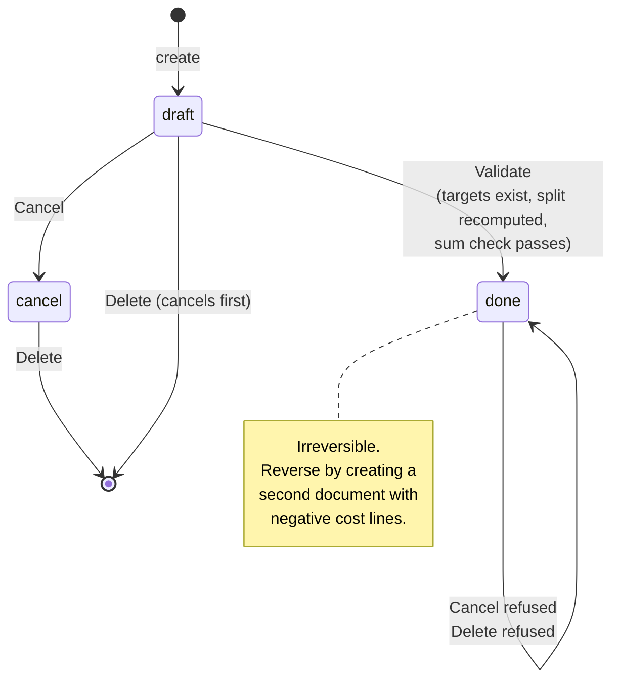
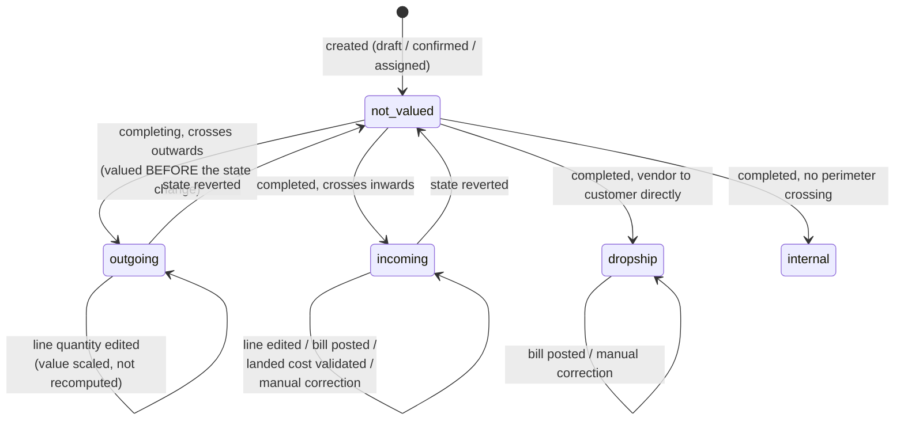
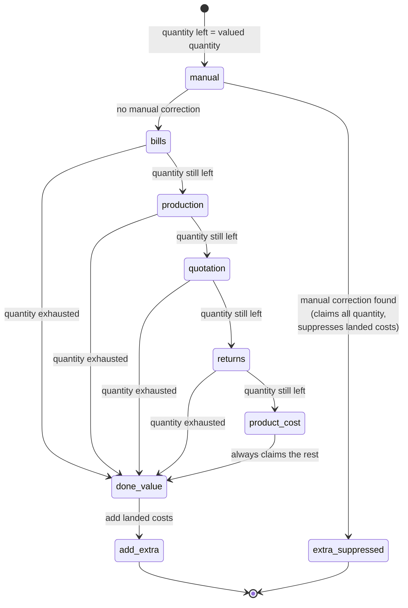
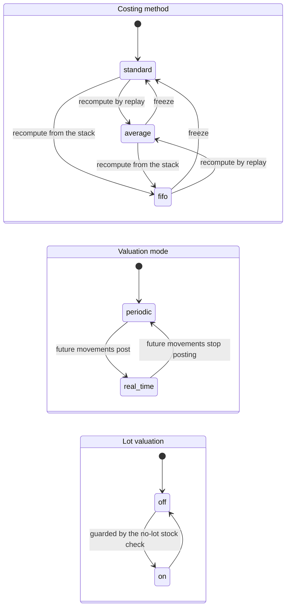

# State machines of the Inventory Valuation and Costing domain

This domain contains one genuine stored state field (the landed cost document), one
derived classification carried by three stored flags (the valuation status of a goods
movement), and several configuration transitions that behave like state changes because
they trigger irreversible recomputations.

> **Reproduced text.** Quoted, bolded strings in this file are user-facing text the
> system emits character for character — error messages, selection labels, button
> labels, action titles. Where such a string contains an abbreviation it belongs to
> the emitted string, not to this specification's prose: "FIFO" stands for *first in
> first out*, "AVCO" for *average cost*, "WIP" for *work in progress*, "MOs" for
> *manufacturing orders*, "BoM" for *bill of materials*, `STJ` for the inventory
> valuation journal code and `LC/` for the landed cost sequence prefix.

---

## 1. Landed Cost state machine

### 1.1 States

| Storage value | Label | Meaning |
|---|---|---|
| `draft` | Draft | The document is being prepared. Costs may be added, removed and re-split; targets may be changed; the split may be recomputed any number of times. Nothing has been posted and no value has reached any goods. |
| `done` | Posted | The split is frozen, the journal entry (if any) has been created and posted, and the allocated amounts now contribute to the value of the targeted goods movements. |
| `cancel` | Cancelled | The document was abandoned before validation. It has no effect on anything. |

The default is `draft`. The field is read-only in the interface (it is moved only by the
two operations below), it is **not copied** when the document is duplicated (a copy
starts in `draft`), and it is **tracked**: every change is recorded in the document's
message history.

### 1.2 Transitions

| From | To | Trigger operation | Guard conditions | Side effects |
|---|---|---|---|---|
| `draft` | `done` | "Validate" | Every document in the selection is in `draft`; every document has at least one targeted goods movement; after the split is (re)computed, the sum check passes. | The split is computed if the document has no adjustment lines yet; the journal entry is built from the qualifying adjustment lines; when at least one journal item was produced the entry is created, linked and posted; every goods movement named by the adjustment lines is re-valued; a message is posted under the "Landed cost validated" subtype. |
| `draft` | `cancel` | "Cancel" | No document in the selection is in `done`. | The state is written. Nothing else happens. |
| `cancel` | `cancel` | "Cancel" | Same guard; cancelling an already-cancelled document is a no-op that rewrites the same value. | None. |
| `done` | — | "Cancel" | **Refused.** | Error: **"Validated landed costs cannot be cancelled, but you could create negative landed costs to reverse them"**. |
| `draft` or `cancel` | deleted | Delete | The cancel guard must pass first — deletion calls the cancel operation before deleting. | The document, its cost lines and its adjustment lines are deleted (both line types cascade). |
| `done` | — | Delete | **Refused**, because the delete operation cancels first and the cancel guard fails. | Same error as above. |

### 1.3 Guard failures in detail

| Guard | Error message |
|---|---|
| A document in the selection is not in `draft` when validating | **"Only draft landed costs can be validated"** |
| A document has no targeted goods movement | **"Please define _the target label_ on which those additional costs should apply."** where the target label is "Transfers" or "Manufacturing Orders" |
| The split produced no valuation line at all | **"You cannot apply landed costs on the chosen _the target label_(s). Landed costs can only be applied for products with FIFO or average costing method."** |
| The sum check fails | **"Cost and adjustments lines do not match. You should maybe recompute the landed costs."** |
| A cost line has no account and its product has no expense account | **"Please configure Stock Expense Account for product: _the cost product name_."** |
| A validated document is cancelled or deleted | **"Validated landed costs cannot be cancelled, but you could create negative landed costs to reverse them"** |

### 1.4 Diagram

### 1.5 Reversing a posted landed cost

There is no un-validate. The prescribed correction is to create a **second landed cost
document** whose cost line carries a **negative** amount, targeting the same transfers,
and validate it. The split computation handles negative amounts identically; the journal
entry swaps its two sides; and the extra source of the value priority chain adds the
negative amount to the movements' values, cancelling the first document.

---

## 2. Valuation status of a goods movement

The movement has no stored valuation state selection. Instead three stored boolean flags
carry its classification, and they are all forced to false until the movement reaches the
completed state.

### 2.1 The derived states

| State | Flags | Meaning |
|---|---|---|
| Not yet valued | all false | The movement is draft, waiting, confirmed, assigned, partially available or cancelled. Its value is zero. |
| Not valued (internal) | all false, movement completed | The movement completed but neither crosses the valued perimeter nor is a drop shipment: an internal transfer, a transfer between two internal locations, or a movement of goods owned by a third party. Its value stays zero. |
| Incoming | incoming true | The movement completed and at least one of its lines brought goods from outside the valued perimeter to inside it, and the movement is not a returned drop shipment. Its value is the value that entered. |
| Outgoing | outgoing true | The movement completed and at least one of its lines took goods from inside the valued perimeter to outside it, and the movement is not a drop shipment. Its value is the value that left. |
| Both | incoming and outgoing true | The movement completed and has lines crossing in both directions. Both branches of every algorithm apply, incoming first. |
| Drop shipment | drop-shipment true | The movement completed and goes directly from a vendor location (or a company-less transit location) to a customer location (or a company-less transit location), or the reverse. It is valued like an incoming movement but produces no valuation journal entry and is excluded from the stock-accounting mechanisms of invoices and bills. |

### 2.2 Transitions

| From | To | Trigger | Guard | Side effects |
|---|---|---|---|---|
| Not yet valued | Outgoing | The movement is about to complete and it *would* be outgoing | Its lines cross outwards; it is not a drop shipment | The value is computed **before** the state change, so that the costing method sees the stock situation as it was. |
| Not yet valued | Incoming or Drop shipment | The movement has completed | Its lines cross inwards, or it is a drop shipment | The value is computed **after** the state change; the product's unit cost is updated, using the incremental fast path when no outgoing movement was validated at the same time. |
| Not yet valued | Not valued (internal) | The movement has completed | Neither crossing test matches | Nothing. |
| Any completed state | Same state, new value | A line of the movement is created or edited | The movement is incoming (full revaluation) or outgoing (scaled correction) | The value changes; the product's unit cost is updated; analytic lines are refreshed. |
| Any completed state | Same state, new value | A vendor bill covering the movement is posted | The movement is incoming or a drop shipment | The value is recomputed; the bill now sits at the top of the priority chain. |
| Any completed state | Same state, new value | A valuation history record is created for the movement | — | The value is recomputed; the manual correction now sits at the very top of the priority chain and the extra source is suppressed. |
| Any completed state | Same state, new value | A landed cost naming the movement is validated | — | The value is recomputed; the extra source adds the allocation. |
| Completed | Not yet valued | The movement is set back to a non-completed state | — | The three flags recompute to false. The value field is **not** cleared by the flag recomputation; it is a stored amount that only the valuation routine writes. |

### 2.3 Diagram

---

## 3. Value-source precedence as a decision machine

The value of an incoming movement is decided by walking six sources. This is not a state
machine over time but a decision over sources; it is reproduced here because the reader
needs to know which source "wins" in every combination.

| Source | Claims quantity? | Can be partial? | Suppresses landed costs? |
|---|---|---|---|
| Manual correction | all of it | no | **yes** |
| Vendor bills and credit notes | the billed part net of what earlier movements absorbed | yes | no |
| Production | all of it | no | no |
| Purchase order line | the movement quantity, clamped | yes | no |
| Originating outgoing movement (a return) | all of it | no | no |
| Product cost | the rest | — | no |

---

## 4. Closing entry lifecycle

The closing entry is an ordinary journal entry and follows the general ledger's own state
machine (draft → posted → cancelled). What this domain adds is the **company's closing
register**, which decides where the next closing starts from.

### 4.1 The register

A system parameter per company holds a comma-separated list of up to ten journal entry
identifiers, appended to on each closing, dropping the oldest when an eleventh arrives.

### 4.2 Effect of each entry state on the next closing

| State of the most recent registered entry | Effect |
|---|---|
| Posted | It is the anchor. The next closing considers only movements dated **after** the anchor instant, and the ledger side of the comparison already includes its items. |
| Draft | It is skipped; the search walks backwards to the previous registered entry that exists and is posted. The next closing therefore recomputes the same period, and, if the draft one is later posted too, the two will double-count — the operator is expected to post or delete a draft closing before running another. |
| Deleted | Skipped, same as draft. |
| Cancelled | Skipped, same as draft, because the anchor requires the posted state. |

### 4.3 The anchor instant

```mermaid
stateDiagram-v2
    [*] --> read_register
    read_register --> no_anchor : list empty or<br/>no posted entry found
    read_register --> found : a posted entry found<br/>(walking backwards)
    found --> tracked_change : latest tracked change<br/>of its state field
    tracked_change --> use_instant : that change's creation date<br/>equals the entry date
    tracked_change --> use_date : otherwise
    use_instant --> [*] : anchor = the creation instant<br/>(date and time)
    use_date --> [*] : anchor = the entry date at midnight
    no_anchor --> [*] : no lower bound;<br/>every movement is considered
```

Using the creation instant when it falls on the entry's own date is what allows two
closings on the same day: the second one starts after the exact moment the first was
posted, rather than at the start of that day.

### 4.4 Guard failures

| Guard | Error |
|---|---|
| A closing is requested for a date **before** the last closing date | **"It exists closing entries after the selected date. Cancel them before generate an entry prior to them"** |
| Nothing to post, and the request came from a human | **"Everything is correctly closed"** |
| Nothing to post, and the request came from the scheduled job | Silent return; other companies are still processed. |
| No inventory journal on the company | **"Please set the Journal for Inventory Valuation in the settings."** |
| No inventory valuation account on the company | **"Please set the Valuation Account for Inventory Valuation in the settings."** |

---

## 5. Configuration transitions that behave like state changes

### 5.1 Costing method of a category

| From | To | Guard | Side effects |
|---|---|---|---|
| any | `standard` | none | Every product of the category has its unit cost recomputed — which, for the standard method, means it is left exactly as it is and then stops moving. Lots of lot-valuated products are recomputed: a lot with no cost receives the product's cost; a lot with a cost keeps it. |
| any | `average` | none | Every product of the category has its unit cost recomputed by a forced average replay. Lots are recomputed by replaying the average restricted to each lot. |
| any | `fifo` | none | Every product of the category has its unit cost recomputed as total value ÷ quantity on hand, or from the last incoming movement when nothing is on hand. Lots are recomputed by the first in first out batch. |

No journal entry and no valuation history record is produced by any of these. The change
is tracked in the category's message history.

### 5.2 Valuation mode of a category

| From | To | Guard | Side effects |
|---|---|---|---|
| `periodic` | `real_time` | none | No retroactive entry is produced. Movements completed **from now on** post their valuation entries; bills posted from now on debit the inventory asset; invoices posted from now on inject the cost lines. The gap between the ledger and the physical value that accumulated during the periodic phase is picked up by the next closing. |
| `real_time` | `periodic` | none | Movements completed from now on stop posting. The ledger keeps whatever it holds; the closing reconciles it. |

The change is tracked in the category's message history.

### 5.3 Valuation by lot or serial number on a product

| From | To | Guard | Side effects |
|---|---|---|---|
| off | on | The product must be tracked (tracking mode other than `none`) for the switch to survive the computation, and **no** stock quantity may exist inside the valued perimeter with a non-zero quantity and no lot or serial number. | Every variant is scheduled for a unit-cost recomputation; every lot of every variant is scheduled for a lot-cost recomputation; lots with no cost receive the product's cost. From now on, an incoming movement whose lines lack a lot is refused. |
| on | off | none | Every variant and every lot is recomputed; the product's cost stops being an aggregate of its lots'. |
| any | forced off | The tracking mode becomes `none` | The computation forces the switch off. |

Guard failure when switching on: **"You cannot enable lot valuation because the following
products have on-hand quantities without a lot/serial number:"** followed by the display
names of the offending products.

### 5.4 Diagram of the three configuration axes

