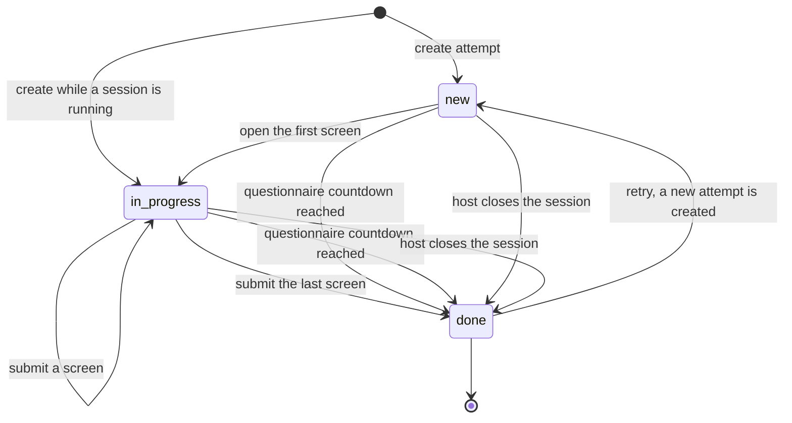
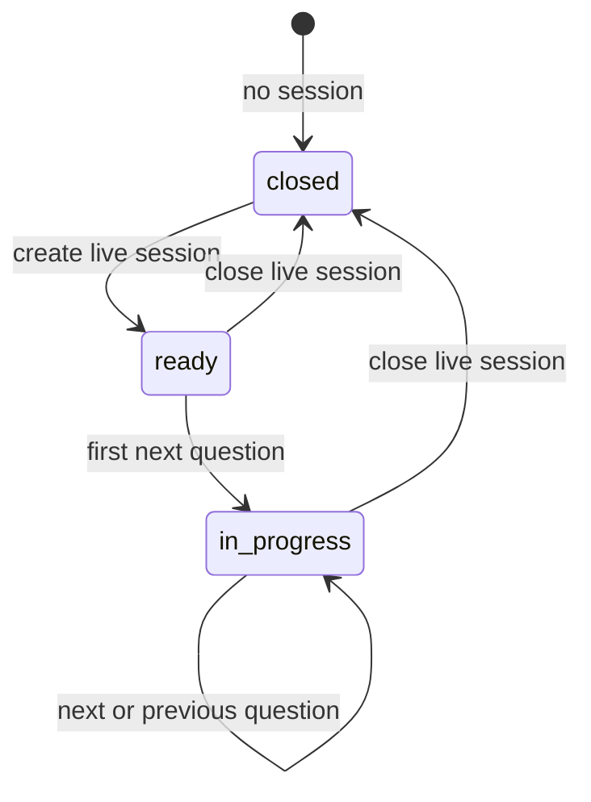
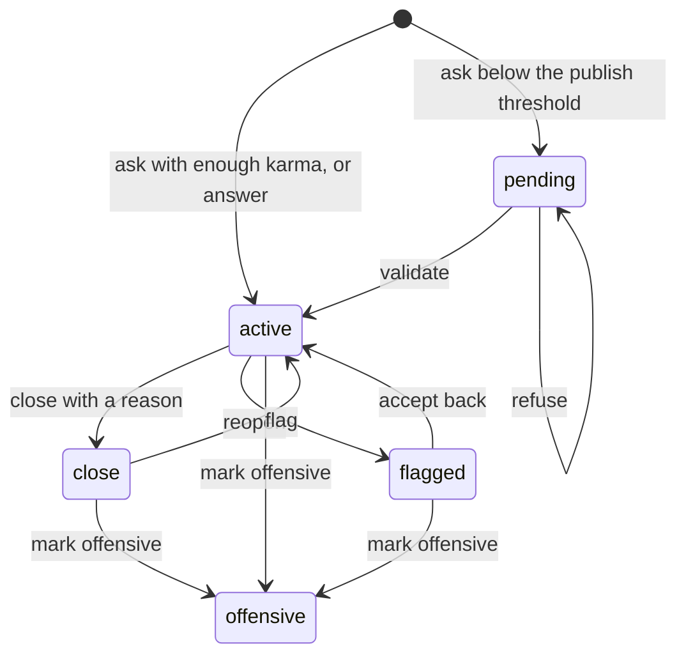
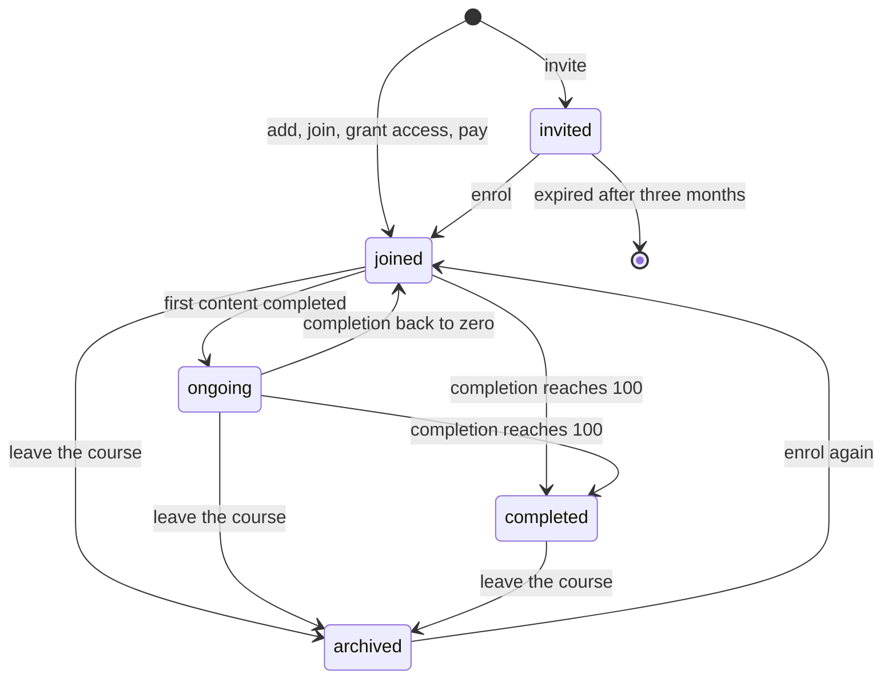
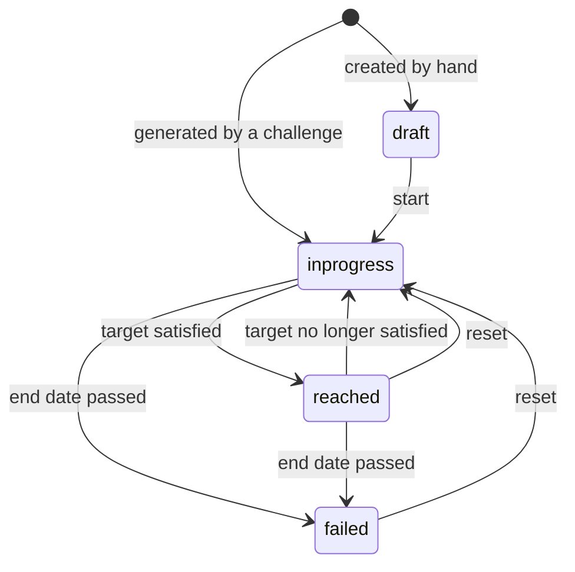
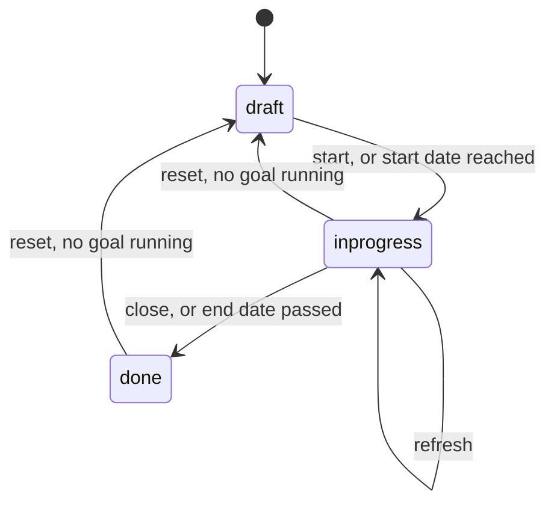

# Learning, Questionnaires and Recognition — State machines

Every state field of the domain: its states with their stored value, their label and their meaning;
the complete transition table with the operation that triggers each move, the conditions that must
hold, and the records the move creates or changes; the guards in the order they run, with the exact
refusal; and a diagram.

Six state fields exist:

| Machine | Entity | Field | States |
|---|---|---|---|
| 1 | Survey Participation (`survey.user_input`) | `state` | 3 |
| 2 | Survey (`survey.survey`) | `session_state` | 3 counting the empty value |
| 3 | Forum Post (`forum.post`) | `state` | 5 |
| 4 | Course Enrolment (`slide.channel.partner`) | `member_status` | 4 |
| 5 | Goal (`gamification.goal`) | `state` | 5 |
| 6 | Challenge (`gamification.challenge`) | `state` | 3 |

Two further two-valued markers behave as machines and are specified at the end: the completion
marker of a Content Progress record (machine 7) and the archiving marker of a Course, a Course
Content, a Course Enrolment, a Survey, a Forum and a Forum Post (machine 8).

---

## 1. Participation lifecycle — `state` on Survey Participation

### 1.1 States

| Stored value | Label | Meaning |
|---|---|---|
| `new` | New | The attempt exists and holds its tokens, but the participant has not opened the first screen. Pre-filled answers for the questions marked `save_as_email` and `save_as_nickname` may already exist. |
| `in_progress` | In Progress | The participant has opened the questionnaire. A start instant is recorded and the countdowns, when configured, run from it. |
| `done` | Completed | The participant reached the end, the host closed the session, or a countdown ran out. An end instant is recorded, the score is final and the completion side effects have run. |

### 1.2 Transitions

| From | To | Trigger | Guards, in order | Records created or changed |
|---|---|---|---|---|
| — | `new` | Creating a participation from the invitation composer, from a public landing, from a certification content item, or from a test | The six creation guards of section 1.3 | The participation with its access token, its invite token when the questionnaire is attempt limited and not public, its predefined question set, and one pre-filled answer for each question marked `save_as_email` or `save_as_nickname`. |
| — | `in_progress` | Creating a participation while the questionnaire has an open session in state `in_progress` | The same six creation guards | The participation, created directly in progress with the start instant set and `is_session_answer` true. |
| `new` | `in_progress` | Opening the first screen, or the session attendee screen asking for the current question | The participation is readable through its access token, the deadline has not passed, and the questionnaire is not archived unless the attempt is a test | `start_datetime` set to the current instant. |
| `in_progress` | `in_progress` | Submitting a screen | The submitted values pass the per-question validation of [`surveys.md`](surveys.md#answer-validation); the attempt allowance is re-checked | The answers of the questions on that screen are written or replaced; `last_displayed_page_id` is updated; the answers of questions that are currently inactive are deleted. |
| `in_progress` | `done` | Submitting the last screen | The submit passed validation | End instant written; predefined question set pruned of the conditional questions never triggered; the completion side effects of section 1.4 run. |
| `new` or `in_progress` | `done` | The questionnaire countdown is reached when a page is requested | The questionnaire is time limited, the attempt is not a session attempt, a start instant exists, and the current instant is at or after the start instant plus the limit | End instant written; the completion side effects run. |
| `in_progress` | `done` | Submitting after a countdown has run out | The current instant is beyond the limit but within the grace margin — three seconds for a question countdown, ten seconds for a questionnaire countdown | The valid answers of the screen are stored, the validation messages are ignored, the end instant is written and the completion side effects run. |
| `new` or `in_progress` | `done` | The host closes the live session | The acting user is a Questionnaire Officer | **Every** participation of the questionnaire is written to `done` in one operation. Because the state is written directly, the per-participation completion side effects do **not** run; the lead-generation package compensates by creating the leads of that session explicitly at that moment. |
| `done` | `new` | Retrying an attempt-limited questionnaire | At least one attempt is left in the pool | A **new** participation is created carrying the same invite token and the same deadline; the completed one is never reopened. |

### 1.3 Creation guards, in order, with the exact refusal

| Order | Condition that refuses | Message |
|---|---|---|
| 1 | The questionnaire is archived and the attempt is not a test | `Creating token for closed/archived surveys is not allowed.` |
| 2 | The questionnaire requires signing in, self-registration is allowed, and neither a user nor a contact is known | `Creating token for external people is not allowed for surveys requesting authentication.` |
| 3 | The questionnaire requires signing in, self-registration is not allowed, and no non-anonymous user is known | `Creating token for external people is not allowed for surveys requesting authentication.` |
| 4 | The questionnaire is internal and the caller is not an internal user | `Creating token for anybody else than employees is not allowed for internal surveys.` |
| 5 | The attempt allowance is checked and none is left | `No attempts left.` |
| 6 | A test attempt is requested by somebody who may not read the questionnaire | `Creating test token is not allowed for you.` |

### 1.4 Side effects of reaching `done`

1. The end instant is written.
2. The predefined question set is pruned of the conditional questions that were never triggered, so
   the score denominator counts only the questions the participant could reach.
3. A completion notice is posted on the participation and re-posted as a child message on the
   questionnaire for its followers.
4. When the questionnaire is a certification, the participation passed, a certificate template is
   configured and the attempt is not a test, the certificate message is sent with the certificate
   document attached.
5. When the questionnaire awards a badge, every challenge that rewards one of the badges of the
   passed certifications is evaluated at once instead of waiting for the daily job.
6. When the skills-certification package is installed and the participant is an employee, a résumé
   line of the Certification type is written or updated.
7. When the lead-generation package is installed and the purpose is `survey`, `live_session` or
   `custom`, a lead is created for every participation that chose at least one lead-generating
   answer option.
8. When the participation belongs to a course certification and the attempt failed with no attempt
   left, the failure message is sent and the attendee is removed from the course.

### 1.5 Diagram

---

## 2. Live session — `session_state` on Survey

### 2.1 States

| Stored value | Label | Meaning |
|---|---|---|
| empty | — | No session is open. The questionnaire behaves as an ordinary shared questionnaire. |
| `ready` | Ready | A session has been opened. Attendees may join and wait in the waiting room; no question is presented yet. |
| `in_progress` | In Progress | Questions are being presented one after another under the host's control. |

### 2.2 Transitions

| From | To | Trigger | Guards | Records created or changed |
|---|---|---|---|---|
| empty | `ready` | The host presses the action that creates a live session | The acting user belongs to the Questionnaire Officer group, otherwise the refusal is `Only survey users can manage sessions.` The write runs with elevated rights so an officer may run a session on a questionnaire owned by somebody else. | `questions_layout` forced to `page_per_question`; `session_start_time` set to the current instant; `session_question_id` cleared; `session_state` set to `ready`. |
| `ready` | `in_progress` | The host asks for the next question for the first time | The same group check | `session_state` set to `in_progress`; the first question computed and written into `session_question_id`; `session_question_start_time` set to the current instant **plus one second**; a broadcast carrying the event `next_question` and the real current instant is emitted on the questionnaire access token. |
| `in_progress` | `in_progress` | The host asks for the next question, or asks to go back | The same group check; a next or previous question must exist | `session_question_id` and `session_question_start_time` rewritten; the same broadcast emitted. When no further question exists nothing is written and nothing is broadcast. |
| `ready` or `in_progress` | empty | The host closes the session | The acting user belongs to the Questionnaire Officer group, otherwise `Only survey users can manage sessions.` | `session_state` cleared; **every** participation of the questionnaire forced to state `done`; a broadcast carrying the event `end_session` emitted on the questionnaire access token; the leads of the session created when the lead-generation package is installed. |

### 2.3 How the next question is chosen

There is no single participant to base a conditional decision on, so an artificial participation is
built: for every question already answered in this session it holds the option that received the
most votes in this session. The ordinary next-screen logic of
[`surveys.md`](surveys.md#screen-navigation) then runs against that artificial participation. Ties
are resolved by the iteration order of the vote map, so the first option encountered with the
maximal count wins. The same artificial participation decides whether the host is on the first or on
the last question.

### 2.4 Diagram

---

## 3. Forum post — `state` on Forum Post

### 3.1 States

| Stored value | Label | Meaning |
|---|---|---|
| `active` | Active | The post is visible to everybody who may read the forum and whose view rule the author's balance satisfies. |
| `pending` | Waiting Validation | A question written by an author below the publish threshold. Hidden from everybody except moderators and the author; any other reader receives a not-found answer. |
| `close` | Closed | A question closed by a moderator or by its author with a closing reason. It is still listed and readable, but no answer may be added. |
| `offensive` | Offensive | A post a moderator judged offensive. The archiving marker is set to false at the same time, so the post disappears from the default queries. |
| `flagged` | Flagged | A post a member reported. It waits in the flagged queue for a moderator to accept it back or mark it offensive. |

### 3.2 Transitions

| From | To | Trigger | Guards, in order | Records created or changed |
|---|---|---|---|---|
| — | `active` | Creating a question whose author holds at least `karma_post` | `can_ask`, otherwise `%d karma required to create a new question.` | The post; the author gains `karma_gen_question_new` with the reason `Ask a new question`; the new-question notification is posted to the followers of the forum and of the tags. |
| — | `pending` | Creating a question whose author is below `karma_post` | `can_ask` | The post; no points are moved; a validation notice is posted as an internal note to the followers of the post and of the tags who hold at least `karma_moderate`. |
| — | `active` | Creating an answer | `can_answer`, otherwise `%d karma required to answer a question.`; the parent must be neither closed nor archived, otherwise `Posting answer on a [Deleted] or [Closed] question is not possible.` | The post; the new-answer notification is posted on the parent question to the followers of the question and of the tags; the parent's last-activity instant is refreshed. |
| `pending` | `active` | A moderator validates the post | `can_moderate`, otherwise `%d karma required to validate a post.` | State set to `active`; the archiving marker set to true; the moderator recorded; the author gains `karma_gen_question_new` with the reason `Ask a question`; the state notification is posted. |
| `pending` | `pending` | A moderator refuses the post | `can_moderate`, otherwise `%d karma required to refuse a post.` | Only the moderator is recorded. The interface archives the post in a separate step. |
| `active` | `close` | A moderator or the author closes the question with a reason | `can_close`, otherwise `%d karma required to close or reopen a post.` The operation returns without doing anything when any post in the set has a parent, so answers can never be closed. | State set to `close`; the closing user, the closing instant and the reason are recorded. When the reason is the offensive reason or the spam reason, points move; see section 3.3. |
| `close` | `active` | A moderator or the author reopens the question | `can_close`, same refusal; answers are ignored | State set to `active`; when the post was closed with the offensive or the spam reason, the points removed at closing are given back with the reason `Reopen a banned question`. |
| `active` | `flagged` | A member flags the post | `can_flag`, otherwise `%d karma required to flag a post.` | State set to `flagged`; the flagging user recorded. The answer to the caller is `post_flagged_moderator` for a moderator and `post_flagged_non_moderator` otherwise. |
| `flagged` | `flagged` | Flagging an already flagged post | — | Nothing changes; the answer is the error `post_already_flagged`. |
| any state other than `active` | — | Flagging | — | Nothing changes; the answer is the error `post_non_flaggable`. |
| any | `offensive` | A moderator marks the post offensive with an offensive reason | `can_moderate`, otherwise `%d karma required to mark a post as offensive.` | State set to `offensive`; the author loses `karma_gen_answer_flagged` with the reason `Downvote for posting offensive contents`; the moderator, the closing instant and the reason are recorded; the archiving marker set to false. |
| `flagged` | `active` | A moderator accepts the flagged post back | `can_moderate` | State set to `active`; the moderator recorded. |

### 3.3 Points moved by closing, reopening and marking offensive

Closing a question with the reason `Contains offensive or malicious remarks` or the reason `Spam or
advertising` applies `karma_gen_answer_flagged` to the author, as stored, so the default of minus one
hundred removes one hundred points. The reason recorded on the movement is `Post is closed and
marked as spam` for the spam reason and `Post is closed and marked as offensive content` for the
offensive reason. When the reason is spam **and** the post is the author's only question on that
forum, the amount is multiplied by ten.

Reopening such a question applies the same amount multiplied by minus one, with the reason `Reopen a
banned question`, and with the same tenfold multiplication when the reason was spam and the post is
the author's only question on the forum.

Marking a post offensive applies `karma_gen_answer_flagged` once, with no multiplier.

### 3.4 Diagram

---

## 4. Attendee status — `member_status` on Course Enrolment

### 4.1 States

| Stored value | Label | Meaning |
|---|---|---|
| `invited` | Invite Sent | An invitation was sent and not accepted. The course page is reachable, even for a course whose visibility is `members`, but the contents are not, except the free previews. |
| `joined` | Joined | Enrolled with a completion of zero. |
| `ongoing` | Ongoing | Enrolled with a completion strictly between zero and one hundred. |
| `completed` | Finished | The completion reached one hundred. The status never changes again. |

### 4.2 Transitions

| From | To | Trigger | Guards | Records created or changed |
|---|---|---|---|---|
| — | `joined` | An officer adds attendees; a visitor joins an open-enrolment course; a responsible grants an access request; an order carrying the course product is confirmed; a user joins an automatic-enrolment group | The add-members filter: open-enrolment courses always pass; for the others the acting user must have write access, otherwise, when the caller asked for the strict check, `You are not allowed to add members to this course. Please contact the course responsible or an administrator.` | The enrolment; the contact is subscribed to the course discussion thread for the new-content subtype; when the skills package is installed a note is posted on the matching employee. |
| — | `invited` | An officer invites attendees | The same filter | The enrolment with `last_invitation_date` set to the current instant; the invitation message is sent. |
| `invited` | `joined` | The invited contact is enrolled, by themselves or by an officer | The same filter | The status is written and the completion is recomputed at once, because progress records may already exist from an earlier membership. |
| `joined` | `ongoing` | The completion recomputation finds a completion strictly between zero and one hundred | The enrolment is neither `completed` nor `invited` | `completion` and `completed_slides_count` written; the status written. |
| `ongoing` | `joined` | The completion recomputation finds a completion of zero | The same | The same fields written. |
| `joined` or `ongoing` | `completed` | The completion recomputation finds a completion of one hundred | The same | `completion` set to 100; the course-completion reputation points granted once with the reason `Course Finished`; the completion message sent; a résumé line of the Training type written when the skills package is installed. |
| `completed` | `completed` | Any later recomputation | The recomputation skips enrolments in status `completed` entirely | Nothing. The status never leaves `completed`. |
| any | archived | The attendee leaves the course, or an officer archives the enrolment | — | The enrolment is archived; the contact is unsubscribed from the discussion thread; the progress records are **kept**; when the certification package is installed the link between every participation of that attendee on that course and its progress record is cleared, so the attempt pool restarts on re-enrolment. |
| archived | `joined`, `ongoing` or `completed` | The attendee is enrolled again | — | The enrolment is un-archived, the requested status is written and the completion is recomputed. |
| `invited` | deleted | The periodic cleanup runs | The status is `invited`, the completion is zero, and the last invitation instant is empty or older than three months | The enrolment is deleted outright. |

### 4.3 Falling back below one hundred percent

When content is added to a course after an attendee reached one hundred percent, the recomputation
compares the previous completion with the new one. When the previous completion was one hundred, the
course is active, and the new completed count is below the total, the course-completion points are
taken back with the reason `Course Set Uncompleted`. The status of an enrolment already marked
`completed` does not change, because such enrolments are skipped; the take-back therefore applies to
enrolments that stood at one hundred percent without yet having been written as completed. Archived
courses are excluded from both directions, so archiving a course never sends a completion message
and never moves reputation points.

### 4.4 Diagram

---

## 5. Goal — `state` on Goal

### 5.1 States

| Stored value | Label | Meaning |
|---|---|---|
| `draft` | Draft | The goal exists but is not measured. Only a goal created by hand starts here; a goal generated by a challenge is created directly in progress. |
| `inprogress` | In progress | The goal is measured at every update of its challenge. |
| `reached` | Reached | The measured value satisfies the target under the definition's condition. A reached goal is still re-measured until its end date, so it can fall back to in progress. |
| `failed` | Failed | The end date passed without the target being satisfied. The goal is also marked closed and is skipped by every later update. |
| `canceled` | Cancelled | A stored value that exists in the selection but that no operation writes; the reset action returns a goal to `inprogress` instead. It is retained because existing rows may carry it and integrations may send it. **Compatibility finding:** the label offered in the interface implies a cancelled goal that the reset action never produces. A corrected behaviour would either remove the value from the selection or have the reset action write it and have the update skip goals holding it. |

### 5.2 Transitions

| From | To | Trigger | Guards | Records created or changed |
|---|---|---|---|---|
| — | `draft` | Creating a goal by hand | — | The goal, with the start date defaulting to today. |
| — | `inprogress` | A challenge generates its goals | The challenge is in progress and the user has no goal for that line and that period | The goal, with the definition, the line, the target, the period dates and a current value deliberately set beyond the target so that the first measurement always runs: the target minus one, floored at zero, when higher is better; the target plus one, floored at zero, when lower is better. The reminder delay of the challenge is copied when it is non-zero. |
| `draft` | `inprogress` | The start action | — | The state is written and the goal is measured at once. |
| `inprogress` | `reached` | A measurement satisfies the target | Higher is better and the value is at least the target, or lower is better and the value is at most the target | `current` written, `state` written. |
| `reached` | `inprogress` | A later measurement no longer satisfies the target and the end date has not passed | — | `current` written, `state` written. |
| `inprogress` or `reached` | `failed` | A measurement does not satisfy the target and the end date is in the past | An end date exists and today is after it | `current` written, `state` set to `failed`, `closed` set to true. |
| `inprogress` | `reached` | The reach action | — | Only the state is written. The next measurement resets it to in progress when the target is still not satisfied and the end date has not passed. |
| `inprogress` or `reached` | `failed` | The fail action | — | Only the state is written; the goal is ignored by later checks. |
| `reached` or `failed` | `inprogress` | The reset action | — | Only the state is written; the date and target criteria are applied again at the next measurement. |
| any | deleted | A participant no longer matches the challenge population, or the challenge is refreshed | — | The goals of users who left the population are deleted; refreshing a challenge deletes its goals still in progress before regenerating them. |

### 5.3 Reminder on a manually kept goal

When the definition is measured manually, the goal carries a reminder delay and a last-update date,
and today is at least that many days after the last update, an individual reminder message is sent
to the goal's user, rendered from the shipped goal-reminder template, and `to_update` is set to
true. The reminder is sent once, while the goal is in progress.

### 5.4 Diagram

---

## 6. Challenge — `state` on Challenge

### 6.1 States

| Stored value | Label | Meaning |
|---|---|---|
| `draft` | Draft | The challenge is configured but assigns nothing. A challenge whose start date is today or earlier is started automatically by the daily job. |
| `inprogress` | In Progress | The challenge generates and updates goals, sends its reports and distributes its rewards. |
| `done` | Done | The challenge is finished. The final reward check has run. |

### 6.2 Transitions

| From | To | Trigger | Guards | Records created or changed |
|---|---|---|---|---|
| `draft` | `inprogress` | The start action, or the daily job finding a start date at or before today | — | The participants are recomputed from the stored filter; the missing goals are generated for every participant and every line. |
| `inprogress` | `done` | The close action, or the daily job finding an end date strictly before today | — | The reward check runs with the closing forced: badges are granted, a closing message is posted on the challenge and addressed to every participant. |
| `done` | `draft` | Resetting the challenge | Refused when at least one goal of the challenge is still in state `inprogress`, with `You can not reset a challenge with unfinished goals.` | Only the state is written. |
| `inprogress` | `draft` | Resetting the challenge | The same guard | Only the state is written. |
| `inprogress` | `inprogress` | The refresh action | — | Every goal of the challenge still in progress is deleted, then the whole update runs again: the goals are regenerated and measured. |

### 6.3 The reward check

The check runs at the end of every update and is forced when the challenge is closed by hand. For
each challenge:

1. The period dates are computed from the periodicity.
2. The challenge counts as ended when the closing was forced, or when the period end date equals
   yesterday.
3. When a reward for every succeeding participant is configured and either the challenge has ended
   or it rewards in real time, the goals of the challenge that ended on the period end date and are
   in state `reached` are grouped by user. A user whose count of reached goals equals the number of
   lines has succeeded every goal. When the challenge rewards in real time and that user already
   holds a grant of that badge for that challenge, nothing is granted again; otherwise the badge is
   granted.
4. When the challenge has ended, a message is posted on the challenge, addressed to every
   participant: `The challenge <name> is finished.` followed either by `Reward (badge <badge name>)
   for every succeeding user was sent to <user names>.` or by `Nobody has succeeded to reach every
   goal, no badge is rewarded for this challenge.`
5. When a first-place badge is configured, the top three participants are computed; the ranking is
   specified in [`calculations.md`](calculations.md#lsg-calc-032). The first, second and third
   badges are granted to whoever occupies those places and the message is extended with
   `Special rewards were sent to the top competing users. The ranking for this challenge is:`
   followed by one line per rank as ` <rank>. <user name> - <reward name>`. When nobody qualifies,
   the message says `Nobody reached the required conditions to receive special badges.`

### 6.4 Diagram

---

## 7. Content completion — `completed` on Content Progress

Although it is a two-valued marker, the completion of a content item behaves as a machine because
each direction carries side effects.

| From | To | Trigger | Guards | Side effects |
|---|---|---|---|---|
| false or absent | true | The attendee presses the mark-completed action | `can_self_mark_completed`: the content is published, the reader is enrolled, the category is not `quiz`, no quiz question exists, and the category is not `certification`. Otherwise `You cannot mark a slide as completed if you are not among its members.`; through the public endpoint the refusal is `Slide with questions must be marked as done when submitting all good answers ` when the content carries questions, and `This slide can not be marked as completed.` otherwise. | The marker is written; the course completion is recomputed for the attendee's enrolment. |
| false or absent | true | The attendee answers every question of the attached quiz correctly | The attendee is enrolled and the content is published, otherwise `You cannot mark a slide quiz as completed if you are not among its members or it is unpublished.` | The marker is written; the attempt reward of the current attempt index is granted with the reason `Quiz Completed`; the course completion is recomputed. |
| false or absent | true | A certification attached to the progress record is passed | — | `survey_scoring_success` becomes true, which forces the completion marker to true and marks every enrolment of the same contact on the same course as certified; the course completion is recomputed. |
| false or absent | true | An officer marks it completed from the back office, or a progress record is created already completed | The officer has write access | The course completion is recomputed. |
| true | false | The attendee presses the mark-uncompleted action | `can_self_mark_uncompleted`: the content is published, the reader is enrolled, and the category is not `certification`. Otherwise `You cannot mark a slide as uncompleted if you are not among its members.`; through the public endpoint, `This slide can not be marked as uncompleted.` | The marker is cleared; the quiz reward of the current attempt index is taken back with the reason `Quiz Set Uncompleted`, which is what stops an attendee cycling completed and uncompleted to farm points; the course completion is recomputed. |
| true | false | The quiz is reset | The acting user may write the progress record | The marker is cleared and the attempt counter is set back to zero. |

---

## 8. Archiving

| Entity | What archiving does | What un-archiving does |
|---|---|---|
| Survey | Archives the certification badge as well. New participations and invitations are refused; the interface calls the record closed. | Un-archives the badge. |
| Course | Archives every content item of the course and unpublishes the course. The course is archived first and the contents afterwards, so the completion recomputation never sees a course with zero contents. | Un-archives the contents first and the course last, so the statistics are recomputed against contents that are already visible. |
| Course Content | Unpublishes a published non-section content and triggers the completion recomputation of every attendee. | Triggers the completion recomputation. |
| Course Enrolment | Removes the attendee from the course, unsubscribes the contact from the discussion thread and keeps the progress records; clears the certification-attempt links. | Restores the membership with the requested status and recomputes the completion. |
| Forum | Archives every post of the forum, archived ones included, and refreshes the forum counter of every site. | Un-archives every post and refreshes the counters. |
| Forum Post | Hides the post from the default queries; archiving a question archives its answers. Guarded by `can_unlink`, otherwise `%d karma required to delete or reactivate a post.` | Un-archives the post and its answers, under the same guard. |
| Badge | Hides the badge; used by the certification chain when a questionnaire stops awarding a badge. | Restores it. |
