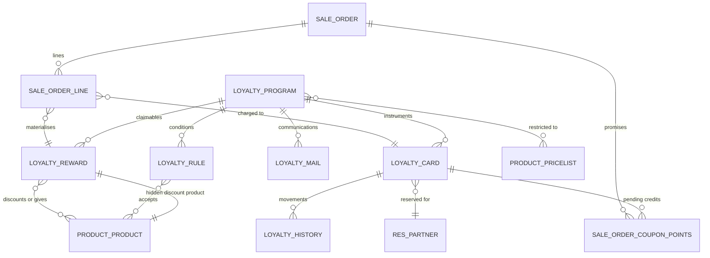

# Entities

This file specifies every entity the Loyalty and Promotions domain owns, and every field this
domain adds to entities owned elsewhere. Field tables give the storage name in code font, the type,
and the complete set of rules attached to the field.

Conventions used throughout:

- **Required** means the system refuses to store the record without a value.
- **Default** is the value applied when the field is not supplied on creation.
- **Computed** names the inputs the value is derived from; a computed field is *stored* when the
  derived value is written to the table and only recomputed when an input changes, and *unstored*
  when it is recalculated on every read.
- **Writable computed** means the value is normally derived but may be overwritten by a user or by
  a caller; the derivation then only runs again when one of its inputs changes.
- **Copy behaviour** states what happens to the field when the record is duplicated.
- **Company scoping** states how the field behaves when several companies share one database.
- A *point* is the abstract unit of a programme's currency of value. For a gift card or an
  electronic wallet a point is one unit of the programme's monetary currency; for a loyalty card it
  is whatever the programme calls it.

---

## 1. Loyalty Program

**Loyalty Program** (`loyalty.program`, table `loyalty_program`) is the single configuration record
that describes one promotional offer of any kind.

### 1.1 Purpose

A programme answers four questions:

1. **When is it live?** — the validity window, the active flag, the price-list restriction, the
   company, the per-channel availability flags and the usage limit.
2. **What must the customer do to earn?** — the set of Loyalty Rules.
3. **What may the customer claim?** — the set of Loyalty Rewards.
4. **Where does the value live?** — the `applies_on` field: on the current document only, on a card
   for future documents, or on a card that accumulates across documents.

### 1.2 Lifecycle

A programme has no status column. Its life is:

1. **Created**, normally from a template (see [workflows.md](workflows.md) section 2). Creation from
   a template writes the programme type together with a complete preset of rules, rewards and
   communication plans.
2. **Live** whenever it is active, the current date falls inside the validity window, the channel
   flag for the channel in question is set, the price-list restriction (if any) matches, and the
   usage limit (if any) has not been reached.
3. **Dormant** whenever any of those conditions fails. A dormant programme is not deleted; orders
   that already carry its rewards lose them on the next recomputation.
4. **Archived** by clearing the active flag. Archiving cascades: the programme's rules, rewards,
   communication plans and the reward lines' hidden discount products are all archived with it.
   Restoring the active flag un-archives all of them again.
5. **Deleted** — only possible while archived. Deleting an active programme is refused.

### 1.3 Field table

| Field (storage name) | Type | Meaning and rules |
|---|---|---|
| `name` | single line text | Required. Translatable. The programme name shown everywhere. Copied on duplication. |
| `active` | boolean | Default true. Clearing it archives the programme and cascades to `rule_ids`, `reward_ids`, `communication_plan_ids` and every reward's hidden discount product. Setting it again un-archives all of them. |
| `sequence` | integer | Ordering key. The default ordering of the entity is by `sequence` ascending. **Not copied** on duplication. Determines the order in which automatic programmes are considered by the application algorithm. |
| `program_type` | selection | Required. Default `promotion`. Eight values, listed in section 1.4. Changing it **rewrites** `rule_ids`, `reward_ids`, `communication_plan_ids`, `applies_on`, `trigger`, `portal_visible` and `portal_point_name` from the preset of the new type, discarding whatever was there. |
| `company_id` | link to Company | Default: the company of the acting user. May be empty, which makes the programme available to every company. On delete of the company: set to empty. |
| `currency_id` | link to Currency | Required. Writable computed, stored, pre-computed from `company_id`: the company's currency if the company has one, otherwise the value already present. On delete: restricted. All monetary fields of the programme's rules and rewards are expressed in this currency. |
| `currency_symbol` | single line text | Unstored mirror of the currency's symbol. Used to label the point-mode and discount-mode choices. |
| `pricelist_ids` | many-to-many to Price List | Optional. When non-empty the programme only applies to orders using one of these price lists. Restricted by a validation to price lists whose currency equals `currency_id`. |
| `rule_ids` | one-to-many to Loyalty Rule | Writable computed, stored, derived from `program_type`. Copied on duplication. The conditions of the programme. May be empty, which means the programme has no condition at all. |
| `reward_ids` | one-to-many to Loyalty Reward | Writable computed, stored, derived from `program_type`. Copied on duplication. **Must contain at least one reward** (see [business-rules.md](business-rules.md) rule BR-P-03). |
| `communication_plan_ids` | one-to-many to Loyalty Communication | Writable computed, stored, derived from `program_type`. Copied on duplication. |
| `mail_template_id` | link to Message Template | Unstored, computed as the template of the *first* communication plan, with an inverse writer. Only meaningful for the gift card and electronic wallet types; the inverse is a no-op for every other type. Writing it creates, updates or removes the single "at creation" communication plan. Not copied. |
| `trigger_product_ids` | many-to-many to Product Variant | Unstored mirror of `rule_ids.product_ids`, writable. The "top-up products" of a gift card or electronic wallet programme. Ignored — and stripped from the values — on creation of a programme whose type is neither gift card nor electronic wallet. Not copied. |
| `coupon_ids` | one-to-many to Loyalty Card | The cards issued by the programme. Not copied. |
| `coupon_count` | integer | Unstored, computed as the number of cards linked to the programme. |
| `coupon_count_display` | single line text | Unstored. The count followed by the plural item name of the programme type (section 1.4), for example `12 Gift Cards`. |
| `applies_on` | selection | Required. Writable computed, stored, derived from `program_type`. Values: `current` ("Current order"), `future` ("Future orders"), `both` ("Current & Future orders"). Governs whether the points earned on a document may be spent on that same document, must be carried to a card for later, or both. |
| `trigger` | selection | Writable computed, stored, derived from `program_type`. Values: `auto` ("Automatic"), `with_code` ("Use a code"). An automatic programme is considered by the recomputation without any user action; a code programme is only considered once its code has been entered. |
| `date_from` | date | Optional. The first day of the validity window; the day itself is inside the window. |
| `date_to` | date | Optional. The last day of the validity window; the day itself is inside the window. |
| `limit_usage` | boolean | Default false. When set, `max_usage` caps the number of documents that may use the programme. |
| `max_usage` | integer | The cap. A database check enforces `limit_usage` false **or** `max_usage` strictly greater than zero. |
| `total_order_count` | integer | Unstored. The number of documents that have used the programme, summed over every channel. The base value is zero; the sales channel adds `order_count` and the counter channel adds its own count. |
| `order_count` | integer | Unstored. The number of **distinct sales orders** carrying at least one line whose reward belongs to this programme. |
| `portal_visible` | boolean | Default false. When set, the point balance and the rewards are shown to the customer in the customer portal, on the counter receipt and during storefront checkout. |
| `portal_point_name` | single line text | Writable computed, stored, translatable. Default `Points`. For the gift card and electronic wallet types it is forced to the currency symbol. For other types the preset of the programme type supplies a label such as `Loyalty point(s)` or `Credit(s)`. The word used for one unit of value in every user-facing message. |
| `is_nominative` | boolean | Unstored, computed. True when `applies_on` is `both`, **or** when `program_type` is electronic wallet or loyalty card **and** `applies_on` is `future`. A nominative programme's value lives on a card that belongs to one named customer. |
| `is_payment_program` | boolean | Unstored, computed. True when `program_type` is gift card or electronic wallet. A payment programme behaves like a tender: it is applied after every other reward and it may consume tax as well as net amount. |
| `payment_program_discount_product_id` | link to Product Variant | Unstored, read-only, computed. For a payment programme, the hidden discount product of its first reward; otherwise empty. |
| `available_on` | boolean | Unstored, not persisted at all. A pure label carrier in the form, grouping the per-channel availability switches. |
| `sale_ok` | boolean | Default true. Added by the sales channel. The programme may be used on sales orders. |
| `pos_ok` | boolean | Added by the counter channel. The programme may be used at the counter. |
| `pos_config_ids` | many-to-many to Point of Sale Configuration | Added by the counter channel. When non-empty, restricts the programme to those tills. |
| `pos_order_count` | integer | Unstored. Counter documents that used the programme. |
| `pos_report_print_id` | link to Printable Document | Added by the counter channel. The document used to print generated gift cards at the till. |
| `ecommerce_ok` | boolean | Added by the storefront channel. The programme may be used in web carts. |
| `website_id` | link to Storefront | Added by the storefront channel. Indexed. On delete: restricted. When set, restricts the programme to one storefront. |
| `show_non_published_product_warning` | boolean | Unstored. Added by the storefront channel. True when a reward would give away a product that is not published on the storefront. |

### 1.4 The eight programme types

Every type is the *same* entity with a different preset. The preset is applied on creation through
the type default and re-applied whenever `program_type` changes.

| Value | Label | Plural item name | `applies_on` | `trigger` | `portal_visible` | `portal_point_name` |
|---|---|---|---|---|---|---|
| `promotion` | Promotions | Promos | `current` | `auto` | false | `Promo point(s)` |
| `promo_code` | Discount Code | Discounts | `current` | `with_code` | false | `Discount point(s)` |
| `coupons` | Coupons | Coupons | `current` | `with_code` | false | `Coupon point(s)` |
| `buy_x_get_y` | Buy X Get Y | Promos | `current` | `auto` | false | `Credit(s)` |
| `next_order_coupons` | Next Order Coupons | Coupons | `future` | `auto` | true | `Coupon point(s)` |
| `loyalty` | Loyalty Cards | Loyalty Cards | `both` | `auto` | true | `Loyalty point(s)` |
| `gift_card` | Gift Card | Gift Cards | `future` | `auto` | true | the currency symbol |
| `ewallet` | eWallet | eWallets | `future` | `auto` | true | the currency symbol |

The rule, reward and communication preset of each type:

| Type | Rules created | Rewards created | Communication plans created |
|---|---|---|---|
| `promotion` | one rule: one point per order, minimum purchase fifty, minimum quantity zero | one reward: one point required, ten percent | none |
| `promo_code` | one rule: code trigger with a generated code of the form `PROMO_CODE_` followed by four characters, minimum quantity zero | one reward: ten percent on specific products, the first sellable product | none |
| `coupons` | none | one reward: one point required, ten percent | one plan: at creation, the coupon message template |
| `buy_x_get_y` | one rule: one point per unit paid, the first sellable product, minimum quantity two | one reward: free product, the first sellable product, two points required | none |
| `next_order_coupons` | one rule: minimum purchase one hundred, minimum quantity zero | one reward: fifteen percent on the order | one plan: at creation, the coupon message template |
| `loyalty` | one rule: points per unit of currency spent | one reward: five points' worth at two hundred points required; when the delivery capability is installed, a second reward: free shipping at one hundred points | none |
| `gift_card` | one rule: one point per unit of currency spent, split per unit, on the gift-card product, minimum quantity zero | one reward: discount, one unit of currency per point, on the whole order, one point required, described as `Gift Card` | one plan: at creation, the gift-card message template |
| `ewallet` | one rule: one point per unit of currency spent, not split, on the top-up product | one reward: discount, one unit of currency per point, on the whole order, one point required, described as `eWallet` | none |

### 1.5 Programme templates offered to the user

Creating a programme from the gallery uses one of nine template keys. Eight of them are the eight
types above; the ninth, `fidelity`, produces a loyalty-type programme with a different preset.

| Template key | Title | Description shown | Resulting configuration |
|---|---|---|---|
| `promotion` | Promotional Program | *Automatic promo: 10% off on orders higher than $50*, or, when the delivery capability is installed, *Automatic promotion: free shipping on orders higher than $50* | The `promotion` preset; with delivery installed the reward set is replaced by a single free-shipping reward. |
| `promo_code` | Promo Code | *Get 10% off on some products, with a code* | The `promo_code` preset, named `Discount code`. |
| `buy_x_get_y` | Buy X Get Y | *Buy 2 products and get a third one for free* | The `buy_x_get_y` preset, named `2+1 Free`. |
| `next_order_coupons` | Next Order Coupon | *Send a coupon after an order, valid for next purchase* | The `next_order_coupons` preset. |
| `loyalty` | Loyalty Card | *Win points with each purchase, and claim gifts* | The `loyalty` preset. |
| `coupons` | Coupon | *Generate and share unique coupons with your customers* | The `coupons` preset. |
| `fidelity` | Fidelity Card | *Buy 10 products to get 10$ off on the 11th one* | Type loyalty, applies on both, automatic trigger, one rule earning points per unit paid on the first sellable product, one reward costing eleven points giving a fixed ten off that same product. |
| `gift_card` | Gift Card | *Sell Gift Cards, that allows to purchase products* | The `gift_card` preset. |
| `ewallet` | eWallet | *Fill in your eWallet, to pay future orders* | The `ewallet` preset. |

The gallery shows the gift card and electronic wallet entries only when it is opened from the
stored-value menu; every other entry only when it is opened from the promotions menu.

### 1.6 Derived helper: valid products per rule

For a set of product variants, the programme returns a mapping from each of its rules to the subset
of those products the rule accepts:

1. For each rule of the programme, build the rule's product filter (section 2.4).
2. If the filter is non-empty, the rule's entry is the subset of the given products that satisfy it.
3. If the filter is empty **and** the programme type is not gift card, the rule's entry is all of
   the given products.
4. If the filter is empty **and** the programme type is gift card, the rule has **no** entry at all
   — a gift-card rule with no product filter matches nothing, which prevents a gift card programme
   from crediting itself on every order.

### 1.7 Uniqueness, ordering, display

- No uniqueness rule on the programme itself. Two programmes may share a name.
- Default ordering: `sequence` ascending, then insertion order.
- Display name: the `name` field.
- Company scoping: record rule `['|', ('company_id', 'in', company_ids + [False]), ('company_id', 'parent_of', company_ids)]` — a programme is visible when it has no company, when its company is one of the user's active companies, or when its company is an ancestor of one of them.

---

## 2. Loyalty Rule

**Loyalty Rule** (`loyalty.rule`, table `loyalty_rule`) is one condition of a programme, together
with the point-earning formula that applies when the condition is met.

### 2.1 Purpose and lifecycle

A rule is created, edited and deleted only as part of its programme; it has no independent life. A
programme may have zero, one or many rules. When a programme has several rules they are evaluated
independently and their earned points are **added together** — they are alternatives that each
contribute, not conditions that must all hold.

A programme with **no rule at all** and `applies_on` equal to `current` is treated as unconditionally
matched (see [calculations.md](calculations.md) section 4, step 1): this is how a coupon programme,
whose value comes entirely from the card, is allowed to apply.

### 2.2 Field table

| Field (storage name) | Type | Meaning and rules |
|---|---|---|
| `program_id` | link to Loyalty Program | Required, indexed. On delete of the programme: cascade. Copied on duplication of the programme. |
| `program_type` | selection | Unstored mirror of the programme's type. |
| `company_id` | link to Company | Stored mirror of the programme's company. Stored specifically so that the multi-company record rule can filter on it. |
| `currency_id` | link to Currency | Unstored mirror of the programme's currency. The currency of `minimum_amount`. |
| `active` | boolean | Default true. Follows the programme's active flag. |
| `product_ids` | many-to-many to Product Variant | Explicit list of products the rule accepts. |
| `product_category_id` | link to Product Category | A category; the rule accepts every product whose category is that category or any descendant of it. On delete: set to empty. |
| `product_tag_id` | link to Product Tag | A tag; the rule accepts every product carrying it. On delete: set to empty. |
| `product_domain` | single line text | Default `[]`. A stored filter expression, intersected with the other three criteria. Only exposed in the interface to users in the technical group. |
| `valid_product_ids` | many-to-many to Product Variant | Unstored. The products the rule currently accepts. |
| `any_product` | boolean | Unstored. True when the rule's product filter accepts every product. |
| `reward_point_amount` | decimal | Default one. The multiplier of the point-earning formula. A database check enforces that it is **strictly greater than zero**. |
| `reward_point_mode` | selection | Required. Default `order`. Values `order` ("per order"), `money` ("per *symbol* spent" where *symbol* is the programme's currency symbol), `unit` ("per unit paid"). Selects the point-earning formula. |
| `reward_point_split` | boolean | Default false. When set, and the programme applies on future documents, and the mode is not per order, the points are **not** summed: one separate card is issued per matched unit. |
| `reward_point_name` | single line text | Unstored mirror of the programme's point label. |
| `minimum_qty` | integer | Default one. The total quantity of accepted products that must be on the document, expressed in each product's reference unit of measure. |
| `minimum_amount` | monetary in `currency_id` | Default zero. The minimum value of the accepted products' lines. |
| `minimum_amount_tax_mode` | selection | Required. Default `incl`. Values `incl` ("tax included"), `excl` ("tax excluded"). Selects whether `minimum_amount` is compared to the lines' total with tax or without. |
| `mode` | selection | Writable computed, stored, derived from `code`: `with_code` when a code is set, `auto` otherwise. Values `auto` ("Automatic"), `with_code` ("With a promotion code"). |
| `code` | single line text | Writable computed, stored, derived from `mode`: cleared when the mode is automatic. The text the customer or salesperson types. Must be unique across all active rules and must not collide with any active card code. |
| `promo_barcode` | single line text | Added by the counter channel. A scannable form of the code. |
| `website_id` | link to Storefront | Stored mirror of the programme's storefront. Added by the storefront channel. |
| `user_has_debug` | boolean | Unstored. True for members of the technical group; gates the display of `product_domain`. |

### 2.3 Constraints

| Constraint | Condition | Message |
|---|---|---|
| Positive point amount (database check) | `reward_point_amount` greater than zero | *Rule points reward must be strictly positive.* |
| Split forbidden on accumulating programmes | Refused when `reward_point_split` is set and the programme applies on both current and future documents, or the programme is an electronic wallet | *Split per unit is not allowed for Loyalty and eWallet programs.* |
| Code uniqueness among rules | Refused when the set of codes being written contains a duplicate, or when another active rule with code mode already uses one of them | *The promo code must be unique.* |
| Code must not collide with a card | Refused when an active card already carries one of the codes being written | *A coupon with the same code was found.* |

### 2.4 The product filter

The filter a rule applies to products is assembled as follows:

1. Start with an empty list of criteria.
2. If `product_ids` is non-empty, add the criterion *the product is one of these*.
3. If `product_category_id` is set, add the criterion *the product's category is that category or a
   descendant of it*.
4. If `product_tag_id` is set, add the criterion *the product carries that tag*.
5. Combine the criteria collected so far with **or**. If none were collected, the combined criterion
   is *always true*.
6. If `product_domain` is set and is not the literal `[]`, intersect the result with that expression
   using **and**.

Note the asymmetry: the three simple criteria are alternatives (a product matching the tag is
accepted even if it is not in the explicit list), while the stored filter expression is an extra
requirement on top.

### 2.5 Minimum amount conversion

`minimum_amount` is stored in the programme's currency. Before it is compared with a document total
it is converted to the document's currency at the rate of the current date, using the programme's
company (or the acting company when the programme has none). See
[calculations.md](calculations.md) section 3.

### 2.6 Uniqueness, ordering, display

- No uniqueness rule other than the code rules above.
- Default ordering: insertion order.
- Company scoping: the same record rule shape as the programme, applied to the stored mirror
  `company_id`.

---

## 3. Loyalty Reward

**Loyalty Reward** (`loyalty.reward`, table `loyalty_reward`) is one thing a customer may claim in
exchange for points.

### 3.1 Purpose and lifecycle

A reward is created, edited and deleted as part of its programme. Every programme must keep at least
one reward.

Each reward owns a **hidden discount product**: a service product, not sellable, not purchasable,
with a list price of zero, whose name is kept equal to the reward's description. It exists so that
every reward line on a document carries a real product and can therefore be priced, taxed, invoiced
and reported like any other line. The product is created automatically the first time the reward is
saved, and its name is rewritten whenever the reward's description changes (including when the
description is translated). Archiving the reward archives the product; un-archiving restores it.

Deleting a reward that is still referenced by at least one sales order line **archives** it instead
of deleting it, so that historic documents keep a valid reference.

### 3.2 Field table

| Field (storage name) | Type | Meaning and rules |
|---|---|---|
| `program_id` | link to Loyalty Program | Required, indexed. On delete: cascade. |
| `program_type` | selection | Unstored mirror of the programme's type. |
| `company_id` | link to Company | Stored mirror of the programme's company, for the record rule. |
| `currency_id` | link to Currency | Unstored mirror of the programme's currency. The currency of `discount`, when the mode is not percentage, and of `discount_max_amount`. |
| `active` | boolean | Default true. Follows the programme's active flag and drives the hidden product's active flag. |
| `description` | single line text | Required, translatable. Writable computed, stored, pre-computed — see section 3.4 for the generation rule. This is the text shown on the reward line of the document. |
| `reward_type` | selection | Required. Default `discount`. Values `product` ("Free Product"), `discount` ("Discount"); the delivery capability adds `shipping` ("Free Shipping"), whose removal falls back to the default. |
| `required_points` | decimal | Default one. The point price of one claim of the reward. A database check enforces that it is **strictly greater than zero**. The entity's default ordering is by this field ascending. |
| `point_name` | single line text | Unstored mirror of the programme's point label. |
| `clear_wallet` | boolean | Default false. When set, claiming the reward spends the card's **entire** balance rather than `required_points`. |
| `discount` | decimal | Default ten. The discount magnitude. A database check enforces that it is **strictly greater than zero** whenever `reward_type` is `discount`. |
| `discount_mode` | selection | Required. Default `percent`. Values `percent` (labelled `%`), `per_order` (labelled with the currency symbol), `per_point` (labelled *symbol* per point). Selects the discount formula. |
| `discount_applicability` | selection | Default `order`. Values `order` ("Order"), `cheapest` ("Cheapest Product"), `specific` ("Specific Products"). Selects the base the discount applies to. |
| `discount_product_ids` | many-to-many to Product Variant | Explicit list of discountable products, used when applicability is `specific`. |
| `discount_product_category_id` | link to Product Category | A category of discountable products. On delete: set to empty. |
| `discount_product_tag_id` | link to Product Tag | A tag of discountable products. On delete: set to empty. |
| `discount_product_domain` | single line text | Default `[]`. Extra filter expression on discountable products. Technical group only. |
| `all_discount_product_ids` | many-to-many to Product Variant | Unstored, read-only, computed. The resolved set of discountable products — but only when the system parameter `loyalty.compute_all_discount_product_ids` is `enabled`; otherwise deliberately left empty to avoid a costly search. |
| `reward_product_domain` | single line text | Unstored, read-only, computed. The literal text `null` when that same parameter is `enabled`, otherwise the discountable-product filter serialised as a structured text value, so that the client can evaluate it itself. |
| `discount_max_amount` | monetary in `currency_id` | Optional, default zero meaning **no limit**. The largest amount this reward may ever discount. |
| `discount_line_product_id` | link to Product Variant | The hidden discount product (section 3.1). On delete: restricted. **Not copied** on duplication, so a duplicated reward gets its own new hidden product. |
| `is_global_discount` | boolean | Unstored, computed. True when `reward_type` is `discount` **and** `discount_applicability` is `order` **and** `discount_mode` is `per_order` or `percent`. Only global discounts take part in the "best discount wins" conflict rule. Note that a per-point order discount — the gift card and wallet shape — is deliberately **not** a global discount. |
| `reward_product_id` | link to Product Variant | The product given away. Restricted to products that are not combos. On delete: set to empty. |
| `reward_product_tag_id` | link to Product Tag | When set, every non-combo product carrying the tag may be chosen as the free product. On delete: set to empty. |
| `reward_product_ids` | many-to-many to Product Variant | Unstored, read-only, computed: when `reward_type` is `product`, the union of `reward_product_id` and the non-combo products of `reward_product_tag_id`; otherwise empty. Searchable. |
| `multi_product` | boolean | Unstored, computed. True when `reward_type` is `product` and more than one product is claimable, which forces the claimant to choose. |
| `reward_product_qty` | integer | Default one. How many units of the free product one claim gives. A database check enforces that it is **strictly greater than zero** whenever `reward_type` is `product`. |
| `reward_product_uom_id` | link to Unit of Measure | Unstored, computed as the reference unit of the first claimable product. |
| `user_has_debug` | boolean | Unstored. Technical group membership; gates the filter-expression fields. |

### 3.3 Constraints

| Constraint | Condition | Message |
|---|---|---|
| Positive point price (database check) | `required_points` greater than zero | *The required points for a reward must be strictly positive.* |
| Positive free quantity (database check) | `reward_type` not `product`, or `reward_product_qty` greater than zero | *The reward product quantity must be strictly positive.* |
| Positive discount (database check) | `reward_type` not `discount`, or `discount` greater than zero | *The discount must be strictly positive.* |
| No combo as a free product | Refused when `reward_product_id` names a product of the combo type | *A reward product can't be of type "combo".* |
| Programme keeps a reward | Refused on deletion of the last reward of a programme | *A program must have at least one reward.* |

### 3.4 The generated description

The description is regenerated whenever the reward type, the free product, the discount mode, the
product tag, the discount magnitude, the currency, the applicability or the resolved discountable
products change. The rule, in order:

1. If the programme type is gift card, the description is exactly `Gift Card`.
2. Else if the programme type is electronic wallet, it is exactly `eWallet`.
3. Else if the reward type is free shipping, it is `Free shipping`, and if a maximum discount amount
   is set, followed by ` (Max ` + the formatted amount + `)`.
4. Else if the reward type is free product:
   - with no claimable product: `Free Product`;
   - with exactly one: `Free Product - ` + the product's display name;
   - with several: `Free Product - [` + the display names joined by comma and space + `]`.
5. Else (a discount) the description is built from three pieces:
   - the magnitude piece: for percentage mode, the discount value followed by `% on `; for per-point
     mode, the formatted amount followed by ` per point on `; for per-order mode, the formatted
     amount followed by ` on `;
   - the base piece: `your order` for order applicability, `the cheapest product` for cheapest
     applicability, and for specific applicability either the single discountable product's display
     name (when exactly one product matches) or `specific products`;
   - and, when a maximum discount amount is set, ` (Max ` + the formatted amount + `)`.

The *formatted amount* is the numeric value and the currency symbol, with the symbol after the
number by default and before the number when the currency positions its symbol before amounts. The
number is rendered with the shortest representation that does not lose information.

Worked example: a reward of twenty percent on the cheapest product with a maximum of fifteen in a
currency whose symbol is `$` placed after the number produces the description
`20% on the cheapest product (Max 15 $)`.

### 3.5 The discountable-product filter

Assembled exactly like the rule's product filter (section 2.4), from `discount_product_ids`,
`discount_product_category_id` (that category **and all of its descendants**, collected by walking
the category tree), `discount_product_tag_id`, combined with **or**, then intersected with
`discount_product_domain` using **and**.

### 3.6 The active-products filter

When deciding whether a free-product reward may be offered, the system requires that it still has a
live product to give: either the reward carries no product tag and its single product is active, or
it carries a product tag and at least one product behind the tag is active. Rewards that are not of
the free-product type always pass this test.

### 3.7 Uniqueness, ordering, display

- Default ordering: `required_points` ascending. This matters: when several rewards of one
  programme are affordable, the cheapest is the one offered first.
- Display name: the programme name, a space, a hyphen, a space, then the description.
- Company scoping: the same record rule shape as the programme.

---

## 4. Loyalty Card

**Loyalty Card** (`loyalty.card`, table `loyalty_card`) is the instrument that carries value. The
same entity is a coupon, a loyalty card, a next-order coupon, a gift card and an electronic wallet;
the programme type decides which.

### 4.1 Purpose and lifecycle

1. **Minted** in one of four ways: by the bulk generation wizard; automatically by the application
   algorithm when a programme that applies on future documents earns points on a document; by the
   counter or the storefront applying such a programme; or manually by a manager.
2. **Communicated** — on creation the programme's "at creation" communication plans send their
   message to the card's customer, if the card has one.
3. **Credited** — its balance rises when a document that earns it points is confirmed, when a
   manager adjusts the balance, or when the generation wizard grants an opening balance.
4. **Debited** — its balance falls when a reward is claimed against it on a confirmed document.
5. **Exhausted** when its balance drops below the cheapest reward of its programme. It is not
   deleted; entering its code then produces *This coupon has already been used.*
6. **Expired** when `expiration_date` is strictly earlier than the reference date. An expired card is
   silently dropped from an order during recomputation and refused on code entry.
7. **Archived** by clearing the active flag, which also deletes the pending point entries of every
   draft order that references it.
8. **Deleted** — automatically, when the order that created it no longer needs it (section 4.5), or
   manually.

### 4.2 Field table

| Field (storage name) | Type | Meaning and rules |
|---|---|---|
| `program_id` | link to Loyalty Program | Indexed (skipping empty values). On delete: restricted. Default: the record identifier in the acting context, so that opening the card list from a programme pre-fills it. |
| `program_type` | selection | Unstored mirror of the programme's type. |
| `company_id` | link to Company | Stored, pre-computed mirror of the programme's company. |
| `currency_id` | link to Currency | Unstored mirror of the programme's currency. |
| `partner_id` | link to Customer | Indexed. Optional. When set, the card is *reserved* for that customer: it may only be used on that customer's documents. On delete: set to empty. |
| `points` | decimal | The balance. **Tracked**: every change is written to the card's message thread. |
| `point_name` | single line text | Unstored mirror of the programme's point label. |
| `points_display` | single line text | Unstored, computed. The balance rendered for humans — see section 4.3. |
| `code` | single line text | Required. **Unique across the whole table.** Default: a generated code (section 4.4). Must not collide with any rule code. |
| `expiration_date` | date | Optional. The last day the card may be used; the day itself is still valid. A form-level check refuses setting it on a card of a loyalty-type programme. |
| `use_count` | integer | Unstored, computed. Base value zero; the sales channel adds the number of sales order lines referencing the card, the counter channel adds the counter lines. |
| `active` | boolean | Default true. |
| `history_ids` | one-to-many to Loyalty History | Read-only. The movement list. Not copied. |
| `order_id` | link to Sales Order | Read-only. Added by the sales channel. The order that issued the card. On delete: set to empty. |
| `order_id_partner_id` | link to Customer | Unstored mirror of the issuing order's customer. Declared as a message-recipient field so that communications reach the buyer even when the card itself has no customer. |
| `source_pos_order_id` | link to Point of Sale Order | Added by the counter channel. The counter document that issued the card. On delete: set to empty. |
| `source_pos_order_partner_id` | link to Customer | Unstored mirror of that document's customer. |
| Message thread fields | various | The card carries a full message thread (followers, messages, attachment count, error flags). |

### 4.3 Balance rendering

```formula
points_display =
    if point_name = currency_symbol_of_program_currency:
        format_amount( points , program_currency )
    else if points = integer_part( points ):
        text( integer_part( points ) ) + " " + point_name
    else:
        text( points rounded to 2 decimals, always 2 decimals shown ) + " " + point_name
```

`format_amount` renders the number with the currency's own decimal precision and places its symbol
according to the currency's symbol position. Worked examples, with a currency whose symbol is `$`
placed before the number and two decimals:

| Programme | Balance | Rendering |
|---|---|---|
| Gift card | 37.5 | `$ 37.50` |
| Loyalty card, label `Loyalty point(s)` | 120 | `120 Loyalty point(s)` |
| Loyalty card, label `Loyalty point(s)` | 120.5 | `120.50 Loyalty point(s)` |

### 4.4 Code generation

```formula
code = "044" + characters_8_through_18_of( a_random_universally_unique_identifier_in_text_form )
```

A universally unique identifier in its canonical text form is thirty-six characters long. Taking the
slice that starts after the first eight characters and stops eighteen characters before the end
yields ten characters (including one hyphen), so the generated code is thirteen characters long and
begins with the three digits `044`. The prefix makes the code acceptable to bar-code symbologies
that expect a numeric prefix.

### 4.5 Automatic deletion

A card is deleted automatically in three situations:

1. **On confirmation of the order that created it**, when its programme applies only on the current
   document and no line of the order claims a reward against it. Without this, the order would leave
   behind a card carrying points nobody can spend.
2. **On cancellation of an order**, for every card the order created whose programme is not
   nominative and which has never been used.
3. **On removal of the last reward line** that referenced it, when the card was created by that same
   order for a programme that applies on the current document only. Removing the last line also
   removes the programme's rules from the order's list of code-enabled rules, so that the code must
   be entered again.

### 4.6 Uniqueness, ordering, display

- `code` is unique across the whole table. Violation message: *A coupon/loyalty card must have a
  unique code.*
- One pending point entry per (order, card) pair; violation message: *The coupon points entry
  already exists.*
- Default ordering: insertion order.
- Display name: the programme name, a colon, a space, then the code — for example
  `Gift Cards: 0441a2b-3c4d`.
- Company scoping: the same record rule shape as the programme, on the stored mirror `company_id`.

---

## 5. Loyalty History

**Loyalty History** (`loyalty.history`, table `loyalty_history`) is one movement on a card.

### 5.1 Purpose

The history is the audit trail of a card's balance and the source of the customer-facing movement
list. It is written, never edited: a movement is created when a document is confirmed, when a
manager adjusts a balance, or when the generation wizard grants an opening balance, and it is
deleted only when the document that produced it is cancelled.

### 5.2 Field table

| Field (storage name) | Type | Meaning and rules |
|---|---|---|
| `card_id` | link to Loyalty Card | Required, indexed. On delete of the card: cascade. |
| `company_id` | link to Company | Unstored mirror of the card's company. Used by the record rule. |
| `description` | long text | Required. For a document movement, the word `Order` followed by a space and the document's display name. For a generation-wizard movement, the wizard's description or, if empty, `Gift For Customer`. For a balance adjustment, the wizard's description or, if empty, `Gift for customer`. |
| `issued` | decimal | Points added by this movement. Zero when the movement only spends. |
| `used` | decimal | Points removed by this movement. Zero when the movement only credits. |
| `order_model` | single line text | Read-only. The transport name of the entity that caused the movement — `sale.order` for a sales order, `pos.order` for a counter document. Empty for wizard movements. |
| `order_id` | dynamic reference | Read-only. The identifier of that record, interpreted against `order_model`. |

A single movement may carry both an issued and a used amount: one order can simultaneously earn
points on a card and spend points from it, and that is recorded as one row.

### 5.3 Derived values

- The **signed points** shown to the customer are `issued − used`, rendered with a leading `+` when
  `issued` is greater than or equal to `used` and a leading `−` otherwise, followed by the absolute
  difference formatted by the card's balance-rendering rule (section 4.3).
- The **document description** is the display name of the referenced record.
- The **document address** is the customer-portal address of the referenced sales order when the
  reference is a sales order, and otherwise nothing.

### 5.4 Ordering and scoping

- Default ordering: identifier **descending**, so the newest movement is first.
- Company scoping: the record rule shape of the programme, on the unstored company mirror.

---

## 6. Loyalty Communication

**Loyalty Communication** (`loyalty.mail`, table `loyalty_mail`) says which message template to send
on which event.

| Field (storage name) | Type | Meaning and rules |
|---|---|---|
| `program_id` | link to Loyalty Program | Required, indexed. On delete: cascade. |
| `active` | boolean | Default true. Follows the programme. |
| `trigger` | selection | Required, labelled *When*. Values `create` ("At Creation"), `points_reach` ("When Reaching"). |
| `points` | decimal | The milestone, meaningful only for the `points_reach` trigger. |
| `mail_template_id` | link to Message Template | Required. Restricted to templates whose target entity is the card. On delete: cascade. |
| `pos_report_print_id` | link to Printable Document | Added by the counter channel. A document to print instead of, or in addition to, sending the message. |

Sending rules are given in [workflows.md](workflows.md) section 12.

---

## 7. Sales Order Coupon Points

**Sales Order Coupon Points** (`sale.order.coupon.points`, table `sale_order_coupon_points`) records
the promise that one order will credit one card with a number of points when it is confirmed.

### 7.1 Purpose

Points must not be credited while an order is still a quotation: the quotation may change or be
abandoned. The pending point entry is therefore the *planned* credit. It is recomputed on every
change of the order, it is turned into a real balance change at confirmation, and it is reversed at
cancellation.

### 7.2 Field table

| Field (storage name) | Type | Meaning and rules |
|---|---|---|
| `order_id` | link to Sales Order | Required, indexed. On delete of the order: cascade. |
| `coupon_id` | link to Loyalty Card | Required. On delete of the card: cascade. |
| `points` | decimal | Required. The planned credit. May be zero (which keeps the programme "applied" without promising anything) and may be negative in a malformed state, which confirmation refuses. |

Uniqueness: at most one entry per (order, card) pair. Violation message: *The coupon points entry
already exists.*

The collection of entries on an order is **not copied** when the order is duplicated.

---

## 8. Fields added to the Sales Order

The sales channel adds the following to **Sales Order** (`sale.order`, table `sale_order`), specified
in full in [the sales domain](../sales/entities.md) and extended here.

| Field (storage name) | Type | Meaning and rules |
|---|---|---|
| `applied_coupon_ids` | many-to-many to Loyalty Card | Labelled *Manually Applied Coupons*. Cards brought onto the order by entering a code, plus the customer's electronic wallets and accumulating loyalty cards loaded automatically at the start of every recomputation. Not copied. |
| `code_enabled_rule_ids` | many-to-many to Loyalty Rule | Labelled *Manually Triggered Rules*. The code-mode rules whose code has been entered on this order. A code-mode rule is ignored by the point computation until it appears here. Not copied. |
| `coupon_point_ids` | one-to-many to Sales Order Coupon Points | The pending credits. Not copied. |
| `reward_amount` | decimal | Unstored, computed from the order lines. See [calculations.md](calculations.md) section 11. |
| `gift_card_count` | integer | Unstored. The number of gift cards this order issued. |
| `loyalty_data` | structured value | Unstored. For a confirmed order only, a small structure carrying the point label, the total points issued and the total points spent, read from the history rows that name this order. Empty for any order that is not confirmed. |

### 8.1 Duplication

Duplicating an order copies its non-reward lines and drops every reward line, every pending point
entry, every applied card and every code-enabled rule. The duplicate therefore starts with no
promotion applied; the next recomputation re-applies whatever automatic programmes still match.

---

## 9. Fields added to the Sales Order Line

| Field (storage name) | Type | Meaning and rules |
|---|---|---|
| `is_reward_line` | boolean | Unstored, computed as *the line names a reward*. |
| `reward_id` | link to Loyalty Reward | Read-only. On delete: restricted. The reward this line materialises. |
| `coupon_id` | link to Loyalty Card | Read-only. On delete: restricted. The card the reward was claimed against. |
| `reward_identifier_code` | single line text | A random number in text form, identical on every line produced by one claim of one reward. A percentage discount on an order carrying three different tax groups produces three lines sharing one identifier code. |
| `points_cost` | decimal | How many points this line takes off the card. Only **one** line of a multi-line reward carries the cost; the others carry zero. |

Behavioural overrides on a reward line:

1. Its **description is not recomputed** from the product; it keeps the reward's description, or the
   description a user typed over it. When a recomputation reuses a line for the same product, the
   existing description is preserved.
2. Its **discount percentage is not recomputed** from the price list.
3. Its **taxes are not recomputed** from the product. Instead the taxes already on the line are
   filtered to the line's company and then mapped through the order's fiscal position. This is what
   allows a discount line to carry exactly the tax group it is discounting.
4. Its **display price** is its own unit price, not a price-list lookup — except for a free-product
   reward, which is a normal product line and therefore prices normally (and then carries a hundred
   percent line discount).
5. It **cannot be invoiced alone**: an invoice containing only reward lines is not produced.
6. It counts as a **discount line** for the purposes of invoice-line classification whenever its
   reward type is discount.
7. It is **not editable in the customer portal**.
8. It is excluded from the "sellable lines" used for combo and configuration purposes.

### 9.1 Resetting a line

Recomputation needs to neutralise a reward line without deleting it, so that the line can be reused.
Resetting sets the point cost to zero, the unit price to zero and the technical unit price to zero.
A *complete* reset additionally clears the card and the reward references; it is used when the line
is about to be deleted, so that the line stops influencing anything in the meantime.

### 9.2 Point bookkeeping on a confirmed order

Creating, changing or deleting a reward line on an order that is already confirmed moves points
immediately, because there is no later confirmation to do it:

- **On creation** with a card and a non-zero point cost: the card's balance decreases by the cost and
  a history movement is written or updated for this (card, order) pair.
- **On change** of the point cost or of the card: the previous card is credited back its previous
  cost, the new card is debited the new cost, and the history is updated — by the delta in a single
  movement when the card is unchanged, and by two movements when the card changed.
- **On deletion**: the card is credited back the line's point cost.

### 9.3 Deleting a reward line

Deleting one line of a reward deletes **all** lines of that same claim — every line sharing the same
(reward, card, reward identifier code) triple. In addition:

1. If the card was applied by code, it is removed from the order's applied cards.
2. Otherwise, if the card was created by this order for a programme that applies on the current
   document only, and no surviving line references it, the card itself is deleted and the
   programme's rules are removed from the order's code-enabled rules.
3. If the order is confirmed, the point cost of every deleted line is credited back to its card
   before the deletion.

---

## 10. Fields added to other entities

| Entity | Field or behaviour | Rule |
|---|---|---|
| Product Variant (`product.product`) | Archive protection | Archiving is refused when an active reward uses the product either as its hidden discount product or as one of its discountable products. Message: *This product may not be archived. It is being used for an active promotion program.* |
| Product Variant and Product Template | Delete protection | Deleting the standard gift-card product or the standard top-up product is refused. Message: *You cannot delete the product name as it is used in 'Coupons & Loyalty'. Please archive it instead.* |
| Product Template (`product.template`) | Default picture | A product template created while the gift-card flag is present in the acting context receives the standard gift-card picture. |
| Price List (`product.pricelist`) | Archive protection | Archiving is refused when an active programme restricts itself to that price list. Message: *This pricelist may not be archived. It is being used for active promotion programs: the programme names.* |
| Customer (`res.partner`) | `loyalty_card_count` | Unstored integer, computed with elevated rights, visible to internal users only. Counts the customer's **and its descendants'** cards that have a positive balance, belong to an active programme, are not expired, and belong to a visible company. The count of a descendant is added to every ancestor in the requested set. |
| Customer | Card list action | Opens the card list filtered to the customer and all of its descendants, with the active filter pre-applied and creation disabled. |
| Journal Item (`account.move.line`) | Discount classification | A journal item is treated as a discount line when any sales order line behind it is a discount line, which now includes every discount reward line. |
| Customer Merge Wizard | Nominative card consolidation | Described in [workflows.md](workflows.md) section 14. |

---

## 11. Entity relationship summary


