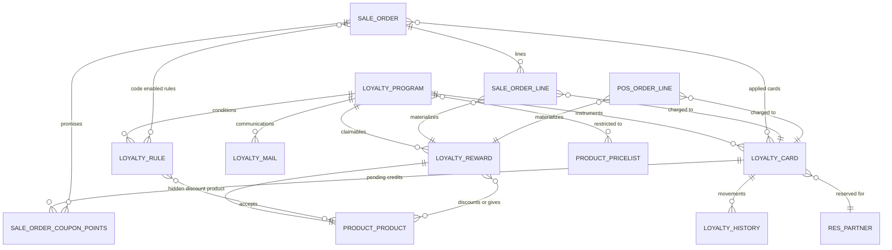

# Entities

This file specifies every entity the Loyalty and Promotions domain owns, and every field this
domain adds to entities owned elsewhere. For each entity it gives the purpose, the life cycle, the
complete field table, the relations, the uniqueness rules, the ordering, the display-name rule, the
archival behavior, the multi-company behavior and the extension points other capability packages
contribute.

Generated reference pages carrying the same field lists in machine-readable form are linked from
each entity heading.

## 0. Conventions

Field tables use four columns:

- **Identifier** — the reproduced storage name, in code font. It is contractual: an import, an
  integration or a client keyed on it.
- **Full name** — the name in words, as the interface shows it.
- **Type** — `boolean`, `integer`, `decimal`, `monetary` (a decimal rounded by a named currency),
  `single line text`, `long text`, `date`, `date and time`, `selection` (values listed),
  `link to X` (many-to-one), `collection of X` (one-to-many back-reference), `set of X`
  (many-to-many), `dynamic reference`, `structured value`, `image`.
- **Meaning and rules** — required, default, computed and from what, stored or not, read-only,
  copy behavior on duplication, change tracking, company scoping, indexing, delete behavior and
  selection labels.

Unless a row says otherwise a field is optional, stored, writable, copied when the record is
duplicated, and not tracked in the discussion thread.

Further conventions used throughout:

- **Required** means the system refuses to store the record without a value.
- **Default** is the value applied when the field is not supplied on creation.
- **Computed** names the inputs the value is derived from. A computed field is *stored* when the
  derived value is written to the table and recomputed only when an input changes, and *unstored*
  when it is recalculated on every read.
- **Writable computed** means the value is normally derived but may be overwritten by a user or by
  a caller; the derivation then runs again only when one of its inputs changes.
- **Mirror** means the value is read through a relation from another record and is not edited here.
  A mirror is *stored* when a copy is written to this table, normally so that a record rule can
  filter on it.
- **Precomputed** means the derived value is produced before the row is inserted, so that the
  column is never briefly empty.
- A *point* is the abstract unit of a program's currency of value. For a gift card or an
  electronic wallet one point is one unit of the program's monetary currency; for a loyalty card
  it is whatever the program's point label calls it.

Every persistent entity additionally carries the shared audit fields described once here and never
repeated per entity: the surrogate integer key `id` (identifier), `create_date` (created on),
`create_uid` (created by user), `write_date` (last updated on) and `write_uid` (last updated by
user). Entities that support archiving carry `active` (active); archived records are hidden from
every query that does not explicitly ask for them.

Amounts declared `monetary` are expressed in the currency named by the `currency_id` (currency)
field of the same record unless the row says otherwise, and are rounded to that currency's decimal
places.

---

## 1. Loyalty Program

**Loyalty Program** (`loyalty.program`, table `loyalty_program`) is the single configuration record
that describes one promotional offer of any kind. Reference page:
[../../references/entities/loyalty.program.md](../../references/entities/loyalty.program.md).

### 1.1 Purpose

One entity covers eight commercially very different products: automatic promotions, promotional
codes, printed or mailed coupons, buy-more-get-more offers, next-order coupons, loyalty cards, gift
cards and electronic wallets. They differ only in the values of a handful of fields.

A program answers four questions:

1. **When is it live?** — the validity window, the active flag, the price-list restriction, the
   company, the per-channel availability flags and the usage limit.
2. **What must the customer do to earn?** — the set of Loyalty Rules.
3. **What may the customer claim?** — the set of Loyalty Rewards.
4. **Where does the value live?** — the `applies_on` (applies on) field: on the current document
   only, on a card for future documents, or on a card that accumulates across documents.

### 1.2 Life cycle

A program has no status column. Its life is:

1. **Created**, normally from a template (section 1.9). Creation from a template writes the
   program type together with a complete preset of rules, rewards and communication plans, and
   each created reward immediately receives its hidden discount product.
2. **Live** whenever it is active, the current date falls inside the validity window, the channel
   flag for the channel in question is set, the price-list restriction (if any) matches, the
   storefront or counter restriction (if any) matches, and the usage limit (if any) has not been
   reached.
3. **Dormant** whenever any of those conditions fails. A dormant program is not deleted; orders
   that already carry its rewards lose them on the next recomputation.
4. **Archived** by clearing the active flag. Archiving cascades: the program's rules, rewards,
   communication plans and the rewards' hidden discount products are all archived with it. Setting
   the flag again un-archives all of them, and re-runs the promotional-code uniqueness checks.
5. **Deleted** — only possible while archived, and only when no card, no sales order line and no
   counter line references it. Deleting an active program is refused with "You can not delete a
   program in an active state".

### 1.3 Fields: identification and scope

| Identifier | Full name | Type | Meaning and rules |
|---|---|---|---|
| `name` | Program Name | single line text | Required. Translatable. The program name, used everywhere internally; it is never shown to the customer. Copied on duplication. |
| `active` | Active | boolean | Default true. Clearing it archives the program and cascades to `rule_ids`, `reward_ids`, `communication_plan_ids` and every reward's hidden discount product, including records that are already archived. Setting it again un-archives all of them. |
| `sequence` | Sequence | integer | Ordering key; default zero. The default ordering of the entity is by `sequence` ascending, so it also fixes the order in which automatic programs are considered by the recomputation. Rows can be dragged in the list to renumber it. **Not copied** on duplication. |
| `program_type` | Program Type | selection | Required. Default `promotion`. Eight values, listed in section 1.7. Changing it **rewrites** `rule_ids`, `reward_ids`, `communication_plan_ids`, `applies_on`, `trigger`, `portal_visible` and `portal_point_name` from the preset of the new type, discarding whatever was there. The form makes it read-only once the program has at least one card, and never offers the gift card and electronic wallet values. |
| `company_id` | Company | link to Company | Default: the company of the acting user. May be empty, which makes the program available to every company. Drives `currency_id`, the record rule and the visibility of the cards. |
| `currency_id` | Currency | link to Currency | Required. Writable computed, stored, precomputed from `company_id`: the company's currency when the company has one, otherwise the value already present. On delete: restricted. Every monetary field of the program's rules and rewards is expressed in this currency. |
| `currency_symbol` | Currency Symbol | single line text | Unstored mirror of the currency's symbol. Labels the point-mode and discount-mode choices on screen. |
| `pricelist_ids` | Pricelist | set of Price List | Optional. When non-empty the program applies only to documents priced with one of these price lists. The selection list is restricted to price lists whose currency equals `currency_id`, and a validation enforces the same rule. |

### 1.4 Fields: validity and usage limit

| Identifier | Full name | Type | Meaning and rules |
|---|---|---|---|
| `date_from` | Start Date | date | Optional. The first day of the validity window; the day itself is inside the window. Empty means no lower bound. |
| `date_to` | End date | date | Optional. The last day of the validity window; the day itself is inside the window. Empty means no upper bound. |
| `limit_usage` | Limit Usage | boolean | Default false. When set, `max_usage` caps the number of documents that may use the program. |
| `max_usage` | Max Usage | integer | Default zero. The cap. A database check enforces `limit_usage` false **or** `max_usage` strictly greater than zero. |
| `total_order_count` | Total Order Count | integer | Unstored, computed. The number of documents that have used the program, summed over every channel. The base value is zero; the sales channel adds `order_count` and the counter channel adds `pos_order_count`. This is the figure compared with `max_usage`. |
| `order_count` | Order Count | integer | Unstored, computed. Added by the sales channel. The number of **distinct sales orders** carrying at least one line whose reward belongs to this program. A document counts once per program however many reward lines it carries. |
| `pos_order_count` | Point of Sale Order Count | integer | Unstored, computed. Added by the counter channel. The number of distinct counter documents carrying at least one line whose reward belongs to this program. |

### 1.5 Fields: behavior

| Identifier | Full name | Type | Meaning and rules |
|---|---|---|---|
| `applies_on` | Applies On | selection | Required. Writable computed, stored, derived from `program_type`. Values `current` ("Current order"), `future` ("Future orders"), `both` ("Current & Future orders"). `current`: points earned on a document may only be spent on that same document and are otherwise lost. `future`: a card is minted for a later document. `both`: points accumulate on a nominative card and may be spent immediately or later. Editable on screen only for a loyalty program. |
| `trigger` | Trigger | selection | Writable computed, stored, derived from `program_type`. Values `auto` ("Automatic"), `with_code` ("Use a code"). An automatic program is considered by the recomputation without any user action; a code program is considered only once its code has been entered. Read-only on screen. |
| `portal_visible` | Portal Visible | boolean | Default false. When set, the number of points available and used by reward is shown to the customer in the customer portal, on the counter customer ticket and during storefront checkout. |
| `portal_point_name` | Portal Point Name | single line text | Writable computed, stored, translatable. Default `Points`. For the gift card and electronic wallet types it is forced to the symbol of `currency_id`, or to the empty text when the currency has no symbol. For every other type the preset of the program type supplies the label and the user may change it. This is the word used for one unit of value in every customer-facing message. |
| `is_nominative` | Is Nominative | boolean | Unstored, computed. True when `applies_on` is `both`, **or** when `program_type` is `ewallet` or `loyalty` **and** `applies_on` is `future`. A nominative program's value lives on a card that belongs to one named customer, and it keeps a single card per customer. |
| `is_payment_program` | Is Payment Program | boolean | Unstored, computed. True when `program_type` is `gift_card` or `ewallet`. A payment program behaves like a tender: its reward applies to the whole document total including every tax, it may consume fixed-amount taxes, and it is always applied after every other reward. |
| `payment_program_discount_product_id` | Discount Product | link to Product Variant | Unstored, read-only, computed. For a payment program, the hidden discount product of its first reward; empty otherwise. The document uses it to recognize payment lines. |
| `available_on` | Available On | boolean | Declared but not persisted at all. A pure label carrier in the form, grouping the per-channel availability switches. It holds no value. |

### 1.6 Fields: channels, collections and cards

| Identifier | Full name | Type | Meaning and rules |
|---|---|---|---|
| `sale_ok` | Sales | boolean | Default true. Added by the sales channel. The program may be used on sales orders. |
| `ecommerce_ok` | Available on Website | boolean | Default true. Added by the storefront channel. The program may be used in web carts. When the document belongs to a storefront this flag replaces `sale_ok` in the applicability filter. |
| `website_id` | Website | link to Storefront | Added by the storefront channel. Indexed. On delete: restricted. When set, restricts the program to one storefront; empty means every storefront. |
| `show_non_published_product_warning` | Show Non Published Product Warning | boolean | Unstored, computed. Added by the storefront channel. True when `program_type` is `ewallet` and at least one trigger product is not published on the storefront, in which case a shopper could never reach the top-up. Drives a warning banner on the program screen. |
| `pos_ok` | Point of Sale | boolean | Default true. Added by the counter channel. The program may be used at a counter. |
| `pos_config_ids` | Point of Sales | set of Point of Sale Configuration | Added by the counter channel. Writable computed, stored, derived from `pos_ok`: setting `pos_ok` to false empties the collection. When non-empty, restricts the program to those tills; **empty means every till**, which is the opposite of the usual convention and is deliberate. A program is in any case used only at a till whose currency equals the program currency. |
| `pos_report_print_id` | Print Report | link to Printable Document | Added by the counter channel. Unstored, computed as the printable document of the first communication plan, with an inverse writer. Restricted to documents defined on the Loyalty Card entity. Used to print generated gift cards at the till. |
| `rule_ids` | Conditional rules | collection of Loyalty Rule | Writable computed, stored, derived from `program_type`. Copied on duplication. The conditions of the program. May be empty, which means the program has no condition at all. |
| `reward_ids` | Rewards | collection of Loyalty Reward | Writable computed, stored, derived from `program_type`. Copied on duplication. **Must contain at least one reward** at the end of every write (see [business-rules.md](business-rules.md), rule LOY-005). |
| `communication_plan_ids` | Communication Plan | collection of Loyalty Communication | Writable computed, stored, derived from `program_type`. Copied on duplication. |
| `mail_template_id` | Email template | link to Message Template | Unstored, computed as the template of the **first** communication plan, with an inverse writer. Only meaningful for the gift card and electronic wallet types; the inverse is a no-op for every other type. Not copied. |
| `trigger_product_ids` | Trigger Product | set of Product Variant | Unstored mirror of `rule_ids.product_ids`, writable. The "top-up products" of a gift card or electronic wallet program. Reading returns the union of the product filters of the rules; writing writes them onto the rules. Ignored — and stripped from the submitted values — on creation of a program whose type is neither `gift_card` nor `ewallet`, because it would otherwise overwrite the product filters the preset has just installed. Not copied. |
| `coupon_ids` | Coupon | collection of Loyalty Card | The cards issued by the program. Not copied. |
| `coupon_count` | Coupon Count | integer | Unstored, computed as the number of cards linked to the program. |
| `coupon_count_display` | Items | single line text | Unstored, computed. The count, a space, then the plural item name of the program type (section 1.7) — for example `12 Gift Cards`. |

### 1.7 The eight program types

Every type is the *same* entity with a different preset. The preset is applied on creation through
the type default and re-applied whenever `program_type` changes.

| Stored value | Label | Plural item name | `applies_on` | `trigger` | `portal_visible` | `portal_point_name` |
|---|---|---|---|---|---|---|
| `promotion` | Promotions | Promos | `current` | `auto` | false | `Promo point(s)` |
| `promo_code` | Discount Code | Discounts | `current` | `with_code` | false | `Discount point(s)` |
| `coupons` | Coupons | Coupons | `current` | `with_code` | false | `Coupon point(s)` |
| `buy_x_get_y` | Buy X Get Y | Promos | `current` | `auto` | false | `Credit(s)` |
| `next_order_coupons` | Next Order Coupons | Coupons | `future` | `auto` | true | `Coupon point(s)` |
| `loyalty` | Loyalty Cards | Loyalty Cards | `both` | `auto` | true | `Loyalty point(s)` |
| `gift_card` | Gift Card | Gift Cards | `future` | `auto` | true | the symbol of the company currency |
| `ewallet` | eWallet | eWallets | `future` | `auto` | true | the symbol of the company currency |

### 1.8 The rule, reward and communication preset of each type

Each collection is **replaced**: the existing members are deleted and the listed ones created.

| Type | Rules created | Rewards created | Communication plans created |
|---|---|---|---|
| `promotion` | one rule: `reward_point_amount` 1, `reward_point_mode` `order`, `minimum_amount` 50, `minimum_qty` 0 | one reward: `required_points` 1, `discount` 10 (a ten percent discount, the default mode and applicability) | none |
| `promo_code` | one rule: `mode` `with_code`, `code` the text `PROMO_CODE_` followed by four random characters, `minimum_qty` 0 | one reward: `discount_applicability` `specific`, `discount_product_ids` the first sellable product, `discount_mode` `percent`, `discount` 10 | none |
| `coupons` | none | one reward: `required_points` 1, `discount` 10 | one plan: `trigger` `create`, the shipped coupon message template |
| `buy_x_get_y` | one rule: `reward_point_mode` `unit`, `product_ids` the first sellable product, `minimum_qty` 2 | one reward: `reward_type` `product`, `reward_product_id` the first sellable product, `required_points` 2 | none |
| `next_order_coupons` | one rule: `minimum_amount` 100, `minimum_qty` 0 | one reward: `reward_type` `discount`, `discount_mode` `percent`, `discount` 15, `discount_applicability` `order` | one plan: `trigger` `create`, the shipped coupon message template |
| `loyalty` | one rule: `reward_point_mode` `money` | one reward: `discount` 5, `required_points` 200. When the delivery capability is installed a second reward is appended: `reward_type` `shipping`, `required_points` 100. | none |
| `gift_card` | one rule: `reward_point_amount` 1, `reward_point_mode` `money`, `reward_point_split` true, `product_ids` the shipped gift-card product, `minimum_qty` 0 | one reward: `reward_type` `discount`, `discount_mode` `per_point`, `discount` 1, `discount_applicability` `order`, `required_points` 1, `description` `Gift Card` | one plan: `trigger` `create`, the shipped gift-card message template |
| `ewallet` | one rule: `reward_point_amount` 1, `reward_point_mode` `money`, `reward_point_split` false, `product_ids` the shipped top-up product | one reward: `reward_type` `discount`, `discount_mode` `per_point`, `discount` 1, `discount_applicability` `order`, `required_points` 1, `description` `eWallet` | none |

"The first sellable product" means the first product, in ascending identifier order, that may be
sold and that belongs to the acting company or to no company.

When the program type changes in the same write as new rewards, the at-least-one-reward
validation is suspended for that write, because the change first clears the rewards and then
recreates them. In the same write the new rule and reward records take their field defaults from
the preset of the **new** type rather than from the plain field defaults, so a rule or reward added
by hand to a promotion starts with the promotion defaults.

### 1.9 Program creation templates

The creation screen offers named templates instead of an empty form. Choosing one creates a
program with a name and the preset of its type and opens it. Two template lists exist; which one
is offered depends on the menu the user came from. An unknown template key creates nothing and
returns nothing.

Templates offered from the gift card and electronic wallet menu:

| Template key | Title | Description shown | Resulting configuration |
|---|---|---|---|
| `gift_card` | Gift Card | *Sell Gift Cards, that allows to purchase products* | Name `Gift Card`, type `gift_card` with its preset. |
| `ewallet` | eWallet | *Fill in your eWallet, to pay future orders* | Name `eWallet`, type `ewallet` with its preset. |

Templates offered from the discount and loyalty menu:

| Template key | Title | Description shown | Resulting configuration |
|---|---|---|---|
| `promotion` | Promotional Program | *Automatic promo: 10% off on orders higher than $50*, replaced by *Automatic promotion: free shipping on orders higher than $50* when the delivery capability is installed | Name `Promotional Program`, type `promotion` with its preset; with the delivery capability installed the reward set is replaced by a single free-shipping reward. |
| `promo_code` | Promo Code | *Get 10% off on some products, with a code* | Name `Discount code`, type `promo_code` with its preset. |
| `buy_x_get_y` | Buy X Get Y | *Buy 2 products and get a third one for free* | Name `2+1 Free`, type `buy_x_get_y` with its preset. |
| `next_order_coupons` | Next Order Coupon | *Send a coupon after an order, valid for next purchase* | Name `Next Order Coupons`, type `next_order_coupons` with its preset. |
| `loyalty` | Loyalty Card | *Win points with each purchase, and claim gifts* | Name `Loyalty Cards`, type `loyalty` with its preset. |
| `coupons` | Coupon | *Generate and share unique coupons with your customers* | Name `Coupons`, type `coupons` with its preset. |
| `fidelity` | Fidelity Card | *Buy 10 products to get 10$ off on the 11th one* | Name `Fidelity Cards`, type `loyalty`, `applies_on` `both`, `trigger` `auto`, one rule with `reward_point_mode` `unit` and `product_ids` the first sellable product, one reward with `discount_mode` `per_order`, `required_points` 11, `discount_applicability` `specific`, `discount_product_ids` that same product and `discount` 10. |

### 1.10 Constraints and validations

| Constraint | Condition that must hold | Exact message |
|---|---|---|
| Usage cap positive (database check) | `limit_usage` is false **or** `max_usage` is strictly greater than zero | "Max usage must be strictly positive if a limit is used." |
| Price-list currency | Every price list in `pricelist_ids` has the same currency as `currency_id` | "The loyalty program's currency must be the same as all it's pricelists ones." |
| Validity window ordered | When both are set, `date_from` is earlier than or equal to `date_to` | "The validity period's start date must be anterior or equal to its end date." |
| At least one reward | `reward_ids` is not empty at the end of the write; suspended while a program-type change is in flight | "A program must have at least one reward." |
| Printable document needs a template | On a gift card or electronic wallet program, `pos_report_print_id` may only be set when `mail_template_id` is already set | "You must set 'Email template' before setting 'Print Report'." The two quoted names are the on-screen labels of the two fields. |
| Deletion while active | The program's `active` is false | "You can not delete a program in an active state" |

Writing `mail_template_id` on a gift card or electronic wallet program rewrites the whole
communication plan: clearing it deletes every plan; setting it on a program with no plan creates
one plan with `trigger` `create`; setting it on a program that already has plans rewrites every
plan to `trigger` `create` with that template. On any other program type the write does nothing.

Writing `pos_report_print_id` behaves the same way for the printable document, after the template
check above: with no plan it creates one plan carrying `trigger` `create`, the template and the
document; with existing plans it rewrites every plan to `trigger` `create` with that document.

### 1.11 Derived helper: valid products per rule

For a set of product variants, the program returns a mapping from each of its rules to the subset
of those products that the rule accepts:

1. For each rule of the program, build the rule's product filter (section 2.4).
2. If the filter is a real restriction, the rule's entry is the subset of the given products that
   satisfy it.
3. If the filter is the always-true condition **and** the program type is not `gift_card`, the
   rule's entry is all of the given products.
4. If the filter is the always-true condition **and** the program type **is** `gift_card`, the
   rule has **no entry at all** — a gift-card rule with no product filter matches nothing, which
   prevents a gift card program from crediting itself on every order.

### 1.12 Uniqueness, ordering, display, scoping

- No uniqueness rule on the program itself. Two programs may share a name.
- Default ordering: `sequence` ascending, then insertion order.
- Display name: the `name` field.
- Archiving: supported, with the cascade of section 1.2.
- Hierarchy: none.
- Company scoping: the record rule named "Loyalty program multi company rule" admits a program
  when its `company_id` is empty, is one of the user's allowed companies, or is an ancestor of one
  of them. The rule applies to every operation.

---

## 2. Loyalty Rule

**Loyalty Rule** (`loyalty.rule`, table `loyalty_rule`) is one condition of a program, together
with the point-earning formula that applies when the condition is met. Reference page:
[../../references/entities/loyalty.rule.md](../../references/entities/loyalty.rule.md).

### 2.1 Purpose and life cycle

A rule is created, edited and deleted only as part of its program; it has no independent life. A
program may have zero, one or many rules. When a program has several rules they are evaluated
independently and their earned points are **added together** — they are alternatives that each
contribute, not conditions that must all hold. A rule with a code contributes nothing until that
code has been entered on the document.

A program with **no rule at all** and `applies_on` equal to `current` is treated as
unconditionally matched (see [calculations.md](calculations.md), section 4.2): this is how a coupon
program, whose value comes entirely from the card, is allowed to apply.

A rule is archived and un-archived with its program, and deleting the program deletes the rule.

### 2.2 Fields: identification

| Identifier | Full name | Type | Meaning and rules |
|---|---|---|---|
| `program_id` | Program | link to Loyalty Program | Required, indexed. On delete of the program: cascade. Copied when the program is duplicated. |
| `program_type` | Program Type | selection | Unstored mirror of `program_id.program_type`. Used by the screens to show or hide fields. |
| `company_id` | Company | link to Company | Stored mirror of `program_id.company_id`, stored specifically so that the multi-company record rule can filter on it. |
| `currency_id` | Currency | link to Currency | Unstored mirror of `program_id.currency_id`. The currency of `minimum_amount`. |
| `active` | Active | boolean | Default true. Driven by the program's archive cascade. |
| `user_has_debug` | User Has Debug | boolean | Unstored, computed per reading user. True for members of the technical-features group (`base.group_no_one`). Gates the display of the free-form product condition and of the point-earning block on program types that normally hide it. |
| `website_id` | Website | link to Storefront | Stored mirror of `program_id.website_id`. Added by the storefront channel; used by the storefront-aware code uniqueness rule. |

### 2.3 Fields: the condition

| Identifier | Full name | Type | Meaning and rules |
|---|---|---|---|
| `minimum_qty` | Minimum Quantity | integer | Default 1. The smallest total quantity of accepted products the document must carry. Quantities are converted into each product's reference unit of measure before they are summed. |
| `minimum_amount` | Minimum Purchase | monetary in `currency_id` | Default zero. The smallest value the accepted products' lines must total. Converted into the document currency before comparison (section 2.5). |
| `minimum_amount_tax_mode` | Minimum Amount Tax Mode | selection | Required. Default `incl`. Values `incl` ("tax included"), `excl` ("tax excluded"). Selects whether `minimum_amount` is compared with the lines' total with tax or without. |
| `product_ids` | Products | set of Product Variant | Explicit list of products the rule accepts. |
| `product_category_id` | Categories | link to Product Category | A category; the rule accepts every product whose category is that category or any descendant of it. On delete: set to empty. |
| `product_tag_id` | Product Tag | link to Product Tag | A tag; the rule accepts every product carrying it. On delete: set to empty. |
| `product_domain` | Product Domain | single line text | Default the literal `[]`. A stored filter expression over Product Variant, intersected with the other three criteria. Exposed only to the technical-features group. |
| `valid_product_ids` | Valid Products | set of Product Variant | Unstored, computed. Added by the counter channel. The products the rule currently accepts, additionally restricted to products marked available at a counter, and computed once per distinct filter so that identical rules share one computation. |
| `any_product` | Any Product | boolean | Unstored, computed. Added by the counter channel. True when the rule declares no product filter at all, that is when `product_ids` is empty, `product_category_id` is empty, `product_tag_id` is empty and `product_domain` is the literal `[]` or the single condition "the product may be sold". When it is true `valid_product_ids` is left empty and every product matches. |

### 2.4 The product filter

The filter a rule applies to products is assembled as follows:

1. Start with an empty list of criteria.
2. If `product_ids` is non-empty, add the criterion *the product is one of these*.
3. If `product_category_id` is set, add the criterion *the product's category is that category or a
   descendant of it*.
4. If `product_tag_id` is set, add the criterion *the product carries that tag*.
5. Combine the criteria collected so far with **or**. If none were collected, the combined criterion
   is *always true*.
6. If `product_domain` is set and is not the literal `[]`, intersect the result with that expression
   using **and**.

Note the asymmetry: the three simple criteria are alternatives (a product matching the tag is
accepted even if it is not in the explicit list), while the stored filter expression is an extra
requirement on top.

### 2.5 Fields: the grant

| Identifier | Full name | Type | Meaning and rules |
|---|---|---|---|
| `reward_point_amount` | Reward | decimal, two decimal places | Required. Default 1. The multiplier of the point-earning formula. A database check enforces that it is **strictly greater than zero**. |
| `reward_point_mode` | Reward Point Mode | selection | Required. Default `order`. Values `order` ("per order"), `money` ("per *symbol* spent", where *symbol* is the program's currency symbol), `unit` ("per unit paid"). Selects the point-earning formula. |
| `reward_point_split` | Split per unit | boolean | Default false. When set, and the program applies on future documents, and the mode is not `order`, the earned points are **not** summed: one separate card is issued per matched unit. This is how buying two gift cards of fifty produces two cards of fifty rather than one card of one hundred. |
| `reward_point_name` | Reward Point Name | single line text | Unstored, read-only mirror of `program_id.portal_point_name`. The unit label shown next to `reward_point_amount`. |

`minimum_amount` is stored in the program's currency. Before it is compared with a document total
it is converted into the document's currency at the rate of the current date, using the program's
company, or the acting company when the program has none. See [calculations.md](calculations.md),
section 3.

### 2.6 Fields: the code

| Identifier | Full name | Type | Meaning and rules |
|---|---|---|---|
| `mode` | Application | selection | Writable computed, stored, derived from `code`: `with_code` when a code is set, `auto` otherwise. Values `auto` ("Automatic"), `with_code` ("With a promotion code"). |
| `code` | Discount code | single line text | Writable computed, stored, derived from `mode`: cleared when the mode becomes `auto`. The text the customer or salesperson types. Must be unique across all active code-mode rules and must not collide with any active card code. |
| `promo_barcode` | Barcode | single line text | Added by the counter channel. Writable computed, stored, derived from `code`: regenerated as a freshly generated machine-readable code whenever `code` changes, using the card code generator of section 4.4. A barcode is therefore never reused across two different promotional codes. Editable afterwards. |

The two derivations of `mode` and `code` are mutually consistent, so a user may drive the pair from
either field.

### 2.7 Constraints

| Constraint | Condition that must hold | Exact message |
|---|---|---|
| Positive point amount (database check) | `reward_point_amount` greater than zero | "Rule points reward must be strictly positive." |
| Split forbidden on accumulating programs | `reward_point_split` false, **or** the program's `applies_on` is not `both` and its type is not `ewallet` | "Split per unit is not allowed for Loyalty and eWallet programs." |
| Code uniqueness among rules | Among the active rules being written no two share a code, and no other active rule with `mode` equal to `with_code` already uses one of them | "The promo code must be unique." |
| Code must not collide with a card | No active card carries one of the codes being written | "A coupon with the same code was found." |

When the storefront capability is present the uniqueness check is relaxed so that two programs may
share a code as long as they are not both reachable from the same storefront. The relaxed check
gathers, for every active code-mode rule being written and for every other active code-mode rule
whose storefront is empty or is one of the storefronts of the rules being written, the pairs
(code, storefront); a rule bound to a storefront contributes the pairs (code, its storefront) and
(code, empty); a rule bound to none contributes only (code, empty). A repeated pair raises "The
promo code must be unique." The card-collision check is unchanged.

### 2.8 Uniqueness, ordering, display, scoping

- No uniqueness rule other than the code rules above.
- Default ordering: insertion order.
- Display name: none of its own; screens render the rule as a card summarizing the conditions and
  the grant.
- Company scoping: the record rule named "Loyalty rule multi company rule", of the same shape as
  the program's, applied to the stored mirror `company_id`.

---

## 3. Loyalty Reward

**Loyalty Reward** (`loyalty.reward`, table `loyalty_reward`) is one thing a customer may claim in
exchange for points. Reference page:
[../../references/entities/loyalty.reward.md](../../references/entities/loyalty.reward.md).

### 3.1 Purpose and life cycle

A reward is created, edited and deleted as part of its program. Every program must keep at least
one reward. A program may hold several rewards; the customer, or the automatic evaluation, picks
one.

Each reward owns a **hidden discount product**: a service product, not sellable, not purchasable,
with a list price of zero, whose name is kept equal to the reward's description. It exists so that
every reward line on a document carries a real product and can therefore be priced, taxed, invoiced
and reported like any other line. In the sales and counter channels the product is additionally
created with no customer taxes, no vendor taxes and the "ordered quantities" invoicing policy. The
product is created automatically when the reward is created, and also whenever the description is
written while the reward has none; its name is rewritten whenever the reward's description changes,
including when the description is translated, in which case the product name receives the same
translations in the same languages.

Archiving the reward archives the product; un-archiving restores it. Deleting a single reward that
is already referenced by at least one sales order line, or by at least one counter line,
**archives** it instead of deleting it, so that historic documents keep a valid reference. Deleting
a reward always re-runs the at-least-one-reward validation of its program afterwards, because a
collection change alone does not trigger it.

### 3.2 Fields: identification

| Identifier | Full name | Type | Meaning and rules |
|---|---|---|---|
| `program_id` | Program | link to Loyalty Program | Required, indexed. On delete: cascade. |
| `program_type` | Program Type | selection | Unstored mirror of `program_id.program_type`. |
| `company_id` | Company | link to Company | Stored mirror of `program_id.company_id`, for the record rule. |
| `currency_id` | Currency | link to Currency | Unstored mirror of `program_id.currency_id`. The currency of `discount` when the mode is not a percentage, and of `discount_max_amount`. |
| `active` | Active | boolean | Default true. Driven by the program's archive cascade, and also used as a soft delete when the reward has already been used on a document. Writing it archives or un-archives `discount_line_product_id`. |
| `description` | Description | single line text | Required, translatable. Writable computed, stored, precomputed — see section 3.6 for the generation rule. This is the text written on the reward line of the document. Writing it creates the missing hidden discount product if needed and then renames it. |
| `reward_type` | Reward Type | selection | Required. Default `discount`. Values `product` ("Free Product"), `discount` ("Discount"); the delivery capability adds `shipping` ("Free Shipping"), and removing that capability falls a `shipping` reward back to the default `discount`. Read-only on screen for a buy-more-get-more program. |
| `required_points` | Points needed | decimal, two decimal places | Required. Default 1. The point price of one occurrence of the reward. A database check enforces that it is **strictly greater than zero**. The entity's default ordering is by this field ascending. |
| `point_name` | Point Name | single line text | Unstored, read-only mirror of `program_id.portal_point_name`. |
| `clear_wallet` | Clear Wallet | boolean | Default false. When set, claiming the reward consumes the card's **entire** remaining balance rather than exactly `required_points`, and yields exactly one occurrence of the reward. |
| `user_has_debug` | User Has Debug | boolean | Unstored, computed. Technical-features group membership (`base.group_no_one`); gates the free-form filter fields, the hidden discount product and the whole-balance flag. |

### 3.3 Fields: discount rewards

| Identifier | Full name | Type | Meaning and rules |
|---|---|---|---|
| `discount` | Discount | decimal, two decimal places | Default 10. The discount magnitude. Read as a percentage when `discount_mode` is `percent`, as an amount in `currency_id` when it is `per_order`, and as an amount in `currency_id` per point when it is `per_point`. A database check enforces that it is **strictly greater than zero** whenever `reward_type` is `discount`. |
| `discount_mode` | Discount Mode | selection | Required. Default `percent`. Values `percent` (labelled `%`), `per_order` (labelled with the currency symbol), `per_point` (labelled with the currency symbol followed by *per point*). Selects the discount formula. |
| `discount_applicability` | Discount Applicability | selection | Default `order`. Values `order` ("Order"), `cheapest` ("Cheapest Product"), `specific` ("Specific Products"). `order`: every line of the document. `cheapest`: one unit of the eligible line with the lowest unit price. `specific`: every line whose product satisfies the discountable-product filter. |
| `discount_product_ids` | Discounted Products | set of Product Variant | Explicit list of discountable products, used when the applicability is `specific`. |
| `discount_product_category_id` | Discounted Prod. Categories | link to Product Category | A category of discountable products; matches that category **and all of its descendants**, collected by walking the category tree. On delete: set to empty. |
| `discount_product_tag_id` | Discounted Prod. Tag | link to Product Tag | A tag of discountable products. On delete: set to empty. |
| `discount_product_domain` | Discount Product Domain | single line text | Default the literal `[]`. Extra filter expression on discountable products. Technical-features group only. |
| `all_discount_product_ids` | All Discount Products | set of Product Variant | Unstored, read-only, computed. The resolved set of discountable products — but only when the system parameter `loyalty.compute_all_discount_product_ids` has the value `enabled`; otherwise deliberately left empty to avoid a costly search. |
| `reward_product_domain` | Reward Product Domain | single line text | Unstored, read-only, computed. The literal text `null` when that same parameter has the value `enabled`, otherwise the discountable-product filter serialized as a structured text value, so that a counter can evaluate it itself. |
| `discount_max_amount` | Max Discount | monetary in `currency_id` | Optional, default zero meaning **no limit**. The largest amount this reward may ever discount. |
| `discount_line_product_id` | Discount Line Product | link to Product Variant | The hidden discount product (section 3.1). On delete: restricted, so the product must be archived rather than deleted. **Not copied** on duplication, so a duplicated reward receives its own new hidden product. |
| `is_global_discount` | Is Global Discount | boolean | Unstored, computed. True when `reward_type` is `discount` **and** `discount_applicability` is `order` **and** `discount_mode` is `per_order` or `percent`. Only global discounts take part in the "best discount wins" conflict rule. A per-point order discount — the gift card and electronic wallet shape — is deliberately **not** a global discount. |

### 3.4 Fields: free product rewards

| Identifier | Full name | Type | Meaning and rules |
|---|---|---|---|
| `reward_product_id` | Product | link to Product Variant | The product given away. Restricted to products that are not of the combination type. On delete: set to empty. |
| `reward_product_tag_id` | Product Tag | link to Product Tag | When set, every non-combination product carrying the tag may be chosen as the free product, which turns the reward into a choice. On delete: set to empty. |
| `reward_product_ids` | Reward Products | set of Product Variant | Unstored, read-only, computed, searchable: when `reward_type` is `product`, the union of `reward_product_id` and the non-combination products of `reward_product_tag_id`; otherwise empty. A search on this field matches rewards of type `product` whose `reward_product_id` is the searched product or whose tag's products contain it. |
| `multi_product` | Multi Product | boolean | Unstored, computed. True when `reward_type` is `product` and more than one product is claimable, which forces the claimant to choose. |
| `reward_product_qty` | Reward Product Quantity | integer | Default 1. How many units of the free product one claim gives. A database check enforces that it is **strictly greater than zero** whenever `reward_type` is `product`. |
| `reward_product_uom_id` | Reward Product Unit of Measure | link to Unit of Measure | Unstored, computed as the reference unit of the first claimable product. |

### 3.5 Constraints

| Constraint | Condition that must hold | Exact message |
|---|---|---|
| Positive point price (database check) | `required_points` greater than zero | "The required points for a reward must be strictly positive." |
| Positive free quantity (database check) | `reward_type` is not `product`, **or** `reward_product_qty` greater than zero | "The reward product quantity must be strictly positive." |
| Positive discount (database check) | `reward_type` is not `discount`, **or** `discount` greater than zero | "The discount must be strictly positive." |
| No combination product as a free product | `reward_product_id` does not name a product of the combination type | "A reward product can't be of type “combo”." |
| Program keeps a reward | The program still has at least one reward after the deletion | "A program must have at least one reward." |

### 3.6 The generated description

The description is regenerated whenever `reward_type`, `reward_product_id`, `discount_mode`,
`reward_product_tag_id`, `discount`, `currency_id`, `discount_applicability` or
`all_discount_product_ids` changes, unless a user has typed a description, which is then kept until
one of those fields changes again. The rule, in order:

1. If the program type is `gift_card`, the description is exactly `Gift Card`.
2. Else if the program type is `ewallet`, it is exactly `eWallet`.
3. Else if `reward_type` is `shipping`, it is `Free shipping`, followed, when `discount_max_amount`
   is not zero, by ` (Max ` + the formatted amount + `)`.
4. Else if `reward_type` is `product`:
   - with no claimable product: `Free Product`;
   - with exactly one: the template `Free Product - <product display name>`, that is `Free Product - `
     followed by that product's display name;
   - with several: the template `Free Product - [<comma separated product display names>]`, that is
     `Free Product - [` followed by the display names joined by a comma and a space, followed by `]`.
5. Else (a discount) the description is built from three pieces:
   - the magnitude piece: for `percent`, the discount value followed by `% on `; for `per_point`,
     the formatted amount followed by ` per point on `; for `per_order`, the formatted amount
     followed by ` on `;
   - the base piece: `your order` for `order`, `the cheapest product` for `cheapest`, and for
     `specific` either the single discountable product's display name, when exactly one product
     matches the filter, or `specific products`;
   - and, when `discount_max_amount` is not zero, ` (Max ` + the formatted amount + `)`.

The *formatted amount* is the numeric value and the currency symbol, with the symbol after the
number by default and before the number when the currency positions its symbol before amounts. The
number is rendered with the shortest representation that does not lose information, so trailing
zeros are dropped. The display names are rendered without the product's internal reference.

Worked examples:

| Reward | Description produced |
|---|---|
| `discount_mode` `percent`, `discount` 10, `discount_applicability` `order` | `10% on your order` |
| `discount_mode` `percent`, `discount` 20, `discount_applicability` `cheapest`, `discount_max_amount` 15, symbol `$` placed after the number | `20% on the cheapest product (Max 15 $)` |
| `discount_mode` `per_order`, `discount` 15, `discount_applicability` `specific` matching three products, `discount_max_amount` 40, symbol `$` placed before the number | `$ 15 on specific products (Max $ 40)` |
| `reward_type` `product`, a tag resolving to three products | `Free Product - [` the three display names separated by a comma and a space `]` |

### 3.7 The discountable-product filter

Assembled exactly like the rule's product filter (section 2.4), from `discount_product_ids`,
`discount_product_category_id` (that category **and all of its descendants**), and
`discount_product_tag_id`, combined with **or**, then intersected with `discount_product_domain`
using **and**.

### 3.8 The active-products filter

When deciding whether a free-product reward may be offered, the system requires that it still has a
live product to give: either the reward carries no product tag and its `reward_product_id` is
active, or it carries a product tag and at least one product behind the tag is active. Rewards whose
type is not `product` always pass this test.

### 3.9 Uniqueness, ordering, display, scoping

- Default ordering: `required_points` ascending. This matters: when several rewards of one
  program are affordable, the cheapest is the one offered first.
- Display name: the program name, a space, a hyphen, a space, then the description.
- Company scoping: the record rule named "Loyalty reward multi company rule", of the same shape as
  the program's, on the stored mirror `company_id`.

---

## 4. Loyalty Card

**Loyalty Card** (`loyalty.card`, table `loyalty_card`, full name *Loyalty Coupon*) is the
instrument that carries value. The same entity is a coupon, a loyalty card, a next-order coupon, a
gift card and an electronic wallet; the program type decides which. Reference page:
[../../references/entities/loyalty.card.md](../../references/entities/loyalty.card.md).

### 4.1 Purpose and life cycle

1. **Minted** in one of four ways: by the bulk generation wizard; automatically by the recomputation
   when a program that applies on future documents earns points on a document; by a counter
   document or a storefront cart applying such a program; or manually by a manager.
2. **Communicated** — on creation the program's "at creation" communication plans send their
   message to the card's recipient, when it has one.
3. **Credited** — its balance rises when a document that earns it points is confirmed, when a
   manager adjusts the balance, or when the generation wizard grants an opening balance.
4. **Debited** — its balance falls when a reward is claimed against it on a confirmed document.
5. **Exhausted** when its balance drops below the cheapest reward of its program. It is not
   deleted; entering its code then produces "This coupon has already been used."
6. **Expired** when `expiration_date` is strictly earlier than the reference date of the document.
   An expired card is silently dropped from a document during recomputation and refused on code
   entry.
7. **Archived** by clearing the active flag, which first deletes the pending point entries of every
   draft order that references it.
8. **Deleted** — automatically, when the document that created it no longer needs it (section 4.6),
   or manually.

### 4.2 Fields

| Identifier | Full name | Type | Meaning and rules |
|---|---|---|---|
| `program_id` | Program | link to Loyalty Program | Indexed, skipping empty values. On delete: restricted, so a program that has issued cards cannot be deleted while they exist. Default: the record identifier in the acting context, so that opening the card list from a program pre-fills it. |
| `program_type` | Program Type | selection | Unstored mirror of `program_id.program_type`. Used by the screens and by the counter application. |
| `company_id` | Company | link to Company | Stored, precomputed mirror of `program_id.company_id`, for the record rule. |
| `currency_id` | Currency | link to Currency | Unstored mirror of `program_id.currency_id`. Used when the balance is a monetary balance. |
| `partner_id` | Customer | link to Customer | Indexed. Optional. When set, the card is *reserved* for that customer and may only be used on that customer's documents. Empty means a bearer card: whoever holds the code may spend it. A nominative program always fills it. On delete: set to empty. |
| `points` | Points | decimal, two decimal places | Default zero. The balance. **Tracked**: every change is written to the card's discussion thread. For a gift card or an electronic wallet one point equals one unit of the program currency. |
| `point_name` | Point Name | single line text | Unstored, read-only mirror of `program_id.portal_point_name`. |
| `points_display` | Points Display | single line text | Unstored, computed. The balance rendered for humans — see section 4.3. |
| `code` | Code | single line text | Required. **Unique across the whole table.** Default: a generated code (section 4.4). Must not collide with any active code-mode rule code. Read-only on screen. |
| `expiration_date` | Expiration Date | date | Optional. The last day the card may be used; that day is still valid. Empty means the card never expires. A form-level check refuses setting it on a card of a `loyalty` program. |
| `use_count` | Use Count | integer | Unstored, computed. Base value zero; the sales channel adds the number of sales order lines referencing the card, the counter channel adds the counter lines. A card with a non-zero use count is never deleted automatically. |
| `active` | Active | boolean | Default true. |
| `history_ids` | History | collection of Loyalty History | Read-only. The movement list. Not copied. |
| `order_id` | Order Reference | link to Sales Order | Read-only. Added by the sales channel. The sales order that issued the card. On delete: set to empty. |
| `order_id_partner_id` | Sale Order Customer | link to Customer | Unstored mirror of `order_id.partner_id`. Declared as a message-recipient field so that communications reach the buyer even when the card itself has no customer. |
| `source_pos_order_id` | Source Point of Sale Order | link to Point of Sale Order | Added by the counter channel. The counter document that issued the card. On delete: set to empty. |
| `source_pos_order_partner_id` | Source Point of Sale Order Customer | link to Customer | Unstored mirror of that document's customer, also a message-recipient field. |
| Discussion-thread fields | — | various | The card carries a full discussion thread: followers, messages, attachment count and delivery-error flags. |

### 4.3 Balance rendering

```formula
case 1 — the program has a currency and point_name = the symbol of that currency
    points_display = formatted_amount( points , program currency )

case 2 — otherwise, and points = integer_part( points )
    points_display = text( integer_part( points ) ) + " " + point_name

case 3 — otherwise
    points_display = text( points rounded to 2 decimals, always 2 decimals shown ) + " " + point_name
```

`formatted_amount` renders the number with the currency's own decimal precision and places its
symbol according to the currency's symbol position. When `point_name` is empty the trailing space
is still produced. Worked examples, with a currency whose symbol is `$` placed before the number and
two decimal places:

| Program | Balance | Rendering |
|---|---|---|
| Gift card | 37.5 | `$ 37.50` |
| Gift card | 40.5 | `$ 40.50` |
| Loyalty card, label `Loyalty point(s)` | 40 | `40 Loyalty point(s)` |
| Loyalty card, label `Loyalty point(s)` | 120 | `120 Loyalty point(s)` |
| Loyalty card, label `Loyalty point(s)` | 120.5 | `120.50 Loyalty point(s)` |

### 4.4 Code generation

```formula
code = "044" + characters_8_to_18_of( a_random_universally_unique_identifier_in_text_form )
```

A universally unique identifier in its canonical text form is thirty-six characters long. The slice
that starts at the eighth character and stops before the nineteenth yields **eleven** characters,
hyphens included, so the generated code is **fourteen** characters long and begins with the three
digits `044`. The prefix makes the code acceptable to the shipped coupon barcode rule, which
recognizes codes beginning with `043` or `044`.

Worked example: the identifier `1a2b3c4d-5e6f-7081-92a3-b4c5d6e7f809` yields the slice `d-5e6f-7081`
and therefore the code `044d-5e6f-7081`, fourteen characters long.

### 4.5 Communication: recipient, author, signature, default template

The **recipient** of any message sent about a card is the first non-empty value among `partner_id`,
`order_id_partner_id` and `source_pos_order_partner_id`. When all three are empty no communication
is sent.

The **author** of an automatic communication is chosen as follows:

1. When the card has a source sales order and that order's company is among the sending user's
   allowed companies, the author is the contact of the order's salesperson, or, when the order has
   no salesperson, the contact of the order's company.
2. Otherwise, when the acting user is an internal user, the author is that user's contact; when it
   is not, the author is the contact of the card's company, falling back to the contact of the
   acting company.

The **signature** appended to the message is the source sales order's salesperson signature when
there is one, then the source counter document's cashier signature when there is one, and nothing
otherwise.

The **default template** used by the manual send operation is resolved in this order:

1. When the card was created by a counter document, a dedicated counter coupon template is looked
   up. In the shipped configuration no such template exists, so the resolution ends here with no
   template and the composition window opens empty.
2. Otherwise, the template of the program's communication plan whose trigger is `create`.
3. Otherwise, the shipped coupon information template.

### 4.6 Creation, write and archive side effects

On **creation**, the "at creation" communication plan of the program runs for every created card,
unless the calling context suppresses loyalty messages or suppresses sending entirely. For each card
that has a recipient, each plan with trigger `create` sends its template. When the template names no
sender address, the author computed above is used as both author and sender address so that the
message is actually delivered.

On **write**, when `points` is among the written values and the calling context does not suppress
loyalty messages, the balance before and after the write is captured for every card and the "when
reaching" communication plans are evaluated (section 6.2).

On **archive**, every pending point entry linking the card to a **draft** sales order is deleted
first, so that a quotation stops promising points to a card that is no longer usable; then the
active flag is cleared.

A card is **deleted automatically** in three situations:

1. **On confirmation of the document that created it**, when its program applies only on the
   current document and no line of the document claims a reward against it. Without this the
   document would leave behind a card carrying points nobody can spend.
2. **On cancellation of a document**, for every card the document created whose program is not
   nominative and whose use count is zero.
3. **On removal of the last reward line** that referenced it, when the card was created by that same
   document for a program that applies on the current document only. Removing the last line also
   removes the program's rules from the document's list of code-enabled rules, so that the code
   must be entered again.

### 4.7 Constraints and immediate checks

| Constraint | Condition that must hold | Exact message |
|---|---|---|
| Unique code (database constraint) | No other card carries the same `code` | "A coupon/loyalty card must have a unique code." |
| No collision with a rule code | No rule with `mode` equal to `with_code` carries the same code | "A trigger with the same code as one of your coupon already exists." |
| No expiry on a loyalty card (immediate form check) | `expiration_date` is empty whenever `program_type` is `loyalty` | "Expiration date cannot be set on a loyalty card." |

### 4.8 Uniqueness, ordering, display, scoping

- `code` is unique across the whole table.
- Default ordering: insertion order.
- Display name: the program name, a colon, a space, then the code — for example
  `Gift Cards: 044d-5e6f-7081`.
- Archiving: supported.
- Company scoping: the record rule named "Loyalty card multi company rule", of the same shape as the
  program's, on the stored mirror `company_id`.

---

## 5. Loyalty History

**Loyalty History** (`loyalty.history`, table `loyalty_history`, full name *History for Loyalty cards
and Ewallets*) is one movement on a card. Reference page:
[../../references/entities/loyalty.history.md](../../references/entities/loyalty.history.md).

### 5.1 Purpose

The history is the audit trail of a card's balance and the source of the customer-facing movement
list. It is written, never edited: a movement is created when a document is confirmed, when a
manager adjusts a balance, or when the generation wizard grants an opening balance, and it is
deleted only when the document that produced it is cancelled.

### 5.2 Fields

| Identifier | Full name | Type | Meaning and rules |
|---|---|---|---|
| `card_id` | Card | link to Loyalty Card | Required, indexed. On delete of the card: cascade. |
| `company_id` | Company | link to Company | Unstored mirror of `card_id.company_id`. Used by the record rule. |
| `description` | Description | long text | Required. Human-readable reason. For a sales order movement, the word `Order` followed by a space and the document's display name. For a counter movement, the word `Onsite` followed by a space and the ticket's display name. For a generation-wizard movement, the typed description or, when it is empty, `Gift For Customer`. For a balance adjustment, the typed description or, when it is empty, `Gift for customer`. When a bearer gift card is attached to a customer at a counter, `Assigning partner ` followed by the customer name, for example `Assigning partner Jane Doe`; when it is attached to its source ticket, `Assigning order ` followed by the ticket's display name. Worked examples of the two document forms: `Order S00042` for a sales order and `Onsite Order 0001-005-0007` for a counter ticket. |
| `issued` | Issued | decimal, two decimal places | Default zero. Points added by this movement. |
| `used` | Used | decimal, two decimal places | Default zero. Points removed by this movement. |
| `order_model` | Order Model | single line text | Read-only. The transport name of the entity that caused the movement — `sale.order` for a sales order, `pos.order` for a counter document. Empty for wizard movements. |
| `order_id` | Order | dynamic reference | Read-only. The identifier of that record, interpreted against `order_model`. |

A single movement may carry both an issued and a used amount: one document can simultaneously earn
points on a card and spend points from it, and that is recorded as one row.

### 5.3 Derived values

- The **signed points** shown to the customer are `issued − used`, rendered with a leading `+` when
  `issued` is greater than or equal to `used` and a leading `−` otherwise, followed by the absolute
  difference formatted by the card's balance-rendering rule (section 4.3).
- The **document description** is the display name of the referenced record.
- The **document address** is the customer-portal address of the referenced sales order when
  `order_model` is `sale.order` and `order_id` is set, and nothing otherwise.

### 5.4 Ordering, display, scoping

- Default ordering: identifier **descending**, so the newest movement comes first.
- Display name: `description`.
- Archiving: not supported.
- Company scoping: the record rule named "Loyalty history multi company rule", of the same shape as
  the program's, on the unstored company mirror.

---

## 6. Loyalty Communication

**Loyalty Communication** (`loyalty.mail`, table `loyalty_mail`) says which message template to send
on which event, and which document to print. Reference page:
[../../references/entities/loyalty.mail.md](../../references/entities/loyalty.mail.md).

### 6.1 Fields

| Identifier | Full name | Type | Meaning and rules |
|---|---|---|---|
| `program_id` | Program | link to Loyalty Program | Required, indexed. On delete: cascade. |
| `active` | Active | boolean | Default true. Driven by the program's archive cascade. |
| `trigger` | When | selection | Required. Values `create` ("At Creation"), `points_reach` ("When Reaching"). |
| `points` | Points | decimal, two decimal places | Default zero. The milestone balance, meaningful only for the `points_reach` trigger; the screen requires it then and hides it otherwise. |
| `mail_template_id` | Email Template | link to Message Template | Required. Restricted to templates whose target entity is `loyalty.card`. On delete of the template: cascade, so deleting the template deletes the communication plan. |
| `pos_report_print_id` | Print Report | link to Printable Document | Added by the counter channel. The document to render at a counter when a card is created there. Restricted to documents defined on `loyalty.card`. |

### 6.2 Milestone selection rule

When a card's balance changes, for each card that has a resolvable recipient **and** an owner, and
whose balance strictly increased:

1. Collect the program's communication plans whose trigger is `points_reach`, sorted by `points`
   descending.
2. Find the first plan whose `points` is strictly greater than the balance before the change and
   less than or equal to the balance after the change.
3. Send that plan's template once. When several milestones are crossed by one movement, only the
   highest crossed milestone is sent.
4. When no plan matches, send nothing.

Cards without an owner, cards whose balance decreased or stayed equal, and cards of programs with
no such plan are skipped.

Worked example: a program has milestone plans at 100, 250 and 500 points. A card moves from 80 to
300 points in one write. Sorted descending the plans are 500, 250, 100. The plan at 500 is not
crossed, because 500 is greater than 300. The plan at 250 is crossed, because 250 is greater than 80
and 250 is less than or equal to 300, and its template is sent. The plan at 100 is not examined.

### 6.3 Ordering, display, scoping

- Default ordering: insertion order.
- Display name: none of its own; the screen shows the three columns of the plan.
- Archiving: supported, driven by the program.
- No record rule of its own; visibility follows the program through the collection.

---

## 7. Sales Order Coupon Points

**Sales Order Coupon Points** (`sale.order.coupon.points`, table `sale_order_coupon_points`, full
name *Sale Order Coupon Points - Keeps track of how a sale order impacts a coupon*) records the
promise that one order will credit one card with a number of points when it is confirmed. Reference
page:
[../../references/entities/sale.order.coupon.points.md](../../references/entities/sale.order.coupon.points.md).

### 7.1 Purpose

Points must not be credited while an order is still a quotation: the quotation may change or be
abandoned. The pending point entry is therefore the *planned* credit. It is recomputed on every
change of the order, it is turned into a real balance change at confirmation, and it is reversed at
cancellation. It also makes the future balance visible to the evaluation, so that a customer can
claim, on the same order, a reward paid with the points that same order grants.

### 7.2 Fields

| Identifier | Full name | Type | Meaning and rules |
|---|---|---|---|
| `order_id` | Order | link to Sales Order | Required, indexed. On delete of the order: cascade. Not copied. |
| `coupon_id` | Coupon | link to Loyalty Card | Required. On delete of the card: cascade. Not copied. |
| `points` | Points | decimal, two decimal places | Required. The planned credit. May be zero, which keeps a nominative program's card attached to the order without promising anything, and may be negative in a malformed state, which confirmation refuses. Not copied. |

### 7.3 Constraint, ordering, scoping

| Constraint | Condition that must hold | Exact message |
|---|---|---|
| One entry per pair (database constraint) | At most one entry per (`order_id`, `coupon_id`) pair | "The coupon points entry already exists." |

- Default ordering: insertion order.
- Display name: none of its own.
- Archiving: not supported.
- The whole collection is cleared when the order is duplicated, so a copy never carries the point
  promises of its source.

---

## 8. Transient entities

Transient records are created to collect input, act, and are discarded afterwards. They carry the
shared audit fields of section 0 but are never archived and never duplicated.

### 8.1 Card Generation Wizard

**Card Generation Wizard** (`loyalty.generate.wizard`, full name *Generate Coupons*) mints cards in
bulk for one program. Reference page:
[../../references/entities/loyalty.generate.wizard.md](../../references/entities/loyalty.generate.wizard.md).

| Identifier | Full name | Type | Meaning and rules |
|---|---|---|---|
| `program_id` | Program | link to Loyalty Program | Required. Default: the record identifier in the acting context, or the default supplied by the calling action. |
| `program_type` | Program Type | selection | Unstored mirror of `program_id.program_type`. Drives the wording of the screen. |
| `mode` | For | selection | Required. Default `anonymous`. Values `anonymous` ("Anonymous Customers"), `selected` ("Selected Customers"). The electronic wallet action opens the wizard with `selected` preselected, because a wallet requires an owner. |
| `customer_ids` | Customers | set of Customer | Explicit customer list for the `selected` mode. |
| `customer_tag_ids` | Customer Tags | set of Customer Tag | Every customer carrying one of these tags is included in the `selected` mode. |
| `coupon_qty` | Quantity | integer | Writable computed. In the `selected` mode it is recomputed as the number of resolved customers whenever `customer_ids`, `customer_tag_ids` or `mode` changes; in the `anonymous` mode the current value is kept, or zero when there is none. |
| `points_granted` | Grant | decimal, two decimal places | Required. Default 1. The starting balance of every created card. |
| `points_name` | Points Name | single line text | Unstored, read-only mirror of `program_id.portal_point_name`. |
| `valid_until` | Valid Until | date | Written to `expiration_date` of every created card. |
| `will_send_mail` | Will Send Mail | boolean | Unstored, computed. True when `mode` is `selected` and the program has at least one communication plan with trigger `create`. Warns the user that creating the cards will send messages. |
| `confirmation_message` | Confirmation Message | single line text | Unstored, computed: `You're about to generate ` + the program type label + ` with a value of ` + the grant + ` for ` + the quantity + ` customers`. |
| `description` | Description | long text | Written to the `description` of the history movement created for each card. |

Customer resolution in the `selected` mode combines the explicit list and the tag list with **or**:
a customer matches when it is in the explicit list or carries one of the tags. **When neither list
is filled the resolution is the always-true condition and every contact in the database is
selected.** In the `anonymous` mode the resolution returns nothing and `coupon_qty` bearer cards are
created.

The generation operation:

1. Refuse with "Can not generate coupon, no program is set." when the wizard has no program.
2. Refuse with "Invalid quantity." when `coupon_qty` is zero or negative.
3. Build one set of values per card: `program_id`, `points` equal to `points_granted`,
   `expiration_date` equal to `valid_until`, and `partner_id` equal to the resolved customer in the
   `selected` mode or empty in the `anonymous` mode.
4. Create the cards. Creation generates a unique code for each and runs the "at creation"
   communication plan.
5. Create one Loyalty History movement per card with `issued` equal to `points_granted`, `used`
   zero, and `description` equal to the typed description or, when it is empty, `Gift For Customer`.
6. Return the created cards.

### 8.2 Card Balance Wizard

**Card Balance Wizard** (`loyalty.card.update.balance`, full name *Update Loyalty Card Points*) sets
a new balance on one card and records the difference. Reference page:
[../../references/entities/loyalty.card.update.balance.md](../../references/entities/loyalty.card.update.balance.md).

| Identifier | Full name | Type | Meaning and rules |
|---|---|---|---|
| `card_id` | Card | link to Loyalty Card | Required. Default: the card the wizard was opened from. Read-only on screen. |
| `old_balance` | Old Balance | decimal, two decimal places | Unstored mirror of `card_id.points`. Shown for reference. |
| `new_balance` | New Balance | decimal, two decimal places | Default zero. The balance to set. |
| `description` | Description | single line text | Required. The reason, written to the history movement. |

The update operation:

1. Refuse with "New Balance should be positive and different then old balance." when `new_balance`
   equals `old_balance` or when `new_balance` is negative.
2. Compute `difference = new_balance − old_balance`.
3. Create a history movement on the card with `issued` equal to the difference and `used` zero when
   the difference is positive, and with `used` equal to the absolute difference and `issued` zero
   when it is negative. The description is the typed text, or `Gift for customer` when it is empty.
4. Write `new_balance` into the card's `points`. This write is tracked in the discussion thread and
   triggers the milestone communications of section 6.2.

### 8.3 Coupon Entry Wizard

**Coupon Entry Wizard** (`sale.loyalty.coupon.wizard`, full name *Sale Loyalty - Apply Coupon
Wizard*) takes a code typed by a salesperson and applies it to a sales order. Reference page:
[../../references/entities/sale.loyalty.coupon.wizard.md](../../references/entities/sale.loyalty.coupon.wizard.md).

| Identifier | Full name | Type | Meaning and rules |
|---|---|---|---|
| `order_id` | Order | link to Sales Order | Required. Default: the order the wizard was opened from. |
| `coupon_code` | Coupon Code | single line text | Required. The code typed by the salesperson. |

The apply operation:

1. Refuse with "Invalid sales order." when the wizard carries no order.
2. Run the code application algorithm of [workflows.md](workflows.md), section 3.4.
3. When the result carries an error, refuse with that exact error text.
4. Otherwise collect every reward of the result and open the Reward Selection Wizard on the same
   order, pre-filtered to those rewards.

### 8.4 Reward Selection Wizard

**Reward Selection Wizard** (`sale.loyalty.reward.wizard`, full name *Sale Loyalty - Reward
Selection Wizard*) lists the claimable rewards of a sales order and applies the chosen one.
Reference page:
[../../references/entities/sale.loyalty.reward.wizard.md](../../references/entities/sale.loyalty.reward.wizard.md).

| Identifier | Full name | Type | Meaning and rules |
|---|---|---|---|
| `order_id` | Order | link to Sales Order | Required. Default: the order the wizard was opened from. |
| `reward_ids` | Rewards | set of Loyalty Reward | Unstored, computed. Every reward currently claimable on the order, recomputed whenever `order_id` changes. Empty when the wizard has no order. |
| `selected_reward_id` | Selected Reward | link to Loyalty Reward | The reward to claim, restricted to `reward_ids`. |
| `multi_product_reward` | Multi Product Reward | boolean | Unstored mirror of `selected_reward_id.multi_product`. Reveals the product chooser. |
| `reward_product_ids` | Reward Products | set of Product Variant | Unstored mirror of `selected_reward_id.reward_product_ids`. |
| `selected_product_id` | Selected Product | link to Product Variant | Writable computed. The chosen free product, restricted to `reward_product_ids`. Empty when the selected reward is not a free-product reward, otherwise the first claimable product. |

The apply operation:

1. Refuse with "No reward selected." when `selected_reward_id` is empty.
2. Recompute the claimable rewards and find the card that offers the selected reward.
3. Refuse with "Coupon not found while trying to add the following reward: " followed by the reward
   description when no card offers it.
4. Apply the reward to the order with the chosen product.
5. Re-run the full program and reward recomputation of the order.
6. Delete every card created for the current order by a program whose `applies_on` is `current`
   and that no reward line uses, so that no unusable card is left behind.

The cancel operation performs only step 6.

### 8.5 Coupon Sharing Wizard

**Coupon Sharing Wizard** (`coupon.share`, full name *Create links that apply a coupon and redirect
to a specific page*) builds a web address that applies a code and then redirects the visitor.
Reference page:
[../../references/entities/coupon.share.md](../../references/entities/coupon.share.md).

| Identifier | Full name | Type | Meaning and rules |
|---|---|---|---|
| `website_id` | Website | link to Storefront | Required. Default: the program's storefront when it has one; otherwise the only storefront when exactly one exists; otherwise empty. |
| `program_id` | Program | link to Loyalty Program | Required. Default: the program, or the card's program. Restricted to programs of type `coupons`, or whose `trigger` is `with_code`, or that have at least one rule carrying a code. |
| `coupon_id` | Coupon | link to Loyalty Card | The specific card being shared, when the wizard was opened from a card. Restricted to cards of `program_id`. |
| `program_website_id` | Program Website | link to Storefront | Unstored mirror of `program_id.website_id`. Used by the consistency check. |
| `promo_code` | Promo Code | single line text | Unstored, computed: the card's code when a card is selected, otherwise the code of the program's first code-mode rule. |
| `share_link` | Share Link | single line text | Unstored, computed. The address itself. |
| `redirect` | Redirect | single line text | Required. Default `/shop`. The page the visitor lands on after the code has been applied. |

| Constraint | Condition that must hold | Exact message |
|---|---|---|
| A coupon program needs a card | When `program_id` is of type `coupons`, `coupon_id` is set | "A coupon is needed for coupon programs." |
| Storefront consistency | When the program is restricted to a storefront, `website_id` is that storefront | "The shared website should correspond to the website of the program." |

The address is the storefront's base address, then `/coupon/`, then the code, then a query string
carrying the redirect page under the key `r`. When the wizard is opened in short-link mode, an
existing tracked link for that address is reused, or a new one is created, and its short address is
returned instead. The operation that opens this wizard refuses with "Provide either a coupon or a
program." when it is called with both a card and a program, or with neither. The window title is
`Share ` followed by the plural item name of the program (section 1.7).

---

## 9. Fields added to the Sales Order

The sales channel adds the following to **Sales Order** (`sale.order`, table `sale_order`),
specified in full in [the sales domain](../sales/entities.md) and extended here.

| Identifier | Full name | Type | Meaning and rules |
|---|---|---|---|
| `applied_coupon_ids` | Manually Applied Coupons | set of Loyalty Card | Cards brought onto the order by entering a code, plus the customer's electronic wallets and accumulating loyalty cards loaded automatically at the start of every recomputation. **Not copied.** |
| `code_enabled_rule_ids` | Manually Triggered Rules | set of Loyalty Rule | The code-mode rules whose code has been entered on this order. A code-mode rule is ignored by the point computation until it appears here. **Not copied.** |
| `coupon_point_ids` | Coupon Points | collection of Sales Order Coupon Points | The pending credits of this order. **Not copied.** |
| `reward_amount` | Reward Amount | decimal, two decimal places | Unstored, computed from the order lines. See [calculations.md](calculations.md), section 11.1. |
| `gift_card_count` | Gift Card Count | integer | Unstored, computed. The number of gift cards this order issued. |
| `loyalty_data` | Loyalty Data | structured value | Unstored, computed. For a confirmed order that has history movements only: the point label (the single card's `point_name` when exactly one card is involved, otherwise the literal `Points`), the total points issued and the total points used, read from the history rows that name this order. Empty for any order that is not confirmed. |
| `disabled_auto_rewards` | Disabled Automatic Rewards | set of Loyalty Reward | Added by the storefront channel, stored in its own association table. Rewards the shopper removed from the cart by hand. An automatic reward listed here is never claimed automatically again on that cart. Copied on duplication. |

### 9.1 Duplication

Duplicating an order copies its non-reward lines and then deletes every reward line of the copy;
neither the applied cards, nor the code-enabled rules, nor the pending point entries are copied. The
duplicate therefore starts with no promotion applied, and the next recomputation re-applies whatever
automatic programs still match.

---

## 10. Fields added to the Sales Order Line

| Identifier | Full name | Type | Meaning and rules |
|---|---|---|---|
| `is_reward_line` | Is Reward Line | boolean | Unstored, computed as *the line names a reward*. |
| `reward_id` | Reward | link to Loyalty Reward | Read-only. On delete: restricted. The reward this line materializes. |
| `coupon_id` | Coupon | link to Loyalty Card | Read-only. On delete: restricted. The card whose points paid for this line. |
| `reward_identifier_code` | Reward Identifier Code | single line text | A random text, identical on every line produced by one claim of one reward and different for every claim, including two claims of the same reward. A percentage discount on an order carrying three different tax groups produces three lines sharing one identifier code. |
| `points_cost` | Points Cost | decimal, two decimal places | Default zero. How many points this line takes off the card. When a reward produces several lines, only **one** of them carries the cost; the others carry zero. |

Behavioural overrides on a reward line:

| Behavior | Override |
|---|---|
| Description derivation | Skipped: the line keeps the reward's description, or the description a user typed over it. When a recomputation reuses a line for the same product, the existing description is preserved. |
| Discount percentage derivation | Skipped: the reward writes the price directly, so a price-list rule never overwrites it. |
| Tax derivation | The taxes are **not** taken from the product. The taxes already written on the line are filtered to the line's company and then mapped through the order's fiscal position. This is what allows one discount line to carry exactly the tax combination it compensates. |
| Display price | For a reward that is not a free product, the display price is the line's own unit price, because the hidden discount product has no list price. A free-product reward is a normal product line and therefore prices normally, then carries a hundred percent line discount. |
| Invoiceable alone | False: an invoice containing only reward lines is not produced. |
| Discount line classification | A line whose reward type is `discount` counts as a discount line for invoice-line reporting. |
| Sellable line filter | Reward lines are excluded from the set of sellable lines used for combination and configuration purposes. |
| Portal editability | A reward line may never be edited by the customer on the portal page. |
| Cart display | A discount reward line is hidden from the cart line list and shown in the summary instead; a free-product reward line is shown. A reward line is never reorderable and never shows a struck-through reference price. Only a free-product reward line counts as sellable in the cart checks. |
| Screen editability | The quantity and the unit price of a reward line are read-only on the order screen, and the taxes are read-only once the order is confirmed. |

### 10.1 Resetting a line

Recomputation needs to neutralize a reward line without deleting it, so that the line can be reused.
Resetting writes `points_cost` zero, unit price zero and technical unit price zero, so that the line
no longer influences any amount. A *complete* reset additionally clears `reward_id` and `coupon_id`;
it is used just before the line is deleted, so that the line stops influencing anything in the
meantime.

### 10.2 Point bookkeeping on a confirmed order

Creating, changing or deleting a reward line on an order that is already confirmed moves points
immediately, because there is no later confirmation to do it:

- **On creation** with a card and a non-zero point cost: the card's balance decreases by the cost and
  the order's history movement for that card is updated by the same amount, or created when there is
  none.
- **On change** of `points_cost` or of `coupon_id`: the previous card is credited back its previous
  cost and the new card is debited the new cost; the history is adjusted by the difference in a
  single movement when the card is unchanged, and by a negative correction on the old card plus a
  positive use on the new card when the card changed.
- **On deletion**: the card is credited back the line's point cost.

### 10.3 Deleting a reward line

Deleting one line of a reward deletes **all** lines of that same claim — every line sharing the same
(`reward_id`, `coupon_id`, `reward_identifier_code`) triple. In addition:

1. If the order is confirmed, the point cost of every deleted line is credited back to its card
   before the deletion.
2. If the card was applied by code, it is removed from `applied_coupon_ids`.
3. Otherwise, if the card was created by this order for a program that applies on the current
   document only, and no surviving line references it, the card itself is deleted and that
   program's rules are removed from `code_enabled_rule_ids`.
4. In the storefront, the removed reward is additionally recorded in `disabled_auto_rewards`, so
   that the automatic claiming does not put it back.

---

## 11. Fields added to the Point of Sale Order Line

| Identifier | Full name | Type | Meaning and rules |
|---|---|---|---|
| `is_reward_line` | Is Reward Line | boolean | Default false. Stored. Whether this line is part of a reward. |
| `reward_id` | Reward | link to Loyalty Reward | Indexed, skipping empty values. On delete: restricted. The reward this line materializes. |
| `coupon_id` | Coupon | link to Loyalty Card | Indexed, skipping empty values. On delete: restricted. The card used to claim the reward. |
| `reward_identifier_code` | Reward Identifier Code | single line text | Links the several lines produced by one reward claim. |
| `points_cost` | Points Cost | decimal, two decimal places | Default zero. How many points the reward costs on the card. |

Behavioural overrides: a reward line whose reward type is `discount` counts as a discounted line in
the receipt statistics; the discount amount reported for a reward line is the absolute tax-included
subtotal of the line; a reward line is never treated as a refund line.

---

## 12. Fields and behaviors added to other entities

| Entity | Addition | Rule |
|---|---|---|
| Point of Sale Order (`pos.order`) | Operations that validate the point changes computed on the device, create the cards the ticket earned, update pre-existing gift cards, write history movements and attach the printed gift card to the receipt message. No stored field is added. | [point-of-sale-application.md](point-of-sale-application.md) |
| Point of Sale Configuration (`pos.config`) | The resolution of the programs available at the counter, the pre-opening validation of those programs, and the code redemption service. No stored field is added. | [point-of-sale-application.md](point-of-sale-application.md) |
| Point of Sale Session (`pos.session`) | The four loyalty entities are appended to the list of entities loaded onto the cashier's device. | [point-of-sale-application.md](point-of-sale-application.md) |
| Product Variant (`product.product`) | **Archive protection.** Archiving is refused while at least one **active** reward names the product as its `discount_line_product_id` or lists it among its `discount_product_ids`. Message: "This product may not be archived. It is being used for an active promotion program." | [business-rules.md](business-rules.md), LOY-148 |
| Product Variant | **Delete protection.** Deleting the shipped gift-card product or the shipped top-up product is refused. Message: "You cannot delete " + the product display name without its internal reference + " as it is used in 'Coupons & Loyalty'. Please archive it instead." | LOY-149 |
| Product Variant | The image of a reward's hidden discount product is readable by anonymous visitors, so that a reward can be pictured in a public cart. The placeholder image of such a product is the gift-card picture for a gift card program and the generic discount picture otherwise. | LOY-122 |
| Product Template (`product.template`) | **Delete protection** for the templates carrying those two products, with the same message. **Default picture**: a template created while the gift-card flag is present in the acting context receives the shipped gift-card picture. Counter data loading adds every hidden discount product, every reward product and every trigger product the cashier may read, and marks the shipped gift-card and top-up products, plus the trigger products of electronic wallet programs, as specially displayed. | LOY-149 |
| Price List (`product.pricelist`) | **Archive protection.** Archiving is refused while at least one **active** program lists that price list in `pricelist_ids`. Message: "This pricelist may not be archived. It is being used for active promotion programs: " followed by the names of every offending active program separated by a comma and a space. | LOY-150 |
| Customer (`res.partner`) | `loyalty_card_count` (Active loyalty cards), unstored integer, computed with elevated rights, visible to internal users and, at a counter, to the cashier group. Counts the cards that are active, carry a strictly positive balance, belong to an active program, are not expired (expiry empty or not before today), whose company is empty or among the user's allowed companies, and whose owner is this customer **or any of its descendants**; the count of a descendant is added to every ancestor present in the queried set. | — |
| Customer | **Card list action.** Opens the card list filtered to the customer and all of its descendants, with the active filter preselected and creation disabled. | [interfaces.md](interfaces.md) |
| Customer Merge Wizard (`base.partner.merge.automatic.wizard`) | Before the generic reference rewrite, the nominative cards of the source customers are consolidated onto one card per program whose balance is the sum. | [workflows.md](workflows.md), section 2.6 |
| Journal Item (`account.move.line`) | **Discount classification.** An invoice line is treated as a discount line when any sales order line behind it is a reward line whose reward type is `discount`, or when the invoice comes from a counter document whose reward discount products include the line's product. | LOY-100 |
| Barcode Rule (`barcode.rule`) | A `coupon` rule type is added, together with the shipped rule named `Coupon & Gift Card Barcodes`, sequence 50, any encoding, matching codes that begin with `043` or `044`. | [configuration.md](configuration.md) |

---

## 13. Entity relationship summary



---

## 14. Reconciliation notes

Two independently written descriptions of this domain were merged into this file. Where they
differed, the source behavior decided; each resolution is recorded here.

1. **Field naming.** One version named every field by a full-word form of its own (for example
   *maximum usage*, *discount percentage*, *history movements*). The other reproduced the storage
   names exactly. The storage names are contractual, so they are reproduced here
   (`max_usage`, `discount`, `history_ids` and so on) and the full name is carried in its own
   column, as the documentation rules require.
2. **Card code length.** One version stated that the generated code is thirteen characters long,
   built from ten characters of a universally unique identifier. The slice actually taken is
   eleven characters long, so the code is **fourteen** characters. The corrected figure is used here
   and in [business-rules.md](business-rules.md).
3. **System parameter keys.** One version invented descriptive parameter keys. The reproduced keys
   are `loyalty.compute_all_discount_product_ids`, `loyalty.timezone`,
   `website_sale_coupon.abandonned_coupon_validity`, `sale.automatic_invoice` and
   `sale.default_invoice_email_template`; they are used throughout.
4. **Channel flag defaults.** One version gave no default for `pos_ok` and `ecommerce_ok`. Both
   default to true, like `sale_ok`; the stated defaults are used.
5. **`valid_product_ids` and `any_product`.** One version listed them as core fields of the rule.
   They are contributed by the counter channel, and the file now says so.
6. **Point label of the gift card and electronic wallet presets.** One version said "the currency
   symbol", the other "the company currency symbol". The preset writes the symbol of the **company**
   currency at the moment the type is applied, while the stored derivation afterwards keeps
   `portal_point_name` equal to the symbol of the program's own `currency_id`. Both statements are
   kept, each in its place: section 1.7 for the preset, section 1.5 for the derivation.
7. **Loyalty preset reward.** One version described it as "five points' worth at two hundred points
   required". The preset writes `discount` 5 with the default `discount_mode` `percent`, so it is a
   five percent discount costing two hundred points. The corrected reading is used.
8. **Wizard entity names.** One version used invented transport names for the five transient
   entities. The reproduced transport names `loyalty.generate.wizard`,
   `loyalty.card.update.balance`, `sale.loyalty.coupon.wizard`, `sale.loyalty.reward.wizard` and
   `coupon.share` are used, each with its catalogue full name.
9. **Program deletion.** Only one version gave the refusal text for deleting an active program.
   It is reproduced here: "You can not delete a program in an active state".
10. **Counter restriction semantics.** Only one version recorded that an empty `pos_config_ids`
    means *every* till rather than *no* till. That statement is kept, together with the derivation
    that emptying it follows `pos_ok` becoming false.
