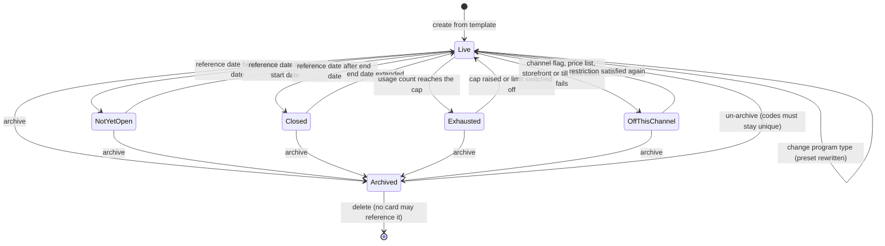
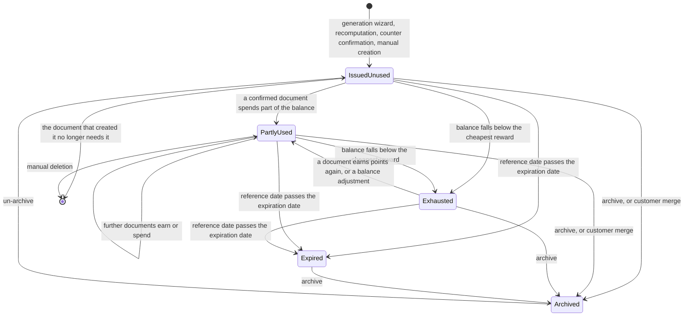
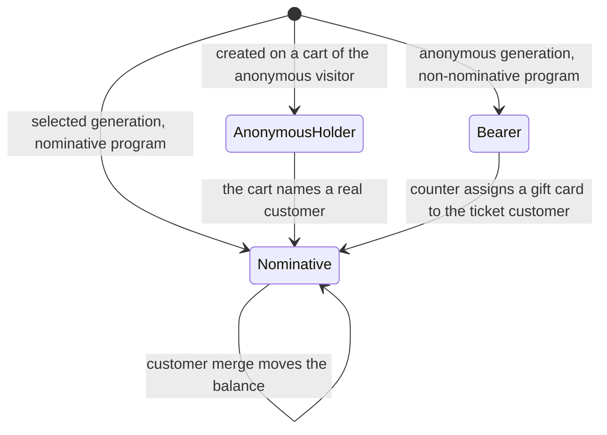
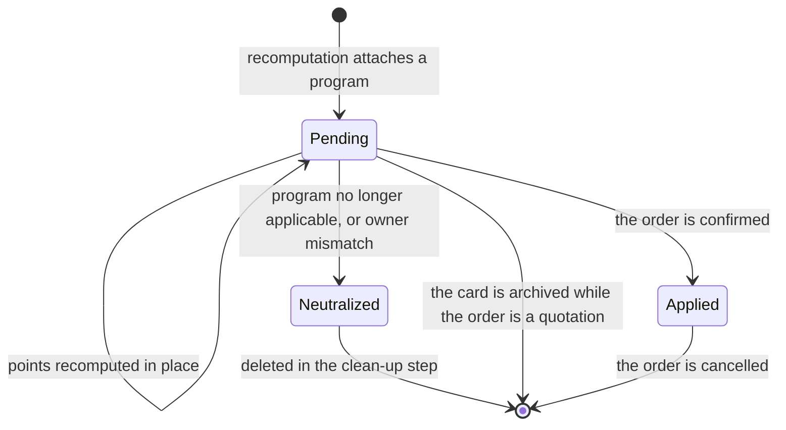
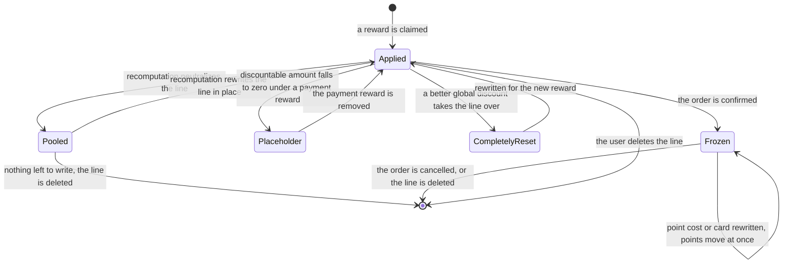
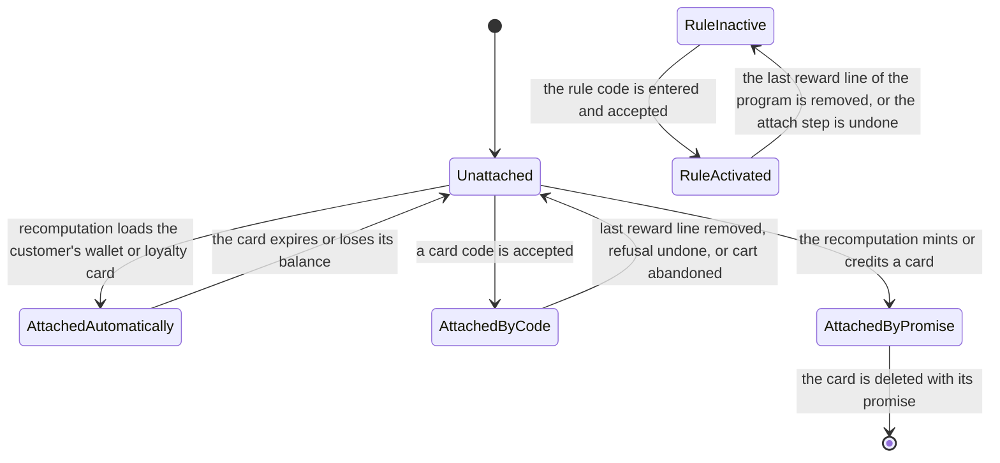
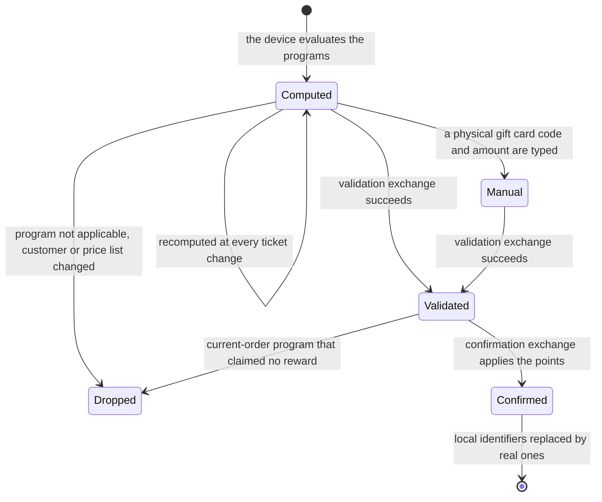

# State machines

No entity of this domain carries a status column. Its behavior is nevertheless governed by seven
state machines, each of which is derived from stored fields, from the presence of related records,
or from the status of the document that carries the value. This file lists, for each machine, every
state with the stored values that produce it, its label and its meaning; every transition with its
origin, its destination, the operation that triggers it, the guards in the order they are evaluated
with the exact refusal message, and the records created or changed; and a diagram.

The seven machines are:

1. The **availability** of a Loyalty Program (`loyalty.program`), derived from `active`, the
   validity window, the channel flags and the usage limit.
2. The **usability** of a Loyalty Card (`loyalty.card`), derived from `active`, `points`,
   `expiration_date` and the cheapest reward of its program.
3. The **ownership** of a Loyalty Card, derived from `partner_id` and the program's
   `is_nominative`.
4. The **life** of a pending point entry (`sale.order.coupon.points`), derived from its existence
   and from the status of its order.
5. The **life** of a reward line on a Sales Order (`sale.order.line` with `reward_id` set).
6. The **attachment** of a card or a code-enabled rule to a Sales Order
   (`applied_coupon_ids`, `code_enabled_rule_ids`).
7. The **life** of a point change on a counter document, which lives on the cashier's device until
   the ticket is pushed.

Throughout this file, *reference date* means the date defined in [calculations.md](calculations.md),
section 2, and *recomputation* means the five-step algorithm of [workflows.md](workflows.md),
section 3.1. Rule identifiers such as LOY-011 refer to [business-rules.md](business-rules.md).

---

## 1. Program availability

### 1.1 States

| State | Stored values that produce it | Label | Meaning |
|---|---|---|---|
| Live | `active` true; `date_from` empty or not after the reference date; `date_to` empty or not before it; the channel flag of the document's channel true; `pricelist_ids` empty or containing the document's price list; `website_id` empty or equal to the document's storefront; `pos_config_ids` empty or containing the till; `limit_usage` false or `total_order_count` below `max_usage` | Live | The program is considered by every recomputation on that channel, is offered as an automatic candidate when its `trigger` is `auto`, and accepts its code when its `trigger` is `with_code`. |
| Not yet open | `active` true and `date_from` strictly after the reference date | Not yet open | The program is excluded from the applicability filter. At a counter its code answers "This coupon is not yet valid (" + the code + ")." and a promotional code rule answers "That promo code program is not yet valid." |
| Closed | `active` true and `date_to` strictly before the reference date | Closed | The program is excluded from the applicability filter. At a counter its code answers "This coupon is expired (" + the code + ")." and a promotional code rule answers "That promo code program is expired." |
| Exhausted | `active` true, `limit_usage` true and `total_order_count` greater than or equal to `max_usage` | Usage limit reached | The program is no longer an automatic candidate. Applying its code on a sales order is refused with "This code is expired (" + the code + ")."; at a counter, with "This coupon is expired (" + the code + ")." |
| Off this channel | `active` true and the channel flag false, or the price-list, storefront or till restriction not matching | Not published here | The program is invisible on that channel only. It may be Live on another channel at the same moment. |
| Archived | `active` false | Archived | Excluded from every query. Documents that carry its reward lines lose them at their next recomputation. Its rules, rewards, communication plans and hidden discount products are archived with it. |
| Deleted | the row no longer exists | — | Rules, rewards and communication plans are removed by cascade. The hidden discount products survive as ordinary archived products. |

Live, Not yet open, Closed, Exhausted and Off this channel are all *unarchived*; they differ only in
which part of the applicability filter fails. A program can be simultaneously Live for the sales
channel and Off this channel for a counter.

### 1.2 Transitions

| From | To | Trigger | Guards, in order | Side effects |
|---|---|---|---|---|
| — | Live | Create from a template, or from the form | The preset of the type is applied; `reward_ids` must not be empty at the end of the write, otherwise "A program must have at least one reward."; `limit_usage` false or `max_usage` greater than zero, otherwise "Max usage must be strictly positive if a limit is used."; every price list of `pricelist_ids` in the program currency, otherwise "The loyalty program's currency must be the same as all it's pricelists ones."; `date_from` not after `date_to`, otherwise "The validity period's start date must be anterior or equal to its end date." | One program, its rules, its rewards, its communication plans and one hidden discount product per reward are created. |
| Live | Live (reconfigured) | Change `program_type` | None; the at-least-one-reward validation is suspended for this write | `applies_on`, `trigger`, `portal_visible`, `portal_point_name`, `rule_ids`, `reward_ids` and `communication_plan_ids` are replaced by the preset of the new type. Everything the user had edited on those collections is lost. The screen forbids the change once the program has at least one card. |
| Live | Not yet open, Closed | The reference date moves outside the window; no write occurs | None | Nothing is written. At the next recomputation of each document, the program's reward lines are deleted, its cards created by that document are deleted when the program is not nominative, and its pending point entries are set to zero and removed. |
| Live | Exhausted | A document that uses one of the program's rewards is confirmed, raising `total_order_count` to `max_usage` | None | Nothing is written on the program; the count is derived. The row is locked for update while a code is applied, so two concurrent applications cannot both consume the last use (LOY-113). |
| Live, Not yet open, Closed, Exhausted, Off this channel | Archived | Archive | None | `active` becomes false and propagates, in this order, to `rule_ids`, `reward_ids`, `communication_plan_ids` and the rewards' `discount_line_product_id`, including records already archived. Because the rewards are archived before their hidden products are written, the product archive guard does not fire (LOY-152). |
| Archived | Live | Un-archive | No other active code-mode rule carries any of the codes being reactivated, and no two programs un-archived together share a code, otherwise "The promo code must be unique."; no active card carries one of those codes, otherwise "A coupon with the same code was found." | The same four collections are reactivated. |
| Live, Not yet open, Closed, Exhausted, Off this channel | (refused) | Delete | `active` must be false, otherwise "You can not delete a program in an active state" | Nothing. |
| Archived | Deleted | Delete | No Loyalty Card references the program; the reference is restricted, so the database refuses otherwise. No sales order line and no counter line may reference one of its rewards, because those references are restricted too | The program, its rules, its rewards and its communication plans are removed. |

### 1.3 Diagram

---

## 2. Card usability

### 2.1 States

| State | Stored values that produce it | Label | Meaning |
|---|---|---|---|
| Issued, unused | `active` true, `points` equal to the granted amount, `use_count` zero, `expiration_date` empty or not before the reference date | Issued | The card may be applied by code and its rewards are claimable up to its balance. |
| Partly used | `active` true, `points` strictly positive but reduced, `use_count` greater than zero | Partly used | At least one document consumed part of the balance and at least one history movement records the use. |
| Exhausted | `active` true, `points` strictly below the smallest `required_points` among the program's rewards | Used up | No reward can be claimed. Applying the code on a sales order is refused with "This coupon has already been used."; at a counter the redemption answers "No reward can be claimed with this coupon." |
| Expired | `expiration_date` strictly before the reference date | Expired | The card is skipped by every claimable-reward computation, is removed from the document's applied cards at the next recomputation together with the lines it paid for, and its code is refused with "This coupon is expired." on a sales order and "This coupon is expired (" + the code + ")." at a counter. |
| Archived | `active` false | Archived | Invisible to every default query, to the applicability searches and to the customer portal. |
| Deleted | the row no longer exists | — | The history movements are removed by cascade. |

The card's balance is *not* a state of its own: the balance is a number, and the Exhausted state is
the comparison of that number with the cheapest reward. A card whose balance is exactly zero is
always Exhausted, because `required_points` is strictly positive by construction.

### 2.2 Transitions

| From | To | Trigger | Guards, in order | Side effects |
|---|---|---|---|---|
| — | Issued | Card Generation Wizard | A program must be set, otherwise "Can not generate coupon, no program is set."; `coupon_qty` strictly positive, otherwise "Invalid quantity." | One card per resolved customer or per unit of quantity, each with a generated unique code, `points` equal to the grant and `expiration_date` equal to the validity limit; one history movement per card with `issued` equal to the grant; the "at creation" communication runs. |
| — | Issued with balance zero | Recomputation attaches a program that applies on future documents | The program must be applicable and must grant at least one non-zero point value, or be nominative | One card per point value, with `program_id`, `points` zero, `order_id` the order, and `partner_id` the order's customer when the program is nominative or of type `next_order_coupons` and empty otherwise; one pending point entry per card. Creation runs with elevated rights, with loyalty messages suppressed and with tracking suppressed. |
| — | Issued | Counter confirmation exchange | The ticket earned points and the card is not a duplicate of an entry already recorded for that ticket | The card is created with the code taken from the payload code, then the payload barcode, then a freshly generated code; the points are applied; the "at creation" communication runs with sending enabled; a history movement is written. |
| Issued, Partly used | Issued or Partly used with a new balance | Confirmation of a sales order | No card involved in the order may have a negative available balance, otherwise the whole confirmation is refused with "One or more rewards on the sale order is invalid. Please check them." | The balance changes by the pending promise minus the point costs of the lines that use the card; one history movement per card carries both figures with the description `Order ` + the order display name; the milestone communications may run. |
| Issued, Partly used, Exhausted | the previous balance | Cancellation of a confirmed sales order | The order must have been confirmed | The history movements naming that order are deleted and the balance change is subtracted again. |
| Issued | Deleted | Cancellation of a sales order | The card was created by that order, its program is not nominative and `use_count` is zero | The card disappears. A gift card already spent elsewhere survives, because its use count is not zero. |
| Issued | Deleted | Confirmation of a sales order, or closing the Reward Selection Wizard | The program's `applies_on` is `current`, the order promises points to the card and no reward line uses it | The card and its pending point entry disappear; such a card could never be spent. |
| Issued | Deleted | Recomputation finds the program no longer applicable | The card was created by this document and the program is not nominative | The reward lines it paid for are completely reset and deleted; the card and its pending entry are deleted. |
| Issued, Partly used | Exhausted | The balance falls below the cheapest reward | None | Nothing is written beyond the balance itself. |
| Any unarchived state | Expired | The reference date passes `expiration_date` | `expiration_date` is set | Nothing is written. At the next recomputation the card leaves `applied_coupon_ids` and its lines are scheduled for deletion. |
| Any unarchived state | Archived | Archive | None | Every pending point entry linking the card to a **draft** sales order is deleted first, then `active` becomes false. |
| Any unarchived state | Archived with balance zero | Customer merge | The card is nominative and its owner is merged away, and another card of the same program survives | The surviving card takes the summed balance and the destination customer; this one is written to balance zero and archived. |
| Issued, Partly used | Issued, Partly used, with a new balance | Card Balance Wizard | `new_balance` differs from `old_balance` and is not negative, otherwise "New Balance should be positive and different then old balance." | A history movement carries the difference as `issued` or as `used`; the balance is written; the milestone communications may run. |

### 2.3 Diagram

---

## 3. Card ownership

### 3.1 States

| State | Stored values that produce it | Label | Meaning |
|---|---|---|---|
| Bearer | `partner_id` empty | Bearer card | Whoever holds the code may spend it. Coupons and gift cards are normally bearer cards. The card may be applied to any document by entering its code. |
| Held by the anonymous visitor | `partner_id` equal to the public customer | Anonymous holder | The card was created while a storefront cart belonged to the anonymous visitor. It behaves as nominative but has no real owner yet. |
| Nominative | `partner_id` set to a real customer | Owned | The card may only be used on that customer's documents. A nominative program always reaches this state, and keeps a single card per customer. |

### 3.2 Transitions

| From | To | Trigger | Guards | Side effects |
|---|---|---|---|---|
| — | Bearer | Generation in the `anonymous` mode; recomputation for a program that is neither nominative nor of type `next_order_coupons` | None | The card carries no owner. |
| — | Nominative | Generation in the `selected` mode; recomputation for a nominative program or a `next_order_coupons` program | The document must name a customer; a cart owned by the anonymous visitor refuses a nominative program with "This program is not available for public users." | `partner_id` is written from the document's customer. |
| Held by the anonymous visitor | Nominative | Recomputation of a document that now names a real customer | The card's owner is the public customer and the document's customer is not | `partner_id` is rewritten to the document's customer. This is what lets an anonymous shopper keep a next-order coupon after signing in. |
| Nominative | Nominative, for another customer | Customer merge | The card is nominative | The surviving card takes the destination customer and the summed balance; the others are emptied and archived. |
| Nominative | (pending entry removed) | Recomputation of a document whose customer differs from the owner | The card has an owner different from the document's customer | The pending point entry is set to zero points and deleted; the card itself is untouched. |
| Bearer | Nominative | Counter confirmation of a gift card that has no owner while the ticket has a customer | The card belongs to a gift card program | `partner_id` is written and a history movement `Assigning partner ` + the customer name is created with `issued` equal to the current balance. |

### 3.3 Diagram

---

## 4. Pending point entry

### 4.1 States

| State | Stored values that produce it | Label | Meaning |
|---|---|---|---|
| Pending | the row exists and its order is a quotation | Pending | The order promises `points` to the card when it is confirmed. The promise is visible to the claimable-reward computation, so the customer can spend on the same order what that order earns. |
| Applied | the row exists and its order is confirmed | Applied | The points have been added to the card's balance. The row survives as the record of what was granted, and is what cancellation reads to reverse the movement. |
| Neutralized | `points` written to zero, deletion scheduled | Neutralized | An intermediate state inside one recomputation: the promise is zeroed before it is deleted so that no later step of the same recomputation reads it. |
| Deleted | the row no longer exists | — | Nothing remains. |

### 4.2 Transitions

| From | To | Trigger | Guards | Side effects |
|---|---|---|---|---|
| — | Pending | Recomputation attaches a program | The program grants at least one non-zero point value, or the program is nominative and the value zero is used instead. At most one entry per (order, card) pair, otherwise "The coupon points entry already exists." | The entry is created together with its card when the card did not exist. |
| Pending | Pending with new points | Recomputation recomputes the points | The program is still applicable | The existing entry is rewritten in place; no row is created or deleted. |
| Pending | Neutralized, then Deleted | Recomputation finds the program no longer applicable, or finds more promises than computed values | None | `points` is set to zero first, the cards concerned leave the working set, then the rows are deleted in the clean-up step. |
| Pending | Neutralized, then Deleted | Recomputation finds the card's owner differs from the order's customer | The card has an owner | Same as above. |
| Pending | Deleted | The card is archived | The order is still a quotation | The entry is removed before the card's active flag is written. |
| Pending | Applied | Confirmation of the order | No involved card may end with a negative available balance, otherwise "One or more rewards on the sale order is invalid. Please check them." | The card's balance rises by `points`; a history movement is written for the (card, order) pair. |
| Applied | Deleted | Cancellation of the confirmed order | The order must have been confirmed | The card's balance falls by `points` again; the history movements naming the order are deleted; the entry is removed. |
| Pending or Applied | Deleted | Deletion of the order, or of the card | None | The reference cascades on both sides. |

### 4.3 Diagram

---

## 5. Reward line on a sales order

### 5.1 States

| State | How it is recognized | Label | Meaning |
|---|---|---|---|
| Applied | `reward_id` and `coupon_id` set, a non-zero unit price or quantity, the order still a quotation | Applied | The reward is materialized on the order. One line per tax combination for a split discount, one line for a payment, a free product or free shipping. |
| Pooled | `points_cost` zero, unit price zero, technical unit price zero, `reward_id` and `coupon_id` still set | Pooled | An intermediate state inside one recomputation: the line has been neutralized so that it can be rewritten in place, which preserves a description a salesperson edited. |
| Placeholder | description `TEMPORARY DISCOUNT LINE`, quantity zero, unit price zero, `points_cost` zero | Placeholder | The discountable amount fell to zero while a payment reward is applied. The line keeps the reward attached so that it comes back if the payment reward is removed. |
| Completely reset | `points_cost`, unit price and technical unit price zero **and** `reward_id` and `coupon_id` cleared | Reset | The line is about to be deleted, or to be handed to a better global discount as a reusable line. It influences nothing in the meantime. |
| Frozen | the order is confirmed | Frozen | The point cost has been moved onto the card and a history movement exists. Any further change to the line moves points immediately. |
| Deleted | the row no longer exists | — | Every line of the same claim goes with it. |

### 5.2 Transitions

| From | To | Trigger | Guards, in order | Side effects |
|---|---|---|---|---|
| — | Applied | Claim a reward | The card must not be one this order created for a program that applies on future documents, otherwise "The coupon can only be claimed on future orders."; the points available must reach `required_points`, otherwise "The coupon does not have enough points for the selected reward."; for a global discount, no better global discount may be applied, otherwise "A better global discount is already applied."; a discount must have something to discount, otherwise "There is nothing to discount"; a free product must be among the reward's claimable products, otherwise "Invalid product to claim." | One line per entry of the discountable-per-tax breakdown, or one line for a payment, a free product or free shipping; a fresh `reward_identifier_code` is generated and shared by them; the point cost is written on the first line only. |
| Applied | Pooled | Step 3 of the recomputation | None | `points_cost`, unit price and technical unit price are zeroed; the reward and card references are kept. |
| Pooled | Applied with refreshed amounts | Step 3 of the recomputation | The card is still attached, the points available still reach `required_points`, and the program still matches the applicability filter | The computed values are written over the pooled lines, extra lines are created when there are more values than lines, and the surplus lines stay in the pool. A line reused for the same product keeps its description. |
| Pooled | Deleted | End of step 3 | The entry was skipped, or values ran out | The surplus lines are deleted in the single clean-up write of step 5. |
| Applied | Placeholder | Recomputation while a payment reward is applied and the discountable amount is zero | The reward's program is not a payment program | One line named `TEMPORARY DISCOUNT LINE` with quantity zero, unit price zero and point cost zero replaces the reward's lines. |
| Applied | Completely reset, then handed over | A strictly better global discount is claimed | The candidate must win the comparison of [calculations.md](calculations.md), section 7 | The lines are reset completely and offered to the new reward as reusable lines. |
| Applied | Deleted | The user deletes one line | None | Every line sharing the (`reward_id`, `coupon_id`, `reward_identifier_code`) triple is deleted; the card may be detached from `applied_coupon_ids` or deleted; the program's rules may leave `code_enabled_rule_ids`; on a storefront cart the reward joins `disabled_auto_rewards`. |
| Applied | Frozen | Confirmation of the order | The recomputation runs one last time first | The point cost is moved onto the card and a history movement is written. |
| Frozen | Frozen with a new cost | Writing `points_cost` or `coupon_id` on the confirmed order | None | The previous card is credited back, the new card debited, and the history adjusted by the difference or by two movements. |
| Frozen | Deleted | Cancellation of the order, or deletion of the line | None | Every line of the claim is deleted, the point costs are returned to their cards, and the history movements naming the order are deleted. |

### 5.3 Diagram

---

## 6. Attachment of a card or a rule to a sales order

### 6.1 States

| State | How it is recognized | Label | Meaning |
|---|---|---|---|
| Unattached | the card is in neither `applied_coupon_ids` nor `coupon_point_ids` | Unattached | The order knows nothing of the card; its rewards are not claimable. |
| Attached by code | the card is in `applied_coupon_ids` after a code entry | Applied coupon | The rewards of the card's program are claimable. Removing the last reward line that used it detaches it. |
| Attached automatically | the card is in `applied_coupon_ids` after the automatic load | Loaded coupon | An electronic wallet or an accumulating loyalty card owned by the order's customer with a strictly positive balance, loaded at the start of every recomputation. |
| Attached by promise | the card is only in `coupon_point_ids` | Promised | The order created or credits the card; it did not come from a code. |
| Rule activated | the rule is in `code_enabled_rule_ids` | Triggered rule | The rule's condition is evaluated and its points are granted. A code-mode rule contributes nothing before this. |
| Rule inactive | the rule is not in that collection | Not triggered | The rule is skipped by the point computation. |

### 6.2 Transitions

| From | To | Trigger | Guards, in order | Side effects |
|---|---|---|---|---|
| Unattached | Attached automatically | Step 1 of the recomputation | The order allows nominative programs; the card is owned by the order's customer, has a strictly positive balance, and its program is an electronic wallet program or a loyalty program whose `applies_on` is not `current` | The card joins `applied_coupon_ids`. |
| Rule inactive | Rule activated | Code application, when a code-mode rule matches the text | The rule must match the applicability filter; the rule must not already be activated with a reward line already present, otherwise "This promo code is already applied."; the program row is locked for update without waiting; the usage cap must not be reached, otherwise "This code is expired (" + the code + ")." | The rule joins `code_enabled_rule_ids`. |
| Unattached | Attached by code | Code application, when a card code matches the text | The card must exist and its program must be active, have rewards and match the applicability filter, otherwise "This code is invalid (" + the code + ")."; the card must not be expired, otherwise "This coupon is expired."; the balance must reach the smallest `required_points` of the program, otherwise "This coupon has already been used."; the program type must not be `loyalty` or `ewallet`, otherwise "This program cannot be applied with code." | The card joins `applied_coupon_ids`. |
| Attached by code, Rule activated | Unattached, Rule inactive | The attach step refuses | The refusal is not the "already applied" refusal, and either the program is not nominative or no card was found | Both the rule activation and the card attachment are undone before the refusal is returned. |
| Attached by code | Unattached | The last reward line using the card is deleted | The card is among the applied cards | The card is removed from `applied_coupon_ids`. |
| Attached by promise | Unattached and deleted | The last reward line using the card is deleted | The card was created by this order for a program whose `applies_on` is `current`, and no surviving line uses it | The card is deleted and the program's rules leave `code_enabled_rule_ids`. |
| Attached automatically, Attached by code | Unattached | Recomputation, step 1 | The card's `expiration_date` is strictly before the reference date | The card leaves `applied_coupon_ids` and every line referencing it is scheduled for deletion. |
| Attached by code | Unattached | The scheduled clean-up of abandoned storefront carts | The cart is a draft belonging to a storefront, carries at least one applied card and has not been written to for longer than the abandonment delay | `applied_coupon_ids` is cleared and the cart is recomputed, which removes the lines those cards paid for. |
| Any | Unattached, Rule inactive | Duplication of the order | None | Neither collection is copied. |

### 6.3 Diagram

---

## 7. Point change on a counter document

A counter evaluates programs on the cashier's device. Until the ticket is pushed, the effect of
the ticket on a card lives in a device-side structure called a *point change*; cards that do not
exist on the server yet carry **negative** identifiers allocated from a counter that starts at minus
one and decreases.

### 7.1 States

| State | How it is recognized | Label | Meaning |
|---|---|---|---|
| Computed | the point change was produced by the device's point computation | Computed | It is recomputed from scratch at every change of the ticket and may be replaced or deleted. |
| Manual | the point change carries the "manual" flag | Manual | It was produced by the physical gift card dialogue, with a typed code and a typed amount. The recomputation never overwrites it; pairing stops at the first manual change. |
| Validated | the validation exchange answered success | Validated | The server has confirmed that every card still exists, that every balance is sufficient and that no new code collides. |
| Confirmed | the confirmation exchange has run | Confirmed | The cards exist on the server with real identifiers, the points have been applied, the reward lines are bound to the cards and the history has been written. |
| Dropped | the point change was removed | — | Its program is no longer loaded, its card is no longer in the local store, the ticket's customer or price list changed, or its program applies on the current document only and it claimed no reward. |

### 7.2 Transitions

| From | To | Trigger | Guards, in order | Side effects |
|---|---|---|---|---|
| — | Computed | The device recomputes the programs | The program must be applicable on the device (see [point-of-sale-application.md](point-of-sale-application.md), section 3) | One point change per computed value; a new local card with a negative identifier is created when none exists, or the customer's card is fetched for a nominative program. |
| Computed | Dropped | Recomputation finds fewer values than changes, or the program stopped being applicable | None | Every point change of that program is deleted. |
| Computed | Dropped | The customer of the ticket changes | The program is nominative | The change is deleted so that counting restarts for the new customer. |
| Computed | Dropped | The price list of the ticket changes | The program's price-list restriction no longer contains it | The change is deleted. |
| Computed | Manual | The physical gift card dialogue confirms | The typed code must not already be used on the ticket, otherwise "A coupon/loyalty card must have a unique code." | An existing non-manual change with the same amount, program and product is consumed first, so the manual card replaces the automatic one instead of doubling it. |
| Computed, Manual | Validated | The validation exchange, just before payment | Every card identifier must still exist and its program be unarchived, otherwise "Some coupons are invalid. The applied coupons have been updated. Please check the order."; every balance must cover the points to spend, otherwise "There are not enough points for the coupon: " + the code + "."; no new code may already exist, otherwise "The following codes already exist in the database, perhaps they were already sold?" | On failure the device deletes the invalid cards or rewrites its local balances; a communication failure is ignored, because the authoritative check happens at confirmation. |
| Validated | Dropped | The payload is assembled | The program's `applies_on` is `current` and the change claimed no reward | The entry is dropped, because its points would be lost anyway. |
| Validated | Confirmed | The confirmation exchange, after the ticket exists on the server | An entry whose program already has a history movement for this ticket is dropped, so a replayed confirmation never applies points twice | Nominative entries are moved onto the customer's existing card; gift card entries are applied separately; the remaining new cards are created; the points are applied; the reward lines are bound; the creation communications are sent; one history movement per card is written with the description `Onsite ` + the ticket display name. |
| Confirmed | Confirmed | The device receives the answer | None | Local cards are rewritten with the returned identifiers, ticket lines are rebound, usage counts are updated, the printable documents are rendered and the new card information is stored on the ticket for the receipt. |

### 7.3 Diagram

---

## 8. How these machines meet the sales order status

This domain does not own the status of the Sales Order; the sales domain does, and
[../sales/state-machines.md](../sales/state-machines.md) specifies it in full. The table below
states only what each transition of that machine does to the machines above.

| Sales order transition | Effect on this domain |
|---|---|
| Created as a quotation | Nothing yet. The first recomputation attaches the automatic programs and the customer's nominative cards. |
| Any change of lines, customer, price list or carrier | A full recomputation runs: promises are rewritten, reward lines are pooled and rebuilt, unusable cards and promises are deleted. |
| Prices reset to the price list | The ordinary recomputation runs first; then, for every order carrying at least one reward line, the full recomputation runs, so percentage discounts follow the new prices. |
| Quotation to Sales Order (confirmation) | Every involved card is checked for a negative available balance; the order is recomputed once more; history movements are written; cards of current-order programs that claim nothing are deleted; the point changes are applied; the "at creation" communications of the cards the order granted points to are sent immediately. |
| Confirmation returning a plain success while rewards are still claimable | An informational notification titled "Rewards Available" carrying "There are available rewards not added to this order." is returned instead. It never blocks the confirmation. |
| Sales Order to Cancelled | The history movements naming the order are deleted, the point changes are reversed on every card, the reward lines are deleted, the non-nominative unused cards the order created are deleted, and the pending point entries are deleted. |
| Cancelled back to Quotation | Nothing is restored automatically; the next recomputation re-attaches whatever still applies. |
| Duplication | The copy carries no reward line, no applied card, no code-enabled rule and no pending point entry. |
| Invoicing | Reward lines are invoiced like ordinary lines; an invoice containing only reward lines is not produced; a line from a `discount` reward is classified as a discount line. |

---

## 9. Reconciliation notes

1. **Source of this file.** One of the two merged versions had no separate state-machine document
   and carried its state tables inside its workflow document; the other announced this file and
   described the states as "derived states" without tabulating them. This file states every machine
   in full; the workflow document keeps the narrative and no longer duplicates the tables.
2. **Whether a program has a status.** Both versions agree that no status column exists. The
   availability machine of section 1 is therefore presented as derived, with the stored fields that
   produce each state named in the first column, rather than as a stored selection.
3. **Exhausted versus emptied card.** One version called the state in which a card's balance no
   longer pays for any reward "Emptied", and tied it to a balance of exactly zero. The refusal is in
   fact raised whenever the balance is strictly below the smallest `required_points` of the
   program, which may be more than zero. The wider condition is used, under the name Exhausted.
