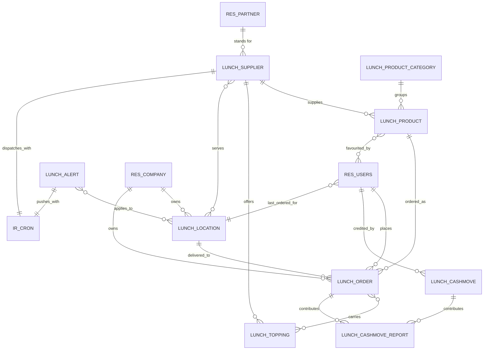

# Meal Ordering — Entities

This document specifies every entity the Meal Ordering domain owns, and the fields the domain adds
to entities owned elsewhere. For each owned entity it gives the purpose, the lifecycle, the complete
field table, the relations, the uniqueness rules, the default ordering, the display-name rule, the
archival behaviour, the company behaviour and the extension points.

Field tables use these columns:

- **Identifier** — the reproduced storage name of the field, in code font. It is contractual: an
  importer, an integration or a client keys on it character for character.
- **Full name** — the name in words, used in prose throughout this folder.
- **Type** — the value kind.
- **Target** — for a reference field, the transport name of the entity referred to.
- **Required** — whether the field must carry a value.
- **Default** — the value used when none is supplied.
- **Stored / computed** — whether the value is written to the table, derived on read, or mirrored
  from a related record, together with the rule that derives it and the fields the rule depends on.
- **Meaning** — what the value means and which rules read it.

Every entity of this domain also carries the five audit fields the platform adds to every stored
entity: the record identifier, the creation instant, the creating user, the last write instant and
the last writing user. They are specified once in
[`../../overview/entity-and-field-system.md`](../../overview/entity-and-field-system.md) and are not
repeated in the tables below.

---

## 1. Lunch Vendor (`lunch.supplier`)

**Reference page:** [`../../references/entities/lunch.supplier.md`](../../references/entities/lunch.supplier.md)

### 1.1 Purpose

A Lunch Vendor is an external party that supplies meals to the employer. It is not a separate party
record: it points at a Contact and mirrors that Contact's name, postal address, telephone number,
electronic mail address and company, so that maintaining the vendor's coordinates in either place
maintains them in both. On top of the Contact it carries everything the ordering pipeline needs: the
weekdays the vendor serves, an optional last service date, the time zone the vendor's day is
measured in, the channel by which the day's order is placed, the hour at which that happens, the
locations the vendor serves, and the configuration of up to three groups of priced extras.

### 1.2 Lifecycle

1. An administrator creates the vendor and names the Contact it stands for. Creation always creates
   one scheduled action for the vendor as well, initially inactive, and one external identifier for
   the server action behind it.
2. The vendor's availability pattern, cut-off hour and extras are configured. Every change to the
   name, the archive flag, the ordering channel, the cut-off hour, the morning or afternoon marker
   or the time zone re-synchronises the scheduled action.
3. Meals are attached to the vendor. Employees order them.
4. Archiving the vendor archives every meal of that vendor and deactivates the scheduled action.
   Unarchiving reverses both.
5. Deleting the vendor deletes its extras by cascade, then deletes its scheduled action and the
   server action behind it.

### 1.3 Field table

| Identifier | Full name | Type | Target | Required | Default | Stored / computed | Meaning |
|---|---|---|---|---|---|---|---|
| `partner_id` | Contact | many to one | `res.partner` | yes | none | stored | The Contact the vendor stands for. Every mirrored field below reads through it. |
| `name` | Name | single line text | — | no | none | mirrored from the Contact's name, writable | The vendor's trading name. Writing it writes the Contact's name. |
| `email` | Electronic mail address | single line text | — | no | none | mirrored from the Contact's electronic mail address, writable | Where the automatic order message is delivered. Required on screen when the ordering channel is electronic mail. |
| `email_formatted` | Formatted electronic mail address | single line text | — | no | none | mirrored from the Contact's formatted electronic mail address, read only | The address with the display name attached, used as the recipient of the order message. |
| `phone` | Telephone number | single line text | — | no | none | mirrored from the Contact's telephone number, writable | The number an administrator calls. Required on screen when the ordering channel is telephone. It also forms part of the display name. |
| `street` | Street | single line text | — | no | none | mirrored from the Contact's street, writable | First address line. |
| `street2` | Street line two | single line text | — | no | none | mirrored from the Contact's second street line, writable | Second address line. |
| `zip_code` | Postal code | single line text | — | no | none | mirrored from the Contact's postal code, writable | Postal code. |
| `city` | City | single line text | — | no | none | mirrored from the Contact's city, writable | City. |
| `state_id` | Country subdivision | many to one | `res.country.state` | no | none | mirrored from the Contact's country subdivision, writable | State, province or region. |
| `country_id` | Country | many to one | `res.country` | no | none | mirrored from the Contact's country, writable | Country. |
| `company_id` | Company | many to one | `res.company` | no | none | mirrored from the Contact's company, writable and stored | The company the vendor belongs to. An empty value means the vendor is visible to every company. Writing it also rewrites the company of every existing order of that vendor. |
| `responsible_id` | Responsible | many to one | `res.users` | no | the user creating the record | stored | The administrator who orders for everyone. Their formatted electronic mail address becomes the sender of the automatic order message. The selectable set is restricted to users who hold the administration privilege. |
| `send_by` | Ordering channel | selection | — | no | `phone` | stored | How the day's order reaches the vendor. Stored values are `phone` (telephone) and `mail` (electronic mail). |
| `automatic_email_time` | Cut-off hour | decimal hour | — | yes | 12.0 | stored | The hour of the vendor's day at which the order is dispatched, expressed as a decimal count of hours between 0 and 12 inclusive and combined with the morning or afternoon marker. |
| `moment` | Half-day marker | selection | — | yes | `am` | stored | Whether the cut-off hour is counted in the morning or in the afternoon. Stored values are `am` (ante meridiem, the morning half) and `pm` (post meridiem, the afternoon half). |
| `cron_id` | Scheduled action | many to one | `ir.cron` | yes | created with the vendor | stored, read only | The per-vendor scheduled action that dispatches the day's order. Deleting the scheduled action deletes the vendor by cascade. |
| `mon` | Serves on Monday | boolean | — | no | true | stored | Whether the vendor serves on Mondays. |
| `tue` | Serves on Tuesday | boolean | — | no | true | stored | Whether the vendor serves on Tuesdays. |
| `wed` | Serves on Wednesday | boolean | — | no | true | stored | Whether the vendor serves on Wednesdays. |
| `thu` | Serves on Thursday | boolean | — | no | true | stored | Whether the vendor serves on Thursdays. |
| `fri` | Serves on Friday | boolean | — | no | true | stored | Whether the vendor serves on Fridays. |
| `sat` | Serves on Saturday | boolean | — | no | false | stored | Whether the vendor serves on Saturdays. |
| `sun` | Serves on Sunday | boolean | — | no | false | stored | Whether the vendor serves on Sundays. |
| `recurrency_end_date` | Last service date | date | — | no | none | stored | The first date on which the vendor no longer serves. The vendor is unavailable on this date and on every later date. An empty value means the vendor serves indefinitely. |
| `available_location_ids` | Served locations | many to many | `lunch.location` | no | empty | stored, association table `lunch_location_lunch_supplier_rel` with columns `lunch_supplier_id` and `lunch_location_id` | The delivery locations this vendor serves. An empty set means the vendor serves every location. |
| `available_today` | Available today | boolean | — | — | — | computed, not stored, from the last service date and the seven weekday flags; searchable | True when the vendor serves on today's weekday, today's date being read in the vendor's own time zone, and the last service date is either empty or later than today. |
| `order_deadline_passed` | Cut-off passed | boolean | — | — | — | computed, not stored, from availability today, the cut-off hour and the ordering channel | For an electronic mail vendor: true when the vendor is available today and the current instant is past the cut-off instant. For a telephone vendor: true whenever the vendor is not available today. |
| `tz` | Time zone | selection | — | yes | the ordering user's time zone, otherwise `UTC` | stored | The time zone in which the vendor's day, weekday pattern and cut-off hour are measured. |
| `active` | Active | boolean | — | no | true | stored | The archive flag. Archiving cascades to the vendor's meals and deactivates the scheduled action. |
| `delivery` | Delivery indicator | selection | — | no | `no_delivery` | stored | Whether the vendor delivers. Stored values are `delivery` (delivers) and `no_delivery` (does not deliver). Informational only: no rule reads it. |
| `topping_label_1` | Extra group one label | single line text | — | yes | "Extras" | stored | The heading shown above the first group of extras on the order screen, and the placeholder substituted into the extras refusal messages. |
| `topping_label_2` | Extra group two label | single line text | — | yes | "Beverages" | stored | The heading of the second group of extras. |
| `topping_label_3` | Extra group three label | single line text | — | yes | "Extra Label 3" | stored | The heading of the third group of extras. |
| `topping_ids_1` | Extras of group one | one to many | `lunch.topping` | no | empty | stored on the extra, restricted to extras whose group number is 1 | The priced extras of the vendor's first group. |
| `topping_ids_2` | Extras of group two | one to many | `lunch.topping` | no | empty | stored on the extra, restricted to extras whose group number is 2 | The priced extras of the vendor's second group. Values written through this field have their group number forced to 2. |
| `topping_ids_3` | Extras of group three | one to many | `lunch.topping` | no | empty | stored on the extra, restricted to extras whose group number is 3 | The priced extras of the vendor's third group. Values written through this field have their group number forced to 3. |
| `topping_quantity_1` | Extra group one discipline | selection | — | yes | `0_more` | stored | How many extras of the first group an order must carry. Stored values are `0_more` (none or more), `1_more` (one or more) and `1` (exactly one). |
| `topping_quantity_2` | Extra group two discipline | selection | — | yes | `0_more` | stored | The same discipline for the second group. |
| `topping_quantity_3` | Extra group three discipline | selection | — | yes | `0_more` | stored | The same discipline for the third group. |
| `show_order_button` | Show dispatch control | boolean | — | — | — | computed, not stored, by counting today's active orders of the vendor | True when the vendor has at least one active order dated today in the ordered state. Drives the grouped dispatch control on the order list. |
| `show_confirm_button` | Show receipt control | boolean | — | — | — | computed, not stored, by counting today's active orders of the vendor | True when the vendor has at least one active order dated today in the sent state. Drives the grouped receipt control on the order list. |

### 1.4 Relations

| Relation | Cardinality | Target | Deletion behaviour |
|---|---|---|---|
| Contact | many vendors to one Contact | `res.partner` | Restricted by the platform default: the Contact cannot be deleted while a vendor points at it. |
| Responsible | many vendors to one User | `res.users` | Platform default. |
| Scheduled action | one vendor to one scheduled action | `ir.cron` | Cascade: deleting the scheduled action deletes the vendor. |
| Served locations | many vendors to many locations | `lunch.location` | The association row disappears with either side. |
| Extras | one vendor to many extras | `lunch.topping` | Cascade: deleting the vendor deletes its extras. |
| Meals | one vendor to many meals | `lunch.product` | Restricted: the meal requires a vendor, so a vendor cannot be deleted while meals point at it. |
| Orders | one vendor to many orders | `lunch.order` | The order's vendor is a stored mirror of the meal's vendor; it follows the meal. |
| Message thread and activities | one vendor to many messages and activities | messaging entities | Deleting the vendor deletes its thread. |

### 1.5 Uniqueness, ordering, display name

- **Uniqueness.** None is declared. Two vendors may point at the same Contact, and two vendors may
  carry the same name. **Industry-standard default**: a rebuild that wants one vendor per Contact
  should add a uniqueness rule on the Contact reference; the specified behaviour here permits
  duplicates because the system permits them.
- **Ordering.** No ordering is declared, so records come back in ascending record-identifier order.
- **Display name.** When the telephone number is filled, the display name is the name, a single
  space and the telephone number. When it is empty, the display name is the name alone. The rule
  depends on the telephone number, so changing the Contact's telephone number changes every vendor
  label.

### 1.6 Archival and company behaviour

- Archiving is by the `active` flag. Archiving a vendor writes the archive flag onto every meal of
  that vendor, and unarchiving writes it back. This synchronisation reads meals with archived
  records included, so archived meals of a re-activated vendor are re-activated too.
- **Compatibility finding.** Re-activating a vendor re-activates all of its meals unconditionally,
  including meals whose category is still archived. The meal's own constraint then refuses the write
  with the archived-category message, so re-activating a vendor whose meals sit in an archived
  category fails as a whole. A corrected behaviour would re-activate only those meals whose category
  is active, exactly as the meal's own re-synchronisation rule does.
- The company is mirrored from the Contact and stored. Writing the company on a vendor rewrites the
  company of every order of that vendor, so that the order and the vendor never disagree.
- A vendor with an empty company is visible to every company. The record rule is stated in
  [`configuration.md`](configuration.md#6-record-rules).

### 1.7 Extension points

No other package in scope extends the Lunch Vendor. The entity itself takes the message thread and
the activity mixin from the messaging domain, which contributes the message list, the follower list,
the activity list and the tracking machinery described in
[`../messaging-and-activities/entities.md`](../messaging-and-activities/entities.md).

---

## 2. Lunch Product (`lunch.product`)

**Reference page:** [`../../references/entities/lunch.product.md`](../../references/entities/lunch.product.md)

### 2.1 Purpose

A Lunch Product is one orderable meal: a name, a category, a description, a picture, a price and
exactly one vendor. It is the record an employee clicks in the catalogue. It carries no stock, no
unit of measure and no tax; the price is a plain amount in the company currency of the vendor.

### 2.2 Lifecycle

1. An administrator creates the meal under a category and a vendor. The company is inherited from
   the vendor and stored.
2. An optional novelty date makes the meal show a "New" ribbon until that date passes.
3. Employees mark meals as favourites; the favourite is stored on the association between the meal
   and the User.
4. Archiving the meal removes it from the catalogue. Archiving its category or its vendor archives
   it too.
5. Deleting a meal is possible only while no order points at it, because the order requires a meal.

### 2.3 Field table

| Identifier | Full name | Type | Target | Required | Default | Stored / computed | Meaning |
|---|---|---|---|---|---|---|---|
| `name` | Meal name | single line text | — | yes | none | stored, translatable | The name shown in the catalogue and on the order line. |
| `category_id` | Category | many to one | `lunch.product.category` | yes | none | stored, company-checked | The grouping the meal belongs to. Its company must be compatible with the meal's company. |
| `description` | Description | rich text | — | no | none | stored, translatable | The ingredient list or description shown on the card and on the order form. |
| `price` | Price | decimal | — | yes | none | stored, with the accounting decimal precision | The unit price of the meal, in the currency of the meal's company. Extras are added on top of it. |
| `supplier_id` | Vendor | many to one | `lunch.supplier` | yes | none | stored, company-checked | The vendor that supplies the meal. It determines the availability, the cut-off, the extras and the company. |
| `active` | Active | boolean | — | no | true | stored | The archive flag. |
| `company_id` | Company | many to one | `res.company` | no | none | mirrored from the vendor's company, writable and stored | The company the meal belongs to. An empty value means visible to every company. |
| `currency_id` | Currency | many to one | `res.currency` | no | none | mirrored from the company's currency, not stored | The currency the price is expressed in. |
| `new_until` | New until | date | — | no | none | stored | The last date on which the meal is presented as new. |
| `is_new` | Is new | boolean | — | — | — | computed, not stored, from the novelty date | True when a novelty date is set and today is on or before it; false when no novelty date is set. |
| `favorite_user_ids` | Favourited by | many to many | `res.users` | no | empty | stored, association table `lunch_product_favorite_user_rel` with columns `product_id` and `user_id`, company-checked | The users who marked the meal as a favourite. |
| `is_favorite` | Is favourite | boolean | — | — | — | computed per reading user, not stored, from the favourite list; writable through an inverse | True when the reading user is in the favourite list. Writing it adds or removes the reading user from their own favourite meal list rather than writing on the meal. |
| `last_order_date` | Last ordered on | date | — | — | — | computed per reading user, not stored | The most recent order date of this meal by the reading user, empty when the reading user never ordered it. |
| `product_image` | Card picture | image | — | — | — | computed, not stored, from the meal's small picture and the category's small picture | The meal's own small picture when it has one, otherwise the category's small picture. |
| `is_available_at` | Available at location | many to one | `lunch.location` | — | — | computed to empty, not stored; exists only to be searched | Reading it always yields an empty value. Searching it yields the meals whose vendor either serves the requested location or serves no declared location at all. |
| `image_1920` | Picture | image | — | no | none | stored, contributed by the picture mixin | The full-size picture, at most 1920 by 1920. |
| `image_1024` | Picture, large | image | — | — | — | mirrored from the picture, stored, at most 1024 by 1024 | A resized copy kept for performance. |
| `image_512` | Picture, medium | image | — | — | — | mirrored from the picture, stored, at most 512 by 512 | A resized copy kept for performance. |
| `image_256` | Picture, small | image | — | — | — | mirrored from the picture, stored, at most 256 by 256 | A resized copy kept for performance. |
| `image_128` | Picture, thumbnail | image | — | — | — | mirrored from the picture, stored, at most 128 by 128 | The copy shown on the catalogue card and on the order form. |

### 2.4 Relations

| Relation | Cardinality | Target | Deletion behaviour |
|---|---|---|---|
| Category | many meals to one category | `lunch.product.category` | Restricted: required. |
| Vendor | many meals to one vendor | `lunch.supplier` | Restricted: required. |
| Favourites | many meals to many users | `res.users` | The association row disappears with either side. |
| Orders | one meal to many orders | `lunch.order` | Restricted: required on the order. |

### 2.5 Uniqueness, ordering, display name

- **Uniqueness.** None. Two meals may share a name, even within one vendor and one category.
- **Ordering.** By meal name, ascending.
- **Display name.** The meal name.

### 2.6 Archival and company behaviour

- Two constraints keep the archive flags coherent, both raising on write and both listed in
  [`business-rules.md`](business-rules.md): an active meal may not sit in an archived category, and
  an active meal may not belong to an archived vendor.
- A re-synchronisation rule, invoked when a category is archived or unarchived, archives every meal
  whose category or vendor is archived and unarchives every meal both of whose parents are active.
- The company is mirrored from the vendor and stored, and the automatic company check refuses a
  category or a favourite user that belongs to a different company.

### 2.7 Extension points

The picture mixin contributes the five picture fields. No other package in scope extends the meal.

---

## 3. Lunch Product Category (`lunch.product.category`)

**Reference page:** [`../../references/entities/lunch.product.category.md`](../../references/entities/lunch.product.category.md)

### 3.1 Purpose

A grouping of meals — sandwich, pizza, burger, drinks and any other the employer defines. The
category carries a picture that stands in for meals that have none, and it drives the category
filter panel of the catalogue.

### 3.2 Lifecycle

Created by an administrator, optionally given a picture, filled with meals, archived when it is no
longer offered. Archiving and unarchiving a category re-synchronise the archive flag of every meal
in it.

### 3.3 Field table

| Identifier | Full name | Type | Target | Required | Default | Stored / computed | Meaning |
|---|---|---|---|---|---|---|---|
| `name` | Category name | single line text | — | yes | none | stored, translatable | The name of the grouping. |
| `company_id` | Company | many to one | `res.company` | no | none | stored | The company the category belongs to. An empty value means visible to every company. Unlike the meal and the extra, the category has **no** company default, so a category created without an explicit company is shared by every company. |
| `currency_id` | Currency | many to one | `res.currency` | no | none | mirrored from the company's currency, not stored | Used only to format amounts on the category screens. |
| `product_count` | Meal count | whole number | — | — | — | computed, not stored, by grouping meals on their category | How many meals point at this category. Drives the counter control on the category form and card. |
| `active` | Active | boolean | — | no | true | stored | The archive flag. |
| `image_1920` | Picture | image | — | no | the packaged default meal picture | stored, contributed by the picture mixin and re-declared to carry the default | The category picture, used as the fallback picture of every meal in the category. |
| `image_1024` | Picture, large | image | — | — | — | mirrored from the picture, stored | A resized copy kept for performance. |
| `image_512` | Picture, medium | image | — | — | — | mirrored from the picture, stored | A resized copy kept for performance. |
| `image_256` | Picture, small | image | — | — | — | mirrored from the picture, stored | A resized copy kept for performance. |
| `image_128` | Picture, thumbnail | image | — | — | — | mirrored from the picture, stored | The copy used on cards and as the meal fallback. |

### 3.4 Relations

| Relation | Cardinality | Target | Deletion behaviour |
|---|---|---|---|
| Meals | one category to many meals | `lunch.product` | Restricted: required on the meal. |

### 3.5 Uniqueness, ordering, display name

- **Uniqueness.** None.
- **Ordering.** No ordering is declared, so records come back in ascending record-identifier order.
- **Display name.** The category name.

### 3.6 Archival and company behaviour

Archiving the category runs the meal re-synchronisation, which archives every meal of the category.
Unarchiving runs it again, which unarchives every meal whose vendor is also active. Meals whose
vendor is still archived stay archived. The company is a plain stored reference with no default.

### 3.7 Extension points

The picture mixin contributes the five picture fields, with the full-size picture re-declared so
that a new category starts with the packaged default meal picture rather than with no picture.

---

## 4. Lunch Topping (`lunch.topping`)

**Reference page:** [`../../references/entities/lunch.topping.md`](../../references/entities/lunch.topping.md)

### 4.1 Purpose

A priced extra that an employee may add to a meal: a sauce, a side, a drink. Every extra belongs to
exactly one vendor and to exactly one of that vendor's three extra groups. The group number decides
which heading the extra appears under and which quantity discipline applies to it.

### 4.2 Lifecycle

Created inside the vendor form, in the list of the group it belongs to. Edited there. Deleted there,
or deleted by cascade with the vendor. There is no archive flag: an extra that is no longer offered
is deleted.

### 4.3 Field table

| Identifier | Full name | Type | Target | Required | Default | Stored / computed | Meaning |
|---|---|---|---|---|---|---|---|
| `name` | Extra name | single line text | — | yes | none | stored | The name of the extra. |
| `company_id` | Company | many to one | `res.company` | no | the ordering user's current company | stored | The company the extra belongs to. |
| `currency_id` | Currency | many to one | `res.currency` | no | none | mirrored from the company's currency, not stored | The currency the price is expressed in. |
| `price` | Price | monetary | — | yes | none | stored, rounded to the currency's precision | The amount added to the meal price for one unit of the meal, once for each unit ordered. |
| `supplier_id` | Vendor | many to one | `lunch.supplier` | no | none | stored, indexed when not empty | The vendor that offers the extra. Deleting the vendor deletes the extra. |
| `topping_category` | Group number | whole number | — | yes | 1 | stored | Which of the vendor's three extra groups the extra belongs to. The only values the screens produce are 1, 2 and 3. |

### 4.4 Relations

| Relation | Cardinality | Target | Deletion behaviour |
|---|---|---|---|
| Vendor | many extras to one vendor | `lunch.supplier` | Cascade: deleting the vendor deletes the extra. |
| Orders | many extras to many orders | `lunch.order` | Through the association table `lunch_order_topping` with columns `order_id` and `topping_id`, shared by all three extra fields of the order. The association row disappears with either side. |

### 4.5 Uniqueness, ordering, display name

- **Uniqueness.** None. Two extras of the same vendor and group may share a name.
- **Ordering.** No ordering is declared, so extras come back in ascending record-identifier order.
  Within a vendor this is creation order, which is the order the three extra lists show.
- **Display name.** The extra name, a single space, and the price formatted in the current company's
  currency, using that currency's symbol, position and decimal precision. The rule depends on the
  price and on the current company, so the same extra shows a different label to users of companies
  with different currencies.

### 4.6 Archival and company behaviour

No archive flag exists. The company defaults to the current company of the user creating the extra,
which is normally the same as the vendor's company because extras are created inside the vendor
form. No record rule restricts extras by company; the vendor's own record rule keeps them out of
sight in practice.

### 4.7 Extension points

None.

---

## 5. Lunch Location (`lunch.location`)

**Reference page:** [`../../references/entities/lunch.location.md`](../../references/entities/lunch.location.md)

### 5.1 Purpose

A place where meals are delivered or collected: a building, a floor, a site. Employees select the
location they are ordering for; vendors declare the locations they serve; notices may be limited to
a set of locations; the vendor order message groups the day's lines by location and prints each
location's address.

### 5.2 Lifecycle

Created and edited by an administrator. Holders of the ordering privilege may read and update
locations but may not create or delete them. There is no archive flag and no state.

### 5.3 Field table

| Identifier | Full name | Type | Target | Required | Default | Stored / computed | Meaning |
|---|---|---|---|---|---|---|---|
| `name` | Location name | single line text | — | yes | none | stored | The name shown in the location selector and in the vendor order message. |
| `address` | Address | multi line text | — | no | none | stored | The free-form delivery address printed in the vendor order message. |
| `company_id` | Company | many to one | `res.company` | no | the ordering user's current company | stored | The company the location belongs to. An empty value means visible to every company. |

### 5.4 Relations

| Relation | Cardinality | Target | Deletion behaviour |
|---|---|---|---|
| Vendors served | many locations to many vendors | `lunch.supplier` | The association row disappears with either side. |
| Orders | one location to many orders | `lunch.order` | Platform default; the order's location is optional. |
| Notices | many locations to many notices | `lunch.alert` | The association row disappears with either side. |
| Users | one location to many users | `res.users` | The user's last ordering location. |

### 5.5 Uniqueness, ordering, display name

- **Uniqueness.** None.
- **Ordering.** No ordering is declared, so records come back in ascending record-identifier order.
  The service endpoint that picks a default location for a user takes the first record of this
  order, that is the oldest visible location.
- **Display name.** The location name.

### 5.6 Archival and company behaviour

No archive flag. The company defaults to the current company; an empty company makes the location
visible everywhere. The record rule limits visibility to the active companies plus the empty
company.

### 5.7 Extension points

None.

---

## 6. Lunch Order (`lunch.order`)

**Reference page:** [`../../references/entities/lunch.order.md`](../../references/entities/lunch.order.md)

### 6.1 Purpose

One order line: one employee wants one meal, in a given quantity, with a given set of extras, an
optional note, on a given date, delivered to a given location. There is no order header. The cart an
employee sees is simply the set of their own order lines dated today or later that are not
cancelled. The line carries the state that drives the whole pipeline, and its price is what is
charged to the employee's internal account.

### 6.2 Lifecycle

1. Created in the to-order state, either from the ordering screen or by an administrator on behalf
   of an employee. Creation merges the new line into an existing identical to-order line when one
   exists, incrementing that line's quantity by one instead of creating a second record.
2. Confirmed as part of the cart, which moves it to the ordered state and charges it.
3. Dispatched with the rest of the vendor's day, which moves it to the sent state.
4. Marked received when the delivery arrives, which moves it to the received state.
5. Optionally notified, which pushes the company's delivery message to the employee once.
6. Cancellable at any point before receipt; a cancelled line can be reset to the ordered state.
7. Archived rather than deleted when a merge absorbs it or when its quantity is decremented to
   nothing.

The full pipeline is specified in [`state-machines.md`](state-machines.md).

### 6.3 Field table

| Identifier | Full name | Type | Target | Required | Default | Stored / computed | Meaning |
|---|---|---|---|---|---|---|---|
| `product_id` | Meal | many to one | `lunch.product` | yes | none | stored | The meal ordered. It determines the price, the vendor, the category, the description and the pictures. |
| `name` | Meal name | single line text | — | no | none | mirrored from the meal's name, read only, not stored | The meal's name, used for searching and as the trigger of the add-control computation. |
| `category_id` | Category | many to one | `lunch.product.category` | no | none | mirrored from the meal's category, stored | The category of the meal, stored so that it can be grouped and filtered on. |
| `supplier_id` | Vendor | many to one | `lunch.supplier` | no | none | mirrored from the meal's vendor, stored, indexed | The vendor of the meal, stored so that the day's orders can be grouped by vendor. |
| `date` | Order date | date | — | yes | today in the ordering user's time zone | stored, writable | The date the meal is wanted for. It is writable only while the line is in the to-order state. |
| `quantity` | Quantity | decimal | — | yes | 1 | stored | How many units of the meal are ordered on this line. Merging raises it; the decrement control lowers it. |
| `topping_ids_1` | Extras of group one | many to many | `lunch.topping` | no | empty | stored in the association table `lunch_order_topping` with columns `order_id` and `topping_id`, restricted to extras whose group number is 1 | The extras chosen from the vendor's first group. |
| `topping_ids_2` | Extras of group two | many to many | `lunch.topping` | no | empty | stored in the same association table, restricted to extras whose group number is 2 | The extras chosen from the vendor's second group. |
| `topping_ids_3` | Extras of group three | many to many | `lunch.topping` | no | empty | stored in the same association table, restricted to extras whose group number is 3 | The extras chosen from the vendor's third group. |
| `display_toppings` | Extras summary | multi line text | — | — | — | computed and stored, from the three extra fields | The names of all chosen extras joined by the three-character separator space, plus sign, space. Printed on the order list, in the vendor message and in the account statement description. |
| `note` | Notes | multi line text | — | no | none | stored | Free text for the vendor: allergens, preparation requests. It takes part in the merge identity, so two lines with different notes never merge. |
| `user_id` | Employee | many to one | `res.users` | no | the ordering user | stored | The employee the meal is for and whose internal account is charged. |
| `lunch_location_id` | Location | many to one | `lunch.location` | no | the employee's last ordering location | stored | Where the meal is delivered. It takes part in the merge identity. |
| `price` | Total price | monetary | — | — | — | computed and stored, read only, from the extras, the meal and the quantity | The full charge of the line: quantity times the sum of the meal price and all chosen extra prices. |
| `currency_id` | Currency | many to one | `res.currency` | no | none | mirrored from the company's currency, stored | The currency the total price is expressed in. |
| `company_id` | Company | many to one | `res.company` | no | the ordering user's current company | stored | The company the order belongs to. Rewritten in bulk when the vendor's company changes. |
| `state` | State | selection | — | no | `new` | stored, read only, indexed | The position in the pipeline. Stored values are `new`, `ordered`, `sent`, `confirmed` and `cancelled`. |
| `active` | Active | boolean | — | no | true | stored | The archive flag. Set to false when a merge absorbs the line and when a decrement takes the quantity to nothing. |
| `notified` | Delivery notice sent | boolean | — | no | false | stored | Whether the delivery notice has already been pushed for this line. It blocks a second push. |
| `available_today` | Vendor available today | boolean | — | — | — | mirrored from the vendor's availability today, not stored | Whether the vendor serves on today's weekday. |
| `available_on_date` | Vendor available on the order date | boolean | — | — | — | computed, not stored, from the order date and the vendor | Whether the vendor serves on the order date. Guards the confirmation operation. |
| `order_deadline_passed` | Cut-off passed | boolean | — | — | — | computed, not stored, from the order date and the vendor | True when the order date is before today; equal to the vendor's cut-off flag when the order date is today; false when the order date is in the future. |
| `product_description` | Description | rich text | — | — | — | mirrored from the meal's description, not stored | The meal description shown on the order form. |
| `topping_label_1` | Extra group one label | single line text | — | — | — | mirrored from the vendor's first extra label, not stored | The heading of the first extras block on the order form and the placeholder in its refusal message. |
| `topping_label_2` | Extra group two label | single line text | — | — | — | mirrored from the vendor's second extra label, not stored | The heading of the second extras block. |
| `topping_label_3` | Extra group three label | single line text | — | — | — | mirrored from the vendor's third extra label, not stored | The heading of the third extras block. |
| `topping_quantity_1` | Extra group one discipline | selection | — | — | — | mirrored from the vendor's first discipline, not stored | Which extras rule the first block must satisfy. |
| `topping_quantity_2` | Extra group two discipline | selection | — | — | — | mirrored from the vendor's second discipline, not stored | Which extras rule the second block must satisfy. |
| `topping_quantity_3` | Extra group three discipline | selection | — | — | — | mirrored from the vendor's third discipline, not stored | Which extras rule the third block must satisfy. |
| `available_toppings_1` | First extras block offered | boolean | — | — | — | computed, not stored, by counting the vendor's group-one extras | True when the vendor has at least one extra in group one. Hides the block and suspends the group-one discipline when false. |
| `available_toppings_2` | Second extras block offered | boolean | — | — | — | computed, not stored, by counting the vendor's group-two extras | True when the vendor has at least one extra in group two. |
| `available_toppings_3` | Third extras block offered | boolean | — | — | — | computed, not stored, by counting the vendor's group-three extras | True when the vendor has at least one extra in group three. |
| `image_1920` | Picture | image | — | — | — | computed, not stored, from the meal and the category | The meal's full-size picture, or the category's when the meal has none. |
| `image_128` | Picture, thumbnail | image | — | — | — | computed, not stored, from the meal and the category | The meal's thumbnail, or the category's when the meal has none. |
| `display_reorder_button` | Show repeat control | boolean | — | — | — | computed, not stored, from the state and a screen flag | True when the screen asked for repeat controls, the line is received and the vendor is available today. |
| `display_add_button` | Balance allows one more | boolean | — | — | — | computed, not stored, from the employee's balance and the employee's uncommitted lines of the same date | True when the balance left after the employee's other to-order lines of the same date still covers this line's price. Hides the add-to-cart control and the repeat control when false. |

### 6.4 Relations

| Relation | Cardinality | Target | Deletion behaviour |
|---|---|---|---|
| Meal | many orders to one meal | `lunch.product` | Restricted: required. |
| Employee | many orders to one User | `res.users` | Platform default. |
| Location | many orders to one location | `lunch.location` | Platform default. |
| Extras | many orders to many extras | `lunch.topping` | Through `lunch_order_topping`; the association row disappears with either side. |
| Category, vendor, currency | mirrored references | — | Follow the meal and the company. |

### 6.5 Uniqueness, ordering, indexes, display name

- **Uniqueness.** None is declared. Duplicate lines are prevented by the merge rule rather than by a
  uniqueness constraint, and the merge rule looks only at to-order lines, so a to-order line and an
  ordered line with identical content coexist by design.
- **Ordering.** By record identifier, descending: the newest line first.
- **Indexes.** The state and the vendor are each indexed. A composite index named
  `_user_product_date` covers the employee, the meal and the date together, because the merge search
  filters on exactly those three fields.
- **Display name.** The display name of the meal.

### 6.6 Archival and company behaviour

- Archiving is by the `active` flag and is always automatic. Two operations set it: absorbing a line
  into an identical one during a write, and decrementing a quantity that is already at or below the
  decrement size.
- The account statement counts only active lines, so archiving a line removes its charge from the
  employee's balance.
- The company defaults to the current company and is rewritten in bulk when the vendor's company
  changes. The record rule limits visibility to the active companies plus the empty company.

### 6.7 Extension points

None in scope. The three server actions bound to the order list and card screens are configuration
records rather than field extensions and are listed in
[`configuration.md`](configuration.md#8-server-actions).

---

## 7. Lunch Cash Move (`lunch.cashmove`)

**Reference page:** [`../../references/entities/lunch.cashmove.md`](../../references/entities/lunch.cashmove.md)

### 7.1 Purpose

One manually recorded movement on an employee's internal account. In practice it is a credit: the
employee hands money to the administrator, the administrator records the amount and it becomes
spendable. A negative amount is accepted and behaves as a manual charge, which is how a correction
is entered.

### 7.2 Lifecycle

Created, edited and deleted by an administrator. Holders of the ordering privilege may read their
own movements and nothing else. There is no state and no archive flag.

### 7.3 Field table

| Identifier | Full name | Type | Target | Required | Default | Stored / computed | Meaning |
|---|---|---|---|---|---|---|---|
| `user_id` | Employee | many to one | `res.users` | no | the recording user | stored | Whose account the movement belongs to. |
| `date` | Date | date | — | yes | today in the recording user's time zone | stored | The date of the movement, used for ordering and for the statement. |
| `amount` | Amount | decimal | — | yes | none | stored | The signed amount. Positive credits the account, negative charges it. |
| `currency_id` | Currency | many to one | `res.currency` | yes | the recording user's current company currency | stored | The currency of the amount. |
| `description` | Description | multi line text | — | no | none | stored | Free text explaining the movement. |

### 7.4 Relations

| Relation | Cardinality | Target | Deletion behaviour |
|---|---|---|---|
| Employee | many movements to one User | `res.users` | Platform default. |
| Currency | many movements to one currency | `res.currency` | Platform default. |

### 7.5 Uniqueness, ordering, display name

- **Uniqueness.** None.
- **Ordering.** By date, descending.
- **Display name.** The two-part label "Lunch Cashmove" followed by a space, a number sign and the
  record identifier; for a record that has not been stored yet the identifier is replaced by an
  underscore. The label text is reproduced because clients display it and support procedures quote
  it.

### 7.6 Archival and company behaviour

No archive flag and no company field. Visibility is controlled entirely by the two record rules on
the entity: holders of the ordering privilege see only their own movements, holders of the
administration privilege see all of them.

### 7.7 Extension points

None.

---

## 8. Lunch Cash Move Report (`lunch.cashmove.report`)

**Reference page:** [`../../references/entities/lunch.cashmove.report.md`](../../references/entities/lunch.cashmove.report.md)

### 8.1 Purpose

A read-only analysis entity that merges the two things that move an internal account into one
statement: the manually recorded movements, and the charges implied by orders that have been
committed. It is the single source of the balance figure shown on the ordering screen and enforced
by the spending control.

### 8.2 Nature and composition

The entity has no table of its own. It is a database view whose rows are the union of two row sets,
rebuilt whenever the package is installed or updated:

| Row set | Source records | Record identifier | Amount | Date | Currency | Employee | Description |
|---|---|---|---|---|---|---|---|
| Manual movements | every Lunch Cash Move | the movement's own identifier, positive | the movement's amount, unchanged in sign | the movement's date | the movement's currency | the movement's employee | the movement's description |
| Order charges | every Lunch Order whose state is `ordered` or `confirmed` and whose archive flag is true | the order's identifier, negated | the order's total price, negated | the order's date | the order's currency | the order's employee | the three-part text "Order: " then the quantity, then " x ", then the meal name in the base language, then a space, then the extras summary |

Because order identifiers are negated, the two row sets can never collide on the record identifier.

**Compatibility finding.** Orders in the `sent` state are absent from both row sets. Between the
moment the administrator dispatches the day's orders and the moment the delivery is marked received,
every dispatched charge disappears from the statement and the employee's balance rises back by the
dispatched amount. The employee can then order again on the strength of money already committed.
A corrected behaviour would include the `sent` state alongside `ordered` and `confirmed`, so that a
charge leaves the balance only when the line is cancelled or archived.

**Compatibility finding.** The description of an order charge takes the meal name in the base
language of the installation rather than in the reading employee's language, so a statement read in
another language shows translated column headings and untranslated meal names. A corrected behaviour
would resolve the meal name in the reading user's language.

### 8.3 Field table

| Identifier | Full name | Type | Target | Required | Default | Stored / computed | Meaning |
|---|---|---|---|---|---|---|---|
| `id` | Record identifier | identifier | — | — | — | supplied by the view | Positive for a manual movement, negative for an order charge. |
| `amount` | Amount | decimal | — | — | — | supplied by the view | Positive for a credit, negative for a charge. |
| `date` | Date | date | — | — | — | supplied by the view | The movement date or the order date. |
| `currency_id` | Currency | many to one | `res.currency` | — | — | supplied by the view | The currency of the row. |
| `user_id` | Employee | many to one | `res.users` | — | — | supplied by the view | Whose account the row belongs to. |
| `description` | Description | multi line text | — | — | — | supplied by the view | The movement description or the composed order description. |

### 8.4 Relations, ordering, display name

- **Relations.** Two reference fields, to the currency and to the User. No reverse relation points
  at the report.
- **Ordering.** By date, descending.
- **Display name.** The two-part label "Lunch Cashmove" followed by a space, a number sign and the
  row identifier. For an order charge that identifier is negative, so the label reads with a minus
  sign. The label text is reproduced.
- **Writability.** The entity is read only. No creation, update or deletion is possible; the access
  matrix grants read alone, and to every internal user rather than only to holders of a meal
  ordering privilege.

### 8.5 Company behaviour

No company field and no record rule. Every internal user may read every row of the view; the
personal statement screen restricts the rows by adding a filter on the reading user, and the
administrator's control screen shows all of them. **Compatibility finding.** Because the restriction
is a screen filter rather than a record rule, a user who queries the entity directly can read
another employee's statement even without the administration privilege, while the underlying manual
movements are properly protected by their own record rule. A corrected behaviour would carry the
same pair of record rules onto the report entity.

---

## 9. Lunch Alert (`lunch.alert`)

**Reference page:** [`../../references/entities/lunch.alert.md`](../../references/entities/lunch.alert.md)

### 9.1 Purpose

A notice to employees about meal ordering: a cut-off reminder, a vendor closure, a menu change. A
notice works in one of two ways. As a banner it is displayed at the top of the ordering screen for
employees whose current location is among the notice's locations. As a pushed message it is sent as
a conversation notification at a chosen hour on chosen weekdays to a chosen audience.

### 9.2 Lifecycle

1. An administrator creates the notice. Creation always creates one scheduled action for it as well,
   initially inactive, and one external identifier for the server action behind it.
2. Every change to the name, the archive flag, the display mode, the show-until date, the
   notification hour, the half-day marker or the time zone re-synchronises the scheduled action.
   The action is active only while the notice is active, its mode is the pushed mode, and its
   show-until date is either empty or not yet passed.
3. On each run the action pushes the message, unless the notice is not displayable today.
4. Once the show-until date is strictly in the past, the next run deletes the scheduled action and
   clears the reference.
5. Deleting the notice deletes its scheduled action and the server action behind it.

### 9.3 Field table

| Identifier | Full name | Type | Target | Required | Default | Stored / computed | Meaning |
|---|---|---|---|---|---|---|---|
| `name` | Notice name | single line text | — | yes | none | stored, translatable | The internal name of the notice; it also appears in the scheduled action's name. |
| `message` | Message | rich text | — | yes | none | stored, translatable | The body shown in the banner or pushed as the conversation message. |
| `mode` | Display mode | selection | — | no | `alert` | stored | How the notice reaches employees. Stored values are `alert` (a banner on the ordering screen) and `chat` (a pushed conversation message). |
| `recipients` | Audience | selection | — | no | `everyone` | stored | Who receives a pushed notice. Stored values are `everyone`, `last_week`, `last_month` and `last_year`. Ignored when the mode is the banner mode. |
| `notification_time` | Notification hour | decimal hour | — | no | 10.0 | stored | The hour of the day at which the pushed message is sent, as a decimal count of hours between 0 and 12 inclusive, combined with the half-day marker. |
| `notification_moment` | Half-day marker | selection | — | yes | `am` | stored | Whether the notification hour is counted in the morning or the afternoon. Stored values are `am` and `pm`. |
| `tz` | Time zone | selection | — | yes | the creating user's time zone, otherwise `UTC` | stored | The time zone the notification hour is measured in. |
| `cron_id` | Scheduled action | many to one | `ir.cron` | yes | created with the notice | stored, read only | The per-notice scheduled action. Deleting it deletes the notice by cascade. |
| `until` | Show until | date | — | no | none | stored | The first date on which the notice is no longer displayed. The notice is not displayable on this date. |
| `mon` | Shown on Monday | boolean | — | no | true | stored | Whether the notice applies on Mondays. |
| `tue` | Shown on Tuesday | boolean | — | no | true | stored | Whether the notice applies on Tuesdays. |
| `wed` | Shown on Wednesday | boolean | — | no | true | stored | Whether the notice applies on Wednesdays. |
| `thu` | Shown on Thursday | boolean | — | no | true | stored | Whether the notice applies on Thursdays. |
| `fri` | Shown on Friday | boolean | — | no | true | stored | Whether the notice applies on Fridays. |
| `sat` | Shown on Saturday | boolean | — | no | true | stored | Whether the notice applies on Saturdays. |
| `sun` | Shown on Sunday | boolean | — | no | true | stored | Whether the notice applies on Sundays. |
| `available_today` | Displayed today | boolean | — | — | — | computed, not stored, from the seven weekday flags; searchable | True when the notice applies on today's weekday and the show-until date is either empty or later than today. |
| `active` | Active | boolean | — | no | true | stored | The archive flag. An archived notice is neither displayed nor pushed. |
| `location_ids` | Locations | many to many | `lunch.location` | no | empty | stored, association table `lunch_alert_lunch_location_rel` with columns `lunch_alert_id` and `lunch_location_id` | The locations the notice applies to. The form requires at least one. A banner is shown only to employees whose current location is in this set; a pushed message reaches only employees whose current location is in this set. |

### 9.4 Relations

| Relation | Cardinality | Target | Deletion behaviour |
|---|---|---|---|
| Scheduled action | one notice to one scheduled action | `ir.cron` | Cascade: deleting the scheduled action deletes the notice. |
| Locations | many notices to many locations | `lunch.location` | The association row disappears with either side. |

### 9.5 Uniqueness, ordering, display name

- **Uniqueness.** None.
- **Ordering.** By last write instant descending, then by record identifier ascending, so the most
  recently touched notice comes first.
- **Display name.** The notice name.

### 9.6 Archival and company behaviour

Archiving is by the `active` flag; the notice list offers an archive toggle in place of a delete.
There is no company field and no record rule: every internal user may read every notice, and the
banner query narrows the set by location, by display mode and by displayability today.

### 9.7 Extension points

None. The pushed message is posted through the messaging service, which supplies the notification
layout and the recipient handling described in
[`../messaging-and-activities/workflows.md`](../messaging-and-activities/workflows.md).

---

## 10. Fields added to entities owned elsewhere

### 10.1 User (`res.users`)

| Identifier | Full name | Type | Target | Required | Default | Stored / computed | Meaning |
|---|---|---|---|---|---|---|---|
| `last_lunch_location_id` | Last ordering location | many to one | `lunch.location` | no | none | stored; readable and writable only by holders of the ordering privilege; excluded from record duplication | The location the user is currently ordering for. It is the default location of a new order, the key the banner notices are matched on, the key the pushed notices are matched on, and the grouping key of the vendor order message. |
| `favorite_lunch_product_ids` | Favourite meals | many to many | `lunch.product` | no | empty | stored in the association table `lunch_product_favorite_user_rel` with columns `user_id` and `product_id`; readable and writable only by holders of the ordering privilege; excluded from record duplication | The meals the user marked as favourites. It is the reverse of the meal's favourite list. |

Both fields are protected by a privilege marker rather than by a record rule: a user without the
ordering privilege cannot read or write them at all, on their own record or on anyone else's. The
service endpoint that writes the location does so with elevated rights, so that the ordering screen
can set it for the impersonated employee.

### 10.2 Company (`res.company`)

| Identifier | Full name | Type | Target | Required | Default | Stored / computed | Meaning |
|---|---|---|---|---|---|---|---|
| `lunch_minimum_threshold` | Permitted overdraft | decimal | — | no | 0 | stored | How far below zero an employee's account may go. It is added to the sum of the account rows before the balance is tested, so a value of 25 lets an employee owe up to 25 before ordering is refused. |
| `lunch_notify_message` | Delivery notice message | rich text | — | no | the two-line text "Your lunch has been delivered." followed by "Enjoy your meal!" | stored, translatable | The body pushed to an employee when an administrator sends the delivery notice for one of their received orders. It is rendered in the employee's own language. |

### 10.3 Configuration Settings (`res.config.settings`)

| Identifier | Full name | Type | Target | Stored / computed | Meaning |
|---|---|---|---|---|---|
| `company_lunch_minimum_threshold` | Overdraft setting | decimal | — | mirrors the company's permitted overdraft, writable, not stored | The settings screen field labelled "Maximum Allowed Overdraft". |
| `company_lunch_notify_message` | Delivery notice setting | rich text | — | mirrors the company's delivery notice message, writable, not stored | The settings screen field labelled "Lunch notification message". |
| `currency_id` | Currency | many to one | `res.currency` | mirrors the company's currency, not stored | Used to format the overdraft amount. |

Both settings are marked as depending on the company, so each company keeps its own value.

---

## 11. Entity relationship diagram

