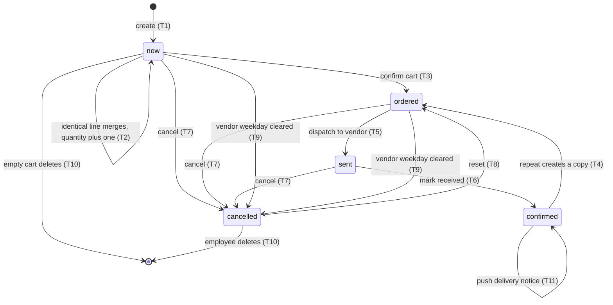
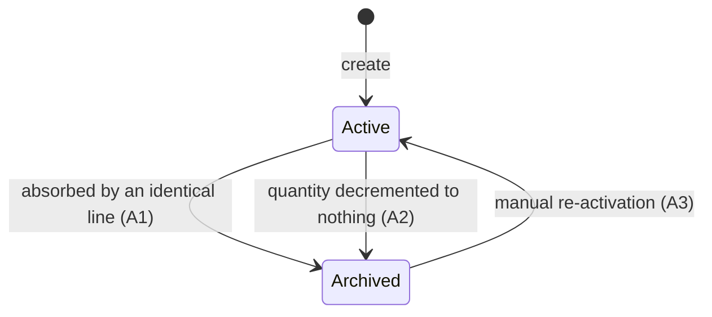
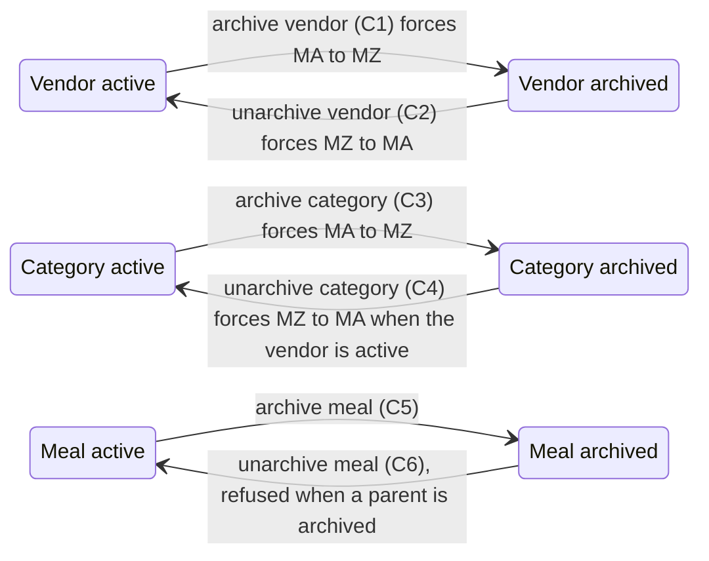
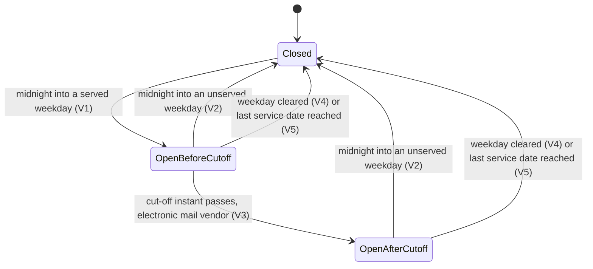
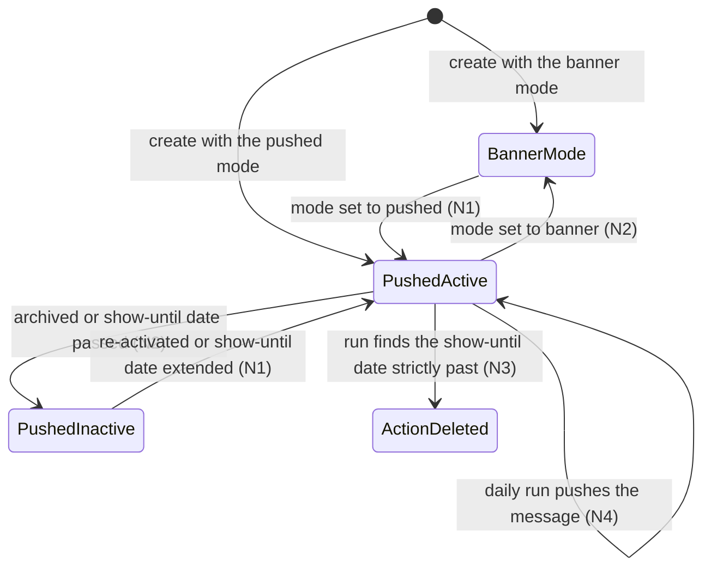

# Meal Ordering — State machines

This document specifies every state-bearing field of the domain. The domain has one true pipeline,
the state of the Lunch Order, and four secondary machines: the archive flag of the Lunch Order, the
coupled archive flags of the Lunch Vendor, the Lunch Product and the Lunch Product Category, the
availability and cut-off machine of the Lunch Vendor, and the displayability machine of the Lunch
Alert. Each is given with its states, its transition table, the guards of each transition in the
order they are evaluated, the exact refusal message of each guard and a diagram.

Rule identifiers referenced below are defined in [`business-rules.md`](business-rules.md).

---

## 1. Lunch Order state (`state`)

### 1.1 States

| Stored value | Label | Meaning |
|---|---|---|
| `new` | "To Order" | The line sits in the employee's cart. Nothing is committed. The line is fully editable by its owner, does not appear on the employee's account statement and does not reduce the balance. |
| `ordered` | "Ordered" | The employee has confirmed the cart. The charge is committed and appears on the account statement. The vendor has not been told yet. |
| `sent` | "Sent" | The line has been passed to the vendor, either inside the automatic order message or by the administrator marking a telephone order as sent. It can no longer be edited by anyone through the ordinary edit paths, because the merge machinery skips it and the client hides its controls. |
| `confirmed` | "Received" | The delivery has arrived and the administrator has marked it received. The charge is on the account statement again. The delivery notice may be pushed once from here. |
| `cancelled` | "Cancelled" | The line will not be delivered. It carries no charge. It may be deleted by its owner or reset to the ordered state by an administrator. |

The label of each state is the text a client displays and is reproduced verbatim. Note that the
label of the stored value `confirmed` is "Received", not "Confirmed": the two words are used
interchangeably in the screens and they mean the same state.

### 1.2 State rank

Several screens need a single state for a whole cart. The rank used is: `new` first, then `ordered`,
then `sent`, then `confirmed`, then `cancelled`. The cart's state is the lowest-ranked state among
its lines, so a cart holding one to-order line and four received lines still counts as to-order and
still offers the confirmation control.

### 1.3 Transition table

| # | From | To | Trigger | Guards, in order | Records created or changed |
|---|---|---|---|---|---|
| T1 | — | `new` | Creating an order line, from the order form, from the service that adds to the cart, or by an administrator. | No matching to-order line exists (otherwise T2 happens instead). The extras discipline of every offered group must be satisfied — rules MEAL-011, MEAL-012. | One Lunch Order with the state `new`, quantity as supplied or 1, total price computed, extras summary computed. |
| T2 | `new` | `new` | Creating an order line whose employee, meal, date, note, location and ordered list of extras match an existing to-order line. | The matching line is not in the `sent` or `confirmed` state; the balance after the increment must not fall below the permitted overdraft — rule MEAL-020. | The matching line's quantity rises by exactly one, whatever quantity was requested; its total price is recomputed; **no** new record is created; the operation returns the first matching line. |
| T3 | `new` | `ordered` | The confirm-cart operation, invoked by the "Order Now" control of the ordering screen or by the administrator's order control on a card. | The vendor must serve on the line's order date, otherwise refusal MEAL-001. The meal must not be archived, otherwise refusal MEAL-002. After the write, the balance must not fall below the permitted overdraft, otherwise refusal MEAL-020, and the whole operation is rolled back. | Every selected line moves to `ordered`. Each line now contributes a negative row to the account statement. |
| T4 | any state | `ordered` | The repeat operation on a received line. | Exactly one line must be selected. Its vendor must be available today, otherwise refusal MEAL-003. | A **copy** of the line is created, dated today and already in the `ordered` state, carrying the same meal, extras, note, quantity, employee, location and the copied delivery-notice flag. The original line is untouched. The screen navigates to the personal order list. |
| T5 | `ordered` | `sent` | The vendor dispatch operation, either the scheduled action of an electronic mail vendor, the manual dispatch control on the vendor group of the order list, or the manual send control on a card. | For the scheduled path: the vendor must serve today, otherwise the run ends silently; the vendor's channel must be electronic mail, otherwise refusal MEAL-004; at least one ordered line must exist for today, otherwise the run ends silently. | Every ordered line of that vendor dated today moves to `sent`. One electronic mail message is queued from the message template to the vendor's Contact. The lines leave the account statement — see the compatibility finding in [`entities.md`](entities.md#82-nature-and-composition). |
| T6 | `sent` | `confirmed` | The receipt operation: the grouped receipt control on the vendor group, the receipt control on a line, the receipt control on a card, the list header control, or the bound server action "Lunch: Receive meals". | None. The controls are hidden unless the line is in the `sent` state, but the operation itself checks nothing. | Every selected line moves to `confirmed` and re-enters the account statement. |
| T7 | any state except `confirmed` and `cancelled` | `cancelled` | The cancel operation: the cancel control on a line, the cancel control on a card, or the bound server action "Lunch: Cancel meals". | None in the operation. The controls are hidden when the line is already cancelled or received. The record rules still apply: an ordinary employee may only write on their own lines and only while these are not received — rule MEAL-031. | Every selected line moves to `cancelled` and leaves the account statement. |
| T8 | `cancelled` | `ordered` | The reset control on a line. | None in the operation. The control is shown only on cancelled lines and only to administrators. | The line returns to `ordered` and its charge re-enters the account statement. |
| T9 | `new` or `ordered` | `cancelled` | Clearing a weekday flag on the vendor. | The line's date is today or later, read in the vendor's time zone, and the line's weekday is one of the cleared weekdays. | Every matching line of that vendor moves to `cancelled` in one write. |
| T10 | any state except `sent` and `confirmed` | `cancelled`, then deleted | The empty-cart service endpoint. | The line belongs to the requesting employee, or to the employee an administrator is impersonating; the line's date is today or later; the line is not already cancelled; the line is not `sent` or `confirmed`. | Every matching line is first moved to `cancelled` and then deleted. The delete is additionally filtered by the deletion record rule, which permits deletion only in the `new` and `cancelled` states — rule MEAL-032. |
| T11 | `confirmed` | `confirmed` | The delivery notice operation, from the notify control on a line, from the notify control on a card, or from the bound server action "Lunch: Send notifications". | Lines whose delivery-notice flag is already set are dropped from the selection. If nothing is left the operation ends silently. | One notification per distinct employee, carrying the subject "Lunch notification" and the company's delivery notice message rendered in that employee's language. Every selected line has its delivery-notice flag set to true. |

### 1.4 Guard details and refusal messages

**Guard on T3, evaluated first, once per selected line.** The vendor of the line must serve on the
line's order date. When one line fails, the whole operation is refused with the message:

> "The vendor related to this order is not available at the selected date."

**Guard on T3, evaluated second, over the whole selection.** If any selected line's meal is
archived, the operation is refused with the message:

> "Product is no longer available."

**Guard on T3, evaluated last, after the state has been written.** The balance of every employee
appearing in the selection is recomputed and must not be negative once the permitted overdraft is
added. When it is negative, the operation is refused with the message:

> "Oh no! You don’t have enough money in your wallet to order your selected lunch! Contact your lunch manager to add some money to your wallet."

The apostrophe in this message is the typographic right single quotation mark, not the plain
apostrophe; the text is reproduced exactly as it is shown. Because the refusal is raised after the
state write, the transaction is rolled back as a whole and no line ends in the `ordered` state.

**Guard on T4.** The vendor must serve today. Otherwise:

> "The vendor related to this order is not available today."

**Guard on T5, scheduled path.** When the vendor's channel is not electronic mail:

> "Cannot send an email to this supplier!"

This refusal is only reachable when the dispatch operation is invoked directly on a telephone
vendor; the manual dispatch control routes telephone vendors down a different path that never
raises.

### 1.5 Diagram

### 1.6 States reachable only automatically

- `sent` is reachable from the scheduled dispatch action without any human involvement.
- `cancelled` is reachable from a vendor weekday being cleared, without any human touching the
  order.
- `new` is reachable only by creation; no operation ever returns a line to `new`.

### 1.7 What each state permits

| Capability | `new` | `ordered` | `sent` | `confirmed` | `cancelled` |
|---|---|---|---|---|---|
| Counted in the account statement | no | yes | no | yes | no |
| Editable by its owner | yes | yes, subject to the record rule | no, the merge machinery skips it | no, the record rule forbids it | yes, subject to the record rule |
| Absorbs an identical new line | yes | no | no | no | no |
| Deletable by its owner | yes | no | no | no | yes |
| Date field editable on screen | yes | no | no | no | no |
| Repeat control offered | no | no | no | yes, when the vendor serves today and the balance allows | no |
| Delivery notice offered | no | no | no | yes, once | no |

### 1.8 Merge on write, and what it does to a state change

Every write that touches the note, any of the three extras fields or the state runs the merge
machinery, not only a write that comes from the cart. The machinery walks the written lines, skips
those already in the `sent` or `confirmed` state, and for each remaining line searches for another
line of the same employee, meal, date, note, location and ordered list of extras **whose state
equals the state being written**. When it finds one, the written line is archived and the found
line's quantity is raised by the archived line's quantity.

This is what makes the ordinary path work: two identical cart lines, one already confirmed into the
`ordered` state and one still in the cart, collapse into one ordered line of the combined quantity
as soon as the cart is confirmed.

**Compatibility finding.** The quantity transfer is performed by the same operation that the
decrement control uses, and that operation ignores lines in the `sent` and `confirmed` states. When
the found line is already in one of those two states, the written line is archived and the found
line's quantity is not raised, so the ordered quantity is silently lost. Two concrete cases:

1. An employee has one received line for a meal. They order the same meal again on the same day with
   the same extras, note and location, and the administrator marks it received. The second line is
   archived with the state it had, and the received line's quantity stays at one. The employee is
   charged for one meal and receives two.
2. A vendor's orders are dispatched twice on the same day, as happens when a late line is confirmed
   after the scheduled dispatch has already run. The late line matches a line dispatched earlier,
   so it is archived and the earlier line's quantity is not raised. The late meal is dropped from
   the vendor's order and from the account statement.

A corrected behaviour would exclude lines in the `sent` and `confirmed` states from the set of merge
targets, exactly as they are excluded from the set of merge sources, so that a line that cannot
absorb a quantity is never chosen to absorb one.

**Compatibility finding.** The location used to identify a matching line during a write is the
**writing user's** last ordering location, not the location stored on the line being written. An
administrator who confirms an employee's order therefore searches for matches at the administrator's
own location. A corrected behaviour would read the location from the line.

---

## 2. Lunch Order archive flag (`active`)

### 2.1 States

| Stored value | Label | Meaning |
|---|---|---|
| true | Active | The line exists for every purpose: it is listed, it is dispatched and it is counted in the account statement. |
| false | Archived | The line is hidden from every default list and is excluded from the account statement, but it is not deleted and it keeps its state. |

### 2.2 Transition table

| # | From | To | Trigger | Guards | Records changed |
|---|---|---|---|---|---|
| A1 | true | false | A write that changes the note, the extras or the state finds another line of the same employee, meal, date, note, location and extras. | The written line must not be in the `sent` or `confirmed` state. The other line must not be the line itself. | The written line is archived; the other line's quantity rises by the archived line's quantity. |
| A2 | true | false | The quantity decrement control, when the current quantity is at or below the size of the decrement. | The line must not be in the `sent` or `confirmed` state. | The line is archived; its quantity is left unchanged. |
| A3 | false | true | Manual re-activation from the archived filter of the order list. | The record rules apply. | The line reappears and its charge re-enters the account statement if its state is `ordered` or `confirmed`. |

There is no automatic path back from archived to active.

### 2.3 Diagram

---

## 3. Coupled archive flags of vendor, meal and category

The three catalogue entities each carry an archive flag, and the three flags are coupled: a meal may
be active only while both its category and its vendor are active.

### 3.1 States

| Entity | Stored value | Meaning |
|---|---|---|
| Lunch Vendor | true | Serves; its meals may be active; its scheduled action may be active. |
| Lunch Vendor | false | Retired; every meal of the vendor is archived and the scheduled action is deactivated. |
| Lunch Product Category | true | Offered; its meals may be active. |
| Lunch Product Category | false | Withdrawn; every meal in it is archived. |
| Lunch Product | true | In the catalogue and orderable. |
| Lunch Product | false | Out of the catalogue; existing orders keep pointing at it, and confirming such an order is refused. |

### 3.2 Transition table

| # | Entity | From | To | Trigger | Guards | Records changed |
|---|---|---|---|---|---|---|
| C1 | Vendor | true | false | Archiving the vendor. | None. | Every meal of the vendor is written to archived. The vendor's scheduled action is deactivated, because the action is active only when the vendor is active and its channel is electronic mail. |
| C2 | Vendor | false | true | Unarchiving the vendor. | None in the vendor's own logic. | Every meal of the vendor is written to active. If any of those meals sits in an archived category, the meal's own constraint refuses with the archived-category message and the whole unarchive fails — see the compatibility finding in [`entities.md`](entities.md#16-archival-and-company-behaviour). The scheduled action is re-activated when the channel is electronic mail. |
| C3 | Category | true | false | Archiving the category. | None. | Every meal whose category or vendor is archived is archived. |
| C4 | Category | false | true | Unarchiving the category. | None. | Every meal both of whose parents are now active is unarchived; meals whose vendor is still archived stay archived. |
| C5 | Meal | true | false | Archiving the meal directly. | None. | The meal leaves the catalogue. |
| C6 | Meal | false | true | Unarchiving the meal directly. | The category must be active, otherwise refusal MEAL-005. The vendor must be active, otherwise refusal MEAL-006. | The meal returns to the catalogue. |

### 3.3 Refusal messages

Unarchiving a meal whose category is archived, or creating an active meal under an archived
category, is refused with a two-part message: the fixed sentence

> "The following product categories are archived. You should either unarchive the categories or change the category of the product."

followed by a line break and then, one per line, the names of the archived categories of the meals
that failed.

The vendor equivalent is refused with:

> "The following suppliers are archived. You should either unarchive the suppliers or change the supplier of the product."

followed by a line break and then, one per line, the names of the archived vendors of the meals that
failed.

### 3.4 Diagram

---

## 4. Lunch Vendor availability and cut-off

The vendor has no stored state field, but two computed flags behave as a state machine over the
course of a day and are read by half the rules of the domain.

### 4.1 The four situations

| Situation | Available today | Cut-off passed | Meaning | What is possible |
|---|---|---|---|---|
| Closed | false | for a telephone vendor: true; for an electronic mail vendor: false | The vendor does not serve on today's weekday, or today is on or after its last service date. | New lines may be created for a future date the vendor does serve; the confirm-cart operation refuses any line dated today; the repeat operation refuses. |
| Open, before the cut-off | true | false | The vendor serves today and the current instant, read in the vendor's time zone, is at or before the cut-off instant. | Everything: create, confirm, dispatch, receive. |
| Open, after the cut-off, electronic mail | true | true | The vendor serves today and the current instant is past the cut-off instant. | The order form shows the warning "The orders for this vendor have already been sent." and hides the add-to-cart control for lines dated today. The confirm-cart operation itself does not check the cut-off, so a line already in the cart may still be confirmed. |
| Open, after the cut-off, telephone | true | false | A telephone vendor's cut-off flag is false whenever it serves today, whatever the hour. | Ordering stays open all day. The administrator dispatches by telephone whenever they choose. |

### 4.2 Transition table

| # | From | To | Trigger | Guards | Effect |
|---|---|---|---|---|---|
| V1 | Closed | Open | The clock crosses midnight in the vendor's time zone into a weekday the vendor serves, and the last service date is still empty or later than the new date. | None. | Meals of the vendor reappear in the availability-today filter; the confirm-cart operation stops refusing. |
| V2 | Open | Closed | The clock crosses midnight into a weekday the vendor does not serve, or into the last service date. | None. | The reverse of V1. |
| V3 | Open, before the cut-off | Open, after the cut-off | For an electronic mail vendor, the clock passes the cut-off instant in the vendor's time zone. | None. | The order form warns and hides the add control for today. |
| V4 | Open | Closed | An administrator clears a weekday flag that matches today. | None. | Every `new` and `ordered` line of that vendor dated today or later that falls on a cleared weekday is cancelled — transition T9 above. |
| V5 | Open | Closed | An administrator sets a last service date that is today or earlier. | None. | The vendor is unavailable from that date. No order is cancelled by this change; only clearing a weekday cancels orders. |

### 4.3 Diagram

---

## 5. Lunch Alert displayability and its scheduled action

### 5.1 The displayability flag

| Situation | Displayed today | Meaning |
|---|---|---|
| Applies today | true | The notice's flag for today's weekday is set and the show-until date is either empty or strictly later than today. |
| Does not apply today | false | Today's weekday flag is clear, or the show-until date is today or earlier. |

### 5.2 The scheduled action's own two states

| Stored value of the action's active flag | When | Effect |
|---|---|---|
| true | The notice is active, its mode is the pushed mode, and its show-until date is empty or today is on or before it. | The action runs once a day at the next due instant. |
| false | Any of those three conditions fails. | The action never runs. |

### 5.3 Transition table

| # | From | To | Trigger | Guards | Effect |
|---|---|---|---|---|---|
| N1 | action inactive | action active | Creating a notice in the pushed mode, or setting the mode to pushed, or re-activating the notice, or extending the show-until date into the future. | The notice is active, the mode is pushed and the show-until date allows it. | The action's next due instant is recomputed by the rule in [`calculations.md`](calculations.md#7-next-dispatch-instant), its name becomes the fixed prefix "Lunch: alert chat notification (" followed by the notice name and a closing parenthesis. |
| N2 | action active | action inactive | Archiving the notice, switching the mode to the banner mode, or setting a show-until date in the past. | None. | The action stops running; the record survives. |
| N3 | action active | action deleted | A run finds the notice not displayable today and the show-until date strictly earlier than today. | Both conditions must hold. | The action is deleted and the notice's reference to it is cleared. Because the reference is required, a later write on the notice that touches any synchronising field is refused by the platform. **Compatibility finding**: the entity declares the scheduled action reference as required and then clears it, leaving the record in a state its own declaration forbids. A corrected behaviour would leave the action in place and inactive. |
| N4 | pushed | pushed | A scheduled run on a displayable day. | The notice must be active and in the pushed mode; otherwise the run fails with the message "Cannot send a chat notification in the current state". | One notification carrying the subject "Your Lunch Order" and the notice message is posted on the notice record to the Contacts of every employee whose orders match the audience filter. |

### 5.4 The gap on the show-until date itself

The displayability flag requires the show-until date to be **strictly** later than today, while the
scheduled action is kept active while today is **on or before** the show-until date. On the
show-until date itself the action therefore runs, finds the notice not displayable, and returns
without sending; and because today is not strictly later than the show-until date, it does not
delete itself either. **Compatibility finding.** The notice is silently skipped on its final day. A
corrected behaviour would align the two comparisons, either by treating the show-until date as
inclusive in both places or as exclusive in both.

### 5.5 Diagram

