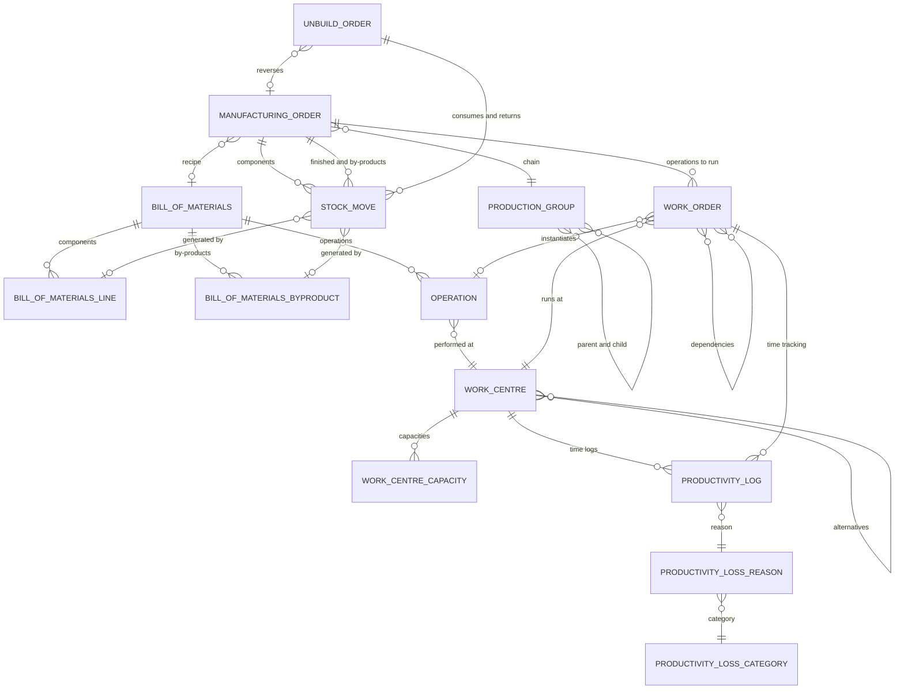

# Manufacturing — Entities

This file specifies every entity of the manufacturing domain: its purpose, its lifecycle,
its complete field table, its relations, its uniqueness rules, its defaults, its computed
fields with the exact rule each one applies, its ordering, its display rule, its archival
behaviour and its multi-company behaviour.

Field tables use three columns:

- **Field (storage name)** — the human name followed by the exact stored column or
  relation name in code font.
- **Type** — the value domain.
- **Meaning and rules** — required, default, computed (and from which inputs), stored or
  not, readonly, copy behaviour on duplication, tracking, company scoping, indexing,
  on-delete behaviour, and the full list of selection values with their labels.

Unless a field says "not stored", it is persisted. Unless a field says "not copied", it is
carried over when the record is duplicated.

---

## 1. Bill of Materials

**Bill of Materials** (`mrp.bom`, table `mrp_bom`) — hereafter also called *the recipe*.
It states that a given quantity of a given product, expressed in a given unit, is made of
a set of components, optionally produces by-products, and optionally passes through a set
of operations.

### 1.1 Purpose and kinds

A recipe has one of two kinds, held in the field `type` (recipe kind):

| Value | Label | Meaning |
|---|---|---|
| `normal` | Manufacture this product | The recipe drives a Manufacturing Order. The finished product is produced as a real Stock Move from the production location into stock, and the components are consumed as real Stock Moves from stock into the production location. |
| `phantom` | Kit | The recipe is never manufactured. Wherever a Stock Move for the product appears on a document, that move is replaced at confirmation time by one move per leaf component. The kit product itself never moves and never holds stock. |

The two kinds are selected independently by the algorithms that look a recipe up: the
manufacture rule asks for a `normal` recipe, kit explosion asks for a `phantom` recipe.

### 1.2 Field table

| Field (storage name) | Type | Meaning and rules |
|---|---|---|
| Reference (`code`) | text | Free reference printed before the product name in the display name. Optional. Part of the name search together with the product template. |
| Active (`active`) | boolean | Default true. Archiving a recipe also archives all of its operations (with the archived ones included in the search). Unarchiving a recipe unarchives all of its operations. Archived recipes are excluded from recipe selection. |
| Recipe kind (`type`) | selection | Required, default `normal`. Values `normal` (Manufacture this product) and `phantom` (Kit) as described above. |
| Product (`product_tmpl_id`) | many-to-one to Product Template | Required, indexed, company-checked. Restricted to products whose type is `consu` (goods, as opposed to a service). The recipe applies to every variant of this template unless a specific variant is named. |
| Product Variant (`product_id`) | many-to-one to Product Variant | Optional, indexed, company-checked. Restricted to variants of `product_tmpl_id` whose type is `consu`. When set, the recipe applies only to that variant; when empty, it applies to all variants of the template. |
| Component lines (`bom_line_ids`) | one-to-many to Bill of Materials Line | Copied on duplication. The components. |
| By-products (`byproduct_ids`) | one-to-many to Bill of Materials By-Product | Copied on duplication. The secondary outputs. |
| Quantity (`product_qty`) | decimal, precision "Product Unit" | Required, default 1. The quantity the recipe produces, expressed in the recipe unit. A database check enforces strictly greater than zero, with the message **"The quantity to produce must be positive!"**. Documented as the smallest batch the product can be produced in; if the recipe has operations, the work centre capacities must be consistent with it. |
| Unit (`product_uom_id`) | many-to-one to Unit of Measure | Required. Default is the first unit of measure by ascending identifier. When the product template changes, it is reset to the template's own unit, unless a default unit was supplied by the caller's context. |
| Sequence (`sequence`) | integer | Ordering key. Lower first. Writing this field triggers a re-check of the cycle constraint over the whole batch being written. |
| Operations (`operation_ids`) | one-to-many to Operation | Copied on duplication, with dependency links remapped (see §1.7). |
| Operations count (`operation_count`) | integer, computed, not stored | Number of operations. |
| Show copy-operations control (`show_copy_operations_button`) | boolean, computed, not stored | True when at least one Operation record exists anywhere. Technical, drives the visibility of the "copy existing operations" control. |
| Manufacturing readiness (`ready_to_produce`) | selection | Required, default `all_available`. Values: `all_available` (When all components are available) and `asap` (When components for the first operation are available). Governs how the order readiness is computed when components are only partially reserved. |
| Operation Type (`picking_type_id`) | many-to-one to Operation Type | Optional, company-checked, restricted to operation types whose code is `mrp_operation` (manufacturing). When a procurement carries a manufacture route that names an operation type, the system prefers a recipe with the same operation type; a recipe with no operation type matches any. This allows different rules to trigger different orders with different recipes. |
| Company (`company_id`) | many-to-one to Company | Indexed, default the active company. May be empty, which means the recipe is shared by all companies. |
| Flexible Consumption (`consumption`) | selection | Required, default `warning`. Values: `flexible` (Allowed), `warning` (Allowed with warning), `strict` (Blocked). Defines whether components may be consumed in quantities different from the recipe. See §1.6 and [business-rules.md](business-rules.md). |
| Possible variant values (`possible_product_template_attribute_value_ids`) | many-to-many to Product Template Attribute Value, computed, not stored | All active attribute values of the valid attribute lines of `product_tmpl_id`. Used as the domain of the "apply on variants" fields of lines, by-products and operations. |
| Operation Dependencies (`allow_operation_dependencies`) | boolean | When set, operations carry explicit predecessor links which drive both planning and Work Order readiness. When set but no dependency is declared, all operations are treated as startable simultaneously. |
| Manufacturing Lead Time (`produce_delay`) | integer (days) | Default 0. Average number of days to manufacture. For a multi-level structure the lead times of the components accumulate. For a subcontracted product it determines the date at which components must reach the subcontractor. |
| Days to prepare Manufacturing Order (`days_to_prepare_mo`) | integer (days) | Default 0. How many days in advance the order is created and confirmed, so that components can be replenished or sub-assemblies manufactured. |
| Show set-recipe control (`show_set_bom_button`) | boolean, computed, not stored | False for the recipe already selected on the reordering rule named by the caller's context; true otherwise. |
| Batch Size (`batch_size`) | decimal, precision "Product Unit" | Default 1. When batch sizing is enabled, every automatically generated Manufacturing Order for the product is created with this quantity, repeatedly, until the procured quantity is covered. |
| Enable batch size (`enable_batch_size`) | boolean | Default false. Turns the batch size on. |

### 1.3 Uniqueness, ordering, display

- There is **no uniqueness constraint** on recipes. Several recipes may exist for the same
  product; the selection algorithm (§1.5) resolves which one applies.
- Ordering: by `sequence` ascending, then by identifier ascending.
- Name search matches on the product template and on `code`.
- Display name: `code` followed by a colon and a space when `code` is set, then the
  product template's display name. When the caller's context asks for the quantity to be
  shown and either the recipe quantity is greater than one or the recipe unit differs from
  the product's own unit, the display name is suffixed with a space, an opening
  parenthesis, the recipe quantity, a space, the unit name and a closing parenthesis.

  Example: a recipe coded `TBL-01` for the product *Dining table* producing 1 unit
  displays as `TBL-01: Dining table`; the same recipe producing 10 units displays, in a
  quantity-aware context, as `TBL-01: Dining table (10.0 Units)`.

- Creating a recipe by name alone is refused with **"You cannot create a new Bill of
  Material from here."** unless the caller supplies a default product template, in which
  case the typed text becomes the `code` of a recipe created for that template.

### 1.4 Company behaviour

- `company_id` may be empty. An empty company means "all companies".
- The record rule restricts visibility to recipes whose company is among the user's
  allowed companies **or empty**.
- Company consistency is enforced automatically between the recipe and its product,
  variant, operation type, operations and lines.

### 1.5 Recipe selection

Given a set of products, an optional operation type, an optional company and an optional
recipe kind, the selection produces at most one recipe per product.

**Selection domain.** A recipe is a candidate for product *p* when all of the following
hold:

1. Either its `product_id` (specific variant) is *p*, or its `product_id` is empty and its
   `product_tmpl_id` (product template) is the template of *p*.
2. Its `active` flag is true.
3. If a company was supplied (as an argument or through the caller's context), its
   `company_id` is either empty or that company.
4. If an operation type was supplied, its `picking_type_id` is either empty or that
   operation type.
5. If a recipe kind was supplied, its `type` equals that kind.

**Ordering and choice.** Candidates are ordered by `sequence` ascending, then by
`product_id` ascending (which places variant-specific recipes before template-wide
recipes when the sequences are equal, because an empty variant sorts last under the
ascending ordering used here), then by identifier ascending. For a single product the
first candidate wins.

For a batch of products the algorithm is:

1. Read all candidates in that order.
2. Walk them in order. For each candidate:
   - if it names a specific variant, and no template-wide recipe has yet been recorded for
     that variant's template, and no recipe has yet been recorded for that variant, record
     it as the recipe of that variant;
   - if it names no specific variant, and no recipe has yet been recorded for its
     template, record it as the recipe of that template.
3. For each requested product that has no variant-specific recipe but whose template has a
   template-wide recipe, assign the template-wide recipe.

Products of type `service` are removed before the search and never receive a recipe.

**Failure mode.** A product with no candidate simply has no recipe; this is not an error
at selection time. It becomes an error only where a recipe is required — for example when
a manufacture rule must create an order, the lead-time computation adds a penalty of 365
days and reports **"No BoM Found"** with **"+ 365 day(s)"**.

### 1.6 The consumption policy

The policy lives on the recipe and is copied onto the Manufacturing Order at confirmation
(`consumption` on the order, which defaults to `flexible` when there is no recipe). It
governs the check made when the order is marked done:

| Policy | Behaviour when consumed quantities differ from expected quantities |
|---|---|
| `flexible` (Allowed) | No check at all. The order closes silently. |
| `warning` (Allowed with warning) | The Consumption Warning assistant opens, listing every difference. Any manufacturing user may confirm and close the order. |
| `strict` (Blocked) | The Consumption Warning assistant opens, listing every difference. Only a manufacturing administrator may confirm and close the order; a plain user cannot. |

The policy is also respected when consumption is registered manually only: differences
still raise the warning.

### 1.7 Duplication

Duplicating a recipe copies the component lines, the by-products and the operations. In
addition, the copy remaps intra-recipe references:

1. Build a mapping from each original operation to the corresponding copied operation, by
   zipping the originals in their stored order with the copies in their sorted order.
2. For every copied component line that names a consuming operation, replace it with the
   mapped copy.
3. For every copied by-product that names a producing operation, replace it with the
   mapped copy.
4. For every original operation that has predecessors, set the predecessors of its copy to
   the mapped copies of those predecessors.

### 1.8 Constraints on the recipe

These are stated in full, with their exact messages, in
[business-rules.md](business-rules.md). In summary:

| Rule | Trigger | Message |
|---|---|---|
| Positive quantity | Database check on `product_qty` | The quantity to produce must be positive! |
| No cycle | On write of `active`, `product_id`, `product_tmpl_id`, `bom_line_ids` | The current configuration is incorrect because it would create a cycle between these products: *the list of product names*. |
| Variant restriction versus variant-specific recipe | On write of `product_id`, `product_tmpl_id`, `bom_line_ids`, `byproduct_ids`, `operation_ids` | You cannot use the 'Apply on Variant' functionality and simultaneously create a BoM for a specific variant. |
| Variant restriction belongs to the same template | Same trigger | The attribute value *the attribute value name* set on product *the product name* does not match the BoM product *the recipe product name*. |
| By-product is not the finished product | Same trigger | By-product *the recipe display name* should not be the same as BoM product. |
| By-product cost share is non-negative | Same trigger | By-products cost shares must be positive. |
| Total cost share at most 100 | Same trigger, per variant | The total cost share for a BoM's by-products cannot exceed 100. |
| A kit has no reordering rule | On write of `product_tmpl_id`, `product_id`, `type` | You can not create a kit-type bill of materials for products that have at least one reordering rule. |
| Positive batch size | On write of `enable_batch_size`, `batch_size` | The batch size must be positive! |
| No deletion while orders run | On delete | You can not delete a Bill of Material with running manufacturing orders. Please close or cancel it first. |

### 1.9 Side effects of modifying a recipe

Writing any of `bom_line_ids`, `byproduct_ids`, `product_tmpl_id`, `product_id` or
`product_qty` marks the affected Manufacturing Orders as carrying an outdated recipe:

1. For each written recipe, build the set of products it covers: the specific variant if
   set, otherwise all variants of the template.
2. Search Manufacturing Orders that use that recipe and are either in state `draft`, or in
   state `confirmed` **and** produce one of those products.
3. Set `is_outdated_bom` (outdated recipe flag) to true on those orders.
4. Unless the caller suppresses it, search confirmed orders that use that recipe, are
   already flagged outdated, and whose product (or product template) no longer matches the
   recipe, and clear the flag on them.

Creating, writing, archiving or unarchiving an Operation performs step 1 to 3 for that
operation's recipe, with the unmarking pass suppressed.

A user acting on a flagged order may apply the new recipe with the update action described
in [workflows.md](workflows.md) §7.

### 1.10 Computing the days to prepare

The "compute days to prepare" action recomputes `days_to_prepare_mo` from the recipe
structure report:

1. Pick the first warehouse of the company named by the caller's default company, falling
   back to the active company.
2. Build the minimised recipe structure data for the recipe in that warehouse, ignoring
   stock.
3. Set `days_to_prepare_mo` to the maximum component delay found in that data
   (see [calculations.md](calculations.md) §9.4).
4. If the resulting availability state is "unavailable" and the components are reported as
   not available, show the notice **"Cannot compute days to prepare due to missing route
   info for at least 1 component or for the final product."** and stop.

### 1.11 Attachments shown on a recipe

The documents visible in a recipe's discussion thread include, in addition to its own
attachments, every product document whose "attached on manufacturing" flag is `bom` and
that is attached either to one of the recipe products or, when the user belongs to the
by-products group, to one of the by-product products, at either the variant or the
template level.

---

## 2. Bill of Materials Line

**Bill of Materials Line** (`mrp.bom.line`, table `mrp_bom_line`) — one component of a
recipe.

### 2.1 Field table

| Field (storage name) | Type | Meaning and rules |
|---|---|---|
| Component (`product_id`) | many-to-one to Product Variant | Required, indexed, company-checked. Restricted to products of type `consu` (goods) or `service`. A service component is present in the recipe for costing and documentation but never produces a component Stock Move. |
| Product Template (`product_tmpl_id`) | many-to-one to Product Template | Related to the component's template, stored, indexed. |
| Company (`company_id`) | many-to-one to Company | Related to the parent recipe's company, stored, indexed, readonly. |
| Quantity (`product_qty`) | decimal, precision "Product Unit" | Required, default 1. Quantity of the component needed to produce `product_qty` of the recipe, expressed in the line unit. A database check enforces greater than or equal to zero with the message **"All product quantities must be greater or equal to 0. Lines with 0 quantities can be used as optional lines. You should install the mrp_byproduct module if you want to manage extra products on BoMs!"** A zero-quantity line is an optional component: it is skipped by the quantity ratios of kits and of the on-hand computation. |
| Unit (`product_uom_id`) | many-to-one to Unit of Measure | Required. Default is the first unit by ascending identifier; on creation, if a component is given without a unit, the component's own unit is used; when the component is changed interactively, the unit follows the component's own unit. |
| Sequence (`sequence`) | integer | Default 1. Ordering key, ascending, then identifier. |
| Parent recipe (`bom_id`) | many-to-one to Bill of Materials | Required, indexed, deletes the line when the recipe is deleted (cascade). |
| Parent product template (`parent_product_tmpl_id`) | many-to-one to Product Template | Related to the parent recipe's product template, not stored. |
| Possible variant values (`possible_bom_product_template_attribute_value_ids`) | many-to-many, related | The parent recipe's possible attribute values, used as the domain of the next field. |
| Apply on Variants (`bom_product_template_attribute_value_ids`) | many-to-many to Product Template Attribute Value | Restricted to the possible values. Deletion of a referenced value is refused (restrict). When set, the line is only used for finished products matching those values (see §2.2). |
| Allowed operations (`allowed_operation_ids`) | one-to-many, related | The parent recipe's operations, used as the domain of the next field. |
| Consumed in Operation (`operation_id`) | many-to-one to Operation | Optional, company-checked, restricted to the parent recipe's operations. Names the operation at which the component is consumed. A line with an operation produces a component move whose consumption is manual (see §2.3). |
| Sub-recipe (`child_bom_id`) | many-to-one to Bill of Materials, computed, not stored | The recipe found for the component by the selection algorithm with no kind restriction; empty when the component has none. |
| Sub-recipe lines (`child_line_ids`) | one-to-many, computed, not stored | The component lines of the sub-recipe, or empty. |
| Attachments count (`attachments_count`) | integer, computed, not stored | Number of active product documents whose "attached on manufacturing" flag is `bom` and that are attached to the component variant or to its template. |
| Tracking (`tracking`) | selection, related to the component's tracking | `none`, `lot` or `serial`. |

### 2.2 Variant restriction — the skip rule

A line is **skipped** for a given finished product when the attribute-value test fails.
The test is shared by component lines, by-product lines and operations, and takes the
finished product, the line's restriction values, and optionally the set of
"never-variant" attribute values chosen on the order.

Let *R* be the line's restriction values. Partition *R* into:

- *R_never* — values whose attribute has creation mode `no_variant` (an attribute that
  never creates a separate product variant);
- *R_other* — the rest (attributes with creation mode `always` or `dynamic`).

Let *N* be the set of never-variant values supplied by the caller (empty when none).

Steps:

1. If the finished product is absent, or is a product template rather than a variant, the
   line is **not** skipped. (A template-level call cannot discriminate variants.)
2. Compute *other_valid* = the finished product matches all of *R_other*. The match test
   is: the number of values common to the product's own attribute values and *R_other*
   equals the number of distinct attributes present in *R_other*. This allows several
   values of the same attribute to be listed on one line, of which the product needs only
   one.
3. If *R_never* is empty, the line is skipped exactly when *other_valid* is false.
4. If *R_never* is not empty and *N* is empty, the line is **always skipped** — there is no
   way to match a never-variant restriction without a chosen value.
5. Otherwise compute *never_valid* = the number of distinct attributes covered by the
   intersection of *R_never* and *N* equals the number of distinct attributes in *R_never*.
   The line is skipped exactly when *other_valid* and *never_valid* are not both true.

**Worked example.** A table recipe has an attribute *Legs* with values *Wood* and *Metal*
(creation mode "always", so each value produces its own variant), and a never-variant
attribute *Engraving* with values *Yes* and *No*.

- Component line "Wooden leg", restriction {*Wood*}: for the variant *Table (Wood)*,
  *R_other* = {*Wood*}, the product's values include *Wood*, the intersection has 1 element
  and *R_other* covers 1 attribute, so *other_valid* is true and *R_never* is empty — the
  line is used. For the variant *Table (Metal)* the intersection is empty, *other_valid* is
  false — the line is skipped.
- Component line "Engraving kit", restriction {*Yes*}: *R_never* = {*Yes*}. With no
  never-variant choice on the order, the line is skipped. With *Engraving = Yes* chosen on
  the order, *R_never* ∩ *N* = {*Yes*} covers the single attribute *Engraving*, so
  *never_valid* is true, *R_other* is empty so *other_valid* is true — the line is used.

### 2.3 Manual consumption

A component move is created with its manual-consumption flag set exactly when the
generating recipe line names a consuming operation. In other words:

```formula
manual_consumption = ( recipe_line exists ) and ( recipe_line.operation_id is set )
```

A manual-consumption move is not automatically filled when the quantity being produced
changes; its consumed quantity must be registered explicitly. The flag also becomes true
automatically whenever a user edits the consumed quantity of a component move of a running
order so that it differs from the demanded quantity.

### 2.4 Interactive behaviour

Changing the component sets the line unit to the component's own unit.

---

## 3. Bill of Materials By-Product

**Bill of Materials By-Product** (`mrp.bom.byproduct`, table `mrp_bom_byproduct`) — a
secondary output of a recipe.

### 3.1 Field table

| Field (storage name) | Type | Meaning and rules |
|---|---|---|
| By-product (`product_id`) | many-to-one to Product Variant | Required, company-checked. |
| Company (`company_id`) | many-to-one to Company | Related to the recipe's company, stored, indexed, readonly. |
| Quantity (`product_qty`) | decimal, precision "Product Unit" | Required, default 1. Quantity produced alongside `product_qty` of the recipe, expressed in the line unit. |
| Unit (`product_uom_id`) | many-to-one to Unit of Measure | Required, computed from the by-product's own unit, stored, editable, precomputed. |
| Recipe (`bom_id`) | many-to-one to Bill of Materials | Indexed, cascade delete. |
| Allowed operations (`allowed_operation_ids`) | one-to-many, related | The recipe's operations. |
| Produced in Operation (`operation_id`) | many-to-one to Operation | Optional, company-checked, restricted to the recipe's operations. |
| Possible variant values (`possible_bom_product_template_attribute_value_ids`) | many-to-many, related | The recipe's possible attribute values. |
| Apply on Variants (`bom_product_template_attribute_value_ids`) | many-to-many to Product Template Attribute Value | Same skip rule as §2.2, restrict on delete. |
| Sequence (`sequence`) | integer | Ordering key, ascending, then identifier. |
| Cost Share percentage (`cost_share`) | decimal with 5 digits of which 2 decimals | The percentage of the total production cost attributed to this by-product line, divided among the quantity produced. The two decimals are load-bearing for the rounding of the allocation. The sum over all applicable, non-zero-quantity by-product lines must not exceed 100. |

### 3.2 Meaning of the cost share

The production cost of a Manufacturing Order is the sum of the value of the consumed
components and the cost of the operations. That total is split:

```formula
byproduct_value = round_to_currency( total_production_cost × cost_share_percentage ÷ 100 )
finished_value  = total_production_cost − sum_over_byproducts( byproduct_value )
```

A by-product with a cost share of zero is valued at zero and takes none of the production
cost; the whole cost lands on the finished product. See
[calculations.md](calculations.md) §8 and
[accounting-effects.md](accounting-effects.md) §3 for the exact posting.

### 3.3 Ordering and display

Ordered by `sequence` ascending then identifier. The record display name is the
by-product's name.

---

## 4. Operation

**Operation** (`mrp.routing.workcenter`, table `mrp_routing_workcenter`) — one named step
of a recipe, performed at a work centre. Operations are the templates from which Work
Orders are instantiated on a Manufacturing Order.

### 4.1 Field table

| Field (storage name) | Type | Meaning and rules |
|---|---|---|
| Operation (`name`) | text | Required. The operation's name; copied to the Work Order name. |
| Active (`active`) | boolean | Default true. An archived operation is skipped by the explosion and by Work Order generation. Archiving also clears the operation from the component lines and by-product lines that referenced it, and flags the orders of the recipe as outdated. |
| Work Center (`workcenter_id`) | many-to-one to Work Centre | Required, indexed, company-checked, tracked in the discussion thread. |
| Sequence (`sequence`) | integer | Default 100. Ordering within the recipe. |
| Bill of Material (`bom_id`) | many-to-one to Bill of Materials | Required, indexed, cascade delete, company-checked. |
| Company (`company_id`) | many-to-one to Company | Related to the recipe's company. |
| Duration Computation (`time_mode`) | selection | Default `manual`, tracked. Values: `manual` (Fixed) and `auto` (Computed). In fixed mode the cycle duration is the manual duration; in computed mode it is learned from past Work Orders. |
| Based on (`time_mode_batch`) | integer | Default 10. In computed mode, how many past finished Work Orders are averaged. |
| Computed on last (`time_computed_on`) | text, computed, not stored | In computed mode the text "*n* work orders" where *n* is `time_mode_batch`; false in fixed mode. |
| Manual Duration (`time_cycle_manual`) | decimal (minutes) | Default 60, tracked. In fixed mode it is the cycle time. In computed mode it is the assumed time when no finished Work Order exists yet. |
| Cycles (`time_cycle`) | decimal (minutes), computed, not stored | The duration of one cycle. See §4.2. |
| Work Orders count (`workorder_count`) | integer, computed, not stored | Number of finished Work Orders generated from this operation. |
| Work Orders (`workorder_ids`) | one-to-many to Work Order | The instantiated Work Orders. |
| Possible variant values (`possible_bom_product_template_attribute_value_ids`) | many-to-many, related | The recipe's possible attribute values. |
| Apply on Variants (`bom_product_template_attribute_value_ids`) | many-to-many to Product Template Attribute Value | Same skip rule as §2.2, restrict on delete. |
| Operation dependencies allowed (`allow_operation_dependencies`) | boolean, related to the recipe | Enables the two dependency fields. |
| Blocked By (`blocked_by_operation_ids`) | many-to-many to Operation, relation table `mrp_routing_workcenter_dependencies_rel` (columns `operation_id`, `blocked_by_id`) | Operations that must be completed before this one can start. Restricted to operations of the same recipe, excluding itself, in a recipe where dependencies are allowed. Not copied on duplication (the recipe copy remaps them explicitly). |
| Blocks (`needed_by_operation_ids`) | many-to-many to Operation, same relation table with the columns swapped | The inverse side. Not copied. |
| Repetitions (`cycle_number`) | integer, computed, not stored | The number of cycles needed for the contextual quantity. See §4.2. |
| Total Duration (`time_total`) | decimal (minutes), computed, not stored | Setup plus cleanup plus the cycles adjusted for efficiency. See §4.2. |
| Show total duration (`show_time_total`) | boolean, computed, not stored | True when more than one cycle is needed or when the setup plus cleanup is non-zero at zero decimal places. |
| Cost based on (`cost_mode`) | selection | Default `actual`, tracked. Values: `actual` (Actual time) and `estimated` (Theorical time). With actual time the operation cost uses tracked time and real costs; with estimated time it uses the expected duration and cost. Copied onto the Work Order once, when the order is confirmed. |
| Cost (`cost`) | decimal, computed, not stored | The monetary cost of the operation for the contextual quantity. See §4.2. |

### 4.2 The three computed durations

All three depend on the contextual product, quantity, unit and work centre, which default
to the recipe's product, the recipe's quantity, the recipe's unit and the operation's own
work centre.

**Step 1 — cycle duration (`time_cycle`).**

- In fixed mode: `time_cycle = time_cycle_manual`.
- In computed mode: read the most recent finished Work Orders of this operation that
  produced a positive quantity, ordered by finish date descending then identifier
  descending, limited to `time_mode_batch` records. For each such Work Order, add its real
  duration to a running total, and add to a running cycle count the value
  `round_up( produced_quantity ÷ capacity )` where the capacity is the work centre
  capacity resolved for that Work Order's product and unit (see §5.5), with the recipe
  quantity (or 1) as the default capacity. Then

  ```formula
  time_cycle = total_duration_of_sampled_workorders ÷ total_cycle_count_of_sampled_workorders
  ```

  If the cycle count is zero (no sample), `time_cycle = time_cycle_manual`.

  The sampling deliberately divides by the capacity so that producing 50 units in 10
  minutes at a capacity of 2 is recorded as 25 cycles in 10 minutes; the capacity is
  applied again when the expected duration is recomputed, so the same 50 units are again
  estimated at 10 minutes.

**Step 2 — repetitions (`cycle_number`).** With *capacity*, *setup* and *cleanup* resolved
for the contextual product, unit and work centre:

```formula
cycle_number = round_up( contextual_quantity ÷ capacity )
```

Rounding is to zero decimal places, always upward.

**Step 3 — total duration and cost.**

```formula
time_total = setup_minutes + cleanup_minutes + cycle_number × time_cycle × 100 ÷ time_efficiency_percentage
cost       = ( time_total ÷ 60 ) × work_centre_cost_per_hour
```

`time_efficiency_percentage` falls back to 100 when the work centre has none.

**Worked example.** An assembly operation with fixed duration 20 minutes runs at a work
centre with 10 minutes setup, 5 minutes cleanup, efficiency 80 percent, cost 45 per hour,
and a capacity of 4 units. For a contextual quantity of 10 units:

- `cycle_number = round_up(10 ÷ 4) = round_up(2.5) = 3`
- `time_total = 10 + 5 + 3 × 20 × 100 ÷ 80 = 10 + 5 + 75 = 90` minutes
- `cost = (90 ÷ 60) × 45 = 1.5 × 45 = 67.50`

### 4.3 Ordering, constraints and side effects

- Ordering: by recipe, then `sequence` ascending, then identifier.
- A dependency cycle among operations is refused with **"You cannot create cyclic
  dependency."**
- Creating or writing an operation flags the recipe's orders as outdated (with the
  unmarking pass suppressed).
- Moving an operation to another recipe clears it from the old recipe's component lines,
  by-product lines and predecessor lists.
- Archiving clears it from component lines and by-product lines.
- The "copy to recipe" action duplicates the selected operations into the recipe named by
  the caller's context and then opens that recipe.

---

## 5. Work Centre

**Work Centre** (`mrp.workcenter`, table `mrp_workcenter`) — a production resource. It is
built on the shared resource mixin, so it owns a Resource record and, through it, a
working-time calendar.

### 5.1 Field table

| Field (storage name) | Type | Meaning and rules |
|---|---|---|
| Work Center (`name`) | text | Related to the resource's name, stored, editable. |
| Time Efficiency (`time_efficiency`) | decimal (percent) | Related to the resource's time efficiency, stored, editable, default 100. A value below 100 lengthens every expected duration proportionally; a value above 100 shortens it. |
| Active (`active`) | boolean | Related to the resource's active flag, stored, editable, default true. |
| Code (`code`) | text | Free short code. Not copied. |
| Description (`note`) | rich text | Free description. |
| Sequence (`sequence`) | integer | Required, default 1. Ordering key, ascending, then identifier. |
| Color (`color`) | integer | Colour index for board displays. |
| Currency (`currency_id`) | many-to-one to Currency | Related to the company's currency, readonly, required. |
| Cost per hour (`costs_hour`) | monetary | Default 0, tracked. The hourly processing cost. |
| Setup Time (`time_start`) | decimal (minutes) | Time before the first cycle. Used as the default setup time of a capacity line created for this work centre. |
| Cleanup Time (`time_stop`) | decimal (minutes) | Time after the last cycle. |
| Routing Lines (`routing_line_ids`) | one-to-many to Operation | The operations that use this work centre. |
| Has routing lines (`has_routing_lines`) | boolean, computed, not stored | True when at least one operation uses the work centre. |
| Orders (`order_ids`) | one-to-many to Work Order | The Work Orders assigned to this work centre. |
| Work Orders count (`workorder_count`) | integer, computed, not stored | Count of Work Orders whose state is neither `done` nor `cancel`. |
| To-do Work Orders count (`workorder_ready_count`) | integer, computed, not stored | Count of Work Orders in state `ready`. |
| Running Orders (`workorder_progress_count`) | integer, computed, not stored | Count of Work Orders in state `progress`. |
| Pending Orders (`workorder_blocked_count`) | integer, computed, not stored | Count of Work Orders in state `blocked`. |
| Late Orders (`workorder_late_count`) | integer, computed, not stored | Count of Work Orders in state `blocked` or `ready` whose planned start is strictly before today's date. |
| Work Center Load (`workcenter_load`) | decimal (minutes), computed, not stored | Sum of the expected durations of the Work Orders in state `blocked`, `ready` or `progress`. |
| Time Logs (`time_ids`) | one-to-many to Productivity Log | The recorded intervals. |
| Workcenter Status (`working_state`) | selection, computed, stored | Values `normal` (Normal), `blocked` (Blocked), `done` (In Progress). See §5.3. |
| Blocked Time (`blocked_time`) | decimal with 2 decimals (hours), computed, not stored | Blocked hours over the last month. See §5.4. |
| Productive Time (`productive_time`) | decimal with 2 decimals (hours), computed, not stored | Productive hours over the last month. |
| Overall equipment effectiveness (`oee`) | decimal, computed, not stored | Percentage, over the last month. See §5.4. |
| Effectiveness target (`oee_target`) | decimal | Default 90. The target percentage, for display only. |
| Performance (`performance`) | integer, computed, not stored | Percentage, over the last month. See §5.4. |
| Alternative Workcenters (`alternative_workcenter_ids`) | many-to-many to Work Centre, relation table `mrp_workcenter_alternative_rel` (columns `workcenter_id`, `alternative_workcenter_id`) | Work centres that may be substituted for this one when dispatching production. Restricted to other work centres of the same company or of no company. Company-checked. |
| Tags (`tag_ids`) | many-to-many to Work Centre Tag | Free labels. |
| Product Capacities (`capacity_ids`) | one-to-many to Work Centre Capacity | Copied on duplication. How many pieces can be processed in parallel per product. |
| Board graph (`kanban_dashboard_graph`) | text holding a structured document, computed, not stored | The weekly load graph. See §5.6. |
| Working time (`resource_calendar_id`) | many-to-one to Working Schedule | Company-checked. Inherited from the resource mixin. Determines when the work centre is available. |

The work centre is created with resource type `material` (rather than `human`). Writing
the company also writes it onto the underlying resource.

### 5.2 Display name

The resource's display name, except that when the caller's context both groups records and
asks for the work centre status, and the working state is `blocked`, the display name is
suffixed with two non-breaking spaces and a red circle mark.

### 5.3 Working state

Computed from the open Productivity Logs (those with no end date):

1. Read every Productivity Log of the work centres in the batch that has no end date.
   Keep, per work centre, the first one found.
2. If a work centre has no such log, its state is `normal` — the work centre is idle.
3. Otherwise, if the loss category of that log is `productive` or `performance`, the state
   is `done` — the work centre is being used.
4. Otherwise the state is `blocked`.

**Unblocking.** The unblock action refuses with **"It has already been unblocked."** when
the state is not `blocked`; otherwise it writes the current instant as the end date of
every open Productivity Log of that work centre.

### 5.4 Effectiveness formulas

All three look at Productivity Logs of the last month — that is, logs whose start date is
greater than or equal to the current instant minus one month — that have an end date.

```formula
blocked_time_hours    = ( sum of durations in minutes of logs whose loss category is not "productive" ) ÷ 60
productive_time_hours = ( sum of durations in minutes of logs whose loss category is "productive" ) ÷ 60
```

```formula
overall_equipment_effectiveness =
    round_to_2_decimals( productive_minutes × 100 ÷ ( productive_minutes + blocked_minutes ) )
```

where *blocked_minutes* is the sum of the durations of every log whose category is not
`productive`, and *productive_minutes* the sum for category `productive`. When
*productive_minutes* is zero the effectiveness is 0.

```formula
performance = 100 × ( sum of expected durations of finished work orders )
                  ÷ ( sum of real durations of finished work orders )
```

over Work Orders whose planned start is within the last month, whose work centre is this
one and whose state is `done`. When the real-duration sum is zero the performance is 0.
The stored field is an integer, so the quotient is truncated toward zero by the integer
conversion.

**Worked example (required).** Over the last month a cutting work centre recorded:

| Log | Category | Duration (minutes) |
|---|---|---|
| 1 | productive | 420 |
| 2 | productive | 300 |
| 3 | availability (equipment failure) | 60 |
| 4 | quality (process defect) | 30 |
| 5 | performance (reduced speed) | 45 |

- *productive_minutes* = 420 + 300 = 720; *productive_time* = 720 ÷ 60 = **12.00 hours**.
- *blocked_minutes* = 60 + 30 + 45 = 135; *blocked_time* = 135 ÷ 60 = **2.25 hours**.
- `overall_equipment_effectiveness = round_to_2_decimals( 720 × 100 ÷ (720 + 135) )`
  `= round_to_2_decimals( 72000 ÷ 855 ) = round_to_2_decimals( 84.2105... ) = 84.21` percent.
- Note that the *performance* category counts as blocked time for the effectiveness
  formula but marks the work centre as "in progress" for the working state — the two uses
  of the category differ and must both be implemented.
- If in the same month two Work Orders finished, one expected 60 minutes and taking 75, the
  other expected 120 minutes and taking 105, then
  `performance = 100 × (60 + 120) ÷ (75 + 105) = 100 × 180 ÷ 180 = 100` percent.

### 5.5 Capacity resolution

Given a product, a unit and a default capacity, resolve the triple *(capacity, setup,
cleanup)*:

1. Sort the work centre's capacity lines by the following three ascending boolean keys
   (false sorts before true, so a key expressed as a negation puts the matching lines
   first):
   1. not (the line names exactly this product **and** the line unit is the product's own
      unit);
   2. not (the line names no product **and** the line unit is the requested unit);
   3. not (the line names no product **and** the line unit is the product's own unit).

   In effect the preference order is: the product-specific line in the product's own unit,
   then the product-agnostic line in the requested unit, then the product-agnostic line in
   the product's own unit, then anything else.
2. Take the first line. If there is one, and its product is either this product or empty,
   and its unit is either the product's own unit or the requested unit, then:
   - if its capacity is zero at zero decimal places, return *(default capacity, the line's
     setup time, the line's cleanup time)*;
   - otherwise return *(the line's capacity converted from the line's unit into the
     requested unit, the line's setup time, the line's cleanup time)*.
3. Otherwise return *(default capacity, the work centre's own setup time, the work centre's
   own cleanup time)*.

### 5.6 Weekly load graph

1. Determine the first day of the current week from the language's configured week start:
   let *delta_from_monday* be the number of days from the most recent Monday to today, let
   *first_week_day* be the configured week start minus one, and let

   ```formula
   day_offset = ( ( 7 − first_week_day ) + delta_from_monday ) mod 7
   ```

2. Build five weekly buckets, for the deltas −7, 0, 7, 14 and 21 days: each bucket starts
   at the start of the day *today + delta − day_offset* and ends six days later. The bucket
   for delta 0 is labelled "This Week"; the others are labelled with the short day-month
   range of their start and end.
3. The window examined runs from the start of the day *today − 7 − day_offset* to the end
   of the day *today + 27 − day_offset*.
4. If no Work Order exists at all for the work centres in the batch, fill every bucket with
   a pseudo-random integer between 0 and twice a nominal weekly limit of 40 hours, and mark
   the data as sample data.
5. Otherwise sum the expected durations of Work Orders whose state is `pending`, `waiting`,
   `ready` or `progress` and whose production date falls in the window, grouped by work
   centre and by week, and convert each sum to hours rounded to one decimal.
6. The load limit of a work centre is the sum of the durations in hours of the attendance
   lines of its working schedule. For each bucket emit two bars:

   ```formula
   load_bar   = min( bucket_load_hours , load_limit_hours )
   excess_bar = max( round_half_up_to_1_decimal( bucket_load_hours − load_limit_hours ) , 0 )
   ```

### 5.7 Constraints and archival

- A work centre may not be its own alternative:
  **"Workcenter *the work centre name* cannot be an alternative of itself."**
- Archiving a work centre that is still referenced by operations succeeds but returns the
  sticky warning **"Note that archived work center(s): '*the list of names*' is/are still
  linked to active Bill of Materials, which means that operations can still be planned on
  it/them. To prevent this, deletion of the work center is recommended instead."**
- Multi-company: the record rule allows work centres whose company is among the user's
  companies **or empty**.

---

## 6. Work Centre Tag

**Work Centre Tag** (`mrp.workcenter.tag`, table `mrp_workcenter_tag`).

| Field (storage name) | Type | Meaning and rules |
|---|---|---|
| Tag Name (`name`) | text | Required. Unique across all tags; violation reports **"The tag name must be unique."** |
| Color Index (`color`) | integer | Default is a pseudo-random integer between 1 and 11 inclusive. |

Ordered by name.

---

## 7. Work Centre Capacity

**Work Centre Capacity** (`mrp.workcenter.capacity`, table `mrp_workcenter_capacity`) —
how many pieces a work centre processes in parallel.

| Field (storage name) | Type | Meaning and rules |
|---|---|---|
| Work Center (`workcenter_id`) | many-to-one to Work Centre | Required, indexed. |
| Product (`product_id`) | many-to-one to Product Variant | Optional. Empty means the line applies to any product measured in the line's unit. |
| Unit (`product_uom_id`) | many-to-one to Unit of Measure | Required, computed from the product's own unit and falling back to the reference unit "Units" when there is no product; stored, editable, precomputed. |
| Capacity (`capacity`) | decimal | Number of pieces processed in parallel. A database check enforces greater than or equal to zero, message **"Capacity should be a non-negative number."** A capacity of zero means "fall back to the default capacity" while still contributing the setup and cleanup times. |
| Setup Time in minutes (`time_start`) | decimal | Default: the work centre's own setup time (taken from the record or from the caller's default work centre). |
| Cleanup Time in minutes (`time_stop`) | decimal | Default: the work centre's own cleanup time. |

A unique index over *(work centre, product with an empty product treated as zero, unit)*
enforces **"Product/Unit capacity should be unique for each workcenter."**

---

## 8. Productivity Loss Category

**Productivity Loss Category** (`mrp.workcenter.productivity.loss.type`, table
`mrp_workcenter_productivity_loss_type`).

| Field (storage name) | Type | Meaning and rules |
|---|---|---|
| Category (`loss_type`) | selection | Required, default `availability`. Values: `availability` (Availability), `performance` (Performance), `quality` (Quality), `productive` (Productive). |

The display name is the category value with its first letter capitalised. Four records are
shipped, one per value.

---

## 9. Productivity Loss Reason

**Productivity Loss Reason** (`mrp.workcenter.productivity.loss`, table
`mrp_workcenter_productivity_loss`).

| Field (storage name) | Type | Meaning and rules |
|---|---|---|
| Blocking Reason (`name`) | text | Required, translatable. |
| Sequence (`sequence`) | integer | Default 1. Ordering key, ascending, then identifier. |
| Is a Blocking Reason (`manual`) | boolean | Default true. A manual reason is offered to users when blocking a work centre; a non-manual reason is only assigned by the system. |
| Category (`loss_id`) | many-to-one to Productivity Loss Category | Restricted in the interface to the categories `quality` and `availability`. |
| Effectiveness Category (`loss_type`) | selection, related to the category's value, editable | Convenience accessor. |

### 9.1 Converting an interval into a duration

Given a start instant, an end instant and optionally a work centre, the reason converts the
interval into a duration in minutes:

1. Start from zero.
2. For each reason in the batch:
   - if the reason's category is neither `productive` nor `performance`, and a work centre
     was supplied, and that work centre has a working schedule: compute the number of
     **working** hours between the two instants according to that schedule, multiply by 60,
     and keep the maximum with the running value;
   - otherwise: compute the elapsed wall-clock seconds between the two instants, divide by
     60, and keep the maximum with the running value.
3. Round the result to two decimals.

In other words, productive and performance time is measured in wall-clock minutes, while
blocking time (availability and quality) is measured only over the work centre's working
hours, so an overnight breakdown does not count the closed hours as lost.

### 9.2 Shipped reasons

| Name | Category | Blocking reason | Sequence |
|---|---|---|---|
| Fully Productive Time | Productive | no | 0 |
| Material Availability | Availability | yes | 1 |
| Equipment Failure | Availability | yes | 2 |
| Setup and Adjustments | Availability | yes | 3 |
| Reduced Speed | Performance | no | 5 |
| Process Defect | Quality | yes | 6 |
| Reduced Yield | Quality | yes | 7 |

---

## 10. Productivity Log

**Productivity Log** (`mrp.workcenter.productivity`, table `mrp_workcenter_productivity`)
— one recorded time interval.

| Field (storage name) | Type | Meaning and rules |
|---|---|---|
| Manufacturing Order (`production_id`) | many-to-one, related to the Work Order's order, readonly | Convenience accessor. |
| Work Center (`workcenter_id`) | many-to-one to Work Centre | Required, indexed, company-checked. |
| Company (`company_id`) | many-to-one to Company | Required, indexed. Default: the caller's default company; otherwise the company of the caller's default Work Order; otherwise the company of the caller's default work centre; otherwise the active company. |
| Work Order (`workorder_id`) | many-to-one to Work Order | Optional, indexed, company-checked. |
| User (`user_id`) | many-to-one to User | Default the acting user. |
| Loss Reason (`loss_id`) | many-to-one to Productivity Loss Reason | Required. Deletion of a referenced reason is refused (restrict). |
| Effectiveness (`loss_type`) | selection, related to the reason's category, editable | Convenience accessor. |
| Description (`description`) | text | Free text. For a timer opened from a Work Order it reads "Time Tracking: *the user name*". |
| Start Date (`date_start`) | date and time | Required, default the current instant. |
| End Date (`date_end`) | date and time | Empty while the interval is open. |
| Duration (`duration`) | decimal (minutes), computed, stored | Zero while the interval is open; otherwise the conversion of §9.1 applied to the start and end truncated to whole seconds. |

Ordered by identifier descending. The record's display name comes from the loss reason.

### 10.1 Interactive adjustment

- Editing the duration, when an end date exists, moves the start date to *end date minus
  the duration in minutes* and then re-picks the loss reason (§10.2).
- Editing the start date, when a start date exists, moves the end date to *start date plus
  the duration in minutes* and then re-picks the loss reason.
- Editing the end date, when an end date exists, moves the start date to *end date minus
  the duration in minutes* and then re-picks the loss reason.

### 10.2 Re-picking the loss reason

If the Work Order's real duration exceeds its expected duration, the reason becomes the
shipped **Reduced Speed** reason (category performance); otherwise it becomes the shipped
**Fully Productive Time** reason (category productive).

### 10.3 Closing a timer

Closing a set of open logs:

1. For each log, write the current instant as its end date.
2. Let *W* be its Work Order. If the Work Order's real duration now exceeds its expected
   duration, compute

   ```formula
   productive_end = log_end_instant − ( real_duration_minutes − expected_duration_minutes )
   ```

   - If *productive_end* is at or before the log's start, the whole log is
     under-performance: mark the whole log.
   - Otherwise copy the log with its start set to *productive_end* (this copy is the
     under-performance part), and shorten the original log to end at *productive_end*.
3. Every log marked as under-performance is rewritten with the first Productivity Loss
   Reason whose category is `performance`. If no such reason exists, the operation fails
   with **"You need to define at least one unactive productivity loss in the category
   'Performance'. Create one from the Manufacturing app, menu: Configuration /
   Productivity Losses."**

### 10.4 Constraint

Two open logs for the same user on the same Work Order are refused:
**"The Workorder (*the work order display name*) cannot be started twice!"**

### 10.5 Blocking a work centre

Creating a log through the "block" action ends every Work Order of that work centre — that
is, it closes all open timers on all of that work centre's Work Orders.

---

## 11. Manufacturing Order

**Manufacturing Order** (`mrp.production`, table `mrp_production`) — the central entity of
the domain.

### 11.1 Lifecycle summary

A Manufacturing Order is created either by a user, or by a manufacture rule answering a
procurement, or as the backorder or split of another order. It moves through the states
`draft`, `confirmed`, `progress`, `to_close`, `done` and `cancel`
(see [state-machines.md](state-machines.md)). Its two move collections — components and
finished goods — are regenerated from the recipe while it is a draft and become fixed
afterwards. Marking it done posts the component moves, posts the finished moves, computes
the production cost, optionally creates a backorder for the unproduced remainder, and locks
the order.

### 11.2 Identification and origin

| Field (storage name) | Type | Meaning and rules |
|---|---|---|
| Reference (`name`) | text | Readonly, not copied, default the text "New". On creation it is replaced by the next value of the sequence of the order's operation type. Unique per company: the constraint reports **"Reference must be unique per Company!"** |
| Priority (`priority`) | selection | Default `0`. The shared procurement priority values (normal / urgent). Components are reserved first for the orders with the highest priority. Reset to `0` when the order is marked done. |
| Backorder Sequence (`backorder_sequence`) | integer | Default 0, not copied. Zero means the order has no backorder chain. The first split sets it to 1 on the original; each backorder receives the next number. |
| Source (`origin`) | text | Not copied. The reference of the document that caused this order. |
| Production Group (`production_group_id`) | many-to-one to Production Group | Indexed, not copied. Created automatically on creation, named after the order reference. Binds the order to its backorders, and through the group's parent and child links to the orders above and below it in a multi-level chain. |
| References (`reference_ids`) | many-to-many to Stock Reference, relation table `stock_reference_production_rel` (columns `production_id`, `reference_id`) | Not copied. The shared document references that tie this order's moves to the documents that caused them. |
| Reordering rule (`orderpoint_id`) | many-to-one to Reordering Rule | Indexed when not empty, not copied. Set when the order was created by a reordering rule. |
| Propagate cancel and split (`propagate_cancel`) | boolean | When set, cancelling or splitting the move that generated this order also cancels or splits the move this order generates. |
| Responsible (`user_id`) | many-to-one to User | Default the acting user. Restricted to users in the manufacturing user group. Orders created by a rule are created with no responsible. |
| Company (`company_id`) | many-to-one to Company | Required, indexed, default the active company. |
| Custom Description (`product_description_variants`) | text | Free description carried from the procurement. |

### 11.3 Product, quantity and unit

| Field (storage name) | Type | Meaning and rules |
|---|---|---|
| Product (`product_id`) | many-to-one to Product Variant | Required, company-checked, copied, computed from the recipe, stored, editable, precomputed. Restricted to products of type `consu`. Cannot be changed once the order leaves the draft state: a write of the product on a non-draft order is silently dropped. |
| Product Template (`product_tmpl_id`) | many-to-one, related to the product's template | |
| Product variant attributes (`product_variant_attributes`) | many-to-many, related to the product's attribute values | Display only. |
| Valid attribute lines (`valid_product_template_attribute_line_ids`) | many-to-many, related | The template's valid attribute lines; the domain of the next field. |
| Never attribute values (`never_product_template_attribute_value_ids`) | many-to-many to Product Template Attribute Value, relation table `template_attribute_value_mrp_production_rel` (columns `production_id`, `template_attribute_value_id`) | The chosen values of attributes whose creation mode is `no_variant`. They feed the skip rule of §2.2 when the recipe is exploded, so the same variant can be built with different optional components. |
| Quantity To Produce (`product_qty`) | decimal, precision "Product Unit" | Required, tracked, copied, computed from the recipe, stored, editable, precomputed. Expressed in the order unit. A database check enforces strictly greater than zero: **"The quantity to produce must be positive!"** |
| Allowed units (`allowed_uom_ids`) | many-to-many, computed, not stored | The product's own unit, the product's declared alternative units, and the units of the product's recipes. The domain of the next field. |
| Unit (`product_uom_id`) | many-to-one to Unit of Measure | Required, copied, computed, stored, editable, precomputed. Restricted to the allowed units. |
| Total Quantity (`product_uom_qty`) | decimal, computed, stored | The quantity to produce converted into the product's own unit. Equal to `product_qty` when the order unit is already the product's own unit. |
| Quantity Producing (`qty_producing`) | decimal, precision "Product Unit" | Not copied. The quantity being produced in this pass — the input of the completion algorithm. |
| Quantity Produced (`qty_produced`) | decimal, computed, not stored | Sum of the quantities of the finished moves for the order's own product that are not cancelled and that are marked as picked. |
| Production capacity (`production_capacity`) | decimal, computed, not stored | How many units can be produced with the components currently on hand. See §11.11. |
| Product tracking (`product_tracking`) | selection, related to the product's tracking | `none`, `lot` or `serial`. |
| Lot/Serial Numbers (`lot_producing_ids`) | many-to-many to Lot or Serial Number | Not copied, company-checked, restricted to lots of the order's product. For a lot-tracked product at most one may be set: **"You cannot set more than 1 lot"**. For a serial-tracked product one per unit produced. |
| Serial numbers count (`serial_numbers_count`) | integer, computed, not stored | The number of lots set, but only when the product is serial-tracked; otherwise zero. |
| Show final lots (`show_final_lots`) | boolean, computed, not stored | True when the product's tracking is not `none`. |
| Show lot shortcut (`show_lot_ids`) | boolean, computed, not stored | True when the order is not a draft and at least one component is tracked. |

### 11.4 Recipe and operation type

| Field (storage name) | Type | Meaning and rules |
|---|---|---|
| Bill of Material (`bom_id`) | many-to-one to Bill of Materials | Company-checked, computed, stored, editable, precomputed. Restricted to recipes of kind `normal` for the order's product (either variant-specific or template-wide) and of the order's company or of no company. |
| Outdated recipe (`is_outdated_bom`) | boolean | Set by the recipe when the recipe changes after the order was created. Cleared by the update action. |
| Operation Type (`picking_type_id`) | many-to-one to Operation Type | Required, indexed, company-checked, copied, computed, stored, editable, precomputed. Restricted to operation types whose code is `mrp_operation`. |
| Create components lots (`use_create_components_lots`) | boolean, related to the operation type | Whether users may create new lots for components at this operation type. |
| Consumption policy (`consumption`) | selection | Required, readonly, default `flexible`. Copied from the recipe at confirmation. Values `flexible` / `warning` / `strict` as in §1.6. |
| Allow Work Order dependencies (`allow_workorder_dependencies`) | boolean | Copied from the recipe's operation-dependency flag when the Work Orders are linked. |

**Recipe computation.** For each order, if it has neither a product nor a recipe the recipe
is cleared. Otherwise orders are grouped by company and, for each group, recipes are looked
up with kind `normal`, the group's company and the caller's default operation type. An
order keeps its current recipe when that recipe's product template equals the order's
product template and, if the recipe names a variant, that variant is the order's product;
otherwise the looked-up recipe is assigned and the operation type is queued for
recomputation.

**Operation type computation.** For each order:

1. If the caller supplied a default operation type (or a forced warehouse, in which case
   that warehouse's manufacturing operation type) and that type's company equals the
   order's company, use it.
2. Otherwise, if the order's recipe names an operation type, use it.
3. Otherwise, if the order already has an operation type of the right company, keep it.
4. Otherwise use the first operation type of code `mrp_operation` whose warehouse belongs
   to the order's company. If the company has no warehouse at all, raise the shared
   warehouse-redirect warning.

**Unit computation.** Only for draft orders: if the recipe changed, the unit becomes the
recipe's unit; otherwise if a product is set, the product's own unit; otherwise empty.

**Quantity computation.** Only for draft orders: if the recipe changed, the quantity
becomes the recipe's quantity; if there is no recipe, the quantity becomes 1.

### 11.5 Locations

| Field (storage name) | Type | Meaning and rules |
|---|---|---|
| Components Location (`location_src_id`) | many-to-one to Location | Required, company-checked, computed, stored, editable, precomputed. Restricted to internal locations. Where the system looks for components. |
| Finished Products Location (`location_dest_id`) | many-to-one to Location | Required, company-checked, computed, stored, editable, precomputed. Restricted to internal locations. Where the finished goods are stocked. |
| Final Location from procurement (`location_final_id`) | many-to-one to Location | The location the procurement ultimately wants the goods in, which may be further downstream than the finished-products location in a three-step configuration. |
| Warehouse (`warehouse_id`) | many-to-one, related to the components location's warehouse | |
| Production Location (`production_location_id`) | many-to-one to Location, computed, stored | The virtual production location: the product's own production-location property for the order's company, falling back to the first location of usage `production` in that company. |

Both locations are computed from the operation type's default source and destination. If
either default is missing, the fallback is the stock location of the first warehouse of the
order's company (or of the active company when the order's company is not accessible).

### 11.6 Dates and durations

| Field (storage name) | Type | Meaning and rules |
|---|---|---|
| Start (`date_start`) | date and time | Required, indexed, not copied. Default: when the caller supplies a default deadline, that deadline minus one hour; otherwise the current instant. |
| End (`date_finished`) | date and time | Not copied, computed, stored, editable. Default: the caller's default deadline, or the current instant plus one hour. |
| Deadline (`date_deadline`) | date and time | Not copied, computed, stored, editable. The latest instant at which the order must be processed for the downstream delivery to be on time. |
| Expected Duration (`duration_expected`) | decimal (minutes), computed, not stored | Sum of the expected durations of the Work Orders. |
| Real Duration (`duration`) | decimal (minutes), computed, not stored | Sum of the real durations of the Work Orders. |
| Operations are planned (`is_planned`) | boolean, computed, stored | True when at least one Work Order has both a planned start and a planned finish. False when there are no Work Orders. |
| Delay Alert Date (`delay_alert_date`) | date and time, computed, not stored, searchable | The latest delay-alert date among the component moves. |
| Delay popover (`json_popover`) | text holding a structured document, computed, not stored | Empty for done, cancelled or non-delayed orders. Otherwise a document naming the delay alert date and the late supplying documents reachable from the component moves' origin moves. |
| Is delayed (`is_delayed`) | boolean, computed, not stored, searchable | True when the state is `confirmed`, `progress` or `to_close` and the deadline is set and is either in the past or earlier than the planned finish. |
| Date Category (`search_date_category`) | selection, not stored, search only | `before`, `yesterday`, `today`, `day_1` (Tomorrow), `day_2` (The day after tomorrow), `after`. Translates to a date range on the start date. |
| Forecasted issue (`forecasted_issue`) | boolean, computed, not stored | True when the forecast quantity of the product at the destination warehouse on the start date — increased by this order's total quantity when the order is still a draft — is negative. |

**Deadline computation.** The deadline is the minimum of the deadlines of the finished
moves that have one; if none has one, the deadline is left unchanged.

**Finish-date computation.** For orders that have a start date, are not planned and are not
done:

1. `date_finished = date_start + bom_id.produce_delay days`.
2. If that equals the start date (that is, the recipe adds no days), postpone it:
   - compute the expected finish from the work centre calendars (see below); if that
     succeeds use it;
   - otherwise use `date_finished + max( sum of the expected durations of the work orders,
     60 ) minutes`.

**Expected finish from work centre availability.** Returns nothing unless the start is a
proper instant and the order has Work Orders. Maintain a per-work-centre running finish,
initialised to the start. For each Work Order in order: if its work centre has no working
schedule, give up and return nothing; otherwise ask the work centre for the first available
slot of the Work Order's expected duration starting at that work centre's running finish;
if the slot search fails, give up; otherwise set the work centre's running finish to the
slot's end. The result is the maximum running finish over all work centres.

### 11.7 Moves

| Field (storage name) | Type | Meaning and rules |
|---|---|---|
| Components (`move_raw_ids`) | one-to-many of Stock Move by the field `raw_material_production_id` | Computed, stored, editable, not copied. Restricted to moves whose destination usage is not `inventory` (so that inventory-adjustment moves created against the order are excluded from the visible list). |
| Finished Products (`move_finished_ids`) | one-to-many of Stock Move by the field `production_id` | Computed, stored, editable, not copied. Same destination-usage restriction. Contains the finished-product move and the by-product moves. |
| All component moves (`all_move_raw_ids`) | one-to-many of Stock Move | Technical, unfiltered inverse. |
| All finished moves (`all_move_ids`) | one-to-many of Stock Move | Technical, unfiltered inverse. |
| By-product moves (`move_byproduct_ids`) | one-to-many, computed with a write-back | The finished moves whose product differs from the order's product. Writing this field rebuilds the finished moves as "the finished move for the order's own product" plus the written by-product moves. |
| Finished move lines (`finished_move_line_ids`) | one-to-many of Stock Move Line, computed with a no-op write-back | The move lines of the finished moves. |
| Stock movements of produced goods (`move_dest_ids`) | one-to-many of Stock Move by `created_production_id` | The downstream moves this order was created to satisfy. |
| Transfers (`picking_ids`) | many-to-many of Transfer, computed, not stored | Every transfer that carries a move belonging to this order's production group. |
| Delivery Orders count (`delivery_count`) | integer, computed, not stored | The number of such transfers. |

**Component move generation.** Only for draft orders, and only when the caller does not
suppress it:

1. Keep, as links, every existing component move that has no recipe line (manually added
   components survive).
2. If the order has neither a recipe nor a stored product, the component list becomes only
   those links.
3. If any component move's recipe line belongs to a different recipe, or is skipped by the
   variant rule for the order's product and never-variant choices, clear the whole
   component list.
4. If the order has a recipe, a product and a strictly positive quantity, compute the
   desired component values (§11.8) and, for each of them: update the existing move bound
   to the same recipe line if there is one, otherwise create a new move. Assign the
   resulting list.
5. Otherwise delete every component move that has a recipe line.

**Finished move generation.** For a non-draft order, only the dates are refreshed: every
finished move whose `date` differs from the order's finish date, or whose `date_deadline`
differs from the order's deadline, is updated. For a draft order the whole finished-move
collection is deleted and rebuilt from the recipe (§11.9).

### 11.8 Values of a component move

For each surviving exploded recipe line (see [calculations.md](calculations.md) §2) the
move is created with:

| Move field | Value |
|---|---|
| `sequence` | The recipe line's sequence, or 10 when there is no recipe line. |
| `date` | The order's start date. |
| `date_deadline` | The order's start date. |
| `bom_line_id` | The recipe line, or empty. |
| `picking_type_id` | The order's operation type. |
| `product_id` | The recipe line's component. |
| `product_uom_qty` | The exploded quantity, in the recipe line's unit. |
| `product_uom` | The recipe line's unit. |
| `location_id` | The order's components location. |
| `location_dest_id` | The product's production location for the order's company. |
| `raw_material_production_id` | This order. |
| `production_group_id` | The order's production group. |
| `company_id` | The order's company. |
| `operation_id` | The recipe line's operation, or the parent line's operation when the line came from a nested kit. |
| `procure_method` | `make_to_stock` (take from stock). |
| `origin` | The order's origin string (§11.10). |
| `state` | `draft`. |
| `warehouse_id` | The warehouse of the components location. |
| `reference_ids` | The order's references. |
| `propagate_cancel` | The order's propagate flag. |
| `manual_consumption` | True exactly when the recipe line names an operation. |

Lines whose component is not of type `consu`, and lines whose component has a kit
sub-recipe, are excluded — the former because services are never moved, the latter because
the explosion already replaced them by their own components.

### 11.9 Values of a finished move

The finished-move list is built per order as:

1. If the order's product is also one of the recipe's by-products, fail with **"You cannot
   have *the product name*  as the finished product and in the Byproducts"**.
2. One move for the order's own product, for the full quantity to produce, in the order
   unit, with the final location from the procurement recorded on it.
3. One move per by-product line of the recipe that is not skipped by the variant rule, with

   ```formula
   byproduct_move_quantity =
       byproduct_line_quantity × ( order_quantity_converted_to_recipe_unit ÷ recipe_quantity )
   ```

   expressed in the by-product line's unit, carrying the by-product line's operation, the
   by-product line itself and its cost share.

Every finished move carries:

| Move field | Value |
|---|---|
| `product_id`, `product_uom_qty`, `product_uom` | As above. |
| `operation_id`, `byproduct_id`, `cost_share` | As above (empty and zero for the main product). |
| `date` | The order's finish date. |
| `date_deadline` | The order's deadline. |
| `picking_type_id` | The order's operation type. |
| `location_id` | The production location of the order's product for the order's company. |
| `location_dest_id` | The order's finished-products location. |
| `company_id` | The order's company. |
| `production_id` | This order. |
| `warehouse_id` | The warehouse of the finished-products location. |
| `origin` | The product's vendor reference text. |
| `reference_ids` | The order's references. |
| `propagate_cancel` | The order's propagate flag. |
| `move_dest_ids` | For the main product only: the order's downstream moves, or, when there are none, the downstream moves of the sibling orders in the same group whose group has the same parents. By-product moves never carry downstream moves. |
| `production_group_id` | The order's production group. |

### 11.10 The origin string

```formula
origin = order_reference                                  when there is no reordering rule
origin = procurement_origin + "," + order_reference       when the order came from a reordering rule and has an origin
```

### 11.11 Production capacity

```formula
production_capacity = min( order_quantity ,
                           round_at_product_precision( min over components of
                               ( component_on_hand_in_product_unit converted to the move unit ) ÷ unit_factor ) )
```

Only component moves with a non-zero unit factor whose product type is not `consu` are
considered — that is, storable components. When there are no such components the capacity
equals the order quantity.

### 11.12 States and readiness

| Field (storage name) | Type | Meaning and rules |
|---|---|---|
| State (`state`) | selection | Computed, stored, indexed, readonly, tracked, not copied. Values `draft` (Draft), `confirmed` (Confirmed), `progress` (In Progress), `to_close` (To Close), `done` (Done), `cancel` (Cancelled). Full rules in [state-machines.md](state-machines.md). |
| Manufacturing Order readiness, labelled `MO Readiness` (`reservation_state`) | selection | Computed, stored, indexed, readonly, tracked, not copied. Values `confirmed` (Waiting), `assigned` (Ready), `waiting` (Waiting Another Operation). Empty for draft, done and cancelled orders. |
| Component Status (`components_availability`) | text, computed, not stored | "Available", "Not Available", or the text "Exp *the formatted date*". |
| Component availability state (`components_availability_state`) | selection, computed, not stored, searchable | `available` (Available), `expected` (Expected), `late` (Late), `unavailable` (Not Available). |
| Allowed to Unreserve (`unreserve_visible`) | boolean, computed, not stored | True when no component move is marked picked and at least one component move line exists, and the order is neither done nor cancelled. |
| Allowed to Reserve (`reserve_visible`) | boolean, computed, not stored | True when the state is `confirmed`, `progress` or `to_close` and at least one component move has a positive demand and is in state `confirmed` or `partially_available`. |
| Is Locked (`is_locked`) | boolean | Not copied. Default: true unless the acting user belongs to the "unlocked by default" group. A locked done order cannot have its produced quantities changed. |
| Show lock control (`show_lock`) | boolean, computed, not stored | True when the state is `done`, or when the user is not in the "unlocked by default" group, the record is saved, and the state is neither `cancel` nor `draft`. |
| Show produce (`show_produce`) | boolean, computed, not stored | True when the state is `confirmed`, `progress` or `to_close` and the quantity producing is neither zero nor the full quantity. |
| Show produce all (`show_produce_all`) | boolean, computed, not stored | True when the state is `confirmed`, `progress` or `to_close` and the quantity producing is either zero or the full quantity. |
| Show generate recipe (`show_generate_bom`) | boolean, computed, not stored | True when the order has no recipe, has a product, and either has component moves none of which is the product itself, or has no component moves but has Work Orders. |
| Show allocation (`show_allocation`) | boolean, computed, not stored | See §11.13. |

**Component availability.** For every order that is not cancelled, done or draft:

1. Assume `available` / "Available".
2. If any component move's forecast availability is strictly less than the reference
   quantity — which is 0 for a draft move and the move's demand in the product's own unit
   otherwise — the state becomes `unavailable` / "Not Available".
3. Otherwise take the maximum forecast expected date over the component moves that have
   one. If there is one, the text becomes "Exp *the formatted date*", and, when the order
   has a start date, the state becomes `late` if that date is after the start date and
   `expected` otherwise.

Draft, done and cancelled orders have no availability text and no availability state.

**Readiness.** Empty for `draft`, `done` and `cancel`. Otherwise:

1. Take the component moves that have a product and are neither picked nor of zero demand,
   and compute the relevant aggregate state among them (the shared move-aggregation rule,
   extended here: an aggregate of `partially_available` is upgraded to `assigned` when
   every move either has a positive should-consume quantity already covered by its reserved
   quantity, or has its full demand covered, or is a manual-consumption move already
   picked).
2. If the aggregate is `partially_available`:
   - if the order has Work Orders bound to operations **and** the recipe's readiness mode
     is `asap`, the readiness is the first-operation readiness (§11.14);
   - otherwise the readiness is `confirmed` (Waiting).
3. Otherwise, if the aggregate is not `draft`, the readiness is the aggregate.
4. Otherwise the readiness is empty.

### 11.13 Allocation visibility

False unless the user belongs to the allocation-report group. Then, for each order that has
an operation type: take the finished moves for storable products that are not cancelled. If
there are any, search for a Stock Move in state `confirmed`, `partially_available` or
`waiting` (plus `assigned` when the order is done) with a positive demand, whose source
location is inside the operation type's warehouse view location but is not a supplier
location, which is not a component move of this order, whose product is one of the finished
products, and which either has no origin moves or has one of these finished moves as an
origin. If such a move exists, allocation is offered.

### 11.14 First-operation readiness

Used only when the recipe's readiness mode is `asap`:

1. Let *O* be the operations of the order's Work Orders. If there is exactly one operation,
   the relevant component moves are all of them; otherwise they are the component moves
   bound to the first operation.
2. Keep only the moves that come from a recipe line that is not skipped for the order's
   product and never-variant choices.
3. If every one of those moves is in state `assigned`, the readiness is `assigned` (Ready);
   otherwise `confirmed` (Waiting).

### 11.15 Work Orders

| Field (storage name) | Type | Meaning and rules |
|---|---|---|
| Work Orders (`workorder_ids`) | one-to-many to Work Order | Copied, computed, stored, editable. |

Generation (only for draft orders):

1. Keep, as links, every stored Work Order.
2. Determine the relevant recipes: the first element of every entry produced by exploding
   the order's recipe for one unit.
3. Mark for deletion every Work Order whose operation belongs to a recipe that is not
   relevant. Manually added Work Orders (those with no operation) are never deleted here.
4. If the order has neither a recipe nor a stored product, assign just the links.
5. If the product changed, or a recipe appeared where there was none, or the recipe changed
   and the previous recipe had operations and no stored Work Order still has an operation,
   clear the collection.
6. If the order has a recipe, a product and a positive quantity:
   - convert the quantity to the recipe unit and divide by the recipe quantity to obtain
     the explosion factor;
   - explode the recipe with that factor and the order's never-variant choices;
   - for each exploded recipe whose operations are its own (that is, skip a nested recipe
     whose operations are identical to its parent's), and for each of its operations:
     if the operation is skipped for the relevant product, delete any existing Work Order
     for it and continue; otherwise emit values *(name = the operation name, order = this
     order, work centre = the operation's work centre, unit = the order unit, operation =
     the operation, state = `ready`)*;
   - update the Work Order that already exists for each operation, or create a new one.
7. Otherwise delete every Work Order that has an operation.

### 11.16 Scrap, unbuild and chain counters

| Field (storage name) | Type | Meaning and rules |
|---|---|---|
| Scraps (`scrap_ids`) | one-to-many to Scrap | The scrap records raised against this order. |
| Scrap Move count (`scrap_count`) | integer, computed, not stored | Their number. |
| Unbuilds (`unbuild_ids`) | one-to-many to Unbuild Order | |
| Number of Unbuilds (`unbuild_count`) | integer, computed, not stored | |
| Number of generated orders (`mrp_production_child_count`) | integer, computed, not stored | The number of orders in the child groups of this order's production group. |
| Number of source orders (`mrp_production_source_count`) | integer, computed, not stored | The number of orders in the parent groups. |
| Count of linked backorders (`mrp_production_backorder_count`) | integer, computed, not stored | The number of orders in this order's own production group. |

### 11.17 Creation

For each set of creation values:

1. If both a finished-move list and a by-product-move list were given, keep from the
   finished list only the creations for the order's product, then append the by-product
   list and drop the by-product key. This avoids duplicating by-products.
2. If no reference was given, or it is the text "New": determine the operation type (the
   given one, or the first operation type of code `mrp_operation` whose warehouse belongs to
   the given or active company) and take the next value of that operation type's sequence.
3. If no production group was given, create one named after the reference.

After creation, for each record:

- if downstream moves were supplied, attach them to the finished moves (because the inverse
  link is single-valued and cannot bind several orders to one downstream move);
- stamp the production group on every component and finished move;
- if the record has no references, create one Stock Reference named after the order, linked
  to the order and to all of its moves;
- if a start date was supplied and the component moves carry a different date, rewrite the
  component moves' date and deadline to it;
- if a finish date was supplied and the finished moves carry a different date, rewrite them;
  otherwise, if no finish date was supplied but the computed finish differs from the moves'
  date, rewrite them to the computed finish (so the Work Order durations are taken into
  account).

### 11.18 Writing

Writing an order performs, in order:

1. Drop a product change on a non-draft order.
2. Fold a by-product-move list into the finished-move list; when a recipe is being assigned
   at the same time, the by-product list takes precedence and the creations in the
   finished list that are not for the recipe's product are dropped.
3. Remember which orders were planned (for later replanning).
4. For component and finished move creations on a non-cancelled, non-done order, stamp the
   warehouse of the (new or current) components location when the creation does not name
   one.
5. If the operation type changes on a non-cancelled, non-done order: allocate a new
   reference from the new type's sequence, rename the matching Stock Reference, and queue
   every component move for unreservation and re-reservation.
6. Apply the write.
7. For each order:
   - a change of start date on a done or cancelled order fails with **"You cannot move a
     manufacturing order once it is cancelled or done."**; on a planned order it unplans the
     order first (unless the caller forces the date);
   - a new start date is written onto every component move as both date and deadline;
   - a new finish date is written onto every finished move as its date;
   - a change to the moves or the Work Orders on a non-draft order re-runs the automatic
     confirmation (§11.19) and replans the order if it was planned;
   - on a done order, a change of the quantity producing rewrites the quantity of the done
     finished move for the order's product;
   - when the order has Work Orders none of which is bound to an operation, and a start date
     was given without a finish date, and the current finish is empty or not after the new
     start, the finish becomes the new start plus one hour.
8. Unreserve the queued moves, then re-reserve those that are in state `confirmed` or
   `partially_available` and that either bypass reservation, or belong to an operation type
   that reserves at confirmation, or have a reservation date on or before today.

### 11.19 Automatic confirmation of added moves

For every order that is neither done nor cancelled: collect the component moves still in
state `draft`, adjust their procurement method, and collect the finished moves still in
state `draft`. Confirm all of them and trigger the scheduler for those forecast to be
short. Then confirm every Work Order whose state is neither `done` nor `cancel`.

### 11.20 Duplication

Duplicating an order copies:

- the finished moves — all of them when the order is cancelled, otherwise only those that
  are not cancelled and have a non-zero demand;
- the component moves that have a non-zero demand.

### 11.21 Deletion

- Deleting an order first cancels it, then deletes the Work Orders that are not done.
- Deleting an order in state `done` is refused: **"You cannot delete a manufacturing order
  that is already done."** (raised even during uninstall) and **"Cannot delete a
  manufacturing order in done state."**
- Deleting an order that is not cancelled is refused: **"*the list of order names* cannot
  be deleted. Try to cancel them before."**

### 11.22 Multi-company

The record rule restricts orders to those whose company is among the user's allowed
companies. Company consistency is checked between the order and its product, operation
type, locations, moves and Work Orders whenever the order is confirmed or marked done.

---

## 12. Production Group

**Production Group** (`mrp.production.group`, table `mrp_production_group`) — the technical
grouping entity.

| Field (storage name) | Type | Meaning and rules |
|---|---|---|
| Name (`name`) | text | Required, indexed. Created as the reference of the first order of the group. |
| Productions (`production_ids`) | one-to-many to Manufacturing Order | The orders of the group: an order and all of its backorders and splits. |
| Child Manufacturing Orders (`child_ids`) | many-to-many to Production Group, relation table `mrp_production_group_rel` (columns `parent_group_id`, `child_group_id`) | The groups of the orders this group's orders generated (the level below in a multi-level chain). |
| Parent Manufacturing Orders (`parent_ids`) | many-to-many to Production Group, same relation table with the columns swapped | The groups of the orders that generated this group's orders. |

The group is also stamped on every Stock Move of its orders, which is how the transfers
belonging to an order are found and how moves are grouped into transfers.

An empty group (one whose orders have all been detached, for instance by a merge) is
deleted.

---

## 13. Work Order

**Work Order** (`mrp.workorder`, table `mrp_workorder`) — one operation of one
Manufacturing Order.

### 13.1 Field table

| Field (storage name) | Type | Meaning and rules |
|---|---|---|
| Work Order (`name`) | text | Required. Copied from the operation's name. |
| Sequence (`sequence`) | integer | Default: the operation's sequence, or 100 when there is no operation. |
| Barcode (`barcode`) | text, computed, stored | The order reference, a slash, and the Work Order identifier. |
| Work Center (`workcenter_id`) | many-to-one to Work Centre | Required, indexed, company-checked. Used as a grouping axis with group expansion over all readable work centres. |
| Workcenter Status (`working_state`) | selection, related to the work centre's working state | Display only. |
| Product (`product_id`) | many-to-one, related to the order's product | |
| Product tracking (`product_tracking`) | selection, related | |
| Unit (`product_uom_id`) | many-to-one, related to the order's unit | |
| Product variant attributes (`product_variant_attributes`) | many-to-many, related | |
| Manufacturing Order (`production_id`) | many-to-one to Manufacturing Order | Required, readonly, indexed, company-checked. Cannot be changed: **"You cannot link this work order to another manufacturing order."** |
| Stock Availability (`production_availability`) | selection, related to the order's readiness, stored, readonly | Technical, used in filters. |
| Production State (`production_state`) | selection, related to the order's state, readonly | Display only. |
| Production recipe (`production_bom_id`) | many-to-one, related to the order's recipe | |
| Original Production Quantity (`qty_production`) | decimal, related to the order's quantity to produce, readonly | |
| Company (`company_id`) | many-to-one, related to the order's company | |
| Currently Produced Quantity (`qty_producing`) | decimal, precision "Product Unit", computed with a write-back | Mirrors the order's quantity producing; writing a non-zero value different from the order's value writes it back to the order and re-runs the order's quantity distribution. |
| Quantity To Be Produced (`qty_remaining`) | decimal, precision "Product Unit", computed, not stored | See §13.3. |
| Quantity Done (`qty_produced`) | decimal, precision "Product Unit" | Default 0, not copied. The number of units already handled by this Work Order. |
| Quantity Ready (`qty_ready`) | decimal, precision "Product Unit", computed, not stored | See §13.3. |
| Has Been Produced (`is_produced`) | boolean, computed, not stored | True when the produced quantity is greater than or equal to the original production quantity, compared at the order unit's precision. |
| Status (`state`) | selection | Computed, stored, indexed, default `ready`, not copied. Values `blocked` (Blocked), `ready` (To Do), `progress` (In Progress), `done` (Finished), `cancel` (Cancelled). |
| Calendar slot (`leave_id`) | many-to-one to Working Schedule Leave | Company-checked, not copied. The reservation of the work centre's calendar that represents the planned window. |
| Start (`date_start`) | date and time, computed from the slot, with a write-back, stored, not copied | |
| End (`date_finished`) | date and time, computed from the slot, with a write-back, stored, not copied | |
| Expected Duration (`duration_expected`) | decimal with 2 decimals (minutes), computed, stored, editable | See [calculations.md](calculations.md) §5. |
| Real Duration (`duration`) | decimal, computed with a write-back, stored, editable, not copied | The sum of the tracked intervals. See §13.5. |
| Duration Per Unit (`duration_unit`) | decimal, computed, stored, readonly, aggregated as an average | `duration ÷ max(qty_produced, 1)`, rounded to 2 decimals. |
| Duration Deviation percentage (`duration_percent`) | integer, computed, stored, readonly, aggregated as an average | See §13.4. |
| Progress Done percentage (`progress`) | decimal with 2 decimals, computed, not stored | 100 when the state is `done`; otherwise `duration × 100 ÷ duration_expected` when the expected duration is non-zero; otherwise 0. |
| Operation (`operation_id`) | many-to-one to Operation | Optional, indexed when not empty, company-checked. |
| Raw Moves (`move_raw_ids`) | one-to-many of Stock Move by `workorder_id`, restricted to component moves | |
| Finished Moves (`move_finished_ids`) | one-to-many of Stock Move by `workorder_id`, restricted to finished moves | |
| Moves to Track (`move_line_ids`) | one-to-many of Stock Move Line by `workorder_id` | The move lines whose lot must be scanned at this Work Order. |
| Lot/Serial Numbers (`finished_lot_ids`) | many-to-many, related to the order's producing lots, editable, company-checked | |
| Time logs (`time_ids`) | one-to-many to Productivity Log | Not copied. |
| Is the Current User Working (`is_user_working`) | boolean, computed, not stored | True when the acting user has an open log of category `productive` or `performance` on this Work Order. |
| Working users (`working_user_ids`) | one-to-many of User, computed, not stored | The users with an open log, ordered by log start. |
| Last working user (`last_working_user_id`) | many-to-one to User, computed, not stored | The last of the working users, or, when none is working, the user of the most recently ended log, or of the last log. |
| Cost per hour (`costs_hour`) | decimal, aggregated as an average | Default 0. Snapshot of the work centre's hourly cost taken when the Work Order finishes, so that the cost stays stable afterwards. |
| Cost mode (`cost_mode`) | selection | Default `actual`. Values `actual` (Actual) and `estimated` (Estimated). Set once from the operation when the order is confirmed. |
| Scraps (`scrap_ids`) | one-to-many to Scrap | |
| Scrap Move count (`scrap_count`) | integer, computed, not stored | |
| Production Date (`production_date`) | date and time, computed, stored | The Work Order's planned start, falling back to the order's start. |
| Popover data (`json_popover`) | text holding a structured document, computed, not stored | See §13.6. |
| Show Popover (`show_json_popover`) | boolean, computed, not stored | True when the popover carries at least one message. |
| Consumption policy (`consumption`) | selection, related to the order's policy | |
| Carried Quantity (`qty_reported_from_previous_wo`) | decimal, precision "Product Unit" | Not copied. The quantity already produced earlier in the backorder chain and awaiting allocation at this Work Order. |
| Is planned (`is_planned`) | boolean, related to the order | |
| Allow dependencies (`allow_workorder_dependencies`) | boolean, related to the order | |
| Blocked By (`blocked_by_workorder_ids`) | many-to-many to Work Order, relation table `mrp_workorder_dependencies_rel` (columns `workorder_id`, `blocked_by_id`) | Restricted to Work Orders of the same order, excluding itself, where dependencies are allowed. Not copied. |
| Blocks (`needed_by_workorder_ids`) | many-to-many to Work Order, same relation with the columns swapped | Not copied. |

Ordering: by `sequence`, then the calendar slot, then the planned start, then the
identifier.

Display name: the order reference, a space, a hyphen, a space, the Work Order name. When
the caller's context asks for a product prefix, the product name and the same separator are
prepended.

### 13.2 State computation

The stored state is only recomputed while it is `blocked` or `ready`, and only when the
order unit is known:

```formula
state = "ready"   when quantity_ready > 0 at the order unit's precision
state = "blocked" otherwise
```

`done` and `cancel` and `progress` are set by explicit actions, never by this computation.

**Setting a state explicitly.** For each Work Order in the batch: skip it when it is
already in the target state, or when either it or its order is done. If it is in progress,
close the current user's timer first. If it is done or cancelled and the target is
`progress`, move it to `ready` first as an intermediate step. Then, for the collected
records: `cancel` runs the cancel action, `done` runs the mark-as-done action, `progress`
runs the start action, and anything else writes the state directly.

### 13.3 Remaining and ready quantities

```formula
qty_remaining = max( round_at_order_unit( qty_production − qty_reported_from_previous_wo − qty_produced ) , 0 )
```

```formula
qty_ready = 0                                             when the state is "done" or "cancel"
qty_ready = qty_remaining                                 when there are no predecessors,
                                                          or every predecessor is cancelled
qty_ready = ( min over non-cancelled predecessors p of
                min( qty_remaining + qty_produced , p.qty_produced + p.qty_reported_from_previous_wo ) )
            − qty_produced − qty_reported_from_previous_wo     otherwise
```

The middle expression is evaluated as a running minimum starting from
`qty_remaining + qty_produced`.

**Worked example.** An order for 10 units has two dependent Work Orders, *Cut* then
*Assemble*. *Cut* has produced 6, carried 0. *Assemble* has produced 0, carried 0, and its
remaining quantity is 10.

- *Assemble*: running minimum starts at 10 + 0 = 10; the predecessor contributes
  6 + 0 = 6; the minimum is 6; `qty_ready = 6 − 0 − 0 = 6`. *Assemble* may process 6 units.
- After *Assemble* produces 4: `qty_ready = min(6 + 4, 6) − 4 − 0 = 6 − 4 = 2`.

### 13.4 Duration deviation

```formula
duration_percent = clamp_to_signed_32_bit( 100 × ( duration_expected − duration ) ÷ duration_expected )
```

and 0 when the expected duration is zero. The clamp bounds are −2147483648 and 2147483647.
The stored field is an integer, so the value is truncated toward zero.

**Worked example (required).** A Work Order expected at 60 minutes actually takes 75
minutes.

- `duration_percent = 100 × (60 − 75) ÷ 60 = 100 × (−15) ÷ 60 = −25`.
  The deviation is **−25 percent**: a negative deviation means the Work Order overran.
- `progress = 75 × 100 ÷ 60 = 125` percent while the Work Order is still running; once it
  is finished the progress is forced to 100.
- If 10 units were produced, `duration_unit = round_to_2_decimals(75 ÷ 10) = 7.50` minutes
  per unit.
- The 15 minutes of overrun are separated into their own Productivity Log of category
  performance when the timer closes (§10.3), so the productive time counted for the work
  centre is 60 minutes and the blocked time 15 minutes.

### 13.5 Real duration

```formula
duration = sum over loss categories c of merged_interval_minutes( the logs of category c )
```

where, for one category, the logs are turned into intervals *(start, end, log)* using the
current instant for a missing start or end, the intervals are merged so that overlaps are
counted once, and each merged interval is converted into minutes by the rule of §9.1 using
that interval's log and work centre.

Because the merge is done per category, two overlapping logs of different categories both
count.

**Writing the real duration** (a manual correction) works as follows. Let *old* be the
computed duration and *new* the written value; if they are equal nothing happens.

- If *new* is greater than *old*:
  1. Move the Work Order to `progress` unless it is already `progress`, `done` or `cancel`.
  2. The new interval ends at the current instant and starts *new − old* minutes earlier
     (the fractional part of a duration is read as sixtieths of a minute, that is as
     seconds).
  3. If an existing log ends later than that computed start, push the new interval so that
     it starts exactly where the latest existing log ends and ends *new − old* minutes
     after that.
  4. If the whole of *new* is within the expected duration, or the whole of *old* already
     exceeded it, create one log for the interval — productive in the first case,
     performance in the second (the reason is chosen by §13.9).
  5. Otherwise split the interval at *end − (new − expected)*: the first part is productive,
     the second is performance.
- If *new* is less than *old*: walk the logs in their natural order, removing whole logs
  while the amount still to remove covers them, and, when a log is larger than the
  remainder, shorten it by moving its start forward by the remainder.

### 13.6 The popover

Empty when the Work Order has no planned start, no planned finish, or is unsaved. Otherwise,
for a Work Order in state `blocked` or `ready`, the messages are, in order:

1. When the state is `blocked` and the earliest predecessor start exists and is not after
   this Work Order's start: "Waiting the previous work order, planned from *the earliest
   predecessor start* to *the latest predecessor finish*" in the primary colour.
2. When the planned finish is in the past: "The work order should have already been
   processed." in the warning colour.
3. When the earliest predecessor start is after this Work Order's start: "Scheduled before
   the previous work order, planned from *the earliest predecessor start* to *the latest
   predecessor finish*" in the danger colour.
4. When another Work Order overlaps this one on the same work centre: "Planned at the same
   time as other workorder(s) at *the work centre display name*" in the danger colour.

The popover's colour is that of the last message, its icon is a warning triangle for the
warning and danger colours and an information circle otherwise, and it offers a replan
action unless there is no message or the only colour is the primary one.

**Conflict detection.** Two Work Orders conflict when they are different records, both in
state `blocked` or `ready`, share a work centre, and their planned windows — each truncated
to whole seconds — overlap.

### 13.7 Planning, dates and the calendar slot

- The planned start and finish mirror the calendar slot's window. They are computed and
  written back together, because writing them one at a time would trip the slot's own
  date-ordering check.
- Writing a start and a finish when a slot exists rewrites the slot's window.
- Writing a start with no slot: if no finish is given, compute it (below), then create a
  slot on the work centre's working schedule, named after the Work Order, for that window,
  against the work centre's resource, of leave kind `other`.
- Clearing the finish while a start remains is refused: **"It is not possible to unplan one
  single Work Order. You should unplan the Manufacturing Order instead in order to unplan
  all the linked operations."**

**Computing the finish from the start.**

```formula
date_finished = date_start + duration_expected minutes            when the work centre has no working schedule
date_finished = the instant reached by consuming duration_expected ÷ 60 working hours
                of the work centre's schedule from date_start,
                counting leaves of kind "leave" and "other" as unavailable   otherwise
```

**Computing the expected duration from a window.**

```formula
duration_expected = ( date_finished − date_start ) in minutes                when there is no working schedule
duration_expected = working_hours_between( date_start , date_finished ) × 60 otherwise
```

again counting leaves of kind `leave` and `other` as unavailable.

### 13.8 Writing a Work Order

1. A change of produced quantity on a done or cancelled Work Order is refused: **"You cannot
   change the quantity produced of a work order that is in done or cancel state."** A
   negative produced quantity is refused: **"The quantity produced must be positive."**
2. A change of the order link is refused (message in §13.1).
3. A change of work centre on a done or cancelled Work Order is refused: **"You cannot
   change the workcenter of a work order that is done."** Otherwise the calendar slot is
   moved to the new work centre's resource, and, unless the Work Order is in progress, the
   Work Order is queued for duration recomputation.
4. A start after the finish is refused: **"The planned end date of the work order cannot be
   prior to the planned start date, please correct this to save the work order."**
5. Unless the caller bypasses it and unless an explicit expected duration is being written:
   when both dates are being written, the finish is replaced by the finish computed from
   the new start; when only one is being written but both end up set, the expected duration
   is replaced by the duration computed from the window.
6. Writing the start of the first Work Order of an order writes the order's start; writing
   the finish of the last Work Order writes the order's finish (both with the date guard
   bypassed).
7. After the write: if a positive produced quantity was written, then for every affected
   order whose minimum produced quantity across its Work Orders is positive, set the
   quantity producing of every unfinished Work Order to that minimum, and push the value
   back to the order.
8. For every Work Order queued in step 3, recompute the expected duration and, if it has a
   start, recompute its finish against the new work centre.

### 13.9 Choosing the loss reason for a timer

When opening or creating a timer for a duration *d*:

- if the Work Order has no expected duration, or *d* is at most the expected duration, use
  the first Productivity Loss Reason of category `productive`; if none exists, fail with
  **"You need to define at least one productivity loss in the category 'Productivity'.
  Create one from the Manufacturing app, menu: Configuration / Productivity Losses."**
- otherwise use the first reason of category `performance`; if none exists, fail with
  **"You need to define at least one productivity loss in the category 'Performance'.
  Create one from the Manufacturing app, menu: Configuration / Productivity Losses."**

### 13.10 Deletion

Deleting Work Orders clears the Work Order link on their component and finished moves,
deletes their calendar slots, rewires each deleted Work Order's predecessors directly to its
successors, closes all of its timers, performs the deletion, and finally re-links the Work
Orders of every affected running order so that the dependency chain stays consistent.

### 13.11 Creation

After creation, for every affected order whose Work Orders no longer have distinct
sequences, the sequences are rebuilt (§13.12). Then, unless the caller suppresses
confirmation, every Work Order of every affected running order is re-linked.

### 13.12 Resequencing

Work Orders whose operation belongs to a kit recipe are placed first, numbered from zero in
their current order; the rest follow, numbered from the count of kit Work Orders.

### 13.13 Constraint

A dependency cycle among Work Orders is refused: **"You cannot create cyclic dependency."**

---

## 14. Unbuild Order

**Unbuild Order** (`mrp.unbuild`, table `mrp_unbuild`) — the reversal of a build.

### 14.1 Field table

| Field (storage name) | Type | Meaning and rules |
|---|---|---|
| Reference (`name`) | text | Readonly, not copied, default the text "New"; replaced on creation by the next value of the sequence coded `mrp.unbuild`, falling back to the text "New". |
| Product (`product_id`) | many-to-one to Product Variant | Required, company-checked, computed from the source order, stored, editable, precomputed. Restricted to products of type `consu`. |
| Company (`company_id`) | many-to-one to Company | Required, indexed, default the active company. |
| Quantity (`product_qty`) | decimal, precision "Product Unit" | Required, default 1, computed from the source order, stored, editable, precomputed. A database check enforces strictly greater than zero: **"The quantity to unbuild must be positive!"** |
| Unit (`product_uom_id`) | many-to-one to Unit of Measure | Required, computed, stored, editable, precomputed. |
| Bill of Material (`bom_id`) | many-to-one to Bill of Materials | Company-checked, computed, stored. Restricted to recipes of kind `normal` for the product, of the company or of no company. |
| Manufacturing Order (`mo_id`) | many-to-one to Manufacturing Order | Optional, indexed when not empty, company-checked. Restricted to orders in state `done` whose product and recipe match, when those are set. |
| Recipe used on the order (`mo_bom_id`) | many-to-one, related to the order's recipe | Display only. |
| Producing lots (`lot_producing_ids`) | many-to-many, related to the order's producing lots | The domain of the next field. |
| Lot/Serial Number (`lot_id`) | many-to-one to Lot or Serial Number | Company-checked. Restricted to lots of the product that are among the order's producing lots. |
| Tracking (`has_tracking`) | selection, related to the product's tracking, readonly | |
| Source Location (`location_id`) | many-to-one to Location | Required, company-checked, computed, stored, editable, precomputed. Restricted to internal locations. Where the product to unbuild currently is. |
| Destination Location (`location_dest_id`) | many-to-one to Location | Required, company-checked, computed, stored, editable, precomputed. Restricted to internal locations. Where the recovered components are sent. |
| Consumed Disassembly Lines (`consume_line_ids`) | one-to-many of Stock Move by `consume_unbuild_id`, readonly | The moves that consume the finished product and the by-products. |
| Processed Disassembly Lines (`produce_line_ids`) | one-to-many of Stock Move by `unbuild_id`, readonly | The moves that return the components. |
| Status (`state`) | selection | Default `draft`. Values `draft` (Draft) and `done` (Done). Not computed: set explicitly by the unbuild action. |

Ordered by identifier descending.

### 14.2 Computed defaults

- **Unit**: the order's unit when the order's product equals this product, otherwise the
  product's own unit.
- **Locations**: when the company is set, both locations default to the stock location of
  the first warehouse of that company, but only when the current value belongs to a
  different company.
- **Recipe**: the order's recipe when an order is named; otherwise the recipe found for the
  product in the company.
- **Product**: the order's product when an order is named.
- **Quantity**: when an order is named, 1 for a serial-tracked product, otherwise the
  order's produced quantity.

### 14.3 Deletion

Deleting an Unbuild Order in state `done` is refused: **"You cannot delete an unbuild order
if the state is 'Done'."**

### 14.4 Multi-company

The record rule restricts Unbuild Orders to those whose company is among the user's allowed
companies.

The full unbuild algorithm, including the lot matching, is in
[workflows.md](workflows.md) §9 and [calculations.md](calculations.md) §10.

---

## 15. Extensions to Stock Move

**Stock Move** (`stock.move`, table `stock_move`) gains the following manufacturing fields.
The generic behaviour of the entity is specified in
[inventory operations](../inventory-operations/entities.md).

| Field (storage name) | Type | Meaning and rules |
|---|---|---|
| Created Production Order (`created_production_id`) | many-to-one to Manufacturing Order | Indexed, company-checked. Set on a downstream move to name the order created to satisfy it. |
| Production Order for finished products (`production_id`) | many-to-one to Manufacturing Order | Indexed when not empty, company-checked, deleted with the order (cascade). Marks the move as a finished-goods or by-product move. |
| Production Order for components (`raw_material_production_id`) | many-to-one to Manufacturing Order | Indexed when not empty, company-checked, cascade. Marks the move as a component move. |
| Used for Productions (`production_group_id`) | many-to-one to Production Group | The group the move belongs to. Part of the transfer-assignment key and of the merge key. |
| Disassembly Order (`unbuild_id`) | many-to-one to Unbuild Order | Indexed when not empty, company-checked. Marks a move that returns components. |
| Consumed Disassembly Order (`consume_unbuild_id`) | many-to-one to Unbuild Order | Indexed when not empty, company-checked. Marks a move that consumes the finished product or a by-product. |
| Allowed operations (`allowed_operation_ids`) | one-to-many, related to the component order's recipe operations | The domain of the next field. |
| Operation To Consume (`operation_id`) | many-to-one to Operation | Company-checked. |
| Work Order To Consume (`workorder_id`) | many-to-one to Work Order | Indexed when not empty, company-checked, not copied. |
| Recipe Line (`bom_line_id`) | many-to-one to Bill of Materials Line | Company-checked. The recipe line that generated the move. |
| By-products (`byproduct_id`) | many-to-one to Bill of Materials By-Product | Company-checked. The by-product line that generated the move. |
| Unit Factor (`unit_factor`) | decimal, computed, stored | See §15.1. |
| Finished Lot/Serial Number (`order_finished_lot_ids`) | many-to-many, related to the component order's producing lots | |
| Quantity To Consume (`should_consume_qty`) | decimal, precision "Product Unit", computed, not stored | See §15.1. |
| Cost Share percentage (`cost_share`) | decimal with zero decimals declared for display | The percentage of the production cost attributed to this by-product move. |
| Product On Hand Quantity (`product_qty_available`) | decimal, related to the product's on-hand quantity | |
| Product Forecasted Quantity (`product_virtual_available`) | decimal, related to the product's forecast quantity | |
| Manual Consumption (`manual_consumption`) | boolean, computed, stored, editable | When set, the consumption of this component is registered manually only, and the automatic distribution of the quantity producing skips it. If a user edits the consumed quantity of any component so that it differs from the demand, that component becomes manual. |

### 15.1 The unit factor and the should-consume quantity

```formula
unit_factor = move_demand_in_move_unit ÷ max( order_quantity − order_produced_quantity , 1 )
```

where the order is the component order if there is one, otherwise the finished order. When
the move belongs to no order the unit factor is 1. The denominator uses 1 whenever the
difference is zero, so the factor is never a division by zero.

```formula
should_consume_qty = round_at_move_unit( ( order_quantity_producing − order_produced_quantity ) × unit_factor )
```

and zero when the move belongs to no component order or has no unit.

**Worked example (required) — one table from four legs and one top.** A recipe produces
1 table from 4 legs and 1 top. An order is created for 1 table.

- Component move for legs: demand 4 legs; `unit_factor = 4 ÷ max(1 − 0, 1) = 4`.
- Component move for the top: demand 1 top; `unit_factor = 1 ÷ 1 = 1`.
- With the quantity producing set to 1 and nothing produced yet:
  `should_consume_qty(legs) = round(1 × 4) = 4`, `should_consume_qty(top) = round(1 × 1) = 1`.
- The finished move for the table has demand 1; its unit factor is `1 ÷ 1 = 1`, so the
  quantity distributed to it when marking done is `(1 − 0) × 1 = 1`.

### 15.2 Location computation

- A finished move's source is the product's production location for the move's company; its
  destination is the order's finished-products location.
- A component move's source is the order's components location; its destination is the
  product's production location for the move's company.
- Any other move falls back to the generic computation.

### 15.3 Other overrides

| Aspect | Manufacturing behaviour |
|---|---|
| Allowed units | The units of the product's recipes are added to the units a move may use. |
| Packaging unit | For a finished move, the packaging unit is the order's unit. |
| Description on documents | For a move generated by a kit recipe line, the description is suffixed with the kit's display name and the position of the line in the kit, formatted as "*the kit display name* - *position*/*total*". |
| Priority | A component move inherits the order's priority. |
| Operation type | A component or finished move takes the order's operation type. |
| Locked | A component or finished move is locked exactly when its order is locked. |
| Reference | A component move's reference is the order's name; a finished move's reference is the order's name; an unbuild move's reference is the Unbuild Order's name. |
| References | A component or finished move with no references inherits the order's references. |
| Display flags | A by-product move (or any move in the order's finished collection) hides the quantity picker and shows the lot selector. |
| Component lot creation | A component move whose order's operation type does not allow creating component lots hides the lot import and serial-assignment controls. |
| Negative quantity | A component move with a negative quantity is refused: **"Please enter a positive quantity."** |
| Bypass reservation | A move for a kit product always bypasses reservation. |
| Split | A split move never carries the Work Order link. |
| Merge | Moves differing in created production order, cost share or production group are never merged; when the move comes from a kit recipe line, the recipe line is also a distinguishing field. |
| Transfer assignment | The assignment key gains the created production order and the production group, and the search domain requires the same production group. |
| Procurement values | The procurement carries the production group and the recipe line. |
| Source document | A move with no other source document reports its finished order or its component order. |
| Supplying documents | A finished move of a running order reports that order and its responsible as the supplying document. |
| Consuming | A move whose operation type has code `mrp_operation` counts as consuming. |
| Assignment | A component or finished move is never automatically assigned to a transfer. |
| Move line values | A component move's line carries the order; a finished move of a lot-tracked product for the order's own product carries the order's producing lot. |

### 15.4 Kit explosion on a move

See [calculations.md](calculations.md) §3 for the algorithm and §4 for the reverse
computation (how many kits a set of component moves represents).

### 15.5 Procurement re-run on a quantity change

When the demand of a component move of a running order changes and the caller has not
suppressed procurement:

1. Adjust the procurement method of the moves.
2. For each move: skip it when the demand decreased, its method is make-to-order, it has
   origin moves and all of them are done. Otherwise, when the demand is positive and the
   move either bypasses reservation, or belongs to an operation type reserving at
   confirmation, or has a reservation date on or before today, queue it for reservation.
3. Record the reserved quantity of each queued move, reserve them, and compute the newly
   reserved delta per move (zero for non-storable products).
4. For each move whose method is make-to-order, or whose rule's method is
   "from stock, else on order":

   ```formula
   procurement_quantity = new_demand − old_demand − newly_reserved_delta
   ```

   bounded below, when the move has origin moves, by the negative of the sum of the demands
   of the origin moves that are neither done nor cancelled (so a reduction never cancels
   more than exists in the supplying moves).
5. Run the resulting procurements.

---

## 16. Extensions to Stock Move Line

**Stock Move Line** (`stock.move.line`, table `stock_move_line`) gains:

| Field (storage name) | Type | Meaning and rules |
|---|---|---|
| Work Order (`workorder_id`) | many-to-one to Work Order | Indexed when not empty, company-checked. |
| Production Order (`production_id`) | many-to-one to Manufacturing Order | Company-checked. Stamped on creation for every line of a component move that does not already carry one, together with the move's Work Order. |

Additional behaviour:

- The operation type of a line belonging to an order is the order's operation type.
- When a line is created in state `done` on a component move of a running order, it is
  immediately linked to the produced move lines so that traceability is complete: the
  produced lines are those whose lot is among the order's producing lots or among the lots
  of the by-product move lines; when there are no such lots, all finished move lines are
  used.
- When the caller forces manual consumption, a created line with a quantity marks its move
  as manual-consumption, and always marks it as picked.
- Similar-line detection (used to group lot entry) extends to the finished move lines of the
  same order for a finished move, and to the component move lines of the same order for a
  component move.
- Writing the lot, the source location or the quantity of a done line belonging to an order
  logs a tracked message on the order.
- Aggregation for delivery documents is grouped by the recipe of the line's move, so that a
  kit's components appear under the kit name; the aggregation key is suffixed with the
  recipe identifier. When a kit name is requested, only the lines of that kit are kept and
  their description is blanked when it equals the kit name; when no filter is requested,
  lines belonging to a kit are removed from the top-level list.
- A move created from a line for a kit product keeps the line's own source and destination
  locations.
- Linkable moves for a kit product are restricted to moves of the same product with the same
  source and destination, sorted so that under-delivered moves come first.
- A line of an unbuild move whose originating move's lines carry no lot does not require a
  lot.

---

## 17. Extensions to other entities

### 17.1 Warehouse

**Warehouse** (`stock.warehouse`) gains the manufacturing configuration.

| Field (storage name) | Type | Meaning and rules |
|---|---|---|
| Manufacture to Resupply (`manufacture_to_resupply`) | boolean, computed with a write-back | Default true. True when this warehouse is among the warehouses of the manufacture rule's route. Writing it adds or removes the warehouse from that route. |
| Manufacture Rule (`manufacture_pull_id`) | many-to-one to Rule | Not copied. The rule of action `manufacture` that creates orders for this warehouse. |
| Manufacture make-to-order Rule (`manufacture_mto_pull_id`) | many-to-one to Rule | Not copied. |
| Pick-before-manufacturing make-to-order Rule (`pbm_mto_pull_id`) | many-to-one to Rule | Not copied. |
| Stock-after-manufacturing Rule (`sam_rule_id`) | many-to-one to Rule | Not copied. |
| Manufacturing Operation Type (`manu_type_id`) | many-to-one to Operation Type | Not copied, company-checked, restricted to code `mrp_operation` in the same company. |
| Pick Components Operation Type (`pbm_type_id`) | many-to-one to Operation Type | Not copied, company-checked. |
| Store Finished Product Operation Type (`sam_type_id`) | many-to-one to Operation Type | Not copied, company-checked. |
| Manufacture (`manufacture_steps`) | selection | Required, default `mrp_one_step`. Values: `mrp_one_step` (Manufacture, 1 step), `pbm` (Pick components then manufacture, 2 steps), `pbm_sam` (Pick components, manufacture, then store products, 3 steps). |
| Pick Before Manufacturing Route (`pbm_route_id`) | many-to-one to Route | Not copied, deletion restricted. |
| Pre-Production Location (`pbm_loc_id`) | many-to-one to Location | Company-checked. Named "Pre-Production", internal usage, barcode the warehouse code followed by `PREPRODUCTION`. Active only in two- and three-step configurations. |
| Post-Production Location (`sam_loc_id`) | many-to-one to Location | Company-checked. Named "Post-Production", internal usage, barcode the warehouse code followed by `POSTPRODUCTION`. Active only in the three-step configuration. |

The rules created per configuration are specified in [configuration.md](configuration.md)
§7.

### 17.2 Reordering Rule

**Reordering Rule** (`stock.warehouse.orderpoint`) gains a constraint and a filter:

- A reordering rule for a product that has a kit recipe is refused: **"A product with a
  kit-type bill of materials can not have a reordering rule."**
- The batch of products the scheduler considers excludes kit products, evaluated in
  batches of 2000 products.

### 17.3 Rule and Route

**Rule** (`stock.rule`) gains the action value `manufacture` (Manufacture) with cascade
deletion, the explanatory sentence shown to users, and the order-creation algorithm
described in [workflows.md](workflows.md) §3. Its picking-type code domain gains
`mrp_operation`.

**Route** (`stock.route`): a route containing a manufacture rule is only a valid resupply
route for a product that has at least one recipe of kind `normal`.

### 17.4 Scrap

**Scrap** (`stock.scrap`) gains:

| Field (storage name) | Type | Meaning and rules |
|---|---|---|
| Manufacturing Order (`production_id`) | many-to-one to Manufacturing Order | Indexed when not empty, company-checked. |
| Work Order (`workorder_id`) | many-to-one to Work Order | Indexed when not empty, company-checked. Informative only: it does not restrict or prefer quantities. |
| Product is a kit (`product_is_kit`) | boolean, related | |
| Product template (`product_template`) | many-to-one, related | |
| Kit (`bom_id`) | many-to-one to Bill of Materials | Company-checked, restricted to kit recipes for the scrapped product. |

Behaviour: the source location is the order's components location while the order is not
done and its finished-products location afterwards, or the components location of the Work
Order's order. The scrap move carries the order as a finished order when the scrapped
product is one of the finished products, and as a component order otherwise. Scrapping a
kit explodes the scrap move into component moves. The scrapped quantity of a kit is derived
from the component moves by the kit-quantity computation. Scrapping a serial-tracked
component of an order unmarks the corresponding component move lines as picked.

### 17.5 Product

**Product Template** and **Product Variant** gain:

| Field (storage name) | Meaning |
|---|---|
| `bom_line_ids` | The recipe lines that use this product as a component. |
| `bom_ids` (template) / `variant_bom_ids` (variant) | The recipes of this product. |
| `bom_count` | The number of recipes that produce this product or list it as a by-product. |
| `used_in_bom_count` | The number of recipes that use it as a component. |
| `mrp_product_qty` | The quantity manufactured over the last 365 days: the sum of the picked, non-cancelled finished-move quantities of done orders, converted into the product's own unit and rounded at that unit. |
| `is_kits` | True when a kit recipe exists for the product (variant-specific or template-wide) in the active company or in no company. Searchable. |
| `product_catalog_product_is_in_bom` / `product_catalog_product_is_in_mo` | Search-only flags used by the product catalogue to mark products already present on the recipe or on the order named by the caller's context. |

Behaviour:

- Archiving or unarchiving a product archives or unarchives its recipes.
- Archiving a product that is still a component of an active recipe returns a sticky
  warning naming the products.
- A kit product shows the on-hand quantity control (only when it has at most one variant, at
  the template level) and never the forecast control.
- The route list of a product with recipes includes the manufacture routes.
- The components of a kit product are the storable leaf components of its exploded kit
  recipe; for any other product, the product itself.
- The on-hand, forecast, incoming, outgoing and free quantities of a kit product are
  derived from its components (see [calculations.md](calculations.md) §6).
- Changing the unit of a product is refused when a recipe, a recipe line or an order already
  uses a different unit, with the message **"As other units of measure (ex :
  *the other unit name*) than *the product unit name* have already been used for this
  product, the change of unit of measure can not be done. If you want to change it, please
  archive the product and create a new one."** When the units agree, the recipes, recipe
  lines and orders are rewritten to the new unit.

### 17.6 Lot or Serial Number

Creating or editing a lot for a component is refused when the caller's context names an
active order whose operation type does not allow creating component lots and the product is
one of that order's components: **"You are not allowed to create or edit a lot or serial
number for the components with the operation type "Manufacturing". To change this, go on the
operation type and tick the box "Create New Lots/Serial Numbers for Components"."**

### 17.7 Stock Quantity

Counting a kit product directly is refused: **"You should update the components quantity
instead of directly updating the quantity of the kit product."** A kit product is also
always bypassed by the quantity-tracking machinery.

### 17.8 Company

Creating a company creates its unbuild numbering sequence: name "Unbuild", code
`mrp.unbuild`, prefix `UB/`, padding 5, next number 1, increment 1. A maintenance routine
creates the sequence for any company that lacks it.

---

## 18. Assistant entities

### 18.1 Change Production Quantity assistant

`change.production.qty`.

| Field (storage name) | Type | Meaning and rules |
|---|---|---|
| Manufacturing Order (`mo_id`) | many-to-one to Manufacturing Order | Required, cascade. Defaults to the order in the caller's context. |
| Quantity To Produce (`product_qty`) | decimal, precision "Product Unit" | Required. Defaults to the order's current quantity. |

The algorithm is in [workflows.md](workflows.md) §6.

### 18.2 Backorder Confirmation assistant

`mrp.production.backorder` with lines `mrp.production.backorder.line`.

| Field (storage name) | Type | Meaning and rules |
|---|---|---|
| Orders (`mrp_production_ids`) | many-to-many to Manufacturing Order | The orders being closed. |
| Lines (`mrp_production_backorder_line_ids`) | one-to-many to the line entity | One per order with an unproduced remainder. |
| Show lines (`show_backorder_lines`) | boolean, computed, not stored | True when there is more than one line. |
| Line: order (`mrp_production_id`) | many-to-one, required, readonly, cascade | |
| Line: To Backorder (`to_backorder`) | boolean | Whether to create the backorder for that order. |

Two actions: **close** re-runs the completion with backordering skipped, keeping only the
orders whose operation type forces backordering; **backorder** re-runs it with the chosen
orders plus the forced ones.

### 18.3 Consumption Warning assistant

`mrp.consumption.warning` with lines `mrp.consumption.warning.line`.

| Field (storage name) | Type | Meaning and rules |
|---|---|---|
| Orders (`mrp_production_ids`) | many-to-many to Manufacturing Order | |
| Orders count (`mrp_production_count`) | integer, computed, not stored | |
| Consumption policy (`consumption`) | selection, computed, not stored | The strictest policy among the lines: `strict` if any line is strict, else `warning` if any is warning, else `flexible`. |
| Lines (`mrp_consumption_warning_line_ids`) | one-to-many to the line entity | |
| Line: order (`mrp_production_id`) | many-to-one, required, readonly, cascade | |
| Line: policy (`consumption`) | selection, related to that order | |
| Line: Product (`product_id`) | many-to-one, required, readonly | |
| Line: Unit (`product_uom_id`) | many-to-one, related to the product's own unit, readonly | |
| Line: Consumed (`product_consumed_qty_uom`) | decimal, readonly | In the product's own unit. |
| Line: To Consume (`product_expected_qty_uom`) | decimal, readonly | In the product's own unit. |

Two actions: **confirm** re-runs the completion with the consumption check skipped;
**set quantities** rewrites every component move's consumed quantity to the expected
quantity (converted into the move's unit), marks it picked, zeroes the line so that
duplicate products are not distributed twice, creates an additional picked component move
for any expected quantity whose move no longer exists, and then confirms. A third action
returns to the order's form when the assistant was opened from a Work Order.

### 18.4 Split Production assistant

`mrp.production.split`, `mrp.production.split.line` and `mrp.production.split.multi`.

| Field (storage name) | Type | Meaning and rules |
|---|---|---|
| Parent multi-assistant (`production_split_multi_id`) | many-to-one | |
| Manufacturing Order (`production_id`) | many-to-one, readonly | |
| Product, quantity, unit, capacity | related to the order | |
| Split Details (`production_detailed_vals_ids`) | one-to-many to the line entity, computed, stored, editable | |
| Valid (`valid_details`) | boolean, computed, not stored | True when the sum of the detail quantities equals the order quantity at the order unit's precision. |
| Max Batch Size (`max_batch_size`) | decimal, precision "Product Unit", computed, editable | The recipe's batch size when batch sizing is enabled, otherwise the whole order quantity. |
| Number of splits (`num_splits`) | integer, computed, readonly | `round_up( order_quantity ÷ max_batch_size )` when the batch size is positive, else 0. |
| Line: Quantity To Produce (`quantity`) | decimal, required | |
| Line: Responsible (`user_id`) | many-to-one to User | Restricted to manufacturing users. |
| Line: Schedule Date (`date`) | date and time | |

The detail lines are rebuilt whenever the number of splits changes: *n* lines, each of
`min(max_batch_size, remaining)` where the remainder is decremented and rounded at the order
unit after each line, all carrying the order's responsible and start date.

### 18.5 Serial Number Assignment assistant

`mrp.production.serials`.

| Field (storage name) | Type | Meaning and rules |
|---|---|---|
| Production (`production_id`) | many-to-one to Manufacturing Order | |
| Workorder (`workorder_id`) | many-to-one to Work Order | Set when opened from a Work Order. |
| First serial number (`lot_name`) | text, computed, stored, editable | The first of the order's producing lots; if none, the next value of the product's lot sequence, or the product's serial prefix followed by its next serial. |
| Number of serial numbers (`lot_quantity`) | integer, computed, stored, editable | The order's quantity to produce. |
| Produced Serial Numbers (`serial_numbers`) | multi-line text, computed, stored, editable | One name per line. Duplicates are removed, preserving order, whenever the text changes. |

Three actions: **generate** fills the text with `lot_quantity` names generated from
`lot_name` using the shared name-generation rule; **apply** parses the text, assigns the
lots to the order, sets the quantity producing to the number of lots when it differs, and
re-runs the quantity distribution; **split and assign** parses the text and splits the order
into one order of one unit per serial number, assigning one number to each. Parsing fails
with **"There is no serial numbers to apply."** when the text is empty and **"No valid
serial numbers provided."** when every line is blank; existing lots of the product in the
company are reused, new ones are created in sorted order, and when a created name equals the
next value of the product's lot sequence that sequence is advanced.

All three actions finish by returning the label-printing actions for the generated lots when
the operation type asks for automatic printing, and otherwise by closing.

### 18.6 Insufficient Unbuild Quantity warning

`stock.warn.insufficient.qty.unbuild`, built on the shared insufficient-quantity warning.

| Field (storage name) | Type | Meaning and rules |
|---|---|---|
| Unbuild (`unbuild_id`) | many-to-one to Unbuild Order | |

Its reference company is the Unbuild Order's company; confirming it performs the unbuild.

### 18.7 Label Type choice

`picking.label.type` gains `production_ids` (many-to-many to Manufacturing Order). When
orders are present, choosing "products" opens the product-label layout for the finished
products and the finished moves; choosing lots opens the lot-label layout for the finished
move lines.

---

## 19. Report entities

Both report entities are computed on demand; they persist nothing.

### 19.1 Recipe Structure report

`report.mrp.report_bom_structure`. Given a recipe, a quantity, a variant, a warehouse and a
set of display switches, it returns a recursive structure with, at every level: the product,
the quantity required, the unit, the product cost, the recipe cost, the operations cost, the
by-product cost share, the availability state, the lead time, and the resupply route. The
algorithms are in [calculations.md](calculations.md) §9.

### 19.2 Order Overview report

`report.mrp.report_mo_overview`. Given a Manufacturing Order, it returns the real and the
expected cost of every component, every operation and every by-product, the unit cost, and
the documents that will supply every component. The algorithms are in
[calculations.md](calculations.md) §9.

---

## 20. Entity relationship summary


