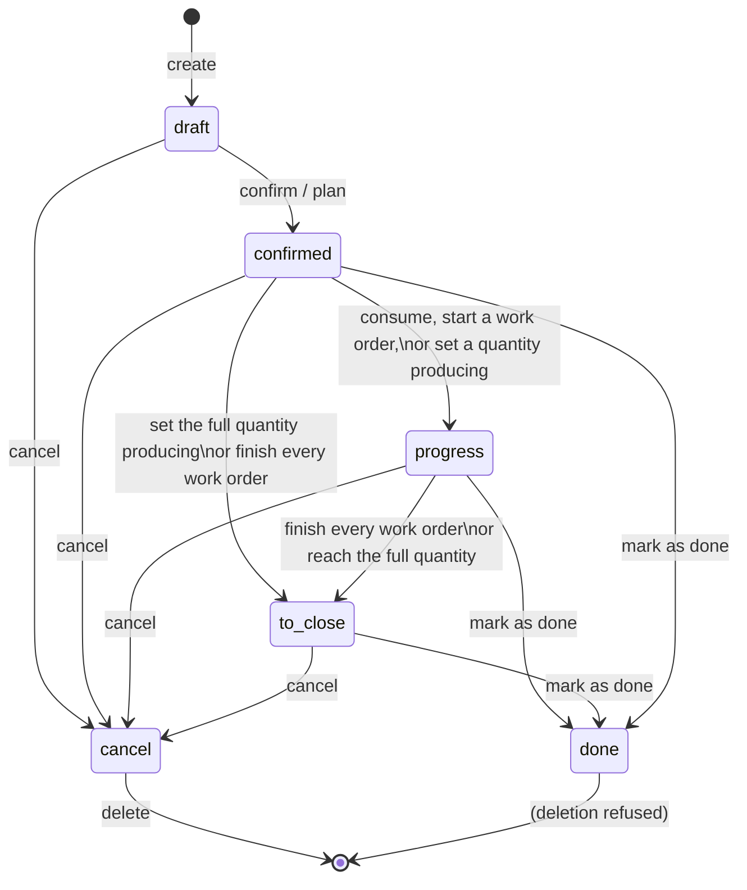
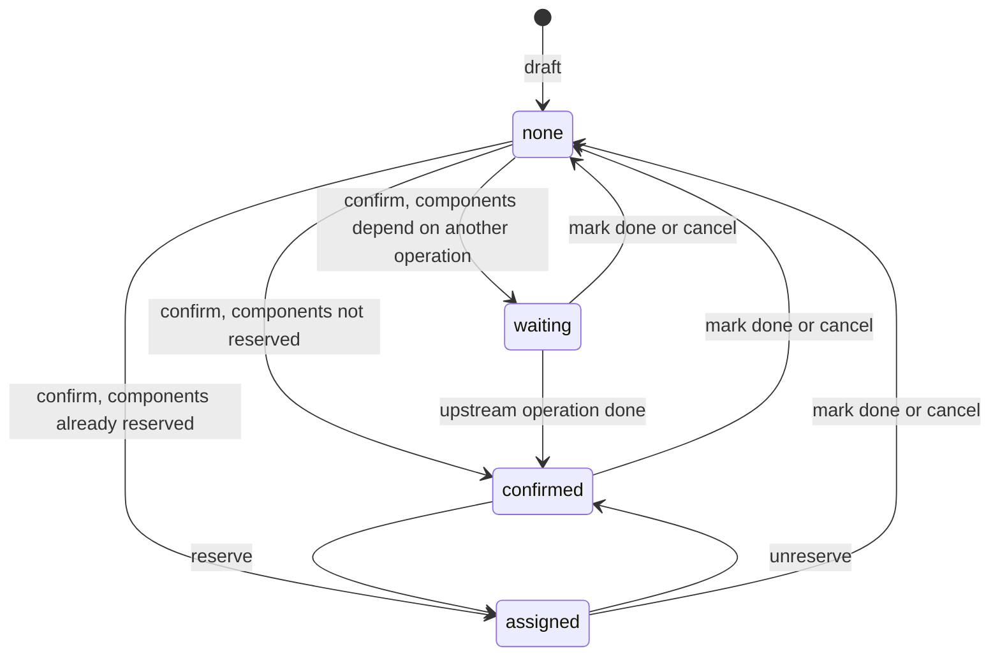
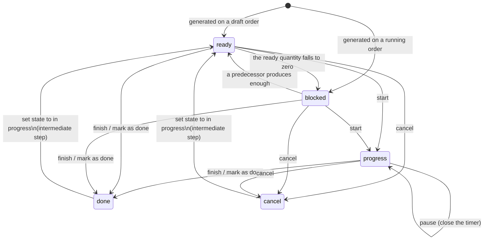
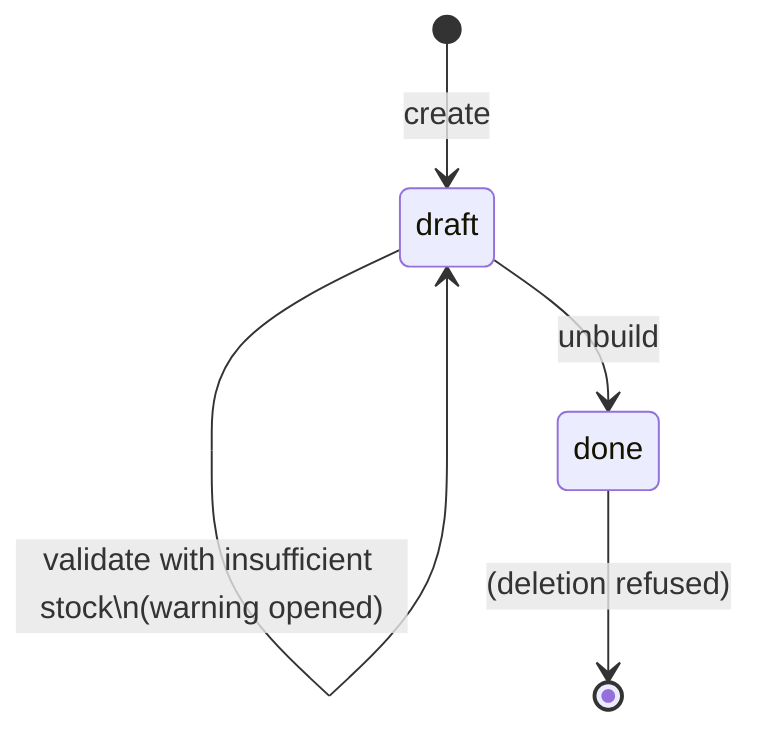
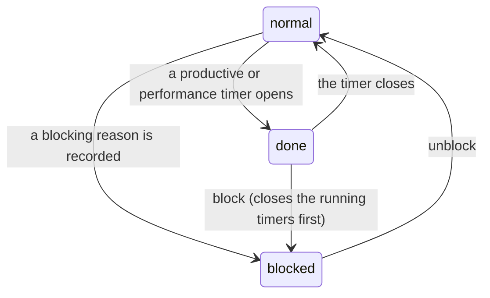

# Manufacturing — State Machines

This file specifies every state field of the manufacturing domain: the list of states with
their stored values, labels and meaning; the transition table giving the source state, the
target state, the triggering operation, the guard conditions and the side effects; and a
diagram of each machine.

Five state fields exist:

| Field | Entity | Nature |
|---|---|---|
| State (`state`) | Manufacturing Order (`mrp.production`) | Computed and stored, with several transitions forced outside the computation. |
| MO Readiness (`reservation_state`) | Manufacturing Order | Computed and stored, derived from the component moves. |
| Status (`state`) | Work Order (`mrp.workorder`) | Computed and stored for two of its values, set explicitly for the other three. |
| Status (`state`) | Unbuild Order (`mrp.unbuild`) | Set explicitly. |
| Workcenter Status (`working_state`) | Work Centre (`mrp.workcenter`) | Computed and stored, derived from the open time logs. |

Two further state fields belong to other domains but are driven from here and are therefore
summarised: the state of a component or finished Stock Move, and the state of the transfers
created by the multi-step manufacturing configurations. Their full specification is in
[inventory operations](../inventory-operations/state-machines.md).

---

## 1. Manufacturing Order state

### 1.1 States

| Value | Label | Meaning |
|---|---|---|
| `draft` | Draft | The order is not confirmed. Its components, finished goods and Work Orders are still regenerated from the recipe on every change. Nothing is reserved and nothing is procured. |
| `confirmed` | Confirmed | The order is confirmed. Component and finished Stock Moves are confirmed, the replenishment rules for the components have been triggered, and reservation may proceed. Nothing has been consumed or produced yet. |
| `progress` | In Progress | At least one unit has been produced or at least one component has been consumed, or at least one Work Order has started or finished. |
| `to_close` | To Close | Production is complete in the sense that either every Work Order is finished or cancelled, or (for an order without Work Orders) the quantity being produced has reached the quantity to produce. The order still has to be closed. |
| `done` | Done | The order is closed. The component moves and the finished moves are posted, the production cost has been computed, and the order is locked. |
| `cancel` | Cancelled | The order has been cancelled. Its unfinished moves are cancelled and it can no longer be confirmed. |

### 1.2 The computation

The stored state is recomputed whenever any of the following changes: the state or the
consumed quantity or the picked flag of a component move, the state of a finished move, the
state of a Work Order, the quantity to produce, or the quantity producing. The computation
evaluates the following conditions **in order** and stops at the first that holds.

1. **Draft.** The current state is empty, or the order unit is empty, or the record has
   neither an identifier nor an original identifier (it is an unsaved draft). Result:
   `draft`.
2. **Cancelled.** The current state is already `cancel`, or the order has finished moves
   and every one of them is cancelled. Result: `cancel`.
3. **Done.** The current state is already `done`, or (the order has component moves and
   every component move is cancelled or done) and every finished move is cancelled or done.
   Result: `done`.

   Note the exact bracketing: the "every finished move is done or cancelled" test applies
   to the second disjunct only, but because it is combined with the already-done test by a
   disjunction, an order already marked done stays done regardless of its moves.
4. **To close.** The order has Work Orders and every one of them is `done` or `cancel`.
   Result: `to_close`.
5. **To close (no Work Orders).** The order has no Work Orders and the quantity producing
   is greater than or equal to the quantity to produce, compared at the order unit's
   precision. Result: `to_close`.
6. **In progress.** Any Work Order is `progress` or `done`, **or** the order unit is set and
   the quantity producing is not zero at that unit's precision, **or** any component move is
   marked picked. Result: `progress`.
7. **Otherwise** the state is left unchanged — which, for a confirmed order with nothing
   yet done, means it stays `confirmed`.

### 1.3 Transitions

| From | To | Trigger operation | Guard conditions | Side effects |
|---|---|---|---|---|
| — | `draft` | Create the order | None | A production group is created and named after the new reference; a reference is allocated from the operation type's sequence; a Stock Reference is created; component moves, finished moves and Work Orders are generated from the recipe. |
| `draft` | `confirmed` | Confirm | Company consistency between the order and its product, operation type, locations and moves. | (1) The consumption policy is copied from the recipe. (2) For a serial-tracked product whose order unit differs from the product's own unit, the quantity and the unit are converted to the product's own unit, and so is the finished move. (3) The procurement method of the component moves is adjusted. (4) Every component and finished move is confirmed without merging. (5) Every Work Order is confirmed, which re-links the dependency chain and the move-to-Work-Order links. (6) The cost mode of every Work Order is copied once from its operation. (7) The scheduler is triggered for the component moves forecast to be short. (8) Every transfer of the production group that is not done or cancelled is confirmed. (9) Only orders that were `draft` are written to `confirmed`: an order already further along (for example a backorder carrying a quantity producing) keeps its state. |
| `draft` | `confirmed` | Plan | The order is not already planned. | The order is confirmed first, then the Work Orders are planned (see §3.6). |
| `draft` or `confirmed` | `progress` | Start | The current state is `confirmed`. | The state is written directly to `progress`. This is the only transition that writes the state outside the computation for this pair. |
| `confirmed` | `progress` | Register a consumption, start a Work Order, or set a quantity producing | Computation rule 6. | None beyond the change that triggered it. |
| `confirmed` or `progress` | `to_close` | Finish the last Work Order, or set the quantity producing to the full quantity | Computation rule 4 or 5. | None. |
| `confirmed`, `progress` or `to_close` | `done` | Mark as done | Sanity checks pass (company consistency and serial-number uniqueness); the consumption check passes or is confirmed; the backorder question is answered. | The full completion algorithm of [workflows.md](workflows.md) §5: backorders are split off, the inventory is posted, the moves with no quantity are set to done with a zero demand rather than cancelled, the finish date becomes the current instant, the priority is reset to `0`, the order is locked, and the state is written to `done`. |
| `confirmed`, `progress` or `to_close` | `done` | Cancel, when the recipe's consumption policy is `flexible` | The order is not already `done` or `cancel` after the cancellation pass. | See the cancel row: a flexible order whose remaining moves are all done or cancelled is written to `done` rather than left in progress. |
| `draft`, `confirmed`, `progress` or `to_close` | `cancel` | Cancel | The order is not `done`; otherwise the operation is refused. | (1) For every component move that is neither done nor cancelled and that has origin moves, an exception activity is prepared on the upstream documents. (2) An activity is logged on the parent order when a child order is cancelled. (3) Every Work Order that is not done or cancelled is cancelled. (4) Every component and finished move that is not done or cancelled is cancelled, with the order-level cancellation check suppressed. (5) Every transfer of the order that is neither done nor cancelled, that has no downstream moves and whose orders are not done, is cancelled. (6) The prepared exception activities are logged, excluding those whose parent is this order itself or a cancelled transfer. (7) Orders whose recipe policy is `flexible` and that are still neither done nor cancelled are written to `done`. |
| `cancel` | — | Delete | Every order in the batch is cancelled. | The order is removed; the Work Orders that are not done are removed first. |
| `done` | `done` | Unlock, edit produced quantity, relock | The order is unlocked. | The quantity of the done finished move for the order's product is rewritten. |

### 1.4 Forbidden transitions and their messages

| Attempted operation | Condition | Message |
|---|---|---|
| Cancel | The order is `done`. | You cannot cancel a manufacturing order that is already done. |
| Delete | The order is `done`. | You cannot delete a manufacturing order that is already done. / Cannot delete a manufacturing order in done state. |
| Delete | The order is not `cancel`. | *the list of order display names* cannot be deleted. Try to cancel them before. |
| Change the start date | The order is `done` or `cancel`. | You cannot move a manufacturing order once it is cancelled or done. |
| Unplan | Any Work Order is `done`. | Some work orders are already done, so you cannot unplan this manufacturing order. It'd be a shame to waste all that progress, right? |
| Unplan | Any Work Order is `progress`. | Some work orders have already started, so you cannot unplan this manufacturing order. It'd be a shame to waste all that progress, right? |
| Split or merge | Any order is not `draft` or `confirmed`. | Only manufacturing orders in either a draft or confirmed state can be *split* / *merged*. |
| Split or merge | Any order has no recipe. | Only manufacturing orders with a Bill of Materials can be *split* / *merged*. |
| Split | The requested amounts exceed the quantity to produce, or the order is `done` or `cancel`. | Unable to split with more than the quantity to produce. |

### 1.5 Diagram



---

## 2. Manufacturing Order readiness

### 2.1 States

| Value | Label | Meaning |
|---|---|---|
| *(empty)* | — | The order is `draft`, `done` or `cancel`; readiness is not meaningful. |
| `confirmed` | Waiting | The components are not sufficiently reserved to start. |
| `assigned` | Ready | The material needed to start production is reserved. |
| `waiting` | Waiting Another Operation | The components depend on another operation that has not completed — the aggregate state of the component moves is `waiting`. |

### 2.2 The computation

Recomputed whenever the order state or the state of a component move changes.

1. If the order state is `draft`, `done` or `cancel`, the readiness is empty. Stop.
2. Select the *relevant* component moves: those that have a product and that are neither
   marked picked nor of zero demand at their unit's precision.
3. Compute the aggregate state among those moves using the shared aggregation rule of the
   inventory domain, extended as follows: when that rule yields `partially_available` and
   the moves belong to a component order and **every** relevant move satisfies at least one
   of
   - it has a positive should-consume quantity and its reserved quantity is greater than or
     equal to that should-consume quantity,
   - its reserved quantity is greater than or equal to its full demand,
   - it is a manual-consumption move already marked picked,

   then the aggregate is upgraded to `assigned`.
4. If the aggregate is `partially_available`:
   - when the order has Work Orders bound to operations **and** the recipe's readiness mode
     is `asap` (when components for the first operation are available), the readiness is
     the first-operation readiness: `assigned` when every component move of the first
     operation that comes from a non-skipped recipe line is in state `assigned`, otherwise
     `confirmed`;
   - otherwise the readiness is `confirmed`.
5. Otherwise, if the aggregate is not `draft`, the readiness is the aggregate value itself
   (`confirmed`, `assigned` or `waiting`).
6. Otherwise the readiness is empty.

### 2.3 Transitions

| From | To | Trigger | Guard | Side effects |
|---|---|---|---|---|
| *(empty)* | `confirmed` / `waiting` | Confirm the order | The component moves become `confirmed` or `waiting`. | None. |
| `confirmed` | `assigned` | Reserve (explicit reserve action, scheduler, or the arrival of an upstream receipt) | Every relevant component move reaches `assigned`, or the partial-availability upgrade applies. | The order becomes startable. |
| `assigned` | `confirmed` | Unreserve | The component move lines are removed. | Unreserving is only offered when no component move is picked. |
| `confirmed` or `assigned` | *(empty)* | Mark done or cancel | The order leaves the running states. | None. |

### 2.4 Diagram



---

## 3. Work Order status

### 3.1 States

| Value | Label | Meaning |
|---|---|---|
| `blocked` | Blocked | Nothing can be produced at this Work Order yet: its ready quantity is zero, because a predecessor has not produced enough. |
| `ready` | To Do | The Work Order has a positive ready quantity and can be started. |
| `progress` | In Progress | The Work Order has been started; a time log may be open. |
| `done` | Finished | The Work Order is finished; its produced quantity and its snapshot hourly cost are fixed. |
| `cancel` | Cancelled | The Work Order will not be executed. |

The default value on creation is `ready`; Work Orders created when a recipe is linked to a
running order are created `blocked`.

### 3.2 The computation

Only `blocked` and `ready` are computed, and only when the Work Order is already in one of
those two states and the order unit is known:

```formula
state = "ready"    when compare( qty_ready , 0 ) > 0 at the order unit's precision
state = "blocked"  otherwise
```

The ready quantity depends on the produced quantities and states of the predecessors, so
finishing a predecessor automatically releases its successors.

### 3.3 Transitions

| From | To | Trigger operation | Guard conditions | Side effects |
|---|---|---|---|---|
| — | `ready` or `blocked` | Generate from the recipe on a draft order | None. | Created with state `ready`; the computation immediately reduces it to `blocked` when the ready quantity is zero. |
| — | `blocked` | Generate when a recipe is linked to a running order | The order is neither draft, nor done, nor cancelled. | Created with state `blocked`. |
| `blocked` | `ready` | A predecessor produces units | The ready quantity becomes positive. | None. |
| `ready` | `blocked` | A predecessor is unwound, or the quantities change | The ready quantity becomes zero or negative. | None. |
| `blocked` or `ready` | `progress` | Start | No work centre of the batch is blocked; the Work Order is not already done or cancelled. | (1) When the acting user already has an open time log on the Work Order, nothing further happens for that Work Order. (2) When the quantity producing is zero it is set to the remaining quantity. (3) A time log is opened for the acting user with the appropriate loss reason. (4) When the order is not yet `progress`, the order's start date is set to the current instant. (5) If there is no calendar slot, one is created from now to now plus the expected duration, and the Work Order's planned finish and slot are written. (6) If there is a slot, the planned finish is recomputed when the current start is missing or later than now, and forced to now when it was already in the past; the write bypasses the duration recomputation. (7) The state becomes `progress`. |
| `progress` | `progress` | Pause | None. | The acting user's open time log is closed, splitting off the over-performance part if any. |
| `blocked`, `ready` or `progress` | `done` | Finish | None (the mark-as-done variant additionally refuses when the work centre is blocked). | (1) Component moves of the Work Order that are not picked, and by-product moves of the order whose operation belongs to the finished Work Orders and that are not picked, are given a quantity of `round_at_move_unit( available_quantity × unit_factor )`, where the available quantity is the order's quantity producing, or the order's quantity to produce when the quantity producing is zero; they are then marked picked. (2) Every open time log on the Work Order is closed. (3) The produced quantity becomes the first non-zero of: the current produced quantity, the quantity producing, the original production quantity. (4) The state becomes `done`, the finish date becomes the current instant, and the hourly cost is snapshotted from the work centre. (5) When the Work Order had no start, or the finish is earlier than the start, the start is set to the finish. |
| `done` | `done` | Mark as done (explicit) | The work centre is not blocked, otherwise **"Please unblock the work center to validate the work order"**. | In addition to the finish behaviour, when the real duration is zero it is set to the expected duration and the deviation is set to 100. |
| any except `cancel` | `cancel` | Cancel | None. | The calendar slot is deleted, every open time log is closed, and the state becomes `cancel`. |
| `done` or `cancel` | `ready` | Set state to `progress` through the generic state setter | The order is not done. | The Work Order is first written to `ready` as an intermediate step, then started. |
| any | — | Delete | None. | The Work Order link is cleared from its moves, its calendar slot is deleted, its predecessors are rewired to its successors, its time logs are closed, and the remaining Work Orders of the affected running orders are re-linked. |

### 3.4 Forbidden transitions and their messages

| Attempted operation | Condition | Message |
|---|---|---|
| Start | The work centre's working state is `blocked`. | Please unblock the work center to start the work order. |
| Start | The Work Order is `done` or `cancel` and the caller does not tolerate an invalid state. | You cannot start a work order that is already done or cancelled |
| Mark as done | The work centre's working state is `blocked`. | Please unblock the work center to validate the work order |
| Change the produced quantity | The Work Order is `done` or `cancel`. | You cannot change the quantity produced of a work order that is in done or cancel state. |
| Change the produced quantity | The value is negative at the order unit's precision. | The quantity produced must be positive. |
| Change the work centre | The Work Order is `done` or `cancel`. | You cannot change the workcenter of a work order that is done. |
| Change the order | The new order differs from the current one. | You cannot link this work order to another manufacturing order. |
| Clear the planned finish while a start remains | — | It is not possible to unplan one single Work Order. You should unplan the Manufacturing Order instead in order to unplan all the linked operations. |
| Plan | No work centre among the Work Order's work centre and its alternatives has a working schedule. | There is no defined calendar on workcenter *the work centre name*. |
| Plan | No work centre offers a slot within 700 days. | Impossible to plan the workorder. Please check the workcenter availabilities. |
| Create a dependency | The dependency graph would contain a cycle. | You cannot create cyclic dependency. |
| Start twice | Two open time logs for the same user on the same Work Order. | The Workorder (*the work order display name*) cannot be started twice! |

### 3.5 Diagram



### 3.6 Planning as a state-adjacent operation

Planning does not change the Work Order status, but it creates the calendar slot that
carries the planned window, so it is specified here.

**Planning one Work Order** (recursive, driven from the final Work Orders backwards):

1. Let the tentative start be the later of the order's start date and the current instant.
2. For each predecessor: plan it first (recursively); if its planned finish is later than
   the tentative start, move the tentative start to it.
3. If the Work Order's state is not `blocked` or `ready`, stop — a started, finished or
   cancelled Work Order is not replanned.
4. If the Work Order already has a calendar slot: when this is a replan, delete the slot;
   otherwise stop.
5. Consider the Work Order's work centre together with its alternatives. For each of them:
   - if it has no working schedule, fail with **"There is no defined calendar on workcenter
     *the work centre name*."**;
   - the duration to place is the Work Order's expected duration for its own work centre,
     and the alternative-adjusted expected duration for an alternative (see
     [calculations.md](calculations.md) §5.3);
   - ask that work centre for the first available slot of that duration starting at the
     tentative start; skip the work centre when no slot is found;
   - keep the candidate whose slot ends earliest.
6. If no candidate was found at all, fail with **"Impossible to plan the workorder. Please
   check the workcenter availabilities."**
7. Create a calendar slot on the winning work centre's working schedule, named after the
   Work Order, spanning the winning window, against that work centre's resource, of leave
   kind `other`, and write the winning work centre, the adjusted expected duration and the
   slot onto the Work Order.

**Planning an order**: if the order has no Work Orders, it is simply marked planned. Otherwise
the Work Orders and moves are re-linked, then every Work Order with no successor is planned
(which recursively plans its predecessors), and finally the order's start becomes the
earliest slot start and its finish the latest slot end, over the Work Orders that are not
done or cancelled, with the date guard bypassed.

**Unplanning an order**: refused when any Work Order is done or in progress (messages in
§1.4); otherwise every calendar slot is deleted, every Work Order's planned start and finish
are cleared, and the order's planned flag becomes false.

---

## 4. Unbuild Order status

### 4.1 States

| Value | Label | Meaning |
|---|---|---|
| `draft` | Draft | The unbuild has been prepared but not executed. Nothing has moved. |
| `done` | Done | The unbuild has been executed: the finished product and the by-products have been consumed, and the components have been returned. |

### 4.2 Transitions

| From | To | Trigger | Guard conditions | Side effects |
|---|---|---|---|---|
| — | `draft` | Create | None. | A reference is allocated from the sequence coded `mrp.unbuild`. |
| `draft` | `draft` | Validate | The on-hand quantity of the product at the source location for the chosen lot, compared strictly, is **less** than the quantity to unbuild converted into the product's own unit. | The insufficient-quantity warning is opened instead of performing the unbuild. |
| `draft` | `done` | Validate (sufficient quantity) or confirm the warning | Company consistency; a lot is provided when the product is tracked; the source order, if any, is `done`. | The full unbuild algorithm of [workflows.md](workflows.md) §9: the consume moves and the produce moves are created and confirmed, lots are matched, all of them are marked picked and posted, the returned lines are linked to the consumed lines for traceability, and a note is posted on the source order. |
| `done` | — | Delete | Refused. | **"You cannot delete an unbuild order if the state is 'Done'."** |

### 4.3 Forbidden transitions and their messages

| Attempted operation | Condition | Message |
|---|---|---|
| Unbuild | The product's tracking is not `none` and no lot is set. | You should provide a lot number for the final product. |
| Unbuild | A source order is named and it is not `done`. | You cannot unbuild a undone manufacturing order. |
| Unbuild | A component or by-product move to create is tracked and no source order is named. | Please specify a manufacturing order. It will allow us to retrieve the lots/serial numbers of the correct components and/or byproducts. |
| Create | The quantity is not strictly positive. | The quantity to unbuild must be positive! |

### 4.4 Diagram



---

## 5. Work Centre working state

### 5.1 States

| Value | Label | Meaning |
|---|---|---|
| `normal` | Normal | The work centre has no open time log: it is idle. |
| `done` | In Progress | The work centre has an open time log whose loss category is `productive` or `performance`: it is being used. |
| `blocked` | Blocked | The work centre has an open time log whose loss category is `availability` or `quality`: it is stopped for a reason. |

### 5.2 The computation

Recomputed when the time logs, their end dates or their loss categories change.

1. Read every time log of the work centres concerned that has no end date. Keep the first
   one found per work centre.
2. No such log → `normal`.
3. Category `productive` or `performance` → `done`.
4. Otherwise → `blocked`.

### 5.3 Transitions

| From | To | Trigger | Guard | Side effects |
|---|---|---|---|---|
| `normal` | `done` | Start a Work Order at the work centre | A productive or performance time log is opened. | The Work Order becomes `progress`. |
| `normal` or `done` | `blocked` | Record a blocking reason with no end date | The reason's category is `availability` or `quality`. | When the block is raised through the blocking action, every open time log on every Work Order of that work centre is closed first. |
| `done` | `normal` | Close the open productive log | — | Closing may split the log into a productive part and a performance part (see [entities.md](entities.md) §10.3). |
| `blocked` | `normal` | Unblock | The state is `blocked`; otherwise **"It has already been unblocked."** | Every open time log of the work centre is given the current instant as its end date. |

### 5.4 Diagram



---

## 6. Driven state machines in other domains

### 6.1 Component and finished Stock Moves

The component and finished moves of an order follow the generic Stock Move state machine
(`draft` → `waiting` / `confirmed` → `partially_available` → `assigned` → `done`, with
`cancel` reachable from every non-done state). Manufacturing drives them as follows:

| Order event | Effect on component moves | Effect on finished moves |
|---|---|---|
| Create the order (draft) | Created `draft`. | Created `draft`. |
| Confirm | Procurement method adjusted, then confirmed without merging: each becomes `waiting` when it has an unfinished origin move and its method is make-to-order, otherwise `confirmed`, and immediately `assigned` or `partially_available` if the operation type reserves at confirmation. | Confirmed; they become `waiting` because their origin is the production itself. |
| Add a move to a running order | Confirmed automatically and the scheduler is triggered. | Same. |
| Reserve | `confirmed` → `partially_available` or `assigned`. | Not reserved: a finished move is produced, not picked. |
| Unreserve | `assigned` or `partially_available` → `confirmed`. Only allowed when no component move is picked; by-product moves are excluded from unreservation. | By-product moves are excluded. |
| Post the inventory | Component moves that are done stay done; those that are picked are posted to `done`; those that are not picked are cancelled. | All finished moves that are not already done or cancelled are marked picked and posted to `done`. |
| Mark done without a backorder | Any remaining component or finished move that is neither done nor cancelled is written to `done` with a demand of zero — deliberately **not** cancelled, so that a later edit of the consumed quantity does not fight a cancelled move. | Same. |
| Cancel the order | Every component move that is not done or cancelled is cancelled. | Every finished move that is not done or cancelled is cancelled. |
| Cancel every component move directly | When every component move of an order becomes cancelled, and the caller has not suppressed the order check, the order itself is cancelled. | — |

### 6.2 Transfers of the multi-step configurations

In a two-step configuration a *Pick Components* transfer moves the components from stock to
the pre-production location; in a three-step configuration a *Store Finished Product*
transfer additionally moves the finished goods from the post-production location to stock.
These transfers follow the generic transfer state machine. Manufacturing drives them:

- confirming the order confirms every transfer of its production group that is not done or
  cancelled;
- cancelling the order cancels the transfers of the group that are not done or cancelled,
  have no downstream moves, and belong to no done order;
- merging orders re-stamps the production group of every move of the merged orders onto the
  surviving order's group, so the transfers follow the survivor.

---

## 7. Cross-machine invariants

These must hold at all times in a correct implementation.

1. An order in state `done` or `cancel` has an empty readiness.
2. An order whose finished moves are all cancelled is `cancel`.
3. An order that is `done` has no component or finished move in a state other than `done` or
   `cancel`.
4. A Work Order in state `done` or `cancel` has a ready quantity of zero.
5. A Work Order in state `progress` has, or has had, at least one time log.
6. A planned Work Order (one with a calendar slot) has both a planned start and a planned
   finish; a Work Order with a planned start and no planned finish cannot be saved.
7. An order is planned exactly when at least one of its Work Orders has both dates; an order
   with no Work Orders is planned only by the explicit planning operation and never by the
   computation.
8. A work centre whose working state is `blocked` refuses to start or validate any of its
   Work Orders.
9. An Unbuild Order in state `done` has, for every consumed and returned move, state `done`.
10. The sum of the quantities to produce of an order and of all of its backorders in the same
    production group equals the quantity to produce of the original order before the first
    split, except where a split was performed with the remainder deliberately cancelled.
