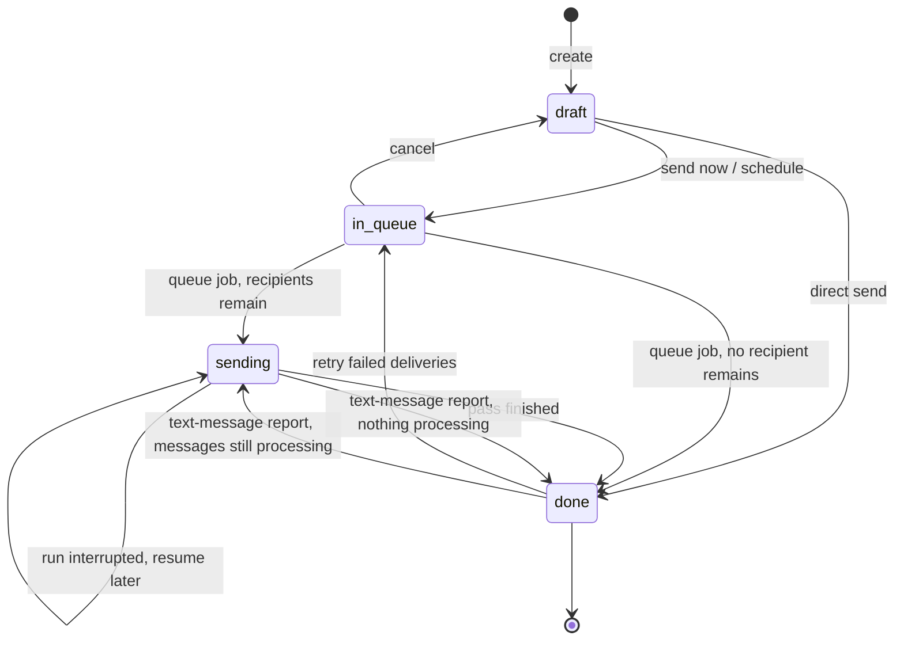
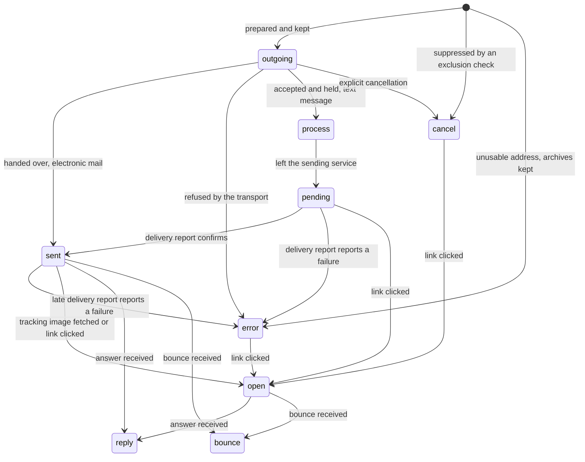
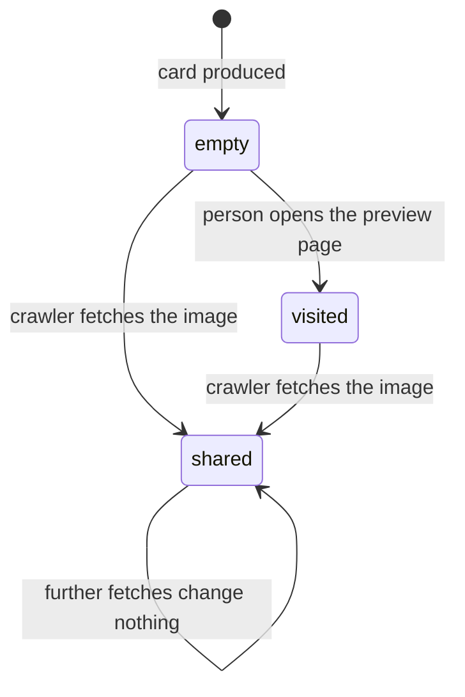
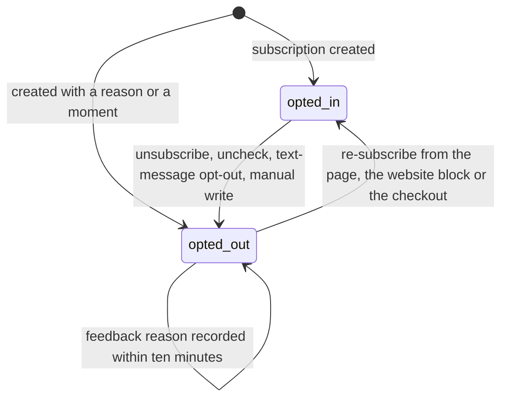
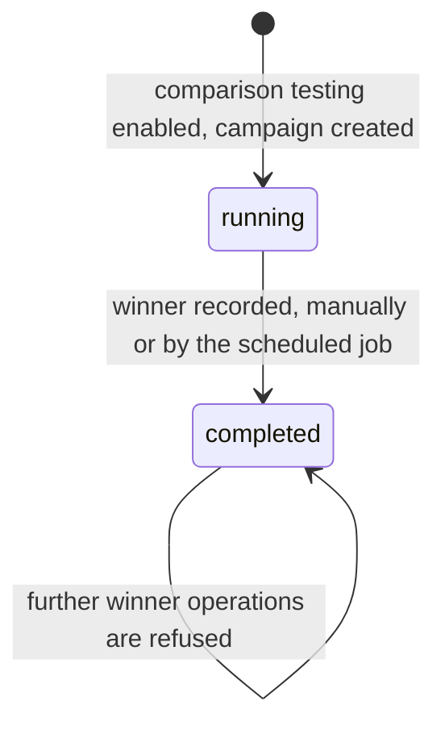

# Marketing state machines

Every state field of this domain, with the complete list of its states, the meaning of each state,
the complete transition table, the guards of each transition in the order in which they are
evaluated together with the exact refusal message, and a diagram of the machine.

Six machines exist. Four of them are stored selections; the other two are stored conditions with
exactly two values whose transitions carry enough behaviour that this document treats each of them
as a machine of its own.

| Machine | Entity | Field | Kind |
|---|---|---|---|
| The mailing life cycle | Mass Mailing | `state` | selection of four values |
| The delivery status | Mailing Trace | `trace_status` | selection of nine values |
| The share status | Marketing Card | `share_status` | selection of two values plus the empty value |
| The reported mailing state | Mailing Trace Report | `state` | selection of three values, derived |
| The opt-out condition | Mailing Subscription | `opt_out` | condition with two values |
| The comparison-test completion | Campaign | `ab_testing_completed` | condition with two values, derived and stored |

Conventions used below: a stored value is reproduced in code font; a verbatim refusal message is
reproduced between quotation marks with its placeholders described in words; "now" means the
current database moment expressed in coordinated universal time.

---

## 1. The mailing life cycle

The state of a Mass Mailing answers one question: has this message left, is it about to leave, is
it leaving, or has it finished leaving. It never records success or failure; success and failure
are recorded per recipient by the delivery status of section 2.

### 1.1 States

| Stored value | Label | Meaning |
|---|---|---|
| `draft` | Draft | The mailing is being written. Nothing has been handed to any transport. It may be edited freely, tested, duplicated, archived and deleted. This is the creation default. |
| `in_queue` | In Queue | The mailing has been released by its author. The queue job will pick it up at its next run, at the earliest at its schedule date. No delivery record exists yet unless a previous pass created some. |
| `sending` | Sending | The queue job has found remaining recipients and has started, or resumed, the batch loop. Delivery records exist for the recipients already processed. A run interrupted by a time limit leaves the mailing in this state. |
| `done` | Sent | The mailing has no remaining recipient. The sent moment is filled. Delivery records may still change status afterwards, because opens, clicks, answers, bounces and text-message delivery reports arrive later. |

The four values are also the grouping columns of the board, and empty groups are displayed, so a
board always shows the four columns even when one of them holds no mailing.

Archiving is orthogonal to this machine. Setting the archiving flag never changes the state, and a
mailing may be archived in any of the four states.

### 1.2 Transitions

| From | To | Trigger | Guards, in order | Records created or changed |
|---|---|---|---|---|
| `draft` | `in_queue` | The author presses Send and confirms the dialogue | G1, G2, G3 | `schedule_type` is written to `now`, which empties `schedule_date`; `state` becomes `in_queue`; the queue job receives a wake request for now; `calendar_date` becomes the next departure. |
| `draft` | `in_queue` | The author presses Schedule while a schedule date strictly later than now is already stored | G1, G2, G3 | `state` becomes `in_queue`; the queue job receives a wake request for the schedule date; `calendar_date` becomes the schedule date. |
| `draft` | `draft` | The author presses Schedule with no schedule date, or with one that is not later than now | none | No change; the schedule assistant opens instead. |
| `draft` | `in_queue` | The author confirms the schedule assistant | G1, G2, G3 | `schedule_type` becomes `scheduled` and `schedule_date` the chosen moment on the mailing; then the same effects as the previous row. |
| `draft` | `done` | An operation sends the mailing directly, without queueing: the comparison-test winner send, and the send performed by the message composer when it created the mailing itself | G4 | The whole sending algorithm runs in one pass; `sent_date` becomes now; the statistics flag is set when there was no previous sent date. |
| `in_queue` | `draft` | The author presses Cancel | none | `state` becomes `draft`; `schedule_date` is cleared; `schedule_type` becomes `now`; the next-departure value is cleared. Delivery records already created are **kept**. |
| `in_queue` | `sending` | The queue job reaches the mailing and at least one recipient remains | G5 | `state` becomes `sending`; the batch loop starts. |
| `in_queue` | `done` | The queue job reaches the mailing and no recipient remains | G5 | `state` becomes `done`; `sent_date` becomes now; the statistics flag becomes true when there was no previous sent date. |
| `sending` | `done` | The batch loop finishes its pass | none | `state` becomes `done`; `sent_date` becomes now; the statistics flag becomes true when there was no previous sent date; outside automated tests the transaction is committed immediately. |
| `sending` | `sending` | The queue job is interrupted by its time budget or by an error | none | Nothing is written. The delivery records already created stay, and the next run resumes with the recipients that have none. |
| `sending` | `sending` | A text-message delivery report arrives reporting that at least one message is being processed | none | `state` is written to `sending` by the provider tracker even when the mailing had already reached `done`. |
| `sending` | `done` | A text-message delivery report arrives and the mailing has no delivery record left in status `process` | The mailing is not already `done` | `state` becomes `done`; `sent_date` becomes now; the statistics flag is set when there was no previous sent date. |
| `done` | `in_queue` | The author presses Retry | G6 | The outgoing messages of the mailing whose state is the failure state are deleted in pages of 1000, together with their delivery records; then the queueing transition runs and the queue job is woken for now. |
| `done` | new record in `draft` | The author presses Duplicate | none | A new Mass Mailing is created in `draft`; see [workflows.md](workflows.md#11-duplicate-a-mailing-and-manage-favorite-designs). The original is unchanged. |

### 1.3 Guards, with their refusal messages

| Guard | Condition that must hold | Message shown when it does not |
|---|---|---|
| G1 | The mailing carries a body. The form marks the inline body required as soon as the editable body is filled. | The standard required-field refusal of the platform, naming the body field. |
| G2 | When the mailing carries a Marketing Card Campaign, no recipient of the current condition may lack an up-to-date card, that is, the card-synchronisation counter must be zero. | *"You should update all the cards for %(mailing)s before scheduling a mailing."* The placeholder is the display name of the mailing. |
| G3 | The author confirms the dialogue titled *"Ready to unleash emails?"*, whose body is *"Once you send these emails, they'll be making a grand entrance in all the inboxes, creating quite the buzz!"* and whose confirmation button is labelled *"Send to all"*. Dismissing the dialogue leaves the state unchanged. | No message; the operation is simply abandoned. |
| G4 | The remaining audience is not empty, unless the caller supplied explicit recipient keys. | *"There are no recipients selected."* |
| G5 | The queue job only selects mailings whose state is `in_queue` or `sending` **and** whose schedule date is empty or strictly earlier than now. | No message; a mailing that fails the condition is simply not selected in this run. |
| G6 | At least one outgoing message of the mailing is in the failure state. The Retry button is only offered when the failure counter is greater than zero. | No message; the button is hidden. |

Guard G4 is never reached from the queue job, because the job counts the remaining recipients first
and closes the mailing as `done` instead of refusing. It is reached from the direct send path and
from the comparison-test winner send.

### 1.4 Diagram

### 1.5 States reachable only automatically

`sending` can be entered only by the queue job or by a text-message delivery report; no button
writes it. `done` can be entered by the queue job, by the end of a direct send and by a
text-message delivery report; no button writes it either. `draft` and `in_queue` are the only two
states a person writes directly.

---

## 2. The delivery status of a Mailing Trace

One Mailing Trace exists per recipient record of a mailing. Its status is the measurement of that
one delivery. Two of the labels are deliberately shifted with respect to their stored values: the
stored value `pending` is displayed as "Sent" and the stored value `sent` is displayed as
"Delivered". Every formula in [calculations.md](calculations.md) uses the stored values.

### 2.1 States

| Stored value | Label | Meaning |
|---|---|---|
| `outgoing` | Outgoing | The delivery record has been created and the message has not yet been handed to the transport. Creation default. |
| `process` | Processing | A text message has been accepted by the sending service and is held by it before actual sending. Not used for electronic mail. |
| `pending` | Sent | A text message has left the sending service; the delivery report has not arrived yet. Not used for electronic mail. |
| `sent` | Delivered | An electronic mail was handed to the relay without error, or a text message was confirmed delivered by its report. |
| `open` | Opened | The tracking image was fetched, or a link of the message was clicked, or an answer arrived. |
| `reply` | Replied | An answer to the message arrived through the incoming gateway. |
| `bounce` | Bounced | A bounce notification arrived, or the destination number was rejected by its format. |
| `error` | Exception | The delivery failed with a technical failure type; the failure type says which. |
| `cancel` | Cancelled | The message was suppressed before being handed over: blocked address or number, opted out, duplicate inside the run, or an unusable address on a mailing that does not keep archives. |

The failure type that accompanies the statuses `bounce`, `error` and `cancel` is enumerated in
[entities.md](entities.md#64-failure-types) with its twenty-nine values.

### 2.2 Transitions

| From | To | Trigger | Guards | Records created or changed |
|---|---|---|---|---|
| (creation) | `outgoing` | The sending algorithm prepares a message that passes every exclusion check | none | The delivery record is created with an empty sent moment. |
| (creation) | `cancel` | The sending algorithm prepares a message that fails an exclusion check producing a cancellation | none | The delivery record is created with the failure type of the check; no outgoing message is created. |
| (creation) | `error` | The sending algorithm prepares a message with a missing or unusable address on a mailing that keeps archives | none | The delivery record is created with the failure type of the check. |
| `outgoing` | `sent` | The outgoing message was handed to the relay without error | none | `trace_status` becomes `sent`; `sent_datetime` becomes now; the failure type is cleared. |
| `outgoing` | `error` | The outgoing message was refused by the relay or by the sending service | none | `trace_status` becomes `error`; the failure type is the reported code; the failure reason is the reported text. |
| `outgoing` | `process` | The sending service accepted the text message and holds it | The trace is not already in `process`, `pending` or `sent` | `trace_status` becomes `process`. The mailing is written to `sending`. |
| `process` | `pending` | The sending service reports that the text message has left | The trace is not already in `pending` or `sent` | `trace_status` becomes `pending`; `sent_datetime` is filled when it was empty. |
| `pending` | `sent` | The delivery report confirms delivery | The trace is not already in `sent` | `trace_status` becomes `sent`; `sent_datetime` is filled when it was empty. |
| `pending`, `sent` | `error` | The delivery report reports a failure | The trace is not already in `error` | `trace_status` becomes `error`; the failure type and the failure reason are written. |
| any except `open` and `reply` | `open` | The tracking image is fetched, or a link of the message is clicked | The current status is neither `open` nor `reply` | `trace_status` becomes `open`; `open_datetime` becomes now. |
| any | unchanged | A link of the message is clicked | none | `links_click_datetime` becomes now, overwriting any previous value. The open transition above is attempted first. |
| any | `reply` | An answer arrives through the incoming gateway and its reference headers name this message | none | `trace_status` becomes `reply`; `reply_datetime` becomes now. The open transition is attempted first, so a first answer stamps both moments. |
| any | `bounce` | A bounce notification arrives naming this message, or the destination number format is rejected | none | `trace_status` becomes `bounce`; the failure type becomes `mail_bounce` for electronic mail and `sms_number_format` for a text message; the failure reason becomes the plain-text bounce body. |
| any | `cancel` | An explicit cancellation is performed on the delivery record | none | `trace_status` becomes `cancel`. |
| any | (deleted) | The author presses Retry on the mailing, or the mailing is deleted | none | The delivery record is deleted. Its recipient is therefore no longer "already contacted" and will be prepared again. |

### 2.3 Ordering rules that a rebuild must reproduce

1. Marking a delivery record opened never downgrades a record that is already `open` or `reply`.
   The operation explicitly skips those two statuses, so an open notification arriving after an
   answer does not erase the answer.
2. Marking a delivery record clicked never changes the status by itself. It only stamps the
   last-click moment, and it always overwrites it, so the stored moment is the **latest** click and
   not the first.
3. Marking a delivery record sent clears the failure type, so a successful retry leaves no stale
   failure code behind.
4. A text-message delivery report is ignored when the record is already in a status at least as
   advanced. The ignore sets are listed in
   [entities.md](entities.md#2811-text-message-tracker-messaging-and-activities).
5. A cancelled or failed record still counts in the *expected* counter of the mailing, which is why
   the percentage denominators of [calculations.md](calculations.md#1-the-five-mailing-indicators)
   subtract them explicitly.

### 2.4 Diagram

The transitions out of `cancel` and `error` into `open` are unusual but real: the open and click
operations select their records by search condition and do not exclude those statuses, so a person
who receives a message through another channel and clicks its tracked link still marks the record
opened.

---

## 3. The share status of a Marketing Card

### 3.1 States

| Stored value | Label | Meaning |
|---|---|---|
| (empty) | — | The card has been produced but nobody has opened its page. This is the creation default. |
| `visited` | Visited | The person opened their own preview page at least once. |
| `shared` | Shared | A recognised social-network crawler fetched the card image, which is the only evidence available that the person actually posted it. |

### 3.2 Transitions

| From | To | Trigger | Guards | Records changed |
|---|---|---|---|---|
| empty | `visited` | The person opens the preview page of the card | The current status is empty | `share_status` becomes `visited`, written with elevated rights because the visitor is anonymous. |
| empty or `visited` | `shared` | A recognised crawler fetches the card image | The current status is not already `shared` | `share_status` becomes `shared`, written with elevated rights. |
| `shared` | `shared` | Any further visit or fetch | none | Nothing changes. The status is never downgraded. |

The recognised crawler agents are `Facebot`, `facebookexternalhit`, `Twitterbot`, `LinkedInBot`,
`WhatsApp`, `Pinterest` and `Pinterestbot`; the test is a substring match on the agent string of
the request.

### 3.3 Effect on the campaign counters

| Counter | Cards counted |
|---|---|
| `card_count` | every card of the campaign |
| `card_click_count` | cards whose status is `visited` **or** `shared` |
| `card_share_count` | cards whose status is `shared` |

A shared card therefore counts once in the visit counter and once in the share counter.

### 3.4 Diagram

---

## 4. The reported mailing state

The Mailing Trace Report is a read-only analytical view with no table of its own. It exposes a
state of its own with three values, which is **not** the same enumeration as the mailing state.

| Stored value | Label | Meaning |
|---|---|---|
| `draft` | Draft | The underlying mailing has not been sent. |
| `test` | Tested | Reserved for rows produced by test sends. |
| `done` | Sent | The underlying mailing has finished sending. |

There are no transitions to specify: the value is derived when the view is read and never written.
A rebuild must nevertheless expose the three values, because they are the grouping values offered
by the analysis screen. The mapping from the mailing life cycle is: `draft`, `in_queue` and
`sending` are reported as `draft`; `done` is reported as `done`; the value `test` is produced only
for rows whose delivery records are flagged as test traces.

---

## 5. The opt-out condition of a Mailing Subscription

A Mailing Subscription is the membership of one Mailing Contact in one Mailing List. It carries a
two-valued condition that behaves as a small machine because each transition writes a moment and a
reason and posts a note.

### 5.1 States

| Value | Meaning |
|---|---|
| opted in (`opt_out` false) | The contact accepts messages sent to this list. Creation default. |
| opted out (`opt_out` true) | The contact refused further messages from this list. The moment of the refusal and, usually, its reason are stored. |

### 5.2 Transitions

| From | To | Trigger | Guards | Records changed |
|---|---|---|---|---|
| opted in | opted out | The recipient unsubscribes from a message addressed to lists | The credential check of [workflows.md](workflows.md#18-credential-check-for-the-public-pages) passes | Every opted-in subscription of every contact carrying the resolved address, on every list of the mailing, is written to opted out; `opt_out_datetime` becomes now; a note is posted on each affected contact reading *"<contact display name> unsubscribed from the following mailing list(s)"* followed by a bulleted list of the list names. |
| opted in | opted out | The recipient clears a checkbox on the subscription-management page and applies the change | Same credential check | Same effects, restricted to the lists that were unchecked. |
| opted in | opted out | The recipient opts out of a text-message mailing addressed to lists | The trace code and the sanitised number match | Every subscription of the mailing's lists whose contact carries that number is written to opted out. |
| opted in | opted out | A marketing user writes the opt-out flag, the opt-out moment or the opt-out reason on the subscription | none | Writing either the moment or the reason forces the flag to true, on creation and on write. `opt_out_datetime` becomes now when it was empty. |
| opted out | opted in | The recipient ticks a checkbox on the subscription-management page and applies the change | The list is public, or the person already belongs to it | The subscription is written to opted in; `opt_out_datetime` is cleared; a note is posted reading *"<contact display name> subscribed to the following mailing list(s)"* followed by the bulleted names. |
| opted out | opted in | The visitor subscribes again through the website block, the pop-up or the checkout option | The human-verification token is accepted | The existing opted-out subscription is switched back to opted in. |
| opted out | opted out | The recipient submits a feedback reason within ten minutes of the opt-out | A reason must be chosen, otherwise the answer is the string `error` | The chosen reason is written on every subscription of the address opted out in the last ten minutes; the free text, when given, is posted as a message on the contacts. |
| (creation) | opted out | A subscription is created with an opt-out moment or an opt-out reason | none | The flag is forced to true at creation. |

### 5.3 Diagram

### 5.4 The rule that makes two contacts with one address consistent

Opting out is recorded per subscription, and two Mailing Contacts may deliberately carry the same
address. The exclusion computation therefore treats an address as opted out only when it is opted
out of at least one of the mailing's lists **and** opted in to none of them. On the public page the
same tie-break applies the other way round: a list that appears both in the opted-in set and in the
opted-out set is shown as opted in.

---

## 6. The completion condition of a comparison-test Campaign

A Campaign that carries comparison-test versions has a stored, derived condition that closes the
test once and for all.

### 6.1 States

| Value | Meaning |
|---|---|
| running (`ab_testing_completed` false) | No winner has been recorded. Versions may still be sent, compared and promoted. Creation default. |
| completed (`ab_testing_completed` true) | A winner mailing has been recorded on the campaign. No further winner may be selected, automatically or manually. |

### 6.2 Transitions

| From | To | Trigger | Guards, in order | Records created or changed |
|---|---|---|---|---|
| running | completed | The author presses "Send this as winner" on a version | G7, G8, G9, G10 | The winning version is duplicated with a comparison-test percentage of 100 and the name *" <original name> (final)"*; the campaign records that copy as its winner, which makes the condition true; the copy is queued immediately; the copy is opened in a form. |
| running | completed | The comparison-test job reaches the campaign's scheduled moment | G8, G9, G11 | The same effects, the winner being the version with the highest value of the campaign's criterion among the versions in state `done`. |
| completed | completed | Any further winner operation | — | Refused by guard G8. |

### 6.3 Guards, with their refusal messages

| Guard | Condition that must hold | Message shown when it does not |
|---|---|---|
| G7 | Comparison testing is enabled on the mailing being promoted. | *"A/B test option has not been enabled"* |
| G8 | The campaign is not already completed. | *"To send the winner mailing the campaign should not have been completed."* |
| G9 | All the mailings passed to the winner operation share exactly one campaign. | *"To send the winner mailing the same campaign should be used by the mailings"* |
| G10 | A campaign exists at all, which is also the guard of the version-comparison screen. | *"No mailing campaign has been found"* |
| G11 | With a criterion other than manual selection, at least one version of the campaign has reached the state `done`. | *"No mailing for this A/B testing campaign has been sent yet! Send one first and try again later."* |

The automatic job skips a campaign that fails G11 rather than raising, so an unattended campaign
whose versions were never sent simply waits.

### 6.4 Diagram

---

## 7. Where each machine is exercised

| Machine | Procedures that drive it |
|---|---|
| Mailing life cycle | [workflows.md](workflows.md#4-send-immediately), [workflows.md](workflows.md#5-schedule-for-later), [workflows.md](workflows.md#6-queue-processing), [workflows.md](workflows.md#7-the-sending-algorithm), [workflows.md](workflows.md#13-cancel-and-retry) |
| Delivery status | [workflows.md](workflows.md#7-the-sending-algorithm), [workflows.md](workflows.md#20-open-tracking-view-in-browser-and-the-statistics-message), [workflows.md](workflows.md#21-click-tracking-and-redirection), [workflows.md](workflows.md#27-bounce-and-answer-handling) |
| Share status | [workflows.md](workflows.md#26-marketing-cards-end-to-end) |
| Reported mailing state | [interfaces.md](interfaces.md#7-analytical-screens) |
| Opt-out condition | [workflows.md](workflows.md#14-unsubscribe-from-a-mailing-addressed-to-lists), [workflows.md](workflows.md#19-update-subscriptions-give-feedback-exclude-and-re-include), [workflows.md](workflows.md#23-text-message-opt-out), [workflows.md](workflows.md#24-website-subscription) |
| Comparison-test completion | [workflows.md](workflows.md#12-comparison-testing-end-to-end) |

Numbered acceptance scenarios exercising every transition above are in
[acceptance-criteria.md](acceptance-criteria.md).
