# Messaging and Activities — State Machines

This document lists every state field of the domain, the meaning of each value, every transition with its trigger, its guard conditions and its side effects, and a diagram of each machine.

Several of the "states" of this domain are **derived**: they are not stored columns but values recomputed from dates or from related records. Those are marked as derived, and their transition table describes what makes the derived value change rather than what writes it.

Contents:

1. [Outgoing Mail](#1-outgoing-mail)
2. [Notification](#2-notification)
3. [Activity (derived)](#3-activity-derived)
4. [Record activity indicator (derived)](#4-record-activity-indicator-derived)
5. [Alias validity](#5-alias-validity)
6. [Incoming Mail Server](#6-incoming-mail-server)
7. [Text Message](#7-text-message)
8. [Postal Letter](#8-postal-letter)
9. [Mailing Group Message moderation](#9-mailing-group-message-moderation)
10. [Mailing Group openness](#10-mailing-group-openness)
11. [Live chat session lifecycle](#11-live-chat-session-lifecycle)
12. [Live chat session working status](#12-live-chat-session-working-status)
13. [Live chat session outcome (derived)](#13-live-chat-session-outcome-derived)
14. [Chatbot script progression](#14-chatbot-script-progression)
15. [Assistant bot onboarding](#15-assistant-bot-onboarding)
16. [Presence (derived)](#16-presence-derived)
17. [Channel membership pin (derived)](#17-channel-membership-pin-derived)
18. [Message read state](#18-message-read-state)
19. [Scheduled message and deferred notification](#19-scheduled-message-and-deferred-notification)
20. [Digest activation and periodicity](#20-digest-activation-and-periodicity)
21. [Call session lifecycle](#21-call-session-lifecycle)
22. [Suppression-list entry activation](#22-suppression-list-entry-activation)
23. [Rating consumption](#23-rating-consumption)
24. [Sending account registration](#24-sending-account-registration)

---

## 1. Outgoing Mail

Field: `state` on Outgoing Mail (`mail.mail`). Stored, read-only to the user, not copied.

### States

| Value | Label | Meaning |
|---|---|---|
| `outgoing` | Outgoing | In the queue. The sending job will pick it up when its scheduled moment has passed or when it has none. |
| `sent` | Sent | Handed over to the relay without error, for at least one recipient. |
| `received` | Received | Reserved for inbound records that reuse this table. The sending job never produces it. |
| `exception` | Delivery Failed | The attempt failed. The reason is in the failure type and the failure reason. |
| `cancel` | Cancelled | Abandoned deliberately; the job skips it forever. |

Default at creation: `outgoing`.

### Transitions

| From | To | Trigger | Guards | Side effects |
|---|---|---|---|---|
| — | `outgoing` | Creation | — | The scheduled moment is parsed and normalized to coordinated universal time; attachments are checked for read access; the "is a notification" flag is set automatically when a message link was supplied. |
| `outgoing` | `exception` | The sending job begins processing this row | The row is still `outgoing` when re-read | **Before** any network call, the row is written to `exception` with a provisional reason. This is deliberate: writing first provokes any locking failure before the electronic mail leaves, so that a rollback can never un-send a sent message. Notifications attached to the row and not already delivered or cancelled are written to `exception` with the unknown failure type and a concurrency explanation, and flushed immediately to take the lock. |
| `exception` (provisional) | `sent` | At least one sub-message was accepted by the relay | The relay returned an identifier | The row is written to `sent`; the message identifier is replaced by the one the relay returned; the failure type and reason are cleared. Notifications of successful recipients become `sent` with the failure fields cleared; notifications of recipients that were **not** successful become `exception` with the failure type and reason, and their messages are re-broadcast to the author so the delivery-error badge appears. |
| `exception` (provisional) | `exception` (final) | No sub-message was accepted | — | The failure reason and failure type computed during the attempt are written. The same notification split is applied. |
| `outgoing` | `exception` | The relay connection could not be opened at all | — | Every row of the batch is written to `exception` with the exception text as reason and the relay-failure type. |
| `exception` | `outgoing` | The user presses retry | The row is in `exception` | Nothing else. |
| any | `cancel` | The user cancels | — | Nothing else. The job will never pick the row up again. |
| `sent` or `exception` | deleted | End of the attempt | The row has the automatic-deletion flag **and** either there was no failure at all, or the failure type is "missing address" or "invalid address" | The row is deleted. If the row is not a notification mail, its Message is deleted with it. For any other failure type the row is kept so the operator can inspect it. |

The four states that the notification status derives from an Outgoing Mail state are: `outgoing` gives `ready`, `sent` and `received` give `sent`, `exception` gives `exception`, `cancel` gives `canceled`.

### Diagram

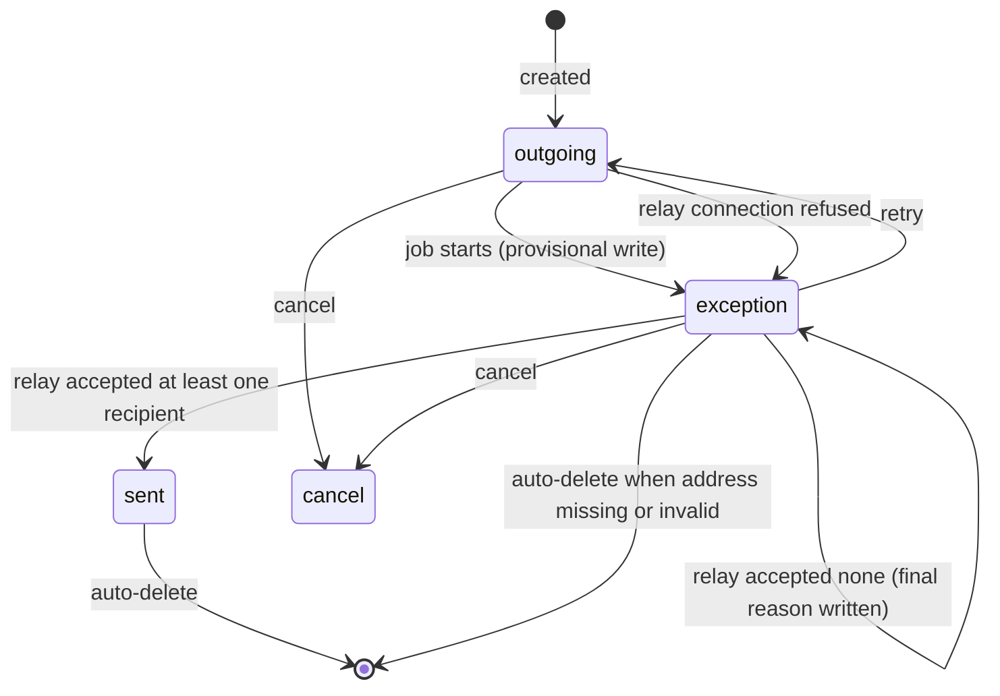
```mermaid
stateDiagram-v2
    [*] --> outgoing: created
    outgoing --> exception: job starts (provisional write)
    exception --> sent: relay accepted at least one recipient
    exception --> exception: relay accepted none (final reason written)
    outgoing --> exception: relay connection refused
    exception --> outgoing: retry
    outgoing --> cancel: cancel
    exception --> cancel: cancel
    sent --> [*]: auto-delete
    exception --> [*]: auto-delete when address missing or invalid
```

---

## 2. Notification

Field: `notification_status` on Notification (`mail.notification`). Stored, indexed.

### States

| Value | Label | Meaning |
|---|---|---|
| `ready` | Ready to Send | Created; the channel has not acted yet. |
| `process` | Processing | An intermediary accepted the request but has not yet handed it to the carrier. Used by the text-message channel. |
| `pending` | Sent | Handed to the carrier; delivery not confirmed. Used by the text-message channel; the electronic-mail channel does not distinguish and goes straight to `sent`. |
| `sent` | Delivered | Delivered. |
| `bounce` | Bounced | The recipient's system returned the message. |
| `exception` | Exception | The attempt failed. |
| `canceled` | Cancelled | Abandoned deliberately. |

Default at creation: `ready`. An inbox notification is created directly as `sent`; an electronic-mail notification is created as `ready` and already marked read.

### Transitions, electronic-mail channel

| From | To | Trigger | Side effects |
|---|---|---|---|
| `ready` | `exception` | The sending job starts on the carrying Outgoing Mail | Provisional; see the previous section. |
| `exception` | `sent` | The carrying mail was accepted for this recipient | Failure type and reason cleared. |
| `exception` | `exception` | The carrying mail failed for this recipient | Failure type and reason written; the message is re-broadcast to its author. |
| any except `sent` and `canceled` | `bounce` | An incoming bounce message is matched to this notification | The failure type becomes "bounce", the failure reason becomes the plain-text body of the bounce message. |
| `bounce` or `exception` | `canceled` | The author clears their delivery errors | Done in bulk for all failing notifications of that author on one model and channel; the affected messages are re-broadcast. |

### Transitions, inbox channel

| From | To | Trigger | Side effects |
|---|---|---|---|
| — | `sent` | The message is notified to a recipient whose preference is the in-application inbox | A broadcast carrying the message is pushed to that user. |

The read flag is an independent axis: see [message read state](#18-message-read-state).

### Transitions, text-message channel

The text-message channel maps its own state onto the notification status and enforces a **monotonic** rule: an update is ignored when the notification is already at least as advanced. See the table in `entities.md`, section 44.3, and the diagram below.

### Transitions, postal channel

| From | To | Trigger | Side effects |
|---|---|---|---|
| — | `ready` | The letter is created | Already marked read. |
| `ready` | `exception` | The address is incomplete | Failure type "missing required fields", reason "The address of the recipient is not complete". |
| `ready` | `sent` | The external service reports success | Failure fields cleared. |
| `ready` | `exception` | The external service reports a failure | Failure type derived from the error code; reason is the rendered explanation. |
| any | `canceled` | The letter is cancelled | — |
| `exception` or `canceled` | `ready` | The letter is re-queued | Failure fields cleared. |

### Diagram

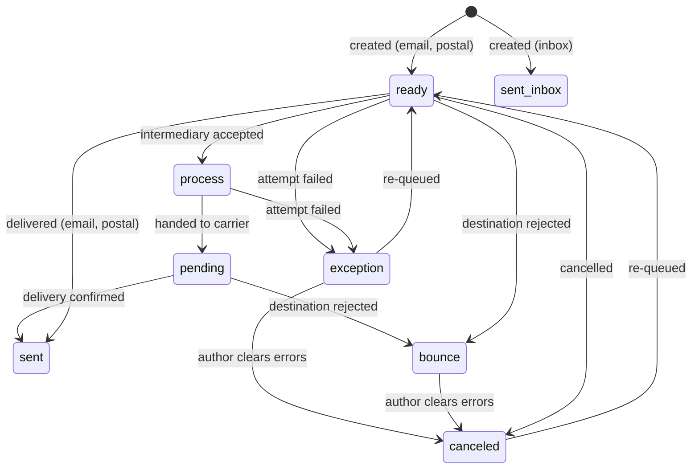
```mermaid
stateDiagram-v2
    [*] --> ready: created (email, postal)
    [*] --> sent_inbox: created (inbox)
    ready --> process: intermediary accepted
    process --> pending: handed to carrier
    pending --> sent: delivery confirmed
    ready --> sent: delivered (email, postal)
    ready --> exception: attempt failed
    process --> exception: attempt failed
    pending --> bounce: destination rejected
    ready --> bounce: destination rejected
    exception --> canceled: author clears errors
    bounce --> canceled: author clears errors
    ready --> canceled: cancelled
    exception --> ready: re-queued
    canceled --> ready: re-queued
```

---

## 3. Activity (derived)

Field: `state` on Activity (`mail.activity`). Computed, not stored.

### States

| Value | Label | Meaning |
|---|---|---|
| `overdue` | Overdue | The activity is live and its due date is strictly before today. |
| `today` | Today | The activity is live and its due date is exactly today. |
| `planned` | Planned | The activity is live and its due date is strictly after today. |
| `done` | Done | The activity is archived (its active flag is false). |

### The comparison

"Today" is computed in the **assignee's** time zone, not the reader's:

1. Take the current moment in coordinated universal time.
2. If the assignee has a time zone, convert to it and keep only the calendar date; otherwise keep the machine's local calendar date.
3. Compute the difference in days between the due date and that date.
4. A difference of zero gives "today", a negative difference gives "overdue", a positive difference gives "planned".

An activity with no due date has no state at all; the due date is however required, so this occurs only transiently while a record is being built.

### Transitions

| From | To | Trigger | Guards | Side effects |
|---|---|---|---|---|
| — | `planned`, `today` or `overdue` | Creation | — | The assignee is subscribed to the related record; when the assignee is not the acting user, the assignment notification is sent; when the activity is due today or earlier, the assignee's live-activity counter is incremented by a broadcast. |
| any live state | another live state | The due date is changed, or the calendar day turns | — | On an explicit change of the due date, the difference in the per-user count of activities due today or earlier is broadcast as an increment or a decrement. A day simply turning produces no event: the value is recomputed on read. |
| any live state | `done` | Completion | The activity is live | See the completion sequence below. |
| any live state | deleted | Cancellation | The activity is live | No message is posted; the counter decrement is broadcast. |
| `done` | deleted | A maintenance routine | A retention period in years is configured and positive, and the due date is older than that many years | Up to ten thousand rows per run. |

### The completion sequence

For each activity being completed, in order:

1. If the type chains by trigger, the values of the successor are prepared first, with the current due date placed in the context so that a "after previous activity deadline" delay can use it.
2. If the related record still exists, a message is posted on it from the shipped completion template, authored by the acting user, carrying the activity type and the "activities" subtype. The rendering receives the activity, the feedback text and a flag saying whether the assignee differs from the acting user.
3. Attachments of the activity are moved onto that message.
4. If the related record no longer exists, no message is posted, the attachments are deleted and the activity is **deleted** instead of archived.
5. Successor activities are created.
6. The remaining activities are archived and the feedback text is stored on them.
7. Archiving stamps the completion date, but only the first time: a later re-archive keeps the original completion date.

### Diagram

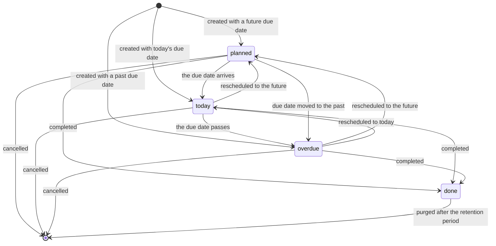
```mermaid
stateDiagram-v2
    [*] --> planned: created with a future due date
    [*] --> today: created with today's due date
    [*] --> overdue: created with a past due date
    planned --> today: the due date arrives
    today --> overdue: the due date passes
    planned --> overdue: due date moved to the past
    overdue --> planned: rescheduled to the future
    today --> planned: rescheduled to the future
    overdue --> today: rescheduled to today
    planned --> done: completed
    today --> done: completed
    overdue --> done: completed
    planned --> [*]: cancelled
    today --> [*]: cancelled
    overdue --> [*]: cancelled
    done --> [*]: purged after the retention period
```

---

## 4. Record activity indicator (derived)

Field: `activity_state` on any record adopting the activity behavior. Computed, not stored, searchable and groupable.

### States

| Value | Label | Meaning |
|---|---|---|
| `overdue` | Overdue | At least one live activity of the record is overdue. |
| `today` | Today | No live activity is overdue and at least one is due today. |
| `planned` | Planned | No live activity is overdue or due today and at least one is planned. |
| (empty) | — | The record has no live activity. |

The ordering is strict: overdue beats today, which beats planned.

The database form of the same computation, used for searching and grouping, takes the **minimum** over the live activities of the record of the sign of (due date minus today in that activity's assignee's time zone), and maps −1 to overdue, 0 to today, 1 to planned, and the absence of any row to empty. Taking the minimum reproduces the precedence exactly.

A second derived indicator, the exception decoration, is computed over the **types** of the live activities: a type decorated "Error" wins immediately; otherwise the last type decorated "Alert" encountered is used; otherwise the indicator is empty.

### Diagram

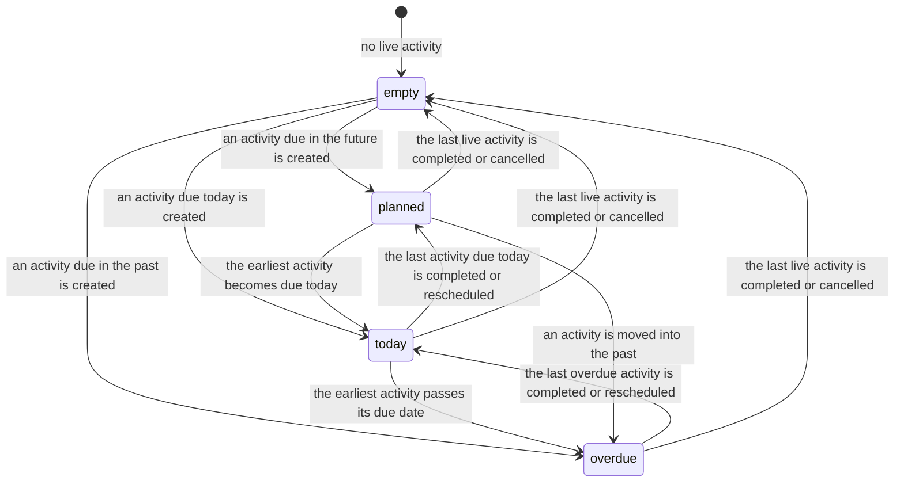
```mermaid
stateDiagram-v2
    [*] --> empty: no live activity
    empty --> planned: an activity due in the future is created
    empty --> today: an activity due today is created
    empty --> overdue: an activity due in the past is created
    planned --> today: the earliest activity becomes due today
    today --> overdue: the earliest activity passes its due date
    planned --> overdue: an activity is moved into the past
    overdue --> today: the last overdue activity is completed or rescheduled
    today --> planned: the last activity due today is completed or rescheduled
    planned --> empty: the last live activity is completed or cancelled
    today --> empty: the last live activity is completed or cancelled
    overdue --> empty: the last live activity is completed or cancelled
```

---

## 5. Alias validity

Field: `alias_status` on Alias (`mail.alias`). Computed and stored.

### States

| Value | Label | Meaning |
|---|---|---|
| `not_tested` | Not Tested | No message has yet exercised the alias since its configuration last changed. |
| `valid` | Valid | A message routed through the alias successfully created a record. |
| `invalid` | Invalid | A message routed through the alias failed because of a configuration error and a bounce was sent. |

### Transitions

| From | To | Trigger | Guards | Side effects |
|---|---|---|---|---|
| any | `not_tested` | The security policy, the default values or the target model is changed | — | Reset; the alias must prove itself again. |
| any | `valid` | A record is successfully created through the alias | The status is not already `valid` | — |
| any | `invalid` | A message routed through the alias raised an error while creating the record, **or** the alias configuration itself is faulty | The bounce is generated as a "configuration error" bounce | The bounce body is the "invalid alias" body: "The message below could not be accepted by the address <alias>. Please try again later or contact <company> instead." A bounce message is sent to the sender with the original message identifier as reference. The status write is performed in an independent transaction so it survives the rollback of the failed creation. |
| unchanged | unchanged | A message is rejected because the **sender** is not allowed (the contact-security check) | — | The status is **not** changed: this is not a configuration error. The bounce body is the "security" body (the custom one when the alias defines one, otherwise "The message below could not be accepted by the address <alias>. Only <description> are allowed to contact it. Please make sure you are using the correct address or contact us at <company address> instead."). |

### Diagram

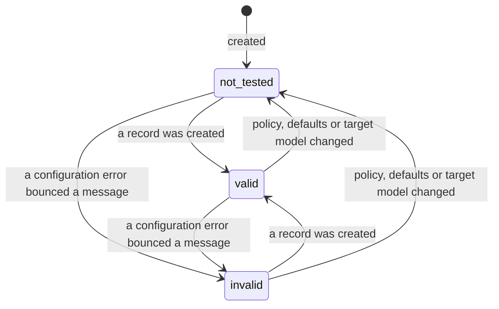
```mermaid
stateDiagram-v2
    [*] --> not_tested: created
    not_tested --> valid: a record was created
    not_tested --> invalid: a configuration error bounced a message
    valid --> invalid: a configuration error bounced a message
    invalid --> valid: a record was created
    valid --> not_tested: policy, defaults or target model changed
    invalid --> not_tested: policy, defaults or target model changed
```

---

## 6. Incoming Mail Server

Field: `state` on Incoming Mail Server (`fetchmail.server`). Stored, read-only, indexed, not copied.

### States

| Value | Label | Meaning |
|---|---|---|
| `draft` | Not Confirmed | The connection has never been proven to work. The polling job skips the server. |
| `done` | Confirmed | The connection was proven. The polling job includes the server. |

### Transitions

| From | To | Trigger | Guards | Side effects |
|---|---|---|---|---|
| `draft` | `done` | The connection test succeeds | The host, the account and the secret allow a connection of the configured kind | The last-error moment and the last-error text are cleared. |
| `done` | `draft` | The user resets the server, or any connection parameter is changed | — | — |
| unchanged | unchanged | A poll fails | — | The last-error moment and text are written; the server stays confirmed so the next poll retries. |
| unchanged | unchanged | A poll succeeds | — | The last-fetch moment is written and the error fields are cleared. |

### Connection failures

Confirming the connection reports, in order of what went wrong: "Invalid server name!\n <details>", "No response received. Check server information.\n <details>", "Server replied with following exception:\n <details>", "An SSL exception occurred. Check SSL/TLS configuration on server port.\n <details>". Using an archived server aborts with "The server "<name>" cannot be used because it is archived." Confirming the first server of the installation activates the polling job and sets its interval.

### Diagram

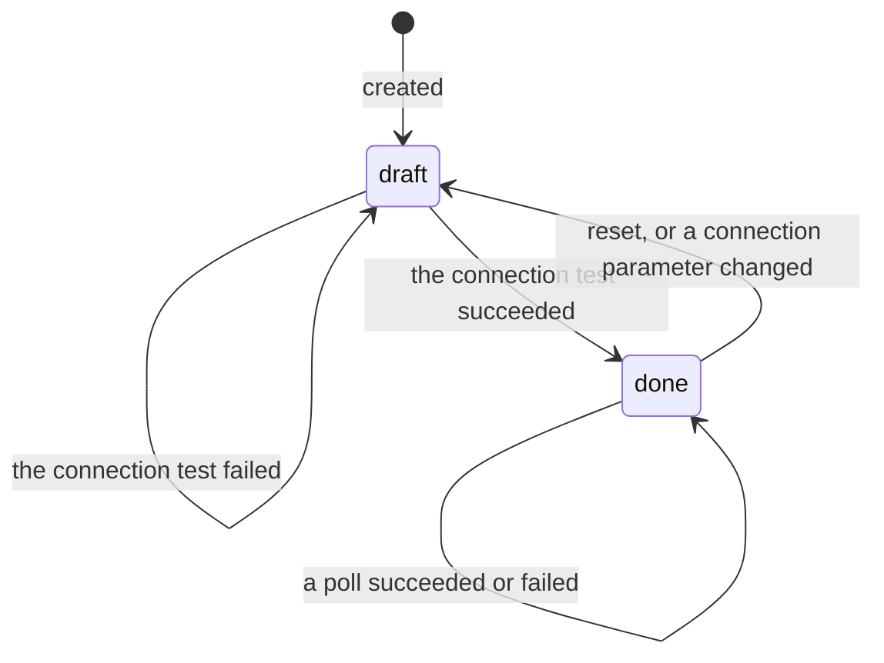
```mermaid
stateDiagram-v2
    [*] --> draft: created
    draft --> done: the connection test succeeded
    draft --> draft: the connection test failed
    done --> draft: reset, or a connection parameter changed
    done --> done: a poll succeeded or failed
```

---

## 7. Text Message

Field: `state` on Text Message (`sms.sms`). Stored, required, read-only, not copied.

### States

| Value | Label | Meaning |
|---|---|---|
| `outgoing` | In Queue | Waiting for the sending job. |
| `process` | Processing | Accepted by the provider, not yet with the carrier. |
| `pending` | Sent | With the carrier; delivery not confirmed. |
| `sent` | Delivered | Confirmed delivered. |
| `error` | Error | Failed. The failure type says why. |
| `canceled` | Cancelled | Abandoned before sending. |

Default: `outgoing`.

### Transitions

| From | To | Trigger | Guards | Side effects |
|---|---|---|---|---|
| — | `outgoing` | Creation | — | The sending job is woken immediately. |
| `outgoing` | `process`, `pending` or `sent` | The provider answers with a success state | The row is locked for update and not marked for deletion | The provider state is mapped: "processing" gives processing, "success" and "sent" give sent-to-carrier, "delivered" gives delivered. The failure type is cleared. The tracker pushes the mapped status onto the notification, subject to the monotonic rule. When the caller asked to remove sent rows, the row is marked for deletion. |
| `outgoing` | `error` | The provider answers with a failure state | — | The failure type is the mapped provider error, or the unknown type when the provider error is not recognized. The tracker pushes "exception" (or "bounced" for the three destination-rejection errors) onto the notification with the failure type and reason. When the caller asked to remove failed rows, the row is marked for deletion. |
| `outgoing` | `error` | The provider could not be reached at all | The caller did not ask for the exception to be raised | Every row of the batch is treated as a server error. |
| `error` | `outgoing` | The user resends | The row is not marked for deletion | The rows are re-sent immediately; the user is shown "<n> out of the <total> selected SMS Text Messages have successfully been resent.", or "The SMS Text Messages could not be resent.", or "There are no SMS Text Messages to resend." |
| any | `canceled` | The user cancels | — | The notification is set to cancelled, subject to the monotonic rule. |
| any | `error` | Business code declares a failure (for example a suppressed number) | — | The failure type is written and pushed to the notification. |
| any | deleted | A maintenance routine | The row is marked for deletion | The notifications are **never** deleted with it. |

### Diagram

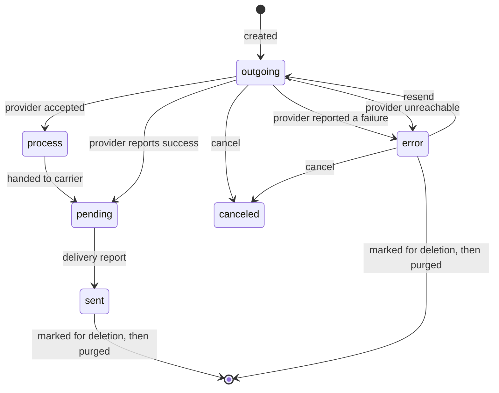
```mermaid
stateDiagram-v2
    [*] --> outgoing: created
    outgoing --> process: provider accepted
    process --> pending: handed to carrier
    pending --> sent: delivery report
    outgoing --> pending: provider reports success
    outgoing --> error: provider reported a failure
    outgoing --> error: provider unreachable
    error --> outgoing: resend
    outgoing --> canceled: cancel
    error --> canceled: cancel
    sent --> [*]: marked for deletion, then purged
    error --> [*]: marked for deletion, then purged
```

---

## 8. Postal Letter

Field: `state` on Postal Letter (`snailmail.letter`). Stored, required, read-only, not copied.

### States

| Value | Label | Meaning |
|---|---|---|
| `pending` | In Queue | Waiting to be printed and posted. |
| `sent` | Sent | The external service accepted the document and returned a tracking identifier. |
| `error` | Error | The attempt failed. The error code says why. |
| `canceled` | Cancelled | Abandoned. |

Default: `pending`.

### Error codes

| Code | Explanation shown to the user |
|---|---|
| `MISSING_REQUIRED_FIELDS` | "One or more required fields are empty." — and, for an incomplete address specifically, "The address of the recipient is not complete" |
| `CREDIT_ERROR` | "You don't have enough credits to perform this operation.<br>Please go to your <link>iap account</link>." |
| `TRIAL_ERROR` | "You don't have an IAP account registered for this service.<br>Please go to <link>iap.odoo.com</link> to claim your free credits." |
| `NO_PRICE_AVAILABLE` | "The country of the partner is not covered by Snailmail." |
| `FORMAT_ERROR` | "The attachment of the letter could not be sent. Please check its content and contact the support if the problem persists." |
| `ATTACHMENT_ERROR` | "The attachment could not be generated." |
| `UNKNOWN_ERROR` | "An unknown error happened. Please contact the support." |

A further error, returned by the service but not stored as a code, is "The document to be sent exceeds the maximum allowed limit of 8 pages."

Each code maps to a notification failure type: credit error, trial error, no price, missing fields, format error, and a generic error for everything else.

### Transitions

| From | To | Trigger | Guards | Side effects |
|---|---|---|---|---|
| — | `pending` | Creation | — | A message of the postal type with the body "Letter sent by post with Snailmail" is posted on the source document; the addressee's postal address is copied onto the letter; one Notification of the postal channel is created, already read, in status `ready`. |
| `pending` | `error` | The address is judged incomplete before any call | — | The error code is "missing required fields", the explanation is written, the notification becomes `exception` and the message is re-broadcast to its author. |
| `pending` | `error` | The document could not be produced | — | The error code is "attachment error". |
| `pending` | `sent` | The service reports the document as sent and the call returned success | — | The explanation becomes "The document was correctly sent by post.<br>The tracking id is <identifier>"; the error code is cleared; the notification becomes `sent` with the failure fields cleared. |
| `pending` | `error` | The service reports an error | — | The explanation becomes "An error occurred when sending the document by post.<br>Error: <message>"; the error code is the reported one when it is recognized, otherwise unknown; the notification becomes `exception` with the mapped failure type. A credit error also raises an operator warning titled "Not enough credits for Snail Mail". |
| `pending` | `error` | The service could not be reached | — | Every letter of the call gets the unknown error code and the error state; the exception is re-raised. |
| `error` or `canceled` | `pending` | The user re-queues | — | The notification returns to `ready` with its failure fields cleared; the message is re-broadcast. When exactly one letter is re-queued, it is sent immediately. |
| any | `canceled` | The user cancels | — | The error code is cleared; the notification becomes `canceled`. |

### Diagram

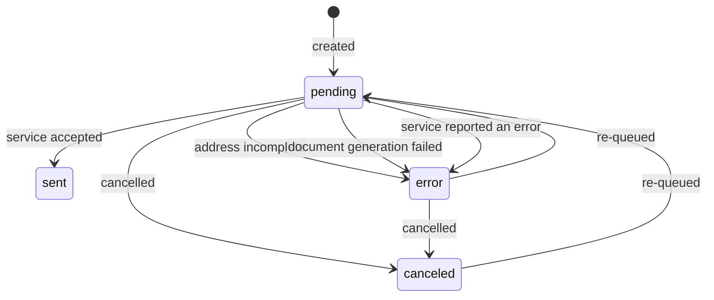
```mermaid
stateDiagram-v2
    [*] --> pending: created
    pending --> sent: service accepted
    pending --> error: address incomplete
    pending --> error: document generation failed
    pending --> error: service reported an error
    error --> pending: re-queued
    canceled --> pending: re-queued
    pending --> canceled: cancelled
    error --> canceled: cancelled
```

---

## 9. Mailing Group Message moderation

Field: `moderation_status` on Mailing Group Message (`mail.group.message`). Stored, required, indexed, not copied.

### States

| Value | Label | Meaning |
|---|---|---|
| `pending_moderation` | Pending Moderation | Held. Not relayed to the members. |
| `accepted` | Accepted | Relayed to every member. |
| `rejected` | Rejected | Never relayed. |

Default: `pending_moderation`.

### Transitions

| From | To | Trigger | Guards | Side effects |
|---|---|---|---|---|
| — | `accepted` | A message arrives on a list that is **not** moderated | — | The post is relayed to every member immediately. |
| — | `pending_moderation` | A message arrives on a moderated list | — | Then one of the four branches below applies. |
| `pending_moderation` | `accepted` | A permanent "always allow" rule exists for the sender address in this list | — | Relayed. |
| `pending_moderation` | `rejected` | A permanent "permanent ban" rule exists for the sender address in this list | — | Not relayed; no explanation is sent. |
| `pending_moderation` | `pending_moderation` | No rule exists and the list has automatic notification switched on | — | An automatic electronic mail carrying the list's notification text is sent to the sender, with the subject "Re: <original subject>", sent from the company catch-all or company address, automatically deleted after sending. |
| `pending_moderation` | `accepted` | A moderator accepts | The post is pending — otherwise "This message can not be moderated" (or, for several, "Those messages can not be moderated: <subjects>.") | The moderator is stamped; the post is relayed to every member. |
| `pending_moderation` | `rejected` | A moderator rejects | Same guard | The moderator is stamped. When the moderator supplied a subject or a comment, an explanation is sent to the author: an automatically deleted electronic mail whose body is the comment followed by the original body, referencing the original message identifier. |
| `pending_moderation` | `accepted` | A moderator whitelists the author | The address is valid — otherwise "The email "<value>" is not valid." | A permanent "always allow" rule is created (or an existing rule is switched to "allow"); **every** pending post of the same author in the same list is accepted and relayed. |
| `pending_moderation` | `rejected` | A moderator bans the author | Same guard | A permanent "permanent ban" rule is created (or an existing rule is switched to "ban"); **every** pending post of the same author in the same list is rejected. With the "with comment" variant, the explanation is also sent. |

A moderated list with pending posts causes a periodic job to notify every moderator, with the subject "Messages are pending moderation".

### Diagram

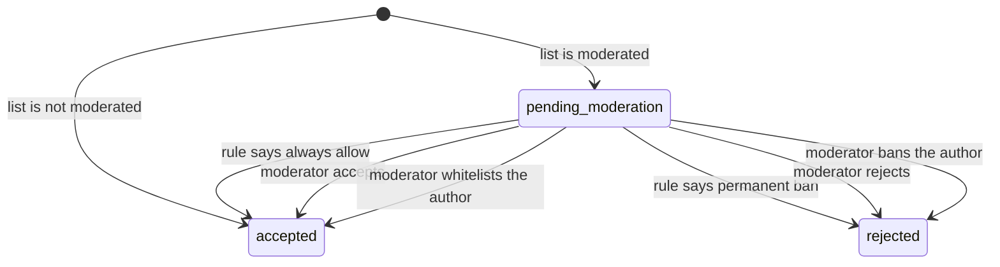
```mermaid
stateDiagram-v2
    [*] --> accepted: list is not moderated
    [*] --> pending_moderation: list is moderated
    pending_moderation --> accepted: rule says always allow
    pending_moderation --> rejected: rule says permanent ban
    pending_moderation --> accepted: moderator accepts
    pending_moderation --> rejected: moderator rejects
    pending_moderation --> accepted: moderator whitelists the author
    pending_moderation --> rejected: moderator bans the author
```

---

## 10. Mailing Group openness

Field: `is_closed` on Mailing Group (`mail.group`). A two-valued flag rather than a selection, but it behaves as a state.

| Value | Meaning |
|---|---|
| false | Open. Messages sent to the list address are processed. |
| true | Closed. The list can still be read on its public pages, but any message sent to its address is bounced with the shipped "closed list" body, and nobody may join. |

| From | To | Trigger | Side effects |
|---|---|---|---|
| open | closed | The close action | — |
| closed | open | The open action | — |

While closed: joining is refused with "You can not join a closed group."; sending guidelines is refused with "You can not send guidelines for a closed group."; and the incoming router returns no route at all after sending the bounce.

The list ordering places open lists before closed ones.

### Diagram

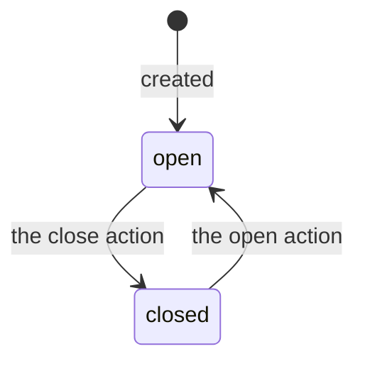
```mermaid
stateDiagram-v2
    [*] --> open: created
    open --> closed: the close action
    closed --> open: the open action
```

---

## 11. Live chat session lifecycle

Field: `livechat_end_dt` on Channel (`discuss.channel`) when the type is the live chat type. An empty value means the session is running; a value means it is closed. This is a date rather than a selection, but it is the primary lifecycle state of a session.

### States

| Derived state | Condition |
|---|---|
| Running | The end moment is empty. |
| Closed | The end moment is set. |

### Transitions

| From | To | Trigger | Guards | Side effects |
|---|---|---|---|---|
| — | Running | A visitor starts a conversation | An operator or a bot was found | The session is created with the operator contact, the live chat channel, the working status "in progress", and the failure marker set to "never answered" when the operator is a human, or "no failure" when it is a bot. The chatbot's current step is set to the last welcome step when a bot is answering. Members are created for the operator (unpinned immediately, so the session does not clutter the operator's sidebar until something happens) and for the visitor. |
| Running | Closed | The visitor closes the conversation | The end moment is still empty | The visitor's call session, if any, is left. The end moment is stamped and broadcast. If the session has at least one message, a notification message "Visitor left the conversation." is posted. |
| Running | Closed | The last remaining member leaves | The member count after the departure is one | The end moment is stamped and broadcast. |
| Closed | Running | The visitor restarts the chatbot script | — | The current step is cleared, the end moment is cleared, the recorded chatbot messages are cleared. |

The working status must be empty once the session is closed; this is enforced by a database check — "Closed Live Chat session should not have a status."

### Diagram

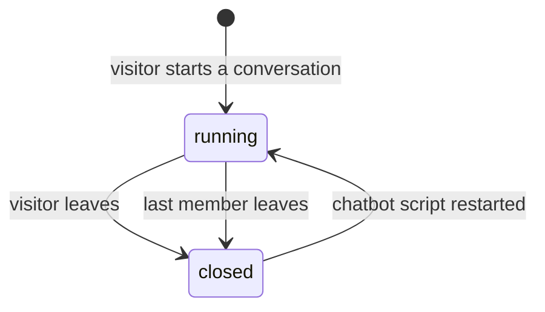
```mermaid
stateDiagram-v2
    [*] --> running: visitor starts a conversation
    running --> closed: visitor leaves
    running --> closed: last member leaves
    closed --> running: chatbot script restarted
```

---

## 12. Live chat session working status

Field: `livechat_status` on Channel. Computed, stored, editable, visible to internal users.

### States

| Value | Label | Meaning |
|---|---|---|
| `in_progress` | In progress | The operator is handling the conversation. |
| `waiting` | Waiting for customer | The operator answered and is waiting. |
| `need_help` | Looking for help | The operator asked another operator to join. |
| (empty) | — | The session is closed. |

### Transitions

| From | To | Trigger | Guards | Side effects |
|---|---|---|---|---|
| — | `in_progress` | The session is created | — | — |
| any | (empty) | The session is closed | — | Forced by the computation: a session with an end moment has no status. |
| `waiting` | `in_progress` | The visitor posts a message | The session is running and the author's history says "visitor" | — |
| `in_progress` | `waiting` | The operator sets it | — | — |
| `in_progress` or `waiting` | `need_help` | The operator asks for help | — | The session is broadcast to the whole live-chat-operator group on a dedicated sub-channel so that every operator's "sessions needing help" list updates. |
| `need_help` | `in_progress` | Another operator joins | The status is still "need help" when the join is attempted; otherwise the join returns a refusal because someone was faster | The joining user becomes a member; the session is removed from the "needing help" broadcast. |
| `need_help` | any other value | The operator withdraws the request | — | The session is removed from the "needing help" broadcast, carrying only the new status. |
| `in_progress` | `in_progress` | New members are added to the session | — | Adding members resets the status to "in progress". |

### Diagram

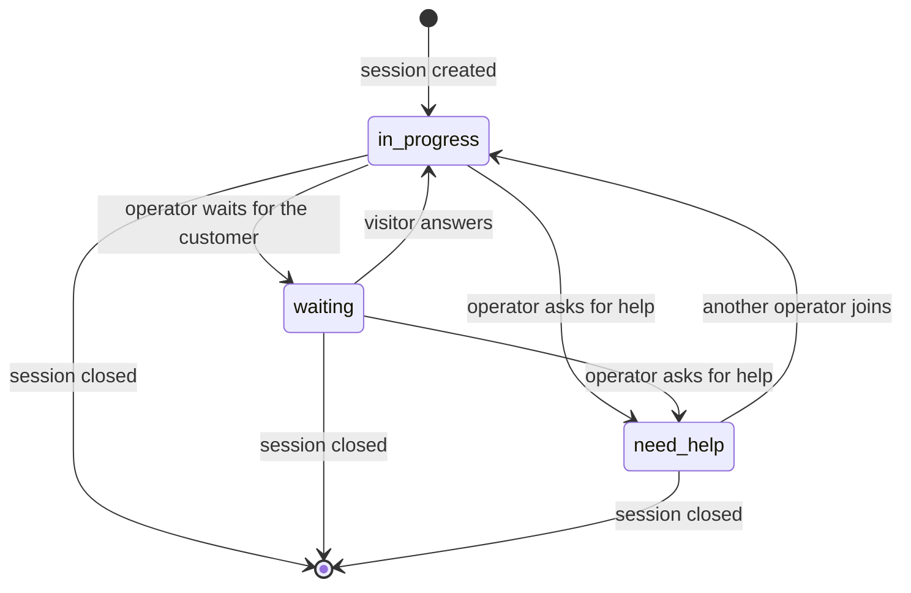
```mermaid
stateDiagram-v2
    [*] --> in_progress: session created
    in_progress --> waiting: operator waits for the customer
    waiting --> in_progress: visitor answers
    in_progress --> need_help: operator asks for help
    waiting --> need_help: operator asks for help
    need_help --> in_progress: another operator joins
    in_progress --> [*]: session closed
    waiting --> [*]: session closed
    need_help --> [*]: session closed
```

---

## 13. Live chat session outcome (derived)

Two fields work together: `livechat_failure`, which is written as the session progresses, and `livechat_outcome`, which is computed and stored from it.

### The failure marker

| Value | Label | Written when |
|---|---|---|
| `no_answer` | Never Answered | A human operator is assigned to the session — either at creation, or when a bot forwards to a human. |
| `no_agent` | No one Available | A forward to a human found nobody. |
| `no_failure` | No Failure | A bot is the operator at creation; **or** any message is posted by a participant whose history type is "agent" while the session is running. |

In other words the marker starts pessimistic the moment a human is put on the session and is cleared the moment that human actually says something.

### The escalation flag

```formula
is_escalated = ( number of participant histories whose type is "agent" ) > 1
```

### The outcome

```formula
outcome = "escalated"        when is_escalated is true
outcome = failure marker     otherwise
```

| Value | Label |
|---|---|
| `no_answer` | Never Answered |
| `no_agent` | No one Available |
| `no_failure` | Success |
| `escalated` | Escalated |

### Diagram

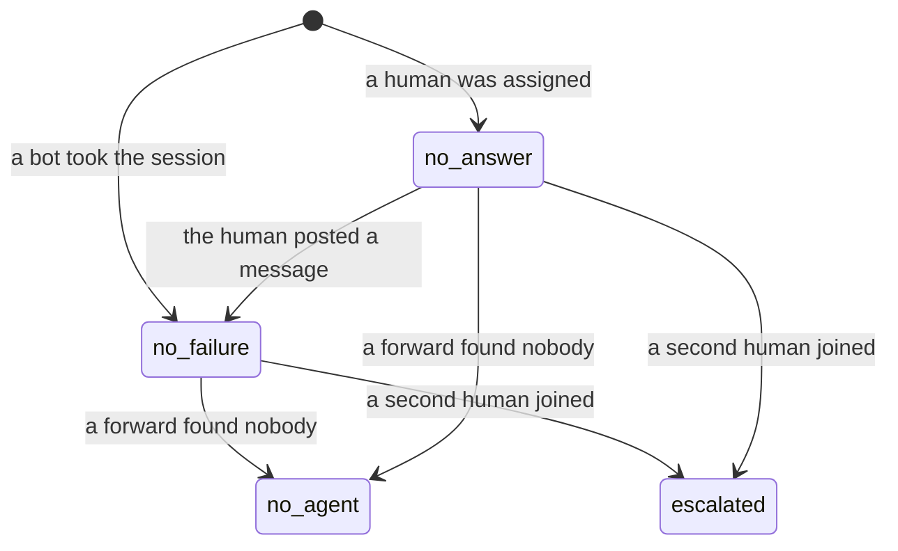
```mermaid
stateDiagram-v2
    [*] --> no_failure: a bot took the session
    [*] --> no_answer: a human was assigned
    no_answer --> no_failure: the human posted a message
    no_failure --> no_agent: a forward found nobody
    no_answer --> no_agent: a forward found nobody
    no_failure --> escalated: a second human joined
    no_answer --> escalated: a second human joined
```

---

## 14. Chatbot script progression

Field: `chatbot_current_step_id` on Channel. A link rather than a selection; it is the program counter of the script.

### States

| Value | Meaning |
|---|---|
| empty | No script is running, or the script has finished, or the session has been handed to a human. |
| a step | That step has been played and the bot is waiting for whatever the step requires. |

### Transitions

| From | To | Trigger | Guards | Side effects |
|---|---|---|---|---|
| — | the last welcome step | A session is created with a bot operator | The rule that matched names a script that is active and has at least one step | The welcome steps are played in one go. |
| step *n* | step *m* | The visitor answers, or the bot advances a text step | Step *m* is the next step by sequence whose triggering answers are **all** among the answers already chosen | The step message is posted as a message authored by the bot's operator contact, and a Chatbot Message row links the posted message to the step. |
| a question step | the same step | The visitor chooses an answer | The answer belongs to that step | The Chatbot Message of the question is updated with the chosen answer, both as a link and as a plain identifier; the client is told which answer was selected. |
| a forwarding step | empty | The forward succeeds | An operator was found and is not the acting user | The step message is posted; the human is added as a member with the participant type "agent" and, when the step names skills, with those skills (which are also recorded on the session); the bot is removed from the session without a leave message; the session is renamed to "<visitor name> <operator display name>"; the failure marker is reset to "never answered"; the session is broadcast to the new operator and pinned for them. |
| a forwarding step | unchanged | The forward fails | No operator was found, or the only candidate is the acting user | **No message is posted at all**, so the script can continue with fallback steps (for example asking for an address). The failure marker becomes "no one available". |
| any | empty | The visitor restarts the script | — | The recorded chatbot messages are cleared and the session is re-opened. |

The script is considered finished when no further step qualifies.

### Diagram

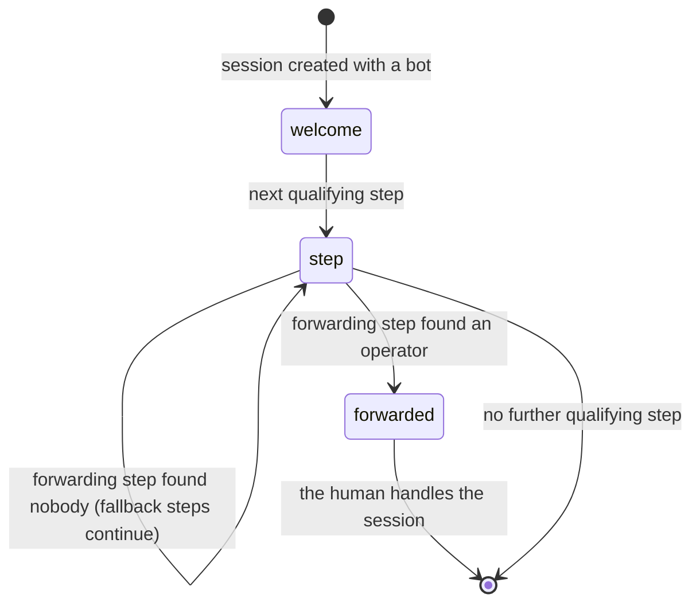
```mermaid
stateDiagram-v2
    [*] --> welcome: session created with a bot
    welcome --> step: next qualifying step
    step --> step: next qualifying step
    step --> forwarded: forwarding step found an operator
    step --> step: forwarding step found nobody (fallback steps continue)
    forwarded --> [*]: the human handles the session
    step --> [*]: no further qualifying step
```

---

## 15. Assistant bot onboarding

Field: `odoobot_state` on User. Stored, read-only. A companion flag, `odoobot_failed`, records that the last answer did not match what the guide expected.

### States

| Value | Label | Meaning |
|---|---|---|
| (empty) or `not_initialized` | Not initialized | The guide has never run for this user. |
| `onboarding_emoji` | Onboarding emoji | The guide is waiting for the user to send an emoji. |
| `onboarding_command` | Onboarding command | The guide is waiting for the user to run the help command. |
| `onboarding_ping` | Onboarding ping | The guide is waiting for the user to mention the bot. |
| `onboarding_attachement` | Onboarding attachment | The guide is waiting for the user to attach a file. |
| `onboarding_canned` | Onboarding canned | The guide is waiting for the user to use a canned response. |
| `idle` | Idle | The guide is finished; the bot answers with generic replies. |
| `disabled` | Disabled | The bot is switched off for this user. |

### Transitions

| From | To | Trigger | Side effects |
|---|---|---|---|
| empty or `not_initialized` | `onboarding_emoji` | The user opens the application for the first time, being an internal user | A direct conversation with the bot is created (or found), and the bot posts a three-line greeting ending with "Try to send me an emoji". |
| empty, `not_initialized` or `idle` | `onboarding_emoji` | The user types the phrase "start the tour" | The bot answers "To start, try to send me an emoji :)". |
| `onboarding_emoji` | `onboarding_command` | The user's message contains an emoji | The failure flag is cleared. The bot answers "Great! 👍<br>To access special commands, **start your sentence with** `/`. Try getting help." |
| `onboarding_command` | `onboarding_ping` | The user runs the help command | The failure flag is cleared. The bot answers "Wow you are a natural!<br>Ping someone with @username to grab their attention. **Try to ping me using** `@OdooBot` in a sentence." |
| `onboarding_ping` | `onboarding_attachement` | The user's message mentions the bot's contact | The failure flag is cleared. The bot answers "Yep, I am here! 🎉 <br>Now, try **sending an attachment**, like a picture of your cute dog..." |
| `onboarding_attachement` | `onboarding_canned` | The user's message carries an attachment | The failure flag is cleared. A temporary canned response is created with the shortcut "Thanks" and the substitution "Thanks for your feedback. Goodbye!". The bot answers "Wonderful! 😇<br>Try typing `::` to use canned responses. I've created a temporary one for you." |
| `onboarding_canned` | `idle` | The user's message used a canned response | The failure flag is cleared. The temporary canned response created by the guide for this user is deleted. The bot answers with **two** messages: "Great! You can customize **canned responses** in the Discuss app." and "That's the end of this overview. You can **close this conversation** or type `start the tour` to see it again. Enjoy exploring Odoo!" |
| any onboarding state | the same state | The user's message does not match what the step expects | The failure flag is set and a step-specific hint is repeated (see the table below). |

### The hints

| State | Hint |
|---|---|
| `onboarding_emoji` | "Not exactly. To continue the tour, send an emoji: **type**` :)` and press enter." |
| `onboarding_command` | "Not sure what you are doing. Please, type `/` and wait for the propositions. Select `help` and press enter." |
| `onboarding_ping` | "Sorry, I am not listening. To get someone's attention, **ping him**. Write `@OdooBot` and select me." |
| `onboarding_attachement` | "To **send an attachment**, click on the paperclip icon and select a file." |
| `onboarding_canned` | "Not sure what you are doing. Please, type `:` and wait for the propositions. Select one of them and press enter." |

### Answers outside the guide

| Condition | Answer |
|---|---|
| The state is idle and the message is a heart, "i love you" or "love" | "Aaaaaw that's really cute but, you know, bots don't work that way. You're too human for me! Let's keep it professional ❤️" |
| The message contains a swear word | "That's not nice! I'm a bot but I have feelings... 💔" |
| The message asks for help (it contains "help" or a question mark) or the state is idle | "Unfortunately, I'm just a bot 😞 I don't understand! If you need help discovering our product, please check <our documentation> or <our videos>." |
| Anything else | one of four generic answers, chosen at random: "I'm not smart enough to answer your question.<br>To follow my guide, ask: `start the tour`."; "Hmmm..."; "I'm afraid I don't understand. Sorry!"; "Sorry I'm sleepy. Or not! Maybe I'm just trying to hide my unawareness of human language...<br>I can show you features if you write: `start the tour`." |

### Preconditions for the bot to answer at all

The bot answers only when **all** of the following hold: the conversation is a direct chat; the bot's contact is one of its members; the message was not authored by the bot itself; and the message is of type comment (unless the trigger is a command rather than a message). The body is normalized before matching: non-breaking spaces become ordinary spaces, surrounding whitespace is trimmed, the text is lower-cased and trailing full stops and exclamation marks are removed.

Every answer the bot posts is marked *silent*, so it does not produce a notification sound.

### Diagram

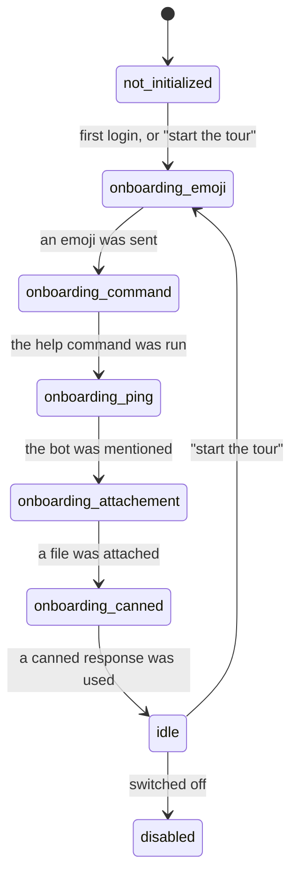
```mermaid
stateDiagram-v2
    [*] --> not_initialized
    not_initialized --> onboarding_emoji: first login, or "start the tour"
    onboarding_emoji --> onboarding_command: an emoji was sent
    onboarding_command --> onboarding_ping: the help command was run
    onboarding_ping --> onboarding_attachement: the bot was mentioned
    onboarding_attachement --> onboarding_canned: a file was attached
    onboarding_canned --> idle: a canned response was used
    idle --> onboarding_emoji: "start the tour"
    idle --> disabled: switched off
```

---

## 16. Presence (derived)

Field: `status` on Presence (`mail.presence`), combined with the user's manual override.

### Stored states

| Value | Label | Meaning |
|---|---|---|
| `online` | Online | The party interacted recently. |
| `away` | Away | The party is connected but has not interacted for a while. |
| `offline` | Offline | The party is not connected. |

Default: `offline`.

### The manual override

A user may force one of three values: away, do-not-disturb, offline. The value shown to others is the manual value when one is set, and the detected value otherwise. The do-not-disturb value additionally removes the user from live chat assignment and from call invitations.

### Transitions

| From | To | Trigger |
|---|---|---|
| `offline` | `online` | The party opens a connection and interacts. |
| `online` | `away` | The last interaction moment becomes older than the away threshold while the connection is still open. |
| `away` | `online` | The party interacts again. |
| `online` or `away` | `offline` | The connection closes, or the last poll moment becomes older than the disconnection threshold. |

Two distinct moments are recorded: the last poll (any contact with the server, including a mere keep-alive) and the last presence (a real interaction). The away decision uses the last presence; the offline decision uses the last poll.

The away decision itself is:

```formula
status = "away"    when the inactivity since the last presence exceeds the away threshold
status = "online"  otherwise
```

Every change of status is pushed on the presence broadcast channel of the user or the guest concerned. Closing the connection writes the offline status and pushes it.

### Diagram

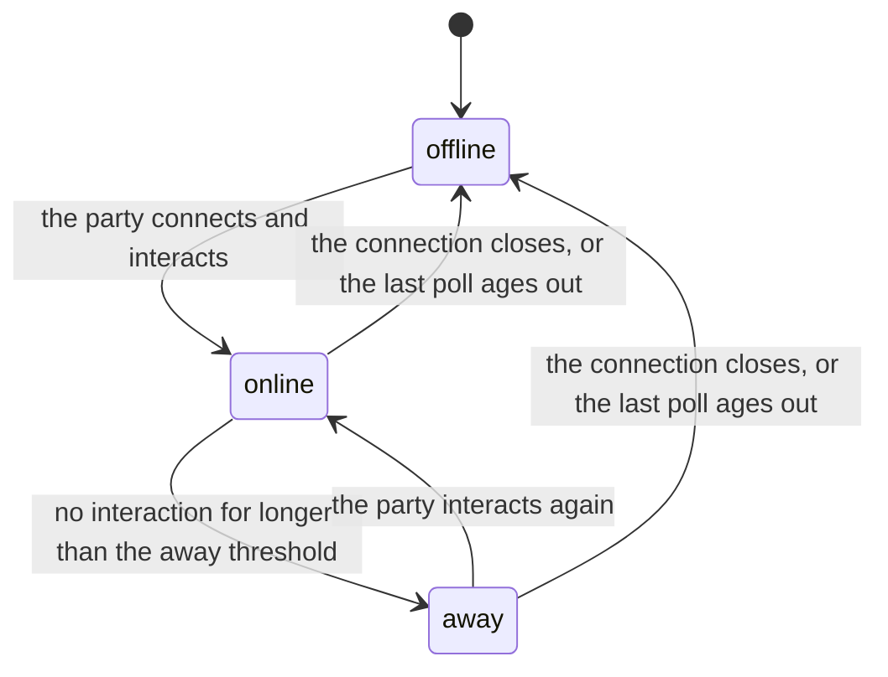
```mermaid
stateDiagram-v2
    [*] --> offline
    offline --> online: the party connects and interacts
    online --> away: no interaction for longer than the away threshold
    away --> online: the party interacts again
    online --> offline: the connection closes, or the last poll ages out
    away --> offline: the connection closes, or the last poll ages out
```

---

## 17. Channel membership pin (derived)

Field: `is_pinned` on Channel Member. Computed, not stored, searchable.

```formula
is_pinned = ( unpin_moment is empty )
            or ( member_last_interest_moment ≥ unpin_moment )
            or ( channel_last_interest_moment ≥ unpin_moment )
```

| Derived state | Meaning |
|---|---|
| pinned | The conversation appears in the member's sidebar. |
| not pinned | It does not, until something happens. |

### Transitions

| From | To | Trigger | Side effects |
|---|---|---|---|
| pinned | not pinned | The member unpins | The unpin moment is stamped with the current moment; the client is told to close the conversation window. |
| not pinned | pinned | The member pins | The unpin moment is cleared. |
| not pinned | pinned | Anything interesting happens in the channel (a message that is not a notification is posted, which raises the channel's last-interest moment) | Automatic; no write on the member is needed. |
| not pinned | pinned | The member joins, is re-added, or the conversation is opened | The member's last-interest moment is raised. |
| pinned | not pinned | A maintenance routine, for a **sub-thread** only | Requires: both the member's and the channel's last-interest moments older than two days, and no message at or after the member's new-message separator that is not a notification. The unpin moment is stamped and the client is told to close the window. |

A direct conversation that is created but never used is deliberately unpinned for the correspondent: the correspondent's member row is created with an unpin moment set to a moment strictly after the last-interest moment, so the conversation stays invisible until the first message.

### Diagram

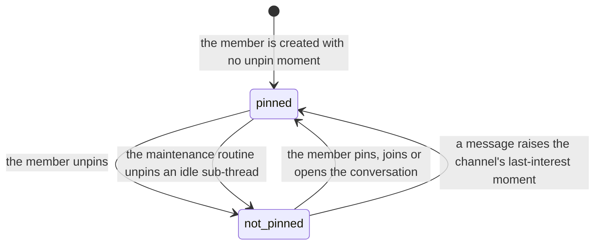
```mermaid
stateDiagram-v2
    [*] --> pinned: the member is created with no unpin moment
    pinned --> not_pinned: the member unpins
    pinned --> not_pinned: the maintenance routine unpins an idle sub-thread
    not_pinned --> pinned: the member pins, joins or opens the conversation
    not_pinned --> pinned: a message raises the channel's last-interest moment
```

---

## 18. Message read state

Two independent facts describe whether a person has "seen" something. They are stored in different places and must not be confused.

### The notification read flag

Field: `is_read` on Notification, with a companion `read_date`.

| Value | Meaning |
|---|---|
| false | The message is in the recipient's inbox and counts towards the unread badge. |
| true | It is not. |

| From | To | Trigger | Side effects |
|---|---|---|---|
| false | true | The recipient marks the message done, or marks everything as read | The read moment is stamped. A broadcast carrying the affected message identifiers and the recipient's new inbox count is pushed to the recipient. |
| — | true | An electronic-mail or postal notification is created | Such notifications are created already read, because there is no read-back channel. |

Read notifications that are old enough, belong to a non-customer contact and are in status delivered or cancelled are deleted by a maintenance routine.

### The channel unread separator

Fields: `new_message_separator` and `seen_message_id` on Channel Member.

| From | To | Trigger | Side effects |
|---|---|---|---|
| separator at *s* | separator at *m*+1 | The member marks the conversation read up to message *m* | The last seen message becomes *m* (only if the current one is lower), the fetched message becomes the maximum of its current value and *m*, and the last-seen moment is stamped. When the channel type broadcasts read receipts (direct chat, group, live chat session), the new last-seen value is broadcast to the whole channel; otherwise only to the member. |
| separator at *s* | separator at *m*+1 | The member posts message *m* themselves | Done silently in the posting hook: the author never sees their own message as unread. |
| unchanged | unchanged | The member marks read a message identifier that is already behind the separator | The member is simply re-broadcast with the current counters, so a client that was out of step re-synchronizes. |

### Diagrams

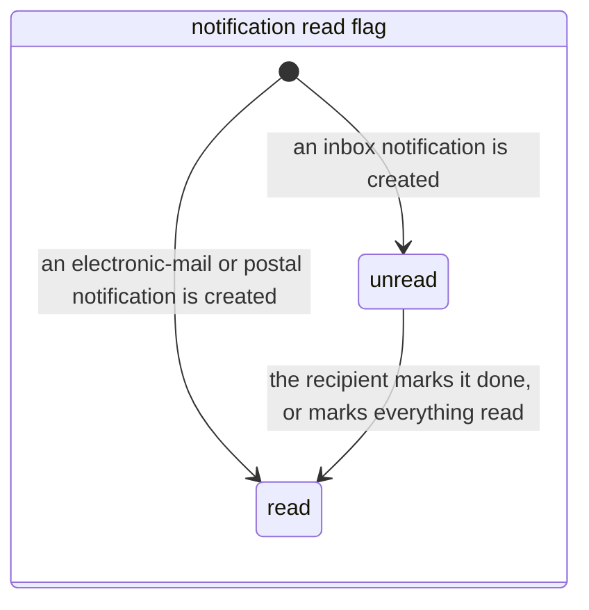
```mermaid
stateDiagram-v2
    state "notification read flag" as flag {
        [*] --> unread: an inbox notification is created
        [*] --> read: an electronic-mail or postal notification is created
        unread --> read: the recipient marks it done, or marks everything read
    }
```

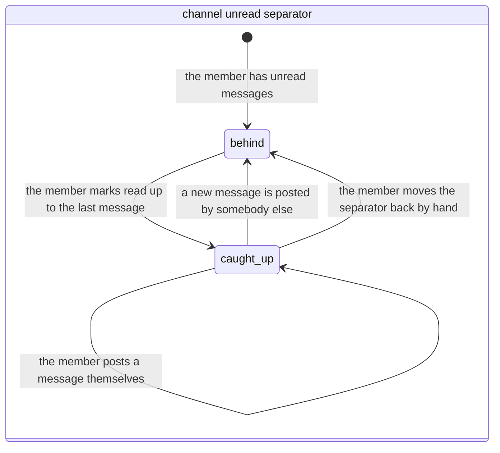
```mermaid
stateDiagram-v2
    state "channel unread separator" as sep {
        [*] --> behind: the member has unread messages
        behind --> caught_up: the member marks read up to the last message
        caught_up --> behind: a new message is posted by somebody else
        caught_up --> caught_up: the member posts a message themselves
        caught_up --> behind: the member moves the separator back by hand
    }
```

---

## 19. Scheduled message and deferred notification

Two different deferrals exist and they are not the same machine.

### A posted message whose notifications are deferred

Record: Message Notification Schedule (`mail.message.schedule`).

| Derived state | Meaning |
|---|---|
| pending | The schedule row exists. The message is visible in the conversation but nobody has been told. |
| released | The row is gone. The notifications have been produced. |

| From | To | Trigger | Guards | Side effects |
|---|---|---|---|---|
| — | pending | A message is posted with a scheduled moment | The parsed moment is valid and strictly in the future | A row is created holding the message, the moment and the serialized notification parameters. The recipient computation has **already** run at this point; only the delivery is deferred. |
| pending | released | The scheduled job reaches the moment, or a caller forces the release | — | The stored parameters are replayed and the inbox, electronic-mail and browser-push deliveries are produced; the row is deleted. |
| pending | pending with a new moment | The author changes the scheduled moment | — | The row's moment is updated. |

### A message not yet posted

Record: Scheduled Message (`mail.scheduled.message`).

| Derived state | Meaning |
|---|---|
| pending | The row exists. Nothing is visible in the conversation; the author sees a pending entry. |
| posted | The row is gone and a real Message exists. |

| From | To | Trigger | Side effects |
|---|---|---|---|
| — | pending | The composer is used with a future moment and the "schedule" action | The whole posting payload is captured: subject, body, attachments, recipients, author, whether it is an internal note, the notification parameters and the sending context. |
| pending | pending | The author edits the entry | The stored payload is updated. |
| pending | — | The author cancels | The row is deleted; nothing is posted. |
| pending | posted | The scheduled job reaches the moment, or the author sends it now | The captured payload is used to post the message on the target record; the row is deleted. |
| pending | — | The target record is deleted | Every scheduled message of that record is deleted with it. |

### Diagrams

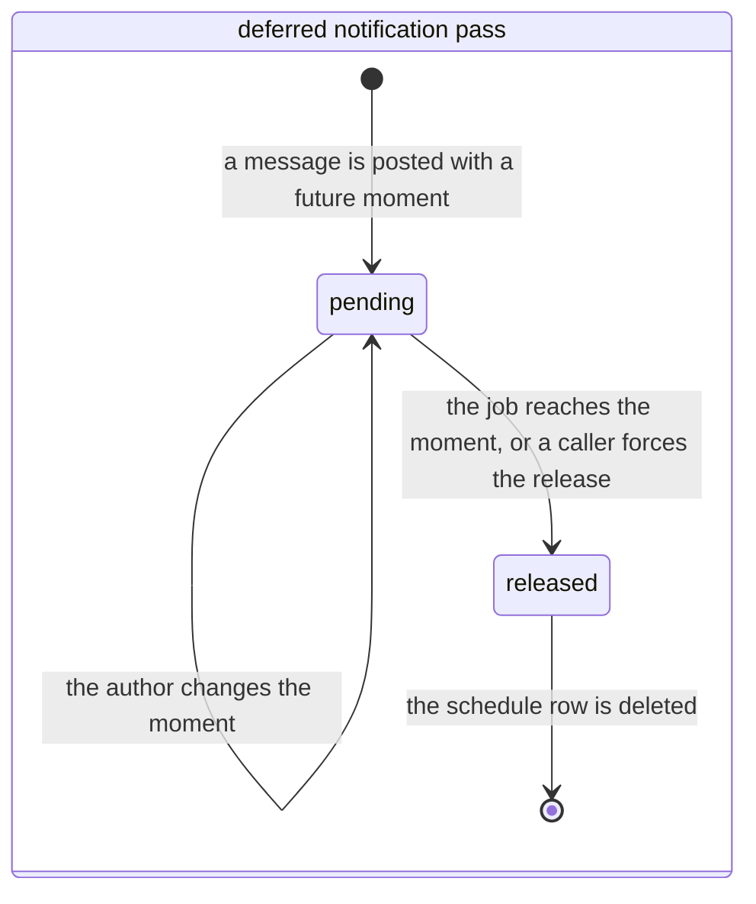
```mermaid
stateDiagram-v2
    state "deferred notification pass" as defer {
        [*] --> pending: a message is posted with a future moment
        pending --> pending: the author changes the moment
        pending --> released: the job reaches the moment, or a caller forces the release
        released --> [*]: the schedule row is deleted
    }
```

```mermaid
stateDiagram-v2
    state "message not yet posted" as sched {
        [*] --> pending: the composer schedules it
        pending --> pending: the author edits the entry
        pending --> posted: the job reaches the moment, or the author sends it now
        pending --> [*]: the author cancels, or the target record is deleted
        posted --> [*]: the row is deleted and a Message exists
    }
```

---

## 20. Digest activation and periodicity

### Activation

Field: `state` on Digest. Stored, read-only.

| Value | Label | Meaning |
|---|---|---|
| `activated` | Activated | The sending job considers the digest. |
| `deactivated` | Deactivated | It does not. |

| From | To | Trigger |
|---|---|---|
| — | `activated` | Creation |
| `activated` | `deactivated` | The deactivate action |
| `deactivated` | `activated` | The activate action |

### Periodicity

Field: `periodicity`. Not read-only; it is both a setting and a state that the platform may change on its own.

| Value | Label | Interval added to today to obtain the next run date |
|---|---|---|
| `daily` | Daily | one day |
| `weekly` | Weekly | one week |
| `monthly` | Monthly | one month |
| `quarterly` | Quarterly | three months |

| From | To | Trigger | Guards |
|---|---|---|---|
| any | any | The user changes it, in the form or through the dedicated route | — |
| `daily` | `weekly` | The automatic slow-down | No recipient has logged in for two days |
| `weekly` | `monthly` | The automatic slow-down | No recipient has logged in for seven days |
| `monthly` | `quarterly` | The automatic slow-down | No recipient has logged in for one month |
| `quarterly` | `quarterly` | The automatic slow-down | No recipient has logged in for three months (the periodicity is already at its slowest) |

The slow-down runs **only** for automatic sendings. A manual send never changes the periodicity, deliberately, because a manual send is not something the recipient could perceive as unsolicited repetition.

Whenever the periodicity changes, the next run date is recomputed as today plus the new interval.

### Diagram

```mermaid
stateDiagram-v2
    [*] --> activated
    activated --> deactivated: deactivate
    deactivated --> activated: activate
    state activated {
        [*] --> daily
        daily --> weekly: nobody logged in for 2 days
        weekly --> monthly: nobody logged in for 7 days
        monthly --> quarterly: nobody logged in for 1 month
        quarterly --> quarterly: nobody logged in for 3 months
    }
```

---

## 21. Call session lifecycle

Record: Call Session (`discuss.channel.rtc.session`). There is no state field; existence **is** the state, and the modification moment is the heartbeat.

### States

| Derived state | Condition |
|---|---|
| ringing | The member has a ringing-session link but no session of their own. |
| in call | The member has a session. |
| not in call | Neither. |

### Transitions

| From | To | Trigger | Guards | Side effects |
|---|---|---|---|---|
| not in call | in call | The member joins the call | — | Any other session of the same party anywhere is deleted first; the member's ringing link is cleared; a session is created with the requested camera state; dead sessions of the channel are collected; the traversal server list is fetched; if the channel now has three or more sessions and a forwarding unit is configured, a forwarding-unit channel is obtained and every existing session is told to switch over; when this is the first session of a conversation that is not a plain channel, the other members are rung. |
| not in call | ringing | Another member invites them | The member has no session, no existing ringing link, their user has not set do-not-disturb, and — for a guest — they have polled within the last twelve hours | The ringing link is set; the invited list is broadcast to the channel; a browser push titled "Incoming call" with the body "Conference: <channel display name>" is sent with Decline and Accept buttons. |
| ringing | in call | The member accepts | — | As "joins the call" above. |
| ringing | not in call | The invitation is cancelled, or the member declines | — | The ringing link is cleared, the removal is broadcast, and a cancellation push with the same grouping tag is sent so the notification disappears from the device. |
| in call | not in call | The member leaves | — | The session (or the named session) is deleted. |
| in call | not in call | The heartbeat lapses | The session has not been touched within the inactivity window | A garbage-collection routine deletes it. |
| in call | not in call | The member row is deleted | — | Sessions cascade. |

When the number of sessions in a channel falls back below three, the channel's forwarding-unit identifier and address are cleared and the call returns to direct browser-to-browser operation.

### Diagram

```mermaid
stateDiagram-v2
    [*] --> not_in_call
    not_in_call --> ringing: invited
    ringing --> in_call: accepted
    ringing --> not_in_call: declined or cancelled
    not_in_call --> in_call: joined directly
    in_call --> not_in_call: left
    in_call --> not_in_call: heartbeat lapsed
```

---

## 22. Suppression-list entry activation

Field: `active` on Blacklist Entry (`mail.blacklist`) and on Blocked Number (`phone.blacklist`). Both records adopt the Thread behavior and track both of their fields, so every transition is itself an entry in the record's own conversation.

### States

| Value | Meaning |
|---|---|
| true | The address, or the number, is suppressed: no mass sending reaches it. |
| false | The row is archived. The address or number is no longer suppressed; the history of the suppression is preserved. |

### Transitions

| From | To | Trigger | Guards | Side effects |
|---|---|---|---|---|
| — | true | An address or a number is added to the suppression list | It normalizes, and no active row already holds it | A tracked creation entry appears in the row's own conversation. |
| false | true | The same address or number is added again | — | The archived row is re-activated rather than duplicated; the change is tracked. |
| true | false | A settings administrator removes it through the removal window | The caller holds the right | The row is archived and the reason typed in the window is logged as an internal note on the row. |
| true | true | A duplicate is offered | — | Refused with "Email address already exists!" or "Number already exists". |

Two confirmations are shown before the removal, depending on the entry point: "Are you sure you want to unblacklist this Email Address?" and "Are you sure you want to unblacklist this email address?". A caller without the right sees "You do not have the access right to unblacklist emails. Please contact your administrator." or, for a number, "You do not have the access right to unblacklist phone numbers. Please contact your administrator."

### Diagram

```mermaid
stateDiagram-v2
    [*] --> active: added to the suppression list
    active --> archived: removed with a reason
    archived --> active: added again
```

---

## 23. Rating consumption

Field: `consumed` on Rating (`rating.rating`), with the value and the textual grade as companions. The record is owned by [../learning-surveys-and-gamification/](../learning-surveys-and-gamification/); the machine is reproduced here because live chat drives it and because the outcome of a session depends on it.

### States

| Derived state | Condition | Meaning |
|---|---|---|
| requested | The row exists, the consumed flag is false and the value is zero. | A rating link was issued and nobody has answered. |
| answered | The consumed flag is true. | A value between one and five was applied. |
| reset | The consumed flag is false again and the value is zero. | The row is reusable for a new request. |

### Transitions

| From | To | Trigger | Guards | Side effects |
|---|---|---|---|---|
| — | requested | A rating is requested for a record and a party | No unconsumed rating already exists for that pair; otherwise the existing row is reused and its token returned | A row is created with an access token and the moment of the request. |
| requested | answered | The party follows the rating link, or submits the feedback form | The token resolves; the value lies between zero and five | The value, the textual grade and the comment are written, the consumed flag is set, and a message is posted in the rated record's conversation showing the face for the value and the comment. |
| answered | answered | The party submits a different value | The token still resolves | The **same** message is updated rather than a second one posted. |
| answered | reset | A caller resets the rating | — | The value, the comment, the consumed flag and the grade are cleared so a new request can reuse the row. |

When the caller asks to delay the notification, the notification of the rating message is deferred by two hours, so the party may still change their answer before anybody is told.

### Diagram

```mermaid
stateDiagram-v2
    [*] --> requested: a rating link is issued
    requested --> answered: the party applies a value
    answered --> answered: the party changes the value
    answered --> reset: the row is reset for a new request
    reset --> requested: a new link is issued on the same row
```

---

## 24. Sending account registration

Field: the registration state of the text-message sending account, held by the external service rather than in the database. The platform observes it through the three registration windows.

### States

| Derived state | Meaning |
|---|---|
| unregistered | No account exists for this installation. Sending is refused with the unregistered-account failure type. |
| awaiting verification | A telephone number was submitted and a code was texted to it. |
| registered | The code was confirmed. Sending works; the sender name may still be missing. |
| named | A sender name of three to eleven letters and digits was set. It can never be changed afterwards. |

### Transitions

| From | To | Trigger | Guards | Side effects |
|---|---|---|---|---|
| unregistered | awaiting verification | A telephone number is submitted | The number is usable and the service accepts new registrations | A code is texted. A refusal carries the service's own explanation. |
| awaiting verification | registered | The code is confirmed | The code matches and the attempt count is not exhausted | The account is marked registered and the sender-name window opens. |
| awaiting verification | awaiting verification | A wrong code is entered | — | "The verification code is incorrect."; too many attempts give "You tried too many times. Please retry later." |
| registered | named | A sender name is set | Three to eleven letters and digits | A second attempt gives "This account already has an existing sender name and it cannot be changed." |
| unregistered | unregistered | A sender name is set before registration | — | "Your text message account has not been activated yet." |

With the external telephony provider there is no registration machine at all: the company stores an account identifier and a token, and the sending numbers are fetched from the provider.

### Diagram

```mermaid
stateDiagram-v2
    [*] --> unregistered
    unregistered --> awaiting_verification: a number is submitted
    awaiting_verification --> awaiting_verification: a wrong code is entered
    awaiting_verification --> registered: the code is confirmed
    registered --> named: a sender name is set
```

---

## Reconciliation notes

1. **Which machines exist.** One source version kept the state tables inside its workflow document and listed eleven machines; the other kept a dedicated document with twenty-one. This document keeps all of them and adds three more that neither version isolated: the suppression-list activation, the rating consumption and the sending-account registration. No machine of either version was dropped.
2. **The notification status on the text-message channel.** One version drew the statuses as a straight line from ready to delivered. The real machine is guarded by the monotonic rule, so a late report can never move a notification backwards. Section 2 states the guard and [business-rules.md](business-rules.md), rule MSG-336, gives the ignore sets.
3. **The live chat session status when the session is closed.** One version left the status unchanged on closing; the observable behaviour forces it empty, which the database check enforces. Section 12 states the forced transition.
4. **The alias validity machine.** One version wrote that a policy refusal sets the alias to invalid. It does not: only a configuration error does. Section 5 states the distinction and shows both bounce bodies.
5. **Missing diagrams.** One version carried no diagram for the record activity indicator, the incoming server, the mailing-list openness, the presence, the membership pin, the read state and the two deferrals. Diagrams have been added for all of them, so every machine in this document now carries one.
