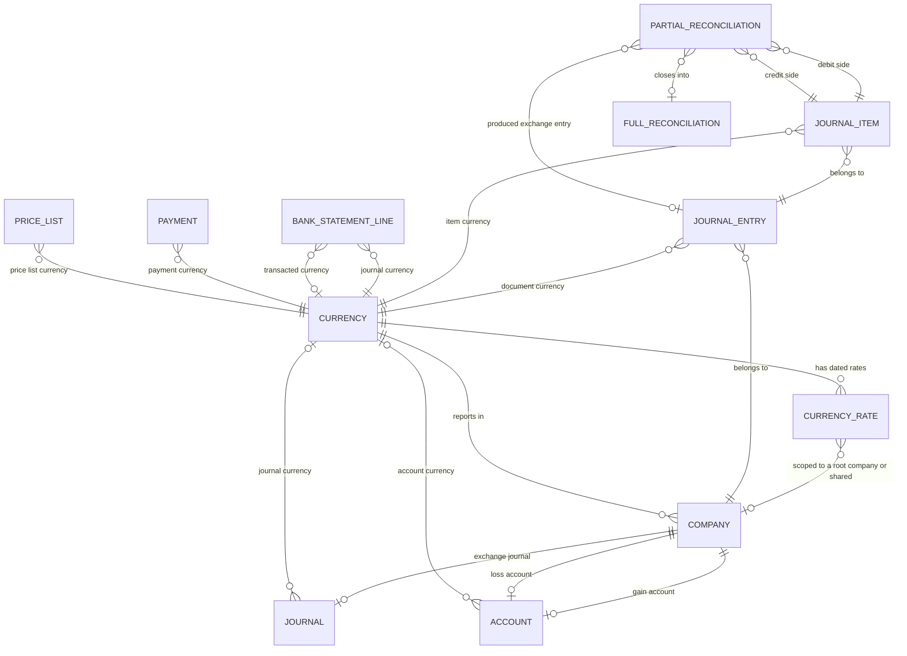

# Multi-Currency — Entities

This file specifies the two entities this domain owns — Currency and Currency Rate — in full, and
the currency-bearing parts of the entities it shares with other domains. For each entity:
purpose, lifecycle, complete field table, relations, uniqueness rules, defaults, derived fields
with their rules, ordering, display rule, archival behaviour, multi-company behaviour and the
extension points other packages contribute.

**How to read the field tables.** Every field table has four columns: the identifier exactly as it
is stored and transported, in code font; the full name of the field in words; the type; and the
meaning and rules. A field marked *stored* has a real column. A field marked *derived* is
recomputed from its inputs; the table says whether the derived value is also stored, and whether
it can be written directly.

**Fields every entity carries.** Every persistent entity in the platform carries an internal
identifier (a surrogate whole number that is the primary key), the moment and the author of its
creation, and the moment and the author of its last change. Entities that support archiving also
carry an activity flag. These are not repeated in the per-entity tables except where a rule
depends on one of them.

**Three fields named for something they are not.** Three stored fields carry the identifier `name`
although they hold something that is not a name. They are reproduced with that identifier, because
it is contractual, and this document always states the full name beside it:

| Entity | Identifier | Full name used in this repository |
|---|---|---|
| Currency | `name` | currency code |
| Currency Rate | `name` | rate date |
| Journal Entry | `name` | entry number |

**The reference of rate one.** Rates are stored against an abstract reference unit whose rate is
one. In a freshly configured platform the main currency of the root company carries no rate rows
at all and therefore takes the fallback value of one, which makes it coincide with that reference;
but this is a convention of the shipped data, not a stored property. Any currency may carry rate
rows, including the main currency. Every formula in this domain is written so that it stays
correct when the main currency itself carries rate rows. See
[calculations.md](calculations.md) section 7.

Contents:

1. [Currency](#1-currency)
2. [Currency Rate](#2-currency-rate)
3. [Journal Entry — currency fields](#3-journal-entry--currency-fields)
4. [Journal Item — currency fields](#4-journal-item--currency-fields)
5. [Partial Reconciliation — currency fields](#5-partial-reconciliation--currency-fields)
6. [Full Reconciliation — currency aspects](#6-full-reconciliation--currency-aspects)
7. [Company — currency fields](#7-company--currency-fields)
8. [Journal — currency fields](#8-journal--currency-fields)
9. [Account — currency fields](#9-account--currency-fields)
10. [Bank Statement Line — currency fields](#10-bank-statement-line--currency-fields)
11. [Payment — currency fields](#11-payment--currency-fields)
12. [Price List — currency fields](#12-price-list--currency-fields)
13. [Configuration Settings — currency fields](#13-configuration-settings--currency-fields)
14. [Language — formatting fields](#14-language--formatting-fields)
15. [Relationship summary](#15-relationship-summary)
16. [Invariants across entities](#16-invariants-across-entities)
17. [Reconciliation notes](#17-reconciliation-notes)

---

# 1. Currency

Currency (`res.currency`, table `res_currency`) is a unit of money. Reference page:
[../../references/entities/res.currency.md](../../references/entities/res.currency.md).

## 1.1 Purpose

A currency answers four questions about every amount expressed in it:

1. **How is it snapped?** The rounding factor gives the multiple every amount is rounded onto.
2. **How is it written?** The symbol, the symbol position and the derived number of decimal places
   give the presentation.
3. **How is it spoken?** The unit label and the subunit label give the words used when an amount
   is written out in full.
4. **What is it worth?** The attached dated rate records give the value against the reference of
   rate one, and through it against any other currency.

## 1.2 Lifecycle

1. **Created**, normally as part of the shipped reference data; a user holding the configuration
   permission may add one. All shipped currencies are created inactive.
2. **Activated**, by a user, by a company adopting it as its main currency, or by a country
   package or chart of accounts template that activates the currency of its country.
3. **Used**: documents, journal items, price lists, journals and accounts reference it. From the
   first journal item on, its rounding factor may no longer be raised
   ([business-rules.md](business-rules.md) `MCUR-006`).
4. **Deactivated**, unless a company uses it as its main currency. Deactivation archives every
   price list expressed in it.
5. **Deleted**, only while no record refers to it. Deleting it deletes its rate rows through the
   cascade on the rate's currency link.

Creating a currency, deleting one, or writing its activity flag re-evaluates whether the
multi-currency permission group is granted to every internal user (section 1.8).

## 1.3 Identity, ordering and display

| Aspect | Rule |
|---|---|
| Natural key | The currency code (`name`). Enforced by a stored uniqueness constraint across the whole table, archived records included. |
| Display name | The currency code. |
| Record-name search | A typed term matches a currency when it is contained in the currency code (`name`) or in the full name (`full_name`). |
| Search-panel search | The single search field of the currency list matches the typed term against the currency code, the full name, the symbol, the unit label or the subunit label; any one containing the term is a match. |
| Default ordering | Activity flag descending, then currency code ascending. Active currencies therefore appear before archived ones, and within each block the order is alphabetical by code. |
| Hierarchy | None. Currencies are a flat set. |
| Company scoping | None. A Currency record is global and visible to every company. Only its rate rows may be company-scoped. |
| Archiving | Supported through the activity flag. An archived currency is hidden from default queries and from selection lists, but remains readable and remains referenced by historical records. |

## 1.4 Field table

| Field (storage name) | Full name | Type | Meaning and rules |
|---|---|---|---|
| `name` | currency code | Text, at most three characters | **Required, stored.** The three-letter alphabetic code of the international currency-code standard, for example `EUR` for the euro, `USD` for the United States dollar, `JPY` for the Japanese yen. Unique across all currencies including archived ones (section 1.6). Used as the display name everywhere. |
| `iso_numeric` | international standard numeric code | Whole number | **Stored, optional.** The three-digit numeric code of the same international standard, for example eight hundred forty for the United States dollar and nine hundred seventy-eight for the euro. Used by structured document formats and by payment file formats that identify a currency numerically. Three shipped currencies carry none. Not unique: two pairs of shipped currencies share a numeric code (see [configuration.md](configuration.md) section 4.2). |
| `full_name` | full name | Text | **Stored, optional.** The currency's name in words, for example "United States dollar". Displayed under the column heading "Name". Included in the record-name search together with the code. |
| `symbol` | symbol | Text | **Required, stored.** The sign printed next to an amount, for example `$`, `€`, `£`, `₹`. May be several characters, as in `Bds$`, `CHF` or `Afl.`. |
| `rate` | current rate | Decimal, full precision, no fixed display rounding | **Derived, not stored, read-only.** How many units of this currency one unit of the evaluation currency buys, on the evaluation date, for the evaluation company. The evaluation currency defaults to the main currency of the company in context; the evaluation date defaults to today in the reader's time zone. Computed as described in [calculations.md](calculations.md) section 7.4. Depends on the rate rows and on four context values: the target currency, the date, the company and the company identifier. Labelled "Current Rate". |
| `inverse_rate` | inverse rate | Decimal, full precision | **Derived, not stored, read-only.** The reciprocal of the current rate: how many units of the evaluation currency one unit of this currency buys. This is the number the conversion routine multiplies by when converting *into* the evaluation currency. |
| `rate_string` | rate as text | Text | **Derived, not stored.** A one-line human-readable statement of the current rate, built as: the digit one, a space, the evaluation currency code, a space, an equals sign, a space, the current rate rendered with exactly six decimal digits, a space, this currency's code. Empty when this currency is the main currency of the company in context. |
| `rate_ids` | rates | Collection of Currency Rate | **Stored inverse relation.** The dated rate rows belonging to this currency, related through the rate's currency link. Deleting the currency deletes them (the link cascades). Not copied when a currency is duplicated. |
| `rounding` | rounding factor | Decimal with twelve total digits of which six are fractional | **Stored, default one hundredth.** Amounts in this currency are rounded onto the nearest multiple of this value. Must be strictly greater than zero (section 1.6). A value of one means the currency has no subunit in practice. A value that is not a power of ten is legal: five hundredths would snap amounts onto five-cent multiples. |
| `decimal_places` | decimal places | Whole number | **Derived and stored**, recomputed whenever the rounding factor changes. The number of fractional digits used when an amount in this currency is written to storage, rendered for display or spelled in words. See the formula in section 1.5. Never written on its own: a direct write is overwritten by the next recomputation. |
| `active` | activity flag | True or false | **Stored, default true.** An archived currency is hidden from ordinary selection lists but keeps all its records. Cannot be set false while a company uses the currency (section 1.7). All shipped currencies are delivered with this flag false. |
| `position` | symbol position | Selection | **Stored, default `after`.** Where the symbol is placed relative to the number. Values: `after`, labelled "After Amount"; `before`, labelled "Before Amount". |
| `date` | last rate date | Date | **Derived, not stored.** The rate date of the most recent rate row of this currency, taken as the first row under the rate ordering, which is rate date descending then internal identifier ascending. Empty when the currency has no rate row. Displayed in lists under the heading "Last Update". |
| `currency_unit_label` | currency unit label | Text, translatable | **Stored, optional.** The plural name of one whole unit, used when an amount is written out in words: "Dollars", "Euros", "Rupees". Two shipped currencies carry none. |
| `currency_subunit_label` | currency subunit label | Text, translatable | **Stored, optional.** The plural name of one hundredth — more generally of one rounding step — of the unit: "Cents", "Pence", "Paisa". Five shipped currencies carry none. |
| `is_current_company_currency` | is current company currency | True or false | **Derived, not stored.** True when this currency is the main currency of the company the reader is working in. Depends on the company context value. Drives the informational banner on the form and hides the rates tab. |
| `display_rounding_warning` | display rounding warning | True or false | **Derived, not stored.** True while a form holds an unsaved change to the rounding factor on an already persisted currency. Drives the irreversibility panel described in [interfaces.md](interfaces.md) section 2.3. Contributed by the accounting capability package. |
| `fiscal_country_codes` | fiscal country codes | Text | **Derived at default time, never stored.** A comma-separated list of the fiscal country codes of the companies the reader is currently working in. A helper used to decide which country-specific fields to show on the currency form. Contributed by the accounting capability package. |

### 1.4.1 Country-specific fields

These fields are contributed by country packages; they are listed here so that the field inventory
is complete and are specified in [../fiscal-localizations/README.md](../fiscal-localizations/README.md).

| Field (storage name) | Full name | Type | Contributed by | Meaning |
|---|---|---|---|---|
| `l10n_ar_afip_code` | Argentina tax authority code | Text, at most four characters | The Argentina package | The currency code the Argentine tax authority requires on an electronic invoice. |
| `l10n_cl_currency_code` | Chile currency code | Text, translatable | The Chile package | The currency code used on Chilean statutory documents. |
| `l10n_cl_short_name` | Chile short name | Text, translatable | The Chile package | The short currency name used on Chilean statutory documents. |

## 1.5 Derived decimal places

Inputs: the rounding factor. Recomputed and stored whenever the rounding factor changes.

```formula
decimal places = ceiling( log10( 1 ÷ rounding factor ) )    when 0 < rounding factor < 1
decimal places = 0                                          otherwise
```

Worked values:

| Rounding factor | One divided by it | Base-ten logarithm | Ceiling | Decimal places |
|---|---|---|---|---|
| 0.01 | 100 | 2 | 2 | 2 |
| 0.001 | 1 000 | 3 | 3 | 3 |
| 0.0001 | 10 000 | 4 | 4 | 4 |
| 0.05 | 20 | 1.30103… | 2 | 2 |
| 0.5 | 2 | 0.30103… | 1 | 1 |
| 1 | 1 | 0 | — | 0 (the "otherwise" branch, because the factor is not strictly below one) |
| 1.00 | 1 | 0 | — | 0 (same branch; numerically identical to one) |
| 5 | 0.2 | −0.69897… | — | 0 (same branch) |

Note the asymmetry deliberately built into the rule: a factor of five hundredths yields **two**
decimal places, not one, because two fractional digits are needed to write a multiple of five
hundredths. A factor of five — a currency rounding onto multiples of five units — yields **zero**
decimal places, and the rounding onto multiples of five is still applied by the rounding routine
even though nothing in the rendered text shows it. The rounding factor, not the decimal place
count, decides which values are reachable.

## 1.6 Stored constraints and indexes

| Name | Statement | Message shown when violated |
|---|---|---|
| Unique currency code | Unique on the currency code | "The currency code must be unique!" |
| Positive rounding factor | Check that the rounding factor is greater than zero | "The rounding factor must be greater than 0!" |

No index is declared on Currency beyond the primary key and the index implied by the uniqueness
constraint.

## 1.7 Validation rules

| Trigger | Condition that fails | Message |
|---|---|---|
| Writing the activity flag to false | At least one company has one of the currencies being deactivated as its main currency | "This currency is set on a company and therefore cannot be deactivated." |
| Writing the rounding factor | The new value is greater than the current value, or the new value is zero, **and** the currency has already been used to round accounting entries — meaning at least one journal item exists whose item currency or whose company currency is this currency | "You cannot reduce the number of decimal places of a currency which has already been used to make accounting entries." |

The company-currency check is **skipped** in two situations, both signalled through context values
rather than through data:

1. **During package installation**, because a currency that is being attached to a company is
   momentarily still seen as inactive while the attachment is in progress.
2. **When a forced deactivation is explicitly requested**, an escape hatch used to exercise
   single-currency behaviour.

A rebuild must reproduce both escape hatches, because without the first one, installing reference
data becomes impossible.

Raising the precision — writing a *smaller* rounding factor — is always permitted, because
previously stored amounts remain exactly representable on the finer grid.

## 1.8 The multi-currency permission group

Whenever a currency is created, deleted, or has its activity flag written, the system counts the
active currencies and adjusts the multi-currency permission group:

1. Count the currencies whose activity flag is true.
2. If the count is **greater than one**, grant the multi-currency group to the base internal-user
   group, so that every internal user inherits it.
3. If the count is **one or zero**, remove the multi-currency group from the base internal-user
   group.

The grant is applied to the group, not to individual users. The effect is that the currency
column, the rate column and the second amount column appear across the interface exactly when more
than one currency is active, with no separate setting to toggle.

Granting the multi-currency group additionally grants the price list capability group to the
internal-user group when internal users do not already hold it, and creates or activates a default
price list for every company, because working with several currencies requires a price list per
currency. See [../pricing-and-pricelists/README.md](../pricing-and-pricelists/README.md).

## 1.9 Cache invalidation

Two caches depend on currencies and must be cleared:

- **The cached catalogue of active currencies** — the map from currency identifier to code,
  symbol, symbol position and decimal places that the display layer uses to render a monetary
  value without a round trip — is cleared on every creation, on every deletion, and on every write
  that touches one of five keys: the activity flag, a key named for the digit count, the currency
  code, the symbol position or the symbol.
- **The derived inverse rate of every currency** is invalidated on every creation or write of a
  rate row, so that the displayed current rate refreshes.

**Compatibility finding.** The five keys that trigger the catalogue invalidation include one named
for the digit count, but no field of that name exists on the currency: the decimal places are
stored under the identifier `decimal_places`. That key can therefore never appear in a write and
never fires. It is harmless, because the decimal places are only ever changed together with the
rounding factor, and the rounding factor is not in the trigger set either. A corrected behaviour
would list the rounding factor and the decimal places in the trigger set, so that a change of
precision refreshes the cached catalogue immediately instead of at the next unrelated write.

## 1.10 Record lifecycle and side effects

| Event | Effects |
|---|---|
| Create | The record is stored. The multi-currency group is re-evaluated (section 1.8). The cached catalogue of active currencies is invalidated. |
| Write touching the activity flag, the currency code, the symbol position or the symbol | The cached catalogue is invalidated. |
| Write touching the activity flag | The multi-currency group is re-evaluated. When the currency is being deactivated, every price list expressed in it is archived. |
| Write touching the rounding factor | Refused when it would lower the precision of a currency already used in accounting entries (section 1.7). Otherwise the decimal places are recomputed and stored. |
| Setting the currency on a company | When the currency is archived it is activated silently before the company is written. |
| Archive | Blocked when a company uses the currency. Otherwise the currency disappears from selection lists, its price lists are archived, and documents still in draft that use it can no longer be posted. |
| Delete | Allowed only when no record references the currency. Deleting it deletes its rate rows through the cascade. The multi-currency group is re-evaluated and the cached catalogue is invalidated. |

## 1.11 Multi-company behaviour

A currency is **global**: it has no company field and is visible to every company. Two users
working in two different companies see the same catalogue and the same values, and a change made
in one company is read by the other. Only the *rates* of a currency are company-scoped, and only
to root companies.

---

# 2. Currency Rate

Currency Rate (`res.currency.rate`, table `res_currency_rate`) is the value of one currency on one
date for one root company. Reference page:
[../../references/entities/res.currency.rate.md](../../references/entities/res.currency.rate.md).

## 2.1 Purpose

The rate table is a step function of time. A rate row is not valid "on its date" only: it is valid
from its date onwards, until a later row for the same currency and the same company scope
supersedes it. The lookup algorithm in [calculations.md](calculations.md) section 7 implements
exactly that reading, and projects the earliest known rate backwards without limit for dates
before the first row.

## 2.2 The three representations

A rate can be entered in three interchangeable ways, and the system keeps all three consistent.
Understanding which one is stored is essential.

| Representation | Field | Question it answers |
|---|---|---|
| Technical rate | `rate` | How many units of this currency correspond to one unit of the abstract reference of rate one? **This is the value actually stored.** |
| Company rate | `company_rate` | How many units of this currency does one unit of the company's main currency buy on this date? |
| Inverse company rate | `inverse_company_rate` | How many units of the company's main currency does one unit of this currency buy on this date? |

The abstract reference is whichever currency happens to have rate one. In a freshly configured
system the company's own currency has no rate rows at all and therefore takes the fallback value
of one, which makes the technical rate and the company rate numerically identical. As soon as the
company currency has its own rate rows the two diverge, and the company rate is the one a user
should read. The technical rate is hidden from ordinary users
([business-rules.md](business-rules.md) `MCUR-032`).

## 2.3 Identity, ordering and display

| Aspect | Rule |
|---|---|
| Natural key | The triple of rate date (`name`), currency (`currency_id`) and company (`company_id`). Enforced by a stored uniqueness constraint. An empty company is a distinct value, so a shared row and a company-scoped row may share a day. |
| Display name | The rate date, rendered in the reader's date format. |
| Record-name search | A typed term is first parsed as a date in the reader's language and date format and the parsed value matched against the rate date; a term that cannot be parsed as a date is matched against the technical rate instead. The parsing step exists because the display name is a date and a free-text search must not attempt to match a date column against arbitrary text. |
| Default ordering | Rate date descending, then internal identifier ascending. The most recent rate therefore appears first. |
| Hierarchy | None. |
| Company scoping | Optional. A row with an empty company applies to every company. A row with a company applies to that company and, through the root resolution of the lookup, to its branches. A rate row may only name a root company (section 2.7). |
| Archiving | Not supported. Rate rows are created, edited and deleted, never archived. |

## 2.4 Field table

| Field (storage name) | Full name | Type | Meaning and rules |
|---|---|---|---|
| `name` | rate date | Date | **Required, stored, indexed, default today in the reader's time zone.** The first day on which this rate applies. Labelled "Date". |
| `rate` | technical rate | Decimal, full precision, aggregated as an average when grouped | **Stored.** How many units of this currency correspond to one unit of the reference of rate one. Must be strictly positive (section 2.6). Labelled "Technical Rate". Hidden from the standard form and list; visible only to a reader holding the technical features group. Never rounded: a rate carries its full stored precision into every computation. |
| `company_rate` | company rate | Decimal, full precision, aggregated as an average | **Derived, not stored, writable through its inverse operation.** Equals the technical rate divided by the technical rate of the company's own main currency in force for that company. This is the value an accountant enters. Its column heading is generated from the two currency codes; see section 2.10. |
| `inverse_company_rate` | inverse company rate | Decimal, full precision, aggregated as an average | **Derived, not stored, writable through its inverse operation.** The reciprocal of the company rate. |
| `currency_id` | currency | Link to Currency | **Required, stored, indexed, read-only in the form once the row exists.** The currency this rate applies to. Deleting the currency deletes the rate row (the link cascades). |
| `company_id` | company | Link to Company | **Stored, default: the root company of the company the reader is working in.** May be empty, which means the rate is shared by every company. Must never name a branch company (section 2.7). |

## 2.5 The sanitising rule: precedence among the three representations

More than one of the three representations may be supplied in the same creation or the same
write. The supplied values are reduced to one before anything is stored, in this exact order:

1. If the inverse company rate is present **and** either the company rate or the technical rate is
   also present, the inverse company rate is dropped.
2. If the company rate is present **and** the technical rate is also present, the company rate is
   dropped.

The surviving value then drives the other two through the rules of section 2.9. The effective
precedence is therefore: technical rate beats company rate beats inverse company rate. A rebuild
must apply the two steps in that order, on creation and on update alike.

## 2.6 Stored constraints and indexes

| Name | Statement | Message shown when violated |
|---|---|---|
| One rate per currency, company and day | Unique on the triple rate date, currency, company | "Only one currency rate per day allowed!" |
| Strictly positive rate | Check that the technical rate is greater than zero | "The currency rate must be strictly positive." |
| Index on the rate date | Index on the rate date | Not applicable. Supports the "latest rate on or before a date" lookup. |
| Index on the currency | Index on the currency link | Not applicable. Supports the per-currency lookup. |

## 2.7 Validation rules

| Trigger | Condition that fails | Message |
|---|---|---|
| Writing the company | The named company has a parent company, meaning it is a branch and not a root company | "Currency rates should only be created for main companies" |
| Asking for the rate that precedes a row | The row carries no rate date | "The name for the current rate is empty.⏎Please set it." The line break between the two sentences is part of the message. The word "name" in the message is the identifier of the date field. |

## 2.8 The large-movement warning

When a user edits the company rate in a form, the system compares the technical rate implied by
the entry with the technical rate of the latest **strictly earlier** row of the same currency and
the same company scope. When such a row exists:

```formula
relative movement = ( previous technical rate − new technical rate ) ÷ previous technical rate
```

If the absolute value of the relative movement exceeds **zero point two** — twenty percent in
either direction — a non-blocking warning is shown:

- Title: "Warning for " followed by the currency code.
- Body, on two lines: "The new rate is quite far from the previous rate.⏎Incorrect currency rates
  may cause critical problems, make sure the rate is correct!"

The warning does not prevent saving. It is raised only in the interactive form path, never on a
programmatic write or an import.

A country package may add a further warning on the same trigger. The Egypt package warns when the
fiscal country of the company is Egypt and the entered inverse company rate carries more than five
significant fractional digits, with the title "Warning for " followed by the currency code and the
body "Please make sure that the EGP per unit is within 5 decimal accuracy.⏎Higher decimal accuracy
might lead to inconsistency with the ETA invoicing portal!" — reproduced verbatim, including the
currency code and the abbreviated service name it contains. This warning does not block saving
either.

## 2.9 Rate arithmetic between the three representations

Let *the company's own rate* be, for a given company: among the rate rows of that company's main
currency whose technical rate is non-zero and whose company is that company or is empty, the
technical rate of the row with the greatest rate date; or one when there is no such row.

```formula
company rate           = technical rate ÷ the company's own rate
technical rate         = company rate × the company's own rate
inverse company rate   = 1 ÷ company rate
company rate           = 1 ÷ inverse company rate
```

Guards: when the company rate is zero or unset it is first forced to one before the reciprocal is
taken, so the inverse is never a division by zero; the same guard applies in the other direction
to the inverse company rate. The company used is the row's own company when it has one, otherwise
the root company of the company the reader is working in.

### 2.9.1 Deriving a missing technical rate

The technical rate has no default. When it is not supplied, the value carried forward from the
preceding row is what the derived company rate presents:

1. Find the rate rows of the same currency whose technical rate is non-zero, whose company equals
   this row's company — or the root company of the company the reader is working in when this row
   has none — and whose rate date is **strictly earlier** than this row's rate date, or than today
   when this row has no rate date yet.
2. Sort them by rate date ascending and take the last one.
3. Use its technical rate; if there is none, use one.

That value is what the derived company rate and inverse company rate are computed from while the
row is being edited. Writing either of them through its inverse operation writes the technical
rate, which is what makes the carried-forward value a stored value. A row saved with none of the
three values supplied stores a technical rate of zero and is refused by the positivity check of
section 2.6. A carried-forward value, once stored, is a stored value like any other: editing the
earlier row afterwards does not change the later row.

## 2.10 Generated column headings

The two rate columns a user reads carry headings generated from the currency codes in play, so
that the direction of the rate is never ambiguous:

| Column | Heading in the rate list of a currency form | Heading in the standalone rate list |
|---|---|---|
| `company_rate` | The currency's code, then " per ", then the company currency's code | "Unit per " followed by the company currency's code |
| `inverse_company_rate` | The company currency's code, then " per ", then the currency's code | The company currency's code followed by " per Unit" |

The fallback word "Unit" is used when no specific currency is in context. Because the heading
depends on the company's main currency, the cached form and list definitions are keyed on that
currency code as well.

## 2.11 On-change behaviour in the form

| Edited field | Effect |
|---|---|
| `company_rate` | The technical rate is recalculated through the inverse operation, then the inverse company rate is recalculated from the new company rate. The large-movement warning of section 2.8 is evaluated. |
| `inverse_company_rate` | The company rate is recalculated as its reciprocal, which in turn recalculates the technical rate. |
| `currency_id`, `company_id` or `name` | The technical rate is re-evaluated: while it is still empty, the carried-forward value of the newly selected scope is presented. |

## 2.12 Record lifecycle

| Event | Effects |
|---|---|
| Create | The supplied rate values are reduced by the precedence rule of section 2.5, then stored. The derived inverse rate of every currency is invalidated so that displayed current rates refresh. |
| Write | The same reduction and the same invalidation. |
| Delete | The row disappears; the rate applicable to dates that fell in its validity window reverts to the preceding row, or, when there is none, to the fallback of [calculations.md](calculations.md) section 7.2. Existing journal items are **not** restated: their balances were fixed when they were written. |
| Cascade from Currency | Deleting a currency deletes all its rate rows. |

## 2.13 Multi-company behaviour

Rates live **only on root companies**. A branch company never owns rates; every lookup made for a
branch resolves against the branch's root. A rate row with no company is shared: it applies to
every company that has no company-specific row for that currency satisfying the date condition. The
lookup prefers the company-specific row unconditionally, even over a shared row with a later date:
see [calculations.md](calculations.md) section 7.2.

---

# 3. Journal Entry — currency fields

Journal Entry (`account.move`, table `account_move`) is specified in full in
[../general-ledger/entities.md](../general-ledger/entities.md). Only its currency fields are given
here.

| Field (storage name) | Full name | Type | Meaning and rules |
|---|---|---|---|
| `company_currency_id` | company currency | Link to Currency | **Derived from the company, read-only, stored.** The currency in which the balance, the debit and the credit of every item of the entry are expressed. |
| `currency_id` | document currency | Link to Currency | **Required, derived and stored, writable, tracked in the audit trail, precomputed.** The document currency. Derived as the first of: the foreign currency of the originating bank statement line; the currency forced on the journal; the currency already set on the entry; the main currency of the journal's company. A user may overwrite it while the entry is in draft. |
| `expected_currency_rate` | expected currency rate | Decimal, full precision | **Derived, not stored.** The rate the system *would* apply: the conversion rate from the company currency to the document currency, for the entry's company, at the document's rate date. Exactly one when the entry has no currency. |
| `invoice_currency_rate` | document rate | Decimal, full precision | **Derived and stored, writable, not copied on duplication.** The rate actually applied to this document: how many units of the document currency correspond to one unit of the company currency. Recomputed to the expected rate whenever the document currency, the company currency, the company, the invoice date or the taxable supply date changes — but **only for invoice-like documents**, meaning invoices, credit notes, bills, refunds and receipts; for any other entry it keeps whatever value it holds. A user may override it, which is how a contractually agreed rate is honoured. Labelled "Currency Rate". |
| `amount_untaxed`, `amount_tax`, `amount_total`, `amount_residual` | untaxed amount, tax amount, total amount, residual amount | Money in the document currency | **Derived and stored.** The document totals, expressed in the document currency. |
| `amount_untaxed_signed`, `amount_tax_signed`, `amount_total_signed`, `amount_residual_signed` | signed untaxed amount, signed tax amount, signed total amount, signed residual amount | Money in the company currency | **Derived and stored.** The same totals expressed in the company currency, carrying the sign convention of the ledger rather than that of the document. |
| `amount_untaxed_in_currency_signed`, `amount_total_in_currency_signed` | signed untaxed amount in currency, signed total amount in currency | Money in the document currency | **Derived and stored.** The untaxed amount and the total in the document currency, carrying the ledger sign convention. |
| `display_inactive_currency_warning` | display inactive currency warning | True or false | **Derived, not stored.** True when the entry is in draft and its document currency is archived. Surfaces a warning on the form and blocks posting. |

**The document's rate date** is the invoice date when there is one, otherwise today in the
reader's time zone.

Validation:

| Rule | Condition that fails | Message |
|---|---|---|
| Positive document rate | The entry is invoice-like, has a company, its document currency differs from the company's main currency, and the stored document rate is less than or equal to zero | "The currency rate must be strictly positive." |
| Active currency at posting | The entry is being posted and its document currency is archived | "You cannot validate a document with an inactive currency: " followed by the currency code |

Side effect on change: changing the document currency, the counterparty, the document type, the
document rate or the invoice date on a draft document is one of the changes that triggers a full
recomputation of the derived lines; see
[../accounts-receivable/workflows.md](../accounts-receivable/workflows.md).

---

# 4. Journal Item — currency fields

Journal Item (`account.move.line`, table `account_move_line`) is specified in full in
[../general-ledger/entities.md](../general-ledger/entities.md). Every journal item carries its
amount **twice**: once in the company currency and once in its own currency.

| Field (storage name) | Full name | Type | Meaning and rules |
|---|---|---|---|
| `currency_id` | item currency | Link to Currency | **Required, derived and stored, writable, precomputed.** The currency the item's foreign amount, its subtotals and its foreign residual are expressed in. Derived as: the company currency when the item is a cost-of-goods-sold line; the entry's document currency when the entry is invoice-like; otherwise the currency already on the line, falling back to the main currency of the company. |
| `company_currency_id` | company currency | Link to Currency | **Derived from the entry, read-only, stored.** The currency the balance, the debit, the credit, the residual amount, the tax base amount and the cumulated balance are expressed in. |
| `is_same_currency` | is same currency | True or false | **Derived, not stored.** True when the item currency equals the company currency. |
| `currency_rate` | item rate | Decimal, full precision | **Derived, not stored.** The rate from the company currency to the item currency that applies to this item. For an item of an invoice-like entry it is the entry's stored document rate, defaulting to one when that is zero. Otherwise, when the item has a currency, it is the conversion rate from the company currency to that currency, for the entry's company, at the first of: the entry's invoice date, the entry's accounting date, today. Otherwise it is one. |
| `debit` | debit | Money in the company currency | **Derived and stored, writable through its inverse operation, precomputed.** The balance when the balance is positive, otherwise zero. Under reversal-by-negative-amount accounting the assignment is mirrored: the debit takes the balance when the balance is negative and zero otherwise. |
| `credit` | credit | Money in the company currency | **Derived and stored, writable through its inverse operation, precomputed.** The negated balance when the balance is negative, otherwise zero; mirrored the same way under reversal-by-negative-amount accounting. |
| `balance` | balance | Money in the company currency | **Derived and stored, writable, precomputed, tracked in the audit trail.** The item's amount in the company currency: positive for a debit, negative for a credit. |
| `amount_currency` | amount in currency | Money in the item currency | **Derived and stored, writable through its inverse operation, precomputed.** The item's amount in the document currency, with the same sign as the balance. |
| `cumulated_balance` | cumulated balance | Money in the company currency | **Derived, not stored, not exportable.** A running total of the balance in the order and under the filter of the list the reader is looking at. |
| `amount_residual` | residual amount | Money in the company currency | **Derived and stored.** The part of the balance not yet consumed by matchings. Zero for an item on an account that allows neither reconciliation nor cash handling. |
| `amount_residual_currency` | residual amount in currency | Money in the item currency | **Derived and stored.** The part of the amount in currency not yet consumed by matchings. |
| `reconciled` | is reconciled | True or false | **Derived and stored.** True when *both* residuals are zero, each at its own currency's precision. |
| `price_subtotal`, `price_total` | subtotal excluding taxes, subtotal including taxes | Money in the item currency | **Derived and stored.** The line subtotals, in the document currency. |
| `discount_amount_currency` | discount amount in currency | Money in the item currency | **Stored, default zero.** The early payment discount amount in the document currency. |
| `discount_balance` | discount balance | Money in the company currency | **Stored, default zero.** The early payment discount amount in the company currency. |
| `tax_base_amount` | tax base amount | Money in the company currency, read-only | **Stored, default zero.** The taxable base of a tax line, in the company currency. |
| `exchange_move_ids` | exchange difference entries | Collection of Journal Entry | **Derived, not stored.** The exchange difference entries generated by the matchings this item takes part in. |
| `reconciled_lines_ids` | reconciled lines | Collection of Journal Item | **Derived, not stored.** Every item this item is matched with. |
| `reconciled_lines_excluding_exchange_diff_ids` | reconciled lines excluding exchange differences | Collection of Journal Item | **Derived, not stored.** The same set without the lines of the generated exchange difference entries, so that a reader sees the business counterparties rather than the technical corrections. |
| `matching_number` | matching number | Text | **Stored.** The reference of the group the item belongs to: the identifier of the full reconciliation when the group closed, or the letter `P` followed by an identifier while the group is only partially matched. |

## 4.1 The derivation of the two amounts

The two amounts are tied by the item rate:

```formula
amount in currency = round onto the item currency   ( balance            × item rate )
balance            = round onto the company currency( amount in currency ÷ item rate )
```

Which of the two is derived depends on which the caller supplied:

| Caller supplied | Derived |
|---|---|
| The balance only | The amount in currency, by the first formula. |
| The amount in currency only | The balance, by the second formula. |
| Both | Both are kept as supplied, subject to the two forcings below. |
| Neither | Both remain zero, subject to the two forcings below. |

Two forcings override the table:

- When the item currency equals the company currency **and** the entry is **not** invoice-like,
  the amount in currency is forced equal to the balance, overriding anything supplied. There is
  then no rate arithmetic at all.
- On an invoice-like entry, a change to the amount in currency, to the item rate or to the
  document type re-derives the balance by the second formula, even when a balance was supplied.

Rounding is always applied to the destination: the amount in currency onto the item currency's
rounding factor, the balance onto the company currency's.

## 4.2 The sign invariant and the two companion checks

A stored database check enforces that the balance and the amount in currency never disagree in
sign: either both are less than or equal to zero, or both are greater than or equal to zero.
Section, subsection and note lines are exempt, because they carry no amounts at all.

| Check | Statement | Message |
|---|---|---|
| Sign consistency between the two amounts | The display type is a section, a subsection or a note, **or** both amounts are less than or equal to zero, **or** both amounts are greater than or equal to zero | "The amount expressed in the secondary currency must be positive when account is debited and negative when account is credited. If the currency is the same as the one from the company, this amount must strictly be equal to the balance." |
| One side only | The display type is a section, a subsection or a note, **or** the product of the debit and the credit is zero | "Wrong credit or debit value in accounting entry!" |
| Non-accountable lines carry nothing | The display type is **not** a section, a subsection or a note, **or** the amount in currency, the debit and the credit are all zero and the account is empty | "Forbidden balance or account on non-accountable line" |
| Account currency agreement | Validated on write rather than by the database: the account of the item carries a currency, that account currency differs from the company currency, and it differs from the item currency | "The account selected on your journal entry forces to provide a secondary currency. You should remove the secondary currency on the account." |

Because the balance and the amount in currency are checked against each other by a stored
statement that reads both columns, both columns must be sent to storage in the same operation even
when only one of them was modified. A replacement implementation must either do the same or defer
the check to the end of the transaction; writing one column alone would fail the check on an
intermediate state that the second write is about to correct.

The stored selection values of the display types named above are `line_section`, `line_subsection`
and `line_note`.

## 4.3 On-change behaviour owned by this domain

| Edited field | Effect |
|---|---|
| `amount_currency` or `currency_id` | When the item currency equals the company's main currency and the balance differs from the amount in currency, the balance is set equal to the amount in currency. When the item currency differs from the company's main currency, the entry is not invoice-like, and the balance is not write-protected, the balance is set to the amount in currency divided by the item rate, rounded onto the company currency. |
| `debit` | The credit is cleared when the debit is non-zero, then the balance is recomputed as the debit minus the credit. |
| `credit` | The debit is cleared when the credit is non-zero, then the balance is recomputed as the debit minus the credit. |

For an invoice-like entry the balance is never re-derived this way, because it is governed by the
document rate.

## 4.4 The residual computation

For an item whose account allows reconciliation, or whose account type is cash or credit card:

```formula
residual amount              = round onto the company currency( balance            − matched as debit in company currency + matched as credit in company currency )
residual amount in currency  = round onto the item currency   ( amount in currency − matched as debit in currency         + matched as credit in currency )
is reconciled                = the residual amount is zero at the company currency  AND  the residual amount in currency is zero at the item currency
```

where the four matched quantities are sums over the partial reconciliations in which this item
plays the debit role (the first of each pair) or the credit role (the second). The sums of the
foreign amounts are themselves rounded to the number of decimal places of the corresponding
currency **inside the aggregation**, before being subtracted; summing first and rounding at the
end can differ by one unit in the last place over a chain of many matchings.

An item on an account that is neither reconcilable nor cash-like has both residuals forced to zero
and the reconciled flag forced to false.

---

# 5. Partial Reconciliation — currency fields

Partial Reconciliation (`account.partial.reconcile`, table `account_partial_reconcile`) is
specified in full in
[../payments-and-bank-reconciliation/entities.md](../payments-and-bank-reconciliation/entities.md).
It records a match between exactly two journal items and carries **three** amounts, because the
two items may be in two different currencies while the company reports in a third.

| Field (storage name) | Full name | Type | Meaning and rules |
|---|---|---|---|
| `debit_move_id` | debit item | Link to Journal Item | **Required, stored, indexed.** |
| `credit_move_id` | credit item | Link to Journal Item | **Required, stored, indexed.** |
| `company_currency_id` | company currency | Link to Currency | **Derived from the company, not stored.** The currency the matched amount is expressed in. |
| `debit_currency_id` | debit currency | Link to Currency | **Derived from the debit item and stored, precomputed.** |
| `credit_currency_id` | credit currency | Link to Currency | **Derived from the credit item and stored, precomputed.** |
| `amount` | matched amount | Money in the company currency | **Stored. Always positive.** The amount matched, in the company currency. |
| `debit_amount_currency` | matched amount in the debit currency | Money in the debit currency | **Stored. Always positive.** The amount matched, expressed in the debit item's currency. |
| `credit_amount_currency` | matched amount in the credit currency | Money in the credit currency | **Stored. Always positive.** The amount matched, expressed in the credit item's currency. |
| `company_id` | company | Link to Company | **Derived and stored, writable, precomputed.** The company of the debit item when the debit item's entry is invoice-like, otherwise the company of the credit item. This choice puts any exchange difference entry or cash-basis entry on the invoice's side. |
| `max_date` | latest matched date | Date | **Derived and stored, precomputed.** The later of the two items' accounting dates. Used to date the match on ageing reports. |
| `full_reconcile_id` | full reconciliation | Link to Full Reconciliation | **Stored, not copied.** Set when the whole connected group closes. |
| `exchange_move_id` | exchange difference entry | Link to Journal Entry | **Stored.** The exchange difference entry this match produced, when one was needed. |
| `draft_caba_move_vals` | draft cash-basis values | Structured document | **Stored.** The values used to build a draft cash-basis entry, kept so that the entry can be judged still valid when the invoice is posted. |

Validation:

| Rule | Condition that fails | Message |
|---|---|---|
| Both currencies known | Either the debit currency or the credit currency is empty | "Missing foreign currencies on partials having ids: " followed by the list of the internal identifiers of the offending records. The message is reproduced as it is shown, including its abbreviation of the word identifiers. |

Lifecycle notes with currency consequences:

- Creating a partial reconciliation may flip a linked payment from the in-process state to the
  paid state when the matched amount equals the payment amount **compared at the payment
  currency's precision**, and only for a payment that has no outstanding account.
- Deleting a partial reconciliation **reverses or deletes** the exchange difference entry it
  produced, and returns such a payment to the in-process state; see [workflows.md](workflows.md)
  section 12.

---

# 6. Full Reconciliation — currency aspects

Full Reconciliation (`account.full.reconcile`, table `account_full_reconcile`) is specified in full
in
[../payments-and-bank-reconciliation/entities.md](../payments-and-bank-reconciliation/entities.md).
This domain owns one aspect of it: **which currency column has to close** before a connected group
of matched items is declared fully reconciled.

The test is applied to every item of the connected group after the matchings and the exchange
differences have been created:

1. An item whose reconciled flag is true counts as reconciled.
2. An item that takes part in no matching at all does **not** count as reconciled, even when its
   residual amount is nil. This clause exists for an item whose balance is zero while its amount
   in currency is not — a bare exchange difference line, for instance.
3. Otherwise, when the set of distinct currencies among the items of the group has **more than
   one** member, the item counts as reconciled when its residual amount is zero at the company
   currency's precision.
4. Otherwise — a single currency across the group — the item counts as reconciled when its
   residual amount in currency is zero at the item currency's precision.

The group is fully reconciled, and a Full Reconciliation record is created for it, when every item
counts as reconciled. Clauses three and four differ deliberately: when several currencies are
involved the company currency is the only common denominator and is the one that must close; when
a single currency is involved the document currency column is the one that must close, because the
company currency column may legitimately retain a difference that a further exchange difference
entry will clear.

---

# 7. Company — currency fields

Company (`res.company`, table `res_company`) is specified in full in
[../contacts-and-organizations/entities.md](../contacts-and-organizations/entities.md). Only its
currency fields are given here.

| Field (storage name) | Full name | Type | Meaning and rules |
|---|---|---|---|
| `currency_id` | main currency | Link to Currency | **Required, stored, delegated from the root company.** The currency the company keeps its books in, called the *company currency* throughout this repository. Default: the main currency of the company of the user creating the record. When a country is chosen on the company form, the currency of that country is proposed. Every branch must carry the same value as its root, and the field is read-only on a branch's form. Cannot be changed once any journal item exists for the root company or for any company below it. Setting it activates the currency automatically. |
| `currency_exchange_journal_id` | exchange difference journal | Link to Journal | **Stored.** The journal in which exchange difference entries are created. Restricted to journals whose type is general. Normally pre-filled by the chart of accounts template. Labelled "Exchange Gain or Loss Journal". |
| `income_currency_exchange_account_id` | gain exchange account | Link to Account | **Stored.** The account credited when a rate movement produces a gain. Restricted to accounts whose internal group is income. Labelled "Gain Exchange Rate Account". |
| `expense_currency_exchange_account_id` | loss exchange account | Link to Account | **Stored.** The account debited when a rate movement produces a loss. Restricted to accounts whose type is expense or other expense. Labelled "Loss Exchange Rate Account". |
| `display_invoice_tax_company_currency` | display invoice tax in company currency | True or false | **Stored, default true.** When true, a printed invoice in a foreign currency additionally shows the tax amounts translated into the company currency. |
| `display_invoice_amount_total_words` | display invoice total in words | True or false | **Stored, default false.** When true, a printed invoice shows the document total spelled out in words using the document currency's unit and subunit labels. |

Validation owned by this domain:

| Rule | Condition that fails | Message |
|---|---|---|
| A branch shares its root's currency | The value written on a branch differs from the root company's value | "The *field label* of a subsidiary must be the same as it's root company." The placeholder is the translated label of the field being written, which for this field is "Currency". The message is reproduced as it is shown, including its grammatical slip. |
| The currency is frozen once entries exist | The write changes the main currency and at least one journal item exists for the root company or for any company below it, whether active or archived | "You cannot change the currency of the company since some journal items already exist" |

Side effects: creating or writing a company whose main currency is archived activates that
currency silently; selecting a parent company on a form copies the parent's currency onto the
record immediately; changing the main currency re-renders every view whose rate column headings
are generated from the company currency code.

---

# 8. Journal — currency fields

Journal (`account.journal`, table `account_journal`) is specified in full in
[../general-ledger/entities.md](../general-ledger/entities.md).

| Field (storage name) | Full name | Type | Meaning and rules |
|---|---|---|---|
| `currency_id` | journal currency | Link to Currency | **Stored, optional.** When set, every entry of the journal takes this currency as its document currency. Setting it propagates the currency to the journal's default account and to the bank account record linked to the journal. When the journal currency differs from the company's main currency, the display name of the journal is suffixed with the currency code in parentheses. When empty, the journal accepts the company's main currency and any document currency. |

---

# 9. Account — currency fields

Account (`account.account`, table `account_account`) is specified in full in
[../general-ledger/entities.md](../general-ledger/entities.md).

| Field (storage name) | Full name | Type | Meaning and rules |
|---|---|---|---|
| `currency_id` | account currency | Link to Currency | **Stored, optional, tracked in the audit trail.** When set, every journal item posted to the account must carry that currency. When empty, the account accepts any currency. Labelled "Account Currency". |
| `company_currency_id` | company currency | Link to Currency | **Derived, not stored.** The main currency of the company the reader is working in. Used as the currency of the opening balance fields. |

Validation owned by this domain:

| Rule | Condition that fails | Message |
|---|---|---|
| An account currency must agree with the journal currency | The account is the default account of a journal, or the payment account of an inbound or outbound payment method line of a journal, and that journal has a currency that is not the company's main currency, and the account currency differs from the journal currency | "The foreign currency set on the journal '*journal display name*' and the account '*account display name*' must be the same." |
| An account currency may not be set once items in another currency exist | At least one journal item already exists on the account whose item currency is neither empty nor the new value | "You cannot set a currency on this account as it already has some journal entries having a different foreign currency." |

---

# 10. Bank Statement Line — currency fields

Bank Statement Line (`account.bank.statement.line`, table `account_bank_statement_line`) is
specified in full in
[../payments-and-bank-reconciliation/entities.md](../payments-and-bank-reconciliation/entities.md).

| Field (storage name) | Full name | Type | Meaning and rules |
|---|---|---|---|
| `currency_id` | journal currency | Link to Currency | **Derived and stored.** The currency of the bank account: the journal's currency when it has one, otherwise the company's main currency. The amount is expressed in it. Labelled "Journal Currency". |
| `foreign_currency_id` | transacted currency | Link to Currency | **Stored, optional.** The currency actually transacted, when it differs from the bank account currency. Labelled "Foreign Currency". |
| `amount` | amount | Money in the journal currency | **Stored.** The amount credited to or debited from the bank account, in the bank account currency. Positive for money in, negative for money out. |
| `amount_currency` | amount in currency | Money in the transacted currency | **Derived and stored, writable.** The amount in the transacted currency. Cleared when the transacted currency is empty. When a transacted currency is set, a date is known and no value has yet been entered, it is derived by converting the amount from the bank account currency to the transacted currency for the line's company at the line's date. An amount already entered is never overwritten. Labelled "Amount in Currency". |
| `amount_residual` | residual amount | Decimal | **Derived, not stored.** The amount left to reconcile, expressed in the transacted currency when there is one and in the bank account currency otherwise. |

Validation owned by this domain:

| Rule | Condition that fails | Message |
|---|---|---|
| The transacted currency differs from the bank account currency | The transacted currency equals the journal currency | "The foreign currency must be different than the journal one: " followed by the journal currency's code |
| An amount in currency requires a transacted currency | The transacted currency is empty and the amount in currency is non-zero | "You can't provide an amount in foreign currency without specifying a foreign currency." |
| A transacted currency requires an amount in currency | The amount in currency is zero and a transacted currency is set | "You can't provide a foreign currency without specifying an amount in 'Amount in Currency' field." |

On creation, when a journal and a transacted currency are supplied together and the supplied
transacted currency equals the journal's effective currency — the journal's own currency, or the
company currency when the journal has none — the transacted currency is silently cleared and the
amount in currency is set to zero instead of the first message being raised. This makes a bulk
import tolerant of a feed that always states the currency.

---

# 11. Payment — currency fields

Payment (`account.payment`, table `account_payment`) is specified in full in
[../payments-and-bank-reconciliation/entities.md](../payments-and-bank-reconciliation/entities.md).

| Field (storage name) | Full name | Type | Meaning and rules |
|---|---|---|---|
| `currency_id` | payment currency | Link to Currency | **Derived and stored, writable.** The currency the payment is made in. Derived as the journal's currency when it has one, otherwise the currency of the documents being paid, otherwise the company's main currency. |
| `company_currency_id` | company currency | Link to Currency | **Derived from the company, not stored.** The currency of the signed company-currency amount. |
| `amount` | amount | Money in the payment currency | **Stored.** The payment amount, always positive; the direction is carried by the payment type. |
| `amount_signed` | signed amount | Money in the payment currency | **Derived.** The payment amount carrying a sign: positive for money in, negative for money out. |
| `amount_company_currency_signed` | signed amount in company currency | Money in the company currency | **Derived and stored.** The signed payment amount expressed in the company currency. When the payment has journal items it is the sum of the balances of the liquidity items; otherwise it is the conversion of the signed amount at the payment date. |

---

# 12. Price List — currency fields

Price List (`product.pricelist`, table `product_pricelist`) is specified in full in
[../pricing-and-pricelists/entities.md](../pricing-and-pricelists/entities.md).

| Field (storage name) | Full name | Type | Meaning and rules |
|---|---|---|---|
| `currency_id` | price list currency | Link to Currency | **Required, stored.** The currency in which the price list expresses prices. When it differs from the company's main currency, a price derived from the product's public price is converted with the conversion algorithm of this domain at the pricing date. When the currency is deactivated, every price list expressed in it is archived automatically. |

---

# 13. Configuration Settings — currency fields

The settings screen (`res.config.settings`) is a transient entity owned by the platform
foundation. Its currency-related values and their effects are specified in
[configuration.md](configuration.md).

| Field (storage name) | Full name | Type | Bound to |
|---|---|---|---|
| `currency_id` | main currency | Link to Currency, required | The active company's main currency. Labelled "Main Currency". |
| `currency_exchange_journal_id` | exchange difference journal | Link to Journal | The active company's exchange difference journal. |
| `income_currency_exchange_account_id` | gain exchange account | Link to Account | The active company's gain exchange account. |
| `expense_currency_exchange_account_id` | loss exchange account | Link to Account | The active company's loss exchange account. |
| `module_currency_rate_live` | automatic currency rates | True or false | Whether the automatic rate retrieval capability package is installed. Labelled "Automatic Currency Rates". |
| `display_invoice_tax_company_currency` | display invoice tax in company currency | True or false | The active company's field of the same name. |
| `group_multi_currency` | multi-currency group held | True or false | Whether the reader holds the multi-currency permission group. Used only to show or hide the blocks that matter in a multi-currency setting. |

---

# 14. Language — formatting fields

Language (`res.lang`, table `res_lang`) is specified in full in
[../contacts-and-organizations/entities.md](../contacts-and-organizations/entities.md). Three of
its fields govern how a monetary amount is rendered.

| Field (storage name) | Full name | Type | Meaning and rules |
|---|---|---|---|
| `decimal_point` | decimal separator | Text | **Required, stored, default a full stop.** The character placed between the whole part and the fractional part. Not trimmed of surrounding spaces, so a space is a legal value. |
| `thousands_sep` | thousands separator | Text | **Stored, default a comma.** The character inserted between digit groups. Not trimmed. May be empty, which suppresses the separator while keeping the grouping positions. |
| `grouping` | grouping pattern | Selection of patterns | **Required, stored, default `[3,0]`.** A list of group sizes read from the decimal separator outwards. Two values ship: `[3,0]`, labelled "International Grouping", and `[3,2,0]`, labelled "Indian Grouping". |

## 14.1 How a grouping pattern is read

The digits of the whole part are consumed from the decimal separator outwards — that is, from
right to left — taking one group of the size given by each successive element of the pattern:

1. A **positive** element takes a group of exactly that many digits and moves to the next element.
2. A **zero** element means: keep taking groups of the size of the **preceding** element until the
   digits are exhausted, then stop. When a zero is the first element of the pattern, the size used
   is the whole remaining length, which produces no separator at all.
3. A **negative** element stops the grouping immediately; the remaining digits stay in one group.
4. When the pattern is exhausted before the digits are, the remaining digits stay in one final
   group.

The shipped patterns therefore render one hundred twenty-three million four hundred fifty-six
thousand seven hundred eighty-nine as follows:

| Pattern | Label | Result with a comma as the thousands separator |
|---|---|---|
| `[3,0]` | International Grouping | `123,456,789` |
| `[3,2,0]` | Indian Grouping | `12,34,56,789` |

Further worked values of the grouping routine, on the digit string one two three four five six
seven eight with a full stop as the separator:

| Pattern | Result | Why |
|---|---|---|
| `[1]` | `1234567.8` | One group of one, then the pattern is exhausted. |
| `[2]` | `123456.78` | One group of two, then the pattern is exhausted. |
| `[2,1]` | `12345.6.78` | A group of two, then a group of one, then the rest. |
| `[2,0]` | `12.34.56.78` | A group of two, then groups of two repeated. |
| `[2,-1]` | `123456.78` | A group of two, then the negative element stops the grouping. |
| `[-1,2]` | `12345678` | The negative element stops the grouping before anything is taken. |
| `[3,3,3,3]` | `12.345.678` | Three groups of three are enough; the fourth element is never reached. |

Two further details of the routine a rebuild must reproduce: any leading run of non-digit
characters is set aside before grouping and restored afterwards, and everything from the first
space onwards is left untouched.

---

# 15. Relationship summary



# 16. Invariants across entities

1. **Every journal item has a currency.** The field is required; there is no notion of an item
   without one. When no foreign currency is involved, the item currency *is* the company currency
   and the two amounts are equal.
2. **Balance and amount in currency never disagree in sign.** Either both are less than or equal
   to zero, or both are greater than or equal to zero.
3. **An entry balances in the company currency column only.** The sum of the balances of an
   entry's accountable items must be zero at the company currency's precision. The sum of the
   amounts in currency need not be zero, and routinely is not, because one entry may mix items in
   several currencies — as a three-currency bank transaction does.
4. **A partial reconciliation's three amounts are all positive.** The direction is carried by
   which item is the debit side and which the credit side, never by a sign.
5. **A currency's decimal places are a function of its rounding factor.** They are stored, but
   they are never written independently; writing the rounding factor rewrites them.
6. **Rates belong to root companies.** A branch never owns a rate and never resolves one of its
   own; every lookup made for a branch resolves against its root.
7. **A stored amount is never re-derived from its companion.** Both the balance and the amount in
   currency are stored precisely because neither is recoverable from the other once both have been
   rounded.
8. **A posted item's valuation is frozen.** Creating, editing or deleting a rate row never
   restates a journal item that has already been written.

# 17. Reconciliation notes

These notes record where the two independently written drafts of this document disagreed and
which statement was kept, after checking the behaviour against the system itself.

1. **The home of Company and Language.** One draft placed the Company entity and the Language
   entity in the identity and access domain; the other placed them in the contacts and
   organizations domain. The repository documents both entities in
   [../contacts-and-organizations/entities.md](../contacts-and-organizations/entities.md), and the
   links in sections 7 and 14 point there.
2. **Reading a grouping pattern.** One draft stated that a zero element terminates the pattern and
   disables further grouping. The opposite is true: a zero element repeats the preceding group
   size until the digits are exhausted, and a *negative* element is what stops the grouping.
   Section 14.1 states the corrected rule, which is the only reading consistent with the shipped
   International Grouping pattern rendering nine digits as three groups of three.
3. **The carry-forward of an omitted technical rate.** Both drafts stated that an omitted
   technical rate is stored as the value carried forward from the preceding row. The stored field
   has no default; the carry-forward is what the derived company rate presents while the row is
   being edited, and it becomes the stored value when the company rate or the inverse company rate
   is written through its inverse operation. A row saved with none of the three values supplied
   stores a technical rate of zero and is refused by the positivity check. Section 2.9.1 states
   this precisely.
4. **The exemption of the journal's own accounts from the account-currency check.** One draft
   stated that the check is skipped for the journal's default account and for the journal's
   suspense account. It is not: the check is evaluated before the exemption branch is reached, so
   the exemption has no effect. This is recorded as a **compatibility finding** in
   [business-rules.md](business-rules.md) `MCUR-064`; section 4.2 states the check without the
   exemption.
5. **The message about missing currencies on a matching.** One draft rewrote the abbreviation in
   "Missing foreign currencies on partials having ids: " into the full word. The message is
   reproduced verbatim in section 5, because a support procedure and an automated test key on its
   exact text.
6. **The invalidation keys of the cached currency catalogue.** One draft listed five trigger keys,
   the other four. Five is correct, and the fifth names a field that does not exist on the
   currency; section 1.9 records that as a compatibility finding.
7. **Field identifiers against full names.** One draft named every field by its storage identifier,
   the other by a canonical full name. Both are needed and both are contractual in different ways:
   every field table in this file now carries the identifier exactly as it is stored and
   transported, and the full name in words beside it.
