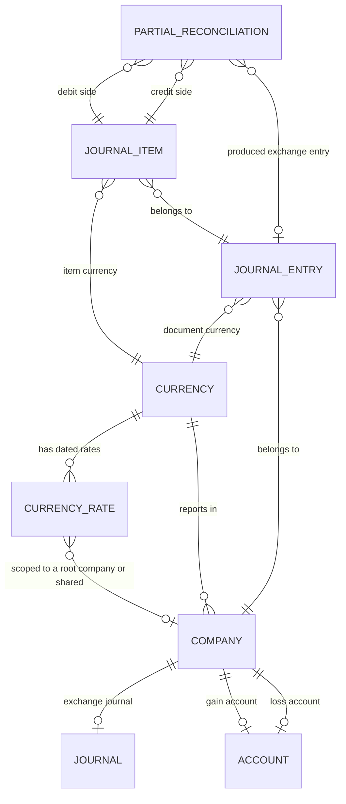

# Multi-Currency — Entities

This file specifies every entity this domain owns, and the currency-bearing parts of the
entities it shares with other domains. For each: purpose, lifecycle, complete field table,
relations, uniqueness rules, defaults, computed fields with their rules, ordering, display rule,
archival behaviour and multi-company behaviour.

Field tables use three columns: the field with its storage name, its type, and its meaning and
rules. A field marked *stored* has a real column; a field marked *derived* is recomputed on read
and has no column unless the table says otherwise.

---

## 1. Currency

**Currency** (`res.currency`, table `res_currency`) is a unit of money.

### 1.1 Purpose

A currency answers four questions about every amount expressed in it:

1. **How is it snapped?** The rounding factor gives the multiple every amount is rounded onto.
2. **How is it written?** The symbol, the symbol position and the derived number of decimal
   places give the presentation.
3. **How is it spoken?** The unit label and the subunit label give the words used when an amount
   is written out in full.
4. **What is it worth?** The attached dated rate records give the value against the reference.

### 1.2 Lifecycle

A currency is created (normally as part of the shipped reference data, but users with the
configuration permission may add one), may be activated and deactivated freely except while a
company uses it, and is deleted only if nothing refers to it. Creating, deleting or changing the
archival flag of a currency re-evaluates whether the multi-currency permission group should be
granted to all internal users (see §1.7).

### 1.3 Field table

| Field (storage name) | Type | Meaning and rules |
|---|---|---|
| Currency code (`name`) | Text, maximum three characters | **Required.** The three-letter code of the international currency-code standard, for example `EUR`, `USD`, `JPY`. Unique across all currencies including archived ones (see §1.5). Used as the short display name everywhere. Searchable together with the full name. |
| Numeric code (`iso_numeric`) | Whole number | The numeric code of the same international standard, for example eight hundred forty for the United States dollar. Optional; informational. Some shipped currencies have none. |
| Name (`full_name`) | Text | The currency's name in words, for example "United States dollar". Optional. Included in the name search together with the code. |
| Symbol (`symbol`) | Text | **Required.** The sign printed next to an amount, for example `$`, `€`, `£`, `₹`. May be several characters (`Bds$`, `CHF`, `Afl.`). |
| Current rate (`rate`) | Decimal, unlimited digits | **Derived, not stored.** How many units of this currency one unit of the target currency buys, on the effective date, for the effective company. The target currency defaults to the company currency; the date defaults to today in the reader's time zone. Computed as described in [calculations.md](calculations.md) §4. Depends on the rate records and on three context values: the target currency, the date and the company. |
| Inverse rate (`inverse_rate`) | Decimal, unlimited digits | **Derived, not stored, read-only.** The reciprocal of the current rate: how many units of the target currency one unit of this currency buys. This is the number the conversion routine actually multiplies by when converting *into* the target currency. |
| Rate as text (`rate_string`) | Text | **Derived, not stored.** A human-readable statement of the current rate, built as: the digit one, a space, the target currency code, a space, an equals sign, a space, the current rate rendered with exactly six decimal digits, a space, this currency's code. Empty when this currency *is* the effective company currency. |
| Rates (`rate_ids`) | Collection of Currency Rate | The dated rate records belonging to this currency. Deleting the currency deletes them (the link on the rate cascades). |
| Rounding factor (`rounding`) | Decimal with twelve total digits of which six are fractional | **Required, default one hundredth.** Amounts in this currency are rounded onto the nearest multiple of this value. Must be strictly greater than zero (see §1.5). A value of one means the currency has no subunit in practice. |
| Decimal places (`decimal_places`) | Whole number | **Derived and stored**, recomputed whenever the rounding factor changes. The number of fractional digits used when rendering an amount as text. See the formula in §1.4. |
| Active (`active`) | Boolean | **Default true.** An archived currency is hidden from ordinary selection lists but keeps all its records. Cannot be set false while a company uses the currency (see §1.5). |
| Symbol position (`position`) | Selection | **Default `after`.** Where the symbol is placed relative to the number. Values: `after` — *After Amount*; `before` — *Before Amount*. |
| Date (`date`) | Date | **Derived, not stored.** The date of the most recent rate record of this currency, taking the first record under the rate ordering (most recent date first). Empty when the currency has no rate. |
| Currency unit (`currency_unit_label`) | Text, translatable | The plural name of the whole unit, used when an amount is written out in words: "Dollars", "Euros", "Rupees". |
| Currency subunit (`currency_subunit_label`) | Text, translatable | The plural name of the hundredth part: "Cents", "Pence", "Paisa". |
| Is the current company currency (`is_current_company_currency`) | Boolean | **Derived, not stored.** True when this currency is the currency of the company the reader is acting for. Depends on the company context value. |

### 1.4 Derived decimal places

```formula
decimal_places = ceiling( log10( 1 ÷ rounding_factor ) )    when 0 < rounding_factor < 1
decimal_places = 0                                          otherwise
```

Worked values:

| Rounding factor | One divided by it | Base-ten logarithm | Ceiling | Decimal places |
|---|---|---|---|---|
| 0.01 | 100 | 2 | 2 | 2 |
| 0.001 | 1 000 | 3 | 3 | 3 |
| 0.0001 | 10 000 | 4 | 4 | 4 |
| 0.05 | 20 | 1.301… | 2 | 2 |
| 0.5 | 2 | 0.301… | 1 | 1 |
| 1 | 1 | 0 | — | 0 (the "otherwise" branch, because the factor is not strictly below one) |
| 1.00 | 1 | 0 | — | 0 (same branch) |
| 5 | 0.2 | −0.698… | — | 0 (same branch) |

Note the asymmetry deliberately built into the rule: a factor of five hundredths yields **two**
decimal places, not one, because two fractional digits are needed to write a multiple of five
hundredths. A factor of five (a currency rounding to the nearest five units) yields **zero**
decimal places, and the rounding to multiples of five is still applied by the rounding routine
even though nothing in the rendered text shows it.

### 1.5 Uniqueness and validation

| Rule | Condition | Message |
|---|---|---|
| Unique code | The currency code must be unique across the whole table. | *The currency code must be unique!* |
| Positive rounding | The rounding factor must be strictly greater than zero. | *The rounding factor must be greater than 0!* |
| A company's currency stays active | When the archival flag is being set to false on one or more currencies, and at least one company has one of those currencies as its currency, the change is refused. | *This currency is set on a company and therefore cannot be deactivated.* |

The company-currency check is **skipped** in two situations, both of which are signalled through
context values rather than data: during package installation (because a currency attached to a
company is momentarily still seen as inactive while it is being attached), and when a forced
deactivation is explicitly requested (used to exercise single-currency behaviour). A rebuild must
reproduce the escape hatch, because otherwise installing reference data becomes impossible.

### 1.6 Ordering and display

- **Ordering:** archived last, then by currency code ascending. Expressed exactly: descending on
  the active flag, then ascending on the code.
- **Display name:** the currency code.
- **Name search:** matches against the currency code *and* the full name.

### 1.7 The multi-currency permission group

Whenever a currency is created, deleted, or has its archival flag written, the system counts the
active currencies and adjusts the multi-currency permission group:

1. Count currencies whose archival flag is true.
2. If the count is **greater than one**, grant the multi-currency group to the base internal-user
   group, so that every internal user inherits it.
3. If the count is **one or zero**, remove the multi-currency group from the base internal-user
   group.

The effect is that the currency column, the rate column and the second amount column appear in
the interface exactly when more than one currency is active, with no separate setting to toggle.

### 1.8 Cache invalidation

Two caches depend on currencies and must be cleared:

- The cached map of all currencies (see [interfaces.md](interfaces.md) §5) is cleared on every
  creation, every deletion, and every write that touches the archival flag, the digits, the code,
  the symbol position or the symbol.
- The derived inverse rate is invalidated on every creation or write of a rate record.

### 1.9 Multi-company behaviour

A currency is **global**: it has no company field and is visible to every company. Only its
*rates* are company-scoped, and only to root companies.

---

## 2. Currency Rate

**Currency Rate** (`res.currency.rate`, table `res_currency_rate`) is the value of one currency
on one date for one root company.

### 2.1 Purpose

The rate table is a step function of time. A rate record is not valid "on its date" only: it is
valid from its date onwards, until superseded by a later record. The lookup algorithm in
[calculations.md](calculations.md) §4 implements exactly that reading.

### 2.2 The three representations

A rate can be entered in three interchangeable ways, and the system keeps all three consistent.
Understanding which one is stored is essential.

| Representation | Field | Question it answers |
|---|---|---|
| Technical rate | `rate` | How many units of this currency correspond to one unit of the abstract reference of rate one? **This is the value actually stored.** |
| Company rate | `company_rate` | How many units of this currency does one unit of the company's currency buy on this date? |
| Inverse company rate | `inverse_company_rate` | How many units of the company's currency does one unit of this currency buy on this date? |

The abstract reference is whichever currency happens to have rate one. In a freshly configured
system the company's own currency has no rate records at all and therefore takes the fallback
value of one, which makes the technical rate and the company rate numerically identical. As soon
as the company currency has its own rate records, the two diverge, and the company rate is the
one a user should read.

### 2.3 Field table

| Field (storage name) | Type | Meaning and rules |
|---|---|---|
| Date (`name`) | Date | **Required, indexed, default today in the reader's time zone.** The date from which this rate applies. |
| Technical rate (`rate`) | Decimal, unlimited digits | The stored rate against the reference of rate one. Aggregated as an average when grouped. Must be strictly positive (see §2.5). When not supplied on creation it is derived: the rate of the latest earlier record of the same currency and company, or one. |
| Rate against the company currency (`company_rate`) | Decimal, unlimited digits | **Derived, not stored, writable through its inverse operation.** Equals the technical rate divided by the company's own latest technical rate. Aggregated as an average. |
| Inverse rate against the company currency (`inverse_company_rate`) | Decimal, unlimited digits | **Derived, not stored, writable through its inverse operation.** The reciprocal of the company rate. Aggregated as an average. |
| Currency (`currency_id`) | Link to Currency | **Required, read-only, indexed.** Deleting the currency deletes the rate. |
| Company (`company_id`) | Link to Company | **Default: the root company of the company the reader is acting for.** May be empty, which means the rate is shared by every company. Must never be a branch company (see §2.5). |

### 2.4 The sanitising rule

More than one of the three representations may be supplied in the same write. The system reduces
them to one before storing, in this exact order:

1. If the inverse company rate is present **and** either the company rate or the technical rate is
   also present, the inverse company rate is dropped.
2. If the company rate is present **and** the technical rate is also present, the company rate is
   dropped.

In other words the precedence is: technical rate beats company rate beats inverse company rate. A
rebuild must apply the two steps in that order, on creation and on update alike.

### 2.5 Validation

| Rule | Condition | Message |
|---|---|---|
| One rate per currency, company and day | The triple of date, currency and company must be unique. | *Only one currency rate per day allowed!* |
| Strictly positive | The technical rate must be greater than zero. | *The currency rate must be strictly positive.* |
| Root companies only | The company of a rate must not have a parent company. | *Currency rates should only be created for main companies* |
| Date required when deriving | When the latest earlier rate is looked up and the record has no date, the operation fails. | *The name for the current rate is empty.\nPlease set it.* (The label of the date field is the record's name field; the message is produced verbatim, with a line break between the two sentences.) |

### 2.6 The large-movement warning

When a user edits the company rate in a form, the system compares the new value with the latest
earlier rate of the same currency and company:

```formula
relative_movement = ( previous_rate − new_rate ) ÷ previous_rate
```

If the absolute value of the relative movement exceeds **zero point two** (twenty percent), a
non-blocking warning is shown:

- Title: *Warning for* followed by a space and the currency code.
- Body, on two lines:
  *The new rate is quite far from the previous rate.*
  *Incorrect currency rates may cause critical problems, make sure the rate is correct!*

The warning does not prevent saving. It is raised only in the interactive form path, not on
programmatic writes or imports.

### 2.7 Deriving a missing rate

When a rate record is created without a technical rate, the value is derived as:

1. Find the rate records of the same currency whose company equals this record's company (or, if
   the record has no company, the root company the reader is acting for), whose technical rate is
   non-zero, and whose date is **strictly earlier** than this record's date (or than today if the
   record has no date yet).
2. Sort them by date ascending and take the last one.
3. Use its technical rate; if there is none, use one.

### 2.8 Company rate arithmetic

```formula
company_rate = technical_rate ÷ latest_technical_rate_of_the_company_currency
technical_rate = company_rate × latest_technical_rate_of_the_company_currency
inverse_company_rate = 1 ÷ company_rate
company_rate = 1 ÷ inverse_company_rate
```

Where *latest technical rate of the company currency* is, for each company: the last rate record
of that company's own currency, by date ascending, whose technical rate is non-zero and whose
company is that company or is empty — or one when there is none.

Guard: when the company rate is zero or unset, it is first forced to one before the reciprocal is
taken, so that the inverse is never a division by zero. The same guard applies in the other
direction.

### 2.9 Ordering and display

- **Ordering:** date descending, then by internal identifier ascending.
- **Display name:** the date, rendered in the reader's date format.
- **Name search:** matches against the date and the rate; a searched value that looks like a date
  in the reader's locale is parsed into a date first.

### 2.10 Multi-company behaviour

Rates live **only on root companies**. A branch company never owns rates; every lookup made for a
branch resolves against the branch's root. A rate with no company is shared: it applies to every
company that has no company-specific rate for that currency on or before the date. The lookup
prefers the company-specific record: see [calculations.md](calculations.md) §4.

---

## 3. Company — currency aspects

**Company** (`res.company`, table `res_company`) is specified in full in
[../identity-and-access/entities.md](../identity-and-access/entities.md). Only its currency
fields are given here.

| Field (storage name) | Type | Meaning and rules |
|---|---|---|
| Currency (`currency_id`) | Link to Currency | **Required.** The currency the company keeps its books in, called the *company currency* throughout this repository. Default: the currency of the company the creating user belongs to. When a company's country is set, the currency is proposed from the country. Cannot be changed once journal items exist (see below). Creating a company force-activates the chosen currency. |
| Exchange Gain or Loss Journal (`currency_exchange_journal_id`) | Link to Journal | The journal in which exchange difference entries are created. Restricted to journals of type *general* (miscellaneous). Must be set before any exchange difference can be produced. |
| Gain Exchange Rate Account (`income_currency_exchange_account_id`) | Link to Account | The account credited when reconciliation realises a gain. Restricted to accounts whose internal group is income. |
| Loss Exchange Rate Account (`expense_currency_exchange_account_id`) | Link to Account | The account debited when reconciliation realises a loss. Restricted to accounts whose type is expense or other expense. |
| Taxes in company currency (`display_invoice_tax_company_currency`) | Boolean | **Default true.** When true, a printed invoice in a foreign currency additionally shows the tax total translated into the company currency. |

Validation:

| Rule | Condition | Message |
|---|---|---|
| Currency is frozen once posted | A write that changes the company currency is refused when any journal item exists for that company. | *You cannot change the currency of the company since some journal items already exist* |

Side effect: creating a company whose currency is archived activates that currency
automatically.

---

## 4. Journal Entry — currency aspects

**Journal Entry** (`account.move`, table `account_move`) is specified in full in
[../general-ledger/entities.md](../general-ledger/entities.md). Its currency fields are:

| Field (storage name) | Type | Meaning and rules |
|---|---|---|
| Company currency (`company_currency_id`) | Link to Currency | **Derived from the company, read-only.** The currency the entry's amounts in the company currency are expressed in. |
| Currency (`currency_id`) | Link to Currency | **Required, derived and stored, writable, tracked, precomputed.** The document currency. Derived as the first of: the foreign currency of the originating bank statement line; the currency forced on the journal; the currency already set; the currency of the journal's company. |
| Expected rate (`expected_currency_rate`) | Decimal, unlimited digits | **Derived, not stored.** The rate the system *would* apply: the conversion rate from the company currency to the document currency, for the entry's company, at the rate date. One when the entry has no currency. |
| Currency rate (`invoice_currency_rate`) | Decimal, unlimited digits | **Derived and stored, writable, not copied.** The rate actually applied to this document, from the company currency to the document currency. Recomputed from the expected rate whenever the currency, the company currency, the company, the invoice date or the taxable supply date changes — but **only for invoice-like documents**; for a miscellaneous entry it keeps whatever value it holds. A user may override it, which is how a contractually agreed rate is honoured. |

**The rate date** is the invoice date when there is one, otherwise today in the reader's time
zone.

Validation:

| Rule | Condition | Message |
|---|---|---|
| Positive document rate | For an invoice-like document whose currency differs from the company currency, the stored rate must be strictly greater than zero. | *The currency rate must be strictly positive.* |

Side effect on change: changing the document currency, the partner, the document type, the rate
or the invoice date on a posted-and-reset document is one of the changes that triggers a full
recomputation of the dynamic lines; see
[../accounts-receivable/workflows.md](../accounts-receivable/workflows.md).

---

## 5. Journal Item — currency aspects

**Journal Item** (`account.move.line`, table `account_move_line`) is specified in full in
[../general-ledger/entities.md](../general-ledger/entities.md). Every journal item carries its
amount **twice**. Its currency fields are:

| Field (storage name) | Type | Meaning and rules |
|---|---|---|
| Currency (`currency_id`) | Link to Currency | **Required, derived and stored, writable, precomputed.** The currency the item's foreign amount is expressed in. Derived as: the company currency when the item is a cost-of-goods-sold line; the entry's currency when the entry is invoice-like; otherwise the currency already set, or the company currency. |
| Company currency (`company_currency_id`) | Link to Currency | **Derived from the company, read-only.** |
| Same currency (`is_same_currency`) | Boolean | **Derived, not stored.** True when the item's currency equals the company currency. |
| Currency rate (`currency_rate`) | Decimal | **Derived, not stored.** The rate from the company currency to the item's currency. For an invoice-like entry it is the entry's stored document rate (or one when that is zero). Otherwise, when the item has a currency, it is looked up for the item's company at the entry's invoice date, or the entry's date, or today. Otherwise it is one. |
| Debit (`debit`) | Money in the company currency | **Derived and stored, writable through its inverse, precomputed.** The positive part of the balance, or the negated balance when the item belongs to a reverse-sign entry. |
| Credit (`credit`) | Money in the company currency | **Derived and stored, writable through its inverse, precomputed.** The negated negative part of the balance, mirrored the same way for reverse-sign entries. |
| Balance (`balance`) | Money in the company currency | **Derived and stored, writable, precomputed, tracked.** The item's amount in the company currency: positive for a debit, negative for a credit. |
| Amount in currency (`amount_currency`) | Money in the item's currency | **Derived and stored, writable through its inverse, precomputed.** The item's amount in the document currency, with the same sign as the balance. |
| Cumulated balance (`cumulated_balance`) | Money in the company currency | **Derived, not stored, not exportable.** A running total of the balance in the order and filter of the list the reader is looking at. |
| Residual amount (`amount_residual`) | Money in the company currency | **Derived and stored.** What is left to reconcile, in the company currency. |
| Residual amount in currency (`amount_residual_currency`) | Money in the item's currency | **Derived and stored.** What is left to reconcile, in the item's currency. |
| Reconciled (`reconciled`) | Boolean | **Derived and stored.** True when *both* residuals are zero at their respective currencies' precision. |

### 5.1 The derivation of the two amounts

The two amounts are tied by the rate:

```formula
amount_currency = round_to_document_currency( balance × currency_rate )
balance = round_to_company_currency( amount_currency ÷ currency_rate )
```

Which of the two is derived depends on which the caller supplied:

1. When the foreign amount is not supplied at all, it is derived from the balance by the first
   formula.
2. When the item's currency equals the company currency **and** the entry is not invoice-like,
   the foreign amount is forced equal to the balance, overriding anything supplied.
3. When the foreign amount is written directly and the balance is not, the balance is derived by
   the second formula.
4. On an invoice-like entry, a change to the foreign amount, to the rate or to the document type
   re-derives the balance by the second formula.

Rounding is always applied to the destination: the foreign amount onto the item currency's
rounding factor, the balance onto the company currency's.

### 5.2 The sign invariant

A stored database check enforces:

> The balance and the foreign amount must have the same sign, or one of them must be zero.

Exactly: either both are less than or equal to zero, or both are greater than or equal to zero.
Section, subsection and note lines are exempt because they carry no amounts at all. The message
produced when the check fails is:

> *The amount expressed in the secondary currency must be positive when account is debited and
> negative when account is credited. If the currency is the same as the one from the company,
> this amount must strictly be equal to the balance.*

Two further stored checks interact with amounts:

| Check | Condition | Message |
|---|---|---|
| Debit and credit are exclusive | Except on section, subsection and note lines, the product of debit and credit must be zero. | *Wrong credit or debit value in accounting entry!* |
| Non-accountable lines carry nothing | On a section, subsection or note line the foreign amount, the debit, the credit must all be zero and the account must be empty. | *Forbidden balance or account on non-accountable line* |

### 5.3 The residual computation

For every item whose account is reconcilable, or whose account type is cash or credit card:

```formula
amount_residual          = round_to_company_currency(  balance         − matched_as_debit_company  + matched_as_credit_company )
amount_residual_currency = round_to_item_currency(     amount_currency − matched_as_debit_foreign  + matched_as_credit_foreign )
reconciled = is_zero_in_company_currency( amount_residual ) AND is_zero_in_item_currency( amount_residual_currency )
```

where the four matched amounts are sums over the partial reconciliations in which this item plays
the debit role (the first two) or the credit role (the last two). The sums of the foreign amounts
are themselves rounded to the number of decimal places of the corresponding currency **inside the
aggregation**, before being subtracted.

Items on non-reconcilable accounts have both residuals forced to zero and the reconciled flag
forced to false.

---

## 6. Partial Reconciliation — currency aspects

**Partial Reconciliation** (`account.partial.reconcile`, table `account_partial_reconcile`) is
specified in full in [../general-ledger/entities.md](../general-ledger/entities.md). It records a
match between exactly two journal items and it carries **three** amounts, because the two items
may be in two different currencies and the company reports in a third.

| Field (storage name) | Type | Meaning and rules |
|---|---|---|
| Debit item (`debit_move_id`) | Link to Journal Item | **Required, indexed.** |
| Credit item (`credit_move_id`) | Link to Journal Item | **Required, indexed.** |
| Company currency (`company_currency_id`) | Link to Currency | **Derived from the company.** Utility field naming the currency the main amount is expressed in. |
| Debit currency (`debit_currency_id`) | Link to Currency | **Derived from the debit item and stored, precomputed.** |
| Credit currency (`credit_currency_id`) | Link to Currency | **Derived from the credit item and stored, precomputed.** |
| Amount (`amount`) | Money in the company currency | Always positive. The amount matched, expressed in the company currency. |
| Debit amount in currency (`debit_amount_currency`) | Money in the debit currency | Always positive. The amount matched, expressed in the debit item's currency. |
| Credit amount in currency (`credit_amount_currency`) | Money in the credit currency | Always positive. The amount matched, expressed in the credit item's currency. |
| Company (`company_id`) | Link to Company | **Derived and stored, writable, precomputed.** The company of the debit item when the debit item's entry is invoice-like, otherwise the company of the credit item. This choice puts any exchange difference or cash-basis entry on the invoice's side. |
| Latest matched date (`max_date`) | Date | **Derived and stored, precomputed.** The later of the two items' dates. Used to date the match on ageing reports. |
| Full reconciliation (`full_reconcile_id`) | Link to Full Reconciliation | Set when the whole chain closes. Not copied. |
| Exchange entry (`exchange_move_id`) | Link to Journal Entry | The exchange difference entry this match produced, if any. |
| Draft cash-basis values (`draft_caba_move_vals`) | Structured document | Technical: the values used to build a draft cash-basis entry, kept so the entry can be judged still valid when the invoice is posted. |

Validation:

| Rule | Condition | Message |
|---|---|---|
| Both currencies known | Neither the debit currency nor the credit currency may be empty. | *Missing foreign currencies on partials having ids:* followed by the list of the offending records' identifiers. |

Lifecycle notes with currency consequences:

- Deleting a partial reconciliation **reverses or deletes** the exchange difference entry it
  produced; see [workflows.md](workflows.md) §7.
- Creating a partial reconciliation may flip a linked payment from *in process* to *paid* when the
  matched amount equals the payment amount **compared at the payment currency's precision**.

---

## 7. Language — formatting aspects

**Language** (`res.lang`, table `res_lang`) is specified in full in
[../identity-and-access/entities.md](../identity-and-access/entities.md). Three of its fields
govern how a monetary amount is rendered:

| Field (storage name) | Type | Meaning and rules |
|---|---|---|
| Decimal separator (`decimal_point`) | Text | **Required, default a full stop.** The character placed between the whole part and the fractional part. Not trimmed, so a space is a legal value. |
| Thousands separator (`thousands_sep`) | Text | **Default a comma.** The character inserted between digit groups. Not trimmed. May be empty. |
| Grouping (`grouping`) | Selection of patterns | A list of group sizes read from left of the separator outwards. The shipped choices cover the common conventions: no grouping at all; groups of three repeated; and the South Asian pattern of one group of three followed by groups of two repeated. |

The grouping list is read as follows: the first number is the size of the group closest to the
decimal separator, the next number the size of the group to its left, and so on. A **zero**
terminates the list and disables further grouping. A repetition of the final size is requested by
repeating that size as the last element; a list ending in the same number twice means "keep using
this size". So a pattern of three then three means groups of three all the way; a pattern of
three then two then two gives one group of three then groups of two, which renders one hundred
twenty-three million four hundred fifty-six thousand seven hundred eighty-nine as
`12,34,56,789`.

---

## 8. Relationship summary



## 9. Invariants across entities

1. **Every journal item has a currency.** The field is required; there is no notion of an item
   without one. When no foreign currency is involved, the item's currency *is* the company
   currency and the two amounts are equal.
2. **Balance and foreign amount never disagree in sign.**
3. **The entry balances in the company currency only.** The sum of the balances of an entry's
   items must be zero. The sum of the foreign amounts need not be zero, and routinely is not,
   because an entry may mix items in several currencies.
4. **A partial reconciliation's three amounts are all positive.** The direction is carried by
   which item is the debit side and which the credit side, never by a sign.
5. **A currency's decimal places are a function of its rounding factor.** They are stored, but
   they are never written independently; writing the rounding factor rewrites them.
6. **Rates belong to root companies.** A branch never owns a rate and never resolves one of its
   own.
