# Multi-Currency — State Machines

This file specifies every state-bearing field this domain owns or drives. Two of them belong to
entities this folder owns: the activity flag of a Currency and the position of a Currency Rate row
in the step function of time. The others belong to entities owned by neighbouring domains, and are
specified here for the part of their behaviour that the currency dimension decides: whether a
document may be posted in a given currency, when an exchange difference entry is posted or
reversed, when a journal item counts as settled in each of its two amount columns, when a payment
counts as paid, and when a platform becomes a multi-currency platform.

**How to read a machine.** Each machine gives, in order:

1. a table of states with the stored value, the label a reader sees and the meaning;
2. a transition table with the origin state, the destination state, the operation that triggers
   the transition, the conditions that must hold, and the records created or changed;
3. the guards of each transition in the order they are evaluated, with the exact refusal message;
4. a diagram.

**Stored value against derived state.** Where a state is held in a stored selection field the
stored value is given in code font. Where a state is not stored but is derived from data — the
activity flag of a currency is a true or false value, the state of a rate row is its position among
the rows of the same currency — the table says so and names the data the state is read from.

**Messages.** A message reproduced between quotation marks is the text the system shows, character
for character. A placeholder inside a message is described in words and written in italics. A line
break inside a message is written as ⏎.

Contents:

1. [The activity state of a Currency](#1-the-activity-state-of-a-currency)
2. [The precision state of a Currency](#2-the-precision-state-of-a-currency)
3. [The multi-currency capability state of the platform](#3-the-multi-currency-capability-state-of-the-platform)
4. [The lifecycle of a Currency Rate row](#4-the-lifecycle-of-a-currency-rate-row)
5. [The currency and rate state of a document](#5-the-currency-and-rate-state-of-a-document)
6. [The state of an exchange difference entry](#6-the-state-of-an-exchange-difference-entry)
7. [The reconciliation state of a journal item, seen from the currency side](#7-the-reconciliation-state-of-a-journal-item-seen-from-the-currency-side)
8. [The matching number of a journal item](#8-the-matching-number-of-a-journal-item)
9. [The settlement state of a Payment](#9-the-settlement-state-of-a-payment)
10. [The payment state of a document](#10-the-payment-state-of-a-document)
11. [The currency configuration state of a bank transaction](#11-the-currency-configuration-state-of-a-bank-transaction)
12. [The main currency state of a Company](#12-the-main-currency-state-of-a-company)
13. [Summary of every state field](#13-summary-of-every-state-field)
14. [Reconciliation notes](#14-reconciliation-notes)

---

# 1. The activity state of a Currency

The state field is the activity flag (`active`) of Currency (`res.currency`). It is a true or false
value, not a selection, and it is the only state a currency has.

## 1.1 States

| Stored value | Label | Meaning |
|---|---|---|
| `true` | Active | The currency appears in every selection list, may be chosen on a document, a journal, an account, a price list or a company, and is counted towards the multi-currency capability of section 3. |
| `false` | Archived | The currency is hidden from default queries and from selection lists. Every record that already references it keeps working: posted entries keep their valuation, and a reader may still open the currency by following a link from such a record. A draft document expressed in it can no longer be posted. |

All one hundred and seventy shipped currencies are delivered with the flag false
([business-rules.md](business-rules.md) `MCUR-018`). A currency created by a user takes the field
default, which is true.

## 1.2 Transitions

| From | To | Trigger | Guards | Records created or changed |
|---|---|---|---|---|
| — | Active | A user creates a Currency without naming the activity flag | The currency code is unique (`MCUR-001`); the currency code is present and at most three characters (`MCUR-002`); the rounding factor is strictly greater than zero (`MCUR-003`); the symbol is present (`MCUR-004`) | The Currency row, with the decimal places derived from the rounding factor; the multi-currency capability is re-evaluated (section 3); the cached catalogue of active currencies is invalidated |
| — | Archived | Reference data is loaded | The same four guards | One hundred and seventy Currency rows with the flag false |
| Archived | Active | A user switches the activity toggle on, from the list or the form | None | The Currency row; the multi-currency capability is re-evaluated; the price list capability may be granted and a default price list created or activated per company; the cached catalogue is invalidated |
| Archived | Active | A Company is created or written with this currency as its main currency | The company-currency guards of section 12 | The Currency row is activated silently, before the company is written (`MCUR-009`) |
| Archived | Active | A country package or a chart of accounts template activates the currency of its country | None | The Currency row; the capability re-evaluation as above |
| Active | Archived | A user switches the activity toggle off | No company has this currency as its main currency (guard 1.3.1) | The Currency row; every price list expressed in the currency is archived (`MCUR-010`); the multi-currency capability is re-evaluated; the cached catalogue is invalidated |
| Active | Active (refused) | A user switches the activity toggle off while a company uses the currency | Guard 1.3.1 fails | Nothing is written; the refusal message of 1.3.1 is shown |
| Active or Archived | — (deleted) | A user deletes the Currency | No other record references it, enforced by the referential integrity of the persistence layer | The Currency row and, through the cascade on the rate's currency link, every one of its Currency Rate rows (`MCUR-011`); the capability is re-evaluated; the cached catalogue is invalidated |

## 1.3 Guards, in evaluation order

### 1.3.1 A currency used by a company may not be archived

Condition that fails: at least one Company has one of the currencies being archived as its main
currency.

Message: "This currency is set on a company and therefore cannot be deactivated."

The guard is skipped in exactly two situations, both signalled through operation context values
rather than through data: during the installation of a capability package, because a currency being
attached to a company is momentarily still seen as inactive while the attachment is in progress;
and when a forced deactivation is explicitly requested, an escape hatch that exists so that an
automated scenario can reduce a platform to a single active currency. Both escape hatches must be
reproduced; without the first, loading reference data becomes impossible
([business-rules.md](business-rules.md) `MCUR-007`).

### 1.3.2 The four creation guards

They are stated in full in [business-rules.md](business-rules.md) `MCUR-001` to `MCUR-004`. Their
messages are "The currency code must be unique!" and "The rounding factor must be greater than 0!";
the missing currency code and the missing symbol are refused by the required-field check of the
persistence layer, which names the field.

## 1.4 Diagram

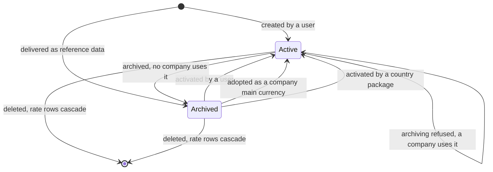

---

# 2. The precision state of a Currency

The rounding factor of a currency may be refined at any time and coarsened only until the currency
has been used in accounting. That "used" condition is a latch: once set it never clears, because a
journal item is never unwritten. It is therefore a state, even though nothing stores it.

## 2.1 States

| State | Read from | Meaning |
|---|---|---|
| Never used in accounting | No journal item exists whose item currency or whose company currency is this currency | The rounding factor may be written to any strictly positive value, in either direction. |
| Used in accounting | At least one journal item exists whose item currency or whose company currency is this currency, whatever the state of its entry | The rounding factor may only be made smaller. A larger factor, or zero, is refused. |

The test looks at both the item currency and the company currency of a journal item, so a currency
becomes locked as soon as any company keeps its books in it, even if no document was ever expressed
in it.

## 2.2 Transitions

| From | To | Trigger | Guards | Records created or changed |
|---|---|---|---|---|
| Never used | Never used | Writing a larger, a smaller or an equal rounding factor | The new factor is strictly greater than zero (`MCUR-003`) | The Currency row; the decimal places are recomputed and stored |
| Never used | Used | The first journal item in that currency, or the first journal item of a company whose main currency it is, is written | None | The journal item; no field of the currency changes |
| Used | Used | Writing a **smaller** rounding factor | The new factor is strictly greater than zero | The Currency row; the decimal places are recomputed and stored. Amounts already stored stay exactly representable on the finer grid and are not restated |
| Used | Used (refused) | Writing a **larger** rounding factor, or zero | Guard 2.3.1 fails | Nothing is written |

While a form holds an unsaved change to the rounding factor of an already persisted currency, the
derived flag `display_rounding_warning` (display rounding warning) is true and the irreversibility
panel of [interfaces.md](interfaces.md) section 2.3 is shown. The panel does not block saving; the
guard below does.

## 2.3 Guards

### 2.3.1 The precision of a currency in use may not be lowered

Condition that fails: the new rounding factor is greater than the current one, or is zero, and the
currency has already been used to round accounting entries.

Message: "You cannot reduce the number of decimal places of a currency which has already been used
to make accounting entries."

### 2.3.2 The rounding factor is strictly positive

Condition that fails: the new rounding factor is less than or equal to zero. Enforced by a stored
check constraint, so it applies to every write path including an import.

Message: "The rounding factor must be greater than 0!"

## 2.4 Diagram

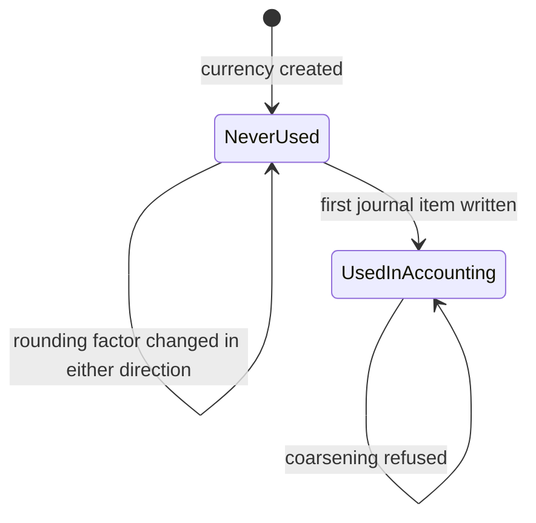

---

# 3. The multi-currency capability state of the platform

The platform as a whole is in one of two states, decided by the number of active currencies and by
nothing else. There is no setting a user can toggle: the state follows the data
([business-rules.md](business-rules.md) `MCUR-008`).

## 3.1 States

| State | Condition | Meaning |
|---|---|---|
| Single-currency | One or zero currencies carry an activity flag of true | The multi-currency permission group is **not** held by the internal-user group. The document currency selector, the amount in currency column, the residual amount in currency column, the document rate field, the company column of a rate row and the exchange difference settings block are hidden from every internal user. Every monetary amount is still stored with its currency; only the interface is simplified. |
| Multi-currency | Two or more currencies carry an activity flag of true | The multi-currency permission group is applied to the internal-user group, so every internal user inherits it. All the fields and columns listed above become visible. |

A freshly configured platform with no demonstration data has **no** active currency at all, which
is the zero case of the single-currency state; it leaves that state at the moment a company adopts
its main currency and a second currency is activated.

## 3.2 Transitions

| From | To | Trigger | Guards | Records created or changed |
|---|---|---|---|---|
| Single-currency | Multi-currency | Any Currency creation, deletion or write touching the activity flag that leaves more than one currency active | None | The multi-currency permission group is applied to the internal-user group. When internal users do not already hold the price list capability group, that group is applied as well and a default price list is created, or reactivated, for every company |
| Multi-currency | Single-currency | Any Currency creation, deletion or write touching the activity flag that leaves one or zero currencies active | None | The multi-currency permission group is removed from the internal-user group. The price list capability and the price lists themselves are **not** revoked; only the currency group is withdrawn |
| Either | Same state | A Currency write that does not touch the activity flag | None | Nothing; the count is re-evaluated only on creation, deletion and a write naming the activity flag |

The grant and the revocation are applied to the group, never to an individual user, so a user who
was granted the multi-currency group directly keeps it when the platform returns to the
single-currency state.

## 3.3 Diagram

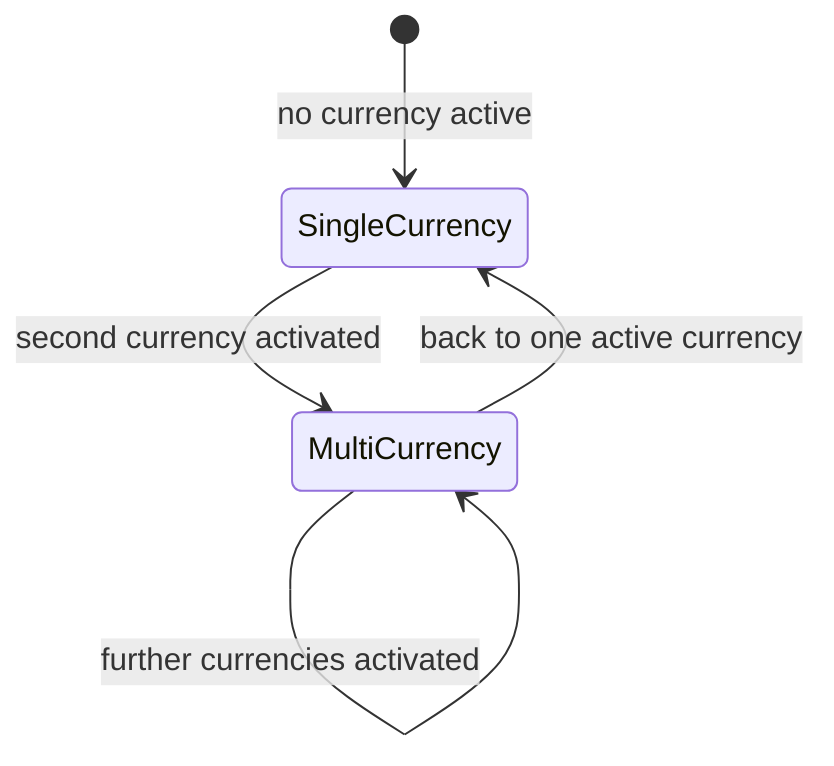

---

# 4. The lifecycle of a Currency Rate row

Currency Rate (`res.currency.rate`) carries no state field and supports no archiving
([business-rules.md](business-rules.md) `MCUR-039`). Its state is nevertheless observable, because
the rate table is a step function of time: a row is either the one in force for a given date or it
is not, and which one it is changes when a neighbouring row is created or deleted. The machine
below is the lifecycle of one row with respect to one currency, one company scope and one
evaluation date.

## 4.1 States

| State | Read from | Meaning |
|---|---|---|
| Absent | No row exists for the currency, the company scope and the day | Any conversion for that date resolves against another row, or against the fallback of one when the currency has no row at all (`MCUR-030`). |
| In force | The row's rate date is the greatest among the candidate rows dated on or before the evaluation date, with a company-scoped row beating a shared row unconditionally | Every conversion of that currency for that company at that date multiplies by this row's technical rate. |
| Superseded | A row of the same currency and the same company scope carries a later rate date that is still on or before the evaluation date | The row remains stored and remains in force for the dates between its own date and the later row's date. It is superseded only relative to a date. |
| Projected backwards | Every row of the currency is dated strictly after the evaluation date, and this row is the earliest of them | The earliest known rate is used for every date before it, without limit (`MCUR-029`). |
| Deleted | The row no longer exists | The validity window of the preceding row extends forward over the deleted row's window. No posted journal item is restated (`MCUR-031`). |

## 4.2 Transitions

| From | To | Trigger | Guards | Records created or changed |
|---|---|---|---|---|
| Absent | In force | A user, an import or the scheduled rate update creates a row | The company is a root company (guard 4.3.1); the triple of rate date, currency and company is unique (guard 4.3.2); the technical rate is strictly positive (guard 4.3.3) | The Currency Rate row, after the three supplied rate representations have been reduced to one by the precedence rule of `MCUR-024`; the derived inverse rate of every Currency is invalidated so that every displayed current rate refreshes (`MCUR-036`) |
| In force | Superseded | A row with a later rate date and the same scope is created | The same three guards | The new row; nothing on the existing row changes |
| In force | In force with another value | A user edits one of the three rate representations | The same three guards; in the interactive form the large-movement warning of `MCUR-021` may be shown first and may be dismissed | The Currency Rate row; every displayed current rate is invalidated. No posted journal item changes |
| In force | Absent for the old day, in force for the new day | A user edits the rate date or the company scope | The uniqueness guard on the new triple | The Currency Rate row; the validity windows of the neighbouring rows change |
| In force or superseded | Deleted | A user deletes the row | None | The row disappears; the preceding row's window extends forward; posted entries are untouched |
| Any | Deleted | The owning Currency is deleted | None | Every rate row of that currency is deleted through the cascade |

## 4.3 Guards, in evaluation order

### 4.3.1 Rate rows belong to root companies only

Condition that fails: the named company has a parent company, meaning it is a branch.

Message: "Currency rates should only be created for main companies"

### 4.3.2 One rate per currency, company scope and day

Condition that fails: another row already exists with the same rate date, the same currency and the
same company. An empty company is a distinct value, so a shared row and a company-scoped row may
share a day.

Message: "Only one currency rate per day allowed!"

### 4.3.3 The technical rate is strictly positive

Condition that fails: the stored technical rate is less than or equal to zero. A row saved with
none of the three rate representations supplied stores a technical rate of zero and is refused
here.

Message: "The currency rate must be strictly positive."

### 4.3.4 Asking for the preceding rate of a row that has no date

Condition that fails: the carry-forward of `MCUR-025` is asked for the row that precedes a row
carrying no rate date.

Message: "The name for the current rate is empty.⏎Please set it."

The word "name" in the message is the identifier of the date field.

## 4.4 Diagram

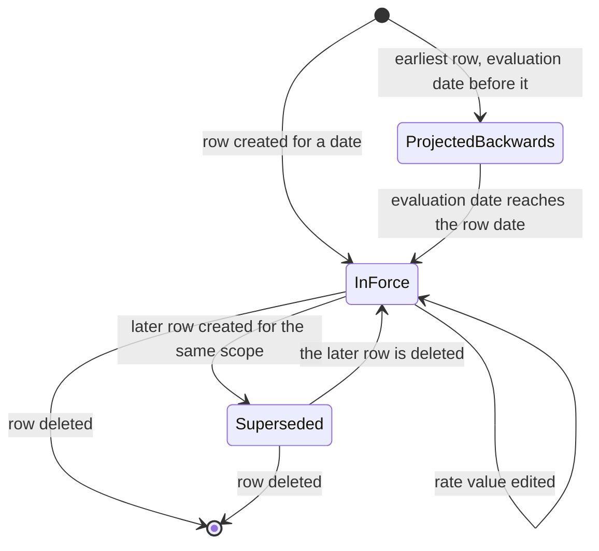

---

# 5. The currency and rate state of a document

A Journal Entry that is an invoice, a bill, a credit note, a debit note or a receipt carries a
stored document rate (`invoice_currency_rate`) beside its document currency (`currency_id`). The
pair moves through the states below. The entry's own posting state (`state`, with the stored values
`draft`, `posted` and `cancel`) is owned by [../general-ledger/](../general-ledger/); this machine
specifies what the currency dimension adds to it.

## 5.1 States

| State | Read from | Meaning |
|---|---|---|
| Draft, company currency | The entry state is `draft` and the document currency equals the company currency | No rate arithmetic happens. Every line's amount in currency equals its balance. The document rate is one. |
| Draft, foreign currency, expected rate | The entry state is `draft`, the document currency differs from the company currency, and the document rate equals the expected rate at the document's rate date | Every line balance is derived from its amount in currency at the rate the rate table gives for the document's rate date. Changing the currency, the company, the invoice date or the taxable supply date re-derives the rate and every balance. |
| Draft, foreign currency, manual rate | The entry state is `draft`, the document currency differs from the company currency, and the document rate differs from the expected rate because a user typed it | Every line balance is derived from the typed rate. The typed value survives the automatic assignment of the invoice date at posting (`MCUR-082`). |
| Draft, archived currency | The entry state is `draft` and the document currency has an activity flag of false | The derived flag `display_inactive_currency_warning` (display inactive currency warning) is true, a warning is shown on the form, and posting is refused. |
| Posted | The entry state is `posted` | The document rate and every balance are frozen. Editing a rate row afterwards does not restate them (`MCUR-031`). |
| Cancelled | The entry state is `cancel` | The valuation is frozen as it was. The items may not take part in a new matching (`MCUR-131`). |

## 5.2 Transitions

| From | To | Trigger | Guards | Records created or changed |
|---|---|---|---|---|
| Draft, company currency | Draft, foreign currency, expected rate | A user selects a foreign currency in the Currency field | The entry is in draft; the account currency agreement of `MCUR-064` holds for every line | The entry's document currency; every line's item currency follows (`MCUR-070`); the document rate is set to the expected rate at the document's rate date; every balance is re-derived from the preserved amounts in currency |
| Draft, foreign currency, expected rate | Draft, foreign currency, expected rate | A user changes the invoice date, the taxable supply date, the company or the company currency | The entry is in draft | The document rate is recomputed at the new rate date (`MCUR-081`); every balance is re-derived; every amount in currency is preserved |
| Draft, foreign currency, expected rate | Draft, foreign currency, manual rate | A user types a value into the Currency Rate field | The typed value is strictly greater than zero (guard 5.3.1) | The document rate; every base line and every tax line keeps its amount in currency and has its balance re-derived (`MCUR-083`) |
| Draft, foreign currency, manual rate | Draft, foreign currency, expected rate | A user runs the rate refresh operation | The entry is in draft | The document rate is set back to the expected rate; every balance is re-derived (`MCUR-085`) |
| Draft, foreign currency, manual rate | Draft, foreign currency, manual rate | A user changes the invoice date | The entry is in draft | The rate is recomputed, discarding the manual value, **unless** the manual protection of `MCUR-082` applies during the automatic assignment of the invoice date at posting |
| Draft, any currency | Draft, archived currency | The document currency is archived while the document is still in draft | None | Nothing on the entry; the derived warning flag becomes true |
| Draft, archived currency | Draft, foreign currency | The currency is activated again | None | Nothing on the entry; the warning flag becomes false |
| Draft, foreign currency | Posted | A user posts the document | The currency is not archived (guard 5.3.2); the document rate is strictly positive (guard 5.3.1); the entry balances in the company currency column (`MCUR-072`); the account currency agreement of `MCUR-064` holds | The entry state; the entry number; every line's balance, amount in currency and residual amounts become available for matching |
| Draft, archived currency | Draft, archived currency (refused) | A user posts the document | Guard 5.3.2 fails | Nothing is written |
| Posted | Draft | A user resets the entry to draft, where the general ledger rules allow it | Owned by [../general-ledger/](../general-ledger/) | The entry state; the document rate becomes editable again and changing it re-derives every balance |
| Posted | Cancelled | A user cancels the entry | Owned by [../general-ledger/](../general-ledger/) | The entry state; the valuation is unchanged |
| Any draft state | A copy in the same state with the expected rate | A user duplicates the document | None | The copy carries no manual rate: the document rate is excluded from the duplicated values and is recomputed at the copy's own rate date (`MCUR-084`) |

## 5.3 Guards, in evaluation order

### 5.3.1 The document rate must be strictly positive

Condition that fails: the document is invoice-like, has a company, its document currency differs
from the company's main currency, and the stored document rate is less than or equal to zero.

Message: "The currency rate must be strictly positive."

Typing zero or a negative value in a form raises the message and restores the previous value.

### 5.3.2 A document in an archived currency cannot be posted

Condition that fails: the entry is being posted and its document currency has an activity flag of
false.

Message: "You cannot validate a document with an inactive currency: *the currency code*"

### 5.3.3 A purchase document needs a date before it can be posted

Condition that fails: a bill or a vendor credit note is posted without a document date.

Message: "The Bill/Refund date is required to validate this document."

This is why the manual-rate protection of `MCUR-082` is needed only on the sale side: a purchase
document always has its date before it is posted.

## 5.4 Diagram

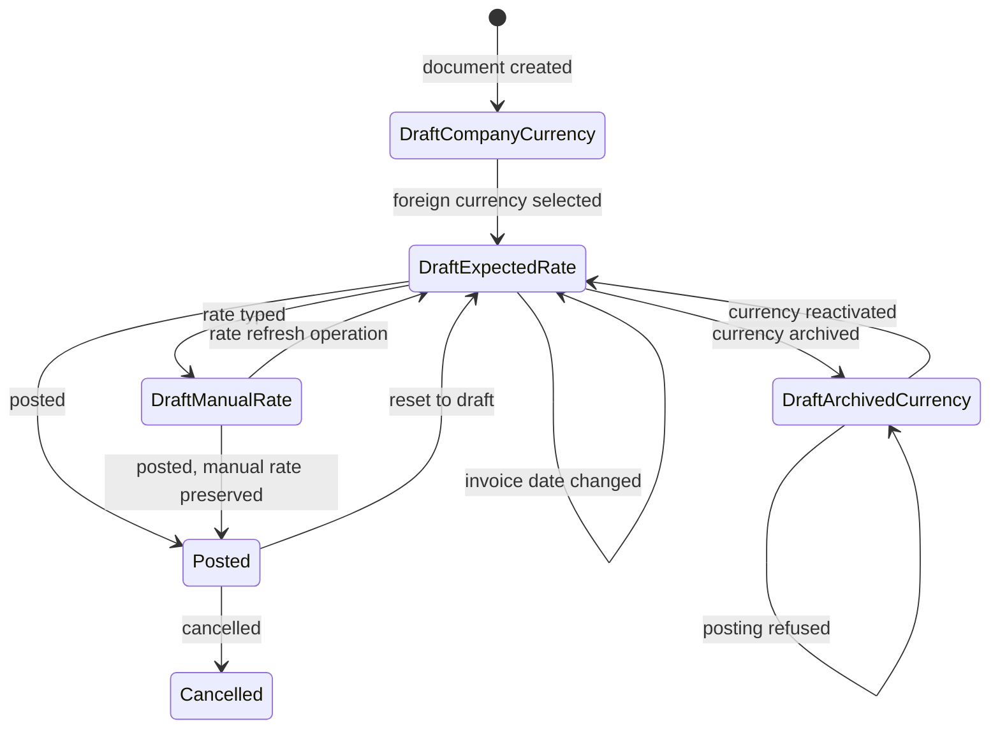

---

# 6. The state of an exchange difference entry

An exchange difference entry is an ordinary Journal Entry, so it carries the same state field with
the stored values `draft`, `posted` and `cancel`. What is specific to this domain is that the entry
is never created by a user, that its posting is decided at creation time by the state of the two
matched entries, and that it is reversed rather than deleted when the matching that produced it is
undone.

## 6.1 States

| Stored value | Label | Meaning |
|---|---|---|
| — | Not created | No rate movement had to be written off, or the matching produced only instructions that were zero at their own precision. |
| `draft` | Draft | The entry exists with the entry number `/`, so that no number is consumed from the exchange journal's sequence before it is posted. At least one of the two matched items belongs to an entry that is itself in draft. |
| `posted` | Posted | Both matched items belong to posted entries, so the exchange difference entry was posted immediately at creation, without the soft posting delay, and took a number from the exchange journal's sequence. |
| `cancel` | Cancelled | Reached only through the general ledger's own cancellation path. The reversal produced when a matching is undone does **not** cancel the original: it is a second, opposite entry. |

## 6.2 Transitions

| From | To | Trigger | Guards | Records created or changed |
|---|---|---|---|---|
| Not created | Draft | A matching produces a non-zero exchange difference instruction and at least one of the two matched entries is in draft | The exchange journal is configured (guard 6.3.1); the loss account is configured (guard 6.3.2); the gain account is configured (guard 6.3.3) | One Journal Entry in the company's exchange journal, dated by [calculations.md](calculations.md) section 16, flagged always tax-exigible, with two lines per instruction as specified in [accounting-effects.md](accounting-effects.md) section 5 |
| Not created | Posted | The same trigger when both matched entries are posted | The same three guards | The same entry, posted immediately without the soft posting delay, numbered from the exchange journal's sequence |
| Not created | Not created | A matching produces an instruction that is zero at the relevant currency's precision, or the operation context suppresses exchange differences (`MCUR-101`) | None | Nothing. The date of any other entry of the same batch is still raised to the accounting date of the skipped item (`MCUR-117`) |
| Not created | Not created (refused) | A matching produces an instruction and any of the three configuration values is missing | Guard 6.3.1, 6.3.2 or 6.3.3 fails | Nothing at all: no partial matching, no entry. The whole reconciliation is abandoned so that it can never be left half done |
| Draft | Posted | The draft entry that held one of the matched items is posted | The general ledger's posting rules | The exchange difference entry is posted together with it |
| Draft | — (deleted) | The partial matching that carries the entry is deleted | None | The draft entry is deleted outright, together with any draft cash-basis entry of the same matching |
| Posted | Posted, offset by a reversal | The partial matching that carries the entry is deleted | None | A reversing entry is created in cancelling mode, dated by [calculations.md](calculations.md) section 17, with its internal reference set to "Reversal of: *the entry number of the reversed entry*", and reconciled against the original so that neither shows as an open item |

## 6.3 Guards, in evaluation order

The three configuration guards are evaluated for **every** journal that takes part in the batch,
before any entry is created.

### 6.3.1 The exchange journal must be configured

Condition that fails: the company of an instruction has no exchange difference journal.

Message: "You have to configure the 'Exchange Gain or Loss Journal' in your company settings, to
manage automatically the booking of accounting entries related to differences between exchange
rates."

### 6.3.2 The loss account must be configured

Condition that fails: the company of a journal taking part in the batch has no loss exchange
account.

Message: "You should configure the 'Loss Exchange Rate Account' in your company settings, to manage
automatically the booking of accounting entries related to differences between exchange rates."

### 6.3.3 The gain account must be configured

Condition that fails: the company of a journal taking part in the batch has no gain exchange
account.

Message: "You should configure the 'Gain Exchange Rate Account' in your company settings, to manage
automatically the booking of accounting entries related to differences between exchange rates."

## 6.4 Diagram

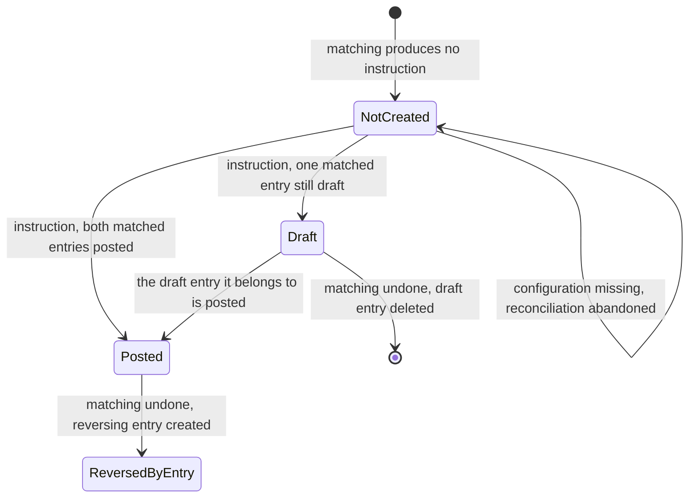

---

# 7. The reconciliation state of a journal item, seen from the currency side

A journal item carries two residual amounts: the residual amount (`amount_residual`) in the company
currency and the residual amount in currency (`amount_residual_currency`) in the item's own
currency. The reconciled flag (`reconciled`) is true only when **both** are zero, each tested at its
own currency's precision. The states below are the combinations that occur.

## 7.1 States

| State | Read from | Meaning |
|---|---|---|
| Not reconcilable | The account allows neither reconciliation nor cash handling | Both residuals are forced to zero and the reconciled flag is forced to false (`MCUR-073`). The item can never take part in a matching. |
| Open | The item takes part in no matching; both residuals equal the item's two amounts | The item offers its whole value in both columns. |
| Partially matched | Both residuals are non-zero and smaller in absolute value than the item's amounts | Some matchings exist. The item still offers a residual in both columns. |
| Matched in the document currency, open in the company currency | The residual amount in currency is zero at the item currency's precision while the residual amount is not zero at the company currency's precision | The rate moved between recording and settlement. An exchange difference instruction is produced for the company currency column. |
| Matched in the company currency, open in the document currency | The residual amount is zero at the company currency's precision while the residual amount in currency is not zero at the item currency's precision | The matching was measured in the company currency and a document currency tail remains. An exchange difference instruction is produced for the document currency column. |
| Reconciled | Both residuals are zero at their own precisions | The reconciled flag is true. The item may not be reconciled again (`MCUR-130`). |

The two asymmetric states are the reason the exchange difference machinery exists: a journal item
is not settled until *both* of its columns are empty, and a rate movement empties one before the
other.

## 7.2 Transitions

| From | To | Trigger | Guards | Records created or changed |
|---|---|---|---|---|
| Open | Partially matched | A matching consumes less than the whole residual in the reconciliation currency | The batch guards `MCUR-130` to `MCUR-136` | One Partial Reconciliation with its three positive amounts; both residuals of both items are decremented (`MCUR-115`); the matching number becomes the letter `P` followed by an identifier |
| Open or partially matched | Matched in one column, open in the other | A matching consumes the whole residual of one column while the other column retains a difference produced by a rate movement | The same guards | One Partial Reconciliation; one exchange difference instruction |
| Matched in one column, open in the other | Reconciled | The exchange difference entry is created and its correction line is matched against the item, in exchange-line mode | The three configuration guards of section 6.3 | One Journal Entry, two journal items, one further Partial Reconciliation whose two document currency amounts are zero (`MCUR-113`); the remaining residual becomes zero |
| Open or partially matched | Reconciled | A matching consumes the whole residual in both columns at once | The batch guards | One Partial Reconciliation; the reconciled flag becomes true; a Full Reconciliation is created when every item of the connected group also closes, by the test of [calculations.md](calculations.md) section 19 |
| Reconciled | Open or partially matched | The covering matchings are deleted | None | The Partial Reconciliation rows and the Full Reconciliation row are deleted; both residuals are restored; the exchange difference entry is reversed or deleted (section 6); the matching numbers of the remaining connected items are recomputed |
| Any | Not reconcilable | The account's reconciliation setting is switched off | Owned by [../general-ledger/](../general-ledger/) | Both residuals are forced to zero and the reconciled flag to false |

## 7.3 Guards on entering a matching, in evaluation order

| Order | Condition that fails | Message |
|---|---|---|
| 1 | An item of the batch is already fully reconciled | "You are trying to reconcile some entries that are already reconciled." |
| 2 | An item of the batch belongs to a cancelled entry | "You can not reconcile cancelled entries." |
| 3 | The items of the batch are not all on one account | "Entries are not from the same account: *the comma-separated account display names*" |
| 4 | The items of the batch do not all belong to one root company | "Entries don't belong to the same company: *the comma-separated company display names*" |
| 5 | The account allows neither reconciliation nor cash handling | "Account *the account display name* does not allow reconciliation. First change the configuration of this account to allow it." |

An item that is not reconciled but already carries a partial matching number is exempt from the
first guard, because it may still receive further matchings.

## 7.4 Diagram

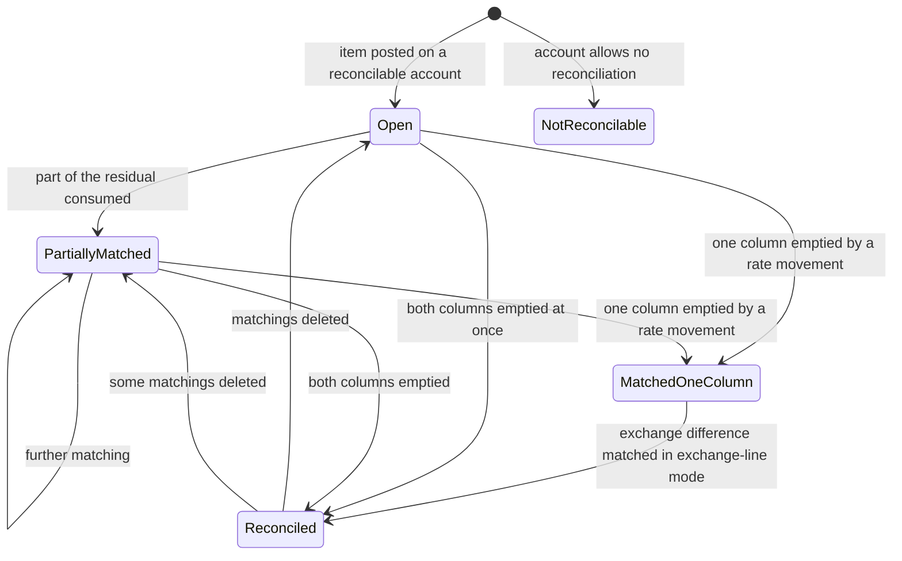

---

# 8. The matching number of a journal item

The matching number (`matching_number`) is a short text written on every item that takes part in a
matching, or that is marked for one during an import. It is a state marker in its own right, and a
stored consistency check refuses every combination that does not correspond to one of the states
below.

## 8.1 States

| Stored value | Label | Meaning |
|---|---|---|
| empty | — | The item takes part in no matching and is not marked for one. |
| The letter `I` followed by any text | An import mark | The item was imported with a matching key and is waiting for its counterpart. No Partial Reconciliation exists yet. When every entry carrying the same mark is posted, the real matching is performed, with exchange differences and cash-basis entries suppressed for that operation. A matching number supplied on creation that does not already begin with `I` is prefixed with `I`, unless the operation context asks for that check to be skipped. |
| The letter `P` followed by a whole number | A partial group | The item belongs to a connected group of matchings that has not closed. The number is the smallest internal identifier among the Partial Reconciliation rows of the group, so that every item of one group carries the same marker. |
| A whole number written as text | A closed group | The item belongs to a group that closed. The number is the internal identifier of the Full Reconciliation record. |

## 8.2 Transitions

| From | To | Trigger | Guards | Records created or changed |
|---|---|---|---|---|
| empty | An import mark | An item is created with a matching key | The value is prefixed with `I` when it is not already | The journal item |
| An import mark | A partial group or a closed group | Every entry carrying the same mark has been posted and the deferred matching runs | The account is switched to allow reconciliation when it did not | Partial Reconciliation rows; the matching numbers of every connected item |
| empty | A partial group | The first matching of the item is created and the group does not close | The batch guards of section 7.3 | The matching numbers of every item of the connected group |
| A partial group | A closed group | The group closes | Every item of the group passes the closure test of [calculations.md](calculations.md) section 19 | One Full Reconciliation; the matching number of every item of the group becomes its identifier |
| A closed group | A partial group | Some matchings of the group are deleted while others remain | None | The Full Reconciliation is deleted; the numbers are recomputed over the remaining graph |
| A partial group or a closed group | empty | Every matching of the item is deleted | None | The matching number is cleared |

## 8.3 The consistency check

A stored check is evaluated whenever the matching number, the matchings of an item or its full
reconciliation link change. Each failing combination has its own text:

| Failing combination | Text |
|---|---|
| The value is neither an import mark, nor the letter `P` followed by digits, nor digits | "Invalid matching number format" |
| An import mark is carried by an item that already has matchings | "A temporary number can not be used in a real matching" |
| A value beginning with `P` is carried by an item with no matchings | "Should have partials" |
| A value beginning with `P` is carried by an item that has a full reconciliation | "Should not be partial number" |
| A purely numeric value is carried by an item that has no full reconciliation | "Should not be full number" |
| A numeric value differs from the identifier of the item's full reconciliation | "Matching number should be the full reconcile" |
| An item has matchings but no matching number | "Should have number" |

The second text is a validation shown to a user; the others are internal consistency assertions
that a correct implementation never raises. They are reproduced because an automated test keys on
them.

## 8.4 Diagram

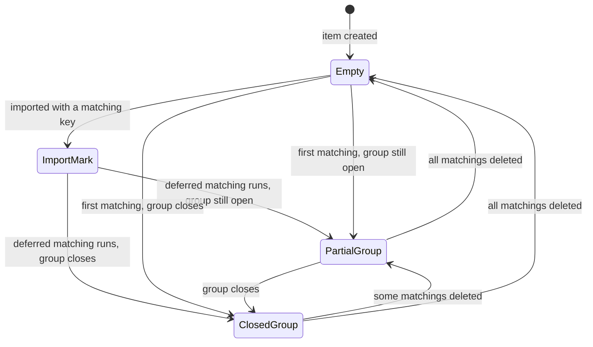

---

# 9. The settlement state of a Payment

Payment (`account.payment`) carries a stored selection field `state`. This domain owns one thing
about it: the comparison that decides whether a matching settles the payment is made **in the
payment's own currency, at that currency's precision**.

## 9.1 States

| Stored value | Label | Meaning |
|---|---|---|
| `draft` | Draft | The payment has been prepared and its journal entry, if any, is not posted. |
| `in_process` | In Process | The payment is posted and its liquidity item is not yet fully matched, or its counterpart is not yet matched with the documents it settles. |
| `paid` | Paid | The liquidity residual is zero at the company currency's precision, or the liquidity account is not a reconcilable account; or every document the payment is matched with has itself reached the paid payment state. |
| `canceled` | Canceled | The payment was withdrawn before it settled. |
| `rejected` | Rejected | The payment was refused by the party that was to execute it. |

## 9.2 Transitions owned by this domain

| From | To | Trigger | Guards | Records created or changed |
|---|---|---|---|---|
| `in_process` | `paid` | A Partial Reconciliation is created that involves an item of the payment's entry | The payment has no outstanding account; the payment's signed amount and the matched amount in the payment's currency compare equal at the payment currency's precision. For an inbound payment the matched amount compared is the matched amount in the debit currency; for an outbound payment it is the negated matched amount in the credit currency | The payment's state |
| `in_process` | `paid` | A Partial Reconciliation is created for a payment that settles several documents at once | The single payment covers more than one document, and the sum of the matched amounts across the documents it settles compares equal, at the payment currency's precision, to the payment's signed amount. A per-matching comparison never succeeds in this case, because each matching corresponds to one document and not to the payment | The payment's state |
| `paid` | `in_process` | A Partial Reconciliation that satisfied the comparison above is deleted | The same comparison, evaluated against the state `paid` | The payment's state, set back after the matchings are deleted |
| `in_process` | `paid` | Every document the payment is matched with reaches the paid payment state | None | The payment's state |

The comparison is a currency comparison, not an equality of stored numbers: two amounts that differ
by less than the payment currency's rounding factor may still compare as different, because each is
rounded before the subtraction ([calculations.md](calculations.md) section 4).

## 9.3 Diagram

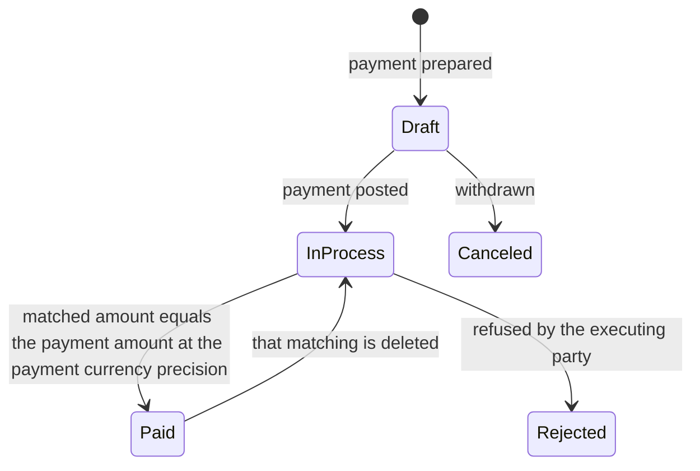

---

# 10. The payment state of a document

Journal Entry carries a second stored selection field, the payment state (`payment_state`),
alongside its posting state. The currency dimension decides the test that drives it: the residual
of the document is tested for zero **at the document currency's precision**, falling back to the
company currency when the document carries no currency.

## 10.1 States

| Stored value | Label | Meaning |
|---|---|---|
| `not_paid` | Not Paid | The document's residual amount is not zero at the document currency's precision and no matching exists on its receivable or payable items. |
| `partial` | Partially Paid | The residual is not zero and at least one matching exists on a receivable or payable item. |
| `in_payment` | In Payment | The residual is zero at the document currency's precision but at least one payment matched against it has not yet been matched with a bank transaction; or a payment that carries no journal entry of its own is in process against the document. |
| `paid` | Paid | The residual is zero at the document currency's precision and every payment matched against it is itself matched with a bank transaction, or the settlement came from something that is not a payment. |
| `reversed` | Reversed | The residual is zero and the only counterparts are credit notes, refunds or miscellaneous entries of the mirrored type, so the document was undone rather than settled. |
| `blocked` | Blocked | A user has marked the document as not to be chased. The state is kept whatever the residual says. |
| `invoicing_legacy` | Invoicing App Legacy | A marker kept for documents whose settlement was recorded outside the ledger. The state is kept whatever the residual says. |

## 10.2 Transitions owned by this domain

| From | To | Trigger | Guards | Records created or changed |
|---|---|---|---|---|
| `not_paid` | `partial` | A matching consumes part of the document's receivable or payable residual | The residual is still not zero at the document currency's precision | The document's payment state |
| `not_paid` or `partial` | `paid` | A matching, or an exchange difference entry, brings the residual to zero at the document currency's precision | Every payment involved is matched with a bank transaction, or no payment is involved | The document's payment state; the paid hook posts a message in the document's discussion thread |
| `not_paid` or `partial` | `in_payment` | The residual reaches zero while a payment involved is not yet matched with a bank transaction | None | The document's payment state |
| `in_payment` | `paid` | The last payment involved is matched with its bank transaction | None | The document's payment state |
| `paid`, `in_payment` or `partial` | `not_paid` | Every matching on the document's receivable or payable items is deleted | None | The document's payment state; the residuals are restored |
| Any | `blocked` | A user marks the document as blocked | None | The document's payment state |

An exchange difference entry is what moves a document from `partial` to `paid` when the rate has
moved: the document currency column closed at the matching, and the company currency column closes
only when the correction line is matched. Because the test above reads the document currency
residual, the document may already read `paid` while the company currency column is still being
repaired inside the same operation.

## 10.3 Diagram

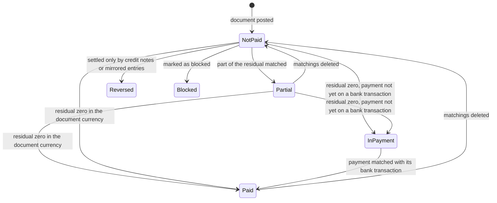

---

# 11. The currency configuration state of a bank transaction

A Bank Statement Line (`account.bank.statement.line`) carries a journal currency (`currency_id`), a
transacted currency (`foreign_currency_id`) and two amounts. The combination it holds is a state,
because each combination generates a different pair of journal items.

## 11.1 States

| State | Read from | Meaning |
|---|---|---|
| One currency | The journal currency equals the company currency and no transacted currency is set | The amount is in the company currency. Both generated items carry the company currency and the two columns agree. |
| Two currencies, bank account in a foreign currency | The journal currency differs from the company currency and no transacted currency is set | The amount is in the bank account currency. Both generated items carry that currency; the company currency value is the conversion of the amount at the line's date. |
| Two currencies, transaction in a foreign currency | The journal currency equals the company currency and a transacted currency is set | The liquidity item carries the company currency, the counterpart item carries the transacted currency, and the company currency value comes from the amount, which is already in the company currency. |
| Three currencies | The journal currency differs from the company currency and a transacted currency different from both is set | The liquidity item carries the bank account currency, the counterpart item carries the transacted currency, and the company currency value is derived from the bank account currency amount, never from the transacted amount (`MCUR-156`). |

## 11.2 Transitions

| From | To | Trigger | Guards | Records created or changed |
|---|---|---|---|---|
| One currency, or two currencies with the bank account in a foreign currency | Two or three currencies | A user or an import sets the transacted currency and the amount in currency | The transacted currency differs from the journal currency (guard 11.3.1); an amount in currency is present (guard 11.3.3) | The statement line; when the amount in currency was left empty it is derived by converting the amount at the line's date (`MCUR-154`), and an amount already entered is never overwritten |
| Any | The same state | The bank feed supplies a transacted currency equal to the journal's effective currency at creation | None; the value is silently dropped rather than refused | The statement line is created with an empty transacted currency and an amount in currency of zero (`MCUR-153`) |
| Two or three currencies | One currency, or two currencies with the bank account in a foreign currency | A user clears the transacted currency | The amount in currency must be cleared with it (guard 11.3.2) | The statement line; the amount in currency is set to zero |
| Any | Journal items generated | The line is posted | The journal has a suspense account or an explicit counterpart account is supplied (guard 11.3.4) | Two journal items as specified in [calculations.md](calculations.md) section 21 |

## 11.3 Guards, in evaluation order

### 11.3.1 The transacted currency must differ from the bank account currency

Message: "The foreign currency must be different than the journal one: *the bank account currency
code*"

### 11.3.2 An amount in currency requires a transacted currency

Message: "You can't provide an amount in foreign currency without specifying a foreign currency."

### 11.3.3 A transacted currency requires an amount in currency

Message: "You can't provide a foreign currency without specifying an amount in 'Amount in
Currency' field."

### 11.3.4 A suspense account is required

Message: "You can't create a new statement line without a suspense account set on the *the journal
display name* journal."

## 11.4 Diagram

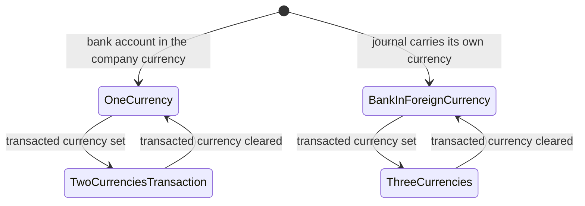

---

# 12. The main currency state of a Company

The main currency of a Company (`currency_id`) is not a selection field, but it passes through a
one-way latch of its own: it may be chosen and changed freely until the first journal item exists
anywhere in the company hierarchy, and never afterwards.

## 12.1 States

| State | Read from | Meaning |
|---|---|---|
| Changeable | No journal item exists for the root company or for any company below it, active or archived | The main currency may be written to any currency; an archived one is activated silently. |
| Frozen | At least one journal item exists for the root company or for any company below it | Writing a different main currency is refused. Writing the same value is accepted, because it changes nothing. |
| Delegated | The company has a parent company, so it is a branch | The value is read-only on the form and must equal the root company's value. |

## 12.2 Transitions

| From | To | Trigger | Guards | Records created or changed |
|---|---|---|---|---|
| — | Changeable | A company is created | The new company takes the main currency of the company of the user creating it (`MCUR-173`) | The Company row; the currency is activated when it was archived |
| Changeable | Changeable | A user writes another main currency, or selects a country whose currency is then proposed (`MCUR-172`) | Guard 12.3.1 for a branch | The Company row; the newly chosen currency is activated when it was archived; every view whose rate column headings are generated from the company currency code is re-rendered |
| Changeable | Frozen | The first journal item of the hierarchy is written | None | The journal item |
| Frozen | Frozen (refused) | A user writes a different main currency | Guard 12.3.2 fails | Nothing is written |
| Any | Delegated | A parent company is selected on the form | The parent's currency is copied onto the record immediately | The Company row |

## 12.3 Guards, in evaluation order

### 12.3.1 A branch shares its root company's currency

Condition that fails: the value written on a branch differs from the root company's value.

Message: "The *field label* of a subsidiary must be the same as it's root company." The placeholder
is the translated label of the field being written, which for this field is "Currency". The message
is reproduced as it is shown, including its grammatical slip.

### 12.3.2 The main currency cannot change once entries exist

Condition that fails: the write changes the main currency and at least one journal item exists for
the root company or for any company below it.

Message: "You cannot change the currency of the company since some journal items already exist"

## 12.4 Diagram

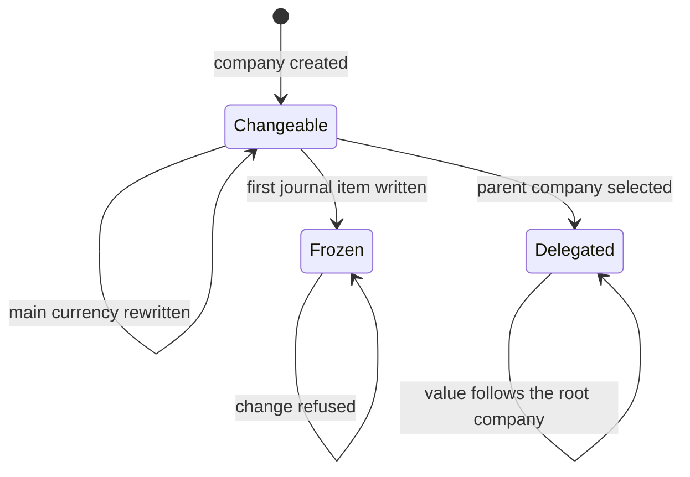

---

# 13. Summary of every state field

| Machine | Entity | Field | Kind | Stored values |
|---|---|---|---|---|
| Activity state of a currency | Currency | `active` | Stored true or false | `true`, `false` |
| Precision state of a currency | Currency | none; derived from the existence of journal items | Derived latch | — |
| Multi-currency capability | The platform | none; derived from the count of active currencies | Derived | — |
| Rate row lifecycle | Currency Rate | none | Derived from the row's position in time | — |
| Currency and rate state of a document | Journal Entry | `state`, with `currency_id` and `invoice_currency_rate` | Stored selection plus two stored fields | `draft`, `posted`, `cancel` |
| Exchange difference entry | Journal Entry | `state` | Stored selection | `draft`, `posted`, `cancel` |
| Reconciliation state of an item | Journal Item | `amount_residual`, `amount_residual_currency`, `reconciled` | Derived and stored | — |
| Matching number | Journal Item | `matching_number` | Stored text | empty, `I` followed by text, `P` followed by digits, digits |
| Settlement state of a payment | Payment | `state` | Stored selection | `draft`, `in_process`, `paid`, `canceled`, `rejected` |
| Payment state of a document | Journal Entry | `payment_state` | Stored selection | `not_paid`, `in_payment`, `paid`, `partial`, `reversed`, `blocked`, `invoicing_legacy` |
| Currency configuration of a bank transaction | Bank Statement Line | `currency_id`, `foreign_currency_id` | Two stored links | — |
| Main currency state of a company | Company | `currency_id` | Stored link plus a derived latch | — |

---

# 14. Reconciliation notes

These notes record where the two independently written drafts of this folder disagreed about a
state, or left one unstated, and what was kept after checking the behaviour against the system
itself.

1. **Where the state tables lived.** One draft carried its state tables as a final section of its
   workflows document and had no separate state-machine document; the other had no state tables at
   all. Every table of that section is reproduced here, expanded with the stored values, the labels,
   the meanings and the exact refusal messages that rule seven of the documentation rules requires,
   and each machine has been given a diagram. [workflows.md](workflows.md) now carries the
   procedures only and points here for the states.
2. **The states of a rate row.** One draft stated that Currency Rate "has no state field; its
   lifecycle is create, edit, delete". That is true of the stored data and incomplete as a
   specification, because the row's effect changes without the row changing: creating a later row
   supersedes it for later dates only. Section 4 states the machine relative to an evaluation date,
   which is the only reading under which the step function of [calculations.md](calculations.md)
   section 7 is reproducible.
3. **The import mark of a matching number.** Neither draft mentioned it. A matching number may also
   begin with the letter `I`, which marks an item imported with a matching key whose real matching
   is deferred until every entry carrying the same mark is posted; the deferred matching then runs
   with exchange differences and cash-basis entries suppressed. Section 8 states the four states of
   the field and the seven texts of its consistency check.
4. **The payment state of a document against the settlement state of a payment.** One draft treated
   "paid" as a single notion. They are two fields on two entities with two different tests: a
   payment becomes `paid` when the matched amount equals the payment amount **in the payment's
   currency**, while a document becomes `paid` when its residual is zero **in the document
   currency**. Sections 9 and 10 keep them apart, because a payment in one currency settling a
   document in another can satisfy one test and not the other.
5. **The group payment.** The comparison that flips a payment to the paid state never succeeds
   matching by matching when one payment settles several documents, because each matching
   corresponds to one document. The sum over the documents the payment settles is compared instead,
   at the payment currency's precision. Section 9.2 states both forms.
6. **Cancellation against reversal of an exchange difference entry.** One draft's table showed a
   posted exchange difference entry moving to a cancelled state when its matching is undone. It does
   not: a second, opposite entry is created and reconciled against it, and the original stays
   posted. Section 6.2 states the corrected behaviour, which is also what
   [accounting-effects.md](accounting-effects.md) section 6 books.
