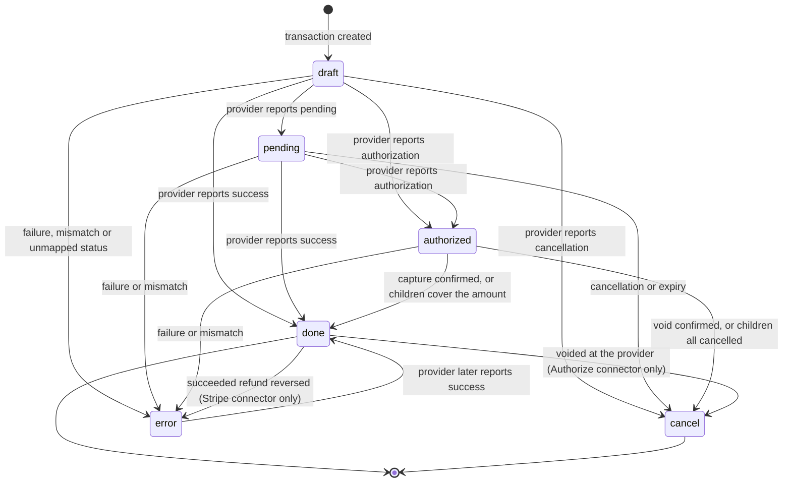
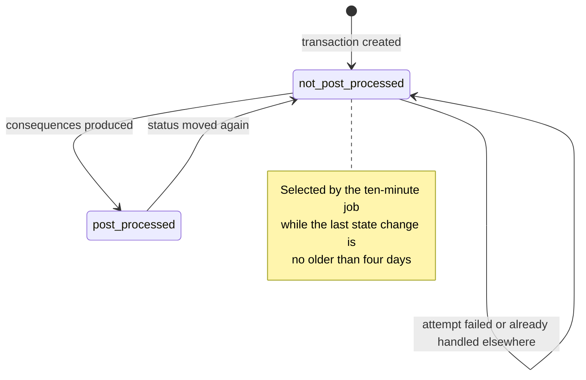
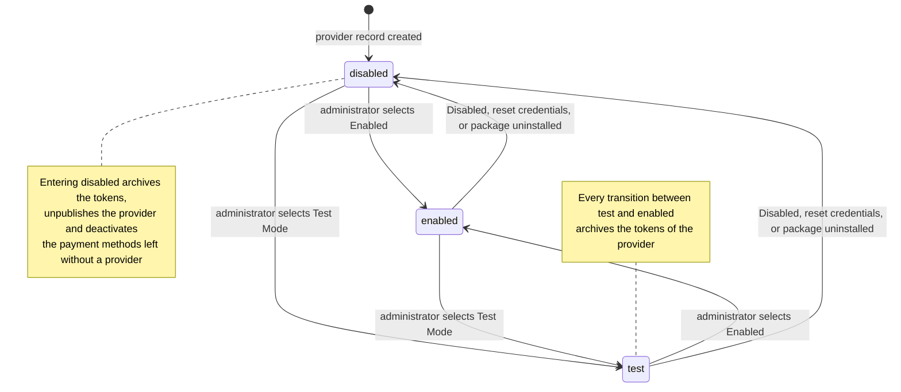
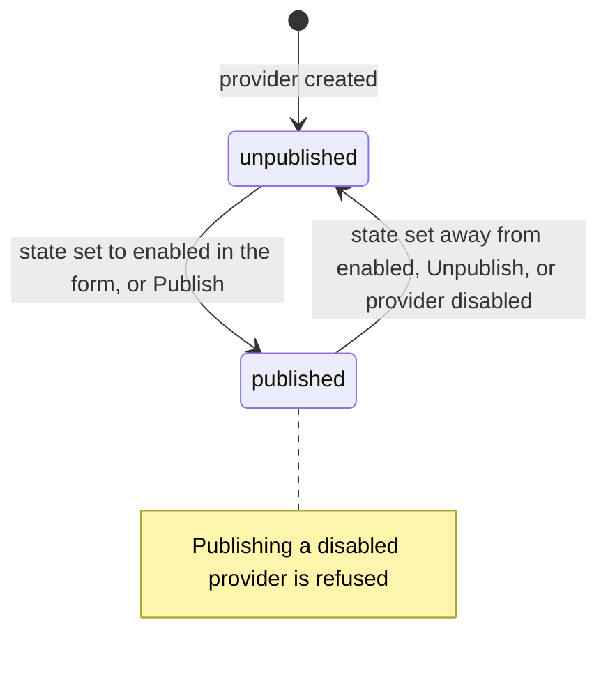
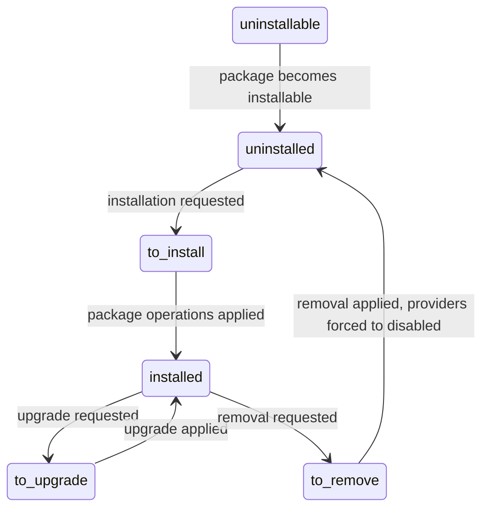
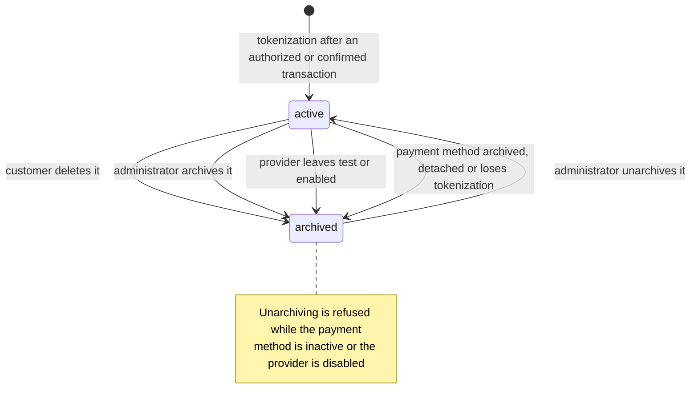
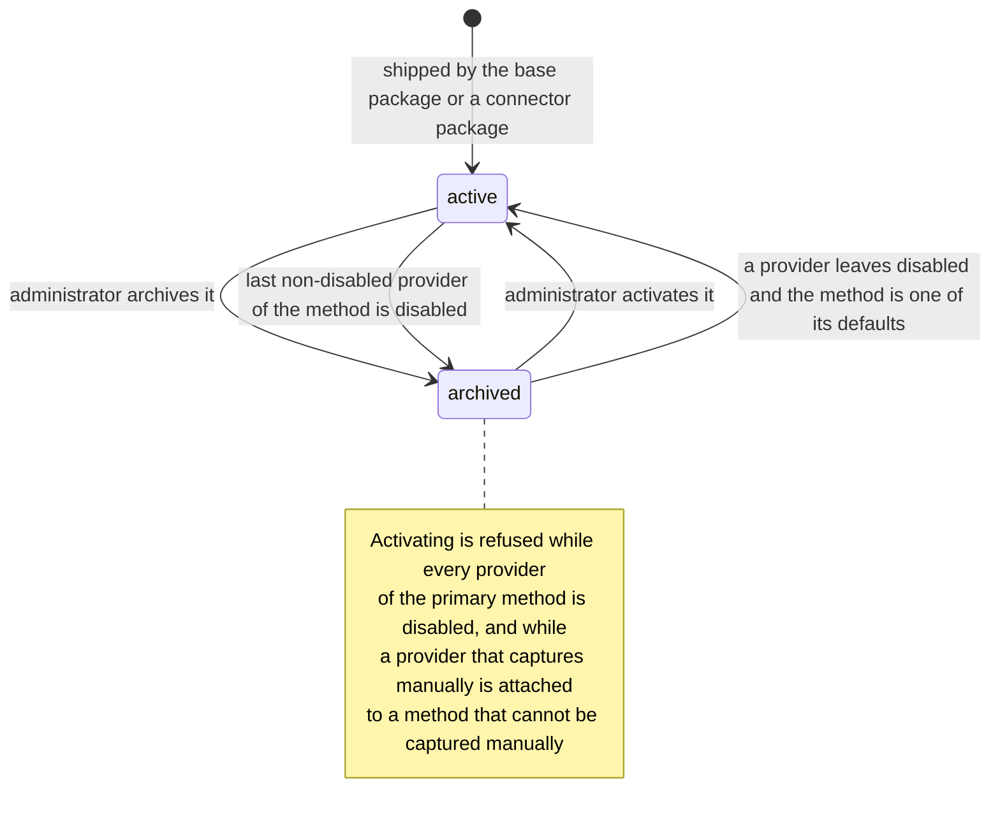

# State machines

Every stored field of the Payment Providers domain that carries a lifecycle is specified here: its states with their stored values, labels and meaning; every transition with its origin, its destination, the operation that triggers it, the conditions that must hold, the exact text shown or written when a condition fails, and the records the transition creates or changes; and a diagram of each machine.

The domain has eight such fields.

| Machine | Entity | Field identifier | Full name of the field | Kind | Section |
|---|---|---|---|---|---|
| Transaction status | Payment Transaction | `state` | status | Selection of six values | [1](#1-the-payment-transaction-status-machine) |
| Post-processing flag | Payment Transaction | `is_post_processed` | is post-processed | Boolean, two states | [2](#2-the-post-processing-flag-of-a-payment-transaction) |
| Provider operating state | Payment Provider | `state` | operating state | Selection of three values | [3](#3-the-payment-provider-operating-state-machine) |
| Provider publication flag | Payment Provider | `is_published` | published | Boolean, two states | [4](#4-the-publication-flag-of-a-payment-provider) |
| Provider installation state | Payment Provider | `module_state` | installation state | Selection of six values, mirrored from the package registry | [5](#5-the-installation-state-mirrored-on-a-payment-provider) |
| Token activation | Payment Token | `active` | active | Boolean, two states | [6](#6-the-payment-token-activation-machine) |
| Payment method activation | Payment Method | `active` | active | Boolean, two states | [7](#7-the-payment-method-activation-machine) |
| Simulated status of a demonstration token | Payment Token, demonstration connector | `demo_simulated_state` | simulated state | Selection of four values | [8](#8-the-simulated-status-of-a-demonstration-token) |

The two transient entities of the domain, the Payment Capture Wizard and the Payment Link Wizard, carry no state field: they exist for the duration of one dialogue and are described in [entities.md](entities.md) sections 5 and 6.

Section [9](#9-states-of-other-domains-that-this-domain-drives) lists the state fields owned by other domains that a transition of this domain moves, and section [10](#10-invariants-across-the-machines) states the invariants that hold across all of them.

Rule identifiers of the form `PAY-RULE-nnn` cited below are defined in [business-rules.md](business-rules.md).

---

# 1. The Payment Transaction status machine

## 1.1 States

The status of a Payment Transaction is stored in the field `state` (status). It is required, defaults to `draft`, is never copied when a transaction is duplicated, is indexed, and is never writable from a screen: only the transition operations of section [1.2](#12-the-generic-state-update-step) change it.

| Stored value | Label | Meaning | Money moved | Terminal |
|---|---|---|---|---|
| `draft` | "Draft" | The transaction record exists and carries an amount, a currency, a provider, a payment method and a contact snapshot, but the provider has not answered yet. Every transaction begins here, including the child transactions created for a capture, a void or a refund. The `operation` field is not to be trusted while the transaction is in this state, because the payment flow can still change before the customer commits to one. | No | No |
| `pending` | "Pending" | The provider has accepted the payment instruction but the funds are not yet secured: an offline payment mode is waiting for the customer to transfer the money, a bank-based method is waiting for settlement, or the provider is holding the payment for review. Post-processing runs in this state and produces the consequences that a not-yet-received payment allows. | Not yet | No |
| `authorized` | "Authorized" | The provider has reserved the amount on the customer's payment instrument but has not taken it. A transaction may only carry this value when its provider supports manual capture; see [PAY-RULE-030](business-rules.md). The amount can afterwards be captured in full or in parts, and whatever is not captured can be voided. | Reserved, not captured | No |
| `done` | "Confirmed" | The provider reports that the money has been taken (or, for a refund transaction, that the money has been given back). This is the state in which the accounting consequences of the transaction are produced: see [accounting-effects.md](accounting-effects.md). | Yes | Yes, except for the two connector-specific exits of section [1.10](#110-connector-specific-extra-source-states) |
| `cancel` | "Canceled" | The payment will not happen: the customer abandoned the provider's page, the provider declined the instruction, the authorization was voided, or the payment expired. A cancellation carries an optional explanation in `state_message` (state message). | No | Yes, except for a later confirmation, which is not allowed from `cancel` |
| `error` | "Error" | The attempt failed for a reason that is not a plain refusal: the provider returned a failure, the request to the provider could not be completed, or the answer did not match the transaction. The reason is stored in `state_message`. This is the only non-final failure state: a transaction in `error` can still reach `done` when the provider later reports a success. | No | No |

Two of these states can only be reached by an automatic process and never by a person: `pending` and `authorized` are written exclusively by the processing of payment data received from a provider, and `error` is additionally written by the amount and currency check and by the failure handler of an outbound request. The demonstration connector is the single exception: it exposes three screen operations that feed simulated payment data into the same processing step, and therefore lets an internal user reach `done`, `cancel` and `error` by hand on a demonstration transaction. See section [8](#8-the-simulated-status-of-a-demonstration-token).

## 1.2 The generic state-update step

Every transition of this machine goes through one step, the state-update step, which is called by five transition operations, one per target state. The step never raises: a move that is not allowed is skipped and logged.

**Inputs**: the set of transactions to move, the tuple of allowed source states for the target state, the target state, and the state message to store.

1. Classify each transaction of the set into exactly one of three groups. A transaction whose current status is one of the allowed source states is *to process*. A transaction whose current status already equals the target state is *already processed*. Every other transaction is *in the wrong state*.
2. For each transaction that is *already processed*, write an informational entry to the technical log reading `Skipped the update of transaction <reference> as it is already in state <state>.`, where `<reference>` is the transaction reference and `<state>` is the current status. Nothing is written to the record.
3. For each transaction that is *in the wrong state*, write a warning entry to the technical log reading `Refused to update transaction <reference> from state <current state> to state <target state>; allowed source states are: <allowed states>.`, where `<allowed states>` is the tuple of allowed source states for that target. Nothing is written to the record.
4. For the transactions that are *to process*, perform one single write that sets four fields together: `state` to the target state; `state_message` to the given state message, which may be empty and then clears any previous message; `last_state_change` (last state change moment) to the current moment; and `is_post_processed` to false, so that the business consequences of the new state are produced even when the consequences of a previous state were already produced.
5. Return the set of transactions that were actually moved. The caller applies the side effects of the target state only to that set, never to the skipped ones.

The five transition operations wrap this step as follows.

| Operation | Target state | Allowed source states | Side effects applied to the moved transactions, in order |
|---|---|---|---|
| `set_pending` | `pending` | `draft` | Log the received message of section [1.6](#16-messages-written-by-a-transition) on every linked document. |
| `set_authorized` | `authorized` | `draft`, `pending` | Log the received message. |
| `set_done` | `done` | `draft`, `pending`, `authorized`, `error` | Log the received message, then run the source-transaction closure of section [1.9](#19-child-transactions-and-the-closure-of-their-source). |
| `set_canceled` | `cancel` | `draft`, `pending`, `authorized` | Log the received message, then run the source-transaction closure. |
| `set_error` | `error` | `draft`, `pending`, `authorized` | Log the received message. |

Each of the five operations accepts an extra tuple of source states, which a connector adds to the standard tuple for the one situation that needs it. Section [1.10](#110-connector-specific-extra-source-states) lists every use of that facility; there are three, and no other.

## 1.3 Allowed source states per target state

| Target | `draft` | `pending` | `authorized` | `done` | `cancel` | `error` |
|---|---|---|---|---|---|---|
| `pending` | allowed | already there | refused | refused | refused | refused |
| `authorized` | allowed | allowed | already there | refused | refused | refused |
| `done` | allowed | allowed | allowed | already there | refused | allowed |
| `cancel` | allowed | allowed | allowed | refused, except for the two Authorize situations of section [1.10](#110-connector-specific-extra-source-states) | already there | refused |
| `error` | allowed | allowed | allowed | refused, except for the Stripe refund reversal of section [1.10](#110-connector-specific-extra-source-states) | refused | already there |

"Refused" means the transaction is skipped, a warning entry is written, and no field of the record changes. "Already there" means the transaction is skipped, an informational entry is written, and no field changes; in particular `last_state_change` is *not* refreshed and `is_post_processed` is *not* cleared when a provider repeats a notification for a state the transaction already holds. That property is what makes repeated notifications harmless.

## 1.4 Transition table

| # | From | To | Triggering operation | Guards, in order | Records created or changed |
|---|---|---|---|---|---|
| T1 | — | `draft` | Creation of a Payment Transaction by the payment form, by the transaction-creation service, by a charge of a saved token from a Payment, or by the creation of a child transaction for a capture, a void or a refund | The reference is unique across the whole database ([PAY-RULE-029](business-rules.md)); when a token is given it must be active ([PAY-RULE-036](business-rules.md)); the provider, the payment method, the amount, the currency and the contact are all present | The Payment Transaction, with `state` `draft`, `is_live` set to true when the provider's operating state is `enabled` and false otherwise, `last_state_change` set to the creation moment, and the ten contact snapshot fields copied from the paying contact |
| T2 | `draft` | `pending` | Processing of payment data whose mapped status is the provider's pending group; the custom payment modes connector always takes this path when the customer confirms the offline instruction | The transaction was found by its reference; the amount and currency check passed | `state`, `state_message`, `last_state_change`, `is_post_processed`; the received message on every linked document, except for a custom payment mode, whose received messages are suppressed |
| T3 | `draft` | `authorized` | Processing of payment data whose mapped status is the provider's authorized group | The provider's `support_manual_capture` (manual capture support) is not empty, otherwise the write is rejected by [PAY-RULE-030](business-rules.md) | As T2, plus the record-level check on the authorized state |
| T4 | `draft` | `done` | Processing of payment data whose mapped status is the provider's confirmed group | The amount and currency check passed | As T2, plus the source-transaction closure when the transaction has a source transaction |
| T5 | `draft` | `cancel` | Processing of payment data whose mapped status is the provider's cancelled group | none beyond the reference match | As T2, plus the source-transaction closure |
| T6 | `draft` | `error` | Processing of payment data whose mapped status is the provider's error group; failure of the amount and currency check; failure of an outbound request made while charging a token, capturing, voiding or refunding; receipt of payment data with an unmapped status | none | As T2, with `state_message` set to the reason: the connector's message, the exception text of the failed request, or one of the three fixed texts of section [1.5](#15-guards-and-refusals-with-their-exact-text) |
| T7 | `pending` | `authorized` | Processing of payment data whose mapped status is the authorized group | Manual capture support, as in T3 | As T3 |
| T8 | `pending` | `done` | Processing of payment data whose mapped status is the confirmed group | The amount and currency check passed | As T4 |
| T9 | `pending` | `cancel` | Processing of payment data whose mapped status is the cancelled group, including an expiry reported by the provider | none | As T5 |
| T10 | `pending` | `error` | Processing of payment data whose mapped status is the error group, or failure of the amount and currency check | none | As T6 |
| T11 | `authorized` | `done` | Processing of payment data whose mapped status is the confirmed group, which is how a full capture requested at the provider comes back | The amount and currency check passed | As T4 |
| T12 | `authorized` | `done` | The source-transaction closure of section [1.9](#19-child-transactions-and-the-closure-of-their-source), when the confirmed and cancelled children of the same operation together cover the whole amount of this transaction and at least one of them is confirmed | The transaction is in `authorized`; the rounded sum of the children equals the amount exactly | `state` to `done` with an empty state message, `state_message`, `last_state_change`, `is_post_processed`; the received message |
| T13 | `authorized` | `cancel` | The source-transaction closure, when the children of the same operation together cover the whole amount and every one of them is cancelled | As T12 | As T12 with `cancel` as the target |
| T14 | `authorized` | `cancel` | Processing of payment data whose mapped status is the cancelled group, which is how a void of the whole authorized amount requested at the provider comes back | none | As T5 |
| T15 | `authorized` | `error` | Processing of payment data whose mapped status is the error group, failure of the amount and currency check, or failure of the outbound capture or void request | none | As T6 |
| T16 | `error` | `done` | Processing of payment data whose mapped status is the confirmed group. This is the only transition that leaves `error`, and it exists because a provider may report a failure and then, on a later notification, a success for the same reference | The amount and currency check passed | As T4 |
| T17 | `done` | `cancel` | The Authorize connector, when the provider reports that the payment was voided at the provider's own interface before the platform could refund it, and when a confirmed payment is voided rather than refunded because it had not been settled | The connector adds `done` to the allowed source states for this call only | As T5 |
| T18 | `done` | `error` | The Stripe connector, when a refund transaction that had already been reported as succeeded is later reversed by the provider | The connector adds `done` to the allowed source states for this call only; applies only to a transaction whose operation is `refund` | As T6, with the fixed reason of section [1.5](#15-guards-and-refusals-with-their-exact-text) |
| T19 | any | unchanged | A transition operation whose target state equals the current state | none | Nothing. An informational log entry is written |
| T20 | any | unchanged | A transition operation whose allowed source states exclude the current state | none | Nothing. A warning log entry is written |

Transitions T2 to T18 are reached through three inbound channels, all of which end in the same processing operation: the synchronous answer to a request the platform made, the return of the customer's browser from the provider's page, and an asynchronous webhook notification. The channels are described in [workflows.md](workflows.md) section 3; the per-connector mapping from a provider status to one of the five groups named above is in [provider-connector-contracts.md](provider-connector-contracts.md).

## 1.5 Guards and refusals, with their exact text

The guards below are evaluated in the order given. Each row states the condition that makes the guard fail and the exact text the system produces.

| Order | Guard | Failing condition | Exact text | Effect of the failure |
|---|---|---|---|---|
| 1 | Reference uniqueness | Another transaction already has the same reference | `Reference must be unique!` | The creation is rejected by the storage layer; no transaction exists |
| 2 | The token is usable | A token is given and it is archived | `Creating a transaction from an archived token is forbidden.` | The creation is rejected; no transaction exists |
| 3 | The token belongs to the paying family | The commercial contact of the paying contact differs from the commercial contact of the token's owner | `You do not have access to this payment token.` | The transaction-creation service refuses before any record is written |
| 4 | Authorization is supported | The status becomes `authorized` while the provider's manual capture support is empty | `Transaction authorization is not supported by the following payment providers: %s`, where `%s` is the comma-separated list of the names of the offending providers | The write is rejected; the transaction keeps its previous status |
| 5 | The provider is reachable | An outbound request is about to be sent while the provider's operating state is `disabled` | `Making a request to the provider is not possible because the provider is disabled.` | The operation stops before the request; the transaction keeps its status. For a capture, a void or a refund, the child transaction is not even created |
| 6 | The transaction was found | The payment data carries no reference, or no transaction matches the reference and the provider code | Log only: `Received payment data from provider <provider code> with missing reference`, or `No transaction found matching reference <reference>.` | Nothing is processed; no state changes |
| 7 | The amount data is complete | The provider sent an amount or a currency code that is empty, for a transaction whose operation is not `validation` and whose connector does not opt out of the check | `The amount or currency is missing from the payment data.` | The transaction moves to `error` with that text as its state message, and no further update is applied |
| 8 | The amount matches | The amount reported by the provider, negated first when the operation is `refund`, differs from the transaction amount rounded downwards to the precision of the comparison | `The amount from the payment data doesn't match the one from the transaction.` | As above: the transaction moves to `error` and processing stops |
| 9 | The currency matches | The currency code reported by the provider differs from the code of the transaction currency | `The currency from the payment data doesn't match the one from the transaction.` | As above |
| 10 | Only authorized transactions are voided | The Void operation is invoked on a set containing a transaction whose status is not `authorized` | `Only authorized transactions can be voided.` | The whole operation is refused; nothing is created |
| 11 | Only confirmed transactions are refunded | The Refund operation is invoked on a set containing a transaction whose status is not `done` | `Only confirmed transactions can be refunded.` | The whole operation is refused; nothing is created |
| 12 | The capture amount is within bounds | The amount to capture is not strictly positive, or exceeds the amount available for capture | `The amount to capture must be positive and cannot be superior to %s.`, where `%s` is the available amount rendered in the transaction currency | The capture wizard refuses; no child transaction is created |
| 13 | Partial capture is supported by every selected transaction | A partial amount is requested while at least one selected transaction has a provider or a primary payment method whose manual capture support is `full_only` | `Some of the transactions you intend to capture can only be captured in full. Handle the transactions individually to capture a partial amount.` | As above |

Guard 4 is a record-level check on the status field itself, so it also fires when a transaction that is already in `authorized` is written for any other reason while its provider has meanwhile lost manual capture support.

The fixed reason written by transition T18 is `The refund did not go through. Please log into your Stripe Dashboard to get more information on that matter, and address any accounting discrepancies.` The fixed reason written by the Stripe connector when the customer closes the provider's page without paying and the provider reports no error of its own is `The customer left the payment page.` The fixed reason written for an unmapped status is `Received data with invalid intent status: %s.` for that connector, where `%s` is the status the provider sent; other connectors word the same situation in their own way, and each wording is given in [provider-connector-contracts.md](provider-connector-contracts.md).

## 1.6 Messages written by a transition

Two kinds of message are written on the documents linked to a transaction: the customer invoices, the sales orders, the point of sale order, the Payment, and, for a child transaction, the documents of its source transaction.

**The sent message** is written when the transaction is created for a payment, a capture, a void or a refund, before the request leaves for the provider. It is not a transition of the machine but it is the record of the attempt that the transitions below resolve.

| Operation of the transaction | Message |
|---|---|
| `online_redirect`, `online_direct`, `online_token`, `offline` | `The transaction <link> of <formatted amount> has been initiated.` |
| `refund` | `The refund <link> of <formatted amount> has been initiated.`, with the amount shown positive, that is the stored negative amount negated |
| `validation` | None, because the token does not exist yet and the customer is not paying |
| Any operation, for a custom payment mode | `The customer has selected <provider name> to make the payment.` |

`<link>` is a clickable link to the transaction and `<formatted amount>` is the amount rendered in the transaction currency with that currency's symbol and decimal places.

**The received message** is written by every transition that actually moves the status, immediately after the write and before any other side effect.

| Target state | Message |
|---|---|
| `pending` | `The <label> <link> of <formatted amount> is pending.` |
| `authorized` | `The <label> <link> of <formatted amount> has been authorized.` |
| `done` | `The <label> <link> of <formatted amount> has been confirmed.` |
| `cancel` | `The <label> <link> of <formatted amount> has been canceled.` |
| `error` | `The <label> <link> of <formatted amount> encountered an error.` |
| `draft` | None; no transition reaches `draft` after creation |

`<label>` is the word `refund` when the operation of the transaction is `refund` and the word `transaction` otherwise. For the target states `cancel` and `error`, the state message is appended on a new line when it is not empty. No received message is written for a transaction whose operation is `validation`, and none is written for a custom payment mode, whose connector removes its own transactions from the set before the message is produced.

## 1.7 Diagram

## 1.8 The operation dimension

The `operation` (operation) field records which flow produced the transaction. It is set at creation, is never changed afterwards except by the tokenization step, which never touches it, and is not to be trusted while the status is `draft` or `pending`, because the customer can still switch flow on the payment form. It selects which paths of the machine are reachable and which side effects the post-processing produces.

| Stored value | Label | How the transaction is created | Paths of the machine that apply |
|---|---|---|---|
| `online_redirect` | "Online payment with redirection" | The customer picks a method whose connector needs the customer to leave for the provider's page | All of T2 to T16 |
| `online_direct` | "Online direct payment" | The customer fills a form that stays on the platform's page and the connector talks to the provider from the browser or the server | All of T2 to T16 |
| `online_token` | "Online payment by token" | The customer picks one of their saved payment methods on the payment form | All of T2 to T16; no redirect form is produced |
| `validation` | "Validation of the payment method" | The customer saves a payment method without paying; the transaction carries the validation amount of the connector, which is zero for most connectors | T2 to T16, but the amount and currency check is skipped entirely, and no sent or received message is ever written |
| `offline` | "Offline payment by token" | An internal user charges a saved token from a Payment or from the payment registration wizard, with no customer present | All of T2 to T16 |
| `refund` | "Refund" | The Refund operation, the refund wizard of the payments domain, or a refund the provider reports that was started at its own interface | T2 to T16 and T18; the stored amount is negative; the amount reported by the provider is negated before the check of guard 8 |

A capture child transaction and a void child transaction do not have their own operation value: they carry the operation of their source transaction. That is precisely what lets the closure of section [1.9](#19-child-transactions-and-the-closure-of-their-source) tell captures and voids apart from refunds.

## 1.9 Child transactions and the closure of their source

A capture, a void and a refund each create one child transaction, in `draft`, whose source transaction is the transaction being captured, voided or refunded.

| Child kind | Reference prefix | Amount sign | Operation |
|---|---|---|---|
| Partial or full capture | `P-` followed by the reference of the source transaction | Positive | The operation of the source transaction |
| Partial or full void | `P-` followed by the reference of the source transaction | Positive | The operation of the source transaction |
| Refund | `R-` followed by the reference of the source transaction | Negative | `refund` |

The child then runs the machine on its own. Whenever a child reaches `done` or `cancel`, the closure procedure runs on its source transaction:

1. Collect the sibling set: every child of the same source transaction whose status is `done` or `cancel` **and** whose operation equals the operation of the child that just settled. A refund child therefore never enters the sibling set of a payment operation, and a capture or void child never enters the sibling set of a refund.
2. Sum the amounts of the sibling set and round the sum to the number of decimal places of the currency of the settled child. Call the result the processed amount.
3. When the processed amount differs from the amount of the source transaction, stop. The source transaction keeps its status.
4. When the processed amount equals the amount of the source transaction, choose the target: `cancel` when every member of the sibling set is in `cancel`, and `done` otherwise.
5. Move the source transaction to that target with `authorized` as the only allowed source state and an empty state message. The move uses the plain state-update step of section [1.2](#12-the-generic-state-update-step) rather than the transition operations, so that reaching `done` or `cancel` on the source does not start a second closure evaluation. A source transaction that is not in `authorized` is skipped with a warning log entry and keeps its status.
6. Write the received message of the source transaction on every document linked to it.

The arithmetic of the closure, with worked examples, is in [calculations.md](calculations.md) section 5.

## 1.10 Connector-specific extra source states

Three, and only three, calls widen the allowed source states beyond the standard tuples.

| Connector | Situation | Call | Widened tuple | Resulting transition |
|---|---|---|---|---|
| Authorize | While preparing a refund, the connector reads the transaction details from the provider and finds that the payment was voided at the provider's own interface before the refund could be requested | `set_canceled` | `draft`, `pending`, `authorized`, `done` | T17 |
| Authorize | A void answer comes back for a transaction whose operation is neither `validation` nor `refund`, meaning the payment was voided rather than captured | `set_canceled` | `draft`, `pending`, `authorized`, `done` | T17 |
| Stripe | A refund transaction that had reached `done` is reported by the provider as having failed after the fact | `set_error` | `draft`, `pending`, `authorized`, `done` | T18 |

No connector widens the source states of `pending`, `authorized` or `done`.

## 1.11 What each state allows

| Current state | Capture | Void | Refund | Charge a token | Tokenize | Post-processing runs |
|---|---|---|---|---|---|---|
| `draft` | No | No | No | Yes, this is how a token charge starts | No | No; the flag is false but the post-processing of a draft transaction produces nothing |
| `pending` | No | No | No | No | No | Yes |
| `authorized` | Yes | Yes | No | No | Yes, when the tokenize flag is set | Yes |
| `done` | The capture wizard includes confirmed transactions in its selection so that the amount already captured is counted, but no capture child is created from a confirmed transaction | No | Yes, up to the refundable amount | No | Yes, when the tokenize flag is set | Yes |
| `cancel` | No | No | No | No | No | Yes; the accounting consequence is the cancellation of the Payment, if one exists |
| `error` | No | No | No | No | No | Yes; it produces nothing beyond setting the flag |

---

# 2. The post-processing flag of a Payment Transaction

## 2.1 States

The field `is_post_processed` (is post-processed) records whether the business consequences of the current status have been produced. It is a Boolean, defaults to false, and is not shown on any customer-facing screen.

| Stored value | Label | Meaning |
|---|---|---|
| false | "Not post-processed" | The consequences of the current status have not been produced yet, or the status changed after they were produced. The transaction is a candidate for the post-processing job. |
| true | "Post-processed" | The consequences of the current status have been produced. The transaction is no longer a candidate, unless its status changes again. |

## 2.2 Transition table

| # | From | To | Trigger | Guards | Records created or changed |
|---|---|---|---|---|---|
| P1 | — | false | Creation of the transaction | none | The transaction |
| P2 | true | false | Any transition of section [1.4](#14-transition-table) that actually moves the status | The state-update step wrote the record; a skipped move leaves the flag untouched | The transaction |
| P3 | false | true | The post-processing operation, invoked by the status-page polling service when the customer's browser is on the payment status page, by the post-processing scheduled job, by the technical Post-process operation on the transaction form, by the confirmation of a Payment that carries a transaction, or directly by a connector for a refund that no customer will browse | none | The transaction, plus everything the consequences create: see [workflows.md](workflows.md) section 4 |
| P4 | false | false | The post-processing scheduled job selects a transaction, and another flow post-processes it between the selection and the attempt | The job re-reads the flag immediately before acting and skips the transaction when it has become true | Nothing |
| P5 | false | false | The post-processing of one transaction fails | A storage contention failure rolls the work back and leaves the transaction for the next run; any other failure is written to the technical log as `An error occurred while post-processing transaction <reference>:` followed by the failure text, and the work is rolled back | Nothing on this transaction; the job continues with the next one |

## 2.3 The selection of the scheduled job

The job runs every ten minutes while at least one provider is not disabled, and selects every transaction whose post-processing flag is false **and** whose last state change is not older than four days. The four-day window is the retry limit: a transaction that never resolves is abandoned rather than retried forever, because some providers need up to four days to verify a payment. The arithmetic of the window is in [calculations.md](calculations.md) section 16. Each transaction is post-processed and committed on its own, so that one failure does not undo the others.

## 2.4 Diagram

---

# 3. The Payment Provider operating state machine

## 3.1 States

The operating state of a Payment Provider is stored in the field `state` (operating state). It is required, defaults to `disabled` and is never copied when a provider is duplicated. It is set by an administrator on the provider form and by two automatic paths: the reset of the credentials and the uninstallation of the connector package.

| Stored value | Label | Meaning |
|---|---|---|
| `disabled` | "Disabled" | The provider is not offered to anyone and no request may be sent to it. Its tokens are archived. A provider that has never been configured is in this state, and so is a provider whose connector package is not installed. |
| `enabled` | "Enabled" | The provider talks to the provider's production service. Transactions created while the provider is in this state carry `is_live` true. |
| `test` | "Test Mode" | The provider talks to the provider's sandbox service, so that a configuration can be proved before real money moves. Transactions created while the provider is in this state carry `is_live` false. The state is advised while the provider is being set up. |

The ordering of provider records places installation state first, then operating state in descending order of the stored value, then the sequence number, then the name. Because the stored values sort as `test`, `enabled`, `disabled` in descending alphabetical order, a provider in test mode is listed before an enabled one, and both before a disabled one.

## 3.2 Transition table

| # | From | To | Triggering operation | Guards, in order | Records created or changed |
|---|---|---|---|---|---|
| V1 | — | `disabled` | Creation of a provider record, whether by the shipped data of a connector package or by an administrator | The credential check of guard V-4 below is run on creation as well, but it only applies to a provider whose new state is `enabled` or `test` | The provider. When the created provider is not in `disabled`, the post-processing job is switched on |
| V2 | `disabled` | `enabled` | An administrator selects Enabled on the provider form, or the guided setup activates the provider it has just configured | Every credential declared required for the provider's code is filled; the connector-specific guards of section [3.3](#33-guards-and-refusals-with-their-exact-text) pass | The provider. The form assistance sets the published flag to true. The default payment methods of the connector are activated. The post-processing job is switched on. Tokens are **not** archived, because the transition starts from `disabled` |
| V3 | `disabled` | `test` | An administrator selects Test Mode | As V2, and the connector must allow test mode | As V2, except that the form assistance sets the published flag to false |
| V4 | `enabled` | `test` | An administrator selects Test Mode | As V3. The Stripe connector refuses while the provider is linked to a connected account | The provider. Every token of the provider is archived, before the write. The published flag is set to false by the form assistance |
| V5 | `test` | `enabled` | An administrator selects Enabled | As V2. The Stripe connector refuses while its onboarding is still running. The demonstration connector refuses any state other than `test` and `disabled` | The provider. Every token of the provider is archived, before the write. The published flag is set to true by the form assistance |
| V6 | `enabled` | `disabled` | An administrator selects Disabled; the Reset Credentials operation; the uninstallation of the connector package | none | The provider, with `is_published` false and, for the credential reset, every credential field of the connector cleared. Every token of the provider is archived, before the write. After the write, every payment method whose providers are now all disabled is archived, together with its brands. The post-processing job is switched off when no provider of any company is left in a state other than `disabled` |
| V7 | `test` | `disabled` | As V6 | none | As V6 |
| V8 | `disabled` | `disabled` | An administrator saves the provider without changing the state | none | Nothing on the state. Tokens are not archived, payment methods are not deactivated, and the job is not touched |

The ordering of the side effects matters and is fixed: tokens are archived **before** the state is written, using the state the provider still has; the payment methods of a provider that has just been disabled are deactivated **after** the write, so that the test "every provider of this method is disabled" sees the new state; the default payment methods of a provider that has just left `disabled` are activated after the write for the same reason; and the post-processing job is switched last, on a count taken across every company.

## 3.3 Guards and refusals, with their exact text

| Order | Guard | Applies to | Failing condition | Exact text |
|---|---|---|---|---|
| V-1 | The company is frozen | Any write that changes the company | At least one Payment Transaction references the provider | `You cannot change the company of a payment provider with existing transactions.` |
| V-2 | A custom mode belongs to a custom provider | Any write | The custom mode is filled while the code is not `custom`, or the code is `custom` and the custom mode is empty | `Only custom providers should have a custom mode.` |
| V-3 | Manual capture needs compatible methods | Any write that switches manual capture on | At least one active payment method of the provider has manual capture support `none` | `The following payment methods must be disabled in order to enable manual capture: %s`, where `%s` is the comma-separated list of the offending method names |
| V-4 | Credentials are complete | Every creation and every write, evaluated after the write | A credential field declared required for the provider's code is empty on a provider whose code matches and whose state is `enabled` or `test` | `The following fields must be filled: %s`, where `%s` is the comma-separated list of the human-readable labels of the empty fields |
| V-5 | A demonstration provider is never enabled | Any write that changes the state or the code | The code is `demo` and the state is neither `test` nor `disabled` | `Demo providers should never be enabled.` |
| V-6 | A connected Stripe account is never in test mode | Any write that changes the state or either Stripe key | The state is `test` and the provider is linked to a connected account | `You cannot set the provider to Test Mode while it is linked with your Stripe account.` |
| V-7 | A Stripe onboarding must finish first | Any write that changes the state | The state is `enabled` and the onboarding is still running | `You cannot set the provider state to Enabled until your onboarding to Stripe is completed.` |
| V-8 | Mercado Pago must be connected | Any write | The code is `mercado_pago`, the state is not `disabled` and the access token is empty | `Mercado Pago credentials are missing. Click the "Connect" button to set up your account.` |
| V-9 | PayU must be connected | Any write | The code is `payu`, the state is not `disabled` and either the key identifier or the merchant salt is empty | `PayU credentials are missing. Click the "Connect" button to set up your account.` |
| V-10 | Razorpay must be connected | Any write | The code is `razorpay`, the state is not `disabled`, and neither a connected-account identifier nor the pair of a key identifier and a key secret is present | `Razorpay credentials are missing. Click the "Connect" button to set up your account.` |
| V-11 | Single-currency connectors | Any write | The per-connector currency conditions of [PAY-RULE-012](business-rules.md) | The per-connector texts of [PAY-RULE-012](business-rules.md) |
| V-12 | A disabled provider may not be published | Any write that switches the published flag on | The state is `disabled` | `You cannot publish a disabled provider.` |

A failure of any of these guards rejects the whole write: the operating state does not change, and none of the side effects of section [3.2](#32-transition-table) happen, because the archiving of the tokens is part of the same unit of work and is rolled back with it.

## 3.4 The warning shown before a state change

Moving a provider away from `test` or `enabled` archives its tokens. Before the change is saved, the form shows a warning that does not block the change:

> Title: `Warning`. Message: `This action will also archive %s tokens that are registered with this provider. `, where `%s` is the number of tokens found for the provider.

The warning appears whenever the provider's stored state is `test` or `enabled`, the newly chosen state differs from it, and at least one token exists for that provider. It therefore appears on V4, V5, V6 and V7, and never on V2, V3 or V8.

## 3.5 Diagram

---

# 4. The publication flag of a Payment Provider

## 4.1 States

The field `is_published` (published) decides whether the provider is offered on public pages. It is a Boolean, defaults to false and is never copied when a provider is duplicated. Tokens of an unpublished provider stay usable; they are simply only visible on the payment method management page.

| Stored value | Label | Meaning |
|---|---|---|
| false | "Unpublished" | The provider is offered only to internal users. A public visitor never sees it on a payment form. |
| true | "Published" | The provider is offered to everyone whose payment form it matches, including public visitors. |

## 4.2 Transition table

| # | From | To | Trigger | Guards | Records changed |
|---|---|---|---|---|---|
| B1 | — | false | Creation of a provider | none | The provider |
| B2 | false | true | The administrator changes the operating state to `enabled` in the form | Form assistance only: the flag follows the state at the moment the state field changes, and may afterwards be changed on its own | The provider, in the unsaved form |
| B3 | true | false | The administrator changes the operating state to anything other than `enabled` in the form | As B2 | The provider, in the unsaved form |
| B4 | false | true | The Publish operation on the provider form or in the website editor | The operating state must not be `disabled`; otherwise the operation is refused with `You cannot publish a disabled provider.` | The provider |
| B5 | true | false | The Unpublish operation | none | The provider |
| B6 | true | false | Any transition of section [3.2](#32-transition-table) that reaches `disabled` | none | The provider |

## 4.3 Diagram

---

# 5. The installation state mirrored on a Payment Provider

## 5.1 States

The field `module_state` (installation state) is a read-only mirror of the state of the connector package named by the provider. It is not owned by this domain: the package registry of the platform foundation owns it, and this domain only reads it, to decide what the provider form offers and which colour the provider card takes. A provider that names no package leaves the field empty.

| Stored value | Label | Meaning for the provider |
|---|---|---|
| `uninstallable` | "Uninstallable" | The connector package cannot be installed in this database. The provider record exists only as an advertisement of the connector and offers an Install operation that will fail. |
| `uninstalled` | "Not Installed" | The connector package is not installed. The provider form shows only the Install operation; the operating state cannot usefully leave `disabled`, because the connector's fields do not exist. |
| `to install` | "To be installed" | The installation has been requested and will happen when the package operations are applied. |
| `installed` | "Installed" | The connector package is installed. The full provider form is available and the operating state may be changed. |
| `to upgrade` | "To be upgraded" | An upgrade of the package has been requested. The provider behaves as installed until the upgrade is applied. |
| `to remove` | "To be removed" | A removal of the package has been requested. The provider behaves as installed until the removal is applied; when it is, the provider is written back to `disabled` with its credentials cleared. |

## 5.2 Transitions

Every transition of this field is performed by the package registry and not by this domain. Two of them have consequences here.

| # | From | To | Trigger | Consequence in this domain |
|---|---|---|---|---|
| I1 | `uninstalled` | `installed` | The administrator installs the connector package from the provider form | The shipped provider records of that connector are created or updated, still in `disabled`; the connector's payment methods become attachable; the provider card changes colour, because the branch that colours an uninstalled package no longer matches |
| I2 | `installed` | `uninstalled` | The administrator uninstalls the connector package | Every provider of that code is written back to `disabled` with every credential field cleared, which archives its tokens and unpublishes it; the uninstallation is refused when at least one Payment already uses the accounting payment method of that provider code, with `You cannot uninstall this module as payments using this payment method already exist.` |

## 5.3 Diagram

---

# 6. The Payment Token activation machine

## 6.1 States

A Payment Token has no status field. Its lifecycle is carried by `active` (active), a Boolean that defaults to true. A token is never deleted by any flow of this domain; it is archived. The link from a Payment Transaction to its token restricts deletion at the storage level, so a token that has ever been used cannot be removed at all.

| Stored value | Label | Meaning |
|---|---|---|
| true | "Active" | The token can be offered on a payment form, listed on the payment method management page, and charged with or without the customer present. |
| false | "Archived" | The token is hidden from every list and can no longer be used to create a transaction. The credentials it points to may still exist at the provider; the platform simply stops using them. |

## 6.2 Transition table

| # | From | To | Triggering operation | Guards, in order | Records created or changed |
|---|---|---|---|---|---|
| K1 | — | true | The tokenization step, run immediately after a transaction whose tokenize flag is set reaches `authorized` or `done`, when the connector returns token values | The paying contact is not the public contact, otherwise the creation is refused with `No token can be assigned to the public partner.`; the connector must return a provider reference, which is required | The Payment Token, with the provider, the payment method, the contact and the connector's values. The transaction is written with the new token and its tokenize flag cleared. An informational log entry records the token, the contact and the transaction reference |
| K2 | — | true | The demonstration connector, which tokenizes inside its own update step rather than in the generic one, so that it can store the simulated status and the payment details while it still has them | As K1 | As K1, plus the simulated status of section [8](#8-the-simulated-status-of-a-demonstration-token) |
| K3 | true | false | The customer deletes a saved payment method on the payment method management page | The token must belong to the signed-in contact or to their commercial contact | The token. The customer-facing confirmation is shown by the page |
| K4 | true | false | An administrator or a billing user archives the token from the back office | none | The token |
| K5 | true | false | The provider of the token leaves `test` or `enabled` for any other state, that is transitions V4, V5, V6 and V7 of section [3.2](#32-transition-table) | none; the warning of section [3.4](#34-the-warning-shown-before-a-state-change) is informational | Every token of that provider, in one write |
| K6 | true | false | The payment method of the token is archived | none; the warning of section [7.4](#74-the-warning-shown-before-a-payment-method-change) is informational | Every active token whose payment method is that method or one of its brands |
| K7 | true | false | The payment method of the token is detached from the provider of the token | none | Every active token whose payment method is that method or one of its brands **and** whose provider is one of the detached providers |
| K8 | true | false | The payment method of the token stops supporting tokenization | none | Every active token whose payment method is that method or one of its brands |
| K9 | false | true | An administrator unarchives the token | The payment method of every token in the set must be active **and** the provider of every token in the set must not be `disabled`; otherwise the whole write is refused with `You can't unarchive tokens linked to inactive payment methods or disabled providers.` | The token |

Archiving is handled in an elevated context, because the request may come from an external caller, and it runs an extension point that other packages use to add their own consequences; the base domain adds none.

## 6.3 Diagram

## 6.4 What each state allows

| Current state | Offered on a payment form | Charged without the customer | Listed on the management page | Used to create a transaction |
|---|---|---|---|---|
| true | Yes, when the provider and the method are available for the payment form | Yes | Yes | Yes |
| false | No | No | No | No; the creation is refused with `Creating a transaction from an archived token is forbidden.` |

---

# 7. The Payment Method activation machine

## 7.1 States

A Payment Method carries no status field either; its lifecycle is the Boolean `active` (active), which defaults to true. The list ordering of payment methods places active methods first, then the sequence number, then the name.

| Stored value | Label | Meaning |
|---|---|---|
| true | "Active" | The method takes part in the availability computation of every payment form and can be attached to providers. |
| false | "Archived" | The method is hidden everywhere and never offered, whatever its providers support. |

A brand follows its primary method: archiving a primary method archives its brands as part of the same operation whenever the deactivation is driven by the provider machine, and the availability computation removes a brand as soon as its primary method is unavailable.

## 7.2 Transition table

| # | From | To | Triggering operation | Guards, in order | Records changed |
|---|---|---|---|---|---|
| M1 | — | true | The shipped data of the base payment package and of every connector package | none | The Payment Method |
| M2 | false | true | An administrator activates the method, or a provider leaves `disabled` and the method is one of that connector's default methods | The primary method must already be active, **or** at least one provider that supports the primary method must not be `disabled`; otherwise the write is refused with `This payment method needs a partner in crime; you should enable a payment provider supporting this method first.` Then, the method must not be an active method whose manual capture support is `none` while one of its providers captures manually; otherwise the write is refused with `The following payment methods cannot be enabled because their payment provider has manual capture activated: %s`, where `%s` is the comma-separated list of the offending method names | The Payment Method. The automatic activation that follows a provider leaving `disabled` filters out any method that is incompatible with a provider that captures manually before it writes |
| M3 | true | false | An administrator archives the method | none | The Payment Method, and every active token of that method and of its brands, which are archived in the same operation (transition K6) |
| M4 | true | false | A provider transition reaches `disabled` and leaves the method with no provider that is not `disabled` | none | The method and its brands, in one write |

Deleting a payment method is a separate matter: the shipped placeholder method whose code is `unknown` may never be deleted outside a package uninstallation, with the refusal `You cannot delete the default payment method.`

## 7.3 Diagram

## 7.4 The warning shown before a payment method change

Archiving a method, detaching it from a provider, or switching its tokenization support off archives tokens. Before the change is saved, the form shows a warning that does not block the change:

> Title: `Warning`. Message: `This action will also archive %s tokens that are registered with this payment method.`, where `%s` is the number of active tokens of the method and its brands, restricted to the detached providers when the change is a detachment.

Attaching a method to a provider shows a second warning, also non-blocking:

> Title: `Warning`. Message: `Please make sure that %(payment_method)s is supported by %(provider)s.`, where the first placeholder is the name of the payment method and the second is the comma-separated list of the names of the newly attached providers.

---

# 8. The simulated status of a demonstration token

## 8.1 States

The demonstration connector adds one Selection field to a Payment Token, `demo_simulated_state` (simulated state). It records the status that every transaction made with that token must reach, so that a demonstration of the whole chain can be repeated deterministically. The field is empty on a token of any other connector.

| Stored value | Label | Status the transaction reaches |
|---|---|---|
| `pending` | "Pending" | `pending` |
| `done` | "Confirmed" | `done`, or `authorized` when the provider captures manually and the request is not itself a capture and the operation is not `refund` |
| `cancel` | "Canceled" | `cancel` |
| `error` | "Error" | `error`, with the state message `You selected the following demo payment status: %s`, where `%s` is the stored value |

## 8.2 Transitions

| # | From | To | Trigger | Guards | Records changed |
|---|---|---|---|---|---|
| D1 | — | The value the customer chose on the demonstration payment form | Tokenization of a demonstration transaction | The provider code is `demo` | The Payment Token |
| D2 | Any | Any | An administrator edits the field on the token form | none | The Payment Token |

The field has no machine of its own beyond these two writes: it is read at the moment a token payment request is simulated and drives the transaction machine of section [1](#1-the-payment-transaction-status-machine) through the ordinary processing step.

## 8.3 The three manual operations on a demonstration transaction

The demonstration connector also puts three operations on the transaction form, each of which feeds simulated payment data into the ordinary processing step and therefore produces an ordinary transition of the machine of section [1](#1-the-payment-transaction-status-machine).

| Operation | Simulated status | Resulting transition |
|---|---|---|
| Set as Confirmed | `done` | T4, T8, T11 or T16, or T3 and T7 when the provider captures manually |
| Set as Canceled | `cancel` | T5, T9 or T14 |
| Set as Error | `error` | T6, T10 or T15 |

Each of the three does nothing at all when the provider code of the transaction is not `demo`.

Two further simulated requests are produced by the connector without any screen: a capture request simulates the confirmed status together with a marker that distinguishes it from an ordinary one-step capture, so that the capture reaches `done` rather than `authorized`; and a void request simulates the cancelled status. A simulated refund reaches `done` and immediately triggers the post-processing job, because no customer will browse a refund from the portal.

---

# 9. States of other domains that this domain drives

A transition of the Payment Transaction machine causes transitions in machines owned by other domains. They are listed here so that the whole chain is visible; the machines themselves are specified in the owning folders.

| Trigger in this domain | State field moved | Owner | Move |
|---|---|---|---|
| A transaction whose operation is not `validation` reaches `pending` and is post-processed | Sales Order status | [../sales/](../sales/state-machines.md) | A quotation in the draft status moves to the sent status; the payment-received message is sent to the customer |
| A transaction reaches `authorized` and is post-processed, and its amount covers the order's prepayment requirement | Sales Order status | [../sales/](../sales/state-machines.md) | The quotation is confirmed and becomes a sales order |
| A transaction reaches `done` and is post-processed, and its amount covers the order's prepayment requirement | Sales Order status | [../sales/](../sales/state-machines.md) | The quotation is confirmed; when automatic invoicing is switched on, the invoices of the linked orders are created and posted |
| A transaction reaches `done` and is post-processed | Journal Entry status of a linked customer invoice | [../accounts-receivable/](../accounts-receivable/state-machines.md) | A draft invoice is posted |
| A transaction reaches `done` and is post-processed, has no Payment yet, its operation is not `validation`, and none of its children is `done` or `cancel` | Payment status | [../payments-and-bank-reconciliation/](../payments-and-bank-reconciliation/state-machines.md) | A Payment is created and posted, and reconciled against the linked invoices |
| A transaction reaches `done` and is post-processed | Payment state of a linked customer invoice | [../accounts-receivable/](../accounts-receivable/state-machines.md) | The reconciliation of the Payment moves the invoice from not paid to partially paid or paid |
| A transaction reaches `cancel` and is post-processed | Payment status | [../payments-and-bank-reconciliation/](../payments-and-bank-reconciliation/state-machines.md) | The Payment of the transaction, when one exists, is cancelled |
| A transaction linked to a point of sale order reaches `done` and is post-processed | Point of Sale Order status | [../point-of-sale/](../point-of-sale/state-machines.md) | The online payment is registered on the order and the order is marked as paid |
| A provider leaves `disabled` for the first time in a database | Guided setup step of the accounting configuration | [../general-ledger/](../general-ledger/state-machines.md) | The payment-provider step of the guided setup is marked as done |

Conversely, one machine of another domain drives this one: confirming a Payment that carries a payment token creates a transaction with the operation `offline` and charges the token, which starts the machine of section [1](#1-the-payment-transaction-status-machine) at T1.

---

# 10. Invariants across the machines

1. A transaction may only be in `authorized` while its provider's manual capture support is not empty. The check runs on every write of the status field, so a provider that loses manual capture support cannot be saved while one of its transactions sits in `authorized`.
2. A transaction never leaves `done` except through the two connector-specific transitions T17 and T18, and never leaves `cancel` at all.
3. A transaction in `error` may still reach `done`. No other target is reachable from `error`.
4. The status of a source transaction is only ever moved by the closure procedure from `authorized`; a source transaction in any other status is left alone even when its children cover its amount.
5. Every status change clears the post-processing flag, and only an actual change does: a repeated notification for the status a transaction already holds changes nothing.
6. A token is active only while its payment method is active and its provider is not `disabled`. The three archiving transitions K5 to K8 and the unarchiving guard K9 together maintain that invariant.
7. A payment method is active only while at least one of its providers is not `disabled`, or while an administrator has explicitly kept it active with an active primary method. The activation guard of M2 and the automatic deactivation of M4 maintain that invariant.
8. A provider that is `disabled` is never published, because reaching `disabled` unpublishes it and publishing a disabled provider is refused.
9. A provider whose connector package is not installed is always `disabled`, because uninstalling the package writes the provider back to `disabled` and clears its credentials.
10. The post-processing job is switched on exactly while at least one provider in the whole database is in a state other than `disabled`, and the count is taken across every company.
